# 01 — Executive Overview

## Header block

| | |
|---|---|
| **Purpose** | The front door to the complete 24-document analysis of the WASEELA ABUZAR V3 pharmacy system and the plan to replace it. This document stands alone: reading it is enough to understand what exists, what is wrong, what is sound, and what is recommended. |
| **Audience** | The pharmacy owner and any senior stakeholder who will never open the other 23 documents. Written in plain language; every technical term is explained where it is used. |
| **Analysis stage** | Analysis and planning **complete** for the pharmacy scope (Stages 1–6). No code has been written for the new system. |
| **Subject** | WASEELA ABUZAR V3 — the software running "Fazal Din PP19", a single retail pharmacy in Gujranwala, Pakistan. Data examined: 2025-01-01 → 2026-07-31 (19 months). Currency PKR. |
| **⚠️ The existing system was NOT modified** | All findings come from **read-only** inspection: SELECT-only database queries (authorised by the owner, decision **D2**), file listings, and text extracted from the compiled program files. Nothing was installed, changed, deleted or re-configured. The pharmacy traded normally throughout. |

### Evidence-label legend

Every significant statement below carries one of these labels. They are not decoration — they tell you how much weight a sentence can bear.

| Label | Meaning |
|---|---|
| `Verified` | Read directly from the live database, the shipped files, or the compiled binaries. Fact. |
| `Strongly Inferred` | Not directly stated anywhere, but several independent pieces of evidence agree. |
| `Unclear` | The evidence is genuinely ambiguous. Needs an answer before it can be relied on. |
| `Missing` | Something expected is absent — and its absence is itself the finding. |
| `Deprecated` | Present but superseded, dead, or left over from an earlier system. |
| `Broken/Incomplete` | Present and reachable, but it does not work correctly. |
| `Recommended` | A proposal for the **new** system. **Never an existing feature.** Nothing labelled `Recommended` exists today. |

---

## The five things that matter most

**1. The software cannot be changed by anyone, ever.** `Verified` — there is **no source code**. The pharmacy owns 122 compiled program files and one `.exe`, built on Sybase PowerBuilder 12.5, a 32-bit development tool released in 2011 and out of support. No developer on earth — including the original vendor without their own private archive — can alter a screen, fix a bug, or meet a new tax rule. A Windows update, an antivirus quarantine or a dead hard disk can stop the shop trading with no repair path. *(Risk R-025, R-059.)* **This one fact justifies the entire project.**

**2. The trading records are genuinely good.** `Verified` — 291,361 sale invoices, 620,525 sale lines, 6,419 purchases and 3.2 million stock snapshots over 19 months, with the ledger balancing to the rupee: debits and credits both total **455,292,133.00**, difference exactly **0.00**. Sales, purchases, returns, stock quantities and stock costs are trustworthy and will migrate. *(Doc `06a` §1, §2.)*

**3. But the books only record money coming in, never money going out.** `Verified` — the system says **PKR 214.3 million is sitting in the till** and **PKR 182.7 million is owed to suppliers**. Both figures are fiction. Not a single supplier payment, salary, rent bill or bank deposit has ever been entered in 19 months. Explained in full below. *(Finding F1; risks R-001, R-002, R-019.)*

**4. Medicine expiry and batch numbers are not being tracked.** `Verified` — the software has a complete batch-and-expiry system built in, but at this shop it is switched off in practice: over 96% of stock records carry a full-stop (`.`) instead of a batch number and a fake far-future expiry date of 2030-12-12. The system today **cannot answer "what is about to expire?"** and cannot stop expired medicine being sold. For a pharmacy this is the most serious functional gap found. *(Finding F2; risk R-014.)*

**5. The security model is not a security model.** `Verified` — staff passwords are stored as plain readable text (seven of nine are one or two characters, e.g. `1`, `0`, `z0`); the master database password is written inside the program file itself, so **every session runs with full database-administrator power**; and there is no record of who logged in, who changed a price, or who deleted an invoice. *(Risks R-003, R-004, R-008.)*

---

## What the system does, and who uses it

WASEELA ABUZAR V3 is a Windows desktop application on one machine, talking to a Microsoft SQL Server database. It runs the complete counter-to-cabinet cycle of a busy retail pharmacy: buy medicine from distributors, price it, sell it over the counter for cash, handle returns both ways, keep stock counts and costs correct, and file every sale with Pakistan's Federal Board of Revenue.

| Who | How many | What they do |
|---|---|---|
| Owner / administrator | 1 (`ADMIN`) | Everything — holds all 486 permissions. `Verified` |
| Shift in-charge | 3 | Counter sales, returns, supervision. `Verified` |
| Sales officers | 5 | Counter sales. `Verified` |
| *(Group `REMOTE`)* | 0 assigned | Defined but unused. `Verified` |

**The business it supports**, all `Verified` from live data: ~511–540 invoices a trading day, PKR ~160 million a year in turnover, an average sale of PKR 803 across ~2.1 lines, 30,052 products on the catalogue of which 8,042 have ever actually been stocked, 235 supplier accounts, 838 manufacturers, one storeroom, and effectively no credit customers — trade is walk-in cash (`D5`).

**The core value it delivers today**, plainly: it prices and rings up sales fast enough to hold a queue, keeps stock quantities and average costs correct without human arithmetic, produces a gross-profit figure the owner can trust, and it files 99.85% of invoices with the FBR automatically (290,922 of 291,361) — a legal obligation this shop is currently meeting. `Verified`.

---

## Main modules — pharmacy scope

44 modules are in scope for rebuild. The table below groups them; full detail is in `03-module-catalog.md`.

| Area | What it covers | Live use | Recommended direction |
|---|---|---|---|
| Item catalogue & pricing | 30,052 items, 5 price tiers, price-change history | Heavy — `Verified` | Simplify the 148-column item record; one pricing rules engine |
| Stock & costing | Stock per item, moving-average cost, daily snapshots | Heavy — `Verified` | Redesign: a proper movement ledger instead of a daily photograph |
| Expiry & batches | Expiry report exists | **Effectively off** — `Verified` | **Build properly** (owner decision D12) |
| Purchasing & purchase orders | 6,419 purchases, 2,810 orders, 235 suppliers | Heavy — `Verified` | Retain, simplify |
| Purchase returns | 634 documents | Used — `Verified` | Retain |
| Sales, returns & POS | 291,361 invoices, 30,704 returns | Heavy — `Verified` | Redesign the counter screen; keep the behaviour |
| Tax & FBR fiscalization | Every invoice numbered by the FBR; PKR 1 fee per invoice | Live and legally required — `Verified` | Rebuild as a first-class, fault-tolerant service |
| FBR Digital Invoicing | Installed May 2026, never switched on | Dormant — `Verified` | Build-ready, awaiting a tax adviser's answer |
| Accounting / general ledger | 1,021,852 entries, four document types only | Partial — `Verified` | Redesign + **add the missing money-out half** |
| Reporting | 197 report screens actually deployed | Heavy — `Verified` | Redesign around one consistent set of figures |
| Users, permissions, settings | 9 users, 4 groups, 1,352 settings | Used — `Verified` | Redesign (security is not salvageable) |
| Barcodes, labels, printing, backup | Counter hardware and documents | Used — `Verified` | Retain, modernised |

**Deferred, never dropped.** The product is a multi-vertical ERP: it also contains hospital/patient, e-prescription, laboratory, school, HR and payroll, hotel/guest, manufacturing, loyalty, SMS, and multi-branch synchronisation modules. All are **empty at this pharmacy** — 507 of 762 database tables (66.5%) hold no rows. `Verified`. Under owner decision **D1** these 33 modules are **catalogued with their evidence and deferred**, so they can be built later without repeating this analysis. They are not being silently discarded.

---

## The current technology, in plain terms

| What it is | Why it is a business risk |
|---|---|
| A Windows desktop program (`abuzar.exe`) plus **122 compiled program files**, with **no source code** — `Verified` | Nobody can change anything. Not a screen, not a tax rule, not a bug. |
| Built with **PowerBuilder 12.5**, a 2011 tool, **32-bit only, out of support** — `Verified` | Permanently pinned to 32-bit by an obsolete Microsoft Access component (`Script.mdb`, Jet 4.0). Modern Windows may drop support at any time. |
| Runs on **one machine**, dialling a **hardcoded server name** — `Verified` | The application cannot be moved, renamed, or rebuilt from bare metal without specialist knowledge that exists in one recovery journal. |
| **Master database password hardcoded inside the program** — `Verified` | Every session has unrestricted database power. Anyone who reads the file has the keys. |
| A **licence check that inspects two files in a Windows system folder** — `Verified` | A Windows update or an antivirus sweep can silently stop the software from starting. |
| Schema updates delivered as a **password-protected, encrypted Access file** only the vendor can produce — `Verified` | Nobody but the vendor can upgrade the database. |
| **The built-in backup has been broken since the SQL Server upgrade** — `Verified` | It uses a feature Microsoft removed in 2012. An external scheduled task replaced it; whether it is running, and whether a restore has ever been tested, is `Unclear`. |
| Bundled security libraries are **end-of-life** (OpenSSL 0.9.8l, EOL 2015) — `Verified` | Any modern secure connection this software attempts either fails or is unsafe. |
| The mandatory FBR link runs through **third-party middleware nobody here holds** — `Verified` | The legally required integration depends on components that cannot be inspected, tested or replaced independently. |

---

## Major strengths — the fair case for this software

This system has run a real, busy pharmacy for 19 months without losing the plot, and that deserves an honest accounting.

| Strength | Evidence |
|---|---|
| **The ledger balances exactly.** Debits and credits both `455,292,133.00`, difference `0.00`, across 1,021,852 entries. | `Verified` — `06a` §1 |
| **Sales tie out perfectly.** Total sales in the ledger match total invoice values to the rupee (`234,003,081`). | `Verified` — `06a` §4 |
| **No backlog.** All 291,361 invoices are posted; zero unposted. | `Verified` — `06a` §3 |
| **Stock costing is correct.** The moving-average cost method was tested against 10,173 live purchase lines and matched **100%**. | `Verified` — `08` §8 |
| **The chart of accounts is properly designed** — a clean four-level structure (5 → 13 → 29 → 267 accounts). | `Verified` — F1 |
| **FBR fiscalization works**, at 99.85% coverage, every trading day. | `Verified` — `03` T1-24 |
| **No floating-point money.** All 2,094 numeric columns use exact decimal types — the classic rounding catastrophe was avoided. | `Verified` — `06` §5.2 |
| **It is fast enough to hold a queue** at ~540 invoices a day, and staff know it. | `Strongly Inferred` — `05a` §2 |
| **Deep pharmacy domain knowledge is baked in** — pack/loose selling, distributor bonus schemes, price policies, supplier item mapping. | `Verified` — `03`, `05b` |

---

## Major weaknesses

102 findings were recorded: **28 Critical, 38 High, 24 Medium, 8 Low, 4 Informational** (`12-risks-gaps.md`). The Critical ones cluster around four root causes.

```mermaid
flowchart TD
    RC1["No source code<br/>122 compiled files, logic hidden"]
    RC2["Everything runs with full<br/>database admin rights"]
    RC3["The money-out half of the business<br/>was never entered"]
    RC4["The ledger is a rebuildable cache,<br/>not a permanent journal"]

    RC1 --> C1["The sale-commit logic<br/>cannot be read at all"]
    RC1 --> C2["75% of report definitions<br/>are unrecoverable"]
    RC1 --> C3["Dead 32-bit stack;<br/>vendor-locked upgrades"]

    RC2 --> S1["Plaintext 1-character passwords"]
    RC2 --> S2["No record of who did what"]
    RC2 --> S3["Permission limits enforced<br/>only on screen, not in the database"]

    RC3 --> A1["PKR 214.3M 'cash in hand' — fiction"]
    RC3 --> A2["PKR 182.7M 'owed to suppliers' — fiction"]
    RC3 --> A3["No expenses, so no true net profit"]

    RC4 --> G1["A single setting can wipe<br/>the entire ledger"]
    RC4 --> G2["Corrections are deletions;<br/>no reversal trail"]
    RC4 --> G3["No period close, no year-end lock"]
```

| Weakness | Detail | Label |
|---|---|---|
| No expiry or batch tracking | 96%+ placeholder batches, 99%+ fake expiry dates; 57 already-expired batches still show positive stock | `Verified` |
| No audit trail | Logins, password changes, permission grants, price changes and posted-document edits are all unrecorded | `Missing` |
| Corrections are deletions | 235,887 deleted sale lines are logged, but a posted invoice can be range-deleted and invoice numbers reused | `Verified` |
| A ledger kill-switch | One preference set to `'Y'` empties the entire general ledger with no confirmation, no backup, no log. Currently `'N'` | `Verified` |
| Three profit calculations that disagree | The ledger-based one is broken here because the table it reads is empty | `Broken/Incomplete` |
| Stock-cost corruption, live today | 16 items carry an average cost above their retail price — PKR 1,775,942 of phantom inventory value, three items causing 99.6% of it | `Verified` |
| Reports overwrite each other | Every server-side report writes into two shared scratch tables that each report empties first; two users running reports at once corrupt each other's output | `Verified` |
| Zero accessibility | Not one control in the application exposes a name a screen reader can announce, across 5.28 million extracted text strings | `Verified` |
| Enormous unused surface | 2,066 screens, 1,352 settings, 507 empty tables — most of it belonging to other industries | `Verified` |

---

## The money-out gap, explained plainly

**This section carries no blame.** Nothing here was caused by carelessness at the counter. It is a *scope* finding: the software was bought and used to run the trading side of the shop, and the money-out side was simply never entered into it. `Verified` from 19 months of live data.

Here is what the books say, and what is actually true:

| The books say | The truth |
|---|---|
| **PKR 214,311,842 is in the till.** Cash was recorded going in on every sale, and only ever came out again for customer refunds. | The money was really spent — on stock, on wages, on rent, on paying distributors. The system was never told. |
| **PKR 182,671,130 is owed to suppliers.** Suppliers were credited PKR 186.2 million for goods received, and debited only PKR 3.5 million — and every one of those debits is a purchase return, **not a payment**. | Most of this has almost certainly been paid. **No supplier payment has ever been recorded in the system.** |
| Expenses for the whole period: **zero**. Marketing, administration, payroll, bank charges, cost of sales, cash at bank — all completely empty across 19 months. | The pharmacy obviously pays salaries, rent and utilities. None of it is in the software. |

### Why gross profit is still trustworthy

Gross profit is *what you sold for, minus what the goods cost you*. Every ingredient of that calculation **is** properly recorded and cross-checked:

- Every sale is recorded — 291,361 invoices, tying to the ledger to the rupee. `Verified`
- Every return is recorded, both directions. `Verified`
- Every purchase is recorded — 6,419 invoices, 113,082 lines. `Verified`
- The cost of each item is maintained correctly on every purchase — tested against 10,173 real purchase lines with a 100% match. `Verified`

Nothing about paying a supplier changes what you sold something for or what it cost you. **The gap is entirely in the money-out half — cash position, payables and expenses — and it leaves gross profit untouched.** So: sales reports, stock reports and gross-profit reports can be carried into the new system with confidence. Cash-in-hand, supplier balances and any "net profit" figure cannot, and cannot be reconstructed afterwards either.

**This is exactly why owner decision D10 is the right call**: all financial opening balances start at **zero** in the new system. The legacy figures are archived so old reports still explain themselves, but the phantom PKR 183 million debt and the phantom PKR 214 million till are never imported. Physical stock is the one deliberate exception (**D11**) — the medicine on the shelves is real, countable and correctly recorded, so quantities and costs carry over unchanged.

---

## Modernization risks

| # | Risk | Why it matters | Size |
|---|---|---|---|
| M1 | **The most important piece of logic cannot be read.** No stored procedure wrote the 291,361 invoices — the sale-commit lives inside the compiled binary. It must be re-specified from data and observation. `Verified` | The single largest specification risk in the project | Very Large |
| M2 | **75% of report definitions are locked inside the binaries** — 197 deployed reports, only ~40 recoverable from the database. `Verified` | Reports are half the system; they must be re-specified from output samples | Very Large |
| M3 | **11 partner data-export formats are contractual and undocumented.** `Unclear` | If a distributor requires one, go-live is blocked until it is reproduced | Medium |
| M4 | **The binaries examined are not the production build** (dated Nov 2024 vs a May 2026 schema change), and the live FBR middleware is absent from this machine. `Verified` | Findings drawn from the program files describe an older build; the fiscal link must be traced on the real machine | Medium |
| M5 | **Invoice numbering does not use a database counter** — it uses a hand-built table with a locking trick that **does not exist in MySQL**. 136 places rely on it. `Verified` | A naive port issues duplicate invoice numbers under load — a statutory problem | Large |
| M6 | **Which database is authoritative** — two exist with near-identical names (V2 and V3). `Unclear` | Migrating the wrong one would be catastrophic and is trivially avoidable | Small |
| M7 | **27 questions must be answered before the plan can be signed off** (`14-unknowns-and-questions.md`), several with long lead times — e.g. collecting statements from ~112 suppliers takes weeks | The plan cannot be costed or committed until these close | — |
| M8 | **Accounting rules for the new money-out features need a qualified accountant's sign-off** (R2.8). Nothing in this analysis guesses accounting policy. | Building the wrong posting rules is expensive to unwind | Medium |

> **Why there are no dates or day-counts anywhere in this document.** Estimating a schedule requires knowing the team — how many developers, at what experience level, working what hours, with what testing support. That information does not exist yet. Publishing invented dates would be worse than publishing none. Work is therefore sized **Small / Medium / Large / Very Large**, and a schedule can be produced the moment a team is defined.

---

## Recommended direction

`Recommended` — everything in this section is a proposal for the new system. None of it exists today.

**Rebuild, do not patch.** There is nothing to patch: no source code exists. The replacement is a Node.js + TypeScript server, a React + TypeScript interface, and a MySQL 8 database, built as one well-organised application rather than a scatter of services. The measured workload — about **0.2 transactions per second at peak** and at most **8 people using it at once** — does not justify anything more elaborate. Every ounce of engineering effort goes into **financial exactness, auditability, testability and accessibility**, and none into scale the business will never need. *(`17-technical-blueprint.md` §0.4.)*

**Accessibility (WCAG 2.2 AA) is treated as the #1 product feature**, per the client's own brief — not a checkbox at the end. The current application scores zero on this: no control in it can be announced by a screen reader. Failing accessibility blocks a release in the new system.

**Port the trading ledger exactly, then add what is missing.** Historical sales, purchase, stock and gross-profit reports must reproduce the legacy numbers **exactly** before any new financial feature is allowed to merge. That is the guarantee that nothing already working gets broken.

### The four approved additions, and why each matters to this shop

| Addition | What it gives the owner | Why it matters *here*, specifically |
|---|---|---|
| **R1 — Catalogue visibility control** (D7) | Every one of the 30,052 items kept forever; the owner decides from a settings screen which ones appear when staff search — with a live count before applying, one-click undo, and a permanent "show all" escape | Counter staff currently search a list of 28,893 products when only **8,042** have ever been stocked — a 3.6× longer list to scan while a queue waits. Nothing is ever deleted, so history stays intact. `Verified` basis |
| **R2 — Supplier payments, expenses, cash & bank book, plain-language profit** (D8) | Record what you pay out; see real cash; see "money in − cost of goods − expenses = what you actually made", in words, not accountant jargon | Closes the F1 gap. Turns PKR 214M of phantom cash and PKR 183M of phantom debt into real, reconcilable numbers going forward. Cash sales flow into the cash book **automatically from existing sale postings, never re-entered** |
| **R4 — Real batch & expiry tracking** (D12) | "What expires in 30/60/90 days, and what is it worth?"; oldest-expiry-first at the till; a configurable warning or block on selling expired stock; batch traceability for recalls | This is a **pharmacy**. Today the system cannot answer the expiry question at all, and 57 expired batches currently show positive stock. Barcode scanning fills batch and expiry automatically so it costs the cashier no time — which is precisely why it failed before `Verified` |
| **P1 — "Offer every option, let the user choose, let the admin curate"** (D9) | No business assumption is ever hardcoded. Payment methods, expense categories, adjustment reasons, print formats: all are data an administrator edits, never code a developer deploys | Where the evidence could not settle how this shop does something, the system offers all realistic choices with a sensible default pre-selected — so routine work stays one keystroke, and the owner is never blocked waiting for a developer |

### What gets kept, changed and shelved

Of **278 existing features** catalogued, with **26 new capabilities** added — 304 tracked in total (`21-feature-traceability-matrix.md`):

| Outcome | Count | What it means for the owner |
|---|---:|---|
| Kept — recognisably the same | 74 | Same job, modern stack, usually fewer fields to fill in |
| Kept — rebuilt differently | 90 | The business need survives; the mechanism changes because the current one is broken, unsafe or duplicated |
| Shelved, design preserved | 28 | Not running here today; retained so they can be built later without re-analysis |
| Deferred verticals | 28 | Hospital, school, HR, hotel, manufacturing, multi-branch — catalogued, never dropped (D1) |
| **Proposed for deletion — needs your signature** | **47** | Dead code, duplicate tables, security liabilities, another customer's data. **Nothing is deleted until you approve it, and anything holding data is archived first.** |
| Blocked on an answer | 11 | Cannot be decided without you, your accountant, your pharmacist or the vendor |

**A guarantee worth stating plainly:** no report simply vanishes, no module is silently dropped, and nothing is deleted without written approval.

---

## What is needed from the owner next

These are ordered by urgency. Items 1–4 are live risks **today**, independent of any rebuild.

| # | What we need | Why it cannot wait |
|---|---|---|
| **1** | **Permission to fix the password situation now.** Staff passwords are single characters stored in readable text; the master database password is inside the program file. | A live security exposure today. All passwords will be force-reset at migration and never carried across — but the exposure exists right now. `Verified` |
| **2** | **Confirmation that your database is backed up nightly, and that a restore has actually been tested.** | The software's own backup has been broken since the SQL Server upgrade. Whether the replacement works is `Unclear`. This is a live data-loss risk. |
| **3** | **Access to the machine that actually runs the shop.** The files examined are from a different, older copy. | Findings drawn from the program files describe a Nov-2024 build, while your live database was changed in May 2026 |
| **4** | **Which database is the real one — the name ending "V2" or "V3"?** | Rebuilding from the wrong records would be unrecoverable, and this takes one minute to answer |
| **5** | **Photographs of your current screens and a short video of a cashier ringing up five sales.** | A fifteen-minute job that replaces weeks of guessing. Nothing about your screen layouts survived in the files we hold |
| **6** | **Your software licence or written agreement with the vendor**, and whether anyone there will still answer questions. | Confirms in writing that the data is yours and may be copied. ~25 open questions could be closed by the vendor in minutes, or by us in days |
| **7** | **Three decisions that are expensive to change later:** must the till keep working if the internet or server fails? Should the system run in your shop or on the internet? Should the screens be English, Urdu, or both? | Each is architecture-shaping. Adding any of them after the build has started costs far more than deciding now. Please ask your counter staff about the language question |
| **8** | **Supplier statements — or a clean start?** Do you want us to write to your ~112 active suppliers for a statement of what they say you owe, or start everyone at zero and go forward from day one? | Either is fine, but collecting statements takes weeks, so the request must go out early |
| **9** | **An accountant, for a short engagement.** To sign off the posting rules for supplier payments, expenses and the profit statement, and to settle how cost-of-sales should be calculated. | This analysis deliberately **never guesses accounting policy**. Three profit calculations already exist in your current system and they disagree |
| **10** | **A pharmacist's input on expiry policy**, plus confirmation of whether your medicine packs carry scannable 2D barcodes. | Batch/expiry tracking is a Tier-1 approved feature. If the packs do not carry scannable codes, the design must change before it is built, not after |
| **11** | **A tax adviser on two points:** which FBR regime applies going forward (POS fiscalization or Digital Invoicing), and whether the 19,642 unfiscalised 2025 sale returns represent a live exposure. | Statutory scope. The second point is a compliance matter you should know about regardless of the rebuild |

---

## Where to read more

| Question | Document |
|---|---|
| What exactly did the owner decide, and what follows from it? | `00b-owner-decisions-and-requirements.md` |
| What are the headline numbers, and what must the migration reproduce exactly? | `06a-data-profile-reconciliation-baseline.md` |
| What modules exist, in what state? | `03-module-catalog.md` |
| Every risk, with evidence and a recommended response | `12-risks-gaps.md` |
| Every unanswered question, and who must answer it | `14-unknowns-and-questions.md` |
| Old feature → new feature, one row at a time | `21-feature-traceability-matrix.md` |
| How the new system is built | `17-technical-blueprint.md`, `18-api-plan.md`, `19-mysql-schema-blueprint.md` |
| What the new system will look like to use | `16-modern-ux-blueprint.md` |
| How the data moves, and how it is proven correct | `19b-data-migration-plan.md`, `20-testing-acceptance-plan.md` |
