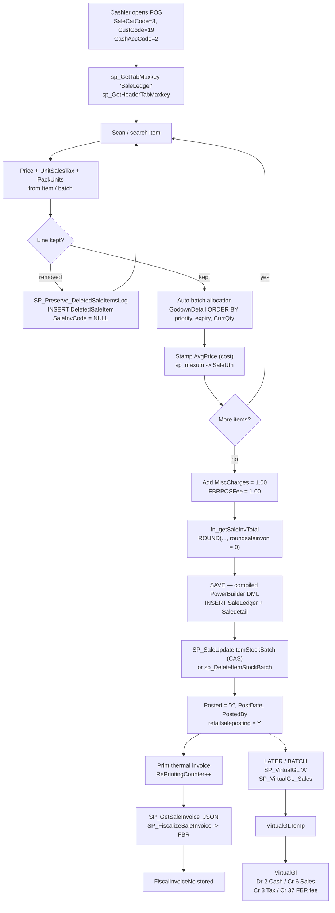
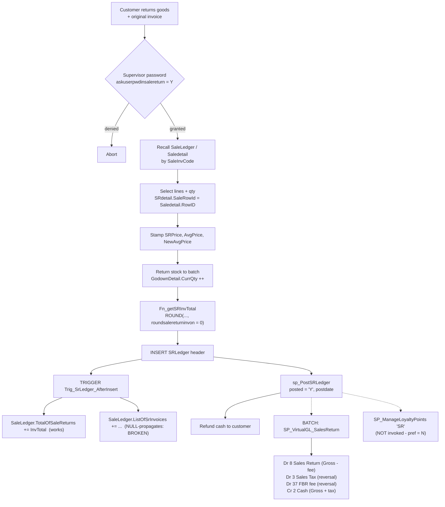
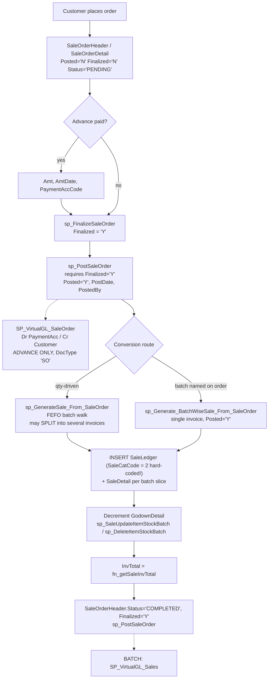

# 05a — End-to-End Business Workflows: SALES SIDE

**System:** WASEELA ABUZAR V3 (vendor "Abuzar"/"Waseela") — deployment **"Fazal Din PP19"**, a retail pharmacy
**Platform:** Compiled Sybase/SAP PowerBuilder 12.5 32-bit desktop client (`abuzar.exe` + 122 `.pbd`) over Microsoft SQL Server 2019 Express (`FazalDinPP19DataBaseV2`, compat level 100)
**Analysis stage:** Stage 5 — Business-process reconstruction (sales domain)
**Analysis date:** 2026-08-01
**Author:** Automated deep-analysis agent (evidence-driven, read-only)

> **THERE IS NO APPLICATION SOURCE CODE.** No `.pbl` / `.srw` / `.sru` / `.srd` / `.pbt` files exist anywhere in the delivery. The authoritative surviving description of business logic is therefore the SQL Server programmable objects (643 procedures, 74 functions, 34 views, 10 triggers), the physical schema, and the 19 months of production data actually written by the application. Everything below is derived from those three sources.

---

## Evidence sources used

| # | Source | What was taken from it |
|---|--------|------------------------|
| E1 | `.../scratchpad/db_modules_full.sql` (2.48 MB, all 762 programmable objects, full source) | Verbatim procedure / function / trigger logic. Cited as `object → statement`. |
| E2 | `.../scratchpad/table_columns.tsv` (11,414 columns) | Column names, types, nullability, defaults. |
| E3 | `.../scratchpad/table_rowcounts.tsv` (762 tables) | Used-vs-dormant determination (snapshot, a few hours stale vs live DB). |
| E4 | `.../scratchpad/primary_keys.tsv`, `foreign_keys.tsv` | Key structure and referential links. |
| E5 | **Live database, read-only SELECT queries**, `localhost\SQLEXPRESS` → `FazalDinPP19DataBaseV2`, executed 2026-08-01 | Real distributions, lookup contents, GL reconciliation, defect confirmation. All figures marked "live query". |
| E6 | `E:/Pharma Software/extracted_scripts.sql` | Supplementary DDL/defaults. |
| E7 | `dbo.SoftwarePreferences` (live) | The 300+ runtime switches that decide which code paths execute at this site. |

**Live-vs-snapshot note:** the TSV snapshot and the live DB differ slightly because the pharmacy is still trading. `SaleLedger` 291,334 (TSV) → **291,361** (live); `SRLedger` 30,695 → **30,704**; `DeletedSaleItem` 235,887 → **236,148**. Live figures are used throughout and are labelled as such.

---

## Evidence-label legend (applies to every finding in this document)

| Label | Meaning |
|-------|---------|
| **Verified** | Read directly in procedure/function/trigger source, in the schema, or measured in live data. Non-negotiable fact. |
| **Strongly Inferred** | Multiple converging pieces of evidence, but the decisive step happens inside the compiled binary and cannot be read. |
| **Unclear** | Evidence is ambiguous or contradictory. Flagged, not guessed. |
| **Missing** | The capability is referenced but no implementation exists. |
| **Deprecated** | Present but superseded / commented out / unreachable. |
| **Broken/Incomplete** | Implementation exists and is demonstrably defective. |
| **Recommended** | A proposal for the **NEW** Node/React/MySQL system. **Never an existing feature.** |

> **Rule observed throughout:** no accounting rule is stated unless the debit/credit was traced in actual SQL. Anything uncertain is listed in *"Requires accountant validation"* (§15).

---

## 1. Executive summary — what the sales side of this business actually is

**Verified.** Despite shipping ~15 sale categories, sale orders, quotations, proforma sales, loyalty cards, promotions, discount policies, cashier shifts, bill summaries, refused-sale capture and multi-warehouse batch allocation, **this deployment runs exactly two sales workflows**:

1. **Over-the-counter retail cash sale** (`SaleCatCode = 3`, "Retail Sale") — 291,361 invoices.
2. **Over-the-counter retail cash return** (`SRCatCode = 8`, "Retail S/R") — 30,704 credit notes.

Everything else in the sales domain is **dormant at this site** (zero rows) — but is *present in the product*, which matters when scoping the rebuild.

*Evidence (live query):*
```sql
SELECT SaleCatCode, COUNT(*) FROM SaleLedger GROUP BY SaleCatCode;  -- 3 → 291,361  (only row)
SELECT SRCatCode,  COUNT(*) FROM SRLedger  GROUP BY SRCatCode;      -- 8 → 30,704   (only row)
SELECT Posted, Deleted, ImpactInventory, AccountFor, COUNT(*) FROM SaleLedger GROUP BY ...;
--   Y | N | Y | Y | 291,361   (single group — every invoice posted, none deleted, all hit stock & GL)
```

**Trading window:** 2025-01-01 17:12 → 2026-07-31 18:41 (19 months). **Turnover:** PKR 234,003,081 gross invoiced; PKR 19,691,239 returned (8.4 %).

**Headline structural facts:**

| Fact | Label | Evidence |
|------|-------|----------|
| Every sale is a **cash retail sale to a single walk-in customer account** (`CustCode = 19`); there is no working credit-customer ledger | Verified | `Customer` = 2 rows; `SaleLedger.CustCode` distribution; `allowcustomerincashsale = N` |
| **The POS "save invoice" write path lives inside the compiled `.pbd`, not in SQL.** No stored procedure inserts an interactive sale | Verified | Every `INSERT INTO SaleLedger` in E1 belongs to a *generator* (from sale order / template / quotation / import / buffer copy), never to the POS screen |
| Inventory system is **Periodic** (`inventorysystemused = P`), so **no COGS and no Inventory GL entries are ever produced for a sale** | Verified | `SP_VirtualGL` CGS branch is gated `WHERE @InvSys <> 'P'`; live GL contains **zero** postings to AccCode 7 (Inventory) or 9 (COGS) for `DocumentType IN ('SV','SR')` |
| Cost **is** captured per line (`Saledetail.AvgPrice`, non-zero on 620,617 of 620,619 lines) — margin is computable from data even though it never reaches the ledger | Verified | live query |
| A flat **PKR 1.00 FBR POS service fee** is added to every single invoice as `MiscCharges` and credited to a dedicated account | Verified | `MiscCharges = 1.00` on all 291,361 rows; GL AccCode 37 credit total = 291,361.00 |
| **99.85 % of invoices are fiscalized** with Pakistan FBR (real service, not test) | Verified | `Fiscalized='Y'` on 290,922 / 291,361; `UseFBRTestService = N`; `FBRPOSID = 141973` |
| A **235k-row cashier keystroke audit trail** (`DeletedSaleItem`) silently records every line a cashier removed — including lines removed *before* the invoice was ever saved | Verified | see §11 |
| Loyalty, promotions, discount policies, sale orders, quotations, cashier shifts, bill summaries and refused-sale capture are **shipped but unused here** | Verified | all zero rows (live) |

---

## 2. Sales domain object map

### 2.1 Live (in-use) objects

| Table | Live rows | Role |
|-------|-----------|------|
| `SaleLedger` | **291,361** | Sale invoice header. 143 columns. |
| `Saledetail` | **620,619** | Sale invoice line (batch-level, inventory-impacting). Avg **2.13 lines/invoice**. |
| `SRLedger` | **30,704** | Sale-return (credit note) header. |
| `SRdetail` | **44,579** | Sale-return line. |
| `DeletedSaleItem` | **236,148** | Cashier line-deletion audit. |
| `SaleCategory` | 15 | Lookup (seed). |
| `SaleType` | 2 | Lookup (seed). |
| `SaleRefusalReason` | 2 | Lookup (seed) — feature itself unused. |
| `SaleTemplateHeader` / `SaleTemplateDetail` | 93 / 320 | Reusable "basket" templates — **in use**. |
| `VirtualGl` | 1,015,581 total; **908,617 `SV` + 93,050 `SR`** | Derived double-entry GL (rebuildable). |

### 2.2 Dormant here (0 rows) but present in the product

`SaleOrderHeader`, `SaleOrderDetail`, `QuotationHeader`, `QuotationDetail`, `SaleInvDetail`, `AdvSaleLedger`, `AdvSaleDetail`, `SaleReceivableAdj`, `SRAllocationHeader`, `SRAllocationDetail`, `SBuffer`, `SBufferDetail`, `SRBufferLedger`, `BillSummary`, `BillSummaryDetail`, `RefusedSaleHeader`, `RefusedSaleDetail`, `LoyaltyCard`, `LoyaltyCardLedger`, `LoyaltyPolicy`, `LoyaltyPolicyDetail`, `LoyaltyRedemption`, `LoyaltyPointAdjustment`, `SalesDiscountPolicy`, `DiscountPolicy`, `DiscountPolicyDetail`, `SalePromotion`, `CashierShift`, `CashierShiftCashCount`, `CashierShiftUsers`, `CashierWindow`, `MasterCashWin`, `CashierActivity`, `CashierJob`, `PostedInvoiceEditingLog`, `SaleLedgerLog`, `SaledetailLog`, `SaleLedgerModified`, `SaleDetailModified`, `PreSaleHeader`, `PreSaleDetail`, `ReceiptHeader`, `ReceiptDetail`.

> **Reminder (evidence rule 5):** an empty table proves **non-use at Fazal Din PP19**. It does **not** prove the feature is absent from the product.

### 2.3 Reference data actually present

**`SaleCategory` (Verified — live query):**

| Code | Name | Used here? |
|------|------|-----------|
| 1 | Cash Whole Sale | no |
| 2 | Credit Whole Sale | no |
| **3** | **Retail Sale** | **YES — 291,361** |
| 4 | Commissioned Sale | no |
| 5 | Clinic Sale | no |
| 6 | Cash Whole S/R | no |
| 7 | Credit Whole S/R | no |
| **8** | **Retail S/R** | **YES — 30,704** |
| 9 | Commissioned S/R | no |
| 10–15 | Service sale / service return variants | no |

**`SaleType` (Verified):** `1 = DEFAULT` (all 291,361 invoices), `2 = SYSTEM` (used by generator procs, never persisted here).

**Chart-of-accounts anchors used by sales (Verified — `Global` → `Accounts`, live query):**

| `Global.Name` | AccCode | Account name |
|---------------|---------|--------------|
| `GT_CashACC` | 2 | CASH FROM SALE (DEFAULT) |
| `GT_SalesACC` | 6 | SALES ACCOUNT |
| `GT_SalesReturnACC` | 8 | SALES RETURN ACCOUNT |
| `GT_AdvanceSalesTaxACC` | 3 | SALES TAX RECEIVEABLES ACCOUNT |
| `GT_FBRPOSFeeAcc` | 37 | (FBR POS service fee) |
| `GT_AdvIncomeTaxSale` | 36 | (advance income tax on sale — unused, pref `= N`) |
| `GT_InventoryAcc` | 7 | INVENTORY ACCOUNT — **never posted by sales** (periodic) |
| `GT_CostOfGoodsSoldAcc` | 9 | COST OF GOODS SOLD ACCOUNT — **never posted by sales** (periodic) |

### 2.4 Operators and terminals (Verified — live query)

| UserCode | UserName | Invoices raised |
|----------|----------|-----------------|
| 4 | ZUBAIR ARIF | 104,446 |
| 7 | HAMID ALI | 65,757 |
| 8 | ALI | 57,148 |
| 9 | FARYAD | 33,247 |
| 2 | RAEES KHAN | 12,509 |
| 6 | HAMMAD | 7,579 |
| 3 | DR SAIRA | 6,228 |
| 5 | SHAZIB | 3,578 |
| 1 | ADMIN | 869 |

Seven POS terminals appear in `DeletedSaleItem.MachineName`: `FDPP1-PC` (99,611 deletions), `FNS-PC` (56,274), `FNS1-PC` (43,767), `FNS2-PC` (22,717), `WIN-4MB7DTJ8638` (6,918), `FNS3-PC` (3,735), `FAZALDINPP19` (3,126).

---

## 3. The preference layer — what actually switches these workflows on/off

**Verified.** Every significant branch in the sales code reads `dbo.SoftwarePreferences` through `dbo.Fn_GetPreference(name)` / `dbo.Fn_Get_Int_Preference(name)`.
*Evidence: `dbo.Fn_GetPreference` → `SELECT PrefValue FROM DBO.SoftwarePreferences WHERE LOWER(Name) = LOWER(@prefname)`.*

Decisive settings at this site (live query on `SoftwarePreferences`):

| Preference | Value | Consequence — **Verified** |
|------------|-------|-----------------------------|
| `inventorysystemused` | `P` (Periodic) | **Kills all COGS / Inventory GL legs.** Gross margin never enters the ledger. |
| `retailsaleposting` | `Y` | Retail sales are posted (not left draft). |
| `cashsaleautopostingtime` / `creditsaleautopostingtime` | `10` | Auto-post timer (client-side). |
| `roundsaleinvon` | `0` | Invoice totals rounded to **whole rupees** (`ROUND(x, 0)`). |
| `roundsalereturninvon` | `0` | Same for credit notes. |
| `savebalanceonsaleposting` | `N` | `SP_OPENINGBALANCE` branch of `SP_PostSaleLedger` is skipped; `Balance` forced to 0. |
| `applyloyaltypolicyonsaleposting` | `N` | `SP_ManageLoyaltyPoints` is **never called** on posting. |
| `ApplySaleInvoiceDiscountPolicyOnSaving` | `N` | `SP_Apply_SaleAmt_Based_DiscountPolicy` returns 0 immediately. |
| `ApplyAdvanceIncomeTaxInSale` | `N` | Advance income tax leg suppressed (`AdvanceTaxAmt` = 0 everywhere). |
| `Auto_Apply_FBR_POS_Fee_InSale` | `Y` | PKR 1 fee auto-applied. |
| `Amount_For_FBR_POS_Fee_InSale` | `1.00` | The fee amount. |
| `FBRPOSID` | `141973` | Registered FBR POS identifier. |
| `UseFBRTestService` | `N` | **Production** FBR endpoint (`FBRInvoiceServiceURL`). |
| `PreserveDeletedSaleItemsLog` | `Y` | `DeletedSaleItem` capture is ON (explains 236k rows). |
| `allow_empty_saleinvcode_in_sr` | `Y` | Credit notes may be raised without an original invoice. |
| `askuserpwdinsalereturn` | `Y` | Password challenge before a return. |
| `CashierShift` | `N` | Cashier-shift module disabled. |
| `CashierWindowOnPOS` | `Y` | Cashier window UI shown, but `CashierWindow` table is empty. |
| `BatchAllocation_InSale` | `A` | Automatic batch allocation. |
| `saleaccountfor` / `salereturnaccountfor` | `Y` | Sales/returns reach the GL. |
| `AutoFiscalizeOnPosting` | *(absent → `N`)* | The auto-fiscalize call inside `SP_PostSaleLedger` **is commented out anyway** (see §6.4). |
| `allowsalebelowrpp`, `AllowSaleAboveRetailPriceInSale`, `allowsalepricegreaterthanavgprice`, `saleonzeroprice=N` | permissive | Price guard-rails are almost all **off**. |

---

## 4. WORKFLOW 1 — Cash / POS retail sale (**the only live sales workflow**)

### 4.1 Actor & screen

| Aspect | Detail | Label |
|--------|--------|-------|
| **Actor** | Counter pharmacist / cashier (one of 9 `Users`), authenticated at app launch | Verified |
| **Screen** | Cash-Sale POS window in the compiled client. Behaviour driven by `cashsaledefaultfocussetting = detailwindow`, `cashsaledetailwindowformat = 1`, `salethermalprintformat = 12`, `SaleInvFormat = 'FZ'` | Strongly Inferred (preference names are unambiguous; the window itself is in the binary) |
| **Customer** | Always the single walk-in account `CustCode = 19`. `allowcustomerincashsale = N`, `defaultcustomerincashsale = -1` | Verified |

### 4.2 Step-by-step sequence

| # | Step | Where it executes | Data created/updated | Label |
|---|------|-------------------|----------------------|-------|
| 1 | Cashier opens POS; header defaults applied (`defaultheaderonretailsale = 1`, `SaleCatCode = 3`, `SaleTypeCode = 1`, `CashAccCode = 2`) | Client | in-memory DataWindow | Strongly Inferred |
| 2 | New invoice number reserved: `sp_GetTabMaxkey 'SaleLedger'` and `sp_GetHeaderTabMaxkey @HeaderNo, @Module` | SQL | `_TabMaxKey`, `_HeaderTabMaxKey` | Verified (both procs exist and are used by every generator; live `_TabMaxKey.SaleLedger = 880233` exactly equals `MAX(SaleInvCode)`) |
| 3 | Item scanned/searched. Price, `UnitSalesTax`, `GSTPerc`, `PackUnits`, `DiscPerc`, `ItemFlatDisc` pulled from `Item` / batch | Client + SQL helpers (`sp_GetItemAvgPriceForSale`, `SP_GetDiscountPolicyBased_ItemDiscount`) | in-memory line | Strongly Inferred |
| 4 | Batch chosen automatically (`BatchAllocation_InSale = A`) — FEFO-style from `GodownDetail ORDER BY priority, expiry, CurrQty` | Client (mirrors the SQL generators) | in-memory | Strongly Inferred — *the exact cursor is visible in `sp_GenerateSale_From_SaleOrder`; the POS uses the same store* |
| 5 | **Cashier removes a line** → `SP_Preserve_DeletedSaleItemsLog` fires with `@SaleInvCode = NULL` | SQL | `DeletedSaleItem` (+1 row) | **Verified** |
| 6 | Line-level cost snapshot `AvgPrice` stamped from `sp_GetItemAvgPrice` | Client/SQL | `Saledetail.AvgPrice` | Verified (non-zero on 620,617/620,619 lines) |
| 7 | `MiscCharges = 1.00` (FBR POS fee) auto-added; `FBRPOSFee = 1.00` | Client (`Auto_Apply_FBR_POS_Fee_InSale = Y`) | `SaleLedger.MiscCharges`, `.FBRPOSFee` | **Verified** — 1.00 on 100 % of rows |
| 8 | Total computed and rounded to whole rupees | `dbo.fn_getSaleInvTotal` | `SaleLedger.InvTotal` | Verified |
| 9 | **SAVE** — header + lines written, stock decremented, `Posted='Y'` | **Compiled client (embedded DML)** | `SaleLedger`, `Saledetail`, `GodownDetail`, `StockReport` | **Strongly Inferred** — no proc performs this; see §4.5 |
| 10 | Thermal invoice printed; `RePrintingCounter` incremented on each reprint | Client | `SaleLedger.RePrintingCounter` | Verified — >0 on 290,160 invoices |
| 11 | FBR fiscalization: JSON built, POSTed to the FBR gateway, fiscal number stored | `SP_GetSaleInvoice_JSON` → `SP_FiscalizeSaleInvoice` → `SP_RequestHttpWebService` | `SaleLedger.Fiscalized`, `.FiscalizedOn`, `.FiscalInvoiceNo` | Verified — 290,922 fiscalized |
| 12 | GL derivation (deferred, batch) | `SP_VirtualGL 'A'` → `SP_VirtualGL_Sales` | `VirtualGLTemp` → `VirtualGl` | Verified |

### 4.3 Invoice total formula (**Verified — quote from `dbo.fn_getSaleInvTotal`**)

```sql
SET @RoundUpYo = dbo.Fn_Get_Int_Preference('roundsaleinvon')     -- = 0 here
-- goods component
Round( Sum( Round( (SD.looseqty * (SD.saleprice - SD.itemflatdisc))
                   * (1 - SD.discperc/100) * (1 - SL.discperc/100), 2) )
       - flatdisc + misccharges , @RoundUpYo)
+
-- tax component
Round( Sum( Round( (SD.looseqty + SD.bonusqty) * SD.unitsalestax
                   + Round( Round(SD.looseqty*(SD.saleprice-SD.itemflatdisc)*(1-SD.discperc*0.01),2)
                            * SD.gstperc * 0.01, 2), 2) )
       + ( Round(Sum(...),2) * SL.invgstperc1 * 0.01 ) , @RoundUpYo)
```

Precedence, **Verified**: line flat discount → line % discount → invoice % discount → minus invoice flat discount → plus misc charges → **then** tax (per-unit `UnitSalesTax` + line `GSTPerc` + invoice `InvGSTPerc1`) → rounded to 0 dp.

**Fallback branch (Verified):** if no `Saledetail` rows exist the identical formula is re-run against `SaleInvDetail`. `SaleInvDetail` is the *non-inventory* line table used when `ImpactInventory = 'N'`. It is empty here (all invoices impact inventory).
*Evidence: `SP_CopySBufferToSales` routes lines to `SaleDetail` when `ImpactInventory='Y'` and to `SaleInvDetail` when `='N'`.*

**Tax-only helper:** `dbo.fn_getTaxOnSaleInv` returns just the tax component; it feeds the FBR JSON (§7).

### 4.4 What the data says about how this formula is actually exercised

| Measure | Value (live) | Reading |
|---------|--------------|---------|
| `Saledetail` lines with `DiscPerc > 0` | 1,834 / 620,619 (**0.30 %**) | line discounts effectively unused |
| `Saledetail` lines with `ItemFlatDisc > 0` | **0** | never used |
| `Saledetail` lines with `GSTPerc > 0` | **0** | percentage-GST mechanism never used |
| `Saledetail` lines with `UnitSalesTax > 0` | 41,814 (6.7 %) | **tax is per-unit fixed amount only** |
| `Saledetail` lines with `BonusQty > 0` | **0** | no bonus/free-goods on sale |
| `SaleLedger` with `DiscPerc > 0` | 592 / 291,361 | invoice discount is exceptional |
| `SaleLedger` with `FlatDisc > 0` | 8 | negligible |
| `SaleLedger` with `InvGSTPerc1 > 0` | **0** | invoice-level GST never used |
| `SaleLedger` with `MiscCharges <> 0` | **291,361 (100 %)**, all `= 1.00` | the FBR fee |
| Invoices carrying sales tax | 34,534 (11.85 %) | matches 41,814 taxed lines |

> **Modernization signal:** the pricing engine that must be rebuilt is far simpler than the schema suggests — *unit price × qty, occasional line %, plus a fixed per-unit sales tax on ~12 % of invoices, plus a PKR 1 statutory fee, rounded to whole rupees.*

### 4.5 The critical structural gap — the POS write path is **not** in SQL

**Verified.** Exhaustive search of E1 for `INSERT INTO SaleLedger` / `INSERT INTO SaleDetail` returns only these owners:

| Proc | Purpose | Live rows produced here |
|------|---------|-------------------------|
| `sp_CopyInvoicesToSaleDump` | archival copy | 0 |
| `SP_CopySBufferToSales` | offline/branch buffer import | 0 (`SBuffer` empty) |
| `sp_GenerateSale_From_SaleOrder`, `sp_Generate_BatchWiseSale_From_SaleOrder` | order → invoice | 0 |
| `SP_Generate_Proforamsales_For_ServiceOrder` | service order → proforma | 0 |
| `sp_Generate_Sale_From_PendingQuotations`, `BulkSalesFromPendingQuotations` | quotation → invoice | 0 |
| `sp_GenerateAutoSale`, `sp_GenerateMarkedSaleFromTemplate` | template-driven synthetic sale | 0 |
| `sp_GenerateSale_From_PreSales` | pre-sale → invoice | 0 |
| `sp_Post_SaleReturn_BillSummary` | bill-summary return | 0 |
| `SP_TransferSaleInvoices`, `sp_Translate_ChildeServer_Sale`, `sp_ImportSales` | branch replication / import | 0 |

**None of them produced the 291,361 live invoices.** Therefore the interactive POS commit — line insert, header insert, `GodownDetail` decrement, `Posted='Y'`, `StockReport` snapshot — is executed by **PowerBuilder DataWindow update logic inside the compiled binary**.

**Risk (Critical):** the single most business-critical transaction in the system has **no readable specification**. It must be re-derived from (a) the analogous SQL generators, (b) data invariants, (c) black-box observation of the running app.

**Recommended (NEW system):** re-implement the POS commit as one explicit server-side transaction (reserve number → insert header → insert lines → FEFO-allocate & decrement batches → compute total → post → fiscalize), so it is testable and auditable — the opposite of today's arrangement.

### 4.6 Inventory impact

**Verified** (from the SQL generators, which the POS demonstrably mirrors):

```sql
-- batch selection, sp_GenerateSale_From_SaleOrder
DECLARE ItemBatch_Cursor CURSOR ... FOR
  SELECT batch, expiry, CurrQty FROM godowndetail
  WHERE gcode = @gcode AND icode = @icode
  ORDER BY priority, expiry, CurrQty     -- priority, then FEFO, then smallest lot
```
```sql
-- decrement with optimistic concurrency, SP_SaleUpdateItemStockBatch
UPDATE GodownDetail SET CurrQty = @NewQty
WHERE GCode=@GCode AND ICode=@ICode AND Batch=@Batch AND Expiry=@Expiry
  AND CurrQty = @OldQty          -- <= compare-and-swap
IF @@RowCount = 0 OR @@Error <> 0
   RAISERROR('Not enough stock available for the item (%s) in batch no. (%s) with expiry (%s)', 16, 1, ...)
```

- A line quantity spanning several batches is split into **multiple `Saledetail` rows sharing one `RowGroup`** (Verified — `RowGroup` incremented once per requested item, each batch slice inserted separately).
- When a batch reaches zero, `sp_DeleteItemStockBatch` removes the `GodownDetail` row instead of leaving a zero.
- `Saledetail.balancestock` stores the running item-total stock **after** the line — a denormalized snapshot for the printed invoice.
- `sp_maxutn 1, @saleutn OUTPUT` stamps a global unique transaction number per stock movement (`Saledetail.SaleUtn`).
- Single warehouse: `Godown` = 1 row, so `GCode` is effectively constant.

**Failure modes:**

| Mode | Behaviour | Label |
|------|-----------|-------|
| Concurrent sale of the last units of a batch | `SP_SaleUpdateItemStockBatch` compare-and-swap fails → `RAISERROR` severity 16 → the *calling* proc sets `@continue = -1` | Verified |
| **No `BEGIN TRANSACTION` in `sp_GenerateSale_From_SaleOrder`** | On mid-loop failure the header and the already-inserted lines **remain**, and stock already decremented **stays decremented** | **Verified — Broken/Incomplete** |
| Item stock insufficient | `RAISERROR('Not enough stock for item (%s) ...')` and abort | Verified |
| `@rate / @packunits` when `PackUnits` = 0 | guarded (`IF @packunits = 0 OR NULL SET @packunits = 1`) | Verified |

### 4.7 Accounting impact — see §6 (deferred, batch-derived)

### 4.8 Main sale flow (Mermaid)



---

## 5. WORKFLOW 2 — Credit sale (**dormant here; present in product**)

**Verified.** Credit sale = `SaleCatCode ∈ (1, 2)`. Zero rows at this site.

Differences from cash sale, read from `SP_PostSaleLedger` and `SP_VirtualGL_Sales`:

| Aspect | Cash (`SaleCatCode` 1 or 3) | Credit (`SaleCatCode` 2) |
|--------|------------------------------|---------------------------|
| GL debit account | `S.CashAccCode` | `S.custcode` (customer becomes a receivable) |
| `AlternateAccCode` | `S.custcode` (statistical customer tag on the cash line) | `NULL` |
| Remarks | `'Cash receipt on sale #: '` | `'Receivable on cr. sale #: '` |
| Part payment at invoice time | n/a | `S.Amt` posted as a second Dr/Cr pair via `DrAmtAccCode`/`CrAmtAccCode` (`VRow` 3/4) |
| Opening balance snapshot | skipped | `EXECUTE SP_OPENINGBALANCE @custcode, @dt, @balance OUTPUT` when `SaveBalanceOnSalePosting = 'Y'` |
| `UnReceivedBalance` | set to `InvTotal` on posting | set to `InvTotal` on posting |

*Evidence: `SP_VirtualGL_Sales` →*
```sql
dr_acccode = CASE S.saleCatCode WHEN 1 THEN S.CashAccCode
                                WHEN 3 THEN S.CashAccCode
                                ELSE S.custcode END,
cr_acccode = @ln_salesacc,
AlternateAccCode = CASE S.saleCatCode WHEN 1 THEN S.custcode
                                      WHEN 3 THEN S.custcode ELSE Null END
```

**Implication (Verified):** because `AlternateAccCode` is only populated for cash sales, **customer-level analysis of cash sales is possible even though the debit hits the cash account** — the GL keeps a statistical pointer back to the customer. `SP_VirtualGL` only retains it when the debit account is inside the cash sub-group (`GT_CashSub`).

---

## 6. WORKFLOW 3 — Sale invoice posting and GL derivation

### 6.1 Two posting entry points

| Proc | Selection key | Notes |
|------|---------------|-------|
| `SP_PostSaleLedger` | invoice-code range + `SaleCatCode` + `CustCode` + `ImpactInventory` | The general posting engine. Handles `SaleCatCode = 3` (bulk) and `IN (1,2)` (per-invoice loop). |
| `SP_PostSaleLedgerHeaderWise` | `HeaderInvNo` range + `HeaderNo` | Posting by document-series ("header") rather than by global invoice code. |
| `sp_PostPointOfSaleLedger` | range + `CustCode`, `SaleCatCode IN (1,2,3)` | Leaner POS variant — **does not** set `UnReceivedBalance`/`Balance`, **does not** filter `Deleted='N'` or `AdmissionCode IS NULL`, **does not** call `SP_UpdateItemMeter`. |

### 6.2 What posting does (**Verified — `SP_PostSaleLedger`**)

```sql
Update SaleLedger
Set    posted   = 'Y',
       postdate = GetDate(),
       postedby = @ai_SalesmanCode,
       UnReceivedBalance = SaleLedger.InvTotal,
       Balance = 0                      -- or @balance when SaveBalanceOnSalePosting='Y'
Where  SaleInvCode Between @ai_sInvCode AND @ai_lInvCode
  AND  SaleCatCode = 3
  AND  CustCode = @ai_custcode
  AND  Posted   = 'N'
  AND  Deleted  = 'N'
  AND  ImpactInventory = @ac_impactinventory
  AND  AdmissionCode IS NULL
```

Then, per posted invoice:

1. **Loyalty** — `IF @loyalty='Y' EXECUTE SP_ManageLoyaltyPoints 'SV', @SaleInvCode`. Here `applyloyaltypolicyonsaleposting = N`, so **never runs** (Verified).
2. **Fiscalization** — the `SP_FiscalizeSaleInvoice` call is **commented out** in the source (`/* ... */`). **Deprecated / Broken** — fiscalization must therefore be driven from the client (see §7).
3. **SMS** — `SP_CreateAutoTriggerSMS @ai_list, 1, 'Posting'`.
4. **Item meter** — `SP_UpdateItemMeter @ai_list`.

**Failure mode (Verified — Broken/Incomplete):** `@ai_list` is declared `VARCHAR(8000)` and never initialised (`SET @ai_list=''` exists in `SP_PostSaleLedger` but **is missing in `sp_PostPointOfSaleLedger` and `SP_PostSaleLedgerHeaderWise`**). `NULL + 'x'` = `NULL`, so in those two procs the accumulated list is always `NULL` and the downstream SMS call receives `NULL`. Also, at ~11 chars per code, the list **overflows past ~700 invoices** and is silently truncated.

### 6.3 GL derivation — the `VirtualGl` rebuild pipeline

**Verified.** The GL is *not* written at posting time. It is **rederived in bulk**:

```
SP_VirtualGL @ac_type
  ├─ TRUNCATE VirtualGLTemp
  ├─ if AutoPurgeVirtualGL='Y' → TRUNCATE VirtualGL, RETURN
  ├─ SP_VirtualGL_Purchase / _PurchaseReturn / _PurchaseServices     (@ac_type <> 'C')
  ├─ SP_VirtualGL_Sales / _SalesReturn / _Services / _SaleOrder      (@ac_type <> 'S')
  ├─ SP_VirtualGL_Receipt / _Issue / _Adjustment / _Guest / _Patient
  │  / _Vouchers / _Notes / _TransactionWindow / _Payroll / _Products / _CashierShift
  └─ INSERT INTO VirtualGL  ... 8-way UNION ALL over VirtualGLTemp ... (inside TRANSACTION T1)
```

`SP_VirtualGL_Sales` selects only invoices that are **not already in the GL**:
```sql
INSERT INTO #lsl
SELECT SaleInvCode FROM SaleLedger S
WHERE S.Posted = 'Y' AND S.AccountFor = 'Y'
  AND NOT EXISTS (SELECT DISTINCT DocumentCode FROM VirtualGL V
                  WHERE V.DocumentType = 'SV' AND V.DocumentCode = S.SaleInvCode)
```
→ **incremental and idempotent** (Verified).

### 6.4 The exact sale journal (**Verified — traced end-to-end and reconciled against live data**)

`SP_VirtualGL_Sales` populates `VirtualGLTemp` with a *paired* row; `SP_VirtualGL` then explodes it into `VirtualGl` legs.

Definitions inside `SP_VirtualGL_Sales` (with `UpdateAvgPriceWithNetRate = 'N'`, which is the case for 100 % of rows here):

```
Gross   = ROUND( Σ(looseqty*(saleprice-itemflatdisc)*(1-discperc/100)) * (1-S.discperc/100)
                 + S.misccharges + S.salestax - S.flatdisc , roundsaleinvon )
SaleTax = ROUND( Σ((looseqty+bonusqty)*unitsalestax)
                 + Σ(ROUND(looseqty*(saleprice-itemflatdisc)*(1-discperc/100)*gstperc/100, 2))
                 + ROUND((Σ(...)*(1-S.discperc/100) - S.flatdisc) * S.invgstperc1/100, 2) , roundsaleinvon )
CGS     = Σ((LooseQty + BonusQty) * AvgPrice)
```

Explosion rule in `SP_VirtualGL` — **note the asymmetry, this is the crux**:

```sql
Debit  = CASE WHEN dr_AccCode IN (Inventory, GoodsRcpt, GoodsIssue, Purchase, Sales,
                                  SalesReturn, PurchaseReturn, RevFromServices)
              THEN Gross - ISNULL(AdvIncomeTax,0) - ISNULL(FBRPosFee,0)
              ELSE ISNULL(Gross,0) + ISNULL(SaleTax,0) END      -- VRow 0
Credit = <same CASE on cr_AccCode>                               -- VRow 1
```

Resulting legs for one cash retail sale:

| VRow | Account | Dr | Cr | Amount | Label |
|------|---------|----|----|--------|-------|
| 0 | **2** CASH FROM SALE | ✔ | | `Gross + SaleTax` = `InvTotal` | Verified |
| 1 | **6** SALES ACCOUNT | | ✔ | `Gross − FBRPosFee` | Verified |
| 2 | **3** SALES TAX RECEIVEABLES | | ✔ | `SaleTax` (only when ≠ 0) | Verified |
| 2 | **37** FBR POS Fee | | ✔ | `FBRPosFee` = 1.00 | Verified |
| 2 | 36 Adv. Income Tax on Sale | | ✔ | 0 here (`ApplyAdvanceIncomeTaxInSale = N`) | Verified |
| 3 / 4 | `DrAmtAccCode` / `CrAmtAccCode` | ✔ | ✔ | `Amt` — credit sales only, 0 here | Verified |
| 0 | 9 COGS / 7 Inventory | — | — | **suppressed** (`WHERE @InvSys <> 'P'`) | Verified |

**Live GL reconciliation — exact to the rupee (Verified):**

| `VirtualGl` where `DocumentType='SV'` | Rows | Debit | Credit |
|---|---|---|---|
| AccCode 2 (Cash) | 291,361 | **234,003,081.00** | 0 |
| AccCode 6 (Sales) | 291,361 | 0 | 229,385,121.00 |
| AccCode 3 (Sales tax) | 34,534 | 0 | 4,326,599.00 |
| AccCode 37 (FBR fee) | 291,361 | 0 | 291,361.00 |
| **Total** | **908,617** | **234,003,081.00** | **234,003,081.00** |

`229,385,121 + 4,326,599 + 291,361 = 234,003,081` ✔ and `SUM(SaleLedger.InvTotal) = 234,003,081.00` ✔ — the GL, the invoice headers and the derived totals agree exactly.

Worked example (live, invoice 880233 — the most recent invoice):

| AccCode | Dr | Cr | VRow | Remarks |
|---|---|---|---|---|
| 2 | 420.00 | | 0 | `Cash receipt on sale #: 880233` |
| 6 | | 419.00 | 1 | `Revenue from cash sale #: 880233` |
| 37 | | 1.00 | 2 | `FBR POS Service Fee Accounted For` |

### 6.5 Consequences of the periodic-inventory choice

| Consequence | Label | Detail |
|---|---|---|
| **No cost of goods sold in the ledger** | Verified | AccCode 9 has zero `SV`/`SR` postings |
| **No inventory asset movement in the ledger** | Verified | AccCode 7 idem |
| Gross profit exists **only** as `Σ(Saledetail line net) − Σ(LooseQty × AvgPrice)`, computed in reports | Verified | `Saledetail.AvgPrice` populated on 620,617/620,619 lines |
| Balance sheet inventory relies on **periodic physical/stock-report valuation**, not on the transaction ledger | Strongly Inferred | `StockReport` (3.2 M rows) carries `AvgPrice numeric(15,5)` snapshots |

**Risk (High):** period-end financials depend on an out-of-ledger stock valuation. Any divergence between `GodownDetail` / `StockReport` and reality lands straight in profit with **no ledger control account to catch it**.

**Recommended (NEW system):** move to perpetual inventory with real COGS/Inventory postings per sale line, and keep a reconciling control account. The V3 code already contains that branch — it is only switched off by `inventorysystemused`.

### 6.6 Reversal / re-derivation

- Deleting `VirtualGl` rows for a document causes them to be **rebuilt on the next `SP_VirtualGL` run** — this is the sanctioned "repost" mechanism (Verified — `SP_Supervise_CashierActivity` does exactly `DELETE VirtualGl WHERE DocumentType='SV' AND DocumentCode=@DocCode`).
- `AutoPurgeVirtualGL = 'Y'` truncates the whole GL and returns — a **destructive kill-switch** (Verified). Currently not set.

**Risk (High):** the general ledger is a *cache*, not a book of record. Anyone with DB access can `TRUNCATE VirtualGl` (or flip one preference) and the ledger silently rebuilds from transaction tables — there is **no immutable journal**.

---

## 7. WORKFLOW 4 — FBR digital / fiscal invoicing (live and load-bearing)

**Verified.** Pakistan FBR POS integration is **actively used**: 290,922 of 291,361 invoices carry `Fiscalized='Y'` and a `FiscalInvoiceNo` (e.g. `141973260731175535958` — POS ID `141973` + timestamp + serial).

Sequence (Verified — `SP_FiscalizeSaleInvoice`):

1. Skip if already fiscalized: `IF ISNULL((SELECT MAX(Fiscalized) ...),'N') = 'Y' RETURN 0`.
2. Choose endpoint by `UseFBRTestService` (here `N` → `FBRInvoiceServiceURL = http://localhost:8524/api/IMSFiscal/GetInvoiceNumberByModel`, `POST`).
3. Build payload: `SP_GetSaleInvoice_JSON @SaleInvCode, @JSON OUTPUT`.
4. `SP_RequestHttpWebService @Url, @HttpMethod, @ParamsValues, @SoapAction` — an **HTTP call made from inside SQL Server**.
5. Parse response for `"Code":"100"` and `{"InvoiceNumber":"` by `CHARINDEX`/`SUBSTRING`; store `FiscalInvoiceNo`.

**JSON payload structure (Verified — `SP_GetSaleInvoice_JSON`):** header fields `InvoiceNumber, POSID, USIN (=SaleInvCode), DateTime, BuyerNTN, BuyerCNIC, BuyerName, BuyerPhoneNumber, TotalBillAmount, TotalQuantity, TotalSaleValue (=InvTotal − fn_getTaxOnSaleInv), TotalTaxCharged, Discount, FurtherTax, PaymentMode, RefUSIN, InvoiceType`; per item `ItemCode (Item.customICode), ItemName, Quantity, PCTCode, TaxRate, SaleValue, TotalAmount, TaxCharged, Discount`.

**Defects found — all Verified:**

| # | Defect | Severity |
|---|--------|----------|
| F1 | `@JSON VARCHAR(8000)`; the string is built by cursor concatenation with **no length check**. A long basket silently truncates → malformed JSON → FBR rejects | High |
| F2 | JSON is assembled by **string concatenation with no escaping**. Any `"` or `\` in `Item.Name` or customer name corrupts the payload | High |
| F3 | The item cursor joins `Item ⋈ PCT ⋈ SalesTaxSchedule` with **inner joins** — an item missing `PCTCode` or `SalesTaxScheduleCode` is **silently dropped from the fiscal invoice** while remaining on the customer's bill | **Critical** (tax under-declaration) |
| F4 | `"PaymentMode":"1"` and `"InvoiceType":"1"` are **hard-coded** | Medium |
| F5 | `SP_FiscalizeSaleInvoice` is **never called from posting** — the call inside `SP_PostSaleLedger` is commented out. Fiscalization must be triggered by the client, so a client-side failure leaves an unfiscalized invoice | High (439 unfiscalized invoices exist) |
| F6 | The response is parsed with fixed offsets (`SUBSTRING(@Response, 19, ...)`). Any change in FBR's response shape breaks it silently | Medium |
| F7 | Outbound HTTP from inside SQL Server (`SP_RequestHttpWebService`, which is why `xp_cmdshell`/OLE automation must stay enabled) | High (security) |

**Related but unused:** `SaleLedger` also carries a newer FBR **Digital Invoicing** column set — `Digitalized`, `DigitalizedOn`, `DigitalInvoiceNo`, `DigitalizedBy`, `ScenarioID`, `BuyerNTN`, `BuyerRegStatus` — plus seeded lookups `FBR_DI_DocType (2)`, `FBR_DI_Scenario (28)`, `FBR_DI_TransactionType (26)`, `FBR_DI_UOM (43)`, and `Saledetail.HSCode/UOM/TransType/RateOfTax/SROScheduleNo/sroItemSerialNo`. **`Digitalized='Y'` on 0 invoices** — the newer regime is **staged but not switched on** (Verified).

**Recommended (NEW system):** treat FBR integration as a first-class outbound service with a durable queue, retry, structured JSON serialisation, schema validation, and an explicit "unfiscalized invoice" exception report.

---

## 8. WORKFLOW 5 — Sale return / credit note (live)

### 8.1 Profile (live)

| Measure | Value |
|---|---|
| Credit notes | 30,704 (all `SRCatCode = 8` Retail S/R) |
| Lines | 44,579 (avg 1.45) |
| Referencing an original invoice | **30,703 (99.997 %)** |
| Without reference | 1 (permitted by `allow_empty_saleinvcode_in_sr = Y`) |
| Lines carrying `SaleRowId` back-pointer | 44,573 / 44,579 |
| Return value | PKR 19,691,239 = **8.4 %** of gross sales |
| Invoices with a return | 28,933 (9.9 %) |
| **Same-day returns** | **25,476 of 30,703 (83 %)** — dominant pattern is immediate correction/exchange at the counter |
| `NewAvgPrice` populated | 44,579 / 44,579 (cost re-derived on every return line) |

### 8.2 Sequence

| # | Step | Actor / object | Effect | Label |
|---|------|----------------|--------|-------|
| 1 | Customer presents goods + invoice | Cashier | — | — |
| 2 | **Supervisor password challenge** (`askuserpwdinsalereturn = Y`) | Client | — | Verified (preference) |
| 3 | Original invoice recalled; lines selected | Client | `SRdetail.SaleRowId` ← `Saledetail.RowID` | Verified (99.99 % populated) |
| 4 | Return quantities/prices captured; `SRPrice`, `SalePrice`, `AvgPrice`, `NewAvgPrice` stamped | Client | `SRdetail` | Verified |
| 5 | Stock returned to the originating batch | Client | `GodownDetail.CurrQty` ↑ | **Strongly Inferred** — the credit-note commit is, like the sale, inside the binary |
| 6 | Total computed | `dbo.Fn_getSRInvTotal` | `SRLedger.InvTotal` | Verified |
| 7 | Header inserted → **trigger fires** | `Trig_SrLedger_AfterInsert_UpdateTotalOfSaleReturnsInSaleLedger` | `SaleLedger.TotalOfSaleReturns` ↑, `ListOfSrInvoices` append | Verified (see defect below) |
| 8 | Posting | `sp_PostSRLedger @ai_srInvCode` → `posted='Y'`, `postdate` | `SRLedger` | Verified |
| 9 | Cash refunded | Client | GL leg (§8.4) | Verified |
| 10 | GL derivation | `SP_VirtualGL_SalesReturn` | `VirtualGl` | Verified |
| 11 | Loyalty reversal (`SP_ManageLoyaltyPoints 'SR'`) | — | **not invoked here** | Verified |

### 8.3 The return-total formula (**Verified — `dbo.Fn_getSRInvTotal`**)

```sql
ROUND( Σ((looseqty * srprice) * (1 - discperc/100)) * (1 - srledger.discperc/100)
       + misccharges + salestax - flatdisc , roundsalereturninvon )
+ ROUND( Σ((looseqty + bonusqty) * unitsalestax)
       + Σ(ROUND((looseqty*srprice)*(1-discperc/100)*gstperc/100, 2))
       + ROUND((Σ(...)*(1-discperc/100) - flatdisc) * invgstperc1/100, 2), roundsalereturninvon )
```

Structurally identical to the sale formula, **except** it uses `SRPrice` and has **no `itemflatdisc` term** — a line-flat-discounted sale cannot be returned at the same net price by formula. Immaterial here (`ItemFlatDisc = 0` on every sale line) but a **real defect for any customer that uses flat discounts**. **Broken/Incomplete.**

Helper `dbo.Fn_getSRTotalValue_ReferencedSale(@saleinvcode)` = `SUM(SRLedger.InvTotal) WHERE SaleInvCode = @saleinvcode`.

### 8.4 Accounting impact (**Verified — `SP_VirtualGL_SalesReturn` + live reconciliation**)

```sql
dr_acccode = @ln_salesretacc,                       -- 8  SALES RETURN ACCOUNT
cr_acccode = CASE S.srCatCode WHEN 6 THEN S.CashAccCode
                              WHEN 8 THEN S.CashAccCode   -- cash refund
                              ELSE S.custcode END,        -- credit customer
AlternateAccCode = CASE S.srCatCode WHEN 6 THEN S.custcode
                                    WHEN 8 THEN S.custcode ELSE NULL END
```

| VRow | Account | Dr | Cr | Amount |
|---|---|---|---|---|
| 0 | **8** SALES RETURN | ✔ | | `Gross − FBRPosFee` |
| 1 | **2** CASH | | ✔ | `Gross + SaleTax` |
| 2 | **3** SALES TAX | ✔ | | `SaleTax` (reversal) |
| 2 | **37** FBR POS Fee | ✔ | | `FBRPosFee` (reversal) |

**Live reconciliation (Verified, exact):**

| AccCode | Rows | Debit | Credit |
|---|---|---|---|
| 8 Sales Return | 30,704 | 19,301,800.00 | 0 |
| 3 Sales tax | 2,703 | 360,500.00 | 0 |
| 37 FBR fee | 28,939 | 28,939.00 | 0 |
| 2 Cash | 30,704 | 0 | 19,691,239.00 |
| **Total** | **93,050** | **19,691,239.00** | **19,691,239.00** |

`19,301,800 + 360,500 + 28,939 = 19,691,239` ✔

Notes (Verified):
- Returns hit a **contra-revenue account (8)**, not `Sales` — gross sales are never reduced. Correct practice.
- `FetchFBRPosFeeForRefSR = Y` → the PKR 1 fee is refunded too, but only on 28,939 of 30,704 credit notes (the 1,765 difference are notes whose `FBRPosFee` was 0 — worth an accountant's eye).
- **`CGS` is computed** in `SP_VirtualGL_SalesReturn` — `ISNULL(SUM((looseqty+bonusqty) * CASE WHEN S.SaleInvCode > 0 THEN D.AvgPrice ELSE (D.SRPrice*(1-D.DiscPerc*0.01)*(1-S.DiscPerc*0.01)) END),0)` — but is discarded because `@InvSys = 'P'`. **Verified.** Note the fallback: an *unreferenced* return values stock at **net selling price**, not cost — a real over-valuation risk if unreferenced returns are ever used at volume.

### 8.5 Verified defect — the SR trigger is half-broken

```sql
CREATE TRIGGER dbo.Trig_SrLedger_AfterInsert_UpdateTotalOfSaleReturnsInSaleLedger
ON dbo.SrLedger AFTER INSERT AS
BEGIN
  Update SaleLedger
  Set SaleLedger.ListOfSrInvoices = SaleLedger.ListOfSrInvoices + '(' + CAST(Inserted.SrInvCode AS VarChar(25)) + ',' + CAST(Inserted.InvTotal AS VarChar(25)) + ') , ',
      SaleLedger.TotalOfSaleReturns = SaleLedger.TotalOfSaleReturns + Inserted.InvTotal
  From Inserted
  Where SaleLedger.SaleInvcode = Inserted.saleinvcode
END
```

| Aspect | Result | Label |
|---|---|---|
| Numeric accumulation `TotalOfSaleReturns` | **Correct.** Live check: `0` invoices where `ABS(SaleLedger.TotalOfSaleReturns − SUM(SRLedger.InvTotal)) > 0.01` | Verified |
| `ListOfSrInvoices` string | **NULL on all 28,933 invoices that have returns.** `ListOfSrInvoices` is nullable with no default; `NULL + 'text'` = `NULL`, so the audit string is silently destroyed on the first return and never recovers | **Verified — Broken/Incomplete** |
| Multi-row `INSERT` | `UPDATE ... FROM Inserted` applies **one arbitrary row** per matching target — a batched multi-row insert of credit notes against the same invoice would **lose** all but one | **Verified — Broken/Incomplete** (latent; the app inserts one at a time) |
| No matching `UPDATE`/`DELETE` trigger | Editing or deleting a credit note leaves `TotalOfSaleReturns` **stale** | **Verified — Missing** |

### 8.6 Sale-return flow (Mermaid)



### 8.7 Batch-wise return against a specific issue

`SP_BatchWiseSaleReturn_IssueBased` exists (E1) for returning stock traced to a specific issue/dispatch row (`SRdetail` ← `IssueRowID`). **Dormant here** — the issue module is unused at this site.

### 8.8 `SP_Change_SaleReturn` — reclassify a return

**Verified — and it is a trap:**
```sql
UPDATE SRBufferLedger SET CustCode=@custcode, SRCatCode=7 WHERE SRBufferInvCode=@srbufferinvcode
UPDATE SRLedger       SET CustCode=@custcode, SRCatCode=7 WHERE SRInvCode=@srbufferinvcode
```
It **hard-codes `SRCatCode = 7`** (Credit Whole S/R) and reassigns the customer, converting a cash refund into a credit-customer payable. It performs **no check that the return is unposted** and **does not delete the existing `VirtualGl` rows**, so if run on a posted return the GL keeps the *old* cash-refund entry forever (the GL rebuild skips documents already present). **Broken/Incomplete — High risk.** Dormant here (`SRBufferLedger` = 0 rows).

---

## 9. WORKFLOW 6 — Sale-return allocation against invoices (**dormant + defective**)

Purpose: net a credit note against one or more open sale invoices (a receivables function). Meaningless in a pure cash-retail model, hence 0 rows in `SRAllocationHeader`/`SRAllocationDetail`.

Chain (Verified): `SP_AllocateSaleReturn` → `SP_CheckUnpostedSaleInvInTransactions` → `SP_GetSRInvBalance` → `SP_GetSaleInvBalance` → `SP_UpdateSRInvBalance` → `SP_UpdateSaleInvBalance` → `SP_CreateSRAllocation` (writes `SRAllocationHeader` + `SRAllocationDetail`, UTN via `SP_MaxUtn 2`).

Allocation amount: `@amt = MIN(@Sale_Balance, @SR_Balance)`; both balances are then reduced by `@amt`. `OutstandingAmt` on both documents is the running balance (`SP_GetSaleInvBalance` reads `SaleLedger.OutstandingAmt WHERE Marked='N' AND Posted='Y' AND AccountFor='Y'`).

### 9.1 Verified defect — inverted guard makes the proc unusable

```sql
EXEC @retcode = SP_CheckUnpostedSaleInvInTransactions @SaleInvCode, @SRInvCode, 'SR', @unpostedtrans, @msg
...
IF @unpostedtrans <= 0
BEGIN
    RaisError(@msg ,16,1)        -- @msg is '' exactly when @unpostedtrans = 0
    RETURN -1
END
```

`SP_CheckUnpostedSaleInvInTransactions` returns the **count of blocking unposted documents** (post-dated cheques, GL vouchers, bill summaries, other SR allocations) and sets `@Msg = ''` when that count is zero. The guard therefore **aborts precisely when the invoice is clean** and proceeds when it is blocked — the polarity is reversed. The same inverted guard appears in the service-return twin (`SP_AllocateServiceSaleReturn`, E1 line ~6490).

**Label: Broken/Incomplete — High.** Corroborated by `SRAllocationHeader = 0` rows and `autosalereturnallocation = N`, `autopostsalereturnallocation = N`.

---

## 10. WORKFLOW 7 — Sale orders (**dormant here; fully implemented in product**)

`SaleOrderHeader` = 0, `SaleOrderDetail` = 0, `_TabMaxKey.SaleOrderHeader = 0` (Verified). `SaleOrderCompulsionInSales = N`.

### 10.1 Lifecycle (Verified from source)

| State | Column | Set by |
|---|---|---|
| Draft | `Finalized='N'`, `Posted='N'`, `Deleted='N'`, `Status='PENDING'` | insert |
| Finalized | `Finalized='Y'` | `sp_FinalizeSaleOrder` (also fires `SP_CreateAutoTriggerSMS @list, 12, 'Finalized'`) |
| Posted | `Posted='Y'`, `PostDate`, `PostedBy` | `sp_PostSaleOrder` — **requires `Finalized='Y'`** |
| Converted | `Status='COMPLETED'` | `sp_GenerateSale_From_SaleOrder` |

Locking: `sp_LockSaleOrderHeader @ai_SaleOrderCode` performs `SELECT COUNT(*) FROM saleOrderHeader WITH (UPDLOCK HOLDLOCK) WHERE saleordercode = @…` — a pessimistic row lock held to end-of-transaction. The line-level analogue for sales is `Fn_LockSaleDetailRow(@saleinvcode, @icode, @salerowid)` (`SELECT count(*) FROM SaleDetail WITH (UPDLOCK HOLDLOCK) …`).

**Concern (Verified):** these lock helpers are **only useful if the caller opened an explicit transaction**. `sp_LockSaleInvoice` and `sp_LockSaleOrderHeader` contain no `BEGIN TRAN`; the transaction must come from the PowerBuilder client. Whether it does is **Unclear** (binary).

### 10.2 Order → invoice conversion

Two generators:

**`sp_GenerateSale_From_SaleOrder`** — quantity-driven, auto-batch. Aggregates `SaleOrderDetail` by `(icode, gcode, saleitemdescription)`, then loops: reserve `SaleInvCode`, insert header from the order, walk `GodownDetail ORDER BY priority, expiry, CurrQty`, insert one `SaleDetail` slice per batch, decrement stock, and **spill into a second invoice** if a further pass is needed. Finally `InvTotal = dbo.fn_getSaleInvTotal(...)`, `SaleOrderHeader.Status='COMPLETED'`, `sp_PostSaleOrder`.

**`sp_Generate_BatchWiseSale_From_SaleOrder`** — the order already names `Batch`/`Expiry`; validates `@totalbatchqty >= @totalqty` per batch; single invoice; inserts with `Posted='Y'` immediately.

**Defects — Verified:**

| # | Defect | Evidence | Severity |
|---|---|---|---|
| O1 | `Set @custcode = 19` and `Set @salecatcode = 3` are assigned then **never used**; the `INSERT` hard-codes `SaleCatCode = 2` (Credit Whole Sale) and takes `CustCode` from the order | `sp_GenerateSale_From_SaleOrder` | High — a retail order becomes a *credit* invoice |
| O2 | `Update #saletemp Set satisfiedqty = @satisfiedqty + @givenqty **Where icode = @icode**` — no `gcode`/description predicate, so multiple lines of the same item are marked satisfied together | idem | High |
| O3 | `SaleTypeode=1` — misspelled alias; positional insert saves it, but it is a latent break if the column list ever changes | idem (twice) | Medium |
| O4 | **No transaction**: header + lines + stock decrements are not atomic | idem | **Critical** |
| O5 | `IF @givenqty <= 0 Set @givenqty = 1` — a zero/negative requirement is silently converted to 1 unit | idem | Medium |
| O6 | The `Finalized` pre-check is **commented out**, so an unfinalized order can be converted, contradicting `sp_PostSaleOrder`'s `Finalized='Y'` filter (the subsequent `sp_PostSaleOrder` then silently no-ops) | idem | Medium |
| O7 | `sp_Generate_BatchWiseSale_From_SaleOrder` never assigns `@HeaderInvCode`, inserting **NULL** `headerinvno` despite fetching `@headerinvno` from `sp_GetHeaderTabMaxkey` | `sp_Generate_BatchWiseSale_From_SaleOrder` | Medium |

### 10.3 Sale-order accounting

`SP_VirtualGL_SaleOrder` posts **only a customer advance**, and only if `Amt > 0 AND AmtDate IS NOT NULL`:
```
Dr S.PaymentAccCode / Cr S.custcode , Gross = S.Amt , DocumentType 'SO'
'Advance received on sale order #: n'
```
The order itself creates **no revenue and no inventory entry** (Verified — correct: an order is not a transaction).

### 10.4 Sale-order flow (Mermaid)



---

## 11. WORKFLOW 8 — Quotations (**dormant here**)

`QuotationHeader` / `QuotationDetail` = 0 rows. Related preferences: `allowdupquotinsale = N`, `FetchLatestSalePriceInQutation = N`, `popquotinsale_post_unpost_all = 1`.

Implemented capability set (Verified from E1):

| Proc | Function |
|---|---|
| `SP_InheritQuotation` | Deep-clone a quotation to a new customer: new code from `SP_GetTabMaxkey 'Quotation'`, copies header (`Posted='N'`, new date/remarks/customer) and all detail rows |
| `SP_Activate_DeActivate_Quotation` | Bulk `Active = Y/N` over a comma-list parsed by `udf_StringToTabl`. **Note: it begins with `DELETE ReportData` — an unrelated global side effect.** Verified |
| `sp_ConsolidateQuotation_as_SaleOrder` | Merge quotations into one sale order (`QuotationHeader.ConsolidatedSaleOrder`) |
| `sp_Generate_Sale_From_PendingQuotations`, `BulkSalesFromPendingQuotations` | Quotation → invoice |
| `SP_GenerateQuotations_From_DropBox`, `sp_Import_Quotation_From_DataCarryDB`, `sp_QuotationList_From_DataCarryDB` | Import channels |
| `fn_GetQuotationTotal` | Quotation valuation |

`QuotationHeader` carries `ValidateUpTo`, `ValidityDays`, `DeliveryDays`, `PaymentTo`, `Locked`, `Active`, `AutoInsertNewItems`, and nine free-text `Remarks` slots — a wholesale/tender feature set with no place in retail pharmacy.

`SaleLedger.QuotationNo` and `Saledetail.QuotationCode` are the traceability columns from an invoice back to its quotation (both NULL throughout here).

---

## 12. WORKFLOW 9 — Proforma / advance sales, pre-sales, templates, recurring

| Feature | Objects | Status here | Notes |
|---|---|---|---|
| **Advance sale** | `AdvSaleLedger`, `AdvSaleDetail`, `SP_PostAdvSaleLedger`, `SP_DeleteAdvSaleLedger`, `SP_LockAdvSaleInvoice`, `AssocAdvSaleInvList`, `Fn_getSaleInvTotal_with_AssocSaleInv` | **Dormant** (0 rows) | Bill-in-advance / deliver-later. `SaleLedger.AlterSaleInvCode` links the two |
| **Proforma sale** | `SP_Generate_Proforamsales_For_ServiceOrder`, `sp_FindAndReplaceItemInProformaSales`, pref `RaiseProformaSaleOnServiceOrderPosting = Y` | **Dormant** | Only reachable via the service-order module, unused here |
| **Pre-sales** | `PreSaleHeader`, `PreSaleDetail`, `sp_GenerateSale_From_PreSales` | **Dormant** (0 rows) | Van-sales/field pattern |
| **Sale templates** | `SaleTemplateHeader` (**93**), `SaleTemplateDetail` (**320**) | **IN USE** | Named baskets recalled at the POS. Avg 3.4 lines/template. Also drivable by `sp_GenerateAutoSale` / `sp_GenerateMarkedSaleFromTemplate` (which write `AutoSaleLog`) — those are **synthetic-invoice generators** and appear unused (see risk note) |
| **Recurring invoices** | `SaleLedger.RecurringInvoice/RecurringPeriod/LastRecurringInvCode/RecurringAgainst`, `sp_setDateForAutoSaleGen` | **Dormant** (`RecurringInvoice='N'` everywhere) | |
| **Split invoice** | pref `splitsaleinvoice = N`; `SaleLedger.SourceSaleInvCode`, `Saledetail.SourceSaleInvCode` | **Dormant** | |

> **Risk (Medium) — Verified capability:** `sp_GenerateAutoSale` and `sp_GenerateMarkedSaleFromTemplate` can **fabricate posted sale invoices from a template across a date range**, using `sp_getRandomValueTable` to randomise line counts, and log the range in `AutoSaleLog`. This is a synthetic-sales generator sitting in a production database with `sa` credentials embedded in the binary. `AutoSaleLog` is currently empty (checked), so it has not been used here — but it exists.

---

## 13. WORKFLOW 10 — Bill summary (**dormant here**)

`BillSummary` / `BillSummaryDetail` = 0 rows. `BillSummaryType` seeded: `1 = Normal`, `2 = Invoice Based`.

**Purpose (Verified from schema + procs):** the wholesale "distributor settlement" run — a delivery man returns from a route with cash, cheques, debit/credit notes and returned goods per customer. `BillSummaryDetail` carries `CustCode, AccBalance, SaleInvCode, CashAmt, CashAccCode, ChequeAmt, BankAccCode, DebitNoteAmt, CreditNoteAmt, SRBufferInvCode, OutStandingAmt, BillsOnHandBreakup`.

Chain: `sp_LockBillSummary` → `sp_FinalizeBillSummary` → `sp_PostBillSummary` → `sp_Generate_BillSummary_Vouchers` (creates GL vouchers) and `sp_Post_SaleReturn_BillSummary` (creates an `SRLedger` row with `RetViaBillSummary='Y'` — this is the *one* proc outside the POS that inserts a credit note). `SP_CheckUnpostedSaleInvInTransactions` treats an unposted bill summary as a blocker on the invoice.

**Not applicable to a retail pharmacy.** Excluded from the rebuild scope unless the owner plans wholesale.

---

## 14. WORKFLOW 11 — "Receipts" — an important naming trap

**Verified.** In WASEELA V3, **`ReceiptHeader`/`ReceiptDetail` are GOODS receipts (inventory in), not customer cash receipts.** `ReceiptDetail` columns are `Icode, Batch, Expiry, Gcode, Qty, PurchasePrice, AvgPrice, MRPP, CurrStock, ReceiptUTN` and `SP_VirtualGL_Receipt` posts:

```sql
dr_acccode = CASE WHEN @InvSys <> 'P' THEN @invacc ELSE @goodsacc END,   -- inventory / goods-receipt
cr_acccode = A.CrAccCode,
Gross = ROUND(SUM(D.qty * D.Price), 0)
'Goods Receipt against Receipt Inv #n'
```

`ReceiptCategory` (live): `1 = GENERAL` — *"RECEIPT CATEGORY WITH NO A/C EFFECTS"* (`AccountFor='N'`); `2 = PRODUCTION` (`Enabled='N'`). Both header tables are empty.

**Customer cash receipts** in this product are **GL vouchers** (`GLHeader`/`GLDetail` + `VocherCategory`, posted via `SP_CreateVoucher` / `SP_VirtualGL_Vouchers`), not a sales-module document. In a pure cash-retail model they are structurally unnecessary — cash is collected at the moment of sale.

**Recommended (NEW system):** rename decisively. "Goods Receipt Note (GRN)" for inventory-in; "Customer Payment" for cash-in. The current overload is a documented source of confusion.

---

## 15. WORKFLOW 12 — Loyalty (**dormant here; fully coded**)

All loyalty tables are empty and `applyloyaltypolicyonsaleposting = N`, `pos_loyaltypointsbalance = N`, `showloyaltypointbalanceinsale = N`, `autored7eemloyaltypointsasredemptiondiscperc = N` (Verified).

### 15.1 Model

| Object | Role |
|---|---|
| `LoyaltyPolicy` / `LoyaltyPolicyDetail` | Slab table: `SaleLimit`, `LoyaltyPoints`, `RedemptionValue` |
| `LoyaltyCard` | `LoyaltyCardID`, `LoyaltyPolicyCode`, `AccCode` (customer), `ExpiryDate` |
| `LoyaltyCardLedger` | Points sub-ledger: `PointsDebit/PointsCredit` (points) **and** `Debit/Credit` (money value), keyed `InvoiceType` + `InvoiceCode` |
| `LoyaltyRedemption`, `LoyaltyPointAdjustment` | Redemption and manual adjustment documents |
| `Item.LoyaltyItem` | Per-item opt-in flag |

### 15.2 Logic (Verified — `SP_ManageLoyaltyPoints @InvType, @InvoiceCode`)

Four modes: `SV` (earn), `SR` (reverse), `RD` (redeem), `AD` (adjust).

Earning base is **not** the invoice total — it is `dbo.fn_getSaleInvLoyaltyTotal`, which sums only lines whose `Item.LoyaltyItem = 'Y'`:
```sql
Round(Sum((SD.looseqty*(SD.saleprice-SD.itemflatdisc))*(1-SD.discperc*0.01)*(1-SL.discperc*0.01)
      - SL.flatdisc + SL.MiscCharges), 0)
```

Slab lookup picks the highest slab **at or below** the amount:
```sql
(SELECT SaleLimit=MIN(SaleLimit) FROM LoyaltyPolicyDetail WHERE ... SaleLimit >= @LoyaltyAmt
 UNION
 SELECT SaleLimit=MAX(SaleLimit) FROM LoyaltyPolicyDetail WHERE ... SaleLimit <= @LoyaltyAmt) T
WHERE D.SaleLimit = T.SaleLimit AND T.SaleLimit <= @LoyaltyAmt
```
Balance: `SP_GetLoyaltyCardBalance` = `SUM(PointsDebit − PointsCredit)` and `SUM(Debit − Credit)` **`WHERE Date < @BalanceDate`** (strict `<`).

Auto-redemption: `SP_AutoLoyaltyRedemption` reserves a code via `SP_LockTabMaxkey`, writes `LoyaltyRedemption`, then `SP_ManageLoyaltyPoints 'RD'`.

**Defects — Verified:**

| # | Defect | Severity |
|---|---|---|
| L1 | `SP_ManageLoyaltyPoints` opens with `DELETE LoyaltyCardLedger WHERE InvoiceType=@InvType AND InvoiceCode=@InvoiceCode`, then the `INSERT` filters `SaleInvCode NOT IN (SELECT InvoiceCode FROM LoyaltyCardLedger WHERE InvoiceType='SV')`. Re-running for a corrected invoice **deletes the old points and may not re-insert** → silent point loss | High |
| L2 | The slab sub-query can return **two rows** when `@LoyaltyAmt` exactly equals a `SaleLimit` (the `MIN(>=)` and `MAX(<=)` branches coincide); `SELECT @var = ...` then takes an arbitrary one | Medium |
| L3 | `MIN(LoyaltyCardCode)` is used to pick the card — a customer with two cards silently always earns on the older one | Medium |
| L4 | `SP_GetLoyaltyCardBalance` uses `Date < @BalanceDate`, so **points earned earlier the same day are invisible** to a same-day redemption | Medium |
| L5 | Loyalty is a **pure statistical sub-ledger** — `SP_VirtualGL` contains **no loyalty leg**, so an accrued points liability never reaches the accounts | **High — requires accountant validation** |
| L6 | `SP_AutoLoyaltyRedemption` has no `BEGIN TRAN` around `SP_LockTabMaxkey` → `INSERT` → `SP_UpdateTabMaxkey` | Medium |

---

## 16. WORKFLOW 13 — Discounts and promotions (**dormant here**)

Three independent mechanisms, all off:

**(a) Item quantity-slab discount — `SP_GetDiscountPolicyBased_ItemDiscount`.** `Item.DiscountPolicyCode` → `DiscountPolicyDetail (QtyLimit, DiscPerc, ItemFlatDisc, ExpiryDate)`. Returns `@DiscPerc` and `@ItemFlatDisc` for the slab at/below `@QtySold`, filtered on `ExpiryDate >= today`. `DiscountPolicy` / `DiscountPolicyDetail` = 0 rows; `forcediscpolicyonsavingsale = N`. **Defect:** identical two-row-tie flaw as L2, and the two slab lookups are **run twice independently**, so `DiscPerc` and `ItemFlatDisc` can be taken from *different* slabs.

**(b) Invoice-amount slab discount — `SP_Apply_SaleAmt_Based_DiscountPolicy`.** Guarded: `IF DBO.Fn_GetPreference('ApplySaleInvoiceDiscountPolicyOnSaving') = 'N' RETURN 0` — **`= 'N'` here, so it returns 0 immediately** (Verified). `SalesDiscountPolicy (SaleLimit, DiscPerc)` = 0 rows.

**(c) Customer-group promotions — `SP_ApplySalePromotions`.** Three sequential `UPDATE Customer SET DefaultItemDiscPerc = ...` over `SalePromotion ⋈ CustomerGroupDetail`:
```sql
SP.Active = 'Y' AND GetDate() BETWEEN SP.StartDate AND SP.EndDate
AND (SP.WeekDayCode = 0 OR SP.WeekDayCode = DATEPART(weekday, GetDate()))
```
`SalePromotion` = 0 rows.

**Defect — Verified/High:** this proc does **not** grant a discount percentage; it selects which of the item's *price/discount columns* to use (`DefaultItemDiscPerc` is a **column selector 1..n**, cf. `SaleLedger.itemdiscpercno`, `purreplaceitemsalediscno`). It mutates the **`Customer` master record**, is **not idempotent by design** (revert-then-apply-then-revert in three passes with overlapping predicates), and there is **no scheduler in the database** that calls it — it must be invoked manually or by the client. If it runs mid-day and a customer group's window has just closed, customers can be left on the wrong discount column with no audit trail. **`DiscPerc` is `numeric(5,2)` but `DefaultItemDiscPerc` is `smallint`** — further confirming it is an index, not a rate.

**What this deployment actually does instead (Verified):** discounts are entered ad-hoc at the POS — 1,834 lines (0.30 %) with `DiscPerc > 0`, 592 invoices (0.20 %) with header `DiscPerc > 0`. There is **no policy control over discounting whatsoever**.

**Risk (Medium):** unpoliced, unlogged, unlimited cashier discretion over price (`frocemaxsalediscperc = N`, `allowsalebelowrpp = Y`, `allowovercharginginsales = N` but `AllowSaleAboveRetailPriceInSale = Y`).

---

## 17. WORKFLOW 14 — Refused sales / lost-sale capture (**dormant here**)

`RefusedSaleHeader` / `RefusedSaleDetail` = 0 rows. `SaleRefusalReason` seeded with exactly two rows (Verified — live): `1 = Out of Stock`, `2 = Un-Defined Item`.

Schema (Verified): `RefusedSaleDetail (RefusedSaleInvCode, ReasonCode, ICode, UnknownItemName, Remarks, Qty, TotalStock, RowID, SalePrice)` — records the item a customer asked for and *did not get*, including free-text for items not in the catalogue. `RefusedSaleHeader.SaleInvCode` optionally links the refusal to the invoice the customer did complete. `Saledetail.RefusalSaleRowID` closes the loop when a refused line is later satisfied.

**Implementation status: Missing at the SQL layer.** Exhaustive search of E1 finds **no procedure that inserts into these tables** — only archival/replication manifests (`SP_AquirePostedTransactions`, `SP_DeletePostedTransactions`) and a `DELETE` in a purge routine. Capture must be entirely inside the compiled client.

**This is the single highest-value dormant feature for a pharmacy.** Lost-sale/out-of-stock capture drives reorder policy directly, and this pharmacy already has 236,148 line deletions (§18) which are a *proxy* for the same signal but without a reason code.

**Recommended (NEW system):** make refusal capture a first-class, mandatory prompt when a requested item cannot be dispensed, and feed it into reorder-point calculation.

---

## 18. WORKFLOW 15 — Deletion / modification audit trail

### 18.1 `DeletedSaleItem` — 236,148 rows, and what they actually mean

**Verified.** Written by `SP_Preserve_DeletedSaleItemsLog` (a simple `INSERT`, enabled by `PreserveDeletedSaleItemsLog = Y`), capturing `ICode, GCode, PackUnits, Qty, BonusQty, SalePrice, DiscPerc, ItemFlatDisc, UnitSalesTax, GSTPerc, Date=GETDATE(), MachineName, UserCode, SaleInvCode`.

**The decisive observation (live query):**

| Population | Rows | Interpretation |
|---|---|---|
| `SaleInvCode IS NULL` | **219,147 (92.8 %)** | Line deleted from an **in-progress, never-saved** invoice — the invoice number had not been assigned yet |
| `SaleInvCode IS NOT NULL` | **17,001 (7.2 %)** | Line deleted from an invoice that **already had a number** — i.e. an edit to a saved/recalled invoice |

Monthly volume is remarkably stable (8,835 – 16,651 per month over 19 months), and per terminal: `FDPP1-PC` 99,611, `FNS-PC` 56,274, `FNS1-PC` 43,767, `FNS2-PC` 22,717, `WIN-4MB7DTJ8638` 6,918, `FNS3-PC` 3,735, `FAZALDINPP19` 3,126.

**Scale context:** 236,148 deleted lines against 620,619 sold lines = **one line deleted for every 2.6 lines sold**.

**What this is, in business terms (Strongly Inferred, from the NULL-invoice dominance + volume + stability):**
- Predominantly **normal counter behaviour** — scan, price-check, customer declines, line removed; item substitution; wrong pack size; price-checker use at the POS window.
- Secondarily a **shrinkage / fraud control**: the classic POS fraud is to ring an item, take the customer's cash, then void the line before printing. That pattern is *exactly* an entry with `SaleInvCode IS NULL`.
- The 17,001 rows **with** an invoice code are the highest-risk set: they are deletions from an invoice that already existed.

**Critical gap — Verified:** the log records *what* was removed but **not why, not whether the invoice was ultimately saved, not what replaced it, and there is no supervisor approval anywhere**. `PostedInvoiceEditingLog` (which would record edits to *posted* invoices) has **0 rows**, and `SaleLedger.ModifyCounter` is `0` on **all 291,361 invoices** — so, as far as the audit tables are concerned, **no posted invoice has ever been edited**, while `DeletedSaleItem` says 17,001 line deletions happened against numbered invoices. These two statements are hard to reconcile.

**Unclear — flagged for follow-up:** whether the 17,001 numbered deletions occurred (a) before the first save while the number was pre-reserved by `sp_GetTabMaxkey`, or (b) on genuine recall-and-edit of a saved invoice. Resolving this requires observing the running client. It materially changes the shrinkage risk assessment.

**Recommended (NEW system):** keep this log, but add `Reason`, `SupervisorUserCode`, `InvoiceSaved (Y/N)`, and surface a daily "voids by cashier" exception report. This is cheap and directly protects cash.

### 18.2 The other audit tables — all empty

| Table | Rows | Written by | Status |
|---|---|---|---|
| `PostedInvoiceEditingLog` | **0** | `SP_Insert_PostedInvoiceEditingLog(@DocType, @DocumentCode, @Machine, @UserCode)` | **Never used** |
| `SaleLedgerLog` / `SaledetailLog` | **0** | client-side (only `DELETE`d by `SP_DeleteSaleInvoice_Bulk`) | Never used |
| `SaleLedgerModified` / `SaleDetailModified` | **0** | `SP_CopySBufferToSales` path | Never used |

**Risk (High):** there is **no effective change history on sale invoices** in this deployment. `SaleLedger` carries `OriginalDate`, `ModifiedBy`, `ModifyCounter`, `RePrintingCounter` but only `RePrintingCounter` is populated (>0 on 290,160 invoices — nearly every invoice reprinted at least once, itself unusual and worth an owner conversation).

### 18.3 Invoice deletion — `SP_DeleteSaleInvoice_Bulk`

**Verified.** Deletes a *range* (`SaleInvCode >= @SInvCode`), not a single invoice.

Guard:
```sql
SET @PostedCount = (SELECT Count(SaleInvCode) FROM SaleLedger WHERE SaleInvCode >= @SInvCode AND Posted='Y')
IF @PostedCount > 0
  RaisError('%d Posted Sale Invoice(s) exist within the range: [%d to %d]...', 16, 1, ...)
  RETURN -1
```
Because **every invoice at this site is `Posted='Y'`**, this proc can never delete anything here (Verified). Consistent with the live evidence: `SaleInvCode` runs **588,873 → 880,233 with zero gaps** across 291,361 rows, and `SRInvCode` **61,604 → 92,307 with zero gaps** across 30,704 rows — **no invoice has ever been deleted in the retained window.** Excellent integrity news.

If it did run, it would: delete `SaleDetailLog` and `SaleLedgerLog` for the range; cursor over unposted lines, **add the quantities back to stock** via `sp_GetItemStockBatch`/`sp_UpdateItemStockBatch`; delete `SaleDetail` then `SaleLedger`; and **reset the counters** `_TabMaxKey.SaleLedger` and `_HeaderTabMaxKey` to the new maxima.

**Defects — Verified:**

| # | Defect | Severity |
|---|---|---|
| D1 | **No transaction.** Log rows are deleted, then stock restored, then details, then headers — a failure midway leaves partial state | **Critical** |
| D2 | The stock-restore cursor filters `S.Posted='N'` but the *deletes* do not, so any non-posted-filtered row would be deleted **without** restoring stock (unreachable given the guard, but latent) | High |
| D3 | `RETURN -1` on empty cursor even when there is legitimately nothing to restore | Low |
| D4 | Resetting `_TabMaxKey` means **invoice numbers get reused** after a deletion — fatal for FBR fiscal numbering (`USIN = SaleInvCode`) | **Critical** |

### 18.4 Year-end archival — `SP_DeletePostedTransactions`

**Verified.** The annual purge. Before deleting anything it (when `keep_accbal_on_archive = 'Y'`) runs `SP_VirtualGL 'A'` and snapshots every non-zero account balance into `AccountBalanceLog (LogID, Date, AccCode, Balance)`. It then executes a driven list of `TRUNCATE`/`DELETE` statements, including `TRUNCATE TABLE SaleInvDetail`, `TRUNCATE TABLE SaleDetail`, and `DELETE ... SaleLedger WHERE Posted='Y'`.

This **explains why `SaleInvCode` starts at 588,873** — earlier years were archived out. The pre-2025 history is **not** in this database.

**Risk (Critical):** the archive is a *destructive delete* preceded by a *balance snapshot*. Transaction-level history is unrecoverable from this DB after a purge; only account balances survive. Whether external backups of prior years exist is **Unknown** and must be established before migration.

---

## 19. WORKFLOW 16 — Cashier shift, cashier window, cashier activity (**dormant here**)

`CashierShift = N` (preference), and every cashier table is empty: `CashierShift`, `CashierShiftCashCount`, `CashierShiftUsers`, `CashierWindow`, `MasterCashWin`, `CashierActivity`, `CashierJob`, `CashierJobModule`, `CashierTemplate`.

Consistent with the data: `CashTendered`, `CashCharged`, `CashBack` are **0.00 on all 291,361 invoices**, and `PaymentMode` is **blank on all of them** (Verified — live).

### 19.1 What it would do

**Shift (`CashierShift`) — Verified schema:** `OpenedOn/ClosedOn`, `OpenedBy/ShiftOwner/ClosedBy`, `ShiftStatus` (`O`pen / `C`losed), `CashAccCode`, `OpeningBalance`, per-category turnover (`CashSales, CreditSales, CashSR, CreditSR, CashService, …, TotalReceipts, TotalPayments`), `NetAmt`, `AmtTransfered`/`AmtTransferedTo`, and `DiffAmt`/`DiffTransferedTo` (the over/short). `CashierShiftCashCount` is the physical denomination count (`Denomination`, `Qty`).

**Shift GL — Verified (`SP_VirtualGL_CashierShift`)** — the only sales-side proc that writes `VirtualGl` **directly**, bypassing `VirtualGLTemp`. It picks shifts with `ShiftStatus='C'` not yet in the GL and emits `DocumentType = 'CSHIFT'`:

| Case | Dr | Cr | Amount |
|---|---|---|---|
| Cash handover | `AmtTransferedTo` | `CashAccCode` | `AmtTransfered` |
| **Excess** cash (`DiffAmt > 0`) | `CashAccCode` | `DiffTransferedTo` | `ABS(DiffAmt)` |
| **Short** cash (`DiffAmt < 0`) | `DiffTransferedTo` | `CashAccCode` | `ABS(DiffAmt)` |

**Cashier window / master cash window:** `CashierWindow (SaleInvCode, AccCode, Amount, Remarks)` is a **split-tender** table — several payment accounts against one invoice. `SP_VirtualGL_Sales` posts each as `Dr D.AccCode / Cr S.CustCode`. `MasterCashWin (DocumentCode, DocumentType, AccCode, Date, Amount)` is the equivalent for returns. **Both empty → this pharmacy has no split-tender / no card payments recorded in the system** (Verified).

**Cashier activity & supervision** — `SP_Insert_CashierActivity` logs each cash event and, for `ModuleID > 100`, auto-creates a GL voucher via `SP_CreateVoucher`. `SP_Supervise_CashierActivity` lets a supervisor **retro-edit a document**:

```sql
IF @ModuleID = 10 OR @ModuleID = 11 -- Sales (10=Cash, 11=Credit)
  UPDATE SaleLedger
  SET SaleCatCode = CASE @CatCode WHEN 1 THEN 3 ELSE 2 END,
      CustCode = @AccCode, CashAccCode = @CashAccCode,
      CashTendered = @CashTendered, CashCharged = @CashCharged, CashBack = @CashBack,
      Posted = 'Y', PostDate = GETDATE(),
      PostedBy = (SELECT JobOwner FROM CashierJob WHERE CashierJobCode = @CashierJobCode),
      OutStandingAmt = CASE WHEN OutStandingAmt - @CashCharged >= 0 THEN OutStandingAmt - @CashCharged ELSE 0.00 END
  WHERE SaleInvCode = @DocCode
  ...
  IF @Posted = 'Y' DELETE VirtualGl WHERE DocumentType = 'SV' AND DocumentCode = @DocCode
```

**This is the sanctioned "change a posted invoice's category, customer and cash account, then force the GL to rebuild" path.** Module IDs: 10/11 sale, 22/23 service sale, 31/32 sale return, 102 sale receivable, 104 purchase payable.

**Risk (High) if ever enabled:** it rewrites financial classification on a *posted* invoice with no entry in `PostedInvoiceEditingLog`, and it deletes GL rows outside a transaction. Idempotency is protected only by `SuperVised='N'`.

### 19.2 The cash-control gap at this site

**Verified.** With `CashierShift = N`, no `CashierActivity`, no `CashTendered`/`CashBack`, and no split tender, this pharmacy has:

- **no till reconciliation** (open float → expected → counted → over/short),
- **no cashier accountability boundary** (all cash lands directly in a single account, AccCode 2 "CASH FROM SALE (DEFAULT)"),
- **no record of how the customer paid** (cash vs card vs mobile wallet — `PaidViaAPI`, `PaymentAPI`, `PaymentAPITranNo`, `PaymentAPIOTP` columns exist and are entirely unused).

**Risk (High).** For a 234 M PKR / 19-month cash business across 7 terminals and 9 operators, the absence of shift reconciliation is the largest single control weakness found on the sales side.

**Recommended (NEW system):** mandatory cashier shift open/close with denomination count and enforced over/short posting; capture tender type per invoice; per-cashier daily exception report combining over/short, voids (`DeletedSaleItem`), returns and discounts.

---

## 20. Concurrency, locking and transaction integrity

| Mechanism | Where | Assessment |
|---|---|---|
| `sp_LockSaleInvoice` — `SELECT COUNT(*) FROM saleledger WITH (UPDLOCK HOLDLOCK) WHERE saleinvcode = @…` | header lock | Verified. Effective **only** inside a caller-opened transaction |
| `Fn_LockSaleDetailRow(@saleinvcode,@icode,@salerowid)` — `SELECT count(*) FROM SaleDetail WITH (UPDLOCK HOLDLOCK)` | line lock | Verified. **A scalar function cannot itself begin a transaction**; the lock is released at statement end unless the caller holds one |
| `sp_LockSaleOrderHeader`, `sp_LockSRInvoice`, `sp_LockSRAllocationInvoice`, `sp_LockBillSummary`, `SP_LockAdvSaleInvoice` | same pattern | Verified |
| `SP_SaleUpdateItemStockBatch` — `WHERE ... AND CurrQty = @OldQty` | stock | Verified. **Optimistic compare-and-swap** — the one genuinely sound concurrency control in the sales path |
| `sp_GetTabMaxkey` / `SP_LockTabMaxkey` / `SP_UpdateTabMaxkey` | numbering | Verified. Application-managed sequence in `_TabMaxKey`, plus `_HeaderTabMaxKey` per series |
| `BEGIN TRANSACTION` in sales procs | — | **Present only in `SP_VirtualGL` (T1) and `SP_CopySBufferToSales` (MyTrans).** Absent from every invoice generator and from `SP_DeleteSaleInvoice_Bulk` |

**Numbering anomaly — Verified:** `headerinvno <> SaleInvCode` on **290,551 of 291,361** invoices; `MAX(headerinvno) = 880,542` vs `MAX(SaleInvCode) = 880,233` — the header-series counter has run **309 ahead**. With only one header (`HeaderNo = 1`), the two counters should track. The gap is consistent with **abandoned saves that consumed a header number without producing an invoice**. Harmless today but it means `headerinvno` is **not** a reliable document identifier.

**Risk (Critical) for the rebuild:** the entire sales write path relies on client-side transaction scope that cannot be inspected. Any migration must assume it is **not** transactional and re-establish atomicity server-side.

---

## 21. Cross-workflow data-integrity verification performed

| Check | Result | Label |
|---|---|---|
| GL `SV` debits = credits | 234,003,081.00 = 234,003,081.00 | ✔ Verified |
| GL `SR` debits = credits | 19,691,239.00 = 19,691,239.00 | ✔ Verified |
| `SUM(SaleLedger.InvTotal)` = GL cash debit | 234,003,081.00 = 234,003,081.00 | ✔ Verified |
| Sales + tax + fee = InvTotal | 229,385,121 + 4,326,599 + 291,361 = 234,003,081 | ✔ Verified |
| `SaleLedger.TotalOfSaleReturns` vs `SUM(SRLedger.InvTotal)` | **0 mismatches** over 28,933 invoices | ✔ Verified |
| `SaleInvCode` continuity | 588,873→880,233, **0 gaps** | ✔ Verified |
| `SRInvCode` continuity | 61,604→92,307, **0 gaps** | ✔ Verified |
| `_TabMaxKey.SaleLedger` vs `MAX(SaleInvCode)` | 880,233 = 880,233 | ✔ Verified |
| `Saledetail.AvgPrice` populated (cost captured) | 620,617 / 620,619 | ✔ Verified |
| `SRdetail.SaleRowId` back-pointer populated | 44,573 / 44,579 | ✔ Verified |
| `SaleLedger.ListOfSrInvoices` | **NULL on 28,933/28,933** | ✘ **Broken** |
| `PostedInvoiceEditingLog` / `SaleLedgerLog` / `SaleDetailModified` | **0 rows each** | ✘ **No change history** |
| Raw detail gross vs GL sales credit | 229,170,170.17 vs 229,385,121.00 (Δ 214,950.83, explained by +291,361 misc, −invoice discounts, −rounding) | ✔ reconciles within 0.09 % |

---

## 22. Consolidated defect register (sales side)

| ID | Object | Defect | Label | Severity |
|----|--------|--------|-------|----------|
| S-01 | *(none — compiled binary)* | The POS invoice-commit transaction has **no readable implementation** | Verified | **Critical** |
| S-02 | `SP_VirtualGL` | GL is a rebuildable cache; `AutoPurgeVirtualGL='Y'` truncates it wholesale | Verified | **Critical** |
| S-03 | `SP_DeleteSaleInvoice_Bulk` | No transaction; resets `_TabMaxKey` → **invoice-number reuse** (breaks FBR `USIN`) | Verified | **Critical** |
| S-04 | `sp_GenerateSale_From_SaleOrder` | No transaction around header+lines+stock decrement | Verified | **Critical** |
| S-05 | `SP_GetSaleInvoice_JSON` | Inner joins to `PCT`/`SalesTaxSchedule` **silently drop items** from the fiscal invoice | Verified | **Critical** |
| S-06 | `Trig_SrLedger_AfterInsert…` | `ListOfSrInvoices` NULL-propagates (broken on 100 % of returned invoices); not multi-row safe; no UPDATE/DELETE counterpart | Verified | High |
| S-07 | `SP_AllocateSaleReturn` (+ service twin) | Inverted `@unpostedtrans <= 0` guard makes allocation unusable | Verified | High |
| S-08 | `SP_Change_SaleReturn` | Hard-codes `SRCatCode=7`; no posted-state check; doesn't invalidate GL | Verified | High |
| S-09 | `SP_GetSaleInvoice_JSON` | `VARCHAR(8000)` truncation + no JSON escaping | Verified | High |
| S-10 | `SP_PostSaleLedger` | `SP_FiscalizeSaleInvoice` call **commented out** → fiscalization not guaranteed (439 unfiscalized invoices) | Verified | High |
| S-11 | `sp_PostPointOfSaleLedger`, `SP_PostSaleLedgerHeaderWise` | `@ai_list` never initialised → `NULL`; also overflows `VARCHAR(8000)` past ~700 invoices | Verified | High |
| S-12 | `sp_PostPointOfSaleLedger` | Omits `Deleted='N'` and `AdmissionCode IS NULL` filters; doesn't set `UnReceivedBalance`/`Balance` | Verified | High |
| S-13 | `sp_GenerateSale_From_SaleOrder` | `SaleCatCode` hard-coded to 2; dead `@custcode=19/@salecatcode=3`; `Where icode=@icode` over-updates `#saletemp` | Verified | High |
| S-14 | `SP_ManageLoyaltyPoints` | `DELETE`-then-conditional-`INSERT` can silently lose points | Verified | High |
| S-15 | *(design)* | Loyalty points liability never reaches the GL | Verified | High |
| S-16 | `SP_ApplySalePromotions` | Mutates `Customer` master, non-idempotent, no scheduler, no audit | Verified | High |
| S-17 | `SP_Supervise_CashierActivity` | Retro-edits posted invoices + deletes GL rows, unlogged, no transaction | Verified | High |
| S-18 | `Fn_getSRInvTotal` | Omits `itemflatdisc` — a flat-discounted sale cannot be returned at matching value | Verified | High |
| S-19 | `SP_VirtualGL_SalesReturn` | Unreferenced returns value stock at **net selling price**, not cost | Verified | High |
| S-20 | *(config)* | `inventorysystemused = P` → no COGS/inventory in ledger; margin unauditable | Verified | High |
| S-21 | *(deployment)* | No cashier shift / no tender type / no till reconciliation | Verified | High |
| S-22 | *(deployment)* | `PostedInvoiceEditingLog` + all `*Log`/`*Modified` tables empty → no change history | Verified | High |
| S-23 | `SP_GetDiscountPolicyBased_ItemDiscount`, `SP_Apply_SaleAmt_Based_DiscountPolicy`, `SP_ManageLoyaltyPoints` | Slab lookup can match two rows on an exact boundary; `DiscPerc`/`ItemFlatDisc` resolved by two independent queries | Verified | Medium |
| S-24 | `SP_GetLoyaltyCardBalance` | `Date < @BalanceDate` hides same-day earnings | Verified | Medium |
| S-25 | `sp_Generate_BatchWiseSale_From_SaleOrder` | `@HeaderInvCode` never assigned → NULL `headerinvno` | Verified | Medium |
| S-26 | `SP_Activate_DeActivate_Quotation` | Begins with an unrelated `DELETE ReportData` | Verified | Medium |
| S-27 | *(schema)* | `headerinvno` diverged 309 from `SaleInvCode`; not a reliable identifier | Verified | Medium |
| S-28 | `sp_GenerateAutoSale`, `sp_GenerateMarkedSaleFromTemplate` | Synthetic posted-invoice generators present in production | Verified | Medium |
| S-29 | `SP_FiscalizeSaleInvoice` | Fixed-offset response parsing; hard-coded `PaymentMode`/`InvoiceType`; HTTP from inside SQL Server | Verified | Medium |
| S-30 | `AccCode 3` | Named "SALES TAX RECEIVEABLES" but **credited** on sales — asset-named account used as a net VAT account | Verified | Medium — *accountant validation* |

---

## 23. Requires accountant validation (explicit list)

These are places where the SQL is unambiguous but the **accounting intent** must be confirmed by the owner's accountant before the rebuild locks it in:

1. **AccCode 3 "SALES TAX RECEIVEABLES ACCOUNT" is credited on sales and debited on returns and on purchases** — it is operating as a *single net sales-tax account*, not a receivable. Is the net-VAT treatment intended, and does the FBR filing reconcile to it?
2. **The PKR 1 FBR POS fee is charged to the customer as `MiscCharges` and credited to income account 37.** Is it revenue, or a liability owed onward to FBR? Currently it increases profit by PKR 291,361 over 19 months.
3. **Periodic inventory: no COGS and no inventory movement in the ledger.** How is closing inventory valued at period end, and who signs it off?
4. **Unreferenced sale returns** value returned stock at net selling price (`SRPrice × (1−disc)`), inflating inventory. Only 1 such return exists today — confirm the policy before it scales.
5. **Sale returns debit account 8 (contra-revenue), never reducing account 6.** Confirm this is the presentation the accountant expects in the P&L.
6. **`FBRPosFee` reversal on returns occurs on only 28,939 of 30,704 credit notes.** Confirm the 1,765 exceptions.
7. **Loyalty (if enabled in the new system) creates no liability accrual.** Confirm the required treatment.
8. **The GL is derived, not journalised.** Confirm the auditor accepts a rebuildable ledger, or require an immutable journal in the new system.
9. **Pre-2025 sales history has been purged** by `SP_DeletePostedTransactions`, leaving only `AccountBalanceLog` snapshots. Confirm where the prior-year detail lives.
10. **Rounding to whole rupees (`roundsaleinvon = 0`) is applied twice** — once to goods, once to tax — inside `fn_getSaleInvTotal`. Confirm this matches the FBR-declared tax value (`fn_getTaxOnSaleInv` rounds independently).

---

## 24. Used vs dormant — decision table for the rebuild

| Workflow | Live rows | Status here | Rebuild recommendation |
|---|---|---|---|
| Cash/POS retail sale | 291,361 | **CORE** | **Must have — build first, build properly (transactional).** |
| Retail sale return | 30,704 | **CORE** | **Must have.** |
| FBR fiscalization | 290,922 | **CORE (statutory)** | **Must have — with queue, retry, escaping, validation.** |
| Deleted-line audit | 236,148 | **CORE (control)** | **Must have — plus reason code + supervisor + exception report.** |
| Sale templates | 93 / 320 | **In use** | Keep — cheap, valued by staff. |
| GL derivation (`SV`/`SR`) | 908,617 / 93,050 | **CORE** | Rebuild as an **immutable journal**, posted at commit, not re-derived. |
| Credit sale | 0 | Dormant | Build only if the owner intends credit customers (institutional/hospital accounts). |
| Sale orders | 0 | Dormant | Defer. Useful only for special-order / indent workflow. |
| Quotations | 0 | Dormant | **Drop** for retail pharmacy. |
| Bill summary | 0 | Dormant | **Drop** (wholesale distribution feature). |
| Advance / proforma sale | 0 | Dormant | Defer. |
| Pre-sales / van sales | 0 | Dormant | **Drop.** |
| SR allocation | 0 | Dormant + defective | **Drop** unless credit sales are introduced. |
| Loyalty | 0 | Dormant | **High-value opportunity** — rebuild cleanly if the owner wants retention. Do not port the existing logic. |
| Discount policies | 0 | Dormant | **Rebuild** — the current free-for-all discounting is a real control gap. |
| Promotions | 0 | Dormant | Rebuild only alongside customer identity. |
| Refused-sale capture | 0 | Dormant, SQL-side **Missing** | **High-value opportunity** for reorder intelligence. |
| Cashier shift / till reconciliation | 0 | Dormant | **Strongly recommended** — biggest cash-control gap today. |
| Split tender / card / wallet | 0 | Dormant | **Must have** in a 2026 rebuild. |
| Multi-warehouse / godown | 1 godown | Single-site | Keep the model, don't build the UI. |
| Patient / admission / ward / student / guest sale variants | 0 | Dormant | **Drop** (hospital/hotel/school verticals). |
| Branch replication (`CRS_*`, `DataCarryDB`, DropBox, WaseelaMini) | 0 | Dormant | **Drop** unless multi-branch is planned. |

---

## 25. Modernization notes (Node / React / MySQL) — **Recommended, not existing**

1. **Re-implement the POS commit server-side, in one ACID transaction.** Reserve number → header → lines → FEFO allocate & decrement → total → post → enqueue fiscalization. Today none of this is atomic and none of it is readable.
2. **Replace `_TabMaxKey`/`_HeaderTabMaxKey` with database sequences**, and make invoice numbers **never reusable** — FBR `USIN` depends on it.
3. **Make the ledger a real journal.** Write balanced entries at commit; keep `VirtualGl`-style derivation only as a *verification* job that must reconcile to zero. Ban `TRUNCATE`-and-rebuild.
4. **Switch to perpetual inventory** and post COGS/Inventory per line. The cost is already captured (`AvgPrice` on 620,617 lines) — only the GL leg is missing.
5. **Replace the 300+ `SoftwarePreferences` string switches** with a typed, versioned, validated configuration model. At least 40 of them materially alter accounting behaviour; today they are free-text rows anyone can edit.
6. **Rebuild FBR integration as a proper outbound service**: JSON serialised by a library (not string concatenation), payload schema validated, durable retry queue, dead-letter with an operator-visible "unfiscalized invoices" report, and **LEFT JOINs** so a mis-configured item can never silently vanish from a tax declaration.
7. **Introduce cashier shifts with denomination counts and enforced over/short**, and capture tender type per invoice (cash / card / wallet). This is the highest-ROI control addition.
8. **Keep and enrich the deleted-line audit.** Add reason, supervisor, and whether the invoice was ultimately saved. Publish a daily voids-by-cashier report.
9. **Add a real change history** for invoices (append-only, before/after, user, machine, reason). All five existing audit tables are empty.
10. **Model discount authority explicitly** — maximum % by role, mandatory reason above a threshold, supervisor approval. Today: 0.30 % of lines are discounted with no limit and no log.
11. **Normalise the 143-column `SaleLedger`.** Roughly 80 columns belong to unused verticals (patient, admission, ward, guest, student, vehicle, meter readings, area/volume, motor vehicle, insurance, CRS replication). Split into `sale_invoice` core + optional extension tables.
12. **Collapse `Saledetail` / `SaleInvDetail` / `SaleDetailLog` / `SaleDetailModified` / `SBufferDetail` / `SaleDetailDump`** into one line table plus an append-only history table.
13. **Fix the return-total formula** to mirror the sale formula exactly (including `itemflatdisc`), and define return valuation as *original cost*, never selling price.
14. **Design for the FBR Digital Invoicing regime** (the `Digitalized*`, `ScenarioID`, `BuyerNTN`, `HSCode`, `UOM`, `SROScheduleNo` columns and the four `FBR_DI_*` lookups are already seeded) — the successor to the POS-fee regime currently in use.
15. **Build refused-sale / lost-sale capture properly** and wire it into reorder points. This is the clearest untapped commercial value in the schema.
16. **Do not port loyalty, promotions, sale orders, quotations, bill summary or SR allocation as-is.** Each has verified defects and none has ever run at this site.

---

## 26. Open questions / unknowns

| # | Unknown | Why it matters |
|---|---|---|
| U1 | Does the PowerBuilder client wrap the invoice save in an explicit DB transaction? | Determines whether partial invoices/stock corruption is possible today. Cannot be read; needs black-box observation. |
| U2 | Are the 17,001 `DeletedSaleItem` rows with a `SaleInvCode` deletions from *saved* invoices or from pre-numbered drafts? | Directly changes the shrinkage-risk assessment and whether `ModifyCounter=0` is trustworthy. |
| U3 | Where is pre-2025 sales history? `SP_DeletePostedTransactions` purged it. | Historical reporting, tax defence, migration completeness. |
| U4 | Why do 439 invoices lack fiscalization, and what happens operationally when the FBR gateway is down? | Statutory exposure. |
| U5 | What triggers `SP_VirtualGL` — a scheduled job, a menu item, or app startup? No SQL Agent job is visible on Express edition. | If it is manual, the ledger can be arbitrarily stale. |
| U6 | Is the `MiscCharges = 1.00` FBR fee remitted to FBR or retained? | PKR 291,361 of profit classification. |
| U7 | Why has `RePrintingCounter > 0` on 290,160 of 291,361 invoices (99.6 %)? | Near-universal reprinting is unusual; could be a printer/workflow issue or a control concern. |
| U8 | Does the client ever call `SP_Supervise_CashierActivity`-style retro-edits through another path, given `ModifyCounter = 0` everywhere? | Determines whether posted invoices are truly immutable in practice. |
| U9 | Is `headerinvno` used on any printed document (its 309-count divergence would then be visible to customers/FBR)? | Document-numbering integrity. |
| U10 | Do external backups exist for the purged years, and in what format? | Migration completeness and audit defence. |

---

## 27. Appendix — quick object reference (sales side)

**Posting:** `SP_PostSaleLedger`, `SP_PostSaleLedgerHeaderWise`, `sp_PostPointOfSaleLedger`, `SP_PostSaleLedgerAreaWise`, `sp_PostSaleLedger_wrt_Patient`, `sp_PostSaleLedger_wrt_PatientAdmission`, `sp_PostSRLedger`, `sp_PostSaleOrder`, `sp_PostSaleOrderHeaderWise`, `sp_PostBillSummary`, `sp_Post_SaleReturn_BillSummary`, `SP_PostAdvSaleLedger`, `sp_autosaleposting`.

**Valuation:** `fn_getSaleInvTotal`, `fn_getTaxOnSaleInv`, `fn_getSaleInvLoyaltyTotal`, `fn_getCopiedSaleInvTotal`, `Fn_getSaleInvTotal_with_AssocSaleInv`, `Fn_getSRInvTotal`, `fn_getTaxOnSRInv`, `fn_getSRInvLoyaltyTotal`, `Fn_getSRBufferInvTotal`, `Fn_getSRTotalValue_ReferencedSale`, `fn_GetQuotationTotal`, `fn_GetHeaderWiseSaleSummary`.

**GL:** `SP_VirtualGL`, `SP_VirtualGL_Sales`, `SP_VirtualGL_SalesReturn`, `SP_VirtualGL_SaleOrder`, `SP_VirtualGL_CashierShift`, `SP_VirtualGL_Receipt`, `Fn_GetUnposted_Sales`, `Fn_GetUnposted_SalesReturn`, `Fn_GetUnposted_SaleOrder`.

**Generation:** `sp_GenerateSale_From_SaleOrder`, `sp_Generate_BatchWiseSale_From_SaleOrder`, `sp_Generate_Sale_From_PendingQuotations`, `BulkSalesFromPendingQuotations`, `sp_GenerateSale_From_PreSales`, `sp_GenerateAutoSale`, `sp_GenerateMarkedSaleFromTemplate`, `SP_Generate_Proforamsales_For_ServiceOrder`, `SP_CopySBufferToSales`, `sp_ImportSales`, `SP_TransferSaleInvoices`, `SP_TransferSaleIntoSaleOrders`.

**Locking:** `sp_LockSaleInvoice`, `Fn_LockSaleDetailRow`, `sp_LockSaleOrderHeader`, `sp_LockSRInvoice`, `sp_LockSRAllocationInvoice`, `sp_LockBillSummary`, `SP_LockAdvSaleInvoice`, `SP_LockTabMaxkey`, `sp_GetTabMaxkey`, `sp_GetHeaderTabMaxkey`.

**Balances / allocation:** `SP_GetSaleInvBalance`, `SP_UpdateSaleInvBalance`, `SP_GetSRInvBalance`, `SP_UpdateSRInvBalance`, `SP_AllocateSaleReturn`, `SP_CreateSRAllocation`, `sp_PostSRAllocationHeader`, `SP_CheckUnpostedSaleInvInTransactions`, `SP_CheckUnpostedSRInvInTransactions`, `SP_OPENINGBALANCE`.

**Stock:** `sp_SaleUpdateItemStockBatch`, `sp_UpdateItemStockBatch`, `sp_GetItemStockBatch`, `sp_DeleteItemStockBatch`, `sp_GetItemStockAll`, `sp_GetItemAvgPrice`, `sp_GetItemAvgPriceForSale`, `sp_maxutn`, `SP_Update_ItemHistoricalCost_In_Sale_And_Return`, `SP_Update_ItemBatchSalePrice`.

**Audit / lifecycle:** `SP_Preserve_DeletedSaleItemsLog`, `SP_Insert_PostedInvoiceEditingLog`, `SP_DeleteSaleInvoice_Bulk`, `SP_DeletePostedTransactions`, `SP_AquirePostedTransactions`, `sp_CopyInvoicesToSaleDump`, `sp_DeleteInvoicesFromSaleDump`, `SP_Insert_CashierActivity`, `SP_UpdateCashierActivity`, `SP_Supervise_CashierActivity`, `SP_ChangePrintStatus_CashierActivity`.

**Fiscal / FBR:** `SP_GetSaleInvoice_JSON`, `SP_GetSRInvoice_JSON`, `SP_FiscalizeSaleInvoice`, `SP_FiscalizeSRInvoice`, `SP_RequestHttpWebService`.

**Loyalty / discount / promotion:** `SP_ManageLoyaltyPoints`, `SP_AutoLoyaltyRedemption`, `SP_GetLoyaltyCardBalance`, `SP_GetAccountLoyaltyBalance`, `sp_init_loyaltypoints`, `SP_ApplySalePromotions`, `SP_Apply_SaleAmt_Based_DiscountPolicy`, `SP_GetDiscountPolicyBased_ItemDiscount`, `sp_FetchCustomerLatestDiscounts`, `sp_FetchCustomerLatestSalePrice`.

**Quotation / order:** `SP_InheritQuotation`, `SP_Activate_DeActivate_Quotation`, `sp_ConsolidateQuotation_as_SaleOrder`, `sp_FinalizeSaleOrder`, `SP_CRS_FetchFinalizedSaleOrders`, `SP_WaseelaMini_Fetch_SalesOrders`, `sp_WaseelaMini_RaiseSaleFromPendingOrders`.

**Trigger:** `Trig_SrLedger_AfterInsert_UpdateTotalOfSaleReturnsInSaleLedger` (the **only** sales-side trigger).

**Views (SMS/notification):** `VIEW_SMS_SaleInvInfo`, `VIEW_SMS_SaleInvInfo2`, `VIEW_SMS_CustomerSaleInvInfo`, `VIEW_SMS_PatientSaleInvInfo`, `VIEW_SMS_SaleOrderInfo`, `VIEW_SMS_DailySalesAndReturnSummary`, `VIEW_SMS_DailyHeaderWiseNetSalesSummary`.

---

*End of document 05a. Companion documents: 05b (purchase-side workflows), 06a (data profile & reconciliation baseline), 07 (accounting logic).*
