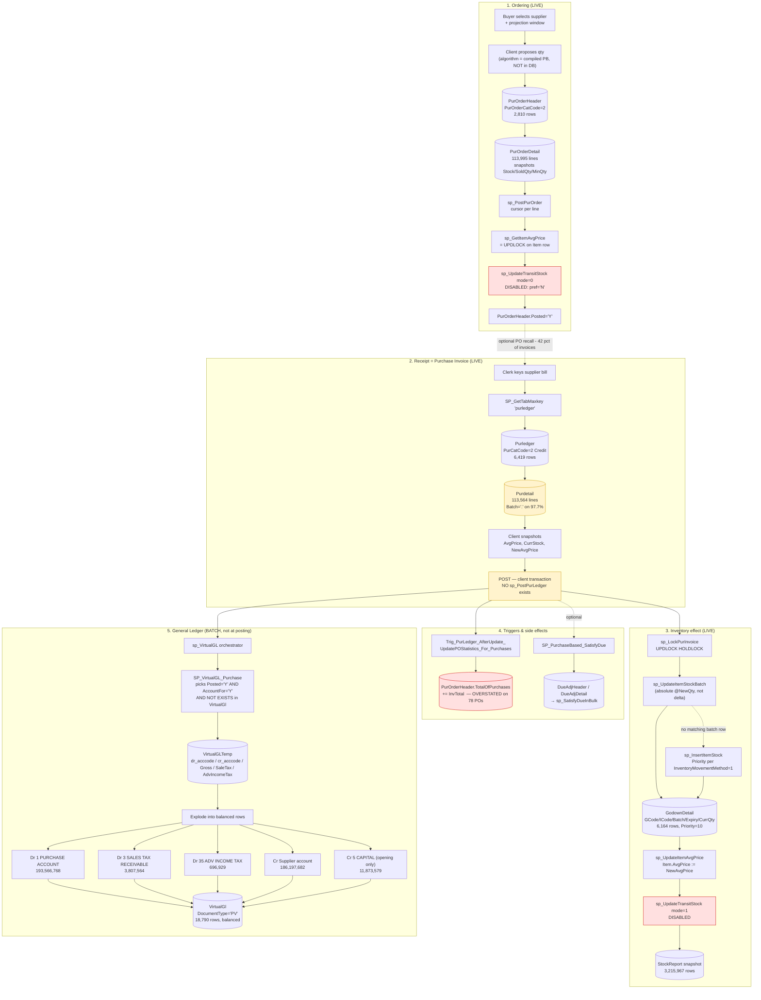
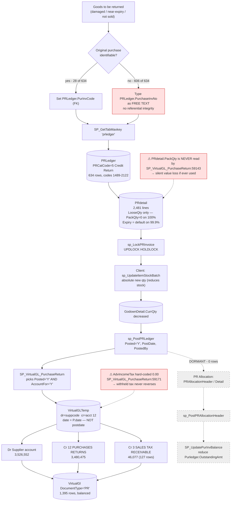

# 05b — End-to-End Business Workflows: PURCHASE SIDE

**System under analysis:** WASEELA ABUZAR V3 (vendor "Abuzar"/"Waseela"), deployment **Fazal Din PP19** — retail pharmacy, Gujranwala, Pakistan.
**Analysis stage:** Stage 05 — Business workflow reconstruction (purchase / procurement / supplier domain).
**Document status:** Evidence-dense deliverable for the Node/React/MySQL modernization programme. Written for a business owner **and** engineers.
**Date of analysis:** 2026-08-01. Live database queried read-only.

---

## Evidence sources used

| # | Source | What it proves |
|---|---|---|
| E1 | `C:/Users/Admin/AppData/Local/Temp/claude/E--Pharma-Software/6817c053-0a3d-471f-ae16-ab90c079cc3d/scratchpad/db_modules_full.sql` (2.48 MB, 762 programmable objects, full T-SQL source) | Authoritative business logic. All procedure/function/trigger quotes below are read directly from this file with line numbers. |
| E2 | `.../scratchpad/table_columns.tsv` (11,414 columns) | Table shapes, data types, defaults. |
| E3 | `.../scratchpad/table_rowcounts.tsv` + live `sys.partitions` / `COUNT(*)` queries | Used-vs-dormant determination. |
| E4 | `.../scratchpad/foreign_keys.tsv` + live `sys.foreign_keys` | Referential model. |
| E5 | **Live database** `FazalDinPP19DataBaseV2` on `localhost\SQLEXPRESS` — read-only `SELECT` only | Real data shapes, seeded lookups, GL account mapping, empirical validation of the costing formula, defect quantification. |
| E6 | `E:/Pharma Software/extracted_scripts.sql` (10.7 MB legacy extract) | DDL/defaults cross-check. |
| E7 | `E:/Pharma Software/V2_AbuzarSoftware/Application/*.pbd` (122 compiled PowerBuilder libraries) | **Referenced but not decompiled.** Their existence is the reason certain logic is marked *Missing* below. |

> **There is no application source code.** Zero `.pbl/.srw/.sru/.srd/.pbt` files exist. Anything the compiled PowerBuilder client does that is *not* expressed in a stored procedure, function, trigger or constraint is **unrecoverable by static analysis** and is labelled **Missing** in this document.

---

## Evidence-label legend (used on every material claim)

| Label | Meaning |
|---|---|
| **Verified** | Read directly in procedure / function / trigger / schema source, or measured directly in live data. |
| **Strongly Inferred** | Multiple converging evidence lines (schema + proc + data) but no single decisive statement. |
| **Unclear** | Evidence is ambiguous or contradictory; must not be relied on without confirmation. |
| **Missing** | The logic exists in the product but lives in compiled client code / is not present in the database at all. |
| **Deprecated** | Present but superseded; dead or legacy. |
| **Broken/Incomplete** | Present and demonstrably defective or half-implemented. |
| **Recommended** | A proposal **for the NEW system**. NOT an existing feature. Never confuse with the above. |

> **Rule applied throughout:** an *empty table* is evidence of **non-use at this deployment**, not evidence that the product lacks the feature. Both facts are stated separately.

---

# 1. Headline conclusion

**Verified.** The purchase side of WASEELA ABUZAR V3 is a **broad, generic, multi-vertical procurement suite of which Fazal Din PP19 uses roughly one-fifth**. Exactly three purchase workflows carry real data: (1) an automatic **projection-based Purchase Order** generator, (2) a **Purchase Invoice = goods receipt** document that simultaneously books stock, recomputes weighted-average cost and generates the GL entry, and (3) a **Purchase Return**. Everything else the product ships — purchase expenses / landed cost, import purchases, advance & proforma purchase, purchase register, purchase quotations, purchase-return allocation, supplier payments with withholding tax, batch-wise inventory and expiry intimation — is **present in schema and stored procedures but has zero rows at this deployment**.

**Verified — and this is the single most consequential finding in this document:** *there is no supplier payment recorded anywhere in this database.* `PurPayment` = 0 rows; `GLHeader` = 0 rows; `GLDetail` = 0 rows. Supplier accounts in the general ledger are touched **only** by purchase invoices (credit) and purchase returns (debit). The net supplier payable therefore grows monotonically and currently stands at **PKR 182,671,130 credit** — a number that is arithmetically correct but economically meaningless, because eighteen months of cash and bank payments to suppliers were never entered. Any "accounts payable" or "supplier balance" report from this system is, at Fazal Din PP19, a **purchases-to-date register, not a payables ledger**.

---

# 2. Purchase-domain object inventory (used vs dormant)

**Verified.** Live counts taken 2026-08-01 via `SELECT COUNT(*)`. "Dormant" = zero rows at this deployment; the feature still exists in the product.

## 2.1 Live (in production use)

| Object | Rows | Role |
|---|---:|---|
| `Purdetail` | **113,564** | Purchase invoice line items (goods received). |
| `PurOrderDetail` | **113,995** | Purchase order line items. |
| `ItemSuppliers` | **22,245** | Item → supplier catalogue with rate, discount, bonus, lead days, priority. |
| `LastPurchaseHistory` | **9,746** | One-shot migration snapshot of last purchase per item (**stale — see §12.3**). |
| `Purledger` | **6,419** | Purchase invoice headers. |
| `GodownDetail` | **6,164** | Live stock by godown × item × batch × expiry. |
| `PurOrderHeader` | **2,810** | Purchase order headers. |
| `PRdetail` | **2,481** | Purchase-return line items. |
| `PRLedger` | **634** | Purchase-return headers. |
| `Supplier` | **235** | Supplier master (each is also a GL account). |
| `POPolicyDetail` | **35** | Weekday × week-of-month ordering calendar rows. |
| `PurCategory` | **8** | Purchase/return document categories (seeded lookup). |
| `POPolicy` | **7** | Purchase-order day policies (seeded lookup). |
| `PurOrderCategory` | **4** | PO generation modes (seeded lookup). |
| `SupplierCategory` | **1** | Single default supplier category. |
| `Godown` | **1** | Single warehouse. |

## 2.2 Dormant at this deployment (0 rows — product feature exists, unused here)

| Object | Feature it implements |
|---|---|
| `PurExp` | Invoice-level purchase expenses (freight, octroi, clearing) → landed cost & GL. |
| `GroupPurExpTemplate`, `ItemPurExpTemplate` | Reusable expense templates per item group (5 quantity-based + 5 weight-based expense slots). |
| `PurPayment` | Supplier payment against a specific purchase invoice, with withholding tax. |
| `PRAllocationHeader`, `PRAllocationDetail` | Allocating a purchase return against specific open purchase invoices. |
| `ImpPurHeader`, `ImpPurDetail`, `ImpPurExp` | Import purchase (LC/container, foreign currency, duties, multi-supplier split). |
| `AdvPurHeader`, `AdvPurDetail` | "Advance purchase" — full tax/duty-modelled purchase entry form. |
| `ProformaPurDetail` | Proforma purchase (invoice booked to GL with `ImpactInventory='N'`). |
| `PurRegister`, `PurRegisterDetail` | Lot/weight-based purchase register (agri/commodity vertical). |
| `PurQuotationHeader`, `PurQuotationDetail` | Supplier quotations feeding a PO. |
| `PurchaseType`, `PurchaseDocument` | Purchase type classification, document attachments. |
| `ItemBatches`, `ItemBatchPricing`, `StockLedger` | Batch-level costing & batch-wise pricing. |
| `ExpiryIntimation`, `ExpiryIntimationDetail`, `DB_ExpiryIntimation*` | Expiry intimation to supplier (the near-expiry return workflow). |
| `PurledgerMod`, `PurdetailMod`, `PostedInvoiceEditingLog` | Posted-invoice editing / modification audit. |
| `CRS_PurLedger`, `CRS_PurDetail`, `CRS_PurExp`, `CRS_Supplier`, `CRS_ProformaPurDetail` | Central Reporting Server multi-branch consolidation. |
| `DB_Purledger`, `DB_Purdetail`, `DB_PurOrderHeader`, `DB_PurOrderDetail` | "DropBox" inter-site document exchange. |
| `GroupSupplierCategory`, `SupplierManufacturers`, `AccountGodown`, `GodownItemSetting` | Supplier/godown access control refinements. |
| `ServicePurHeader`, `ServicePurDetail`, `ServicePurTemp*`, `ServiceInvPurTemp*` | Purchase-of-services (hospital/clinic vertical). |
| `BonusPolicy(Detail)`, `DiscountPolicy(Detail)` | Supplier bonus/discount policy engines. |

**Interpretation for the owner:** you are paying for — and carrying the risk of — a system that implements about five times more procurement machinery than your pharmacy actually operates. The modernization can safely scope to §§4–7 and treat §§8–13 as explicitly out of scope.

---

# 3. Document state model — how a purchase document moves

**Verified.** Every purchase-family header carries the same control flags. Read from `table_columns.tsv` and confirmed against the posting procedures.

| Flag | Column | Values | Meaning |
|---|---|---|---|
| Posted | `Purledger.Posted`, `PRLedger.Posted`, `PurOrderHeader.Posted` | `'N'` → `'Y'` | Document is committed. Inventory has moved. Irreversible through normal UI. |
| Account-for | `Purledger.AccountFor` (default `'Y'`) | `'Y'`/`'N'` | Whether the GL generator will pick it up. |
| Marked | `Purledger.Marked` (default `'N'`) | `'Y'`/`'N'` | Soft-delete / exclusion marker. **0 rows marked at this deployment.** |
| Finalized | `ImpPurHeader.Finalized` | `'N'` → `'Y'` | Import-purchase two-stage commit (`sp_FinalizeImpPur`, line 24449). |
| Active | `PurQuotationHeader.Active` | toggled | Quotation on/off (`SP_Mark_PurQuotation_Active_InActive`, line 39468). |
| Impact inventory | `Purledger.ImpactInventory` (default `'Y'`) | `'Y'`/`'N'` | `'N'` = proforma purchase: hits GL but **not** stock. **0 rows at `'N'` here.** |
| Transfer/sync | `Transferable`, `Transfered`, `Imported`, `Synced`, `Pushed`, `CRS_Transfered` | `'N'`/`'Y'` | Multi-site replication state. All `'N'` here (single-site). |

**Verified — posting-time state gate.** The GL generator only consumes documents that are simultaneously posted *and* account-for *and* not yet in the GL:

```sql
-- dbo.SP_VirtualGL_Purchase, db_modules_full.sql:58719-58721
SELECT  PurInvCode FROM PurLedger P
WHERE P.Posted = 'Y' and P.AccountFor = 'Y' AND
  NOT EXISTS (SELECT DISTINCT DocumentCode FROM VirtualGL V
              WHERE V.DocumentType = 'PV' AND V.DocumentCode = P.PurInvCode)
```

`Evidence: dbo.SP_VirtualGL_Purchase → #lt_pur seeding, db_modules_full.sql:58717-58721`

**Verified — pessimistic locking pattern.** Before the client edits a header it takes an exclusive lock by counting rows under `UPDLOCK HOLDLOCK`:

```sql
-- dbo.sp_LockPurInvoice, db_modules_full.sql:38923-38929
CREATE PROCEDURE sp_LockPurInvoice @ai_PurInvCode int AS
DECLARE @status INT
Select @status=(Select count(*) From PurLedger WITH (UPDLOCK HOLDLOCK)
                Where PurLedger.PurInvCode = @ai_PurInvCode)
```

Identical procedures exist for the return and the return-allocation:
- `dbo.sp_LockPRInvoice` (line 38915) → `PRLedger WITH (UPDLOCK HOLDLOCK)`
- `dbo.sp_LockPRAllocationInvoice` (line 38907) → `PRAllocationHeader WITH (UPDLOCK HOLDLOCK)`

This is a **transaction-scoped row lock held for the duration of a human edit session**. See §14 for the blocking risk this creates.

---

# 4. WORKFLOW A — Purchase Order (PO)

**Status: LIVE. 2,810 POs, 113,995 PO lines, 100 % posted.**

## 4.1 What actually happens here

**Verified from data.** Every single PO at this deployment is `PurOrderCatCode = 2`:

| `PurOrderCatCode` | Name (from `PurOrderCategory`) | POs at Fazal Din PP19 |
|---|---|---:|
| 1 | REORDER LEVEL | 0 |
| **2** | **PROJECTION PERIOD** | **2,810 (100 %)** |
| 3 | AGAINST SALE ORDER | 0 |
| 4 | AGAINST PURCHASE QUOTATION | 0 |

`Evidence: live query — SELECT PurOrderCatCode, COUNT(*) FROM PurOrderHeader GROUP BY PurOrderCatCode`

**Strongly Inferred.** "Projection period" ordering means: the buyer picks a supplier and a look-back window (`PurOrderHeader.StartDate` → `EndDate`, `ProjectionPeriod` in days), and the client proposes order quantities from consumption in that window. Sample of the five most recent POs:

| POCode | Date | SuppCode | ProjectionPeriod | StartDate → EndDate | Lines |
|---:|---|---:|---:|---|---:|
| 2810 | 2026-07-30 | 143 | 10 | 2026-06-15 → 2026-07-30 | 10 |
| 2809 | 2026-07-30 | 124 | 10 | 2026-06-15 → 2026-07-30 | 4 |
| 2808 | 2026-07-30 | 316 | 5 | 2026-06-15 → 2026-07-30 | 50 |
| 2807 | 2026-07-30 | 107 | 5 | 2026-06-15 → 2026-07-30 | 58 |
| 2806 | 2026-07-30 | 101 | 5 | 2026-06-15 → 2026-07-30 | 63 |

The per-line decision inputs are snapshotted onto `PurOrderDetail` at generation time: `Stock`, `SoldQty`, `ReturnQty`, `MinQty`, `OptimumQty`, `ReorderQty`, `TransitStock`, `LastPurInvCode`, `LastPurDate`, `Rate`.

**Missing — the actual proposal arithmetic.** No stored procedure computes `PurOrderDetail.Qty` from `SoldQty`/`Stock`/`ProjectionPeriod`. The suggestion algorithm lives in the compiled PowerBuilder client. What the database preserves is only the *inputs and the answer*, never the formula.
`Evidence: exhaustive scan of db_modules_full.sql for INSERT INTO PurOrderDetail — only replication/import procs (sp_Import_Quotation_From_DataCarryDB:33622, sp_InsertPurOrder_To_DataCarryDB:37792, SP_DB_PushPurchaseToDropBox:22333) write it; none compute Qty.`

> **Recommended (new system):** re-implement projection ordering as an explicit, testable service — `suggestedQty = ceil(avgDailyConsumption(window) × coverDays) − onHand − onOrder`, with every input persisted on the line exactly as the legacy does. Expose the formula in the UI so buyers can see *why* a quantity was proposed. This is a proposal, not an existing feature.

## 4.2 PO posting — `sp_PostPurOrder`

**Verified.** `Evidence: dbo.sp_PostPurOrder, db_modules_full.sql:42617-42676`

Sequence:

1. Opens a `FORWARD_ONLY READ_ONLY` cursor over every unposted PO line in the code range, projecting net units: `((PD.qty + PD.bonusqty) * PD.packunits)`.
2. For each line, calls `sp_GetItemAvgPrice @icode, @avgprice` — whose real purpose is **not** the price but the `UPDLOCK HOLDLOCK` it takes on the `Item` row (line 31390: `Select Item.AvgPrice From Item WITH (UPDLOCK HOLDLOCK)`). This serialises concurrent PO postings per item.
3. Calls `sp_UpdateTransitStock 0, @icode, @qty` — mode `0` = **increase** transit stock on `Item.TransitStock`.
4. Only if every line succeeded (`@continue = 0`) does it flip the headers:

```sql
Update PurOrderHeader
Set    Posted = 'Y', PostDate = GetDate(), PostedBy = @usercode
Where  PoCode Between @sinvcode And @linvcode AND Posted = 'N'
```

**Broken/Incomplete — transit stock is silently disabled here.** `sp_UpdateTransitStock` (line 57551) is gated on a preference:

```sql
Set @autoupdate = (Select a=DBO.Fn_GetPreference( 'AutoUpdateTransitStock' ))
IF Upper(@autoupdate) = 'Y'
Begin ... Update Item Set TransitStock = ... End
Return 0
```

Live preference value: **`autoupdatetransitstock = 'N'`**. `Evidence: live query on dbo.SoftwarePreferences`. Consequently the entire cursor in `sp_PostPurOrder` performs ~114,000 no-op round trips and `Item.TransitStock` is never maintained. `PurOrderDetail.TransitStock` is non-zero on **0 of 113,995 rows** (live query). **Nothing at this deployment knows what is on order but not yet received.**

**Broken/Incomplete — no transactional envelope.** `sp_PostPurOrder` has no `BEGIN TRANSACTION`. It raises errors and sets `@continue = -1`, but any `Item.TransitStock` rows already updated before a mid-cursor failure are **not rolled back by the procedure**. Recovery depends entirely on the client wrapping the call in a transaction — unverifiable (compiled code).

## 4.3 PO ordering calendar — `POPolicy` / `POPolicyDetail`

**Verified.** Actively seeded, 7 policies × 5 week-of-month rows = 35 detail rows.

| `POPolicyCode` | Alias | Name | `POPolicyDetail` rows |
|---:|---|---|---|
| 1 | MON | MONDAY PURCHASE ORDER | WeekDayCode 1 × WeekOfMonth 1,2,3,4,5 |
| 2 | TUE | TUESDAY PURCHASE ORDER | WeekDayCode 2 × WeekOfMonth 1,2,3,4,5 |
| 3 | WED | WEDNESDAY PURCHASE ORDER | WeekDayCode 3 × 1–5 |
| 4 | THU | THURSDAY PURCHASE ORDER | WeekDayCode 4 × 1–5 |
| 5 | FRI | FRIDAY PURCHASE ORDER | WeekDayCode 5 × 1–5 |
| 6 | SAT | SATURDAY PURCHASE ORDER | WeekDayCode 6 × 1–5 |
| 7 | SUN | SUNDAY PURCHASE ORDER | WeekDayCode 7 × 1–5 |

`Evidence: live query — SELECT * FROM POPolicy; SELECT * FROM POPolicyDetail`

**What it is:** a **supplier call-day calendar**. Each policy is "order on this weekday, in these weeks of the month". The intent is that a supplier is assigned a policy so the buyer only raises POs for that supplier on the supplier's call day — the classic Pakistani pharmaceutical-distributor booking-day model.

**Broken/Incomplete — the link is missing.** `Supplier` has **no `POPolicyCode` column** (`Evidence: table_columns.tsv → supplier column list, 28 columns, none reference POPolicy`), and **no stored procedure, function, view or trigger in the entire 762-object corpus references `POPolicy` or `POPolicyDetail`** (`Evidence: grep over db_modules_full.sql — zero hits`). The seed data is the vendor's default install content; the consuming logic, if it exists at all, is in compiled client code, and no schema path connects a supplier to a policy.

**Verdict: the PO day-policy feature is seeded but not wired.** Treat as **Deprecated** for migration purposes; carry the *concept* forward only if the owner confirms supplier call days matter operationally.

> **Recommended (new system):** if call days matter, model it as `supplier.order_days` (a set of weekday + week-of-month rules) with a validation on PO creation, and surface "today's suppliers" on the buyer dashboard. Proposal only.

---

# 5. WORKFLOW B — Goods receipt & Purchase Invoice (the core flow)

**Status: LIVE. 6,419 invoices, 113,564 lines, PKR 198,071,256 total, Jan-2025 → Jul-2026.**

## 5.1 There is no separate goods receipt

**Verified.** The product has no GRN document table. `Purledger.GRN` is a free-text `varchar(100)` field, populated on **30 of 6,419 invoices (0.5 %)**. `Evidence: live query on Purledger`. The purchase invoice **is** the goods receipt: the same document simultaneously (a) records the supplier's bill, (b) receives stock into the godown, (c) recomputes weighted-average cost, and (d) generates the GL entry.

**Implication:** there is no three-way match (PO ↔ receipt ↔ invoice). There is a two-way, *optional*, header-level reference only. Quantity or price discrepancies between what was ordered and what was billed are invisible to the system.

## 5.2 Purchase categories in use

**Verified from live data.**

| `PurCatCode` | `PurCategory.Name` | Invoices | Total (PKR) | Notes |
|---:|---|---:|---:|---|
| 1 | Normal Purchase Cash | 0 | — | dormant |
| **2** | **Normal Purchase Credit** | **6,396** (6,395 posted + 1 unposted) | 185,114,160 | the operational workflow |
| **3** | **Opening Purchase** | **1** | 11,873,579 | go-live opening stock, 2025-01-01 |
| 4 | Normal Purchase Return Cash | 0 | — | dormant |
| 5 | Normal Purchase Return Credit | (PR side — 634) | 3,526,551 | see §7 |
| 6 | Opening Purchase Return | 0 | — | dormant |
| 7 | Loose Purchase cash | 0 | — | dormant |
| **8** | **Loose Purchase Credit** | **22** | 1,083,517 | occasional loose-unit buying |

`Evidence: live query — SELECT PurCatCode, Posted, COUNT(*), SUM(InvTotal) FROM Purledger GROUP BY ...`

**Verified.** The category drives GL narrative and, for `PurCatCode = 3`, the credit side goes to **Capital** instead of the supplier:

```sql
-- dbo.SP_VirtualGL_Purchase, db_modules_full.sql:58726-58727
cr_acccode = CASE P.PurCatCode
    WHEN 3 THEN @ln_equityacc /*Opening Purchase*/
    ELSE CASE WHEN P.CustCode > 0 THEN P.CustCode ELSE P.suppcode END /*Credit Purhase*/ END
```

Note the fallback `CASE WHEN P.CustCode > 0 THEN P.CustCode` — the product supports buying *from a customer account*. Unused here (`CustCode` NULL on all rows).

## 5.3 Step-by-step: raising and posting a purchase invoice

| # | Step | Actor | Mechanism | Data created/updated | Evidence |
|---:|---|---|---|---|---|
| 1 | Open purchase entry screen; select supplier | Purchase clerk | Compiled PB window | — | **Missing** (compiled) |
| 2 | Optionally recall a PO | Clerk | Client copies PO lines into the grid; `Purledger.POCode` set | `Purledger.POCode` populated on **2,710 of 6,419 (42 %)** | Live query |
| 3 | Reserve the invoice number | Client | `SP_GetTabMaxkey 'purledger', @code OUTPUT` | new `PurInvCode` | `SP_CreatePurchase_From_*` all call it, e.g. line 12371 |
| 4 | Enter supplier bill no. & date | Clerk | `SuppInvCode`, `SuppInvDate` | populated on **6,418 of 6,419 (99.98 %)** | Live query |
| 5 | Enter each line: item, batch, expiry, pack qty, loose qty, bonus qty, pack units, purchase price, discount %, sale price | Clerk | DataWindow grid → `Purdetail` | 113,564 lines | schema |
| 6 | Client snapshots costing inputs onto the line | Client | writes `AvgPrice` (cost **before**), `CurrStock` (units **before**), `NewAvgPrice` (cost **after**), `RecentPurPrice` | see §5.5 | data |
| 7 | Header discounts / charges | Clerk | `DiscPerc`, `FlatDisc`, `MiscCharges`, `SalesTax`, `InvGSTPerc1`, `AdvanceTaxAmt` | | schema |
| 8 | Save (unposted) | Clerk | `Posted='N'` | invoice recallable/editable | |
| 9 | **Post** | Supervisor/clerk | Client transaction: `sp_LockPurInvoice` → per-line `sp_UpdateItemStockBatch` / `sp_InsertItemStock` → `sp_UpdateItemAvgPrice` → `sp_UpdateTransitStock 1,…` → `UPDATE Purledger SET Posted='Y'` | stock moves; `Item.AvgPrice` updated | §5.4 |
| 10 | Trigger fires | DB | `Trig_PurLedger_AfterUpdate_UpdatePOStatistics_For_Purchases` | `PurOrderHeader.TotalOfPurchases`, `.ListOfPurInvoices` | line 64857 |
| 11 | Optional: auto-satisfy customer dues | Client | `SP_PurchaseBased_SatisfyDue @PurInvCode,…` | `DueAdjHeader`/`DueAdjDetail`, then `sp_SatisfyDueInBulk` | line 45744 |
| 12 | GL generation (batch) | Scheduled / on demand | `sp_VirtualGL` → `SP_VirtualGL_Purchase` → `VirtualGLTemp` → `VirtualGl` | 3 GL row groups | §5.6 |

**Verified — there is no `sp_PostPurLedger`.** The corpus contains `sp_PostSaleLedger`, `sp_PostPRLedger`, `sp_PostPurOrder`, `sp_PostSaleOrder`, `sp_PostIssueLedger`, `sp_PostAdjLedger`… but **no purchase-invoice posting procedure**. `Evidence: awk over the 762-object header index — grep '^sp_Post|^SP_Post' yields 50 procedures, none named for PurLedger.` Purchase posting is orchestrated entirely by the compiled client, which calls the individual helper procedures listed in step 9. **This is the largest single knowledge gap in the purchase domain.**

## 5.4 Inventory impact — what posting does to stock

**Verified.** Stock lives in `GodownDetail (GCode, ICode, Batch, Expiry, CurrQty, Priority, ManfDate)`. The client calls, per line:

```sql
-- dbo.sp_UpdateItemStockBatch, db_modules_full.sql:57045-57131
Update GodownDetail Set CurrQty = @NewQty
Where  GCode=@GCode and ICode=@ICode and Batch=@Batch and Expiry=@Expiry
-- if 0 rows affected → compute Priority from InventoryMovementMethod, then:
Insert GodownDetail (Gcode, Icode, Batch, Expiry, CurrQty, manfdate, Priority)
Values (@GCode, @ICode, @Batch, @Expiry, @NewQty, @manfdate, @Priority)
```

**Note the signature:** the procedure receives `@NewQty` — the **absolute new balance**, not a delta. The arithmetic `oldQty + received` is done in the client. A lost update between two concurrent postings of the same item/batch is prevented only by the `Item`-row `UPDLOCK` taken in `sp_GetItemAvgPrice`. **Strongly Inferred**, since the client code is not readable.

**Verified — batch priority / picking order.** `sp_InsertItemStock` (line 37708) and `sp_UpdateItemStockBatch` both compute `Priority` from preference `InventoryMovementMethod`:

| Value | Meaning | Priority assignment |
|---:|---|---|
| 1 | Equal priority / shortest expiry first | `Priority = 10` (flat) |
| 2 | FIFO | `MAX(Priority)+1`, rebalanced at 255 |
| 3 | LIFO | `MIN(Priority)-1`, rebalanced at 0 |

Live value: **`inventorymovementmethod = 1`** → all new batches get `Priority = 10`, and the sale side picks **shortest expiry first**. Correct default for a pharmacy. `Evidence: live query on SoftwarePreferences; dbo.sp_InsertItemStock:37722-37726`

**Broken/Incomplete — batch/expiry tracking is nominal, not real.** Live measurement of `Purdetail`:

| Batch value | Lines | Share |
|---|---:|---:|
| `.` (the `defaultbatch` preference value) | 110,948 | **97.7 %** |
| `01` | 565 | 0.5 % |
| `a` | 319 | 0.3 % |
| `02` | 244 | 0.2 % |
| all other (827 distinct) | 1,488 | 1.3 % |

and only **831 distinct batch strings across 113,564 lines**; `GodownDetail` holds only **62 distinct batch values** in live stock. Expiry dates span 2022-12-12 → 2030-12-12, with `2030-12-12` being the `DefaultExpiry` preference value. `Evidence: live queries on Purdetail and GodownDetail; SoftwarePreferences defaultbatch='.', DefaultExpiry='2030-12-12'`

**Business meaning:** the pharmacy is **not recording real manufacturer batch numbers or real expiry dates on purchase**. Batch/expiry columns are filled with placeholders. Therefore:
- Expiry-based FEFO picking is not actually operative (all batches share the same fake expiry).
- A regulatory product recall cannot be traced to affected stock or to the sales that dispensed it.
- The near-expiry return-to-supplier workflow (§13) has no data to work from.

This is a **compliance-grade risk for a pharmacy**, and it is a *data-entry practice* problem as much as a software one — the fields exist and work.

**Verified — `ItemBatches` is not used.** `SP_Add_ItemBatches_From_Purchase` (line 4463) copies purchase lines into a batch-cost table:

```sql
INSERT INTO DBO.ItemBatches (Date, ICode, GCode, Batch, Expiry, Qty, PackUnits, CostPrice, PurPrice, SalePrice, AvgPrice, NewAvgPrice, CurrStock)
SELECT Date=GETDATE(), ICode, GCode, Batch, Expiry,
  Qty = CASE WHEN PackQty > 0 THEN (PackQty + BonusQty) * PackUnits ELSE LooseQty + BonusQty END,
  PackUnits,
  CostPrice = Round(NetRate / CASE WHEN PackUnits <= 0 THEN 1 ELSE PackUnits END, 5),
  PurPrice, SalePrice, AvgPrice, NewAvgPrice, CurrStock
FROM PurDetail WHERE PurInvCode = @PurInvCode
```

`ItemBatches` = **0 rows**. The procedure is never called at this deployment. Note the line `Qty = ... (PackQty + BonusQty) * PackUnits` — bonus units count as received quantity, which corroborates the costing formula in §5.5.

## 5.5 Weighted-average cost — the formula, recovered empirically

**Strongly Inferred (empirically validated).** The formula lives in compiled client code. The database stores only inputs and outputs on `Purdetail`: `AvgPrice` (unit cost before), `CurrStock` (units on hand before), `NetRate` (net pack cost after all discounts), `PackUnits`, `PackQty`, `LooseQty`, `BonusQty`, `NewAvgPrice` (unit cost after).

I reconstructed the formula and tested it against all 113,564 live rows:

```
units_received = PackQty × PackUnits + LooseQty + BonusQty × PackUnits
unit_cost      = NetRate / PackUnits                     -- NetRate is per pack, net of discounts
NewAvgPrice    = ( CurrStock × AvgPrice + units_received × unit_cost )
                 ────────────────────────────────────────────────────
                            ( CurrStock + units_received )
```

**Validation results (live):**

| Population | Rows | Reproduced to ±0.01 | Reproduced to ±0.00002 |
|---|---:|---:|---:|
| All `Purdetail` rows | 113,564 | 96,947 (85.4 %) | 94,852 (83.5 %) |
| Lines where the item appears **once** on the invoice | 112,833 | 96,947 (**85.9 %**) | — |
| Lines where the same item appears **twice or more** on one invoice | 731 | **0** | — |

`Evidence: live analytic queries against dbo.Purdetail comparing stored NewAvgPrice to the computed expression.`

**Reading the residual.** Two effects explain the non-matching 14 %:
1. **Repeated-item lines never match (0 / 731).** When the same item appears on multiple lines of one invoice, each line's `AvgPrice`/`CurrStock` snapshot is taken at grid-entry time and is not chained line-to-line. The stored per-line values are therefore internally inconsistent, but the *final* `Item.AvgPrice` is presumably correct. **Unclear** without the client code.
2. **Stale snapshots.** `AvgPrice`/`CurrStock` are captured when the operator types the line; if sales or other purchases occur before the invoice is posted, the snapshot no longer reflects reality at posting time. **Strongly Inferred.**

**Verified — bonus is cost-diluting, not free.** Bonus units enter the *denominator* (they increase quantity on hand) while `NetRate` is already diluted by bonus before it reaches the line. Sample verification: `PurInvCode 6410, ICode 30124` — `PurPrice 186.10`, `PackQty 10`, `BonusQty 3`, and `NetRate = 143.15385 = 186.10 × 10 ÷ 13` exactly. Across all bonus lines with no line discount (883 rows), **728 (82 %)** satisfy `NetRate ≈ PurPrice × Qty ÷ (Qty + BonusQty)`. `Evidence: live query on dbo.Purdetail WHERE BonusQty>0 AND DiscPerc=0`

**Verified — the resulting `Item.AvgPrice` write is trivial:**

```sql
-- dbo.sp_UpdateItemAvgPrice, db_modules_full.sql:56913-56922
CREATE PROCEDURE SP_UpdateItemAvgPrice @ICode integer, @AvgPrice NUMERIC(15,5)
AS Update Item Set Item.AvgPrice = @AvgPrice Where ICode = @icode
```

No validation, no bounds check, no audit row. Whatever the client computes is written.

**Verified — costing is item-level, not batch-level.** `Item.AvgPrice` is a single scalar per item. `ItemBatches` (batch cost) is empty. Therefore **the pharmacy runs a single moving-weighted-average cost per item across all batches** — the `StockReport` snapshot table (3,215,967 rows) carries `AvgPrice numeric(15,5)` per date/item, consistent with this.

> **Recommended (new system):** implement costing server-side in a single transactional service, never in the UI; persist a **cost movement ledger** (one immutable row per stock movement carrying qty-in, value-in, running qty, running value, resulting unit cost) so that `NewAvgPrice` is derived, auditable and replayable rather than snapshotted. Proposal only.

## 5.6 Accounting impact — the exact GL entry

**Verified.** Purchase GL is generated in **batch**, not at posting time, by `sp_VirtualGL` (line 57754), which calls `SP_VirtualGL_Purchase` (line 58688). That procedure writes a **staging** row per document into `VirtualGLTemp` carrying `dr_acccode`, `cr_acccode`, `Gross`, `SaleTax`, `AdvIncomeTax`, `Amt`; `sp_VirtualGL` then explodes the staging row into balanced `VirtualGl` rows.

**Account resolution — verified against the live `Global` table:**

| `Global.Name` | Code | `Accounts.Name` |
|---|---:|---|
| `GT_PurchaseAccount` | 1 | PURCHASE ACCOUNT |
| `GT_CashACC` | 2 | CASH FROM SALE (DEFAULT) |
| `GT_AdvanceSalesTaxACC` | 3 | SALES TAX RECEIVEABLES ACCOUNT |
| `GT_PurExpPayableAcc` | 4 | PURCHASE EXPENSE PAYABLE A/C |
| `GT_EquityACC` | 5 | CAPITAL ACCOUNT |
| `GT_InventoryAcc` | 7 | INVENTORY ACCOUNT |
| `GT_PurchaseReturnsAccount` | 12 | PURCHASES RETURNS ACCOUNT |
| `GT_AdvIncomeTaxPur` | 35 | ADVANCE INCOME TAX ON PURCHASE A/C. |

`Evidence: live query — SELECT Name, Code FROM Global WHERE Name IN (...); SELECT AccCode, Name FROM Accounts WHERE AccCode IN (...)`

**Verified — periodic vs perpetual switch.** The debit account is chosen by preference:

```sql
-- SP_VirtualGL_Purchase:58702, 58725
SET @InvSys = ISNULL((SELECT a=DBO.Fn_GetPreference('InventorySystemUsed')), 'P')
...
dr_acccode = CASE WHEN @InvSys = 'P' THEN @ln_purchaseacc ELSE @ln_invacc END
```

Live value: **`inventorysystemused = 'P'`** → **periodic**: purchases are debited to **PURCHASE ACCOUNT (1)**, *not* to INVENTORY ACCOUNT (7). Inventory account 7 therefore never moves on a purchase.

**Verified — the entry, confirmed against 18,790 actual `VirtualGl` rows of `DocumentType='PV'`:**

| Leg | Account | Dr (PKR) | Cr (PKR) | Rows | Source expression |
|---|---|---:|---:|---:|---|
| Goods | 1 — PURCHASE ACCOUNT | **193,566,768.31** | | 6,416 | `Gross − AdvIncomeTax − FBRPosFee` |
| Input sales tax | 3 — SALES TAX RECEIVEABLES | **3,807,564.00** | | 2,150 | `SaleTax`, `VRow=2` |
| Advance income tax | 35 — ADVANCE INCOME TAX ON PURCHASE | **696,928.69** | | 3,808 | `AdvIncomeTax`, `VRow=2` |
| Payable | Supplier account (`P.suppcode`), or 5 — CAPITAL when `PurCatCode=3` | | **186,197,682.00** *(suppliers)* + 11,873,579 *(capital, opening)* | 6,415 | `Gross + SaleTax` |
| **Total** | | **198,071,261** | **198,071,261** | 18,790 | balanced |

`Evidence: live query — SELECT DocumentType, AccCode, COUNT(*), SUM(Debit), SUM(Credit) FROM VirtualGl WHERE DocumentType='PV' GROUP BY DocumentType, AccCode`

The Dr/Cr split logic itself:

```sql
-- dbo.sp_VirtualGL, db_modules_full.sql:57833-57848
Debit = CASE
    WHEN dr_AccCode IN (@ln_invacc, @goodsacc, @goodsissueacc, @ln_purchaseacc, @ln_salesacc,
                        @ln_salesretacc, @ln_purchaseretacc, @ln_revfromservice)
    THEN Gross - ISNULL(AdvIncomeTax,0) - ISNULL(FBRPosFee,0)
    ELSE ISNULL(Gross,0) + ISNULL(SaleTax,0) END
```

i.e. the *trading* accounts take goods-only; the *party* account takes goods + tax. Sales tax and advance income tax are then written as separate `VRow=2` rows (lines 57862-57884).

**Verified — the `Amt` fast-payment leg.** If the operator enters a payment amount on the purchase screen, `sp_VirtualGL` writes an extra pair Dr supplier / Cr `PaymentAccCode`:

```sql
-- sp_VirtualGL, ~db_modules_full.sql:57912-57941
... DrAmtAccCode, Debit = Amt ... WHERE Amt > 0
... CrAmtAccCode, Credit = Amt ... WHERE Amt > 0
```
with `DrAmtAccCode = P.suppcode` and `CrAmtAccCode = P.PaymentAccCode` set in `SP_VirtualGL_Purchase:58775`.

**At Fazal Din PP19: `Amt <> 0` on 0 of 6,419 invoices.** This channel is never used. `Evidence: live query on Purledger`

**Verified — the gross/tax formula.** The `Gross` and `SaleTax` expressions branch on `Purledger.UpdateAvgPriceWithNetRate` (`'Y'` on 701 of 6,419 invoices):

- `'N'` → `Gross` excludes taxes, `SaleTax` computed separately (`SP_VirtualGL_Purchase:58730-58744`).
- `'Y'` → `SaleTax = 0.00` and `Gross` **includes** the whole tax block (lines 58745-58756), i.e. tax is capitalised into cost rather than claimed as input tax.

**Unclear — this is a material accounting policy switch controlled per invoice by a checkbox, with no documented rule about when it should be used. → escalate to §16 (requires accountant validation).**

**Verified — sales tax is largely unused here.** `Purledger.SalesTax <> 0` on **0** invoices; `Purdetail.GSTPerc <> 0` on **4** lines; `Purdetail.UnitSalesTax <> 0` on **11,309** lines. The PKR 3.81 M of input sales tax booked comes almost entirely from `UnitSalesTax` (per-unit tax on the line), not from percentage GST.

**Verified — advance income tax (Pakistan §153/§236H withholding) is live.** Preference `ApplyAdvanceIncomeTaxInPur = 'Y'`; `Purledger.AdvanceTaxAmt <> 0` on **3,808 invoices**, total **PKR 696,928.69**, debited to account 35.

```sql
-- SP_VirtualGL_Purchase:58779
AdvIncomeTax = CASE WHEN @AdvIncomeTax = 'Y' THEN ISNULL(P.AdvanceTaxAmt,0) ELSE 0 END
```

**Verified — posting-date vs document-date.** Preference `reportpurchaseonpostingdate = 'Y'` → the GL date is `P.postdate`, not `P.Date`:

```sql
-- SP_VirtualGL_Purchase:58729
date = CASE @ReportPurOnPostDate WHEN 'Y' THEN P.postdate ELSE P.Date END
```

**Implication:** a back-dated purchase invoice lands in the GL on the day it was *posted*. Purchase register (by document date) and trial balance (by posting date) will disagree for any back-dated entry. → §16.

**Verified — rounding.** `roundpurinvon = 0` → `ROUND(…, 0)`; all purchase amounts are rounded to whole rupees at the GL level. Consistent with `SUM(InvTotal) = 198,071,256` vs GL `198,071,261` (a 5-rupee aggregate rounding drift across 6,419 invoices).

## 5.7 Mermaid — purchase → stock → GL



---

# 6. WORKFLOW C — PO → Purchase quantity reconciliation

This is a question the brief asked explicitly. **Answer: the two are reconciled only weakly, at header level, and the stored statistics are demonstrably wrong on 78 purchase orders.**

## 6.1 The numbers

**Verified (live, 2026-08-01).** Note: the row counts quoted in the analysis brief (`PurOrderDetail 108,423`, `Purdetail 113,082`) were `sys.partitions` estimates. Exact `COUNT(*)`:

| Measure | Value |
|---|---:|
| `PurOrderHeader` | 2,810 |
| `PurOrderDetail` lines | **113,995** |
| `Purledger` | 6,419 |
| `Purdetail` lines | **113,564** |
| POs that produced ≥ 1 purchase invoice | **2,639 (93.9 %)** |
| POs with no purchase at all | 171 (6.1 %) |
| Purchase invoices carrying a `POCode` | **2,710 of 6,419 (42.2 %)** |
| Purchase invoices with **no** PO | 3,709 (57.8 %) |
| **Purchase lines carrying `POQty > 0`** | **9,126 of 113,564 (8.0 %)** |

So PO lines and purchase lines are numerically almost equal (113,995 vs 113,564) but that is a **coincidence of scale, not a linkage**: only 8 % of purchase lines carry any PO quantity reference, and 58 % of purchase invoices have no PO at all.

## 6.2 Line-level satisfaction

**Verified.** `PurOrderDetail.QtySatisfied` / `.BonusQtySatisfied` are maintained (they are non-zero on 91,381 and 695 lines respectively) but **no stored procedure ever writes them** — grep across all 762 objects finds `QtySatisfied` only in replication/export SQL strings (`SP_DB_Fetch_PurOrderDetailView:21780`, `SP_DB_PushPurchaseToDropBox:22333`, `sp_Import_Quotation_From_DataCarryDB:33621-33622`, `sp_InsertPurOrder_To_DataCarryDB:37792-37793`). **The satisfaction update is done by the compiled PowerBuilder client.** → **Missing** logic.

Live distribution of the 113,995 PO lines:

| Fulfilment state | Lines | Share |
|---|---:|---:|
| Fully satisfied (`QtySatisfied ≥ Qty`) | 89,916 | **78.9 %** |
| Partially satisfied (`0 < QtySatisfied < Qty`) | 1,465 | 1.3 % |
| Never satisfied (`QtySatisfied = 0`) | 22,614 | **19.8 %** |

**Business reading:** roughly one in five ordered lines is never supplied — the normal reality of Pakistani pharma distribution (out-of-stock at the distributor). The system records this faithfully. It does **not**, however, close or expire unfulfilled PO lines: `PurOrderHeader.Marked = 'Y'` on **0 of 2,810** rows, so all 2,810 POs — including the 171 with no receipt at all — remain permanently "open".

## 6.3 The PO statistics trigger — a verified defect

**Verified.** `Evidence: dbo.Trig_PurLedger_AfterUpdate_UpdatePOStatistics_For_Purchases, db_modules_full.sql:64857-64879`

```sql
CREATE TRIGGER dbo.Trig_PurLedger_AfterUpdate_UpdatePOStatistics_For_Purchases
ON dbo.PurLedger AFTER UPDATE AS
BEGIN
  Update PurOrderHeader
  Set PurOrderHeader.ListOfPurInvoices = LEFT(ISNULL(PurOrderHeader.ListOfPurInvoices,'')
        + '(' + CAST(PurLedger.PurInvCode As VarChar(25)) + ',' + CAST(PurLedger.InvTotal As VarChar(25)) + ') , ', 500),
      PurOrderHeader.TotalOfPurchases = PurOrderHeader.TotalOfPurchases + PurLedger.InvTotal
  From Inserted, PurLedger
  Where Inserted.PurInvCode = PurLedger.PurInvCode AND
        Inserted.Posted = 'Y' AND PurLedger.POCode > 0 AND
        Inserted.POCode > 0 AND Inserted.POCode = PurOrderHeader.POCode
END
```

Three defects, in order of severity:

**(a) Broken/Incomplete — no transition guard → double counting.** The predicate is `Inserted.Posted = 'Y'`, **not** `Inserted.Posted='Y' AND Deleted.Posted='N'`. Any subsequent `UPDATE` to an already-posted `PurLedger` row (edit remarks, correct a supplier bill number, re-run a maintenance script) re-fires the trigger and **adds `InvTotal` to the PO total again**.

**Quantified impact (live):**

| | PKR |
|---|---:|
| `SUM(PurOrderHeader.TotalOfPurchases)` (stored) | **161,487,161** |
| `SUM(Purledger.InvTotal) WHERE POCode > 0` (actual) | **146,742,213** |
| **Overstatement** | **14,744,948 (+10.0 %)** |
| POs where stored total exceeds actual | **78** |
| POs where stored total is exact | 2,732 |

`Evidence: live query comparing PurOrderHeader.TotalOfPurchases to the correlated SUM over Purledger.`

**(b) Broken/Incomplete — not `INSERT`-aware.** The trigger is `AFTER UPDATE` only. A purchase invoice created *already posted* (as `SP_CreatePurchase_From_ImpPur` can do, line 12519 sets `PostedBy` at insert time) never updates PO statistics.

**(c) Broken/Incomplete — silent truncation.** `LEFT(..., 500)` on `ListOfPurInvoices` silently drops entries beyond 500 characters. Not yet triggered here (`MAX(LEN) = 189`, 0 rows at ≥ 495) but it is a latent data-loss path.

**(d) Design smell — set-based trigger written as if row-based.** `From Inserted, PurLedger` with no aggregation: if a multi-row `UPDATE` posts several invoices for the same PO in one statement, only one arbitrary row's `InvTotal` is applied. **Strongly Inferred** (standard SQL Server trigger semantics).

> **Recommended (new system):** never denormalise PO totals into the PO header. Compute `receivedValue` and `receivedQty` as derived queries (or a materialised view refreshed transactionally), and add an explicit `po_line.received_qty` maintained inside the same transaction as the receipt, with an idempotency key. Add a PO close/expire workflow. Proposals only.

---

# 7. WORKFLOW D — Purchase Return

**Status: LIVE. 634 returns, 2,481 lines, PKR 3,526,551, Jan-2025 → Jul-2026.**

## 7.1 Shape of the data

**Verified (live).**

| Fact | Value |
|---|---|
| Category | **100 % `PRCatCode = 5` — "Normal Purchase Return Credit"** |
| Posted / AccountFor | 100 % `'Y'` / `'Y'` |
| `PRInvCode` range | **1489 – 2122** — codes carried over from the *previous* system (purchase codes restart at 1) |
| Lines with `PackQty > 0` | **0 of 2,481** |
| Lines with `LooseQty > 0` | **2,481 of 2,481 (100 %)** |
| Lines with `Expiry = 2030-12-12` (the default) | **2,479 of 2,481 (99.9 %)** |
| Lines already expired at time of return | **1** |
| Lines with `HistoricalBatch` populated | **0** |
| Returns linked to a `PurInvCode` (FK) | **28 of 634 (4.4 %)** |
| Returns with free-text `PurchaseInvNo` | **634 of 634 (100 %)** |

`Evidence: live queries on PRLedger and PRdetail.`

**Two consequential readings:**

1. **Purchase returns are always entered in loose units.** This matches the GL procedure exactly, which only reads `D.looseqty` — see below. If an operator ever entered `PackQty` on a return, **the value would silently vanish from the GL**. See §7.4(a).
2. **The link back to the originating purchase is a free-text string, not a foreign key**, on 95.6 % of returns. The FK column `PRLedger.PurInvCode` exists (`PRLPurInvCodeFK → Purledger`, confirmed in `sys.foreign_keys`) but is essentially unused. Return-to-purchase traceability, cost reversal accuracy and supplier-claim reconciliation all rest on typed text.

## 7.2 Posting — `sp_PostPRLedger`

**Verified.** `Evidence: dbo.sp_PostPRLedger, db_modules_full.sql:42462-42473`

```sql
CREATE PROCEDURE sp_PostPRLedger @ai_sInvCode integer, @ai_lInvCode integer,
    @ai_prcatcode1 integer, @ai_prcatcode2 integer, @ai_SalesmanCode integer AS
Update  PRLedger
Set     PRLedger.posted = 'Y', PRLedger.postdate = GetDate(), PRLedger.postedby = @ai_SalesmanCode
Where   PRLedger.PrInvCode Between @ai_sInvCode AND @ai_lInvCode AND
        (PRLedger.PrCatCode = @ai_prcatcode1 or PRLedger.PrCatCode = @ai_prcatcode2) AND
        PRLedger.Posted = 'N'
```

Unlike the purchase side, a real posting procedure exists — but it **only flips the flag**. Stock reduction and cost effects are again performed by the compiled client via `sp_UpdateItemStockBatch` (absolute new qty). → **Missing** logic for the stock leg.

Note the odd parameter design: two `PrCatCode` values are passed and OR-ed — a legacy way of saying "cash **or** credit returns in this range".

## 7.3 Accounting impact

**Verified.** `Evidence: dbo.SP_VirtualGL_PurchaseReturn, db_modules_full.sql:59093-59177`

```sql
dr_acccode = CASE P.PRCatCode
    WHEN 6 THEN @ln_equityacc /* Opening P/RETURN */
    ELSE CASE WHEN P.CustCode > 0 THEN P.CustCode ELSE P.suppcode END END,
cr_acccode = CASE WHEN @InvSys = 'P' THEN @ln_purchaseretacc ELSE @ln_invacc END,
date = P.date,     -- NOTE: document date, NOT postdate
```

**Confirmed against 1,395 actual `VirtualGl` rows of `DocumentType='PR'`:**

| Leg | Account | Dr (PKR) | Cr (PKR) | Rows |
|---|---|---:|---:|---:|
| Supplier (receivable) | supplier accounts | **3,526,552** | | 634 |
| Goods returned | 12 — PURCHASES RETURNS ACCOUNT | | **3,480,475** | 634 |
| Input tax reversed | 3 — SALES TAX RECEIVEABLES | | **46,077** | 127 |
| **Total** | | **3,526,552** | **3,526,552** | 1,395 |

`Evidence: live query — SELECT AccCode, COUNT(*), SUM(Debit), SUM(Credit) FROM VirtualGl WHERE DocumentType='PR' GROUP BY AccCode`

Sales tax reverses as a **credit** to account 3 (`sp_VirtualGL:57868 — Credit = CASE DocumentType ... WHEN 'PR' THEN SaleTax`). Advance income tax on returns is hard-wired to zero (`SP_VirtualGL_PurchaseReturn:59171 — AdvIncomeTax = 0.00`) — **so a return of goods on which advance income tax was withheld does not reverse that tax.** → §16.

## 7.4 Defects found in the purchase-return path

**(a) Broken/Incomplete — `PackQty` is invisible to the GL.** Compare the two generators:

```sql
-- SP_VirtualGL_Purchase:58742    (purchase — reads BOTH)
SUM((D.looseqty + D.packqty) * D.purprice * (1 - (.01 * D.discperc)))
-- SP_VirtualGL_PurchaseReturn:59143  (return — reads LOOSE ONLY)
SUM((D.looseqty * D.prprice) * (1 - (.01 * D.discperc)))
```

`PRdetail.PackQty` exists, is `NOT NULL`, and is **never referenced** by the return GL generator. Today `PackQty = 0` on all 2,481 rows so no money has been lost — but the moment an operator enters a pack-based return, its value is silently excluded from the credit note. **This is a live financial-loss trap.**

**(b) Broken/Incomplete — a malformed SQL fragment in the shipped procedure.**

```sql
-- SP_VirtualGL_PurchaseReturn:59172, verbatim
FROM  prledger P, prdetail DWHERE P.prinvcode IN (SELECT Code FROM #lt_pret) AND P.prinvcode = D.prinvcode
```

The table alias and the `WHERE` keyword are fused: `prdetail DWHERE`. This parses as alias `DWHERE`… which would then make `D.prinvcode` unresolvable. The procedure nevertheless produced correct GL rows for all 634 returns.

**Unclear / requires confirmation:** the most likely explanation is that the extraction of `sys.sql_modules` text lost a newline (the source almost certainly reads `prdetail D` ⏎ `WHERE …`). **Do not treat this as a live bug without re-reading `OBJECT_DEFINITION` directly.** It *is* a warning that the extracted corpus can lose line breaks, and other multi-line fragments quoted in this document may have the same cosmetic artefact.

**(c) Design gap — return GL dates on document date, purchase GL on posting date.** `SP_VirtualGL_PurchaseReturn:59131` uses `date = P.date` unconditionally, while `SP_VirtualGL_Purchase:58729` honours `reportpurchaseonpostingdate='Y'` and uses `P.postdate`. **Purchases and purchase returns are therefore dated on different bases in the same ledger.** → §16.

**(d) Data quality — a supplier account named `(`.** `AccCode 311` carries 192 purchase-return GL rows totalling PKR 1,223,366 and its `Accounts.Name` is the single character `(`. `Evidence: live query on VirtualGl joined to Accounts`. That is 35 % of all purchase-return value sitting on an unnamed account. Requires business clarification.

## 7.5 Mermaid — purchase return



---

# 8. WORKFLOW E — Purchase-return allocation (DORMANT)

**Status: DORMANT. `PRAllocationHeader` = 0 rows, `PRAllocationDetail` = 0 rows.**

**Verified — the feature as designed.** A purchase return creates a receivable from the supplier. The allocation document decides **which open purchase invoices that credit is applied against**.

Schema (`table_columns.tsv`):
- `PRAllocationHeader (PRAllocationCode, Date, PRInvCode, UserCode, Modified, ModifiedBy, Posted, PostedBy, PostDate, Synced…)`
- `PRAllocationDetail (PRAllocationCode, PurInvCode, OutstandingAmt, Amt, PRAllocationROWID, PRAllocationUTN)`

FKs confirmed live: `FK_PRLedger_PRAllocationHeader` (header → PRLedger), `FK_PurLedger_PRAllocationDetail` (detail → Purledger), `FK_PRAllocationHeader_PRAllocationDetail`.

**Verified — posting.** `Evidence: dbo.sp_PostPRAllocationHeader, db_modules_full.sql:42450-42451`

```sql
CREATE PROCEDURE sp_PostPRAllocationHeader @ai_sInvCode integer, @ai_lInvCode integer,
    @ai_UserCode integer, @ai_suppcode integer, @ai_OneOrAll INTEGER AS
IF @ai_OneOrAll=0 BEGIN
  Update PRAllocationHeader Set posted='Y', postdate=GetDate(), postedby=@ai_UserCode
  From PRAllocationHeader, PRLedger
  Where PRAllocationHeader.PRAllocationCode Between @ai_sInvCode AND @ai_lInvCode AND
        PRAllocationHeader.PRInvCode = PRLedger.PRInvCode AND
        PRLedger.SuppCode = @ai_Suppcode AND PRAllocationHeader.Posted = 'N'
END ELSE BEGIN /* same without the supplier filter */ END
```

`@ai_OneOrAll = 0` → post one supplier's allocations; `= 1` → post all. **Again, flag-flip only.** The balance movement is done by the client through the balance accessors.

**Verified — the balance accessors.** These are the only supported way to read/write invoice outstanding amounts:

```sql
-- dbo.SP_GetPurInvBalance, db_modules_full.sql:31924-31936
SELECT @an_Balance = PurLedger.OutstandingAmt FROM PurLedger
WHERE PurLedger.PurInvCode = @ai_PurInvCode AND
      PurLedger.Marked='N' AND PurLedger.Posted='Y' AND PurLedger.AccountFor='Y'

-- dbo.SP_UpdatePurInvBalance, db_modules_full.sql:57264-57275
UPDATE PurLedger SET PurLedger.OutstandingAmt = @an_amt
WHERE PurLedger.PurInvCode = @ai_PurInvCode AND
      PurLedger.Marked='N' AND PurLedger.Posted='Y' AND PurLedger.AccountFor='Y'
```

with `SP_GetPRInvBalance` (31912) / `SP_UpdatePRInvBalance` (57251) as the mirror pair on `PRLedger`.

**Broken/Incomplete — the update accessor is a blind overwrite.** `SP_UpdatePurInvBalance` takes an **absolute** amount computed by the client and takes **no lock, no version check, no `WHERE OutstandingAmt = @expected`**. Two concurrent allocations or payments against the same invoice will silently lose one. The parameter is even declared `OUTPUT` yet never assigned — a signature artefact.

**Verified — the consequence of dormancy.** `SUM(Purledger.OutstandingAmt) = 186,197,677` and `SUM(Purledger.InvTotal) = 198,071,256`; the difference (11,873,579) is **exactly** the opening-purchase invoice. `Evidence: live query.` In other words **not one rupee has ever been applied against any purchase invoice's outstanding balance** — no allocation, no payment. `OutstandingAmt` is a copy of `InvTotal`, forever.

---

# 9. WORKFLOW F — Supplier payments (DORMANT — the critical gap)

**Status: DORMANT and consequential. `PurPayment` = 0 rows. `GLHeader` = 0 rows. `GLDetail` = 0 rows.**

## 9.1 What the product provides

**Verified — the payment document exists and is well modelled.** `PurPayment (PurPaymentCode, Date, UserCode, PurInvCode, NetAmt, OutstandingAmt, AccCode, Posted, PostedBy, PostDate, PaymentMode, PaymentAccCode, PaymentAmt, PaymentCheckNo, PaymentRemarks, WHTaxAccCode, WHTaxPerc, WHTaxBaseAmt, WHTaxAmt, WHTaxCheckNo, WHTaxRemarks, GLVochCode)` — i.e. payment **plus withholding tax** in one document, per purchase invoice.

**Verified — the voucher generator.** `Evidence: dbo.SP_CreateVoucher_From_PurPayment, db_modules_full.sql:13035-13113`

The intended entry (`VochCatCode = 17`):

| Leg | Account | Dr | Cr |
|---|---|---|---|
| 1 | `PurPayment.AccCode` (the supplier) | `PaymentAmt + WHTaxAmt` | |
| 2 | `PaymentAccCode` (cash/bank) | | `PaymentAmt` |
| 3 | `WHTaxAccCode` (withholding tax payable) | | `WHTaxAmt` |

```sql
INSERT INTO GLDetail (GLVochCode, AccCode, Debit, Credit, ChkNo, Remarks, ..., InvoiceCode, OutStandingAmt, ...)
SELECT @TABMAXKEY, AccCode, Debit = ISNULL(PaymentAmt,0) + ISNULL(WHTaxAmt,0), Credit=0.00,
       @as_chkno, @as_remarks, ..., InvoiceCode=PurInvCode, OutStandingamt=OutstandingAmt, ...
FROM PurPayment WHERE PurPaymentCode=@ai_PurPaymentCode
UNION ALL /*Payment Amt credited*/
SELECT @TABMAXKEY, PaymentAccCode, Debit=0.00, Credit=ISNULL(PaymentAmt,0), ... WHERE ISNULL(PaymentAmt,0) <> 0
UNION ALL /*Wholding Tax Amt credited*/
SELECT @TABMAXKEY, WHTaxAccCode, Debit=0.00, Credit=ISNULL(WHTaxAmt,0), ... WHERE ISNULL(WHTaxAmt,0) <> 0
```
then
```sql
UPDATE PurPayment SET GLVochCode=@GlVochCode, Posted='Y', PostedBy=@ai_usercode, PostDate=GETDATE()
WHERE PurPaymentCode=@ai_purpaymentcode
```

`Supplier.WHPerc numeric` exists to drive the withholding rate — appropriate for Pakistan's §153 supplier withholding regime.

## 9.2 What actually happens at Fazal Din PP19

**Verified.** Nothing. Measured facts:

| Measurement | Result |
|---|---|
| `PurPayment` rows | **0** |
| `GLHeader` rows | **0** |
| `GLDetail` rows | **0** |
| Distinct `VirtualGl.DocumentType` values in the entire GL | **4 only: `SV`, `SR`, `PV`, `PR`** |
| Document types touching supplier accounts | **`PV` (credit 186,197,682) and `PR` (debit 3,526,552) — nothing else** |
| Net supplier payable in the GL | **PKR 182,671,130 credit** |

`Evidence: live queries — SELECT COUNT(*) FROM GLHeader/GLDetail/PurPayment; SELECT DocumentType, COUNT(*), SUM(Debit), SUM(Credit) FROM VirtualGl GROUP BY DocumentType; SELECT DocumentType, SUM(Debit), SUM(Credit) FROM VirtualGl WHERE AccCode IN (SELECT SuppCode FROM Supplier) GROUP BY DocumentType`

**What this means in plain business terms.** Over 19 months the pharmacy bought PKR 198 M of goods and returned PKR 3.5 M. It certainly paid its suppliers — a distributor does not extend PKR 182 M of unsecured credit to a single retail pharmacy. **Those payments were made outside this software and were never entered into it.** The consequences:

- The **supplier balance report is not a payables report.** `sp_SuppliersBalance` (line 50534) and `sp_SupplierTransactionStatus` (line 50709) will each return the gross purchases-minus-returns figure and label it a balance.
- The **trial balance does not balance to reality**: cash/bank accounts have no purchase-side outflow, so the GL's cash position is fictional.
- `Purledger.OutstandingAmt` (§8) is a copy of `InvTotal`, so **invoice-level ageing is meaningless**.
- `sp_Aging`, `sp_Aging_Per_Invoice`, `sp_AgingDetail` and the eight other ageing procedures in the corpus will all report every purchase invoice as 100 % unpaid.

**Severity: Critical.** This is not a software defect — every mechanism required is present and correct. It is a **deployment/process gap**, and it invalidates the entire payables and cash-flow layer of the system.

## 9.3 A shipped bug in the payment voucher procedure

**Broken/Incomplete — Verified.** `Evidence: dbo.SP_CreateVoucher_From_PurPayment, db_modules_full.sql:13061`

```sql
EXECUTE @err = SP_GetVoucherCode @ai_vochcatcode, @ai_vouchercode Output
IF @@ERROR <> 0 OR @err <> 0 BEGIN RaisError('Voucher Code Generation Problem',16,1) RETURN -1 END
select * from PurPayment          -- ←←← LEFT-OVER DEBUG STATEMENT
SET @ai_acccode = 2
```

A bare `select * from PurPayment` — an unfiltered full-table dump — sits in shipped production code between the voucher-code generation and the header write. It returns an extra result set to the client (which in PowerBuilder will typically break `EXECUTE` result handling) and would scan the whole payment table on every payment. **This is a strong indicator that this code path was never executed in production anywhere**, which in turn means the supplier-payment module should be treated as **untested vendor code**, not merely unused.

> **Recommended (new system):** make supplier payment a first-class, mandatory workflow: payment document → allocation against one or more invoices → withholding-tax line → cash/bank posting, all in one server transaction, with invoice `outstanding_amount` maintained by the allocation rows (never overwritten blindly). Ship an opening-balance import so the PKR 182 M historical payable can be reconciled at cutover. Proposals only.

---

# 10. WORKFLOW G — Purchase expenses & landed cost (DORMANT)

**Status: DORMANT. `PurExp` = 0, `GroupPurExpTemplate` = 0, `ItemPurExpTemplate` = 0, `ImpPurExp` = 0, `CRS_PurExp` = 0. All `Purdetail.QE1..QE5` and `WE1..WE5` are zero across all 113,564 lines.**

The brief asks specifically: **how do expenses affect item cost?** The answer is precise and important.

## 10.1 Two independent expense mechanisms exist

### Mechanism 1 — invoice-level expenses (`PurExp`)

`PurExp (PurInvCode, AccCode, Remarks, Amount, RowID)` — a list of expense lines attached to a purchase invoice, each pointing at a GL expense account. FKs live: `FK_PurLedger_PurExp_PurInvCode`, `FK_Accounts_PurExp_AccCode`.

**Verified GL treatment.** `Evidence: SP_VirtualGL_Purchase, db_modules_full.sql:58850-58869`

```sql
UNION ALL   /*Purchase Expenses treatment*/
SELECT documentcode = P.purinvcode, documenttype='PV', catcode = P.PurCatCode,
    dr_acccode = PE.AccCode,                 -- the expense account
    cr_acccode = @ln_purexpacc,              -- GT_PurExpPayableAcc = account 4
    Gross = PE.Amount, SaleTax = 0.00,
    dr_remarks = CASE WHEN LEN(PE.Remarks) > 0 THEN PE.Remarks ELSE 'Purchase Expenses on Inv #: ' + ... END,
    cr_remarks = (SELECT A.Name FROM Accounts A WHERE A.AccCode=PE.AccCode) + ' Payable', ...
FROM PurLedger P, PurExp PE
WHERE P.purinvcode IN (SELECT Code FROM #lt_pur) AND P.PurInvCode = PE.PurInvCode AND PE.Amount > 0
```

**→ Dr expense account / Cr account 4 (PURCHASE EXPENSE PAYABLE A/C).**

### Mechanism 2 — item-level landed-cost slots (`QE1..QE5`, `WE1..WE5`)

Ten per-line expense slots on `Purdetail`:
- **`QE1..QE5`** — *quantity*-based: charged per received unit.
- **`WE1..WE5`** — *weight*-based: charged per unit of weight, using `Purdetail.UnitWeight` (default `1`).

Each slot has a debit account on the header (`Purledger.QE1_AccCode … QE5_AccCode`, `WE1_AccCode … WE5_AccCode`) and a credit account (`Purledger.QExp1_CrAccCode … WExp5_CrAccCode`, **all defaulting to `4`** = PURCHASE EXPENSE PAYABLE A/C).

**Verified GL treatment** — ten near-identical `UNION ALL` blocks in `SP_VirtualGL_Purchase` (lines 58870-59089). Quantity-based:

```sql
dr_acccode = P.QE1_AccCode,  cr_acccode = P.QExp1_CrAccCode,
Gross = ISNULL(Round(SUM(D.QE1 * (D.PackQty + D.LooseQty + D.BonusQty)), 2), 0)
FROM PurLedger P, PurDetail D WHERE ... AND D.QE1 > 0 AND P.QE1_AccCode > 0
```

Weight-based (lines 58980-59089):

```sql
Gross = ISNULL(Round(SUM(D.WE1 * D.UnitWeight * (D.PackQty + D.LooseQty + D.BonusQty)), 2), 0)
```

**Templates.** `ItemPurExpTemplate (GroupCode, QExp1_Caption, QExp1_AccCode, …, WExp5_CrAccCode)` — 31 columns — lets an administrator pre-label and pre-account the ten slots per item group; `GroupPurExpTemplate (GroupCode, AccCode, Remarks, RowID)` does the same for invoice-level expenses. Both empty.

## 10.2 The answer: expenses do **NOT** affect item cost

**Verified — and this is the key finding of this section.** Trace every path:

1. **Invoice-level `PurExp`** produces a GL entry **only**. It touches no `Purdetail` column, does not enter `NetRate`, and therefore cannot enter `NewAvgPrice`.
2. **Item-level `QE`/`WE`** likewise produce GL entries only. They are *per-item* — the data model supports apportionment — but `SP_VirtualGL_Purchase` merely books them; **no procedure adds them into `NetRate`, `PurPrice` or `NewAvgPrice`**.
3. The costing formula validated in §5.5 uses **`NetRate` alone**. `NetRate` is written by the client from purchase price, line discount and bonus dilution.
4. Grep confirms it: `QE1`…`WE5` appear in the entire 762-object corpus **only** inside `SP_VirtualGL_Purchase` and `SP_CRS_VirtualGL_Purchase`.

**Conclusion (Verified):** WASEELA ABUZAR V3 books purchase expenses to the P&L as period expenses. **It does not capitalise them into inventory cost.** There is *no landed costing* in this product, only landed-cost *accounts*.

**Unclear:** whether the compiled client offers a "distribute expenses over items" button that writes into `Purdetail.QE*`/`PurPrice` before saving. Nothing in the database supports it, but it cannot be excluded. → §15.

**Why it matters even though it is dormant here:** a pharmacy's freight/handling is small relative to goods, so the accounting distortion at Fazal Din PP19 is negligible — *because nothing is entered at all*. But any modernization that promises "true landed cost" must build it, not port it.

> **Recommended (new system):** if landed cost is wanted, implement it as an explicit cost-allocation step on the receipt (allocate by value / by quantity / by weight), writing an `allocated_landed_cost` onto each receipt line **before** the weighted-average recomputation, and post Dr Inventory / Cr Accrued-freight rather than Dr Expense. Keep the option to expense-only for immaterial amounts. Proposal only.

---

# 11. WORKFLOW H — Import purchases (DORMANT)

**Status: DORMANT. `ImpPurHeader` = 0, `ImpPurDetail` = 0, `ImpPurExp` = 0.**

**Verified — the model.** `ImpPurHeader` carries `Container`, `RefNo1..RefNo4`, `CurrencyCode`, `ConversionFactor`, `ForeignAmt`, `InvTotal`, and a **two-stage commit**: `Finalized` then `Posted`, plus `GLVochCode`. `ImpPurDetail` is the richest line table in the entire schema (58 columns) modelling four purchase-price components (`PurPrice`, `PurPrice2..4`), two discount layers, and eight separate duty/tax families each with a *rule code*: `UnitIncomeTax`, `PercIncomeTax`, `UnitAdditionalTax`, `PercAdditionalTax`, `UnitExtraTax`, `PercExtraTax`, `UnitCustomDuty`, `PercCustomDuty` — plus `NetDiscountedRate` and `ProfitPerc`. `ImpPurExp (ImpPurInvCode, AccCode, RowID, ExpenseType, ForeignAmt, LocalAmt)` carries clearing costs in both currencies.

**Verified — stage 1: finalize.** `Evidence: dbo.sp_FinalizeImpPur, db_modules_full.sql:24449-24457`

```sql
Update ImpPurHeader Set Finalized='Y', FinalizedBy=@ai_UserCode, FinalizedDate=GETDATE()
Where ImpPurInvCode Between @ai_sCode AND @ai_lCode AND Posted='N' AND Finalized='N'
```

**Verified — stage 2a: explode into per-supplier purchase invoices.** `Evidence: dbo.SP_CreatePurchase_From_ImpPur, db_modules_full.sql:12477-12611`

A cursor over `SELECT DISTINCT SuppCode FROM ImpPurDetail` creates **one `Purledger` row per supplier on the container**, each forced to `PurCatCode = 2`, `AccountFor = 'N'`, `PaymentMode='C'`, `ImpactInventory='Y'`, `Posted='N'`. Note `AccountFor='N'` — the import purchase invoices are deliberately excluded from the automatic GL, because the GL comes from the voucher instead (stage 2b).

The purchase price written to `Purdetail` is chosen by preference:

```sql
PurPrice = CASE (SELECT a=DBO.Fn_GetPreference('UpdatePurPrice'))
  WHEN 'D' THEN CASE WHEN ROUND((((D.PurPrice+D.PurPrice2+D.PurPrice3+D.PurPrice4-ItemFlatDisc)
                    * (1 - D.DiscPerc*0.01)) - D.ItemFlatDiscAfterDiscperc),2) >= 0
                THEN ROUND(...,2) ELSE Round(D.PurPrice+D.PurPrice2+D.PurPrice3+D.PurPrice4,2) END
  WHEN 'R' THEN D.NetRate
  ELSE Round(D.PurPrice+D.PurPrice2+D.PurPrice3+D.PurPrice4,2) END
```

**Live preference value: `updatepurprice = 'Y'`** — which matches *neither* `'D'` nor `'R'`, so the `ELSE` branch applies: the four price components are simply summed. Note the same three-way `CASE` appears verbatim in `SP_CreatePurchase_From_AdvPurchase:12421-12431`. **Broken/Incomplete:** a preference whose live value falls outside the documented domain is a latent configuration bug in a shipped default. → §15.

Finally the header total is forced to match the lines:

```sql
SET @NewNetAmt = (SELECT ISNULL(ROUND(SUM(D.PurPrice * (D.PackQty + D.LooseQty + D.BonusQty)),0),0) FROM PurDetail D, PurLedger H WHERE ...)
IF @NewNetAmt <> 0 UPDATE PurLedger SET InvTotal=@NewNetAmt, OutStandingAmt=@NewNetAmt WHERE PurInvCode=@ai_PurInvCode
```

**Verified — stage 2b: the accounting voucher.** `Evidence: dbo.SP_CreateVoucher_From_ImpPur, db_modules_full.sql:12955-13034`. `VochCatCode = 5`; `ChkNo` is set to the container number.

| Leg | Account | Dr | Cr | Source |
|---|---|---|---|---|
| 1 | account **1** (PURCHASE ACCOUNT, hard-coded) | `ImpPurHeader.InvTotal` | | `SELECT ... AccCode=1, Debit=InvTotal FROM ImpPurHeader` |
| 2 | each `ImpPurDetail.SuppCode` | | `SUM(PackQty × NetDiscountedRate)` | grouped by SuppCode |
| 3 | each `ImpPurExp.AccCode` | | `SUM(LocalAmt)` | grouped by ExpenseType, AccCode |

**Broken/Incomplete — the debit account is hard-coded as `AccCode=1`**, bypassing the `Global`/`GT_PurchaseAccount` indirection used everywhere else, and ignoring the `InventorySystemUsed` periodic/perpetual switch. If a deployment remapped `GT_PurchaseAccount`, import purchases would post to the wrong account.

**Note the accounting shape:** here import expenses ARE included in the debit to Purchases (leg 1 = `InvTotal`, legs 2+3 = suppliers + expenses), i.e. the **import path capitalises clearing costs into the purchase total** while the domestic path (§10) does not. Two different costing philosophies in one product. → §16.

---

# 12. WORKFLOWS I–L — Advance/proforma purchase, purchase register, quotations, last-purchase history

## 12.1 Advance purchase (DORMANT — `AdvPurHeader`/`AdvPurDetail` = 0 rows)

**Verified.** "Advance purchase" is not a prepayment; it is a **richer purchase entry form**, with header-level `FlatIncomeTax`, `PercIncomeTax`, `FlatAdditionalTax`, `PercAdditionalTax`, `FlatExtraTax`, `PercExtraTax`, `FlatCustomDuty`, `PercCustomDuty`, `FlatExciseDuty`, `PercExciseDuty`, `FreightLocal`, `FreightForeign`, and a second discount/charge layer (`FlatDisc2`, `MiscCharges2`).

It is converted to a normal purchase by `SP_CreatePurchase_From_AdvPurchase` (line 12355):

1. Refresh `AdvPurDetail.DiscountedSalePrice` and `.RecentPurPrice` from `Item`.
2. `SP_GetTabMaxkey 'purledger'` → new code.
3. Copy header, **zeroing every tax and discount field**: `DiscPerc=0, FlatDisc=0, MiscCharges=0, SalesTax=0, InvGSTPerc1=0`.
4. Copy lines, folding bonus into quantity by category:
   ```sql
   PackQty = CASE WHEN H.PurCatCode IN (1,2) THEN (D.PackQty + D.BonusQty) ELSE 0 END,
   LooseQty = CASE WHEN H.PurCatCode IN (1,2) THEN 0 ELSE (D.LooseQty + D.BonusQty) END,
   PurPrice = ROUND(D.NetRate, 2), DiscPerc=0, BonusQty=0, GSTPerc=0, UnitSalesTax=0
   ```
5. **Force the totals to agree by plugging the difference:**
   ```sql
   SET @NewNetAmt = (SELECT ISNULL((MAX(H.InvTotal) - SUM(ROUND(D.PurPrice,2)*(D.PackQty+D.LooseQty+D.BonusQty))),0) ...)
   IF @NewNetAmt > 0 UPDATE PurLedger SET MiscCharges = ABS(@NewNetAmt) ...
   ELSE              UPDATE PurLedger SET FlatDisc   = ABS(@NewNetAmt) ...
   ```

**Broken/Incomplete — the plug is an accounting fudge.** All duty and tax detail is collapsed into an unexplained `MiscCharges` or `FlatDisc` amount on the resulting purchase. The audit trail from duty to ledger is destroyed at conversion. **This same plug pattern appears in `SP_CreatePurchase_From_PurRegister:12703-12710`.** → §16.

`Evidence: dbo.SP_CreatePurchase_From_AdvPurchase, db_modules_full.sql:12355-12474`

**Proforma purchase (DORMANT — `ProformaPurDetail` = 0 rows).** A purchase whose `Purledger.ImpactInventory='N'` — booked to the GL but **not** to stock. `SP_VirtualGL_Purchase` handles it with a second `UNION ALL` block reading `ProformaPurdetail` instead of `Purdetail` (lines 58787-58849), otherwise identical. `Purledger.ImpactInventory='N'` on **0 of 6,419** rows here.

## 12.2 Purchase register & quotations (DORMANT)

**Purchase register** — `PurRegister (PurRegisterCode, Date, SuppCode, AreaCode, ICatCode, LotNo, TotalPieces, TotalMeasure, TotalAmount, ReferenceNo, …)` + `PurRegisterDetail (ICode, Qty, PurPrice, PackUnits, TotalPieces)`. A **lot/weight commodity intake book** (note `AreaCode`, `LotNo`, `TotalMeasure`) — an agricultural/commodity vertical, not pharmacy.

`SP_CreatePurchase_From_PurRegister` (line 12612) converts it, and reveals how the product fabricates missing pharmacy data:

```sql
Batch  = (SELECT a=DBO.Fn_GetPreference('DefaultBatch')),          -- '.'  at this deployment
Expiry = (SELECT a=DBO.Fn_Get_DateTime_Preference('DefaultExpiry')),-- 2030-12-12
Gcode  = 1, PurUtn = 1, GSTPerc = 0, UnitSalesTax = 0,
CurrStock = ISNULL((SELECT SUM(GD.CurrQty) FROM GodownDetail GD WHERE GD.ICode=D.ICode), 0)
```

It also sets `SuppInvCode = ReferenceNo`, `GRN = LotNo`, `PurCatCode = 1` (cash), `AccountFor='Y'`, and applies the same `MiscCharges`/`FlatDisc` plug.

**Purchase quotations** — `PurQuotationHeader (…, RefNo, ValidUpTo, Price, Active, Posted…)` + `PurQuotationDetail`. `Supplier.PurQuotationCode` and `PurOrderHeader.PurQuotationCode` (FK `FK_PurQuotationHeader_PurOrderHeader_PurQuotationCode`) tie a quotation to a supplier and to a PO — this is what `PurOrderCatCode = 4` "AGAINST PURCHASE QUOTATION" consumes. The only quotation-specific procedure is a toggle:

```sql
-- dbo.SP_Mark_PurQuotation_Active_InActive, db_modules_full.sql:39468-39474
UPDATE DBO.PurQuotationHeader
SET Active = CASE Active WHEN 'Y' THEN 'N' ELSE 'Y' END
WHERE PurQuotationCode = @QuotCode
```

**Broken/Incomplete:** a blind toggle with no row-existence check and no audit — calling it twice silently returns to the original state, and calling it on a non-existent code succeeds silently.

## 12.3 `LastPurchaseHistory` — a stale migration snapshot

**Verified.** `Evidence: dbo.SP_init_Fetch_LastPurchaseHistory, db_modules_full.sql:36224-36273`

```sql
--Erase Old History (if any)
TRUNCATE TABLE DBO.LastPurchaseHistory
--Fetch Latest History
INSERT INTO DBO.LastPurchaseHistory (...)
SELECT PurInvCode=PL.PurInvCode, Supplier=(SELECT A.Name FROM Accounts A WHERE A.AccCode=PL.SuppCode),
       Date=PL.Date, PurCatCode, ICode, PackUnits, Qty = PD.PackQty + PD.LooseQty, BonusQty,
       PurPrice, SalePrice, DiscPerc, ItemFlatDisc, UnitSalesTax, GSTPerc, NetRate,
       AvgPrice, NewAvgPrice, InvDiscPerc = PL.DiscPerc, PD.CurrStock, PD.AlternateCustomICode,
       PD.ItemAdvanceTaxPerc, PD.SalesTaxScheduleCode, PD.PCTCode
FROM PurLedger PL, PurDetail PD,
     (SELECT DD.ICode, PurInvCode = MAX(DD.PurInvCode) FROM PurDetail DD GROUP BY DD.ICode) D
WHERE PL.PurInvCode=PD.PurInvCode AND PL.PurInvCode=D.PurInvCode AND PD.PurInvCode=D.PurInvCode AND PD.ICode=D.Icode
```

The `SP_init_` prefix marks it as a **one-time initialisation** procedure (same family as `sp_init_opening_pur:36387`, `sp_init_suppliers_balances:36518`, `sp_init_loyaltypoints`). Author comment dates it 2024-JUNE-04.

**Deprecated — measured evidence that it is frozen:**

| Measurement | Value |
|---|---|
| `LastPurchaseHistory` rows | 9,746 |
| `MAX(Date)` | **2025-01-01** |
| `MAX(PurInvCode)` | **12,276** |
| Current `Purledger` `PurInvCode` range | **1 – 6,419** |
| Current `Purledger` `MAX(Date)` | 2026-07-31 |
| `LastPurchaseHistory` rows whose `PurInvCode` exists in `Purledger` | **2,442 of 9,746 (25 %)** |

`Evidence: live queries on LastPurchaseHistory and Purledger.`

Since `MAX(PurInvCode) = 12,276` exceeds the entire current invoice range, **7,304 of the 9,746 rows point at purchase invoices from the PREVIOUS database.** This table was populated once at go-live (2025-01-01) from the prior system and has never been refreshed. Any screen showing "last purchase price" from it is showing a price that is **19 months stale**.

**Note the `MAX(PurInvCode)` design flaw** even if it were refreshed: "latest purchase" is determined by the highest invoice *code*, not the latest *date*. Back-dated invoices sort wrongly.

**Correct live source of last-purchase data:** `Purdetail.RecentPurPrice` and `Item.RecentPurPrice`, which `SP_CreatePurchase_From_*` all read live (`RecentPurPrice = ISNULL((SELECT I.RecentPurPrice FROM Item I WHERE I.ICode = D.ICode),0)`).

---

# 13. WORKFLOW M — Expiry-driven returns (LARGELY MISSING at this deployment)

The brief asks for expiry-driven returns. **Verdict: the product ships an expiry-intimation workflow; Fazal Din PP19 does not use it, and the underlying expiry data would not support it if they did.**

## 13.1 What the product provides

**Verified — the objects.** `ExpiryIntimation`, `ExpiryIntimationDetail`, `DB_ExpiryIntimation`, `DB_ExpiryIntimationDetail` (all **0 rows**), plus nine procedures:

| Procedure | Line | Role |
|---|---:|---|
| `sp_ConsolidatedExpiryIntimation` | 11526 | Build a consolidated near-expiry list across items. |
| `sp_ExtractExpiryIntimation` | 24018 | Split the consolidated list per **supplier**, per group. |
| `SP_DB_PushExpiryIntimationToDropBox` | 22147 | Publish the list to the inter-site DropBox. |
| `SP_DB_Fetch_ExpiryIntimationView` / `…DetailView` | 21583 / 21555 | Retrieval views. |
| `SP_DB_MarkExpiryIntimationAsPulled` | 21927 | Mark consumed. |
| `sp_ExpiryIntimation_From_DataCarryDB` | 23952 | Import from a data-carry DB. |
| `sp_ExpiryIntimationList_From_DropBox` | 23965 | List available intimations. |
| `SP_InsertExpIntimation_To_DataCarryDB` | 37612 | Export. |

**Verified — the supplier link.** `sp_ExtractExpiryIntimation` resolves "which supplier owns this near-expiry item" through `ItemSuppliers`:

```sql
-- dbo.sp_ExtractExpiryIntimation, db_modules_full.sql:24039-24045
IF @GroupType='S' AND @GroupList='S'
BEGIN
  INSERT INTO @Tab_ItemList
  SELECT DISTINCT ICode FROM ItemSuppliers WHERE SuppCode=@AccCode
END
```

**Intended workflow (Strongly Inferred):** near-expiry stock is detected → a consolidated intimation is raised → it is split per supplier via `ItemSuppliers` → the supplier is notified (there is even a `VIEW_SMS_SupplierCreditIntimation` and `VIEW_SMS_SupplierPaymentInfo` in the corpus, lines 65671 / 65700) → the supplier authorises → a purchase return is raised against the intimation.

## 13.2 Why it cannot work here

**Verified — three independent blockers:**

1. **No expiry data.** 97.7 % of purchase lines carry `Batch = '.'` and the dominant expiry is the placeholder `2030-12-12`. There is nothing genuinely "near expiry" to detect. `Evidence: live queries on Purdetail, GodownDetail`
2. **Expiry is not recorded on returns either.** `PRdetail.Expiry = 2030-12-12` on **2,479 of 2,481** lines; exactly **1** line was for stock past its (placeholder) expiry. `PRdetail.HistoricalBatch` — the column designed to preserve the original batch identity of returned goods — is populated on **0** rows.
3. **The tables are empty.** No intimation has ever been raised.

**How returns are actually decided here: Unclear.** The 634 returns are real and material (PKR 3.5 M), but the system holds no field explaining *why* each was made. `PRLedger.Remarks` and `Terms1..Terms5` exist; their content was not examined in this pass. → §15.

**Verified — one adjacent control that does work.** `Purdetail.LockBatch char(1) default 'N'` and `LockReasonCode smallint default 1` (FK `FK_PurDetailDetail_LockReason_LockReasonCode` → `LockReason`), driven by `SP_LockBatch` (line 38846), let a specific received batch be blocked from sale. This is the correct hook for a recall/quarantine feature — but with placeholder batch numbers it can only lock "batch `.`", i.e. everything or nothing.

> **Recommended (new system):** make `batch_no` and `expiry_date` mandatory, validated (expiry > receipt date, expiry within a plausible horizon) and **unique per item**, at data entry. Then: FEFO allocation on dispense, an automatic near-expiry worklist at supplier-defined windows (typically 90/120/180 days), a supplier-facing return authorisation document, quarantine/lock on recall, and full batch genealogy from receipt → dispense. **This is the single highest-value functional upgrade available on the purchase side.** Proposal only.

---

# 14. Failure modes, error handling and recovery

**Verified — the error idiom.** Every procedure follows the same 1990s pattern: `RaisError(msg, 16, 1)` + `RETURN -1`, with the caller expected to inspect the return code. Examples: `SP_CreatePurchase_From_AdvPurchase:12374`, `:12405`, `:12447`, `:12470`; `sp_PostPurOrder:42650`, `:42657`.

| # | Failure mode | Where | Detection | Recovery available | Label |
|---:|---|---|---|---|---|
| F1 | Purchase invoice number collision | `SP_GetTabMaxkey 'purledger'` | `RaisError('Problem in generating new purchase invoice code')` + `RETURN -1` | Retry. Concurrency safety of `SP_GetTabMaxkey` **not verified**. | Unclear |
| F2 | Mid-cursor failure in `sp_PostPurOrder` | line 42642-42662 | `@continue = -1`, headers left unposted | **None in the procedure** — no `BEGIN TRAN`. Already-updated `Item.TransitStock` values are orphaned (moot here: feature disabled). | Broken/Incomplete |
| F3 | Stock row not found on return/issue | `sp_UpdateItemStockBatch:57126` | `RAISERROR('Not enough stock available for the item (%s) in batch no. (%s) with expiry (%s)')` | Operator corrects batch/expiry and retries. | Verified |
| F4 | Cannot insert new stock row | `sp_UpdateItemStockBatch:57119` | `RAISERROR('Unable to insert stock for the item …')` | Manual. | Verified |
| F5 | Concurrent balance overwrite | `SP_UpdatePurInvBalance:57264` | **None** — blind `UPDATE`, no lock, no optimistic check | **None.** Lost update is silent. | Broken/Incomplete |
| F6 | Deadlock from long-held edit locks | `sp_LockPurInvoice` / `sp_LockPRInvoice` / `sp_LockPRAllocationInvoice` | SQL Server deadlock victim (error 1205) | Client retry, presumably. Human-duration `UPDLOCK HOLDLOCK` on a header is a textbook blocking source. | Broken/Incomplete |
| F7 | Editing a posted purchase re-inflates PO totals | `Trig_PurLedger_AfterUpdate_…` | **None** — silent | Re-derive `TotalOfPurchases` from `Purledger`. Currently overstated by PKR 14.7 M. | Broken/Incomplete |
| F8 | Purchase deleted/edited after GL generation | `SP_VirtualGL_Purchase:58721` uses `NOT EXISTS` only | **None** — the GL row is never revisited | GL and document permanently diverge. No reversal mechanism exists in the corpus. | Broken/Incomplete |
| F9 | Downstream documents block an edit | `SP_CheckUnpostedPurInvInTransactions:10076` | Counts unposted `Notes`, `PurPayment`, `GLDetail` (via `VocherCategory.InvoiceType=2`) and `PRALLocationDetail` referencing the invoice; returns `@rowscount` + `@msg` | Operator must post/delete the blockers first. **Well designed** — the best-engineered safety check in the purchase domain. | Verified |
| F10 | Pack-quantity purchase return | `SP_VirtualGL_PurchaseReturn:59143` | **None** | Value silently omitted from GL. | Broken/Incomplete |

**Verified — recovery/repair toolkit that exists.** `SP_CheckDBIntegrity` (9757), `SP_RepairBatchWiseCorruptedStock` (46516), `SP_GodownDetail_RepairForZeroDecimal` (32784), `SP_RePrioritizeStockBatches` (46755), `SP_GroupWise_RePrioritizeStockBatches` (33102), `SP_CheckUnpostedTransactions` (10572), `SP_CheckUnpostedTransactionOfAnItem` (10514). The existence of a *stock-corruption repair* procedure is itself evidence that stock corruption is an expected operational event in this architecture.

---

# 15. Unknowns — what could not be confirmed, and why it matters

| # | Unknown | Why it matters | How to close it |
|---:|---|---|---|
| U1 | **The purchase posting transaction.** No `sp_PostPurLedger` exists; the whole sequence (lock → stock → avg cost → post) is compiled client code. | This is *the* core money-and-stock transaction of the purchase domain. Its isolation level, transaction boundaries, error compensation and ordering are unknown. A rebuild that guesses wrong will produce different stock/cost outcomes. | SQL Server Extended Events / Profiler trace of one real purchase posting on a copy of the DB. **Do this before writing any new posting code.** |
| U2 | **The PO quantity suggestion algorithm.** `PurOrderDetail.Qty` is computed in the client from `SoldQty`, `Stock`, `MinQty`, `OptimumQty`, `ReorderQty`, `ProjectionPeriod`. | Buyers' behaviour and working capital depend on it. 113,995 lines were generated by it. | Trace, or reverse-engineer statistically by regressing `Qty` on the snapshot columns across 113,995 rows. |
| U3 | **The exact weighted-average formula's residual 14 %.** §5.5 reproduces 85.9 % of unique-item lines exactly; the remainder is unexplained. | If the new system must reproduce legacy `Item.AvgPrice` at cutover, the residual matters. | Trace a posting; or accept and **recompute all costs from a rebuilt movement ledger at migration** (recommended). |
| U4 | **`UpdateAvgPriceWithNetRate` policy.** `'Y'` on 701 of 6,419 invoices changes whether sales tax is capitalised into cost or claimed as input tax. | Material tax-treatment difference, chosen per invoice with no documented rule. | Ask the owner/accountant which 701 invoices these are and why. |
| U5 | **Whether the client apportions `PurExp` into item cost.** §10 proves the *database* does not. | Determines whether "landed cost" is a port or a build. | Trace, or inspect the purchase-entry window's expense tab behaviour on a test invoice. |
| U6 | **Why the 634 purchase returns were made.** No structured reason code exists. `PRLedger.Remarks`/`Terms1..5` not yet content-analysed. | Determines whether the new system needs expiry-return, damage-return, over-supply-return as distinct flows. | Query `SELECT Remarks, COUNT(*) FROM PRLedger GROUP BY Remarks` and interview the buyer. |
| U7 | **`SP_GetTabMaxkey` concurrency.** Every purchase-family document depends on it for its primary key. | A race here produces duplicate-key failures or, worse, silently reused codes. | Read `SP_GetTabMaxkey` source and confirm it uses `UPDLOCK`/`OUTPUT` on a counter table under a serialisable read. |
| U8 | **Supplier account `AccCode 311` named `(`.** Carries PKR 1,223,366 of purchase returns (35 % of all return value). | Migration will carry a corrupt master record and 192 GL rows. | Business clarification. |
| U9 | **`SP_VirtualGL_PurchaseReturn:59172` `prdetail DWHERE`.** | Either a live parse bug or a newline lost in extraction. | Re-read `OBJECT_DEFINITION(OBJECT_ID('SP_VirtualGL_PurchaseReturn'))` directly against the live DB. |
| U10 | **Preference `updatepurprice='Y'`** matches neither documented branch (`'D'`/`'R'`) in `SP_CreatePurchase_From_AdvPurchase`/`_ImpPur`. | Dormant today; would silently take the fallback branch if those flows were ever enabled. | Vendor confirmation of the valid domain. |
| U11 | **`Purledger.CreditDays = 0` on all 6,419 invoices** while `Supplier.DaysLimit` exists. | Payment-term tracking has no data; ageing buckets cannot be computed per supplier terms. | Owner confirmation of actual supplier credit terms. |

---

# 16. Requires accountant validation (explicit list)

Per the analysis rules, these are **accounting-logic questions I will not guess at**. Each must be signed off by the owner's accountant before the new system's posting rules are frozen.

| # | Question | Evidence anchor |
|---:|---|---|
| A1 | **Periodic vs perpetual.** Purchases debit **PURCHASE ACCOUNT (1)**, never INVENTORY (7), because `InventorySystemUsed='P'`. Is periodic intended to continue, or should the new system be perpetual (Dr Inventory, with COGS on sale)? | `SP_VirtualGL_Purchase:58702, 58725` |
| A2 | **Purchase dated on posting date, returns on document date.** `reportpurchaseonpostingdate='Y'` → `PV` uses `postdate`; `PR` unconditionally uses `date`. Which is correct for statutory reporting? | `SP_VirtualGL_Purchase:58729` vs `SP_VirtualGL_PurchaseReturn:59131` |
| A3 | **`UpdateAvgPriceWithNetRate='Y'` on 701 invoices** capitalises sales tax into `Gross` and sets `SaleTax=0`, i.e. **no input-tax claim** on those invoices. Correct? Which invoices should behave this way? | `SP_VirtualGL_Purchase:58730-58756` |
| A4 | **Advance income tax never reverses on purchase returns** (`AdvIncomeTax = 0.00` hard-coded). PKR 696,929 has been withheld and debited to account 35; PKR 3.5 M of goods were returned. Is a reversal due? | `SP_VirtualGL_PurchaseReturn:59171` |
| A5 | **Purchase expenses are expensed, never capitalised** into inventory cost (domestic path), **but import expenses ARE capitalised** into the purchase debit. Two different policies. Which is correct? | `SP_VirtualGL_Purchase:58850-59089` vs `SP_CreateVoucher_From_ImpPur:13011-13018` |
| A6 | **The `MiscCharges` / `FlatDisc` plug.** Converting an advance purchase or purchase register into a purchase invoice forces totals to agree by dumping the difference into `MiscCharges` (if positive) or `FlatDisc` (if negative). Acceptable? | `SP_CreatePurchase_From_AdvPurchase:12457-12466`; `SP_CreatePurchase_From_PurRegister:12703-12710` |
| A7 | **PKR 182,671,130 of unpaid supplier balance.** Confirm this is a data-entry gap and agree the cutover treatment: opening-balance import, write-off, or reconciliation exercise. | live GL query, §9.2 |
| A8 | **PKR 14,744,948 (10 %) overstatement in `PurOrderHeader.TotalOfPurchases`** across 78 POs. Confirm no report or decision relies on this figure. | trigger at :64857 + live query, §6.3 |
| A9 | **Opening purchase** of PKR 11,873,579 posted Dr PURCHASE ACCOUNT / Cr CAPITAL ACCOUNT (not Dr Inventory / Cr Opening-Balance-Equity). Confirm treatment at migration. | `SP_VirtualGL_Purchase:58727`, live data |
| A10 | **Account `4 — PURCHASE EXPENSE PAYABLE A/C` is the hard default credit** for all ten `QE`/`WE` landed-cost slots (`Purledger.QExp1..5_CrAccCode`, `WExp1..5_CrAccCode` all `DEFAULT (4)`). Correct if landed cost is ever enabled? | `table_columns.tsv` → Purledger defaults |
| A11 | **Rounding to whole rupees** (`roundpurinvon=0`) at GL level produces a PKR 5 aggregate drift across 6,419 invoices. Acceptable tolerance? | `SP_VirtualGL_Purchase:58701`; live `SUM(InvTotal)` vs GL |

---

# 17. Risk register (purchase domain)

| # | Risk | Severity | Evidence |
|---:|---|---|---|
| R1 | **Supplier payments are not recorded at all.** `PurPayment`/`GLHeader`/`GLDetail` all zero; PKR 182.67 M one-sided payable. All payables, ageing and cash-flow output is invalid. | **Critical** | live counts, §9.2 |
| R2 | **Batch and expiry are placeholders** (`.` on 97.7 % of lines; `2030-12-12` default). No recall traceability, no FEFO in practice, no near-expiry management — in a **pharmacy**. | **Critical** | live queries, §5.4 |
| R3 | **The core purchase posting transaction exists only in compiled code.** No `sp_PostPurLedger`. Cannot be read, tested or safely reproduced without runtime tracing. | **Critical** | corpus scan, §5.3 |
| R4 | **`PRdetail.PackQty` is never read by the return GL generator** — silent financial loss the moment a pack-based return is entered. | **High** | `SP_VirtualGL_PurchaseReturn:59143` |
| R5 | **PO statistics trigger double-counts**; PKR 14.74 M / 10 % overstatement on 78 POs today, unbounded going forward. | **High** | trigger :64857 + live query |
| R6 | **`SP_UpdatePurInvBalance` is a lock-free blind overwrite** — lost updates under concurrency, silently. | **High** | :57264 |
| R7 | **No GL reversal path.** `SP_VirtualGL_Purchase` uses `NOT EXISTS` to avoid re-posting; if a posted document is later edited, the GL is never corrected. | **High** | :58719-58721 |
| R8 | **Human-duration `UPDLOCK HOLDLOCK` header locks** (`sp_LockPurInvoice` et al.) — blocking and deadlock risk that grows with concurrent users. | **High** | :38907-38929 |
| R9 | **Transit stock disabled** (`autoupdatetransitstock='N'`), so on-order visibility is nil; ~114,000 wasted cursor round-trips per PO posting run. | **Medium** | pref + :57551 + :42617 |
| R10 | **`LastPurchaseHistory` is a frozen 2025-01-01 snapshot**, 75 % of it pointing at invoices from the prior database. Any UI reading it shows 19-month-stale prices. | **Medium** | live query, §12.3 |
| R11 | **Purchase-return → purchase link is free text** on 95.6 % of returns. No referential integrity for supplier claims or cost reversal. | **Medium** | live query, §7.1 |
| R12 | **Left-over `select * from PurPayment`** in shipped production code proves the supplier-payment path is untested vendor code. | **Medium** | :13061 |
| R13 | **Import-purchase voucher hard-codes `AccCode=1`**, bypassing the `Global` account-mapping indirection used everywhere else. | **Medium** | :13011 |
| R14 | **Advance-purchase / purchase-register conversion destroys tax detail** via the `MiscCharges`/`FlatDisc` plug. | **Medium** | :12457, :12703 |
| R15 | **19.8 % of PO lines never satisfied and no PO ever closed** (`Marked='Y'` on 0 of 2,810). Open-order data is permanently misleading. | **Medium** | live queries, §6.2 |
| R16 | **Supplier master record `AccCode 311` named `(`** carries PKR 1.22 M of returns. | **Medium** | live query, §7.4(d) |
| R17 | **`POPolicy`/`POPolicyDetail` seeded but unreferenced by any code or FK** — dead configuration that looks live to an administrator. | **Low** | grep + `table_columns.tsv`, §4.3 |
| R18 | **`ListOfPurInvoices` silently truncates at 500 chars.** Latent (max length today 189). | **Low** | :64868 |
| R19 | **All ten `QE`/`WE` landed-cost slots default their credit account to `4`** with no validation that a debit account was chosen. | **Low** | `table_columns.tsv` |
| R20 | **`Purledger.CreditDays = 0` on every invoice** — no payment-term data exists to age against. | **Low** | live query |

---

# 18. Modernization notes (Node / React / MySQL)

These are **Recommended proposals for the new system**, not descriptions of existing behaviour.

## 18.1 Scope

1. **Build only three purchase workflows in v1:** Purchase Order, Goods Receipt/Purchase Invoice, Purchase Return. These carry 100 % of the live data.
2. **Add one workflow the legacy has but never used, because it is business-critical: Supplier Payment + allocation.** Without it the new system inherits R1.
3. **Explicitly descope** import purchase, advance purchase, proforma purchase, purchase register, purchase quotations, purchase-of-services, CRS multi-branch and DropBox. Twenty-plus tables and roughly forty procedures disappear.
4. **Reconsider, don't port, landed cost.** §10 proves it does not exist as costing today. Build it properly or omit it.

## 18.2 Data model

5. **Replace the `Purledger` monolith.** 100 columns, of which ~45 are replication/site flags (`Transferable`, `Transfered`, `Imported`, `Synced`, `Pushed`, `CRS_Transfered`, `SiteCode`, `TargetSiteCode`, …) and 20 are landed-cost account slots. Target: `purchase_invoice` (~25 columns) + `purchase_invoice_line` + `purchase_expense` + `purchase_expense_allocation`.
6. **Make batch and expiry first-class and mandatory.** `batch_no NOT NULL`, `expiry_date NOT NULL`, unique per `(item_id, batch_no, expiry_date)`, validated at entry (expiry in the future, within a sane horizon, no `'.'`). Migrate legacy placeholders to an explicit `UNTRACKED` sentinel so old and new data are distinguishable.
7. **Real FK from purchase return to purchase invoice** (and to the specific receipt line), replacing `PRLedger.PurchaseInvNo` free text.
8. **Single quantity representation.** Legacy splits `PackQty`/`LooseQty`/`BonusQty` × `PackUnits` and every formula must re-derive base units. Store `qty_base_units` plus `pack_size` and `bonus_base_units`; derive display packs.
9. **Immutable cost-movement ledger.** One row per stock movement: `qty_in`, `value_in`, `qty_out`, `value_out`, `running_qty`, `running_value`, `unit_cost_after`. Weighted-average cost becomes derived and replayable instead of a client-computed snapshot — this eliminates R3, U3 and the 14 % residual in one stroke.
10. **Drop `LastPurchaseHistory`.** Replace with an indexed query or a materialised view over the movement ledger, ordered by **date**, not by max code.
11. **Keep `ItemSuppliers`** (22,245 rows, genuinely used). Rename to `item_supplier` with `rate`, `discount_pct`, `bonus_qty`, `lead_days`, `priority`. Note the legacy re-ranks priority purely by ascending rate (`SP_Update_Supplier_Item_Info:55897-55906`) — make the ranking policy explicit and configurable.
12. **MySQL specifics:** `numeric(15,4)` → `DECIMAL(18,4)`; `numeric(15,5)` cost → `DECIMAL(19,6)`; SQL Server `char(1)` `'Y'/'N'` flags → `TINYINT(1)` or `ENUM`; `datetime` → `DATETIME(3)` with an explicit application timezone (Asia/Karachi); every `Posted`/`AccountFor`/`Marked` triad → a single `status ENUM('draft','posted','void')` plus `posted_at`, `posted_by`.

## 18.3 Transactions, concurrency, correctness

13. **All posting logic server-side, in one database transaction**, never in the UI. Legacy splits it across client + 6 procedures with no transaction boundary (R3, F2).
14. **Replace human-duration `UPDLOCK HOLDLOCK` with optimistic concurrency** (`version` column + compare-and-swap on save). Fixes R8 and R6 together.
15. **Never blind-overwrite balances.** Outstanding amount must be *derived* (`invoice_total − SUM(allocations) − SUM(credit_notes)`) or maintained by an append-only allocation table with idempotency keys. Fixes R6.
16. **Never denormalise PO totals into the PO header.** Derive them, or maintain `po_line.received_qty` inside the receipt transaction with an idempotency guard. Fixes R5.
17. **Idempotent GL posting with explicit reversal.** Each document posts a GL batch keyed by `(document_type, document_id, revision)`; editing a posted document creates a **reversal batch plus a new batch**, never a silent divergence. Fixes R7.
18. **One canonical GL date rule** across purchases and returns (A2), configured once, not per document family.

## 18.4 Functional upgrades worth building

19. **Three-way match** (PO ↔ receipt ↔ supplier invoice) with configurable price and quantity tolerance. Today: 58 % of invoices have no PO at all and only 8 % of lines carry a PO quantity.
20. **PO lifecycle**: `open → partially_received → closed → expired/cancelled`, with auto-close rules. Today all 2,810 POs are permanently open and 19.8 % of lines were never supplied.
21. **On-order (transit) stock, actually enabled** and maintained transactionally — replacing the disabled preference-gated `sp_UpdateTransitStock`.
22. **FEFO allocation + near-expiry worklist + supplier return authorisation + batch quarantine/recall**, built on mandatory batch/expiry (item 6). This is the highest-value pharmacy-specific gain (R2).
23. **Structured purchase-return reason codes** (expiry, damage, over-supply, wrong item, recall, price dispute) — closing U6.
24. **Supplier payment with withholding tax**, allocation across invoices, and a proper ageing report. Carry `Supplier.WHPerc` forward. Closes R1.
25. **Preserve the good idea in `SP_CheckUnpostedPurInvInTransactions`** (F9): before allowing an edit, enumerate every downstream unposted document referencing this invoice and tell the user exactly what blocks them. It is the best safety mechanism in the legacy purchase domain — make it a generic dependency-check service.
26. **Purchase-order day policy**: re-implement `POPolicy` properly (supplier → order-day rules) or drop it. Currently seeded-but-dead (R17).

## 18.5 Migration

27. **Recompute all item costs from a rebuilt movement ledger** rather than trusting `Item.AvgPrice` — this side-steps U3 entirely.
28. **Reconcile the PKR 182.67 M payable before cutover** (A7). Do not migrate a one-sided payables ledger.
29. **Do not migrate `LastPurchaseHistory`** (75 % of it references a database that no longer exists).
30. **Recompute `PurOrderHeader.TotalOfPurchases`** from `Purledger` at migration; the stored value is overstated by PKR 14.74 M.
31. **Cleanse supplier master before migration**: account 311 (`(`), the 122 suppliers with zero purchase activity (235 total, 113 used).
32. **Preserve `PRInvCode` 1489–2122** as legacy identifiers in a `legacy_code` column — they originate from a pre-2025 system and appear on supplier correspondence.

---

# 19. Evidence index — quick reference

| Object | File / location | What it establishes |
|---|---|---|
| `dbo.sp_PostPurOrder` | `db_modules_full.sql:42617-42676` | PO posting; transit-stock cursor; `Item` row lock via `sp_GetItemAvgPrice`. |
| `dbo.sp_UpdateTransitStock` | `:57551-57587` | Transit stock gated on `AutoUpdateTransitStock`; live value `'N'`. |
| `dbo.sp_LockPurInvoice` | `:38923-38929` | `UPDLOCK HOLDLOCK` pessimistic edit lock. |
| `dbo.sp_LockPRInvoice` | `:38915-38921` | Same for purchase returns. |
| `dbo.sp_LockPRAllocationInvoice` | `:38907-38913` | Same for return allocations. |
| `dbo.sp_PostPRLedger` | `:42462-42473` | Purchase-return posting (flag flip only). |
| `dbo.sp_PostPRAllocationHeader` | `:42450-42451` | Return-allocation posting; `@ai_OneOrAll` semantics. |
| `dbo.SP_VirtualGL_Purchase` | `:58688-59091` | **The purchase GL entry**, incl. 12 `UNION ALL` blocks: goods, proforma, `PurExp`, 5 × `QE`, 5 × `WE`. |
| `dbo.SP_VirtualGL_PurchaseReturn` | `:59093-59177` | **The purchase-return GL entry**; `looseqty`-only defect; `AdvIncomeTax=0`. |
| `dbo.sp_VirtualGL` | `:57754-…` | Orchestrator; `VirtualGLTemp` → `VirtualGl` Dr/Cr explosion; `Amt` fast-payment leg. |
| `dbo.SP_Add_ItemBatches_From_Purchase` | `:4463-4483` | Batch cost capture (`ItemBatches` = 0 rows). |
| `dbo.sp_UpdateItemStockBatch` | `:57045-57131` | Stock update by absolute `@NewQty`; batch priority. |
| `dbo.sp_InsertItemStock` | `:37708-37760` | New batch insert; `InventoryMovementMethod` 1/2/3. |
| `dbo.sp_UpdateItemAvgPrice` | `:56913-56922` | Bare `UPDATE Item SET AvgPrice`. |
| `dbo.sp_GetItemAvgPrice` | `:31381-31406` | `UPDLOCK HOLDLOCK` on `Item` — the real serialisation point. |
| `dbo.SP_GetPurInvBalance` / `SP_UpdatePurInvBalance` | `:31924` / `:57264` | Invoice balance accessors; blind overwrite. |
| `dbo.SP_GetPRInvBalance` / `SP_UpdatePRInvBalance` | `:31912` / `:57251` | Return balance accessors. |
| `dbo.fn_getPurInvTotal` | `:789-823` | Canonical purchase invoice total formula. |
| `dbo.fn_getPOInvTotal` | `:747-762` | Canonical PO total formula (note `itemflatdisc`, `packsalestax`). |
| `dbo.SP_CreatePurchase_From_AdvPurchase` | `:12355-12474` | Advance→purchase conversion; `MiscCharges`/`FlatDisc` plug. |
| `dbo.SP_CreatePurchase_From_ImpPur` | `:12477-12611` | Import→purchase per-supplier explosion; `AccountFor='N'`. |
| `dbo.SP_CreatePurchase_From_PurRegister` | `:12612-12719` | Register→purchase; default batch/expiry fabrication. |
| `dbo.SP_CreateVoucher_From_PurPayment` | `:13035-13113` | Supplier payment voucher **+ the `select * from PurPayment` bug at :13061**. |
| `dbo.SP_CreateVoucher_From_ImpPur` | `:12955-13034` | Import voucher; hard-coded `AccCode=1`. |
| `dbo.SP_PurchaseBased_SatisfyDue` | `:45744-45881` | Auto-satisfy customer dues from newly received stock. |
| `dbo.SP_Update_Supplier_Item_Info` | `:55874-55906` | `ItemSuppliers` upsert + priority re-rank by ascending rate. |
| `dbo.SP_init_Fetch_LastPurchaseHistory` | `:36224-36273` | One-time snapshot; `MAX(PurInvCode)` design flaw. |
| `dbo.Trig_PurLedger_AfterUpdate_UpdatePOStatistics_For_Purchases` | `:64857-64879` | **PO statistics double-count defect.** |
| `dbo.SP_CheckUnpostedPurInvInTransactions` | `:10076-10174` | Downstream dependency guard (the good pattern). |
| `dbo.sp_ExtractExpiryIntimation` | `:24018-…` | Expiry intimation split by supplier via `ItemSuppliers`. |
| `dbo.sp_FinalizeImpPur` | `:24449-24457` | Import two-stage commit. |
| `dbo.SP_Mark_PurQuotation_Active_InActive` | `:39468-39474` | Blind quotation toggle. |
| `dbo.sp_PurAndReturnCategoryWise` | `:45522-45598` | Category-wise purchase-vs-return report → `ReportData`. |
| `dbo.sp_PostedPurAndReturnCategoryWise` | `:41436-41495` | Posted-only variant. |
| `dbo.sp_SaleReturnPur` / `_WithDue` | `:47558` / `:47664` | **Reports**, not workflows: item-level sale/return/purchase comparison. |
| `dbo.sp_purchase_rate_comparison` | `:45599-45743` | Supplier rate comparison report. |
| `dbo.sp_SuppliersBalance` | `:50534-…` | Supplier balance report (see R1 — it is a purchases register). |
| `dbo.sp_SupplierTransactionStatus` | `:50709-…` | Supplier statement. |
| `dbo.Fn_GetUnposted_Purchase` / `_PurchaseReturn` | `:62498` / `:62946` | Table-valued functions producing "what the GL would look like" for unposted documents. |
| `dbo.Fn_GetItemPurQtyWRTDate` / `_PurReturnQtyWRTDate` | `:509` / `:527` | Point-in-time purchase/return quantity per item. |
| Live GL verification | `SELECT DocumentType, AccCode, COUNT(*), SUM(Debit), SUM(Credit) FROM VirtualGl WHERE DocumentType IN ('PV','PR') GROUP BY …` | §5.6 and §7.3 tables. |
| Live costing verification | analytic comparison of `Purdetail.NewAvgPrice` to the reconstructed formula over 113,564 rows | §5.5. |
| Live PO reconciliation | correlated `SUM` of `Purledger.InvTotal` vs `PurOrderHeader.TotalOfPurchases` | §6.3 defect quantification. |

---

*End of document 05b — Purchase-side business workflows. Companion documents: 05a (sales-side workflows), 07 (accounting logic), 08 (inventory logic), 06a (data profile & reconciliation baseline).*
