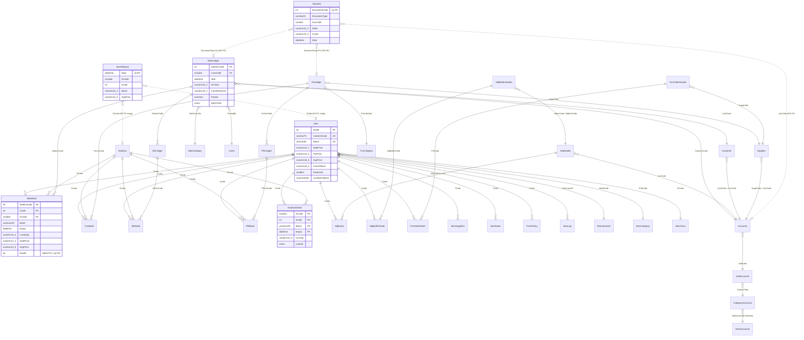

# 06 — Database Analysis & MySQL 8 Mapping

**System under analysis:** WASEELA ABUZAR V3 (vendor "Abuzar"/"Waseela"), deployment **Fazal Din PP19** — retail pharmacy
**Platform (existing):** Sybase/SAP PowerBuilder 12.5 32-bit desktop client → Microsoft SQL Server 2019 Express, database `FazalDinPP19DataBaseV2`, compatibility level 100 (SQL Server 2008)
**Target (proposed):** Node.js + React + MySQL 8
**Analysis stage:** Stage 6 — Physical & logical database analysis, relationship mapping, data-type audit, schema-risk register, MySQL 8 migration mapping
**Document status:** Deliverable for business owner + engineering team
**Analysis date:** 2026-08-01

---

## Evidence sources used

| Source | What it provided |
|---|---|
| `C:/Users/Admin/AppData/Local/Temp/claude/E--Pharma-Software/6817c053-0a3d-471f-ae16-ab90c079cc3d/scratchpad/table_columns.tsv` | 11,414 column definitions (type, length, precision, scale, nullability, default) |
| `.../table_rowcounts.tsv` | 762 tables with row counts (snapshot 2026-08-01 22:33) |
| `.../foreign_keys.tsv` | 1,730 FK column mappings |
| `.../primary_keys.tsv` | 1,037 PK column entries across 645 tables |
| `.../objects_catalog.tsv` | 762 programmable objects by type |
| `.../db_modules_full.sql` | 2.48 MB — full source of all 643 procedures, 74 functions, 34 views, 10 triggers |
| `E:/Pharma Software/extracted_scripts.sql` | 10.7 MB legacy DDL extract (CREATE TABLE, IDENTITY declarations, historic column types) |
| **Live database, read-only** `localhost\SQLEXPRESS.FazalDinPP19DataBaseV2` | `sys.identity_columns`, `sys.indexes`, `sys.index_columns`, `sys.foreign_key_columns`, `sys.triggers`, `sys.check_constraints`, `sys.database_files`, plus targeted `SELECT`/`COUNT`/`GROUP BY` probes on `_TABMAXKEY`, `_HeaderTabMaxKey`, `GodownDetail`, `Saledetail`, `SaleLedger`, `VirtualGl`, `DBCC_History`, `items_corrupted`, `Customer`, `Godown`, `Item` |
| `E:/Pharma Software/ABUZAR_V2_RECOVERY_JOURNAL.md` | Environment ground truth |

**No application source code exists.** No `.pbl` / `.srw` / `.sru` / `.srd` / `.pbt` files. The database schema and its 762 programmable objects are therefore the authoritative specification of the system. All conclusions below are drawn from schema metadata, SQL module source, and live data shape.

---

## Evidence-label legend

Every important finding in this document carries exactly one label:

| Label | Meaning |
|---|---|
| **Verified** | Read directly from schema metadata, procedure/function/trigger source, or live data. |
| **Strongly Inferred** | Not stated anywhere explicitly, but multiple independent pieces of evidence converge on it. |
| **Unclear** | Evidence is ambiguous or contradictory; needs human confirmation. |
| **Missing** | Expected artefact/feature is absent from the system. |
| **Deprecated** | Present in the schema but superseded, disconnected, or dead. |
| **Broken/Incomplete** | Present but demonstrably defective or half-finished. |
| **Recommended** | A proposal for the NEW system. **Not an existing feature.** |

> **Rule applied throughout:** a table being empty is evidence of **non-use at this deployment**, not evidence that the feature does not exist in the WASEELA product. The two are distinguished everywhere below.

---

## 1. Executive summary

**Verified.** The Fazal Din PP19 database is a **762-table, 11,414-column, ~2.9 GB SQL Server database** in which **only 255 tables (33.5%) contain any data at all**. 507 tables (66.5%) are completely empty. The populated third is a tight, conventional retail-pharmacy core — item master, single-warehouse batch stock, cash sales, sales return, purchase, purchase return, stock adjustment, and a double-entry general ledger — surrounded by a very large dormant surface of hospital/clinic (EMR), school, hotel/guest, textile/garment, HR-payroll, workshop, and multi-branch-replication verticals that this pharmacy has never switched on.

**Verified.** The schema is **structurally sound in one critical respect and structurally weak in several others**:

- **No `float` or `real` column exists anywhere in the database** (0 of 11,414 columns). Every monetary and quantity value is stored in exact `numeric`/`decimal`. This removes the single largest class of financial-migration risk. *Evidence: `table_columns.tsv` — DATA_TYPE histogram contains `numeric` 2,045, `decimal` 49, and zero `float`/`real`.*
- **117 of 762 tables have no primary key** (35 of them hold data), including the **four largest tables in the system**: `StockReport` (3.22 M rows), `VirtualGl` (1.02 M rows), `Saledetail` (620 K rows) and `DeletedSaleItem` (236 K rows). *Evidence: `primary_keys.tsv` covers only 645 distinct tables; live `sys.indexes` shows 33 populated tables are heaps.*
- **243 foreign-key columns on populated tables have no supporting index**, including 34 FK columns on `SaleLedger` alone. *Evidence: live query joining `sys.foreign_key_columns` against `sys.index_columns` where `key_ordinal = 1`.*
- **Batch/expiry tracking — the defining control of a pharmacy — is degenerate in practice.** 95.2% of `GodownDetail` rows carry the sentinel batch `'.'` with expiry `2030-12-12`, and 98.1% of `Saledetail` lines carry batch `'.'`. Only **62 distinct batch values** exist across the whole warehouse. *Evidence: live `GROUP BY Batch, Expiry` on `GodownDetail` (5,867 of 6,165 rows) and on `Saledetail` (609,055 of 620,619 rows).*
- **Primary-key generation does not use `IDENTITY` for any business document.** It uses a hand-rolled counter table `_TABMAXKEY` driven by `sp_GetTabMaxKey` / `SP_LockTabMaxKey` / `SP_UpdateTabMaxKey`, plus a second counter table `_HeaderTabMaxKey` driven by `sp_GetHeaderTabMaxKey`. These rely on SQL Server's `WITH (UPDLOCK HOLDLOCK)` semantics, which **have no direct MySQL equivalent** and must be deliberately re-engineered. This is the single highest-risk item in the migration. *Evidence: `dbo.sp_GetTabMaxKey` → `SELECT @key = TABMAXKEY FROM _TABMAXKEY WITH (UPDLOCK HOLDLOCK)`.*

**Verified.** The data is **recent and shallow**: `SaleLedger.date` spans **2025-01-01 → 2026-07-31** only (291,361 invoices, ~19 months), and `SaleInvCode` starts at **588,873**, not 1. Historical data before 2025 is not present in this database.

**Recommended.** A MySQL 8 rebuild should carry over roughly **90–110 tables** of real content, not 762. The other ~650 are either empty product surface for verticals this pharmacy does not run, or migration/replication scaffolding that has no place in a new system.

---

## 2. The database at a glance

### 2.1 Object inventory (Verified)

| Object type | Count | Evidence |
|---|---:|---|
| Tables | 762 | `table_rowcounts.tsv` |
| Columns | 11,414 | `table_columns.tsv` |
| Stored procedures | 643 | `objects_catalog.tsv` |
| Scalar functions | 53 | `objects_catalog.tsv` |
| Table-valued functions | 20 | `objects_catalog.tsv` |
| Inline table-valued functions | 1 | `objects_catalog.tsv` |
| Views | 34 | `objects_catalog.tsv` |
| Triggers (DML) | 10 | live `sys.triggers`, all enabled |
| **Total programmable objects** | **762** | |
| Indexes (clustered) | 653 | live `sys.indexes` |
| Indexes (non-clustered) | 328 | live `sys.indexes` |
| Primary keys | 645 tables / 1,037 columns | `primary_keys.tsv` |
| Composite primary keys | 265 tables | `primary_keys.tsv` |
| Foreign-key constraints | 1,730 | `foreign_keys.tsv` (1 column each) |
| Unique constraints | 255 | live `sys.key_constraints WHERE type='UQ'` |
| **Check constraints** | **23** | live `sys.check_constraints` — **almost no declarative validation** |
| Default constraints | 3,648 | live `sys.default_constraints` |
| Database size | ~2,898 MB | live `sys.database_files` |
| Database collation | `SQL_Latin1_General_CP1_CI_AS` | live `DATABASEPROPERTYEX(...,'Collation')` |

### 2.2 Storage concentration (Verified — live `sys.allocation_units`)

| Table | Size | Rows (live) | Share of DB |
|---|---:|---:|---:|
| `Saledetail` | 599 MB | 620,619 | 20.7% |
| `VirtualGl` | 320 MB | 1,021,852 | 11.0% |
| `StockReport` | 264 MB | 3,215,967 | 9.1% |
| `SaleLedger` | 245 MB | 291,361 | 8.5% |
| `Purdetail` | 208 MB | 113,082 | 7.2% |
| `ItemLog` | 195 MB | 109,473 | 6.7% |
| `Item` | 124 MB | 30,052 | 4.3% |
| `PurOrderDetail` | 86 MB | 108,423 | 3.0% |
| `SRLedger` | 39 MB | 30,695 | 1.3% |
| `DeletedSaleItem` | 37 MB | 235,887 | 1.3% |
| `SRdetail` | 34 MB | 44,563 | 1.2% |
| `Purledger` | 19 MB | 6,417 | 0.7% |

**Strongly Inferred.** `Saledetail` occupies 599 MB for 620 K rows ≈ **1,010 bytes per sale line**. This is grossly oversized for a pharmacy line item; it is a direct consequence of the table carrying **72 columns**, of which the majority (garment width/length, meter readings, dosage instructions, FBR SRO schedule fields, quotation links) are unused at this deployment. The same pattern explains `SaleLedger` at 245 MB / 291 K rows ≈ 840 bytes per invoice header across **148 columns**.

### 2.3 Row-count drift caution (Verified)

The TSV snapshot (2026-08-01 22:33) and a live re-count taken ~40 minutes later differ:

| Table | TSV snapshot | Live re-count | Δ |
|---|---:|---:|---:|
| `SaleLedger` | 291,334 | 291,361 | +27 |
| `Saledetail` | 620,525 | 620,619 | +94 |
| `VirtualGl` | 1,015,581 | 1,021,852 | +6,271 |
| `Item` | 30,050 | 30,052 | +2 |
| `Rights` | 483 | 486 | +3 |
| `GroupRights` | 720 | 726 | +6 |
| `ItemImage` | 100 | **361** | +261 |

**Verified.** The pharmacy is live and trading; row counts move continuously. The `ItemImage` discrepancy (100 → 361) is disproportionate and suggests the snapshot's counting method under-reported at least that table. **Recommended:** at cut-over, re-derive every row count with `COUNT(*)`, never from `sys.partitions`, and reconcile source vs target counts table-by-table.

---

## 3. Table catalog by functional domain

### 3.0 Domain totals (Verified)

| Domain | Tables (core) | Rows |
|---|---:|---:|
| Inventory / Stock | 11 | 3,357,662 |
| Sales | 10 | 1,242,517 |
| Accounting / General Ledger | 9 | 1,016,082 |
| Purchase | 7 | 240,490 |
| Item master & pricing | 9 | 143,403 |
| Sales Return | 2 | 75,258 |
| Legacy `cmh_*` staging | 13 | 13,952 |
| Security & rights | 12 | 9,678 |
| Purchase Return | 2 | 3,115 |
| **Whole database** | **762** | **6,107,080** |

---

### 3.1 Core transactional tables — USED

| Table | Rows | Cols | PK | Purpose (evidence-based) | Status |
|---|---:|---:|---|---|---|
| `StockReport` | 3,215,967 | 9 | **none (heap)** | Daily per-item/per-godown stock + valuation snapshot. Columns `Date, GCode, ICode, Stock numeric(15,4), PurchasePrice, SalePrice, AvgPrice numeric(15,5), RecentPurchasePrice, PackUnits`. Live probe: **545 distinct dates, 2025-01-01 → 2026-07-31**, ≈5,901 rows/day. | **USED** — hot |
| `VirtualGl` | 1,021,852 | 26 | **none (heap)** | The double-entry general ledger. `DocumentCode, DocumentType varchar(20), AccCode, CatCode, AlternateAccCode, Debit numeric(15,2), Credit numeric(15,2), Date, VoucherCode, INVOICECODE, OUTSTANDINGAMT, BALANCE, InvoiceType, CurrencyCode, ConversionRate numeric(11,5)`. Live `GROUP BY DocumentType`: **SV 908,617 / SR 93,050 / PV 18,790 / PR 1,395** — i.e. only four document types are ever posted. | **USED** — hot |
| `Saledetail` | 620,619 | 72 | **none**; clustered non-unique on `SaleInvcode` | Sale invoice lines. Natural key is `(SaleInvcode, ICode, GCode, Batch, Expiry)` but is **not enforced**. `RowID int IDENTITY` exists (last value 620,621) but is **not** a PK. | **USED** — hot |
| `SaleLedger` | 291,361 | **148** | `SaleInvCode` | Sale invoice header. Live: `SaleInvCode` min **588,873**, max **880,233**; `date` 2025-01-01 → 2026-07-31. | **USED** — hot |
| `DeletedSaleItem` | 235,887 | 14 | **none (heap, no index at all)** | Audit trail of sale lines removed from an invoice before/after posting: `ICode, GCode, PackUnits, Qty, BonusQty, SalePrice, DiscPerc, ItemFlatDisc, UnitSalesTax, GSTPerc, Date, MachineName, UserCode, SaleInvCode`. 236 K deletions against 291 K invoices is a very high rate. | **USED** — audit |
| `Purdetail` | 113,082 | 60 | `(PurInvCode, Gcode, ICode, Batch, Expiry)` | Purchase (goods-receipt) lines; carries `AvgPrice`/`NewAvgPrice numeric(15,5)` — the weighted-average cost recalculation point. | **USED** |
| `ItemLog` | 109,473 | **139** | `(ICode, ItemRowID)` | Full-row change log of `Item`: every column of `Item` duplicated plus `ItemRowID bigint IDENTITY`, `LogDate`, `NewSalePrice`, `Stock`. Written by trigger/proc on item edit. | **USED** — audit |
| `PurOrderDetail` | 108,423 | 37 | `(POCode, ICode)` | Purchase-order lines with reorder analytics (`ReorderQty, OptimumQty, SoldQty, ReturnQty, QtySatisfied, TransitStock`). | **USED** |
| `PreviousSaleHistory` | 94,317 | 6 | **none (heap)** | Pre-aggregated per-item per-date sales rollup: `Date, ICode, SaleQty numeric(19,4), ReturnQty, SaleValue, ReturnValue`. Denormalized reporting cache. | **USED** — derived |
| `SRdetail` | 44,563 | 37 | **none**; clustered non-unique on `SRInvcode` | Sale-return lines. `RowId int IDENTITY` present but not a PK. | **USED** |
| `SRLedger` | 30,695 | 79 | `SRInvCode` | Sale-return invoice header; FK `SaleInvCode → SaleLedger`. | **USED** |
| `PricePolicy` / `PricePolicyDetail` | 30,052 / 30,052 | 3 / 6 | `PricePolicyCode` / `(PricePolicyCode, QtyLimit)` | Quantity-break pricing. 1:1 row ratio and 30,052 ≈ item count ⇒ **one policy per item with exactly one tier**. | **USED** but degenerate |
| `Item` | 30,052 | **135** | `ICode` | Item master. Unique indexes on `Name`, `CustomICode`, `RegdNo`. | **USED** — hot |
| `ItemNotes` | 30,046 | 2 | `ICode` | `ICode int, Notes image` — one free-text/rich note blob per item, stored in the deprecated `image` type. | **USED** |
| `ItemSuppliers` | 22,246 | 8 | `(ICode, SuppCode)` | Item↔supplier price/priority matrix (`Priority, Rate, DiscPerc, SaleQty, BonusQty, days`). | **USED** |
| `AdjBufferDetail` / `AdjBufferHeader` | 12,270 / 1,061 | 6 / 15 | `(AdjBufferCode, ICode)` / `AdjBufferCode` | **Physical stock-take buffer.** Detail columns are `AdjBufferCode, ICode, RowId, StockInHand, StockOnShelf, AlternateCustomICode`; header links to the generated `AdjIncCode`/`AdjDecCode` adjustment documents. | **USED** |
| `AdjDetail` / `AdjHeader` | 11,181 / 1,539 | 18 / 18 | `(AdjCode, GCode, ICode, Batch, Expiry)` / `AdjCode` | Stock adjustment (increase/decrease) documents with `UpdateAvgPrice` flag and `NewAvgPrice`. | **USED** |
| `LastPurchaseHistory` | 9,746 | 23 | **none (heap)** | Denormalized "last purchase per item" cache including the **supplier name as text** (`Supplier varchar(100)`), not a FK. | **USED** — derived |
| `Purledger` | 6,417 | **100** | `PurInvCode` | Purchase invoice header. `PurInvCode` runs 1 → 6,419. | **USED** |
| `GodownDetail` | 6,165 | 10 | `(GCode, ICode, Batch, Expiry)` | **The live stock-on-hand table.** `CurrQty numeric(15,4)`, `Priority`, `Locked`, `LockReasonCode`, `LastUpdated`. Maintained by trigger `Trig_GodownDetail_AfterUpdate_LastUpdated`. | **USED** — hot |
| `PurOrderHeader` | 2,810 | 53 | `POCode` | Purchase orders. | **USED** |
| `PRdetail` / `PRLedger` | 2,481 / 634 | 23 / 50 | `(PRInvCode, ICode, Gcode, Batch, Expiry)` / `PRInvCode` | Purchase-return document. | **USED** |
| `SaleTemplateDetail` / `SaleTemplateHeader` | 320 / 93 | 18 / 5 | none / `SaleTemplateCode` | Saved "repeat prescription"-style sale templates. | **USED** — light |

### 3.2 Accounting / chart of accounts — USED

| Table | Rows | Purpose | Status |
|---|---:|---|---|
| `Accounts` | 264 | Ledger accounts: `AccCode smallint, SubCode, Name, OpeningDate, AliasName varchar(12), Active, Restricted, BalanceLimit numeric(15,2), Remarks varchar(1000), AlertCode, LocalAccountName nvarchar(255)`. FK `SubCode → SubAccounts`. | **USED** |
| `SubAccounts` | 29 | Second level: `SubAccCode, CatAccCode, Name`. | **USED** |
| `CategoryAccounts` | 13 | Third level: `CatAccCode, MainAccCode, Name`. | **USED** |
| `MainAccounts` | 5 | Top level: `MainAccCode, Name`. | **USED** |
| `VocherCategory` | 22 | Voucher types with per-category `Counter`, `JournalVoucher`, `HeaderTreatment`, `DetailTreatment` flags. | **USED** |
| `VocherCategoryHeader` / `VocherCategoryDetail` | 20 / 114 | Which sub-accounts a voucher category may debit/credit. | **USED** |
| `CustBalances` | 34 | `Acccode decimal(5,0), Balance decimal(15,5)` — heap, no PK. **Unclear** whether live or a leftover balance-rebuild scratch table; nothing in `db_modules_full.sql` writes to it under that exact name in the sale/purchase posting path. | **Unclear** |
| `GLDetail` / `Glheader` | 0 / 0 | The *manual journal voucher* module. **Empty** ⇒ no manual JVs are entered at this deployment; all GL rows arrive via automatic posting into `VirtualGl`. | **DORMANT** (product feature exists) |

> **Note — 4-level chart of accounts.** `MainAccounts(5) → CategoryAccounts(13) → SubAccounts(29) → Accounts(264)`. **Verified** from the FK chain `Accounts.SubCode → SubAccounts.SubAccCode`, `SubAccounts.CatAccCode → CategoryAccounts.CatAccCode`. `CategoryAccounts.MainAccCode → MainAccounts` is **Strongly Inferred** from the column name and cardinality; a matching FK constraint was not observed in `foreign_keys.tsv`.

### 3.3 Security, rights and configuration — USED

| Table | Rows | Purpose | Status |
|---|---:|---|---|
| `Rights` | 486 | Right definitions: `RightCode, RightName varchar(150), MenuName, LevelIndex, IndicesString, Object char(1), RightCatCode`. `IndicesString`/`LevelIndex` encode a **menu-tree path**, i.e. rights are bound to compiled PowerBuilder menu positions. | **USED** |
| `GroupRights` | 726 | `(GroupCode, RightCode, Status tinyint)` — effective grants. | **USED** |
| `Groups` | 4 | Role definitions with **29 embedded behaviour columns** (`saleinvflatdisc`, `saleItemdiscperc`, `SaleGodownStrategy`, `PurchaseGodownStrategy`, …) — i.e. business policy is stored *on the role*. | **USED** |
| `Users` | 9 | `UserCode, UserName, **Password varchar(60)**, FatherName, Address, Phone, Active`. **Passwords are plaintext.** | **USED** — critical risk |
| `UserGroups` / `UserGroupsLog` | 9 / 9 | User↔group assignment plus change log. Trigger `Trig_UserGroups_After_Update_Delete` maintains the log. | **USED** |
| `Module` | 57 | Functional module registry (`Module smallint, Name varchar(30)`). Drives `_HeaderTabMaxKey.Module` and `GroupAllowed*`. | **USED** |
| `Rightsclone` | 2,094 | **Exact structural clone of `Rights`** with 4.3× the rows. Heap, no PK. | **Deprecated / migration-only** |
| `temp_GroupRights` | 6,265 | **Exact structural clone of `GroupRights`** with 8.6× the rows. Heap, no PK. | **Deprecated / migration-only** |
| `GroupAllowedPrice` (54), `GroupCashAccount` (43), `GroupAllowedHeader` (35), `GroupAllowedGodown` (33), `GroupVoucherCategory` (25), `GroupAllowedRecipient` (8) | — | Per-role scoping of price types, cash accounts, print headers, godowns, voucher categories, SMS recipients. | **USED** |
| `SoftwarePreferences` | 1,352 | Name/value preference registry read by `dbo.Fn_GetPreference(@PrefName)` → `SELECT PrefValue FROM SoftwarePreferences WHERE LOWER(Name)=LOWER(@prefname)`. Includes a `PrefImage image` column. | **USED** — critical |
| `Preferences` | 1 | **443-column single-row legacy preference table** (319 `char` flags, 64 `varchar`, 19 `smallint`, 19 `tinyint`, 12 `int`, 6 `datetime`, 2 `numeric`, 1 `text`, 1 `image`). | **USED** but architecturally obsolete |
| `PreferencesCategory` / `PreferencesSubCategory` | 37 / 155 | Preference UI grouping. | **USED** |
| `InterfaceSetting` | 725 | Per-module column captions/visibility for DataWindow grids: `(ModuleId, colname, WinType)`. | **USED** — UI metadata |
| `ConfigSetting` | 9 | `Name varchar(100), VALUE varchar(200)`. | **USED** |
| `Global` | 79 | `Name, TableName, Code numeric(5,0), Description` — global default-code registry. | **USED** |
| `ColumnEditStyle` (5), `ColumnPreferences` (1), `ReportTitles` (6), `ReportFilter` (2), `WindowType` (5), `StartupRight` (5), `SpecialRight` (4) | — | UI/report metadata. | **USED** — light |
| `ReportData` | 7 | **51-column universal report scratch table.** 60 procedures begin with `DELETE REPORTDATA` then `INSERT INTO ReportData (Code1, Name1, Value1, Date1, …)`. It is a *shared global temp table*, not a real entity. | **USED** — runtime scratch, **Broken by design** |
| `UserAuthenticationInfo` | 1 | `AuthenticationKey varchar(20)`, heap, no PK. | **Unclear** |

### 3.4 Master data & lookups — USED

**Verified.** 167 populated tables are pure `(Code, Name[, Description])` lookups. The commercially meaningful ones for this pharmacy:

| Table | Rows | Note |
|---|---:|---|
| `Manufacturer` | 838 | Pharma companies. FK targets from `Item.ManfCode` and `Purdetail.ManfCodeForItem`. |
| `Supplier` | 235 | 28 columns; `SuppCode → Accounts.AccCode` (supplier IS a ledger account). |
| `ItemCategory` | 7 | With `SaleExpiryDays`, `PurMonthlyCounter`, `PurDailyCounter`. |
| `ItemClass` | 12 | `NumericalFactor` used in stock maths. |
| `Godown` | **1** | Single row: `GCode=1, Name=' GODOWN1'` (note the **leading space**). **Single-warehouse deployment.** |
| `Customer` | **2** | `19 = RETAIL SALE CUSTOMER`, `22 = WHOLE SALE CUSTOMER`. `CustCode → Accounts.AccCode`. 82 columns for 2 rows. |
| `SalesMan` | 1 | Placeholder. |
| `Currency` | 1 | Single currency; `ConversionRate` columns everywhere are effectively constant 1. |
| `PurCategory` (8), `SaleCategory` (15), `AdjCategory` (2), `PurOrderCategory` (4) | — | Document sub-types driving `*CatCode` on each ledger. |
| `SalesTaxSchedule` (7), `TaxCategory` (3), `PCT` (3), `GSTRules` (4), `GSTType` (3), `AdditionalTaxRule` (4), `ExtraTaxRule` (4), `IncomeTaxRule` (4), `CustomDutyRule` (4), `UnitSalesTaxRules` (4) | — | Pakistan tax rule catalogues. |
| `FBR_DI_UOM` (43), `FBR_DI_Scenario` (28), `FBR_DI_TransactionType` (26), `FBR_DI_DocType` (2) | — | **FBR Digital Invoicing** lookups, seeded. Paired with `SaleLedger.Digitalized/DigitalizedOn/DigitalInvoiceNo/ScenarioID/BuyerNTN/BuyerRegStatus` and `Saledetail.HSCode/UOM/TransType/RateOfTax/SROScheduleNo/sroItemSerialNo`. |
| `ItemAlert` (5), `ItemAlertType` (4), `Alert` (1), `AlertType` (4) | — | Item warning banners with `BGColor`. |
| `LockReason` (1) | — | Referenced by `GodownDetail.LockReasonCode` and `Purdetail.LockReasonCode` (batch quarantine). |
| `PriceType` (8), `GroupAllowedPrice` (54) | — | Multi-price-list capability (`Item.SalePrice`…`SalePrice5`). |
| `WeighingScale` (1), `PackingLayout` (8) | — | Hardware integration lookups. |
| `SMS_DataDefinition` (26), `SMS_Type` (13), `SMS_Status` (3) | — | SMS gateway definitions (the 15 `VIEW_SMS_*` views feed these). `SMS_Center` and `SMS_Template` are **empty** ⇒ SMS not configured here. |

**Verified — single-row lookups that are effectively placeholders (73 tables with exactly 1 row):** `Area, Region, SubArea, ItemBrand, ItemDesign, ItemFabric, ItemPacking, ItemPart, ItemSize, ItemSleeve, ItemThickness, ItemYarn, ItemStyle(2), ItemColour(2), GenericItem, GenericItemType, MeasuringUnit, Unit, Rank, School, SchoolBranch, Surgery, SurgeryProcedure, Disease, DiseaseType, EyeVision, IOLPower, Gestation, DoctorCategory, PatientCategory, LockerCategory, ResourceCategory, Resource, ServiceCategory, ServiceType, ServiceInvType, ServiceOrderStatus, ServiceResultStamp, Shift, TestMachine, TransportRoute, Vehicle, VehicleType, MotorVehicleType, WorkOrderType, WorkOrderAccount, ProductType, ProductPurpose, ClassType, ClassMedium(2), DischargeReason, Relation, Message, GodownGroup, GroupSummaryAccount, CategorySegment, CustomerCategory, CustomerSector, CustomerSegment, SupplierCategory, ManufacturerCategory, ManufacturerType, AgingInterval, ContactPolicy, ContactPolicyDetail, HeaderLogo, CurrencyDenomination, EMP_Category, EMP_Department, EMP_Designation, IssueCategoryAccounts, ReceiptCategoryAccounts, SaleOrderCategory`.

**Strongly Inferred.** These exist only to satisfy `NOT NULL DEFAULT 1` foreign keys on `Item` and other masters (e.g. `Item.ISizeCode smallint NOT NULL DEFAULT (1)`, `Item.IYarnCode`, `Item.IFabricCode`, `Item.ISleeveCode`). They are **garment/textile-vertical residue** forced into a pharmacy schema. *Evidence: `Item` has FKs to `ItemColour, ItemFabric, ItemSleeve, ItemYarn, ItemThickness (×2), ItemSize, ItemStyle, ItemBrand, ItemDesign` — all pointing at 1-row tables.*

### 3.5 Legacy `cmh_*` staging — DEPRECATED (migration-only)

| Table | Rows | Note |
|---|---:|---|
| `cmh_item` | 11,432 | 35 columns; column names are truncated 10-char DBF-style identifiers (`retailpric`, `salediscper`), quantities as `decimal(3,0)`. Heap, no PK. |
| `cmh_accounts` | 981 | `accode, subcode, name, opendate, currbal, bbaldt, bbal, cbal, sbal, …` |
| `cmh_customer` | 856 | |
| `cmh_manufact` | 533 | |
| `cmh_supplier` | 125 | |
| `cmh_itemcat` (8), `cmh_salesman` (7), `cmh_area` (3), `cmh_custtype` (2), `cmh_region` (2), `cmh_godown` (1), `cmh_iclass` (1), `cmh_packing` (1) | | |
| `CMH_messages` | 0 | |

**Strongly Inferred.** The `cmh_*` family is a one-time import landing zone from a **prior DOS/FoxPro-era system** (10-character column names, `decimal(3,0)` quantities, `currbal/bbal/cbal/sbal` naming). All 13 populated tables are heaps with no primary key and **zero foreign keys in either direction** — nothing in the live schema references them. **Verified:** no `cmh_` table appears as `ParentTable` or `RefTable` anywhere in `foreign_keys.tsv`.

### 3.6 Dormant domains — EMPTY (feature exists in product, unused at this deployment)

**Verified.** 507 tables hold zero rows. Grouped compactly:

| Vertical / subsystem | Table count | Representative tables |
|---|---:|---|
| **`CRS_*` — central/branch replication** | 71 (2 populated: `CRS_TransferableData` 63, `CRS_Transactions` 11) | `CRS_SaleLedger, CRS_SaleDetail, CRS_PurLedger, CRS_VirtualGl, CRS_Customer, CRS_Users, CRS_ClientList, CRS_DataTransferLog…` — a full shadow copy of the core schema for multi-site consolidation. |
| **Hospital / clinic / EMR** | ~85 | `Patient, PatientAdmission, PatientTransfer, Visit, VisitVitals, VisitICD, VisitPrescription, VisitDiagnostics, PrescriptionHeader/Detail, Doctors, DoctorDutyRoster, Ward, ICDList, LabInvestRec, EmrLabInvestRec, PrevAbnormalLabs, TreatmentGiven, DischargePrescription, DeathCertificate, BirthCertificate, ProvDiag, Precaution, VaccineSchedule, Samples, SampleDetail` |
| **Cardiology / radiology reports** | 13 | `ECG, Echo, XRay, CTAngiogram, CoronoryAngiogram, CoronoryAngioplasty, CABG, ThaliumScan, ABD_US, GYN_US, OBS_US, HPC, GPE, SE, PC` |
| **Services / lab invoicing** | ~40 | `Service, ServiceHeader/Detail, ServicePurHeader/Detail, ServicePRHeader/Detail, ServiceRHeader/Detail, ServiceOHeader/ODetail, ServiceComponent*, ServiceResultHeader/Detail, ServiceTicket, ServiceTemplate*` |
| **`EMP_*` — HR & payroll** | 29 (5 tiny lookups populated) | `EMP_Employee, EMP_Attendance, EMP_Payroll, EMP_Pay, EMP_Advance, EMP_Allowance, EMP_Deduction, EMP_FingerPrint, EMP_Image, Emp_Holiday` |
| **School / education** | ~14 | `Student, StudentClass, StudentFeeSheet, Class, ClassGraduation, ClassPromotion, Grade, SchoolLeaving, StudentServiceTemplate*` |
| **Hotel / guest** | 9 | `Guest, GuestCheckin, GuestRoom, GuestRoomType, GuestRoomFloor, GuestRoomStatus, GuestRoomService, GuestCheckInService, GuestTransfer` |
| **Cashier station / shift** | 10 | `CashierWindow, CashierShift, CashierShiftUsers, CashierShiftCashCount, CashierJob, CashierJobModule, CashierActivity, CashierTemplate, MasterCashWin, ActivityMonitor` |
| **`DB_*` — "drop-box" data exchange** | 14 | `DB_SaleLedger, DB_Saledetail, DB_Purledger, DB_Purdetail, DB_PRLedger, DB_PRdetail, DB_SRLedger, DB_SRdetail, DB_PurOrderHeader/Detail, DB_IssueHeader/Detail, DB_ExpiryIntimation(Detail)`. Consumed by view `View_DB_DropBox`. |
| **`IMP_*` / `Imp*` — import staging** | 11 | `IMP_SaleLedger, IMP_Saledetail, IMP_SRLedger, IMP_SRDetail, IMP_AdvSaleLedger, IMP_AdvSaleDetail, IMP_CashierWindow, IMP_MasterCashWin, ImpPurHeader, ImpPurDetail, ImpPurExp` |
| **Production / manufacturing** | 8 | `ProdHeader, ProdDetail, ProdBuffer, ProdNote, ProdNoteIssue, ProdNoteReceipt, Recipe, RecipeDetail` |
| **Installments / loyalty / membership** | ~15 | `InstallmentHeader/Detail/Receipt/Security/Guarantor, LoyaltyCard, LoyaltyCardLedger, LoyaltyPolicy(Detail), LoyaltyPointAdjustment, LoyaltyRedemption, MembershipRenewal, old_MembershipRenewal` |
| **Receivables / payables workflow** | ~20 | `ReceiptHeader/Detail, IssueHeader/Detail, IssueReqHeader/Detail, DueSatisfyHeader/Detail, TryDueSatisfyHeader/Detail, DueAdjHeader/Detail, DueDeleteDetail, Notes, NotesDetail, SRAllocationHeader/Detail, PRAllocationHeader/Detail, SaleReceivableAdj` |
| **Quotation / sale order / pre-sale** | ~12 | `QuotationHeader/Detail, SaleOrderHeader/Detail, SaleOrderItemStatus, PreSaleHeader/Detail, PurQuotationHeader/Detail, ProformaPurDetail, RefusedSaleHeader/Detail` |
| **Advance sale/purchase & import purchase** | 6 | `AdvSaleLedger, AdvSaleDetail, AdvPurHeader, AdvPurDetail, ImpPurHeader, ImpPurDetail` |
| **Workshop / work orders / packing** | ~14 | `WorkOrder, WorkOrderAssessment, WorkOrderResource, PackingJob(Detail/Pending/Source), PackingCaseCapacity, DispatchHeader/Detail, TransferRequisitionHeader/Detail` |
| **Vendor licensing / deployment** | ~12 | `CustomerLicense, CustomerLicRequest, LicenseCategory, License, CustomerDeployment(Detail), ProspectiveCustomer, AppVersion(Detail), ClientSetup, Setup, Site` |
| **`pbcat*` — PowerBuilder DataWindow catalog** | 5 | `pbcatcol, pbcatedt, pbcatfmt, pbcattbl, pbcatvld` — **Deprecated**; PowerBuilder extended-attribute catalogue, all empty. |
| **Misc dead** | — | `A, dtproperties, syscommants, wrongitemtable, p_manufacturer1, salepricecategory, Fzcity, CrossTab_ReportData, StockLedger, VirtualGlTemp, DropData` |

> **Interpretation (Strongly Inferred).** WASEELA ABUZAR is a **single-codebase vertical-market platform** — pharmacy, hospital, school, hotel, garment retail, workshop and production are all shipped in one binary and one schema, gated by `Module`, `Rights`, `SoftwarePreferences` and licence. Fazal Din PP19 runs **only the pharmacy retail path**.

---

## 4. Relationship map

### 4.1 Foreign-key inventory (Verified)

| Metric | Value |
|---|---:|
| FK constraints | 1,730 |
| FK column mappings | 1,730 (every FK is single-column — **no composite FKs exist**) |
| FKs whose parent table is populated | see §6.3 |
| FK columns on populated tables **without a supporting index** | **243** |

**Verified — most-referenced masters:**

| Master table | Tables referencing it | …of which populated |
|---|---:|---:|
| `Item` | 79 | 12 |
| `Accounts` | 61 | 8 |
| `Customer` | 44 | 5 |
| `Godown` | 37 | 8 |
| `SaleLedger` | 22 | 3 |
| `Supplier` | 15 | 4 |
| `Purledger` | 7 | 2 |

### 4.2 Core transactional clusters (Verified — from `foreign_keys.tsv`)

**Sales cluster**
```
SaleLedger (PK SaleInvCode)
  ├─ Saledetail.SaleInvcode  → SaleLedger.SaleInvCode
  ├─ SRLedger.SaleInvCode    → SaleLedger.SaleInvCode      (return references original sale)
  └─ SaleLedger.RecurringAgainst → SaleLedger.SaleInvCode  (SELF-REFERENCE)
Saledetail
  ├─ .ICode      → Item.ICode
  ├─ .DescICode  → Item.ICode          (second FK to Item — descriptive/alias item)
  └─ .GCode      → Godown.GCode
SaleLedger → Accounts (×2: CashAccCode, PaymentAccCode)
SaleLedger → Users   (×7: PostedBy, ModifiedBy, AmtBY, SalesmanCode, TransferedBy, ImportedBy, deliveredby*)
SaleLedger → Customer.CustCode, SaleCategory, SaleType, Currency, Message, SalesMan
```
*`deliveredby` and `SManCode` point at `SalesMan.SalesManCode`; `SalesmanCode` points at `Users.UserCode` — **two different salesman notions on the same table**.*

**Purchase cluster**
```
Purledger (PK PurInvCode)
  ├─ Purdetail.PurInvCode → Purledger.PurInvCode
  └─ PRLedger.PurInvCode  → Purledger.PurInvCode
Purdetail → Item.ICode, Godown.Gcode, Manufacturer.ManfCodeForItem,
            SalesTaxSchedule, PCT, ItemAlert, LockReason
Purledger → Supplier.SuppCode, Customer.CustCode, Accounts.PaymentAccCode,
            PurCategory, PurchaseType, TaxCategory, Currency, Users(×5)
PurOrderHeader (PK POCode) → Supplier, Manufacturer, Customer, PurOrderCategory, Currency, Users
  └─ PurOrderDetail.POCode → PurOrderHeader.POCode ; .ICode → Item.ICode
```

**Return clusters**
```
SRLedger (PK SRInvCode) → SaleLedger.SaleInvCode, Customer, Accounts(×2), SaleCategory, Users(×4)
  └─ SRdetail.SRInvcode → SRLedger.SRInvCode ; .Icode → Item ; .Gcode → Godown
PRLedger (PK PRInvCode) → Purledger.PurInvCode, Supplier, Customer(×2), Accounts, PurCategory, Users(×4)
  └─ PRdetail.PRInvCode → PRLedger.PRInvCode ; .ICode → Item ; .Gcode → Godown
```

**Stock cluster**
```
GodownDetail  PK (GCode, ICode, Batch, Expiry)  → Godown, Item, LockReason      ← LIVE STOCK
StockReport   no PK, no FK                                                       ← DAILY SNAPSHOT (orphan by design)
AdjBufferHeader → AdjHeader (AdjIncCode, AdjDecCode), Godown, Users(×3)
  └─ AdjBufferDetail.AdjBufferCode → AdjBufferHeader ; .ICode → Item
AdjHeader → AdjCategory, Accounts.AccCode
  └─ AdjDetail (no FK declared to AdjHeader — joined on AdjCode by convention)
ItemLog → 26 FKs mirroring every Item FK
```

**GL cluster — Broken/Incomplete**
```
VirtualGl  (1.02 M rows)
  outgoing FKs: ONLY  .GuestCode → Guest   and  .StudentCode → Student
  NO FK on AccCode → Accounts
  NO FK on DocumentCode/DocumentType → SaleLedger / Purledger / SRLedger / PRLedger
```
**Verified.** The general ledger — the most financially significant table in the database — has **no referential integrity to the chart of accounts and no referential integrity to the source documents**. Its only two declared FKs point at tables that are empty (`Guest`, `Student`). Linkage is by convention: `DocumentType ∈ {SV, SR, PV, PR}` + `DocumentCode` = the source invoice code.

**Security cluster**
```
Users ──< UserGroups >── Groups ──< GroupRights >── Rights ──> RightsCategory
Groups → SaleType, ServiceTemplateHeader
GroupAllowedGodown/Header/Price/Recipient, GroupCashAccount, GroupVoucherCategory → Groups + Module
```

### 4.3 Mermaid ER diagram — 25 core pharmacy tables



### 4.4 Relationship weaknesses (Verified)

| # | Weakness | Evidence | Severity |
|---|---|---|---|
| R1 | `VirtualGl.AccCode` has **no FK** to `Accounts.AccCode` | `foreign_keys.tsv`: `VirtualGl` has exactly 2 outgoing FKs, to `Guest` and `Student` | **Critical** |
| R2 | `VirtualGl` has no FK to any source document | same | **Critical** |
| R3 | `AdjDetail.AdjCode` has **no FK** to `AdjHeader.AdjCode` | `foreign_keys.tsv`: `AdjDetail` has no outgoing FK rows | High |
| R4 | `StockReport` has no PK, no FK, and no unique index — duplicate daily snapshots are structurally possible | live `sys.indexes`: only `IDX_StockReport_Date` (non-clustered, non-unique) | High |
| R5 | `Saledetail` and `SRdetail` have non-unique clustered indexes and no PK — duplicate lines are structurally possible | live `sys.indexes` | High |
| R6 | `Customer.CustCode` and `Supplier.SuppCode` are simultaneously PKs of their own tables **and** FKs into `Accounts.AccCode` — a shared identifier space across three tables with no cross-table uniqueness enforcement | `foreign_keys.tsv` | Medium |
| R7 | 1,730 FKs point overwhelmingly at empty tables — enabling FK enforcement in MySQL will succeed only because the child tables are also empty | derived | Medium |
| R8 | No composite FKs exist, so the 4-part batch key `(GCode, ICode, Batch, Expiry)` in `Saledetail`/`Purdetail`/`SRdetail`/`PRdetail`/`AdjDetail` is **never** referentially tied to `GodownDetail` | `foreign_keys.tsv`: all 1,730 FKs are single-column | **High** |

---

## 5. Data-type analysis

### 5.1 Type distribution (Verified — 11,414 columns)

| SQL Server type | Columns | % |
|---|---:|---:|
| `varchar` | 2,638 | 23.1% |
| `smallint` | 2,128 | 18.6% |
| `numeric` | 2,045 | 17.9% |
| `int` | 1,748 | 15.3% |
| `char` | 1,578 | 13.8% |
| `datetime` | 834 | 7.3% |
| `tinyint` | 295 | 2.6% |
| `bigint` | 61 | 0.5% |
| `decimal` | 49 | 0.4% |
| `image` | 17 | 0.15% |
| `nvarchar` | 15 | 0.13% |
| `bit` | 3 | 0.03% |
| `text` | 2 | 0.02% |
| `ntext` | 1 | 0.01% |
| **`float`** | **0** | **0%** |
| **`real`** | **0** | **0%** |

### 5.2 `float` / `real` audit — the good news

> ### ✅ **Verified: ZERO `float` and ZERO `real` columns exist in the entire database.**
>
> Every one of the 11,414 columns was checked. No money, quantity, price, tax, discount or rate value anywhere in WASEELA is stored in binary floating point. All 2,094 numeric columns are exact `numeric(p,s)` or `decimal(p,s)`.
>
> *Evidence: `table_columns.tsv`, full DATA_TYPE histogram (§5.1). Filter `DATA_TYPE IN ('float','real')` returns 0 rows.*

**Implication for the rebuild.** The most common catastrophic finding in legacy financial migrations — money stored in `float` — **does not apply here**. Provided the MySQL target uses `DECIMAL(p,s)` (never `DOUBLE`/`FLOAT`) and the Node.js layer never round-trips money through JavaScript `Number`, financial values will migrate bit-exact.

**Recommended (new system).** The JavaScript `Number` type is IEEE-754 double — it *is* the float risk that the database avoided. Every monetary value crossing the Node/MySQL boundary must be handled as a string or a fixed-point/BigInt representation (`decimalNumbers: false` in mysql2, or an explicit `Decimal` library), and never as a bare `Number`.

### 5.3 Numeric precision/scale inventory (Verified — 2,094 columns)

| Declared type | Columns | Typical use |
|---|---:|---|
| `numeric(12,2)` | 571 | Unit prices, per-line discounts, misc charges |
| `numeric(15,2)` | 339 | Invoice totals, GL debit/credit, balances, outstanding amounts |
| `numeric(15,4)` | 317 | **Quantities** (loose/pack/bonus qty, stock, current qty) |
| `numeric(5,2)` | 231 | Percentages (discount %, tax %, commission %) |
| `numeric(15,5)` | 210 | **Weighted-average cost** (`AvgPrice`, `NewAvgPrice`, `NetRate`, `PackPrice`) |
| `numeric(6,2)` | 125 | GST percentages |
| `numeric(10,2)` | 100 | Credit limits, charges |
| `numeric(7,2)` | 38 | `SalesTax` on headers |
| `numeric(12,4)` | 25 | Dimensions (`Length`, `Width`, `Thickness`) |
| `numeric(11,5)` | 22 | **`ConversionRate` / `ConversionFactor`** (FX) |
| `numeric(9,3)` | 14 | `PackingFactor`, `UnitWeight` |
| `decimal(3,0)` | 13 | **`cmh_*` legacy quantities** |
| `numeric(1,0)` | 11 | Boolean-ish (`SaleLedger.SPrice`) |
| 32 other (p,s) combos | 128 | Long tail |

**Money-named numeric columns (`price|amount|amt|value|charge|disc|tax|balance|total|cost|rate|fee|credit|debit|limit|cash|paid`): 1,437 columns across 22 distinct (p,s) declarations.**

### 5.4 Monetary consistency audit — Broken/Incomplete

**Verified.** The same business concept is declared with **different precision in different tables**. Cross-table comparison of the four most important price columns:

| Column | Declared type by table |
|---|---|
| **`SalePrice`** | `Item` **(12,2)** · `ItemLog` **(12,2)** · `Saledetail` **(12,2)** · `AdjDetail` **(12,2)** · `DeletedSaleItem` **(12,2)** · `SaleTemplateDetail` **(12,2)** · `Purdetail` **(15,2)** · `SRdetail` **(15,2)** · `LastPurchaseHistory` **(15,2)** · `StockReport` **(15,2)** · **`PurOrderDetail` (15,4)** |
| **`PurPrice`** | `Item` (12,2) · `ItemLog` (12,2) · `Purdetail` (12,2) · `AdjDetail` (12,2) · `LastPurchaseHistory` (12,2) · **`PurOrderDetail` (15,4)** |
| **`AvgPrice`** | consistent **(15,5)** in `Item`, `ItemLog`, `Purdetail`, `Saledetail`, `SRdetail`, `PRdetail`, `AdjDetail`, `LastPurchaseHistory`, `StockReport` ✅ |
| **`Rate`** | `Saledetail` **(12,2)** · `PurOrderDetail` **(12,2)** · **`Purdetail` (15,2)** |
| `NetRate` | `Purdetail` (15,5) · `LastPurchaseHistory` (15,5) ✅ |
| `RecentPurPrice` | `Item`/`ItemLog`/`Purdetail`/`AdjDetail` all (12,2) ✅ · but `StockReport.RecentPurchasePrice` is **(15,5)** |
| `Price` | `AdjDetail` **(12,2)** · **`PricePolicyDetail` (15,4)** |

**Findings:**

| # | Finding | Label | Impact |
|---|---|---|---|
| M1 | `SalePrice` has **three different scales** across the transaction chain — (12,2), (15,2) and (15,4). Writing a `PurOrderDetail.SalePrice` of `123.4567` into `Item.SalePrice numeric(12,2)` silently rounds to `123.46`. | **Verified / Broken** | Price drift between PO and item master |
| M2 | Precision **12** vs **15** on the same concept means a maximum of 9,999,999,999.99 in some tables and 9,999,999,999,999.99 in others. Not a practical limit for a pharmacy, but it is an inconsistency the new schema must resolve. | **Verified** | Low practical, high hygiene |
| M3 | `AvgPrice numeric(15,5)` is consistent everywhere — the weighted-average costing chain is precision-safe. | **Verified** ✅ | None |
| M4 | Percentages are `numeric(5,2)` (max 999.99) and `numeric(6,2)` (max 9999.99) inconsistently — `Saledetail.DiscPerc (5,2)` vs `Saledetail.GSTPerc (6,2)` vs `SaleTemplateDetail.DiscPerc (8,2)`. | **Verified** | Low |
| M5 | Legacy `cmh_item.SaleQty` / `.BonusQty` are `decimal(3,0)` — max 999, integer only. Any migration of `cmh_*` data would truncate. | **Verified** | Migration-only |
| M6 | `numeric(38,4)` (2 cols) and `numeric(38,6)` (1 col) exist — these exceed MySQL's `DECIMAL` maximum precision of **65**, so they are safe, but they exceed the practical range and should be normalised. | **Verified** | Low |

**Recommended (new system).** Adopt exactly **four money/quantity archetypes** and enforce them everywhere:

| Archetype | MySQL type | Applies to |
|---|---|---|
| Unit price / line amount | `DECIMAL(15,4)` | `SalePrice`, `PurPrice`, `Rate`, `Price`, `PackPrice`, line-level discounts |
| Document total / GL amount | `DECIMAL(15,2)` | `InvTotal`, `Debit`, `Credit`, `OutstandingAmt`, `Balance`, `CashReceived` |
| Weighted-average cost | `DECIMAL(15,5)` | `AvgPrice`, `NewAvgPrice`, `NetRate`, `BatchCost` |
| Quantity | `DECIMAL(15,4)` | all `*Qty`, `CurrQty`, `Stock`, `*Stock` |
| Percentage | `DECIMAL(6,3)` | all `*Perc` |
| FX rate | `DECIMAL(11,5)` | `ConversionRate`, `ConversionFactor` |

### 5.5 Quantity columns (Verified)

| Column | Declared type by table |
|---|---|
| `LooseQty` | `numeric(15,4)` in `Saledetail`, `Purdetail`, `SRdetail`, `PRdetail`, `AdjDetail`, `SaleTemplateDetail` ✅ |
| `PackQty` | **`int`** in `Saledetail`, `SRdetail`, `SaleTemplateDetail` · **`numeric(15,4)`** in `Purdetail`, `PRdetail` ❌ |
| `BonusQty` | `numeric(15,4)` in 9 transaction tables · **`int`** in `Item`, `ItemLog`, `ItemSuppliers` · **`decimal(3,0)`** in `cmh_item` ❌ |
| `CurrQty` | `GodownDetail` `numeric(15,4)` ✅ |
| `Stock` | `StockReport` `numeric(15,4)` · `PurOrderDetail` `numeric(15,4)` · **`ItemLog.Stock int`** ❌ · `Preferences.Stock char` (a flag, not a quantity) |
| `CurrStock` | `numeric(15,4)` in `AdjDetail`, `Purdetail`, `SRdetail`, `LastPurchaseHistory` ✅ |
| `balancestock` | `numeric(15,4)` in `Saledetail`, `PRdetail` ✅ |
| `TransitStock` | `numeric(15,4)` in `Item`, `ItemLog`, `PurOrderDetail` ✅ |
| `SaleQty` / `ReturnQty` | `PreviousSaleHistory` **`numeric(19,4)`** (only place using precision 19) · `Item`/`ItemLog`/`ItemSuppliers` **`int`** ❌ |

**Verified/Broken.** `Saledetail.PackQty` is `int` while `Purdetail.PackQty` is `numeric(15,4)`. Combined with `Item.AllowSaleInDecimalQty char(1) DEFAULT 'N'` and `Item.PrefferedSaleQty numeric(15,4)`, this means **fractional pack quantities can be purchased but not sold** — a real functional asymmetry, not just a typing nit.

### 5.6 Date/time columns (Verified)

| Metric | Value |
|---|---|
| `datetime` columns | 834 (111 on populated tables) |
| `date`, `time`, `datetime2`, `datetimeoffset`, `smalldatetime` columns | **0** |
| Columns defaulting to `getdate()` | 179 |
| Other date defaults | `getdate()+365` (2), `getdate()+30` (1), `getdate()+1` (1), `'1900-01-01'` (1), `'2012-12-12'` (2), `dateadd(year,5,getdate())` (1) |

**Findings:**

| # | Finding | Label |
|---|---|---|
| D1 | Everything is `datetime` (3.33 ms resolution, range 1753–9999). Nothing uses SQL Server 2008+ `date`/`datetime2`. This is consistent with **compatibility level 100**. | **Verified** |
| D2 | **`Expiry` is a `datetime` used as a business key.** It is part of the PK of `GodownDetail`, `Purdetail`, `PRdetail`, `AdjDetail` and part of the natural key of `Saledetail`/`SRdetail`. A pure date used as a key in a `datetime` column is a time-component landmine. | **Verified / High risk** |
| D3 | Live probe: `GodownDetail.Expiry` min `2022-12-12`, max `2030-12-12`; `Saledetail.Expiry` identical range. The default constraint `('2012-12-12')` appears twice in the schema. **`2030-12-12` is the "no expiry" sentinel**, used by 5,867 of 6,165 stock rows. | **Verified** |
| D4 | `SaleLedger.DueDate datetime NOT NULL DEFAULT (getdate())` — a due date defaulting to *now* is meaningless for a cash-sale business. | **Verified / Deprecated** |
| D5 | Sentinel dates (`1900-01-01`, `2012-12-12`, `2030-12-12`) are used instead of `NULL`. MySQL in default `STRICT_TRANS_TABLES` + `NO_ZERO_DATE` mode will accept these, but `0000-00-00` (if any exists in an export file) will be rejected. | **Verified → migration risk** |

### 5.7 Character columns (Verified)

| Category | Count | Note |
|---|---:|---|
| `char(1)` "flag" columns | **1,509** (493 on populated tables) | Defaults: `'N'` ×696, `'Y'` ×202, no default ×550, plus `'Q','M','F','C','S','O','L','P','A','R','B','D','X'` |
| `varchar(1)` columns | 28 | Includes `SaleLedger.Posted`, `Purledger.Posted`, `SRLedger.Posted`, `PRLedger.Posted` — **the posting flag on all four ledgers is `varchar(1)`, while every other flag in the system is `char(1)`** |
| `varchar` ≥ 1,000 chars | 73 | Largest: `AppVersionDetail.FeatureList varchar(8000)`, `DBCC_History.MessageText varchar(7000)`, `Customer.SpecialInstructions varchar(4000)`, `Supplier.SpecialInstructions varchar(4000)` |
| `nvarchar` (Unicode) | 15 (5 populated) | `Item.LocalItemName(255)` — **18,127 of 30,052 items populated**; `ItemLog.LocalItemName`; `Accounts.LocalAccountName`; `Godown.LocalGodownName`; `DosageUnit.LocalDosageUnit` |
| `image` (deprecated BLOB) | 17 (6 populated) | `ItemNotes.Notes` (30,046 rows), `SoftwarePreferences.PrefImage` (1,352), `ItemImage.ItemImage` (361 live), `HeaderLogo.Logo`, `Preferences.SigOnSaleInvImg`, `ServiceCategory.ServiceLogo` |
| `text` (deprecated CLOB) | 2 (1 populated) | `Preferences.FullPageFooter` |
| `ntext` | 1 (0 populated) | `EMP_FingerPrint.Features` |
| `bit` | 3 | Vestigial — the system uses `char(1) 'Y'/'N'` instead |

**Unicode / Urdu-Arabic finding (Verified).**
- The database collation is `SQL_Latin1_General_CP1_CI_AS` — a **non-Unicode, code-page-1252** collation. All `varchar` columns are CP1252.
- Live probe: `SELECT COUNT(*) FROM Item WHERE Name COLLATE Latin1_General_BIN LIKE '%[^ -~]%'` → **0**. Same for `Accounts.Name` → **0**. **No non-ASCII bytes exist in the primary `varchar` name columns.**
- The **`LocalItemName nvarchar(255)` column is populated for 18,127 items (60% of the catalogue)** — this is the designated Urdu/local-script field and it is genuinely in use.

**Strongly Inferred.** The `Local*Name` `nvarchar` columns are the vendor's retro-fitted Urdu/local-language layer, added because the base `varchar` columns cannot hold Urdu under a CP1252 collation. **Recommended:** in MySQL 8 with `utf8mb4`, this two-column split becomes unnecessary — but it must be **preserved during migration** because the compiled PowerBuilder client and printed invoices distinguish the two fields.

---

## 6. Schema risks

### 6.1 Tables without a primary key (Verified — Critical)

**117 of 762 tables (15.4%) have no primary key.** 35 of them contain data:

| Table | Rows | Comment |
|---|---:|---|
| `StockReport` | 3,215,967 | Largest table in the DB. No PK, no unique index. |
| `VirtualGl` | 1,021,852 | **The general ledger.** No PK. |
| `Saledetail` | 620,619 | Non-unique clustered index on `SaleInvcode` only. `RowID IDENTITY` exists but is not the PK. |
| `DeletedSaleItem` | 235,887 | Heap. **No index of any kind.** |
| `PreviousSaleHistory` | 94,317 | Heap. |
| `SRdetail` | 44,563 | Non-unique clustered index on `SRInvcode`. `RowId IDENTITY` not PK. |
| `cmh_item` | 11,432 | Legacy staging. |
| `LastPurchaseHistory` | 9,746 | Heap. |
| `temp_GroupRights` | 6,265 | Clone. |
| `cmh_accounts` (981), `cmh_customer` (856), `DBCC_History` (767), `cmh_manufact` (533), `SaleTemplateDetail` (320), `cmh_supplier` (125), `CustBalances` (34), `cmh_itemcat` (8), `cmh_salesman` (7), `ReportData` (7), `systextcatalog` (4), `items_corrupted` (3), `cmh_area` (3), `cmh_region` (2), `cmh_custtype` (2) | | |
| `_Utn`, `ClientInstance`, `cmh_godown`, `cmh_iclass`, `cmh_packing`, `Sequence`, `ServerDate`, `ServerDateMonth`, `ServerDateMonthPur`, `temp_saleinvcode`, `UserAuthenticationInfo` | 1 each | Singleton config/counter rows |

**82 further empty tables have no PK**, including document-detail tables that *would* hold data if their module were enabled: `AdvSaleDetail, SaleInvDetail, SaleOrderDetail, QuotationDetail, IssueDetail, ReceiptDetail(sic), PreSaleDetail, RefusedSaleDetail, SaledetailDump, SaledetailLog, SaleDetailModified, StockLedger, VirtualGlTemp, CRS_VirtualGl, DueSatisfyDetail, LoyaltyCardLedger, …`

**Impact on MySQL.** InnoDB *always* creates a clustered index. Without a declared PK it silently generates a hidden 6-byte `GEN_CLUST_INDEX` row ID. This works but:
1. Row-based replication and Group Replication effectively require an explicit PK.
2. No efficient `UPDATE`/`DELETE` by identity; ORM layers (Prisma, Sequelize, TypeORM) cannot model a PK-less table.
3. Duplicate-row bugs become undetectable.

**Recommended.** Every migrated table gets an explicit PK. For `Saledetail`/`SRdetail` promote the existing `RowID`/`RowId` IDENTITY column to `PRIMARY KEY`. For `StockReport` use `(Date, GCode, ICode)` (verify uniqueness first — see Risk MR-4). For `VirtualGl` add a new surrogate `BIGINT UNSIGNED AUTO_INCREMENT gl_id`.

### 6.2 Heaps on huge tables (Verified — High)

33 populated tables are heaps (no clustered index). The consequential ones:

| Table | Rows | Indexes present | Consequence |
|---|---:|---|---|
| `StockReport` | 3.22 M | 1 non-clustered on `Date` only | **Any query filtered by `ICode` or `GCode` is a full 264 MB scan.** The item-history screen is the primary consumer of this table. |
| `VirtualGl` | 1.02 M | 5 non-clustered: `(DocumentType, DocumentCode)`, `AccCode`, `PatientCode`, `StudentCode`, `GuestCode` | Three of five indexes (`PatientCode`, `StudentCode`, `GuestCode`) are **100% useless at this deployment** — their target tables are empty. They cost write throughput and 3 index trees on every GL insert. |
| `DeletedSaleItem` | 235,887 | **none** | Every lookup is a 37 MB full scan. |
| `PreviousSaleHistory` | 94,317 | none | Full scan on the sales-history report. |
| `LastPurchaseHistory` | 9,746 | none | Full scan. |

### 6.3 Foreign-key columns without indexes (Verified — High)

**243 FK columns on populated tables have no index whose leading key is that column.** Concentration:

| Table | Rows | Unindexed FK columns | Examples |
|---|---:|---:|---|
| `SaleLedger` | 291,361 | **34** | `CashAccCode, PaymentAccCode, SaleCatCode, SaleTypeCode, SalesmanCode, SManCode, PostedBy, ModifiedBy, AmtBY, TransferedBy, ImportedBy, deliveredby, CurrencyCode, DoctCode, PatientCode, AdmissionCode, WardCode, VisitCode, PresCode, GuestCode, GuestCheckInCode, StudentCode, CustSiteCode, MessageCode, RelationCode, DiseaseCode, GCCode, GuaranteePersonCode, MotorVehicleCode, CashierShiftCode, ContactCardCode, PptCustCode, RecurringAgainst, SRBufferInvCode` |
| `Saledetail` | 620,619 | 6 | `GCode, DescICode, DosageCode, DosageUnitCode, InsCode, ItemMeterCode` |
| `Purdetail` | 113,082 | 6 | `Gcode, ItemAlertCode, LockReasonCode, ManfCodeForItem, PCTCode, SalesTaxScheduleCode` |
| `ItemLog` | 109,473 | 14+ | all the garment-vertical lookups |

**Verified.** In SQL Server this is tolerable because the parent tables are tiny and the optimizer scans them. **In MySQL/InnoDB it is not optional:** InnoDB *requires* an index on the referencing column to create a `FOREIGN KEY`, and will auto-create one if absent. Migrating all 1,730 FKs verbatim would therefore auto-generate **~1,700 indexes**, most of them on empty or 1-row lookup targets — a large, pointless write-amplification cost.

### 6.4 Denormalization inventory (Verified)

| Table | Rows | What it duplicates | Should it survive? |
|---|---:|---|---|
| `StockReport` | 3,215,967 | Daily materialisation of `GodownDetail.CurrQty` + `Item.AvgPrice/SalePrice/PurPrice`. 545 days × ~5,900 items. | **Recommended: replace.** In MySQL this becomes either (a) an event-sourced stock ledger with a materialised current-stock view, or (b) a partitioned monthly snapshot table. Keeping 3.2 M rows to answer "what was stock on date X" is the wrong shape. |
| `ItemLog` | 109,473 | **Every one of `Item`'s 135 columns**, plus `LogDate`, `NewSalePrice`, `Stock`. 195 MB. | **Recommended: replace** with a narrow change-event table (`item_id, changed_at, user_id, field, old_value, new_value`) or JSON diff. |
| `PreviousSaleHistory` | 94,317 | Pre-aggregated `SUM(qty)`, `SUM(value)` per `(Date, ICode)` derived from `Saledetail`+`SaleLedger`. | **Recommended: replace** with an indexed aggregate query or a summary table refreshed by job. |
| `LastPurchaseHistory` | 9,746 | Last purchase per item, **with supplier name copied as text**. | **Recommended: replace** with a query/`LATERAL` join. |
| `DeletedSaleItem` | 235,887 | Copy of removed `Saledetail` lines. | **Keep as audit**, but normalise (it stores `MachineName varchar(50)` while `SaleLedger.MachineName` is `varchar(20)` — an inconsistency). |
| `SaleLedgerDump` / `SaledetailDump` | 0 / 0 | Full structural copies of `SaleLedger`/`Saledetail`. Note the mangled column names in `SaleLedgerDump`: `MiscCHARges`, `RePrINTingCounter`, `PrINTWaranty`, `prINTbalance`, `CashCHARged`, `ItemDiscPercNo` — the artefacts of a careless global find-replace of `char`→`CHAR` and `int`→`INT`. | **Deprecated — do not migrate.** |
| `PurdetailMod` / `PurledgerMod` | 0 / 0 | Pre-modification snapshots of purchase documents (35 / 63 cols vs the live 60 / 100 — i.e. **schema-stale**). | **Deprecated — do not migrate.** |
| `SaleLedgerLog` (150 cols), `SaledetailLog` (73), `SaleLedgerModified`, `SaleDetailModified` | 0 | Further parallel copies. | **Deprecated.** |
| `Purdetail.CurrStock`, `.GodownStock`, `.NewAvgPrice`; `Saledetail.balancestock`, `.BatchStock`, `.GodownBalanceStock`, `.AvgPrice`; `SRdetail.CurrStock`, `.NewAvgPrice` | — | Stock and cost **snapshots embedded in every transaction line**. | **Keep** — these are the audit trail of the weighted-average costing chain and are needed to reproduce historic valuations. |

**Verified.** The `SaleLedgerDump` column-name corruption (`MiscCHARges`, `RePrINTingCounter`) is direct physical evidence that this table was produced by a text-level transformation of a DDL script rather than by a proper `SELECT INTO`. It is a defect artefact, not a designed structure.

### 6.5 Parallel / duplicate table families (Verified)

| Family | Tables | Populated | Classification |
|---|---:|---:|---|
| `CRS_*` — central reporting/replication shadow schema | 71 | 2 (`CRS_TransferableData` 63, `CRS_Transactions` 11 — both *configuration*, no transaction data) | **DORMANT.** Multi-site consolidation never activated. Corresponding source-table flags `CRS_Transfered char(1) DEFAULT 'N'`, `CRS_TransferedOn` exist on `SaleLedger`, `Purledger`, `SRLedger`, `PRLedger`, `AdjHeader`. |
| `DB_*` — "drop-box" file-based data exchange | 14 | 0 | **DORMANT.** Consumer view `View_DB_DropBox` exists. |
| `IMP_*` / `Imp*` — import staging | 11 | 0 | **DORMANT.** Paired with `Imported char(1)`, `ImportedBy` on ledgers. |
| `cmh_*` — prior-system landing zone | 14 | 13 | **DEPRECATED / migration-only.** No FKs in or out. |
| `*Mod` — pre-modification snapshot | 2 | 0 | **DEPRECATED**, schema-stale. |
| `*Dump` | 2 | 0 | **DEPRECATED**, column names corrupted. |
| `*Log` / `*History` | 20 | 6 (`ItemLog`, `PreviousSaleHistory`, `LastPurchaseHistory`, `DBCC_History`, `UserGroupsLog`, `EventLog`) | Mixed: 6 real, 14 dormant. |
| `*Buffer` | 7 | 2 (`AdjBufferHeader/Detail` — genuine stock-take staging) | 2 real, 5 dormant. |
| `temp_*` / `*Temp` | 5 | 2 (`temp_GroupRights` 6,265, `temp_saleinvcode` 1) | **DEPRECATED / runtime-scratch.** |
| `*clone` / `*_corrupted` / `wrong*` / `old_*` / bare `A` | 6 | 2 (`Rightsclone` 2,094, `items_corrupted` 3) | **DEPRECATED.** |
| `pbcat*` | 5 | 0 | **DEPRECATED** — PowerBuilder DataWindow extended-attribute catalogue. |
| `EMP_*` | 29 | 5 (lookups only) | **DORMANT.** |

**Total tables matched by a "parallel family" pattern: 194 of 762 (25.5%).**

### 6.6 Reserved words and unsafe identifiers for MySQL 8 (Verified)

**True MySQL 8 reserved words used as column names — only 3 occurrences:**

| Column | Tables | Populated |
|---|---|---|
| `LIMIT` | `AgingIntervalDetail`, `WorkOrderAccount` | both (8 and 1 rows) |
| `MAXVALUE` | `DiagnosticItem` | yes (30 rows) |

**Non-reserved-but-hazardous keywords used as column names:**

| Column name | Tables using it | Populated | Note |
|---|---:|---:|---|
| `NAME` | 274 | 167 | Ubiquitous. Non-reserved in MySQL 8 — safe unquoted, but a linting nuisance. |
| **`DATE`** | **208** | **16** | Includes **`SaleLedger.date`** (lowercase), `Purledger.Date`, `SRLedger.Date`, `PRLedger.Date`, `VirtualGl.Date`, `StockReport.Date`, `AdjHeader.Date`, `DeletedSaleItem.Date`, `LastPurchaseHistory.Date`, `PreviousSaleHistory.Date`, `items_corrupted.date`, `EventLog.Date`, `DBCC_History.Date`, `AdjBufferHeader.Date`. Non-reserved in MySQL but collides with the `DATE` type name in DDL and confuses ORMs. |
| `STATUS` | 18 | 4 | `GroupRights.Status`, `temp_GroupRights.Status`, `GroupVoucherCategory.Status`, `systextcatalog.status` |
| **`STOCK`** | 7 | 4 | `StockReport.Stock`, `ItemLog.Stock`, `PurOrderDetail.Stock`, `Preferences.Stock` — safe in MySQL (not reserved) |
| `TYPE` | 3 | 1 | `CurrencyDenomination.Type` |
| `VALUE` | 2 | 1 | `ConfigSetting.VALUE` |
| **`PASSWORD`** | 2 | 1 | **`Users.Password`** — non-reserved in MySQL 8 (it was reserved pre-8.0). Safe but semantically alarming (see §6.8). |
| `PORT` | 1 | 0 | |

**Table names that are reserved or hazardous:**

| Table | Rows | MySQL 8 status |
|---|---:|---|
| `Groups` | 4 | **`GROUPS` IS RESERVED in MySQL 8.0** (window-function keyword). **Must be quoted or renamed.** |
| `Rank` | 1 | **`RANK` IS RESERVED in MySQL 8.0** (window function). **Must be quoted or renamed.** |
| `Class` | 0 | Not reserved; safe. |
| `Currency` | 1 | Not reserved; safe. |
| `Global` | 79 | Not reserved (context keyword); safe but confusing. |
| `Route` | 0 | Not reserved; safe. |
| `Section` | 0 | Not reserved; safe. |

> **Verified — Critical for DDL generation:** `Groups` and `Rank` are genuine MySQL 8 reserved words (added with window functions in 8.0). `Groups` holds the **role definitions and 29 columns of business policy**. Any generated DDL or query touching `Groups` without backticks will fail.

**Identifier length and case (Verified):**

| Check | Result |
|---|---|
| Longest table name | 40 chars (`Trig_ItemPartInModel_…` is a trigger; longest *table* is 40) — **well under MySQL's 64-char limit** ✅ |
| Longest column name | 45 chars (`ForcePatientDoctorRecordInSale` class) — under 64 ✅ |
| Table names > 50 chars | 0 ✅ |
| Column names > 50 chars | 0 ✅ |
| Table-name case collisions (would break on `lower_case_table_names=0` Linux) | **0** ✅ |
| Column-name case collisions within a table | **0** ✅ |
| Longest index/constraint name | e.g. `Trig_ItemPartInModel_AfterInsertUpdate_ReflectItemPartInModelChanges_TO_ItemInModel` = **83 chars** → **exceeds MySQL's 64-char identifier limit** ❌ |

**Verified — case-inconsistency hazard.** Case is used inconsistently for the *same* logical column across tables: `Saledetail.SaleInvcode` (lowercase c) vs `SaleLedger.SaleInvCode` (uppercase C); `Purdetail.Gcode` vs `Saledetail.GCode`; `SRdetail.Icode` vs `Saledetail.ICode`; `SRdetail.SRInvcode` vs `SRLedger.SRInvCode`. SQL Server is case-insensitive for identifiers so this never surfaced. **MySQL column names are case-insensitive too**, so this is safe at the DB layer — but it *will* break naïve ORM mapping and JavaScript object-key access in the Node layer.

### 6.7 Degenerate batch/expiry tracking (Verified — Critical business finding)

| Probe | Result |
|---|---|
| Distinct `Batch` values across the entire warehouse (`GodownDetail`) | **62** |
| `GodownDetail` rows with `Batch='.'` and `Expiry='2030-12-12'` | **5,867 of 6,165 = 95.2%** |
| `Saledetail` rows with `Batch='.'` | **609,055 of 620,619 = 98.1%** |
| Top real batch values | `'A'` (71), `'01'` (38), `'02'` (17), `'B'` (16), `'1'` (8), `'03'` (7), `'C'` (7), `'2'` (5), `'0'` (4), `'\'` (4) |
| `Expiry` range | `2022-12-12` → `2030-12-12` |

**Verified.** The composite key `(GCode, ICode, Batch, Expiry)` — carried through `GodownDetail`, `Purdetail`, `PRdetail`, `AdjDetail` and mirrored in `Saledetail`/`SRdetail` — **collapses to `(GCode, ICode)` in practice**, because 95–98% of rows use the placeholder `'.'` / `2030-12-12`.

**Implications:**
1. **Regulatory.** A pharmacy cannot perform a batch recall or expiry sweep from this data. The capability is present in the schema and is **not being used**.
2. **Costing.** Weighted-average costing (`AvgPrice`) is applied per item, not per batch — consistent with the degenerate batch key.
3. **Migration.** Do **not** design the new schema around a mandatory `(item, batch, expiry)` stock key and then migrate `'.'`/`2030-12-12` into it — that would enshrine the placeholder. **Recommended:** model batch as an optional `stock_lot` entity with a nullable batch code and nullable expiry, migrate the 62 real batches, and map `'.'`/`2030-12-12` to `NULL`.

### 6.8 Legacy, unused and dangerous fields (Verified)

| # | Field / pattern | Evidence | Assessment |
|---|---|---|---|
| L1 | **`Users.Password varchar(60)` stores plaintext** | column definition + `Users` has 9 rows | **Critical security defect.** Must never be migrated as-is. |
| L2 | `SaleLedger` has **148 columns**, of which the entire hospital block (`PatientCode, AdmissionCode, WardCode, VisitCode, PresCode, DoctCode, DiseaseCode, RelationCode`), hotel block (`GuestCode, GuestCheckInCode`), school block (`StudentCode`), vehicle block (`MotorVehicleCode, Vehicle, ShipTo, GRN`), utility-meter block (`PreviousReading, CurrentReading, NextChange`) and cashier block (`CashierShiftCode`) reference **empty tables** | `foreign_keys.tsv` + `table_rowcounts.tsv` | **Deprecated at this deployment** — ~55 of 148 columns are dead weight. |
| L3 | `Purledger` carries **20 columns** named `QE1_AccCode … WE5_AccCode` and `QExp1_CrAccCode … WExp5_CrAccCode`, plus `Purdetail` carries `QE1…QE5, WE1…WE5 numeric(12,2)` | column list | **Unclear** — an undocumented 10-slot purchase-expense allocation matrix. Requires vendor/accountant clarification. |
| L4 | `SaleLedger.MiscCharges1..5`, `Purledger.MiscCharges1..5` (5 unnamed charge slots each) | column list | **Unclear / Deprecated** — generic slots with no describing lookup. |
| L5 | `Item.SalePrice2..SalePrice5`, `RecentPurPrice2..5`, `SaleDiscPerc2..5` | column list | Multi-price-list support; usage at this deployment **Unclear** (`PriceType` has 8 rows, `GroupAllowedPrice` 54). |
| L6 | `SaleLedger.SPrice numeric(1,0)` | column list | A boolean stored as a 1-digit decimal. |
| L7 | `Item.Location1 varchar(100) NOT NULL DEFAULT 'No'` and `Item.Remarks1 NOT NULL DEFAULT 'No'`, alongside nullable `Item.Location` / `Item.Remarks` | column list | **Broken/Incomplete** — a botched column rename left both generations in place with a literal string default of `'No'`. |
| L8 | `Godown.Name = ' GODOWN1'` (leading space) | live `SELECT` | Data-hygiene defect that will propagate. |
| L9 | `_TABMAXKEY.TABName char(32)` (fixed-width, space-padded) compared against `@tabname varchar(32)` parameters | `sp_GetTabMaxKey` source | Works in SQL Server (trailing-space-insensitive comparison). **MySQL `CHAR` also strips trailing spaces on comparison, but `VARCHAR` does not** — a migration must normalise this. |
| L10 | **`_TABMAXKEY.TABMAXKEY numeric(7,0)`** — maximum value **9,999,999** | column definition; live `SaleLedger` counter is already at **880,233** | **Ceiling risk.** 8.8% consumed. Approximately 880 K keys were burned to create 291 K invoices ⇒ **~3 keys consumed per surviving invoice** (aborted/voided/re-keyed invoices). At the observed burn rate the counter overflows in the low tens of years — but the ratio itself indicates heavy key wastage. |
| L11 | `SaleLedger.SaleInvCode` starts at **588,873** | live `MIN(SaleInvCode)` | Pre-2025 data was purged or archived out of this database. **Missing** history. |
| L12 | Only **23 CHECK constraints** exist in a 762-table database | live `sys.check_constraints` | Essentially **no declarative data validation**. All validation lives in the compiled client and the 643 procedures. |

---

## 7. The temp / staging / clone table problem

### 7.1 In-database persistent scratch objects (Verified)

| Object | Rows | Structure | Classification | Migrate? |
|---|---:|---|---|---|
| `ReportData` | 7 | 51 generic columns (`Code1..Code9, Name1..Name9, Value1..Value9, Date1..Date6, …`) | **Runtime scratch — global.** 60 procedures do `DELETE REPORTDATA` then `INSERT INTO ReportData …`. Because it is a *shared permanent table with no session key*, two users running two reports simultaneously will corrupt each other's output. | **NO** — replace with per-request result sets |
| `CrossTab_ReportData` | 0 | 89 generic columns | Same pattern, cross-tab variant. | **NO** |
| `temp_GroupRights` | 6,265 | exact clone of `GroupRights` (3 cols) | **Deprecated / migration-only** — 8.6× the live `GroupRights` row count; a snapshot from a rights-model upgrade. | **NO** (archive to file) |
| `Rightsclone` | 2,094 | exact clone of `Rights` (7 cols) | **Deprecated / migration-only** — 4.3× the live `Rights` row count. | **NO** (archive to file) |
| `temp_saleinvcode` | 1 | single `saleinvcode int` column, heap | **Runtime scratch** — a one-row hand-off variable. | **NO** |
| `VirtualGlTemp` | 0 | GL staging | **Runtime scratch.** | **NO** |
| `CRS_VirtualGlTemp` | 0 | GL staging (replication) | **Runtime scratch, dormant.** | **NO** |
| `DiseaseTreatmentTemp` / `…Detail` | 0 | | **Dormant.** | **NO** |
| `V_Temp` (view) | — | | Scratch view. | **NO** |
| `items_corrupted` | 3 | `date, icode, name, stockinhand numeric(15,2), stockshouldbe numeric(15,2)` — heap | **Data-repair evidence.** Live contents: `2025-02-26` — `AZOBAR 15ML SYP` (in-hand 0, should be 1), `CIPOTIC D EAR DROP` (4 vs 5), `PANADOL DROPS 30ML` (15 vs 16). | **NO** — but **preserve as an incident record** |
| `wrongitemtable` | 0 | | **Deprecated** repair scratch. | **NO** |
| `DropData` | 36 | `(TableName, ColumnName, Priority)` PK `(TableName, ColumnName)` | **Migration-only, orphaned.** Lists 36 columns queued for DROP — e.g. `PurOrderDetail.Qty/BonusQty/Stock/SoldQty/TransitStock`, `SaleDetailModified.LooseQty/PackQty`, `SaleInvDetail.LooseQty`, `AdvPurDetail.PackQty`. **Verified: the string `DropData` appears nowhere in the 2.48 MB of SQL module source** ⇒ it is consumed by the compiled PowerBuilder client, or dead. | **NO** — but read it as the vendor's own list of columns they intended to remove |
| `PriceChanges` | 8 | `(TableName, ColumnName, PRIORITY, NewDataType)` | **Migration-only.** The vendor's own *precision-widening* worklist — direct confirmation that the money-precision inconsistencies in §5.4 are known to the vendor and were being fixed table-by-table. | **NO** — read as evidence |
| `TransferableData` | 176 | `(TABLENAME, PRIORITY, AUTOINSERT, AUTOUPDATE, AUTODELETE, UPDATETABMAXKEY, Enable)` | **Configuration** — drives the branch data-transfer engine, including the `UPDATETABMAXKEY` flag. | **Reference only** |
| `TransferableData_RestrictedColumns` (28), `TransferableData_ExportRestrictedColumns` (0), `CRS_TransferableData` (63), `CRS_Transactions` (11) | | Transfer-engine configuration. | **Reference only** |
| `DBCC_History` | 767 | 27 columns capturing `DBCC CHECKDB` output | **Incident record.** All 767 rows dated **2026-05-11**. 766 are informational `Error 2593` ("There are N rows in M pages…"); the final row is **`Error 8989: CHECKDB found 0 allocation errors and 0 consistency errors in database 'FazalDinPP19DataBaseV3'`**. | **NO** — but see §9 |
| `DBRepairLog` | 0 | | **Dormant** repair log. | **NO** |
| `_Utn` | 1 | `Utn bigint` | **Runtime counter** — a global "unique transaction number" issued to `Saledetail.SaleUtn`, `Purdetail.PurUtn`, `SRdetail.SRUtn`, `PRdetail.PrUtn`, `AdjDetail.AdjUtn`. Seeded by `sp_init_*` as `MAX(purrowid)+3`. | **Redesign** |
| `Sequence` (1), `ServerDate` (1), `ServerDateMonth` (1), `ServerDateMonthPur` (1), `ClientInstance` (1), `UserAuthenticationInfo` (1) | | Singleton config/state rows, all heaps. | **Redesign as config** |
| `A` (0 rows, table literally named `A`), `p_manufacturer1`, `old_MembershipRenewal`, `salepricecategory`, `syscommants` (misspelling of `syscomments`), `dtproperties`, `Fzcity` | 0 | **Deprecated debris.** `DBCC_History` even logs `There are 0 rows in 0 pages for object 'A'`. | **NO** |

### 7.2 `#`-prefixed session temp tables in procedure code (Verified)

**Verified.** `CREATE TABLE #…` appears **152 times** across `db_modules_full.sql`. **115 cursors** (`DECLARE … CURSOR FOR`) are declared. Typical pattern (`sp_Aging`, `sp_AgingDetail`):

```sql
CREATE TABLE #lt_amt (AccCode INT NOT NULL, Date DateTime Not Null,
                      Amount Numeric(15,5) Not Null Default 0, Paid Numeric(15,5) Not Null Default 0,
                      RowID INT IDENTITY(1,1) NOT NULL, DaysOld INT Not Null Default 0)
CREATE TABLE #lt_interval (IntervalID INT IDENTITY (0,1) NOT NULL, ...)
...
DECLARE C1 CURSOR FOR SELECT * FROM #lt_amt
```

**Classification: runtime-scratch.** These are true session-scoped temp tables and are *not* a data-migration concern. They are a **logic-migration** concern: 152 temp-table constructions and 115 cursors represent row-by-row procedural processing that must be re-expressed as set-based SQL or application code in Node. Note also `#lt_interval` uses `IDENTITY(0,1)` — a **zero-seeded** identity, which MySQL's `AUTO_INCREMENT` cannot reproduce without `NO_AUTO_VALUE_ON_ZERO`.

### 7.3 Summary classification

| Classification | Tables | Action |
|---|---:|---|
| **Deprecated — do not migrate, do not rebuild** | `Rightsclone`, `temp_GroupRights`, `temp_saleinvcode`, `wrongitemtable`, `A`, `p_manufacturer1`, `old_MembershipRenewal`, `salepricecategory`, `syscommants`, `dtproperties`, `Fzcity`, `pbcatcol/edt/fmt/tbl/vld`, `SaleLedgerDump`, `SaledetailDump`, `PurdetailMod`, `PurledgerMod`, `SaleLedgerLog`, `SaledetailLog`, `SaleLedgerModified`, `SaleDetailModified`, `CrossTab_ReportData`, `VirtualGlTemp`, `CRS_VirtualGlTemp`, `DiseaseTreatmentTemp(+Detail)`, `DBRepairLog`, `StockLedger` | ~28 tables — drop |
| **Migration-only — export to file, then drop** | all 14 `cmh_*`, `DropData`, `PriceChanges`, `items_corrupted`, `DBCC_History` | 18 tables — archive |
| **Runtime scratch — replace with application-layer constructs** | `ReportData`, `_Utn`, `Sequence`, `ServerDate`, `ServerDateMonth`, `ServerDateMonthPur`, `ClientInstance`, `UserAuthenticationInfo`, all `#` temp tables in procs | 8 tables + 152 in-proc temps — redesign |
| **Configuration — read once, reimplement** | `TransferableData(+2)`, `CRS_TransferableData`, `CRS_Transactions`, `Preferences` (443 cols), `SoftwarePreferences`, `ConfigSetting`, `Global`, `InterfaceSetting`, `ColumnEditStyle`, `ColumnPreferences` | 12 tables — reimplement as typed config |
| **Dormant vertical modules — do not rebuild unless the owner asks** | all 71 `CRS_*`, 14 `DB_*`, 11 `IMP_*`, 29 `EMP_*`, ~85 hospital/EMR, 13 cardiology/radiology, ~40 service/lab, ~14 school, 9 hotel, 10 cashier, 8 production, ~15 installment/loyalty | ~440 tables — exclude |

---

## 8. Proposed MySQL 8 mapping (Recommended)

> Everything in §8 is **Recommended** — a proposal for the new system. Nothing here describes an existing feature.

### 8.1 Type conversion table

| SQL Server type | Count | MySQL 8 target | Rationale / caution |
|---|---:|---|---|
| `varchar(n)` n ≤ 255 | ~2,400 | `VARCHAR(n)` `CHARACTER SET utf8mb4` | utf8mb4 needs 4 bytes/char; index prefixes ≤ 768 bytes with DYNAMIC row format — safe for n ≤ 191 in a single-column index, use prefix indexes above that |
| `varchar(n)` 256 ≤ n ≤ 1000 | ~180 | `VARCHAR(n)` utf8mb4 | Fine in row |
| `varchar(n)` n > 1000 (73 cols; max 8000) | 73 | `TEXT` for n ≥ 2000, `VARCHAR(n)` otherwise | `varchar(8000)` × utf8mb4 = 32,000 bytes — still under the 65,535-byte row limit but wasteful; use `TEXT` |
| `nvarchar(n)` (15 cols) | 15 | `VARCHAR(n)` utf8mb4 | **Merges cleanly** — utf8mb4 supersedes the `nvarchar` special case. See §8.3. |
| `char(1)` flag (1,509 cols) | 1,509 | `ENUM('Y','N')` where the domain is Y/N (~900 cols), `CHAR(1)` otherwise | See §8.2 |
| `char(n)` n > 1 (69 cols incl. `_TABMAXKEY.TABName char(32)`) | 69 | `CHAR(n)` or `VARCHAR(n)` | **MySQL `CHAR` strips trailing spaces on retrieval AND comparison; SQL Server `char` pads on retrieval.** Retrieval semantics differ — always `TRIM()` at migration. |
| `text` (2), `ntext` (1) | 3 | `LONGTEXT` utf8mb4 | Deprecated in SQL Server too |
| `image` (17 cols, 6 populated) | 17 | `LONGBLOB` — **or better, move to object storage** with a `VARCHAR(512)` path column | `ItemNotes.Notes` covers 30,046 rows; `SoftwarePreferences.PrefImage` 1,352 rows |
| `int` | 1,748 | `INT` (signed) / `INT UNSIGNED` for surrogate keys | |
| `smallint` (2,128 cols — 18.6% of the schema) | 2,128 | `SMALLINT` where the domain is genuinely ≤ 32,767; **`INT` for `UserCode`, `AccCode`, `CustCode`, `SuppCode`, `GCode`, `ManfCode` and every other `*Code`** | **Critical.** `Accounts.AccCode smallint` caps the chart of accounts at 32,767; `SaleLedger.CustCode smallint` caps customers at 32,767. Today: 264 accounts and 2 customers. **Recommended: widen to `INT UNSIGNED` in the new system** — the cost is 2 bytes/row and it removes a whole class of future ceiling. |
| `tinyint` (295) | 295 | `TINYINT UNSIGNED` | SQL Server `tinyint` is 0–255 *unsigned*; MySQL `TINYINT` defaults to **signed** −128..127. **Must add `UNSIGNED` or values 128–255 silently clamp.** |
| `bigint` (61) | 61 | `BIGINT` | `SaleUtn`, `PurUtn`, `SRUtn`, `PrUtn`, `AdjUtn`, `ItemLog.ItemRowID` |
| `bit` (3) | 3 | `TINYINT(1)` / `BOOLEAN` | Vestigial |
| `numeric(p,s)` / `decimal(p,s)` (2,094) | 2,094 | **`DECIMAL(p,s)`** — 1:1, exact | MySQL `DECIMAL` max precision 65, max scale 30. All 46 observed (p,s) pairs fit. **Never `FLOAT`/`DOUBLE`.** |
| `datetime` (834) | 834 | **`DATETIME(3)`** for timestamps; **`DATE`** for pure dates (`Expiry`, `BirthDate`, `LicenceExpiry`, `ManfDate`, `DueDate`, `SuppInvDate`, `OpeningDate`, `StartDate`, `EndDate`, `RequiredDate`) | SQL Server `datetime` has 3.33 ms granularity, so `DATETIME(3)` is the faithful mapping. **Converting `Expiry` to `DATE` removes the time-component landmine in the composite key** (§5.6 D2). |
| `uniqueidentifier` | **0** | — | **Verified: none exist.** No GUID migration work. |
| `varbinary` / `binary` | **0** | — | **Verified: none exist.** |
| `xml`, `sql_variant`, `geography`, `hierarchyid` | **0** | — | **Verified: none exist.** |

**Verified.** The absence of `uniqueidentifier`, `varbinary`, `xml`, `sql_variant`, spatial and `hierarchyid` types means the type surface is narrow and mechanical: **14 distinct source types map to 12 target types.** This is a genuinely favourable migration profile.

### 8.2 `char(1)` flags → ENUM / BOOLEAN

**Verified — the observed default-value distribution across all 1,509 `char(1)` columns:**

| Default | Columns |
|---|---:|
| `('N')` | 696 |
| `('Y')` | 202 |
| *(none)* | 550 |
| `('Q')` | 19 |
| `('M')` | 15 |
| `('F')` | 6 |
| `('C')` | 5 |
| `('S')` | 3 |
| `('A')`, `('L')`, `('O')`, `('R')` | 2 each |
| `('B')`, `('D')`, `('P')`, `('X')`, `(1)` | 1 each |

**Recommended mapping:**

| Source pattern | MySQL 8 target | Example columns |
|---|---|---|
| `char(1)` with default `'Y'` or `'N'` (898 columns) | `ENUM('Y','N') NOT NULL DEFAULT '<same>'` — or `TINYINT(1)` boolean in a greenfield model | `SaleLedger.Posted`(*), `.DELETED`, `.Paid`, `.Marked`, `.Transferable`, `.Transfered`, `.Imported`, `.ImpactInventory`, `.ConsiderInPO`, `.Fiscalized`, `.Digitalized`, `.Synced`, `.Pushed`, `Item.Active`, `.Taxable`, `.LockSalePrice`, `GodownDetail.Locked` |
| `varchar(1)` posting flag (4 ledgers) | **Normalise to the same `ENUM('Y','N')`** | `SaleLedger.Posted`, `Purledger.Posted`, `SRLedger.Posted`, `PRLedger.Posted` — **Verified: these 4 are `varchar(1)` while every analogous flag is `char(1)`** |
| `char(1)` with a domain default (`'Q','M','F','C','S','A','L','O','R','B','D','P','X'`) | `ENUM(...)` with the **actual observed domain**, derived by `SELECT DISTINCT` at migration time | `SaleLedger.InvoiceSize DEFAULT 'Q'`, `Item.Gender DEFAULT 'M'`, `Purledger.PurInvPageSize DEFAULT 'F'`, `SaleLedger.PaymentMode` (nullable, no default) |
| `char(1)` with **no default** (550 columns) | **Do not guess.** Run `SELECT DISTINCT col, COUNT(*)` on every one before choosing `ENUM` vs `CHAR(1)`. | — |

> **Caution.** `ENUM` in MySQL is stored as an ordinal. If a value outside the enumeration is ever inserted, MySQL in strict mode raises an error (good) but in non-strict mode inserts the empty string (bad). **Recommended: `sql_mode` must include `STRICT_TRANS_TABLES`.**

### 8.3 Collation strategy

**Verified — current state:**
- Database collation: `SQL_Latin1_General_CP1_CI_AS` (code page 1252, case-insensitive, accent-sensitive)
- `Item.Name`, `Accounts.Name`: **zero non-ASCII bytes** (live probe with `COLLATE Latin1_General_BIN LIKE '%[^ -~]%'`)
- `Item.LocalItemName nvarchar(255)`: **18,127 of 30,052 rows populated (60.3%)** — the Urdu/local-script field
- Other populated Unicode fields: `ItemLog.LocalItemName`, `Accounts.LocalAccountName` (264), `Godown.LocalGodownName` (1), `DosageUnit.LocalDosageUnit` (16)

**Recommended:**

| Setting | Value | Rationale |
|---|---|---|
| Server / schema character set | `utf8mb4` | Full Unicode incl. Urdu, Arabic, emoji |
| Default collation | **`utf8mb4_0900_ai_ci`** | MySQL 8's UCA 9.0.0 accent-insensitive, case-insensitive collation. Closest behavioural match to `SQL_Latin1_General_CP1_CI_AS` (CI + AS differs on accents, but the data is pure ASCII in the Latin columns so the difference is unobservable). Fast (no padding), and correct for Urdu/Arabic. |
| Columns needing exact/binary matching | `utf8mb4_bin` | `Batch` codes, `CustomICode`, `RegdNo`, `AuthenticationKey`, any hashed password column |
| Urdu/Arabic columns | same `utf8mb4_0900_ai_ci` — **no separate treatment needed** | `utf8mb4_0900_ai_ci` handles Arabic-script correctly for equality and sorting at the level this application needs |
| `sql_mode` | must include `STRICT_TRANS_TABLES,NO_ZERO_DATE,NO_ZERO_IN_DATE,ERROR_FOR_DIVISION_BY_ZERO` | Prevents silent truncation of the money/quantity values that SQL Server would have rejected |
| Table row format | `DYNAMIC` (default in MySQL 8) | Needed for 3072-byte index key prefixes with utf8mb4 |

**Verified caution.** `utf8mb4_0900_ai_ci` is **accent-insensitive** — `'e'` and `'é'` compare equal. SQL Server's `_AS` collation is **accent-sensitive**. Because the Latin text is verified pure-ASCII, this difference cannot change any existing comparison result. **However**, if `Item.Name` ever receives accented characters in the new system, uniqueness semantics would change. **Recommended:** apply `utf8mb4_0900_as_cs` explicitly to the three unique-indexed columns `Item.Name`, `Item.CustomICode`, `Item.RegdNo` to preserve exact SQL Server semantics.

### 8.4 IDENTITY columns → AUTO_INCREMENT

**Verified — 153 `IDENTITY` columns exist** (live `sys.identity_columns`). Of those, only **19 are on populated tables**:

| Table | IDENTITY column | Type | Last value | Rows | Note |
|---|---|---|---:|---:|---|
| `Saledetail` | `RowID` | `int` | 620,621 | 620,619 | **Not the PK** |
| `Purdetail` | `PurRowId` | `int` | **237,424** | 113,082 | **Not the PK.** 237 K identities burned for 113 K surviving rows ⇒ ~52% deletion/re-key rate |
| `PurOrderDetail` | `PORowId` | `int` | 129,893 | 108,423 | Not the PK |
| `ItemLog` | `ItemRowID` | `bigint` | 110,329 | 109,473 | Part of composite PK `(ICode, ItemRowID)` |
| `SRdetail` | `RowId` | `int` | 44,579 | 44,563 | Not the PK |
| `AdjBufferDetail` | `RowId` | `int` | 15,806 | 12,270 | Not the PK |
| `QuotationDetail` | `RowID` | `int` | 15,666 | **0** | Module abandoned; identity retains history |
| `SaleTemplateDetail` | `Rowid` | `int` | 5,087 | 320 | Not the PK |
| `PRdetail` | `PrRowId` | `int` | 4,382 | 2,481 | Not the PK |
| `RefusedSaleDetail` | `RowID` | `int` | 3,296 | **0** | |
| `GLDetail` | `GLRowID` | `int` | 2,804 | **0** | Journal-voucher lines were once used, now zero |
| `GroupCashAccount` | `RowID` | `int` | 176 | 43 | |
| `DBCC_History` | `ROWID` | `int` | 767 | 767 | |
| `EMP_Education` (22), `PurRegisterDetail` (9), `ServiceDetail` (6), `SRBufferDetail` (4), `systextcatalog` (4), `EMP_Certification`/`EMP_Skill`/`EventLog` (1) | | | | | Trace usage |

**Verified.** `Tdetail.id` and `TransferRequisitionDetail.id` use **`IDENTITY(seed=0)`** — a zero-seeded identity.

**Recommended mapping:**

| Source | MySQL 8 target | Caution |
|---|---|---|
| `int IDENTITY(1,1)` | `INT UNSIGNED NOT NULL AUTO_INCREMENT` | MySQL allows **only one** `AUTO_INCREMENT` column per table, and it **must be indexed** (typically the PK). Tables where the identity is *not* the PK (`Saledetail`, `Purdetail`, `SRdetail`, `PRdetail`, `PurOrderDetail`, `AdjBufferDetail`, `SaleTemplateDetail`) must either promote it to PK or add a `UNIQUE KEY` on it. |
| `bigint IDENTITY` | `BIGINT UNSIGNED … AUTO_INCREMENT` | `ItemLog.ItemRowID` |
| `IDENTITY(0,1)` | `AUTO_INCREMENT` + `sql_mode` containing `NO_AUTO_VALUE_ON_ZERO` | MySQL treats an inserted `0` as "generate next" unless this flag is set |
| `SET IDENTITY_INSERT ON` (bulk load) | `SET sql_mode='NO_AUTO_VALUE_ON_ZERO'` + explicit values, then `ALTER TABLE … AUTO_INCREMENT = <last+1>` | **Critical during migration:** after loading historic rows with explicit ids, the `AUTO_INCREMENT` counter must be manually advanced past the maximum value **including gaps left by deleted rows** (e.g. `Purdetail` must be set to ≥ 237,425, not 113,083). |
| `SCOPE_IDENTITY()` / `@@IDENTITY` in procs | `LAST_INSERT_ID()` | `LAST_INSERT_ID()` is connection-scoped (equivalent to `SCOPE_IDENTITY()`, **not** `@@IDENTITY`) — this is actually safer |

### 8.5 The `_TABMAXKEY` counter pattern — the highest-risk migration item

> This is the **single most important technical finding in this document**. Read it fully before designing the new schema.

#### 8.5.1 What exists today (Verified)

**No business document in WASEELA gets its primary key from `IDENTITY`.** Invoice numbers, purchase numbers, adjustment codes, item codes, account codes and every other `*Code` PK come from a **hand-rolled counter table**.

**`_TABMAXKEY`** — 265 rows, PK `TABName`:

```
TABId int NOT NULL
TABName char(32) NOT NULL     -- PK, FIXED-WIDTH, space-padded
TABMAXKEY numeric(7,0) NOT NULL   -- ⚠ MAXIMUM 9,999,999
```

Live top values:

| TABID | TABName | TABMAXKEY | Rows in that table |
|---:|---|---:|---:|
| 12 | `SaleLedger` | **880,233** | 291,361 |
| 14 | `SRLedger` | 92,307 | 30,695 |
| 8 | `Item` | 30,126 | 30,052 |
| 124 | `PricePolicy` | 30,052 | 30,052 |
| 10 | `PurLedger` | 6,419 | 6,417 |
| 11 | `PurOrderHeader` | 2,810 | 2,810 |
| 9 | `PRLedger` | 2,122 | 634 |
| 27 | `AdjHeader` | 1,542 | 1,539 |
| 68 | `AdjBufferHeader` | 1,063 | 1,061 |
| 4 | `Manufacturer` | 1,024 | 838 |
| 23 | `SaleTemplateHeader` | 701 | 93 |
| 2 | `Accounts` | 335 | 264 |
| 90 | `SaleLedgerCashDummy` | 222 | *(no such table — a virtual counter)* |

**`_HeaderTabMaxKey`** — 11 rows, PK `(HeaderCode, Module)`:

```
HeaderCode smallint NOT NULL
Module     smallint NOT NULL   -- FK-by-convention to Module.Module
TabMaxKey  int NOT NULL DEFAULT 0
```

Live contents (all `HeaderCode = 1`, i.e. a single print header):

| Module | TabMaxKey | Corresponds to |
|---:|---:|---|
| 1 | **880,542** | Sale (`SaleLedger.headerinvno`) |
| 2 | 92,307 | Sale Return (matches `_TABMAXKEY.SRLedger` exactly) |
| 3 | 18,694 | **Unclear** — no `_TABMAXKEY` counter matches |
| 4 | 2,124 | Purchase Return (`_TABMAXKEY.PRLedger` = 2,122 — off by 2) |
| 7 | 1,542 | Adjustment (matches `_TABMAXKEY.AdjHeader` exactly) |
| 5, 6, 8, 12, 15, 21 | 0 | Unused modules |

#### 8.5.2 The four procedures (Verified — exact source)

**`dbo.sp_GetTabMaxKey @tabname varchar(32), @key int OUTPUT`** — allocate-and-increment in one call:
```sql
SELECT  @key = TABMAXKEY
FROM    _TABMAXKEY WITH (UPDLOCK HOLDLOCK)
WHERE   _TABMAXKEY.TABName = @tabname
...
Set @key = @key + 1
UPDATE _tabmaxkey SET TABMAXKEY = @key WHERE _TABMAXKEY.TABName = @tabname
```

**`DBO.SP_LockTabMaxKey @tabname varchar(32), @key int OUTPUT`** — take the lock, read the value, **do not increment**:
```sql
SET @key = (SELECT TABMAXKEY FROM _TABMAXKEY WITH (UPDLOCK HOLDLOCK) WHERE _TABMAXKEY.TABName = @tabname)
```

**`DBO.SP_UpdateTabMaxKey @tabname varchar(32), @key int`** — write the value back after the caller has consumed a range:
```sql
UPDATE _TABMAXKEY SET TABMAXKEY = ISNULL(@key, 0) WHERE _TABMAXKEY.TABName = @tabname
```

**`dbo.sp_GetHeaderTabMaxKey @headercode smallint, @modulecode smallint, @key int OUTPUT`** — the same allocate-and-increment against `_HEADERTABMAXKEY WITH (UPDLOCK HOLDLOCK)`, keyed by `(HeaderCode, Module)`.

Two further variants exist for other counters, using the identical shape:
- **`sp_GetTransactionCode`** → `TransactionType.Counter WITH (UPDLOCK HOLDLOCK)`
- **`sp_GetIssueCategoryCounter`** → `IssueCategory.Counter WITH (UPDLOCK HOLDLOCK)`

Additional per-entity counters exist as plain columns: `VocherCategory.Counter`, `NotesCategory.Counter`, `SaleType.Counter`, `SaleOrderCategory.Counter`, `PatientCategory.Counter`, `IntimationType.Counter`, `ReceiptCategory.Counter`, `IssueCategory.Counter`, `ItemCategory.PurMonthlyCounter`/`.PurDailyCounter`, `Purledger.MonthlyCounter`/`.DailyCounter`.

#### 8.5.3 Usage volume (Verified)

| Procedure / object | Textual occurrences in `db_modules_full.sql` |
|---|---:|
| `sp_GetTabMaxKey` | 53 |
| `SP_UpdateTabMaxKey` | 29 |
| `SP_LockTabMaxKey` | 28 |
| `sp_GetHeaderTabMaxKey` | 26 |
| `_TABMAXKEY` (direct table reference) | 81 |

Plus `SP_Initialize_TabMaxKey` — a cursor-driven procedure that walks every table listed in `_TabMaxKey`, discovers its PK via `index_col()`, and reseeds the counter to `MAX(pk)`. And `sp_init_update_tabmaxkey`, which calls it and then does `truncate table virtualgl; truncate table stockledger`.

#### 8.5.4 Why this cannot be migrated verbatim

| SQL Server behaviour | MySQL 8 reality |
|---|---|
| `WITH (UPDLOCK HOLDLOCK)` on a `SELECT` takes an **update lock held to end of transaction**, serialising concurrent allocators without deadlocking on lock upgrade | **MySQL has no `UPDLOCK` hint.** The nearest equivalent is `SELECT … FOR UPDATE` under `REPEATABLE READ`. Semantics are close but **not identical** — MySQL takes next-key locks and can gap-lock, changing the deadlock profile. |
| A read-then-update on one row inside an implicit transaction | Under MySQL's default `REPEATABLE READ`, a plain `SELECT` is a consistent snapshot read and takes **no** lock — two sessions would read the same value and both increment to the same number. **`FOR UPDATE` is mandatory, not optional.** |
| `numeric(7,0)` counter ceiling 9,999,999 | Must be widened to `BIGINT` |
| `char(32)` key with trailing-space-insensitive comparison | MySQL `CHAR` also ignores trailing spaces in comparison, but `VARCHAR` does not — **do not "improve" this column to VARCHAR without trimming all 265 keys first** |
| Counter and business insert are in the **same** transaction, so a rolled-back invoice releases the number | Same in MySQL — but this is exactly what causes the observed **key wastage** (880 K keys for 291 K invoices) |

#### 8.5.5 Recommended replacement (three options)

**Option A — Native `AUTO_INCREMENT` (preferred for internal surrogate keys).**
Use `BIGINT UNSIGNED AUTO_INCREMENT` for every internal primary key (`sale_id`, `purchase_id`, `stock_lot_id`, …). Gaps are guaranteed and irrelevant. **Do not** use `AUTO_INCREMENT` for anything the business reads as a document number.

**Option B — Transactional counter table (faithful, for user-visible document numbers).**
Pakistani tax and audit practice requires gapless, per-series invoice numbering. Reproduce the counter pattern correctly:

```sql
CREATE TABLE doc_counter (
  series_code VARCHAR(48) NOT NULL,        -- e.g. 'SALE', 'SALE_RETURN', 'PURCHASE'
  period_key  VARCHAR(12) NOT NULL DEFAULT '',  -- '' | '2026' | '2026-07'
  next_value  BIGINT UNSIGNED NOT NULL DEFAULT 1,
  PRIMARY KEY (series_code, period_key)
) ENGINE=InnoDB;
```
```sql
START TRANSACTION;
SELECT next_value INTO @n FROM doc_counter
 WHERE series_code='SALE' AND period_key='' FOR UPDATE;      -- ← the UPDLOCK equivalent
UPDATE doc_counter SET next_value = next_value + 1
 WHERE series_code='SALE' AND period_key='';
INSERT INTO sale_invoice (invoice_no, ...) VALUES (@n, ...);
COMMIT;
```
Rules: (1) allocate the number **as late as possible** in the transaction to minimise lock hold time; (2) keep the counter transaction short — never hold it across a user interaction; (3) if a truly gapless sequence is required, the number must be allocated only at *commit-certain* time, and voided invoices must be retained as cancelled rather than deleted.

**Option C — MySQL 8 `sequence`-style table with `LAST_INSERT_ID()` trick** (for high-concurrency, gap-tolerant series):
```sql
UPDATE doc_counter SET next_value = LAST_INSERT_ID(next_value + 1)
 WHERE series_code = 'SALE' AND period_key = '';
SELECT LAST_INSERT_ID();
```
This is a single atomic statement — no explicit `FOR UPDATE`, shorter lock hold, but the number is consumed even if the outer transaction rolls back.

**Recommended combination:** **Option A** for every surrogate PK + **Option B** for the ~6 user-visible document series (`SALE`, `SALE_RETURN`, `PURCHASE`, `PURCHASE_RETURN`, `ADJUSTMENT`, `STOCK_TAKE`). Retire `_HeaderTabMaxKey` entirely by folding `HeaderCode`/`Module` into `series_code` (e.g. `SALE:H1`).

**Migration seeding (Recommended, mandatory):**
1. `RTRIM` all 265 `_TABMAXKEY.TABName` values.
2. For each migrated series, seed `doc_counter.next_value = GREATEST(_TABMAXKEY.TABMAXKEY, MAX(actual document number)) + 1`. Note that `_HeaderTabMaxKey` Module 1 (**880,542**) is *higher* than `_TABMAXKEY.SaleLedger` (**880,233**) — **take the maximum of both**, or the first new invoice will collide with a printed header number.
3. Widen every counter to `BIGINT UNSIGNED`.
4. Verify: `SELECT MAX(SaleInvCode) FROM SaleLedger` = 880,233 = `_TABMAXKEY` value ✅ (consistent today).
5. Record the counters for **`SaleLedgerCashDummy` (222)** and Module 3 (**18,694**), whose backing tables/meanings are **Unclear** — resolve with the vendor or accountant before cut-over.

### 8.6 Other SQL Server → MySQL semantic differences to plan for (Recommended)

| Area | SQL Server today | MySQL 8 |
|---|---|---|
| Stored procedures | 643 procedures, 74 functions, 34 views, 10 triggers = the entire business logic | **Recommended: do not port procedures to MySQL routines.** MySQL's procedural language is weaker, harder to test and harder to version. Re-express in TypeScript service modules with transactions. Port only what must be atomic at the DB layer. |
| Triggers | 10 enabled: `Trig_GodownDetail_AfterUpdate_LastUpdated`, `Trig_Item_AfterUpdate_UpdateLastUpdate_TimeStamp`, `Trig_SrLedger_AfterInsert_UpdateTotalOfSaleReturnsInSaleLedger`, `Trig_PurLedger_AfterUpdate_UpdatePOStatistics_For_Purchases`, `Trig_UserGroups_After_Update_Delete`, `Trig_ItemPart_AfterUpdate_…`, `Trig_ItemPartInModel_AfterInsertUpdate/AfterDelete_…`, `Trig_Patient_AfterUpdate_InActiveCount`, `Trig_EMP_Payroll_AfterUpdate_Paid` | MySQL supports `BEFORE/AFTER INSERT/UPDATE/DELETE` **FOR EACH ROW** only — no statement-level triggers, no `inserted`/`deleted` pseudo-tables. **All 10 must be rewritten**; 3 target empty tables and can simply be dropped. |
| `IDENTITY_INSERT` | Used for data loads | `NO_AUTO_VALUE_ON_ZERO` + explicit values |
| `getdate()` defaults (179 columns) | `DEFAULT (getdate())` | `DEFAULT CURRENT_TIMESTAMP(3)` — **note: MySQL allows this only on `DATETIME`/`TIMESTAMP`**, which is fine here |
| Computed defaults `getdate()+365`, `dateadd(year,5,getdate())` | 4 columns | **MySQL cannot use non-deterministic expressions in a column default** prior to 8.0.13, and even in 8.0.13+ expression defaults must be wrapped in parentheses and cannot reference `CURRENT_DATE + INTERVAL` in all cases. **Move to application logic.** |
| `xp_cmdshell` | 2 references — required by the licensing procedure `SP_WayToMoon` | **No equivalent and none should be built.** This dependency disappears with the rebuild. |
| Dynamic SQL `EXEC(@qry)` | 8 occurrences, incl. `SP_GetVersionInfo` building a **4-part linked-server name** `SRV.DB.OWNER.Sequence` | MySQL has `PREPARE`/`EXECUTE` but no linked servers. **Redesign.** |
| Cursors | 115 `DECLARE … CURSOR FOR` | Supported but slow. **Re-express set-based or in Node.** |
| `#temp` tables | 152 | `CREATE TEMPORARY TABLE` (session-scoped, similar) — but prefer CTEs / derived tables |
| `ROUND(x, 2)` in money maths | Pervasive (`sp_getPurInvTotal`, `SP_MachineWiseSaleAndReturn_CrossTab`, …) | MySQL `ROUND()` on `DECIMAL` uses **round-half-away-from-zero**; SQL Server `ROUND()` on `numeric` also rounds half away from zero. ✅ **Compatible** — but this must be regression-tested penny-by-penny against historic invoices. |
| Integer division | `5/2 = 2` | Same ✅ |
| `ISNULL(a,b)` | pervasive | `IFNULL(a,b)` / `COALESCE` |
| `+` string concatenation | pervasive | `CONCAT()` — **`+` on strings in MySQL is numeric addition and silently yields 0** ⚠ |
| `TOP n` | pervasive | `LIMIT n` |
| `@@ERROR` / `RAISERROR` | pervasive | `SIGNAL SQLSTATE` / application-level errors |
| `GETDATE()` timezone | Server local time (Pakistan) | Set `time_zone='+05:00'` explicitly, or store UTC and convert at the edge |
| Case-insensitive identifiers | Default | Set `lower_case_table_names=1` on Linux for parity, **decide before initialising the data directory** — it cannot be changed afterwards |

---

## 9. Migration risks — ranked

| # | Risk | Severity | Evidence | Mitigation (Recommended) |
|---|---|---|---|---|
| **MR-1** | **`_TABMAXKEY` / `_HeaderTabMaxKey` counter re-implementation.** 136 call sites depend on `UPDLOCK HOLDLOCK` semantics that do not exist in MySQL. A naive port produces duplicate invoice numbers under concurrency. | **Critical** | `sp_GetTabMaxKey`, `SP_LockTabMaxKey`, `SP_UpdateTabMaxKey`, `sp_GetHeaderTabMaxKey`; 53+29+28+26 textual call sites | §8.5.5 Option A+B; concurrency test with ≥20 simultaneous POS sessions before go-live |
| **MR-2** | **Counter seeding collision.** `_HeaderTabMaxKey`(Module 1) = 880,542 > `_TABMAXKEY`(SaleLedger) = 880,233. Seeding from the wrong one re-issues 309 already-printed header numbers. | **Critical** | live `SELECT` on both tables | Seed from `GREATEST()` of both, plus `MAX()` of the actual data |
| **MR-3** | **Plaintext passwords in `Users.Password`.** Migrating them as-is carries a known-critical defect into a new system. | **Critical** | `Users` column definition, 9 rows | Force password reset at first login; store Argon2id/bcrypt hashes only; never migrate the plaintext column |
| **MR-4** | **`StockReport` (3.22 M rows) has no PK/unique index** — duplicate `(Date, GCode, ICode)` triples may already exist and would break any PK you declare on migration. | **High** | live `sys.indexes`: only `IDX_StockReport_Date` | Run `SELECT Date,GCode,ICode,COUNT(*) … HAVING COUNT(*)>1` **before** designing the target key; decide dedup policy with the owner |
| **MR-5** | **`VirtualGl` (1.02 M rows) has no PK and no FK to `Accounts` or to source documents.** Orphan GL rows may exist and cannot be detected structurally. | **High** | `foreign_keys.tsv`; live `GROUP BY DocumentType` | Pre-migration reconciliation: every `VirtualGl` row must resolve to a live `Accounts.AccCode` and to an existing `SaleLedger`/`Purledger`/`SRLedger`/`PRLedger` document. Report and quarantine the residue. |
| **MR-6** | **Trial balance / GL reconciliation.** `SUM(Debit) − SUM(Credit)` across 1.02 M rows must be zero, and per-account balances must match the legacy reports **to the paisa** after migration. | **High** | `VirtualGl.Debit/Credit numeric(15,2)` | Full trial-balance diff SQL-Server-vs-MySQL as a hard cut-over gate. **Requires accountant sign-off.** |
| **MR-7** | **Money precision normalisation changes values.** Consolidating `SalePrice` from (12,2)/(15,2)/(15,4) into one type will round some `PurOrderDetail.SalePrice` values. | **High** | §5.4 M1; vendor's own `PriceChanges` table confirms they were mid-fix | Widen, never narrow. Migrate to the **widest** scale observed for each concept, then verify `COUNT(*) WHERE old <> new = 0` |
| **MR-8** | **Batch/expiry placeholders.** 95–98% of rows carry `'.'` / `2030-12-12`. Migrating them literally into a new batch-tracking model enshrines fake data. | **High** | live `GROUP BY` on `GodownDetail` and `Saledetail` | Map `'.'` → `NULL`, `2030-12-12` → `NULL`; migrate the 62 real batches; make batch tracking opt-in per item |
| **MR-9** | **`tinyint` sign flip.** 295 `tinyint` columns are 0–255 unsigned in SQL Server; MySQL `TINYINT` is signed by default. Values 128–255 corrupt silently. | **High** | type histogram; e.g. `SaleLedger.SaleCatCode tinyint`, `.GSTNO tinyint DEFAULT 1`, `Purledger.PurCatCode tinyint`, `VirtualGl.CatCode tinyint`, `.InvoiceType tinyint` | Declare `TINYINT UNSIGNED` everywhere; verify with `MAX()` per column pre-migration |
| **MR-10** | **`Groups` and `Rank` are MySQL 8 reserved words.** `Groups` holds all role definitions and 29 policy columns. | **High** | MySQL 8 reserved-word list; `table_rowcounts.tsv` | Rename to `user_group` and `staff_rank` in the target model (renaming is safer than universal backticking) |
| **MR-11** | **19 IDENTITY columns are not primary keys** (`Saledetail.RowID`, `Purdetail.PurRowId`, …). MySQL requires the `AUTO_INCREMENT` column to be indexed and permits only one per table. | **Medium-High** | live `sys.identity_columns` vs `primary_keys.tsv` | Promote to PK where the values are unique; otherwise add `UNIQUE KEY` and use a separate surrogate |
| **MR-12** | **AUTO_INCREMENT reseeding after bulk load.** `Purdetail` identity is at 237,424 but only 113,082 rows survive; naive reseeding to `MAX(id)+1` from the loaded data still lands at ~237,425 only if the max row survived — **verify per table**. | **Medium-High** | live `last_value` vs row counts | Explicit `ALTER TABLE … AUTO_INCREMENT` from the source `last_value`, not from the loaded data |
| **MR-13** | **243 unindexed FK columns + 1,730 FKs.** Verbatim FK migration auto-creates ~1,700 indexes, most on empty lookups; omitting FKs loses integrity. | **Medium-High** | live `sys.foreign_key_columns` join | Migrate FKs **only** for the ~90 tables in scope; drop FKs to empty verticals; add deliberate indexes |
| **MR-14** | **`datetime` → `DATE` conversion for `Expiry`** changes a composite-key column's type in 5 tables. Any row with a non-midnight time component would collapse. | **Medium-High** | `Expiry` is in the PK of `GodownDetail`, `Purdetail`, `PRdetail`, `AdjDetail` | Pre-check `COUNT(*) WHERE CAST(Expiry AS TIME) <> '00:00:00'` per table |
| **MR-15** | **`ReportData` concurrency defect.** 60 procedures `DELETE` then `INSERT` into one shared 7-row table. Any concurrent report run is already unsafe today. | **Medium** | 60 `DELETE REPORTDATA` occurrences | Do not migrate. Replace with per-request result sets. |
| **MR-16** | **Only 19 months of data (2025-01-01 → 2026-07-31), starting at `SaleInvCode` 588,873.** Pre-2025 history is not in this database. | **Medium** | live `MIN/MAX` on `SaleLedger` | Confirm with the owner whether an archive database exists and whether it must be migrated too. **If the answer is "there is no archive", this is data loss that already happened.** |
| **MR-17** | **`image` → `LONGBLOB` for 30,046 `ItemNotes` rows + 1,352 `SoftwarePreferences.PrefImage`.** `image` may hold PowerBuilder-serialised RTF/OLE blobs that are meaningless outside the client. | **Medium** | `table_columns.tsv`; live counts | Sample-decode before migrating; if the payload is PB-proprietary, extract to text or discard with owner sign-off |
| **MR-18** | **`nvarchar` `Local*Name` columns** (18,127 populated item names). Encoding must survive UCS-2 → utf8mb4 conversion intact. | **Medium** | live `COUNT(*)` on `Item.LocalItemName` | Byte-level round-trip test on a 1,000-row Urdu sample before bulk load |
| **MR-19** | **`_TABMAXKEY.TABMAXKEY numeric(7,0)` ceiling 9,999,999, already at 880,233 with ~3 keys burned per invoice.** | **Medium** | live `SELECT` | Widen to `BIGINT` in the target; also fix the key-wastage cause (reserve numbers at commit, not at form-open) |
| **MR-20** | **Data-repair history.** `items_corrupted` (3 stock discrepancies logged 2025-02-26), `wrongitemtable`, `DBRepairLog`, `DBCC_History` (a full CHECKDB run archived 2026-05-11 against a database then named `FazalDinPP19DataBaseV3`). | **Medium** | live queries | The DB was **clean** at the last CHECKDB (`Error 8989: 0 allocation errors and 0 consistency errors`). Run a fresh `DBCC CHECKDB WITH DATA_PURITY` immediately before extraction and archive the output. Note the **database-name discrepancy** (`…V3` in the log vs `…V2` in use) — confirm which physical file is authoritative. |
| **MR-21** | **String concatenation with `+`.** Any ported SQL using `'a' + 'b'` silently returns `0` in MySQL instead of erroring. | **Medium** | pervasive in the 643 procedures | Static-analyse every ported expression; prefer full rewrite in Node |
| **MR-22** | **`Godown.Name = ' GODOWN1'` (leading space)** and `_TABMAXKEY.TABName char(32)` padding. | **Low-Medium** | live `SELECT`; column definitions | `TRIM()` all character data during extraction; add a data-hygiene pass |
| **MR-23** | **Trigger rewrite.** 10 triggers, 3 of which fire on empty tables. | **Low-Medium** | live `sys.triggers` | Rewrite 7, drop 3 |
| **MR-24** | **507 empty tables.** Migrating them "for safety" imports 66% of the schema as dead weight and misleads future maintainers. | **Low** | `table_rowcounts.tsv` | Exclude by default; document the exclusion list (this document, §3.6) so the decision is auditable |
| **MR-25** | **Only 23 CHECK constraints exist.** The new schema will look stricter than the old data actually is; loading historic rows under `STRICT_TRANS_TABLES` will surface violations that SQL Server tolerated. | **Low** | live `sys.check_constraints` | Load into a staging schema with constraints deferred, run a violation report, then decide per violation |

---

## 10. Requires accountant / owner validation

The following could **not** be resolved from the schema and source alone. None of them should be guessed.

| # | Question | Why it matters | Label |
|---|---|---|---|
| V1 | What is `_HeaderTabMaxKey` **Module 3 = 18,694**? No `_TABMAXKEY` counter matches it, and no table has 18,694 rows. | Wrong seeding re-issues 18,694 printed document numbers | **Unclear** |
| V2 | What is the `_TABMAXKEY` counter **`SaleLedgerCashDummy` = 222** (TABID 90)? No such table exists. `SP_Initialize_TabMaxKey` explicitly excludes `SaleLedgerCashDummy` and `SaleLedgerCreditDummy`. | May represent a parallel cash-invoice numbering series | **Unclear** |
| V3 | Is `CustBalances` (34 rows, `Acccode decimal(5,0)`, `Balance decimal(15,5)`) live, or a stale balance-rebuild artefact? Nothing in the SQL modules writes it. | Determines whether 34 account balances must be reconciled | **Unclear** |
| V4 | What are `Purledger.QE1_AccCode … WE5_AccCode` / `QExp1_CrAccCode … WExp5_CrAccCode` and `Purdetail.QE1..QE5, WE1..WE5 numeric(12,2)`? | 30 columns of purchase-expense allocation with GL account codes — potentially a real posting path | **Unclear** |
| V5 | What are `SaleLedger.MiscCharges1..5` and `Purledger.MiscCharges1..5` used for, and do they post to the GL? | 10 unlabelled money columns on the two main ledgers | **Unclear** |
| V6 | `PRLedger` counter is 2,122 but the table has 634 rows — 1,488 purchase-return numbers were consumed and the documents no longer exist. Is that expected? | Possible deleted financial documents | **Unclear** |
| V7 | `Purdetail` IDENTITY is at 237,424 for 113,082 surviving rows — a ~52% line-deletion rate. Is that normal purchase-editing behaviour? | Possible silent data loss in the purchase module | **Unclear** |
| V8 | `DeletedSaleItem` holds 235,887 deleted sale lines against 291,361 invoices. Is this normal POS correction behaviour, or evidence of a workflow problem? | Audit / shrinkage implications | **Unclear** |
| V9 | Does a pre-2025 archive database exist? `SaleInvCode` starts at 588,873 and `date` starts 2025-01-01. | Determines whether historic sales are recoverable at all | **Missing** |
| V10 | The 2026-05-11 CHECKDB log names the database **`FazalDinPP19DataBaseV3`**, but the live database is **`FazalDinPP19DataBaseV2`**. Which is authoritative? | Risk of migrating the wrong physical database | **Unclear** |
| V11 | Should batch/expiry tracking be a real requirement in the new system, or does this pharmacy genuinely not track batches? | Determines the entire stock-model design | **Business decision** |
| V12 | Is `Customer` (2 rows: retail + wholesale) the intended permanent model, or should the new system support real credit customers? | Determines whether an AR subledger is needed | **Business decision** |
| V13 | Should the FBR Digital Invoicing path (`Digitalized`, `ScenarioID`, `BuyerNTN`, HSCode/UOM/SRO fields, 4 seeded lookup tables) be carried into the new system as an active integration? | Regulatory compliance scope | **Business decision** |

---

## 11. Recommended target-schema scope

**Recommended.** Carry forward approximately **95 tables**, not 762:

| Group | Tables | Count |
|---|---|---:|
| Item & pricing | item, item_category, item_class, item_packing, manufacturer, item_supplier, item_note, item_image, price_policy(+detail), item_alert(+type), generic_item, measuring_unit, sales_tax_schedule, pct, tax_category | ~17 |
| Stock | stock_lot (← `GodownDetail`), warehouse (← `Godown`), stock_movement (new event table), stock_snapshot (← `StockReport`, partitioned), adjustment(+detail), stock_take(+detail) (← `AdjBuffer*`), lock_reason | ~9 |
| Sales | sale_invoice, sale_line, sale_line_deleted, sale_return, sale_return_line, sale_category, sale_type, sale_template(+detail) | ~9 |
| Purchase | purchase_invoice, purchase_line, purchase_return, purchase_return_line, purchase_order, purchase_order_line, purchase_category, supplier | ~8 |
| Accounting | gl_entry (← `VirtualGl`, with a real PK and FKs), account, sub_account, category_account, main_account, voucher_category(+header/detail), customer | ~9 |
| Security & config | user, user_group, role, right, role_right, module, role_scope_* (6 tables), app_preference, ui_column_setting, doc_counter | ~14 |
| Reference | currency, area, region, sub_area, unit, dosage_unit, week_day, state_province, message, godown_group, alert, price_type, salesman | ~13 |
| Tax / FBR | fbr_uom, fbr_scenario, fbr_transaction_type, fbr_doc_type, gst_rule, gst_type, additional_tax_rule, extra_tax_rule, income_tax_rule, custom_duty_rule, unit_sales_tax_rule | ~11 |
| Audit | item_change_log (narrow), user_group_log, event_log, posting_audit | ~4 |
| **Total** | | **~94** |

**Excluded (documented, not lost):** 507 empty tables + ~160 populated-but-dormant / staging / clone tables. The full exclusion list is §3.6 and §7.3 of this document.

---

## 12. Appendix — evidence-command reference

For reproducibility, the decisive live queries used above:

```sql
-- Heaps with data
SELECT t.name, p.rows FROM sys.tables t
JOIN sys.indexes i ON i.object_id=t.object_id AND i.index_id=0
JOIN sys.partitions p ON p.object_id=t.object_id AND p.index_id=0
WHERE p.rows>0 ORDER BY p.rows DESC;

-- FK columns with no supporting index
SELECT t.name, c.name FROM sys.foreign_keys fk
JOIN sys.foreign_key_columns fkc ON fkc.constraint_object_id=fk.object_id
JOIN sys.tables t ON t.object_id=fk.parent_object_id
JOIN sys.columns c ON c.object_id=fkc.parent_object_id AND c.column_id=fkc.parent_column_id
JOIN sys.partitions p ON p.object_id=t.object_id AND p.index_id IN (0,1)
WHERE p.rows>0 AND NOT EXISTS (
  SELECT 1 FROM sys.index_columns ic
  WHERE ic.object_id=fkc.parent_object_id AND ic.column_id=fkc.parent_column_id AND ic.key_ordinal=1);

-- Identity columns and their consumed ranges
SELECT t.name+'.'+c.name, TYPE_NAME(c.user_type_id), ic.seed_value, ic.increment_value, ic.last_value
FROM sys.identity_columns ic
JOIN sys.columns c ON c.object_id=ic.object_id AND c.column_id=ic.column_id
JOIN sys.tables  t ON t.object_id=ic.object_id;

-- Batch/expiry degeneracy
SELECT TOP 12 Batch, CONVERT(varchar(10),Expiry,120), COUNT(*)
FROM GodownDetail GROUP BY Batch, CONVERT(varchar(10),Expiry,120) ORDER BY 3 DESC;

-- GL document-type distribution
SELECT DocumentType, COUNT(*) FROM VirtualGl GROUP BY DocumentType ORDER BY 2 DESC;

-- Counter state
SELECT TABID, RTRIM(TABName), TABMAXKEY FROM _TABMAXKEY ORDER BY TABMAXKEY DESC;
SELECT HeaderCode, Module, TabMaxKey FROM _HeaderTabMaxKey ORDER BY Module;

-- Non-ASCII scan (returned 0 for Item.Name and Accounts.Name)
SELECT COUNT(*) FROM Item WHERE Name COLLATE Latin1_General_BIN LIKE '%[^ -~]%';
```

**All queries executed in this analysis were read-only `SELECT` / metadata queries.** No `INSERT`, `UPDATE`, `DELETE`, `ALTER`, `DROP`, or posting-procedure execution occurred. No application binary and no database object was modified.

---

*End of document 06 — Database Analysis & MySQL 8 Mapping.*
