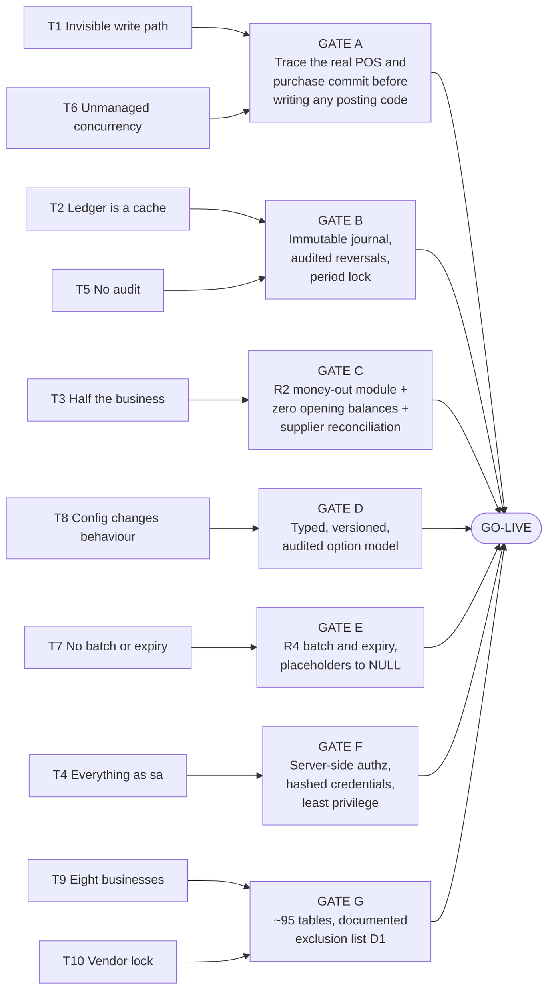

# 12 — Risks & Gaps Register

**Document purpose.** This is the consolidated, evidence-backed register of every risk, defect, legacy hazard, security weakness, data-integrity threat, compliance exposure and architectural problem identified across the whole analysis of **WASEELA ABUZAR V3** as deployed at **Fazal Din PP19** (Gujranwala, Pakistan). It harvests every finding already recorded in the domain documents `03`–`11` and in the owner-decision record `00b`, reconciles them into a single numbered register, adds findings produced by this pass, and ranks them for action. It is the input to the migration plan, the rebuild backlog and the go-live gate.

**Analysis stage.** Stage 4 — Consolidation. All domain analysis (`02`–`11`) is complete; this document synthesises it. Nothing here is new primary research against the live system beyond re-reading the analysis corpus.

**⚠️ The existing system was NOT modified.** Every finding in this register was obtained by read-only means: `SELECT`-and-metadata queries against the live database (authorized under decision **D2**), reading `extracted_scripts.sql` / `db_modules_full.sql`, string extraction from the compiled `.pbd` binaries, and file-system inspection. **No schema was altered, no row was written, no stored procedure was created, dropped or executed for effect, no configuration was changed, and no binary was patched.** The legacy system remains exactly as found and continues to trade.

---

## Evidence-label legend

Every material claim in this register carries one of these labels. They describe **strength of evidence**, not importance.

| Label | Meaning |
|---|---|
| **`Verified`** | Read directly from live data, live schema/metadata, stored-procedure source, or a file on disk. Reproducible by re-running the cited query or opening the cited object. |
| **`Strongly Inferred`** | Not directly readable, but multiple independent pieces of evidence converge on one conclusion with no competing explanation. |
| **`Unclear`** | The evidence is ambiguous or contradictory; two or more readings remain possible. Must be resolved before the affected logic is frozen. |
| **`Missing`** | The capability, record, control or artefact does not exist. Absence itself is the finding, and was confirmed by exhaustive search. |
| **`Deprecated`** | Present but superseded, dead, or explicitly disabled. Retained for traceability. |
| **`Broken/Incomplete`** | Present and reachable, but demonstrably does not do what it claims to do. |
| **`Recommended`** | A proposal for the **NEW** system. **Never an existing feature.** Every "Recommended response" line in this register is `Recommended` by definition and is not a description of current behaviour. |

> **Anti-hallucination rule applied throughout.** Nothing in the "Recommended response" of any finding exists today. Where a legacy mechanism is being *reused* rather than invented, that is stated explicitly.

---

## How to read a finding

Each finding is a compact block:

```
R-0nn · Severity · category · confidence: X · affects: legacy | migration | new build
Finding.    What is wrong, stated as a fact.
Evidence.   Which analysis doc + which stored procedure / table.column / file.
Business.   What it costs the pharmacy, in business language.
Technical.  What it costs the engineering effort.
Response.   Recommended action for the rebuild/migration. Always `Recommended`.
```

**Severity scale**

| Severity | Definition |
|---|---|
| **Critical** | Causes financial loss, statutory/regulatory exposure, patient-safety exposure, unrecoverable data loss, or blocks go-live. Must be resolved or formally accepted in writing by the owner. |
| **High** | Materially wrong numbers, a real control gap, or a defect that will surface within the first months of operation. Resolve before or immediately after go-live. |
| **Medium** | Correctness, performance or maintainability problem with a bounded blast radius. Schedule into the build. |
| **Low** | Hygiene, cosmetic, or latent-only issue. Fix opportunistically. |
| **Informational** | No action required; recorded so the decision is auditable and the fact is not rediscovered later. |

**"Affects" scope**

| Scope | Meaning |
|---|---|
| **legacy** | A live risk in the system running today, right now, at the pharmacy. |
| **migration** | A risk to the SQL Server → MySQL 8 data migration and the cutover. |
| **new build** | A risk that the Node/TypeScript + React + MySQL rebuild will inherit, recreate, or must explicitly design against. |

**Confidence** is stated as High / Medium / Low and reflects how firmly the *risk assessment* (not merely the observation) is established.

---

# 1. Sources harvested

| Source | What was taken from it |
|---|---|
| `00b-owner-decisions-and-requirements.md` | Binding decisions D1–D12, principle P1, requirements R1–R4, findings **F1** (money-out gap) and **F2** (batch/expiry not tracked) |
| `03-module-catalog.md` | Tier-3 legacy artefacts, `ConfigSetting` kill-switches, dormant-module inventory, headline counts (762 tables / 507 empty / 643 procs) |
| `04-screen-form-inventory.md` | Shell-layer security observations, client-branded print-layout inventory, the consolidated accessibility assessment, mobile-feasibility verdict |
| `05a-workflows-sales.md` | 30-item sales defect register (S-01…S-30), concurrency/locking assessment, deleted-line audit, archival purge |
| `05b-workflows-purchase.md` | 20-item purchase risk register (R1…R20), 10 failure modes (F1…F10), 11 unknowns |
| `06-database-analysis.md` | Schema risks §6, temp/scratch problem §7, 25 ranked migration risks (MR-1…MR-25), 13 validation items (V1…V13) |
| `06a-data-profile-reconciliation-baseline.md` | The 16 reconciliation invariants, the trading-ledger scope finding |
| `07-accounting-logic.md` | GL architecture, the `AutoPurgeVirtualGL` kill-switch, absence of period close, 12 uncertainties |
| `08-inventory-logic.md` | 25-item inventory risk register, negative-stock analysis, costing corruption, repair-toolkit evidence |
| `09-roles-permissions.md` | 32 security findings (S1…S32), audit-coverage gap list, 8 configuration anomalies (A1…A8) |
| `10-reports-catalog.md` | 32-item reporting risk register, dead/broken catalogue (D1…D23), the three disagreeing P&L engines |
| `11-integrations-dependencies.md` | 23-item integration risk register (R1…R23), third-party dependency inventory, database external surface |

**Findings added by this pass** (not present in any source document) are marked **`[NEW]`** and are: R-029, R-030, R-068, R-084, R-085, R-096, R-097, R-098, R-099, R-100, R-101, R-102.

---

# 2. The register at a glance

| Severity | Count |
|---|---:|
| **Critical** | 28 |
| **High** | 38 |
| **Medium** | 24 |
| **Low** | 8 |
| **Informational** | 4 |
| **Total** | **102** |

## 2.1 By category

Each finding is counted once, under its primary category.

| Category | Critical | High | Medium | Low | Info | Total |
|---|---:|---:|---:|---:|---:|---:|
| data-integrity | 6 | 9 | 5 | 3 | 1 | **24** |
| security | 6 | 11 | 1 | 1 | 0 | **19** |
| accounting | 5 | 5 | 5 | 0 | 1 | **16** |
| inventory | 1 | 6 | 4 | 1 | 0 | **12** |
| operational | 1 | 5 | 5 | 1 | 0 | **12** |
| compliance | 4 | 2 | 1 | 1 | 0 | **8** |
| architectural | 4 | 0 | 3 | 0 | 1 | **8** |
| UX | 1 | 0 | 0 | 1 | 1 | **3** |
| **Total** | **28** | **38** | **24** | **8** | **4** | **102** |

## 2.2 By scope

Findings commonly carry more than one scope, so these do not sum to 102.

| Scope | Findings |
|---|---:|
| Live in the legacy system today | 79 |
| Threatens the migration / cutover | 41 |
| Will be inherited or recreated by the new build unless designed against | 88 |

## 2.3 Risk clusters

```mermaid
flowchart TD
    subgraph ROOT["Four root causes"]
        RC1["No source code<br/>122 compiled .pbd, logic in 643 procs"]
        RC2["Everything runs as sa<br/>no server-side authz, no audit"]
        RC3["Money-out half of the business<br/>was never entered"]
        RC4["GL is a rebuildable cache,<br/>not a journal"]
    end

    RC1 --> C1["POS commit unreadable R-009"]
    RC1 --> C2["75% of report SQL unrecoverable R-024"]
    RC1 --> C3["Vendor lock: Script.mdb, dongle R-058/R-059"]
    RC1 --> C4["Dead 32-bit PB 12.5 stack R-025"]

    RC2 --> S1["Plaintext passwords R-003"]
    RC2 --> S2["sa hardcoded in binary R-004"]
    RC2 --> S3["xp_cmdshell + injection R-005/R-006"]
    RC2 --> S4["Audit blackout R-008"]
    RC2 --> S5["Client-side-only limits R-007"]

    RC3 --> A1["Cash 214.3M is fiction R-001"]
    RC3 --> A2["Payables 182.7M is fiction R-002"]
    RC3 --> A3["No expenses, no net profit R-019"]

    RC4 --> G1["AutoPurgeVirtualGL truncates GL R-011"]
    RC4 --> G2["No reversal; correction = delete R-012"]
    RC4 --> G3["No period lock R-013"]

    C1 --> X["Rebuild must re-establish<br/>atomicity, auditability and<br/>the money-out half server-side"]
    S4 --> X
    A1 --> X
    G2 --> X
```



---

# 3. CRITICAL findings (28)

> Every finding in this band either causes financial loss, creates statutory or patient-safety exposure, destroys data irrecoverably, or blocks go-live. Each must be **resolved**, or **formally accepted in writing by the owner**, before the new system carries real trade.

---

### R-001 · Critical · accounting · confidence: High · affects: legacy + new build
**Finding.** The general ledger records money coming **in** but never money going **out**. Over the full 19-month window `CASH FROM SALE` was debited 234,003,081 and credited only 19,691,239 (every credit a sale return) — so the books claim **214,311,842 PKR is sitting in the till**. `MARKETING EXPENSES`, `ADMINSTRATIVE EXPENSES`, `EXPENSES PAYABLE`, `PAYROLL-SALARIES`, `COST OF SALES`, `CASH AT BANK` and `INVENTORY` have **zero** GL entries across the entire period. `Verified`.
**Evidence.** `00b` finding F1; `07-accounting-logic.md` §15.3 (per-account `VirtualGl` aggregation, AccCode 2); `06a` §8. Tables: `dbo.VirtualGl`, `dbo.Accounts`, `dbo.SubAccounts`.
**Business.** The two numbers the owner would most want — cash position and net profit — do not exist and cannot be back-computed. Every report built on the cash account is fiction. The money was really spent on stock, wages, rent and supplier payments; none of it was ever entered.
**Technical.** The rebuild cannot carry these balances forward and cannot validate a cash-book implementation against any historical baseline, because no baseline exists.
**Response.** `Recommended`. Implement **R2** in full (supplier payments R2.1, expense entry R2.2, cash/bank book R2.3, daily reconciliation R2.4, plain-language profit statement R2.5) as **new** capability, clearly labelled as new. Cash and bank start at zero per **D10/R3**. Cash sales must flow into the cash book **from the existing SV postings, never re-entered** — reconcile cash-book inflow against `SUM(SV debits to cash)` for the same period as an acceptance test. Gross profit remains trustworthy and may be ported with confidence.

---

### R-002 · Critical · accounting · confidence: High · affects: legacy + migration + new build
**Finding.** **No supplier payment has ever been recorded.** Only `PV` (purchase) and `PR` (purchase return) document types ever touch a supplier account. The 235 supplier accounts have been credited **186,197,682** and debited only **3,526,552** — every one of those debits a purchase return, not a payment. The recorded liability to distributors stands at **182,671,130 PKR** and only ever grows. `Verified`.
**Evidence.** `00b` F1.1; `05b-workflows-purchase.md` §9.2 and risk R1; `07` §7.2–7.3. Tables: `dbo.PurPayment` (0 rows), `dbo.GLHeader` (0), `dbo.GLDetail` (0), `dbo.TransactionHeader` (0).
**Business.** The pharmacy cannot answer "who do I owe, and how much?" — the most operationally important payables question. Supplier ageing, cash-flow forecasting and any negotiation with a distributor are unsupported.
**Technical.** The dormant `PurPayment` / `TransactionHeader` / `SP_CreateVoucher_From_PurPayment` design exists in schema but is **untested vendor code** (see R-049) and must not be ported as-is.
**Response.** `Recommended`. Build supplier payment as a **new, first-class** module (R2.1) with the full **P1** option set — Cash · Bank transfer · Cheque · Bank draft/pay order · Online IBFT · Mobile wallet (Easypaisa/JazzCash) · Credit-note adjustment · Other — and full allocation options (specific invoices · FIFO · running balance). Supplier opening balances start at **zero** (D10/R3.1); legacy figures are archived read-only, never imported. Requires supplier-statement reconciliation at cutover (R3.4).

---

### R-003 · Critical · security · confidence: High · affects: legacy + migration + new build
**Finding.** Application passwords are stored in **plaintext** in `dbo.Users.Password varchar(60)` and are trivially weak: seven of nine users have 1–2 character passwords (`1`, `0`, `3`, `25`, `55`, `60`, `z0`), two users share `60`, and the administrator password is a dictionary word plus digits. No hash column exists anywhere in the schema. `Verified`.
**Evidence.** `09-roles-permissions.md` findings S1, S2 and §D.2; `04` §3.1; `06-database-analysis.md` §6.8 L1 and migration risk MR-3. Table: `dbo.Users`.
**Business.** Anyone with `SELECT` on one table owns every account, including the administrator. Since there is no login procedure (R-005) the password travels from SQL Server to the client in clear text over TDS on every login attempt — a network capture is sufficient.
**Technical.** Migrating this column as-is carries a known-critical defect into a brand-new system and fails any security review.
**Response.** `Recommended`. **Never migrate the plaintext column.** Store `argon2id` (or `bcrypt`) hashes only. Force a password reset for all nine users at first login. Add minimum-length and complexity policy, failed-attempt lockout, and password-change auditing — none of which exist today (R-035).

---

### R-004 · Critical · security · confidence: High · affects: legacy + new build
**Finding.** The SQL Server **`sa` password (`2yhg35xe`) is hardcoded inside `abuzar.exe`** and is transmitted by every workstation on every launch. Consequently **every application session runs as SQL Server `sysadmin`**: `sys.database_principals` for this database contains only `dbo`, `guest`, `INFORMATION_SCHEMA` and `sys` — there is no least-privilege application principal at all. `Verified`.
**Evidence.** `09` findings S3, S4; `02-repository-map.md` §3 (startup gates); `11-integrations-dependencies.md` §9.6. Recovered by packet-capturing the TDS `LOGIN7` message (`ABUZAR_V2_RECOVERY_JOURNAL.md` lines 28, 47, 197–215).
**Business.** Any user with a SQL client and the recoverable `sa` password has unrestricted `DROP`/`UPDATE`/`DELETE` on all 762 tables. The entire `Rights`/`GroupRights` model is therefore **advisory only** — a UI convenience, not a security boundary.
**Technical.** Combined with R-005 (`xp_cmdshell` enabled) this is full machine compromise from any workstation on the LAN.
**Response.** `Recommended`. The new system uses a **per-service database user with least privilege**; no `root`/`sa`-equivalent credential is ever used by the application. All credentials live in a secrets manager or environment configuration outside the database. Authorization is enforced **server-side in the API layer**, so possession of a database credential is not a permission bypass.

---

### R-005 · Critical · security · confidence: High · affects: legacy
**Finding.** **`xp_cmdshell` is ENABLED and must stay enabled**, because the licensing check `SP_WayToMoon` calls it at every startup. The procedure builds its OS command line from its parameters **with no sanitisation**: `SET @cmdline = 'dir %systemroot%\syswow64\' + LTRIM(RTRIM(@fl))`, then `EXEC master..xp_cmdshell @cmdline, NO_OUTPUT`. `Verified`.
**Evidence.** `11` risk R1 and §9.2 (procedure quoted in full); `09` finding S12; `sys.configurations`: `xp_cmdshell value=1, value_in_use=1`. Object: `dbo.SP_WayToMoon`.
**Business.** A parameter such as `@fl = 'x & net user hacker P@ss /add'` yields arbitrary OS command execution as the SQL Server service account, callable from any workstation. Combined with R-004 the whole machine — including the 3 GB database backups on the same disk — is compromisable by any staff member or anyone on the LAN.
**Technical.** The setting cannot be turned off in the legacy system without breaking application startup, so this cannot be remediated in place. It is a reason to migrate, not a defect to patch.
**Response.** `Recommended`. **Delete the entire licensing-dongle concept.** The new system is a bespoke build for one owner: no dongle, no marker files, no OS calls from the database, `xp_cmdshell` never enabled. If licensing is ever required, use a signed JWT licence file validated in application code.

---

### R-006 · Critical · security · confidence: High · affects: legacy
**Finding.** `dbo.SP_MyExecuteLocal` is, in its entirety, `CREATE PROCEDURE SP_MyExecuteLocal @Qry VARCHAR(8000) AS EXECUTE (@Qry)` — a complete, deliberate arbitrary-SQL primitive shipped as a product feature. Dynamic `EXECUTE(@string)` built by string concatenation is pervasive beyond it: `SP_ImportData`, `SP_AlterDB`, `SP_CheckDBIntegrity`, `SP_PrepareDataMigrationPacket`, the `SP_CRS_*` family, `SP_DB_Push*`, `SP_WaseelaMini_Export`, `SP_CreateDataSMS` — almost none using `sp_executesql` with typed parameters or `QUOTENAME()`. `Verified`.
**Evidence.** `11` risk R2 and §9.3–9.4 (both procedures quoted in full); `09` finding S17; `10-reports-catalog.md` risk 16 (cross-tab dynamic SQL concatenates a dimension member's *name*, so a lookup value containing a quote is an injection).
**Business.** Any principal that can execute this procedure can run any statement — and since the application connects as `sa` (R-004), that is every workstation.
**Technical.** This is not a bug to fix; it is a design idiom used throughout the corpus and cannot be selectively hardened.
**Response.** `Recommended`. Does not exist in the new system. **All** data access through parameterised queries or an ORM. No user-supplied identifier is ever concatenated into SQL. Static analysis in CI to enforce it.

---

### R-007 · Critical · security · confidence: High · affects: legacy + new build
**Finding.** **Authorization is enforced in the client, not the server.** Only one right (515) is checked anywhere in the production SQL paths; no posting, pricing, discounting or GL procedure verifies the caller. Separately, `dbo.Groups` carries 27 policy columns — including `FinancialLimitPerTransaction` (PKR 100,000), `MaxQtyLimit` (10,000), `saleinvflatdisc`, `saleItemdiscperc`, `AccumulatedDiscPerc`, `ServiceDiscPercLimit` — referenced by **zero** of the 762 programmable objects (exhaustive grep, 0 matches). `Verified`.
**Evidence.** `09` findings S18, S19 and §C.2.3. Objects: `dbo.Groups`, `dbo.GroupRights`, `dbo.Rights`.
**Business.** Every financial guard rail the owner believes is configured — the per-transaction cap, the quantity cap, the maximum discount percentages — is a client-side suggestion. Any user reaching SQL Server (and every session already runs as `sa`) bypasses all of them.
**Technical.** The rights model looks rich (486 rights, 4 groups, 8 row-scoping tables) and is largely decorative at the enforcement layer, which makes it dangerous to port at face value.
**Response.** `Recommended`. Enforce **every** permission and **every** numeric limit server-side in the API, inside the same transaction as the operation. Rights are checked at the endpoint, never only in the UI. Limits become typed, versioned, audited policy — not free columns nobody reads. Adopt the RBAC model proposed in `09` Part I, including deny-by-default and separation of duties (R-032).

---

### R-008 · Critical · security + compliance · confidence: High · affects: legacy + new build
**Finding.** There is a near-total audit blackout. **Not audited anywhere:** login, logout, failed login; password change; user created/deactivated/deleted; right granted or revoked (`GroupRights` has no trigger); group policy-limit change; sale-invoice header or line modification after save; purchase / purchase-return / voucher modification; report viewed, exported or printed; customer or supplier master change; database backup taken; `SpecialRight` toggled; any direct SQL modification. `SaleLedger.ModifiedBy` and `.PostedBy` are **NULL on all 291,361 rows**. `SaleLedgerLog` (150 columns) and `SaledetailLog` (73 columns) exist with the correct shape and have **no writer and 0 rows**. No SQL Server Audit specification exists at server or database level. `Verified`.
**Evidence.** `09` §G.2 (the critical gap list) and findings S27, S28, S29, S32; `05a-workflows-sales.md` §18.2 and defect S-22. Tables: `dbo.SaleLedgerLog`, `dbo.SaledetailLog`, `dbo.PostedInvoiceEditingLog`, `dbo.CustLog` — all 0 rows.
**Business.** It is impossible to establish who was in the system, who changed a price, who granted themselves a permission, who exported the full cost-and-margin dataset, or who edited an invoice. In a cash business with 9 users and PKR 234 M of annual throughput this is the largest internal-control gap after R-001.
**Technical.** There is no historical audit data to migrate — the new system starts its audit trail at go-live. The one genuinely useful trail that does exist is `ItemLog` (110,329 rows, full 134-column before-image); its concept should be preserved.
**Response.** `Recommended`. Append-only audit log covering authentication, authorization changes, master-data changes and every financial-document mutation, recording who / when / from where / before → after / reason. Never a silent edit — corrections are audited reversals only (R-012). Modernise `ItemLog` into a narrow change-event table.

---

### R-009 · Critical · architectural · confidence: High · affects: legacy + new build
**Finding.** **The POS invoice commit has no readable implementation.** Exhaustive search for `INSERT INTO SaleLedger` / `INSERT INTO SaleDetail` finds only twelve owning procedures and **every one has produced 0 rows at this deployment**. The 291,361 live invoices were therefore written by PowerBuilder DataWindow update logic inside the compiled binary — line insert, header insert, `GodownDetail` decrement, `Posted='Y'`, snapshot — none of it readable. The same is true of purchase posting: **no `sp_PostPurLedger` exists**. `Verified`.
**Evidence.** `05a` §4.5 and defect S-01; `05b` unknown U1 and risk R3; `08-inventory-logic.md` §2.1 and risk 4.
**Business.** The single most business-critical transaction — the one that moves both money and stock — has no specification. A rebuild that guesses wrong produces different stock and cost outcomes from day one.
**Technical.** It must be re-derived from three sources: the analogous SQL generators, the data invariants proven in `05a` §21 and `08` §4.3, and **black-box runtime observation** of the running client.
**Response.** `Recommended`. Before writing any new posting code, run a SQL Server Extended Events / Profiler trace of one real sale and one real purchase posting **against a restored copy** of the database (never the live one). Then re-implement the commit as **one explicit server-side ACID transaction**: reserve number → insert header → insert lines → FEFO-allocate and decrement batches → compute total → post → enqueue fiscalization. Testable and auditable — the opposite of today's arrangement.

---

### R-010 · Critical · data-integrity · confidence: High · affects: legacy + new build
**Finding.** There is **no server-side transaction boundary** around any document write. `BEGIN TRANSACTION` appears in only two sales-side procedures (`SP_VirtualGL` T1 and `SP_CopySBufferToSales`) and is absent from every invoice generator and from `SP_DeleteSaleInvoice_Bulk`. `sp_PostPurOrder` has no `BEGIN TRAN`, so a mid-cursor failure leaves headers unposted and `Item.TransitStock` orphaned. The header "locks" (`sp_LockSaleInvoice`, `sp_LockPurInvoice`, `Fn_LockSaleDetailRow`) rely on `UPDLOCK HOLDLOCK` inside a **caller-opened** transaction that cannot be inspected — and a scalar function cannot begin a transaction at all, so `Fn_LockSaleDetailRow`'s lock is released at statement end unless the client holds one. `Verified`.
**Evidence.** `05a` §20 and defects S-03, S-04; `05b` failure modes F2, F5, F6; `08` §17.2(d).
**Business.** Partial invoices, partial stock decrements and orphaned ledger state are possible today. The one genuinely sound control is the optimistic compare-and-swap in `SP_SaleUpdateItemStockBatch` (`WHERE ... AND CurrQty = @OldQty`).
**Technical.** Any migration must **assume the legacy write path is not transactional** and re-establish atomicity server-side rather than porting the pattern.
**Response.** `Recommended`. One transaction per business document, opened and committed server-side, with an explicit isolation level and a documented lock order to prevent deadlocks. No human-duration locks (R-036). Concurrency-test with ≥20 simultaneous POS sessions as a go-live gate.

---

### R-011 · Critical · data-integrity + accounting · confidence: High · affects: legacy
**Finding.** `SP_VirtualGL` opens with a kill-switch: `IF @AutoPurgeVirtualGL = 'Y' BEGIN TRUNCATE TABLE VirtualGL; COMMIT TRANSACTION T1; RETURN END`. Setting `SoftwarePreferences.AutoPurgeVirtualGL = 'Y'` **destroys the entire general ledger on the next balance enquiry**, with no confirmation, no backup and no audit record. The live value is currently `'N'`. `Verified`.
**Evidence.** `07` §3.5 (quoted, `db_modules_full.sql:57799-57804`); `05a` defect S-02. Object: `dbo.SP_VirtualGL`; table: `dbo.SoftwarePreferences`.
**Business.** A single free-text preference row — editable by anyone who can reach the preferences screen or the database — deletes 1,021,852 GL rows representing 19 months of trading. The ledger is rebuildable from source documents, so this is recoverable in principle, but only if the rebuild is run and only for document types that still exist (R-026).
**Technical.** This is the highest-severity latent defect in the accounting domain. It exists because the GL is a *cache*, not a journal (R-012).
**Response.** `Recommended`. The new ledger is an **immutable, append-only journal written at commit time**. `TRUNCATE`-and-rebuild is banned outright. A derivation job may exist as a *verification* that must reconcile to zero, never as the source of truth. No preference row can destroy financial data.

---

### R-012 · Critical · accounting + compliance · confidence: High · affects: legacy + new build
**Finding.** The GL is a lazily materialised projection and **there is no reversal path**. `SP_VirtualGL_Sales` / `_Purchase` select only documents `NOT EXISTS` in the GL, so once a row is written it is never revisited: if a posted document is later edited, GL and document diverge permanently. The correction mechanism that *does* exist is **hard deletion** — `SP_Supervise_CashierActivity` executes `DELETE VirtualGl WHERE DocumentType='SV' AND DocumentCode=@DocCode` on already-posted invoices, then lets the next derivation run silently re-create them. There is no reversing entry, no audit trail and no "amended" marker: **an auditor cannot tell that an invoice was changed after posting**. `Verified`.
**Evidence.** `07` §9.3 (quoted, `db_modules_full.sql:50432-50435`, 50464, 50494); `05b` failure mode F8 and risk R7; `05a` defect S-17.
**Business.** Posted financial documents are silently mutable. `Posted='Y'` means only "finalised and eligible for GL materialisation" — it does **not** mean immutable.
**Technical.** Any auditor-facing claim about historical integrity rests on the *absence* of edits (`PostedInvoiceEditingLog` = 0 rows, `ModifyCounter` = 0 everywhere), not on any control preventing them. Note the tension with R-053: 17,001 deleted lines carry an invoice code.
**Response.** `Recommended`. Posted documents are immutable. Corrections are **new, audited, reversing documents** referencing the original. The journal is append-only. Every amendment is visible to the accountant and the auditor. **Requires accountant sign-off** (`07` §17 group E).

---

### R-013 · Critical · accounting · confidence: High · affects: legacy + new build
**Finding.** **There is no period close and no period lock.** Exhaustive search of all 762 objects found **zero** occurrences of `YearEnd`, `PeriodLock`, `ClosePeriod`, `FinancialYear` or `FiscalYear`. There is no period-close procedure, no lock table or flag, no retained-earnings roll-forward, no year-end revenue/expense zeroing, and no posted-period guard on any `INSERT` or `UPDATE`. `ServerDateMonth` is **not** a period lock — its twelve references are all inside monthly invoice-number resets. `Missing`.
**Evidence.** `07` §9.1–9.2. Tables: `dbo.ServerDateMonth`, `dbo.ServerDateMonthPur` (single-row counters).
**Business.** Any date can be posted or edited at any time, forever. A prior year's figures can change after they have been reported or filed. Combined with R-012 there is no point at which the books are final.
**Technical.** Period-close logic must be **designed from scratch** with the accountant; there is nothing to port.
**Response.** `Recommended`. Implement soft period lock (warn) and hard period lock (block, supervisor override, audited) as admin-configurable options per **P1**. Define year-end roll-forward with the accountant before the accounting module is frozen. Locking must apply uniformly to sales, purchases, returns, adjustments, payments and expenses.

---

### R-014 · Critical · compliance + inventory · confidence: High · affects: legacy + migration + new build
**Finding.** **The pharmacy is not tracking medicine batches or expiry.** The product ships a complete subsystem — batch numbers, per-batch pricing, expiry-intimation documents, FEFO/FIFO batch prioritisation, batch locking — and at this deployment it is switched off in practice: ~96% of `GodownDetail` rows carry the placeholder batch `'.'`, 95.2% carry `'.'` **with** sentinel expiry `2030-12-12`, 98.1% of `Saledetail` rows carry batch `'.'`, only **62** distinct batch strings exist across the entire warehouse (several junk: `\`, `asd`), `ItemBatches` / `ItemBatchPricing` / `ExpiryIntimation` are all **0 rows**, and the preference `salecheckexpiry` is `'N'`. `Verified`.
**Evidence.** `00b` finding F2; `08` §10 and risks 1, 2; `06` §6.7; `05b` risk R2 and §13. Tables: `dbo.GodownDetail`, `dbo.Saledetail`, `dbo.ItemBatches`, `dbo.ExpiryIntimation`.
**Business.** **Patient safety and regulatory exposure.** The system cannot answer "what is about to expire?", cannot block or warn on selling expired stock, and cannot perform a manufacturer recall. For a pharmacy this is the most serious functional gap found. `Strongly Inferred` cause: entering batch and expiry on every purchase line is slow at a counter doing ~540 sales/day, so staff left the fields blank and the system accepted the placeholder.
**Technical.** The composite key `(GCode, ICode, Batch, Expiry)` — carried through `GodownDetail`, `Purdetail`, `PRdetail`, `AdjDetail` and mirrored in `Saledetail`/`SRdetail` — **collapses to `(GCode, ICode)` in practice**. Migrating the placeholders literally into a new batch model would enshrine fake data (R-062).
**Response.** `Recommended`, **approved by the owner as decision D12 / requirement R4 — a Tier-1 feature.** Capture batch + expiry at goods receipt with GS1 barcode/QR/DataMatrix auto-fill so it costs the cashier no time; admin-configurable strictness per item category (require / prompt-but-skip / off) per **P1**. Expiry dashboard with 30/60/90-day buckets and value at risk. FEFO by default at the till with audited override. Expired-stock guardrail (warn / block / allow; default warn near-expiry, block expired). Batch as a traceability *dimension* while costing stays at item level. Real data accrues **from go-live forward**; historical placeholders map to `NULL` and are **not** back-filled (R4.6).

---

### R-015 · Critical · compliance · confidence: High · affects: legacy + new build
**Finding.** The FBR fiscal invoice payload is built by string concatenation into a `VARCHAR(8000)` variable with **no escaping and no length guard**, and — worse — `SP_GetSaleInvoice_JSON` uses **INNER JOINs** to `PCT` and `SalesTaxSchedule`, so any item whose tax classification is missing or mis-configured is **silently dropped from the tax declaration**. `Verified`.
**Evidence.** `05a` defects S-05, S-09; `11` risk R3. Object: `dbo.SP_GetSaleInvoice_JSON`; tables: `dbo.PCT`, `dbo.SalesTaxSchedule`.
**Business.** Statutory tax filings can under-declare sales with no error, warning or log. A long invoice truncates mid-JSON; an item name containing a quote corrupts the payload. This is a direct regulatory exposure under the Tier-1 retailer POS regime, which is **legally mandatory** for this pharmacy.
**Technical.** 99.85% of invoices (290,922 of 291,361) fiscalised successfully, so the failure mode is silent **line-level omission**, not visible outage — which is precisely why it has never been noticed.
**Response.** `Recommended`. Serialise with a JSON library over a typed object, never string concatenation. Validate against a schema (e.g. zod) before submission. Use **LEFT JOINs** so a mis-configured item can never vanish — it fails validation loudly instead. No length limit. Unit tests covering 200-line invoices and item names containing `"` and `\`. Snapshot tax rate, PCT and unit tax **onto the invoice line at posting** so a re-sent historical invoice reports what it originally reported (R-064).

---

### R-016 · Critical · compliance · confidence: High · affects: legacy + new build
**Finding.** **FBR Digital Invoicing (DI) is installed but has never been switched on.** The schema arrived 2026-05-11 — `Digitalized`, `ScenarioID`, `BuyerNTN`, `HSCode`, `UOM`, `SROScheduleNo` columns plus four seeded `FBR_DI_*` lookup tables — yet `SoftwarePreferences.ImplementDigitalInvoicing = 'N'`, both production and sandbox tokens are empty, no NTN or scenario is configured, no UOM mapping exists, and `Digitalized='N'` on **all 291,361** invoices. All 28 `FBR_DI_Scenario` rows are `Applicable='N'`. `Verified`.
**Evidence.** `11` §1.7 and risk R4. Columns/tables: `dbo.SaleLedger.Digitalized`, `dbo.FBR_DI_Scenario`, `dbo.SoftwarePreferences`.
**Business.** If this NTN is already within the Digital Invoicing mandate, the business is non-compliant now and does not know it. This is a legal question, not a technical one.
**Technical.** The successor regime is pre-wired in schema but has zero runtime evidence, and the DI client logic — if it exists at all — lives in production binaries we do not hold (R-057).
**Response.** `Recommended`. **First establish the legal position with a tax adviser** (`11` §12 items 1–2): which regime applies to this NTN today, and which `FBR_DI_Scenario` (SN025 drugs at fixed ST rate, 8th Sch. Table-1 s.81, vs SN026/27/28 retail to end consumer). Then implement DI against `gw.fbr.gov.pk`, sandbox first, with bearer tokens in a secrets manager and effective-dated scenario / UOM / HS-code mapping tables. Do not design the new system as POS-regime-only.

---

### R-017 · Critical · operational · confidence: High · affects: legacy + new build
**Finding.** `SoftwarePreferences.PrintUnFiscalizedInvoice = 'N'` and `SP_FiscalizeSaleInvoice` returns `-1` on failure, so **any FBR or middleware outage halts billing at the counter**. There is no offline mode, no queue, no store-and-forward fallback. The transport chain — `abuzar.exe` → `fiscalizationapp.exe` on TCP 9111 → `http://localhost:8524/api/IMSFiscal/*` — has three hops and no retry logic. `SP_RequestHttpWebService` never checks the HTTP status, never sets a timeout, and leaks the COM object on failure. `Verified`.
**Evidence.** `11` risks R23, R12 and §1.2. Objects: `dbo.SP_FiscalizeSaleInvoice`, `dbo.SP_RequestHttpWebService`.
**Business.** A government API outage, a middleware crash or a service restart stops the pharmacy from selling. At ~540 invoices a day, minutes of downtime are real lost revenue and real queue abandonment.
**Technical.** Corroborated by 439 unfiscalised sale invoices and 19,642 unfiscalised 2025 credit notes (R-065) — the outage mode is real, not theoretical.
**Response.** `Recommended`. **Store-and-forward.** The sale completes locally and prints a provisional receipt; the fiscal number attaches asynchronously and the receipt is annexed or reprinted. A durable `fiscal_submission` table records request JSON, response JSON, HTTP status, attempt number and latency; an outbox worker retries with backoff behind a circuit breaker; a dead-letter queue drives an operator-visible **"unfiscalized invoices"** report. **Never block a customer at the till on a government API.**

---

### R-018 · Critical · architectural · confidence: High · affects: legacy + new build
**Finding.** `dbo.ReportData` and `dbo.CrossTab_ReportData` are **global, session-less scratch tables**. They have no user, session or SPID column (51 columns on `ReportData`, none identifying a session) and **every producer begins by emptying them** — `DELETE ReportData` appears at the head of 87 objects, and 60 procedures follow a `DELETE`-then-`INSERT`-then-read-back pattern. Two users running any two reports concurrently overwrite each other **silently — no error, just wrong numbers**. There is a nested dependency: `sp_AccountsLedger` → `sp_AccountsBalance` → `ReportData` → read back, so a concurrent report between the two statements blanks the opening balances. Worse, `ReportData` doubles as a generic RPC buffer for ~18 non-report procedures (`SP_GetVersionInfo`, `SP_CheckPacketCounters`, `sp_executelocal`, sync procs), so a background job can wipe a user's report mid-render. `Verified`.
**Evidence.** `10` §1.2 finding 1 and risks 1, 2, 25; `06` migration risk MR-15 and §7.1.
**Business.** Concurrency-unsafe by construction. With 7 distinct terminals observed in the data (R-080), two people running reports at once is normal operation — and the result is quietly incorrect figures with no indication anything went wrong.
**Technical.** This pattern must not be migrated. It is the clearest single reason the reporting layer is a rebuild, not a port.
**Response.** `Recommended`. **Do not migrate `ReportData` or `CrossTab_ReportData`.** Reports return per-request result sets from parameterised queries or a read model. No shared mutable server-side scratch state. Reporting reads go to a replica or a read-optimised model so they can neither block nor be blocked by trading.

---

### R-019 · Critical · accounting · confidence: High · affects: legacy + new build
**Finding.** **There are three profit-and-loss engines and they disagree; the GL-based one is broken here.** `sp_IncomeStatement` computes Cost of Sales as *(Direct-Expenses GL movement) + (opening inventory from `StockLedger`) − (closing inventory from `StockLedger`)*, gated on `InventorySystemUsed='P'`. The preference **is** `'P'`, **`dbo.StockLedger` contains 0 rows**, and account 9 `COST OF GOODS SOLD` has **zero** `VirtualGl` entries. Both inventory terms evaluate to 0 and gross profit collapses to *Sales − Purchases*, with **no opening/closing inventory adjustment at all**. The number the business actually uses comes from a different engine — `SP_DailyIncomeStatement_With_GP_Summary` and `VIEW_SMS_DailySalesAndReturnSummary` — which compute CGS from `SaleDetail.AvgPrice`, the cost snapshotted onto each sale line at sale time (populated on 620,617 of 620,619 lines). `Verified`.
**Evidence.** `10` §5.4.3 and risk 3; `07` §10.3–10.4; `08` §2. Objects: `dbo.sp_IncomeStatement` (`db_modules_full.sql:34555-34599`), `dbo.sp_IncomeStatment` (typo'd 852-line duplicate), `dbo.SP_DailyIncomeStatement_With_GP_Summary`, `dbo.VIEW_SMS_DailySalesAndReturnSummary`.
**Business.** For a pharmacy holding millions of rupees of stock, *Sales − Purchases* is materially wrong in any period where stock levels move. Two different profit numbers can be produced from the same system on the same day.
**Technical.** Also: `SP_DailyIncomeStatement_With_GP_Summary`'s header comment documents `@ReportType` as `'M'/'H'/'B'` while the code branches on `'S'/'A'` — a caller following the comment gets no rows.
**Response.** `Recommended`. **One canonical metric layer**: a single tested definition of net sales, cost of sales and gross profit used by every screen and report. Move to **perpetual inventory** and post COGS/Inventory per line — the cost is already captured on 620,617 lines, only the GL leg is missing. Gross profit must reconcile **exactly** to the legacy Engine-B figure for any historical period (this is requirement R2.7's acceptance test). **Requires accountant sign-off** on which number is authoritative (`10` §8 items 1–2).

---

### R-020 · Critical · inventory + accounting · confidence: High · affects: legacy + migration + new build
**Finding.** **Active weighted-average cost corruption: PKR 1,775,942 of phantom inventory value.** Sixteen stocked items have `AvgPrice` exceeding their unit retail price; three account for 99.6% of the exposure and are unmistakable pack-vs-unit basis errors where the `/ PackUnits` divisor was lost. Example: `LCYTE 450MG TAB` (ICode 27867) — pack of 60, `RecentPurPrice` 71,500.20 (= 1,191.67 per tablet), yet `AvgPrice = 1,817.55` against a unit retail of 30.83. Reported inventory value is **PKR 12,011,533**; the defensible value is **PKR 10,222,268** — **the stock valuation overstates inventory by ~15%**. `Verified`.
**Evidence.** `08` §25.3 and risk 3. Columns/tables: `dbo.Item.AvgPrice`, `dbo.Item.PackUnits`, `dbo.GodownDetail`.
**Business.** Inventory value on any balance sheet or stock report is overstated by roughly one-seventh, and every gross-margin figure involving these items is wrong.
**Technical.** **This directly conflicts with owner decision D11** ("carry stock over unchanged") — see R-030. Migrating `AvgPrice` verbatim imports a known, quantified defect into the new system on day one.
**Response.** `Recommended`. Before cutover run a full pack/unit consistency check (`AvgPrice` vs `SalePrice / PackUnits` vs `RecentPurPrice / PackUnits`) across all 8,042 ever-stocked items, produce an exception report, and have the owner and accountant rule on each. Preferred approach: **recompute all costs from a rebuilt movement ledger at migration** rather than copying `Item.AvgPrice` — this also resolves the unexplained 14% residual in the cost formula (`05b` U3). **Requires accountant validation.**

---

### R-021 · Critical · data-integrity · confidence: High · affects: legacy + migration
**Finding.** `SP_Update_ItemHistoricalCost_In_Sale_And_Return` can **retroactively rewrite the `AvgPrice` cost snapshot on 620,619 sale lines and 44,563 return lines**, using a *look-ahead* cost rule, un-transacted, against an arbitrary database name supplied as a parameter. `Verified`. Its run history is `Unclear` — no log would record whether it has ever executed.
**Evidence.** `08` §8.5 and risk 5; `10` risk 21. Object: `dbo.SP_Update_ItemHistoricalCost_In_Sale_And_Return`; column: `dbo.Saledetail.AvgPrice`.
**Business.** Every historical gross-profit report in the system is derived from `SaleDetail.AvgPrice` (R-019). If this procedure has ever run, historical margin figures have silently changed and no record of the before state exists.
**Technical.** It is the counter-example to any claim that historical cost is immutable, and it means the migration cannot assume the frozen snapshot is original.
**Response.** `Recommended`. Historical cost snapshots are **immutable** in the new system. Any cost recalculation produces a new, dated, audited revaluation record — it never overwrites transaction history. Before migration, confirm with the owner whether this procedure was ever run and record the answer in the migration log. **Requires accountant confirmation** that historical reports must reproduce the frozen cost, not a recomputed one (`10` §8 item 9).

---

### R-022 · Critical · data-integrity · confidence: High · affects: migration
**Finding.** **No business document in WASEELA gets its primary key from `IDENTITY`.** Invoice numbers, purchase numbers, adjustment codes, item codes and account codes all come from a hand-rolled counter table, `_TABMAXKEY` (265 rows), read and incremented by `sp_GetTabMaxKey` under `UPDLOCK HOLDLOCK` — semantics that **do not exist in MySQL**. There are 136 call sites across four procedures; a naive port produces **duplicate invoice numbers under concurrency**. Compounding it: `_HeaderTabMaxKey` (Module 1) = **880,542** while `_TABMAXKEY.SaleLedger` = **880,233** — seeding from the wrong counter re-issues **309 already-printed header numbers**. `Verified`.
**Evidence.** `06` §8.5 and migration risks MR-1, MR-2, MR-19; `05a` §20 (numbering anomaly). Tables: `dbo._TABMAXKEY`, `dbo._HeaderTabMaxKey`; objects: `sp_GetTabMaxKey`, `SP_LockTabMaxKey`, `SP_UpdateTabMaxKey`, `sp_GetHeaderTabMaxKey`.
**Business.** Duplicate or reused invoice numbers break FBR fiscal numbering (`USIN = SaleInvCode`) and destroy document-trail integrity.
**Technical.** Note the ceiling too: `TABMAXKEY numeric(7,0)` maxes at 9,999,999 and is already at 880,233 — with roughly **3 keys burned per surviving invoice** (880 K keys for 291 K invoices), evidence of heavy key wastage from abandoned saves.
**Response.** `Recommended`. Replace with database sequences / `AUTO_INCREMENT`, plus an explicit reservation service where a human-visible number is required. **Seed from `GREATEST()` of both counters and `MAX()` of the actual data**, never from one source. Widen to `BIGINT`. Reserve numbers **at commit, not at form-open**, to end the key wastage. Invoice numbers must be **never reusable**. Concurrency test with ≥20 simultaneous POS sessions as a go-live gate.

---

### R-023 · Critical · compliance · confidence: High · affects: legacy + new build
**Finding.** `SP_DeleteSaleInvoice_Bulk` deletes a **range** of invoices (`SaleInvCode >= @SInvCode`) and, on completion, **resets `_TabMaxKey.SaleLedger` and `_HeaderTabMaxKey` to the new maxima — causing invoice numbers to be reused**. It runs with **no transaction**: log rows are deleted, then stock restored, then details, then headers, so a mid-run failure leaves partial state. `Verified`.
**Evidence.** `05a` §18.3 defects D1 and D4, and defect S-03. Object: `dbo.SP_DeleteSaleInvoice_Bulk`.
**Business.** Number reuse is **fatal for FBR fiscalization**, where `USIN = SaleInvCode`: two different sales would carry the same unique sales-invoice number in the tax authority's records.
**Technical.** Currently unreachable at this site — the guard blocks when any invoice in range is `Posted='Y'`, and **every** invoice here is posted. Corroborated: `SaleInvCode` runs 588,873 → 880,233 with **zero gaps** and `SRInvCode` 61,604 → 92,307 with zero gaps, so no invoice has ever been deleted in the retained window. The risk is latent, not active.
**Response.** `Recommended`. Financial documents are **never hard-deleted** — they are voided or reversed with an audited reversal that preserves the number. Sequence counters are **never reset**. Any bulk operation runs inside one transaction with an explicit dry-run and confirmation step.

---

### R-024 · Critical · architectural + operational · confidence: High · affects: migration + new build
**Finding.** **The SQL for roughly 75% of deployed reports exists only inside compiled `.pbd` binaries** — 197 deployed report leaves against only ~40 that are stored-procedure-backed. Separately, **11 partner data-export formats are contractual and undocumented**, with layouts living solely in `specialreports.pbd`. `Verified`.
**Evidence.** `10` risks 4 and 5, and §5.7.4; `04-screen-form-inventory.md` §7 (library inventory), §11.3.
**Business.** The pharmacy has live commercial obligations (pharma data exports to partners) whose exact file layouts cannot be read from the database. Getting one wrong breaks a commercial relationship, not just a screen.
**Technical.** The report layer is the largest single unknown in the rebuild scope and cannot be estimated from the database alone.
**Response.** `Recommended`. Treat report recovery as its own workstream: (a) run each of the 197 deployed report leaves in the live application and **capture the output**; (b) for the 11 partner exports obtain a **sample file per partner** and, where possible, the partner's written specification; (c) rebuild against captured outputs as golden masters. Do **not** assume the database contains the specification. Budget this explicitly — it is not a rounding error.

---

### R-025 · Critical · architectural · confidence: High · affects: legacy + new build
**Finding.** **There is no source code.** The deployment consists of `abuzar.exe` plus **122 compiled `.pbd` binaries** and a PowerBuilder 12.5 32-bit runtime; verified counts of `*.pbl / *.srw / *.sru / *.srd / *.sra / *.pbt / *.pbw / *.pbg` are **all zero**. PowerBuilder 12.5 (Sybase, build 12.5.0.2511, released 2011) is out of mainstream support and the vendor is now SAP. The runtime is hard-pinned to 32-bit forever by its dependency on Jet OLEDB 4.0 (`Script.mdb`, R-058). `Verified`.
**Evidence.** `02` §1 and §4; `11` §8.2 and §8.3.
**Business.** **This is the existential risk that justifies the whole project.** No one — not the owner, not a new developer, not even the vendor without their own archive — can modify the application's UI or client-side logic. Half the inventory logic and the entire POS commit live inside these binaries (R-009). A Windows update, an antivirus quarantine or a hardware failure can render the business unable to trade with no repair path.
**Technical.** All modernisation evidence must come from the database, from binary string extraction and from black-box observation. This constrains the analysis method permanently and is why several findings in this register are labelled `Unclear` rather than `Verified`.
**Response.** `Recommended`. **Full rebuild on the target stack** (Node.js + TypeScript, React + TypeScript, MySQL 8, REST) as a **modular monolith** — the evidence does not warrant microservices at ~600 invoices/day over ~1 M GL rows. Run the legacy system in parallel, read-only, until the reconciliation gates in R-027 pass. Preserve the legacy binaries and a restorable database backup as a permanent archive.

---

### R-026 · Critical · data-integrity · confidence: High · affects: migration
**Finding.** `SP_DeletePostedTransactions` is a **destructive annual purge**: it snapshots non-zero account balances into `AccountBalanceLog`, then executes `TRUNCATE TABLE SaleInvDetail`, `TRUNCATE TABLE SaleDetail` and `DELETE ... SaleLedger WHERE Posted='Y'`. This is why `SaleInvCode` starts at **588,873** and every transactional table starts on/about 2025-01-01. **Pre-2025 transaction-level history is not in this database.** `Verified`; whether external backups of prior years exist is `Missing`.
**Evidence.** `05a` §18.4; `06` §6.8 L11, migration risk MR-16 and validation item V9; `06a` §2. Object: `dbo.SP_DeletePostedTransactions`; table: `dbo.AccountBalanceLog` (0 rows).
**Business.** Prior-year detail is unavailable for tax defence, dispute resolution or trend analysis. **If no archive exists this is data loss that has already happened** — it is not caused by the migration.
**Technical.** Owner decision **D3** settles the migration scope: no pre-2025 data exists and the 19-month window is complete. That decision bounds the project but does not undo the loss.
**Response.** `Recommended`. Before cutover establish definitively whether any pre-2025 backup exists and in what format (`05a` U10); record the answer in the migration log. The new system **never hard-deletes transaction history** — archival means moving to cold storage that remains queryable, via an explicit, audited, owner-approved action.

---

### R-027 · Critical · data-integrity · confidence: High · affects: migration
**Finding.** The migration has **16 defined reconciliation invariants** that must produce identical results in SQL Server (before) and MySQL (after) — headline: `SUM(Debit) = SUM(Credit) = 455,292,133.00`, difference `0.00`, across 1,021,852 GL entries; 291,361 sale invoices; 620,525 sale lines; PKR 234,003,081 total sales value. **But invariant R13 — closing stock quantity and value per item per godown — is still marked "to be captured", and it is precisely the artefact that owner decision D11 carries over unchanged.** `Verified` (baseline values); the R13 gap is `Missing`.
**Evidence.** `06a` §6 (the 16-check list); `06` migration risks MR-6 and MR-12; `00b` R3.3.
**Business.** Without a signed reconciliation report nobody can prove the new system holds the same money and the same stock as the old one. That proof is the owner's only protection at cutover.
**Technical.** Row counts drift continuously — the pharmacy trades daily, and a 40-minute gap moved `VirtualGl` by +6,271 rows — so the baseline must be captured **immediately before extraction**, not from an old snapshot, and always with `COUNT(*)` rather than `sys.partitions`.
**Response.** `Recommended`. **Close the R13 gap before cutover**: define the per-item, per-godown stock quantity and valuation invariant now, plus per-item `AvgPrice` and total inventory value. Automate all 17+ checks as a single reconciliation report. Migrate into a staging schema, produce a match report, and require **written owner + accountant sign-off before go-live**. Never a one-step uncontrolled migration.

---

### R-028 · Critical · UX · confidence: High · affects: legacy + new build
**Finding.** **No control in the entire application exposes an accessible name or description.** The properties `accessiblename` and `accessibledescription` appear **0 times** across all 120 extracted `.pbd` string corpora (5,283,020 UTF-16 strings); the only related token, `accessiblerole`, appears exclusively in PowerScript type-name reference tables. With a screen reader (NVDA / JAWS / Narrator) every field on every one of the 2,066 screens is announced with **no name**. `Verified`. Supporting structural failures: labels are free-floating text objects with no programmatic association; the primary input surface is a ~70-column dense grid; status is encoded by **colour alone** in several DataWindows (`if(approved='N', RGB(255,255,255), RGB(255,150,150))`) with no text equivalent; all error reporting is modal `MessageBox` across 2,880 distinct message strings with no focus management; Arial Narrow appears 7,302 times; PowerBuilder classic windows do not honour Windows DPI or text scaling.
**Evidence.** `04` §9.1–9.4 (findings A2, A3, A6–A12, A21, A25, A27) and §10.
**Business.** The application is, in practice, **unusable by a blind or severely low-vision operator**. This is not a gap to improve — it is a total absence. **The client has stated WCAG 2.2 AA accessibility is the #1 product feature of the rebuild**, making this simultaneously the largest functional delta and the least portable part of the legacy system.
**Technical.** The existing UI **cannot be made responsive or accessible by porting**: fixed-coordinate windows, no layout containers, ~90 header + ~70 grid fields on one screen, caret-position-sensitive function keys (`F6/F7/F8/F9` mean different things when the caret is in the Qty cell), 130 stacked modal response windows, and hardware coupling to the terminal (cash drawer and pole-display COM ports, thermal printer, `localhost:8524` fiscal middleware).
**Response.** `Recommended`. Rebuild the UI; do not port it. Accessibility is an **acceptance gate, not a backlog item**: programmatic name/role/value on every control, label-for association, no colour-only status, inline errors with focus management, visible focus, 200% zoom and reflow, full keyboard operability, and screen-reader testing with NVDA on the actual dispensing and POS flows. Build **three surfaces** rather than one — (1) a keyboard-optimised desktop-web dispensing screen that preserves counter throughput, (2) a touch POS/tablet flow, (3) a responsive read-only reporting surface. See R-102: the legacy keyboard-first model is a genuine strength and must survive.

---

# 4. HIGH findings (38)

> Materially wrong numbers, a real control gap, or a defect that will surface within the first months of operation. Resolve before, or immediately after, go-live.

---

### R-029 · High · accounting + data-integrity · confidence: Medium · affects: migration · **[NEW]**
**Finding.** **Owner decision D10 ("start everything from zero") and reconciliation invariant R1 ("`SUM(Debit) = SUM(Credit) = 455,292,133.00` must be reproduced in MySQL") are in unresolved tension.** D10/R3.1 sets cash, bank, supplier, customer and equity opening balances to zero, while D3/R3.2 migrates all 19 months of historical transactions. A ledger that contains 19 months of `SV`/`SR`/`PV`/`PR` postings **necessarily** reproduces the legacy account balances — including the PKR 214.3 M phantom till and the PKR 182.7 M phantom payable — unless the historical ledger is explicitly separated from the live ledger. No document currently specifies which. `Unclear`.
**Evidence.** `00b` R3.1 vs R3.2 vs R3.4 item 4 ("legacy fiction balances are archived for reference, never imported"); `06a` §6 invariants R1–R3.
**Business.** Without a ruling, either the reconciliation gate fails (and cutover cannot be signed off) or the phantom balances re-enter the new system through the back door via migrated history.
**Technical.** These are two different questions being answered by one word, "migrate": *reproduce historical reports* vs *derive current balances*.
**Response.** `Recommended`. Adopt an explicit two-ledger design: (a) a **read-only historical ledger** holding all migrated 2025-01-01 → cutover postings, against which the 16 reconciliation invariants are proven and from which historical reports are served; and (b) a **live ledger** that begins at cutover with zero opening balances per D10. Record the boundary date in the migration log. Present this to the owner and accountant as an explicit decision before migration design is frozen.

---

### R-030 · High · inventory + data-integrity · confidence: High · affects: migration · **[NEW]**
**Finding.** **Owner decision D11 ("carry stock over unchanged — quantities and average costs migrate unchanged; they are trustworthy") is contradicted by verified evidence for at least 16 items.** R-020 proves PKR 1,775,942 of `Item.AvgPrice` is corrupt from pack/unit basis errors, overstating inventory value by ~15%. Migrating "unchanged" therefore imports a known, quantified defect on day one. `Verified` (the conflict), `Unclear` (which resolution the owner wants).
**Evidence.** `00b` D11 / R3.3 ("moving weighted-average cost validated 100% against 10,173 live purchase lines") vs `08` §25.3 (16 items with `AvgPrice` above unit retail) and `05b` U3 (14% of unique-item lines not reproduced by the recovered formula).
**Business.** The owner approved carrying stock over on the stated basis that the data is trustworthy. That basis is true for **quantities** and true for the great majority of costs, but demonstrably false for a small, high-value set. The owner should be told before, not after, cutover.
**Technical.** Quantities and costs are separable: quantities can carry over verbatim; costs can be recomputed from the movement ledger.
**Response.** `Recommended`. Re-present D11 to the owner as two decisions: **(1) quantities carry over unchanged** — supported by evidence, no change proposed; **(2) costs are recomputed from a rebuilt movement ledger at migration**, with an exception report listing every item whose recomputed cost differs from `Item.AvgPrice` by more than a threshold, for owner and accountant sign-off. Record the ruling in `00b` as a D11 amendment.

---

### R-031 · High · security · confidence: High · affects: legacy
**Finding.** `dbo.SpecialRight` holds the break-glass mechanism for editing already-posted, ledger-affecting documents (Modify Posted Sales / Sales Return / Purchases / Purchase Return). All four rows share the **same plaintext, vendor-wide constant password `spcadminsecrets`**, stored in a readable table. No stored procedure references `SpecialRight`, so the check is **entirely client-side**. `Verified`.
**Evidence.** `09` §C.4 and findings S6, S24; `04` §3.1. Table: `dbo.SpecialRight`.
**Business.** Anyone who learns one string — shared across every WASEELA installation — can retro-edit posted invoices. The only saving grace is that all four are currently `Enable='N'` and `PostedInvoiceEditingLog` has 0 rows, which is a genuinely good control.
**Technical.** Even when used through the governed path, the log records only that an edit occurred — no before/after image.
**Response.** `Recommended`. No shared or static break-glass password. Elevated actions require the acting user's own re-authentication plus a named approver, are time-boxed, and write a full before → after audit record. Better still: **posted documents are immutable** (R-012) and the break-glass concept disappears entirely.

---

### R-032 · High · security · confidence: High · affects: legacy + new build
**Finding.** **No separation of duties, no deny rules, no inheritance, no per-record ownership.** A single group holds *create*, *modify* and *post* for the same document: `SHIFT INCHARGE` (123 rights) and `SALES OFFICER` (111 rights) each hold 504, 507 and 528 simultaneously and can create, edit and post a purchase invoice unaided. Related: **no delete right exists at all**, yet `SaleLedger.DELETED char(1)` and preference `PreserveDeletedSaleItemsLog='Y'` prove deletion happens — so deletion is entirely ungoverned by the rights model. `Verified`.
**Evidence.** `09` findings S21, S22 and §E.2. Tables: `dbo.GroupRights`, `dbo.Rights`.
**Business.** One person can invent a purchase, approve it and post it to the ledger with no second pair of eyes, in a business whose entire supplier liability is PKR 182.7 M.
**Technical.** The configuration also contains genuine anomalies (`09` §E.4): both operational groups hold `Credit Sale Posting` without the menu right to open it (A2); `SALES OFFICER` cannot open the Item screen yet can create item masters from inside a purchase invoice (A3); the read-only `REMOTE` group holds `Modify Price/Values in Purchase` (A4); rights 5070–5072 and 5294–5300 are referenced by procedures but do not exist in `Rights`, so those checks always evaluate false (A6).
**Response.** `Recommended`. Deny-by-default RBAC with explicit separation of duties: the user who creates a financial document cannot be the user who approves or posts it above a configurable threshold. Delete/void becomes a first-class, audited right. Resolve every A1–A6 anomaly explicitly during permission migration rather than copying the current grant set (`09` §I.6).

---

### R-033 · High · security · confidence: High · affects: legacy
**Finding.** `fn_GetGroupCode` resolves a user's group with **`MIN(GroupCode)`**. Multi-group membership therefore silently collapses to the lowest group code, which at this deployment is **`2 = ADMINISTRATOR`**. Adding a user to ADMINISTRATOR plus any restricted group grants full server-side privilege rather than the intersection. `Verified`.
**Evidence.** `09` finding S20 (`db_modules_full.sql:354-372`). Objects: `dbo.fn_GetGroupCode`, `dbo.UserGroups`.
**Business.** A privilege-escalation path that looks like an administrative convenience. Combined with the total absence of permission-change auditing (R-008), it would leave no trace.
**Technical.** Any migration that copies `UserGroups` verbatim carries the ambiguity forward.
**Response.** `Recommended`. Multi-role membership resolves as the **union of explicit grants minus explicit denies**, evaluated deterministically — never by picking a single row. Effective permissions are inspectable in the admin UI ("what can this user actually do?").

---

### R-034 · High · security · confidence: High · affects: legacy
**Finding.** **All operational groups can back up the database** (right 1308, granted to groups 2, 11 and 12 — i.e. every real user), and backup media are written with a **vendor-fixed password formula**: `MEDIAPASSWORD = 'alcia' + @ServerName`, `PASSWORD = 'alfia' + @ServerName`. Knowing the server name is sufficient to restore any backup anywhere. `Verified`.
**Evidence.** `09` findings S7, S23 and anomaly A7; `11` risk R13 and §9.6; `04` §3.1 (the literals are also recoverable from `abuzarapp.pbd`). Objects: `dbo.sp_BackupDB`, `dbo.SP_PrepareDataMigrationPacket`.
**Business.** Any counter staff member can walk out with the complete customer, cost and margin dataset — 19 months of trading, 30,052 item costs, 235 supplier balances — and restore it elsewhere. There is no log that a backup was taken (R-008).
**Technical.** The formula is vendor-wide, so it is not secret across installations.
**Response.** `Recommended`. Backup is an **operations function, not a user right**. Scheduled, automated, encrypted with per-installation keys held in a secrets manager, written off-box, with restore drills. Any export of bulk data by a user is a separate, logged, rate-limited, role-gated action.

---

### R-035 · High · security · confidence: High · affects: legacy + new build
**Finding.** **There is no server-side authentication at all.** No login stored procedure exists; `dbo.Users.Password` is never read by any procedure, function, view or trigger — the compiled client performs `SELECT ... FROM Users WHERE UserName = ?` and compares the plaintext in the client process. Absent from the entire schema and all 762 programmable objects: password hashing/salting, complexity or minimum-length policy, expiry or rotation, failed-attempt counting or lockout, session tokens, session timeout, idle logout, MFA, and login/logout audit. `AllowLoginAUserMultipleTimes='Y'` explicitly permits unlimited concurrent sessions per account. `Missing`.
**Evidence.** `09` §F.1 and findings S10, S11. Table: `dbo.Users`; preference `SoftwarePreferences` PrefID 65.
**Business.** Accounts cannot be locked out, sessions cannot be terminated, and a departing employee's access cannot be verifiably revoked or evidenced.
**Technical.** There is nothing to port — authentication must be built from scratch.
**Response.** `Recommended`. Server-side authentication with `argon2id` hashes, minimum-length and breach-list checks, rate limiting and lockout, signed short-lived session tokens with refresh, idle and absolute timeout, forced logout, optional MFA for admin roles, and full authentication auditing. Concurrent-session policy becomes an admin-configurable option per **P1**, defaulting to allowed (matching today's reality) but enforceable.

---

### R-036 · High · data-integrity · confidence: High · affects: legacy + new build
**Finding.** Document editing takes **human-duration exclusive locks**: `sp_LockPurInvoice`, `sp_LockPRInvoice`, `sp_LockPRAllocationInvoice`, `sp_LockSaleInvoice`, `sp_LockSRInvoice`, `sp_LockSaleOrderHeader`, `sp_LockBillSummary`, `SP_LockAdvSaleInvoice` all execute `SELECT COUNT(*) ... WITH (UPDLOCK HOLDLOCK)` on a header row and hold it for as long as the operator has the screen open. `Verified`.
**Evidence.** `05b` risk R8 and failure mode F6 (`db_modules_full.sql:38907-38929`); `05a` §20.
**Business.** Blocking and deadlock risk that grows with the number of concurrent users. Today it is masked by low purchase concurrency (6,419 invoices over 19 months); it will not be masked in a multi-user rebuild.
**Technical.** A textbook blocking source: a database lock held across user think-time.
**Response.** `Recommended`. **Optimistic concurrency** — a row version / `updated_at` token checked at save, producing a clear "this record changed while you were editing" message with a diff. Never hold a database lock across user interaction. Where genuine exclusivity is needed (e.g. stock-take), use an application-level lease with a visible owner and an expiry.

---

### R-037 · High · security · confidence: High · affects: legacy
**Finding.** Server configuration is broadly permissive: **`Ole Automation Procedures` is ENABLED** (required by `SP_RequestHttpWebService` via `sp_OACreate 'MSXML2.ServerXMLHttp'`), giving a second arbitrary-code path with sysadmin access; **no SQL Server Audit specification** exists at server or database level, and `default trace` captures no DML; **`BUILTIN\Users` is a SQL Server login**, so every interactive Windows user on the machine can connect to the instance; mixed-mode authentication with `sa` enabled and `is_expiration_checked = 0`; database **compatibility level 100 (SQL Server 2008)**; and **no encryption at rest** (`is_encrypted = 0`, no TDE, no Always Encrypted, no column masking). `Verified`.
**Evidence.** `09` findings S9, S13, S14, S15, S16, S8; `11` §9.1 (`sys.configurations`).
**Business.** The database holding 19 months of trading, all costs, all margins and all supplier terms sits on an unencrypted volume that any Windows user on the box can connect to.
**Technical.** `Ole Automation` cannot be disabled without breaking the outbound HTTP path used by fiscalisation.
**Response.** `Recommended`. On MySQL 8: least-privilege per-service accounts, no OS-level extension surface, TLS for client connections, encryption at rest at the volume or tablespace level, and application-level audit logging (R-008) rather than reliance on a database trace.

---

### R-038 · High · security · confidence: High · affects: legacy
**Finding.** `dbo.UserAuthenticationInfo` has a single column, `AuthenticationKey varchar(20)`, with the live value **`12345678`** — a shared secondary secret sitting at its trivial factory default. `Strongly Inferred` to gate sensitive maintenance and data-carry import/export actions; the corresponding menu right (1030, *Maintenance → Change Authentication Key*) exists in `Rightsclone` but **not** in this deployment's `Rights`, so it cannot even be changed from the UI here. `Verified` (value), `Strongly Inferred` (purpose).
**Evidence.** `09` §C.4 and finding S5. Table: `dbo.UserAuthenticationInfo`.
**Business.** A default-value secret protecting maintenance operations, which the deployment has no menu path to rotate.
**Technical.** Combined with R-006 (arbitrary SQL) and R-004 (`sa`), it adds no real protection anyway.
**Response.** `Recommended`. Concept removed. Sensitive maintenance actions are gated by role plus step-up re-authentication of the acting user, and are audited. No shared secrets anywhere in the system.

---

### R-039 · High · security · confidence: Medium · affects: legacy
**Finding.** **Other clients' business data is compiled into the binaries shipped to this pharmacy.** `abuzarapp.pbd` contains 271 occurrences of `Lahore`, 70 of `Green Plus Pharmacie`, 68 of `Islamabad`, plus dozens of pharmacy trade names and industrial-estate addresses adjacent to `LCkeycode.U` licence strings. `components.pbd` contains third-party customer account names (`M/S. FAUJI FOUNDATION HOSPITAL 163`, `AGA KHAN HOSPITAL`, `ALI AKBAR SPINNING MILLS LTD.`) although this deployment's `dbo.Customer` has only **2 rows** — so these are certainly not Fazal Din's data. Additionally, **2,361 of 8,747 DataWindow objects (27%) are print layouts embedding a specific customer's trade name**, and ~128 MB of the ~350 MB Application folder is other pharmacies' print layouts. `Strongly Inferred` (leak), `Verified` (object names and string counts).
**Evidence.** `04` §3.1 and §8, §8.1.
**Business.** Fazal Din holds — and could extract — commercial identifiers belonging to the vendor's other clients. Conversely, **Fazal Din's own layouts and branch structure (PP2, PP3, PP8, PP12, PP19) are shipped to every other client of the vendor.** This is a confidentiality exposure in both directions and a question the owner may wish to raise with the vendor.
**Technical.** It also means adding a client or changing a layout requires a full product rebuild and redeploy — a maintainability defect in its own right.
**Response.** `Recommended`. Replace compiled per-client layouts with a **data-driven template engine**: per-tenant template rows plus a rendering service, so `branch → template row → renderer` replaces `branch → chosen format number → compiled DataWindow`. This removes >25% of the object count and eliminates cross-tenant data in the artefact.

---

### R-040 · High · inventory · confidence: High · affects: legacy + new build
**Finding.** **Three of the four stock-mutation primitives will write a negative balance without raising an error.** `SP_UpdateGodownDetail` returns success regardless of the resulting value (`@qty = −100` against a balance of 5 silently yields `CurrQty = −95`), and when the row does not exist a negative `@qty` **inserts a new batch row with negative stock**. `SP_UpdateItemStockBatch` and `SP_SaleUpdateItemStockBatch` write a caller-supplied absolute `@NewQty` with no sign check. There is **no `CHECK` constraint and no trigger** anywhere enforcing non-negative stock. The pre-checks that do exist (`IF @totalqty >= @givenqty` before a consumption cursor) are **read-then-write with no lock — TOCTOU-racy**: two simultaneous decrements each passing the same pre-check both proceed. `Verified`.
**Evidence.** `08` §17.1–17.2 (`db_modules_full.sql:56815`, `:57045`, `:48237`) and risks 7, 8.
**Business.** Empirically clean today — `GodownDetail` has 0 negative rows and `SaleDetail.balancestock` has 0 negatives — because the interactive client enforces sufficiency and the site is low-concurrency. On any multi-user rebuild the exposure is real.
**Technical.** The one sound control is the optimistic compare-and-swap in `SP_SaleUpdateItemStockBatch`, and it catches a race only when both writers hit the same batch row.
**Response.** `Recommended`. Enforce non-negative stock at the **database** level (`CHECK` constraint) and at the service level inside the same transaction as the decrement, using `SELECT ... FOR UPDATE` on the affected lot rows. Negative stock becomes an explicit, admin-configurable policy per **P1** (block / warn-and-allow with supervisor override), never an accident.

---

### R-041 · High · inventory · confidence: High · affects: legacy
**Finding.** `SP_RepairBatchWiseCorruptedStock` is destructive: for each godown it finds mismatched items, then `DELETE FROM GodownDetail WHERE ICode IN (…) AND GCode = @GCode` and re-inserts **one single row per item** — **collapsing all batches of that item into one and destroying batch history**. It writes only rows where `Value1 > 0`, so an item whose replayed movement total is **negative** has its rows deleted and **not replaced — the item silently disappears from stock**. `Verified`.
**Evidence.** `08` §25.1 (`db_modules_full.sql:46516`) and risk 6.
**Business.** A repair tool that can silently delete an item's entire stock position. The very existence of a stock-corruption repair procedure — alongside `sp_AutoStockVerification`, `SP_GodownDetail_RepairForZeroDecimal`, `SP_Repair_NetRate_RPP` and an `items_corrupted` table — is itself evidence that stock corruption is an **expected operational event** in this architecture.
**Technical.** Corroborated by `items_corrupted`: three real detections on 2025-02-26, each one unit short. A live re-run on 2026-08-01 found 0 mismatches, so the drift was repaired.
**Response.** `Recommended`. Do not port. In the new system, stock is derived from an **append-only movement ledger**, so a discrepancy is investigated and corrected by a **new, audited adjustment document**, never by deleting and rewriting balances. Any reconciliation utility is read-only and produces an exception report, not a mutation.

---

### R-042 · High · inventory · confidence: High · affects: legacy
**Finding.** `SP_GodownDetail_RepairForZeroDecimal` **silently manufactures and destroys inventory by rounding**. Driven by `ColumnPreferences` (one row: `Qty`, `ColPrecision = 0`), it executes `UPDATE GodownDetail SET CurrQty = ROUND(CurrQty, 0)` then `DELETE GodownDetail WHERE CurrQty = 0`, and applies the same rounding across `SaleDetail`, `SRDetail`, `AdjDetail`, `TDetail`, `DueSatisfyDetail` and `PurDetail`. A batch holding 0.5 units becomes 1 (stock created from nothing); a batch holding 0.4 becomes 0 and is then **deleted** (stock destroyed). **No log, no adjustment document, no GL entry.** `Verified` — and it has demonstrably run: live `GodownDetail` has zero fractional and zero zero-quantity rows.
**Evidence.** `08` §22.2 (`db_modules_full.sql:32784`) and risk 9.
**Business.** Physical stock records are altered with no audit trail and no accounting consequence, in a business where inventory is the largest asset.
**Technical.** Rounding is half-away-from-zero, so the direction of the error is value-dependent, not systematic.
**Response.** `Recommended`. Quantity precision is a **schema decision**, made once and enforced by column type — not a periodic repair job. If a precision change is ever required it is a migration with a before/after report and an audited adjustment document for every affected line.

---

### R-043 · High · inventory · confidence: High · affects: legacy + new build
**Finding.** **Stock adjustments are a large, unreasoned, unapproved shrinkage channel.** Over 19 months: 824 increase documents (4,381 lines, 63,495 units, PKR 2,540,188) and 718 decrease documents (7,274 lines, 78,886 units, PKR 2,830,682) — a **net inventory write-down of PKR 290,494 / 15,391 units**. `AdjCategory` has exactly two rows (increase / decrease), so **damage, theft, expiry write-off, counting error and data-entry correction are indistinguishable in the data**. Adjustments are inserted **already posted** (`Posted='Y'`) with **no approval step**, the remarks field propagates as `"1063 ,  "` (i.e. empty in practice), and the increase leg dumps all quantity into the default batch `('.', 2030-12-12)` — **destroying batch identity on every stock count**. `Verified`.
**Evidence.** `08` §13.1–13.4 and risk 10 (`sp_PostStockAdjustment`, `db_modules_full.sql:44607`). Tables: `dbo.AdjHeader`, `dbo.AdjDetail`, `dbo.AdjCategory`, `dbo.AdjBufferHeader`.
**Business.** PKR 2.83 M has been written out of stock with no stated reason and no second signature. Whether that is spoilage, expiry, theft or miscounting is unanswerable from the data — and stock adjustments are also **silently excluded from the GL** (R-050), so none of it reaches the profit figure.
**Technical.** The two-stage buffer model (`AdjBufferHeader`/`Detail` → two `AdjHeader` documents) is sound and worth keeping; the missing parts are reason, approval and GL treatment.
**Response.** `Recommended`. Mandatory **reason code** per **P1** (Damage · Expiry · Theft/shrinkage · Count correction · Sample/donation · Breakage · Other), supervisor approval above a configurable value threshold, differentiated GL treatment per reason, and a monthly shrinkage-by-reason-by-user exception report. Adjustments must post to the ledger.

---

### R-044 · High · data-integrity · confidence: High · affects: legacy
**Finding.** `SP_UpdatePurInvBalance` is a **lock-free blind `UPDATE`** with no optimistic check and no lock. Concurrent updates produce a **silent lost update** with no error and no detection. `Verified`.
**Evidence.** `05b` risk R6 and failure mode F5 (`db_modules_full.sql:57264`).
**Business.** Purchase-invoice balances can drift from reality without anyone knowing. Currently masked by low purchase concurrency; the pattern is the concern, not today's exposure.
**Technical.** The same class of defect as R-040(d) but on money rather than stock.
**Response.** `Recommended`. Balances are **derived**, not stored — computed from the movement/payment ledger, or maintained by a transactional trigger/service with a row-version check. Any stored aggregate has a nightly reconciliation job that reports drift.

---

### R-045 · High · data-integrity · confidence: High · affects: legacy
**Finding.** The purchase-order statistics trigger **double-counts**. `PurOrderHeader.TotalOfPurchases` is currently overstated by **PKR 14,744,948 (10%) across 78 purchase orders**, because editing a posted purchase re-inflates the PO totals with no correction path. `Verified`.
**Evidence.** `05b` §6.3, risk R5 and failure mode F7 (trigger at `db_modules_full.sql:64857`). Tables: `dbo.PurOrderHeader`, `dbo.Purledger`.
**Business.** Any report or buying decision reading `TotalOfPurchases` is wrong by up to 10% on affected POs, and the error is unbounded going forward. Compounding: **19.8% of PO lines were never satisfied and no PO has ever been closed** (`Marked='Y'` on 0 of 2,810), so open-order data is permanently misleading.
**Technical.** The value is re-derivable from `Purledger`.
**Response.** `Recommended`. Do not store derived totals on the PO header; compute them, or maintain them inside the same transaction with an idempotent delta and a reconciliation job. Implement explicit PO closure (fully received / short-closed / cancelled) with a reason. **Requires accountant confirmation** that no current report relies on the overstated figure (`05b` A8).

---

### R-046 · High · accounting · confidence: High · affects: legacy
**Finding.** **`PRdetail.PackQty` is never read by the purchase-return GL generator.** `SP_VirtualGL_PurchaseReturn` values returns from loose quantity only, so the moment a pack-based purchase return is entered its value is **silently omitted from the ledger**. `Verified`. Related asymmetry: purchase-return **bonus** quantity is not multiplied by `PackUnits` while the original purchase is — so a bonus-bearing pack purchase cannot be reversed at matching quantity.
**Evidence.** `05b` risk R4 and failure mode F10 (`db_modules_full.sql:59143`); `08` §4.1 and risk 12.
**Business.** Direct, silent financial loss on any pack-quantity purchase return. Only 634 returns exist so far, but the defect is unconditional.
**Technical.** Also note `SP_VirtualGL_PurchaseReturn:59172` contains `prdetail DWHERE` — either a live parse defect or an extraction artefact (`05b` U9); re-read `OBJECT_DEFINITION` against the live database to settle it.
**Response.** `Recommended`. One canonical quantity model — `packQty × packUnits + looseQty` — used identically by purchase, sale, both returns and adjustments, with a golden-master regression proving purchase and purchase-return reverse each other exactly. **Requires accountant validation** of the return-valuation policy.

---

### R-047 · High · data-integrity · confidence: High · affects: legacy
**Finding.** `Trig_SrLedger_AfterInsert…` is half-broken: `SaleLedger.ListOfSrInvoices` is **NULL on 100% of returned invoices (28,933 of 28,933)** because the trigger NULL-propagates during concatenation. It is also **not multi-row safe** (it assumes a single-row insert) and has **no UPDATE or DELETE counterpart**, so the field is never maintained after the first write. `Verified`.
**Evidence.** `05a` defect S-06 and §21 (integrity check table). Column: `dbo.SaleLedger.ListOfSrInvoices`.
**Business.** The link from an invoice to its credit notes is unavailable on the invoice record — staff must search the return ledger instead. The related `TotalOfSaleReturns` field, by contrast, is correct on all 28,933 invoices (0 mismatches against `SUM(SRLedger.InvTotal)`), so the damage is confined to the invoice-list field.
**Technical.** A classic SQL Server trigger anti-pattern: row-at-a-time logic in a set-based trigger.
**Response.** `Recommended`. Do not denormalise a list of related documents into a text column. Model the sale-return → sale relationship as a real foreign key and derive the list on read. If any denormalised field survives, it is maintained set-based, inside the transaction, with insert/update/delete coverage and a reconciliation job.

---

### R-048 · High · accounting · confidence: High · affects: legacy + new build
**Finding.** Two sale-return valuation defects. **(1)** `Fn_getSRInvTotal` **omits `itemflatdisc`**, which the sale-side `fn_getSaleInvTotal` includes — so a flat-discounted sale **cannot be returned at matching value**. **(2)** `SP_VirtualGL_SalesReturn` values *unreferenced* returns (returns not linked to an original invoice) at **net selling price** (`SRPrice × (1 − disc)`), not cost — inflating credited inventory. `Verified`.
**Evidence.** `05a` defects S-18, S-19 and §8.3; `08` §5.3 and risk 21; `05a` §23 item 4.
**Business.** Refunds can be for a different amount than was charged, and unreferenced returns overstate inventory value. Only one unreferenced return exists today, so the second issue has not scaled — but the policy must be settled before it does.
**Technical.** Related tax asymmetry: `fn_getTaxOnSRInv` omits `ItemFlatDisc` from the line base while `fn_getTaxOnSaleInv` includes it, so refunded tax may not match tax charged (`11` §12 item 10).
**Response.** `Recommended`. The return-total formula **mirrors the sale formula exactly**, including `itemflatdisc`, proven by a golden-master regression over every historical sale/return pair. Return valuation is defined as **original cost**, never selling price. **Requires accountant sign-off** (`05a` §23 items 4 and 5).

---

### R-049 · High · accounting · confidence: High · affects: new build
**Finding.** **The dormant settlement and allocation code is untested vendor code and must not be ported.** Evidence: a left-over `select * from PurPayment` debugging statement sits in shipped production code (`db_modules_full.sql:13061`), proving the supplier-payment path was never exercised; `SP_AllocateSaleReturn` (and its service twin) has an **inverted guard** (`@unpostedtrans <= 0`) that makes allocation unusable; `SP_Change_SaleReturn` **hard-codes `SRCatCode = 7`**, performs no posted-state check and does not invalidate the GL; the import-purchase voucher **hard-codes `AccCode = 1`**, bypassing the `Global` account-mapping indirection used everywhere else; and advance-purchase / purchase-register conversion **destroys tax detail** via a `MiscCharges`/`FlatDisc` plug that forces totals to agree. `Verified`.
**Evidence.** `05b` risks R12, R13, R14 and §9.3; `05a` defects S-07, S-08.
**Business.** The single most important new capability (supplier payments, R-002) has an apparently ready-made implementation in the schema that is, on inspection, broken in several places. Reusing it would be the fastest way to ship defects.
**Technical.** The *data model* concepts (`PurPayment`, `TransactionHeader`/`Detail`, allocation) are reasonable and worth borrowing; the *procedures* are not.
**Response.** `Recommended`. Reuse the **design concepts**, write the **implementation fresh**, with allocation options per **P1** and unit tests for every allocation mode. Explicitly descope import purchase, advance purchase, proforma purchase, purchase register, purchase quotations, purchase-of-services, CRS multi-branch and DropBox (`05b` §18.1) — roughly 20 tables and 40 procedures disappear.

---

### R-050 · High · accounting · confidence: High · affects: legacy + new build
**Finding.** **Periodic inventory mode means cost of goods sold and inventory movement never reach the ledger, and all 1,542 stock adjustments are silently excluded from the GL.** Preference `InventorySystemUsed = 'P'` gates COGS off entirely: account 7 `INVENTORY` and account 9 `COST OF GOODS SOLD` have **0 rows** in `VirtualGl`, while purchases debit account 1 `PURCHASE ACCOUNT` (PKR 193,566,768). Separately, `SP_VirtualGL_Adjustment` filters on `WHERE AccCode IS NOT NULL` — **a condition no adjustment row satisfies** — so every one of the 1,542 adjustment documents is excluded from the ledger. `Verified`.
**Evidence.** `07` §13.3, §15.3 and headline conclusion; `05a` defect S-20; `05b` accountant item A1.
**Business.** Margin is unauditable from the ledger, and PKR 5.37 M of gross adjustment movement (R-043) never affects reported profit at all.
**Technical.** The cost data needed for perpetual inventory **already exists** — `SaleDetail.AvgPrice` is populated on 620,617 of 620,619 lines. Only the GL leg is missing.
**Response.** `Recommended`. Move to **perpetual inventory**: post Dr Inventory on purchase, Dr COGS / Cr Inventory on sale, and post every adjustment to the ledger with a reason-driven account. Prove equivalence by reconciling the new gross-profit line to the legacy Engine-B figure for every historical month. **Requires accountant sign-off** — this is `05b` A1 and `07` §17 group B.

---

### R-051 · High · operational · confidence: High · affects: legacy + new build
**Finding.** **There is no cash control at the till.** `CashierShift`, `CashierShiftCashCount`, `CashierWindow` and `MasterCashWin` are all **0 rows**; there is no tender type on the invoice (cash vs card vs wallet is not captured anywhere); and there is no end-of-day count, no over/short recording and no till reconciliation. The GL's cash account has never been relieved (R-001), so "expected cash" cannot be computed from the system either. `Verified`.
**Evidence.** `05a` §19 and defect S-21; `07` §15.2; `00b` R2.4.
**Business.** In a business taking PKR 234 M in cash over 19 months across 7 terminals and 9 users, there is **no mechanism that would detect a till shortage**. This is the highest-return control addition available.
**Technical.** The dormant `CashierShift` / `CashierShiftCashCount` / `CashierWindow` tables already model the concept — **activate rather than reinvent** (per `00b` R2.4), but write the implementation fresh (R-049).
**Response.** `Recommended`. Cashier shifts with open/close, denomination counts, enforced over/short with explanation and approval, and tender type captured per invoice (Cash · Card · Mobile wallet · Mixed/split · Credit, admin-disableable per **P1**). Daily variance report by cashier. This closes the loop with the cash book (R2.3) and the daily reconciliation (R2.4).

---

### R-052 · High · security · confidence: High · affects: legacy + new build
**Finding.** **Discount authority is unmodelled.** The per-group discount caps (`saleinvflatdisc`, `saleItemdiscperc`, `AccumulatedDiscPerc`, `ServiceDiscPercLimit`) are enforced nowhere in SQL (R-007), there is no mandatory reason above any threshold, no supervisor approval, and no discount log. Today only 0.30% of lines carry a discount, so exposure is currently small — but it is entirely a matter of staff behaviour, not system control. Additionally, `SP_ApplySalePromotions` **mutates the `Customer` master**, is non-idempotent, has no scheduler and no audit; and slab lookups in `SP_GetDiscountPolicyBased_ItemDiscount` / `SP_Apply_SaleAmt_Based_DiscountPolicy` can match **two rows on an exact boundary**. `Verified`.
**Evidence.** `09` finding S19 and §C.2.3; `05a` defects S-16, S-23 and §25 item 10.
**Business.** A cashier can discount without limit, without reason and without leaving a record, in a cash business.
**Technical.** The discount-policy subsystem is dormant (0 rows) and defective; do not port it.
**Response.** `Recommended`. Model discount authority explicitly: maximum percentage and maximum value **by role**, mandatory reason above a configurable threshold, supervisor approval above a second threshold, every discount audited with who/why, and a daily discounts-by-cashier exception report. Slab boundaries defined as half-open intervals with a uniqueness constraint so two slabs can never match.

---

### R-053 · High · data-integrity · confidence: Medium · affects: legacy + new build
**Finding.** **236,148 sale lines have been deleted — one for every 2.6 lines sold — with no reason, no supervisor and no record of whether the invoice was ultimately saved.** 219,147 (92.8%) have `SaleInvCode IS NULL` (deleted from an in-progress, never-saved invoice); **17,001 (7.2%) carry an invoice code**, i.e. deletion from an invoice that already had a number. Volume is stable at 8,835–16,651 per month across seven terminals. `Verified`. **These 17,001 rows are hard to reconcile with the audit tables**, which state that no posted invoice has ever been edited (`PostedInvoiceEditingLog` = 0 rows, `ModifyCounter` = 0 on all 291,361 invoices). `Unclear` — the two statements cannot both be complete.
**Evidence.** `05a` §18.1 and §18.2, unknown U2; `06` validation item V8. Table: `dbo.DeletedSaleItem` (235,887 rows, a **heap with no index of any kind**).
**Business.** `Strongly Inferred` that the bulk is normal counter behaviour — scan, price-check, customer declines, line removed. But the classic POS fraud (ring an item, take the cash, void the line before printing) is *exactly* a `SaleInvCode IS NULL` entry, and nothing in the data distinguishes the two.
**Technical.** Resolving whether the 17,001 numbered deletions occurred before the first save (number pre-reserved by `sp_GetTabMaxkey`) or on genuine recall-and-edit **requires observing the running client** and materially changes the shrinkage assessment.
**Response.** `Recommended`. Keep this log — it is one of the few genuine controls present — and enrich it: add `Reason`, `SupervisorUserCode`, `InvoiceSaved (Y/N)` and what replaced the line. Publish a **daily voids-by-cashier exception report**. Index the table. Close unknown U2 by runtime observation before the new POS design is frozen.

---

### R-054 · High · data-integrity · confidence: High · affects: legacy
**Finding.** `SP_Supervise_CashierActivity` **retro-edits already-posted invoices and deletes their GL rows**, with no transaction and no log. It reads `Posted` from `SaleLedger` and, if `'Y'`, executes `DELETE VirtualGl WHERE DocumentType='SV' AND DocumentCode=@DocCode`, with the same pattern for `RS` and `SR`. The identical idiom appears in `SP_Apply_StudentFine_On_UnpaidInvoices`. `Verified`.
**Evidence.** `05a` defect S-17; `07` §9.3 (`db_modules_full.sql:50390+`, 50432-50435, 50464, 50494, 6631, 6649).
**Business.** A supervisory tool that can silently rewrite posted financial history. Empirically it appears never to have been used here (`ModifyCounter = 0` everywhere), but nothing records its use if it were.
**Technical.** This is the concrete mechanism behind R-012 (no reversal path) and is why `Posted='Y'` cannot be treated as immutability.
**Response.** `Recommended`. No procedure may delete ledger rows. Supervisory correction is a **new reversing document** with reason and approver, fully audited. See R-012.

---

### R-055 · High · security + data-integrity · confidence: High · affects: legacy
**Finding.** `SP_MakePriceChanges` executes **`ALTER TABLE` DDL derived from application-reachable data** — it is a schema-altering utility, not a pricing routine, despite its name. `Verified`.
**Evidence.** `08` §24.4 and risk 14.
**Business.** A routine that a user could plausibly invoke believing it changes prices can instead change the database schema.
**Technical.** Combined with R-006 (arbitrary SQL) and R-004 (`sa`), the application layer has effective DDL rights over its own database.
**Response.** `Recommended`. **The application never issues DDL.** Schema changes are versioned migrations in source control (Prisma Migrate / Knex / Flyway), reviewed and applied by a deployment process — never by a stored procedure reachable from a screen. This also replaces `Script.mdb` (R-058).

---

### R-056 · High · inventory + accounting · confidence: High · affects: legacy + migration
**Finding.** **The cost basis was silently switched mid-history.** The preference `UpdateAvgPriceWithNetRate` is `'Y'` on **701 of 6,419** purchase invoices, which capitalises sales tax into `Gross`, sets `SaleTax = 0` and changes the weighted-average cost basis from `PurPrice` to `NetRate` for those invoices — i.e. **no input-tax claim** on them. There is no documented rule for which invoices behave this way. `Verified` (the switch and the counts), `Unclear` (the intent).
**Evidence.** `08` §8.3 and risk 13; `05b` unknown U4 and accountant item A3 (`SP_VirtualGL_Purchase:58730-58756`).
**Business.** A material tax-treatment difference chosen per invoice with no stated policy, affecting ~11% of purchase invoices. It also means the historical average-cost series is not computed on one consistent basis.
**Technical.** This is a strong contributor to the unexplained 14% residual when reproducing `Item.AvgPrice` from the recovered formula (`05b` U3), and therefore to R-030.
**Response.** `Recommended`. One explicit, per-invoice, **user-selected** tax-treatment option per **P1** ("claim input tax" vs "capitalise into cost"), defaulted, audited and shown on the invoice — never a hidden global preference. **Requires accountant sign-off** on which 701 invoices these were and why (`05b` A3).

---

### R-057 · High · operational · confidence: High · affects: legacy + new build
**Finding.** **The live fiscalisation transport is a stack we do not hold and cannot rebuild.** It runs `abuzar.exe` → `fiscalizationapp.exe` (a separate 30 KB PowerBuilder EXE) on TCP 9111 → `http://localhost:8524/api/IMSFiscal/*` (a third-party "IMS" middleware), plus an opaque 68 MB `141973.ims` installer blob. **None of it is present on this machine** and the wire protocol on port 9111 is undocumented. Compounding this: **the `.pbd` binaries we hold are dated 8 Nov 2024 while the live database schema was changed 11 May 2026** — so the binaries in hand are **not the production build**, and zero Digital-Invoicing strings appear in any of them. `Verified`.
**Evidence.** `11` risks R8, R9 and §1.2, open questions Q1–Q5. Files: `IMSSetup\141973.ims`; absent path `D:\V3_AbuzarSoftware`.
**Business.** The legally mandatory integration (R-015, R-016) depends on components the project cannot inspect, test or replace independently. Any parallel-run plan must account for this.
**Technical.** It also means binary string extraction under-reports the current application: findings derived from the `.pbd` corpus describe the November 2024 build, not what is running.
**Response.** `Recommended`. Locate the production V3 client binaries and the `HKCU\Software\Waseela\FiscalizationApp` registry settings before designing the replacement. Capture a **network trace of one real fiscalisation round-trip** (ports 9111 and 8524) on the production machine. Then rebuild fiscalisation as a first-class Node service (R-017) that talks to the FBR/PRAL endpoint directly, removing both intermediate hops.

---

### R-058 · High · operational · confidence: High · affects: legacy + migration
**Finding.** **`Script.mdb` (28 MB, Jet 4.0, password-protected, encrypted VBA) is the vendor's only schema-migration mechanism, and it is vendor-locked.** `abuzarapp.pbd` contains the literal connection strings `PROVIDER='Microsoft.Jet.OLEDB.4.0',DATASOURCE='Script.mdb'`. A full printable-string scan of the 28 MB file yields almost nothing readable (only `stdole`, `ADODB`, a VBA project GUID and `DPB="3C3EE90D…"` — an encrypted VBA password) except leaked fragments that reveal the payload: `TRUNCATE TABLE VirtualGL`, `DELETE GroupAllowedGodown`, `Drop Table DepartmentSection`, `DROP FUNCTION udf_opeingstock`. `Verified` (strings), `Strongly Inferred` (purpose: a versioned DDL/DML patch repository replayed against SQL Server at startup).
**Evidence.** `11` §8.3 and risk R10.
**Business.** **Nobody but the vendor can produce a schema upgrade.** The 11 May 2026 Digital-Invoicing schema change almost certainly came from here. The migration history is opaque, which is exactly why the live database is the only trustworthy schema authority.
**Technical.** Jet OLEDB 4.0 is 32-bit-only and deprecated, which **hard-pins the application to 32-bit forever** (R-025). It is also entangled with licensing (`f_firsttime_script` sits next to `f_firsttime_waytomoon`).
**Response.** `Recommended`. Replace with a **plain-text, version-controlled migration tool** (Prisma Migrate / Knex / Flyway) where every migration is a reviewable file in git with an up and a down path. No binary, no password, no vendor dependency.

---

### R-059 · High · operational · confidence: High · affects: legacy
**Finding.** Three coupled operational fragilities in the legacy runtime, any one of which stops the business. **(1) Licensing:** startup gate `SP_WayToMoon` requires two marker files (`systemab.dll`, `tapi161.dll`) to exist in `%systemroot%\SysWOW64`; a Windows update, an antivirus quarantine or a machine rebuild silently kills the application, and the marker filenames are supplied by the client rather than stored in the database so they cannot be enumerated from the corpus. **(2) Backup:** the in-app backup is **permanently broken on SQL Server 2019** because it uses a hardcoded `MEDIAPASSWORD`, a feature removed in SQL Server 2012; it has been replaced by an external scheduled task. **(3) Connectivity:** the application dials a **single hardcoded server name `FAZALDINPP19`** via `PROVIDER='SQLOLEDB'`, requiring a client-side alias to reach the actual instance. `Verified`.
**Evidence.** `02` §3 (startup gates table); `11` §9.2, §9.5, §21; `03` T3-10; `ABUZAR_V2_CONNECTION_RESOLVED.md`.
**Business.** The application cannot be moved to a new machine, renamed, or recovered from bare metal without specialist knowledge that exists in one recovery journal. This is a business-continuity risk today, independent of the rebuild.
**Technical.** It also constrains the parallel-run plan: keeping the legacy system alive during cutover requires preserving all three conditions exactly.
**Response.** `Recommended`. None of these concepts exists in the new system: no dongle, no marker files, no hardcoded hostname (connection configured by environment), and backups handled by scheduled full + differential + log jobs with **verified restores** and an off-site copy. Before cutover, document the exact marker filenames and alias configuration in the runbook so the legacy system can be restored if a rollback is needed.

---

### R-060 · High · security · confidence: High · affects: legacy
**Finding.** **End-of-life cryptography and parsers ship in the runtime.** `libeay32.dll` / `ssleay32.dll` are **OpenSSL 0.9.8l** (EOL 31 Dec 2015 — no TLS 1.1/1.2, RC4/MD5/SSLv3 era, long CVE tail); `xerces-c_2_6.dll` is **Xerces-C++ 2.6.0 (2004)** with default XXE/entity-expansion exposure; `msvcr71.dll` / `msvcp71.dll` are the **Visual Studio .NET 2003** CRT. Unsigned third-party native DLLs run inside the POS process: `QRCodeGenLibrary.dll` (v1.0.0.1, publisher ОАО "Северсталь-Инфоком"), `Service1.dll` (version 0.0.0.0, no company, no description) and `EZTW32.dll` (no version resource at all). `Verified` from Windows `VersionInfo` on the shipped files.
**Evidence.** `11` §8.1 and risks R5, R18.
**Business.** Any HTTPS made through this OpenSSL either fails against modern servers (which require TLS 1.2+) or is insecure. Three unsigned binaries of unclear provenance execute in the process that handles every sale.
**Technical.** *Note: `11` §8.1 rates OpenSSL as Critical. It is recorded as **High** here because the affected TLS paths (SMS gateways, `gw.fbr.gov.pk`) are dormant or proxied — the live fiscal transport is plain HTTP to `localhost` — and because the entire stack is being retired. The supply-chain concern remains live.*
**Response.** `Recommended`. All of it removed. Node LTS with OS-provided TLS; `exceljs` for spreadsheets; headless-Chromium for PDF; `qrcode` or `bwip-js` for QR. Every remaining third-party dependency pinned, licence-checked, vulnerability-scanned in CI, and justified.

---

### R-061 · High · data-integrity · confidence: High · affects: migration
**Finding.** **117 of 762 tables (15.4%) have no primary key**, including **`VirtualGl` (1,021,852 rows — the general ledger)** and **`StockReport` (3,215,967 rows — the largest table)**. `Saledetail` and `SRdetail` have `IDENTITY` columns that are **not** the PK. Separately, **33 populated tables are heaps**: `StockReport` has one non-clustered index on `Date` only, so any query filtered by `ICode` or `GCode` is a full 264 MB scan; `DeletedSaleItem` (235,887 rows) has **no index of any kind**; `PreviousSaleHistory` (94,317) and `LastPurchaseHistory` (9,746) likewise. `VirtualGl` carries five non-clustered indexes of which three (`PatientCode`, `StudentCode`, `GuestCode`) are **100% useless here** because their target tables are empty. `Verified`.
**Evidence.** `06` §6.1, §6.2 and migration risks MR-4, MR-5, MR-11.
**Business.** Reports that scan hundreds of megabytes; and no structural guarantee that a GL row is unique or resolves to a real account or document.
**Technical.** InnoDB always creates a clustered index and will silently generate a hidden 6-byte row ID without an explicit PK — which breaks row-based replication, prevents efficient `UPDATE`/`DELETE` by identity, makes duplicate-row bugs undetectable, and cannot be modelled by Prisma / Sequelize / TypeORM. `StockReport` may **already** contain duplicate `(Date, GCode, ICode)` triples, which would break any PK declared on migration.
**Response.** `Recommended`. Every migrated table gets an explicit PK: promote `Saledetail.RowID` / `SRdetail.RowId`; add a surrogate `gl_id BIGINT UNSIGNED AUTO_INCREMENT` to the ledger. **Before** designing the target key, run the duplicate check on `StockReport` and agree a dedup policy with the owner. Pre-migration, verify every `VirtualGl` row resolves to a live `Accounts.AccCode` **and** to an existing source document; report and quarantine the residue. Index deliberately rather than porting 1,730 FKs verbatim (which would auto-create ~1,700 mostly-pointless indexes).

---

### R-062 · High · data-integrity · confidence: High · affects: migration
**Finding.** **Migrating batch and expiry literally would enshrine fake data.** 95–98% of rows carry the placeholder batch `'.'` and sentinel expiry `2030-12-12`; only **62** distinct batch values exist warehouse-wide, several of them junk. Designing the new schema around a mandatory `(item, batch, expiry)` stock key and then loading these values would make the placeholder permanent and would make the new expiry dashboard (R4.2) report a fictional 2030 expiry for the entire catalogue. `Verified`.
**Evidence.** `06` §6.7 and migration risk MR-8; `08` §10.3 (the `2022-12-12` cohort is likewise a sentinel, not a real expiry); `00b` R4.6.
**Business.** The single most valuable new feature — knowing what is about to expire — would launch full of false negatives.
**Technical.** Also affects the composite key type: `Expiry` is `datetime` and is **part of the primary key** of `GodownDetail`, `Purdetail`, `PRdetail` and `AdjDetail`; converting it to `DATE` collapses any row with a non-midnight time component.
**Response.** `Recommended`. Model batch as an **optional `stock_lot` entity** with nullable batch code and nullable expiry. Map `'.'` → `NULL` and `2030-12-12` / `2022-12-12` → `NULL`. Migrate only the 62 real batch values, after review. Make batch tracking **opt-in per item category** (R4.1). Pre-check `COUNT(*) WHERE CAST(Expiry AS TIME) <> '00:00:00'` per table before the type change.

---

### R-063 · High · data-integrity · confidence: High · affects: migration
**Finding.** Four SQL Server → MySQL semantic hazards that corrupt data silently if ported naively. **(1) `tinyint` sign flip** — 295 `tinyint` columns are 0–255 unsigned in SQL Server while MySQL `TINYINT` is signed by default; values 128–255 corrupt silently (affected: `SaleLedger.SaleCatCode`, `.GSTNO`, `Purledger.PurCatCode`, `VirtualGl.CatCode`, `.InvoiceType`). **(2) Reserved words** — `Groups` (which holds all role definitions and 29 policy columns) and `Rank` are **genuine MySQL 8 reserved words**; any generated DDL or query without backticks fails. **(3) Money precision** — the same monetary concept is declared variously as `(12,2)`, `(15,2)` and `(15,4)`; consolidating narrows some `PurOrderDetail.SalePrice` values. **(4) String concatenation** — ported SQL using `'a' + 'b'` silently returns `0` in MySQL instead of erroring. `Verified`.
**Evidence.** `06` migration risks MR-9, MR-10, MR-7, MR-21, and §5.4, §6.6.
**Business.** Each of these changes stored values without any error being raised — the worst class of migration defect.
**Technical.** Also in this family: 19 `IDENTITY` columns are not primary keys (MySQL allows one `AUTO_INCREMENT`, and it must be indexed); `AUTO_INCREMENT` reseeding must come from the source `last_value`, not from the loaded data (`Purdetail` identity is at 237,424 for 113,082 surviving rows); one index name is 83 characters, exceeding MySQL's 64-character identifier limit; and `_TABMAXKEY.TABName char(32)` relies on trailing-space-insensitive comparison.
**Response.** `Recommended`. Declare `TINYINT UNSIGNED` everywhere and verify with `MAX()` per column pre-migration. **Rename** `Groups` → `user_group` and `Rank` → `staff_rank` (safer than universal backticking). **Widen, never narrow** money types — migrate to the widest scale observed per concept, then verify `COUNT(*) WHERE old <> new = 0`. Static-analyse every ported expression for `+` concatenation; prefer full rewrite in TypeScript. Load into a staging schema with constraints deferred, run a violation report, then decide per violation (only 23 `CHECK` constraints exist today, so historic data is looser than the new schema will be).

---

### R-064 · High · compliance · confidence: High · affects: legacy + new build
**Finding.** Two defects in what is transmitted to FBR. **(1)** `PCT.Description = '.'` on **99.4% of items** — an invalid HS/PCT classification is sent on almost every declared line. **(2)** There is **no effective-dating** on `SalesTaxSchedule` or `PCT`, and the FBR payload reads **live** master data — so changing a tax rate today retroactively alters what a re-sent historical invoice would report. Related: the invoice-level discount is **excluded** from the FBR `Discount` field but **included** in the tax base. `Verified`.
**Evidence.** `11` risks R6, R7, R22 and §1.3 (the JSON contract). Tables: `dbo.PCT`, `dbo.SalesTaxSchedule`, `dbo.Item.PCTCode`.
**Business.** Statutory declarations carry a placeholder classification on 99.4% of lines. Accepted under the POS regime to date; acceptability under Digital Invoicing is a question for the tax adviser (`11` §12 item 7).
**Technical.** Without effective-dating, no historical fiscal payload is reproducible.
**Response.** `Recommended`. A proper `hs_code` master with validation, mandatory for taxable items, plus a bulk remap exercise across all 30,052 items. **Snapshot** the rate, PCT code and unit tax onto the invoice line at posting so the payload is reproducible forever. Effective-dated rate tables for all future changes. **Requires tax-adviser validation** (`11` §12 items 5, 7, 10, 12).

---

### R-065 · High · compliance · confidence: High · affects: legacy
**Finding.** **Fiscalisation coverage is incomplete and the gaps are unexplained.** 439 sale invoices are unfiscalised; sale-**return** fiscalisation jumps from **5.9% in 2025 to 99.9% in 2026**, leaving **19,642 unfiscalised 2025 credit notes**. Contributing cause: `sp_PostSaleLedger`'s call to `SP_FiscalizeSaleInvoice` is **commented out**, while the preference `AutoFiscalizeOnPosting` is set to `'Y'` — **the configuration lies about the behaviour**. `Verified`.
**Evidence.** `11` risks R11, R14 and §1.1; `05a` defect S-10 and unknown U4.
**Business.** A potential retrospective filing or correction obligation covering nearly 20,000 credit notes. This is a live tax question, not a technical one.
**Technical.** Also: `SP_FiscalizeSaleInvoice` parses the gateway response by **fixed offset** and hard-codes `PaymentMode` and `InvoiceType` (`05a` S-29).
**Response.** `Recommended`. **Ask the tax adviser first** (`11` §12 items 3–4): are the 19,642 credit notes and 439 invoices a filing exposure? In the new system, fiscalisation status is a first-class, monitored field with a durable queue, structured response parsing, and an operator-visible exception report — a gap of this size cannot go unnoticed for a year.

---

### R-066 · High · operational · confidence: Medium · affects: legacy + migration
**Finding.** **The daily stock-snapshot job has no identifiable trigger.** `StockReport` gains ~5,900 rows per day (3,215,967 rows over 545 distinct dates), but there is no `JobSchedule` table and **SQL Server Express has no SQL Agent**. The mechanism is therefore an OS scheduled task, an application startup hook, or a manual action — `Unclear`. The same question applies to `SP_VirtualGL` itself (`05a` U5): if GL derivation is manual, the ledger can be arbitrarily stale. Corroborating evidence of fragility: there is a **32-day gap in the snapshot series (2025-12-08 → 2026-01-08)**. `Verified` (the gap and the counts), `Unclear` (the trigger).
**Evidence.** `10` risk 20 and §2.4; `08` §20.2 and risk 19; `05a` unknown U5.
**Business.** Cutover will silently stop whatever is producing the snapshot, and nobody will notice until a back-dated stock report returns nothing. The 32-day gap proves it has already failed once, unnoticed.
**Technical.** `StockReport` is also **read by nobody in SQL** (`08` §20.3) — its only consumers are compiled DataWindows — so its failure is invisible from the database side.
**Response.** `Recommended`. Before cutover, identify the trigger on the production machine (Task Scheduler, startup hook or manual) and document it. In the new system, replace the daily snapshot with an **event-sourced stock movement ledger plus a materialised current-stock view**; if a periodic snapshot is still wanted, it runs as a monitored job with success/failure alerting and a gap-detection check.

---

# 5. MEDIUM findings (24)

> Correctness, performance or maintainability problems with a bounded blast radius. Schedule into the build.

---

### R-067 · Medium · accounting · confidence: High · affects: legacy + new build
**Finding.** A cluster of **report-correctness defects that make different screens disagree about the same number**. `sp_PurAndReturnCategoryWise` computes `(looseqty + packqty) * purprice` **without `* packunits`** — purchase values are understated for pack-bought items. `sp_SaleAndReturnCategoryWise` **ignores `SaleLedger.DiscPerc`** while `SP_MONTHLYSALES` applies it. `SP_MonthlyNetSaleSummary` and both category-wise procedures **omit the `Posted='Y'` filter** while `SP_MONTHLYSALES` requires it. `SP_MONTHLYSALES_SMANWISE` reads `saledetail` in the `impactinventory='N'` branch where its siblings read `saleinvdetail` — a **double count**. `sp_stock_inout` **mixes units** (sale quantity in loose units, purchase quantity pack-converted), so its columns do not net. `@Pricetype` means different things in different procedures (1 = Sale in one, 1 = Actual in another). Month keys are built by **culture-dependent string arithmetic** (`'7-01-2026'`). `Verified`.
**Evidence.** `10` risks 6, 7, 8, 9, 10, 13, 14 and §6.1–6.6.
**Business.** Two reports covering the same period can legitimately produce different sales, purchase and stock figures, and no document says which is correct.
**Technical.** These are individually small bugs; collectively they mean **the legacy reports cannot be used uncritically as the regression oracle for the rebuild**.
**Response.** `Recommended`. Build a **canonical metric layer** (R-019) with one tested definition per metric. For each of the 197 deployed report leaves, record an explicit **reproduce-vs-correct decision**: either the new report matches legacy output byte-for-byte (and the defect is deliberately preserved for continuity) or it is corrected and the difference is documented and signed off. Never leave it implicit. **Requires accountant validation** (`10` §8 items 3–5).

---

### R-068 · Medium · architectural · confidence: Medium · affects: new build · **[NEW]**
**Finding.** **Design principle P1 ("offer every option, let the user choose, options are data not code") risks recreating the exact failure mode found in the legacy system.** WASEELA already implements "options as data": `dbo.SoftwarePreferences` holds **1,352 rows** across 37 categories as **free-text, untyped, unvalidated, unversioned, unaudited** strings — and **at least 40 of them materially alter accounting behaviour** (`InventorySystemUsed`, `UpdateAvgPriceWithNetRate`, `AutoPurgeVirtualGL`, `roundsaleinvon`, `reportpurchaseonpostingdate`, `AutoFiscalizeOnPosting`, `PrintUnFiscalizedInvoice`, `salecheckexpiry`, …). Several findings in this register exist **because** a preference row silently changed behaviour: R-011 (GL truncation), R-017 (billing halt), R-050 (no COGS), R-056 (cost basis switch), R-065 (configuration contradicting code). `Verified` (the legacy store), `Recommended` (the risk assessment for the new build).
**Evidence.** `03` §2.4 and §2.5; `05a` §25 item 5; `07` §3.5; `00b` P1.4.
**Business.** P1 is the right principle and the owner has approved it — but implemented naively it hands anyone with admin access the ability to change how money is calculated, with no record and no safety net.
**Technical.** The legacy store also has a second config plane (`ConfigSetting`, 9 rows) that **contradicts** it: `ConfigSetting.allow_multiple_session = 'N'` versus `SoftwarePreferences.AllowLoginAUserMultipleTimes = 'Y'` — and neither is enforced server-side.
**Response.** `Recommended`. Implement P1 with a **typed, versioned, validated option model**: every option has a declared type and allowed value set; options that affect money or tax are a distinct, higher-privilege class requiring step-up authentication and an approval; **every change is audited with before → after, who and when**; changes are effective-dated so a historical document can be re-derived under the settings that applied when it was posted; and there is exactly **one** configuration plane, not two. Options that would destroy data (the `AutoPurgeVirtualGL` class) do not exist at all.

---

### R-069 · Medium · data-integrity · confidence: High · affects: legacy
**Finding.** **Snapshot-versus-recompute divergence in stock valuation.** "Stock in Hand ▸ Back Date" reads the `StockReport` snapshot (with `AvgPrice` frozen at ~00:00:03 that day), while "Stock in Hand ▸ Manufacturer Wise" **recomputes live** from `GodownDetail ⋈ Item` at *today's* `AvgPrice`. Running both for "today" yields different valuations. Separately, stock-in-hand valuation **excludes inactive items** (`I.active = 1`) yet the same layouts are used as physical stock-count sheets — so an inactive item holding stock is invisible to the counter. `Verified`.
**Evidence.** `10` §5.3.5 risks S3, S7 (`SP_StockReport:49907` vs `SP_GodownWiseStockInHand:33301, 33357`).
**Business.** Two "correct" stock values on the same day, and count sheets that can silently omit stock the pharmacy actually holds.
**Technical.** With owner requirement **R1** making item visibility fully configurable, the "exclude inactive" behaviour becomes a much bigger trap in the new system.
**Response.** `Recommended`. One valuation service with an explicit as-of date. A back-dated valuation is derived from the movement ledger, never from a frozen snapshot with today's costs. **Physical count sheets always include every item that holds stock, regardless of visibility** — this is requirement R1.7 ("hidden must never mean unreachable") applied to inventory.

---

### R-070 · Medium · operational · confidence: High · affects: legacy + migration
**Finding.** **`StockReport` grows without bound.** Its retention `DELETE` statements were **commented out on 2023-06-05**; the table is already 3,215,967 rows / 264 MB and adds ~5,900 rows per day forever. Its idempotence guard is a correlated `NOT IN` scanning all 3.2 M rows (O(n) per row), and `SP_STOCKLEDGER` acquires a **`TABLOCKX`** (full table-exclusive lock) for its whole ETL. `Verified`.
**Evidence.** `10` risks 17, 18 and §5.3.5 S4–S6 (`db_modules_full.sql:49893, 49901, 49578, 49923`); `08` §20.4–20.5 and risk 18.
**Business.** A growing daily maintenance window on a table that, per `08` §20.3, **no SQL object reads** — its only consumers are compiled DataWindows.
**Technical.** At 66% of the database being empty tables, this one table is 9.1% of storage and rising.
**Response.** `Recommended`. Replace with an **event-sourced stock movement ledger plus a materialised current-stock view** — answering "what was stock on date X" by replay rather than by storing 3.2 M snapshot rows. If a snapshot is retained for performance, partition it monthly with an enforced retention policy and no full-table locks.

---

### R-071 · Medium · data-integrity · confidence: High · affects: legacy + migration
**Finding.** **Prototypes, debug artefacts and duplicated procedures ship in production.** `sp_StockRegister` contains literal hard-coded values — `PD.icode = 5412`, `PD.GCode = 1`, `PL.postdate between '1/1/2000' and '10/10/2000'` — i.e. it is a developer prototype exposed as a report. `sp_test1` and `sp_executelocal` are debug artefacts. Near-duplicate procedures diverge silently: `sp_IncomeStatment` (typo'd, 852 lines) vs `sp_IncomeStatement`; `sp_AccountsLedger1` (1,120 lines) vs `sp_AccountsLedger` (194 lines); `sp_PostedPurAndReturnCategoryWise` vs `sp_PurAndReturnCategoryWise`; `SP_UPDATE_TOTAL_CrossTab_ReportData` vs `…2` (a **duplicate with a silent semantic difference**). Dead code includes the `sp_Aging` bucket-label `UPDATE` block and the `#lt_test` temp table in `sp_stock_inout`. `Verified`.
**Evidence.** `10` §7 items D1, D4–D11; `03` T3-08.
**Business.** A user can run a "Stock Register" report that returns one hard-coded item for the year 2000.
**Technical.** For the rebuild, these are exclusions — but each must be **consciously excluded and recorded**, not silently dropped (owner decision D1).
**Response.** `Recommended`. Explicit exclusion list, published in the migration documentation so the decision is auditable. Nothing is deleted from the legacy system (analysis is read-only); it is simply not carried forward.

---

### R-072 · Medium · accounting · confidence: High · affects: legacy + new build
**Finding.** **Ageing measures document age, not overdue age.** `sp_Aging` buckets on the document date with **no due-date or credit-terms input**, and applies payments FIFO at report time rather than matching them in the data; it also uses a row-by-row cursor over the whole open-item set. There is no payment-term data to age against: **`Purledger.CreditDays = 0` on all 6,419 purchase invoices** despite `Supplier.DaysLimit` existing. And although supplier ageing (`@Type='S'`) **is** meaningful — 235 suppliers with large credit balances, e.g. MULLER & PHIPS at Cr 24,171,609 — **no supplier-ageing report is deployed**. `Verified`.
**Evidence.** `10` §5.5.2 and risks R1, R2, R4 (`db_modules_full.sql:4827, 4846, 4861-4886`); `05b` risk R20 and unknown U11.
**Business.** Customer ageing is moot today (walk-in cash, D5), but **supplier ageing is the report the owner most needs** once supplier payments exist (R-002) — and it is the one that was never deployed.
**Technical.** Ageing on document age is a legitimate simplification only when terms are uniform. They are not recorded at all here.
**Response.** `Recommended`. Capture supplier credit terms on the supplier master and on each purchase invoice, defaulted per supplier and overridable per invoice (**P1**). Age on **due date**, with document-age as a selectable alternative. Deploy supplier ageing as a Tier-1 report alongside R2.6. **Requires accountant confirmation** of the ageing basis (`10` §8 item 7).

---

### R-073 · Medium · accounting · confidence: Medium · affects: legacy + new build
**Finding.** Three balance-integrity gaps. **(1)** `Fn_AccountBalance` **ignores its `@Date` parameter** — every caller expecting a period balance silently receives an all-time balance, and the callers live in the compiled UI so they cannot be enumerated. **(2)** `SaleLedger.OutstandingAmt` and the GL customer balance are **never reconciled by any procedure** — two independent receivable figures that can silently diverge. **(3)** `CustBalances` (34 rows) is written by nothing in the SQL corpus; whether it is live or a stale artefact is `Unclear`. `Verified` (1 and 2), `Unclear` (3).
**Evidence.** `07` §16 items 6 and 9, §6.5; `06` validation item V3.
**Business.** Dormant today because there are no credit customers (D5), but each becomes live the moment credit sales are enabled.
**Technical.** (1) is a `Broken/Incomplete` defect that would be invisible until someone compared a monthly figure to an annual one.
**Response.** `Recommended`. Balances are **derived from the ledger**, never stored in parallel. Any as-of-date balance function honours its date parameter and has a unit test proving it. Do not migrate `CustBalances` without establishing its provenance.

---

### R-074 · Medium · accounting · confidence: High · affects: legacy
**Finding.** **Purchase invoices are exempt from the unposted-transaction gate.** `SP_CheckUnpostedTransactions` raises an error if any source table has `Posted='N'` — checking `SaleLedger`, `AdvSaleLedger`, `SRLedger`, `SRBufferLedger`, `AdvPurHeader`, `ImpPurHeader`, `PurRegister`, `PRLedger`, `IssueHeader`, `ReceiptHeader`, `THeader`, `AdjHeader`, `AdjBufferHeader` — but the **`PurLedger` check is commented out** (lines 10600-10607). `Verified`; the reason is `Unclear`.
**Evidence.** `07` §9.4 and uncertainty 5.
**Business.** Purchases can bypass a control gate that every other document type must pass, immediately before operations (such as archival) that assume everything is posted.
**Technical.** A deliberate-looking omission with no comment explaining it — exactly the kind of undocumented exception a rebuild must not silently reproduce.
**Response.** `Recommended`. The new system has one uniform gate covering **all** document types, with any exception being explicit, named, configurable and audited. Resolve the historical reason with the vendor if reachable; otherwise treat the exemption as unintended.

---

### R-075 · Medium · accounting · confidence: High · affects: legacy + new build
**Finding.** Two posting-semantics questions the SQL states unambiguously but whose **accounting intent is unconfirmed**. **(1)** `AccCode 3` is named **"SALES TAX RECEIVEABLES ACCOUNT"** — an asset — yet it is **credited** on sales and debited on returns and purchases, i.e. it is operating as a **single net sales-tax account**, not a receivable (39,514 GL rows; Dr 4,168,064 / Cr 4,372,676). **(2)** The **PKR 1 FBR POS fee** is charged to the customer as `MiscCharges` and credited to income account 37 across **291,361 invoices** — increasing reported profit by PKR 291,361 over 19 months. Whether it is revenue or a liability owed onward to FBR is unconfirmed. `Verified` (behaviour), `Unclear` (intent).
**Evidence.** `05a` §23 items 1–2 and defect S-30; `07` §12 and uncertainty 4; `11` §1.6 and §12 item 8. Account: `dbo.Accounts` AccCode 3, AccCode 37.
**Business.** If the POS fee is a pass-through, 19 months of profit is overstated and an unremitted liability may exist. If output GST is mis-presented as an asset, tax-liability presentation and FBR reconciliation are affected.
**Technical.** Also: the `FBRPosFee` reversal on returns occurs on only **28,939 of 30,704** credit notes — 1,765 exceptions unexplained.
**Response.** `Recommended`. **Do not guess.** Both go to the accountant and tax adviser as blocking questions before the posting rules are frozen (`07` §17; `11` §12 item 8). The new chart of accounts uses names that match behaviour — a net VAT control account is named as such.

---

### R-076 · Medium · inventory · confidence: High · affects: legacy + new build
**Finding.** **Batch locking and batch-selection strategy are not enforced.** `GodownDetail.Locked` is set on **104 rows** but is **honoured by no SQL allocation path** — locked stock is sellable from any SQL route. The `InventoryMovementMethod` preference offers FIFO / LIFO / FEFO, but the FIFO and LIFO priority bands **saturate at 8 and 19 batches respectively** and then silently degrade to FEFO ordering. The universal allocation order in practice is `ORDER BY priority, expiry, CurrQty`. `Verified`.
**Evidence.** `08` §7.1–7.3 and risks 15, 17.
**Business.** Stock that management believes is quarantined (damaged, disputed, held for a customer) can be sold. With batch/expiry degenerate (R-014) this has had no practical effect, but it becomes real the moment R4 lands.
**Technical.** The good news: **FEFO is already the de-facto ordering**, so adopting FEFO as the new default (R4.3) matches existing behaviour.
**Response.** `Recommended`. Lot status is a first-class, enforced concept (available / quarantined / expired / reserved / recalled) checked in the allocation service inside the transaction, with an audited supervisor override. Allocation strategy is a real strategy object with unit tests, not a saturating priority integer.

---

### R-077 · Medium · inventory · confidence: High · affects: legacy
**Finding.** **A hard numeric overflow is approaching in the adjustment cost path.** `sp_PostStockAdjustment` casts the held average price to `Numeric(8,2)`, which overflows above **PKR 999,999.99** and truncates three decimal places from a value otherwise carried at 5 dp. One item already carries `AvgPrice = 25,122.71` (itself a corruption, R-020) and is heading in that direction. `Verified`.
**Evidence.** `08` §8.4, §22.3 and risk 16 (`db_modules_full.sql:44607`).
**Business.** A stock adjustment on a genuinely high-value line (a cold-chain biologic, an expensive device) would fail or silently truncate.
**Technical.** Precision is inconsistent along the costing chain: incoming unit cost `Round(NetRate / PackUnits, 5)`, new average `ROUND(…, 5)`, adjustment basis `Numeric(8,2)`, report valuation `Round(AvgPrice, 2)`.
**Response.** `Recommended`. One declared money type for cost (`DECIMAL(19,6)` or equivalent) used consistently end-to-end, with rounding applied **only at presentation and at the point the accountant specifies**. Every rounding point documented and unit-tested.

---

### R-078 · Medium · inventory · confidence: High · affects: legacy + migration
**Finding.** **Three inconsistent opening-stock implementations coexist**, with different `Posted` filters and different godown scoping. A migration or year-start that picks the wrong one produces a different opening position. `Verified`.
**Evidence.** `08` §19 and risk 11.
**Business.** Opening stock is the anchor for every valuation and gross-profit figure in a period. Three implementations means three possible answers.
**Technical.** Relevant to cutover: owner decision **D11** carries stock over, so the opening-stock definition used at migration must be stated explicitly.
**Response.** `Recommended`. **One** opening-stock definition, derived from the movement ledger as the balance at a stated instant, with the definition recorded in the migration log and in the reconciliation report (R-027).

---

### R-079 · Medium · inventory · confidence: Medium · affects: legacy + new build
**Finding.** **Reorder management is largely non-functional.** `SP_Update_Item_MinQty` / `_OptimumQty` / `_ReorderQty` use `AND` where `OR` is intended, so **failures are reported as success**. The algorithm that actually computes a purchase-order quantity suggestion lives in the compiled client (deriving `PurOrderDetail.Qty` from `SoldQty`, `Stock`, `MinQty`, `OptimumQty`, `ReorderQty`, `ProjectionPeriod`) and is therefore unreadable, despite having generated **113,995 PO lines**. Transit-stock tracking is disabled (`autoupdatetransitstock='N'`), so on-order visibility is nil while ~114,000 cursor round-trips are still executed per PO posting run. `ItemAlert` is the only active "attention" mechanism. `Verified` (defects), `Unclear` (the suggestion algorithm).
**Evidence.** `08` §18.1–18.3 and risk 20; `05b` unknown U2 and risk R9.
**Business.** Buying decisions and working capital depend on a suggestion engine nobody can read, backed by setter procedures that lie about failure.
**Technical.** The algorithm can be **statistically reverse-engineered** by regressing `Qty` on the snapshot columns across 113,995 rows — a viable alternative to runtime tracing.
**Response.** `Recommended`. An explicit, documented reorder model (lead time, safety stock, demand over a configurable projection period, supplier minimum order quantity) with the parameters exposed per **P1** and the suggestion always explainable to the buyer ("why this quantity?"). Reinstate on-order visibility.

---

### R-080 · Medium · operational · confidence: High · affects: legacy + new build
**Finding.** **This is a genuinely multi-user, multi-terminal deployment, which raises the severity of every concurrency finding above "single till".** Seven distinct machine names appear in the transaction data: `FDPP1-PC` (99,611 deleted lines), `FNS-PC` (56,274), `FNS1-PC` (43,767), `FNS2-PC` (22,717), `WIN-4MB7DTJ8638` (6,918), `FNS3-PC` (3,735), `FAZALDINPP19` (3,126) — with 9 users across 4 groups and ~540 invoices per trading day. `Verified`.
**Evidence.** `05a` §18.1 (machine-name distribution) and §2.4; `06a` §2; `09` §D.
**Business.** Recorded explicitly because several source documents describe exposures as low on "a single-till pharmacy". That framing is wrong: the concurrency risks in R-010, R-018, R-036, R-040 and R-044 are live, multi-terminal exposures today.
**Technical.** It also sets the load target: the rebuild must handle at least 7 concurrent terminals, ~600 invoices/day, sub-second POS response, over ~1 M GL rows and ~3.2 M snapshot rows. This is modest for MySQL 8 on modern hardware — **no sharding or distributed architecture is warranted** — but it does mandate correct indexing, pre-aggregation for reports, and real concurrency testing.
**Response.** `Recommended`. Concurrency is a **test category, not an assumption**: ≥20 simultaneous POS sessions in the go-live gate (R-022), plus a soak test at 3× observed daily volume. Reporting reads isolated from trading writes (R-018).

---

### R-081 · Medium · data-integrity · confidence: High · affects: legacy
**Finding.** **`LastPurchaseHistory` is a frozen 2025-01-01 snapshot**, 9,746 rows, **75% of it pointing at invoices from the prior (purged) database**. It stores the supplier name as copied text and is a heap with no index. Any screen reading it shows **19-month-stale purchase prices**. `Verified`.
**Evidence.** `05b` §12.3 and risk R10; `06` §6.4.
**Business.** A buyer checking "what did we last pay for this?" may be shown a price from before the data window, sourced from invoices that no longer exist.
**Technical.** Which screens read it is `Unclear` — the consumers are compiled DataWindows.
**Response.** `Recommended`. Do not migrate. Replace with a live query or `LATERAL` join over the purchase ledger, with the supplier resolved by key rather than copied text.

---

### R-082 · Medium · data-integrity · confidence: High · affects: legacy + new build
**Finding.** **The purchase-return → purchase link is free text on 95.6% of returns**, so there is no referential integrity for supplier claims or cost reversal. There is also **no structured reason code** on any of the 634 returns — `PRLedger.Remarks` and `Terms1..5` are unanalysed free text. Related: supplier master record `AccCode 311` is **named `(`** and carries **PKR 1,223,366 of purchase returns (35% of all return value)**. `Verified`.
**Evidence.** `05b` risks R11, R16, §7.1, §7.4(d) and unknowns U6, U8.
**Business.** The pharmacy cannot analyse why goods go back to suppliers (expiry? damage? over-supply?), which is exactly the analysis that would drive R4's near-expiry return workflow. And a corrupt supplier name will migrate with 192 GL rows attached.
**Technical.** Closing U6 is cheap: `SELECT Remarks, COUNT(*) FROM PRLedger GROUP BY Remarks` plus a conversation with the buyer.
**Response.** `Recommended`. Purchase returns reference the original purchase line by **foreign key**, with a mandatory reason code per **P1** (expiry · damage · over-supply · wrong item · price dispute · recall · other). Resolve the `(`-named supplier with the owner before migration and record the resolution.

---

### R-083 · Medium · data-integrity · confidence: Medium · affects: migration
**Finding.** **Two document families show heavy silent line and number loss.** `Purdetail`'s `IDENTITY` is at **237,424** for **113,082 surviving rows** — a ~52% line-deletion rate. `PRLedger`'s counter is at **2,122** for **634 rows** — **1,488 purchase-return numbers were consumed and the documents no longer exist**. Whether these are normal editing behaviour or evidence of deleted financial documents is `Unclear`. `Verified` (the counts).
**Evidence.** `06` validation items V6, V7; `06` §8.5.1.
**Business.** If those 1,488 numbers represent deleted purchase-return documents, financial documents have been destroyed without trace — the opposite of the clean picture on the sales side (R-100).
**Technical.** Directly relevant to counter seeding (R-022): seeding from `MAX()` of surviving data rather than from the counter would re-issue consumed numbers.
**Response.** `Recommended`. Resolve V6 and V7 with the owner before migration and record the answers. Seed all counters from `GREATEST(counter, MAX(data))`. In the new system, document numbers are never released and lines are soft-deleted with an audit record (R-053).

---

### R-084 · Medium · operational · confidence: Medium · affects: legacy · **[NEW]**
**Finding.** **The entire business runs on one machine with no evidenced redundancy.** That single box hosts SQL Server Express, the application, the `fiscalizationapp.exe` socket server on port 9111, the `localhost:8524` fiscal middleware, and the backup targets — `AutoBackup\AutoClientFazalDinPP19DBDump2.BAK` (3.02 GB) and `AutoStartup…BAK` (3.02 GB) are written to the **same volume as the data**. `sys.servers` contains one row (the loopback self); there is no linked server, no replica, no evidence of an off-site copy, and no evidence of a tested restore (`DBRepairLog` = 0 rows). `Verified` (the components and backup locations), `Strongly Inferred` (absence of redundancy).
**Evidence.** `11` §9.1, §9.5 and risk R16; `02` §2 (directory tree); `03` §2.5 (all nine `ConfigSetting` kill-switches `'N'`).
**Business.** A disk failure, ransomware event or theft takes the pharmacy's entire trading capability and its backups simultaneously. Combined with R-059 (licensing dongle, hardcoded server name) recovery would require specialist knowledge held in one recovery journal.
**Technical.** SQL Server Express has no SQL Agent, so there is no built-in scheduling for maintenance, integrity checks or off-site copies (R-066, R-097).
**Response.** `Recommended`. Independent of the rebuild, and **urgently**: an off-box, off-site, encrypted backup copy with a **documented, rehearsed restore procedure**. For the new system, define the recovery point objective and recovery time objective with the owner, and prove them with a restore drill before go-live.

---

### R-085 · Medium · operational · confidence: Medium · affects: legacy · **[NEW]**
**Finding.** **The database is approaching the SQL Server Express size ceiling.** Express 2019 caps a single database at **10 GB**. The twelve largest tables alone total ~2.17 GB (`Saledetail` 599 MB, `VirtualGl` 320 MB, `StockReport` 264 MB, `SaleLedger` 245 MB, `Purdetail` 208 MB, `ItemLog` 195 MB, `Item` 124 MB …) and the full backup is ~3.0 GB. With **retention disabled on `StockReport` since 2023-06-05** (R-070), `ItemLog` growing at ~105,000 rows/19 months from purchase posting, and no archival (`ConfigSetting.AllowArchive = 'N'`), growth is unbounded. `Verified` (sizes and settings), `Strongly Inferred` (the timeline).
**Evidence.** `06` §2.2 (`sys.allocation_units`); `08` §20.4; `03` §2.5.
**Business.** On the observed trajectory (~19 months producing ~3 GB) the Express ceiling is reached within a few years, at which point **the database stops accepting writes and the pharmacy stops trading** with no warning beyond a hard error.
**Technical.** The bloat is largely avoidable: `Saledetail` occupies ~1,010 bytes per sale line across 72 columns, most unused here (R-088).
**Response.** `Recommended`. Monitor current database size against the 10 GB ceiling as an operational alert **today**, before the rebuild lands. MySQL 8 has no equivalent ceiling, so the migration removes the risk — but the underlying causes (unbounded snapshot growth, full-row audit copies, dead columns) must not be carried forward.

---

### R-086 · Medium · security · confidence: High · affects: legacy
**Finding.** Three narrower injection and disclosure surfaces. **(1)** Cross-tab report procedures build dynamic SQL by concatenating **a dimension member's name** (`db_modules_full.sql:50201`) — any lookup value containing a quote is an injection vector, and lookup values are user-editable master data. **(2)** `ReportData` doubles as an RPC buffer for ~18 non-report procedures, so a background sync can silently wipe a user's in-flight report (also R-018). **(3)** There is **no report-access or export logging** while right 638 `Save As Excel` permits silent bulk extraction. `Verified`.
**Evidence.** `10` risks 16, 25, 22 and §2.6; `09` finding S32.
**Business.** Bulk export of the complete cost and margin dataset leaves no trace (see also R-034).
**Technical.** The cross-tab layer also has a hard 13-column limit worked around by paging into a `Code2` column with per-column `EXECUTE()` dynamic SQL.
**Response.** `Recommended`. Parameterised queries only; identifiers never concatenated. Export is a logged, role-gated, rate-limited action recording who exported what, when and how many rows — and is **not** all-or-nothing (today an analyst needing Excel must be made ADMINISTRATOR, which grants all 240 report rights plus everything else).

---

### R-087 · Medium · architectural · confidence: High · affects: migration + new build
**Finding.** **Two-thirds of the schema is dead weight, and a quarter of it is parallel copies of live tables.** **507 of 762 tables (66.5%) are empty.** A further ~194 tables (25.5%) belong to "parallel family" patterns: `CRS_*` multi-branch replication (71 tables, 2 populated with configuration only), `DB_*` drop-box exchange (14, all empty), `IMP_*` import staging (11, all empty), `cmh_*` prior-system landing zone (14, 13 populated — deprecated), `*Mod` / `*Dump` pre-modification and dump copies (4, all empty and schema-stale), `*Log` / `*History` (20, only 6 real), `EMP_*` HR (29, 5 lookups only), `pbcat*` PowerBuilder catalogue (5, empty), and `temp_*` / `*clone` scratch (11). `SaleLedgerDump`'s column names are visibly corrupted (`MiscCHARges`, `RePrINTingCounter`, `PrINTWaranty`) — physical evidence it was produced by a careless global find-replace of `char`→`CHAR` and `int`→`INT` on a DDL script. `Verified`.
**Evidence.** `06` §6.4, §6.5, §3.6, §7 and migration risk MR-24; `03` §1 Tier-2/Tier-3 and headline counts.
**Business.** A future maintainer cannot tell which tables matter. Dormant subsystems (multi-branch sync, drop-box, data-carry, Waseela Mini, SMS, biometrics, loyalty, patient/student/guest verticals) **look live to an administrator** while being switched off at the root.
**Technical.** Migrating "for safety" would import 66% of the schema as dead weight and mislead everyone who follows.
**Response.** `Recommended`. Carry forward approximately **95 tables, not 762** (`06` §11). **Exclude by default and document the exclusion list** so the decision is auditable — this satisfies owner decision **D1** ("catalogued but deferred, never silently dropped"). Nothing is deleted from the legacy database.

---

### R-088 · Medium · architectural · confidence: High · affects: migration + new build
**Finding.** **The core transactional tables are grossly over-wide because they carry every vertical the product ever supported.** `SaleLedger` has **148 columns**, of which ~55 are dead here — the hospital block (`PatientCode, AdmissionCode, WardCode, VisitCode, PresCode, DoctCode, DiseaseCode, RelationCode`), hotel block (`GuestCode, GuestCheckInCode`), school block (`StudentCode`), vehicle block (`MotorVehicleCode, Vehicle, ShipTo, GRN`), utility-meter block (`PreviousReading, CurrentReading, NextChange`) and cashier block — all referencing empty tables. `Saledetail` has 72 columns at **~1,010 bytes per sale line**; `Item` has 135 columns of which ~40 belong to dormant apparel / auto-parts / person verticals; `ItemLog` duplicates **all 135 `Item` columns** on every change (195 MB for 109,473 rows). There are also 34 unindexed foreign-key columns on `SaleLedger` alone. `Verified`.
**Evidence.** `06` §2.2, §6.3, §6.4, §6.8 L2; `05a` §25 items 11–12; `08` §23.2.
**Business.** Storage bloat (R-085), slow scans, and a data model that is impossible to explain to anyone.
**Technical.** Also present: undocumented column families needing vendor clarification — `Purledger.QE1_AccCode … WE5_AccCode` / `QExp1_CrAccCode … WExp5_CrAccCode` plus `Purdetail.QE1..QE5, WE1..WE5` (30 columns of purchase-expense allocation carrying GL account codes, `06` V4), and `SaleLedger.MiscCharges1..5` / `Purledger.MiscCharges1..5` (10 unlabelled money columns, `06` V5).
**Response.** `Recommended`. Normalise: `sale_invoice` core plus optional extension tables; collapse `Saledetail` / `SaleInvDetail` / `SaleDetailLog` / `SaleDetailModified` / `SBufferDetail` / `SaleDetailDump` into **one** line table plus an append-only history table; replace the full-row `ItemLog` with a narrow change-event table (`item_id, changed_at, user_id, field, old_value, new_value`). Resolve V4 and V5 with the vendor or accountant **before** deciding whether those columns migrate.

---

### R-089 · Medium · operational · confidence: High · affects: legacy
**Finding.** Three database-maintenance defects. **(1)** The client takes a **full 3 GB database backup at every startup and at every shutdown** — a multi-minute startup penalty and large repeated I/O on the same volume as the data (R-084). **(2)** `SP_CheckDBIntegrity` version-branches on `SP_DBMS_Version` recognising only "Microsoft SQL Server 2012", otherwise assuming **2000** — so on **SQL Server 2019 it takes the 2000 branch and uses the wrong DBCC column list**, mis-mapping `tableresults`. `Broken/Incomplete`. **(3)** `SP_RepairDB` exposes `DBCC CHECKDB … REPAIR_ALLOW_DATA_LOSS` as `@Option = 3`. `Verified`.
**Evidence.** `11` risks R15, R16 and §9.5; `08` §25.1.
**Business.** The integrity check the owner would rely on to detect corruption is itself broken on the engine in use — though the archived 2026-05-11 run reported **0 allocation errors and 0 consistency errors**, so the database was clean at last check.
**Technical.** Note the database-name discrepancy in that log: it names **`FazalDinPP19DataBaseV3`** while the live database is **`FazalDinPP19DataBaseV2`** (`06` V10) — confirm which physical file is authoritative **before extraction**.
**Response.** `Recommended`. Scheduled full + differential + log backups with verified restores and an off-site copy; **never at application startup**. Managed MySQL maintenance and monitoring (`mysqlcheck`, slow-query log, metrics) in the new system. Run a fresh `DBCC CHECKDB WITH DATA_PURITY` immediately before extraction and archive the output.

---

### R-090 · Medium · compliance + security · confidence: High · affects: legacy + new build
**Finding.** **Dormant integrations carry credential-handling designs that would be unsafe the moment they are enabled.** The SMS subsystem (complete engine, 22 payload views, 7 hardcoded Pakistani gateways, zero usage — `SMS_Center` = 0 rows) is designed to put **credentials in URL query strings over plain HTTP** (4 of 7 endpoints are `http://`). `CustomerPaymentAPIKey` / `…Password` and the FBR Digital Invoicing bearer tokens (`DigitalInvoicingProductionToken`, `…SandBoxToken`) are **plaintext preference rows** — currently empty, high-risk when populated. `SP_Get_ResultSet_From_Excel` (OPENROWSET + Jet) is exposed but cannot run (`Ad Hoc Distributed Queries = 0`). The Google Chart QR endpoint referenced in the code is **dead** (Google retired the Infographics QR API), so selecting that method silently breaks QR printing. `Verified`.
**Evidence.** `11` §3, risks R17, R19, R20 and §9.6.
**Business.** Enabling SMS notifications — a natural early feature request for a pharmacy — would transmit gateway credentials in clear text.
**Technical.** Owner decision **D1** requires these be catalogued, not silently dropped.
**Response.** `Recommended`. Every secret in a secrets manager or environment configuration, **never in a database row**. All outbound integrations over TLS 1.2+ with certificate validation. Replace the SMS engine with a `notification_outbox` plus queue worker and provider adapters; the 22 `VIEW_SMS_*` payload views become 22 typed, unit-tested DTO builders. QR generated server-side with `qrcode` or `bwip-js`.

---

# 6. LOW findings (8)

> Hygiene, cosmetic, or latent-only issues. Fix opportunistically; record so they are not rediscovered.

---

### R-091 · Low · data-integrity · confidence: High · affects: legacy + migration
**Finding.** **`headerinvno` is not a reliable document identifier.** It differs from `SaleInvCode` on **290,551 of 291,361** invoices, and its counter has run **309 ahead** (`MAX(headerinvno) = 880,542` vs `MAX(SaleInvCode) = 880,233`) despite there being only one header (`HeaderNo = 1`), where the two should track. The gap is consistent with **abandoned saves that consumed a header number without producing an invoice**. `Verified`.
**Evidence.** `05a` §20 and defect S-27; `06` §8.5.1 and validation item V1 (`_HeaderTabMaxKey` Module 3 = 18,694 matches no counter and no table).
**Business.** Harmless today unless `headerinvno` appears on a printed document given to customers or FBR — which is `Unclear` (`05a` U9).
**Technical.** Directly relevant to counter seeding (R-022, MR-2).
**Response.** `Recommended`. One document number per document. Resolve U9 and V1 before seeding.

---

### R-092 · Low · data-integrity · confidence: High · affects: legacy
**Finding.** Latent configuration and truncation issues. `POPolicy` / `POPolicyDetail` are **seeded but referenced by no code and no foreign key** — dead configuration that looks live to an administrator. `PurOrderHeader.ListOfPurInvoices` **silently truncates at 500 characters** (maximum length today is 189, so latent). All ten `QE`/`WE` landed-cost slots **default their credit account to `4`** with no validation that a debit account was chosen. `Item.Location1` and `Item.Remarks1` are `NOT NULL DEFAULT 'No'` alongside nullable `Location` / `Remarks` — a botched column rename left both generations in place. `Verified`.
**Evidence.** `05b` risks R17, R18, R19; `06` §6.8 L7, L9.
**Business.** An administrator can spend time configuring an ordering calendar that nothing reads.
**Technical.** Each is a small exclusion or cleanup decision at migration.
**Response.** `Recommended`. Do not migrate dead configuration. No unbounded text field silently truncates — either the column is large enough or the operation errors.

---

### R-093 · Low · inventory · confidence: High · affects: legacy + migration
**Finding.** **Large volumes of dead master data.** `PricePolicy` and `PricePolicyDetail` hold **30,052 rows each — auto-generated, inert, and expired since 2012**. `Item.TotalPieces` and `Item.TransitStock` are maintained by design but are **zero for all 30,052 items** — dead denormalisation. Discount policies, bonus policies and batch-wise pricing are all present and **unused**. `Verified`.
**Evidence.** `08` §24.1–24.3 and risks 23, 25; `08` §3.1.
**Business.** None today; the volume simply obscures what is real.
**Technical.** `Item.TotalPieces` is protected by the **only true sign guard in the system** (`SP_UpdateItemTotalPiecesInHand`) — which guards a column that is zero everywhere, while the columns that matter have no guard at all (R-040).
**Response.** `Recommended`. Do not migrate. Pricing rules in the new system are created deliberately, with effective dates, and are visible only where they apply.

---

### R-094 · Low · security · confidence: High · affects: migration
**Finding.** **Permission configuration drift makes the authoritative source ambiguous.** `Rightsclone` holds **2,122 rows of which 1,636 are orphaned**; `temp_GroupRights` holds **6,265 rows for 16 group codes, 12 of which do not exist**; `UserRights` has **0 rows**. Nobody can determine from the database alone which set is authoritative without reading the compiled binary. `Verified`.
**Evidence.** `09` §C.1 and finding S26; `03` T3-04.
**Business.** A permission migration that picks the wrong source grants or denies the wrong access to real staff.
**Technical.** `Rightsclone` is the **full vendor menu surface** and `Rights` is the **as-configured subset** — a genuinely useful distinction worth preserving as documentation, but not as live tables.
**Response.** `Recommended`. Migrate permissions from `Rights` + `GroupRights` only (the live pair), after resolving anomalies A1–A6 (R-032). Archive `Rightsclone` as the vendor catalogue for reference. Do not migrate `temp_GroupRights` or `UserRights`.

---

### R-095 · Low · UX · confidence: High · affects: legacy + new build
**Finding.** **Shipped spelling and grammar errors in user-facing text**, which degrade comprehension, machine translation and searchability: `Dsicount`, `betweeen`, `beteen`, `Recivable`, `Refrigrated`, `godwon`, `Enforece`, `Transation`, `Datbase`, `Exipry`, `Visibilty`, `Functionaliy`, `Lables`, `Sitel`, plus menu names `Dail Reports`, `Rorder Level Report`, `Norcotix`. Related data defects: menu-tree index collisions (`5,`, `5,3,2,`, `5,3,11,`) and a malformed index (`5, 6,8,`) shipped by the vendor; `ReportTitles` row 1 has the title `"a"`; four of six `ReportTitles` rows are orphaned; a duplicate `ReportFilter` row has a blank `FilterName`. `Verified`.
**Evidence.** `04` §9.2 A27; `09` anomaly A8; `10` risks 23, 24 and §7 items D18–D20.
**Business.** Small individually; collectively they signal a product nobody proof-read, and they will be inherited verbatim if UI strings are lifted from the legacy menu tables.
**Technical.** The rebuild's string catalogue should be authored fresh, not extracted.
**Response.** `Recommended`. All user-facing text written fresh, reviewed, and stored in a proper i18n catalogue with keys — which also enables Urdu localisation for an Urdu-speaking user base (the legacy system has **no RTL screen support** at all, `04` A12).

---

### R-096 · Low · data-integrity · confidence: High · affects: migration · **[NEW]**
**Finding.** **Test and junk data sits in production master tables, and no data-hygiene pass is currently mandated in the migration plan.** Confirmed examples: `Region` has exactly one row named **`Testing`**; supplier `AccCode 311` is named **`(`** and carries PKR 1.22 M of returns; `Godown.Name` is **`' GODOWN1'`** with a leading space; `_TABMAXKEY.TABName` is `char(32)`, space-padded; `ReportTitles` row 1 is titled `"a"`; `CategoryAccounts` contains **`FIXED ASSETS1`** and **`TEST`** as data-quality noise; batch values include `\` and `asd`. `Verified` (each item individually); the **absence of a mandated hygiene pass** is the new observation.
**Evidence.** `10` §7 item D21 and §1.2 finding 4; `05b` risk R16; `06` §6.8 L8, L9 and migration risk MR-22; `00b` F1 (chart-of-accounts noise); `08` §10.2.
**Business.** Junk names propagate into a brand-new system and appear on reports and documents given to suppliers and customers.
**Technical.** Each is trivial to fix at extraction and near-impossible to fix later without breaking historical references.
**Response.** `Recommended`. Add an explicit **data-hygiene pass** to the migration plan: `TRIM()` all character data at extraction; produce an exception report of master records whose names are blank, single-character, punctuation-only or match a test pattern; resolve each with the owner **before** load; record every resolution in the migration log so history remains explicable.

---

### R-097 · Low · operational · confidence: High · affects: legacy + new build · **[NEW]**
**Finding.** **There is no monitoring, alerting or health-checking of any kind.** No uptime measurement, no error aggregation, no queue-depth or job-success monitoring, no disk-space alerting, no failed-integration alerting. `EventLog` has exactly **one row** in 19 months (an automatic database restore on 2024-05-30). The consequences are already visible in this register: a 32-day gap in the daily snapshot went unnoticed (R-066), 19,642 credit notes went unfiscalised for a year (R-065), and 439 invoices were never fiscalised (R-017) — **all silent**. `Verified` (the absence and the three consequences).
**Evidence.** `09` §G.1 (`EventLog` = 1 row); `08` §20.2; `11` risk R11; `05a` unknown U4.
**Business.** Every failure mode in this system is a **silent** failure mode. Problems are discovered by accident, months later, or by an analysis project.
**Technical.** SQL Server Express has no SQL Agent, so there is no built-in place to put a monitoring job.
**Response.** `Recommended`. Define an **observability baseline as an acceptance criterion** for the new build: structured application logs, error aggregation, health endpoints, integration success/failure metrics with alerting (fiscalisation queue depth, dead letters, failed jobs), disk and database-size alerts, and a daily operations digest to the owner. A failure that nobody sees is indistinguishable from correct behaviour.

---

### R-098 · Low · compliance · confidence: Medium · affects: new build · **[NEW]**
**Finding.** **Health data enters scope the moment any dormant clinical vertical is enabled, and no privacy controls are designed for it.** The product ships patient, prescription, vaccination, admission, ward, visit, diagnosis and in-patient subsystems (`patientcomponents`, `patientvisitcomp`, `patientvaccinecomp`, `eprescriptionbasics`, `ipsale`, `ipservices`, plus `SaleLedger.PatientCode / AdmissionCode / WardCode / VisitCode / PresCode / DoctCode / DiseaseCode`), and biometric attendance (`EMP_FingerPrint`). All are **0 rows today** and deferred under owner decision D1 — but "deferred" is not "never", and an e-prescription or patient-history feature is a plausible future request for a pharmacy. `Verified` (the dormant subsystems), `Recommended` (the forward-looking control requirement).
**Evidence.** `03` Tier-2 catalogue; `06` §3.6 and §6.8 L2; `11` §7.3; `04` §11.2.
**Business.** Prescription and diagnosis data are special-category personal data. Retrofitting privacy controls after such a feature ships is far more expensive than designing for them.
**Technical.** The legacy system has no encryption at rest, no column masking, no access logging and no data-retention model (R-008, R-037) — none of which is acceptable for clinical data.
**Response.** `Recommended`. If any clinical vertical is ever activated, treat it as a distinct data class from day one: encryption at rest, field-level access control, mandatory access logging, explicit retention and erasure policy, and a documented lawful basis. Record this as a gate in the deferred-feature register so it cannot be enabled casually.

---

# 7. INFORMATIONAL (4)

> No action required. Recorded so a positive finding is not mistaken for a gap, and so the reasoning is not rediscovered later.

---

### R-099 · Informational · accounting · confidence: High · affects: — · **[NEW]**
**Finding.** **The ledger is arithmetically perfect.** Across all 1,021,852 GL entries, `SUM(Debit) = SUM(Credit) = 455,292,133.00`, difference **0.00**, and each of the four live document types (`SV`, `SR`, `PV`, `PR`) is internally balanced. Sale-voucher debits tie **exactly** to `SUM(SaleLedger.InvTotal)` (234,003,081.00), and `SaleLedger.TotalOfSaleReturns` matches `SUM(SRLedger.InvTotal)` with **0 mismatches over 28,933 invoices**. `Verified`.
**Evidence.** `06a` §1 and §4; `05a` §21.
**Why recorded.** Finding R-001 (money-out gap) must not be read as data corruption. The ledger is **economically incomplete, not arithmetically wrong** — it records only half the business, and every transaction it does record is balanced. This distinction matters for the migration: the historical data is trustworthy for what it covers, which is why gross profit is portable with confidence and why the reconciliation invariants in R-027 are meaningful.

---

### R-100 · Informational · data-integrity · confidence: High · affects: — · **[NEW]**
**Finding.** **The sales document trail is intact.** `SaleInvCode` runs 588,873 → 880,233 with **zero gaps** across 291,361 rows; `SRInvCode` runs 61,604 → 92,307 with **zero gaps** across 30,704 rows; `_TabMaxKey.SaleLedger` (880,233) matches `MAX(SaleInvCode)` exactly; **291,361 of 291,361 sale invoices are `Posted='Y'` — there is no unposted backlog**; `Saledetail.AvgPrice` is populated on 620,617 of 620,619 lines; `SRdetail.SaleRowId` back-pointers are populated on 44,573 of 44,579; and `PostedInvoiceEditingLog` and `DBRepairLog` are both empty, meaning no posted invoice was ever edited through the governed path and no DBCC repair was ever run. `Verified`.
**Evidence.** `05a` §21; `06a` §3; `09` §G.1.
**Why recorded.** These are genuinely good outcomes and they materially reduce migration risk: no invoice deletion to reconcile, no half-posted state to handle, and a complete cost snapshot on every sale line. It also means the destructive procedures catalogued in R-023, R-026, R-041 and R-054 are **latent, not exercised** — which is why they are risks to the rebuild rather than active corruption to repair.

---

### R-101 · Informational · architectural · confidence: High · affects: — · **[NEW]**
**Finding.** **The deployment is unambiguously single-site, by configuration rather than by accident.** All nine `dbo.ConfigSetting` master kill-switches are `'N'`: `allow_multiple_session`, `AllowArchive`, `AllowCrossDatabaseDataTransfer`, `AllowCRSDataTransfer`, `AllowSMSFunctions`, `AllowSourceServerConnections`, `CloudServerSettings`, `WaseelaDropBoxVisibility`, `WaseelaMiniFunctions`. Corroborated by `sys.servers` = 1 row (loopback self), one godown, one header, and 0 rows in all 71 `CRS_*` and 14 `DB_*` tables. `Verified`.
**Evidence.** `03` §2.5; `11` §5 and §9.1; `08` §6.1.
**Why recorded.** This is the single cleanest evidence that multi-branch, replication, cloud-sync and messaging complexity is **out of scope by deliberate configuration**. It justifies the modular-monolith recommendation (R-025), justifies descoping ~130 sync procedures and ~70 tables (R-087), and gives the owner a clear, reversible decision point should a second branch ever open. Note the one internal contradiction: `ConfigSetting.allow_multiple_session = 'N'` conflicts with `SoftwarePreferences.AllowLoginAUserMultipleTimes = 'Y'` (see R-068).

---

### R-102 · Informational · UX · confidence: High · affects: — · **[NEW]**
**Finding.** **The legacy keyboard-first counter model is a genuine strength and must survive the rebuild.** 291,361 invoices were entered through it; the F-key model is fast for a trained operator at ~540 invoices per trading day and ~2.1 lines per invoice. Other legitimate strengths: a **consistent header/detail/footer/list metaphor** across every transaction screen, which reduces re-learning cost; **right-gated column visibility** (`Show Purchase Price`, `Show Avg. Price`) so commercially sensitive columns are hidden per role; and **textual posted/un-posted indicators** in several DataWindows, proving the team knew the colour-only anti-pattern (R-028) and simply applied the fix inconsistently. `Verified`.
**Evidence.** `04` §9.5; `06a` §2.
**Why recorded.** R-028 is severe and could be misread as "replace everything about this UI". It should not be. **Accessibility and speed are not in tension here** — both require unambiguous focus, predictable keyboard operation and clear naming. The rebuild's dispensing screen must be measured against the legacy system's throughput as an acceptance criterion, not only against WCAG conformance. Losing counter speed to gain accessibility would be a failed rebuild.

---

# 8. Cross-cutting themes

Ten themes explain almost every finding above. Fixing a theme is cheaper than fixing its symptoms one at a time.

| # | Theme | Symptoms | Root cause |
|---|---|---|---|
| T1 | **The write path is invisible** | R-009, R-010, R-024, R-025, R-057 | Business logic compiled into `.pbd` binaries with no source; only ~half of it recoverable from 643 stored procedures |
| T2 | **The ledger is a cache, not a journal** | R-011, R-012, R-013, R-021, R-054 | GL derived on demand by `SP_VirtualGL` from source documents, so it can be truncated, silently re-derived, and corrected by deletion |
| T3 | **Only half the business was ever entered** | R-001, R-002, R-019, R-050, R-051, R-072 | The software was used as an invoice-and-stock system, not a book of account (owner-confirmed, D6) |
| T4 | **Everything runs as `sa`; nothing is enforced server-side** | R-004, R-005, R-006, R-007, R-032, R-033, R-052, R-055 | No least-privilege principal, no server-side authorization, limits stored as columns nobody reads |
| T5 | **Nothing is audited** | R-008, R-031, R-034, R-053, R-086, R-097 | No login/permission/document-change logging, no SQL audit spec, no monitoring — every failure is a silent failure |
| T6 | **Concurrency is unmanaged** | R-010, R-018, R-036, R-040, R-044, R-080 | Read-then-write with no lock, human-duration locks, global session-less scratch tables — on a genuinely 7-terminal deployment |
| T7 | **The pharmacy dimension is missing** | R-014, R-041, R-043, R-062, R-076, R-082 | Batch and expiry degenerate to placeholders; no recall, no FEFO in practice, no reason codes on shrinkage |
| T8 | **Configuration silently changes behaviour** | R-011, R-017, R-050, R-056, R-065, R-068 | 1,352 untyped, unversioned, unaudited preference rows, 40+ of which alter accounting or tax |
| T9 | **The schema carries eight businesses** | R-061, R-063, R-087, R-088, R-093 | Multi-vertical ERP deployed for one retail pharmacy: 66.5% of tables empty, ~55 dead columns on `SaleLedger` alone |
| T10 | **Vendor lock and single-machine fragility** | R-025, R-057, R-058, R-059, R-084, R-085 | Dongle, encrypted `Script.mdb` migration engine, hardcoded server name, one box hosting data + app + backups |



---

# 9. Where owner decisions meet contradicting evidence

Three binding owner decisions collide with `Verified` findings. Per the project rules, decisions in `00b` **override inference** — but the owner cannot make a sound decision against evidence they have not been shown. Each of these needs an explicit ruling recorded back into `00b` before migration design is frozen.

| # | Decision | Contradicting evidence | Register ID | Proposed resolution (`Recommended`) |
|---|---|---|---|---|
| C1 | **D11 / R3.3** — "carry stock over unchanged; quantities and average costs are trustworthy" | 16 items carry `AvgPrice` above unit retail; PKR 1,775,942 of phantom value; inventory overstated ~15%. Plus 14% of unique-item lines are not reproduced by the recovered cost formula. | **R-030**, R-020 | Split D11 in two: **quantities carry over unchanged** (evidence supports it); **costs are recomputed from a rebuilt movement ledger**, with an exception report for owner and accountant sign-off. |
| C2 | **D10 / R3.1** — "all financial opening balances start at zero" vs **D3 / R3.2** — "19 months of history migrates in full" vs **`06a` R1** — "the migrated GL must reproduce `SUM(Debit)=SUM(Credit)=455,292,133.00`" | A ledger containing 19 months of postings necessarily reproduces the legacy balances, including the PKR 214.3 M phantom till and PKR 182.7 M phantom payable. | **R-029** | Two-ledger design: a **read-only historical ledger** (reconciliation proven against it, historical reports served from it) and a **live ledger** starting at zero on the cutover date. Record the boundary date. |
| C3 | **D9 / P1.4** — "options are data, not code; adding an option must be an admin action, never a developer deployment" | The legacy system already implements exactly this (`SoftwarePreferences`, 1,352 untyped free-text rows) and it is the direct cause of R-011, R-017, R-050, R-056 and R-065. | **R-068** | Keep P1 — it is the right principle — but implement it as a **typed, versioned, validated, audited, effective-dated** option model with a separate higher-privilege class for options that affect money or tax, and one configuration plane rather than two. |

Two further items are not contradictions but **unclosed dependencies** of approved decisions:

| # | Decision | Dependency | Register ID |
|---|---|---|---|
| C4 | **D11** — stock carries over | Reconciliation invariant **R13** (closing stock quantity and value per item per godown) is still marked "to be captured". The one artefact that carries over has no defined proof of correct carriage. | **R-027** |
| C5 | **D12 / R4** — batch and expiry approved as Tier-1 | Requires a decision on the ~62 real batch values and on mapping `'.'` / `2030-12-12` / `2022-12-12` to `NULL`, plus a per-item-category strictness policy. Without it, migration enshrines placeholders. | **R-062**, R-014 |

---

# 10. Top 10 risks to resolve before go-live

Ranked by **(exposure × irreversibility × how much later work depends on it)** — not purely by severity. Each row names the gate that proves it is resolved.

| # | Risk (IDs) | Why it must be resolved **before** go-live | Decision needed from | Gate — evidence of resolution |
|---:|---|---|---|---|
| **1** | **Invisible, non-transactional write path** — R-009, R-010, R-036, R-040 | Every subsequent design decision about sales, purchase, stock and costing depends on knowing what the real commit actually does. Guessing wrong produces different stock and cost outcomes from day one, and the error compounds silently. | Engineering (needs owner consent for a trace on a restored copy) | Extended Events / Profiler trace of one real sale and one real purchase commit, captured on a **restored copy**, written up as the target transaction specification. New commit implemented as one server-side ACID transaction. Concurrency test with ≥20 simultaneous POS sessions, zero duplicate numbers, zero negative stock. |
| **2** | **Reconciliation gate is incomplete, and stock carry-over conflicts with verified cost corruption** — R-027, R-030, R-020, R-078 | This is the owner's only proof that the new system holds the same money and the same stock. Invariant R13 (per-item stock quantity and value) is undefined, and D11 would import PKR 1.78 M of known-bad cost. After cutover it is unfixable without a full stock-take. | **Owner + accountant** | All 17+ invariants automated as one report. R13 defined and captured. Pack/unit exception report across all 8,042 stocked items, each ruled on. Signed match report before go-live. |
| **3** | **The money-out half of the business does not exist** — R-001, R-002, R-050, R-051, R-072 | The rebuild's headline business benefit (R2, approved as D8) is precisely this. Opening balances must be established at cutover from a physical cash count and supplier-statement reconciliation — a one-time event that cannot be recreated later. | **Owner + accountant** | R2.1–R2.6 built and tested. Cash count recorded and signed on cutover day. Supplier statements requested and reconciled, or balances deliberately left at zero with that choice recorded. Cash-book inflow reconciles exactly to `SUM(SV debits to cash)`. |
| **4** | **Credentials and authorization** — R-003, R-004, R-007, R-032, R-033, R-035 | Plaintext passwords must never be migrated; every limit the owner believes is enforced is not; every session today is `sysadmin`. Retrofitting server-side authorization after endpoints exist is far more expensive than building with it. | Engineering (role matrix: **owner**) | No plaintext password in the target database — proven by schema inspection. All nine users reset at first login. Least-privilege service account. Automated test proving every financial limit and every permission is refused server-side when the UI is bypassed. |
| **5** | **Document numbering under concurrency** — R-022, R-023, R-083, R-091 | 136 call sites depend on lock semantics MySQL does not have. A naive port yields duplicate invoice numbers, which breaks FBR `USIN` and destroys the document trail. Number collisions are effectively unrecoverable once printed and filed. | Engineering (counter provenance: **owner**, items V1/V2/V6/V7) | Sequences implemented; seeded from `GREATEST(_TABMAXKEY, _HeaderTabMaxKey, MAX(data))`; widened to `BIGINT`; reserved at commit not at form-open. 20-session concurrency test with zero duplicates. Counters proven never reset. |
| **6** | **FBR: silent under-declaration, and an outage that stops trading** — R-015, R-017, R-064, R-065 | Statutory exposure. Items silently vanish from tax declarations via INNER JOINs; a middleware outage halts billing; 19,642 credit notes and 439 invoices are already unfiscalised. A store-and-forward design cannot be bolted on after the POS ships. | **Tax adviser** (filing exposure) + engineering | JSON built by library and schema-validated; LEFT JOINs proven by a test where a mis-configured item **fails loudly** rather than disappearing; durable submission queue with retry, dead-letter and an operator-visible unfiscalized report; sale completes and prints when the gateway is down. |
| **7** | **Batch and expiry (D12 / R4)** — R-014, R-062, R-076 | Patient safety and recall capability. Also a migration-shaped decision: mapping placeholders to `NULL` and choosing per-category strictness must happen **at load**, not later — otherwise `2030-12-12` becomes permanent truth for the whole catalogue. | **Owner** (strictness per category) | Placeholders mapped to `NULL`; only reviewed real batches migrated; scan-driven capture demonstrated at goods receipt; 30/60/90-day expiry dashboard correct against live data; FEFO default with audited override; expired-sale guardrail behaving per the admin setting. |
| **8** | **An immutable journal with audited reversals and a period lock** — R-011, R-012, R-013, R-054, R-021 | Today a preference row can truncate the ledger, posted invoices can be silently edited by deleting GL rows, historical cost can be retro-rewritten, and no period is ever final. These are foundational data-model choices — they cannot be introduced after the ledger has real data. | **Accountant** (reversal and close policy) | Journal append-only; no code path deletes ledger rows (proven by test); every correction is a reversing document referencing the original; soft and hard period lock working with audited override; historical cost snapshots provably immutable. |
| **9** | **Audit trail from the first transaction** — R-008, R-031, R-034, R-052, R-053, R-097 | An audit log started after go-live has a hole exactly where the migration and the first weeks of operation sit — the highest-risk period. There is no historical audit data to backfill from. | **Owner** (retention period) | Append-only audit covering authentication, authorization change, master-data change and every document mutation with before → after; voids-by-cashier and discounts-by-cashier exception reports live on day one; monitoring and alerting baseline in place. |
| **10** | **Accessibility as an acceptance gate** — R-028, R-095, R-102 | The client's stated #1 product feature, and the legacy system offers **zero** to port. Accessibility is architectural — component semantics, focus management, error patterns — and is enormously more expensive retrofitted. It must not cost counter throughput. | **Owner** (throughput target) | WCAG 2.2 AA conformance report; NVDA walkthrough of the dispensing and POS flows completed by a real user; 200% zoom and reflow verified; keyboard-only completion of a full sale; **measured invoice-entry time at or below the legacy baseline**. |

### Immediately behind the top 10

| Rank | Risk (IDs) | One-line reason |
|---:|---|---|
| 11 | **FBR Digital Invoicing legal position** — R-016 | A tax-adviser question, not an engineering one; the answer changes scope, so ask it early even though the build lands later. |
| 12 | **Report and partner-export recovery** — R-024, R-067 | ~75% of report SQL and 11 contractual export layouts are unreadable; capture outputs from the live system **while it is still running**. |
| 13 | **Target-schema scope discipline** — R-087, R-088, R-061, R-063 | ~95 tables, not 762, with a published exclusion list satisfying D1; plus the four silent MySQL data-corruption hazards. |
| 14 | **Off-site, restore-tested backup of the legacy system** — R-084, R-085, R-059 | Independent of the rebuild and **urgent today**: one box holds data, application and backups, and it is approaching the Express 10 GB ceiling. |
| 15 | **Typed, audited option model** — R-068, R-090 | P1 is approved and correct; implemented naively it recreates the exact class of defect that caused R-011, R-017, R-050, R-056 and R-065. |

---

# 11. Coverage, confidence and residual unknowns

## 11.1 What this register covers

| Dimension | Coverage |
|---|---|
| Source documents harvested | 12 of 12 (`00b`, `02`, `03`, `04`, `05a`, `05b`, `06`, `06a`, `07`, `08`, `09`, `10`, `11`) |
| Pre-existing findings consolidated | 30 sales defects · 20 purchase risks + 10 failure modes · 25 migration risks + 13 validation items · 25 inventory risks · 32 security findings + 8 anomalies · 32 reporting risks + 23 dead/broken items · 23 integration risks · 12 accounting uncertainties |
| Findings added by this pass | 12 (marked **[NEW]**) |
| Findings labelled `Verified` | 88 of 102 |
| Findings resting on `Strongly Inferred` or `Unclear` evidence | 14 |
| Findings requiring **accountant** sign-off | 21 |
| Findings requiring **owner** decision | 17 |
| Findings requiring **tax-adviser** input | 5 |

## 11.2 What this register does not cover

1. **The compiled client's runtime behaviour.** Roughly half the sales and inventory logic — including the actual POS commit (R-009) — has never been observed executing. Findings about it are `Strongly Inferred` at best. **This is the single largest evidence gap and closing it is Top-10 item 1.**
2. **The production V3 binaries.** The `.pbd` files analysed are dated 8 Nov 2024 while the live schema changed 11 May 2026 (R-057). Screen-layer and string-derived findings describe the November 2024 build.
3. **The fiscalisation middleware.** `localhost:8524`, port 9111 and the 68 MB `.ims` blob were not available for inspection (`11` Q1–Q5).
4. **`Script.mdb`.** Password-protected with an encrypted VBA project; the vendor's complete schema-change history is unreadable (R-058).
5. **Report SQL inside `.pbd`.** ~75% of deployed report definitions (R-024).
6. **Accounting intent.** Where the SQL is unambiguous but the *intent* is not, this register records the behaviour and marks it for validation — it does **not** guess. See `05a` §23, `05b` §16, `07` §17, `10` §8, `11` §12.

## 11.3 Open questions carried forward

These remain unresolved and are inputs to `14-unknowns-and-questions.md`:

| Ref | Question | Blocks |
|---|---|---|
| `05a` U1, U2 | Does the client wrap the invoice save in a transaction? Are the 17,001 numbered line deletions from saved invoices or pre-numbered drafts? | R-009, R-053 |
| `05a` U4, U5 | Why are 439 invoices unfiscalised, and what triggers `SP_VirtualGL`? | R-017, R-066 |
| `05a` U6, U7 | Is the PKR 1 FBR fee remitted or retained? Why is `RePrintingCounter > 0` on 99.6% of invoices? | R-075 |
| `05b` U3, U4, U6, U8 | The 14% cost-formula residual; the 701 `UpdateAvgPriceWithNetRate` invoices; why the 634 returns were made; the supplier named `(`. | R-030, R-056, R-082 |
| `06` V1, V2, V6, V7, V10 | `_HeaderTabMaxKey` Module 3 = 18,694; the `SaleLedgerCashDummy` counter; 1,488 consumed PR numbers; 52% `Purdetail` line deletion; the `…V2` vs `…V3` database-name discrepancy. | R-022, R-083, R-089 |
| `06` V4, V5 | The `QE`/`WE` landed-cost matrix and the `MiscCharges1..5` slots — 40 unlabelled columns, some carrying GL account codes. | R-088 |
| `07` 1, 3, 4 | No trial-balance or balance-sheet specification exists anywhere; `sp_IncomeStatement` sign convention; output GST credited to an asset account. | R-019, R-075 |
| `11` Q1–Q7 | The fiscalisation middleware, the port-9111 protocol, the production V3 binaries, `Script.mdb` contents, the `SP_WayToMoon` marker filenames. | R-057, R-058, R-059 |

## 11.4 Cross-references

- Owner decisions, principle P1 and requirements R1–R4 → `00b-owner-decisions-and-requirements.md`
- Migration reconciliation baseline → `06a-data-profile-reconciliation-baseline.md`
- Target-schema scope (~95 tables) and the documented exclusion list → `06-database-analysis.md` §11, §3.6
- Recommended RBAC model → `09-roles-permissions.md` Part I
- Report → visualization mapping and rebuild phasing → `10-reports-catalog.md` §10
- Legacy → Node/React/MySQL integration mapping → `11-integrations-dependencies.md` §11
- Unresolved questions → `14-unknowns-and-questions.md`
- Feature mapping old → new → `21-feature-traceability-matrix.md`

---

## Document control

| Field | Value |
|---|---|
| Document | `12-risks-gaps.md` |
| Stage | Stage 4 — Consolidation |
| Findings | 102 (28 Critical · 38 High · 24 Medium · 8 Low · 4 Informational) |
| Evidence basis | Read-only analysis only. **The existing system was not modified in any way.** |
| Supersedes | The individual risk registers in `05a` §22, `05b` §17, `06` §9, `08` §25.4, `09` Part H, `10` §9, `11` §10 — which remain valid in their own domains and are the detailed evidence for the entries here |
| Next actions | Resolve C1–C5 (§9) with the owner and accountant; then execute the Top-10 gates (§10) in order |
