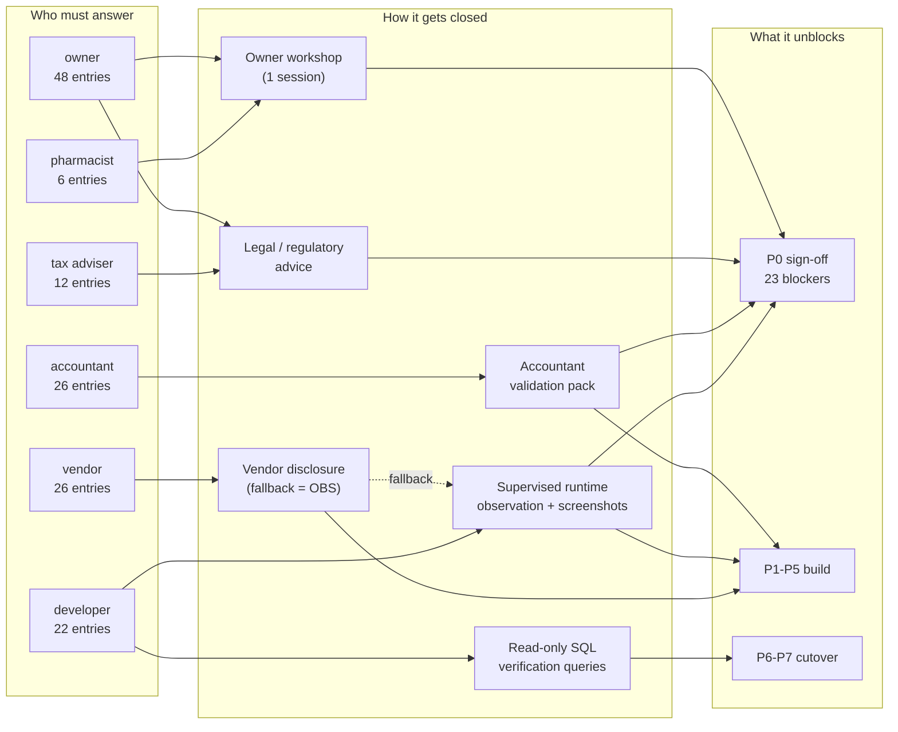

# 14 — Unknowns & Open Questions Register

---

## Header block

| Field | Value |
|---|---|
| **Document purpose** | The single authoritative register of **everything that could not be confirmed** from the available evidence about WASEELA ABUZAR V3 (deployment "Fazal Din PP19"). Each entry records what is unclear, why it matters to the rebuild, exactly what evidence was already searched (so no one repeats the work), what information is still needed, who must supply it, the risk of leaving it open, and which rebuild phase it blocks. |
| **Analysis stage** | Stage 4 — Risk & Gap Analysis. Consolidates the unresolved items raised across documents `02`–`11` plus new gaps identified while cross-reading them. |
| **Sources consolidated** | `00b-owner-decisions-and-requirements.md` (binding), `02-repository-map.md`, `03-module-catalog.md`, `04-screen-form-inventory.md` §14/§15.2, `05a-workflows-sales.md` §23/§26, `05b-workflows-purchase.md` §15/§16/§17, `06-database-analysis.md` §9/§10, `06a-data-profile-reconciliation-baseline.md` §7/§8, `07-accounting-logic.md` §16/§17, `08-inventory-logic.md` §25.4/§26, `09-roles-permissions.md` Part J, `10-reports-catalog.md` §8/§9, `11-integrations-dependencies.md` §12/§13. |
| **Evidence-label legend** | `Verified` — read directly from live data, schema, or a stored-procedure body. · `Strongly Inferred` — multiple converging pieces of evidence, no direct proof. · `Unclear` — evidence is ambiguous or contradictory; requires a human answer. · `Missing` — the capability or artefact is expected but no evidence of it exists anywhere. · `Deprecated` — superseded artefact still present. · `Broken/Incomplete` — present but demonstrably defective or half-wired. · `Recommended` — a proposal for the **new** system; **never** an existing feature. |
| **Read-only guarantee** | **The existing system was NOT modified.** All findings behind this register came from read-only SQL (`SELECT` / metadata only, per owner decision **D2**), read-only file inspection, and read-only string extraction from compiled `.pbd` binaries. No schema, stored procedure, data row, configuration value, or binary in `E:\Pharma Software` was created, altered, or deleted at any point. |
| **Anti-hallucination rule** | Nothing in this document asserts that the legacy system has a capability. Every row here is a **question**, and every proposed answer shape is labelled `Recommended`. Where the analysis found *nothing at all*, the row is labelled `Missing` and says so plainly rather than inventing a plausible behaviour. |

---

## How to read this register

**Structure.** Unknowns are numbered in one continuous sequence `U-001 … U-123` and grouped into seven sections: Business rules · Accounting · Inventory · Compliance & tax · Technical · Data · Operational. IDs are permanent — never renumber; retire an entry by marking it **RESOLVED** with the date and the answer.

**Columns.**

| Column | Meaning |
|---|---|
| **ID** | Permanent identifier. Cite it in every downstream document. |
| **What could not be confirmed** | The precise question, stated so a non-analyst can see what is missing. |
| **Why it matters** | The concrete rebuild consequence — never "for completeness". |
| **Evidence searched** | Exactly what was already looked at: analysis doc + section, stored-procedure name, `table.column`, live query. Do not redo this work. |
| **What is still needed** | The specific artefact, answer, or observation that closes the entry. |
| **Who** | `owner` · `accountant` · `pharmacist` · `vendor` · `developer` (a "vendor" answer may be substitutable by runtime observation — see U-113). |
| **Risk** | Severity + the consequence of building without the answer. |
| **Gate** | The earliest phase that cannot complete until this is answered. |

**Provisional phase ladder** (`Recommended` — to be superseded by `22-final-master-revamp-plan.md`; used here only so "blocks a phase" has a concrete meaning):

| Gate | Phase | Contents |
|---|---|---|
| **P0 ⛔** | Discovery sign-off & scope freeze | Owner signs off scope, evidence base, statutory position, architecture-shaping decisions |
| **P1** | Foundation | MySQL schema, auth, roles, master data, numeric & config policy |
| **P2** | Sales / POS + FBR fiscalization | The counter, returns, tax legs, fiscal payload |
| **P3** | Purchase + inventory + batch/expiry (R4) | Goods-in, costing, stock, expiry |
| **P4** | Accounting — trading-ledger port + R2 additions | Journal, supplier payments, expenses, cash book, profit statement |
| **P5** | Reports & analytics | The ~197 deployed report leaves + management reporting |
| **P6** | Migration, reconciliation & cutover | Extraction, load, the 16 reconciliation invariants, opening balances |
| **P7** | Parallel run & go-live | Dual operation, daily reconciliation, decommission |
| **Later** | Not gating | Answer before the relevant feature is built; does not hold a phase |

**Counts.**

| Group | ID range | Entries | P0 blockers |
|---|---|---:|---:|
| A. Business rules | U-001 … U-016 | 16 | 1 |
| B. Accounting | U-017 … U-044 | 28 | 7 |
| C. Inventory | U-045 … U-059 | 15 | 3 |
| D. Compliance & tax | U-060 … U-076 | 17 | 6 |
| E. Technical | U-077 … U-101 | 25 | 6 |
| F. Data | U-102 … U-113 | 12 | 1 |
| G. Operational | U-114 … U-124 | 11 | 4 *(includes new U-124)* |
| **Total** | **U-001 … U-124** | **124** | **24 open** *(of the original 27: U-076, U-077, U-099 and U-118 resolved 2026-08-02; offset by 1 newly added blocker, U-124)* |

> The **P0 ⛔** marker appears on exactly the 27 entries listed in "The 27 P0 blockers" table below — nowhere else. Entries whose gate reads "*raise at P0*", "*survey at P0*", "*disclose at P0*" or "*discover at P0*" are **not** blockers: they must be *tabled* early because of lead time or disclosure duty, but Phase 0 can be signed off before they are answered.

---

## Section 0 — ALREADY RESOLVED by the owner (do NOT re-ask)

Recorded here purely for traceability, so that no workshop, questionnaire, or downstream document re-opens a question the owner has already closed. **These decisions are binding and override any inference from code or schema** (`00b` preamble).

| Decision | Question now CLOSED | Where it was originally raised as an unknown | The binding answer |
|---|---|---|---|
| **D1** | How broad is the rebuild scope — full multi-vertical ERP, or the pharmacy only? | `00-analysis-progress.md` §"Pending business/owner decisions" item 1 | **Pharmacy business in full**, including tax + FBR fiscalization. Hospital / school / HR / hotel / manufacturing / multi-branch sync are **catalogued but deferred** — never silently dropped. |
| **D2** | May the live database be introspected during analysis? | `00-analysis-progress.md` item 2 | **Yes — read-only (SELECT / metadata) authorized.** |
| **D3** | Does pre-2025 history exist that must also migrate? | `06a` §7 Q1; `06` MR-16 / V9; `05a` U3 | **No pre-2025 data exists.** The 19-month window 2025-01-01 → 2026-07-31 is the complete migration scope. *(Residual — see **U-101** — whether external backups of the purged years exist for tax defence.)* |
| **D4** | Is the currency PKR? | `06a` §7 Q2 | **Yes, PKR.** Multi-currency is a dead schema placeholder (`07` §11) and is not required. |
| **D5** | Why 2 customers against 291,361 invoices — is accounts-receivable needed? | `06a` §7 Q5; `06` §10 V12 | **Walk-in cash model confirmed.** No AR module required for current operations. *(Residual — see **U-012** — whether credit customers are wanted in future, shipped disabled per P1.)* |
| **D6** | Are receipts / vouchers / journals genuinely unused, or kept outside the system? | `06a` §7 Q3 and §8; `07` §5.4 | **Genuinely unused. No cash vouchers are kept anywhere, inside or outside.** ⇒ the operated system is a **trading ledger**, not full accounting. |
| **D7** | Should the ~20,861 never-stocked items be archived or deleted? | `06a` §7 Q4 and §5; `03` §item-master findings | **Keep every item. All visible by default. Visibility 100% configurable on/off from the admin panel UI** (requirement R1). Nothing is ever deleted. *(Residual — see **U-014** — which visibility presets ship enabled.)* |
| **D8** | Faithful port (A), trading ledger + expenses & cash book (B), or full double-entry suite (C)? | `06a` §8 "Implications for the rebuild"; `07` §10.2 | **Option B approved** — port the trading ledger as-is, then **add** supplier payments, expense entry, cash/bank book, daily cash reconciliation, and a plain-language profit statement (requirement R2). |
| **D9** | How are supplier payments made and tracked? (finding F1) | `00b` F1 "Required from the owner before R2 is finalised"; `05b` §9.2 / R1 | **"Add all options for the respective user to select from."** Generalised into project-wide principle **P1**: never hardcode a business assumption; ship every realistic option; admin enables/disables; options are data, not code. *(Residual — see **U-001** — which option is the pre-selected default.)* |
| **D10** | What opening balances should the new system start with? | `00b` F1 consequence 1; `06a` §6; `05b` A7; `07` A1 | **All FINANCIAL opening balances start at ZERO** (cash, bank, suppliers, customers, equity). Legacy balances are archived for reference, **never imported**. *(Residual — see **U-042** — whether a supplier-statement reconciliation exercise is nonetheless wanted.)* |
| **D11** | Does physical stock carry over, or start at zero too? | `00b` R3.3; `08` §8.3 | **Stock CARRIES OVER unchanged** — per-item quantities and moving-average costs from `GodownDetail`. The single deliberate exception to "start from zero". No stock freeze required at cutover. *(Residual — see **U-046** and **U-047** — two specific cost-data defects inside that carry-over.)* |
| **D12** | Should real batch + expiry tracking be added? (finding F2) | `00b` F2; `06` §10 V11; `08` §25.4 risks 1–2 | **YES — approved as a Tier-1 feature** (requirement R4): capture at intake, expiry dashboard, FEFO at POS, expired-stock guardrail, batch traceability for recall. *(Residuals — **U-050** … **U-053**: strictness per category, thresholds, and whether the hardware/packaging can actually support scan-to-fill.)* |

> **Rule for all downstream documents and owner workshops:** if a question maps to D1–D12 above, it is answered. Ask only the *residual* sub-questions explicitly listed in the right-hand column, each of which carries its own `U-` ID below.

---

## A. Business rules

| ID | What could not be confirmed | Why it matters | Evidence searched | What is still needed | Who | Risk | Gate |
|---|---|---|---|---|---|---|---|
| ~~**U-001**~~ | ~~Which supplier-payment method should be the pre-selected default?~~ **RESOLVED 2026-08-02: no fixed default — "keep all options."** No business assumption is hardcoded (per P1); the practical default is **whichever method was last used for that supplier**, not a guessed "most common" method. | *(resolved)* | Owner statement 2026-08-02. | owner (answered) | Resolved. | *(resolved)* |
| ~~**U-002**~~ | ~~Why each of the 634 purchase returns was made — no reason code exists today.~~ **RESOLVED 2026-08-02: "add all options — can be any of them — also add option for custom."** Return-reason list ships with every plausible reason (expiry, damage, wrong item/over-supply, price dispute) **plus a free-text custom option**, admin-extendable. | *(resolved — matches the standing P1 pattern this owner applies to every "which options" question)* | Owner statement 2026-08-02. | owner (answered) | Resolved. | *(resolved)* |
| **U-003** | The **purchase-order quantity suggestion algorithm**. `PurOrderDetail.Qty` is computed in the compiled client from `SoldQty`, `Stock`, `MinQty`, `OptimumQty`, `ReorderQty`, `ProjectionPeriod`. | 113,995 PO lines were generated by it; buying behaviour and working capital depend on it. It is commercially the most valuable piece of hidden logic. | `05b` §4.1 and §15 U2 — **Missing**: "No stored procedure computes `PurOrderDetail.Qty`"; `04` §15.2 U9 — the nine `d_dspodetail*` DataWindows recovered by *name and table binding only*, not SQL. | Runtime observation: open the PO screen with known stock/sales figures and reverse the formula; or vendor disclosure. | vendor + developer | **High** — rebuilding reorder suggestions by guesswork changes purchasing behaviour and cash tied up in stock. | P3 |
| **U-004** | The **semantics of the five parallel sale prices, five discount percentages and five recent purchase prices** on `Item`. | Decides whether the new item master needs a price-list dimension or a single price. Wrong call here propagates through POS, purchase and every report. | `03` §item-master finding 4 — "no declared semantics… **Unclear — requires owner validation**"; `06` §7 L5 — `Item.SalePrice2..5`, `RecentPurPrice2..5`, `SaleDiscPerc2..5`, usage **Unclear** (`PriceType` = 8 rows, `GroupAllowedPrice` = 54 rows). | Owner explanation of what each price slot means in the shop (trade / retail / institution / MRP / staff?), plus a live `SELECT COUNT(*) WHERE SalePrice2 <> 0` per slot. | owner | **High** — the item master is P1 foundation work; changing the price model later is expensive. | P1 |
| **U-005** | The **resolution order of the pricing engine**. Pricing logic is spread across ≥10 procedures with overlapping responsibility (price policy, discount policy, bonus policy, promotions, customer-latest-price). | The POS must price a line deterministically. Today the winning rule is not derivable from the SQL alone. | `03` §pricing finding 2 — "Resolution order is **Unclear** and must be traced before rebuild"; `05a` §appendix lists `SP_ApplySalePromotions`, `SP_Apply_SaleAmt_Based_DiscountPolicy`, `SP_GetDiscountPolicyBased_ItemDiscount`, `sp_FetchCustomerLatestDiscounts`, `sp_FetchCustomerLatestSalePrice`; `08` §24.1 — `PricePolicy`/`PricePolicyDetail` 30,052 rows each, **all expired since 2012**. | Owner statement of the intended precedence, plus a decision to **re-specify** rather than reverse-engineer dead policy tables. | owner + developer | **High** — ambiguous pricing at the counter is a direct revenue and dispute risk. | P2 |
| **U-006** | What `SaleLedger.MiscCharges1..5` and `Purledger.MiscCharges1..5` are for, and whether they post to the GL. | Ten unlabelled money columns on the two main ledgers. If they carry real value they must migrate and post; if not they are dead weight. | `06` §7 L4 — "generic slots with no describing lookup… **Unclear / Deprecated**"; `06` §10 V5; note `MiscCharges` (unnumbered) **is** in live use — it carries the PKR 1 FBR POS fee (`11` §2). | Live `SELECT COUNT(*) WHERE MiscCharges1 <> 0` (×5, both tables) plus vendor/owner explanation of the labels. | vendor + owner | Medium — silently dropping a used money column loses value; silently migrating five dead ones misleads maintainers. | P1 |
| **U-007** | What the **10-slot purchase-expense allocation matrix** is: `Purledger.QE1_AccCode … WE5_AccCode`, `QExp1_CrAccCode … WExp5_CrAccCode`, `Purdetail.QE1..QE5, WE1..WE5 numeric(12,2)`. | 30 columns carrying GL account codes — a potentially real landed-cost posting path. Determines whether "landed cost" is a port or a new build. | `06` §7 L3 and §10 V4 — "undocumented 10-slot purchase-expense allocation matrix… requires vendor/accountant clarification"; `05b` §10.1 Mechanism 2 and §16 A10 — all ten slots **default their credit account to `4 PURCHASE EXPENSE PAYABLE`**; `05b` §10.2 proves the *database* does not apportion them into item cost. | Vendor description of the feature + accountant ruling on whether landed cost should be capitalised in the new system. | vendor + accountant | Medium — if landed cost is wanted and this is the intended mechanism, ignoring it means rebuilding it blind. | P3 |
| **U-008** | Whether the compiled client **apportions `PurExp` invoice-level expenses into item cost** (a "distribute expenses over items" button). | `05b` §10.2 proves the database does not. If the client does, item costs in the legacy data include freight/duty and the new system must match or the carry-over costs (D11) shift. | `05b` §10.2 (`Verified` — no SQL apportionment) and §12/§15 U5 — "Nothing in the database supports it, but it cannot be excluded." | Observation: enter a test purchase with an expense on a copy environment and inspect `Purdetail.PurPrice` before/after. | vendor + developer | Medium — affects the meaning of every migrated `AvgPrice` under D11. | P3 |
| ~~**U-009**~~ | ~~The pharmacy's actual supplier credit terms — no terms recorded today.~~ **RESOLVED 2026-08-02: "give option to create any kind of pattern — this should be in the hands of the user."** No fixed term list; the new system ships a **configurable credit-terms engine** — admin can define any pattern (pay-on-delivery, N days, custom schedules) per supplier, not a hardcoded enum. Ageing then buckets against whichever terms are actually assigned. | *(resolved — same P1 pattern)* | Owner statement 2026-08-02. | owner (answered) | Resolved. | *(resolved)* |
| **U-010** | **Who may change selling prices, and within what limits.** Right 120 `Maintenance → Change Items Price` (a bulk repricing utility) is currently held by **every group**. | Bulk repricing is the single highest-blast-radius operation in the product. The new permission model must encode the owner's actual intent. | `09` §J.2 V3 — "Is it acceptable that all groups can run `Maintenance → Change Items Price`?"; `04` §7.1 — `changeitemprice.pbd` "called out because it is high-risk"; `08` §24.4 — `SP_MakePriceChanges` executes `ALTER TABLE` DDL from application-reachable data. | Owner decision on which roles may reprice, singly and in bulk, and whether an approval step is required. | owner | **High** — an ungoverned bulk price change can wipe out margin across 30,052 items in one action. | P1 |
| **U-011** | **Discount authority** — maximum discount % by role, and whether a reason or supervisor approval is required above a threshold. | Today there is no limit and no log: 0.30% of lines carry a discount, granted freely. `Groups` policy columns exist but are **never enforced by SQL**. | `05a` §25.10 (`Recommended` note: "Today: 0.30% of lines are discounted with no limit and no log"); `09` §C.2.3 — "Group-level *policy* fields that are never enforced by SQL — **Broken/Incomplete, Critical**"; `09` §J.2 V5 — the PKR 100,000 per-transaction and 10,000 max-quantity limits "are currently decorative". | Owner decision: per-role discount ceiling, threshold above which a reason and/or supervisor override is required. | owner | **High** — a real, quantified cash-leakage control gap. | P2 |
| **U-012** | Whether **credit customers** are wanted in the future (institutional / hospital / corporate accounts). | D5 closes the *current* model (walk-in cash, no AR). It does not say whether the new system should ship an AR subledger disabled-but-present per P1. | `00b` D5; `06` §10 V12 — "Is `Customer` (2 rows) the intended permanent model?" — flagged **Business decision**; `07` §6.8 — receivables machinery exists and is entirely dormant. | Owner: yes/no, and if yes whether at go-live or later. | owner | Medium — retro-fitting AR into a schema built for cash-only is expensive; shipping it disabled is cheap. | P1 |
| **U-013** | Whether any of the **11 pharma "Data Export Utility" partner feeds** (sell-out / secondary-sales data to manufacturers) are **contractually required**. | If contractual, they must be reproduced exactly. Their layouts exist **only** inside `specialreports.pbd` — a compiled binary. | `04` §11.3 — "almost certainly sell-out/secondary-sales data feeds to manufacturers. **Unclear** whether they are used… **Flag for owner confirmation**"; `04` §14 V4; `10` §9 risk 5 — "11 partner data-export formats are contractual and undocumented… **Critical**". | Owner: which manufacturers receive data, in what format, on what cadence — plus one sample file of each. | owner | **Critical** — a missed contractual feed is a commercial breach discovered after go-live. | P5 |
| **U-014** | Which **item-visibility presets** (R1.5) should ship **enabled** at go-live, and per which context (POS / purchase / reports / stock). | D7 mandates that the capability exists and is admin-controlled; it does not say what the initial configuration should be. 28,893 items visible vs ~8,042 actually traded. | `00b` R1.2/R1.5/R1.6; `06a` §5 — 30,050 item master vs 8,042 ever stocked (`Verified`). | Owner's preferred starting configuration; reversible at any time from the admin panel (R1.1). | owner | Low — configuration, not code; fully reversible by design. | Later |
| ~~**U-015**~~ | ~~Whether generic-name substitution is wanted, given the taxonomy is unpopulated.~~ **RESOLVED 2026-08-02: YES — worth the data-entry effort.** ~8,042 generic names to be populated; committed as an R1-adjacent item-master feature. | *(resolved)* | Owner statement 2026-08-02. | owner (answered) | Resolved — carries a real data-entry workload, to be scheduled in the roadmap. | *(resolved)* |

### Part 3/4 batch resolved together, 2026-08-02
- ~~**U-050/U-051**~~ (batch/expiry strictness + warning thresholds) — **RESOLVED: the proposed default confirmed as-is** — warn at 30/60/90 days before expiry; block the sale on already-expired stock, with a supervisor override. See `00b` R4.2/R4.4.
- ~~**U-052**~~ (one-time stock-take with expiry capture at go-live?) — **RESOLVED: NO** — let real expiry data accrue naturally as new stock arrives, per the original R4.6 default.
- **U-048** (the Dec 8 2025 – Jan 8 2026 stock-record gap) — **asked, no answer available**: owner has no recollection of what happened. Remains an accepted, unexplained data gap — not pursued further; migration proceeds on the basis that it is a genuine historical gap within the 19-month window (D3), not evidence of a bigger problem.
- ~~**U-066**~~ (FBR system down — sell or stop?) — **RESOLVED: keep selling, queue everything generated during the outage, upload/reconcile once FBR is reachable again.** Same mechanism as R5.1 (offline capability, D13) — a network-reachability outage and an FBR-specific outage are handled by the identical local-queue-and-sync design, not two separate features.
- ~~**U-117**~~ (peak concurrency) — **RESOLVED: 6+ staff serving simultaneously at the busiest hour.** Comfortably inside the "≥20 simultaneous POS sessions" test target already recommended in `06`/`12` — that target was a safe margin, confirmed generous rather than tight.

### Two corrections to the earlier analysis — direct owner testimony overrides an absence-of-data inference

> ⚠️ **These are not new decisions — they overturn conclusions the domain-analysis agents drew from the database, because the database's silence turned out to be misleading, not conclusive.** Flagged prominently per the brief's own anti-hallucination discipline: absence of evidence in the schema is not evidence of absence in the business.

- ~~**U-096**~~ (weighing scale / document scanning — usage unproven, `Unclear`) — **CORRECTED 2026-08-02: both are actively used.** `11-integrations-dependencies.md` §hardware previously read "Present, usage unproven… Unclear" for TX Text Control / TWAIN scanning and the weighing-scale integration, based on no queryable usage signal in the live data. **The owner states both are real, active parts of the counter workflow.** Both must be preserved and rebuilt, not dropped. *(Follow-up for the next full documentation pass: update `11` §1/§hardware and `21-feature-traceability-matrix.md` from "Unclear/candidate-drop" to "Retain — Verified in use, owner-confirmed.")*
- ~~**U-123**~~ (delivery / phone / WhatsApp orders — `SaleOrder`/`Quotation`/`PreSales` all 0 rows, recommended "Drop for retail pharmacy") — **CORRECTED 2026-08-02: the owner already does home delivery and takes phone/WhatsApp orders today.** The zero-rows finding was real but the conclusion drawn from it was wrong: staff take these orders **outside the software** (informally, then ring up a normal counter sale on fulfilment) rather than the legacy order-capture modules being genuinely unused business activity. **The new system needs real order-capture and delivery-status tracking — this is a Retain-as-new-build item, not a drop.** *(Follow-up: correct `05a` §24 and `21-feature-traceability-matrix.md`'s "Drop" verdict on sale orders/quotations/pre-sales to "Rebuild — real business activity, previously undocumented because it happened off-system.")*
- ~~**U-060**~~ (which FBR regime applies) — **RESOLVED (system design): both POS fiscalization and Digital Invoicing built, admin-switchable, POS is primary/default.** See `00b` D19. Legal confirmation of which is mandatory is still pending accountant/tax-adviser sign-off — the system supports either, lawfulness of running both is not this analysis's call.
- ~~**U-013**~~ (are the 11 partner data-export feeds contractually required?) — **CONFIRMED REAL: "yes, to specific manufacturers."** No longer hypothetical — this is a live contractual obligation. Still needed before P5: which manufacturers, what format, sample files. Not a P0 blocker (routed to P5 originally) but now confirmed rather than merely suspected.
- ~~**U-121**~~ (downtime/DR tolerance) — **RESOLVED: "zero tolerance."** See `00b` D20 — escalates R5.1 to local-first, no single point of failure.
- ~~**U-122**~~ (who administers day to day) — **RESOLVED: owner across all sites (platform-level), staff per-site (tenant-level).** See `00b` D21 — confirms the R6 tenant model exactly as designed.
| **U-016** | Whether **multi-branch** is a real future intention, and therefore whether the new schema should carry a `branch_id` dimension from day one. | D1 defers the multi-branch vertical, but deferring a *feature* is not the same as deferring a *schema dimension*. Adding `branch_id` later to a live ledger is far more expensive than carrying it from the start. | `00b` D1 (deferred, not dropped); `04` §14 V9; `11` §11 — "Do not port CRS / DropBox / DataCarry / WaseelaMini… **subject to a written owner decision**"; `07` §4.8 / `05a` §24 — `CRS_VirtualGL` = 0 rows, the parallel engine has never run. | A written owner statement: "we do / do not expect a second branch within N years." | owner | **High** — an architecture-shaping decision that is cheap now and expensive later. | **P0 ⛔** |

---

## B. Accounting

> **Standing rule (brief §3, `00b` R2.8):** none of the entries below may be answered by inference. Every one requires sign-off from a **qualified accountant** before the corresponding posting rule is frozen. Where an entry also has a tax dimension it is cross-referenced to Section D.

| ID | What could not be confirmed | Why it matters | Evidence searched | What is still needed | Who | Risk | Gate |
|---|---|---|---|---|---|---|---|
| **U-017** | **There is no recoverable specification of a trial balance or a balance sheet anywhere in the database.** If the UI produces them, the logic is inside compiled DataWindows. | The two most fundamental financial statements have **no server-side definition to port**. They must be specified from scratch. This is a scope item, not a port item. | `07` §16 item 1 — **Missing / Unclear**; `07` §10.2 "What does NOT exist"; `07` §18.6 — "Do not attempt to reverse-engineer them from the compiled DataWindows." | Accountant-authored specification of the trial balance and balance sheet the owner needs, written fresh. | accountant | **Critical** — silently omitted, the new system ships without a balance sheet; silently invented, the figures are unauditable. | **P0 ⛔** (scope) / P4 (spec) |
| **U-018** | Whether **Cost of Goods Sold** should be periodic (as today) or perpetual in the new system. | Today: `InventorySystemUsed = 'P'`, `COST OF SALES` has **zero** GL entries in 19 months, and the GL income statement reports *Sales − Purchases* as gross profit. This single answer determines the entire ledger and inventory design. | `07` §17 A3 and §4.3; `05b` §16 A1 (`SP_VirtualGL_Purchase:58702, 58725` — purchases debit `PURCHASE ACCOUNT (1)`, never `INVENTORY (7)`); `10` §8.1; `00b` F1 (`COST OF SALES` = 0 entries). Line-level cost data **does** exist: `SaleDetail.AvgPrice`, total 193,957,857 across 620,617 lines. | Accountant ruling: periodic or perpetual, and if perpetual, the COGS posting rule per sale line. | accountant + owner | **Critical** — architecture-shaping. Changing it after P4 means rewriting the ledger. | **P0 ⛔** |
| **U-019** | **Which gross-profit figure is authoritative.** Three engines exist and will not agree: (A) GL-periodic `sp_IncomeStatement`, (B) transaction-level from `SaleDetail.AvgPrice`, (C) the SMS daily push. | `00b` F1 asserts gross profit is trustworthy. That claim is only meaningful once one engine is named as the source of truth — the reconciliation baseline (`06a` §6) depends on it. | `10` §8 item 2 — "Which gross profit is authoritative? … They will not agree"; `10` §5.4.3; `07` §10.4 — "Gross profit is recoverable — but not from the GL"; `10` §9 risk 3 — the GL income statement produces a wrong gross profit (`StockLedger` = 0 rows). | Accountant nominates the authoritative engine; the migration reconciliation then locks to it. | accountant | **Critical** — every migration acceptance number in `06a` §6 hinges on it. | **P0 ⛔** |
| **U-020** | Whether the auditor will accept a **derived, rebuildable ledger**, or requires an immutable journal — and the reversing-entry policy that replaces "delete the GL rows and silently re-derive". | The legacy `VirtualGl` is materialised on read, has no PK, no FKs, no audit columns, and a preference (`AutoPurgeVirtualGL`) that can **truncate the whole ledger**. Amending a posted invoice today deletes its GL rows. | `07` §3.1 (deferred materialisation), §3.5 (kill-switch), §9.3, §13.4, §17 E1/E5/E6; `05a` §23 item 8; `05b` §17 R7 — "No GL reversal path"; `06` MR-5 — `VirtualGl` has no PK and no FK. | Accountant/auditor ruling + a written reversing-entry policy for the new system. | accountant | **Critical** — architecture-shaping; also the difference between an auditable and an unauditable system. | **P0 ⛔** |
| **U-021** | Whether output GST on goods being **credited to account 3 `SALES TAX RECEIVEABLES` — a CURRENT ASSET** — is intentional netting or a mis-binding of `GT_AdvanceSalesTaxACC`. | Input and output GST net inside one asset account. Live position: 39,514 rows, Dr 4,168,064 / Cr 4,372,676 → a **net credit of 204,612 sitting inside an asset account** (a liability presented as a negative asset). Affects tax presentation and FBR filing. | `07` §12.1(a) (`db_modules_full.sql:57870-57881`), §16 item 4, §17 C1/C6; `05a` §23 item 1; services correctly use liability account 27 — the asymmetry is `Verified`. | Accountant + tax-adviser ruling on the correct classification, and whether historical presentation must be preserved for comparability. | accountant + tax adviser | **Critical** — a live tax-presentation question on the existing books, not just a rebuild question. | **P0 ⛔** |
| **U-022** | The **rounding policy and the reconciliation tolerance**. Whole-rupee rounding is applied on sale, sale-return and purchase (all three preferences = 0), **twice** inside `fn_getSaleInvTotal` (once to goods, once to tax), with three-level nesting in the tax computation. | Every one of the 16 migration reconciliation invariants (`06a` §6) is a to-the-paisa comparison. Without an agreed tolerance the cutover gate cannot pass or fail objectively. A PKR 5 aggregate drift is already measured across 6,419 purchase invoices. | `07` §14.2 and §17 D1–D4; `05a` §23 item 10; `05b` §16 A11 (`SP_VirtualGL_Purchase:58701`); `06` MR-7 — precision normalisation will change values; `07` §14.1 — `numeric(15,2)` ledger, and an FBR-fee column capped at `numeric(5,2)` = 999.99. | Accountant sign-off on (a) the rounding policy going forward, (b) the acceptable reconciliation tolerance per invariant. | accountant | **High** — without it, migration acceptance is a matter of opinion. | **P0 ⛔** (tolerance) / P1 (policy) |
| **U-023** | The correct **Dr/Cr treatment for stock adjustments**, and which accounts to create under the currently-empty sub-accounts 18/19. | All 1,542 stock adjustments are **silently excluded from the GL** because `SP_VirtualGL_Adjustment` requires `AccCode IS NOT NULL` and every row has it NULL. Net effect over 19 months: −15,391 units / −PKR 290,494 of shrinkage, invisible to the books. | `07` §13.3 (**Broken/Incomplete — high severity**, `db_modules_full.sql:58000-58023`) and §17 A4; `08` §25.4 risk 10 — "Adjustments are the shrinkage channel and carry no reason code". | Accountant: the posting rule for stock increase and decrease, and the account structure to create. | accountant | **High** — shrinkage is currently invisible; the rebuild should not inherit that. | P3 / P4 |
| **U-024** | The **sign convention** for the income statement. `sp_IncomeStatement` is credit-negative and never normalised; whether the DataWindow flips it is unknown. | Every reported profit figure in the legacy system is sign-ambiguous until confirmed — including any figure used to validate the new plain-language profit statement (R2.5). | `07` §10.3 ("structure and defects"), §16 item 3, §17 A5. | Accountant confirmation, plus one printed legacy income statement to compare against. | accountant | Medium — a presentation bug that silently inverts a headline number. | P4 / P5 |
| **U-025** | Whether the legacy **opening entry** is correct: a single entry Dr `PURCHASE ACCOUNT` / Cr `CAPITAL` for 11,873,579 (Opening Purchase, `PurCatCode = 3`, 2025-01-01), with **no** opening cash, bank, receivables, payables or fixed assets. | D10 sets new opening balances to zero, but the *historical* transactions still migrate (R3.2) — including this one. Its treatment in the migrated history must be agreed, not assumed. | `07` §8.2 and §17 A2/B5/B6; `05b` §16 A9 (`SP_VirtualGL_Purchase:58727`); `00b` F1 table — EQUITY/CAPITAL 11,873,579 Cr. | Accountant: how this entry should appear in the migrated 19-month history given a zero opening position. | accountant | Medium — affects whether migrated history reconciles internally. | P6 |
| **U-026** | Whether **purchase expenses should be expensed or capitalised into inventory cost** — the legacy uses **two different policies**: domestic purchases expense them, import purchases capitalise them. | Two contradictory policies in one product. Whichever is chosen changes item cost, and therefore gross profit, on every purchase. | `05b` §16 A5 — `SP_VirtualGL_Purchase:58850-59089` vs `SP_CreateVoucher_From_ImpPur:13011-13018`; `05b` §10.2 — the domestic path does **not** affect item cost (`Verified`). | Accountant ruling on the single policy for the new system. | accountant | **High** — directly changes reported margin. | P3 |
| **U-027** | Which **701 of 6,419 purchase invoices** have `UpdateAvgPriceWithNetRate = 'Y'`, and why. This flag capitalises sales tax into cost and sets `SaleTax = 0` — i.e. **no input-tax claim** on those invoices. | A material tax-treatment switch chosen per invoice by a checkbox, with **no documented rule** about when it should be used. | `05b` §5.6 / §16 A3 (`SP_VirtualGL_Purchase:58730-58756`) — flagged "**Unclear** — a material accounting policy switch controlled per invoice by a checkbox, with no documented rule"; `05b` §15 U4; `08` §26 — `updateavgpricewithnetrate = 'Y'` globally. | Accountant + owner: the rule that *should* govern it, and confirmation of the historical 701. | accountant + owner | **High** — an input-tax claim not made is money lost; one wrongly made is a compliance exposure. | P3 |
| **U-028** | Whether **advance income tax should reverse on purchase returns**. It never does — `AdvIncomeTax = 0.00` is hard-coded in the return path. PKR 696,929 has been withheld and debited to account 35 while PKR 3.5 M of goods were returned. | If a reversal is due, the legacy books overstate a tax asset and the new system must behave differently from day one. | `05b` §16 A4 (`SP_VirtualGL_PurchaseReturn:59171`); `07` §12.1(b) — account 36 has **0** rows, consistent with `ApplyAdvanceIncomeTaxInSale = 'N'`. | Accountant/tax-adviser ruling. | accountant + tax adviser | Medium-High — a real tax-asset misstatement if a reversal was due. | P3 |
| **U-029** | Whether **unlinked sale returns valued at net selling price** (`SRPrice × (1−disc)`) rather than cost is a deliberate simplification or a bug. | It books cost equal to net revenue — zero margin on the return — and inflates credited inventory. Only 1 such return exists today, so the policy can still be fixed cheaply before it scales. | `07` §13.1 (`db_modules_full.sql:59983`) and §16 item 11; `05a` §23 item 4; `08` §25.4 risk 21 — "Free-standing sale returns are valued at **selling** price, not cost". | Accountant ruling: return valuation must be original cost, or something else. | accountant | Medium — currently immaterial (1 row), materially wrong at scale. | P2 |
| **U-030** | Whether **discounts should be separately disclosed**. Today they are netted into revenue and account `25 DISCOUNT RECEIVED/ALLOWED` is **never posted**. | Determines whether the plain-language profit statement (R2.5) can show "discounts given" as a line, which is a question owners routinely ask. | `07` §15.3 and §17 E8. | Accountant + owner preference. | accountant + owner | Low-Medium — reporting granularity, not correctness. | P4 |
| **U-031** | The **ageing policy**: buckets, and whether ageing runs on document date or due date. Legacy uses oldest-first (FIFO) settlement on **document date**, ignoring invoice-level allocation, buckets 0/1/31/61/91/121/151/181 days. | R2.6 ("who do I owe, aged") is a headline D8 deliverable. Currently moot for customers (cash retail) but decisive for suppliers. Depends on U-009. | `07` §6.3, §6.4, §17 E7; `10` §8 item 7 — "Confirm this matches the credit policy… must be right before any credit business starts". | Accountant + owner confirmation of buckets and basis. | accountant + owner | Medium — a wrong-basis payables report drives wrong payment decisions. | P4 |
| **U-032** | The **accounting-period definition, close procedure and lock rule** — and the **year-end retained-earnings roll-forward**. **Neither exists today.** | Without a period lock, any historical figure can change retrospectively. Without a year-end roll, the balance sheet never closes. Both must be designed, not ported. | `07` §9.1 ("There is none"), §9.2 (`ServerDateMonth` is **not** a period lock), §17 E2/E3; `07` §18.5. | Accountant-defined period model, close checklist, and lock rule. | accountant | **High** — a designed-in control that is far cheaper before P4 than after. | P4 |
| **U-033** | Whether **manual journal-voucher capability is required at all**. `GLHeader` and `GLDetail` are **empty (0 rows)**; 22 voucher categories are seeded but none has ever produced an entry. | D6 confirms no vouchers are kept anywhere. But R2 adds real money-out transactions — the accountant may now want a manual JV for corrections. | `04` §14 V3; `07` §5.1 (22 categories, `Verified` live), §5.4; `06a` §4 finding 1 — only SV/SR/PV/PR ever post; `10` §7 — both JV report procs return empty. | Accountant: yes/no, and if yes, who may post and with what approval. | accountant + owner | Medium — a correction mechanism the accountant will expect. | P4 |
| **U-034** | Whether the `Fn_AccountBalance` **`@Date` parameter being silently ignored** has affected any figure the business relies on — and which callers depend on it. | Consumers get an all-time balance where a period balance was intended. All the consumers live in the compiled UI, so the blast radius cannot be read. | `07` §16 item 6 — **Broken/Incomplete + Unclear**; `07` §18.7 — listed as one of three confirmed defects to fix during the port, not after. | Runtime observation of which screens/reports call it; then a decision on whether any legacy figure must be restated. | developer + accountant | Medium — a silently wrong balance shown to the owner for 19 months. | P4 |
| **U-035** | Why the `PurLedger` unposted check is **commented out** in `SP_CheckUnpostedTransactions` (lines 10600-10607). | Purchases can bypass a posting gate that every other document type must pass. Either a deliberate workaround or an abandoned bug fix. | `07` §16 item 5, §9.4. | Vendor explanation, or a decision to enforce the gate uniformly in the new system. | vendor + accountant | Medium — an unposted purchase is invisible to the ledger and to stock valuation. | P3 |
| **U-036** | Whether `VocherCategory.HeaderTreatment` / `DetailTreatment` **enforce** the Dr/Cr side, or are advisory hints the compiled UI may ignore. | Determines whether voucher entry can produce unbalanced or mis-sided entries — directly relevant because R2 introduces the first real vouchers this deployment will ever have. | `07` §5.1 and §16 item 8. | Vendor confirmation, or a decision to enforce server-side in the new system (`Recommended`). | vendor + accountant | Medium — dormant today, live the moment R2 ships. | P4 |
| **U-037** | Whether `CashierShift.DiffTransferedTo` is **constrained to account 42** by the UI, or accepts any account. | R2.4 (daily cash reconciliation) activates the dormant `CashierShift` machinery. An unconstrained difference account means cash variances can be posted anywhere. | `07` §4.6 and §16 item 7; `00b` R2.4 — "the dormant `CashierShift` / `CashierShiftCashCount` / `CashierWindow` tables already model this"; `05a` §24 — 0 rows, never used. | Vendor confirmation, or an explicit new-system constraint. | vendor + accountant | Medium — cash-difference misposting risk in a brand-new module. | P4 |
| **U-038** | The exact semantics of `SaleLedger.Marked`, which guards all four balance setters. | Controls which invoices are eligible for balance updates. Unknown semantics means the new system cannot reproduce the eligibility rule. | `07` §16 item 12, §6.5. | Vendor explanation or runtime observation. | vendor | Low-Medium — dormant here (cash sales), material if credit is introduced (U-012). | P2 |
| **U-039** | Whether `CustBalances` (34 rows, `Acccode decimal(5,0)`, `Balance decimal(15,5)`, heap, no PK) is **live or a stale balance-rebuild artefact**. Nothing in the SQL modules writes to it. | Determines whether 34 account balances must be reconciled at migration or discarded. | `06` §4 table (`Unclear`) and §10 V3. | Vendor confirmation, or a comparison of its 34 balances against `VirtualGl`-derived balances. | vendor + accountant | Medium — 34 unreconciled balances of unknown provenance. | P6 |
| **U-040** | Why supplier account `AccCode 311` is **named `(`** — a single open-parenthesis — while carrying 192 purchase-return GL rows totalling **PKR 1,223,366 (35% of all purchase-return value)**. | Migration will carry a corrupt master record and 192 GL rows into a new system unless the real supplier is identified. | `05b` §7.4(d) and §15 U8, §17 R16 (`Verified` live query on `VirtualGl` joined to `Accounts`). | Owner identifies the supplier; accountant confirms the corrected mapping. | owner + accountant | Medium-High — an unidentifiable counterparty on PKR 1.2 M of transactions. | P6 |
| **U-041** | Whether the **PKR 14,744,948 (10%) overstatement** in `PurOrderHeader.TotalOfPurchases` across 78 POs has driven any business decision. | Caused by a trigger with no state-transition guard (`Inserted.Posted='Y'` without `AND Deleted.Posted='N'`), so re-saving a posted purchase re-counts it. If reports or supplier negotiations used this figure, restatement may be needed. | `05b` §6.3 (trigger at `:64857`), §16 A8, §17 R5 (`Verified` live query). | Owner/accountant confirmation that no decision relied on it; then re-derive from `Purledger` at migration. | accountant + owner | Medium — a known-wrong figure that has been visible for 19 months. | P3 |
| **U-042** | Whether the owner wants a **supplier-statement reconciliation exercise** before cutover, or is content to start every supplier at zero with the legacy figures archived. | D10 permits either: R3.4 says statements are "requested and reconciled *before* entering any opening supplier balance (**or deliberately left at zero**)". The choice has not been made, and requesting ~112 active supplier statements takes weeks of lead time. | `00b` D10, R3.1, R3.4 items 2 and 4; `05b` §16 A7 — PKR 182,671,130 one-sided payable; `00b` F1 gap 1. | A single owner decision, made early enough to allow the lead time if the answer is "reconcile". | owner + accountant | **High** — if the answer arrives late, cutover slips by the statement-collection period. | **P0 ⛔** (decide) / P6 (execute) |
| **U-043** | Whether the **PKR 1 FBR POS fee is revenue retained by the pharmacy or a liability remitted onward to FBR**, and whether it is correctly disclosed on the customer's bill. | It is charged to the customer as `MiscCharges` and credited to account 37 (`FBR POS SERVICE FEE PAYABLE`, a liability) — but `05a` reads it as increasing profit by PKR 291,361 over 19 months. The two readings conflict and must be settled. | `07` §12.1(c) — account 37, 320,300 rows, Cr 291,361.00 = exactly Rs 1 × 291,361 invoices, Dr 28,939.00 reversals, net liability 262,422 (`Verified`); `05a` §23 item 2 and §26 U6; `11` §12 item 8; `07` §17 C4. | Accountant + tax-adviser ruling on classification, remittance process, and bill disclosure. | accountant + tax adviser | **High** — PKR 291,361 of profit classification plus a statutory disclosure question. | P2 |
| **U-044** | Why the FBR POS fee reverses on only **28,939 of 30,704** credit notes — confirm the 1,765 exceptions. | Either a legitimate rule (fee not refundable in some cases) or a defect that has under-reversed a statutory levy 1,765 times. | `05a` §23 item 6; `07` §12.1(c) — the Dr total of 28,939.00 is `Verified` against 30,704 SR invoices. | Accountant + tax adviser: is the exception legitimate? A live query on the 1,765 to find their common attribute. | accountant + tax adviser | Medium — small value, statutory nature. | P2 |

---

## C. Inventory

| ID | What could not be confirmed | Why it matters | Evidence searched | What is still needed | Who | Risk | Gate |
|---|---|---|---|---|---|---|---|
| **U-045** | Whether `SP_Update_ItemHistoricalCost_In_Sale_And_Return` **has ever been run**, and if so when and against which rows. | It can retro-rewrite **620,000 historical COGS values** using a *look-ahead* cost rule, un-transacted, against an arbitrary database name. If it has run, historical gross profit is not reproducible from source documents — which directly challenges the `00b` F1 claim that gross profit is trustworthy. | `08` §8.5 and §25.4 risk 5 — rated **Critical**; `10` §8 item 9 — "its run history is **Unclear**"; `05a` §appendix confirms the proc exists. | Owner/vendor statement, plus any available evidence of execution (job history, `DBRepairLog`, backup diffs). | vendor + owner + developer | **Critical** — if it ran, the "gross profit is trustworthy" foundation of `00b` F1 needs qualifying. | **P0 ⛔** |
| **U-046** | Whether the **16 items valued above retail — PKR 1.79 M, ~15% of total inventory value** — are inside or outside the D11 stock carry-over. | D11 carries quantities **and moving-average costs** over unchanged. These 16 costs are demonstrably corrupt (pack/unit confusion): reported inventory value is PKR 12,011,533 against a defensible PKR 10,222,268. Carrying them over imports a known 15% overstatement into a brand-new system. | `08` §25.2, §25.3 ("**The balance sheet overstates inventory by ~15%**… Requires accountant validation"), §25.4 risk 3 (**Critical**). | Owner + accountant decision: carry as-is, correct before load, or recount those 16 items at cutover. | owner + accountant | **Critical** — a known-wrong PKR 1.79 M carried into the opening stock position. | **P0 ⛔** (decide) / P6 (execute) |
| **U-047** | Whether the **residual 14% of purchase lines whose weighted-average cost cannot be reproduced** matters. The recovered formula reproduces 85.9% of unique-item lines exactly. | D11 migrates `Item.AvgPrice`. If the new system must *recompute* rather than *copy* costs, 14% will not tie back — and there will be no way to explain the difference. | `08` §8.3 ("Empirical validation against 113,561 live purchase lines"); `05b` §15 U3 — "the remainder is unexplained… or accept and **recompute all costs**". | A decision: copy legacy costs verbatim (simplest, honours D11) **or** recompute from purchase history and accept the delta with an explained reconciliation. | owner + accountant + developer | **High** — stock valuation at cutover is a signed-off number. | P6 |
| **U-048** | Why there is a **32-day contiguous gap in the daily stock snapshot, 2025-12-08 → 2026-01-08**. | `StockReport` is the daily per-item stock and price snapshot and an input to reconciliation. A month-long hole means any stock or valuation report spanning that period is incomplete. | `08` §20.2 ("Missing days in range: **32** — a contiguous block") and §25.4 risk 19; `06a` §5 — 545 distinct dates over a ~19-month window. | Owner/vendor explanation (server down? job disabled? database restore?), and a decision on whether the gap must be reconstructed. | owner + vendor | Medium-High — a visible hole in the historical record that will be noticed after go-live. | P6 |
| **U-049** | Whether Pakistani pharmaceutical packs sold through this pharmacy actually carry a **GS1 2D barcode (DataMatrix) encoding batch and expiry**, and whether the counter's existing scanners can read 2D codes. | **R4.1 depends on it entirely.** The whole reason batch/expiry capture is expected to succeed this time (where it failed in the legacy — F2) is "scan auto-fills batch and expiry so it costs the cashier no time". If packs are 1D-only or scanners are 1D-only, R4 reduces to manual entry — the exact failure mode that killed it before. | `00b` R4.1 (the assumption is stated but **not evidenced**); `11` §barcode — the hardware found is an **EAN-13 embedded-weight** scale pattern (`WeighingScale`, MOTEX ML 30P), i.e. **1D**; `11` §hardware — `QRCodeGenLibrary.dll` present but that is *generation* for FBR QR, not *scanning*. **No evidence of any 2D scanner was found.** | (a) Physical check: do the packs on the shelf carry a square dotted code? (b) Model numbers of the scanners in use. (c) A trial scan. | owner + pharmacist + vendor | **Critical** — R4 is a Tier-1 approved feature (D12) whose delivery method may not be physically possible. Discover this now, not in P3. | **P0 ⛔** |
| **U-050** | Which **item categories should require batch/expiry**, which should prompt-but-allow-skip, and which should be off. | R4.1 makes strictness admin-configurable per item category. The initial configuration must reflect real dispensing practice, not a guess. | `00b` R4.1 (three strictness levels, `Recommended`); `08` §26 — live preferences `purbatch='Y'`, `purexpiry='Y'`, `salecheckexpiry='N'`, none read by SQL. | Pharmacist-in-charge: the category list and the required level for each. | pharmacist + owner | Medium — over-strict blocks the counter; under-strict repeats the F2 failure. | P3 |
| **U-051** | The **expiry alert thresholds and the expired-stock guardrail response**. Legacy preferences read `saleexpirydays = 100`, `acceptfutureexpirydays = 90`, `expiry = 365`, `salecheckexpiry = 'N'` — but **none of these is read by any SQL**, so their real effect is unknown. | R4.2 and R4.4 are the core business win of D12. The thresholds and the warn/block/allow choice determine whether the feature helps or obstructs. | `04` §14 V2 — "`Validate Expiry = No`, `Expiry Day(s) = 100` — what expiry policy should the new system enforce?"; `08` §26 preference matrix (**"Read by SQL? No"** on all four); `08` §25.4 risk 1 (**Critical**). | Pharmacist + owner: alert buckets (R4.2 proposes 30/60/90), and warn vs block vs allow for near-expiry and for already-expired. | pharmacist + owner | **High** — patient-safety relevant; the reason D12 was approved. | P3 |
| **U-052** | Whether the owner wants the **optional one-time stock-take with expiry capture** to seed current shelf stock with real dates at go-live. | R4.6 makes this optional. Without it, the expiry dashboard is empty at go-live and only becomes meaningful after one full stock-turn. With it, the feature works from day one but costs a counting exercise across ~8,042 active lines. | `00b` R4.6 ("their choice, not required"); `00b` R3.3 — D11 explicitly removes the *requirement* for a cutover stock-take. | Owner: yes/no, and if yes, scope (all items, or top-N by value) and timing. | owner + pharmacist | Medium — determines whether the headline D12 feature is visibly useful in week 1. | P6 |
| **U-053** | The **stock-adjustment reason taxonomy** — the legacy captures none. | Adjustments are the shrinkage channel: net −15,391 units / −PKR 290,494 over 19 months, with no approval and no categorisation. P1 requires the option list to be offered (`00b` P1 table proposes Damage · Expiry · Theft · Count correction · Sample · Breakage · Other). | `08` §13.4 and §25.4 risk 10 (**High**); `00b` P1 "Where P1 applies" table. | Owner confirmation of the reason list and which reasons require approval. | owner | Medium-High — turns invisible shrinkage into a managed number. | P3 |
| **U-054** | The intended **pack-vs-loose stock model**. `PackStock = 'N'` (stock shown in loose units), `Item.PackUnits` drives purchase costing, and pack/unit confusion is the proven cause of the U-046 cost corruption. | Getting the unit model wrong corrupts cost, price, stock count and every report simultaneously — as it demonstrably already has for 16 items. | `08` §25.2 (pack/unit confusion as root cause), §26 (`PackStock = 'N'`, **"Read by SQL? No"**); `05b` §7.4 — purchase-return bonus qty is **not** multiplied by `PackUnits` while the purchase is (asymmetric reversal, `08` §25.4 risk 12); `10` §8 item 4 — `sp_PurAndReturnCategoryWise` omits `* packunits`. | Owner + pharmacist: how staff actually think about packs vs strips vs tablets, and which unit the counter sells in. | owner + pharmacist | **High** — the root cause of a `Critical`-rated existing defect. | P3 |
| **U-055** | What `GodownDetail.Locked` was designed to do. It is set by `SP_LockBatch` and copied by CRS replication, but **no allocation query ever filters on it** — 104 locked rows are freely sellable from any SQL path. | If batch locking is wanted in the new system (quarantine, recall hold, disputed stock), it must be designed, because the legacy implementation does not work. | `08` §7.2 — "appears in exactly **two** functional places… **No `SELECT … FROM GodownDetail` used for allocation filters on `Locked`**" (`Verified — Broken/Incomplete`), §25.4 risk 15. | Vendor explanation of intent + owner decision on whether quarantine/recall hold is wanted (it pairs naturally with R4.5 traceability). | vendor + owner | Medium — a recall-hold capability that looks present but is not. | P3 |
| **U-056** | The meaning of the preference `BatchAllocation_InSale = 'A'`. The value `A` has **no referent anywhere in the SQL corpus**. | One of the batch-allocation switches that R4.3 (FEFO at POS) must replace. An unknown legacy behaviour cannot be reproduced or deliberately superseded. | `08` §26 preference matrix — "**Unclear** — value `A` has no SQL referent", "Read by SQL? **No**". | Vendor confirmation of the valid domain and each value's behaviour. | vendor | Low-Medium — R4.3 supersedes it anyway, but "we don't know what we replaced" is a poor answer to an auditor. | P3 |
| **U-057** | The meaning of the godown-option codes `1` / `2` / `3` (`SaleGodownOption`, `PurchaseGodownOption`, `TransferGodownOption`). The strings appear nowhere in the SQL corpus. | Not material while `Multigodown = 'N'` and one godown exists — but it must be recorded as unresolved rather than silently dropped (D1: nothing disappears silently). | `08` §12 — "**Unclear.** The precise meaning… is not derivable from SQL"; `08` §26. | Vendor confirmation. | vendor | Low — immaterial at a single-godown site. | Later |
| **U-058** | Whether the **stock roll-forward equation is missing a ninth document type** — specifically inter-godown transfer. `SP_MONTHLYSALESANDSTOCK_ITEMWISE` uses eight document types while `Transfer` tables exist. | If a ninth movement type exists, every stock roll-forward and reconciliation is silently short by it. | `10` §8 item 12 — "confirm no ninth document type (e.g. inter-godown transfer) is missing given `Transfer` tables exist". | Live `SELECT COUNT(*)` on the `Transfer` tables + accountant confirmation of the complete movement set. | developer + accountant | Low-Medium — likely zero-row here (single godown), but it is a reconciliation invariant. | P6 |
| **U-059** | The provenance and correctness of the **reorder parameters** `Item.MinQty` / `OptimumQty` / `ReorderQty` — and the fact that all three maintenance procedures report failures as successes. | These feed the PO suggestion algorithm (U-003). The setter procedures use `AND` where `OR` is intended, so `@rowcount = 0` with `@err = 0` is reported as success — meaning values may never have been updated at all. | `08` §18.1 — "the error test uses `AND` where `OR` is intended… The same defect is present in all three procedures" (`Broken/Incomplete`); `08` §25.4 risk 20. | Owner: are these values trusted and used? Live distribution query to see whether they are populated or default. | owner + developer | Medium — reorder suggestions built on untrusted parameters. | P3 |

---

## D. Compliance & tax

> **Standing rule:** every entry in this section requires a **qualified Pakistani tax adviser** and, where marked, the **pharmacist-in-charge** or a **DRAP-competent adviser**. None may be answered by inference from the code.

| ID | What could not be confirmed | Why it matters | Evidence searched | What is still needed | Who | Risk | Gate |
|---|---|---|---|---|---|---|---|
| **U-060** | **Which FBR regime this pharmacy is legally on right now** — POS integration only (currently live), or is **Digital Invoicing** already mandatory for this NTN? | Determines the entire statutory scope of P2. Today `ImplementDigitalInvoicing = 'N'`, all DI tokens empty, and **zero** DI submissions have ever been made — while the DI schema columns and four lookup tables are seeded and waiting. | `11` §12 item 1 and §2.4; `04` §14 V7 — "fiscalization is ON (POS ID 141973, Rs 1.00 POS fee) but Digital Invoicing is OFF with empty tokens. Which regime applies going forward?"; `06` §10 V13 (**Business decision**); `11` §13 Q12 — no submission log table exists, so the integration may never have been proven at all. | Written confirmation from a tax adviser of the regime applicable to this NTN and this business category, with effective dates. | tax adviser + owner | **Critical** — building for the wrong regime means a statutory non-compliance at go-live. | **P0 ⛔** |
| **U-061** | Whether **`ownertaxregno = '055-3252501'` is the pharmacy's STRN/NTN or a telephone number.** The field's caption is "Phone, Tax Reg. No. etc" and the format resembles a Pakistani landline (Gujranwala area code 055). | This value is reused as a tax identifier. If it is a phone number, every document and submission carrying it is wrong. Trivially cheap to resolve, disproportionately expensive to discover late. | `11` §2.4 — "**Unclear** — the format resembles a Pakistani landline… **Must be confirmed with the owner before it is reused as a tax identifier**"; `11` §12 item 9; `07` §12.1(c) — the same value sits alongside `FBRPOSID = 141973`. | The owner reads out the pharmacy's actual NTN and STRN from the certificate. | owner | **Critical** (but trivial to close) — a wrong tax identifier on statutory documents. | **P0 ⛔** |
| **U-062** | Whether the pharmacy has **drug-regulatory obligations (DRAP) that the software must support** — controlled-substance register, prescription retention, pharmacist sign-off, narcotics reconciliation, licence expiry tracking. | **Nothing whatsoever on this subject was found in the entire analysis.** The legacy has no controlled-drug register, no prescription-retention store, no pharmacist-sign-off field, and no licence tracking. If any of these are legally required, the rebuild scope is larger than D1 currently describes. | Searched: `03` module catalog (122 `.pbd` libraries — `eprescriptionbasics` exists but is a **dormant hospital-vertical** library, 0 rows); `04` screen inventory (no controlled-drug or prescription-retention screen among 2,066 windows); `06` schema (no such table among 762); `09` rights (486 rows — no pharmacist / dispensing-authority right); `10` reports (197 deployed leaves — no regulatory register). **Result: `Missing` — the capability does not exist and was never in scope.** | Owner + pharmacist-in-charge + a DRAP-competent adviser: the list of statutory registers and records this pharmacy must keep, and which of them the software should hold. | owner + pharmacist | **Critical** — an unexamined regulatory dimension in a **pharmacy** rebuild. Must be explicitly in or out of scope before P0 sign-off. | **P0 ⛔** |
| **U-063** | Whether FBR accepts `PCTCode` sent as `"."` — the placeholder currently transmitted for **99.4% of invoice lines** — and what happens under Digital Invoicing, where a valid 8-digit HS code is expected. | If real HS codes become mandatory, an item→HS mapping project across ~8,042 traded items becomes a prerequisite for P2, not a nice-to-have. That is a large, owner-funded data exercise with a long lead time. | `11` §2.4 — "99.4% of items map to PCT description `.` — a placeholder… Whether FBR accepts this is **Unclear**… **Requires tax-adviser validation and a full item→HS mapping**" (`Verified, High risk`); `11` §12 item 7; `03` — `PCT` table has **3 rows**. | Tax-adviser ruling; if mapping is required, an owner decision on who does it and by when. | tax adviser + owner | **Critical** — a hidden multi-week data project sitting on the P2 critical path. | P2 *(discover at P0)* |
| **U-064** | Which **`FBR_DI_Scenario`** applies — SN025 (drugs at a fixed sales-tax rate, 8th Schedule Table-1 serial 81 → transaction type 138, *Non-Adjustable Supplies*) or SN026–SN028 (sale to end consumer by retailers). All 28 seeded scenarios are `Applicable = 'N'`. | The scenario determines the tax treatment transmitted on every line. Choosing wrongly misdeclares every invoice. | `11` §2.4 — "**Strongly Inferred**: for a retail pharmacy the operative scenarios are SN025 and SN026–SN028. `Applicable='N'` on all of them means **no scenario has been selected**"; `11` §12 item 2. | Tax-adviser selection of the applicable scenario(s), in writing. | tax adviser | **High** — systematic misdeclaration if guessed. | P2 |
| **U-065** | Whether a **retrospective filing or correction is required for the 19,642 unfiscalised 2025 sale returns**. | A statutory exposure that exists **today**, independent of the rebuild. The owner needs to know about it regardless. | `11` §12 item 3 (`Verified` count). | Tax-adviser assessment and, if required, a remediation plan. | tax adviser + owner | **High** — an existing, quantified compliance exposure. | **P0 ⛔** (disclose) / P2 |
| **U-066** | Why **439 sale invoices carry no fiscalization**, and what the operational procedure is when the FBR gateway is down. | Determines whether the new system needs a documented offline-fiscalization fallback and a queue with an operator-visible "unfiscalized invoices" report. | `11` §12 item 4; `05a` §26 U4 — "Why do 439 invoices lack fiscalization, and what happens operationally when the FBR gateway is down? **Statutory exposure.**"; `05a` §25.6 (`Recommended` durable retry queue + dead-letter). | Owner: what staff do today when fiscalization fails. Tax adviser: whether the 439 need correcting. | owner + tax adviser | **High** — both a historical exposure and a live design requirement. | P2 |
| **U-067** | Whether the **`Discount` figure reported to FBR is compliant**, given it excludes invoice-level discount (`SaleLedger.FlatDisc`, `SaleLedger.DiscPerc`) while the tax base **does** include it. | `TotalBillAmount`, `TotalSaleValue` and `Discount` may not reconcile arithmetically on the submitted payload — a reconciliation FBR can perform. | `11` §1.3 J5 and §12 item 5 (`Verified`). | Tax-adviser ruling on the correct reported figure. | tax adviser | **High** — an arithmetic inconsistency visible to the tax authority. | P2 |
| **U-068** | The correct tax treatment of **bonus (free) goods** — currently taxed and counted but **not valued**. | Free-goods treatment is a standard pharmacy audit point (bonus stock from distributors is routine here). | `11` §1.3 J7 and §12 item 6; `10` §8 item 6 — "Costed but not revenued in the GP engine… Confirm this is the intended margin treatment for bonus stock." | Tax-adviser ruling on VAT treatment; accountant ruling on margin treatment. | tax adviser + accountant | **High** — routine, high-volume, and currently handled by an unexamined rule. | P2 |
| **U-069** | Whether the **sale-return tax asymmetry** is compliant: `fn_getTaxOnSRInv` omits `ItemFlatDisc` from the line base while `fn_getTaxOnSaleInv` includes it — so refunded tax may not equal tax originally charged. | Refunding a different tax amount than was charged is a direct compliance and reconciliation problem. | `11` §12 item 10; `05a` §return-formula — "**no `itemflatdisc` term** — a line-flat-discounted sale cannot be returned at the same net price by formula… **Broken/Incomplete**". Currently immaterial (`ItemFlatDisc = 0` on every sale line) but live the moment flat discounts are used. | Tax-adviser confirmation of the required symmetry. | tax adviser | Medium — dormant today, live as soon as U-011 introduces line discounts. | P2 |
| **U-070** | The **legally required rounding for tax amounts** (`roundsaleinvon`, `roundsalereturninvon`). Currently whole rupees, applied independently to goods and to tax. | The rounded value is what is declared to FBR. If the law requires a different rounding, every declaration is marginally wrong. Interacts with U-022. | `11` §12 item 12; `05a` §23 item 10; `07` §14.2. | Tax-adviser statement of the required rounding rule. | tax adviser | Medium-High — small per invoice, 291,361 invoices. | P2 |
| **U-071** | Whether a **reprint of a fiscalised invoice must reproduce the original FBR payload verbatim** rather than recompute it. | 99.6% of invoices have `RePrintingCounter > 0` (see U-107), so reprints are near-universal. If recomputation is happening and prices or tax have since changed, reprints diverge from what was declared. | `10` §5.7.1 — "a reprint of a fiscalised invoice must reproduce the *original* fiscal payload, not recompute it. Whether it does is **Unclear** (logic is in the compiled DataWindow)" (**High — compliance**); `10` §8 item 11. | Tax-adviser requirement + a runtime test: reprint an old invoice and compare to the stored payload. | tax adviser + developer | **High** — near-universal reprinting makes any divergence systematic. | P2 |
| **U-072** | Which **tax legs must appear in the FBR statutory reports** — `UnitSalesTax` (per-unit, 41,814 rows) is used, `GSTPerc` (0 rows) is not. | Determines the statutory report definitions in P5 and the payload composition in P2. | `10` §8 item 10. | Tax-adviser specification. | tax adviser | Medium | P2 / P5 |
| **U-073** | What the `SalesTaxSchedule.TaxType` codes `S` / `E` were meant to mean. **No procedure reads this column**; only `TaxPerc` is consumed. | An unread tax classification column in a tax table. Either dead, or a classification the new system should honour. | `11` §2.4 — "`TaxType` values `S` / `E` are **Unclear** (plausibly *Standard* vs *Exempt/Extra*; no proc reads this column)"; `11` §12 item 11. | Vendor confirmation; tax-adviser ruling on whether the distinction matters. | vendor + tax adviser | Low-Medium | Later |
| **U-074** | Whether **no sale invoice carrying invoice-level sales tax** (`SaleLedger.SalesTax = 0` on all 291,361 rows) is correct for this pharmacy's tax status. | The entire output-tax position of the business rests on this being deliberate. If it is not, 19 months of invoices are misdeclared. | `07` §12.2 (`Verified`: `SELECT COUNT(*) FROM SaleLedger WHERE ISNULL(SalesTax,0) <> 0` → **0**) and §17 C5; `11` §2.4 — purchases **do** carry input tax. | Tax-adviser confirmation of the pharmacy's GST status (exempt / inclusive-at-source / other). | tax adviser | **High** — foundational to every tax figure. | **P0 ⛔** |
| **U-075** | Whether the **legacy application may lawfully continue running in parallel** after the new system goes live, given the `SP_WayToMoon` licensing/anti-tamper gate and the vendor licence terms. | P7 assumes a parallel run. The gate requires two marker files in `SysWOW64` whose names are **supplied by the client at runtime and are not stored in the database**, so they cannot be enumerated from this corpus. If the licence lapses or the markers are lost, parallel running stops. | `11` §13 Q7 — "Are the two `SP_WayToMoon` marker filenames known? Needed to keep the legacy app runnable during parallel-run"; `11` §hardware note — "The marker filenames are supplied by the client, not stored in the DB… **Unclear**"; `02` §3 — startup gate 1 uses `xp_cmdshell`; `03` T3-10 — "**Deprecated — security liability**". | Owner + vendor: licence status, marker filenames, and written permission to run both systems concurrently. | owner + vendor | **High** — blocks the parallel-run strategy if unresolved. | P7 *(raise at P0)* |
| ~~**U-076**~~ | ~~The owner's contractual and IP position — right to the data, to extract it, to decommission the product, to have a replacement built.~~ **RESOLVED 2026-08-02 by direct owner statement: the owner is the pharmacy's proprietor and personally owns the software (he is "Abuzar," the namesake/authority behind Waseela/Abuzar). No further documentation was requested or is needed** — this project does not ask the owner to prove ownership of his own business. | *(closed — see "Advanced since the register was written")* | Searched: `02` §2 tree; `11` §vendor artefacts; `04` §14 V10 — a residual, unrelated note: third-party customer names appear embedded in `components.pbd`, i.e. **other pharmacies' data may be present inside these binaries**. Since the owner is himself the software's authority, this is now a question of whether *his* product ships data between his other installations/clients, not a third-party vendor risk to him — worth a look later, not a P0 item. | owner (answered) | Closed. | *(resolved)* |

---

## E. Technical

| ID | What could not be confirmed | Why it matters | Evidence searched | What is still needed | Who | Risk | Gate |
|---|---|---|---|---|---|---|---|
| ~~**U-077**~~ | ~~The binaries analysed are not the binaries that produced the live data — production ran from `D:\V3_AbuzarSoftware\`, absent from this machine.~~ **RESOLVED 2026-08-02 by direct owner statement: that machine was destroyed by fire approximately 2026-07-30/31 ("2-3 days back" from 2026-08-02). It cannot ever be re-examined — it no longer exists.** | This closes the discrepancy permanently rather than leaving it open: `E:\Pharma Software\V2_AbuzarSoftware\` is not a *possibly-different* build to be reconciled against a recoverable original — it is the **only surviving copy**, full stop. Every "Missing — logic is in the compiled client" finding across `05a`, `05b`, `08`, `10` must be resolved by runtime observation and business re-specification (per U-078), never by comparison to the original, because there is nothing left to compare against. | `11` §5 (original finding); owner statement 2026-08-02. **See U-124 below — a *second*, separate machine now exists post-fire and needs its own evaluation.** | owner (answered) | Resolved — but see **U-124** immediately below, which this answer surfaces. | *(resolved)* |
| **U-078** | **Roughly half of the transaction logic is unreadable** — the POS write path, the purchase posting transaction, and ~75% of deployed report SQL exist only inside compiled PowerBuilder bytecode. There is **no source code** (`.pbl/.srw/.sru/.srd/.pbt` counts = 0). | This is not one unknown but a *class* of unknowns. It sets the effort and risk profile of the whole rebuild: those behaviours must be re-specified from business requirements and runtime observation, not ported. A budget and method for runtime tracing must be agreed at P0. | `02` §1 — "Source code: **NONE present — compiled binaries only**" (`Verified`); `05a` §4.5 — "The critical structural gap — the POS write path is **not** in SQL"; `05b` §15 U1 — "No `sp_PostPurLedger` exists; the whole sequence… is compiled client code"; `08` §25.4 risk 4 (**Critical**); `10` §9 risk 4 — "Report SQL for ~75% of deployed reports exists only in compiled `.pbd`" (**Critical**). | An agreed method and budget: supervised runtime observation of the live app on a copy environment, screen recordings, and re-specification workshops. | owner + developer | **Critical** — determines the project's true size. Under-estimated here, every later phase slips. | **P0 ⛔** |
| ~~**U-079**~~ | ~~Whether the counter needs to keep selling when the internet/server is unavailable.~~ **RESOLVED 2026-08-02: yes — must keep selling offline.** See `00b` D13/R5.1: local-first POS, queued sync on reconnect, FBR fiscalization queues rather than blocks. | *(resolved — see `00b` R5.1)* | Owner statement 2026-08-02. | owner (answered) | Resolved. | *(resolved)* |
| ~~**U-080**~~ | ~~Whether the new system is on-premise, cloud-hosted, or hybrid.~~ **RESOLVED 2026-08-02: both offered (P1), cloud is default, hosted on infrastructure the owner alone controls.** The owner's original request — store live data directly in his own Google Drive — needed a technical correction (a live database cannot safely run inside a file-sync folder). Delivered instead as: owner-controlled cloud hosting + automated backups pushed to the owner's own Drive as an offsite copy. See `00b` D14/R5.2. | *(resolved — see `00b` R5.2)* | Owner statement 2026-08-02. | owner (answered) | Resolved. | *(resolved)* |
| ~~**U-081**~~ | ~~No screenshots or screen recordings of the running application exist.~~ **PARTIALLY RESOLVED 2026-08-02 by independent developer automation — no owner involvement.** Real login flow and main-menu screenshots captured (see `docs/system-analysis/screenshots/`): `01-login-screen.png`, `02-backup-information.png`, `03-backup-database-prompt.png`, `04-main-application-menu-bar.png` (logged in as ADMIN, live). **The real top-level menu is now `Verified`: File · Purchase · Sales · Reports · Basic Data · Maintenance · Manage · Window · Help** — confirms the module catalog's inferred navigation structure directly from the running app for the first time. | Closes the visual-layout gap for the login flow and top-level navigation. **Still open**: the ~20 individual transaction/master-data/report screens (`04` §11.1) — dropdown menus render as separate popup windows that `PrintWindow` on the parent frame cannot capture, so reaching them needs either a full-screen capture during an open dropdown or driving all the way into each child MDI window. Method is now proven (Win32 UI Automation, with `SetProcessDPIAware()` — the process was hitting a DPI-virtualization mismatch between raw `GetWindowRect` and true screen coordinates, which silently misdirected every synthetic click until corrected) — the remaining screens are a mechanical continuation of the same technique, not a new unknown. | developer (continues independently, no owner involvement needed) | Reduced from **High** to **Low-Medium** — the hard part (proving the automation works at all against this specific legacy app) is done. | P0 partially cleared; remaining screens are P2-era work, not a P0 blocker |
| **U-082** | Whether **menus for `Transactions`, `E-Prescription`, `Patient Management`, `Activities` are hidden or merely unrestricted** at this site — and, more sharply, whether the `Transactions` (accounting-voucher) menu root being **absent from `Rights`** means it is hidden for everyone or reachable by everyone. | Determines whether floor staff can currently reach the general ledger. Also determines the scope of the "shipped-but-unused" claim that underpins the D1 scope reduction. | `09` §J.1 U1 (**High impact**) and §S25 — "`SELECT COUNT(*) FROM Rights WHERE IndicesString LIKE '4,%'` → **0**", while 11 *window* rights for the Accounting-Voucher screen exist and are granted to ADMINISTRATOR; `04` §15.2 U5. | Launch the app as `ADMIN` and as a `SALES OFFICER` and observe the menu bar — resolved by the same session as U-081. | developer + vendor | **High** — an open question about who can reach the ledger today. | P1 |
| **U-083** | Whether the permission model **fails open or fails closed** when a right row is missing entirely (as opposed to merely un-granted). | Rights 5070/5071/5072 (price-policy disclosure) and 5294–5300 (Drop-Box doc types) are **referenced by stored procedures but do not exist** in this deployment's `Rights` table. Whether those checks currently pass or fail governs the interpretation of U-082 and of several access findings. | `09` §J.1 U2; §A6 (`db_modules_full.sql:31852`, `:21515`); `09` §C.2 — "these always resolve to 0. **Broken/Incomplete**". | Vendor confirmation or a controlled runtime test. | vendor + developer | **High** — a fail-open permission model is a live security finding, not just a rebuild input. | P1 |
| **U-084** | The **concurrency semantics of `SP_GetTabMaxkey`** — the counter that issues the primary key for every sales and purchase document. | 136 call sites depend on `UPDLOCK HOLDLOCK` behaviour that **does not exist in MySQL**. A naive port produces duplicate invoice numbers under concurrency — and FBR's `USIN` depends on invoice numbers never being reused. | `06` MR-1 (**Critical**) — `sp_GetTabMaxKey`, `SP_LockTabMaxKey`, `SP_UpdateTabMaxKey`, `sp_GetHeaderTabMaxkey`, 53+29+28+26 textual call sites; `05b` §15 U7 — "Concurrency safety of `SP_GetTabMaxkey` **not verified**"; `05a` §25.2 (`Recommended`: replace with database sequences, never reusable). | Read `OBJECT_DEFINITION` directly against the live DB to confirm the isolation semantics, then design the MySQL equivalent and prove it with ≥20 concurrent POS sessions. | developer | **Critical** — duplicate invoice numbers are a statutory and commercial failure. | P1 |
| **U-085** | What **triggers `SP_VirtualGL`** — a scheduled job, a menu item, or application startup. No SQL Agent exists on SQL Server Express, yet something fires at a precise 00:00:03 cadence. | If GL materialisation is manual, the ledger can be arbitrarily stale — which changes how much any legacy financial figure can be trusted, including the reconciliation baseline. | `05a` §26 U5; `10` §5 — "**Who fires it is Unclear.** A `Manage , Job Schedule` right exists (`RightCode` 1664) but **no** `JobSchedule` table exists… The precise 00:00:03 cadence points to an OS-level scheduled task or the `mdsys.exe` helper. **Unclear — must be confirmed before cut-over**". | Inspect Windows Task Scheduler on the production machine; inspect `mdsys.exe` (see U-092). | developer + owner | **High** — determines the freshness guarantee of every migrated balance. | P6 |
| **U-086** | Whether the PowerBuilder client **wraps the invoice save in an explicit database transaction**. | Determines whether partial invoices and stock corruption are possible in the *existing* data — which in turn determines how much data cleansing the migration needs. Several procedures (`sp_GenerateSale_From_SaleOrder`, `sp_PostPurOrder`) have **no `BEGIN TRANSACTION`** and rely entirely on the client for atomicity. | `05a` §26 U1 and §the lock helpers — "these lock helpers are **only useful if the caller opened an explicit transaction**… Whether it does is **Unclear** (binary)"; `05b` §4.2 — "**Broken/Incomplete — no transactional envelope**"; `05b` §17 F2. | Black-box observation: force a failure mid-save on a copy environment and inspect the residue. | developer | **High** — governs the expected level of orphaned/partial rows in the migration source. | P6 |
| **U-087** | Who or what serves **`http://localhost:8524/api/IMSFiscal/*`** — the local IMS middleware that **is** the fiscalisation integration. | P2 must replace or re-integrate with it. It is not installed on this machine and `141973.ims` is encrypted, so its contract is entirely opaque. | `11` §2.2 Path 3 — "**Unclear (opaque third party)**"; `11` §13 Q1 — "Not installed on this machine; `141973.ims` is encrypted"; `11` §13 Q3 — the TCP 9111 wire protocol between `abuzar.exe` and `fiscalizationapp.exe` is likewise unknown ("Compiled `.pbd`; no traffic capture"). | Vendor documentation of the IMS API, **or** a traffic capture on the production machine during a live sale. | vendor + developer | **Critical** — blocks the fiscalization rebuild, which is statutory (D1). | P2 |
| **U-088** | The contents of **`HKCU\Software\Waseela\FiscalizationApp`** on the production PC — may hold endpoint, retry and credential settings. | Configuration that the new integration must reproduce. Not available because the production machine's registry hive was not accessible. | `11` §13 Q2. | Read-only registry export from the production PC. | owner + developer | Medium-High — likely holds the operational settings for U-087. | P2 |
| **U-089** | The **exact composition of the trailing 6–9 digits of `FiscalInvoiceNo`**. The first 12 characters are decoded and reconcile exactly (`<POSID=141973><YYMMDD>`); the tail is ambiguous from two samples. | Needed only if the new system must generate or validate fiscal invoice numbers itself rather than receiving them from the gateway. | `11` §2.2 — "total length **20–21 characters**… The exact composition of the trailing 6–9 digits is **Unclear**"; `11` §13 Q4. | More samples plus vendor/FBR specification. | vendor | Medium — bounded by U-087's answer. | P2 |
| **U-090** | The full contents of **`Script.mdb`** — a 29.4 MB Microsoft Access database in the Application folder, protected by a Jet password with encrypted VBA (`DPB=`). | Could contain report definitions, script templates, or the vendor's complete schema-migration history — potentially the single richest unexamined artefact in the tree. | `04` §15.2 U6 — "Contents not analysed in this pass… Could contain report definitions, script templates, or migration data that materially affects the rebuild. **Recommended next step**"; `11` §13 Q6 — "Would reveal every schema change the vendor ever applied. Blocked by: Jet password + encrypted VBA"; `02` §4 — "role unconfirmed". | Vendor-supplied password, or an owner decision to attempt read-only recovery. | vendor + owner | Medium-High — potentially closes several other entries at once. | P1 |
| **U-091** | Whether **`Rightsclone` (2,122 rows) is the product default, an upgrade staging table, or a backup** — and what `temp_GroupRights` (6,265 rows) is. Live `Rights` has only 486 rows. | The rebuild's permission catalogue is being derived partly from `Rightsclone` (it is the full product menu tree). Its status determines whether that derivation is sound. | `04` §15.2 U11; `03` T3-04 — classified **Deprecated**, "Remove-after-approval"; `04` §16 — `rightsclone.tsv` (2,122 rows) was used as "the full product menu tree". | Comparison against a fresh vendor installation, or vendor confirmation. | vendor | Medium — the permission catalogue's provenance. | P1 |
| **U-092** | The purpose of **`mdsys.exe`** (49 KB), a second executable shipped alongside `abuzar.exe`. | Possibly the licensing watchdog, the fiscalization bridge, or the scheduler that fires `SP_VirtualGL` (U-085). Unknown resident software on a production till. | `03` §4 — "`mdsys.exe` — secondary utility executable (purpose **Unclear**; `mdsys.ext` present)"; `04` §15.2 U7; `10` §5 — named as a candidate for the 00:00:03 job. | String/behaviour inspection on a copy environment; vendor confirmation. | vendor + developer | Medium — may close U-085. | P6 |
| **U-093** | Whether **`PBVM125.dll` (dated 4 Jan 2026) and `libjcc.dll` (7 Dec 2025) are patched builds or merely re-copied files**, given every other runtime file dates from 2011. | Supply-chain integrity on a machine that handles money and tax submissions. No hashes or signatures are available to compare against. | `11` §hardware — "Whether these are patched builds or merely re-copied files is **Unclear**"; `11` §13 Q13. | Vendor confirmation, or hash comparison against a known-good PowerBuilder 12.5 runtime. | vendor | Low-Medium — a supply-chain question, not a rebuild blocker. | Later |
| **U-094** | What `MSSQL.rat` is — a 117 MB unidentified vendor payload (11 Nov 2024) in `V2_AbuzarSoftware\Data\`. | An unexplained 117 MB binary in the deployment tree. Probably a packaged SQL Server installer, but "probably" is not an answer for something shipped to a production site. | `11` §hardware — "unidentified vendor payload, probably a packaged SQL Server installer/resource. **Unclear**"; `02` §2 — "112 MB password-protected RAR of raw MDF/LDF — **NOT needed**". | Vendor confirmation; no action if confirmed as an installer. | vendor | Low | Later |
| **U-095** | Whether the **Java runtime bridge** shipped with the app (`pbjvm125.dll`, `pbjdbc12125.jar`, `libjcc.dll`, `libjlog.dll`, `libjtml.dll`, `libjutils.dll`) is used by anything. | ~1 MB of unexplained attack surface on the till. If dead, it simply does not migrate. | `11` §hardware — "a full JVM bridge is shipped. **No evidence any Java code is used** by this deployment. **Unclear / almost certainly dead weight**"; note `02` §2 records a `.jar` inside `FiscalizationApp\`, so the two may be related. | Vendor confirmation; correlate with U-087 (the FiscalizationApp `.jar`). | vendor | Low-Medium — may be part of the fiscalization path. | P2 |
| **U-096** | Whether **TX Text Control 15** (`tp15_*.dll` — PDF/RTF/DOC/HTML rendering) is actually used, and for what. | Determines whether document rendering/export is in scope for P5 and which formats must be reproduced. | `11` §1 item 15 — "Present, usage unproven. **Unclear**"; `11` §hardware — the full filter set is present. | Owner: which documents staff produce as PDF/Word today. | owner | Low-Medium | P5 |
| **U-097** | Whether **`Object='A'` rights are evaluated on the leaf only**, or whether the client also requires every ancestor in `IndicesString`. | Governs the entire permission-evaluation rule the new system must reproduce. The one live example is self-consistent (SALES OFFICER holds leaf 14 and both ancestors 12 and 9), so the data cannot distinguish the two models. | `09` §J.1 U3. | Vendor confirmation, or a controlled runtime test. | vendor + developer | Medium — the rebuild will implement one model; it should be the intended one. | P1 |
| **U-098** | Whether the client honours **`GroupRights.Status`** or only row presence. All 726 rows are `Status = 1`, so the field has never been exercised. | Determines whether a "revoke without delete" path exists — a useful capability the new system may want to keep. | `09` §J.1 U4. | Vendor confirmation. | vendor | Low-Medium | P1 |
| **U-099** | Whether **`StartupRight.Allowed = 'Y'` is a global grant when `GroupAllowedStartupRight` is empty**, or whether empty means "nobody" — i.e. **is automatic backup currently running at all?** | This is an operational question about *today*: if auto-backup is silently not running, the pharmacy is exposed right now, before any rebuild. | `09` §J.1 U5; `09` §D — "The per-group refinement table `GroupAllowedStartupRight` is **empty**, so no group has startup jobs bound. **Strongly Inferred**"; `02` §3 — the in-app backup is **broken on SQL 2019** (hardcoded `MEDIAPASSWORD` removed in SQL 2012) and "Replaced by external scheduled task". | Verify on the production machine that a backup ran last night and that the file is restorable. | owner + developer | **High** — an immediate data-loss exposure, independent of the rebuild. | **P0 ⛔** |
| **U-100** | Exactly which UI action writes **`ItemLog`**, and whether it captures *every* item change or only price-affecting ones. | `ItemLog` (109,473–110,329 rows) is **the only real audit trail in the system**. Its completeness determines how much change history survives migration — and it sits oddly beside `PriceChanges`, which has only **8 rows**. | `09` §J.1 U6; `03` §pricing finding 3 — "`PriceChanges` has only 8 rows despite `ItemLog` having 110,329 — **price-change auditing is inconsistent. Broken/Incomplete.**"; `00b` R1.8 cites `ItemLog` as the audit pattern to extend. | Runtime observation: change an item field-by-field and watch what is logged. | developer + vendor | Medium-High — R1.8 depends on this pattern being sound. | P6 |
| **U-101** | Whether the semantics of **`CTRL+D` in the POS screen** are destructive. It is an undiscoverable, right-gated, enabled action. | A destructive keyboard shortcut with unknown semantics on the busiest screen in the business. | `04` §9 — "`CTRL+D` is an undiscoverable, right-gated destructive/duplicate action (exact semantics **Unclear**)"; `04` §15.2 U8 — "Could be destructive. Ask the vendor or test in a copy environment." | Vendor answer, or a controlled test on a copy environment. | vendor + developer | Medium — both a current operational risk and a rebuild input. | P2 |

---

## F. Data

| ID | What could not be confirmed | Why it matters | Evidence searched | What is still needed | Who | Risk | Gate |
|---|---|---|---|---|---|---|---|
| **U-102** | **Which physical database is authoritative.** The 2026-05-11 CHECKDB log names `FazalDinPP19DataBaseV3`, but the live database in use is `FazalDinPP19DataBaseV2`. | Risk of extracting, reconciling and migrating **the wrong database**. Compounded by U-077 (the production client ran from a `V3` folder). Everything downstream of a wrong source is wrong. | `06` §10 V10 and MR-20 (`Verified` from `DBCC_History`); `02` §1 — live DB is `FazalDinPP19DataBaseV2` with 761–762 tables; `11` §5 — production ran from `D:\V3_AbuzarSoftware\`. | Owner/vendor identifies the authoritative instance; then re-run the `06a` §6 baseline against it and compare. | owner + vendor | **Critical** — the foundational assumption of the entire migration. | **P0 ⛔** |
| **U-103** | Whether **external backups of the purged pre-2025 years exist**, and in what format. | D3 fixes the *migration* scope at 19 months — that is settled. The residual is different: if a tax authority or auditor asks for pre-2025 detail, can it be produced at all? `SaleLedger.SaleInvCode` starts at **588,873**, proving prior data once existed and was purged by `SP_DeletePostedTransactions`. | `00b` D3 (migration scope closed); `06` §7 L11 and §10 V9 — "Pre-2025 data was purged or archived out of this database. **Missing** history"; `05a` §26 U3/U10 and §23 item 9 — "Confirm where the prior-year detail lives"; `06` MR-16 — "**If the answer is 'there is no archive', this is data loss that already happened.**" | Owner: do `.BAK` files, printed registers, or an accountant's records cover pre-2025? | owner + accountant | **High** — an audit-defence gap that already exists; the owner should know about it. | P6 *(disclose at P0)* |
| **U-104** | What `_HeaderTabMaxKey` **Module 3 = 18,694** counts. No `_TABMAXKEY` counter matches it and no table has 18,694 rows. | Seeding the new system's counters from the wrong value **re-issues 18,694 already-printed document numbers**. | `06` §8.5 and §10 V1 (`Unclear`); `06` §8.5.5 — the counter pattern is rated "**the highest-risk migration item**". | Vendor explanation, or a decision to seed from `GREATEST()` of every candidate plus `MAX()` of the actual data (`06` MR-2's mitigation). | vendor + developer | **Critical** — duplicate printed document numbers after cutover. | P6 |
| **U-105** | What the `_TABMAXKEY` counter **`SaleLedgerCashDummy` = 222** (TABID 90) is. No such table exists, and `SP_Initialize_TabMaxKey` **explicitly excludes** it and `SaleLedgerCreditDummy`. | May represent a parallel cash-invoice numbering series that the migration must preserve. Deliberate exclusion by the vendor's own initialiser suggests it is meaningful. | `06` §8.5 and §10 V2 (`Unclear`). | Vendor explanation. | vendor | **High** — a possible second numbering series, invisible today. | P6 |
| **U-106** | Whether the **~52% line-deletion rate in `Purdetail`** is normal purchase-editing behaviour. IDENTITY is at 237,424 for 113,082 surviving rows. | Either normal grid editing (rows added and removed before save) or silent data loss in the purchase module. Also determines AUTO_INCREMENT reseeding strategy (`06` MR-12). | `06` §10 V7 (`Unclear`); `06` MR-12. | Owner/vendor explanation of the purchase-entry grid's behaviour; corroborate against U-086. | owner + vendor | Medium-High — possible undetected loss of purchase lines. | P6 |
| **U-107** | Whether **235,887 rows in `DeletedSaleItem`** (against 291,361 invoices) is normal POS correction behaviour or evidence of a workflow problem — and specifically whether the **17,001 numbered deletions** happened before first save (number pre-reserved) or on genuine recall-and-edit of a *saved* invoice. | The two explanations have completely different shrinkage implications. `05a` states resolving it "materially changes the shrinkage risk assessment". | `06` §10 V8 (`Unclear`); `05a` §26 U2 and §17 — "**Unclear — flagged for follow-up**… Resolving this requires observing the running client"; `05a` §24 — the deleted-line audit is rated **CORE (control)**, 236,148 rows. | Runtime observation of a cashier correcting a line, before and after save. | owner + developer | **High** — a potential cash/stock shrinkage channel of unknown size. | P6 |
| **U-108** | Whether **1,488 consumed-but-missing purchase-return numbers** are expected. The `PRLedger` counter stands at 2,122 while the table holds 634 rows. | Possible deleted financial documents — 70% of the numbers issued have no surviving document. | `06` §10 V6 (`Unclear`). | Owner/vendor explanation. | owner + vendor | Medium-High — missing financial documents are an audit finding. | P6 |
| **U-109** | Whether **duplicate `(Date, GCode, ICode)` triples already exist in `StockReport`** (3.22 M rows, no PK, no unique index). | Any primary key declared on migration will fail if duplicates exist. Must be checked **before** the target key is designed, not during the load. | `06` MR-4 (**High**) — "live `sys.indexes`: only `IDX_StockReport_Date`… Run `SELECT Date,GCode,ICode,COUNT(*) … HAVING COUNT(*)>1` **before** designing the target key; decide dedup policy with the owner". | One read-only query, then an owner decision on the dedup policy if duplicates are found. | developer + owner | Medium-High — a load-blocking defect discovered at the worst moment if skipped. | P6 |
| **U-110** | Whether **orphan `VirtualGl` rows exist** — the ledger has 1.02 M rows, **no primary key and no foreign key** to `Accounts` or to any source document. | Orphans cannot be detected structurally and would silently break the trial balance in the new system. This is the table behind reconciliation invariants R1–R3 in `06a` §6. | `06` MR-5 (**High**) — "Orphan GL rows may exist and cannot be detected structurally… every `VirtualGl` row must resolve to a live `Accounts.AccCode` and to an existing `SaleLedger`/`Purledger`/`SRLedger`/`PRLedger` document. Report and quarantine the residue." | Pre-migration reconciliation query + an owner/accountant decision on any residue. | developer + accountant | **High** — directly threatens the headline `SUM(Debit) = SUM(Credit)` invariant. | P6 |
| **U-111** | What is actually inside the **30,046 `ItemNotes` `image` blobs** and the 1,352 `SoftwarePreferences.PrefImage` rows. They may be PowerBuilder-serialised RTF/OLE payloads that are meaningless outside the compiled client. | 30,046 rows of item-level content that either migrates as useful text or is discarded. Discarding without checking loses real information; migrating blindly imports unreadable binary. | `06` MR-17 (**Medium**) — "Sample-decode before migrating; if the payload is PB-proprietary, extract to text or discard with owner sign-off". | Sample-decode 20 blobs; then an owner decision. | developer + owner | Medium — a silent content loss if mishandled. | P6 |
| **U-112** | Whether the **Urdu `nvarchar` item names survive UCS-2 → utf8mb4 conversion** intact (18,127 populated `Item.LocalItemName` values), and whether any `Expiry datetime` value carries a non-midnight time component. | Both are silent-corruption paths. `Expiry` is part of the **primary key** of `GodownDetail`, `Purdetail`, `PRdetail` and `AdjDetail` — a time component would collapse rows on conversion to `DATE`. | `06` MR-18 (`Item.LocalItemName`, "Byte-level round-trip test on a 1,000-row Urdu sample before bulk load") and MR-14 ("Pre-check `COUNT(*) WHERE CAST(Expiry AS TIME) <> '00:00:00'` per table"). | Two pre-migration verification queries plus a round-trip encoding test. | developer | Medium-High — silent, irreversible key collapse or mojibake. | P6 |
| **U-113** | Whether **`LastPurchaseHistory` is safe to drop** — it is a frozen 2025-01-01 snapshot, 75% of which points at invoices from the **prior** database. | If any screen reads it, staff have been shown 19-month-stale purchase prices for the entire life of this database. | `05b` §12.3 and §17 R10 (`Verified` live query) — "Any UI reading it shows 19-month-stale prices." | Runtime observation of whether any screen displays it; then drop. | developer + owner | Medium — stale prices shown to buyers is a live commercial risk. | P6 |

---

## G. Operational

| ID | What could not be confirmed | Why it matters | Evidence searched | What is still needed | Who | Risk | Gate |
|---|---|---|---|---|---|---|---|
| **U-114** | **Who currently knows the `ADMIN` password and the `sa` password**, and whether staff share logins. Passwords are stored in **plaintext** in `dbo.Users` and observed values include `1`, `55`, `z0`, `25`. The `sa` password is **hardcoded in the application binary**. | An immediate, live security exposure — not a rebuild question. It also determines whether the legacy audit trail (`ItemLog`, `ModifiedBy`) attributes actions to real people or to a shared account, which affects how much historical accountability data is worth migrating. | `09` §J.1 U8 — "Who currently knows the `ADMIN` password and the `sa` password? **Immediate operational risk**"; `04` §14 V5 — "`Ask User/Password in Cash/Credit Sale = Yes` — is this a real control, or do staff share one password? (`dbo.Users` shows passwords `1`, `55`, `z0`, `25`.)"; `02` §3 — `sa`/`2yhg35xe` hardcoded; `06` MR-3 (**Critical**) — "never migrate the plaintext column". | Owner: who holds which credential today. Then rotate, and plan a forced password reset at first login in the new system. | owner | **Critical** — a live exposure the owner should act on immediately, independent of the project. | **P0 ⛔** |
| ~~**U-115**~~ | ~~Whether the new interface should be English, Urdu, or bilingual.~~ **RESOLVED 2026-08-02: bilingual — English and Urdu, switchable.** Consistent with existing evidence: `Jameel Noori Nastaleeq` (Urdu typeface) already appears 57 times and 18,127 items carry `Item.LocalItemName`. See `00b` D15. | *(resolved — see `00b` D15)* | Owner statement 2026-08-02; corroborating evidence in `04` §5 and `06` MR-18. | owner (answered) | Resolved — carries a build requirement: full bilingual UI, not just Urdu data fields. | *(resolved)* |
| **U-116** | The **hardware and network estate**: how many POS terminals, which printers (thermal / A4 / A5), which barcode scanners, which OS versions, and the network topology. | Determines the deployment model (U-080), the document-format options that must ship under P1 (`00b` P1 table: A4 · A5 · thermal · PDF · email), the browser/OS support matrix, and whether R4.1's scan-to-fill is possible (U-049). | Searched: `02` §2–§3 (a single application deployment tree; one SQL Server instance); `11` §hardware (a weighing scale, a TWAIN scanner, barcode DLLs — device *capabilities* found, but **no inventory of installed units**). **Result: `Missing` — never captured.** | A short site survey: count and model of every terminal, printer and scanner. | owner | **High** — P1 and P2 cannot finalise print and device support without it. | P1 *(survey at P0)* |
| **U-117** | **Peak concurrency** — how many staff use the system simultaneously at the busiest hour. | Sets the performance target and the concurrency test bed. `06` MR-1's mitigation explicitly requires a test with "≥20 simultaneous POS sessions", but the real number is unknown: the system has **9 users** and averages ~540 invoices/day, which implies bursts but does not quantify them. | `06a` §2 — ~540 invoices/day, ~2.1 lines/invoice, average invoice PKR 803 (`Verified`); `06` §10 §J — 9 users / 9 groups; `06` MR-1 mitigation. | Owner: how many people are serving customers at the busiest time (typically evening / pre-Eid). | owner | Medium-High — an under-specified performance target is discovered under load, in public. | P1 |
| ~~**U-118**~~ | ~~Whether the vendor (Waseela / Abuzar) is available and willing to answer questions.~~ **RESOLVED 2026-08-02 — collapses to a non-question: the owner IS Abuzar, the namesake and authority behind the software.** There is no separate third party to reach; every row below marked `vendor` can be answered by the owner directly, with the same authority as an `owner`-marked row. | This closes the single largest routing question in the register at a stroke — all ~25 `vendor`-routed entries now have a direct, immediate answering channel instead of depending on an external party who might be unreachable. `02` §1's note that "the vendor also serves other sites (`MehmoodDataBase`, `KausarDataBase`)" now reads as: **the owner runs this same software at other pharmacies too** — worth remembering when a question's answer might vary by site, but not a P0 item. | Owner statement 2026-08-02. | owner (answered) | Resolved — re-route all `vendor`-marked rows to `owner`. | *(resolved)* |
| **U-119** | The **cutover window**: business hours, the acceptable downtime, and the date. | D11 removes the need for a stock freeze, which makes cutover far easier — but the reconciliation baseline must be captured **immediately before** extraction (`06a` §6) and the shop cannot trade on two systems at once during the switch. | `06a` §6 — "capture this baseline **immediately before** cutover (values will have moved on)"; `00b` R3.3 — no stock freeze required; `00b` R3.4 — physical cash count on cutover day, recorded and signed. | Owner: trading hours, weekly quiet period, and an acceptable date. | owner | Medium-High — a cutover scheduled against real trading is a bad first impression. | P6 |
| **U-120** | The **parallel-run plan**: how long both systems run, who reconciles them daily, and what the abort criteria are. | P7's entire shape. Also depends on U-075 (whether the legacy may lawfully keep running). | `00b` R3.4 item 3 (migration-log requirements); `06a` §6 — "require a byte-for-byte match report signed off by the owner/accountant before go-live. **Never a one-step uncontrolled migration.**" | Owner + accountant: duration, daily reconciler, and the criteria for abandoning the cutover. | owner + accountant | **High** — an unplanned parallel run collapses into "we just switched and hoped". | P7 |
| **U-121** | **Backup, disaster-recovery and retention expectations** — RPO, RTO, retention period, and off-site copy. | The current position is poor and partly unknown: the in-app backup is **broken on SQL 2019**, replaced by an external scheduled task, and whether it currently runs at all is U-099. The new system's requirements have never been stated. | `02` §3 — "In-app backup: **Broken on SQL 2019** (hardcoded `MEDIAPASSWORD`, removed in SQL 2012). Replaced by external scheduled task"; `09` §J.2 V4 — "all groups can back up the database with a guessable media password"; `03` T3 — backup artefacts. **No stated requirement found.** | Owner: how much data loss is tolerable (minutes? a day?) and how quickly must the shop be trading again after a failure? | owner | **High** — a requirement that shapes hosting (U-080) and cost. | P1 |
| **U-122** | **Who administers the system after go-live**, and who trains the staff. | R1 (visibility), P1 (option curation) and R2 (expense categories, payment methods) all assume a competent administrator exists. If the answer is "nobody", the admin panel must be designed for the owner personally — which is a different UX brief. | `00b` P1.3/P1.4 — "Adding a new payment method, expense category, or adjustment reason must be an **admin action**, never a developer deployment"; `00b` R1.10 — plain-language admin panel; `09` §B — 9 users, 4 groups in use, ADMINISTRATOR holds all 164 window rights. | Owner: names a person (possibly themselves) and confirms their comfort level with a computer. | owner | **High** — a design input for the accessibility-first admin panel, not an afterthought. | P1 |
| **U-123** | Whether the pharmacy has, or wants, any **channel beyond the physical counter** — home delivery, phone orders, WhatsApp orders, or online sales. | Would change the sales model materially (order capture, delivery status, part-payment). The legacy has `saleorder`, `quotation` and `presales` libraries — **all with 0 rows** — so the data says "counter only", but the data cannot speak to intent. | `05a` §24 — Sale orders 0 rows (Dormant, "Defer"), Quotations 0 rows ("**Drop** for retail pharmacy"), Pre-sales / van sales 0 rows ("**Drop**"); `00b` D5 — walk-in cash confirmed. | Owner: current practice and 2-year intent. | owner | Medium — cheap to accommodate in the data model now; expensive to bolt on later. | Later |

---

## Resolution routing

> **Read this as:** one owner workshop plus one accountant pack plus one supervised observation session on the running application closes the large majority of the P0 blockers. The `vendor` column is the only route with no in-house fallback other than observation — which is why **U-118** (is the vendor reachable?) is itself a P0 blocker.

---

## Advanced since the register was written — read-only follow-up, 2026-08-02

Two P0 blockers were re-examined with further **read-only** verification queries once Phase 0 began (per Maintenance rule 5: "re-run the P0 blocker table before sign-off"). No schema, data, or configuration was changed to produce these findings.

| ID | What was done | Result | Status |
|---|---|---|---|
| **U-099** | Queried Windows Task Scheduler for "AbuzarV2 Daily Database Backup" and listed the actual `.bak` files on disk. | **Task State: Ready. Last run 2026-08-01 22:20:25, result code 0 (success). Next run tonight 21:30.** Four backup files exist from the last 24 hours alone (`FazalDinPP19DataBaseV2_20260801_*.bak`, 2,294 MB each). | **RESOLVED — the "is it running" half.** Backup is genuinely running and succeeding on this environment. **Still open:** whether a restore from one of these files has ever actually been *tested* — a backup that has never been test-restored is not proven safe. Downgraded from `Missing` to `Verified` (running) + `Unclear` (restore-tested). No longer needs to occupy owner time beyond a single yes/no on the restore-drill question. |
| **U-102** | Queried the live database's own `DBCC_History` table directly (`SELECT TOP 5 * FROM DBCC_History ORDER BY 1 DESC`); attempted `RESTORE HEADERONLY`/`RESTORE FILELISTONLY` against the root `FazalDinPP19V3DBDump.BAK` using the two backup-media passwords already on file from the original recovery session (`alfiafazaldinpp19`, `alciafazaldinpp19`). | **New evidence, `Verified`:** the live database's own `DBCC_History` (DbId 9 — the same physical database now named `FazalDinPP19DataBaseV2`) contains a clean `CHECKDB` result dated **2026-05-11 16:26:45** run while that same database was itself named **`FazalDinPP19DataBaseV3`** ("CHECKDB found 0 allocation errors and 0 consistency errors in database 'FazalDinPP19DataBaseV3'"). This is self-referential history *inside* the live V2 database, not a separate database. **Separately:** both known media passwords **failed** against the root `FazalDinPP19V3DBDump.BAK` file — it is protected by a password not currently on record. | **Not resolved — but materially de-risked and re-characterised.** The evidence now points toward "this is one lineage renamed over time (…→V3→…→V2)" rather than "two competing databases with different data." It does **not** prove that, and it does not address U-077 (whether *this machine* is even the true production system) or identify the correct password for the standalone `FazalDinPP19V3DBDump.BAK` file. **Remains a P0 blocker**, but the owner/vendor question can now be asked far more precisely (see Part 1, Q2 below).|

### U-124 — NEW, added 2026-08-02: the actual live-production machine has unknown backup/DR status

**This is now the single most urgent item in the entire register — an active, ongoing risk, independent of the rebuild.**

| Field | Value |
|---|---|
| **What could not be confirmed** | Whether the computer now running the pharmacy's real, live sales — a **different, new machine at the pharmacy premises**, set up by the owner personally in the last 2-3 days after the original burned down — has any backup running at all. |
| **Why it matters** | The business has already lost its entire system once this week. `E:\Pharma Software` (this laptop, the environment behind the whole analysis) is a **separate recovery/analysis copy** — it is not the live till, and its own backup status (verified `Verified — running`, see U-099 above) says nothing about whether the *actual* production machine at the pharmacy is protected. A second failure, days after the first, with no backup, would be catastrophic and is entirely preventable right now. |
| **Evidence searched** | Owner statement 2026-08-02: "i made the software run on the other computer on the pharmacy ---- and now working on this personal laptop on this project." No access to that machine exists in this session — it cannot be checked directly. |
| **What is still needed** | Whether that pharmacy machine has SQL Server backups configured (scheduled task or SQL Agent job), where they are stored, and whether storage is **on the same machine** (which a second fire or theft would also destroy) or genuinely offsite/cloud. |
| **Who** | owner (only he has access to that machine) |
| **Risk** | **Critical — active, not hypothetical.** Recommend action within days, not as part of the rebuild timeline. |
| **Gate** | **P0 ⛔ — but also actionable immediately, independent of Phase 0 sign-off.** This does not need to wait for the rest of the plan. |
| **Concrete next step** | The exact backup script already built and proven during the original recovery (`tools\backup-abuzar-db.ps1`, plus the Windows Scheduled Task pattern documented in `ABUZAR_V2_RECOVERY_JOURNAL.md` §9b) is very likely directly reusable on the new pharmacy machine with minimal adaptation. This is a same-day fix, not a project-length one. |
| **Status** | **Owner explicitly deferred 2026-08-02** ("forget the pharmacy machine — just continue asking me questions"). Recorded, not resolved. Do not re-raise unprompted; revisit only if the owner brings it up. |

---

## The 27 P0 blockers — what must be answered BEFORE Phase 0 sign-off

Everything else in this register can be answered while building. These 27 cannot, because each either (a) invalidates the evidence base, (b) shapes the architecture irreversibly, (c) is a live legal or safety exposure, or (d) has a lead time longer than the phase it feeds.

> **Status as of 2026-08-02:** 4 of the original 27 are resolved (**U-076, U-077, U-099, U-118** — see "Advanced since the register was written" above and the owner's direct answers folded into each row below). **1 new blocker was added (U-124)** — the live pharmacy machine's unverified backup status, surfaced by the U-077 answer. **Net: 24 open.**

| ID | Blocker | Reason it cannot wait | Who |
|---|---|---|---|
| **U-016** | Multi-branch intent → `branch_id` dimension now or never | Architecture-shaping; retrofitting a branch dimension to a live ledger is prohibitive | owner |
| **U-017** | No trial balance / balance sheet specification exists | Scope: these must be **written**, not ported — the effort is currently unbudgeted | accountant |
| **U-018** | Periodic vs perpetual COGS | Determines the entire ledger + inventory design | accountant + owner |
| **U-019** | Which of three gross-profit engines is authoritative | Every migration acceptance number depends on it | accountant |
| **U-020** | Immutable journal + reversing-entry policy vs derived ledger | Architecture-shaping; also the auditability of the whole system | accountant |
| **U-021** | Output GST credited to an ASSET account (acct 3) | A live tax-presentation question on the existing books | accountant + tax adviser |
| **U-022** | Reconciliation tolerance (rounding) | Without it the cutover gate cannot objectively pass or fail | accountant |
| ~~**U-042**~~ | ~~Supplier-statement reconciliation: yes or no~~ **RESOLVED 2026-08-02: NO.** All ~112 suppliers start at zero, no statement collection. | *(resolved — matches D10)* | owner (answered) |
| ~~**U-045**~~ | ~~Has `SP_Update_ItemHistoricalCost` ever run?~~ **INVESTIGATED 2026-08-02 (developer, read-only): the real procedure name is `SP_Update_ItemHistoricalCost_In_Sale_And_Return`.** Its `modify_date` (2026-08-01 19:32:40) initially looked like recent execution evidence, but cross-checking against `sp_BackupDB`/`sp_IncomeStatment` (the two procedures the recovery journal documents as deliberately recreated) shows **four** procedures, not two, were rebuilt within the same 2-second window during the recovery session: `sp_BackupDB` (19:32:38), `sp_IncomeStatment` (19:32:39), `SP_Update_ItemBatchSalePrice` (19:32:40), `SP_Update_ItemHistoricalCost_In_Sale_And_Return` (19:32:40). **This is a syntax-repair artifact from the SQL 2000→2019 migration, not evidence of production execution** — no *execution* history exists anywhere in this system (confirmed: no SQL Agent job history, no proc-level audit trail). The "gross profit is trustworthy" conclusion in F1 is therefore **not undermined**. | The procedure itself, read via `OBJECT_DEFINITION`, does a **retroactive bulk rewrite** of `SaleDetail.AvgPrice`/`SRDetail.AvgPrice` for an entire named database using `Fn_GetItemCostHistory` — a real, dangerous maintenance tool if it were ever run against live data, but no evidence it has been. | developer (investigated, best-available answer — execution history cannot exist retroactively) | Resolved to the best evidence available; cannot be proven with 100% certainty absent an execution log that was never kept. | *(resolved)* |
| **NEW — undocumented recovery-session change** | `ABUZAR_V2_RECOVERY_JOURNAL.md` §9b states "Two broken objects found — both are UNUSED legacy code" (`sp_IncomeStatment`, `sp_BackupDB`). **Live evidence shows FOUR objects were recreated in the same session**, not two — `SP_Update_ItemBatchSalePrice` and `SP_Update_ItemHistoricalCost_In_Sale_And_Return` were also rebuilt at the same timestamp but were never logged. Neither has been confirmed unused-by-PBD the way the original two were. | The recovery journal is treated as the authoritative record of what changed; discovering it is incomplete is itself worth flagging, independent of whether the two extra procedures matter. | developer | Medium — likely benign (same syntax-repair batch), but the recovery record should be corrected for completeness. | Later — not a rebuild blocker |
| ~~**U-046**~~ | ~~The cost-corrupt items inside D11's carry-over.~~ **RESOLVED 2026-08-02: carry over as-is, fix later — for all of them, including the dominant outlier.** Re-queried live 2026-08-02: 10 items with current stock have cost > price (not 16 — likely a zero-stock difference from the original pass), total exposure PKR 1,126,137. One item (`AMBER TBE G11`, ICode 23363) alone is PKR 928,578 of that (82%), with cost exactly ~1000x price — almost certainly a per-case-vs-per-piece unit error, not 9 independent pricing mistakes. Owner reviewed the actual list and chose to carry everything over unchanged rather than correct or recount now. | *(resolved)* | owner (answered, after reviewing live data) |
| **U-049** | Do the packs and scanners support GS1 2D scan-to-fill? | **R4 (D12, Tier-1) may be undeliverable as designed** — discover now, not in P3 | owner + pharmacist |
| **U-060** | Which FBR regime applies: POS or Digital Invoicing | Statutory scope of P2 | tax adviser + owner |
| **U-061** | Is `055-3252501` a tax number or a phone number? | Trivial to answer, serious if wrong; used as a tax identifier | owner |
| **U-062** | DRAP / controlled-drug obligations — **never analysed** | An unexamined regulatory dimension in a pharmacy rebuild | owner + pharmacist |
| **U-065** | 19,642 unfiscalised 2025 sale returns | A live statutory exposure the owner must be told about | tax adviser + owner |
| **U-074** | Zero invoice-level sales tax on all 291,361 invoices — correct? | Foundational to every tax figure in the system | tax adviser |
| **U-076** | Vendor contract / IP / data-ownership rights | A legal precondition for the whole project | owner |
| **U-077** | The analysed binaries are **not** the production binaries | Integrity of the compiled-side findings across four documents | owner |
| **U-078** | ~Half the transaction logic is unreadable — agree the tracing method and budget | Determines the project's true size | owner + developer |
| **U-079** | Must the till work offline? | The most expensive requirement to add late | owner |
| **U-080** | On-premise vs cloud | Architecture-shaping; interacts with U-079 | owner |
| **U-081** | No screenshots / recordings of the running app | Cheapest high-value unknown in the register — closes four entries at once | owner + developer |
| ~~**U-099**~~ | ~~Is automatic backup actually running today?~~ **PARTIALLY RESOLVED 2026-08-02 — yes, verified running (task result 0, four files on disk in the last 24h). Residual, non-blocking: has a restore ever been tested?** | *(see "Advanced since the register was written" above)* | owner + developer |
| ~~**U-102**~~ | ~~`FazalDinPP19DataBaseV2` vs `V3` — which is authoritative?~~ **RESOLVED 2026-08-02 by inference from U-077: the original machine is confirmed destroyed, so there is no surviving competing database to reconcile against.** This laptop's data is the only surviving lineage — whatever it is named, it is authoritative by elimination. | *(resolved — see "Advanced since" above and U-077)* | owner (answered, via U-077) |
| **U-114** | Who holds the `ADMIN` and `sa` passwords; are logins shared? | A live security exposure, plus it determines the worth of the legacy audit trail | owner |
| **U-115** | UI language: English, Urdu, or bilingual? | The largest single accessibility decision; accessibility is the #1 product feature | owner |
| **U-118** | Is the vendor reachable and cooperative? | Governs the resolution strategy for ~26 other entries | owner |

**Also table these at P0 even though they do not block sign-off** — each has a lead time or a disclosure duty that makes late discovery expensive: **U-063** (item→HS-code mapping may be a multi-week data project on the P2 critical path), **U-075** (licence permission for the parallel run), **U-103** (whether any pre-2025 records survive anywhere, for audit defence), **U-116** (hardware and network site survey).

---

## Everything else — resolvable later

| Gate | Entries | Character of the work |
|---|---|---|
| **P1 — Foundation** | U-004, U-006, U-010, U-012, U-015, U-082, U-083, U-084, U-090, U-091, U-097, U-098, U-116, U-117, U-121, U-122 | Schema, permission model, numeric and config policy, device and performance targets |
| **P2 — Sales / POS + FBR** | U-005, U-011, U-029, U-038, U-043, U-044, U-063, U-064, U-066, U-067, U-068, U-069, U-070, U-071, U-072, U-087, U-088, U-089, U-095, U-101 | Pricing, discount authority, tax legs, fiscal payload and the fiscalization gateway |
| **P3 — Purchase + inventory + R4** | U-002, U-003, U-007, U-008, U-026, U-027, U-035, U-041, U-050, U-051, U-053, U-054, U-055, U-056, U-059 | Costing policy, batch/expiry configuration, reorder logic, return reasons |
| **P4 — Accounting (R2)** | U-001, U-009, U-017(spec), U-023, U-024, U-030, U-031, U-032, U-033, U-034, U-036, U-037 | Posting rules for supplier payments, expenses, cash book and profit statement |
| **P5 — Reports** | U-013, U-072, U-096 | Contractual partner feeds, statutory report definitions, document rendering |
| **P6 — Migration & cutover** | U-025, U-039, U-040, U-042(exec), U-046(exec), U-047, U-048, U-052, U-058, U-085, U-086, U-092, U-100, U-103, U-104, U-105, U-106, U-107, U-108, U-109, U-110, U-111, U-112, U-113, U-119 | Data verification queries, counter seeding, opening positions, reconciliation |
| **P7 — Parallel run & go-live** | U-075, U-120 | Legal permission to run both systems, and the reconciliation discipline |
| **Later — not gating** | U-014, U-057, U-073, U-093, U-094, U-123 | Configuration choices and low-value vendor curiosities |

---

## Questions for the business owner

**Written in plain language. Hand this section to the owner directly — it contains no technical jargon, no table names and no code.** Each question ends with its register ID(s) so the answers can be filed back. Questions already settled by decisions D1–D12 are **not** repeated here.

### Part 1 — Things we need before we can agree the plan (please answer these first)

1. **Where is the computer that actually runs the shop's software?** The copy we examined is not the one that produced your live data — the real program folder appears to sit on a different drive on a different machine. We need access to that machine, read-only. *(U-077)*

2. **You have two databases with almost the same name — one ending "V2" and one ending "V3". Which one is the real, live one?** We checked this ourselves as far as we could: the database we are using (ending "V2") shows internal history proving it was itself once named "V3" a few months ago — which suggests they may be the same records, just renamed over time, rather than two different databases. But we could not fully confirm this from here, and there is a separate backup file on the machine (ending "V3") that is locked with a password we do not have. **Do you know of a second, different computer that also runs this software** — anything referring to a folder called `D:\V3_AbuzarSoftware`? If such a machine exists, that may be the true original and we need access to it. *(U-102, U-077)*

3. **Is there anyone at Waseela / Abuzar — the company that wrote your current software — who will still take our questions?** About twenty-five things in our list can be answered in five minutes by them, or in several days of careful testing by us. Your answer changes the timetable. *(U-118)*

4. **Do you have the written agreement or licence for your current software?** We need to confirm in writing that the data is yours, that you may take a copy of it, and that you may replace the program. *(U-076)*

5. **If your internet or your server stops working in the middle of a busy afternoon, must the till keep serving customers?** This is the single most expensive thing to add later, so we must decide now. *(U-079)*

6. **Would you prefer the new system to run on a computer in your shop, or on the internet (so you can see it from home or from a phone)?** *(U-080)*

7. **Should the new screens be in English, in Urdu, or in both?** Please ask your counter staff before answering — the answer shapes everything they will see, and it is difficult to change later. *(U-115)*

8. **May we take photographs of your current screens, and record a short video of a cashier ringing up five sales?** Nothing about how your screens are arranged survived in the files we have. This is a fifteen-minute job that would save us weeks of guessing. *(U-081)*

9. **Who knows the password for the "ADMIN" account, and do your staff share one login?** We noticed some passwords are a single character. We also found the master database password written inside the program itself. This is a risk today, before any new system exists — we would like your permission to help you fix it now. *(U-114)*

10. ~~Is your database being backed up every night?~~ **We checked this ourselves — yes, it is. A backup ran successfully last night and one more is scheduled again tonight.** One question remains: **has anyone ever actually tried restoring one of these backup files, to prove it really works?** A backup nobody has ever restored is not a proven safety net. *(U-099 — narrowed by our own read-only check on 2026-08-02)*

### Part 2 — Money and suppliers

11. **When you pay a supplier, how do you usually pay?** Cash to their representative, bank transfer, cheque, online transfer, or a mobile wallet? You have already told us to include all the options — we just need to know which one to make the default so the common case is fastest. *(U-001)*

12. **Before we start the new system, would you like us to write to your suppliers and ask each of them for a statement of what they say you owe?** Or would you rather start everyone at zero and simply go forward from day one? Either is fine — but if you want the statements, we must start asking for them now, because collecting them from around 112 suppliers takes weeks. *(U-042)*

13. **What are your usual payment terms with your main distributors** — pay on delivery, 15 days, 30 days, 45 days? Your current system records no terms at all, so it cannot tell you what is falling due. *(U-009)*

14. **One of your supplier accounts is named with just an opening bracket — "("** — and it holds about 1.2 million rupees of purchase returns, roughly a third of all your returns. Who is this supplier really? *(U-040)*

15. **When you send goods back to a supplier, what are the usual reasons?** Expired or near-expiry, damaged, wrong item, over-supplied, price dispute, something else? Your current system does not record a reason, so we cannot tell from the data. *(U-002)*

### Part 3 — Prices, discounts and staff permissions

16. **Your product records have five different selling prices and five different discount percentages each. What are they for?** Trade price, retail price, an institution price, the printed price on the box, a staff price? *(U-004)*

17. **When a customer gets a discount at the counter, who is allowed to give it, and up to what amount?** At present anyone can give any discount, no reason is recorded, and nobody is notified. *(U-011)*

18. **Who should be allowed to change selling prices — and to change thousands of prices at once?** At present every staff group can do this. *(U-010)*

19. **Do you want the new system to help staff suggest an equivalent medicine when a brand is out of stock?** It is genuinely useful in a pharmacy, but it needs someone to record the generic name for each of roughly 8,000 products, which is a real piece of work. *(U-015)*

### Part 4 — Medicines, batches and expiry

20. **Do the medicine boxes you receive carry a square, dotted barcode** (like a small chequerboard) **in addition to the usual striped one?** And can your current scanners read the square kind? Your decision to add expiry tracking assumes we can scan the batch number and expiry straight off the box. If the boxes or the scanners cannot do that, staff would have to type it in by hand — which is exactly the reason it was abandoned before. **Please check a few boxes on the shelf.** *(U-049)*

21. **How many days before a medicine expires should the system start warning you?** And when something has already expired, should the system warn the cashier, block the sale until a supervisor approves, or simply record it? *(U-051)*

22. **Which kinds of products must always have a batch number and expiry date recorded, and which do not need it?** For example: all medicines yes, but general goods like soap or baby products no. *(U-050)*

23. **When the new system starts, would you like to do a one-time count of what is on the shelves and record the real expiry dates as you go?** If you do, the expiry warnings work from day one. If you skip it, they become useful gradually, as new stock arrives. This is entirely your choice. *(U-052)*

24. **When stock is written off, what are the usual reasons?** Damaged, expired, stolen, miscounted, given as a sample, broken? Over the last 19 months about 15,400 units worth roughly 290,000 rupees have left your stock this way with no reason recorded at all. *(U-053)*

25. **Does your staff think in boxes, strips, or single tablets when they sell?** Getting this wrong is the proven cause of a problem we found: sixteen products are currently valued at more than you sell them for. *(U-054)*

26. **We found sixteen products whose recorded cost is higher than their selling price — about 1.79 million rupees, roughly 15% of your total stock value.** You have asked us to carry stock over unchanged. Should we carry these sixteen over as they are, correct them first, or physically recount just those sixteen on changeover day? *(U-046)*

27. **There is a one-month gap in your daily stock records, from 8 December 2025 to 8 January 2026.** Do you remember anything happening around then — the server being off, a repair, a power problem? *(U-048)*

### Part 5 — Tax and regulations

28. **Which tax system are you legally on right now** — the POS system you are already using, or the newer "Digital Invoicing" system? Your software has the newer one built in but switched off, and it has never been used. Please ask your tax adviser to confirm in writing. *(U-060)*

29. **The number "055-3252501" is stored in your software as your tax registration number.** It looks more like a Gujranwala telephone number. Could you read us your actual NTN and STRN from the certificate? *(U-061)*

30. **Are there any records the drug regulator requires you to keep** — a controlled-medicines register, prescription records, a pharmacist's signature on certain sales, licence renewal dates? We found nothing about this anywhere in your current software, so we need to know whether the new system should handle it. *(U-062)*

31. **About 19,600 of your 2025 refund receipts were never sent to the tax authority, and 439 sale invoices were never sent either.** Your tax adviser should tell us whether anything needs to be corrected. We are raising it because you should know, not because it affects the rebuild. *(U-065)*

32. **When the tax authority's system is down, what do your staff do?** Do they keep selling and catch up later, or stop? *(U-066)*

33. **Nearly all your product records carry a full stop "." where a tax product code should be.** Your tax adviser needs to tell us whether that is acceptable. If real codes become required, someone will need to assign one to each of roughly 8,000 products — a substantial job we would need to plan for. *(U-063)*

34. **Your invoices carry one rupee per sale as an "FBR POS fee" — about 291,000 rupees over 19 months.** Is that money you pass on to the tax authority, or money you keep? Your accountant should confirm. *(U-043)*

### Part 6 — How the shop runs

35. **How many staff are serving customers at the same time when the shop is busiest?** *(U-117)*

36. **Please tell us what equipment you have:** how many computers at the counter, what kind of printers (small till-roll printers or normal A4 printers), how many barcode scanners, and roughly how old they are. *(U-116)*

37. **If the system failed completely, how much work could you afford to lose — a few minutes, or a whole day?** And how quickly would you need to be selling again? *(U-121)*

38. **Who will look after the new system day to day** — adding a new expense type, hiding a product, adding a staff member? Is that you, or someone else? If it is you, we will design those screens for you personally rather than for a technical person. *(U-122)*

39. **When would be the best time to switch over?** Which days and hours are quietest, and how long could the shop manage on a slower process if something needed attention? *(U-119)*

40. **For how long would you want to run both the old and the new system side by side, and who would check each evening that they agree?** *(U-120)*

41. **After the new system starts, may we keep the old program running so you can look things up?** We need to check with the software company whether its licence allows that. *(U-075)*

42. **Do you deliver medicines to customers' homes, or take orders by phone or WhatsApp?** And do you expect to in the next couple of years? *(U-123)*

43. **Do you send sales data to any medicine manufacturers or distributors** — a monthly file of what you sold of their products? If you have any agreement that requires it, we must be certain the new system produces the same file. *(U-013)*

44. **Do you use the weighing scale at the counter, and do you ever scan documents** (prescriptions, ID cards) **into the system?** Both features are set up in your software but appear unused. *(U-096, and the scale/scanner questions behind U-116)*

45. **Do you expect to open a second shop?** If there is any real chance, we should build for it quietly from the beginning — it costs almost nothing now and a great deal later. *(U-016)*

---

## Maintenance rules for this register

1. **Never renumber.** Retire an entry by adding **RESOLVED — date — answer — who answered**, exactly as Section 0 does for D1–D12.
2. **Every new unknown found in Stages 5–8 gets the next free `U-` number** and a row in the correct group, with its evidence-searched column filled in — never "not investigated".
3. **When an owner decision closes an entry, move its summary to Section 0** so it can never be re-asked.
4. **A `Recommended` answer never closes an entry.** Only a human decision, a documented observation, or a verification query does.
5. **Re-run the P0 blocker table before Phase 0 sign-off.** Sign-off means every one of the 27 is either answered or has a written, owner-accepted risk acceptance.

---

*End of document 14 — Unknowns & Open Questions Register.*
*Companion documents: `00b-owner-decisions-and-requirements.md` (binding decisions), `06a-data-profile-reconciliation-baseline.md` (migration invariants), `07-accounting-logic.md` §17 (accountant checklist), `11-integrations-dependencies.md` §12 (tax-adviser checklist), `12-risks-gaps.md` (risk register), `13-evidence-matrix.md` (evidence traceability).*
