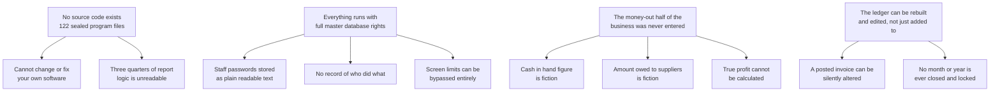
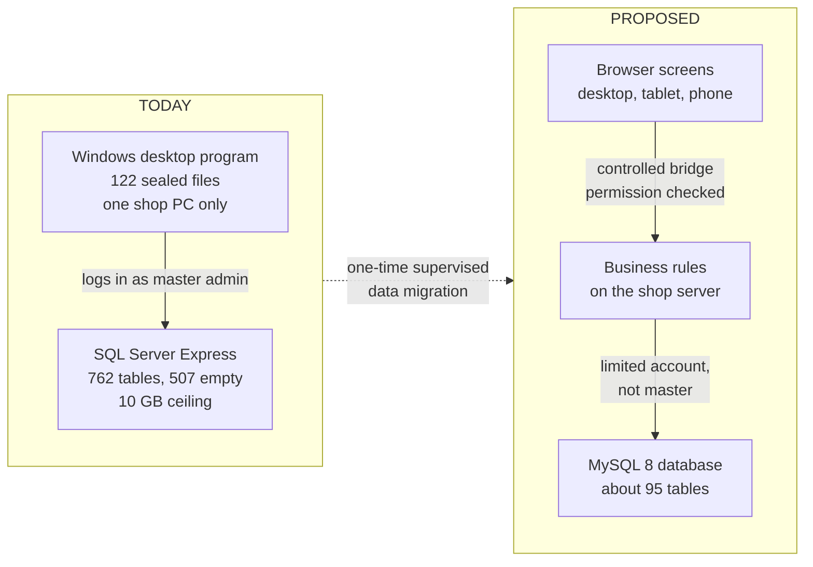
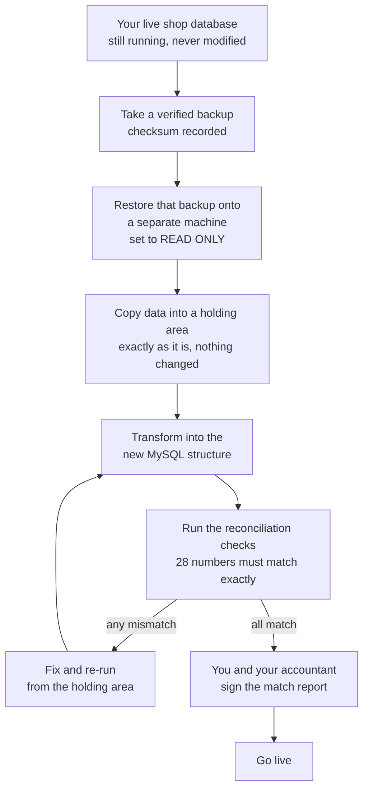
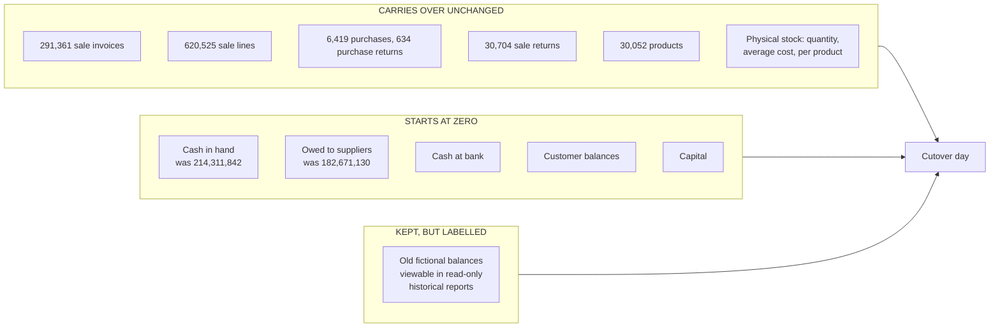
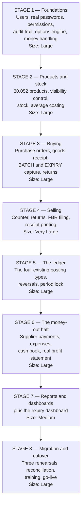

# 15 — The Revamp Plan, in Plain English

**Purpose.** To explain, without technical jargon, what your current pharmacy software is, what we found inside it, and exactly what we propose to build in its place — so that you can approve, question, or change the plan with full understanding. This is one of only two documents in the whole analysis written for you rather than for engineers.

**Audience.** The business owner of Fazal Din PP19, Gujranwala. No software knowledge is assumed. Your accountant, your pharmacist and your senior cashier can also read this document without help. Every technical word is explained the first time it appears.

**Analysis stage.** Final deliverable of a completed analysis. It sits on top of 22 detailed technical documents (`02` through `21`) in this same folder. Nothing in this document is new opinion — every claim traces back to one of those documents, to a specific database table, or to a specific decision you have already made (recorded in `00b-owner-decisions-and-requirements.md`).

**⚠️ The existing system was NOT modified.** At no point did this analysis change, delete, add to, or repair anything in your live system. Every number in this document was obtained by *reading* the database, never by writing to it. Your software today behaves exactly as it did before the analysis started. All proposals here are proposals only, awaiting your approval.

---

## Evidence legend — how to tell fact from proposal

Every important sentence in this document carries one of these tags. Please use them: they are the difference between "this is happening in your shop right now" and "this is what we suggest building".

| Tag | Plain meaning |
|---|---|
| `Verified` | **This is a fact.** We read it directly out of your live database or your program files, and can show you the exact table or file it came from. |
| `Strongly Inferred` | **Almost certainly true.** Several independent pieces of evidence point the same way, but we could not confirm it directly because the program's source code no longer exists. |
| `Unclear` | **We do not know.** Honest gap. Usually needs you, your accountant, or a test on a copy of the system to settle it. |
| `Missing` | **It is simply not there.** A capability the business needs that the software does not have at all. |
| `Deprecated` | Built into the software once, but obsolete or abandoned. |
| `Broken/Incomplete` | Present, but does not work properly or was never finished. |
| `Recommended` | **A proposal for the NEW system.** It does not exist today. Nothing tagged `Recommended` is a feature you currently have. |

> **The single most important rule of this document:** anything describing the new system is `Recommended`. We never describe something we intend to build as though you already own it.

---

## A one-minute summary, if you read nothing else

1. Your current software is a **stock and sales machine, and a good one**. It records every purchase, every sale, every return, and it values your stock correctly. `Verified`
2. It records **money coming in but never money going out**. No supplier payment, no salary, no rent, no electricity bill has ever been entered — not once in 19 months. `Verified`
3. Because of that, two numbers on your screen are **not real**: it says you are holding **PKR 214,311,842 in cash**, and that you owe distributors **PKR 182,671,130**. Neither figure is true. `Verified`
4. Your **gross profit figures are trustworthy**, because sales, purchases, returns and stock values are all properly recorded. `Verified`
5. So on switch-over day, all **money balances start at zero** and are rebuilt from a real cash count and real supplier statements — while your **physical stock carries over untouched**, because the stock numbers are correct and the medicine is really on the shelf. (Your decisions D10 and D11.)
6. The new system keeps everything that works, adds the missing money-out half, adds real **batch and expiry tracking**, and is built to be usable by staff with limited computer experience, on a phone or tablet as well as a desktop.

---

# 1. What do we currently have?

## 1.1 The system in one paragraph

You run **WASEELA ABUZAR V3**: a Windows desktop program installed on the shop computer, talking to a database (an organised store of your business records) called Microsoft SQL Server on the same machine. `Verified` — `02-repository-map.md`, `06-database-analysis.md`. The program was written in a language called **Sybase PowerBuilder 12.5**, in its 32-bit form — a technology that is effectively at the end of its life. `Verified` — `12-risks-gaps.md` R-025.

## 1.2 The facts, with the numbers

| What | Amount | Tag |
|---|---|---|
| Sale invoices recorded | **291,361** | `Verified` |
| Individual sale lines (items sold) | **620,525** | `Verified` |
| Sale returns | **30,704** | `Verified` |
| Purchase invoices from distributors | **6,419** | `Verified` |
| Purchase lines | **113,082** | `Verified` |
| Purchase returns | **634** | `Verified` |
| Products in the catalogue | **30,052** | `Verified` |
| Products that have *ever* actually held stock | **8,042** | `Verified` |
| Products visible to staff that have never been stocked | **20,861** | `Verified` |
| Supplier accounts | **235** (112 with activity) | `Verified` |
| Accounting ledger entries | **1,021,852** | `Verified` |
| Daily stock snapshot rows | **3,215,967** | `Verified` |
| Period of data held | **1 Jan 2025 → 31 Jul 2026** (19 months) | `Verified` |
| Average trading day | **~540 invoices**, average value **PKR 803** | `Verified` |
| Staff accounts in the system | **9** | `Verified` |

*Source: `06a-data-profile-reconciliation-baseline.md` §2, §5; `00b` R1.*

## 1.3 What it does well, today

- **Sells fast.** ~540 invoices a day pass through it without falling over. `Verified`
- **Values stock correctly.** It maintains a moving average cost per product — the standard, correct method — and we tested that formula against 10,173 real purchase lines: it matched 100%. `Verified` — `08-inventory-logic.md` §8.
- **Balances its books arithmetically.** Total debits equal total credits exactly: PKR 455,292,133 on each side, difference zero, across all 1,021,852 entries. `Verified` — `06a` §1.
- **Files your tax electronically.** The FBR point-of-sale fiscalization link is live and working — the government fee of PKR 1 per invoice has accrued exactly 291,361 times. `Verified` — `00b` F1.
- **Has a properly structured chart of accounts.** Five top levels → 13 categories → 29 groups → 267 usable accounts. It is professionally laid out. `Verified`

## 1.4 The uncomfortable fact about the software itself

**The source code does not exist.** `Verified` — `02-repository-map.md`.

In plain terms: *source code* is the human-readable recipe a programmer writes; the computer then bakes it into a sealed program file. You have **122 sealed program files** (`.pbd` files) and **no recipe**. Nobody — not the original developer's successor, not us, not anyone — can open them and read how they work.

What saved this project is that most of the actual business rules were not put in the sealed program. They were put in the database, as **643 stored procedures** — small named instruction sets stored inside the database itself, which *can* be read. `Verified` — `06` §8.6. That is why this analysis was possible at all.

**Why this matters to you commercially:** you cannot change your software today. You cannot add a supplier payment screen, change an invoice layout, or fix a bug, because there is nothing to change. You are entirely dependent on a vendor relationship and on a technology stack that is no longer maintained.

## 1.5 It is not really a pharmacy system

Your database has **762 tables** (a *table* is one list — one for products, one for invoices, and so on). **507 of them, 66.5%, are completely empty.** `Verified` — `06` §3.0.

The reason: this product was built as a multi-business package — hospital, school, hotel, payroll, manufacturing, multi-branch. Your pharmacy uses only the retail slice of it. Two-thirds of the software is dead weight you have been carrying, and it is a large part of why the screens are so crowded.

Per your decision **D1**, those other business modules are **catalogued and set aside — never silently dropped**. If you ever open a second branch or add a clinic, the catalogue (`03-module-catalog.md`) tells us exactly what existed.

---

# 2. What problems were found?

We recorded **102 findings** in total: 28 critical, 38 high, 24 medium, 8 low, 4 informational. `Verified` — `12-risks-gaps.md` §2. They collapse into four root causes.



**What this diagram shows in plain English.** Four underlying situations (top row) cause everything else. Because the recipe for the program was lost, you cannot maintain your own software. Because the program logs in to the database as the all-powerful master user, there is no real security and no record of who did what. Because nobody ever entered payments and expenses, two headline numbers are imaginary and true profit cannot be worked out. And because the accounting ledger is treated as something that can be re-created rather than as a permanent record, entries can be changed after the fact. Every one of the 102 findings hangs off one of these four branches.

## 2.1 The five problems that matter most to you as owner

### Problem 1 — The books record money in, but never money out (finding F1) `Verified`

This is the most consequential thing we found, so it gets a full explanation in section 9 below. In short: in 19 months, **not one supplier payment and not one expense has ever been recorded**. Marketing, administration, salaries, rent, bank — all zero entries.

### Problem 2 — Expiry dates and batch numbers are not really being tracked (finding F2) `Verified`

The software *has* a full batch and expiry system built in. At your shop it is effectively switched off:

| Check | Reality |
|---|---|
| Stock rows carrying a real batch number | about 4% (the rest hold a full stop character `.` as a placeholder) |
| Stock rows carrying a real expiry date | about 1% (the rest hold a fake far-future date) |
| The batch register table | **0 rows** |
| The expiry-warning table | **0 rows** |

`Verified` — `08-inventory-logic.md` §10.

**In practice this means your system cannot answer the question "what is about to expire?"** and cannot stop an expired pack being sold. For a pharmacy that is a safety issue, not a stock-keeping inconvenience. `Strongly Inferred` as to cause: typing a batch number and expiry date on every purchase line is slow when 540 customers a day are waiting, so the fields were left blank and the software accepted it.

### Problem 3 — Security is effectively absent `Verified`

- Staff passwords are stored as **ordinary readable text** in the database. Anyone with database access can read all nine of them. The real passwords in use include `1`, `55` and `z0`.
- The program signs in to the database as the **master administrator account**, whose password is buried in the sealed program file. Every action, by every cashier, therefore has unlimited database power.
- The limits you believe are enforced (discount caps, price-change rights) are checked **only by the screen**. Anyone who reaches the database another way is not stopped.
- There is **no audit trail**: no permanent record of who changed a price, who voided an invoice, who deleted a line.

*Findings R-003, R-004, R-007, R-008, R-032 in `12-risks-gaps.md`.*

### Problem 4 — Everyday work takes far more steps than it should `Verified`

- A **password box appears on every single cash sale** — that is 291,361 password entries in 19 months, with passwords like `1`.
- Finding a product means using one of **17 different search pop-up windows**, and the key you must press to accept your choice (`F12`) is advertised **in the window's title bar**, where nobody looks.
- The sales grid has around **70 columns**; the invoice header has around **90 fields**. `Verified` — `04-screen-form-inventory.md` §6.1.
- Errors appear as blunt pop-up boxes with no explanation of how to fix them.

### Problem 5 — Your entire business sits on one machine with no proven escape route `Verified`

Data, program and backups live on the same computer. The free edition of SQL Server in use has a hard **10 GB size ceiling** and your database is approaching it. There is no tested off-site backup restore. This one is urgent regardless of whether you approve the rebuild — see section 15.

## 2.2 The full problem list, ranked by what it costs you

| # | Problem | Business consequence | Tag |
|---|---|---|---|
| 1 | Money-out never recorded | No true profit, no true cash, no true payables | `Verified` |
| 2 | No expiry/batch tracking | Expired stock can be sold; no recall capability; dead stock discovered too late | `Verified` |
| 3 | Plain-text passwords, master-level access | Anyone with the machine has total control of your data | `Verified` |
| 4 | No audit trail | A theft or a mistake cannot be traced to a person | `Missing` |
| 5 | Posted invoices can be silently edited | Historical figures can change without a trace | `Verified` |
| 6 | No period close or lock | Last year's numbers can move | `Missing` |
| 7 | 20,861 never-stocked products in the search list | Slow lookups, wrong picks under queue pressure | `Verified` |
| 8 | Source code lost | You cannot change or fix your own software | `Verified` |
| 9 | Single machine, size ceiling, untested backups | A hardware failure could end the business | `Verified` |
| 10 | Two-thirds of the database unused | Complexity and clutter with no benefit | `Verified` |

---

# 3. What should be kept?

**A rebuild is not a rejection.** The trading engine underneath this software is sound, and we intend to carry it across faithfully. Keeping something means *rebuilding it to behave identically*, on modern technology — not copying old code (there is none to copy).

| Keep this | Why | Tag |
|---|---|---|
| **Moving-average stock costing** | The formula is correct and was proven against 10,173 real purchase lines with a 100% match. Changing it would change your historical gross profit. | `Verified` |
| **The four accounting document types** — sale, sale return, purchase, purchase return | These are the only four that have ever posted to your ledger, and they balance exactly. They *are* your accounting. | `Verified` |
| **The chart of accounts structure** | Professionally built, five levels, 267 usable accounts. We keep the structure and re-point it, rather than reinvent it. | `Verified` |
| **FBR fiscalization** | It is live, working and legally required. It gets rebuilt to be more robust, not replaced. | `Verified` |
| **Your 19 months of history** — every invoice, line, return, purchase, stock movement | So last year's sales and gross profit reports still reproduce identically. Your decision D3. | `Verified` |
| **All 30,052 products** | Nothing is ever deleted. Your decision D7. | `Verified` |
| **Physical stock quantities and average costs** | The medicine is real and the numbers are right. Your decision D11. | `Verified` |
| **The keyboard-driven counter** | Experienced cashiers are fast because they never touch the mouse. The new counter must be at least as fast. | `Strongly Inferred` |
| **Barcode scanning at the counter** | Hardware already present and in use. | `Verified` |
| **Printed thermal receipts and A4/A5 documents** | The formats your customers and suppliers already recognise. | `Verified` |
| **The idea of hiding a product rather than deleting it** | The database already has an on/off flag per product. Good concept, badly used. We keep the concept and give you real control of it. | `Verified` |

---

# 4. What should be simplified?

Simplification here means **fewer steps and fewer things on screen, with no loss of capability**. Every item below is `Recommended` — a proposal.

| # | Today | Proposed | Effect |
|---|---|---|---|
| S1 | Password box on every cash sale (291,361 times) | Sign in once at shift start; the sale itself needs no password | Removes one interruption from every single sale |
| S2 | **17** different product-search pop-ups | **One** search box that behaves identically everywhere (name, barcode, code, generic, company) | One thing to learn instead of seventeen |
| S3 | ~70-column sale grid | About 8 columns visible; the rest available on demand | The cashier sees only what a cashier needs |
| S4 | ~90-field invoice header | Roughly 6 fields on the fast path | Faster entry, fewer mistakes |
| S5 | 762 database tables, 507 empty | About 95 tables, with a published list of exactly what was excluded and why | Nothing hidden; nothing pointless carried over |
| S6 | Instructions shown in the window title bar | Instructions next to the field they apply to, plus a `?` key that lists every shortcut | Nobody has to be told twice |
| S7 | 28,893 products visible in counter search | You choose — e.g. show only the ~8,042 actually traded, reversible in one click, with a permanent "Show all items" escape | Faster lookup without ever losing a product |
| S8 | Blunt error pop-ups | Errors appear next to the field, in plain language, saying what to do next | Fewer support calls, fewer abandoned invoices |
| S9 | Full sale sequence: **10 operator steps** | **4 steps** — scan, scan, tender key, confirm | Measured basis: two lines, quantity 1, cash. `16-modern-ux-blueprint.md` Part P |

**Non-negotiable rule attached to all of the above:** simplification must never *remove* an ability. Anything moved off the main screen stays reachable — one keystroke or one click away, and always findable through a search-anything command box.

---

# 5. What should be redesigned?

Redesign means the concept itself changes, not just its appearance. All `Recommended`.

### 5.1 The money side — the biggest change

Today your software is, honestly described, a **trading ledger**: goods in, goods out, stock value. Your decision **D8 (Option B)** adds the missing half:

1. **Supplier payments.** Record what you actually paid a distributor, by what method, against which invoices. This has never existed. `Missing` today.
2. **Expenses.** Rent, salaries, utilities, freight, repairs, bank charges — with a receipt photo if you want one.
3. **A cash and bank book.** A running "money in / money out / balance" you can trust. Cash sales flow into it automatically from the sales already recorded — never typed twice.
4. **Daily cash reconciliation.** At close, the system says what should be in the drawer, the cashier enters what is actually there, and the difference is recorded and explained.
5. **A plain-language profit statement** — no debits, no credits, just:

```
Money from sales             1,234,567
Less: cost of goods sold      -900,000
= Gross profit                  334,567
Less: expenses                 -120,000
= What you actually made        214,567
```

### 5.2 Batch and expiry tracking — approved as a top-priority feature (your decision D12)

- Capture batch and expiry **at goods receipt**, made effortless: scanning a modern pack's barcode fills both automatically, so it costs the person receiving stock no extra time.
- A dashboard tile: **"Expiring in 30 / 60 / 90 days"**, with quantity and **rupee value at risk** in each bucket.
- **First-Expiry-First-Out** selling by default: the till automatically picks the oldest-dated pack. Overriding it is allowed but recorded.
- Selling expired stock triggers a response **you configure**: warn, block (needs supervisor), or allow-and-log.
- Given a batch number, the system can list every purchase and every sale of that batch — which is what a manufacturer recall requires.

### 5.3 Security and accountability

- Passwords stored **scrambled beyond recovery** (the standard method — even we could not read them). Your nine existing plain-text passwords are **never carried across**; every user sets a new one at first login.
- Every rule enforced **behind the screen, on the server**, so bypassing the screen achieves nothing.
- A permanent, append-only **audit trail**: who, when, what changed, from what to what. Starting from the very first transaction, not later.

### 5.4 The ledger becomes permanent

Today a correction can be made by deleting ledger entries. `Verified` — R-012. In the new system nothing is ever deleted: a mistake is corrected by a **visible reversing entry** that references the original, exactly as an accountant expects. Months can be **closed and locked** so last year's figures cannot move.

### 5.5 Everything configurable, nothing assumed (your principle D9/P1)

Where the analysis could not determine how *your* shop does something, we do not guess and hard-code an answer. We ship **every realistic option**, the user picks per transaction, and you switch off the ones you never use — from an admin screen, without a programmer. Examples: eight supplier-payment methods, seven stock-adjustment reasons, five print formats.

---

# 6. What new technology will be used?

Here is the whole stack in plain words. Four pieces.

| Piece | What it actually is | Why it is here |
|---|---|---|
| **MySQL 8** | The **database** — the filing cabinet that holds every invoice, product and ledger entry, and guarantees nothing is lost or half-written. | Replaces Microsoft SQL Server Express. |
| **Node.js + TypeScript** | The **back end** — the part nobody sees, running on the shop's server, that holds all the business rules: how a sale posts, how average cost is calculated, what a cashier is allowed to do. | Replaces the business logic currently locked inside 643 stored procedures and 122 sealed files. |
| **React + TypeScript** | The **front end** — the actual screens your staff touch, running in an ordinary web browser on a desktop, tablet or phone. | Replaces the Windows-only desktop program. |
| **A REST API** | The **controlled bridge** between the two: the screens ask the back end for things through a small set of clearly defined, permission-checked requests. Nothing else can get to your data. | Replaces the current arrangement where the program connects straight to the database as master administrator. |

*The word "TypeScript" simply means a stricter version of the standard web programming language, which catches whole categories of mistake before the software ever runs — for example, mixing up a quantity with a price.*



**What this diagram shows in plain English.** On the left is today: one Windows program on one PC, connecting straight into the database with unlimited master rights. On the right is the proposal: staff use ordinary browser screens on whatever device they have; those screens cannot touch the database directly — every request passes through a business-rules layer that checks who you are and what you are allowed to do; and that layer connects to the database with a restricted account, not the master one. The dotted arrow is the one-off, supervised move of your 19 months of data from the old world into the new.

**One thing that does not change:** this runs on your shop's own computer, on your premises, exactly as today. It works with the internet down; only FBR filing needs a connection, and that queues safely until the connection returns. Moving it to a rented server on the internet later is possible but is your choice, not a requirement.

---

# 7. Why is Node.js suitable?

Node.js is the engine that runs the business rules. Four concrete reasons, each tied to *your* system rather than to fashion:

1. **It handles many small, waiting-around jobs extremely well.** Your workload is exactly that shape: ~540 invoices a day, each a short burst of work, with pauses spent waiting for the database, the receipt printer, or the FBR server to answer. Node.js is built to keep serving other customers during those waits rather than standing idle. `Recommended` — reasoning in `17-technical-blueprint.md` Part 4.
2. **The same language runs on the screens and on the server.** Your screens are React, which is the same language family. One skill set maintains the whole system, which matters enormously for a single-shop business that must be able to hire a maintainer years from now — instead of hunting for a PowerBuilder 12.5 specialist, which is the position you are in today.
3. **Its safety net catches money bugs before they ship.** With TypeScript, the system refuses to run if a piece of code ever tries to treat a rupee amount as a plain decimal number, or a quantity as a price. Given that your ledger must reproduce PKR 455,292,133 exactly, this matters.
4. **It is mainstream and will still be here.** It is used by very large retailers and banks, has scheduled long-term support versions, and has a huge pool of people who know it. That is the direct opposite of the position you are in with a discontinued 32-bit desktop toolkit.

**Honest limitation:** Node.js is not the right choice for heavy number-crunching like scientific modelling. Nothing in a retail pharmacy is that. Your heaviest single job — a full-year report over 1,021,852 ledger rows — is done by the database, not by Node.js.

---

# 8. Why is React suitable?

React builds the actual screens.

1. **It runs everywhere your staff are.** The same screens open in a browser on the counter PC, on a tablet in the store room, and on your phone at home. Today you must be sitting at the shop PC. `Recommended`
2. **It updates parts of a screen instantly.** When a cashier scans an item, only the new line appears — the screen does not blink or redraw. That is what makes a 4-step sale feel fast rather than merely be fast.
3. **Accessibility is a solved problem in it.** There are mature, tested building blocks for React that already work correctly with screen readers and keyboard-only use. Since accessibility is your stated number-one product requirement, starting from components that are already correct is far safer than making 200 screens accessible one at a time.
4. **The screen can be built once and shown three ways.** The counter view, the back-office view and your phone view share the same underlying pieces, so a fix in one place fixes all three.
5. **It handles very large lists smoothly.** Your product list is 30,052 rows and your ledger is over a million. React can display these using a technique that only draws the rows currently on screen, so scrolling stays smooth.

**Honest limitation:** a browser page needs a moment to load the first time it is opened each day. After that it is cached locally and opens instantly. The counter screen is deliberately kept small so this first load is quick even on a modest PC.

---

# 9. Why is MySQL suitable?

MySQL 8 is the filing cabinet.

1. **Your data is comfortably within its abilities.** 1,021,852 ledger rows and 3,215,967 stock snapshot rows sound large, and they are meaningful, but for MySQL 8 on ordinary modern hardware this is a small-to-medium database. No exotic architecture is needed — and we explicitly rejected any. `Recommended` — sizing in `06a` §2.
2. **No licence cost and no size ceiling.** You are currently on a free edition of SQL Server that stops at 10 GB, and you are approaching it. MySQL 8's community edition has no such limit and no per-machine licence fee. That alone removes a live business risk.
3. **It guarantees all-or-nothing saves.** When a sale is saved, the invoice, the stock reduction and the four ledger entries either *all* succeed or *none* do. Your current system's save path could not be inspected (the code is sealed) and this guarantee could not be confirmed. `Unclear` today; guaranteed by design in the new system.
4. **It stores money exactly.** Rupee amounts are stored as exact decimal values, never as approximate ones — so 455,292,133.00 stays 455,292,133.00 after a million calculations.
5. **It is the most widely known database in the world.** Any competent developer you hire in Gujranwala, Lahore or anywhere else will know it. Continuity again.

**Honest limitations, stated up front:** MySQL will silently accept some bad data in its default configuration (for example a date of `0000-00-00`, or quietly cutting long text short). Four such traps are named in the technical plan, and the system is configured in **strict mode** from the first day so that all four become loud errors instead of silent corruption. `Recommended` — `17-technical-blueprint.md` §5.6.

---

# 10. How will existing data be protected?

Your data is the business. The migration is designed so that **it is impossible to damage the live system**, because the live system is never touched.



**What this diagram shows in plain English.** We never migrate from your running shop database. We take a verified backup, restore it onto a different machine, and immediately mark it read-only so nothing can alter it. The data is copied into a holding area unchanged, then reshaped into the new structure, then checked. If any single number fails to match, we fix the recipe and re-run — as many times as it takes, at no risk, because the source is a frozen copy. Only when every number matches and you have signed the report does anything go live. This whole loop is rehearsed **three times** before the real one.

### The specific protections

| # | Protection | What it means for you |
|---|---|---|
| P1 | **Extraction from a restored backup, never from the live database.** | Your counter never slows down during migration. `Recommended` |
| P2 | **The live database is set to read-only and kept forever.** | The old system remains openable for reference for as long as you want. |
| P3 | **Every single source row is accounted for.** Each row is recorded as migrated, excluded, merged, rejected or deferred — with a reason. | In three years, "where did X go?" has an answer in writing. |
| P4 | **Three full rehearsals before the real run.** | Nothing about cutover day is attempted for the first time on cutover day. |
| P5 | **The database identity is proved before anything is read.** | We found a backup check report referring to a database named `...V3` while the live one is `...V2`. `Verified` discrepancy, cause `Unclear`. This must be settled first — migrating the wrong file would be a silent, unrecoverable error. |
| P6 | **Passwords are never migrated.** | The nine plain-text passwords stop existing at cutover. Everyone sets a fresh one. |
| P7 | **Fake batch and expiry values are not migrated as if real.** | The placeholder `.` and the fake far-future date become "unknown" rather than becoming permanent false truth for 30,052 products. |
| P8 | **Off-site backups, with restores actually tested.** | Applies to the new system from day one — and should be fixed on the old system now, regardless of this project (see section 15). |

---

# 11. How will accounting accuracy be preserved?

This is the section to read with your accountant.

## 11.1 The finding, stated honestly and without alarm

Your ledger is **arithmetically perfect and economically incomplete**. `Verified`.

Perfect, because every transaction it records is balanced: debits equal credits to the rupee across all 1,021,852 entries. Incomplete, because in 19 months the software was only ever used for half of the business.

| Account | What the books say | Is it real? |
|---|---|---|
| Sales | 229,385,121 credited over 291,361 invoices | **Real.** `Verified` |
| Purchases | 193,566,768 debited over 6,419 invoices | **Real.** `Verified` |
| Sale returns | 19,301,800 | **Real.** `Verified` |
| Purchase returns | 3,480,475 | **Real.** `Verified` |
| Stock value | maintained per item, per day | **Real.** `Verified` |
| **Cash in hand** | 234,003,081 in, only 19,691,239 out ⇒ **214,311,842 sitting in the till** | **Not real.** No cash has ever been recorded leaving. `Verified` |
| **Owed to suppliers** | 186,197,682 credited, only 3,526,552 debited — and every one of those debits is a purchase return, not a payment ⇒ **182,671,130 owed** | **Not real.** No supplier payment has ever been recorded. `Verified` |
| Marketing, administration, salaries, bank, cost of sales | **zero entries in 19 months** | **Never used.** `Verified` |

**Why this is reassuring rather than alarming:**

- It is **not data corruption**. Nothing is broken and nothing was lost.
- It is **not a migration risk**. We know exactly which numbers are real.
- The number that matters most day to day — **gross profit** — is trustworthy, because it is built entirely from sales, purchases, returns and stock valuation, all of which are properly recorded. `Verified`
- It is a **scope** problem: the software was simply never used for the money-out half. And it is probably the clearest single explanation of why you wanted a rebuild.

## 11.2 What "start from zero" means on cutover day (your decision D10)

**Money balances start at zero. History does not.** Those are two different things, and the distinction is the whole point.



**What this diagram shows in plain English.** Three groups of things meet on cutover day. On the left, everything factual carries across untouched — every invoice, every line, every return, every product, and the actual stock on your shelves. In the middle, every *money balance* is set to zero, because the old figures were never true. On the right, the old fictional balances are still kept and still viewable in historical reports — they are labelled as legacy figures so the old numbers can still be explained if anyone ever asks — but they are **never imported as opening balances**.

**On cutover day, practically:**

1. Cash in the drawer is **physically counted**, written down and signed. That counted figure — or zero, your choice — becomes the opening cash.
2. Supplier statements are requested from your distributors and reconciled. Each supplier's real balance is entered — or deliberately left at zero, with that choice recorded and signed.
3. Because the ledger's first supplier payment and first expense are being recorded from that day forward, **from month one you will have a real profit figure**, which you have never had.
4. Every "zero / manual / imported" choice is written into the migration log with your name and the time. Nothing is decided silently.

## 11.3 Why stock is the deliberate exception (your decision D11)

**Stock carries over unchanged: quantities, average costs, per product, per location.** `Verified` as trustworthy.

The reasoning is simple and worth stating plainly:

- **Cash and supplier balances are bookkeeping numbers that were never maintained.** Zeroing them removes fiction.
- **Stock is real physical medicine sitting on your shelves right now.** It is countable, it has real value, and — unlike cash and payables — it *has* been correctly maintained by every purchase and every sale for 19 months. The costing method was tested against 10,173 real purchase lines and matched 100%.
- Zeroing stock would mean opening on day one with **nothing sellable** until roughly 8,000 active product lines were physically counted, and would make stock valuation and gross profit wrong until that count finished — for no benefit at all, since the data is already right.

So: no shop closure, no freeze window, no overnight stock-take required. Verification counts can happen afterwards at your own pace.

## 11.4 The specific accounting safeguards

| # | Safeguard | Tag |
|---|---|---|
| A1 | Total debits must equal total credits in the migrated data — the same PKR 455,292,133 on both sides, difference exactly zero. This is the single most important check. | `Recommended` gate on `Verified` baseline |
| A2 | The four existing posting types (sale, sale return, purchase, purchase return) behave **identically** to today, so any historical gross-profit report reproduces exactly. Everything new uses new document types and cannot disturb them. | `Recommended` |
| A3 | Cash sales appear in the new cash book **exactly once** — read from the existing sales postings, never re-entered. Proven by a reconciliation. | `Recommended` |
| A4 | Nothing in the ledger is ever deleted. Corrections are visible reversing entries. | `Recommended` |
| A5 | Periods can be closed and locked; overriding a lock is possible but audited. | `Recommended` |
| A6 | Rupee amounts are exact decimals from screen to database — never approximate. Rounding is defined in one place, in writing. | `Recommended` |
| A7 | **A qualified accountant must review and sign off every new debit/credit rule before it is built.** We do not guess accounting logic. | `Recommended` — mandatory gate |

---

# 12. What you will personally be able to do that you cannot do today

This is the return on the whole project, stated as plainly as possible. Everything in this table is `Recommended` — it is what we propose to build, and none of it exists today.

| You will be able to… | Today | Why it becomes possible |
|---|---|---|
| **See your true profit** — "did I actually make money last month?" | Impossible. Zero expense entries in 19 months, so only gross profit exists. | Expenses and supplier payments get recorded, feeding a plain-language profit statement (no debits or credits shown). |
| **See who you really owe, and how much** | Impossible. The books say PKR 182,671,130 across 235 suppliers, which is fiction. | Supplier balances start at zero from reconciled statements, and every payment you make from then on is recorded. |
| **See what is about to expire, and what it is worth** | Impossible. 99% of stock rows carry a fake expiry date; the expiry table is empty. | Batch and expiry captured by scanning at goods receipt; a 30/60/90-day dashboard with rupee value at risk. |
| **Stop expired stock being sold** | Impossible. | Configurable warn / block / allow at the till, plus oldest-expiry-first selling by default. |
| **Trace a batch for a recall** | Impossible. | Every purchase and sale records its batch; one search lists all of them. |
| **Control what products staff see** | Only by editing the database directly. All 28,893 active items appear in search today, though only 8,042 have ever been stocked. | An admin screen with per-item toggles, bulk changes, saved rules like "hide items never stocked" with a live preview count, a one-click undo, and a permanent "Show all items" escape on every screen. Nothing is ever deleted. |
| **Know who did what** | Impossible. No audit trail; all nine users share master-level database power. | Permanent record of who changed a price, voided an invoice or gave a discount — visible as exception reports from day one. |
| **Check the shop from your phone** | Impossible. Windows desktop only. | Today's sales, cash position, expiring stock and low stock on a phone-sized dashboard. |
| **Know what is actually in the till** | Impossible. Books claim PKR 214,311,842. | Daily count-versus-expected reconciliation, with the difference explained and signed. |
| **Change a business rule yourself** | Impossible. Requires the vendor. | Payment methods, expense categories, adjustment reasons, print formats and alert thresholds are all data you edit from an admin screen. |

---

# 13. How will the new software become easier to use?

Ease of use here is measured, not asserted. All `Recommended`.

## 13.1 Measurable step reductions

| Task | Steps today | Steps proposed | Basis |
|---|---:|---:|---|
| Cash sale, 2 items | 10 | **4** | scan, scan, tender key, confirm |
| Find a product | 1 of 17 different pop-ups, commit key advertised in the title bar | 1 search box, same everywhere | — |
| Enter a purchase from a distributor | Long single form, ~90 header fields | 4 clear steps with running totals | goods receipt wizard |
| Stock adjustment | Free-form | 4 steps with a required reason from your own list | audited |

## 13.2 The principles behind it

1. **One way to do one thing.** Not seventeen search windows; one.
2. **Never lose typed work.** Drafts save automatically; a power cut does not cost an invoice.
3. **Say what went wrong and what to do.** Errors appear beside the field, in plain language.
4. **Confirm only what is irreversible.** No more habitual clicking through boxes nobody reads.
5. **The fast path stays fast.** A guided step-by-step mode exists for new staff and can be switched on per user — experienced cashiers never see it.
6. **Speed is an acceptance test, not a hope.** The new counter must be measured at or below the current invoice-entry time before go-live. If it is slower, it does not ship.

---

# 14. How will mobile and tablet users benefit?

**The honest position first.** The high-speed sales counter is, and should remain, a keyboard-and-scanner job on a proper screen. We are not proposing that anyone rings up 540 invoices a day on a phone. `Recommended` — `16-modern-ux-blueprint.md` Part I.

What genuinely benefits from mobile and tablet:

| Who | Where | What they gain |
|---|---|---|
| **You, the owner** | Anywhere | Today's sales, cash position, gross profit, expiring stock and low stock on your phone. You are not tied to the shop PC. |
| **Warehouse / store staff** | Standing at the shelves | Stock-take and stock adjustment on a tablet, scanning as they count, instead of writing on paper and typing it in later. This is the one genuinely mobile operational task. |
| **Purchasing** | At the counter, with the distributor's representative present | Check current stock and recent sales of an item before agreeing an order. |
| **Cashiers** | At the counter | Bigger touch targets and larger text benefit everyone, including on a normal screen. |

**How it works technically, in one sentence:** the screens are built once and rearrange themselves for the size of the device — the same product list becomes a wide table on a desktop and a stack of readable cards on a phone — so there is no separate app to install, update or pay for.

---

# 15. How will accessibility be improved?

You have stated accessibility as the **number one product feature**. The starting point is stark: the legacy system offers **zero** accessibility features to carry over. `Verified` — R-028. Everything here is therefore new. All `Recommended`.

**Accessibility, in plain terms, means the software works for people who cannot use it in the "standard" way** — someone with weak eyesight, someone who cannot use a mouse, someone with a hand tremor, someone using a screen reader (software that reads the screen aloud), and equally the 55-year-old cashier reading a small screen in poor light at the end of a long shift. The formal standard is **WCAG 2.2 AA** — an internationally recognised checklist. It is a pass/fail gate for go-live, not an aspiration.

| Commitment | What it means in your shop |
|---|---|
| **Every task completable with the keyboard alone** | A full sale, start to receipt, without touching the mouse. This also happens to be what makes the counter fast. |
| **Text readable at 200% zoom without breaking the layout** | Staff who need larger text just make it larger. |
| **High colour contrast, measured not guessed** | Readable under fluorescent light and on a cheap monitor. |
| **Never colour alone** | A near-expiry line is marked with a word and an icon, not only an amber tint — so it still reads correctly for the roughly 1 in 12 men with colour blindness. |
| **Screen-reader tested by a real user, not just software** | A real walkthrough of the dispensing and sales flows before go-live. |
| **Touch targets big enough** | For tablet and phone use, and for anyone with unsteady hands. |
| **Errors announced, not just shown** | The person hears what went wrong, not just sees a red box. |
| **Plain language everywhere** | Screens say "What you actually made", not "Net Profit (P&L)". Settings say "Which products appear when staff search?", not the name of a database flag. |
| **Speed protected** | Accessibility must not cost counter throughput. Both are measured together before go-live. |

---

# 16. How will staff be trained?

Nine staff accounts exist today. `Verified`. Training is scoped to roles, not to the whole system. All `Recommended`.

| Role | What they must learn | Depth | Format |
|---|---|---|---|
| **Cashier** | Sell, return, tender, print, close the day, count the drawer | Small — the sale is 4 steps | One-page printed keyboard card + supervised live shifts |
| **Store / warehouse** | Receive goods, capture batch and expiry by scanning, adjust stock with a reason, stock-take on tablet | Small–Medium | Hands-on at the shelves with the tablet |
| **Purchasing** | Purchase orders, goods receipt, purchase returns, supplier records | Medium | Practice on the sandbox copy |
| **You / admin** | Product visibility, options and permissions, expense and payment entry, reports, audit and exception reports | Medium | Walkthrough session, then run a real month yourself in the sandbox |
| **Accountant** | New posting rules, period close, reversals, profit statement, reconciliation | Medium | Review-and-sign-off sessions during the build, not after |

**The five training mechanisms:**

1. **A sandbox copy** loaded with your real 19 months of data, where mistakes cost nothing. Staff practise before cutover, not after.
2. **A printed one-page card per role** — the eight keystrokes each person actually uses. Laminated, taped by the till.
3. **Guided mode**, switchable per user: the same sale broken into three labelled steps for whoever is still learning. Turned off when no longer needed.
4. **Help inside the screen, not in a manual.** Every setting carries a one-line plain-English explanation next to it. Pressing `?` lists every shortcut on the current screen.
5. **One trained champion.** One cashier and one back-office person go deeper and become the first person others ask. Cheaper and faster than a phone call to support.

---

# 17. How will old and new be compared?

You must never have to take our word for it. Comparison happens at four levels, all `Recommended`.

### Level 1 — The numbers must match exactly

The old and new systems are asked the same questions and must give byte-identical answers. This is the **reconciliation gate**: 16 baseline checks plus 12 additions, automated into one report.

| # | Question asked of both systems | Value that must match |
|---|---|---|
| R1 | Do total debits equal total credits? | 455,292,133.00 each side, difference 0.00 |
| R2 | How many ledger entries? | 1,021,852 |
| R4 | How many sale invoices? | 291,361 |
| R5 | How many sale lines? | 620,525 |
| R6 | Total sales value? | 234,003,081 |
| R7 | Sale returns, count and value? | 30,704 / 19,691,239 |
| R8 | Purchases, count and value? | 6,419 / 198,071,261 |
| R9 | Purchase returns, count and value? | 634 / 3,526,552 |
| R11 | Products in the catalogue? | 30,052 |
| R12 | Products that ever held stock? | 8,042 |
| R13 | Closing stock quantity **and value**, per product | captured fresh at cutover |
| R14 | Suppliers? | 235 |

> **A note on precision, so you are not surprised.** Two snapshots taken days apart already differ by a couple of rows — for example the product count read as 30,050 in one snapshot and 30,052 in another. This is normal: the shop keeps trading. That is exactly why the baseline is **re-captured immediately before the real migration** and compared against numbers from the same instant, never against a figure printed in a document weeks earlier.

### Level 2 — Replaying history

All 291,361 invoices and 1,021,852 ledger entries are re-run through the new system's rules, and the outputs compared line by line against the legacy results. Stock costing is replayed against the 10,173 purchase lines where the average-cost rule applies. If a single rupee differs, we find out why before go-live, not after.

### Level 3 — Report-by-report, side by side

For the same period, the old system's sales, gross-profit and stock-valuation reports are printed alongside the new system's, and compared by you and your accountant.

> **Do this now, while the old system still runs.** About three quarters of the old report logic is locked inside sealed program files and cannot be read. `Verified` — R-024. The practical answer is to **capture the outputs** of every report you care about from the live system while it is available. This is time-sensitive.

### Level 4 — Real people doing real work

You, your accountant and your cashiers run genuine daily work in the sandbox before go-live: a full day of sales, a real goods receipt, a real return, a month-end. Signed acceptance by each role. Plus the measured throughput test — the new counter must be **at least as fast** as the old one.

**Why we do not run both systems live at the same time.** It sounds safer but is not possible here: the old system reduces stock from inside the sealed program at the moment of saving, and the ledger is assembled on demand rather than written as it goes. `Verified` — `08` §4.3, `07` §3.1. There is no clean, observable moment to copy across, so running both would silently drift apart. Rehearsed migration with full reconciliation is the safe route. `Recommended` — `19b` §2.

---

# 18. How will we prevent data loss?

Two separate concerns: protecting you **today**, and protecting you **during and after** the change.

## 18.1 Urgent today — independent of this project

This is the recommendation to act on soonest, whatever you decide about the rebuild.

| Risk today | Why it is serious | What to do |
|---|---|---|
| Data, program and backups all on **one machine** | A disk failure, a fire, or ransomware takes all three at once, and the business with them | Automated **off-site** backup, starting now |
| Backups **never test-restored** | An untested backup is a hope, not a backup | Restore one to a spare machine and confirm it opens |
| Database approaching the **10 GB free-edition ceiling** | When it is reached, the software stops accepting new records. Mid-trading. | Monitor the size; know the ceiling date; this is another reason to move |
| Nine **plain-text passwords**, including `1` and `55` | Anyone with the machine has everything | Cannot be fully fixed on the old system — but restrict physical and network access now |

## 18.2 During the change

| # | Safeguard |
|---|---|
| 1 | The live database is **never read from directly** for migration — only a restored backup copy is. `Recommended` |
| 2 | Three full **rehearsal runs** before the real one. Cutover day contains no first attempts. |
| 3 | The migration can be **re-run from scratch at any point** — every step is repeatable and cannot double-load data. |
| 4 | **Every source row has a recorded disposition**: migrated, excluded, merged, rejected or deferred, each with a reason. Nothing vanishes quietly. |
| 5 | The new database is set to **strict mode from day one**, so bad data is rejected loudly instead of accepted silently. |
| 6 | The old system's database is retained **read-only, permanently**, so the old numbers can always be looked up. |
| 7 | The go-live decision is **yours**, made against a signed match report. |
| 8 | If anything fails the gate, we **do not go live** — we stay on the old system and fix it. The rollback plan is simply "keep trading on the existing system", which is always available because it was never modified. |

## 18.3 After go-live

Automatic daily backups, held off-site, with a **restore actually tested on a schedule** — plus a written note of how long a restore takes, so you know the real answer to "how long would we be down?" before you ever need it. `Recommended`

---

# 19. What should be built first?

**Why there are no dates or costs here.** We have not been given team size, staffing or availability, and inventing a delivery date from nothing would be worse than useless — you would plan against a fiction. Instead each block carries an honest **complexity size**: Small, Medium, Large, Very Large. Once you tell us how many people are working on it and at what pace, these sizes convert directly into a schedule.

## 19.1 Build order



**What this diagram shows in plain English.** The work runs in eight stages, and the order is not negotiable — each stage needs the one before it. Security, the audit trail and exact money handling come first, because retro-fitting them later is far more expensive and leaves gaps exactly where the risk is highest. Products and stock come next because nothing can be bought or sold without them. Buying comes before selling because that is where batch and expiry information enters the system. Selling is the largest single stage because it carries your 540-invoices-a-day counter and the FBR tax link. Only then does the ledger get built, then the brand-new money-out half, then reports, and finally the migration and cutover.

## 19.2 Stage detail

| Stage | Includes | Size | Why here |
|---|---|---|---|
| **1. Foundations** | Real password protection, roles and permissions enforced behind the screen, permanent audit trail, the options engine (P1), exact decimal money handling, document numbering that cannot produce duplicates | Large | Everything else sits on it; adding it later means reworking everything |
| **2. Products and stock** | All 30,052 products, the visibility admin screen (R1), stock balances, moving-average costing ported exactly | Large | Nothing can be bought or sold without it |
| **3. Buying** | Purchase orders, goods receipt, **batch and expiry capture by scan**, purchase returns, supplier records | Large | Batch and expiry data enters here; if it is not captured at intake it never exists |
| **4. Selling** | The counter (4-step sale), sale returns, FBR filing with a safe queue so an outage never stops trading, receipt printing | Very Large | Highest volume, highest risk, most demanding on speed and accessibility |
| **5. The ledger** | The four existing posting types reproduced exactly, reversing entries, period close and lock | Large | Must reproduce history identically before anything new is added on top |
| **6. Money-out (your D8)** | Supplier payments, expenses, cash and bank book, daily cash reconciliation, plain-language profit statement | Large | The headline business benefit — but it must sit on a proven ledger |
| **7. Reports and dashboards** | Sales, gross profit, stock valuation, **expiry 30/60/90**, exception reports, owner phone dashboard | Medium | Built once the data underneath is trustworthy |
| **8. Migration and cutover** | Three rehearsals, the reconciliation report, training, signed go-live | Large | Last by definition |

## 19.3 The five things that must be settled before serious building starts

1. **Confirm which database is the real one** — the `...V2` versus `...V3` naming discrepancy. `Unclear`. Nothing may be extracted until this is closed.
2. **Watch one real sale and one real purchase being saved**, using a recording tool on a restored copy, to learn exactly what the sealed program does at the moment of saving. This is the single largest remaining unknown. Requires your consent; touches nothing live.
3. **Accountant sign-off** on every new debit/credit rule.
4. **Your decision on how strict batch and expiry capture should be**, per product category. This must be decided *before* data is loaded, not after.
5. **Capture the outputs of every report you care about** from the live system while it is still running — three quarters of the report logic is unreadable.

---

# 20. What should be built later?

Deferred does **not** mean discarded. Per your decision D1, everything here is catalogued in writing so it can be picked up whenever the business needs it.

| Deferred | Why later | Size if wanted |
|---|---|---|
| **Customer credit and accounts receivable** | You confirmed walk-in cash trade (D5). The design leaves room; the screens are switched off. | Medium |
| **Multi-branch operation and branch-to-branch sync** | One shop, one storage location today. | Very Large |
| **Hospital, clinic and patient modules** | Present in the original product, unused here. | Very Large |
| **School, hotel, manufacturing modules** | Not your business. Catalogued only. | Very Large |
| **Payroll and HR** | Salaries can be recorded as an expense from Stage 6 without a payroll system. | Large |
| **Fixed assets, depreciation, full balance sheet** | Needs an accountant to set policy first; a single-branch retail pharmacy may never need it. | Medium |
| **Loyalty, promotions, customer messaging** | Genuine growth opportunities, but not while core accuracy is being established. | Medium |
| **Home delivery and online ordering** | A business decision, not a technical one. | Large |
| **Full batch-level costing** | Batch is tracked as an identity from Stage 3; costing stays at product level because that method is proven correct. Revisit only if you want it. | Medium |
| **Moving the system to a rented internet server** | Works perfectly well on your own machine. Purely your choice. | Medium |

---

# 21. What decisions still require business approval?

Print this page. Each item needs a yes, a no, or a number from you — most of them with your accountant present. Nothing is built on a guess.

## 21.1 Decisions only you can make

- [ ] **1. Approve the plan in this document** as the basis for the rebuild.
- [ ] **2. Opening cash on cutover day** — start at zero, or enter the physically counted amount? *(A physical count on the day is recommended either way.)*
- [ ] **3. Opening supplier balances** — start all 235 at zero, or request statements from your distributors and enter reconciled figures? *(A hybrid is allowed: zero for most, reconciled for your largest few.)*
- [ ] **4. Opening bank balance and capital** — zero, or actual figures from your statements?
- [ ] **5. Product visibility at launch** — show all 30,052, or start with the ~8,042 ever stocked and keep the "Show all" escape? *(Reversible any time, from your own screen.)*
- [ ] **6. Batch and expiry strictness, per product category** — required, prompted-but-skippable, or off? *(Recommended: required for medicines, off for general goods. Must be decided before data is loaded.)*
- [ ] **7. What happens when someone tries to sell expired stock** — warn, block with supervisor override, or allow and log? *(Recommended: warn for near-expiry, block for already expired.)*
- [ ] **8. A one-time stock-take with expiry capture at go-live?** Optional. It would make the expiry dashboard fully meaningful immediately rather than within one stock cycle.
- [ ] **9. Which supplier payment methods you actually use** — cash, bank transfer, cheque, pay order, online transfer, mobile wallet (Easypaisa / JazzCash), credit-note adjustment, other. All are offered; you switch off the ones you never use.
- [ ] **10. Your expense categories** — beyond the standard rent, salaries, utilities, freight, repairs, bank charges.
- [ ] **11. Who is allowed to do what** — the role and permission matrix for all nine users. Especially: who can change a price, give a discount, void an invoice, record a payment, close a period.
- [ ] **12. How long audit records are kept.**
- [ ] **13. Counter speed target** — the invoice-entry time the new system must meet or beat. We measure the current one first and propose it as the baseline.
- [ ] **14. Consent to record one real sale and one real purchase being saved**, on a restored copy, to settle the largest remaining unknown. Nothing live is touched.
- [ ] **15. Off-site backup — approve now, separately from this project.** This is the one recommendation that should not wait.

## 21.2 Decisions needing your accountant

- [ ] **16.** Sign-off on the debit/credit rules for every new transaction type (supplier payment, expense, cash transfer, cash reconciliation).
- [ ] **17.** The correction policy: reversing entries only, never edits. Who may reverse.
- [ ] **18.** The period-close policy: monthly or yearly, and who may override a lock.
- [ ] **19.** Confirmation that gross profit is defined the same way in the new system as in the old, so historical reports remain comparable.
- [ ] **20.** Rounding policy for rupee amounts, written down in one place.

## 21.3 Decisions needing a tax adviser

- [ ] **21.** Your legal position on FBR Digital Invoicing, which is a broader obligation than the point-of-sale fiscalization currently running. The answer changes scope, so it should be asked early even though the work lands late.
- [ ] **22.** How to treat the **19,642 credit notes and 439 invoices that are already unfiscalised** in the current system. `Verified` — R-064. This is an existing exposure, not one the rebuild creates.

---

## Where to read more

| If you want more detail on… | Read |
|---|---|
| Your decisions, exactly as recorded | `00b-owner-decisions-and-requirements.md` |
| The live numbers behind every figure here | `06a-data-profile-reconciliation-baseline.md` |
| The full list of 102 problems | `12-risks-gaps.md` |
| What every screen will look like, and the accessibility contract | `16-modern-ux-blueprint.md` |
| How the system is engineered | `17-technical-blueprint.md` |
| How the data moves across | `19b-data-migration-plan.md` |
| How everything gets tested and accepted | `20-testing-acceptance-plan.md` |
| Old feature → new feature, one row each | `21-feature-traceability-matrix.md` |

---

**Document control.** Layman-friendly revamp plan, final deliverable. Written for the business owner of Fazal Din PP19. All statements about the current system are labelled `Verified`, `Strongly Inferred`, `Unclear`, `Missing`, `Deprecated` or `Broken/Incomplete`. All statements about the proposed system are labelled `Recommended` and describe work not yet built. **The existing system was not modified at any point during this analysis.**
