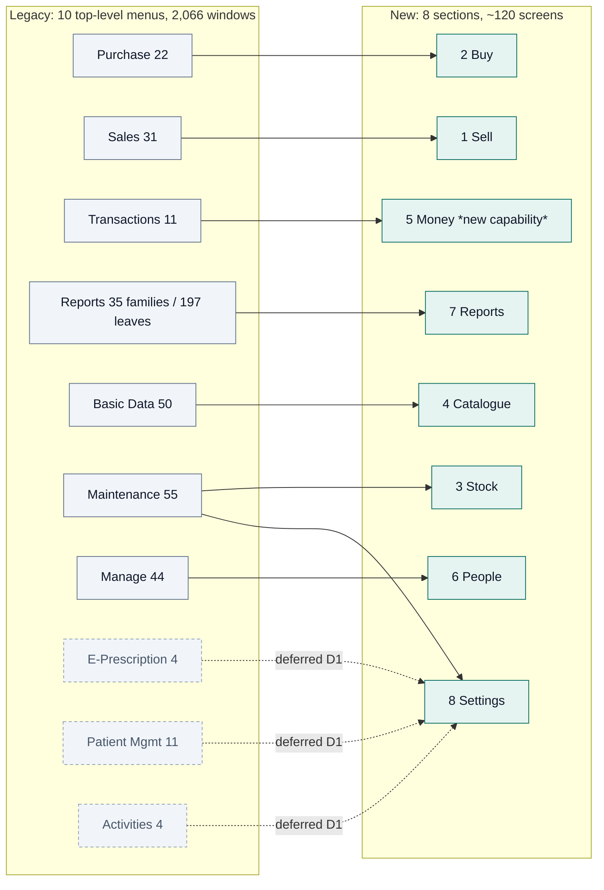

# 16 — Modern UX Blueprint (New System)

**Document purpose.** This is the **user-experience specification** for the rebuilt WASEELA ABUZAR replacement: a Node/TypeScript + React/TypeScript + MySQL 8 modular monolith for **Fazal Din PP19**, Gujranwala. It defines the navigation model, dashboards, page/form/wizard/table/search templates, mobile and keyboard behaviour, notification/confirmation/error/empty/loading states, responsive breakpoints, design tokens, colour/type/spacing/icon rules, printing and document layout, and the **concrete, testable WCAG 2.2 AA conformance contract** the client has named as the product's #1 feature. It closes with a **before → after table for every major legacy workflow**.

**Analysis stage.** Stage 4 — *design*. It consumes the completed Stage 1–3 analysis (`02`, `03`, `04`, `05a`, `05b`, `06`, `06a`, `07`, `08`, `09`, `10`, `11`, `12`, `14`) and the binding owner decisions in `00b`. It is a peer of `17-technical-blueprint.md` (architecture) and `19-mysql-schema-blueprint.md` (data). Where `17` has already fixed a technical decision (React Aria Components + Tailwind, TanStack Table + Virtual, Apache ECharts, three route trees), **this document does not re-litigate it — it specifies the behaviour those choices must deliver.**

## ⚠️ The existing system was NOT modified

Every observation about WASEELA ABUZAR V3 in this document comes from **read-only** analysis: compiled-binary string recovery, `SELECT`-only database introspection, and the analysis documents listed above. No legacy screen, stored procedure, preference row, table or file was altered, and no design in this document is deployed to the legacy system.

## Evidence-label legend

| Label | Meaning |
|---|---|
| `Verified` | Confirmed directly from the legacy binaries, schema, stored procedures or live data, with the source cited. |
| `Strongly Inferred` | Not directly readable, but the evidence admits only one reasonable reading; the reasoning is shown. |
| `Unclear` | Evidence is genuinely ambiguous. Stated as a question, not an answer. |
| `Missing` | Did not survive compilation / does not exist. Named so it is not mistaken for "absent by design". |
| `Deprecated` | Present in the legacy but superseded there. |
| `Broken/Incomplete` | Present but demonstrably defective. |
| `Recommended` | **A proposal for the NEW system. It does not exist today.** |
| `Owner-confirmed` | Stated by the business owner (`00b` decision log). |

> **Reading rule.** *Everything describing the new system is `Recommended`.* Nothing in Parts B through Q exists today. Statements about the legacy carry their own label and a citation (document § / `Table.Column` / stored-procedure name / preference key).

## Two audiences

| Part | Written for |
|---|---|
| A, P, Q | **The owner and staff** — plain language, no jargon, what changes at the counter. |
| B–O, R | **The build team** — component contracts, tokens, keyboard maps, acceptance tests. |

---

# PART A — DESIGN FOUNDATIONS

## A.1 Who we are actually designing for

`Verified` from `09` PART D, `05a` §2.4 and `04` §12.

| Real user | Legacy group | Daily reality | What the UI must do for them |
|---|---|---|---|
| Counter pharmacist / cashier (5 people) | `SALES OFFICER` (code 12, 111 rights) | ~500–540 invoices/day across the shop (291,361 invoices ÷ 578 days, `06a`); a customer is standing there; often a queue | Never make them wait, never make them read a dialog, never make them use a mouse |
| Shift in-charge (3 people) | `SHIFT INCHARGE` (code 11, 123 rights) | Supervises the counter, authorises returns and discounts, runs the day summary | One-keystroke approval, exception-first reporting |
| Purchase clerk | in practice group 12 | Keys a paper supplier bill of 15–30 lines against 6,419 purchase invoices / 113,564 lines (`05b` §5) | Bulk keyboard entry, no per-line dialogs, running totals that must match the paper |
| Owner / proprietor | `ADMINISTRATOR` (code 2, all 486 rights) | Wants "did we make money today", off-site, on a phone | A read-only phone surface with big numbers and plain words |
| Admin / IT | `ADMINISTRATOR` | Users, settings, backups | Plain-language settings with search and preview |

**Accessibility population (`Recommended` planning assumption, to be confirmed with the owner — see R.2):** staff span a wide age range and computer-literacy range; Urdu is the first language of most; the shop floor has glare and standing users at arm's length from the screen. Design for **low computer confidence, imperfect eyesight, one-handed use while handling cash and stock, and noisy interruption** as the *normal* case, not the edge case.

## A.2 The eight design principles

`Recommended`. Each principle exists because of a specific verified defect, not as a slogan.

| # | Principle | The legacy defect it answers |
|---|---|---|
| **UX1** | **The counter is a stopwatch, not a canvas.** Every millisecond and every keystroke on the sale path is budgeted and measured (§Q.4). Beauty never wins over throughput. | `Verified` `04` §9.5 — the legacy's keyboard-first model is genuinely fast; a mouse-driven rebuild would be a regression |
| **UX2** | **Nothing important is announced only by colour.** Status = icon + text + colour, always all three. | `Verified` `04` §9.3 — row state encoded purely as `RGB(255,150,150)` vs `RGB(255,255,255)` |
| **UX3** | **Errors appear where the mistake is, while the user is still there.** No blocking message box; inline, on the row, with focus moved to the offending cell. | `Verified` `04` §9.2 A9 — all 2,880 validation strings are `MessageBox` text; `Please Enter Valid Sale Qty in Row ` makes the user hunt for the row |
| **UX4** | **Every control has a name a screen reader can read.** Enforced by CI, not by review. | `Verified` `04` §9.1 — `accessiblename` occurs **0 times in 5,283,020 recovered strings across all 120 libraries** |
| **UX5** | **Options are data, chosen by the user, curated by the admin.** Never a hardcoded assumption; always a sensible pre-selected default. | `Owner-confirmed` P1 (`00b` D9); `Verified` `04` §6.14 — 1,363 preference rows already prove the product's own settings are data |
| **UX6** | **Hidden never means unreachable.** Every filtered list has a working "Show everything" escape. | `Owner-confirmed` R1.7; `Verified` `04` §6.15 A23 — the legacy filter builder returns only `No Record(s) found matching with the …` with no escape |
| **UX7** | **One pattern, learned once.** One search component, one grid, one form template, one wizard shell, one report shell. | `Verified` `04` §13.11 — 17 near-duplicate search popups; `10` §1.1 — 1,080 hand-built `w_arg_*` parameter windows and 357 format pickers |
| **UX8** | **Show the money honestly.** Plain-language financial screens; never present a computed figure whose inputs the system does not hold. | `Verified` `00b` F1 — the legacy reports "cash in hand 214,311,842" and "owed to suppliers 182,671,130", both fiction |

## A.3 What the legacy got right — and we keep

`Verified` `04` §9.5. A rebuild that discards these will be rejected by the staff who entered 291,361 invoices.

| Keep | Why | How it appears in the new UI |
|---|---|---|
| **Keyboard-first dispensing** | `cashsaledefaultfocussetting = detailwindow` — the caret lands in the item grid on open; the whole flow is typed | §K.2: the Counter surface opens with focus in the scan/search field, and a sale can be completed without touching a pointing device |
| **Consistent header / detail / footer / list metaphor** | Every legacy transaction screen uses it (`04` §5); staff already think in it | §D.3 *Document page template* uses the same four regions with the same names |
| **Right-gated cost columns** | `Show Purchase Price` / `Show Avg. Price` / `Show Flat Discount` are per-group rights | §G.6: same idea, but **filtered server-side** (`17` §8.7) so a cashier's payload never contains cost |
| **Textual posted / un-posted indicators** | `if(posted='Y','Posted','Un-Posted')` already exists in some DataWindows | §J.1 status chips: text is mandatory everywhere, colour is decoration |
| **Numbered document workflow** (draft → post → immutable) | `Reason: Posted Sale Invoice can not be deleted` | §D.3 document lifecycle bar |

## A.4 The accessibility contract in one paragraph

`Recommended`, [BINDING].

> **The new system conforms to WCAG 2.2 Level AA on every screen, on every surface, and the claim is enforced by automated tests in CI plus a documented manual audit per release.** The measurable baseline it replaces is *zero*: no accessible names anywhere, colour-only status, no inline errors, no focus management, no text scaling, no RTL, fixed-coordinate windows that do not reflow (`Verified` `04` §9.1–§9.4, §10). Part O states every applicable success criterion, the concrete implementation rule, and the test that proves it.

---

# PART B — NAVIGATION MODEL

## B.1 How the new information architecture was derived

`Recommended`, derived from `Verified` inputs — this is not a fresh invention:

1. **Start from the legacy menu tree.** `dbo.Rightsclone` (2,122 rows) holds the full product menu with `LevelIndex` and `IndicesString`; `dbo.Rights` (486 rows) holds what is switched on here. `Verified` `04` §4.
2. **Cut what has no data here.** ~1,150 of 2,066 windows (≈56%) back features with **zero rows** at this deployment (`Verified` `04` §11.2): transfers, goods receipt, issues, quotations, sale orders, manual vouchers, cashier shifts, patient/student/guest/services, loyalty, installments, employee/payroll, SMS, replication. Per **D1** these are **catalogued and deferred**, never silently dropped — they appear in the admin's *Feature catalogue* (§B.6) as switched-off, with the evidence of non-use shown.
3. **Merge the duplicates.** 197 deployed report leaves collapse to ~95 modern screens (`10` §10.4); 17 search popups collapse to one component; 838–1,080 parameter dialogs collapse to one filter component.
4. **Add what is missing.** Supplier payments, expenses, cash & bank book, day-end reconciliation, plain-language profit (**R2**), and batch/expiry management (**R4**) — none of which exist today.
5. **Split by surface, not by menu.** `04` §10 proves a single responsive app cannot serve a 90-field counter screen and a phone. `17` §8.9 fixes three route trees. Navigation therefore differs per surface.

## B.2 The three surfaces and their navigation shells

`Recommended`.

| Surface | Route root | Nav shell | Chrome |
|---|---|---|---|
| **Counter** | `/counter` | **No sidebar.** A single fixed top bar (till identity, user, connection state, shift totals) + the work area. Everything else is reached by `Ctrl+K` command palette or a shortcut. | Minimal, high contrast, large type (§M.4) |
| **Back office** | `/office` | Persistent left **primary nav** (8 sections) + contextual second level as tabs inside the page. Collapsible to icons+labels-on-hover; collapse state persists per user. | Standard density |
| **Insights** | `/insights` | **Bottom tab bar on phone / left rail on desktop**, 5 destinations. Read-only. | Responsive, large touch targets |

**Why the Counter has no sidebar.** `Verified` `04` §6.1.9: the legacy opens the cash sale with the caret already in the item grid and never leaves it. A sidebar on the counter screen is 200px of horizontal space and one more tab stop between the cashier and the next customer. `Recommended`: the counter's navigation *is* the keyboard.

## B.3 Back-office primary navigation (8 sections)

`Recommended`. Eight top-level items is inside the 7±2 working-memory guideline and maps 1:1 onto the backend module boundaries in `17` §2.3, so a permission failure can never produce a section a user can see but not use.

| # | Section | Icon meaning | Contains | Legacy origin (`Verified`) | Module (`17` §2.3) |
|---|---|---|---|---|---|
| 1 | **Sell** | counter | Sale invoices (list/detail), sale returns, held sales, day book, re-print | `Sales` menu (index 3, 31 items in product; retail sale + sale return live) | `sales` |
| 2 | **Buy** | inbound box | Purchase invoices, purchase returns, purchase orders, supplier bills to pay, goods expected | `Purchase` menu (index 2, 22 items) | `purchasing` |
| 3 | **Stock** | shelf | Stock on hand, **expiry & batches**, adjustments, stock take, reorder board, item movement | `Maintenance → Adjustment`; `Reports → Stock Report` | `inventory` |
| 4 | **Catalogue** | pill/box | Items, manufacturers, categories/classes, packing, **visibility & curation (R1)**, price changes | `Basic Data → Item` (index 6,9) | `catalog`, `pricing` |
| 5 | **Money** | banknote | **Supplier payments, expenses, cash book, bank book, day-end count, profit statement**, accounts & ledger | `Transactions` (unused here) + **entirely new (R2)** | `payments`, `ledger` |
| 6 | **People** | two figures | Suppliers, customers, users, roles & permissions, activity log | `Basic Data → Customer/Supplier`; `Manage → Users` | `access`, `identity` |
| 7 | **Reports** | chart | ~95 report screens in 7 groups, saved views, scheduled exports | `Reports` menu (index 5, 197 deployed leaves) | `reporting` |
| 8 | **Settings** | sliders | Business, counter, printing, tax & FBR, options & lists (**P1**), feature catalogue (**D1**), backups | `Maintenance → Preference` (1,363 rows) | `settings`, `platform` |



## B.4 Navigation rules

`Recommended`, [BINDING].

| # | Rule | Reason |
|---|---|---|
| N1 | **Maximum depth 3** — Section → Page → Detail/Tab. The legacy Reports menu goes **5 levels deep** (`Verified` `04` §4.5: `Reports → CRS Reports → CRS Accounting Reports → CRS Ledger Reports → CRS Customer Ledger`). | Depth is the single largest driver of "I can't find it" |
| N2 | **Nothing is reachable only by a keyboard shortcut.** Every shortcut-triggered action also exists as a visible, named control or a command-palette entry. | `Verified` `04` §9.2 A6 — ~70 product-wide shortcuts, 69 of them smuggled into menu *names* because there was nowhere to document them |
| N3 | **Nothing is reachable only by a mouse gesture.** No double-click-only or drag-only commit. | `Verified` `04` §6.15 A22 — `F12` or double-click are the *only* commit gestures on the search popups |
| N4 | **No modal opens another modal.** Depth-1 dialogs only; anything deeper becomes a page, a drawer, or an inline expansion. | `Verified` `04` §9.2 A7 — 130 dedicated response-window objects; a sale could chain item search → batch → godown → calculator → password → print copies |
| N5 | **A permission the user lacks hides the nav item and returns 403 on the route** — no dead links, no "access denied" pages after a click. | `Verified` `09` §C.2.1 — legacy enforcement is largely client-side |
| N6 | **Current location is announced three ways**: nav item `aria-current="page"`, page `<h1>`, and document `<title>`. | WCAG 2.4.2, 2.4.8 |
| N7 | **Breadcrumbs only where depth is 3.** Never a decorative one-item breadcrumb. | Noise reduction |
| N8 | **Back always works.** Every drawer, tab, filter and grid page-position is in the URL, so browser Back and a shared link both do the right thing. | The legacy MDI has no back concept at all (`Missing`) |

## B.5 The command palette (`Ctrl+K` / `Cmd+K`)

`Recommended`. This is the discoverable replacement for ~70 undocumented shortcuts and the 5-level report menu.

| Aspect | Specification |
|---|---|
| Opens on | `Ctrl+K` anywhere, or a visible **Search & commands** button in the top bar (never shortcut-only — rule N2) |
| Searches | Screens, actions ("New purchase invoice"), items (typeahead over the catalogue), suppliers, invoice numbers, settings, and report names — one ranked list, grouped by type with `role="group"` headings |
| Result rows | Icon + primary label + secondary context + **the shortcut, if the action has one** — so the palette is also the shortcut teacher |
| Semantics | `role="dialog"` `aria-modal="true"`, input is `role="combobox"` `aria-expanded` `aria-controls`, list is `role="listbox"`, rows `role="option"` with `aria-selected`; result count announced via a polite live region ("12 results") |
| Keyboard | `↑`/`↓` move, `Enter` run, `Tab` completes to the highlighted term, `Esc` closes and returns focus to the trigger |
| Never | Never the only path to an action; never returns a result the user lacks permission to run (filtered server-side) |

## B.6 The Feature catalogue (how **D1** deferral is honoured in the UI)

`Recommended`. **Settings → Feature catalogue** lists every deferred vertical from `04` §11.2 with:

- its plain-language name ("Hospital / in-patient dispensing", "School fee management", "Multi-branch consolidation"),
- an **evidence line** — e.g. *"Shipped in the old software. Never used here: `Patient` table held 0 rows across 19 months."* (`Verified` `04` §11.2),
- state: `Not built yet` / `Available — switch on` / `On`,
- and a **Request** button that files it to the backlog.

This is the visible proof that deferred ≠ dropped. It is read-only for every role except `sys_admin`.

---
# PART C — DASHBOARD STRUCTURE

## C.1 Why three dashboards, not one

`Verified` `04` §6.18: the legacy ships `w_dashboard` with 57 DataWindows and 11 recovered panel titles (`Customer Sales Analysis`, `Dumped Inventory Analysis`, `Branch/Client Wise Sales` …) — and `10` §10.3 records it as **shipped and never enabled**. Its panels are also aimed at a multi-branch, multi-customer, multi-area business; at Fazal Din PP19 `Area`=1, `Region`=1, `Zone`=0, `SalesMan`=1, `CustomerCategory`=1, `Customer`=2, `Godown`=1 (`Verified` `10` §1.2 finding 4), so nine of the eleven panels would render a single bar.

`Recommended`: build **three purpose-built dashboards**, each answering the questions its audience actually has.

## C.2 Counter home — "Today at this till"

`Recommended`. Shown only when no sale is in progress; disappears the instant the cashier scans.

| Region | Content | Rules |
|---|---|---|
| Command bar (always) | Scan/search field with focus, **New sale** (`F2`), **Return** (`F4`), **Held sales (n)** (`F3`) | Focus is in the scan field on load and after every completed sale |
| 4 tiles | Invoices today · Value today · Returns today · Held sales | Numbers only — no charts, no colour-coded arrows |
| Alert strip | Only if non-empty: *Unfiscalized invoices (n)* · *Expiring within 30 days (n)* · *Printer offline* · *Working offline — sales blocked* | Each is a link to the fixing screen. Text + icon + colour (UX2) |
| Shift panel | Cashier name, till, shift start, **Day-end count** button | Feeds R2.4 |

**Explicitly excluded from the counter home:** margins, costs, GP%, supplier balances. `Recommended` per `09` §I.4 — `sales_officer` has no cost visibility by default, and the payload is filtered server-side.

## C.3 Back-office home — "Run the shop"

`Recommended`. Card grid, each card a *question*, each card drilling into the grid that answers it.

| Card | Metric (canonical definition from `10` §10.2) | Drill-through |
|---|---|---|
| Sales today / this month | `net_sales` | Sell → Sale invoices, filtered |
| Gross profit today / this month + GP% | `gross_profit`, `gp_rate` — `net_sales − Σ((looseqty+bonusqty) × saledetail.avgprice)` (`Verified` `10` §1.2 finding 3: this is the number the business actually uses; only 2 of 620,619 lines lack `AvgPrice`) | Reports → Gross profit |
| **Expiring value at risk** (30/60/90) | R4.2 | Stock → Expiry |
| Reorder urgent (n items below reorder level) | `08` reorder levels | Stock → Reorder board |
| **Bills to pay** (supplier balances) | R2.6 — *shows "No payments recorded yet" until R2.1 has data* | Money → Supplier payments |
| **Money out this month** (expenses) | R2.2 | Money → Expenses |
| Exceptions today | Below-cost sales, discount outliers, deleted lines, unposted documents, unfiscalized invoices | Reports → Exceptions |
| Stock value | `stock_value` with a **named basis** (average cost / purchase price / sale price) — never a magic integer (`Verified` `10` §10.2) | Stock → Stock on hand |

**Honesty rule (UX8).** Any card whose inputs the system does not yet hold renders as an **explanatory empty state**, never as a zero or a fabricated figure. At go-live, *Bills to pay* reads: *"Nothing recorded yet. Supplier balances start from zero on <cutover date> (owner decision D10). Record a payment to start the balance."* `Owner-confirmed` R3.1.

## C.4 Insights home — the owner's phone

`Recommended`. Read-only, responsive, the only genuinely mobile surface (`17` §8.9).

| Order on phone | Element |
|---|---|
| 1 | **Today**: sales, gross profit, invoices — three large numbers, one per row, `2rem` type |
| 2 | **This month vs last month** — one combo chart (bars = net sales, line = GP%), with a *Show as table* toggle (mandatory, §C.5) |
| 3 | **Where the money went** — plain-language profit statement (R2.5), collapsed |
| 4 | **Watch list** — expiring value, dead stock value, top 5 sellers |
| 5 | Period selector: Today / This week / This month / This year / Custom |

## C.5 Dashboard tile and chart contracts

`Recommended`, [BINDING].

**Tile contract**
1. A tile is a `<section>` with an `<h3>` that *names the question*, not the field ("Gross profit this month", not "GP MTD").
2. The number is text, not an image; the unit (`PKR`) and the period are in the accessible name.
3. Trend is **never colour-only**: `▲ 12% vs last month` — arrow glyph + sign + word, with colour as decoration (UX2).
4. Every tile states its **as-at time** ("as at 14:32") and links to its definition ("How is this calculated?" → the canonical metric definition from `10` §10.2).
5. A tile is keyboard-focusable **only if it is a link**; a non-interactive tile is not a tab stop.
6. Loading = skeleton with `aria-busy="true"` on the tile, not a spinner replacing the number (§J.5).

**Chart contract** (extends `17` §8.8, restated here as UX law)
1. `role="img"`, concise `aria-label`, and an `aria-describedby` **text summary generated from the data**: direction, extremes, totals — e.g. *"Net sales by month, Jan 2025 to Jul 2026. Rising overall. Highest: March 2026, PKR 14.2 million. Lowest: Feb 2025, PKR 8.1 million. Total PKR 229.4 million."*
2. **Every chart has a "Show as table" toggle** that renders the same numbers as a real `<table>` with `<caption>`, `<th scope>` and a visible summary row. The toggle is a real control, not a visually-hidden duplicate. (WCAG 1.1.1, and it serves users who simply prefer numbers.)
3. **Series are distinguishable without colour** — ECharts `decal` patterns on every multi-series chart, plus direct labels where space allows. (WCAG 1.4.1; also makes monochrome thermal/laser printing readable.)
4. Non-text contrast ≥ 3:1 for every plotted mark, axis line and legend swatch against its background (WCAG 1.4.11).
5. Tooltips are also reachable by keyboard (focus moves through data points) and are dismissible with `Esc` without moving focus (WCAG 1.4.13).
6. No chart animates on load when `prefers-reduced-motion: reduce`.
7. Charts receive **pre-rounded decimal strings** from the server (`17` §6.3) — the UI never re-computes money.

---

# PART D — PAGE TEMPLATES

`Recommended`. Eight templates cover the whole application. Every screen is an instance of exactly one; a new template requires a design decision, not a developer's discretion. This is UX7 and it is the direct answer to `04` §6.17 A24 (838–1,080 near-identical hand-built windows with *"no shared, learnable layout guarantee"*).

## D.0 The common page frame

```
┌──────────────────────────────────────────────────────────────────┐
│ SKIP LINKS (visually hidden until focused): to content, to nav   │
├───────────┬──────────────────────────────────────────────────────┤
│           │ ❶ Page header: <h1> · status chip · primary action    │
│  primary  │    breadcrumb (only if depth 3)                       │
│  nav      ├──────────────────────────────────────────────────────┤
│  <nav>    │ ❷ Toolbar: filters · search · view preset · export    │
│           ├──────────────────────────────────────────────────────┤
│           │ ❸ Content region  <main id="content">                 │
│           ├──────────────────────────────────────────────────────┤
│           │ ❹ Footer bar: totals / pagination / bulk-action bar   │
└───────────┴──────────────────────────────────────────────────────┘
   ❺ Toast region (aria-live=polite)  ❻ Alert region (role=alert)
```

Landmarks are mandatory and unique: one `<header>`, one `<nav aria-label="Main">`, one `<main>`, optional `<aside aria-label="…">`, one `<footer>`. `<h1>` occurs exactly once and matches `document.title`.

## D.1 Template P1 — **List / Explorer**

For: sale invoices, purchase invoices, items, suppliers, stock on hand, adjustments, expiry list, audit log.

| Region | Content |
|---|---|
| Header | `<h1>`, result count as text ("1,284 invoices"), primary action button |
| Toolbar | One search field · facet chips · date range · **saved view** selector · column preset · Export (permission-gated) |
| Content | Virtualised data grid (§G) with a **row drawer** for detail — never a modal |
| Footer | Sticky totals row (sum/count of the *filtered* set, labelled as such) + pagination |

**Rules:** the filter state is in the URL; "clear all filters" is always present; the count distinguishes *filtered* from *total* ("1,284 of 291,361").

## D.2 Template P2 — **Record page** (master data)

For: item, supplier, customer, user, account, manufacturer.

Left: the record form in sections. Right (or below on narrow): a **context rail** with related facts — for an item: current stock by batch, last 5 purchases, last 5 sales, price history, visibility state (R1), audit trail.

**Rule:** the context rail is *supplementary*; every fact in it is also reachable from a list screen, so a screen-reader user is never forced through it.

## D.3 Template P3 — **Document page** (transaction)

For: sale invoice, sale return, purchase invoice, purchase return, purchase order, stock adjustment, supplier payment, expense.

This deliberately preserves the legacy's four-region metaphor (`Verified` `04` §5 — `dw_header` / `dw_detail` / `dw_footer` / `dw_list`) because ~300,000 documents of muscle memory sit behind it.

```
┌ Lifecycle bar ──────────────────────────────────────────────────┐
│  ● Draft ─── ○ Posted ─── ○ Fiscalized     [Save] [Save & Post] │
├ Header ─────────────────────────────────────────────────────────┤
│  Date · Party · Reference · (only the fields this shop uses)    │
├ Lines ──────────────────────────────────────────────────────────┤
│  editable grid — see §G.4                                        │
├ Footer ─────────────────────────────────────────────────────────┤
│  Sub-total · Discount · Tax · Charges · TOTAL (large)            │
└─────────────────────────────────────────────────────────────────┘
```

**Rules**
1. **The lifecycle bar is text + shape + colour** (UX2) and is an `<ol>` with `aria-current="step"`.
2. **Posted documents are read-only** and say so in words, matching legacy semantics (`Verified` `04` §6.1.5: `Reason: Posted Sale Invoice can not be deleted`). Correction is by an audited reversal, never a silent edit (`00b` R2.6 acceptance criterion 6).
3. **The header shows only fields this business uses.** `Verified` `04` §6.1.2 — the legacy binds ~90 header columns; live preference data (`04` §6.1.9) proves only *Customer Balance* and *Price # in Cash Sale* are visible, and **Sales Person, Sale Category, Doctor, Vehicle, Ship To, Guarantee Person, Loyalty Points, Currency and 15 more are all `No`**. Every hidden field remains available via **Settings → Options & lists** (P1), not via code.
4. **Totals are live and never surprise.** Every recalculation announces the new total in a polite live region, debounced to 500 ms.
5. `Ctrl+S` = Save draft, `Ctrl+Enter` = Save & Post — preserving `Ctrl+S` / `Ctrl+Q` intent from `Verified` `04` §6.1.6, with the shortcut printed on the button itself.

## D.4 Template P4 — **Wizard** (see Part F for the shell contract)

## D.5 Template P5 — **Report page**

Replaces 1,080 `w_arg_*` parameter windows + 357 `w_selectformat_*` pickers with **one** page (`Verified` `10` §1.1; `Recommended` `10` §10.1).

```
┌ Report title + one-line plain-English description ──────────────┐
├ Filter panel (collapsible, remembers state) ────────────────────┤
│  rendered from a declarative filter schema — ~15 primitives     │
│  cover all 1,080 legacy parameter windows (10 §10.1)            │
│  [Run report]  [Save this view]  [Schedule]                     │
├ Result ─────────────────────────────────────────────────────────┤
│  [Chart] [Table] toggle  ·  chart + mandatory data table (§C.5) │
├ Footer: row count · export (CSV / XLSX / PDF, permission-gated) ┤
```

**Rules:** the report never runs on page load if it is expensive — a **Run report** button gives the user control (WCAG 3.2.2, no change on input). Long runs show progress with `aria-busy` and a cancel. Results are **never** written to a shared scratch table — the legacy's `ReportData` / `CrossTab_ReportData` are global, session-less and `DELETE`d at the start of every run, so two concurrent users corrupt each other's output (`Verified` `10` §1.2 finding 1). Export is a **per-report-group permission**, not the legacy's all-or-nothing admin-only `Save As` / `Save As Excel` rights 637/638 (`Verified` `10` §1.2 finding 5).

## D.6 Template P6 — **Settings page**

Replaces `w_preferences` (1,363 rows, 1,277 visible, 37 categories, 155 sub-categories, **no search**, every boolean a dropdown, every edit a modal — `Verified` `04` §6.14 A18/A19/A20).

| Legacy | New |
|---|---|
| No search across 1,277 settings | **Search box at the top, always** — matches label, description and synonyms |
| Boolean = `ddd_pref_yesno` dropdown ×1,023 | **Switch**, toggled with one keystroke, state in text next to it ("On"/"Off") |
| Edit = open `w_pref_get_*` modal | **Edit in place**; save is explicit per group with an undo toast |
| Raw key names | Plain-language label + one-line explanation + "what this affects" |
| No preview | **Live preview count** where the setting filters data (mandatory for R1.5 presets) |

Layout: settings grouped into cards; each card = one decision area; each row = label + explanation + control + current value in text.

## D.7 Template P7 — **Dashboard** (Part C)

## D.8 Template P8 — **Focus / kiosk page**

For: login, day-end cash count, till lock, print preview, first-run setup. Single column, max 640px, no nav, one primary action, large targets.

---

# PART E — FORM TEMPLATES

`Recommended`. Every form in the system is built from this one contract. It is the direct remedy for `04` §9.2 A2 (labels are free-floating `text` objects with **no programmatic association**, e.g. `remarks_t`, `date_t`, `batch_t`, `expiry_t`) and A9 (message-box-only errors).

## E.1 Field anatomy

```html
<div class="field">
  <label for="expiry">Expiry date</label>                    <!-- always visible, never a placeholder -->
  <p id="expiry-hint">The date printed on the pack.</p>      <!-- optional -->
  <input id="expiry" name="expiry" type="text" inputmode="numeric"
         autocomplete="off"
         aria-describedby="expiry-hint expiry-err"
         aria-invalid="true">
  <p id="expiry-err" class="field-error">
    <svg aria-hidden="true">…</svg>
    Enter the expiry as MM/YYYY, for example 03/2027.
  </p>
</div>
```

| # | Rule | Criterion |
|---|---|---|
| F1 | **Every input has a `<label for>`.** No placeholder-as-label, ever. | 1.3.1, 3.3.2, 2.4.6 |
| F2 | The label stays visible when the field has a value (floating labels that vanish are banned). | 3.3.2 |
| F3 | Required fields are marked **in the label text** ("Expiry date (required)") plus `required`; optional-marking is used instead when >70% of fields are required. Never colour or an asterisk alone. | 1.4.1, 3.3.2 |
| F4 | Hint text is linked with `aria-describedby`, not `title`. | 1.3.1 |
| F5 | Errors are **inline, below the field, text + icon**, with `aria-invalid="true"` and the error id appended to `aria-describedby`. | 3.3.1, 1.4.1 |
| F6 | Error text says **what is wrong and how to fix it**, with an example. Banned: "Invalid value", "Error", and the legacy's shipped typos (`Dsicount % value should be between 0 and 100`, `betweeen`, `beteen` — `Verified` `04` §6.1.4). | 3.3.3 |
| F7 | On failed submit: focus moves to the **error summary** at the top (`role="alert"`, `tabindex="-1"`), which lists every error as a link to its field. | 3.3.1, 2.4.3 |
| F8 | **Validate on blur, never on every keystroke**; re-validate on change once a field is already in error (so the message clears as soon as it is right). | Reduces mid-typing noise |
| F9 | Autofill: `autocomplete` tokens on name/phone/address fields (`name`, `tel`, `street-address`, `postal-code`, `email`). | 1.3.5 |
| F10 | Money and quantity inputs use `inputmode="decimal"`, right-aligned, with the unit as a visible suffix, and **accept both `1,234.50` and `1234.50`**. | 3.3.2 |
| F11 | **No field is disabled without an adjacent explanation.** If a price is locked (legacy `Item.LockSalePrice` → `SalePrice is locked, you can not change it`, `Verified` `04` §6.1.5), the field is read-only *and* shows "Locked by item setting — ask a manager" with a link. | 3.3.2 |
| F12 | Destructive or financial submits require an explicit confirm (§J.3); nothing submits on `Enter` in a single-field form without a visible primary button. | 3.3.4 |
| F13 | **Nothing is lost.** Draft state is autosaved (§E.4); navigating away with unsaved changes prompts. | 3.3.4 |
| F14 | Grouped controls (radio, checkbox sets, address blocks) use `<fieldset><legend>`. | 1.3.1 |
| F15 | Field order follows the *paper* it is copied from where one exists (supplier bill → purchase form), because the operator's eyes are on the paper, not the screen. | Throughput |

## E.2 The four field densities

| Density | Row height | Font | Used on |
|---|---|---|---|
| `counter` | 48px | 1.125rem (18px) | Counter surface, day-end count |
| `comfortable` | 40px | 1rem | Back-office forms (default) |
| `compact` | 32px | 0.9375rem | Editable grids in back office (purchase lines) |
| `touch` | 56px | 1.125rem | Touch POS / tablet stock take |

Density is a **user preference** (Settings → Display), not a hardcoded per-screen decision (P1). Minimum interactive target is 24×24 CSS px everywhere and 44×44 on `touch` (§O, 2.5.8).

## E.3 Option lists — how **P1** looks in a form

`Owner-confirmed` P1 (`00b` D9). Every option list in the system obeys:

| Rule | Implementation |
|---|---|
| P1.2 sensible default | The default option is pre-selected and marked "(default)" in the list. Cash is the default supplier-payment method. |
| P1.3 admin can disable | Disabled options are **absent** from the picker but still render correctly on historical documents, with a "(no longer offered)" suffix. |
| P1.4 options are data | Every list is `option_set` / `option_value` rows (`17` §2.3 `settings`); adding "Raast" as a payment method is an admin action. |
| P1.6 clean UI despite breadth | ≤ 6 options → radio group with visible labels. 7–15 → native `<select>`. > 15 → searchable combobox with grouped `optgroup`s. **The threshold is a rule, not a judgement call.** |
| P1.5 role-appropriate | The picker requests options for `(option_set, role)`; a cashier's payment picker and the owner's differ, server-decided. |
| P1.7 audited | The chosen option id is stored on the document and shown on the audit trail and on reports. |
| Escape hatch | Where the owner asked for it (payment method, adjustment reason), the last option is **"Other…"** which reveals a free-text field — captured, reportable, and surfaced to the admin as a candidate new option. |

## E.4 Save-as-draft, autosave and recovery

`Recommended`. The legacy has a real draft concept (`Posted='N'`, `Verified` `05b` §5.3 step 8) but no autosave; an application or power failure mid-invoice loses the work.

| Behaviour | Specification |
|---|---|
| Autosave | Every document and wizard autosaves to the server **2 seconds after the last change** and on blur of any line. Status text: "Saved 14:32" / "Saving…" / "Not saved — retrying". Never a spinner over the form. |
| Explicit draft | **Save draft** (`Ctrl+S`) is always visible on document pages, even when autosave is on, because staff trust a button they pressed. |
| Recovery | On reopening after a crash: "You have an unfinished purchase invoice for FAZAL DIN DIST. from 11:04 today (14 lines). [Continue] [Discard]". |
| Counter exception | A sale in progress is held **locally and on the server as a held sale**; `F3` lists held sales. Held sales never allocate stock. |
| Conflict | If two users edit the same draft, the second gets an optimistic-concurrency conflict panel showing **their value vs the current value, field by field**, with per-field keep/replace — not a "record changed" message box (`17` §7.4). |

---

# PART F — WIZARD TEMPLATES

## F.0 When a wizard is justified — and when it is a mistake

`Recommended`. A wizard trades *steps* for *decisions per step*. It is right when a task is **infrequent, multi-domain and error-costly**; it is wrong when a task is **high-frequency and single-domain**.

| Task | Frequency here (`Verified`) | Wizard? | Verdict |
|---|---|---|---|
| Product creation | Item master = 30,050 rows, but new items are occasional; the form carries garment fields (Fabric, Sleeve, Style, Yarn) beside pharmacy fields (`04` §6.7 A15) | **Yes** | 4 steps |
| Purchase entry | 6,419 invoices / 19 months ≈ **11/day**; 17.7 lines each; densest grid in the product (`04` §6.3 A13 — six tax-rule columns plus batch, expiry, bonus, pack/loose, three prices) | **Yes, but only around the grid** | 4 steps, step 3 is the fast grid |
| **Sales invoice** | **291,361 invoices ≈ 500–540/day** (`06a`) | **NO for the routine sale.** An opt-in **Guided sale** mode for new staff only | 1 screen (fast) / 3 steps (guided, off by default) |
| Stock adjustment | 1,539 + 1,061 buffer headers ≈ 4.5/day; direction is encoded in *which window you opened* (`04` §6.9 A17) | **Yes** | 4 steps |
| Opening balance | **Once, at cutover** — the highest-consequence task in the project (R3, D10) | **Yes** | 5 steps |

> **The single most important UX decision in this document:** *there is no wizard on the cash-sale path.* Adding one would add ~500 × 2 extra confirmations per day to a queue-driven counter. §Q makes the fast path explicit.

## F.1 The wizard shell contract

`Recommended`, [BINDING] — one shell, five instances (UX7).

| Element | Specification |
|---|---|
| Step indicator | `<ol>` of steps, each with number + name + state ("done", "current", "not started" **in text**), `aria-current="step"` on the current one. Colour is decoration (UX2). |
| Step heading | Each step renders a new `<h1>` (or `<h2>` under a stable `<h1>`) and **moves focus to it** on step change, so a screen reader announces the new step. |
| Progress | "Step 2 of 4" as text, and in the document title. |
| Navigation | **Back** (never destructive, never loses input) · **Continue** · **Save draft & close** on every step. `Alt+←` / `Alt+→` also move steps. |
| Validation | **Per-step, on Continue.** Errors are inline (§E.1) plus an error summary at the top of the step. Continue is **never disabled** — pressing it and being told why is more discoverable than a dead button. |
| Skipping | Completed steps are clickable; future steps are not, unless the wizard is a re-edit of a completed record. |
| Save-as-draft | Mandatory on all five. Draft is resumable from a named list ("Unfinished: 3"). |
| Review step | **Mandatory final step**: every value grouped by step, each group with an **Edit** link that returns to that step *and back again*. Financial totals restated. |
| Confirmation | Not a toast. A **confirmation panel** with the created record's number, a `role="status"` announcement, and 2–4 named next actions ("Print", "Receive another", "Back to list"). |
| Cancel | `Esc` or Cancel prompts: "Discard this <thing>? Your draft will be kept for 7 days." (WCAG 3.3.4) |
| Timing | No step ever times out (WCAG 2.2.1). |

## F.2 Wizard 1 — **Add a product** (4 steps)

Answers `04` §6.7 A15 (garment fields shown to a pharmacist) and A16 (unlabelled Y/N flag cells).

| Step | Fields | Inline validation |
|---|---|---|
| **1 — What is it?** | Item name (required) · Local/Urdu name · **Barcode** (scan or type; multiple allowed) · Manufacturer (combobox over 838, `Verified` `10` §1.2 finding 4 — a live dimension) · Category (7 live) · Class (12 live) · Generic name | Name required; **duplicate check runs as you type** — "3 similar items exist" with a peek list, because the legacy's only defence is `Duplicate Item, please select some other item` at *sale* time (`Verified` `04` §6.1.5) |
| **2 — How is it packed and sold?** | Pack description · Units per pack · Loose sale allowed? · **Decimal quantity allowed?** (maps to `Item.AllowSaleInDecimalQty`) · Measuring unit | Units per pack ≥ 1; if "decimal quantity" is off, a preview line shows "1.5 will be rejected at the counter" |
| **3 — Money and tax** | Purchase price · Sale price · **Margin shown live as a computed, read-only field** · Sales tax schedule / PCT code · GST% · Lock sale price? · Lock discount? | Sale price < purchase price → **warning, not a block** (the legacy preference `Allow Sale Price Below Recent Pur. Price` is `Yes` here, `Verified` `04` §6.1.9); PCT code missing → **hard warning**: *"Without a PCT code this item is silently dropped from the FBR fiscal invoice"* (`Verified` `05a` §7 defect F3, Critical) |
| **4 — Pharmacy controls & visibility** | **Prescription only?** · **Narcotic / controlled?** (+ max quantity per sale) · **Refrigerated?** · **Requires batch & expiry?** (R4.1 strictness: require / prompt / off) · Reorder level · Minimum · Optimum · **Visible in: Sales · Purchase · Reports · Stock lists** (R1.6) | Narcotic ⇒ batch/expiry forced to "require" with an explanation; each flag has a one-line consequence in plain words ("Staff will be asked for a prescription number at the counter") — the direct fix for A16 |
| **Review** | All of the above, grouped, with Edit links; a rendered **preview of how the item will appear in counter search** | — |
| **Done** | "PANADOL 500MG TAB created." → [Add another] [Add opening stock] [Go to item] | — |

**What is *not* on this wizard:** Fabric, Sleeve, Style, Yarn, Colour, Size, Thickness, Part No., Application, Item Year, Motor-vehicle fields. `Verified` `04` §6.7 — they exist on the legacy form because the binary also serves garment factories and vehicle dealers. They are **deferred, catalogued** (D1) in the Feature catalogue, not deleted.

## F.3 Wizard 2 — **Enter a purchase / goods receipt** (4 steps)

`Verified` context: there is **no separate goods-receipt document** — the purchase invoice *is* the receipt, and `Purledger.GRN` is free text populated on 30 of 6,419 invoices (0.5%), so there is **no three-way match** (`05b` §5.1). 42% of purchases reference a PO (`05b` §5.3 step 2).

| Step | Content | Inline validation / guidance |
|---|---|---|
| **1 — Whose bill is this?** | Supplier (combobox over 235) · Supplier bill no. (populated on 99.98% of legacy rows — **required here**) · Bill date · Purchase type (Credit / Cash / Loose / Opening — the four live categories, `Verified` `05b` §5.2) · **"Receiving against a purchase order?"** with a picker of that supplier's open POs | Duplicate detection: same supplier + same bill no. → *"You already entered bill 45812 from this supplier on 14/03/2026 for PKR 214,300. [Open it] [Continue anyway]"* — a defence the legacy does not have |
| **2 — What arrived?** | **The fast grid** (§G.4). Columns: item · batch · **expiry** · pack qty · loose qty · bonus · units/pack · purchase price · disc% · sale price · line total. Scan a pack ⇒ **GS1 AI 01/10/17 auto-fills item, batch and expiry** (R4.1, `17` §8.11) | Per-line, inline: qty > 0; expiry not in the past; expiry more than `AcceptFutureExpiryDays` ahead (legacy value 90 — `Verified` `04` §6.3) → confirm; **sale price ≤ purchase price → row warning with the computed margin**; batch/expiry strictness follows the item's R4.1 setting |
| **2a — PO comparison (only if step 1 linked a PO)** | Side-by-side: ordered vs received, per line, variance highlighted with icon + number | Fixes the verified blind spot: *"Quantity or price discrepancies between what was ordered and what was billed are invisible to the system"* (`05b` §5.1) |
| **3 — Bill-level amounts** | Discount % · Flat discount · Misc charges · Sales tax · Advance income tax · **Grand total the supplier's paper says** | **The reconciliation gate:** the user types the paper total; if it differs from the computed total the wizard shows the difference in rupees and refuses to continue until the user either fixes a line or ticks "the supplier's bill is wrong — record the difference". This does not exist today and is the single highest-value error-prevention control in the purchase flow. |
| **4 — Review & post** | Full document, cost impact per item (**old average cost → new average cost**, computed by the same formula validated against all 113,564 live lines, `05b` §5.5), stock that will be added, GL entry in plain words | "Posting will increase stock by 412 units and change the average cost of 14 items." |
| **Done** | Invoice no., [Print], [Enter another bill from this supplier], [Record a payment] (R2.1) | — |

**Draft is the default.** The legacy already separates save (`Posted='N'`) from post (`05b` §5.3 steps 8–9); `09` §I.3 recommends splitting *create/edit* from *post* as a separation of duties, so `purchase_officer` finishes at "submitted for posting" and a manager posts.

## F.4 Wizard 3 — **Sales invoice**: the fast path, and an opt-in guided mode

`Recommended`. **Default = no wizard.**

### F.4.1 The fast path (default, always available)

One screen. One focus. See §Q.1 for the keystroke-level walkthrough and the throughput budget.

### F.4.2 Guided sale (opt-in, 3 steps)

Enabled per user by an admin ("Guided mode for new staff") or toggled by the user from the counter menu. It commits through the **same** server transaction — it is a different front end onto one operation, never a second code path.

| Step | Content | Guidance |
|---|---|---|
| **1 — Items** | Big scan field, one item at a time, each added item shown as a large card with name, pack, price, qty ±, and **expiry with a colour+icon+text badge** | "Scan the barcode, or type part of the name and press Enter." Live subtotal in 2rem type |
| **2 — Check** | The basket as a simple list, per-line remove and quantity edit, discount (permission-limited), total | "Read the total back to the customer: PKR 1,240" |
| **3 — Payment** | Payment method (P1 option list — Cash default) · cash tendered → **change calculated in 2rem type** · [Complete sale] | Change due is the largest number on the screen |
| **Done** | "Invoice 880,234 saved and printed. FBR number 141973…" + [Next customer] with focus already in the scan field | Auto-returns to a new sale after 5 s or on any keypress |

**Both modes share:** FEFO batch selection with override (R4.3), the expired-stock guardrail (R4.4), the PKR 1.00 FBR POS fee added automatically (`Verified` `05a` §4.2 step 7 — `MiscCharges = 1.00` on **100%** of 291,361 invoices), rounding to whole rupees (`roundsaleinvon = 0`), and asynchronous fiscalization that **never blocks the till** (`17` §7.7).

## F.5 Wizard 4 — **Stock adjustment** (4 steps)

Fixes `04` §6.9 A17: *increase and decrease are two different windows with near-identical grids; direction is encoded in which window you opened, not in a visible field.*

| Step | Content | Validation / guidance |
|---|---|---|
| **1 — What are you doing?** | Three large choice cards: **Increase stock** · **Decrease stock** · **Correct a count (set to actual)** — each with a one-line explanation and an example | Direction becomes an explicit, announced, auditable choice |
| **2 — Why?** | Reason (P1 option list): Damage · **Expiry** · Theft/shrinkage · Count correction · Sample/donation · Breakage · Other (free text). Plus a reference/note and optional photo | Reason is **required** — the legacy has no reason field, which is why adjustment reporting can only count, not explain (`10` §10.3 recommends a reason Pareto) |
| **3 — Which stock?** | Item search → batch/expiry picker showing current quantity per batch → new quantity **or** delta, with the resulting balance shown live. Bulk mode: scan or import a count sheet | Negative resulting stock is **blocked** with the reason shown on the row; "Correct a count" shows *system says 42, you say ___, difference −3* |
| **4 — Review** | Every line with direction, reason, before → after, **value impact at average cost**, and who will see it | "This will reduce stock value by PKR 3,120. Adjustments over PKR 5,000 require a manager (Settings → Approvals)." |
| **Done** | Adjustment no., [Print], [New adjustment], [View stock] | — |

## F.6 Wizard 5 — **Opening balances at cutover** (5 steps)

`Owner-confirmed` R3 / D10 / D11. This wizard is run **once**, by the owner with the implementation team, and it is the UI that makes the F1 finding safe.

| Step | Content | Guidance shown on screen (plain language) |
|---|---|---|
| **0 — Read this first** | A plain-language explanation of **why balances start at zero** | *"The old software recorded money coming in but never money going out. It says there is PKR 214,311,842 in the till and PKR 182,671,130 owed to suppliers. Neither is true. We are starting these figures from zero so every number in the new system is real."* (`Verified` `00b` F1) |
| **1 — Cash in hand** | Method (P1): **Start at zero (default)** · Enter counted amount · Import from a reconciled statement. If "counted": amount, counted by, witnessed by, date | Old figure shown greyed with the label "old software figure — not imported" |
| **2 — Bank accounts** | Add each bank account (name, bank, account no. — **last 4 digits only displayed**), same three methods | The legacy `CASH AT BANK` account has **zero entries in 19 months** (`Verified` `00b` F1) — the wizard says so |
| **3 — Suppliers** | Grid of all 235 suppliers with the **legacy (fiction) balance shown greyed**, and an editable "real balance from their statement" column, defaulting to **0.00** | *"Ask each distributor for a statement before entering a figure. Leaving it at zero is fine and is the default."* Progress: "0 of 235 entered — that is allowed." |
| **4 — Customers & capital** | Customers default 0 (walk-in cash model, D5 — `Customer` = 2 rows). Owner capital: zero or owner-stated | — |
| **5 — Stock (confirm, do not enter)** | **Read-only confirmation** that physical stock carries over unchanged: item count, total units, total value at average cost, batch/expiry state | `Owner-confirmed` D11/R3.3 — *"Stock is real and correct in the old system. It comes across exactly as it is. You do not need to count anything before go-live."* Plus the honest note that 97.7% of purchase lines carry the placeholder batch `'.'` and the default expiry `2030-12-12` (`Verified` `05b` §5.4), so **real** batch/expiry data starts accruing from go-live forward (R4.6). |
| **Review** | Every choice, per balance type, with **who chose it and when** — this becomes the migration log entry required by R3.4 clause 3 | — |
| **Done** | A printable, signable **Opening Balance Certificate** listing every figure and method | Satisfies R3.4 clauses 1 and 3 |

---
# PART G — TABLE AND GRID PATTERNS

`Recommended`. The grid is this product's primary surface — `04` §9.2 A3 records the legacy's as *"a dense spreadsheet grid as the primary input surface … ~70 bound columns on the sale line, more on purchase … there is no alternative single-record view"*. Grids stay, but under rules.

## G.1 Four grid kinds

| Kind | Editable | Virtualised | Example | Template |
|---|---|---|---|---|
| **Browse grid** | No | Yes | Sale invoices (291,361), items (30,052) | P1 |
| **Line grid** | Yes | No (bounded ≤ 200 rows) | Purchase lines, sale lines | P3 |
| **Picker grid** | No | Yes | Item search results, batch selection | §H |
| **Report grid** | No | Yes | Report output | P5 |

## G.2 Semantics — non-negotiable

| # | Rule | Criterion |
|---|---|---|
| G1 | Grids are real tables (`<table>` or `role="grid"` with `rowgroup`/`row`/`columnheader`/`gridcell`), with `<caption>` naming the table and its filter state. | 1.3.1 |
| G2 | Column headers use `scope="col"`; the row's identifying cell uses `scope="row"` (invoice no., item name). | 1.3.1 |
| G3 | **Virtualisation must not lie.** `aria-rowcount` / `aria-rowindex` reflect the *full* result set, so a screen reader says "row 412 of 30,052". | 4.1.2 |
| G4 | Sortable headers are `<button>`s inside `<th>` with `aria-sort="ascending|descending|none"`, and the sort change is announced politely. | 1.3.1, 4.1.3 |
| G5 | **Every virtualised grid offers "Show all / printable view"** that renders without virtualisation. This is also the mechanism behind R1.7's mandatory "Show all items" escape (UX6). | 1.3.1, 1.4.10 |
| G6 | Cost/margin columns are **removed server-side** for roles without the permission — not hidden with CSS. | Security + 1.3.1 |
| G7 | Row status is **icon + text + colour**, never colour alone. Direct fix for the verified `if(approved='N', RGB(255,255,255), RGB(255,150,150))` pattern (`04` §9.3). | 1.4.1 |
| G8 | Horizontal overflow scrolls **inside the grid container**; the page body never scrolls sideways. | 1.4.10 |
| G9 | A grid with no rows shows an empty state (§J.6), never a blank rectangle. | — |
| G10 | Numeric columns are right-aligned with tabular figures; currency shows the code once in the header (`Value (PKR)`), not on every cell. | Legibility |

## G.3 Browse-grid interaction

- **Keyboard:** `↑`/`↓` rows, `←`/`→` columns, `Home`/`End` row ends, `Ctrl+Home`/`Ctrl+End` grid ends, `PageUp`/`PageDown`, `Enter` opens the row drawer, `Space` selects, `Shift+↑/↓` extends selection, `Ctrl+A` selects all **on the current page** with a clear "Select all 30,052 matching" affordance next to it.
- **Row drawer, not modal** (rule N4). Opens as a side panel, focus moves into it, `Esc` closes and returns focus to the originating row.
- **Bulk actions** appear in a footer bar the moment a selection exists: "**14 items selected** — [Hide from sales] [Show] [Export] [Clear]". The count is text and is announced.
- **Column presets** ("Counter view", "Cost view", "Tax view") replace the legacy's 357 `w_selectformat_*` windows and 725 `InterfaceSetting` rows (`Verified` `10` §1.1, `03` §2.7). **Saved views** (filters + columns + sort + chart) replace `ReportFilter`, which held only 2 rows ever (`Verified` `10` §10.1).

## G.4 Line-grid (editable) interaction — the purchase and sale grid

This is where throughput is won or lost.

| Behaviour | Specification |
|---|---|
| Entry model | **Type-and-tab.** `Tab`/`Shift+Tab` move cell to cell in a fixed, documented order; `Enter` commits the line and creates a new one with focus in the first cell. |
| Row creation | Never a "＋ Add row" click requirement — typing in the trailing blank row creates it. The button exists too (rule N3). |
| Cell editors | Text, number, date, and combobox. A combobox cell opens on typing, not on a separate click. |
| Deletion | `Ctrl+Delete` on a row, with an **undo toast for 10 seconds** — no confirm dialog mid-flow. The legacy already logs removed lines (`SP_Preserve_DeletedSaleItemsLog`, 236,148 rows in `DeletedSaleItem`, `Verified` `05a` §18.1); the new system keeps that audit and adds the undo. |
| Per-line errors | Inline on the row: a status cell with icon + text, the offending cell `aria-invalid`, and the message in a cell-adjacent `role="alert"`. **No message box.** Fixes A9 and `Please Enter Valid Sale Qty in Row `. |
| Per-line warnings | Distinct from errors: they do not block posting; they appear as an amber icon + text and are summarised at the footer ("3 lines have warnings"). |
| Running totals | Footer row updates live; the total is announced politely, debounced 500 ms. |
| Calculators | `F7` unit-quantity, `F9` qty/rate/value — preserved from `Verified` `04` §6.1.6 (`Show Unit Qty Calculator [F7 on Qty]`, `Show Qty/Rate/Value Calculator [F9 on Qty]`), but as **inline popovers anchored to the cell**, not modal windows, and duplicated in the cell's `⋯` menu (rule N2). |
| Column count | The counter sale grid shows **6 columns by default** (item, batch/expiry, qty, price, disc, amount) against the legacy's ~70 bound columns; the purchase grid shows **11**. Everything else is a preset. |
| Paste | Paste from a spreadsheet maps to columns with a preview and a per-column mapping step — for the purchase clerk keying long bills. |

## G.5 Data density and text scaling

Grids must survive **200% text-only scaling** (WCAG 1.4.4) and **400% zoom** (1.4.10). Because a transaction line grid is genuinely two-dimensional data, 1.4.10's data-table exception applies to the grid itself — but the exception is *earned* only if:
1. everything around the grid reflows to a single column,
2. the grid scrolls in **one** direction inside its own container,
3. a **card view** alternative exists at `<768px` (§I.2), and
4. the "Show all / printable view" (G5) renders a non-virtualised, linearisable table.

## G.6 What replaces right-gated columns

`Verified` `04` §9.5 calls the legacy's right-gated columns (`Show Sale Price`, `Show Purchase Price`, `Show Recent Purchase Price`, `Show Avg. Price`, `Show Flat Discount`, `Show Sale Discount %`) *"a genuinely good idea"*. `Recommended`: keep the idea, move enforcement to the server, and make the *absence* legible — a role without cost permission sees a column set that never mentions cost, rather than blank cells that invite "why is this empty?".

---

# PART H — SEARCH AND FILTER PATTERNS

## H.1 One search component replaces seventeen

`Verified` `04` §6.15 / §13.11: the legacy ships `w_popup_forselection`, `…forselection2`, `…forselection_walias`, `…walias2`, `w_popup_itemsearch_criteria`, `…itemsearch_selection`, `…partialsearch_selection`, `…partialsearch_selection_acc`, `…responsivesearch_selection`, `…_aa`, `…responsivesearch_alternatealias`, `…responsivesearch_contactcard`, `w_popup_comprehensicesearch_selection` [sic], `…2`, `w_popup_textsearch_criteria`, `w_responsivesearch_batch`, `w_findwindow` — 17 near-duplicate popups, whose commit gesture is `F12` or double-click, advertised **in the window title bar**.

`Recommended`: **one `<EntitySearch>` component**, three presentations.

| Presentation | Where | Behaviour |
|---|---|---|
| **Inline typeahead** (default) | Counter scan field, any item/supplier/customer field | Combobox: type → debounced 150 ms server query → results below → `↓`/`↑` → `Enter` selects. **`Enter` is the commit gesture**; the legacy's `F12` is kept as an alias for muscle memory, and both are printed under the field. |
| **Result panel** | When a search returns many candidates | The list expands to a panel with facets on the left; still keyboard-only operable |
| **Full search page** | `Ctrl+K`, or "Advanced search" | Template P1 |

**Never a modal.** Rule N4 plus the fact that the legacy's search popups are the single most-used interaction in the product (`04` §6.15).

## H.2 Search semantics and accessibility

| # | Rule | Criterion |
|---|---|---|
| S1 | `role="combobox"` + `aria-expanded` + `aria-controls` + `aria-activedescendant`; list is `role="listbox"`, rows `role="option"`. | 4.1.2 |
| S2 | Result count announced in a polite live region: "8 items found". Zero results announced too. | 4.1.3 |
| S3 | **Matched substring is emphasised with `<mark>`**, not colour alone. | 1.4.1 |
| S4 | Each result row carries everything needed to choose without opening it: name, pack, **current stock**, price, and — for a pharmacy — **earliest expiry with a badge**. | Error prevention |
| S5 | Instructions live **next to the field**, never in a title bar. Direct fix for `Search Window [{F12/Double Click} to Finalize Your Selection or {Escape} To Exit]` (`Verified` `04` §6.15 A21). | 3.3.2 |
| S6 | `Esc` closes the list and keeps the typed text; a second `Esc` clears it. Focus never leaves the field. | 2.1.2 |
| S7 | No result limit is silently enforced. If the server caps at 50, the panel says "Showing the 50 best matches of 312 — keep typing, or [see all]". Direct fix for `You can not select more than 16 Zones.` surfacing only as an error (`Verified` `04` §9.2 A25). | 3.3.1 |
| S8 | Search tolerates the real inputs staff use: partial name, alternate alias, barcode, and item code — matching the legacy preference `AutoResponsiveSearchWithAlternateAliasName` (`Verified` `04` §6.15). | Throughput |

## H.3 Filters — one declarative schema

`Recommended`. `10` §10.1 establishes that **~15 filter primitives cover all 1,080 legacy parameter windows**. The filter panel is generated from a per-report JSON schema; no report ever hand-builds a parameter form.

| Primitive | Notes |
|---|---|
| Date single / date range / period preset | Presets: Today · Yesterday · This week · This month · Last month · This year · Custom. Default per report, never blank. |
| Number range · money range · percent range | |
| Entity multi-select (item, supplier, manufacturer, category, class, user, godown) | Searchable, chip-based, "Select all matching" with a live count, **no arbitrary cap** |
| Enum single / multi (P1 option sets) | |
| Boolean tri-state (Yes / No / Any) | Default "Any" |
| Document-number range (`sinvcode`..`linvcode`) | The most common legacy pair |
| Posted state · grouping dimension · value basis | Value basis is **named**, never a magic integer (`10` §10.2) |
| Free text | |

**Filter panel rules**
1. Filters are **chips above the results**: each shows `Label: value ✕`, is removable with `Delete`/`Backspace` when focused, and the set has a "Clear all".
2. Applied filters are in the URL and in the export/print header, so a printed report always states what it was filtered by (§N.5).
3. Nothing runs on filter change for expensive reports — an explicit **Run report** (WCAG 3.2.2).
4. The panel is a `<form>` with a `<fieldset>` per group and a real submit button.
5. Invalid combinations are explained before running ("Start date is after end date"), not after.

## H.4 **R1 in the UI** — catalogue visibility that does not slow the cashier

`Owner-confirmed` R1 (D7). Legacy baseline: 30,052 items, 28,893 marked `Active=1`, and **20,861 items visible that have never held stock** — the counter search list is ~3.6× larger than the range this pharmacy actually trades (`Verified` `00b` R1, from `Item.Active` and `COUNT(DISTINCT ICode) FROM StockReport`).

### H.4.1 Where visibility lives in the UI

| Screen | What the user sees |
|---|---|
| **Catalogue → Visibility & curation** (admin) | Plain-language heading: *"Which products appear when staff search?"* Live counts: `Visible in sales: 8,042 · Hidden: 22,010 · Total: 30,052 (nothing is ever deleted)` |
| Per item (record page P2) | A **switch per context** — Sales · Purchase · Reports · Stock lists (R1.6) — each with its current state in text |
| Bulk (browse grid) | Select a filtered set → footer bar → **[Hide from sales]** → confirm panel: *"Hide 20,861 items from counter search? They stay in the system, keep all history, and can still be found with 'Show all'. [Hide] [Cancel]"* → after: **undo toast for 30 seconds** (R1.4) |
| Presets (R1.5) | Cards, each with a **live count before you apply it**: "Hide items never stocked — *would hide 20,861*", "Hide items with no sales in the last 12 months — *would hide 14,203*", "Hide items with zero stock and no open purchase order", "Hide discontinued manufacturers". Each has an on/off switch and a one-click revert. |
| Everywhere a filter applies | **"Show all items" escape** (R1.7, UX6) — a visible toggle in the search panel, plus the keyboard alias `Ctrl+Shift+A`, plus an automatic hint: if a search returns 0 visible results but ≥1 hidden result, the panel says *"No visible items match. 3 hidden items match — [show them]"*. **A hidden item is never unreachable.** |
| Audit (R1.8) | Every change writes who/when/which items/old→new, viewable from People → Activity log |

### H.4.2 Why this costs the cashier nothing

Visibility is a **server-side filter on the search index**, resolved before the payload is built. The cashier types the same keys; the list is simply shorter. The only added affordance on the counter is the one-line hint above, which appears **only when it is needed** (zero visible matches, ≥1 hidden match).

**Acceptance test (maps to R1 acceptance criteria 4–6):** applying every preset and toggling 20,861 items produces **zero change** to the `items` table's business columns — proven by a before/after row-hash comparison — and a hidden item can still be found via "Show all" and sold.

---

# PART I — MOBILE AND TOUCH PATTERNS

## I.1 The honest position

`Verified` `04` §10: the legacy sale screen cannot be made mobile — ~90 header + ~70 grid bound columns in one fixed window, caret-position-sensitive `F6/F7/F8/F9`, `F12`/double-click commit, 130 stacked modals, and hard coupling to a cash drawer COM port, an LCD pole display COM port, a thermal printer, a barcode printer, a weighing scale, and an FBR fiscalization service on **localhost:8524** / port **9111** on the same machine.

`Recommended` position, restating `17` §8.9 as a UX commitment:

| Surface | Phone | Tablet | Desktop |
|---|---|---|---|
| **Counter** | ✕ not offered | ◐ touch POS variant (scan → confirm → tender) | ● primary |
| **Back office** | ◐ read + light approvals only | ● usable | ● primary |
| **Insights** | ● primary | ● | ● |

**We do not ship a phone screen for entering a purchase invoice or a sale.** Pretending otherwise produces a screen nobody can use, which is what `04` §10 proves.

## I.2 Responsive transformation rules

| Pattern | ≥1024px | 768–1023px | <768px |
|---|---|---|---|
| Browse grid | Full table | Table, fewer columns (preset `essential`) | **Card list** — one card per record: title line, 2–3 key facts, status chip, chevron |
| Line grid (editable) | Full grid | Grid, horizontal scroll inside container | **Stacked line editor** — one line at a time with prev/next, plus a summary list |
| Filters | Left panel | Collapsible panel | **Bottom sheet**, opened by a "Filters (3)" button showing the active count |
| Detail | Side drawer | Side drawer | Full page |
| Primary action | Header button | Header button | **Sticky bottom bar** |
| Nav | Left rail | Collapsed rail | Bottom tab bar (Insights) / hamburger (Office) |
| Charts | Full | Full | One chart per screen width, table toggle promoted to equal prominence |

## I.3 Touch rules

| # | Rule |
|---|---|
| T1 | Minimum target **44×44 CSS px** on touch surfaces (exceeds WCAG 2.2 AA's 24×24 minimum); minimum 8px between adjacent targets. |
| T2 | **No hover-only information.** Anything in a tooltip is also reachable by tap and by keyboard focus (WCAG 1.4.13). |
| T3 | **No gesture is the only way to do anything** — swipe-to-delete always has a visible menu equivalent (WCAG 2.5.1, 2.5.7). |
| T4 | Single-pointer, no path-based gestures, no drag-only reordering (WCAG 2.5.7 provides a "move up/down" button alternative). |
| T5 | Actions complete on **pointer-up**, are abortable by dragging off the target, and are undoable (WCAG 2.5.2). |
| T6 | Works in both orientations; never locked to landscape (WCAG 1.3.4). |
| T7 | Nothing important sits under a sticky header/footer at 200% zoom; sticky elements collapse instead. |
| T8 | The tablet POS uses `touch` density (56px rows) and a numeric keypad component for quantity and tender — not the OS keyboard. |

## I.4 The stock-take / tablet flow (the one genuinely mobile operational task)

`Recommended`. Walking the shelves with a tablet and a scanner is a real pharmacy task the legacy cannot support.

Scan a pack → the item card fills the screen with name, pack, **batch and expiry**, and system quantity → type the counted quantity on a big keypad → `Enter` → next scan. Variances accumulate in a footer count ("14 counted, 3 variances"). Offline behaviour: **counts are queued locally and synced**, because a stock take is not a financial commit — unlike a sale, which is write-blocked offline (`17` §8.11).

---

# PART J — STATE PATTERNS: NOTIFICATION, CONFIRMATION, ERROR, EMPTY, LOADING

## J.1 The four message levels

`Recommended`. Every message carries **icon + word + colour** — three channels, always (UX2, WCAG 1.4.1).

| Level | Icon | Leading word | Where it appears | Announced as |
|---|---|---|---|---|
| Success | ✓ circle | "Saved" / "Posted" | Toast (transient) or inline panel | `role="status"` (polite) |
| Info | i circle | "Note" | Inline panel | polite |
| Warning | ⚠ triangle | "Check this" | Inline, next to the thing | polite |
| Error | ✕ octagon | "Problem" | Inline at the field/row + summary at top | `role="alert"` (assertive) |

## J.2 Notifications

| Type | Pattern |
|---|---|
| **Toast** | Bottom-centre on counter, bottom-right elsewhere. **Success and undo only.** Max 1 line + 1 action. Dismissible. Auto-dismiss 6 s (10 s if it carries an Undo), **never** if it carries the only record of something. `role="status"`; hovering or focusing pauses the timer (WCAG 2.2.1). Errors are never toasts. |
| **Inline banner** | Page-level facts that persist: "Working offline — sales are blocked", "3 invoices have not been sent to FBR". Dismissible only if the condition is dismissible. |
| **Notification centre** | Bell in the top bar with an **unread count as text**, not just a dot. Items: expiry alerts (R4.2), reorder alerts, unfiscalized invoices, failed exports, approval requests. Each links to the fixing screen. |
| **Scheduled digest** | Daily summary by email/WhatsApp/push, replacing the legacy's SMS KPI push concept (`10` §10.3). Channels are P1 options. |
| **Never** | No auto-playing sound by default (the legacy ships `Welcome.Wav` / `GoodBYE.wav`, `Verified` `04` §3); an optional scan-confirm beep is a user setting, off by default, and never the sole signal (WCAG 1.4.2). |

## J.3 Confirmations

| Situation | Pattern |
|---|---|
| Reversible, low value (delete a draft line) | **No dialog.** Do it, then offer **Undo** in a toast for 10 s. |
| Reversible, bulk (hide 20,861 items) | **Confirm panel** stating the exact count and consequence, with Undo afterwards (R1.4). |
| Irreversible or financial (post an invoice, record a payment, post an adjustment) | **Confirm panel** — not a toast — restating: what, how much, to whom, and what it will change. Primary button is **named for the action** ("Post invoice"), never "OK". Focus starts on the *cancel-safe* control for destructive actions. |
| High-value threshold | Admin-configurable amount above which a second person's approval is required (P1). The dialog names who can approve and offers "Send for approval". |
| Legacy pattern removed | **The per-transaction password modal.** `Verified` `04` §6.1.9: `Ask User/Password in Cash Sale = Yes`, `… Credit Sale = Yes`, `Ask User/Password In POS = Yes` — 291,361 invoices means 291,361 modal credential entries, with passwords like `1`, `55`, `z0` (`Verified` `09` §D.2). Replaced by a session plus **step-up authentication only for genuinely privileged actions** (`09` §I.5), default off, admin-enableable per action (P1). |

**Dialog contract:** `role="dialog"` `aria-modal="true"`, labelled by its `<h2>`, focus moves in and is trapped, `Esc` closes, focus returns to the trigger, background is `inert`. **Depth 1 only** (rule N4).

## J.4 Errors

`Recommended`. The legacy's entire error strategy is 2,880 modal message-box strings with no inline placement and no focus management (`Verified` `04` §9.2 A9).

| Error class | Pattern |
|---|---|
| **Field validation** | Inline under the field, `aria-invalid`, `aria-describedby`, plus an error summary at the top of the form/step with links to each field. Focus moves to the summary on submit. |
| **Row validation** (grids) | Status cell with icon + text; the offending cell marked; footer says "2 lines need attention — [go to first]". |
| **Business-rule block** | Inline panel where the rule bites, in plain words, with the way out. Example rewrite of a verified legacy message: `Item can not be sold, its Stock is Zero` → **"No stock. PANADOL 500MG TAB shows 0 units in the shop. [Check other batches] [Sell anyway — needs manager] [Remove line]"** |
| **Permission** | Never a dead end: "You cannot post purchase invoices. [Send to Imran (Manager) for posting]" |
| **Conflict** (someone else changed it) | Field-by-field comparison panel with keep/replace (§E.4), not a "record has changed" box. |
| **Server / network** | Non-blocking banner + automatic retry with visible countdown; the user's input is never discarded. |
| **Unexpected** | Friendly page with a **reference code**, "what you can do now", and a one-click "send this to support" that attaches the code — never a stack trace, never `Datbase` (a shipped legacy typo, `Verified` `04` §9.2 A27). |
| **Hardware** | Printer/scanner/drawer/FBR-agent failures are **banners on the affected screen**, with a named fallback ("Invoice saved. Printer is offline — [Reprint] when it is back"). A sale is **never** lost because a printer failed. |

**Copy rules for every error message**
1. Say what happened, in the user's terms.
2. Say what to do next, with a control that does it.
3. Never blame ("You entered an invalid…") — describe ("This date is in the past").
4. Never expose a table or column name.
5. Every message string goes through copy review and exists in English and Urdu. The legacy ships `Dsicount`, `betweeen`, `beteen`, `Recivable`, `Refrigrated`, `godwon`, `Enforece`, `Transation`, `Exipry`, `Visibilty`, `Functionaliy`, `Lables` (`Verified` `04` §9.2 A27) — the recovered corpus of 2,880 messages and 4,385 captions is the **starting point for rewriting, not for copying**.

## J.5 Loading states

| Duration | Pattern |
|---|---|
| < 200 ms | Nothing. Do not flash a spinner. |
| 200 ms – 1 s | Inline **skeleton** matching the final layout (prevents layout shift), container `aria-busy="true"` |
| 1 s – 10 s | Skeleton + a text status ("Loading 1,284 invoices…") in a polite live region |
| > 10 s (reports, exports) | **Determinate progress** where possible, elapsed time, and a **Cancel**. On completion, focus moves to the result heading. |
| Background jobs | Never block the UI. A job chip in the notification centre with state and a link to the result. |

**Rules:** skeletons never animate under `prefers-reduced-motion: reduce` (they become a static tint). A busy region keeps its previous content visible where the content is still valid. Nothing that has focus is removed from the DOM while loading.

## J.6 Empty states

`Recommended`. Every empty state answers three questions: *why is this empty*, *is that normal*, *what can I do*.

| Case | Copy pattern |
|---|---|
| **No data yet** (new capability) | "No supplier payments recorded yet. This is new — the old software never recorded a payment to a supplier in 19 months. [Record a payment]" (`Verified` `00b` F1) |
| **Filtered to nothing** | "No invoices match these filters. [Clear filters] [Widen to last 90 days]" — plus, for items, the R1.7 hidden-match hint (§H.4.1) |
| **Search found nothing** | "Nothing matched 'panadl'. Did you mean **PANADOL**? [Search all items] [Add a new item]" |
| **Deferred feature** | "Inter-branch transfers are not switched on. This shop has one godown and the old software recorded 0 transfers in 19 months. [Read more] [Request it]" (`Verified` `04` §11.2) |
| **Permission** | "You do not have access to cost prices. Ask an administrator if you need them." |
| **Error masquerading as empty** | Never. A failed load shows an error state with retry, never an empty state. |

Every empty state has a heading, one sentence, and at most two actions. No illustration-only empty states.

---

# PART K — KEYBOARD BEHAVIOUR

## K.1 Why this part is long

`Verified` `04` §9.5: *"Keyboard-first is correct for a high-volume pharmacy counter. 291,334 invoices were entered here; the F-key model is fast for a trained operator. A rebuild must preserve keyboard throughput."* And `04` §13.6 makes it a modernization requirement: *"the operators have ~291k invoices of muscle memory."*

## K.2 Global rules

| # | Rule | Criterion |
|---|---|---|
| K1 | **Everything is operable by keyboard alone**, including grids, charts, drawers, date pickers and the item picker. | 2.1.1 |
| K2 | **No keyboard trap.** Every container can be left with `Esc` or `Tab`. | 2.1.2 |
| K3 | **Focus is always visible**, with a ≥3:1 contrast ring that is never obscured by sticky headers or footers. | 2.4.7, 2.4.11, 2.4.13 |
| K4 | **Tab order follows visual order**, which follows the task order. Positive `tabindex` is banned by lint. | 2.4.3 |
| K5 | **Skip links** first in the DOM: "Skip to content", "Skip to main navigation", and on document pages "Skip to line items". | 2.4.1 |
| K6 | Single-character shortcuts (`/` for search, `?` for help) only apply when focus is not in a text field, and can be **turned off or remapped** in Settings. | 2.1.4 |
| K7 | **Every shortcut is discoverable**: `?` opens the shortcut sheet for the current screen; the command palette shows shortcuts beside actions; primary buttons print their shortcut. Direct fix for `04` §9.2 A6 (69 rights had to smuggle the shortcut into the right's *name*). | 3.3.2 |
| K8 | Shortcuts are **remappable per user** (P1), seeded with the legacy map so trained staff are not retrained. | Throughput |
| K9 | Focus after an action is deliberate and documented per action (§K.5). Never "focus went to `<body>`". | 2.4.3 |
| K10 | Modifier-key semantics are consistent: `Ctrl` = document action, `Alt` = navigation, `F-keys` = counter tools, `Shift` = extend. | Learnability |

## K.3 The shortcut map

`Recommended`, seeded from `Verified` `04` §6.1.6 and `dbo.Rights`. **Legacy** column = the key that did this in the old system; keeping it is the point.

### Global (all surfaces)

| Key | Action | Legacy |
|---|---|---|
| `Ctrl+K` | Command palette / search everything | — (new) |
| `?` | Shortcut sheet for this screen | — (new) |
| `Alt+1..8` | Jump to nav section 1–8 | — |
| `Esc` | Close the topmost layer, keep the work | `{Escape} To Exit` (`04` §6.15) |
| `Ctrl+S` | Save draft | `Ctrl+S` Save Invoice |
| `Ctrl+Enter` | Save and post | `Ctrl+Q` Save and Post |
| `Ctrl+P` | Print / print preview | `&Print` |
| `Ctrl+F` | Focus the filter/search on this screen | `&Filter` / `cb_filter` |
| `Alt+←` / `Alt+→` | Back / forward (also wizard steps) | — |

### Counter surface

| Key | Action | Legacy |
|---|---|---|
| *(focus on load)* | Scan / item search field | `cashsaledefaultfocussetting = detailwindow` (`04` §6.1.9) |
| `F2` | New sale | — |
| `F3` | Held sales | — |
| `F4` | Sale return | `Sales → Sale Return` |
| `F6` | Stock by batch / by location for the focused line | `Show Godown Wise Stock [F6 on Qty]` |
| `F7` | Unit-quantity calculator | `Show Unit Qty Calculator [F7 on Qty]` |
| `F8` | Choose a different batch (override FEFO) | `Show Batch Sale Price Selection [F8 on Qty]` |
| `F9` | Qty / rate / value calculator | `Show Qty/Rate/Value Calculator [F9 on Qty]` |
| `F10` | Payment / tender | — |
| `Ctrl+H` | Purchase history for the focused item | `Show Item Purchase History [Ctrl+H]` |
| `Ctrl+G` | Open / recall an invoice | `Ctrl+G` Open / populate invoice |
| `Ctrl+D` | **Deliberately unassigned** | `CTRL+D` in POS is right-gated with **unknown semantics** (`Unclear`, `04` §15.2 U8) — we will not re-create a key whose meaning we cannot verify |
| `Ctrl+Shift+A` | Show all items (R1.7 escape) | — (new) |
| `Ctrl+Delete` | Remove the focused line (with undo) | — |

### Grids

`↑↓←→` cell movement · `Home`/`End` · `Ctrl+Home`/`Ctrl+End` · `PageUp`/`PageDown` · `Enter` open/commit · `Space` select · `Shift+↑↓` extend · `Ctrl+A` select page · `Tab` next cell (line grids) / next control (browse grids) · `F2` edit cell.

## K.4 Focus management rules

| Event | Focus goes to |
|---|---|
| Page load / route change | The `<h1>` (`tabindex="-1"`), announced |
| Wizard step change | The new step heading |
| Dialog open / close | Into the dialog's heading / back to the trigger |
| Drawer open / close | Into the drawer / back to the originating row |
| Form submit fails | The error summary |
| Form submit succeeds | The confirmation heading (or, on the counter, straight back to the scan field) |
| Row deleted | The next row, or the previous if it was last, or the "add" control if the grid is now empty |
| Filter applied | Stays where it was; the result count is announced politely |
| Toast appears | **Nowhere** — toasts never steal focus |

## K.5 Barcode scanner behaviour

`Recommended`, [BINDING], implementing R4.1. Scanners are keyboard wedges. A `useScannerInput` hook detects the fast-keystroke signature and:

1. routes the payload to the **scan target** of the current screen regardless of where focus is (so a scan works even if the cashier's caret is in the quantity cell);
2. parses **GS1 Application Identifiers `01` (GTIN), `10` (batch), `17` (expiry)** and auto-fills item + batch + expiry;
3. gives immediate multi-channel feedback: the added line flashes (unless reduced motion), a `role="status"` announces "PANADOL 500MG TAB added, quantity 1", and an optional beep (off by default);
4. on an unknown barcode, does **not** open a modal — an inline panel offers "[Search by name] [Add a new item] [Ignore]";
5. never fires twice for one scan (debounced by the terminator character, not by a timer).

**This is the mechanism that makes R4 free at the counter.** `Strongly Inferred` `00b` F2: batch/expiry capture died in the legacy because typing it on every purchase line was too slow at ~540 sales/day. A scan costs zero keystrokes.

---

# PART L — RESPONSIVE BREAKPOINTS

`Recommended`. Breakpoints are named after the device that drives them, and each has a **verified or stated reason**.

| Token | Range | Drives | Notes |
|---|---|---|---|
| `xs` | < 480px | Phone portrait — **Insights only** | Single column, bottom tabs |
| `sm` | 480–767px | Large phone | Same as `xs` with wider cards |
| `md` | 768–1023px | Tablet — touch POS, stock take, back-office read | `touch` density, card lists replace tables |
| `lg` | 1024–1365px | Small laptop — **the counter minimum** | Counter layout must be fully usable here |
| `xl` | 1366–1919px | **The shop PC** — 1366×768 is the assumption until measured (`Unclear`, see R.2) | Primary target for Counter and Back office |
| `2xl` | ≥ 1920px | Office desktop | Wider grids, side-by-side panels; content max-width still capped for readability (§M.6) |

**Zoom and reflow requirements**
- At **200% browser zoom** on `xl`, every surface remains fully functional (WCAG 1.4.4).
- At **400% zoom** (≈320 CSS px wide), all content reflows to one column with no horizontal page scroll, **except** transaction line grids and statutory register tables, which use the 1.4.10 two-dimensional-data exception and scroll inside their own container — and only if the four conditions in §G.5 are met.
- **200% text-only scaling** (`text-size-adjust`, user stylesheet, or `rem` root increase) must not clip or overlap anything (WCAG 1.4.4, 1.4.12).
- The legacy comparison is stark: PowerBuilder classic windows **do not honour Windows DPI/text scaling at all**, and layout is fixed-coordinate (`Verified` `04` §9.4, §10).

**Container queries, not just media queries.** Grids and cards respond to their *container*, so the same component behaves correctly inside a drawer, a dashboard tile and a full page.

---
# PART M — DESIGN TOKENS

`Recommended`, [BINDING]. Tokens are the enforcement mechanism: if a colour, size or spacing value is not a token, lint fails the build. This is how "accessible" stops being a review opinion and becomes a compile-time fact.

## M.1 Token architecture

Three tiers. Components may only use tier 3.

```
tier 1  primitive   --p-teal-700: #0B6E63          (raw value, never used directly)
tier 2  semantic    --c-action: var(--p-teal-700)  (meaning)
tier 3  component   --btn-primary-bg: var(--c-action)
```

Themes (`light`, `dark`, `high-contrast`) swap **tier 2 only**. `prefers-reduced-motion` and density swap tier 2 motion/spacing aliases. No component knows which theme it is in.

## M.2 Colour tokens — light theme, with measured contrast

Contrast ratios below are computed with the WCAG relative-luminance formula against the stated background.

| Token | Hex | On `--c-surface` (#FFFFFF) | Passes | Use |
|---|---|---:|---|---|
| `--c-text` | `#0F172A` | **17.85:1** | AAA | Body text, data values |
| `--c-text-strong` | `#0F172A` | 17.85:1 | AAA | Headings, totals |
| `--c-text-secondary` | `#475569` | **7.58:1** | AAA | Labels, hints |
| `--c-text-muted` | `#64748B` | **4.79:1** | AA | Timestamps, counts — **never** a data value |
| `--c-surface` | `#FFFFFF` | — | — | Page background |
| `--c-surface-raised` | `#F8FAFC` | — | — | Cards, toolbars |
| `--c-surface-sunken` | `#F1F5F9` | — | — | Grid header, wells |
| `--c-border` | `#64748B` | 4.79:1 | ≥3:1 ✓ | Input borders, component boundaries (1.4.11) |
| `--c-divider` | `#E2E8F0` | 1.2:1 | n/a | **Decorative only** — never the sole boundary of a control |
| `--c-action` | `#0B6E63` | **6.15:1** | AA both ways | Primary buttons, links, selected state |
| `--c-action-hover` | `#095A51` | 7.6:1 | AA | Hover/active |
| `--c-focus` | `#1D4ED8` | **6.70:1** | ≥3:1 ✓ | Focus ring |
| `--c-danger` | `#B3261E` | **6.57:1** | AA both ways | Errors, destructive |
| `--c-warning` | `#B45309` | **5.04:1** | AA both ways | Warnings, near-expiry |
| `--c-success` | `#15803D` | **5.02:1** | AA both ways | Success, in-stock |
| `--c-info` | `#1D4ED8` | 6.70:1 | AA both ways | Informational |

**Tinted surfaces** for message panels (`--c-danger-surface: #FEF2F2`, `--c-warning-surface: #FFFBEB`, `--c-success-surface: #F0FDF4`, `--c-info-surface: #EFF6FF`) always pair with the *same-family* 700-level text token, which keeps every panel above 4.5:1.

**Dark theme** inverts surfaces and lightens semantics (`--c-action: #2DD4BF`, `--c-danger: #FCA5A5`, `--c-warning: #FCD34D`, `--c-success: #86EFAC` on `--c-surface: #0F172A`), each re-measured to the same thresholds. **High-contrast theme** forces `--c-text: #000000`, `--c-surface: #FFFFFF`, `--c-border: #000000`, removes all tinted surfaces, and thickens every border to 2px.

## M.3 Colour rules

| # | Rule | Criterion |
|---|---|---|
| C1 | **Colour is never the only carrier of meaning.** Every use of `--c-danger`/`--c-warning`/`--c-success` is accompanied by an icon **and** a word. This is the direct inverse of the verified legacy pattern `if(approved='N', RGB(255,255,255), RGB(255,150,150))` — pale pink vs white, with no text equivalent (`04` §9.3). | 1.4.1 |
| C2 | Body text ≥ **4.5:1**; text ≥ 24px or ≥ 19px bold ≥ **3:1**. | 1.4.3 |
| C3 | Every UI component boundary and every meaningful graphic ≥ **3:1** against its neighbour. | 1.4.11 |
| C4 | The **focus ring** is `3px solid var(--c-focus)` with a `1px` white/`--c-surface` inner halo, so it is visible on both light and dark backgrounds, and `outline-offset: 2px` so it is never obscured. Ring contrast ≥ 3:1 against **both** the focused control and the adjacent background. | 2.4.11, 2.4.13 |
| C5 | Categorical chart palettes are validated for the three common colour-vision deficiencies **and** paired with `decal` patterns; a chart must be readable in greyscale. | 1.4.1 |
| C6 | The brand colour is **not** used for error/warning/success; semantic colours are reserved. | Learnability |
| C7 | No colour is applied by inline style. Lint bans raw hex outside the token file. | Enforceability |
| C8 | User-selectable themes: Light (default), Dark, High contrast. Theme follows `prefers-color-scheme` until the user chooses. | 1.4.3 support |

## M.4 Typography

`Verified` legacy baseline (`04` §9.4): Arial 16,762 uses · Times New Roman 9,735 · **Arial Narrow 7,302** · Tahoma 3,470. Point sizes are `Missing` (compiled). *"A condensed face is chosen when there are more columns than pixels. Condensed faces materially reduce legibility for low-vision and dyslexic users."*

| Token | Value | Use |
|---|---|---|
| `--font-ui` | `system-ui, "Segoe UI", Roboto, "Noto Sans", sans-serif` | All chrome and data |
| `--font-urdu` | `"Noto Nastaliq Urdu", "Jameel Noori Nastaleeq", serif` | Local item names, Urdu UI, Urdu print |
| `--font-mono` | `ui-monospace, "Cascadia Mono", Consolas, monospace` | Barcodes, document numbers, reference codes |
| `--font-numeric` | `--font-ui` with `font-variant-numeric: tabular-nums` | **Every money and quantity value** |

**Banned:** any condensed face (`Arial Narrow` and family) anywhere in the UI. If a column does not fit, the answer is fewer columns or a preset — not a narrower font.

### Type scale (root = 16px; all sizes in `rem`)

| Token | Size / line-height | Use |
|---|---|---|
| `--t-display` | 2rem / 2.5rem | Counter change-due, dashboard hero numbers |
| `--t-h1` | 1.5rem / 2rem | Page title |
| `--t-h2` | 1.25rem / 1.75rem | Section |
| `--t-h3` | 1.125rem / 1.625rem | Card / group |
| `--t-body` | 1rem / 1.5rem | **Default. Minimum for any data value.** |
| `--t-body-sm` | 0.875rem / 1.25rem | Dense grids, secondary metadata |
| `--t-caption` | 0.75rem / 1rem | **Non-essential only** — never a price, quantity, date or status |
| Counter override | `--t-body: 1.125rem` on the Counter surface | Standing user, glare, distance |

**Typography rules**
1. Line length capped at **80 characters** for prose (`max-width: 65ch`).
2. Heading levels never skip; exactly one `<h1>` per page.
3. Text is never justified; no all-caps for anything longer than a 2-word label.
4. `letter-spacing`, `word-spacing`, `line-height` and `paragraph-spacing` overrides from user stylesheets must not break layout (WCAG 1.4.12: ≥1.5× line-height, ≥0.12em letter, ≥0.16em word, ≥2em paragraph).
5. Weight carries hierarchy alongside size: 400 body, 600 emphasis, 700 headings. **Weight is never the sole signal of state.**
6. Urdu/Nastaliq needs more line-height: `--t-body` line-height rises to `1.9` when `lang="ur"`.
7. `dir="rtl"` is a document-root switch with logical CSS properties throughout — the legacy has essentially no RTL support (`Verified` `04` §9.2 A12: `RightToLeft` appears in 2 of 120 libraries, and Nastaliq only in *print* layouts).

## M.5 Spacing, radius, elevation, motion

**Spacing** — 4px base scale: `0, 1=4, 2=8, 3=12, 4=16, 5=20, 6=24, 8=32, 10=40, 12=48, 16=64`. Rules: one scale everywhere; vertical rhythm inside a form is `space-4` between fields and `space-8` between groups; a page's outer gutter is `space-6` on desktop, `space-4` on mobile.

**Radius:** `--r-sm 4px` (inputs, chips) · `--r-md 8px` (cards, panels) · `--r-lg 12px` (dialogs) · `--r-full` (pills, avatars).

**Elevation:** four levels only — `0` flat, `1` card, `2` dropdown/popover, `3` dialog. Elevation is shadow **plus** a 1px border, because shadow alone is invisible in high-contrast mode.

**Motion:** `--motion-fast 120ms` (state change), `--motion-base 180ms` (enter/exit), `--motion-slow 240ms` (drawer/dialog). Easing `cubic-bezier(0.2, 0, 0, 1)`.
- **`@media (prefers-reduced-motion: reduce)` sets every duration to `1ms` and disables all transform/parallax/auto-scroll animation** (WCAG 2.3.3).
- Nothing auto-animates for more than 5 seconds; nothing flashes more than 3 times per second (WCAG 2.2.2, 2.3.1).
- Motion is never the sole indicator that something happened.

## M.6 Layout grid

- 12-column fluid grid, `space-6` gutters, page max-width `1600px` on `2xl` (readability cap), content column max `1200px` for form-heavy pages.
- Counter surface is **not** on the 12-column grid: it is a 3-region fixed layout (command bar / lines / totals+tender) sized so the totals block is always visible without scrolling at `lg`.
- Sticky regions: page header (48px), grid header, document footer totals. Combined sticky height never exceeds 30% of viewport height at 200% zoom; beyond that they un-stick.

## M.7 Icon rules

| # | Rule |
|---|---|
| I1 | One icon set, one style: 24×24 grid, 1.5px stroke, rounded caps, currentColor. `--icon-sm 16px` (inline with `--t-body-sm`), `--icon-md 20px`, `--icon-lg 24px`. |
| I2 | **Decorative icons** (next to a visible text label) are `aria-hidden="true"` and are not tab stops. |
| I3 | **Meaningful icons** (icon-only buttons) have an accessible name via `aria-label`, plus a tooltip on hover **and** focus, plus an entry in the command palette. |
| I4 | Icon-only buttons are permitted **only** from a fixed, documented list (close, expand/collapse, sort, more-actions, remove-row, undo). Everything else shows a text label. |
| I5 | An icon is **never** the only indicator of status — always icon + word (UX2). |
| I6 | Icons never carry meaning through colour alone; the glyph shape must differ per status (✓ circle, ⚠ triangle, ✕ octagon, i circle). |
| I7 | Icon meaning is consistent product-wide and registered in one map; the same glyph never means two things. |
| I8 | No icon fonts (they break with user stylesheets and font-blocking); inline SVG only. |
| I9 | Product-domain icons (batch, expiry, narcotic, refrigerated, prescription-only) are designed as a set and always paired with text on first use in a screen. |

---

# PART N — PRINTING, INVOICE AND REPORT LAYOUT

## N.1 Why printing is a first-class design problem here

`Verified` `04` §8, "the maintainability bomb": **2,361 of 8,747 DataWindow objects (27%) are print layouts whose names embed a specific customer's trade name**, and ~128 MB of the ~350 MB application folder is *other pharmacies'* print layouts shipped to Fazal Din. This deployment's own layouts sit in `sprntetok.pbd` as hand-built objects (`d_fazaldinpp2_retailsaleinvrepwh_thrml`, `d_fd_retailsaleinvreport`, `d_fazaldin2000_poreport`, …), and the live preference selects **format #12** from a numbered list (`Thermal Print Format = Thermal (Sales Tax Schedule Format5) (12)`). Adding a branch or changing a layout requires a **full product rebuild** (`Strongly Inferred` `04` §8).

`Recommended`: **one renderer, data-driven templates.** `branch → template row → renderer`, replacing `branch → chosen print format → compiled DataWindow`. Template editing is an admin action (P1.4), never a deployment.

## N.2 Print rules (all output)

| # | Rule |
|---|---|
| PR1 | **What you see is what prints.** The print view is generated from the same data as the screen, with a print stylesheet — never a separate hand-built layout that can drift. |
| PR2 | Every printed document carries: business name + address + NTN/STRN, document type, document number, date & time, **the user who produced it**, and page `n of m`. |
| PR3 | Every printed *report* additionally carries **the filters it was run with**, in words, and the as-at timestamp. A printed report with no visible filter statement is a defect. |
| PR4 | **Print is monochrome-safe.** Nothing depends on colour; chart series use `decal` patterns; status uses text. |
| PR5 | Minimum printed body size 9pt; statutory documents 10pt; **no condensed faces**. |
| PR6 | Page breaks never split a table row or a total from its table; table headers repeat on every page (`thead` + `break-inside: avoid`). |
| PR7 | Output format is a **P1 option per document type**: A4 · A5 · 80mm thermal · 58mm thermal · PDF · Email. Default per document, admin-changeable. |
| PR8 | **A reprint is never recomputed.** For fiscalized invoices the stored FBR payload and fiscal number are replayed verbatim (`10` §10.3), and the reprint is marked `REPRINT #n` — the legacy already counts reprints (`SaleLedger.RePrintingCounter` > 0 on 290,160 invoices, `Verified` `05a` §4.2 step 10). |
| PR9 | Printing is initiated by a named button and reports its outcome (§J.4 hardware errors). Printing never blocks saving. |
| PR10 | Every printable document has an accessible **on-screen equivalent** — tagged PDF where PDF is the deliverable, and an HTML view always. |

## N.3 Thermal sale receipt (80mm) — the highest-volume document

`Recommended` layout. Fields marked ★ are statutory or verified-required.

```
        FAZAL DIN PHARMA PLUS — PP19
        <branch address, one or two lines>
   ★ NTN <ntn>        ★ STRN <strn>
────────────────────────────────────────
 ★ Invoice   880234        11/03/2026 14:32
    Cashier  RAEES KHAN    Till 2
────────────────────────────────────────
 PANADOL 500MG TAB
   2 x 30.00                       60.00
 ★ B: A2431   Exp 03/2027
 AUGMENTIN 625MG TAB (6)
   1 x 480.00                     480.00
 ★ B: 7781Z   Exp 11/2026
────────────────────────────────────────
 Sub-total                        540.00
 Sales tax                         12.00
 ★ FBR POS service fee              1.00
 TOTAL                            553.00   <- largest type on the page
 Cash                             600.00
 Change                            47.00
────────────────────────────────────────
 ★ FBR Invoice No 141973260731175535958
 ★ [QR CODE]        ★ POS ID 141973
   Verify this invoice with the FBR app
────────────────────────────────────────
 Returns accepted within <n> days with
 this receipt.        Thank you.
```

**Verified drivers of this layout**
- `MiscCharges = 1.00` / `FBRPOSFee = 1.00` on **100% of 291,361 invoices** — the PKR 1 FBR POS service fee is a printed line, not a hidden charge (`05a` §4.2 step 7, `00b` F1).
- `FiscalInvoiceNo` format `141973260731175535958` = POS ID `141973` + timestamp + serial; 290,922 of 291,361 invoices are fiscalized (`05a` §7).
- QR generation is already local (`QR Code Printing Method = Use QRCodeGenLibrary - Offline`, `04` §6.1.9).
- Totals are rounded to whole rupees (`roundsaleinvon = 0`, `05a` §4.3).

**New and deliberate (`Recommended`):** ★ **batch and expiry print on every line.** `Verified` `04` §6.1.9 — today the sale grid shows *neither* `Batch No` nor `Expiry`, in a pharmacy. R4 makes both first-class; printing them gives the customer and any subsequent recall a paper trail. Admin can switch the printed batch/expiry off per P1 (the legacy preference `Print Batch on Inv. = No` is the analogue), but the **default is on**.

**Thermal constraints:** 32–48 characters per line depending on font; no tables, no boxes, no images except the QR and an optional monochrome logo; item names wrap to a second line rather than truncating — a truncated medicine name is a safety defect.

## N.4 A4 / A5 documents

Purchase invoice, purchase order, sale return note, supplier payment voucher, expense voucher, adjustment note, day-end cash sheet, opening-balance certificate.

| Region | Content |
|---|---|
| Header band | Business identity block (left), document type + number + date + status (right), branch |
| Party band | Supplier/customer name, address, contact, tax numbers, their reference (e.g. supplier bill no.) |
| Body table | Line items; column set fixed per document type; header repeats per page |
| Totals block | Right-aligned, bottom of the last page, **amount in words** beneath the figure (the legacy already has `Amount (in words) :` and `Amount Received (in words):` captions, `Verified` `04` §6.11) |
| Signature block | Prepared by · Checked by · Received by — with printed name lines (the legacy has `Checked By`, `04` §6.3) |
| Footer | Page n of m · generated timestamp · user · document reference code |

## N.5 Report print/export layout

1. **Title block:** report name, business, period, **every applied filter in words**, generated timestamp, user.
2. **Body:** the same table the screen shows, headers repeating, numeric columns right-aligned with tabular figures, subtotals visually distinct **and labelled in text**.
3. **Charts:** printed with `decal` patterns and, immediately beneath, the **data table** (§C.5) — because a printed chart with no numbers is not evidence.
4. **Exports:** CSV (raw, unformatted numbers), XLSX (formatted, with the filter block on a separate sheet), PDF (print-exact, tagged for accessibility). Every export writes an audit row with row count and filter parameters (`09` §I.5), replacing the legacy's admin-only, unlogged `Save As` / `Save As Excel`.
5. **Statutory reports** (narcotics registers, sales-tax summaries, WHT) are **print-exact and immutable**: fixed layout, no user column customisation, sequential numbering, and a tamper-evident footer hash. They get no charts.

## N.6 Labels and barcodes

One label designer with data-driven templates (item label, shelf label, batch label), a print queue, and a preview at true size. Replaces ~45 per-client label DataWindows in `barcodecomponents.pbd` (`Verified` `04` §8). Label content is a template with fields; adding a new label size is admin work, not a release.

---
# PART O — WCAG 2.2 AA CONFORMANCE: CONCRETE AND TESTABLE

`Recommended`, [BINDING]. The client's stated #1 product feature. Each row states the success criterion, **what it means in this specific product**, the implementation rule, and **the test that proves it**. Automated tests run in CI on every pull request; manual tests run per release on the screen list in §O.4.

**Legacy baseline being replaced:** zero accessible names across 5,283,020 recovered strings; colour-only status; modal-only errors; no focus management; no text scaling; no RTL; no reflow (`Verified` `04` §9.1–§9.4, §10).

## O.1 Perceivable

| SC | Lvl | What it means here | Implementation rule | Test |
|---|---|---|---|---|
| **1.1.1** Non-text Content | A | Icons, charts, QR codes, item photos, barcode images | Decorative → `aria-hidden`. Meaningful icons → `aria-label`. **Every chart has a text summary + a data-table toggle** (§C.5). QR on screen has alt text stating the fiscal invoice number. | axe rule `image-alt`, `svg-img-alt`; unit test asserts every `<Chart>` renders a `<table>` when toggled |
| **1.2.1–1.2.5** Media | A/AA | **N/A today** — the product ships no audio or video. If training videos are added they require captions (1.2.2) and audio description (1.2.5). | Declared N/A in the conformance statement with a re-review trigger | Manual: repo scan for `<video>`/`<audio>` fails the claim if found |
| **1.3.1** Info and Relationships | A | The whole product is forms + tables. Labels, table headers, fieldsets, headings, lists. | `<label for>` on every input (§E.1 F1); `scope` on every `<th>`; `<fieldset><legend>` on every group; heading levels never skip | axe `label`, `th-has-data-cells`, `heading-order`; CI fails on any input without an accessible name |
| **1.3.2** Meaningful Sequence | A | DOM order = reading order on document pages and grids | No CSS-order-only layouts; `order`/`grid-area` may not change reading sequence | Manual: read with CSS disabled; automated: DOM-order snapshot test on P3 pages |
| **1.3.3** Sensory Characteristics | A | No instruction may say "click the green button" or "the field on the right" | Copy lint bans directional/colour-only references in help text and errors | String-corpus lint rule in CI |
| **1.3.4** Orientation | AA | Tablet stock take and touch POS | No orientation lock anywhere | Manual on tablet, both orientations |
| **1.3.5** Identify Input Purpose | AA | Supplier/customer contact fields | `autocomplete` tokens: `name`, `tel`, `email`, `street-address`, `postal-code`, `organization` | axe `autocomplete-valid` |
| **1.4.1** Use of Color | A | **The single largest legacy failure** — row state was `RGB(255,150,150)` vs white with no text (`04` §9.3) | UX2/C1: every status = icon + word + colour. Chart series carry `decal` patterns. Required fields marked in the label text. | Automated: greyscale visual-regression snapshot of every status component; manual: greyscale review of every grid and chart |
| **1.4.2** Audio Control | A | Optional scan beep | Sound off by default; user-controllable; never auto-plays >3 s | Manual |
| **1.4.3** Contrast (Minimum) | AA | All text | Token table §M.2; every pair pre-measured; raw hex banned by lint | Automated token contrast test (fails build on any pair <4.5:1 / <3:1 large); axe `color-contrast` on every story |
| **1.4.4** Resize Text | AA | Shop PC at 1366×768; ageing eyes | All sizing in `rem`; layouts survive **200% text-only** scaling with no clipping or overlap | Playwright test at 200% root font on the 20 screens in §O.4 |
| **1.4.5** Images of Text | AA | The legacy renders reports as **fixed-width page images** (`04` §6.17 A26) | No text-as-image anywhere except the logo. Reports are real HTML tables. | Repo lint: no image assets containing text; manual review |
| **1.4.10** Reflow | AA | 400% zoom ≈ 320px | Everything reflows to one column **except** transaction line grids and statutory registers, which use the two-dimensional-data exception under the four conditions in §G.5 | Playwright at 320×256 CSS px: assert `document.body.scrollWidth <= clientWidth` on every route |
| **1.4.11** Non-text Contrast | AA | Input borders, focus ring, chart marks, status icons | `--c-border` 4.79:1; focus ring ≥3:1 both sides; every plotted mark ≥3:1 | Automated token test + manual chart audit |
| **1.4.12** Text Spacing | AA | Users with dyslexia applying their own stylesheet | No fixed heights on text containers; overflow visible | Playwright injects the WCAG text-spacing stylesheet and asserts no clipping/overlap |
| **1.4.13** Content on Hover or Focus | AA | Tooltips on icon-only buttons, chart tooltips, cell popovers | Dismissible with `Esc` **without moving focus**; hoverable (pointer can move onto them); persistent until dismissed | Component tests per tooltip/popover |

## O.2 Operable

| SC | Lvl | What it means here | Implementation rule | Test |
|---|---|---|---|---|
| **2.1.1** Keyboard | A | The counter must be fully keyboard-operable — this is also the throughput requirement | Every action reachable by keyboard; §K.3 map; grids, charts, drawers, date pickers all keyboard-driven | Playwright keyboard-only journeys: complete a sale, a return, a purchase, an adjustment, run a report |
| **2.1.2** No Keyboard Trap | A | Legacy stacks 130 modal response windows (`04` §9.2 A7) | Rule N4 (depth-1 dialogs); every layer exits on `Esc`; focus trap releases on close | Automated focus-trap test per dialog/drawer |
| **2.1.4** Character Key Shortcuts | A | `/` and `?` | Active only outside text inputs; remappable and disableable in Settings | Component test |
| **2.2.1** Timing Adjustable | A | Wizards, drafts, session idle | **No wizard or form ever times out.** Session idle warning at 18 min with "Stay signed in" (counter idle limit 20 min, `09` §I.5); toasts pause on hover/focus | Manual + timer unit tests |
| **2.2.2** Pause, Stop, Hide | A | Live activity feed, auto-refreshing dashboard | Every auto-updating region has a visible pause; nothing auto-scrolls | Component test |
| **2.3.1** Three Flashes | A | Scan-confirm flash | Flash ≤ 1 per action, never ≥3/second, disabled under reduced motion | Code review + reduced-motion snapshot |
| **2.4.1** Bypass Blocks | A | Left nav + toolbars precede content | Skip links as the first focusable elements (§K.2 K5); proper landmarks | axe `bypass`, `region`; manual first-Tab check |
| **2.4.2** Page Titled | A | Browser tabs, printed headers | `document.title` = `<h1>` + section + app name, updated on every route and wizard step | Playwright per-route title assertion |
| **2.4.3** Focus Order | A | Grids and multi-region documents | Visual order = DOM order; positive `tabindex` banned by lint; §K.4 focus table | Lint rule + manual tab-order walk per screen |
| **2.4.4** Link Purpose (In Context) | A | Grid drill-through links | No "click here"/"more"; links name their destination or use `aria-label` with the row identity ("Open invoice 880234") | axe `link-name`; copy lint bans generic link text |
| **2.4.5** Multiple Ways | AA | Finding a screen | Three ways always: primary nav, command palette (`Ctrl+K`), and in-page search on list screens | Manual checklist |
| **2.4.6** Headings and Labels | AA | Reports named by *question*, not by DataWindow name | Every heading and label reviewed for plain language; no legacy jargon (`godwon`, `Sitel`, `Rightsclone`) | Copy review gate per release |
| **2.4.7** Focus Visible | AA | Keyboard-first counter | `outline` never removed; §M.3 C4 ring | Automated: CSS lint bans `outline: none` without a replacement; visual snapshot of every focusable component |
| **2.4.11** Focus Not Obscured (Min) | AA | Sticky headers, sticky totals footer, bottom action bar | `scroll-padding-block` sized to the sticky regions so a focused element is never fully hidden | Playwright: tab through every screen, assert focused element intersects the viewport clear area |
| **2.4.13** Focus Appearance | AAA* | *Adopted voluntarily* — the counter is used at a distance, under glare | 3px ring, ≥3:1 against adjacent colours, encloses the component | Token test + visual snapshot |
| **2.5.1** Pointer Gestures | A | Tablet | No multipoint or path-based gesture is the only way to do anything | Manual on tablet |
| **2.5.2** Pointer Cancellation | A | Touch POS tender buttons | Action fires on `pointerup`; drag-off aborts | Component test |
| **2.5.3** Label in Name | A | Voice control users | The accessible name **starts with** the visible label text | axe `label-content-name-mismatch` |
| **2.5.4** Motion Actuation | A | — | No device-motion actuation anywhere | Code review |
| **2.5.7** Dragging Movements | AA | Column reorder, wizard step reorder, row reorder | Every drag has a **button/menu alternative** ("Move up", "Move to position…") | Component test per draggable |
| **2.5.8** Target Size (Minimum) | AA | Dense grids and toolbars | **≥24×24 CSS px** for every target, ≥44×44 on `touch` density; adjacent targets spaced ≥8px | Automated: computed-size audit over rendered stories; fails build on any target <24px |
| **3.2.6** Consistent Help | A | Staff with low computer confidence | A **Help** control in the same top-bar position on every screen, leading to screen-specific help + "contact support" | Playwright: assert the help control's position is identical across routes |

## O.3 Understandable & Robust

| SC | Lvl | What it means here | Implementation rule | Test |
|---|---|---|---|---|
| **3.1.1** Language of Page | A | English + Urdu | `<html lang>` set and switched with the locale | axe `html-has-lang` |
| **3.1.2** Language of Parts | AA | Urdu item names inside an English page | `lang="ur"` on the local-name element; `dir` handled logically | axe `valid-lang`; manual screen-reader check |
| **3.2.1** On Focus | A | Grid cells, comboboxes | Focus never triggers navigation, submission or a dialog | Component tests |
| **3.2.2** On Input | A | Filters, report parameters | Changing a control never auto-submits or auto-navigates; **Run report** is explicit (§D.5) | Component tests |
| **3.2.3** Consistent Navigation | AA | 8 sections, same order everywhere | Nav order and position are a constant; no per-screen reshuffling | Snapshot test |
| **3.2.4** Consistent Identification | AA | "Post", "Save draft", "Reverse" mean one thing product-wide | A single action vocabulary registry; lint warns on synonym drift ("Submit"/"Confirm"/"OK" for the same act) | Copy review + registry test |
| **3.3.1** Error Identification | A | 2,880 legacy message-box strings become inline errors | §J.4: inline + summary, `role="alert"`, focus to summary | Component tests per form; axe on error states |
| **3.3.2** Labels or Instructions | A | Purchase grid, batch/expiry, tax fields | Visible label always; instructions adjacent, never in a title bar (fixes `04` §6.15 A21) | axe `label`; manual review |
| **3.3.3** Error Suggestion | AA | Dates, quantities, prices, barcodes | Every error offers a correction or an example (§E.1 F6) | Copy review; snapshot of every error string |
| **3.3.4** Error Prevention (Legal, Financial, Data) | AA | **Posting invoices, payments, adjustments, opening balances** — all financial | Reversible (audited reversal), checked (review step + totals reconciliation), confirmed (§J.3) | E2E tests: every financial commit has a review step and a confirm panel |
| **3.3.7** Redundant Entry | A | Repeated supplier/date/batch entry on multi-line documents | "Same as previous line" for batch/expiry (R4.1); wizard carries values forward; nothing already known is asked twice in one process | Component tests |
| **3.3.8** Accessible Authentication (Min) | AA | Login on shared shop terminals | **No cognitive-function test**: no puzzle, no CAPTCHA, no "type the 3rd character of your password"; password managers and paste are allowed; username may be a picker | Manual + E2E paste test |
| **4.1.2** Name, Role, Value | A | **The legacy's total failure — 0 accessible names** (`04` §9.1) | Every interactive element has role + accessible name + state; custom widgets built on React Aria primitives | **CI gate: a component with no accessible name fails its own unit test**, because tests query by role and name only (`17` §8.12) |
| **4.1.3** Status Messages | AA | Save state, result counts, totals, scan confirmation | `role="status"` for polite, `role="alert"` for errors; totals announced debounced 500 ms; scan announces the item added | Component tests asserting live-region content |

\* 2.4.13 is Level AAA in WCAG 2.2; adopted here deliberately.

## O.4 The conformance programme

| Gate | Scope | Frequency | Failure action |
|---|---|---|---|
| **axe-core unit gate** | Every component story, all states (default, hover, focus, error, disabled, loading, empty) | Every PR | Build fails on any AA violation |
| **Role/name query rule** | All component tests query only by role + accessible name | Every PR | An unnamed control is structurally untestable ⇒ build fails |
| **Token contrast test** | Every semantic colour pair, all three themes | Every PR | Build fails |
| **Target-size audit** | Computed sizes of all interactive elements | Every PR | Build fails <24px |
| **Reflow / zoom / text-spacing suite** | 20 key screens (below) at 320px, 200% text, WCAG spacing stylesheet | Nightly | Blocks release |
| **Keyboard-only E2E journeys** | Sale, return, purchase, adjustment, report, settings change, opening balance | Nightly | Blocks release |
| **Screen-reader manual audit** | NVDA + Windows Narrator (shop PCs are Windows); VoiceOver on iOS for Insights | Per release | Blocks release |
| **Greyscale review** | Every grid, chart, status component | Per release | Blocks release |
| **Copy review** | All new user-facing strings, EN + UR | Per release | Blocks release |
| **Accessibility statement** | Published in-app: conformance level, known issues, feedback route, last audit date | Per release | — |

**The 20 screens under manual audit:** Counter sale · Counter return · Held sales · Day-end count · Purchase invoice · Purchase order · Purchase return · Item record · Item list + visibility bulk action · Stock on hand · Expiry board · Stock adjustment wizard · Supplier payment · Expense entry · Cash book · Profit statement · Report page (one of each of the 7 groups) · Settings · Users & roles · Login.

**Testing with real users (`Recommended`, and a stated requirement to the owner):** at least two counter staff and one low-vision or older participant test the sale, return and search flows before go-live. Nothing in this Part substitutes for that.

---
# PART P — BEFORE → AFTER, FOR EVERY MAJOR LEGACY WORKFLOW

`Recommended` throughout the "proposed" columns; every "existing difficulty" cell is `Verified` or `Strongly Inferred` with its citation. **Step counts are operator-visible interactions** (a dialog that must be dismissed counts as a step), for the stated representative case; the basis is given in each row so the number can be checked.

> These tables are wide. They scroll horizontally inside their own container.

## P.1 Sales workflows

| # | Existing workflow | Existing difficulty (evidence) | Proposed simplified workflow | Steps before → after | User guidance | Error prevention | Mobile behaviour | Accessibility improvement |
|---|---|---|---|---|---|---|---|---|
| **W1** | **Cash sale at the counter** (`w_sale` / `w_postsale`; 291,361 invoices, ~500–540/day) | 12-step documented sequence (`Verified` `05a` §4.2). A **credential modal on every single invoice** — `Ask User/Password in Cash Sale = Yes`, i.e. 291,361 modal password entries with passwords `1`, `55`, `z0` (`Verified` `04` §6.1.9, `09` §D.2). Item selection via one of 17 search popups whose commit gesture (`F12`/double-click) is advertised **in the window title bar** (`Verified` `04` §6.15 A21/A22). ~70-column grid, ~90-column header (`Verified` `04` §6.1.2/3). Errors are message boxes (`Verified` `04` §9.2 A9). **Batch and expiry are not shown at all** (`Verified` `04` §6.1.9). | Single Counter screen. Focus starts in the scan field. Scan → line appears with FEFO batch + expiry badge → scan next → `F10` tender → type cash → `Enter`. Fiscalization and printing are asynchronous and never block. Optional 3-step **Guided sale** for new staff (§F.4.2). | **10 → 4** *(basis: 2 lines, quantity 1, cash; before = open, password modal, search popup, F12 commit, ×2 items, save, print-copies dialog; after = scan, scan, `F10`, `Enter`)* | Field-level hint under the scan box; `?` shortcut sheet; command palette shows every counter action with its key; change-due in 2rem type to read back to the customer | Duplicate-item detection inline; expired/near-expiry batch guardrail (warn/block/allow per R4.4); zero-stock rewritten as an actionable panel with alternatives; undo on line removal instead of a confirm; **no password modal to fatigue past** | Not offered on phone (`04` §10 proves impossibility). Tablet touch POS variant: scan → confirm → tender, 56px targets | Full keyboard operation with visible focus; every control named; inline errors with focus management; batch/expiry visible **and** announced; 200% text scaling; no colour-only status |
| **W2** | **Sale return / credit note** (`w_salereturn`; 30,704 credit notes, **83% same-day** counter corrections) | Supervisor password challenge on every return (`askuserpwdinsalereturn = Y`, `Verified` `05a` §8.2 step 2). Batch/expiry must be **guessed** by a dedicated helper window `w_possiblebatchexpiry`, which exists purely because batch/expiry were never captured on the sale line (`Verified` `04` §6.4). Return grid reuses the ~70-column sale grid. Return total formula omits `itemflatdisc` — a real defect for any flat-discounted sale (`Verified` `05a` §8.3, `Broken/Incomplete`) | `F4` → scan the receipt QR or type the invoice number → original lines listed with checkboxes and original batch/expiry **known, not guessed** → tick, adjust quantity → `Enter` → refund method (P1) → confirm | **9 → 5** *(basis: 1 line returned against a known invoice)* | The original invoice is shown beside the return so the operator compares like with like; reason for return is a P1 option list | Cannot return more than was sold (server-checked); cannot return an already-returned line twice; the return price is derived from the original line, not retyped; flat-discount defect fixed by reusing the original line's net value | Tablet: same flow, larger targets. Phone: not offered | Supervisor approval becomes an in-place step-up, not a shared-password modal; batch/expiry announced; inline errors |
| **W17** | **Finding an item** (the most-used interaction in the product) | **17 near-duplicate search popups** (`Verified` `04` §6.15/§13.11). Commit is `F12` or double-click only (`A22`). Instructions live in the title bar (`A21`). The filter builder is a mini query language — column + operator + value + sort + asc/desc — exposed to counter staff whose only feedback is `No Record(s) found matching with the …` (`A23`). The visible list is **28,893 items, of which 20,861 have never held stock** (`Verified` `00b` R1) | One `<EntitySearch>` typeahead (§H.1). Type ≥2 characters → ranked results with stock, price and earliest expiry on each row → `Enter`. Matches on name, alias, barcode and code | **6 → 2** *(basis: open popup, choose filter column, choose operator, type value, search, F12 → type, Enter)* | Instructions next to the field; matched text marked with `<mark>`; "Showing 50 best of 312 — keep typing" instead of a silent cap | Never a dead end: zero visible matches with ≥1 hidden match offers "[show them]" (R1.7); "Did you mean PANADOL?" spelling suggestions; the result row shows stock and expiry so the wrong pack is caught before it is added | Inline on every surface; full-screen sheet on phone (Insights) | Combobox semantics with `aria-activedescendant`; result count announced; `Esc` never loses typed text; no title-bar-only affordance |
| **W10** | **Reprinting a document** (`Reports → RePrinting`, 8 deployed formats; `RePrintingCounter` > 0 on 290,160 invoices — `Verified` `05a` §4.2 step 10) | Navigate the Reports menu, choose a re-print family, choose one of 8 formats, enter an invoice range in a modal `w_arg_sinvcode_linvcode`, preview as a fixed-width page image (`Verified` `04` §6.17 A26) | From the invoice (list row or detail): **Print** → format picker (defaulted) → print. Fiscal reprints replay the **stored** FBR payload verbatim | **5 → 2** | The print button sits on the document itself, not in a reports menu | A reprint is never recomputed, so a reprinted fiscal invoice can never differ from the original; reprints are counted and labelled `REPRINT #n` | Reprint is available on tablet; phone shows the document but sends to email/PDF | The document has an accessible HTML view; PDF is tagged; no page-image-only output |

## P.2 Purchase and stock workflows

| # | Existing workflow | Existing difficulty (evidence) | Proposed simplified workflow | Steps before → after | User guidance | Error prevention | Mobile behaviour | Accessibility improvement |
|---|---|---|---|---|---|---|---|---|
| **W3** | **Purchase invoice = goods receipt** (`w_purchase`; 6,419 invoices, 113,564 lines, ≈11 bills/day, 17.7 lines each) | **The densest grid in the product**: six independent tax-rule lookups (`GSTRules`, `ExtraTaxRule`, `AdditionalTaxRule`, `UnitSalesTaxRules`, `IncomeTaxRule`, `CustomDutyRule`) plus batch, expiry, bonus, pack/loose quantities and three prices on one row (`Verified` `04` §6.3 A13). **There is no goods-receipt document and no three-way match** — `Purledger.GRN` is free text on 30 of 6,419 invoices (0.5%), so ordered-vs-billed discrepancies are invisible (`Verified` `05b` §5.1). **No `sp_PostPurLedger` exists** — posting is orchestrated by the compiled client (`Verified` `05b` §5.3). Batch is the placeholder `'.'` on **97.7%** of lines and expiry is the sentinel `2030-12-12` (`Verified` `05b` §5.4) | 4-step wizard (§F.3): whose bill → **fast grid with GS1 scan auto-filling item/batch/expiry** → bill-level amounts with a **mandatory total reconciliation against the supplier's paper** → review with cost impact → post | **12 → 4** *(before = the 12 documented steps of `05b` §5.3; after = 4 wizard steps, plus one optional PO-comparison step)* | Step 2 mirrors the supplier's paper bill layout (§E.1 F15); "same as previous line" for batch; running total always visible beside the paper total | **The reconciliation gate** — the computed total must equal the typed paper total or the user must explicitly record the difference. Duplicate supplier-bill-number detection. Sale price ≤ purchase price warns with the margin. Expiry in the past blocked; expiry beyond `AcceptFutureExpiryDays` (90) confirmed. Ordered-vs-received variance shown when a PO is linked | Not a phone task. Tablet usable for receiving/checking against the PO; keying a 30-line bill remains a desktop task | Editable grid with proper `role="grid"` semantics, per-cell errors, `aria-rowcount` truthful, no modal chain, keyboard-only entry throughout |
| **W4** | **Purchase order / reorder** (`w_purchaseorder`; 2,810 POs; `pocomponents.pbd` = 122 DataWindows) | **At least 9 different reorder-quantity computation strategies**, selected by policy and base period, with the rules living inside DataWindow SQL rather than a procedure (`Strongly Inferred` `04` §6.6). Users override machine-computed quantities inline **with no explanation of how the number was derived and no undo** (`A14`). Only 42% of purchases reference a PO, and the PO-statistics trigger is a verified defect (`05b` §6.3) | **Reorder board**: one ranked list of items below reorder level with on-hand vs min/reorder/optimum shown as a bar, the suggested quantity, and **"why this number"** expanding to the inputs (average daily sale, cover days, lead time, open POs). Select → group by supplier → create POs → review → send | **7 → 4** | Every suggested quantity is explainable in one click — the single biggest trust problem with the legacy screen | Overriding a suggestion asks for nothing but records the override and the original; open POs are netted off so the same stock is not ordered twice; a supplier's minimum order value is surfaced before sending | Tablet: reviewing and approving a PO is a good tablet task and is supported. Creating one is desktop | Inline explanation replaces tacit knowledge; bar meters carry numeric text; keyboard-driven selection with announced counts |
| **W5** | **Purchase return** (`w_purchasereturn`; 634 returns, 2,481 lines) | Reuses the dense purchase grid; several verified defects in the posting path (`05b` §7.4); returns are the **only** transaction that ever debits a supplier account, which is why the books show a permanently growing 182.6M payable (`Verified` `00b` F1) | Open the source purchase invoice → tick lines → reason (P1) → quantities → review → post. Or start from the **near-expiry return pick-list** (R4.2) | **8 → 4** | Starting from the original invoice means prices and batches are known, not retyped | Cannot return more than was received; cost reversal computed by the same engine as the receipt; expiry-driven returns pre-populated from the expiry board | Tablet: picking near-expiry stock off the shelf into a return is a genuine tablet task and is supported | Same grid semantics as W3; reason is an announced, required choice |
| **W6** | **Stock adjustment** (`w_adjwindow` / `w_adjincrease`; 1,539 + 1,061 headers) | **Increase and decrease are two different windows with near-identical grids — the direction is encoded in which window you opened, not in a visible field** (`Strongly Inferred` `04` §6.9 A17). There is **no reason field at all**, so adjustment reporting can count but not explain (`10` §10.3). `Modify Price` is a separate right per direction | 4-step wizard (§F.5): direction as an explicit choice → **reason (required, P1 list)** → items and batches with before → after shown live → review with value impact | **6 → 4** *(and direction stops being implicit)* | Each direction card carries a one-line example ("Increase: stock found that the system did not know about") | Direction is explicit and announced; negative resulting stock blocked with the reason on the row; value impact shown before commit; adjustments over an admin-set amount require approval | Tablet: yes — adjusting at the shelf with a scanner is the natural way to do this | Direction is a labelled radio group, not a window identity; reason is a labelled required control; review step satisfies 3.3.4 |
| **W16** | **Expiry management** | **Does not exist in practice.** `ItemBatches` = 0 rows, `ItemBatchPricing` = 0, `ExpiryIntimation` = 0; ~96% of stock rows carry the placeholder batch `'.'` and ~99% a sentinel expiry; `Validate Expiry = No`; and the sale grid shows neither batch nor expiry (`Verified` `00b` F2, `04` §6.1.9). The system **cannot answer "what is about to expire?"** | **Expiry board**: buckets `<30 / 30–60 / 60–90 / 90–180 / >180 days` with **quantity and value at risk**, drill to batch list, and a one-click **return-to-supplier pick-list** or markdown. FEFO at the till by default with audited override. Expired-stock guardrail: warn / block / allow (admin choice, default warn near-expiry, block expired) | **impossible → 1 screen** | Dashboard tile + notification alerts at admin-set thresholds; every badge states the days remaining in words | Batch and expiry are captured **by scan** at intake so they cost the clerk nothing (R4.1) — the fix for the exact reason the legacy feature died; expired stock cannot be silently sold | Tablet: walking the shelf with the near-expiry pick-list is the intended use | Expiry status is icon + days-remaining text + colour (never colour alone); the board is a real table with a chart that has a data-table toggle |
| **W7** | **Item master maintenance** (`w_item_form`; 30,050 items) | The form carries **garment-industry fields (Fabric, Sleeve, Style, Yarn, Colour, Size) beside pharmacy fields (Narcotics, Prescribed, Refrigerated, Print Batch)** — a pharmacist reads ~30% dead fields (`Verified`/`Strongly Inferred` `04` §6.7 A15). Flag fields are **unlabelled single-character Y/N cells with no on-screen explanation of consequence** (`A16`). Missing lookups (category, manufacturer, packing) require opening one of ~29 separate companion forms | 4-step wizard (§F.2) for creation; template P2 record page for maintenance. Only pharmacy-relevant fields; every flag has a plain-language consequence line; lookups can be created inline without leaving the form | **≈60 visible fields on one form → 18 fields across 4 steps** | Each step is one question; step 4 explains what each pharmacy flag will do at the counter | Duplicate detection while typing the name (the legacy's only defence fires at *sale* time); missing PCT code warned as an **FBR under-declaration risk** (`05a` §7 defect F3, Critical); margin computed and shown live | Read-only item lookup works on phone; the editor is desktop/tablet | Every field labelled and grouped in `<fieldset>`; flags are labelled switches with explanations, not Y/N cells; irrelevant verticals removed rather than shown |
| **W8** | **Bulk item price change** (`changeitemprice.pbd`, `dbo.Module` 53 `Change Item Price`) | Flagged as **high-risk** in the library inventory (`Verified` `04` §7.1), and the **counter role holds the right**: `SALES OFFICER` has `Maintenance → Change Items Price` together with `Update Item Basic Data`, `BackUp Database` and `Check Database Integrity` — *"a significant privilege-separation gap"* (`Verified` `04` §12, `09` finding S21) | Select a filtered set → choose the change (percentage, amount, round-to, set-to) → **preview every affected item's old → new price and resulting margin** → approve → apply → audited, with a one-click revert of the whole batch | **4 → 5** *(deliberately one step longer: a preview and an approval are added)* | The preview names how many items change and by how much, and flags any item whose new price falls below cost | Nothing applies without a preview; below-cost results are listed separately and must be acknowledged; the right moves to `pharmacy_manager` (`09` §I.4); every change is audited with old → new and is revertible | Not offered on phone | Preview is a real table with a summary row; approval is an explicit, named action; results announced |
| **W15** | **Day-end cash reconciliation** | **Does not exist in practice.** `CashierShift` = 0 and `CashierActivity` = 0 rows despite `Show Cashier Window = Yes` (`Verified` `04` §6.16, `05a` §19.2 "the cash-control gap at this site"). The supervisor console is driven entirely by `F6`–`F10` with **no visible buttons for those actions** | Focus page (P8): system shows **expected cash** from posted sales → cashier types the counted amount on a large keypad → difference shown with a plain-language explanation field → supervisor approves → printable sheet | **impossible → 3 steps** | "Count the drawer, then type what you counted. The system will tell you the difference." | Expected cash is derived from posted sales only (never re-entered — R2.3); a difference cannot be dismissed, only explained and approved; the record is immutable | Tablet-friendly by design | Large targets and 1.125rem type; every supervisor action has a visible named button as well as its key |

## P.3 Money, reporting and administration workflows

| # | Existing workflow | Existing difficulty (evidence) | Proposed simplified workflow | Steps before → after | User guidance | Error prevention | Mobile behaviour | Accessibility improvement |
|---|---|---|---|---|---|---|---|---|
| **W13** | **Paying a supplier** | **Has never happened in this software.** Suppliers were credited 186,197,682 and debited only 3,526,552 — and **every one of those debits is a purchase return, not a payment**. Only `PV`/`PR` document types ever touch a supplier account. The books therefore claim 182,671,130 PKR is owed (`Verified` `00b` F1). `PurPayment` is dormant and the shipped payment-voucher procedure carries a bug (`05b` §9.1–§9.3) | One screen: supplier → amount → **payment method (full P1 list: Cash · Bank transfer · Cheque · Pay order · IBFT · Easypaisa/JazzCash · Credit-note adjustment · Other)** → paid from (cash/bank) → allocation (specific invoices / oldest-first / balance only) → reference → optional receipt photo → save | **impossible → 1 screen, 5 required fields** | The supplier's open invoices are listed beside the amount so allocation is visible, not abstract | Cannot pay more than the outstanding balance without an explicit over-payment acknowledgement; duplicate reference detection; the resulting supplier balance is shown before saving | Approving a payment on a phone is supported (Insights + approval); creating one is back-office | Plain-language screen with no debit/credit jargon; every option labelled; review + confirm satisfies 3.3.4 |
| **W14** | **Recording an expense** | **Has never happened.** `MARKETING EXPENSES`, `ADMINSTRATIVE EXPENSES`, `EXPENSES PAYABLE`, `PAYROLL-SALARIES`, `COST OF SALES`, `CASH AT BANK` and `INVENTORY` all have **zero GL entries across 19 months** (`Verified` `00b` F1) | One screen: date → category (seeded from the existing `SubAccounts` expense groups plus rent/utilities/freight/repairs/bank charges) → amount → paid from → payee → note → optional photo. **Recurring templates** for rent and salaries (one click per month) | **impossible → 1 screen, 5 required fields** | Categories in plain words, most-used first; the recurring template says "this will be repeated monthly until you stop it" | Duplicate detection on payee+amount+date; the resulting cash/bank balance shown before saving; recurring entries require confirmation each period, never post silently | Photographing a receipt and filing an expense **is** a good phone task and is supported | Simple labelled form; camera capture has a file-input fallback; no jargon |
| **W12** | **Reading the day's / month's numbers** | 197 deployed report leaves reached through a menu up to **5 levels deep**, each opening one of 1,080 hand-built modal parameter windows, optionally one of 357 format pickers, and rendering a **fixed-width page image** (`Verified` `10` §1.1, `04` §6.17 A24/A26). Every server-side report writes to the **global, session-less scratch tables `ReportData`/`CrossTab_ReportData`, `DELETE`d at the start of each run — two concurrent users corrupt each other's output** (`Verified` `10` §1.2 finding 1). **Export is admin-only** (rights 637/638 granted to group 2 only) | Reports section → 7 groups → one report page (template P5) with a generated filter panel, chart + mandatory data table, saved views, and permissioned export | **7 → 3** *(basis: 5 menu levels + parameter modal + format picker → section, report, Run)* | Each report is named as a question and carries a one-line description; "How is this calculated?" links to the canonical metric definition | No shared scratch table, so no cross-user corruption; filters validated before running; the printed/exported output always states its filters; export writes an audit row | **Insights is the mobile reporting surface** — read-only, responsive, phone-first for the owner | Real HTML tables instead of page images; every chart has a text summary and a data-table toggle; keyboard-operable filters; export no longer gated behind full admin |
| **W11** | **Changing a setting** | **1,363 preference rows, 1,277 visible, 37 categories, 155 sub-categories, and no search** — finding one requires knowing its category (`Verified` `04` §6.14 A18). **Every boolean is a dropdown** (1,023 × `ddd_pref_yesno`) — two clicks and a list for every yes/no (A19). **Every edit opens a modal window**, so changing ten settings is ten modal round-trips (A20) | Settings section (template P6): search box at the top, plain-language labels with explanations, switches for booleans, edit-in-place with an undo toast, live preview counts where a setting filters data | **6 → 2** *(per setting; and 10 settings = 60 → ~12)* | Every setting has a one-line "what this affects"; related settings grouped into decision cards | Preview-before-apply is mandatory for anything that changes what users can see (R1.5); changes are audited; a "reset this group to defaults" exists | Read-only on phone; editing is desktop | Search makes 1,277 settings navigable; switches are single-keystroke; no modal round-trips; every control labelled and explained |
| **W9** | **User and permission administration** | 486 rights across 19 categories, 4 groups, 726 `GroupRights` rows, plus **2,122 `Rightsclone` and 6,265 `temp_GroupRights` staging rows of unexplained provenance** (`Verified` `09` §C.1, `04` §15.2 U11). Group-level *policy* fields exist but are **never enforced server-side** (`09` §C.2.3, `Broken/Incomplete`, Critical). Passwords are **plaintext and trivial** (`pakistan9080`, `1`, `55`, `z0`, `25`) and a hard-coded second gate `spcadminsecrets` exists (`Verified` `04` §3.1, `09` §D.2) | 8 seeded roles (`09` §I.3) with a **capability grid** (resource × action), per-role limits, and a **change-preview diff**: "Under this change, RAEES KHAN gains 3 capabilities and loses 5" | **4 → 4, but with a diff and an approval** | Roles are named for jobs, not for rights; each capability is described in plain words | The diff must be reviewed before saving; separation of duties enforced (create ≠ post); limits enforced **server-side inside the writing transaction**; break-glass is per-user MFA, time-boxed and audited — never a shared password | Not offered on phone | Capability grid is a real table with row/column headers; every toggle labelled with its full meaning, not a code |
| **W18** | **Signing in and staying signed in** | **There is no server-side authentication** (`Verified` `09` §F.1); passwords are plaintext in `dbo.Users.Password`; and the application then asks for the password **again on every sale, every return, every adjustment and every item edit** (`Ask User/Password in Cash Sale = Yes`, `AskUserPwdInSaleReturn`, `AskUserPwdInAdjustment`, `Askuserpasswordinitem` — `Verified` `04` §9.2 A8) | Sign in once per shift. Session with a 20-minute counter idle timeout, fast user-switch, explicit "lock till". **Step-up authentication only for genuinely privileged actions**, admin-configurable per action (P1), default off | **1 login + 291,361 modals/19 months → 1 login per shift** | The lock screen says who is locked in and how to switch user; step-up explains *why* it is being asked | Password reset forced for all 9 users at cutover (no plaintext migrates); argon2id; lockout with backoff; MFA for privileged roles; no shared "special rights" password | Insights supports phone sign-in; Counter does not | **WCAG 3.3.8**: no cognitive-function test, password managers and paste allowed, username may be picked from a list; the per-transaction modal — the single worst accessibility pattern in the legacy — is gone |

## P.4 Aggregate effect

| Measure | Legacy (`Verified`) | New (`Recommended`) | Basis |
|---|---:|---:|---|
| Screens / windows | **2,066** | **~120** | `04` §13.1 target of 40–60 core screens + ~95 report screens consolidated from 197 leaves (`10` §10.4) |
| Search popups | 17 | **1** | `04` §13.11 |
| Report parameter windows | 1,080 | **1 component + ~15 filter primitives** | `10` §10.1 |
| Report layout pickers | 357 | **0** (column presets + saved views) | `10` §10.1 |
| Client-branded print DataWindows | 2,361 (27% of all DataWindows) | **1 renderer + template rows** | `04` §8 |
| Modal response windows | 130 | **depth-1 dialogs only** | `04` §9.2 A7 |
| Per-invoice password modals | 291,361 in 19 months | **0** | `04` §9.2 A8 |
| Controls with an accessible name | **0** | **100%, CI-enforced** | `04` §9.1 |
| Visible settings without search | 1,277 | 1,277 **with search, plain language and preview** | `04` §6.14 |

---

# PART Q — R1, R4 AND P1 AT COUNTER SPEED

The client's three cross-cutting requirements must be invisible to the cashier. This part shows, keystroke by keystroke, that they are.

## Q.1 The fast path, keystroke by keystroke

`Recommended`. Representative case: two items, quantity 1 each, cash, customer pays with a note.

| # | Cashier does | System does | Where P1 / R1 / R4 act |
|---|---|---|---|
| 1 | *(nothing — screen is open, focus is in the scan field)* | Ready. Invoice number is reserved server-side only on commit, so no gaps (`17` §7.6) | — |
| 2 | **Scan pack 1** | Line added. FEFO picks the earliest-expiry batch. Row shows name, pack, qty 1, price, and **batch + expiry badge**. `role="status"` announces it | **R4.3** FEFO is automatic. **R4.1** batch/expiry came from the GS1 barcode — zero keystrokes |
| 3 | **Scan pack 2** | Second line added; running total updates | **R1** the search index the scan resolves against is already visibility-filtered server-side — no extra step |
| 4 | `F10` | Tender panel opens with **Cash pre-selected** | **P1.2** the default is pre-selected, so the common case is zero decisions |
| 5 | Type `600`, `Enter` | Change due shown in 2rem type; invoice saved, posted, printed; FBR fiscalization queued asynchronously; focus returns to the scan field for the next customer | **P1.7** the chosen payment method is stored on the invoice and appears on reports |

**Four operator interactions.** Nothing on this path is a dialog, a password, a batch picker or a visibility decision.

## Q.2 What happens when the requirements *must* interrupt — and how briefly

| Trigger | Interruption | Cost | Escape |
|---|---|---|---|
| **R1** — the scanned/typed item is hidden from sales | An inline hint, not a dialog: *"PANADOL 500MG TAB is hidden from counter search. [Add it anyway] [Show all items]"* | 1 keystroke (`Enter` on "Add it anyway") | `Ctrl+Shift+A` shows everything permanently for this session |
| **R4.4** — the FEFO batch is within the near-expiry threshold | Amber row badge + a single confirm on the line: *"Expires in 12 days. [Sell] [Choose another batch (F8)]"* | 1 keystroke | Admin can set this to *allow (log only)* |
| **R4.4** — the batch is already expired | Red row block: *"Expired 04/2026. This cannot be sold. [Choose another batch] [Supervisor override]"* | Blocked by default (admin-configurable to warn) | Supervisor step-up |
| **R4.3** — cashier wants a different batch | `F8` opens an **inline popover** listing batches with quantity and expiry, earliest first | 2 keystrokes | Override is audited |
| **P1** — a non-default payment method | `F10` then `↓` to the method, or type its first letter | 1–2 keystrokes | Admin can hide methods this shop never uses (P1.3) |

**Design rule:** none of these is a modal, none steals focus from the line, and each states the way out in the same sentence as the problem.

## Q.3 How P1 stays clean with many options

`Owner-confirmed` P1.6: *"Breadth of capability must never become clutter — this is an accessibility requirement."*

| Mechanism | Effect at the counter |
|---|---|
| Admin disables unused options (P1.3) | The cashier's payment list shows 2 entries, not 8 — while history that used a now-hidden method still renders correctly |
| Role-scoped option sets (P1.5) | The cashier never sees "Bank draft / pay order" or "Credit-note adjustment" |
| The ≤6 / 7–15 / >15 presentation rule (§E.3) | Option count never silently changes the interaction model |
| Default pre-selected (P1.2) | The common case costs zero decisions |
| "Other…" escape | Reality that the option list does not cover is still captured, reportable, and surfaced to the admin as a candidate new option — instead of being typed into a remarks field, which is what the legacy forces (`Verified` `04` §6.1.5: `Kindly write reason for exceeding cautious limit in customer reference no. 2`) |

## Q.4 The throughput budget

`Recommended`, [BINDING] — these are release-blocking performance budgets measured on the shop's own hardware, not aspirations.

| Interaction | Budget | Why |
|---|---|---|
| Keystroke → character rendered in the scan field | **< 50 ms** | Typing must never feel laggy |
| Scan → line rendered and announced | **< 150 ms** (p95) | The scanner is faster than the eye; anything slower and staff scan twice |
| Item typeahead → results | **< 200 ms** (p95) over 30,052 items | The legacy's popup search is the most-used interaction in the product |
| `F10` → tender panel focused | **< 100 ms** | |
| `Enter` on tender → invoice committed, printed, focus back in the scan field | **< 800 ms** (p95) | Includes the server transaction; **excludes** FBR fiscalization, which is queued (`17` §7.7) |
| Counter screen cold load | **< 2 s** on the shop PC | |
| **Median complete cash sale, 2 lines, trained operator** | **≤ 12 s** | Must be **no slower than the legacy**; measured against a timed observation of the current system before go-live (see R.2 O4) |

If any budget is missed, the release does not ship. Throughput is a functional requirement here, not a nice-to-have — the queue is real.

---
# PART R — LIMITS, OPEN QUESTIONS, ACCEPTANCE

## R.1 What this document deliberately does not specify

| Not specified | Why | Who produces it |
|---|---|---|
| Visual comps / pixel mock-ups | This is a **behaviour and rules** specification. Tokens (Part M) plus the templates (Part D) constrain the visual outcome enough that a designer can work without contradicting it. | UI designer, from Parts D and M |
| Exact copy for all strings | Copy must be written and reviewed in English **and** Urdu. The recovered legacy corpus (4,385 captions, 2,880 messages, `04` §16) is the *input*, not the answer — it contains ~15 shipped spelling errors. | Copywriter + pharmacist reviewer |
| Legacy tab order and font sizes | `Missing` — 0% of visual layout survived compilation, and font point sizes are unrecoverable (`Verified` `04` §15.1). We match the legacy's *task order*, not its pixel geometry. | See R.2 O1–O3 |
| Icon artwork | Rules are in §M.7; the set is a design deliverable. | UI designer |
| Report-by-report filter schemas | 95 report definitions; each needs its filter JSON. | Reporting workstream, from `10` §5 |

## R.2 Open questions that block or shape UX decisions

| # | Question | Why it matters to the UX | Who answers | How to resolve cheaply |
|---|---|---|---|---|
| **O1** | **What does the current sale screen actually look like, and in what order do staff move through it?** No geometry survived compilation (`Verified` `04` §15.1, U1/U2) | Task order drives §E.1 F15 and §K.3. We are reproducing muscle memory we have only inferred | Owner / counter staff | **Screen-record two cashiers entering five invoices each.** Cheapest, highest-value artefact in the whole project |
| **O2** | **What screen resolution and scaling do the shop PCs use?** (`Unclear`; §L assumes 1366×768) | Determines whether the Counter layout targets `lg` or `xl` | IT / owner | Read it off the machines |
| **O3** | **Current font size on the counter screen** (`Missing` — typefaces recovered, sizes not, `04` §9.4 U3) | Determines whether 1.125rem is an increase or a decrease for staff | Owner | Screenshot + measure |
| **O4** | **How long does a cash sale take today?** | §Q.4 commits us to being no slower. We need the baseline | Owner | Time 20 sales with a stopwatch |
| **O5** | **V1 — Batch and expiry are hidden on the sale line in a pharmacy. Is that intentional?** (`Verified` `04` §6.1.9, §14 V1) | R4 makes them visible and printed by default. If there is a business reason for hiding them we must know it | Owner / pharmacist-in-charge | Ask |
| **O6** | **V5 — Do staff actually share one password?** (`Verified` `09` §D.2: passwords `1`, `55`, `z0`, `25`) | Determines how aggressive fast-user-switch and step-up need to be, and whether per-user attribution in reports is currently meaningful | Owner | Ask, without blame |
| **O7** | **Which of the 1,277 visible settings are actually used?** (`04` §14 V8) | Determines how much of Settings we build in phase 1 vs defer | Owner + rebuild team | Review the top 5 categories together |
| **O8** | **Is Urdu UI required, or only Urdu item names and printing?** Today Nastaliq appears only in *print* layouts and `RightToLeft` in 2 of 120 libraries (`Verified` `04` §9.2 A12) | Full RTL UI is a real cost; Urdu item names + Urdu print is much smaller | Owner + staff | Ask the counter staff which they want |
| **O9** | **Does any member of staff use assistive technology today, or have a visual, motor or cognitive impairment we should design a specific journey for?** | WCAG conformance is the floor; a named real user changes priorities | Owner | Ask directly and privately |
| **O10** | **Is a touch tablet actually wanted at the counter, or only for stock take?** | Determines whether the touch POS variant is phase 1 or later | Owner | Ask |
| **O11** | **`Ctrl+D` in POS — what does it do?** Right-gated and enabled, semantics `Unclear` (`04` §15.2 U8) | We have deliberately left `Ctrl+D` unassigned (§K.3) rather than guess a destructive meaning | Vendor, or test in a copy environment | Ask the vendor |
| **O12** | **What is the expiry policy the new system should enforce?** (`04` §14 V2: `Validate Expiry = No`, `Expiry Day(s) = 100`) | Sets the R4.4 defaults (warn/block thresholds) | Owner / pharmacist | Ask |

**None of these blocks starting.** O1–O4 should be gathered in the first week because they are cheap and they sharpen the counter design.

## R.3 Acceptance criteria for this blueprint

The UX is accepted when all of the following are demonstrable.

**Accessibility**
1. Every CI gate in §O.4 passes on `main` with zero WCAG 2.2 AA violations.
2. A blind operator using NVDA can complete: sign in, find an item, add it to a sale, tender cash, and reprint the invoice — unassisted.
3. Every screen in the §O.4 list of 20 passes the manual audit: keyboard-only, 200% text, 400% zoom, greyscale, screen reader.
4. No screen conveys any status by colour alone (greyscale review).
5. Every interactive element has an accessible name — proven by the fact that the component test suite queries only by role and name.

**Throughput**
6. Every budget in §Q.4 is met at p95 on the shop's own hardware.
7. A trained cashier completes a 2-line cash sale in ≤12 s, no slower than the measured legacy baseline (O4).
8. A complete cash sale requires **zero** modal dialogs and **zero** password entries.

**Owner requirements**
9. **R1**: an admin can bulk-toggle a filtered set with a preview count and a one-click undo; applying every visibility preset changes **no** item data (row-hash comparison); every item-search screen has a working "Show all items" escape; a hidden item can still be found and sold.
10. **R4**: a purchase line captures batch + expiry from a single GS1 scan with no extra keystrokes; the expiry board reports correct quantity and value per bucket; FEFO selects the earliest-expiry batch at the till by default; overrides are audited; the expired-stock guardrail behaves as configured.
11. **P1**: every option list in the system is admin-editable data with a pre-selected default, role scoping, and a disable-does-not-delete guarantee proven by rendering a historical document that used a now-disabled option.
12. **R2**: supplier payment, expense, cash book, day-end count and the plain-language profit statement each exist as a working screen; the profit statement uses only inputs the system actually holds (UX8).
13. **R3**: the opening-balance wizard produces a signed, printable certificate recording every method choice, who chose it and when.

**Consistency**
14. Every screen is an instance of one of the eight page templates (Part D); a ninth requires a recorded design decision.
15. There is exactly one search component, one grid component, one filter component, one wizard shell and one document renderer in the codebase.

## R.4 Suggested UX build order

| Phase | Build | Why first |
|---|---|---|
| **U0** | Tokens, themes, the a11y CI gates, and the eight page templates as empty shells | Everything else inherits them; retrofitting accessibility is what `04` §13.5 explicitly warns against |
| **U1** | `<EntitySearch>`, the grid, the form field set, the wizard shell, the status/message system | The five components that appear on every screen |
| **U2** | **Counter surface**: sale, return, held sales, day-end count | Highest volume, highest risk, and the surface that decides whether staff accept the system |
| **U3** | Purchase wizard, item wizard, adjustment wizard, stock/expiry boards | The next-highest transaction volumes plus R4 |
| **U4** | Money screens (supplier payments, expenses, cash book, profit statement) and the opening-balance wizard | New capability; the opening-balance wizard must exist before cutover |
| **U5** | Report page + the 7 report groups; Insights surface | Largest surface by count, but nothing depends on it |
| **U6** | Settings, feature catalogue, users & roles, notification centre | Admin surfaces, needed before go-live but not before U2 |

## R.5 Cross-references

| For | See |
|---|---|
| Binding owner decisions D1–D12, P1, R1–R4, findings F1/F2 | `00b-owner-decisions-and-requirements.md` |
| Legacy screen inventory, accessibility assessment, mobile verdict | `04-screen-form-inventory.md` §6, §9, §10, §13 |
| Sales workflow evidence (the 12-step sale, returns, FBR) | `05a-workflows-sales.md` §4, §7, §8 |
| Purchase workflow evidence (receipt = invoice, costing, batch reality) | `05b-workflows-purchase.md` §5, §7, §9 |
| Roles, the 8 recommended roles and the target permission matrix | `09-roles-permissions.md` PART E, PART I |
| The 197 deployed reports, the metric layer, report → visualization map | `10-reports-catalog.md` §5, §10 |
| Architecture, component-library and charting decisions this document builds on | `17-technical-blueprint.md` PART 8 |
| Data model behind visibility, batches, options and audit | `19-mysql-schema-blueprint.md` |
| Old feature → new screen mapping | `21-feature-traceability-matrix.md` *(to be produced)* |

---

*End of `16-modern-ux-blueprint.md`. The existing WASEELA ABUZAR V3 system was not modified during its production.*

