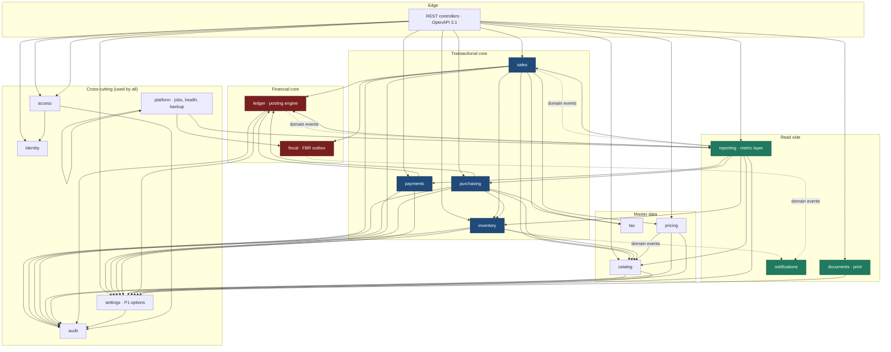
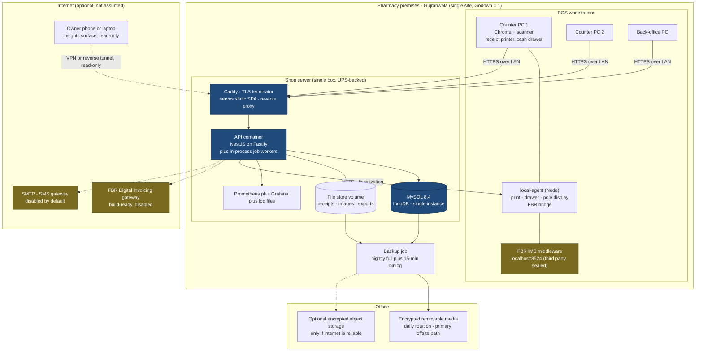

# 17 — Technical Blueprint (New System)

**Document purpose.** This is the **engineering constitution** for the replacement of WASEELA ABUZAR V3 at Fazal Din PP19: the project structure, the backend framework and ORM decisions with their reasoning, the frontend architecture, and the cross-cutting strategies (money handling, transactions, idempotency, document numbering, authentication, authorization, audit, validation, error handling, reporting, storage, notifications, testing, security, deployment, backup, monitoring, coding standards, branching, environments). It is written to be executable: every recommendation states **what changes, why, how it works, which module owns it, which identified risk it removes, and how it is tested.**

**Analysis stage.** Stage 5 — Modernization Design. Inputs are the completed Stage 1–4 corpus (`02`–`12`) and the binding owner-decision record (`00b`). This document consumes that evidence; it does not re-derive it.

**Scope boundary.** This document specifies *architecture and engineering strategy*. It deliberately stops short of:
- the endpoint-by-endpoint REST contract → `18-api-plan.md`
- the full DDL of the target schema → `19-mysql-schema-blueprint.md`
- test cases and acceptance gates in detail → `20-testing-acceptance-plan.md`
- old-feature → new-feature mapping → `21-feature-traceability-matrix.md`

Where this blueprint fixes a decision those documents must honour (e.g. DECIMAL precisions, the document-numbering table, the audit contract), it is marked **[BINDING]**.

---

## ⚠️ The existing system was NOT modified

Every fact about the legacy system quoted here was obtained read-only during Stages 1–4, under owner decision **D2** (SELECT/metadata only). **No schema was altered, no row written, no stored procedure created, dropped or executed for effect, no preference changed, no binary patched.** The legacy WASEELA ABUZAR V3 installation, its SQL Server database `FazalDinPP19DataBaseV2`, and the pharmacy's daily trading are untouched by this work and will remain so. Nothing in this blueprint is to be applied to the legacy system; it describes a **separate, new system**.

---

## Evidence-label legend

Every material statement carries one of these labels. They describe **strength of evidence**, not importance.

| Label | Meaning |
|---|---|
| **`Verified`** | Read directly from live data, live schema/metadata, stored-procedure source, or a file on disk during Stages 1–4. Cited to a document + section, table.column, procedure, or file path. |
| **`Strongly Inferred`** | Multiple independent evidence sources converge; no single direct read, no competing explanation. |
| **`Unclear`** | Evidence is ambiguous or contradictory. Flagged for human resolution before the affected logic is frozen. |
| **`Missing`** | The capability does not exist. Absence is the finding. |
| **`Deprecated`** | Present but superseded or explicitly disabled. |
| **`Broken/Incomplete`** | Present and reachable but demonstrably does not do what it claims. |
| **`Recommended`** | **A proposal for the NEW system. Never a description of an existing feature.** |

> **Anti-hallucination rule, enforced throughout.** Sections 1–3 of Part 0 describe the *existing* system and carry evidence labels tied to the analysis corpus. **Everything from Part 1 onward is `Recommended` by construction** — it is the design of a system that does not yet exist. Individual `Recommended` labels are still applied at decision points so no sentence can be mistaken for a statement of current fact.

---

## How to read this document

| Audience | Read |
|---|---|
| **Business owner / non-technical reader** | Part 0.2 (what your decisions mean technically), Part 6.1 (the money rule in one paragraph), Part 10 (how "give me every option" becomes software), Part 12 (the decision register), Part 13 (what this removes and what is still open) |
| **Tech lead / architect** | All of it, in order |
| **Backend engineer** | Parts 2–7, 9 |
| **Frontend engineer** | Parts 3, 8, 9.3–9.4, 10.4 |
| **Data/migration engineer** | Parts 5, 6, 7.6, 9.12 |
| **QA** | Parts 6.6, 7, 9.9, 13 |

---
---

# PART 0 — DESIGN INPUTS AND CONSTRAINTS

Architecture is a response to constraints. This part states the constraints precisely, with evidence, so that every later decision can be traced back to one of them. If a recommendation in Parts 1–12 cannot be traced to a row in this part, it is unjustified and should be challenged.

## 0.1 Fixed constraints (set by the client — not open for architectural debate)

| # | Constraint | Consequence for this blueprint |
|---|---|---|
| **C1** | Backend: **Node.js + TypeScript** | Framework choice is *within* Node (Part 4). Runtime-level alternatives (Go, .NET, JVM) are out of scope. |
| **C2** | Frontend: **React + TypeScript** | Component-library and state choices are *within* React (Part 8). |
| **C3** | Database: **MySQL 8** | Rules out PostgreSQL-only features (partial indexes, `NUMERIC` unbounded, `SKIP LOCKED` semantics differ, LISTEN/NOTIFY, rich JSON operators). Drives the ORM evaluation (Part 5) and the concurrency design (Part 7). |
| **C4** | **REST API** | No GraphQL, no tRPC-as-the-public-contract. OpenAPI 3.1 is the contract artefact (`18-api-plan.md`). |
| **C5** | **Prefer a well-structured modular monolith.** Avoid microservices unless evidence demands them. | Part 2 tests this against the evidence and confirms it. |
| **C6** | **Accessibility (WCAG 2.2 AA) is the client's stated #1 product feature**, not an add-on. | Drives the component library (8.7), the data-grid strategy (8.8), the charting library (8.9), the error-handling contract (9.4), and the definition of done (9.9). A11y failures are release blockers, not backlog items. |
| **C7** | Users include **shop owners, cashiers, warehouse staff and people with limited computer experience**, on **desktop, tablet and mobile**. | Three front-end surfaces (8.10), plain-language errors (9.4), plain-language admin settings (10.4). |
| **C8** | Currency **PKR** only (**D4**) | No multi-currency in v1. The legacy `ConversionRate numeric(11,5)` columns (`07` §11) are carried as a *dormant capability shape*, not built. |

## 0.2 Binding owner decisions → architectural consequences

`Verified` source: `00b-owner-decisions-and-requirements.md`. The middle column restates the decision; the right column is the **`Recommended`** technical consequence this blueprint commits to.

| Decision | What the owner decided | Architectural consequence **[BINDING]** |
|---|---|---|
| **D1** | Pharmacy business in full, incl. tax + FBR fiscalization. Non-pharmacy verticals catalogued, deferred, never silently dropped. | 17 backend modules built (2.3); deferred verticals live in a machine-readable `deferred-modules.yaml` registry with their legacy evidence, so "catalogued but deferred" is a repo artefact, not a memory. No dead code for them. |
| **D3** | Only 2025-01-01 → 2026-07-31 migrates. | Migration tooling is a **one-shot ETL**, not a sync engine. No bidirectional adapters, no SQL Server driver in the production runtime. |
| **D4** | PKR. | Single-currency money type; no FX table in v1 (6.2). |
| **D5** | Walk-in cash sales; no AR needed. | `customers` module is a thin master-data module; the aging/receivables engine (`07` §6) is **not** built in v1. Credit-sale *option* exists but ships admin-disabled (P1). |
| **D6** | No cash vouchers anywhere. The operated system is a trading ledger. | The GL module ships with a **manual journal capability that is disabled by default** and an accountant-gated enable switch. We do not pretend the business runs double-entry today. |
| **D7 / R1** | Keep all 30,052 items, all visible by default, visibility 100% admin-configurable. | Visibility is a **query-time filter over saved rules**, never a data mutation (10.8). Row-hash proof test (`00b` R1 AC-4) is a mandatory test. |
| **D8 / R2** | Port the trading ledger as-is; then ADD expenses, cash/bank book, supplier payments, plain-language profit statement. | The `payments` module (2.3 #11) is new and additive. **R2.7** ("never break the trading ledger") becomes a regression gate: the golden-replay suite (6.6) must reproduce legacy sale/purchase/return postings byte-for-byte *before* any R2 feature merges. |
| **D9 / P1** | Never hardcode a business assumption. Every realistic option offered, user-selectable, admin-curatable. Options are data, not code. | Part 10 in full. A dedicated `settings` module, an `option_set`/`option_value` schema, a typed registry, an in-process cache with a version stamp, and a lint rule banning business enums in code. |
| **D10 / R3** | All financial opening balances start at ZERO. Legacy balances archived, never imported. | Migration writes **no** opening-balance GL rows for cash/bank/suppliers/customers/equity. Legacy figures land in a read-only `legacy_archive` schema. |
| **D11 / R3.3** | Physical stock carries over unchanged (qty, batch, cost). | The stock-movement ledger is seeded with one `OPENING` movement per (item, batch, expiry) from `GodownDetail`, carrying `Item.AvgPrice` — the one place where migration writes a balance. |
| **D12 / R4** | Real batch + expiry tracking is Tier-1. | `expiry_date` becomes a real `DATE` column (fixing the `datetime`-as-key landmine, `06` §5.6 D2); FEFO is a first-class allocation service; the `2030-12-12` sentinel is **not** carried forward as a real date (10.8 / 7.2). |

## 0.3 The nine technical facts that drive every choice

These are the load-bearing findings from Stages 1–4. Each one directly causes a design decision later in this document.

| # | Fact | Label | Evidence | Drives |
|---|---|---|---|---|
| **T1** | **No application source code exists.** 122 compiled `.pbd` binaries; business logic lives in ~643 stored procedures. The **interactive POS commit path is not in SQL at all** — no stored procedure produced the 291,361 live invoices; it is DataWindow update logic inside the compiled binary. | `Verified` | `03` §Evidence sources E3/E9; `05a` §4.5 | **7.2** — the sale commit must be re-implemented as one explicit, readable, testable server-side transaction. This is the single largest specification risk in the project. |
| **T2** | **Zero `float`/`real` columns exist** in 11,414 columns. All 2,094 numeric columns are exact `numeric(p,s)`. But the **same concept is declared at three different scales** across tables (`SalePrice` at (12,2), (15,2), (15,4)). | `Verified` | `06` §5.2, §5.4 (M1) | **Part 6** — the legacy avoided the classic float catastrophe; JavaScript's `Number` re-introduces it. DECIMAL end-to-end + four archetypes. |
| **T3** | **Document numbers come from a hand-rolled counter table** `_TABMAXKEY` using `WITH (UPDLOCK HOLDLOCK)`, at 136 call sites. **MySQL has no `UPDLOCK`**; under default REPEATABLE READ a naive port issues duplicate invoice numbers. Seeding hazard: `_HeaderTabMaxKey`(Module 1) = 880,542 > `_TABMAXKEY.SaleLedger` = 880,233. | `Verified` | `06` §8.5, MR-1, MR-2 | **7.6** — `doc_counter` with `FOR UPDATE`, `GREATEST()` seeding, ≥20-session concurrency test as a go-live gate. |
| **T4** | **The GL is a rebuildable cache, not a journal.** No `sp_Post*` procedure writes a ledger row; all 15 only flip `Posted='Y'`. `SP_VirtualGL` materialises the ledger **on every balance enquiry**, under `TABLOCKX` on a 1.02M-row table. And `AutoPurgeVirtualGL='Y'` **truncates the entire general ledger** with no confirmation. | `Verified` | `07` §3.1, §3.5 | **7.8** — GL entries become immutable rows written synchronously inside the posting transaction. No rebuild, no truncate switch, no read-mutates-write. |
| **T5** | **The books record money in but never money out.** Suppliers credited 186,197,682 / debited 3,526,552 (all purchase returns). Cash debited 234,003,081 / credited 19,691,239 (all sale returns). MARKETING/ADMIN EXPENSES, PAYROLL, CASH AT BANK, COST OF SALES: **zero** entries in 19 months. Gross profit **is** trustworthy. | `Verified` (F1) | `00b` F1; `07` §15.3 | **2.3 #11** — a new `payments` module; **D10** zero opening balances; the profit statement is rebuilt on the canonical metric layer, never on the legacy `sp_IncomeStatement` (which is `Broken/Incomplete`: `10` §1.2 finding 2). |
| **T6** | **Reporting is half the system.** 240 of 483 rights are reports; 197 report leaves deployed; 3,015 DataWindows; 1,080 parameter windows. Every server-side report writes into **two global, un-keyed scratch tables** (`ReportData`, `CrossTab_ReportData`) that begin with `DELETE`/`TRUNCATE` — two concurrent users corrupt each other's output. | `Verified` | `10` §1.1, §1.2 finding 1 | **9.6** — reporting is a first-class module with a canonical metric layer, a report registry, and zero server-side scratch state. |
| **T7** | **Batch/expiry is switched off in practice.** 96%+ of stock rows carry batch `'.'`; 99%+ carry a far-future sentinel; `ItemBatches`, `ItemBatchPricing`, `ExpiryIntimation` are all empty; `DefaultExpiry = 2030-12-12` silently hides items from expiry reports for years; **57 expired batches still hold positive stock**. | `Verified` (F2) | `00b` F2; `08` §10; `03` T1-04 | **D12/R4** implementation: real `DATE` expiry, FEFO allocation service, admin-configurable warn/block/allow guardrail, scan-to-capture. |
| **T8** | **There is no server-side authentication or authorization.** Passwords are plaintext; the app connects as `sa`; group *policy* fields (discount limits, value limits) are enforced only in the client; `xp_cmdshell` and OLE Automation are enabled; `SP_MyExecuteLocal` executes arbitrary SQL. Audit coverage: `ItemLog` (110,329 rows) and `DeletedSaleItem` (235,887) exist; **login, permission change, price change, posting, export, and deletion of documents are not audited**. | `Verified` | `09` Parts F, G.2, H; `11` §9 | **9.1, 9.2, 9.5, 9.10** — argon2id, server-side deny-by-default RBAC with server-enforced numeric limits, append-only dual audit, least-privilege DB account, no OS-shell path. |
| **T9** | **Stock is a snapshot, not a ledger**, and it has been corrupted before. `StockReport` is a 3.2M-row daily snapshot growing ~5,600 rows/day with no PK; movement is reconstructed by differencing. The existence of `SP_RepairBatchWiseCorruptedStock`, `SP_GodownDetail_RepairForZeroDecimal`, `sp_AutoStockVerification` and the `items_corrupted` table is direct evidence of production stock corruption. Costing is **perpetual moving weighted average at item level**, validated 100% against 10,173 live purchase lines. | `Verified` | `03` T1-03; `08` §8.1–8.3 | **7.2, 9.6** — append-only `stock_movement` ledger + a `stock_on_hand` projection maintained in the same transaction, plus a nightly recompute-and-alert reconciliation. Costing algorithm is ported exactly and property-tested. |

## 0.4 Non-functional budget — sizing the system honestly

Right-sizing is an architectural decision, and over-building is a failure mode. These are the real numbers.

| Dimension | Measured (19 months) | Per-day / peak | Label | Evidence |
|---|---|---|---|---|
| Sale invoices | 291,361 | ≈ **511/day**; ~2.13 lines each | `Verified` | `05a` §1, §2.1 |
| Sale-invoice lines | 620,619 | ≈ 1,090/day | `Verified` | `05a` §2.1 |
| Sale returns | 30,704 (8.4% of turnover value) | ≈ 54/day | `Verified` | `05a` §1 |
| Purchase invoices | 6,419 (113,082 lines) | ≈ 11/day, **38.6 lines/order** on POs | `Verified` | `03` T1-05, T1-06 |
| Stock adjustments | 1,542 headers / 11,181 lines | ≈ 3/day | `Verified` | `03` T1-31 |
| GL rows | 1,021,852 | ≈ 1,790/day | `Verified` | `07` §14.3 |
| Stock snapshot rows | 3,215,967 | ~5,600/day | `Verified` | `03` T1-03 |
| Named users | **9** (4 groups) | — | `Verified` | `09` Part D |
| Realistic concurrent sessions | 3–6 counter + 1–2 back office | ≤ **8** | `Strongly Inferred` from per-user invoice counts (`05a` §2.4) | `05a` §2.4 |
| Item master | 30,052 (8,042 ever stocked) | — | `Verified` | `00b` R1 |
| Live stock lots | 6,164 across 6,012 items | — | `Verified` | `03` T1-03 |
| Suppliers / customers | 235 / **2** | — | `Verified` | `03` T1-16/17 |
| Manufacturers | 838 | — | `Verified` | `03` T1-18 |
| Godowns / branches | **1** | — | `Verified` | `03` §2.6 (`GT_Store` → godown 1) |

**Derived engineering budget (`Recommended`):**

| Target | Value | Reasoning |
|---|---|---|
| Sustained write throughput | **< 1 transaction/second** | 511 invoices + 54 returns + ~14 purchase docs per trading day over ~11 hours ≈ **0.015 tx/s average**, ≈ 0.2 tx/s at a 10× lunchtime peak. |
| p95 checkout latency budget | **≤ 400 ms** server-side, excluding the FBR call | A cashier serving a queue; the legacy binary sets the perceived bar. The FBR fiscalization round trip is budgeted separately (7.7) because it is an external dependency. |
| p95 report latency | **≤ 2 s** for operational reports; ≤ 15 s for full-catalogue analytics with a progress indicator | Legacy DataWindow reports are page-image renders; anything slower than the old system will be rejected by users. |
| Data volume at 5 years | ~1.2 M invoices, ~2.6 M lines, ~5 M GL rows, ~10 M stock movements | Linear extrapolation of measured rates. **Comfortably a single MySQL instance on commodity hardware.** |
| Availability target | Business hours, single site. **RPO ≤ 15 min, RTO ≤ 2 h** | Single pharmacy; a 2-hour outage is survivable with a paper fallback, a lost day of sales is not. See 9.12. |

> ### 🔑 The decisive sizing conclusion (`Recommended`)
>
> **This system's difficulty is entirely in correctness, breadth and accessibility — not in scale.** 0.2 transactions per second and 8 concurrent users do not justify distributed anything. Every architectural token available should be spent on **financial exactness, auditability, testability and a11y**, and none on horizontal scalability, eventual consistency, or service decomposition. Part 2 formalises this.

---
---

# PART 1 — SYSTEM CONTEXT

`Recommended` — the new system's boundary, its users, and the external systems it must talk to. External systems are drawn from the `Verified` integration map in `11` §0.

```mermaid
flowchart TB
    subgraph PEOPLE["People"]
        CASH["Cashier / Sales Officer<br/>counter, high keyboard throughput"]
        SHIFT["Shift In-charge<br/>supervision, overrides"]
        PHARM["Pharmacy Manager<br/>pricing, purchasing, catalogue"]
        BUY["Purchase Officer<br/>PO, goods receipt"]
        ACCT["Accountant<br/>payments, expenses, GL"]
        OWNER["Owner / Proprietor<br/>profit, cash, dashboards"]
        ADMIN["System Administrator<br/>users, roles, backups"]
        AUDIT["Auditor<br/>read-only"]
    end

    subgraph SYS["NEW SYSTEM — Pharmacy Management Platform"]
        WEB["React Web Client<br/>3 surfaces: counter · back-office · mobile reporting"]
        API["Node/TypeScript Modular Monolith<br/>REST + OpenAPI 3.1"]
        DB[("MySQL 8<br/>single instance")]
        FILES[("File Store<br/>receipts · item images · exports · backups")]
        WEB -->|HTTPS/JSON| API
        API --> DB
        API --> FILES
    end

    subgraph EXT["External systems and devices"]
        FBRPOS["FBR POS Fiscalization<br/>via local IMS middleware<br/>localhost:8524 · POSID 141973<br/>LIVE — 290,922 invoices"]
        FBRDI["FBR Digital Invoicing gateway<br/>gw.fbr.gov.pk<br/>CONFIGURED, NOT ACTIVATED"]
        SMS["SMS / messaging gateway<br/>DORMANT in legacy"]
        MAIL["SMTP / email<br/>DORMANT in legacy"]
        SCAN["Barcode scanner<br/>GS1 batch+expiry capture"]
        RCPT["Receipt printer · cash drawer<br/>LCD pole display"]
        LABEL["Label / barcode printer"]
        PARTNER["11 pharma distributor<br/>data-export feeds"]
    end

    CASH --> WEB
    SHIFT --> WEB
    PHARM --> WEB
    BUY --> WEB
    ACCT --> WEB
    OWNER --> WEB
    ADMIN --> WEB
    AUDIT --> WEB

    API -->|"HTTP, per-invoice, retried"| FBRPOS
    API -.->|"build-ready, off by default"| FBRDI
    API -.-> SMS
    API -.-> MAIL
    API -->|"scheduled export jobs"| PARTNER
    SCAN --> WEB
    WEB --> RCPT
    WEB --> LABEL

    classDef live fill:#1f7a3d,stroke:#0d3f1f,color:#fff
    classDef dormant fill:#7a6a1f,stroke:#3f3a0d,color:#fff
    class FBRPOS live
    class FBRDI,SMS,MAIL dormant
```



**Reading the diagram.** Solid arrows are integrations that must work on day one. Dashed arrows are capabilities that exist in the legacy product but are **switched off at this deployment** (`Verified`: `ConfigSetting` all nine = `'N'`, `03` §2.5) — they are built as **adapters behind a port with a null implementation**, so enabling them is an admin action (P1.4), not a deployment.

**The one hard external coupling.** FBR POS fiscalization is legally mandatory and currently reaches FBR through a **local, opaque, third-party middleware on `localhost:8524`** backed by a sealed 68 MB `141973.ims` file (`Verified`: `11` §1.2 Path 3). Its vendor, licence and registry configuration are **`Unclear`** and must be obtained from the customer's production machine before go-live. This single fact constrains the deployment topology (Part 11) more than any performance requirement does.

---
---

# PART 2 — ARCHITECTURE STYLE: THE MODULAR MONOLITH

## 2.1 Why a modular monolith, tested against this system's evidence

C5 sets the preference; the evidence must justify it. Microservices are warranted when at least one of five forces is present. Here is the honest test:

| Force that would justify microservices | Present here? | Evidence |
|---|---|---|
| **Independent scaling axes** — one component needs 100× the resources of another | **No.** Peak ≈ 0.2 tx/s, ≤ 8 concurrent users, single site. Reporting is the heaviest workload and is a read-only query concern solved by read models and indexes, not by a separate service. | `05a` §1, `09` Part D, 0.4 above |
| **Independent deployment by separate teams** | **No.** One small team, one customer, one site. | Project context |
| **Technology heterogeneity** — a component genuinely needs a different runtime | **No.** C1–C4 fix the stack. The only foreign-runtime need is the FBR fiscal bridge, and that is a *sidecar adapter* (Part 11), not a business service. | C1–C4; `11` §1.2 |
| **Fault isolation** — one component's failure must not stop the rest | **Partially, in one place only.** FBR fiscalization must not block the till when the gateway is down. Solved by an **outbox + retry worker inside the monolith** (7.7), not by a service boundary. | `11` §1.1 (439 unfiscalized invoices show the legacy already tolerates this) |
| **Transactional independence** — components rarely need to commit together | **The opposite is true, and decisively.** A single sale must atomically: allocate FEFO batches, decrement stock, write stock movements, write the invoice header+lines, allocate an invoice number, write GL entries, write the audit record, and enqueue fiscalization. Splitting these across services converts one ACID transaction into a saga with compensations — **in a domain where the legacy system's #1 latent defect is already a missing `BEGIN TRANSACTION`** (`Verified`: `05a` §4.6 — on mid-loop failure the header and lines remain and stock stays decremented). | `05a` §4.5–4.6; `07` §3 |

> ### Decision D-01 **[BINDING]** `Recommended`
> **Build a modular monolith: one deployable Node process, one MySQL database, hard internal module boundaries.** Microservices would import distributed-transaction complexity into the exact domain where the legacy system's worst defect is *insufficient* transactionality. The only genuine fault-isolation requirement (FBR) is met by a transactional outbox.
>
> **Revisit trigger (write it down now so it is not a matter of opinion later):** decompose only if *(a)* a second pharmacy branch goes live and needs independent uptime, **or** *(b)* sustained write throughput exceeds 50 tx/s, **or** *(c)* a second team owns a distinct bounded context end-to-end. None of these is on the horizon (`Verified`: `Godown` = 1 row, `AllowCRSDataTransfer='N'`, 9 users).

**The failure mode we are guarding against is not "monolith".** It is **"big ball of mud"** — which is precisely what the legacy is: 762 tables, 643 procedures, a 148-column `Item` table, a 143-column `SaleLedger`, and a 105-column `Purledger` (`Verified`: `03` T1-01, `05a` §2.1, `03` T1-05). Modularity is therefore not decoration; it is the specific defect being corrected. Section 2.5 makes the boundaries mechanically enforced rather than aspirational.

## 2.2 Layering rules

`Recommended`. Four layers, one direction of dependency. Enforced by lint (2.5), not by discipline.

```
HTTP  ─────────────────────────────────────────────────────────────────────
  Controller        Nest controller. Parses/validates DTO (Zod), resolves the
  (thin)            actor, calls exactly one application service, maps the
                    result to a response. NO business logic. NO SQL. NO money maths.
    │
    ▼
  Application       Use-case orchestration. OWNS THE TRANSACTION BOUNDARY.
  Service           Enforces permissions and role limits. Emits domain events.
                    Idempotency lives here. This is where "post a sale" is written
                    end-to-end and can be read top-to-bottom by a new engineer.
    │
    ▼
  Domain            Pure TypeScript. Entities, value objects (Money, Quantity,
  (pure, no I/O)    BatchRef), invariants, the pricing resolver, the FEFO
                    allocator, the moving-average cost calculator, the posting
                    rules. NO framework imports. NO database imports.
                    100% unit-testable with zero infrastructure.
    │
    ▼
  Infrastructure    Repositories (Drizzle), the report query modules (raw SQL),
                    the FBR client, the file store, the mailer, the clock.
                    Implements ports declared by the domain/application layers.
```

**Why this exact shape, for this system.** The legacy has *no* separable domain layer: the pricing precedence chain is spread across ≥10 stored procedures with `Unclear` resolution order (`Verified`: `03` T1-02 problem 2), and the invoice-total formula lives in `fn_getSaleInvTotal` while the *actual* commit lives in a compiled binary nobody can read (`Verified`: `05a` §4.3, §4.5). Pulling the calculation rules into a pure, dependency-free domain layer is what makes the single most important porting risk (T1) **testable**: the moving-average formula, the tax cascade, the discount precedence and the FEFO order become functions you can drive with 113,561 historical purchase lines and 620,619 sale lines and compare to the legacy result (6.6).

**Explicitly rejected:** a "service + repository" two-layer shape where services hold both orchestration and calculation. It works until money maths and transaction management interleave, at which point the rounding rules become untestable without a database. Given T2 and 6.6, that is unacceptable here.

## 2.3 Module boundaries, derived from the module catalogue

`Recommended`. Boundaries are derived from `03-module-catalog.md` Tier 1 by grouping modules that **share a transactional consistency requirement or a master-data owner**, and splitting those that do not. Every module names the legacy T-codes it absorbs so `21-feature-traceability-matrix.md` can be built mechanically.

| # | Module | Owns (aggregate roots) | Absorbs legacy | Why this boundary |
|---|---|---|---|---|
| 1 | **`identity`** | `app_user`, `user_session`, credentials, MFA | T1-28 (part) | Authentication is orthogonal to every business module and must be swappable (e.g. future SSO) without touching business code. |
| 2 | **`access`** | `role`, `permission`, `role_permission`, `user_role`, `role_scope`, `role_limit` | T1-28 (part) | Authorization data changes on a different cadence than identity and is consumed by *every* module through one guard. Splitting it from `identity` prevents the legacy's fusion of "who you are" with "what you may do" (`Verified`: `09` §C.2.3 — group policy fields exist but are never enforced server-side). |
| 3 | **`catalog`** | `item`, `manufacturer`, `item_category/class/type`, `generic`, `item_note`, `item_alert`, visibility rules | T1-01, T1-18, T1-37, T1-39 (item half), R1 | One owner for the 30,052-item master. Splits the 148-column `Item` table into a core + extension tables (`03` T1-01 recommendation). |
| 4 | **`pricing`** | `price_list`, `price_rule`, `discount_rule`, `promotion`, the **price resolver** | T1-02 | Pricing is a *decision engine*, not CRUD. Isolating it lets the resolution chain be exhaustively tested and lets any invoice line explain its price (`03` T1-02 recommendation: emit a `price_resolution_trace`). |
| 5 | **`inventory`** | `stock_lot`, `stock_movement` (append-only), `stock_on_hand` (projection), `stock_adjustment`, `stock_take`, FEFO allocator, moving-average cost engine | T1-03, T1-04, T1-04b, T1-31, T1-32, T1-33 (deferred), R4 | The single source of truth for physical goods. All four transaction modules call into it through one port, so the "how does stock change?" question has exactly one answer — the opposite of today's six stock-availability procedures and three repair procedures (`Verified`: `03` T1-03). |
| 6 | **`purchasing`** | `supplier`, `purchase_order`, `goods_receipt`/`purchase_invoice`, `purchase_return` | T1-05, T1-06, T1-07, T1-17 | Supplier-facing document lifecycle, three-way matching, and the one place inbound cost enters the system (drives moving average). |
| 7 | **`sales`** | `sale_invoice`, `sale_return`, `sale_template`, `removed_line_log`, POS session | T1-08, T1-09, T1-10, T1-13, T1-15, T1-16, T1-11/12/14 (deferred) | The highest-volume, highest-risk write path (T1). Isolated so the commit transaction is one readable file. |
| 8 | **`tax`** | `tax_schedule`, `pct_code`, `tax_category`, the tax calculator | T1-23 | Statutory rules change independently of everything else and must be versioned by effective date — a capability the legacy lacks. |
| 9 | **`fiscal`** | `fiscalization_request` (outbox), FBR POS adapter, FBR DI adapter (build-ready, off) | T1-24, T1-25 | Legally mandatory, externally dependent, must not block the till, must store request/response verbatim for reprints. Deserves its own failure domain *inside* the monolith. |
| 10 | **`ledger`** | `account`, `account_hierarchy`, `gl_entry` (immutable), `posting_period`, the posting engine | T1-20, T1-22 | The correctness core. Nothing writes `gl_entry` except this module, through a single `PostingService.post(journal)` API that validates Dr = Cr before insert. Removes T4 permanently. |
| 11 | **`payments`** | `supplier_payment`, `expense`, `cash_account`, `bank_account`, `cash_count`, transfers | **NEW** — R2.1–R2.6 | The money-out half of the business that has never been recorded (T5). New module, additive, cannot alter existing posting behaviour (R2.7). |
| 12 | **`reporting`** | metric layer (SQL views/functions), report registry, filter schemas, export pipeline, dashboards | T1-26, T1-27, T1-42 | 49.7% of the permission surface (T6). Read-only by construction: this module has **no write access** to business tables. |
| 13 | **`settings`** | `option_set`, `option_value`, `setting`, `setting_scope`, the P1 registry and cache | T1-29, D9/P1 | The technical home of P1. Every other module reads options from here; none defines its own enum. |
| 14 | **`audit`** | `data_change_audit`, `security_audit` (both append-only) | T1-15, T1-39 | Append-only, separately permissioned, retained 7 years. Isolating it prevents any business module from being able to rewrite history. |
| 15 | **`documents`** | print templates, receipt/A4/A5/thermal renderers, barcode & label generation, PDF | T1-30, T1-41 | 5 alphabetically-partitioned print libraries and client-branded layouts in the legacy (`Verified`: `04` §8 "the maintainability bomb"). One renderer + data-driven templates replaces them. |
| 16 | **`notifications`** | channel adapters (in-app, email, SMS, push), templates, digests, alert rules | T2-16, T2-17, R4.2 | Channels are P1 options; the legacy hardcodes 7 Pakistani SMS gateways in a binary (`Verified`: `11` §3.6). |
| 17 | **`platform`** | job queue, scheduler, health, backup orchestration, migration & reconciliation tooling, feature registry | T1-36, T2-31 | Operational concerns that must not be smeared across business modules. |

**Shared kernel** (`packages/shared`, imported by everything, depends on nothing): `Money`, `Quantity`, `Percent`, `Decimal` configuration, `Result`/error taxonomy, `Clock`, `Id` types, pagination and sort primitives, and the Zod contract schemas shared with the frontend.

**Deferred-but-catalogued (D1).** Tier 2 verticals — hospital/patient, e-prescription, lab/services, school, HR/payroll, hotel, manufacturing, packing, multi-branch CRS, Waseela Mini, DropBox, DataCarry, loyalty, contact/CRM, installments, garments, item conversion, vehicles, customer licences — are **not built**. They are recorded in `docs/deferred-modules.yaml` with their legacy evidence (table names, row counts, `.pbd` libraries, rights) so the promise "catalogued but never silently dropped" is a versioned artefact. `Verified` basis: `03` Tier 2 table.

## 2.4 Backend module dependency diagram



**The rules encoded in that graph (`Recommended`, **[BINDING]**):**

| Rule | Statement | Why |
|---|---|---|
| **B1** | **`ledger` depends on nothing but `settings` and `audit`.** Sales/purchasing/payments call *into* it; it never calls back. | Keeps the correctness core free of business churn. Any change to posting rules is reviewed in one place. |
| **B2** | **Only `ledger` may write `gl_entry`.** Only `inventory` may write `stock_movement` / `stock_on_hand`. Only `audit` may write audit tables. | Directly removes T4 and T9. Enforced by MySQL grants as well as code (9.10). |
| **B3** | **`reporting` has read-only database credentials** and may not import any other module's services — only its own SQL. | Removes T6's whole class of defect. A report can never mutate state (the legacy's `SP_VirtualGL` mutates on read; `sp_init_update_tabmaxkey` truncates two tables). |
| **B4** | **No module reads another module's tables directly.** Cross-module reads go through the owner's public service interface, or — for reporting only — through a **published, versioned SQL view** the owning module declares as part of its contract. | Prevents the schema from re-fusing into 762 mutually-entangled tables. |
| **B5** | **Cross-module side effects that must not be lost use the transactional outbox**, not direct calls (fiscalization, notifications, partner exports). Cross-module side effects that *may* be lost use the in-process event bus (cache invalidation, projections that can be rebuilt). | Explicit durability semantics per effect, instead of the legacy's implicit "it happens when someone asks for a balance". |
| **B6** | **`settings` may not depend on any business module.** Options are data; the registry is typed but generic. | Prevents P1 from becoming a circular dependency. |

## 2.5 Enforcing the boundaries mechanically

`Recommended`. Boundaries that are only in a document decay. Four enforcement layers:

1. **NestJS module graph.** Each business module is a `@Module` that exports only its public services. Anything not exported is unreachable at runtime — a compile-time-adjacent guarantee that costs nothing.
2. **`eslint-plugin-boundaries`** with an element type per module and an explicit allow-list matching the table in 2.4. A violating import fails CI.
3. **`dependency-cruiser`** in CI producing a rendered graph artefact per PR, so boundary drift is visible in review, plus a hard rule banning any import of `infrastructure/*` from `domain/*`.
4. **Database grants.** The application connects with the least-privileged account that can do its job (9.10). `reporting` uses a **second, read-only connection pool**. `gl_entry`, `security_audit` and `data_change_audit` have **no UPDATE and no DELETE grant** for the application user at all — immutability enforced by the database, not by intent.

**Risk removed:** the architectural drift that produced a 148-column `Item`, a 143-column `SaleLedger`, 20 purchase-expense-account *columns* (`Verified`: `03` T1-05 problem 1), and parallel `*Mod`/`*Dump`/`*Log` clone table families (`Verified`: `06` §6.5).

**How it is tested:** CI job `arch:check` runs ESLint boundaries + dependency-cruiser and fails the build; an integration test asserts that the reporting pool's user receives `ER_TABLEACCESS_DENIED_ERROR` on `INSERT INTO sale_invoice`.

---
---

# PART 3 — PROJECT STRUCTURE

## 3.1 Repository layout

`Recommended`. A single repository (monorepo) with **pnpm workspaces** + **Turborepo** for task orchestration and caching. One repo because the API contract, the Zod schemas and the money value objects are shared between backend and frontend, and a split repo would force versioned publishing of those for a single-customer product — pure overhead.

```
pharmacy-platform/
├─ apps/
│  ├─ api/                          # the modular monolith (NestJS on Fastify)
│  │  ├─ src/
│  │  │  ├─ main.ts                 # bootstrap, Fastify adapter, graceful shutdown
│  │  │  ├─ app.module.ts           # imports the 17 feature modules
│  │  │  ├─ common/                 # guards, interceptors, filters, pipes, decorators
│  │  │  │  ├─ auth/                # session guard, actor resolution
│  │  │  │  ├─ authz/               # @RequirePermission, @RequireLimit guards
│  │  │  │  ├─ txn/                 # @Transactional + AsyncLocalStorage unit-of-work
│  │  │  │  ├─ idempotency/         # Idempotency-Key interceptor
│  │  │  │  ├─ audit/               # audit interceptor + explicit audit API
│  │  │  │  ├─ errors/              # exception filter → RFC 9457 problem+json
│  │  │  │  └─ validation/          # Zod pipe, shared with packages/contracts
│  │  │  └─ modules/
│  │  │     ├─ identity/            #  ┐
│  │  │     ├─ access/              #  │
│  │  │     ├─ catalog/             #  │  each module has the SAME internal shape:
│  │  │     ├─ pricing/             #  │
│  │  │     ├─ inventory/           #  │    <module>/
│  │  │     ├─ purchasing/          #  │      <module>.module.ts     Nest wiring
│  │  │     ├─ sales/               #  ├─     api/                   controllers + DTO
│  │  │     ├─ tax/                 #  │      application/           use-case services (tx boundary)
│  │  │     ├─ fiscal/              #  │      domain/                pure entities, VOs, rules
│  │  │     ├─ ledger/              #  │      infrastructure/        repositories, adapters
│  │  │     ├─ payments/            #  │      events/                domain events emitted
│  │  │     ├─ reporting/           #  │      index.ts               THE public surface
│  │  │     ├─ settings/            #  │
│  │  │     ├─ audit/               #  │
│  │  │     ├─ documents/           #  │
│  │  │     ├─ notifications/       #  │
│  │  │     └─ platform/            #  ┘
│  │  └─ test/                      # integration + e2e (Testcontainers MySQL)
│  │
│  └─ web/                          # React + Vite client
│     ├─ src/
│     │  ├─ app/                    # router, providers, error boundaries, shell
│     │  ├─ surfaces/
│     │  │  ├─ counter/             # keyboard-first dispensing + POS
│     │  │  ├─ backoffice/          # purchasing, catalogue, accounting, admin
│     │  │  └─ insights/            # responsive dashboards + reports (mobile-friendly)
│     │  ├─ features/               # one folder per feature slice, mirrors API modules
│     │  ├─ components/             # design system: RAC primitives + Tailwind
│     │  ├─ lib/                    # api client, query keys, money, formatting, i18n
│     │  └─ a11y/                   # focus manager, live-region announcer, skip links
│     └─ e2e/                       # Playwright + axe-core
│
├─ packages/
│  ├─ contracts/                    # Zod schemas + inferred TS types = THE API contract.
│  │                                #   Consumed by api (validation) AND web (forms/types).
│  │                                #   OpenAPI 3.1 is generated FROM these.
│  ├─ money/                        # Money/Quantity/Percent value objects over decimal.js.
│  │                                #   The ONLY place arithmetic on money is allowed.
│  ├─ db/                           # Drizzle schema, migrations, seeds, db test helpers
│  │  ├─ schema/                    # one file per module, re-exported
│  │  ├─ migrations/                # generated SQL, hand-reviewed, committed
│  │  └─ seed/                      # reference data + P1 option seeds
│  ├─ reports/                      # versioned SQL report modules + filter schemas
│  └─ config/                       # shared tsconfig, eslint, prettier, vitest presets
│
├─ tools/
│  ├─ migration/                    # ONE-SHOT SQL Server → MySQL ETL (D3) + reconciliation
│  ├─ replay/                       # golden-invoice replay harness (6.6)
│  └─ fiscal-agent/                 # small local service replacing fiscalizationapp.exe
│
├─ docs/
│  ├─ adr/                          # architecture decision records (Part 12 seeds these)
│  ├─ deferred-modules.yaml         # D1 promise, machine-readable
│  └─ runbooks/                     # backup/restore, cutover, incident, fiscal outage
│
├─ deploy/
│  ├─ docker-compose.prod.yml
│  ├─ Caddyfile                     # TLS terminator / reverse proxy
│  └─ mysql/my.cnf                  # the [BINDING] server settings from 5.6
│
└─ turbo.json · pnpm-workspace.yaml · .github/workflows/
```

## 3.2 Why this structure, specifically

| Choice | Reasoning tied to this system |
|---|---|
| **Identical internal shape for all 17 modules** | 17 modules × 5 engineers over multiple years. A predictable shape means a new engineer opening `modules/payments/` already knows where the transaction boundary is. It also makes the boundary lint rules expressible as glob patterns. |
| **`packages/contracts` as a separate package** | The frontend must not import backend code, but both must agree on the shape of a sale line down to the decimal scale. One Zod schema, validated server-side (authoritative) and used client-side (fast feedback + form typing). Removes the legacy's total absence of a contract — where the "API" is 643 stored procedures with no signature documentation. |
| **`packages/money` as a separate package** | Makes "money arithmetic outside this package" a **lint-detectable** violation (6.7). Given T2 this is the highest-leverage structural rule in the repo. |
| **`packages/reports` separate from `apps/api`** | 197 legacy report leaves collapse to ~95 modern screens (`10` §10.4). Report SQL is the one place raw SQL is sanctioned; keeping it in a package with its own golden-output test suite prevents it leaking into business services. |
| **`tools/migration` outside `apps/api`** | D3 makes migration one-shot. Shipping a SQL Server driver inside the production API would be a permanent attack surface and dependency for a task that runs once. |
| **`tools/fiscal-agent` separate** | The legacy `fiscalizationapp.exe` is a TCP socket server on port 9111 co-located with the POS (`Verified`: `11` §1.2 Path 2). The replacement must also be co-located because the FBR middleware listens on `localhost:8524`. Keeping it a separate small binary lets the API be relocated later without touching the fiscal path. |
| **`docs/adr`** | Part 12's decision register becomes ADR-001…ADR-0nn on day one so that the *reasons* survive team turnover — the exact failure the legacy suffered (no source, no rationale, vendor gone). |

---
---

# PART 4 — BACKEND FRAMEWORK DECISION

## 4.1 Requirements derived from this system (not from general preference)

Weighted by how much this specific system depends on them.

| # | Requirement | Weight | Why *this* system needs it |
|---|---|---|---|
| **F-R1** | **Enforced module structure** for 17 modules with explicit public surfaces | ★★★★★ | The single defect being corrected is 762-table entanglement (2.1). |
| **F-R2** | **Dependency injection** with per-request scope | ★★★★★ | The transaction/unit-of-work, the actor, the idempotency key and the audit context all need per-request propagation. Without DI these become globals or parameter-threading through every function. |
| **F-R3** | **Declarative cross-cutting concerns** — authz guard, transaction wrapper, idempotency, audit, error mapping | ★★★★★ | Nine roles × 17 modules × deny-by-default (T8). If permission checks are hand-written per handler, some will be forgotten — which is precisely how the legacy ended up with client-side-only limit enforcement (`Verified`: `09` §C.2.3). |
| **F-R4** | **First-class validation** at the edge with typed DTOs | ★★★★☆ | Money and quantity fields must be rejected, not coerced (Part 6). |
| **F-R5** | **OpenAPI 3.1 generation** | ★★★★☆ | C4 + `18-api-plan.md` deliverable + the client is generated from it. |
| **F-R6** | **Maintainability by a small team over years**; conventions a new hire can learn | ★★★★★ | Single-customer product with a long life; the previous system died of unmaintainability. |
| **F-R7** | **Testability** — swap infrastructure without HTTP | ★★★★★ | 6.6's golden replay and 7's concurrency tests must drive application services directly. |
| **F-R8** | **Raw throughput** | ★☆☆☆☆ | 0.2 tx/s peak (0.4). Effectively irrelevant. |
| **F-R9** | **Small dependency surface / low supply-chain risk** | ★★★☆☆ | On-prem deployment at a pharmacy with limited IT support. |
| **F-R10** | **Long-lived, well-supported, hireable** | ★★★★☆ | The vendor-lock lesson (`11` §8.2: PowerBuilder 12.5 from 2011, out of mainstream support). |

## 4.2 Evaluation

| Criterion (weight) | **Express 5** | **Fastify 5** | **NestJS 11** |
|---|---|---|---|
| F-R1 module structure (★★★★★) | ✗ None. Structure is whatever the team invents; drifts under deadline. | △ Plugin encapsulation is a *runtime* isolation mechanism, not a business module system. No exported-surface concept. | ✓✓ `@Module` with explicit `providers`/`exports` is a literal implementation of 2.4's boundary rules. |
| F-R2 DI + request scope (★★★★★) | ✗ None; roll your own or add a container. | ✗ None; `fastify.decorateRequest` is manual. | ✓✓ Built-in IoC with `Scope.REQUEST`, plus `AsyncLocalStorage` interop for the unit-of-work. |
| F-R3 cross-cutting (★★★★★) | △ Middleware only — no typed, ordered guard/interceptor/filter pipeline. | △ Hooks are powerful but untyped w.r.t. handler contracts. | ✓✓ Guards → interceptors → pipes → filters, with deterministic ordering and metadata via decorators. Exactly the five concerns in F-R3. |
| F-R4 validation (★★★★☆) | ✗ BYO | ✓ JSON-Schema validation + serialization built in and fast | ✓ Pipes; `nestjs-zod` gives Zod-native DTOs shared with `packages/contracts` |
| F-R5 OpenAPI (★★★★☆) | ✗ BYO | ✓ `@fastify/swagger` from JSON Schema | ✓✓ `@nestjs/swagger` + Zod bridge; richest metadata |
| F-R6 maintainability (★★★★★) | ✗ Highest long-run entropy | △ Good, but conventions are per-team | ✓✓ Opinionated, documented, consistent across 17 modules |
| F-R7 testability (★★★★★) | △ | △ | ✓✓ `Test.createTestingModule` with provider overrides |
| F-R8 throughput (★☆☆☆☆) | △ ~15k req/s class | ✓✓ ~45k req/s class | △ overhead over its adapter; irrelevant at 0.2 tx/s |
| F-R9 dependency surface (★★★☆☆) | ✓✓ minimal | ✓ small | △ larger (`reflect-metadata`, decorators, several `@nestjs/*`) |
| F-R10 longevity (★★★★☆) | ✓✓ | ✓ | ✓ large ecosystem, commercial backing, wide hiring pool |

**The honest case against NestJS**, stated so the decision is not naive: it is heavier, its decorator/metadata model is magic that must be learned, and on a small CRUD app it is over-engineering. **That case does not apply here.** This is not a small CRUD app — it is 17 modules, 8 roles, server-enforced numeric limits, an immutable ledger, an outbox, idempotent financial POSTs and a 7-year audit obligation. The structural cost of NestJS is paid once; the cost of *not* having F-R1–F-R3 is paid on every one of the ~95 screens.

**The honest case against Fastify-alone:** it wins the only criterion this system does not need (F-R8) and loses the two it needs most (F-R1, F-R2). Choosing it would mean building a bespoke module + DI + guard framework — i.e. building NestJS, badly, while also owning it.

## 4.3 Decision

> ### Decision D-02 **[BINDING]** `Recommended`
> **NestJS 11 running on the Fastify adapter (`@nestjs/platform-fastify`).**
>
> - **Structure and cross-cutting from NestJS** — the `@Module` graph *is* the boundary enforcement of 2.4; guards/interceptors/filters *are* the authz, transaction, idempotency, audit and error strategies of Part 9.
> - **HTTP layer and serialization from Fastify** — an officially supported adapter, materially faster JSON handling and lower memory than Express, and better suited to a modest on-prem box. This is a free win, not a performance requirement.
> - **Zod as the single validation source** via `nestjs-zod`, so `packages/contracts` schemas serve request validation, response typing, OpenAPI generation *and* the React forms (8.6). One definition of "what a valid purchase line is".

**Which module owns it:** `apps/api` bootstrap + `common/`.
**Risk removed:** the class of defect represented by `09` §C.2.3 (`Verified`, `Broken/Incomplete`) — policy that exists as data but is never enforced by the server. With a `@RequirePermission()` guard applied by default and an explicit `@Public()` opt-out, forgetting a permission check becomes impossible rather than merely unlikely.
**How it is tested:** an automated test enumerates every registered route via Nest's `DiscoveryService` and **fails if any mutating route (POST/PUT/PATCH/DELETE) lacks both a permission decorator and an explicit `@Public()` marker.** This test is a release gate.

## 4.4 What we deliberately will NOT use

Guarding against framework maximalism (`Recommended`):

| Not used | Reason |
|---|---|
| Nest microservices / message-transport packages | D-01. |
| CQRS module (`@nestjs/cqrs`) as a global pattern | Command/query separation is applied *only* where it earns its keep: `reporting` reads its own SQL, everything else uses plain services. A full CQRS bus for 17 modules adds indirection without a scaling need. |
| GraphQL | C4. |
| TypeORM (Nest's default pairing) | Part 5. |
| `class-validator` / `class-transformer` | Zod is already the contract language shared with the frontend; two validation systems is one too many. |
| Nest's built-in cache-manager with Redis | 9.6 / Part 11 — the settings cache is in-process with a version stamp; no Redis in v1. |
| Global request-scoped providers | Request scope forces a new instance graph per request; used only for the unit-of-work and actor context, via `AsyncLocalStorage`, not broadly. |

## 4.5 Runtime and version policy

`Recommended`. Pin at project start; the lines below are current as of 2026-08 and each has active LTS/maintenance.

| Component | Line | Note |
|---|---|---|
| Node.js | **22 LTS** (or the LTS current at kickoff) | Native `AsyncLocalStorage` performance, stable `node:test` not required (Vitest used), long support runway. |
| TypeScript | **5.x**, `strict: true`, `noUncheckedIndexedAccess`, `exactOptionalPropertyTypes` | 9.14. |
| NestJS | **11.x** on `@nestjs/platform-fastify` | D-02. |
| MySQL | **8.4 LTS** | C3; LTS line, `FOR UPDATE SKIP LOCKED` (needed by 9.7's DB-backed queue), `utf8mb4_0900_ai_ci`. |
| Package manager | **pnpm** + Turborepo | Strict node_modules layout catches undeclared dependencies — relevant to boundary enforcement. |

**Upgrade policy (`Recommended`):** dependencies are updated on a scheduled cadence (monthly patch, quarterly minor) with the full test suite as the gate; majors are ADR'd. The explicit anti-goal is the legacy outcome: a 2011 runtime, unsupported, with a 32-bit-only dependency chain (`Verified`: `11` §8.2).

---
---

# PART 5 — DATABASE ACCESS AND ORM DECISION

## 5.1 Requirements derived from this system

| # | Requirement | Weight | Why *this* system needs it |
|---|---|---|---|
| **O-R1** | **Exact DECIMAL handling with no silent float conversion**, in reads, writes and raw queries | ★★★★★ | T2. This is the single hardest requirement and disqualifies any tool that eagerly converts `DECIMAL` to JS `number`. |
| **O-R2** | **Explicit multi-statement transactions** with the ability to issue `SELECT … FOR UPDATE` inside them | ★★★★★ | T3 (counter allocation) and 7.2 (sale commit: ~8 statements + locks, one atomic unit). |
| **O-R3** | **First-class, composable, parameterised raw SQL** with typed results | ★★★★★ | T6. ~95 report screens, a canonical metric layer, `GROUPING SETS`/window functions, and the deliberate rejection of ORM-generated report queries. |
| **O-R4** | **Reviewable SQL migrations**, versioned in git, that can express MySQL-specific DDL | ★★★★★ | The target schema needs generated columns, prefix indexes on `varchar(255)` names, per-column collations, `CHECK` constraints, fulltext search for the 30,052-item typeahead, and (later) partitioning of `stock_movement`. A declarative DSL that cannot express these forces out-of-band DDL — the worst of both worlds. |
| **O-R5** | **Type safety without codegen ceremony** | ★★★★☆ | Small team; schema will churn during the build. |
| **O-R6** | **Thin runtime, deployable on a shop PC** | ★★★☆☆ | On-prem single box (Part 11); every extra long-running process is another thing to monitor and restart. |
| **O-R7** | **Longevity / maintenance health** | ★★★★☆ | F-R10. |
| **O-R8** | **Does not own the domain model** — no active-record leakage into business rules | ★★★★☆ | 2.2's pure domain layer requires plain objects, not framework entities. |

## 5.2 Evaluation

| Criterion | **Prisma** | **Drizzle** | **TypeORM** | **Sequelize** |
|---|---|---|---|---|
| **O-R1 DECIMAL** | ✓ `Decimal` fields surface as `Prisma.Decimal` (decimal.js). Safe on the model path. On `$queryRaw` the mapping is driver-dependent and must be asserted per query. | ✓✓ `decimal()` columns return **`string`** from `mysql2` by default — the safest possible primitive: nothing is interpreted until *we* interpret it. Raw `sql` results are strings too, uniformly. | △ Returns `string` for MySQL decimals, but transformer behaviour differs by column type and version; a long history of subtle coercion issues. | △ Returns `string`; typing is weak so an accidental `Number()` is not caught at compile time. |
| **O-R2 transactions + FOR UPDATE** | △ Interactive `$transaction(cb)` exists but has a default timeout and pushes `FOR UPDATE` into `$queryRaw`, splitting one logical operation across two APIs. The Rust query engine also manages the pool, reducing our control over lock behaviour. | ✓✓ `db.transaction(async tx => …)` maps to one `mysql2` connection; `.for('update')` is a builder method; raw SQL inside the same `tx` is trivial. | ✓ `QueryRunner` + `setLock('pessimistic_write')`; verbose. | ✓ `transaction` + `lock` option; verbose, weakly typed. |
| **O-R3 raw SQL** | △ `$queryRaw` is parameter-safe but composition is awkward and the return typing is manual. Fighting the client on 95 report queries is a daily tax. | ✓✓ The `sql` template tag is composable (`sql.join`, fragments), parameterised by construction, and returns typed rows. Report modules read like SQL, because they are SQL. | ✓ `query()` works; no composition helpers. | ✓ `sequelize.query`; no composition helpers. |
| **O-R4 migrations / MySQL DDL** | △ Excellent workflow, but the Prisma schema language cannot express several DDL features we need; escape hatches exist but split the source of truth. | ✓✓ `drizzle-kit generate` emits **plain SQL files** that we review, edit and commit. Hand-written DDL is first-class, not an escape hatch. | △ Auto-sync is dangerous; generated migrations are TS with historically flaky diffs. | △ Migrations are hand-written JS; no diffing. |
| **O-R5 type safety** | ✓✓ Best-in-class generated client. | ✓✓ Types inferred directly from the schema definition; no codegen step to forget. | △ Decorator-based, weaker inference. | ✗ Weakest. |
| **O-R6 runtime footprint** | △ Ships a **Rust query engine binary** per platform: extra process/memory, platform-specific artefacts, more to go wrong on a Windows shop PC. | ✓✓ A thin TypeScript layer over `mysql2`. Nothing extra to deploy. | ✓ Pure JS | ✓ Pure JS |
| **O-R7 longevity** | ✓✓ Large company, huge adoption. | ✓ Rapid adoption; **younger, faster-moving API** — the real risk here. | △ Maintenance has been intermittent; large open-issue backlog. | ✓ Very mature but legacy-feeling. |
| **O-R8 domain purity** | ✓ Data-mapper-ish; models are plain objects. | ✓✓ Query builder only — it has no opinion about your domain at all. | ✗ Active-record/data-mapper hybrid with decorated entity classes that tend to leak into business code. | ✗ Active-record. |

**Where each loses, concretely:**

- **Sequelize** — fails O-R5 outright and is weakest on O-R1's *compile-time* protection. With T2 as the top risk, a library that cannot make `salePrice * qty` a type error is not a candidate.
- **TypeORM** — the active-record/entity-decorator model directly conflicts with O-R8 and 2.2's pure domain layer, and its historical correctness record around transactions and decimals is exactly the wrong risk profile for a financial port.
- **Prisma** — genuinely strong, and the closest runner-up. It loses on the combination of O-R3 + O-R4 + O-R6: this system is **SQL-heavy by nature** (T6: reporting is half the product; the metric layer in `10` §10.2 is 12 canonical SQL definitions), needs **DDL Prisma's DSL cannot fully express**, and deploys to a single on-prem box where an extra native engine binary is a liability. Choosing Prisma would mean writing most of the important queries in `$queryRaw` anyway — paying Prisma's costs without using its benefits.

## 5.3 Decision

> ### Decision D-03 **[BINDING]** `Recommended`
> **Drizzle ORM over the `mysql2` driver**, with:
> 1. **All money/quantity columns declared `decimal(p,s)` and read as `string`.** No exceptions, enforced by a schema-lint test (6.7).
> 2. **`drizzle-kit generate` → hand-reviewed SQL migration files, committed to git.** The generated SQL is a draft; the committed file is the contract.
> 3. **A thin repository layer per module** (`infrastructure/*.repository.ts`) so Drizzle types never appear in `domain/` or `application/` signatures — O-R8, and it makes D-03 reversible.
> 4. **Report SQL lives in `packages/reports` using the `sql` template tag**, parameterised only — string concatenation into SQL is a lint error (9.10).

**The accepted trade-off, stated plainly:** Drizzle is the youngest option (O-R7). We accept it because (a) the repository layer confines the blast radius of an API change to `infrastructure/`, (b) the migrations are plain SQL and therefore portable to *any* tool, and (c) the alternative's costs land on the two things this system does most — raw SQL and MySQL-specific DDL. **Mitigation, mandatory:** pin the exact version, no automatic minor upgrades, and one integration test per repository so an upgrade break is caught by CI rather than in production.

**Which module owns it:** `packages/db` (schema + migrations) and each module's `infrastructure/`.
**Risk removed:** MR-1's mechanism (`Verified`: `06` §9) — a naive port of `UPDLOCK HOLDLOCK`. Drizzle's explicit `.for('update')` inside an explicit transaction makes the lock visible in the code where the invoice number is allocated.
**How it is tested:** 7.6's concurrency test (≥20 parallel allocators, assert zero duplicates and zero deadlock-induced failures) runs against real MySQL via Testcontainers on every CI run.

## 5.4 Migrations and the one-shot ETL

`Recommended`.

| Concern | Decision |
|---|---|
| **Schema migrations** | `drizzle-kit generate` → review → commit as `packages/db/migrations/NNNN_description.sql`. Applied by an idempotent runner at deploy time, recorded in `__drizzle_migrations`. **Never** auto-sync. |
| **Migration style** | **Expand → migrate → contract.** Add the new column/table, backfill, dual-write, switch reads, then drop in a *later* release. Non-negotiable once the pharmacy is live: there is no maintenance window at a retail counter. |
| **Destructive DDL** | Requires an ADR and an explicit `-- DESTRUCTIVE: approved in ADR-nnn` header comment; a CI check fails any migration containing `DROP TABLE`/`DROP COLUMN`/`TRUNCATE` without it. Direct response to `AutoPurgeVirtualGL` (T4) — no path in this codebase may quietly destroy financial data. |
| **Legacy ETL** | `tools/migration`: reads SQL Server read-only, writes MySQL, produces a reconciliation report against the 16 invariants in `06a`. Runs once at cutover (D3). Not a dependency of `apps/api`. |
| **Seeds** | `packages/db/seed`: chart of accounts, tax schedules, P1 option sets, the 8 roles from `09` §I.3, and the permission catalogue keyed to `legacy_right_code` for traceability. Idempotent and re-runnable. |

## 5.5 The raw-SQL policy

`Recommended`. Raw SQL is not a smell here; it is the correct tool for T6. But it needs rules.

| Rule | Statement |
|---|---|
| **SQL-1** | Raw SQL is permitted **only** in `packages/reports/**` and in `infrastructure/**` repository files. Application and domain layers may not contain SQL. |
| **SQL-2** | **Parameterised binding only.** Any interpolation of a runtime value into a SQL string is a CI failure. Identifiers that must vary (sort column, group-by dimension) are resolved through an **allow-list map**, never passed through. Directly closes the legacy's dynamic-SQL cross-tab injection surface (`Verified`: `10` §10.1; `11` §9.3 `SP_MyExecuteLocal`). |
| **SQL-3** | Every report query is a **named, versioned module** exporting `{ id, filterSchema (Zod), sql(params), rowSchema }` and has a **golden-output test** with a fixed dataset. Replaces 3,015 unversioned, unreadable DataWindow queries (`Verified`: `10` §1.1). |
| **SQL-4** | Metric definitions from `10` §10.2 are implemented **once** as SQL views or table-valued expressions in `packages/reports/metrics/`, and every report consumes them. No report may re-derive `net_sales`, `cogs` or `gross_profit`. |
| **SQL-5** | Reporting executes on the **read-only connection pool** (B3). |

## 5.6 MySQL server and connection configuration **[BINDING]**

`Recommended`. These settings are load-bearing; several cannot be changed after initialisation.

```ini
# deploy/mysql/my.cnf  — settings that MUST be decided before first initialisation
[mysqld]
lower_case_table_names        = 1        # decide BEFORE initialising the data dir; cannot change later
character_set_server          = utf8mb4
collation_server              = utf8mb4_0900_ai_ci
default_time_zone             = '+05:00' # Asia/Karachi; Pakistan has no DST
transaction_isolation         = READ-COMMITTED
sql_mode                      = STRICT_ALL_TABLES,NO_ZERO_DATE,NO_ZERO_IN_DATE,
                                ERROR_FOR_DIVISION_BY_ZERO,ONLY_FULL_GROUP_BY,
                                NO_ENGINE_SUBSTITUTION
innodb_flush_log_at_trx_commit = 1       # durability over throughput — financial data
sync_binlog                   = 1
innodb_file_per_table         = ON
max_connections               = 100      # ≤8 users; generous headroom, not a scaling knob
innodb_lock_wait_timeout      = 10       # fail fast at a counter; surface contention, don't hang the cashier
```

**Justification for the two non-obvious choices:**

- **`READ-COMMITTED` instead of MySQL's default `REPEATABLE READ`.** `06` §8.5.4 (`Verified`) documents that MySQL's REPEATABLE READ takes **next-key and gap locks**, changing the deadlock profile versus SQL Server's `UPDLOCK HOLDLOCK`. Our concurrency design (Part 7) uses **explicit** `FOR UPDATE` on exactly the rows it intends to lock — the counter row, the stock lot rows. READ-COMMITTED gives us precisely those locks and nothing else, materially reducing deadlock risk on `stock_lot` and `doc_counter` under concurrent till activity, at the cost of non-repeatable reads *within* a transaction — which our transaction scripts do not rely on (they read each row once, under lock, then write).
- **Local time (`+05:00`) rather than UTC storage.** Every business date in this system is a Pakistani local date: FBR fiscal invoice numbers embed `YYMMDD` derived from `SaleLedger.Date` (`Verified`: `11` §1.1), the daily stock snapshot is a local-day concept, and every report is a local-day report. Pakistan observes no DST, so the usual argument for UTC storage (ambiguous local times) does not apply. **Decision:** store `DATETIME` in Pakistan local time; store pure business dates (expiry, document date) as `DATE`; store *system* timestamps (audit `occurred_at`, session timestamps) as `DATETIME(3)` also in local time, with the timezone recorded once in system metadata. This is documented explicitly so a future multi-region deployment knows exactly what it must change.

**Driver configuration (`mysql2`) `Recommended` **[BINDING]**:**

```ts
createPool({
  // …host/user/database
  decimalNumbers: false,      // DEFAULT, but set EXPLICITLY: DECIMAL → string, never number
  supportBigNumbers: true,
  bigNumberStrings: true,     // BIGINT → string; ids never lose precision
  dateStrings: ['DATE', 'DATETIME'],  // no implicit JS Date coercion of business dates
  timezone: '+05:00',
  multipleStatements: false,  // defence in depth against stacked-query injection
  connectionLimit: 20,        // business pool
  enableKeepAlive: true,
});
```

`decimalNumbers: false` and `dateStrings` are the two lines that make T2 and `06` §5.6 D2 (`Expiry` as a `datetime` business key) structurally impossible to reproduce. A CI test asserts both are set by reading the pool config.

---
---

# PART 6 — MONEY AND QUANTITY: DECIMAL END-TO-END

## 6.1 The rule, in one paragraph

> ### 🔒 Rule M **[BINDING]** `Recommended`
> **Every monetary amount, quantity, unit price, cost, percentage and tax value in this system is an exact decimal from the database, through the API, through the browser, to the printed invoice — and is never at any point a JavaScript `number`.** MySQL stores `DECIMAL(p,s)`. The driver returns strings. The application parses strings into `Decimal` objects from a fixed-point library and does all arithmetic there. The API transports decimals as **JSON strings**. React formats them for display and parses user input back into `Decimal`. `float`, `double`, `Number`, `parseFloat`, `+`, `-`, `*`, `/` on money are **banned and lint-enforced**.

**Why this is stated as an absolute.** The legacy database got this right — `Verified`: **zero** `float` and **zero** `real` columns across all 11,414 columns (`06` §5.2). The rebuild's risk is *new*: JavaScript's `Number` **is** an IEEE-754 double. `0.1 + 0.2 === 0.30000000000000004`. On 291,361 invoices at ~2.13 lines each, a half-paisa drift per line compounds into a reconciliation failure that will be discovered by the owner, not by us. Rule M is the single highest-leverage decision in this blueprint.

## 6.2 The precision table **[BINDING]**

`Recommended`. Six archetypes, derived from `06` §5.4's recommendation and reconciled against `07` §14.1's GL precisions. Every column in `19-mysql-schema-blueprint.md` must map to exactly one row here.

| Archetype | MySQL type | Max magnitude | Applies to | Reasoning |
|---|---|---|---|---|
| **Unit price / line amount** | `DECIMAL(15,4)` | 99,999,999,999.9999 | `sale_price`, `purchase_price`, `rate`, `net_rate`, `line_discount_amount`, `pack_price`, `misc_charge` | The legacy declares the *same* concept at (12,2), (15,2) **and** (15,4) — writing a `PurOrderDetail.SalePrice` of `123.4567` into `Item.SalePrice numeric(12,2)` silently rounds to `123.46` (`Verified`, `Broken`: `06` §5.4 M1). Standardising on the **widest** legacy scale (4) makes migration lossless in every direction; standardising on precision 15 removes the (12) vs (15) split (M2). |
| **Document total / GL amount** | `DECIMAL(15,2)` | 9,999,999,999,999.99 | `invoice_total`, `gl_entry.debit/credit`, `balance`, `outstanding_amount`, `amount_paid`, `expense.amount`, `payment.amount` | Matches `VirtualGl.Debit/Credit numeric(15,2)` exactly (`Verified`: `07` §14.1), so the migrated ledger reconciles bit-for-bit. PKR has no sub-paisa document totals. |
| **Weighted-average cost** | `DECIMAL(15,5)` | 9,999,999,999.99999 | `avg_cost`, `new_avg_cost`, `batch_cost`, `net_rate_costing` | `AvgPrice numeric(15,5)` is the **one column the legacy is consistent about** across 9 tables (`Verified`, ✅: `06` §5.4 M3), and the costing formula rounds to 5 dp (`Verified`: `08` §8.2 `ROUND(…, 5)`). Changing this scale would break the 100 %-validated cost reproduction (`08` §8.3). **Do not "simplify" this to 2.** |
| **Quantity** | `DECIMAL(15,4)` | 99,999,999,999.9999 | every `*_qty`, `qty_on_hand`, `stock`, `bonus_qty`, `pack_qty`, `loose_qty`, `balance_stock` | `numeric(15,4)` is already the dominant legacy quantity type (317 columns). **This also fixes a real functional asymmetry:** `Saledetail.PackQty` is `int` while `Purdetail.PackQty` is `numeric(15,4)`, so today fractional packs can be *purchased* but not *sold* (`Verified`, `Broken`: `06` §5.5). One type removes it. |
| **Percentage** | `DECIMAL(6,3)` | 999.999 | every `*_perc`: discount %, tax %, GST %, margin %, commission % | The legacy mixes (5,2), (6,2) and (8,2) for the same concept (`Verified`: `06` §5.4 M4). Scale 3 preserves every legacy value exactly and allows one-thousandth-percent tax rates without another migration. |
| **FX rate** *(dormant, D4)* | `DECIMAL(11,5)` | 999,999.99999 | `conversion_rate` | Shape preserved for a future multi-currency decision; **not used in v1**. Matches legacy exactly. |

**Two precision defects in the legacy that this table deliberately corrects (`Recommended`):**

1. **`VirtualGlTemp.FBRPosFee numeric(5,2)` caps the FBR POS fee at 999.99 per document** (`Verified`, `07` §14.1 "precision cliff"). Because that staging table is exploded on *every balance enquiry*, a future per-invoice fee ≥ 1,000 would raise an arithmetic overflow inside the balance-read path and break balance reads system-wide. In the new schema the fee is an ordinary line amount at `DECIMAL(15,2)`; there is no staging table and no cliff.
2. **Balance functions return `numeric(15,5)` while the ledger stores `numeric(15,2)`, and `sp_AccountsLedger` builds temp tables at `numeric(12,2)` — narrower than the source** (`Verified`: `07` §14.1 "precision narrowing"). In the new system, a GL amount is `DECIMAL(15,2)` **everywhere**, including in every intermediate result, view and export. A schema test asserts no column carrying a GL amount has a different declaration.

## 6.3 The four places a float can still creep in — and the countermeasure at each

`Recommended`. Rule M is only real if every boundary is closed.

| # | Boundary | How the float appears | Countermeasure **[BINDING]** | Enforcement |
|---|---|---|---|---|
| **1** | **MySQL → Node** | Driver converts `DECIMAL` to JS `number` | `decimalNumbers: false` (5.6); `supportBigNumbers`/`bigNumberStrings` for `BIGINT` ids | CI test reads the live pool config and asserts the flags |
| **2** | **Node arithmetic** | `line.qty * line.price` on strings coerces to `number` | All arithmetic goes through `packages/money`; `Money`/`Quantity` are branded types whose values are `Decimal`, with **no** `valueOf()`/`toNumber()` on the public surface | ESLint `no-restricted-syntax` bans binary `* / + -` where either operand's type is `Money`/`Quantity`; a custom rule bans `Number(`, `parseFloat(`, `+x` on those types |
| **3** | **Node → JSON → browser** | `JSON.stringify` of a number loses precision; `JSON.parse` of `1.10` yields `1.1` and of large decimals loses digits | Decimals are serialised as **JSON strings** (`"1234.5600"`), never JSON numbers. Zod contract schemas type them as `z.string().regex(DECIMAL_RE)` refined into `Money` | Contract-level: `packages/contracts` has no `z.number()` for any money/qty field; a test scans the contract package and fails on violation |
| **4** | **Browser** | `input.valueAsNumber`, chart libraries, `toFixed`, `Intl.NumberFormat` on a float | Inputs read `input.value` (string) → `Decimal`. Formatting for display uses `Intl.NumberFormat` on a **string-rounded** value produced by `Decimal.toFixed(scale)`. Charts receive **pre-aggregated, pre-rounded** values from the server; the client never aggregates money | ESLint bans `valueAsNumber`; PR review checklist item; chart adapters accept `string` and convert only at the pixel-mapping step |

## 6.4 `packages/money` — the value objects

`Recommended`. Library: **`decimal.js`** (arbitrary precision, well-established, no native bindings). Configuration is global and fixed at import time:

```ts
// packages/money/src/config.ts
import Decimal from 'decimal.js';

Decimal.set({
  precision: 34,                 // well above any intermediate we produce
  rounding: Decimal.ROUND_HALF_UP, // = "round half away from zero" for positives; see 6.5
  toExpNeg: -9e15, toExpPos: 9e15, // never switch to exponential notation in output
});
```

Public surface (illustrative, not exhaustive):

```ts
export type Scale = 2 | 3 | 4 | 5;

/** An exact monetary amount in PKR. Immutable. Cannot be coerced to a JS number. */
export class Money {
  static readonly SCALE = 2;                       // document/GL scale (6.2)
  static fromDb(s: string): Money;                 // DECIMAL(15,2) string from the driver
  static fromInput(s: string): Result<Money, ParseError>; // user typing; never throws
  static zero(): Money;
  add(o: Money): Money;  sub(o: Money): Money;
  mulQty(q: Quantity, opts: { scale: Scale }): Money;   // price × qty, explicit result scale
  applyPercent(p: Percent, opts: { scale: Scale }): Money;
  allocate(weights: readonly Decimal[]): Money[];  // penny-exact proration; sum === original
  round(scale: Scale, mode?: RoundingMode): Money;
  isNegative(): boolean; compare(o: Money): -1 | 0 | 1;
  toDb(): string;        // exactly SCALE decimal places, for the driver
  toJSON(): string;      // same string — never a JSON number
  format(locale: string): string;
  // deliberately absent: valueOf(), toNumber(), Symbol.toPrimitive
}
```

**Three design points that matter for this system:**

- **`allocate(weights)` is mandatory, not a nicety.** The FBR JSON contract requires an invoice-level `Discount` that is the **sum of line-level discounts only** — invoice-level `FlatDisc`/`DiscPerc` are *not* included (`Verified`: `11` §1.3). Meanwhile the legacy metric layer allocates invoice flat discount across lines as `flatdisc * line_value / invoice_gross` (`Verified`: `10` §10.2). Any naive per-line rounding of that allocation loses or gains paisa versus the header. `allocate` distributes the remainder deterministically so the parts always sum to the whole.
- **No `valueOf()`/`toNumber()`.** Their absence is what makes countermeasure #2 a *type* error rather than a code-review hope.
- **`fromInput` returns a `Result`, never throws.** Cashier input errors are a normal control-flow path that must produce an inline, focus-managed, plain-language message (9.4, C6), not an exception.

## 6.5 Rounding policy **[BINDING]**

`Recommended`. Rounding is where a "faithful port" is won or lost.

| Question | Legacy behaviour (`Verified`) | New system |
|---|---|---|
| **Rounding mode** | T-SQL `ROUND()` on `numeric` rounds **half away from zero**; MySQL `ROUND()` on `DECIMAL` does the same — **compatible** (`06` §8.6) | `ROUND_HALF_UP` in decimal.js, which is half-away-from-zero for positive values. Negative values (returns, credits) use `ROUND_HALF_UP` on the magnitude — implemented and unit-tested explicitly, because this is the classic silent divergence. |
| **Document total rounding** | Preference-driven: `roundsaleinvon = 0`, `roundsalereturninvon = 0`, `roundpurinvon = 0` → **round to whole rupees**, which is why every observed GL figure ends in `.00` (`07` §14.2) | **A P1 option**, `document.rounding.<docType>` with values *whole rupee · nearest 0.50 · 2 decimal places · nearest multiple of N*. **Default = whole rupee**, matching the live configuration exactly, so migrated history and new documents agree. |
| **Nested rounding** | Rounds at **three levels**: per line `ROUND(…,2)`, invoice GST `ROUND(…,2)`, then the whole expression `ROUND(…, @RoundUpYo)`. Compounding differences of up to Re. 1 per invoice across 291,361 invoices is a material reconciliation risk (`Strongly Inferred`: `07` §14.2) | **The rounding ladder is reproduced exactly, and encoded once** in `domain/pricing/roundingLadder.ts` with the legacy order preserved and each step named and tested. Not "cleaned up" — reproduced, then flagged in `20-testing-acceptance-plan.md` for accountant review. Changing it is a business decision, not an engineering one. |
| **Adjustments / issues / receipts** | Round to whole rupees **unconditionally, hardcoded** (`07` §14.2) | Same default, but expressed as the same P1 option so the hardcoding is removed without changing behaviour. |
| **Costing** | `ROUND(…, 5)` on the moving average (`08` §8.2) | Identical: `DECIMAL(15,5)`, `ROUND_HALF_UP` at scale 5. |

> **Accountant validation gate.** The three-level rounding ladder and the whole-rupee default are carried forward **because they are what the business's 19 months of books were built on**, not because they are ideal. They are on the accountant checklist in `20-testing-acceptance-plan.md`. This blueprint does not guess accounting policy (Rule 3 of the project's mandatory rules).

## 6.6 How Rule M is tested — the golden replay

`Recommended`. This is the acceptance evidence for the entire money design and the primary defence against T1 (the unreadable POS commit).

| Suite | What it does | Pass criterion |
|---|---|---|
| **Unit — money algebra** | Property tests (`fast-check`) over `Money`/`Quantity`: associativity where required, `allocate` sums to the original for 10⁵ random weight vectors, round-trip `fromDb → toDb` is the identity for every legal `DECIMAL(15,2)` string | 0 failures |
| **Golden invoice replay** | For **all 291,361 migrated sale invoices** and **30,704 returns**: feed the migrated line inputs through the new pricing + tax + rounding pipeline and compare the computed header total to the migrated `InvTotal` | **100 % exact match**, paisa for paisa. Any mismatch is triaged as either a legacy defect (documented, accepted with owner sign-off) or a port defect (fixed). |
| **Golden GL replay** | Re-post every migrated document through the new posting engine into a scratch schema; compare per-document Dr/Cr rows to the migrated `VirtualGl` rows | Per-document and per-account totals match; `SUM(Debit) = SUM(Credit)` = **455,292,133.00** across 1,021,852 rows (`Verified` baseline: `07` §14.3) |
| **Golden cost replay** | Recompute the moving average across all **113,561** posted purchase lines using the ported formula | ≥ the legacy's own validated rate: **100 % on the 10,173 lines where `UpdateAvgPriceWithNetRate='Y'`** (`Verified`: `08` §8.3), and the residual 16.4 % divergence characterised and explained before go-live, not hand-waved |
| **Schema lint** | Every column in `packages/db/schema` matching a money/qty name pattern must declare one of the six archetypes; the API contract must contain no `z.number()` for such fields | 0 violations |

**Risk removed:** the reconciliation failure mode where the new system's numbers *nearly* match the old — the worst possible outcome, because it destroys trust without being obviously wrong.

## 6.7 Banned constructs (lint-enforced) **[BINDING]**

| Banned | Instead |
|---|---|
| `FLOAT`, `DOUBLE`, `REAL` columns anywhere | `DECIMAL(p,s)` per 6.2 |
| `z.number()` in any money/quantity contract field | `z.string().regex(DECIMAL_RE)` → `Money`/`Quantity` |
| `Number()`, `parseFloat()`, unary `+`, `valueOf()` on a `Money`/`Quantity` | `Money` methods |
| Arithmetic operators on `Money`/`Quantity` | `.add() .sub() .mulQty() .applyPercent() .allocate()` |
| `toFixed()` on anything money-shaped outside `packages/money` | `Money.round(scale).format(locale)` |
| `input.valueAsNumber` in the web app | `input.value` → `Money.fromInput` |
| Client-side aggregation of money for charts/tables | Server returns pre-aggregated, pre-rounded strings |
| `SUM()`/`AVG()` in SQL over a column cast to a float type | `SUM()` over `DECIMAL` (MySQL keeps exactness) |

---

# PART 7 — TRANSACTIONS, CONCURRENCY, IDEMPOTENCY, DOCUMENT NUMBERING

This part exists because of four `Verified` legacy findings: the sale commit is unreadable and, in its SQL analogue, **has no `BEGIN TRANSACTION`** (T1); the GL is a rebuildable cache materialised on read (T4); document numbers come from a counter pattern that **cannot be ported verbatim to MySQL** (T3); and stock is a snapshot with a documented history of corruption (T9).

## 7.1 The transaction-script pattern

`Recommended`. Financial writes use a **transaction script** in the application layer, not scattered repository calls.

```ts
// modules/sales/application/post-sale.service.ts   (shape, not final code)
@Injectable()
export class PostSaleService {
  @Transactional()                       // opens ONE MySQL transaction, bound via AsyncLocalStorage
  @RequirePermission('sale.cash', 'post')
  async execute(cmd: PostSaleCommand, actor: Actor): Promise<PostedSale> { … }
}
```

**Rules (`Recommended`, [BINDING]):**

| # | Rule | Why |
|---|---|---|
| **TX-1** | **The application service owns the transaction. Repositories never open one.** A repository that begins a transaction cannot be composed. | Makes "what is atomic?" answerable by reading one file — the direct antidote to T1. |
| **TX-2** | **One transaction per business operation.** A sale is one transaction: number, header, lines, stock, movements, GL, audit, outbox. No partial commit is reachable. | Removes the `Verified`/`Broken` failure mode in `05a` §4.6: on mid-loop failure the header and lines remain and stock stays decremented. |
| **TX-3** | **No I/O to an external system inside a transaction.** FBR, SMTP, SMS, file writes and printing happen **after** commit, driven by the outbox (7.7). | A 3-second FBR timeout must never hold locks on `stock_lot` while a queue forms at the till. |
| **TX-4** | **No user interaction inside a transaction.** Numbers are allocated at commit-certain time (7.6), never while a form is open. | The legacy's 880,233 allocated keys for 291,361 invoices (`Verified`: `06` §8.5.1) is evidence of exactly this pattern going wrong. |
| **TX-5** | **Transactions are short and bounded.** `innodb_lock_wait_timeout = 10s` (5.6) plus an application-level statement timeout. A slow transaction fails loudly rather than blocking the counter. | Availability at the till beats completeness of a background operation. |
| **TX-6** | **Deterministic lock order, documented once:** `doc_counter` → `item` → `stock_lot` (by `stock_lot_id ASC`) → `gl_entry` inserts. Every writer follows it. | Deadlock prevention. With multiple cashiers selling the same fast-moving item, unordered lot locking deadlocks. |

**Implementation.** `@Transactional()` is a NestJS interceptor that acquires a `mysql2` connection, calls `db.transaction()`, and stores the Drizzle `tx` handle in `AsyncLocalStorage`. Repositories read the handle from that store; if none is present they use the pool (read paths). A test asserts that every method annotated with a mutating permission on a financial module is also `@Transactional()`.

## 7.2 The canonical sale commit

`Recommended`. This is the specification that replaces the unreadable PowerBuilder DataWindow commit (T1). It must be re-derived and validated against the analogous SQL generators, the data invariants and black-box observation of the running app (`05a` §4.5 recommendation).

```mermaid
sequenceDiagram
    autonumber
    participant UI as Counter UI (React)
    participant API as sales.PostSaleService
    participant SET as settings (P1 options)
    participant PRC as pricing
    participant TAX as tax
    participant INV as inventory
    participant NUM as doc_counter
    participant LED as ledger
    participant AUD as audit
    participant OBX as outbox
    participant FIS as fiscal worker

    UI->>API: POST /sales {lines, tender, Idempotency-Key}
    API->>API: idempotency check (7.5) - replay if seen
    API->>API: authz - permission plus role_limit (discount pct, invoice value)

    rect rgb(35,55,85)
    note over API,OBX: ONE MySQL TRANSACTION (READ-COMMITTED)
    API->>SET: resolve options (rounding, expiry guardrail, FEFO/override)
    API->>PRC: resolve price per line (plus price_resolution_trace)
    API->>TAX: compute unit tax, GST, per-line and invoice legs
    API->>INV: allocate lots FEFO - SELECT FOR UPDATE, ordered by lot_id
    INV-->>API: lot slices (or InsufficientStock / ExpiredBatch)
    API->>INV: insert stock_movement rows (append-only), update stock_on_hand
    API->>NUM: allocate invoice_no - SELECT FOR UPDATE (allocate LAST)
    API->>API: compute totals via rounding ladder (6.5)
    API->>API: insert sale_invoice plus sale_invoice_line
    API->>LED: post(journal) - validates Dr = Cr, inserts immutable gl_entry
    API->>AUD: data_change_audit plus security_audit(document.post)
    API->>OBX: enqueue fiscalization_request (invoice payload snapshot)
    end

    API-->>UI: 201 Created {invoice, fiscalStatus pending}
    OBX->>FIS: worker picks up (SKIP LOCKED)
    FIS->>FIS: POST to local IMS middleware port 8524
    FIS-->>UI: SSE/poll - fiscal number arrives, receipt prints
```



**Nine decisions embedded in that flow, each with its justification:**

| # | Decision | Justification |
|---|---|---|
| 1 | **FEFO allocation is a domain service, not SQL in a repository** | The legacy orders by `priority, expiry, CurrQty` (`Verified`: `05a` §4.6). FEFO becomes the *default* per D12/R4.3, with the ordering strategy itself a P1 option (`FEFO · FIFO · manual pick`), and cashier override audited. A pure function is exhaustively testable. |
| 2 | **Lots are locked with `FOR UPDATE`, ordered by `stock_lot_id`** | Replaces the legacy's optimistic compare-and-swap (`UPDATE … AND CurrQty = @OldQty`, `Verified`: `05a` §4.6), which is correct but produces a user-visible failure under contention. Pessimistic, ordered locking at 0.2 tx/s costs nothing and prevents both lost updates and deadlocks. |
| 3 | **`stock_movement` is append-only; `stock_on_hand` is a projection updated in the same transaction** | T9. Strong consistency (not eventual) because a cashier must not oversell. A nightly reconciliation job recomputes the projection from the ledger and alerts on drift — turning the legacy's three *repair* procedures into one *detection* job. |
| 4 | **The invoice number is allocated LAST, immediately before insert** | T3 / `06` §8.5.5 rule (1): minimise counter lock hold time and key wastage. |
| 5 | **GL entries are written synchronously, inside the same transaction, immutable** | Removes T4 entirely: no `SP_VirtualGL` rebuild, no `TABLOCKX` on every balance read, no `AutoPurgeVirtualGL` truncate switch. A balance becomes a plain indexed `SUM` over `gl_entry`. |
| 6 | **`ledger.post(journal)` validates `Σ debit = Σ credit` before inserting**, rejecting the whole journal otherwise | The legacy balances *by construction* (`Verified`: `07` §14.3, difference 0.00 over 1,021,852 rows). The new system balances *by assertion*, so a future posting-rule bug fails at write time, not at audit time. |
| 7 | **Expired / near-expiry stock triggers the admin-configured warn / block / allow** | R4.4. Default: **warn** for near-expiry, **block** for already-expired. Directly addresses the 57 expired batches holding positive stock (`Verified`: `03` T1-04). Overrides require a permission and are audited. |
| 8 | **Fiscalization is enqueued, not called inline** | TX-3. The legacy tolerates unfiscalized invoices (439 exist, `Verified`: `11` §1.1), so a queue is behaviourally compatible — see 7.7 for the synchronous-first nuance. |
| 9 | **The response returns `fiscalStatus: "pending"`** and the receipt waits for the number via SSE with a short timeout | Keeps the till responsive when the middleware is slow, while the normal path still prints a fiscalized receipt within a second. |

**Which module owns it:** `sales` (orchestration), `inventory` (allocation + movements), `ledger` (posting), `fiscal` (outbox).
**Risk removed:** `05a` §4.6 partial-commit corruption; T4 read-mutates-write; T9 unreconstructable stock.
**How it is tested:** golden replay (6.6); a chaos test that kills the process at each of the 9 steps and asserts the database is in a consistent pre-state; the concurrency test in 7.6.

## 7.3 Isolation, locking and deadlock strategy

`Recommended`.

| Aspect | Decision | Reason |
|---|---|---|
| Isolation | `READ-COMMITTED` (5.6) | Explicit locks only; avoids MySQL RR gap/next-key locks that would newly serialise inserts on `sale_invoice` and `stock_movement` (`Verified` divergence note: `06` §8.5.4). |
| Row locks | Explicit `FOR UPDATE` on `doc_counter`, `stock_lot`, and the aggregate root being edited | Intentional and visible in code. |
| Lock ordering | TX-6 | Deadlock prevention. |
| Lock wait | `innodb_lock_wait_timeout = 10` + app statement timeout | Fail fast at a counter. |
| Deadlock handling | Automatic retry of the **whole transaction script**, max 3 attempts, jittered backoff, **only** for MySQL `1213` (deadlock) and `1205` (lock wait timeout), and **only** when the operation carries an idempotency key (7.5) | Deadlocks are normal in MySQL; the operation must be safely re-runnable, which is exactly what the idempotency key guarantees. |
| Long reads | Reporting uses the read-only pool and never blocks writers | B3. |

## 7.4 Optimistic concurrency for edits

`Recommended`. Pessimistic locks are correct for a 200 ms posting transaction; they are wrong for "user opened a purchase invoice, went to lunch, then saved".

| Element | Design |
|---|---|
| Column | `row_version INT UNSIGNED NOT NULL DEFAULT 0` on every editable aggregate root (`item`, `purchase_invoice`, `purchase_order`, `supplier`, `price_rule`, `setting`, …) |
| Transport | Weak `ETag` on GET; `If-Match` required on PUT/PATCH of those resources |
| Write | `UPDATE … SET row_version = row_version + 1 WHERE id = ? AND row_version = ?`; `affectedRows = 0` → **`409 Conflict`** with a problem document naming the resource and its current version |
| UX | The client shows a plain-language "someone else changed this while you were editing" panel with a field-level diff and explicit *keep mine / take theirs / merge* actions — never a silent overwrite (C6/C7) |
| Exempt | Append-only tables (`gl_entry`, `stock_movement`, audit) and documents that are posted rather than edited |

**Risk removed:** the legacy's pessimistic `sp_Lock*` family (~17 procedures, `Verified`: `03` §2.8) locks documents at the *client* level; a crashed workstation leaves a document locked with no automatic release. Optimistic concurrency has no orphan-lock failure mode.

## 7.5 Idempotency for financial POSTs [BINDING]

`Recommended`. Non-negotiable: a cashier who double-clicks *Save*, or whose network drops after the server committed, must not create two invoices. The legacy has no such protection and no way to detect that it happened.

**Contract.** Every mutating request to a financial endpoint (`POST /sales`, `/sale-returns`, `/purchases`, `/purchase-returns`, `/adjustments`, `/supplier-payments`, `/expenses`, and every `…/post` action) **must** carry an `Idempotency-Key` header — a client-generated UUIDv7 minted **once when the form is opened**, not per click. Missing key → `400`.

```sql
CREATE TABLE idempotency_key (
  idem_key        CHAR(36)      NOT NULL,
  endpoint        VARCHAR(120)  NOT NULL,
  actor_user_id   BIGINT        NOT NULL,
  request_hash    CHAR(64)      NOT NULL,           -- SHA-256 of the canonicalised body
  status          ENUM('in_progress','succeeded','failed') NOT NULL,
  response_status SMALLINT      NULL,
  response_body   JSON          NULL,
  resource_type   VARCHAR(64)   NULL,
  resource_id     BIGINT        NULL,
  created_at      DATETIME(3)   NOT NULL,
  completed_at    DATETIME(3)   NULL,
  expires_at      DATETIME(3)   NOT NULL,           -- created_at + 7 days
  PRIMARY KEY (idem_key, endpoint),
  KEY ix_idem_expiry (expires_at)
) ENGINE=InnoDB;
```

**Algorithm** (interceptor in `common/idempotency/`):

1. `INSERT … (status='in_progress')`. **On duplicate key:**
   - stored `request_hash` **differs** → `422`, code `idempotency_key_reuse` ("this key was used for a different request");
   - status `in_progress` → `409`, `Retry-After: 2` (the first attempt is still running);
   - status `succeeded` → **replay the stored response verbatim**, header `Idempotency-Replayed: true`;
   - status `failed` → allow a fresh attempt (reset to `in_progress`).
2. Run the transaction script (7.1). The idempotency row is written in **its own** short transaction *before* the business transaction, so a crash mid-business-transaction leaves `in_progress` and the retry is safely rejected, then reconciled by a sweeper.
3. On success, the row is updated to `succeeded` with the response body **on the same connection inside the business commit**, so "the invoice exists" and "the key is recorded as succeeded" cannot disagree.
4. A `platform` job sweeps rows stuck `in_progress` beyond 5 minutes: it checks whether the business resource exists (via `resource_type`/`resource_id` or a natural key), marks the row `succeeded` or `failed`, and alerts.
5. Rows past `expires_at` are pruned nightly.

**Which module owns it:** `common/idempotency` + `platform` (sweeper).
**Risk removed:** duplicate invoices under retry — a defect class the legacy cannot even detect, and which would corrupt stock, the GL and the FBR fiscal sequence simultaneously.
**How it is tested:** an integration test fires 50 concurrent identical requests with one key and asserts exactly one `sale_invoice` row, one stock decrement, one GL journal and 49 replayed responses; a fault-injection test kills the process after the business commit but before the idempotency update and asserts the sweeper converges.

## 7.6 Document numbering without gaps or races [BINDING]

`Recommended`. This is **MR-1 and MR-2 — both rated Critical** in `06` §9 — and the highest-risk single mechanism in the migration.

**What must be replaced.** `sp_GetTabMaxKey` reads `_TABMAXKEY WITH (UPDLOCK HOLDLOCK)`, increments and updates, across 136 call sites. `UPDLOCK` has no MySQL equivalent; under MySQL's default REPEATABLE READ a plain `SELECT` takes **no** lock and two sessions would allocate the same number (`Verified`: `06` §8.5.4).

**Design — two mechanisms for two different jobs:**

| Purpose | Mechanism | Rationale |
|---|---|---|
| **Internal surrogate keys** (`sale_invoice_id`, `stock_movement_id`, …) | `BIGINT UNSIGNED AUTO_INCREMENT` | Gaps guaranteed and irrelevant; never shown to a user. (`06` §8.5.5 Option A) |
| **User-visible document numbers** (`SALE`, `SALE_RETURN`, `PURCHASE`, `PURCHASE_RETURN`, `ADJUSTMENT`, `STOCK_TAKE`, `SUPPLIER_PAYMENT`, `EXPENSE`) | Transactional `doc_counter` with `FOR UPDATE` | Pakistani tax and audit practice expects gapless, per-series numbering. (`06` §8.5.5 Option B) |

```sql
CREATE TABLE doc_counter (
  series_code VARCHAR(48)     NOT NULL,            -- 'SALE', 'PURCHASE', …
  period_key  VARCHAR(12)     NOT NULL DEFAULT '', -- '' | '2026' | '2026-07'  (P1 option)
  next_value  BIGINT UNSIGNED NOT NULL DEFAULT 1,
  prefix      VARCHAR(16)     NOT NULL DEFAULT '',
  pad_width   TINYINT         NOT NULL DEFAULT 0,
  PRIMARY KEY (series_code, period_key)
) ENGINE=InnoDB;
```

```ts
// Allocated LAST inside the business transaction (TX-4, 7.2 step 4)
const [row] = await tx.select().from(docCounter)
  .where(and(eq(docCounter.seriesCode, 'SALE'), eq(docCounter.periodKey, '')))
  .for('update');                                   // <- the UPDLOCK equivalent
await tx.update(docCounter)
  .set({ nextValue: sql`${docCounter.nextValue} + 1` })
  .where(and(eq(docCounter.seriesCode, 'SALE'), eq(docCounter.periodKey, '')));
const number = format(row.nextValue, row.prefix, row.padWidth);
```

**Rules [BINDING]:**

| # | Rule | Reason |
|---|---|---|
| **N-1** | Allocate **as late as possible** in the transaction. | Minimises the serialised window; at 0.2 tx/s the counter is never a bottleneck. |
| **N-2** | **Never hold the counter across user interaction.** | The legacy's 880 K allocated keys vs 291 K invoices is the visible cost of violating this (`Verified`: `06` §8.5.1). |
| **N-3** | **A cancelled or voided document keeps its number and is retained with `status='cancelled'`. Documents are never deleted.** | The only way a gapless series stays gapless; also required for audit and FBR reconciliation. Directly opposes the legacy's "correction = delete" behaviour (`Verified`: `12` R-012). |
| **N-4** | **Series and period-reset behaviour are P1 options** (`never reset · yearly · monthly`), default **never reset** (matches today). | P1.4: switching to yearly numbering must be an admin action, not a deployment. |
| **N-5** | **Seeding at migration:** `next_value = GREATEST(_TABMAXKEY.TABMAXKEY, _HeaderTabMaxKey.TabMaxKey, MAX(actual document number)) + 1`, after `RTRIM`-ing all 265 `char(32)` `TABName` keys. | **MR-2 is a Critical live trap:** `_HeaderTabMaxKey`(Module 1) = **880,542** > `_TABMAXKEY.SaleLedger` = **880,233**. Seeding from the wrong one re-issues **309 already-printed header numbers** (`Verified`: `06` §9 MR-2). |
| **N-6** | Counters are `BIGINT UNSIGNED`. | The legacy `numeric(7,0)` ceiling is 9,999,999 and `SaleLedger` already stands at 880,233 (`Verified`: `06` §8.5.1). |
| **N-7** | Unresolved legacy counters — **`SaleLedgerCashDummy` (222)** and **`_HeaderTabMaxKey` Module 3 (18,694)**, both `Unclear` — must be resolved with the vendor/accountant **before** cutover. Carried to Part 13. | `06` §8.5.5 seeding step 5. |

**How it is tested (go-live gate):** a Testcontainers test runs **≥ 20 simultaneous allocator sessions × 500 allocations** against real MySQL and asserts zero duplicate numbers, zero gaps within a committed series, and that rolled-back transactions leave the counter unadvanced. This is `06` §9's own stated mitigation for MR-1 and is a **release blocker**.

## 7.7 FBR fiscalization: the transactional outbox

`Recommended`. Legally mandatory, externally dependent, must never lose or duplicate an invoice.

| Element | Design | Evidence / reason |
|---|---|---|
| **Enqueue** | A `fiscalization_request` row is inserted **in the same transaction as the invoice**, carrying the **fully-built JSON payload snapshot**, not a reference | Guarantees exactly-once enqueue. The verbatim payload is required because reprints must **replay the stored payload, never recompute it** (`10` §10.3, Operational). |
| **Send** | A worker claims rows with `SELECT … FOR UPDATE SKIP LOCKED LIMIT n`, POSTs to the local middleware, stores the **raw request and raw response** | The legacy success contract is a substring match on `"Code":"100"` plus `{"InvoiceNumber":"` (`Verified`: `11` §1.2). We reproduce that check exactly **and** parse defensively. |
| **Synchronous-first** | Checkout *attempts* the call inline with a **1.5 s timeout**; on success the receipt prints fiscalized immediately. On timeout/failure it falls back to the queue and the invoice is marked `fiscal_status='pending'` | Preserves today's user experience (99.85 % fiscalized, `Verified`: `11` §1.1) while removing the till-blocking failure mode. |
| **Retry** | Exponential backoff with jitter, capped; after N attempts the row becomes `failed` and raises an operational alert (9.13) | The legacy has 439 permanently unfiscalized invoices **with no alert** (`Verified`: `11` §1.1). Making that visible is itself a compliance improvement. |
| **Idempotency toward FBR** | Keyed by `(document_type, document_id)` with a unique index; a retry re-sends the same payload, and a duplicate fiscal number returned by FBR is detected and reconciled rather than overwritten | Double-fiscalizing is a tax exposure. |
| **Reprint** | Renders from the stored request/response pair | `10` §10.3. |
| **Sale returns** | Same pipeline, `InvoiceType='3'`, `RefUSIN` = original invoice (`Verified`: `11` §1.3) | Note the `Verified` discontinuity: return fiscalization was effectively switched on during 2025 (5.9 % → 99.87 %). Flagged for the tax adviser. |
| **Digital Invoicing (Regime B)** | Adapter behind the same port, **disabled by default**, activated by an admin switch plus credentials | `Verified`: schema installed 2026-05-11, `ImplementDigitalInvoicing='N'`, `Digitalized='N'` on all 291,361 invoices (`11` §1.7). D1: catalogue, do not drop. |

**Open blocker carried to Part 13:** the vendor, licence and registry configuration behind `localhost:8524/api/IMSFiscal` are `Unclear` and exist only on the customer's production machine (`Verified`: `11` §1.2 Path 3). **No replacement system can issue real fiscal invoice numbers until these are obtained.**

## 7.8 The ledger: immutable, synchronous, period-locked

`Recommended`. Four changes from the legacy, each removing a `Verified` defect.

| Change | Legacy (`Verified`) | New system | Risk removed |
|---|---|---|---|
| **Posting writes the ledger** | All 15 `sp_Post*` procedures write **0** GL rows; they only flip `Posted='Y'`. The ledger is materialised later by `SP_VirtualGL`, invoked from `SP_OpeningBalance` — i.e. **reading a balance mutates the database**, under `TABLOCKX` on a 1.02 M-row table (`07` §3.1) | `ledger.post(journal)` inserts `gl_entry` rows inside the business transaction. Balances are indexed `SUM`s. | Latency spikes and a system-wide serialisation point on every balance enquiry |
| **Immutability** | `VirtualGl` has **no primary key** (`06` §6.1) and is truncated wholesale when `AutoPurgeVirtualGL='Y'` — **destroying the entire general ledger with no confirmation and no backup** (`07` §3.5; the highest-severity latent defect in the domain) | `gl_entry` has a PK, is append-only, and the application user has **no UPDATE/DELETE grant**. No purge switch exists anywhere in the codebase. | Catastrophic, silent, unrecoverable ledger loss |
| **Corrections** | Correction = delete and re-enter (`12` R-012) | Corrections are **audited reversals**: a contra journal referencing the original, then a re-post. Original entries are never altered. | Unauditable history (R2 acceptance criterion 6) |
| **Period control** | **There is none.** `ServerDateMonth` is not a period lock (`07` §9.1–9.2) | `posting_period(period_key, status ∈ open/soft_closed/closed, closed_by, closed_at)`. Posting into a closed period requires an explicit, audited break-glass permission. | Silent back-dated edits to a filed tax period |

**Additionally:** the `AlternateAccCode` "statistical customer dimension" (`Verified`: `07` §3.4 — the reason account 19 has zero GL rows despite 291,361 cash sales) is reproduced as an explicit, documented `counterparty_ref` column on `gl_entry`, so the reporting dimension survives migration without the surprise.

## 7.9 What is *not* transactional, deliberately

`Recommended`. Being explicit prevents accidental coupling.

| Effect | Delivery | Why |
|---|---|---|
| FBR fiscalization | Outbox, at-least-once with dedupe | External, slow, must not block (7.7) |
| Notifications (email/SMS/push), daily digests | Outbox, at-least-once | External; a duplicate SMS is acceptable, a blocked till is not |
| Partner data exports (11 distributor feeds) | Scheduled job with a run log and re-send | `10` §10.3; formats must be collected from the customer first |
| `stock_on_hand` projection | **Synchronous, same transaction** | A cashier must not oversell. The one projection that is *not* eventual. |
| Reporting read models / daily snapshots | Scheduled, rebuildable, with a heartbeat and a "day missed" alert | `10` §10.1 — keep the snapshot pattern, make its liveness observable |
| Item search index | Synchronous MySQL fulltext on the same tables | 30,052 items; no external search engine is justified |

---

# PART 8 — FRONTEND ARCHITECTURE

## 8.0 Requirements derived from this system

`Recommended`. Every choice below is justified against these, not against popularity.

| # | Requirement | Weight | Evidence |
|---|---|---|---|
| **W-R1** | **WCAG 2.2 AA is a release gate**, on every screen, including grids and charts | ★★★★★ | C6. And the baseline it replaces is absolute: **`accessiblename` appears 0 times across 5,283,020 extracted strings from all 120 libraries** — every field on every one of the 2,066 legacy screens is announced by a screen reader with no name (`Verified`: `04` §9.1). This is not a gap; it is a total absence. |
| **W-R2** | **Keyboard throughput must equal or beat the legacy** at the counter | ★★★★★ | 291,334 invoices were entered on a keyboard-first F-key model; `04` §9.5 explicitly warns that a rebuild must preserve it. ~70 shortcuts exist product-wide (`Verified`: `04` §9.2 A6). |
| **W-R3** | **Three distinct surfaces**, not one responsive compromise | ★★★★★ | `04` §10 verdict: the existing UI cannot be made responsive; the recommendation is a keyboard desktop dispensing screen, a touch POS flow, and a responsive read-only reporting surface. |
| **W-R4** | **Large, fast, accessible data grids** | ★★★★☆ | 620,619 sale lines, 30,052 items, 3.2 M snapshot rows; ~95 report screens, ~30 of which are consolidated explorers (`10` §10.4). |
| **W-R5** | **Rich analytical visualisations**: treemap, heatmap, waterfall, Pareto with cumulative line, quadrant scatter, box plot, stacked/diverging bars | ★★★★☆ | `10` §10.3 specifies exactly these for the report→visual mapping. |
| **W-R6** | **Forms with server-shared validation** and inline, focus-managed errors | ★★★★★ | `04` §9.2 A9: all legacy error reporting is modal `MessageBox` across 2,880 distinct messages, none inline, none returning focus to the offending field; messages like `Please Enter Valid Sale Qty in Row ` force manual row-hunting. |
| **W-R7** | **RTL + Urdu support** | ★★★★☆ | `Verified`: `Item.LocalItemName nvarchar(255)` is populated for **18,127 of 30,052 items (60 %)** (`06` §5.7); the legacy has no RTL screen support despite an Urdu-speaking user base (`04` §9.2 A12). |
| **W-R8** | **Text scaling and no colour-only status** | ★★★★☆ | PowerBuilder classic windows do not honour Windows DPI/text scaling — the user cannot change the size (`Verified`: `04` §9.4). Status is encoded in background colour with no textual equivalent in several DataWindows (`Verified`: `04` §9.3). |
| **W-R9** | **Hardware integration**: barcode scanner (incl. GS1 batch/expiry), receipt printer, cash drawer, label printer, pole display | ★★★☆☆ | `04` §10; R4.1 requires scan-to-capture so batch/expiry costs the cashier no time. |
| **W-R10** | **Money is never a `number` in the client** | ★★★★★ | Rule M (6.1), countermeasure 4 (6.3). |
| **W-R11** | **Plain language everywhere**, for users with limited computer experience | ★★★★☆ | C7; R1.10; P1.6 ("breadth of capability must never become clutter — this is an accessibility requirement"). |

## 8.1 Build tooling — Vite

> ### Decision D-04 `Recommended`
> **Vite 6+ with the React plugin, TypeScript, and `vite-plugin-checker` for type-checking in dev.**

**Why:** sub-second HMR keeps the feedback loop tight across ~95 screens; the production build is a static bundle that a Caddy container serves from the same on-prem box as the API (Part 11) — no Node rendering process to operate, monitor or restart at a pharmacy with no IT staff. Rollup-based code splitting lets the three surfaces (8.10) ship as separate lazy chunks so a cashier's browser never downloads the accounting or dashboard code.

**Rejected: Next.js.** It is the default reflex and it is wrong here. There is **no SEO requirement** (a private LAN application), **no public traffic**, **no server-rendering benefit** for authenticated, data-dense screens, and adding an SSR runtime means a second Node process to operate on-premises. Worse, the counter surface is hardware-coupled to the workstation (scanner, cash drawer, receipt printer, and an FBR middleware on `localhost:8524` — `Verified`: `04` §10), which is a client-side reality that server rendering does not help with and partially obstructs. **A static SPA is the correct shape for this product.**

## 8.2 Routing — React Router (data router)

> ### Decision D-05 `Recommended`
> **React Router 7 in data-router / framework-agnostic mode** (`createBrowserRouter`), with route-level `loader`s used only for permission gating and route-level code splitting.

**Why:** the app has ~95 screens organised in a menu tree that must be **generated from the user's permissions** — the legacy already models navigation as a permission tree (`Rights.RightName` is a comma-separated menu path with `IndicesString` for tree order; `Verified`: `03` §2.2). A data router lets each route declare its required permission and its lazy chunk in one place, so the navigation tree, the code-splitting boundary and the authorization check stay in sync by construction.

**Route-level rules:**
- Every route declares `handle: { permission: 'sale.cash:create', surface: 'counter', title: … }`.
- The sidebar/menu is **derived** from the route table filtered by the session's permission set — never hand-maintained. This removes a whole class of "menu shows a screen the user cannot open" defects, and it mirrors the legacy's own model so the menu remains recognisable to staff (`09` §I.1 principle 3).
- **Report filters live in the URL** (search params), so a report view is shareable, bookmarkable, back-button-correct, and restorable after a crash. This replaces 1,080 hand-built parameter windows (`Verified`: `10` §2.2) with one declarative filter schema per report (`10` §10.1).

## 8.3 Server state — TanStack Query

> ### Decision D-06 `Recommended`
> **TanStack Query v5** as the only mechanism for server data.

**Why, specifically here:**
- **~90 % of this app's state is server state.** Items, stock, prices, invoices, reports. Treating it as client state (a Redux store of fetched data) is the classic mistake that produces stale-cache bugs in exactly the places that matter — stock quantity and price.
- **Cache invalidation maps cleanly onto the domain.** Posting a sale invalidates `['stock', itemId]`, `['dashboard','today']`, `['invoices']`. Explicit, testable, and reviewable.
- **Offline/flaky-LAN resilience:** retry with backoff, `refetchOnWindowFocus` (a counter PC is left unattended and returned to), and stale-while-revalidate keep the till usable on a degraded network.
- **Mutations carry the `Idempotency-Key`** (7.5) generated once per form instance, so TanStack Query's automatic retry is safe by construction rather than by luck.

## 8.4 Client state — Zustand, minimally

> ### Decision D-07 `Recommended`
> **Zustand** for the small set of genuine client state; **URL** for filters; **React context** for session/permissions/theme/locale. **No Redux.**

**What is genuinely client state here, exhaustively:** the in-progress sale basket before it is posted (the single largest piece), the POS tender pad, UI shell state (sidebar, active surface, density), the command-palette state, the offline/queued-print indicator, and per-user grid preferences (which are then persisted server-side).

**Why not Redux Toolkit:** RTK earns its complexity when many distant components mutate a large shared client store with complex derived state. That is not this application — TanStack Query already owns the data, and the basket is a single, short-lived, screen-local aggregate. Adding Redux would introduce a second state paradigm and a second source of truth for money values, which conflicts with W-R10. Zustand gives a typed store in ~1 KB with no provider ceremony.

**Rule:** the basket store holds `Money`/`Quantity` value objects (6.4), never numbers, and **never** computes the invoice total — totals come from the server's pricing/tax/rounding pipeline via a `POST /sales/preview` call so that what the cashier sees is what will be posted. This eliminates the classic "client total ≠ server total" defect and keeps the rounding ladder (6.5) in exactly one place.

## 8.5 Forms and validation — React Hook Form + Zod

> ### Decision D-08 `Recommended`
> **React Hook Form** with **`@hookform/resolvers/zod`**, resolving against the **same Zod schemas from `packages/contracts`** that the API validates with.

**Why:**
- **One schema, two enforcements.** The server is authoritative (never trust the client, `09` §I.1 principle 1); the client uses the identical schema for instant, inline feedback. A field cannot drift between them because there is one definition.
- **Uncontrolled inputs = throughput.** RHF's uncontrolled model avoids a re-render per keystroke on a 20-column purchase grid — directly serving W-R2.
- **Accessible error wiring is mechanical:** the shared `<Field>` component binds `aria-invalid`, `aria-describedby` and `aria-errormessage`, renders the message inline next to the control, and moves focus to the **first** invalid field on submit while announcing a summary in a live region. This is the precise remedy for `04` §9.2 A9 (2,880 modal messages, none inline, none focus-managing).
- **Money fields** use a dedicated `<MoneyInput>` reading `event.target.value` as a string into `Money.fromInput()` (6.3 countermeasure 4), with `inputMode="decimal"`, an explicit locale-aware decimal separator, and no `valueAsNumber` anywhere.

## 8.6 Component library — React Aria Components + Tailwind

> ### Decision D-09 **[BINDING]** `Recommended`
> **React Aria Components (Adobe) as the behavioural primitive layer, styled with Tailwind CSS 4, wrapped in a thin in-house design system in `apps/web/src/components`.**

**Why this and not the usual candidates — judged strictly against W-R1, W-R2, W-R7, W-R8:**

| Candidate | Assessment for *this* product |
|---|---|
| **React Aria Components** ✅ | Purpose-built for the hard cases this app is made of: **accessible grids and tables with keyboard navigation**, comboboxes with async loading (the item typeahead over 30,052 items), date pickers, number fields, modals with correct focus containment, drag-and-drop, **first-class RTL support**, and correct behaviour across mouse/touch/keyboard/screen-reader input modalities. It ships *behaviour and ARIA*, not visual design, so the client's own look is unconstrained. Adobe maintains it against real assistive-technology testing. |
| **MUI** | Good a11y, but a heavy opinionated design system that must then be fought into a dense pharmacy counter layout; theming cost is high and bundle size is significant for a shop PC. |
| **shadcn/ui + Radix** | Excellent primitives and a great pattern source, but Radix has **no data-grid primitive** — and W-R4 is one of this product's two hardest UI problems. RTL support is thinner. We will still borrow shadcn's *composition patterns* while standing on RAC primitives. |
| **Chakra / Mantine / Ant Design** | All viable generally; none matches RAC on grid + combobox + RTL + modality correctness, which is exactly where WCAG 2.2 AA is won or lost here. Ant Design in particular encodes a dense enterprise aesthetic that conflicts with W-R11. |

**Tailwind** is chosen for styling because a design-token layer (spacing, type scale, colour with contrast-checked pairs, focus-ring) can be expressed once and enforced by lint, and because **text scaling (W-R8)** is then a matter of `rem`-based tokens rather than per-component surgery. A `prefers-reduced-motion` and a high-contrast theme are token-level switches.

**Non-negotiable component contracts (`Recommended`, [BINDING]):**
1. Every interactive component has an accessible name. A CI a11y test fails the build on any unnamed control — the direct inversion of `04` §9.1.
2. **No status is conveyed by colour alone.** Every state carries text and/or an icon with a text alternative. Direct remedy for `04` §9.3 (approved/rejected/returned encoded purely as background RGB).
3. Focus is always visible, never removed, with a 3:1 contrast focus ring (WCAG 2.2 *Focus Appearance*).
4. Target size ≥ 24×24 CSS px on the touch POS surface (WCAG 2.2 *Target Size (Minimum)*).
5. No keyboard trap; every modal returns focus to its trigger. Remedy for `04` §9.2 A7 (130 stacked modal response windows).
6. **Critical affordances are never in a title bar.** Remedy for `04` §9.2 A21 (`Search Window [{F12/Double Click} to Finalize…]`).
7. Every screen has a visible, discoverable keyboard-shortcut reference (`?`), because the legacy had to smuggle shortcuts into 69 menu *names* for lack of anywhere to document them (`Verified`: `04` §9.2 A6).

## 8.7 Data grid — TanStack Table + TanStack Virtual

> ### Decision D-10 `Recommended`
> **TanStack Table v8 (headless) for logic + TanStack Virtual for row virtualisation, rendered into a React Aria `Table`/`Grid` structure.**

**Why headless:** the grid must support server-side pagination and sorting, column presets and saved views, per-role column visibility, grouping, row expansion (invoice drawer), inline editing on the purchase grid, and export — over datasets from 2 rows (customers) to 620,619 (sale lines). A headless engine keeps that logic testable and lets the *rendering* satisfy W-R1, which pre-styled grids typically do not.

**Virtualisation is an accessibility hazard, so it is bounded by rules (`Recommended`, [BINDING]):**
- `aria-rowcount` / `aria-rowindex` reflect the **full** result set, not the rendered window, so a screen reader announces "row 412 of 30,052".
- Keyboard navigation (arrow/Home/End/PageUp/PageDown, `Ctrl+Home/End`) works across the virtual boundary; focus is restored when a row scrolls back into view.
- Every virtualised grid offers a **"show all / printable view"** escape that renders without virtualisation for assistive technology and printing. This is also the mechanism behind R1.7's mandatory **"Show all items"** override.
- Column presets replace the legacy's 357 `w_selectformat_*` windows and 725 `InterfaceSetting` rows (`Verified`: `10` §10.1; `03` §2.7); saved views replace `ReportFilter`.

**Column-level permission:** commercially sensitive columns (`purchase price`, `average cost`, `margin`) are **filtered server-side** by permission before the payload is built — never merely hidden in the client. The legacy's right-gated column visibility is a genuinely good idea (`04` §9.5) that was enforced client-side; we keep the idea and move the enforcement to the server (`09` §I.1 principle 1).

## 8.8 Charting — Apache ECharts

> ### Decision D-11 `Recommended`
> **Apache ECharts (via a thin in-house React wrapper), not Recharts/Chart.js/visx.**

**Why, driven by W-R5 and W-R1:** `10` §10.3 specifies the required visual vocabulary explicitly — **treemap** (stock value by dimension), **heatmap** (day-of-week × hour; category × month), **waterfall** (opening → purchases → returns → sales → adjustments → closing), **Pareto with a cumulative % line** (top-20 of 838 manufacturers), **quadrant scatter with bubble size** (sales velocity × margin × stock value), **box plot** (discount % per user), **diverging bars** (ordered vs received), and stacked aging bars. Recharts and Chart.js cover roughly half of that list; building the rest by hand in `visx`/D3 is a large, ongoing accessibility liability. ECharts covers all of it, is dependency-light at runtime, renders to canvas (fast for 838-series Pareto charts), and — decisively — has **built-in ARIA support and `decal` pattern fills**, which give a non-colour encoding channel for colour-blind users and monochrome printing.

**Accessibility contract for every chart (`Recommended`, [BINDING]):**
1. The chart is `role="img"` with a concise `aria-label` and a longer `aria-describedby` summary generated from the data (trend direction, extremes, totals).
2. **Every chart ships with a keyboard-reachable, screen-reader-readable data table** containing the same numbers — a toggle, not a hidden-only element. This is the WCAG 1.1.1 remedy and simultaneously serves W-R11 (some users simply prefer the numbers).
3. `decal` patterns are enabled whenever series count > 1, so meaning survives greyscale printing and colour-vision deficiency (WCAG 1.4.1).
4. Colour palettes are contrast-checked tokens; no default palette is used unmodified.
5. Charts receive **pre-aggregated, pre-rounded decimal strings** from the server and convert to numbers only at the final pixel-mapping step (6.3 countermeasure 4).

## 8.9 The three surfaces

`Recommended`, implementing `04` §10's verdict. One codebase, one design system, three route trees with different interaction models.

| Surface | Primary users | Device | Interaction model | Key design constraints |
|---|---|---|---|---|
| **Counter** (`/counter`) | Sales Officer, Shift In-charge | Desktop, keyboard + scanner | **Keyboard-first.** Scan or type-ahead → qty → enter. Numeric keypad tender. A configurable shortcut map (P1) seeded with the legacy F-key semantics so trained staff are not retrained. Command palette (`Ctrl+K`) as the discoverable path to everything. | Zero blocking modals in the happy path; the credential-modal-per-transaction pattern (`Verified`: `04` §9.2 A8 — `Ask User/Password in Cash Sale = Yes`) becomes a **session + step-up option**, default off, not a per-invoice interruption. Line errors are inline on the row, never a `MessageBox`. |
| **Back office** (`/office`) | Manager, Purchase Officer, Accountant, Admin | Desktop/laptop | Form + grid, mouse or keyboard | Dense editable grids (purchase 20+ columns), optimistic-concurrency conflict UI (7.4), plain-language admin settings (10.4). |
| **Insights** (`/insights`) | Owner, Manager, Auditor | **Responsive — phone, tablet, desktop** | Read-only. Cards → chart → drill-down table. | This is the only genuinely mobile surface, and it is the one C7 most needs: the owner checking today's sales and gross profit from anywhere. Read-only by construction (B3), which also makes it the safest surface to expose beyond the shop LAN. |

**Explicitly not attempted:** a 1:1 port of `w_sale` (≈90 header fields + ≈70 grid columns on one screen, with caret-position-sensitive F-keys) to a phone. `04` §10 proves it is impossible; pretending otherwise would produce an unusable screen on every device.

## 8.10 Internationalisation, RTL and typography

`Recommended`.

| Concern | Decision | Evidence |
|---|---|---|
| i18n framework | `react-i18next` with ICU message format; **English and Urdu** from day one, message catalogues extracted and lint-checked for missing keys | W-R7; C7 |
| RTL | Logical CSS properties (`margin-inline-start`, `padding-block`) + `dir` on the document root; RAC handles component-level RTL | `04` §9.2 A12 (no RTL support today) |
| Item names | The legacy's two-column split (`Name varchar` + `LocalItemName nvarchar`) is **preserved during migration** because printed invoices and the compiled client distinguish them, but in MySQL `utf8mb4` both are Unicode. The UI shows the local name as a secondary line in search results and on the invoice, per a P1 display option | `Verified`: `06` §5.7 — 18,127 of 30,052 populated; DB collation is CP1252 today, `0` non-ASCII bytes in `Item.Name` |
| Fonts | System font stack for Latin; a bundled Urdu Nastaliq face for the local-name field and printed output. **No condensed faces in the UI** | `Verified`: `04` §9.4 — Arial Narrow appears 7,302 times because there are more columns than pixels; condensed faces materially reduce legibility for low-vision and dyslexic users |
| Text scaling | All sizing in `rem`; layouts must survive 200 % zoom and 200 % text-only scaling with no loss of function (WCAG 1.4.4 / 1.4.10) | `Verified`: `04` §9.4 — PowerBuilder classic windows do not honour DPI/text scaling at all |
| Numerals & dates | Locale-aware formatting; **the stored value is always the canonical decimal string** and the displayed value is a formatting of it | Rule M |
| Copy quality | All user-facing strings reviewed; the legacy ships `Dsicount`, `Exipry`, `Recivable`, `Refrigrated`, `godwon`, `Transation`… which degrade comprehension and machine translation (`Verified`: `04` §9.2 A27) | W-R11 |

## 8.11 Hardware, printing and offline behaviour

`Recommended`.

| Concern | Decision | Reasoning |
|---|---|---|
| **Barcode / GS1 scanning** | Scanners act as keyboard wedges; a `useScannerInput` hook detects the fast-keystroke signature, parses **GS1 AIs (01 GTIN, 10 batch, 17 expiry)** and auto-fills batch + expiry | **R4.1** requires batch/expiry capture to cost the cashier no time — the stated reason the legacy feature died (`Strongly Inferred`: `00b` F2). This is the single most important hardware behaviour in the rebuild. |
| **Receipt printing** | Server-rendered PDF/ESC-POS from the `documents` module, delivered to a small **local print agent** (bundled with `tools/fiscal-agent`) that owns the printer, cash drawer and pole display | Browsers cannot open a cash drawer or drive ESC-POS reliably; the agent already must exist for FBR co-location (Part 11). One local agent, three jobs. |
| **A4 / A5 / thermal / PDF / email** | A single `documents` renderer with **data-driven templates** and a format selector (a P1 option per document type) | Replaces 5 alphabetically-partitioned print libraries plus 4 `*printouts.pbd` and the client-branded layout sprawl that `04` §8 calls "the maintainability bomb". |
| **Offline** | **Read-degraded, write-blocked.** If the API is unreachable the counter shows a clear banner, allows lookup from the last cached catalogue, and **refuses to accept a sale**, with a printed-fallback runbook | Honest and safe. A queued-offline-sales design would require client-side stock allocation and client-side number allocation — both of which would reintroduce exactly the duplicate-number and oversell risks Part 7 exists to eliminate. Revisit only if the owner reports real connectivity loss; the API is on the same LAN. |
| **Session on shared terminals** | Short idle timeout on counter roles (20 min per `09` §I.5), fast user-switch, and an explicit "lock till" action | Multiple cashiers share workstations (`Verified`: `05a` §2.4 — 7 users across the terminals). |

## 8.12 Frontend testing and the a11y gate

`Recommended`.

| Layer | Tool | Gate |
|---|---|---|
| Unit / component | Vitest + Testing Library | Queries by **role and accessible name only** — a component with no accessible name is untestable, which makes W-R1 structurally self-enforcing |
| Accessibility (static) | `jest-axe` / `axe-core` on every component story | **Zero** violations at WCAG 2.2 AA; build fails otherwise |
| Accessibility (flow) | Playwright + `@axe-core/playwright` on every critical journey | Zero violations; plus explicit keyboard-only journeys: complete a sale, complete a return, receive a purchase, run a report — **no mouse events permitted in the test** |
| Visual regression | Playwright screenshots at 100 %, 200 % zoom, and in the high-contrast theme | Layout must not break at 200 % (W-R8) |
| Manual | Screen-reader smoke test (NVDA on Windows — the deployment platform) once per release on the counter and insights surfaces | Documented checklist in `20-testing-acceptance-plan.md` |
| Performance | Lighthouse budget on the counter surface; a scripted 200-line invoice entry measured end-to-end against the legacy's keystroke count | The rebuild must not be slower to operate than the system it replaces (W-R2) |

---

# PART 9 — CROSS-CUTTING STRATEGIES

Each subsection follows the mandated shape: **what changes · why · how it works · which module · what risk it removes · how it is tested.**

## 9.1 Authentication

**What changes.** From *no server-side authentication at all* to session-based authentication with hashed credentials, lockout, MFA for privileged roles, and revocable sessions.

**Why.** `Verified`, and severe: `09` Part F states there is **no server-side authentication** — the application connects to SQL Server as `sa` with credentials embedded in the binary; `Users.Password` holds **plaintext** passwords for all 9 users; `UserAuthenticationInfo` and `SpecialRight` contain further hardcoded credentials. Any workstation on the LAN with the connection string is the database administrator.

**How it works (`Recommended`, [BINDING]).**

| Element | Decision | Justification |
|---|---|---|
| Password hashing | **argon2id** (memory 64 MiB, iterations 3, parallelism 4 — tuned to ~250 ms on the target box); bcrypt cost ≥ 12 as the fallback if argon2 native bindings are a deployment problem | `09` §I.5 |
| Migration of existing passwords | **None.** The plaintext column is never read into the new system. All 9 users get a one-time enrolment link/temporary credential and **must** set a new password at first login (`must_change_pw = 1`) | `09` §I.6 step 5; MR-3 |
| Session mechanism | **Opaque session ID in an `HttpOnly`, `Secure`, `SameSite=Strict` cookie**, backed by the `user_session` table (`09` §I.2). **Not** stateless JWTs. | With 9 users and one server, statelessness buys nothing, while **instant revocation** buys a great deal: an admin must be able to force-logout a terminal immediately, and `allow_multiple_session='N'` is already the shop's policy (`Verified`: `03` §2.5). A JWT cannot be revoked without a server-side deny list — i.e. without becoming a session. |
| Session lifetime | Sliding, 20-minute idle timeout for counter roles, 8-hour absolute cap; `last_seen_at` updated at most once/minute to avoid write amplification | `09` §I.5 |
| MFA | **TOTP required** for `sys_admin`, `owner`, `accountant`, `pharmacy_manager`; optional for others; recovery codes issued once and stored hashed | `09` §I.5 |
| Lockout | 5 failed attempts → 15-minute lock with exponential backoff; **every attempt** (success and failure) written to `security_audit` | `09` §I.5; closes the audit blackout on authentication |
| Step-up ("re-authentication") | The legacy asks for user+password **on every cash sale, credit sale, POS sale, adjustment, sale return, patient registration and item edit** (`Verified`: `04` §9.2 A8). This becomes a **P1 option** per action — *never · once per session · once per N minutes · every time* — **default: never**, because a per-invoice credential modal at 511 invoices/day is an accessibility and throughput disaster. Break-glass actions (7.8, 9.2) always require step-up regardless of the option. | P1 + C6 |
| Workstation identity | `user_session.workstation` replaces the legacy's `SaleLedger.MachineName` attribution, and is recorded on every document | `09` §F.3 |
| Transport | TLS everywhere, including the DB connection; HSTS on the web app | `09` §I.5 |
| Password policy | ≥ 12 characters, breach-list check via k-anonymity HIBP range API **with a graceful offline fallback** (the shop may have no internet), no reuse of the last 5, 90-day rotation for privileged roles only | `09` §I.5. Rotation is deliberately *not* applied to counter roles — forced rotation on shared terminals produces sticky notes. |

**Module:** `identity` (+ `common/auth` guard).
**Risk removed:** R-003 (plaintext passwords), R-004 (`sa` hardcoded in the binary), and the total absence of an authentication audit trail (`09` §G.2) — all rated **Critical** in `12`.
**How it is tested:** integration tests for lockout, session expiry, revocation, MFA enrolment and step-up; a test asserting `app_user.password_hash` never matches any known plaintext from the legacy export; a migration test asserting the legacy password column is not present anywhere in the target schema.

## 9.2 Authorization / RBAC

**What changes.** From a client-enforced, group-based menu-visibility system to a **server-enforced, deny-by-default, resource × action** permission model with row-level scope and **server-side numeric limits**.

**Why.** Three `Verified` findings make this the second-highest-severity area after money:
1. Permission evaluation is effectively **client-side** — there are only eleven server-side right checks in 643 procedures (`09` §C.2.2).
2. **Group-level policy fields (discount ceilings, transaction-value limits) are never enforced by SQL at all** (`09` §C.2.3, labelled `Broken/Incomplete, Critical`). A user who bypasses the client bypasses every commercial control.
3. The deployed configuration lets counter groups **create, edit and post a purchase invoice unaided** (`09` §I.3, finding S21) — no separation of duties.

**How it works (`Recommended`).** The model is taken from `09` Part I and implemented as designed:

| Layer | Mechanism |
|---|---|
| **Permission** | `resource × action` grid. Actions: `view, list, create, edit, delete, post, unpost, approve, export, print, reprice, discount, override`. Every permission row keeps `legacy_right_code` so all 486 legacy rights are traceable and the owner can sign off the mapping (`09` §I.6 step 2). |
| **Roles** | Eight seeded roles (`owner, sys_admin, pharmacy_manager, shift_incharge, sales_officer, purchase_officer, accountant, auditor`) derived from the four real groups **plus separation of duties**: create/edit is split from post on purchases, and system administration is split from business administration (`09` §I.3). |
| **Many-to-many user↔role, union semantics**, with `valid_from`/`valid_to` for time-boxed elevation | `09` §I.1 principle 5 — never `MIN()` |
| **Scope (row-level)** | `role_scope(scope_type, scope_value)` replaces the whole `GroupAllowed*` family (godown, header, price tier, cash account, voucher category, supplier category). Applied as a **mandatory WHERE clause** injected by the repository layer, not as a client filter. |
| **Limits** | `role_limit(limit_key, limit_value DECIMAL(18,4))` — `max_txn_value`, `max_qty`, `max_line_disc_pct`, `max_inv_flat_disc`, `max_price_delta_pct`. **Evaluated inside the transaction that writes the document** (`09` §I.5). This is the single most important change in this subsection. |
| **Enforcement point** | A NestJS guard (`@RequirePermission(resource, action)`) plus an application-service check for limits. **Deny by default**: no permission row ⇒ denied; the route-enumeration test (4.3) fails the build if any mutating route lacks a declaration. |
| **Client role** | The React app uses the permission set **only to hide UI**. It is never the control (`09` §I.1 principle 1). |
| **Break-glass** | Per-user MFA challenge (not a shared password), time-boxed ≤ 60 minutes, auto-expiring, mandatory typed reason, full before/after image to `data_change_audit`, plus an alert to the owner (`09` §I.5). Used for: editing a posted document, posting into a closed period, and overriding an expired-stock block. |
| **Cost visibility** | `sales_officer` does **not** get `item:view_cost` by default (`09` §I.4) — and, per 8.7, this is enforced by omitting the columns server-side. |

**Module:** `access` (+ `common/authz`).
**Risk removed:** S21 (no separation of duties), `09` §C.2.3 (unenforced limits), and the entire class of "the client is the security boundary".
**How it is tested:** a **permission matrix test** that, for each of the 8 roles, calls every mutating endpoint with a fixture actor and asserts the exact allow/deny outcome from `09` §I.4 — a machine-checkable version of the owner-signed matrix; limit tests that submit a 40 % discount as `sales_officer` (capped at 2 %) and assert `403` **with no database side effect**; a scope test asserting a role scoped to one cash account cannot read another's ledger.

## 9.3 Validation

**What changes.** From client-side DataWindow validation rules embedded in a compiled binary to a **three-layer validation contract** with a single shared schema.

**Why.** The legacy's validation lives in DataWindow column-validation expressions and 2,880 message strings inside the `.pbd` files (`Verified`: `04` §6.1.4, §9.2 A9) — unreadable, untestable, and client-side only. Meanwhile the database has **117 tables with no primary key**, including `StockReport` (3.2 M rows) and **`VirtualGl` (1.02 M rows — the general ledger)** (`Verified`: `06` §6.1, Critical). There is effectively no integrity floor.

**How it works (`Recommended`).**

| Layer | Responsibility | Example | Enforced by |
|---|---|---|---|
| **1. Edge (syntactic)** | Shape, type, range, format, required-ness. Rejects, never coerces. | `qty` is a decimal string matching `^-?\d{1,11}(\.\d{1,4})?$`; `expiry_date` is a valid `YYYY-MM-DD`; `idempotency_key` is a UUID | Zod schema from `packages/contracts`, via a Nest pipe; the **same** schema in RHF (8.5) |
| **2. Domain (semantic invariants)** | Business truths that must hold regardless of who asks | An invoice must have ≥ 1 line; a journal must balance to the paisa; a lot allocation must not exceed lot quantity; a return quantity must not exceed the original sale quantity net of prior returns; expiry must be ≥ document date unless the expired-stock override is granted | Pure functions in `domain/`, unit-tested with no infrastructure |
| **3. Database (last line)** | Structural integrity that must survive a bug in layers 1–2 | `NOT NULL`, **a primary key on every table**, foreign keys with explicit `ON DELETE RESTRICT`, `UNIQUE(series, document_no)`, `CHECK (debit >= 0 AND credit >= 0)`, `CHECK (debit = 0 OR credit = 0)`, `CHECK (qty <> 0)`, generated columns for derived totals where cheap | MySQL DDL in `packages/db` |

**Additional rules:**
- **Every table has a primary key.** No exceptions — this is the direct remedy for `06` §6.1 and it is checked by a schema test that queries `information_schema` and fails on any PK-less table.
- **Sentinel values are banned.** The legacy uses `1900-01-01`, `2012-12-12` and especially `2030-12-12` as a "no expiry" marker on 5,867 of 6,165 stock rows (`Verified`: `06` §5.6 D3; `08` §10.3). The new schema uses `NULL` with an explicit `expiry_unknown` boolean, and migration maps the sentinel to *unknown*, **not** to a real 2030 date — otherwise the expiry dashboard (R4.2) would be silently wrong for four years.
- **Reserved-word and identifier safety:** MySQL 8 reserved words identified in `06` §6.6 are renamed at migration, not quoted around.

**Module:** `packages/contracts`, each module's `domain/`, `packages/db`.
**Risk removed:** MR-class schema risks (`06` §6.1 no-PK tables), silent coercion of money/quantity input, and the `DefaultExpiry` blindness (`03` T1-04 problem 2, `Verified`, High).
**How it is tested:** schema conformance tests over `information_schema`; property tests on domain invariants; contract tests asserting that every API field with a money/quantity name is a validated decimal string.

## 9.4 Error handling

**What changes.** From 2,880 modal `MessageBox` strings to a typed error taxonomy, RFC 9457 problem documents, and an inline, focus-managed, plain-language presentation contract.

**Why.** `Verified` (`04` §9.2 A9): *all* error reporting is a modal message box; none is inline; none manages focus back to the offending field; messages such as `Please Enter Valid Sale Qty in Row ` require the operator to hunt for the row manually. For C6/C7 users this is the difference between a usable and an unusable system. There is also no error *logging* — a failure leaves no trace (`09` §G.2).

**How it works (`Recommended`).**

```jsonc
// HTTP 422, Content-Type: application/problem+json  (RFC 9457)
{
  "type":   "https://errors.pharmacy.local/insufficient-stock",
  "title":  "Not enough stock",
  "status": 422,
  "code":   "INVENTORY.INSUFFICIENT_STOCK",     // stable, machine-readable, never changes
  "detail": "Panadol 500mg: 12 available, 20 requested.",   // plain language, localised
  "instance": "/sales/preview",
  "traceId": "01J9…",                            // ties to the structured log + OTel trace
  "errors": [                                    // field-level, drives focus management
    { "path": "lines[3].qty", "code": "INVENTORY.INSUFFICIENT_STOCK",
      "message": "Only 12 packs are in stock.", "meta": { "available": "12.0000" } }
  ]
}
```

| Rule | Statement |
|---|---|
| **E-1** | Errors are **typed domain results**, not thrown strings. Expected failures (insufficient stock, price below cost, permission denied, version conflict) are `Result` values in the domain and mapped to problem documents by one exception filter. Only genuinely exceptional conditions throw. |
| **E-2** | **Stable `code` + localisable `detail`.** The code is the contract; the message is UX and may be rewritten or translated without breaking clients. |
| **E-3** | **Plain language, no jargon, no codes in the user's face.** "This invoice was already saved" — not "duplicate key violation on uq_doc_no". The message says what happened, why, and what to do next. |
| **E-4** | **Field-level errors carry a `path`** so the client focuses the first offending control, announces the summary in an `aria-live="assertive"` region, and links summary → field (`04` §9.2 A9 remedy). |
| **E-5** | **Nothing internal leaks.** No SQL, no stack traces, no table names in any response. Full detail goes to the structured log against the same `traceId`, which is shown to the user as a short reference they can quote to support. |
| **E-6** | **A financial operation never fails silently or partially.** Any error inside a transaction script rolls the whole thing back (TX-2) and the response states plainly that nothing was saved. |
| **E-7** | Consistent status mapping: `400` malformed · `401` unauthenticated · `403` unauthorised · `404` not found/not in scope · `409` concurrency or in-flight idempotent retry · `422` business-rule violation · `429` rate limited · `503` external dependency (FBR) unavailable. |

**Module:** `common/errors` + `packages/contracts` (the problem schema is part of the API contract).
**Risk removed:** the modal-storm interaction model; the absence of any error trace; leakage of schema internals.
**How it is tested:** contract tests asserting every documented error code is reachable and correctly shaped; a Playwright test asserting that submitting an invalid line focuses that line's field and announces the summary; a test asserting no response body ever contains the strings `SELECT `, `mysql`, or a stack frame.

## 9.5 Audit logging

**What changes.** From two partial, ad-hoc shadow tables to **two append-only, immutable audit streams** covering everything that matters, retained for seven years.

**Why.** `Verified` (`09` §G.1–G.2). What *is* audited today: `ItemLog` (110,329 rows, full-row shadow copies), `DeletedSaleItem` (235,887 rows of cashier line deletions), `UserGroupsLog` (9 rows). What is **not** audited: **logins, permission changes, price changes (only 8 rows in `PriceChanges` despite 110,329 `ItemLog` rows — `Broken/Incomplete`), document posting, document deletion, exports, backups, and every stock adjustment approval.** For a business whose owner's central question is "where did the money go", this is the gap that makes the question unanswerable.

**How it works (`Recommended`, [BINDING]).**

| Stream | Contents | Written by |
|---|---|---|
| **`data_change_audit`** | `occurred_at(3)`, `actor_user_id`, `table_name`, `pk_value`, `operation`, `before_json`, `after_json`, `reason`, `source_module`, `trace_id` | The repository layer for every write to an audited table, plus explicit domain calls where a *reason* is required (price change, adjustment, override, break-glass) |
| **`security_audit`** | `occurred_at(3)`, `actor_user_id`, `session_id`, `event_type`, `resource_key`, `target_id`, `ip_address`, `workstation`, `detail_json` | Auth events, authz denials, role/permission/limit changes, break-glass enable/use, exports, backups, period open/close, settings changes |

**Event types that must exist on day one** (superset of `09` §I.2, extended with this document's additions): `login.success`, `login.fail`, `logout`, `session.revoked`, `password.change`, `mfa.enrolled`, `user.create`, `user.deactivate`, `role.assign`, `role.revoke`, `permission.grant`, `permission.revoke`, `limit.change`, `scope.change`, `breakglass.enable`, `breakglass.use`, `authz.denied`, `export.run`, `backup.run`, `backup.restore`, `document.post`, `document.cancel`, `document.reverse`, `period.close`, `period.reopen`, `price.change`, `visibility.change`, `setting.change`, `option.enable`, `option.disable`, `fiscalization.failed`, `stock.override`.

| Rule | Statement | Reason |
|---|---|---|
| **A-1** | **Append-only, enforced by grants.** The application user has `INSERT` and `SELECT` on the audit tables and **no `UPDATE`, no `DELETE`** (`09` §I.5). | Intent is not a control; grants are. |
| **A-2** | **Retention ≥ 7 years**, for FBR/tax defensibility (`09` §I.5). Partitioned by month for prunability *after* that horizon. | Statutory. |
| **A-3** | **Every export writes `export.run`** with row count and filter parameters (`09` §I.5). | Data-exfiltration visibility; also makes the "Excel export is admin-only" restriction unnecessary — export becomes a *logged* right rather than a *withheld* one (`10` §1.2 finding 5 blocks analysts today). |
| **A-4** | **Audit writes are inside the business transaction.** If the business change commits, its audit row committed with it. | An audit trail that can be lost is not an audit trail. |
| **A-5** | **Backfill history:** import `ItemLog` (110,329 rows) into `data_change_audit` and `UserGroupsLog` (9) into `security_audit` (`09` §I.6 step 7). The `DeletedSaleItem` cashier-deletion log (235,887 rows) migrates into `data_change_audit` as `operation='DELETE'` on sale lines — it is a genuinely valuable control record and one of the few things the legacy does well. | Do not lose 19 months of the only audit that exists. |
| **A-6** | **The audit is a product feature, not a compliance artefact.** Item history with field-level diffs, a price-history step chart, a deleted-line exception grid, and a per-user adjustment-volume control report are all built on it (`10` §10.3, Inventory). | Otherwise nobody ever reads it. |

**Module:** `audit` (+ a repository-level interceptor).
**Risk removed:** R-008 audit blackout (Critical); the inability to answer "who changed this price / deleted this line / posted this document".
**How it is tested:** a test asserting the application DB user receives an error on `UPDATE`/`DELETE` against both audit tables; a test that performs one of each audited operation and asserts the exact event row; a migration test reconciling `ItemLog` row count to the backfilled audit count.

## 9.6 Reporting architecture

**What changes.** From 3,015 unreadable DataWindow layouts writing into two global scratch tables, to a **canonical metric layer + a versioned report registry + a stateless query pipeline**.

**Why.** Reporting is **half the product** (240 of 483 rights; 197 deployed leaves) and its architecture is broken in a way that produces wrong numbers: `ReportData` and `CrossTab_ReportData` have **no session key** and every producer begins `DELETE ReportData` / `TRUNCATE TABLE ReportData`, so **two users running two reports at the same time corrupt each other's output** (`Verified`: `10` §1.1, §1.2 finding 1). Separately, `net sales` has **at least four incompatible implementations**, and the GL-based Income Statement is `Broken/Incomplete` because it reads `StockLedger`, which has **0 rows** — reducing "gross profit" to *Sales − Purchases* (`Verified`: `10` §1.2 findings 2–3).

**How it works (`Recommended`).**

| Layer | Design | Removes |
|---|---|---|
| **Metric layer** | The 12 canonical definitions from `10` §10.2 (`sale_line_value`, `sale_line_qty`, `return_line_value`, `cogs`, `gross_profit`, `gp_rate`, `invoice_flat_disc_allocation`, `stock_on_hand`, `stock_value`, `sales_tax`, plus `days_of_cover` as new) implemented **once** as SQL views/expressions in `packages/reports/metrics/`, each traceable to the legacy procedure that is its reference implementation. **No report may re-derive a metric.** | "30+ formula defects disappear the moment there is one definition" (`10` §10.2) |
| **Report registry** | Each report is a module exporting `{ id, title, permission, filterSchema (Zod), sql(params), rowSchema, defaultView }`. ~95 reports replace 197 legacy leaves (`10` §10.4). | 3,015 unversioned DataWindows; 1,080 hand-built parameter windows; 357 format-picker windows |
| **Filters** | **One declarative filter schema per report**, rendered by a single generic `<ReportFilters>` component; ~15 filter primitives cover all 1,080 legacy parameter windows (`10` §10.1). Filter state lives in the URL (8.2). | Parameter-window sprawl |
| **Execution** | A single parameterised query or CTE returning JSON. **No server-side staging tables, ever.** If a materialised intermediate is genuinely required it is a per-request temporary table keyed by request id. | The `ReportData` concurrency defect, completely |
| **Cross-tabs** | Return **long/tidy rows** `(rowKey, colKey, qty, value)` and pivot in React with a virtualised grid. | The 13-column dynamic-SQL cross-tab limit and its injection surface (`10` §10.1) |
| **Totals** | `GROUPING SETS` / `WITH ROLLUP` in the same query. | Two total procedures with a silent semantic difference (`SP_UPDATE_TOTAL_CrossTab_ReportData` and `…2`) |
| **Snapshots** | The daily stock snapshot pattern is **kept** — it is genuinely valuable — but rebuilt as a **named, monitored job with a heartbeat table** and an alert if a day is missed (`10` §10.1). It is a cache derived from `stock_movement`, droppable and rebuildable at any time. | Silent-failure risk 20; the 3.2 M-row un-keyed heap |
| **Exports** | Server-generated CSV/XLSX/PDF, streamed, **with a `security_audit(export.run)` row** carrying row count and filters. Export becomes a **fine-grained right per report group**, decoupled from full admin. | `10` §1.2 finding 5 — today only ADMINISTRATOR holds `Save As` / `Save As Excel`, blocking every analyst |
| **Saved views** | Per-user saved views (filters + columns + sort + chart type), shareable. | `ReportFilter` (2 rows ever used) and `ReportTitles` keyed by free-text menu path |
| **Isolation** | `reporting` runs on the **read-only pool** and may not import other modules' services (B3). | Reports that mutate state |
| **Dead dimensions** | Area, SubArea, Region, Zone, SalesMan, CustomerCategory are **not built** — all have 1 row (`Verified`: `10` §1.2 finding 4), so the entire cross-tab family they drive produces single-column output. Live grouping dimensions are ItemCategory (7), ItemClass (12), Manufacturer (838) and User (9). | ~130 of 197 legacy report leaves, honestly out of scope (`10` §10.4) |

**Module:** `reporting` + `packages/reports`.
**Risk removed:** concurrent-report corruption (Critical); four incompatible `net sales` definitions; a Gross Profit line that is not gross profit.
**How it is tested:** a **golden-output test per report** against a fixed dataset; a concurrency test running 10 different reports simultaneously and asserting each returns its own correct rows (the legacy cannot pass this); a metric-consistency test asserting the dashboard, the daily P&L and the profit statement all return **identical** gross-profit figures for the same period; a reconciliation test asserting the new gross profit matches the legacy `SP_DailyIncomeStatement_With_GP_Summary` figure for every historical month (R2 acceptance criterion 4).

## 9.7 Background jobs and scheduling

**What changes.** From an unidentified snapshot job and a dormant `JobSchedule` engine to an observable, DB-backed queue.

**Why.** The daily `StockReport` snapshot is produced by a job nobody has identified (`Verified` risk: `10` §10.1, "silent-failure risk"), and the product's `JobSchedule` automation engine has no rows (`Verified`: `03` T2-31). Fiscalization retries, exports, digests, expiry alerts and backups all need reliable scheduling.

**How it works (`Recommended`).**

> ### Decision D-12 `Recommended`
> **A MySQL-backed job queue using `SELECT … FOR UPDATE SKIP LOCKED`. No Redis, no BullMQ, in v1.**
>
> **Why:** MySQL 8 supports `SKIP LOCKED`, the workload is ~500–1,500 jobs/day, there is one application instance on one on-prem box, and jobs must be **transactionally enqueued with business writes** (the fiscalization outbox, 7.7) — which a separate Redis-backed queue cannot do without a two-phase problem. Adding Redis would add a second datastore to back up, monitor and restart at a pharmacy with no IT staff, in exchange for throughput headroom that is three orders of magnitude beyond the need.
>
> **Revisit trigger:** > 50 jobs/second sustained, or more than one API instance. Written down now so the choice is reviewable rather than defended.

`job(id, queue, payload JSON, run_after, attempts, max_attempts, status, locked_by, locked_at, last_error, dedupe_key UNIQUE NULL, created_at)`. Workers run **in the same process** as the API by default (a single deployable), with an env switch to run a dedicated worker process if job load ever interferes with request latency. Scheduling is a cron-expression table (`schedule`) evaluated by a single leader-elected ticker — trivially safe with one instance, and correct with more via a `SELECT … FOR UPDATE` on the schedule row.

**Standing jobs:** fiscalization sender · fiscalization retry sweeper · idempotency sweeper (7.5 step 4) · nightly stock reconciliation (7.2 decision 3) · daily stock snapshot (with heartbeat) · expiry alert scan (R4.2) · daily KPI digest (`10` §10.3 — keep the SMS-digest concept) · scheduled partner exports · backup orchestration · audit partition maintenance · session cleanup.

**How it is tested:** a test asserting a job enqueued in a rolled-back transaction is never executed; a test asserting two workers never claim the same job; a heartbeat test asserting the "snapshot missed a day" alert fires.

## 9.8 File storage

**What changes.** From `image`-type BLOBs inside the transactional database to a content-addressed file store with metadata rows.

**Why.** `Verified` (`06` §5.7): the legacy stores binaries in **deprecated `image` columns** — `ItemNotes.Notes` (30,046 rows), `SoftwarePreferences.PrefImage` (1,352), `ItemImage.ItemImage` (361 live), `HeaderLogo.Logo`, `Preferences.SigOnSaleInvImg`. This inflates backups, slows restores and mixes two very different lifecycles. R2.1 and R2.2 add a new requirement: **optional photos of supplier-payment and expense receipts**.

**How it works (`Recommended`).**

| Concern | Decision |
|---|---|
| Location | Local filesystem under a configured root, laid out content-addressed: `/<bucket>/<sha256[0:2]>/<sha256[2:4]>/<sha256>.<ext>`. An S3-compatible adapter exists behind the same port for a future off-box option, but is not used in v1 (on-prem, no reliable internet assumed). |
| Metadata | `stored_file(id, bucket, sha256, byte_size, mime_type, original_name, uploaded_by, uploaded_at, ref_count)` in MySQL; business tables reference `stored_file_id`. Deduplication is free via the hash. |
| Upload rules | Size caps per bucket (receipt photo ≤ 10 MB, item image ≤ 2 MB); **MIME sniffed from content, not from the extension or the client-supplied header**; an allow-list of types; images re-encoded server-side (stripping EXIF, including GPS) before storage. |
| Serving | Never from a public path. Files are served through an authenticated endpoint that re-checks the permission on the **owning business record**, with `Content-Disposition: attachment` and `X-Content-Type-Options: nosniff`. |
| Backup | The file root is included in the backup set (9.12) and its restore is part of the restore drill. |
| Migration | The 361 live `ItemImage` blobs and the logo/signature images are extracted to files; `ItemNotes.Notes` (an `image` column holding text) is converted to a `TEXT` column on the item record — it is a 1:1 join for a single text field and does not deserve a table (`Verified` design smell: `03` T1-01 problem 3). |
| Deferred | TWAIN scanning (`EZTW32.dll`, `Verified` present but with no scanned images in the DB, `11` §0 row 16) is **not** built; the same upload endpoint accepts a phone photo, which is how R2.1 receipts will realistically be captured. |

**Module:** `platform` (storage port) + consuming modules.
**Risk removed:** backup bloat and slow restores caused by BLOBs in the transactional DB; unrestricted file upload as an attack path.
**How it is tested:** upload tests for oversized, wrong-MIME and polyglot files; a permission test asserting a file cannot be fetched by a user who cannot read its owning record; a restore drill including files (9.12).

## 9.9 Notifications

**What changes.** From a fully-built but dormant SMS engine with **seven Pakistani gateways hardcoded inside a compiled binary** to a channel-adapter architecture where channels and templates are data.

**Why.** `Verified` (`11` §3): the SMS subsystem is complete — 22 payload views, a template engine, trigger points wired to `ModuleEvent` — and entirely unused (`AllowSMSFunctions='N'`, `SMS_Center` 0 rows, credentials empty). The gateway list is hardcoded in `smscomponents.pbd` (`11` §3.6). Email is equally dormant (`EmailTemplate` 0 rows). Meanwhile R4.2 requires expiry alerts and `10` §10.3 recommends keeping the daily KPI digest.

**How it works (`Recommended`).**

- **Ports and adapters:** one `NotificationChannel` port; adapters for in-app, email (SMTP), SMS (provider-pluggable), and web push. **Provider credentials and endpoints are configuration rows, never code** (P1.4) — the exact defect being corrected.
- **Templates are data** (`notification_template`) with ICU/Handlebars-style placeholders, versioned and previewable, seeded from the legacy's 22 `VIEW_SMS_*` payload shapes so the business keeps the message content it already designed.
- **Subscriptions are per-user, per-event, per-channel**, with a quiet-hours setting — a P1 option set.
- **Default-on alerts:** expiry buckets (R4.2), fiscalization failure (7.7), stock reconciliation drift, missed snapshot, unposted-document age, backup failure, break-glass use.
- **Default-off channels:** SMS and email ship disabled with empty credentials, exactly as today, and are enabled from the admin panel.
- **In-app first:** because the deployment has no internet guarantee, the in-app notification centre is the primary channel and external channels are best-effort.

**Module:** `notifications`.
**Risk removed:** hardcoded provider lock-in; a compliance/safety alerting gap (57 expired batches in stock with no alert, `Verified`: `03` T1-04).
**How it is tested:** adapter contract tests with a fake provider; a test asserting a disabled channel produces no outbound call and no error; template-render golden tests.

## 9.10 Security

**What changes.** From an application that runs as database administrator with an OS shell available from SQL, to least privilege with no shell path.

**Why.** The `Verified` findings in `09` Part H and `11` §9 are as bad as they get: `xp_cmdshell = 1` and `Ole Automation Procedures = 1` are **enabled**; `SP_MyExecuteLocal` executes arbitrary SQL; `SP_WayToMoon` is an anti-tamper licensing probe that **requires `xp_cmdshell`** and blocks startup if broken; credentials are hardcoded; the app connects as `sa`. `12` classifies these as a cluster of Critical findings (R-004, R-005, R-006, R-075).

**How it works (`Recommended`, [BINDING]).**

| Control | Requirement |
|---|---|
| **DB privilege** | The application connects as a **non-admin MySQL user** with `SELECT/INSERT/UPDATE` on business tables and **no** `DROP`, `FILE`, `SUPER`, `PROCESS` or `CREATE USER`. **No `DELETE` grant on `gl_entry`, `stock_movement`, `data_change_audit`, `security_audit`** (A-1, B2). Reporting uses a **separate read-only user**. Migrations run under a **third, DDL-capable user** used only by the deploy step. |
| **No OS shell from the data tier** | There is no `xp_cmdshell` equivalent in MySQL and none is to be built. The licensing probe is **removed entirely** — it is a Tier-3 security liability with no place in the new system (`03` T3-10). |
| **Secrets** | Environment variables injected from an encrypted `.env`/secret store at deploy; **never** in the repo, never in the client bundle, never in a binary, never name-derived. The legacy's backup encryption key is derived from a name formula (`09` §I.5) — explicitly replaced with a stored key. |
| **SQL injection** | Parameterised binding only (SQL-2). Identifiers resolved through allow-list maps. `multipleStatements: false` on the driver (5.6) as defence in depth. |
| **Transport** | TLS on the web app and on the DB connection; HSTS; secure cookie flags (9.1). |
| **Browser hardening** | Strict CSP (no inline scripts, no `eval`), `X-Content-Type-Options`, `Referrer-Policy`, `Permissions-Policy`; CSRF defeated by `SameSite=Strict` cookies **plus** a double-submit token on state-changing requests. |
| **Rate limiting** | Per-IP and per-user limits on login, password reset, export and report endpoints. |
| **Dependencies** | `pnpm audit` + a lockfile-based SCA scan in CI; a monthly patch cadence (4.5); no `postinstall` scripts from untrusted packages (`--ignore-scripts` with an explicit allow-list). |
| **Static analysis** | Semgrep/CodeQL ruleset in CI, including rules for raw-SQL string building and for `Money` misuse (6.7). |
| **Input files** | 9.8 rules. |
| **Least-functionality** | No linked servers, no cross-database transfer, no cloud sync, no drop-box — the nine legacy kill-switches are all `'N'` (`Verified`: `03` §2.5) and the corresponding code is simply **not written**. |
| **Data at rest** | Full-disk encryption on the server; encrypted backups (9.12). MySQL TDE is not assumed (Community edition). |

**Module:** cross-cutting; owned by `platform` + deploy configuration.
**Risk removed:** R-004/R-005/R-006/R-075 (all Critical) and the entire "database is the OS" attack surface.
**How it is tested:** a privilege test asserting the app user is denied `DROP TABLE`, `DELETE FROM gl_entry` and `SELECT … INTO OUTFILE`; automated ZAP/OWASP baseline scan in CI; a test asserting no secret appears in the built client bundle; a CI grep gate for hardcoded credentials.

## 9.11 Testing strategy

**What changes.** From zero automated tests (there is no source code to test) to a layered suite whose top layer is a **reconciliation against 19 months of real production data**.

**Why.** T1: the most business-critical transaction in the system has **no readable specification** and must be re-derived from analogous SQL, data invariants and black-box observation (`05a` §4.5). The only credible way to prove the re-derivation is correct is to replay history.

**How it works (`Recommended`).**

| Layer | Tooling | Scope | Gate |
|---|---|---|---|
| **Unit** | Vitest | Domain layer: pricing resolver, tax cascade, rounding ladder, FEFO allocator, moving-average cost, posting rules, `Money` algebra | ≥ 95 % line coverage **on `domain/`** (not a global number — coverage targets on controllers are theatre) |
| **Property** | `fast-check` | Money invariants (6.6), `allocate` sums, journal balance, stock never negative under random operation sequences | 0 counterexamples |
| **Integration** | Vitest + **Testcontainers (real MySQL 8.4)** | Repositories, transaction scripts, locking, idempotency, permission guards, audit writes | All green; **no mocked database anywhere in this layer** — the whole point is MySQL's real locking semantics |
| **Concurrency** | Testcontainers + parallel workers | ≥ 20 simultaneous allocator sessions (7.6); concurrent sale of the last units of a lot; concurrent report execution | Zero duplicate numbers, zero oversell, zero cross-report contamination. **Release blocker** (MR-1 mitigation) |
| **Golden replay** | `tools/replay` | All 291,361 invoices, 30,704 returns, 6,419 purchases, 113,561 purchase lines, 1,021,852 GL rows (6.6) | 100 % total match; documented, owner-signed exceptions only |
| **Migration reconciliation** | `tools/migration` | The **16 reconciliation invariants** from `06a`, plus R1 acceptance criterion 1 (30,052 items with visibility state preserved exactly: 28,893 / 1,159) and R3.3 (stock quantities and average costs unchanged) | 100 % pass; the report is a cutover gate signed by the owner |
| **Contract** | Generated OpenAPI + `packages/contracts` | Every endpoint's request/response validated against the schema in CI | No drift |
| **E2E** | Playwright | The critical journeys, keyboard-only (8.12) | All green |
| **Accessibility** | axe-core (component + flow) + manual NVDA | Every screen | **Zero** WCAG 2.2 AA violations — a release blocker per C6 |
| **Performance** | k6/autocannon + a scripted invoice-entry benchmark | Checkout p95 ≤ 400 ms; report p95 ≤ 2 s; keystroke count ≤ legacy | Budgets in 0.4 |
| **Chaos / fault injection** | Custom harness | Kill at each step of the sale commit (7.2); FBR timeout; DB connection loss mid-transaction | No partial state, ever |

**Test data.** A sanitised, anonymised copy of the 19-month production dataset is the primary fixture. Customer/supplier names and phone numbers are pseudonymised; quantities, prices, dates and document numbers are **not** altered, because the whole value of the fixture is its arithmetic fidelity.

## 9.12 Backup, restore and disaster recovery

**What changes.** From an archival subsystem switched off and a name-derived backup key, to tested, encrypted, offsite backups with a rehearsed restore.

**Why.** `Verified`: `AllowArchive = 'N'` — the archival subsystem is off and **the database grows unbounded** (`03` §2.5); backup encryption uses a name-derived formula (`09` §I.5); `DBCC_History` has 767 rows showing maintenance has been run but the process is undocumented; and backup rights are held by groups that should not have them (`09` §I.4 flags `admin.backup` as sys-admin-only).

**How it works (`Recommended`).**

| Element | Decision |
|---|---|
| **RPO / RTO** | **RPO ≤ 15 minutes, RTO ≤ 2 hours** (0.4). Achieved by nightly full + binary-log shipping every 15 minutes. |
| **Method** | Nightly logical dump (`mysqldump --single-transaction`) **and** a weekly physical backup (Percona XtraBackup or a filesystem snapshot), plus continuous binlog archiving. Two methods because a logical dump is restorable anywhere and a physical backup restores fast. |
| **Encryption** | AES-256 with a key from the secret store — **never** derived from a name, a date or the customer's name. |
| **Offsite** | Encrypted copy to removable media **and** (if internet is available) to an object store. Because internet cannot be assumed, the removable-media rotation is the primary offsite path and is part of the daily closing runbook. |
| **Scope** | Database + the file store root (9.8) + the deployed configuration + the FBR agent's registry/config. A backup that restores the database but not the fiscal configuration does not restore the business. |
| **Restore drills** | **Quarterly, mandatory, timed, into a scratch environment**, with a written result. An untested backup is not a backup. The drill is a checklist item in `docs/runbooks/`. |
| **Retention** | 35 daily, 12 monthly, 7 yearly — aligned to the 7-year audit retention (A-2). |
| **Growth control** | Because `AllowArchive='N'` produced unbounded growth, the new system defines an explicit data-lifecycle policy up front: audit partitions pruned after 7 years, job rows after 90 days, idempotency keys after 7 days, snapshot rows kept indefinitely but **partitioned by month** so they can be pruned without a table rewrite. |
| **Permission** | `admin.backup` is `sys_admin` only; every backup and restore writes `security_audit` (A-3). |

**How it is tested:** an automated CI job restores the previous night's backup into a container and runs the reconciliation invariants against it; the quarterly manual drill is recorded with elapsed time against the RTO.

## 9.13 Monitoring and observability

**What changes.** From no logs, no metrics and no alerts to structured logs, traces, metrics and a small set of **business-meaningful** alerts.

**Why.** `Verified`: there is no application logging at all (`09` §G.2), so today a failed fiscalization, a missed snapshot job or an oversell leaves no trace and is discovered by a human noticing a wrong number — sometimes months later (the 439 unfiscalized invoices, the 57 expired-but-in-stock batches, the 1 purchase invoice unposted since 2026-07-30, `Verified`: `11` §1.1, `03` T1-04, T1-05).

**How it works (`Recommended`).**

| Signal | Tooling | Detail |
|---|---|---|
| **Logs** | `pino` structured JSON, one line per request plus explicit domain events; **`traceId` on every line** (matching the error `traceId`, 9.4); PII and money values redacted per a field allow-list | Log to file with rotation; optional shipping to Loki/ELK if the owner ever wants it. Never to a third party by default. |
| **Traces** | OpenTelemetry, auto-instrumented for HTTP and MySQL, with manual spans around the sale commit's nine steps (7.2) | Makes "why did checkout take 900 ms?" answerable in one click |
| **Metrics** | Prometheus-format endpoint scraped by a local Prometheus + Grafana in the same compose stack | Technical: request rate/latency/errors, DB pool saturation, lock waits, deadlocks, job queue depth and age |
| **Health** | `/health/live` and `/health/ready` (DB reachable, migrations applied, fiscal agent reachable) | Container orchestration and the on-call runbook |

**The alerts that actually matter here** — chosen because each maps to a `Verified` failure the legacy could not see:

| Alert | Threshold | Corresponds to |
|---|---|---|
| Fiscalization failures | any row in `failed`, or pending age > 15 min | 439 permanently unfiscalized invoices, silently |
| Daily snapshot missed | no heartbeat by 02:00 | `10` §10.1 silent-failure risk 20 |
| Stock reconciliation drift | any item where projection ≠ ledger sum | `items_corrupted`, three repair procedures (T9) |
| Negative stock detected | any occurrence | `08` §17 negative-stock holes |
| GL imbalance | any journal where Dr ≠ Cr, or a daily total mismatch | `07` §14.3 baseline must hold forever |
| Unposted document age | any document unposted > 24 h | 1 purchase invoice unposted since 2026-07-30 |
| Expiring stock value at risk | crosses a configured threshold | R4.2 |
| Backup failure or missed | any | 9.12 |
| Break-glass used | any | 9.2 |
| Authz denials spike | > N in 5 min for one user | 9.2 |
| Login failures spike | > N in 5 min | 9.1 |
| Deadlock rate | > N/hour | 7.3 |

**Module:** `platform`.
**How it is tested:** synthetic failure injection asserting each alert fires; a test asserting no log line contains a password, session token or full card-like number.

## 9.14 Coding standards

`Recommended`. Small, enforceable, and aimed at the specific failure modes of this domain.

| Area | Standard | Enforced by |
|---|---|---|
| TypeScript | `strict: true`, `noUncheckedIndexedAccess`, `exactOptionalPropertyTypes`, `noImplicitOverride`. **`any` is banned**; `unknown` + a type guard instead | `tsc` in CI, ESLint `no-explicit-any` |
| Money | Rule M and the 6.7 ban list | Custom ESLint rules |
| SQL | SQL-1…SQL-5 (5.5) | ESLint + review |
| Boundaries | 2.5's four layers | `eslint-plugin-boundaries`, `dependency-cruiser` |
| Naming | DB: `snake_case`, singular table names, `*_id` FKs, `ix_`/`uq_`/`fk_` index prefixes. TS: `camelCase` values, `PascalCase` types, `SCREAMING_SNAKE` constants. **No abbreviations that are not in the domain glossary** — the legacy ships `Refrigrated`, `AntiNorCotix`, `godwon`, `Exipry` (`Verified`: `04` §9.2 A27) and those misspellings are now permanent API names in a system nobody can change | Lint + a checked-in `docs/glossary.md` |
| Domain glossary | One file mapping business term → code identifier → legacy identifier. Mandatory reading; reviewed with the owner | Review |
| Comments | Explain **why**, never what. Every non-obvious business rule cites its evidence (`// Verified: 07 §3.3 — control accounts take amount NET of adv. income tax`) | Review checklist |
| Function size | Transaction scripts may be long and linear — that is a feature, not a smell. Domain functions stay small and pure | Review |
| Error handling | E-1…E-7 (9.4) | Lint + review |
| Dates | No `new Date()` in domain code; inject a `Clock` port. Business dates are `DATE` strings, not `Date` objects | ESLint `no-restricted-globals` |
| Commits | Conventional Commits; every commit references an issue; no direct pushes to `main` | CI + branch protection |
| PR size | Target ≤ 400 changed lines; larger requires a stated reason | Review culture, measured not blocked |
| Definition of done | Code + tests + a11y check + docs/ADR if a decision was made + traceability-matrix row updated | PR template checklist |

## 9.15 Branching, environments and release

`Recommended`.

**Branching — trunk-based.** `main` is always releasable. Short-lived branches (< 2 days) merged by PR with one required review and a green CI. Feature flags (which are just P1 options, Part 10) carry incomplete work rather than long-lived branches. **Why:** one small team, one customer, one production instance — GitFlow's release/hotfix branch machinery solves problems this project does not have, and long-lived branches would collide badly with the schema-migration cadence.

| Environment | Purpose | Data | Notes |
|---|---|---|---|
| **local** | Development | Seeded synthetic + a small anonymised slice | Docker Compose; MySQL via Testcontainers for tests |
| **ci** | Automated verification | Ephemeral | Every PR: lint, types, unit, integration, contract, a11y, arch checks |
| **staging** | Acceptance + rehearsal | **A full anonymised copy of production**, refreshed on demand | The golden replay and migration reconciliation run here. **The cutover is rehearsed here end-to-end at least twice before the real one.** |
| **production** | The pharmacy | Real | On-prem (Part 11) |

**Release process.** Tagged, semver-ish releases from `main`; migrations applied by the deploy step under the DDL user; expand-migrate-contract only (5.4); a documented rollback that is *always* "deploy the previous image" and **never** "run a down-migration on production data" — down-migrations that drop columns are the fastest route to losing financial data. Roll-forward is the only forward path once data has been written.

**Cutover-specific process (`Recommended`).** Because this replaces a live trading system: a rehearsed, time-boxed cutover window; the legacy left **running and read-only-usable** for a defined parallel period; the migration reconciliation report signed by the owner **before** the first live invoice; and a written fallback that returns to the legacy if the gate fails. Detail belongs in the migration plan, not here.

---

# PART 10 — IMPLEMENTING P1: "OPTIONS ARE DATA, NOT CODE"

**P1 is the owner's project-wide design principle (D9), and it is the requirement most likely to be quietly violated by engineers under deadline** — because the fastest way to ship a payment method is a TypeScript enum. This part makes that impossible.

> **P1 restated (`00b`):** wherever the analysis cannot determine *how* this pharmacy does something — and wherever different staff may legitimately do it differently — do not hardcode one answer. Ship every realistic option, let the user select per transaction, and give the administrator a switch to hide the ones this business never uses. Sensible default pre-selected. Disabling hides but never deletes history.

## 10.1 The technical translation of P1's seven rules

| Rule | Owner's words | Technical implementation |
|---|---|---|
| **P1.1** Never hardcode a business assumption | — | **No business enum exists in TypeScript.** Option sets live in `option_set` / `option_value` tables. A lint rule bans `enum` declarations and string-union types inside `domain/` for any concept listed in the P1 registry. |
| **P1.2** Sensible default, always changeable | One keystroke, not a decision | `option_value.is_default` (exactly one per set, enforced by a unique partial index emulation + a CHECK-backed trigger-free pattern). Forms preselect it; keyboard flow never stops on a defaulted field. |
| **P1.3** Admin can disable what is unused | Disabling hides, never deletes | `option_value.is_enabled`. Enabled values appear in pickers; **disabled values still render correctly wherever historical data references them**, marked "(no longer offered)". Deleting an option value that has ever been referenced is **impossible** — the API rejects it and offers disable instead. |
| **P1.4** Options are data, not code | Adding a payment method is an admin action, never a deployment | Creating an `option_value` is a permissioned, audited API call. The only code involvement is when a *new option set* is introduced (a new dimension of choice), which is genuinely a code change. |
| **P1.5** Role-appropriate | Cashier sees counter methods; owner sees bank transfer and adjustments | `option_value.min_permission` (nullable). The options endpoint filters by the caller's permissions; the server re-checks on submit. Hiding is not the control. |
| **P1.6** Clean UI despite many options | Breadth must never become clutter — *"this is an accessibility requirement"* | Option values carry `group_label`, `sort_order`, `search_terms` and `help_text`. The shared `<OptionPicker>` renders a grouped, searchable, keyboard-navigable combobox (RAC, 8.6) showing only enabled values, with the default focused. |
| **P1.7** Every option is audited | Stored on the transaction, in the audit trail, on reports | The chosen `option_value_id` **and** a denormalised `option_code` snapshot are stored on the transaction row. The snapshot means a report from 2027 still prints what was actually chosen even if the option was later renamed. Every option create/enable/disable/rename writes `security_audit`. |

## 10.2 Schema

`Recommended`. Owned by the `settings` module.

```sql
-- A dimension of choice. Introduced by developers; VALUES are managed by admins.
CREATE TABLE option_set (
  set_key        VARCHAR(64)  NOT NULL PRIMARY KEY,   -- 'supplier_payment_method'
  display_name   VARCHAR(120) NOT NULL,               -- "How suppliers are paid"
  help_text      VARCHAR(500) NULL,                   -- plain language, shown in admin UI
  allows_custom  TINYINT(1)   NOT NULL DEFAULT 0,     -- supports an "Other (free text)" value
  is_multi       TINYINT(1)   NOT NULL DEFAULT 0,
  owner_module   VARCHAR(32)  NOT NULL
) ENGINE=InnoDB;

CREATE TABLE option_value (
  option_value_id BIGINT UNSIGNED AUTO_INCREMENT PRIMARY KEY,
  set_key         VARCHAR(64)  NOT NULL,
  code            VARCHAR(64)  NOT NULL,              -- stable, never reused: 'BANK_TRANSFER'
  display_name    VARCHAR(120) NOT NULL,              -- editable by admin, localisable
  help_text       VARCHAR(500) NULL,
  group_label     VARCHAR(64)  NULL,                  -- "Bank", "Cash", "Digital wallet"
  sort_order      SMALLINT     NOT NULL DEFAULT 100,
  is_enabled      TINYINT(1)   NOT NULL DEFAULT 1,
  is_default      TINYINT(1)   NOT NULL DEFAULT 0,
  is_system       TINYINT(1)   NOT NULL DEFAULT 0,    -- seeded; may be disabled, never deleted
  min_permission  VARCHAR(96)  NULL,                  -- 'payment.method.bank:use'  (P1.5)
  search_terms    VARCHAR(255) NULL,
  meta_json       JSON         NULL,                  -- e.g. {"requires_reference": true}
  row_version     INT UNSIGNED NOT NULL DEFAULT 0,
  UNIQUE KEY uq_set_code (set_key, code),
  KEY ix_set_enabled (set_key, is_enabled, sort_order),
  FOREIGN KEY (set_key) REFERENCES option_set(set_key)
) ENGINE=InnoDB;

-- Scalar/typed settings that are not a choice from a list (thresholds, toggles, formats).
CREATE TABLE setting (
  setting_key  VARCHAR(96)  NOT NULL,
  scope_type   ENUM('system','role','user','terminal') NOT NULL DEFAULT 'system',
  scope_id     VARCHAR(64)  NOT NULL DEFAULT '',
  value_json   JSON         NOT NULL,                 -- validated against a registered Zod schema
  updated_by   BIGINT       NOT NULL,
  updated_at   DATETIME(3)  NOT NULL,
  row_version  INT UNSIGNED NOT NULL DEFAULT 0,
  PRIMARY KEY (setting_key, scope_type, scope_id)
) ENGINE=InnoDB;

-- One row, bumped on ANY write above. The cache-invalidation signal (10.3).
CREATE TABLE settings_version (
  id INT PRIMARY KEY, version BIGINT UNSIGNED NOT NULL, updated_at DATETIME(3) NOT NULL
) ENGINE=InnoDB;
```

**Storage on transactions.** A transaction that uses an option stores **both** `option_value_id` (FK, for joins and filtering) **and** `option_code` (VARCHAR snapshot, for display fidelity). Example: `supplier_payment.method_option_id` + `supplier_payment.method_code`. This is deliberate denormalisation with a stated reason (P1.7).

## 10.3 Runtime resolution and caching

`Recommended`.

- A **typed registry** in code declares each option set's key, its Zod value schema (for `setting`), its default, and the module that owns it. Code reads options through `settings.get('sale.rounding')` which returns a **typed** value — so P1 does not cost type safety.
- **In-process LRU cache** with the `settings_version` stamp: every request path reads from memory; a lightweight poller (or the write path itself, single-instance) compares the stamp every few seconds and drops the cache on change. **No Redis** (D-12 reasoning).
- **Reads are cheap enough to be unconditional**, which matters: an option that is expensive to read gets cached badly by developers and then goes stale.
- **Fail-closed on unknown option keys** in development (throw), fail-safe in production (log + use the registered default) — an unknown key must never take down a till.

## 10.4 Admin UI contract

`Recommended`, implementing R1.10 and P1.6.

| Requirement | Implementation |
|---|---|
| Plain language, never flag names | Every set and value carries `display_name` + `help_text` written as a question or a sentence: *"Which ways of paying suppliers should staff be able to choose?"* — never `supplier_payment_method`. |
| Live preview count before applying | Any change that affects what users see shows *"This will hide 20,861 of 30,052 items from the counter search"* **before** confirmation (R1.5). |
| One-click undo | Every settings change is reversible from the audit entry, which stores before/after (A-4). |
| Non-destructive, provably | R1 acceptance criterion 4: enabling any visibility preset must not modify item data, **proven by a before/after row-hash comparison of the items table**. This is an automated test, not a promise. |
| Grouped, searchable | `group_label` + `search_terms`; long lists are never a flat 40-item dropdown. |
| Keyboard and screen-reader complete | RAC combobox/listbox primitives (8.6); every control has an accessible name and help text association. |
| Audited | Every change writes `security_audit` with actor, before, after (P1.7). |

## 10.5 The P1 areas from `00b`, mapped to implementation

| Area (`00b` P1 table) | Option set key | Default | Owning module | Notes |
|---|---|---|---|---|
| Supplier payment method (R2.1) | `supplier_payment.method` | **Cash** | `payments` | Cash · Bank transfer · Cheque · Bank draft/pay order · Online IBFT · Easypaisa · JazzCash · Credit-note adjustment · **Other (free text)** (`allows_custom = 1`). `meta_json.requires_reference` drives whether a cheque/reference number is mandatory. |
| Expense payment method (R2.2) | `expense.method` | **Cash** | `payments` | Same value list, separate set so they can diverge. |
| Expense category (R2.2) | `expense.category` | *(none)* | `payments` | Seeded from the legacy `SubAccounts` expense groups (Marketing, Administrative, Payroll-Salaries, Payroll-Wages) **plus** rent, utilities, freight, repairs, bank charges. Admin-extensible. |
| Payment allocation (R2.1) | `supplier_payment.allocation` | **Oldest-first (FIFO)** | `payments` | Against specific invoices · FIFO · reduce running balance only. |
| Sale payment method | `sale.tender_method` | **Cash** | `sales` | Cash · Card · Mobile wallet · Mixed/split · Credit. **Credit ships disabled** (D5 — walk-in cash only), and disabling it hides it without touching the code path. |
| Stock adjustment reason | `stock_adjustment.reason` | *(none — mandatory choice)* | `inventory` | Damage · Expiry · Theft/shrinkage · Count correction · Sample/donation · Breakage · Other. **Deliberately no default**, because `03` T1-31 shows adjustments are a large, unexplained shrinkage channel and a defaulted reason would perpetuate that. |
| Purchase return reason | `purchase_return.reason` | *(none — mandatory)* | `purchasing` | Expired · Damaged · Wrong supply · Over supply · Recall. Closes the `Verified`/`Missing` gap: `PRLedger` has no reason column at all (`03` T1-07 problem 1). |
| Item visibility scope (R1.6) | `catalog.visibility_scope` | all four on | `catalog` | Sales/POS · Purchase · Reports · Stock lists. See 10.6. |
| Document/print format | `document.format.<docType>` | **A5** (to be confirmed with the owner) | `documents` | A4 · A5 · thermal receipt · PDF · email. |
| Opening balance method (R3) | `migration.opening_balance_method` | **Start at zero** | `platform` | Start at zero · Enter manually · Import from reconciled statement. Recorded in the migration log with who chose it and when (R3.4 item 3). |
| **Added by this blueprint** | | | | |
| Document rounding (6.5) | `document.rounding.<docType>` | **Whole rupee** | `ledger`/`sales` | Matches the live `roundsaleinvon = 0` exactly. |
| Number series reset (7.6 N-4) | `numbering.reset.<series>` | **Never reset** | `platform` | Never · Yearly · Monthly. |
| Batch allocation strategy (7.2 #1) | `inventory.allocation_strategy` | **FEFO** | `inventory` | FEFO · FIFO · Manual pick. R4.3. |
| Expired-stock guardrail (R4.4) | `inventory.expired_sale_policy` | **Block** (expired) / **Warn** (near-expiry) | `inventory` | Warn · Block · Allow (log only). |
| Batch/expiry capture strictness (R4.1) | `inventory.batch_capture.<itemCategory>` | **Require** for medicines, **Off** for general goods | `inventory` | Require · Prompt but allow skip · Off. Per item category. |
| Step-up authentication (9.1) | `security.step_up.<action>` | **Never** | `identity` | Never · Once per session · Every N minutes · Every time. Replaces the per-invoice credential modal. |
| Notification channels (9.9) | `notifications.channel` | **In-app only** | `notifications` | In-app · Email · SMS · Push. |

## 10.6 Guard rails — what may NEVER be an option

`Recommended`, **[BINDING]**. P1 is about *business* choices. Making everything configurable is how the legacy ended up with **1,352 preferences of which 60–70 % exist only to show/hide grid columns** (`Verified`: `03` §2.4). The following are **not** configurable, and the reason is stated so it can be defended to the owner:

| Never an option | Why |
|---|---|
| DECIMAL precisions and the money rule (Part 6) | A configurable precision is a configurable rounding error. |
| Double-entry balance validation (`Σ Dr = Σ Cr`) | It is arithmetic, not policy. |
| Which module may write which table (B2) | It is the integrity model. |
| Audit on/off, or audit retention below 7 years | Statutory and non-negotiable (A-1, A-2). |
| Whether permissions are enforced server-side | It is the security boundary (`09` §I.1). |
| Whether documents are deleted vs cancelled (N-3) | Gapless numbering and audit depend on it. |
| Whether the GL can be truncated | The `AutoPurgeVirtualGL` lesson (T4). |
| Grid column *layout* (as opposed to role-based column *permission*) | This is what 725 `InterfaceSetting` rows and 357 format-picker windows were for. Replaced by responsive layout + saved views (8.7). |

## 10.7 Testing P1

`Recommended`. Configurability multiplies the state space, so it needs its own strategy or it becomes a source of production surprises.

| Test | Assertion |
|---|---|
| **Registry completeness** | Every option set referenced in code exists in the seed data, and every seeded set is referenced or explicitly marked reserved. |
| **Default integrity** | Every set has **exactly one** enabled default. |
| **Disable safety** | For each option set: disable every value in turn, then run the module's core transaction test. It must either succeed with another value or fail with a clear, plain-language error — **never** with a crash, a null, or a silent fallback to a hardcoded value. |
| **History fidelity (P1.3)** | Create a transaction using option X, disable X, then re-open, re-print and re-report that transaction. It must display X correctly and be marked "(no longer offered)". |
| **Non-destructiveness (R1 AC-4)** | Row-hash the `item` table, enable and disable every visibility preset, re-hash. **The hashes must be identical.** |
| **Permission filtering (P1.5)** | A cashier's options endpoint returns only counter methods; POSTing a bank-transfer method as a cashier returns `403` **with no side effect**. |
| **Matrix smoke** | A combinatorial (pairwise) run of the posting-relevant options — rounding × allocation strategy × expired policy × tender method — against the sale and purchase transaction scripts. Pairwise, not exhaustive, keeps it to a few dozen cases. |

## 10.8 R1 — item visibility, implemented

`Recommended`. R1 is the owner's most concrete P1 instance and deserves its own specification.

| Requirement | Implementation |
|---|---|
| **R1.1 non-destructive forever** | Visibility is **never** a mutation of item data. It is a **query-time filter**. Items are never deleted or archived out of existence. |
| **R1.2 default visible** | Migration preserves the legacy `Item.Active` values exactly — **28,893 visible / 1,159 hidden** — and does not re-derive them. Reconciliation proves it (R1 AC-1). |
| **R1.3 per-item toggle** | `item.is_visible` (the direct successor to `Item.Active`), one obvious control on the item record, audited. |
| **R1.4 bulk operations** | A filtered multi-select bulk toggle showing the affected count **before** confirming, with a one-click undo backed by the audit entry. Necessary because curating ~21,000 items one at a time is not humane. |
| **R1.5 rule-based presets** | `visibility_preset(id, name, predicate_json, is_enabled, scope)` — saved, **non-destructive** rules evaluated as an additional `WHERE` clause at query time: *never stocked · no sales in N months · zero stock and no open PO · discontinued manufacturer*. Each shows a live count of what it *would* hide before it is applied. |
| **R1.6 scope switches** | Presets and the visibility flag are applied per context — **Sales/POS · Purchase · Reports · Stock lists** — because a pharmacist may want a narrow list at the counter and the full catalogue when ordering. Implemented as `visibility_preset.scope` + a repository-level `VisibilityContext` parameter that every item-search query must accept (a required argument, so it cannot be forgotten). |
| **R1.7 always escapable** | **Every** item-search surface exposes a clearly-labelled **"Show all items"** override. Enforced by a shared `<ItemSearch>` component that renders the override unconditionally, plus a Playwright test on every screen that searches items. *Hidden must never mean unreachable.* |
| **R1.8 audited** | Every visibility change (who, when, which items, old → new) writes `data_change_audit`, consistent with the legacy `ItemLog` pattern. |
| **R1.9 consistent across master data** | The same `is_visible` + preset model applies to items, accounts, suppliers, customers, salesmen and users — one mental model, justified by the existing `Active` columns on `Accounts`, `SalesMan`, `Users` (`Verified`: `00b` R1). |
| **R1.10 admin placement** | Settings → **Catalogue & Visibility**, in plain language ("Which products appear when staff search?"), with a one-line explanation and a live preview count on every control. |

**Performance note.** A hidden item is excluded by a filter, not by absence, so the item-search query must remain fast over 30,052 rows with a compound predicate. This is handled by a covering index on `(is_visible, name)` plus a MySQL **fulltext index** on the searchable name columns, and by the fact that the counter search is server-side, debounced and limited — the legacy's five `SP_GetAliasName*` typeahead variants (`Verified`: `03` T1-01) collapse into one endpoint with a `VisibilityContext`.

---

# PART 11 — DEPLOYMENT TOPOLOGY

## 11.1 The constraint that decides the topology

`Verified` (`11` §1.2 Path 3; `04` §10): **FBR POS fiscalization reaches FBR through a sealed, third-party middleware listening on `localhost:8524` on the POS machine**, backed by `141973.ims` (68,411,392 bytes, encrypted). The legacy bridges to it with a separate PowerBuilder TCP socket server (`fiscalizationapp.exe`, port 9111) whose additional configuration lives in `HKEY_CURRENT_USER\Software\Waseela\FiscalizationApp`.

**Consequence:** every sale must be able to reach a process on the shop's own machine. A pure-cloud deployment cannot issue fiscal invoice numbers without a local agent. Therefore:

> ### Decision D-13 `Recommended`
> **v1 is deployed on-premises on a single server inside the pharmacy, with a small local fiscal/print agent on each POS workstation.** A cloud or hybrid deployment is a *later* option and the fiscal adapter is designed as a port so it stays available — but it is not v1, because it would add an internet dependency to a legally-mandatory, latency-sensitive path in a shop where internet reliability is unknown.

## 11.2 Topology



## 11.3 Deployment decisions

`Recommended`.

| Decision | Choice | Reasoning |
|---|---|---|
| **Packaging** | Docker Compose, four containers: `caddy`, `api`, `mysql`, `observability` | One `docker compose up` is operable by a technician with a runbook. Kubernetes for a single-site, 8-user, 0.2 tx/s system would be a liability, not an asset. |
| **Host OS** | Linux preferred (Ubuntu LTS) on a dedicated box; Windows + Docker Desktop is supported if the shop's existing hardware requires it | The legacy is 32-bit Windows-only; the new system must not inherit that. Note `lower_case_table_names=1` (5.6) must be set at MySQL initialisation to keep behaviour identical across both. |
| **TLS** | Caddy with an internal CA (or Let's Encrypt via DNS if a domain exists). Certificates installed on the workstations | HTTPS is required for secure cookies, service workers, and clipboard/scanner APIs. |
| **Static assets** | The SPA is served by Caddy from the same origin as the API | No CORS, no third-party CDN (a strict CSP forbids it anyway), works with no internet. |
| **Local agent** | A small Node service installed on each POS workstation exposing a loopback HTTP API for: print receipt (ESC-POS), open drawer, update pole display, and **fiscalize (bridging to `localhost:8524`)** | Replaces `fiscalizationapp.exe`. Auto-updating, versioned, health-reported to the API so a dead agent raises an alert instead of a mystery. |
| **Power** | UPS on the server and at least one till; MySQL configured with `innodb_flush_log_at_trx_commit = 1` | A pharmacy in Gujranwala must assume mains interruptions. Durability over throughput (5.6). |
| **Remote access for the owner** | The **Insights surface only**, read-only, over VPN or an authenticated reverse tunnel, with MFA | C7 (owner on mobile) without exposing the transactional system to the internet. |
| **No multi-branch** | Single instance, single database, `Godown = 1` | `Verified`: all nine distributed kill-switches are `'N'`; `Godown` has 1 row. Multi-branch is the documented revisit trigger for D-01. |
| **Scaling headroom** | Vertical only: more RAM for the InnoDB buffer pool. A second API instance is possible (sessions are in MySQL, the job queue uses `SKIP LOCKED`, the settings cache is version-stamped) but is not needed | Every component was chosen so that a second instance would work — without paying for it now. |

## 11.4 Operational runbooks that must exist before go-live

`Recommended`. Each is a file in `docs/runbooks/`, tested during the staging rehearsal:

1. **Daily open/close** — including the removable-media backup rotation.
2. **Backup restore** — full and point-in-time, with the quarterly drill record.
3. **FBR outage** — what the cashier does when fiscalization is pending or failing, what prints, and how the queue is drained afterwards. *(This will happen; the legacy has 439 permanently unfiscalized invoices.)*
4. **Local agent failure** — printing and drawer fallback.
5. **Power loss / unclean shutdown** — InnoDB recovery verification and the reconciliation checks to run.
6. **Stock reconciliation drift** — how to investigate ledger vs projection divergence (T9).
7. **Cutover and fallback** — the rehearsed migration window.
8. **Incident/on-call** — who to call, what to capture (`traceId`), what never to do (never edit `gl_entry`; never delete a document).

---

# PART 12 — DECISION REGISTER

`Recommended`. Every decision, its alternatives, and the **specific evidence** that decided it. Each becomes an ADR in `docs/adr/` on day one, so the reasoning survives team turnover — the exact failure the legacy suffered (no source, no rationale, vendor gone).

| ID | Decision | Chosen | Alternatives rejected | Deciding evidence |
|---|---|---|---|---|
| **D-01** | Architecture style | **Modular monolith**, 17 modules, one process, one DB | Microservices; service-per-vertical | 0.2 tx/s peak, ≤ 8 users, single site (`05a` §1, `09` Part D); a sale must atomically touch stock + GL + numbering + audit + outbox (`05a` §4.5–4.6) |
| **D-02** | Backend framework | **NestJS 11 on the Fastify adapter** | Express (no structure/DI); Fastify alone (no module system/DI); Koa/Hapi | 17 modules + 8 roles + deny-by-default authz; the legacy's fatal pattern is policy that exists as data but is never enforced server-side (`09` §C.2.3) |
| **D-03** | Database access | **Drizzle ORM + mysql2** | Prisma (raw-SQL friction, DSL cannot express needed DDL, extra native engine); TypeORM (active-record leakage, correctness history); Sequelize (weak typing) | Reporting is half the product with ~95 SQL-heavy screens (`10` §1.1); DECIMAL must arrive as `string` (`06` §5.2); on-prem single box |
| **D-04** | Frontend build | **Vite (static SPA)** | Next.js/Remix (SSR) | No SEO, no public traffic, hardware-coupled client, no second Node process on-prem (`04` §10) |
| **D-05** | Routing | **React Router 7 data router** | TanStack Router; file-based routing | Menu must be **derived from permissions**, mirroring `Rights.RightName` tree semantics (`03` §2.2) |
| **D-06** | Server state | **TanStack Query v5** | Redux + thunks; SWR; bespoke fetch layer | ~90 % of state is server state; stock and price staleness are safety issues |
| **D-07** | Client state | **Zustand + URL + context** | Redux Toolkit; MobX; Jotai | The only real client state is the in-progress basket; totals come from the server (`POST /sales/preview`) so the rounding ladder exists once (6.5) |
| **D-08** | Forms | **React Hook Form + Zod (shared schemas)** | Formik; uncontrolled bespoke; separate FE/BE schemas | Inline, focus-managed errors are the remedy for 2,880 modal messages with no field association (`04` §9.2 A9) |
| **D-09** | Component library | **React Aria Components + Tailwind** | MUI; Radix/shadcn; Chakra; Mantine; Ant Design | WCAG 2.2 AA is the #1 feature (C6) against a baseline of **zero accessible names in 5,283,020 strings** (`04` §9.1); needs accessible grid + async combobox + RTL (`06` §5.7: 18,127 Urdu item names) |
| **D-10** | Data grid | **TanStack Table + TanStack Virtual in an ARIA grid** | AG Grid (licence, a11y opacity); MUI DataGrid; hand-rolled | 620,619 sale lines, 30,052 items; column presets replace 357 format windows + 725 `InterfaceSetting` rows (`10` §10.1, `03` §2.7) |
| **D-11** | Charting | **Apache ECharts** | Recharts; Chart.js; visx/D3 | `10` §10.3 requires treemap, heatmap, waterfall, Pareto+cumulative, quadrant bubble, box plot; ECharts covers all and has ARIA + `decal` for non-colour encoding (remedying `04` §9.3) |
| **D-12** | Jobs/queue | **MySQL-backed queue, `FOR UPDATE SKIP LOCKED`. No Redis.** | BullMQ + Redis; Temporal; cron only | Fiscalization must be **transactionally** enqueued with the invoice (7.7); ~500–1,500 jobs/day; no second datastore to operate on-prem |
| **D-13** | Deployment | **On-prem single server + local agent per till** | Cloud SaaS; hybrid | FBR fiscalization goes through sealed middleware on `localhost:8524` (`11` §1.2 Path 3) |
| **D-14** | Money representation | **DECIMAL end-to-end; decimal.js; JSON strings; six precision archetypes** | JS `number`; integer minor units (paisa); `BigInt` | Legacy has **zero** float columns but three scales for `SalePrice` (`06` §5.2, §5.4 M1); `AvgPrice(15,5)` must be preserved to keep the 100 %-validated cost reproduction (`08` §8.3) |
| **D-15** | Document numbering | **`doc_counter` + `FOR UPDATE`, allocated last, `GREATEST()` seeding, cancel-never-delete** | `AUTO_INCREMENT` for document numbers; UUIDs; app-level counters | MR-1 and MR-2, both **Critical** (`06` §9); `_HeaderTabMaxKey`=880,542 > `_TABMAXKEY`=880,233 would re-issue 309 printed numbers |
| **D-16** | GL model | **Immutable `gl_entry` written synchronously in the posting transaction; no rebuild; no purge** | Port `SP_VirtualGL`'s deferred materialisation; event-sourced GL | Reading a balance currently mutates the DB under `TABLOCKX` (`07` §3.1); `AutoPurgeVirtualGL='Y'` truncates the entire ledger (`07` §3.5) |
| **D-17** | Stock model | **Append-only `stock_movement` + synchronous `stock_on_hand` projection + nightly reconcile** | Keep the snapshot-only model; eventual-consistency projection | 3.2 M-row snapshot with no PK; three repair procedures and an `items_corrupted` table prove production corruption (`03` T1-03) |
| **D-18** | Idempotency | **Mandatory `Idempotency-Key` on all financial POSTs, DB-backed replay** | Client-side debounce only; natural-key dedupe | Double-post would corrupt stock, GL and the FBR sequence simultaneously; the legacy cannot even detect it |
| **D-19** | Concurrency on edits | **Optimistic `row_version` + `If-Match` → 409** | Pessimistic document locks (the legacy `sp_Lock*` family) | Client-held locks orphan on a crashed workstation (`03` §2.8) |
| **D-20** | Isolation level | **READ-COMMITTED + explicit `FOR UPDATE`** | MySQL default REPEATABLE READ | RR's next-key/gap locks change the deadlock profile versus SQL Server's `UPDLOCK` (`06` §8.5.4) |
| **D-21** | Reporting | **Canonical metric layer + report registry + zero server-side scratch state; read-only pool** | Port the `ReportData` pattern; a BI tool over the OLTP schema | Global un-keyed scratch tables corrupt concurrent reports (`10` §1.2 finding 1); four incompatible `net sales` definitions (`10` §10.2) |
| **D-22** | Auth | **Server-side sessions in MySQL, argon2id, MFA for privileged roles** | Stateless JWT; third-party IdP | Instant revocation matters; `allow_multiple_session='N'` is shop policy (`03` §2.5); plaintext passwords must never be migrated (`09` §I.6) |
| **D-23** | Timezone | **Store Pakistan local time; `DATE` for business dates** | Store UTC everywhere | FBR fiscal numbers embed local `YYMMDD` (`11` §1.1); Pakistan has no DST; `Expiry` as a `datetime` key is a documented landmine (`06` §5.6 D2) |
| **D-24** | Options/P1 | **`option_set`/`option_value`/`setting` tables + typed registry + version-stamped cache; no business enums in code** | TS enums with an admin allow-list; feature flags in config files | D9/P1.4: adding a payment method must be an admin action, never a deployment |
| **D-25** | Deferred verticals | **Not built; recorded in `docs/deferred-modules.yaml` with evidence** | Build them; delete all trace | D1: catalogued but deferred, **never silently dropped** |

---

# PART 13 — RISKS REMOVED, RESIDUAL RISKS, AND OPEN QUESTIONS

## 13.1 Legacy risks this blueprint structurally removes

Each row names the `Verified` legacy finding and the mechanism that makes it unreachable in the new system — not merely unlikely.

| Legacy risk (severity in `12`) | Removed by |
|---|---|
| **Plaintext passwords; `sa` in the binary** (Critical, R-003/R-004) | 9.1 argon2id + no password migration; 9.10 least-privilege DB user |
| **`xp_cmdshell` + OLE Automation + arbitrary-SQL procedure** (Critical, R-005/R-006) | 9.10 — no OS-shell path exists in the stack; licensing probe removed entirely |
| **Client-side-only limits and permissions** (Critical, `09` §C.2.3) | 9.2 — `role_limit` evaluated inside the writing transaction; route-enumeration test forbids an unguarded mutating route |
| **Audit blackout** (Critical, R-008) | 9.5 — two append-only streams, grant-enforced, 30+ event types, inside the business transaction |
| **`AutoPurgeVirtualGL` truncates the general ledger** (Critical, `07` §3.5) | 7.8 / D-16 — no purge switch exists; no `DELETE` grant on `gl_entry` |
| **Reading a balance mutates the DB under `TABLOCKX`** (`07` §3.1) | 7.8 — synchronous immutable posting; balances are indexed `SUM`s |
| **Duplicate invoice numbers under a naive counter port** (Critical, MR-1) | 7.6 / D-15 — `FOR UPDATE`, allocate-last, ≥20-session concurrency gate |
| **Re-issuing 309 printed header numbers** (Critical, MR-2) | 7.6 N-5 — `GREATEST()` seeding across both counter tables and the actual data |
| **Partial commit leaves stock decremented with an orphan header** (`05a` §4.6) | 7.1 TX-2 — one transaction per business operation; chaos tests at each step |
| **Two concurrent reports corrupt each other** (Critical, `10` §1.2) | 9.6 / D-21 — no server-side scratch state |
| **Gross Profit that is not gross profit; four `net sales` definitions** (`10` §1.2) | 9.6 — canonical metric layer, consistency test across dashboard/P&L/profit statement |
| **Money silently rounded between tables** (`06` §5.4 M1) | Part 6 / D-14 — six archetypes, schema lint, golden replay |
| **Fractional packs purchasable but not sellable** (`06` §5.5) | 6.2 — one quantity archetype `DECIMAL(15,4)` |
| **`DefaultExpiry = 2030-12-12` hides stock from expiry reports for years** (High, `03` T1-04) | 9.3 — sentinels banned; `NULL` + `expiry_unknown`; migration maps sentinel to unknown |
| **57 expired batches sellable with no block and no alert** (High, patient safety) | 7.2 #7 + 9.13 — configurable block/warn/allow, default block for expired; value-at-risk alerting |
| **Stock corruption with three repair procedures** (High, `03` T1-03) | 7.2 #3 / D-17 — append-only ledger + nightly reconcile + drift alert |
| **117 tables with no primary key, incl. the GL** (Critical, `06` §6.1) | 9.3 — PK on every table, checked by a schema test |
| **Correction = delete; no reversal, no period lock** (`12` R-012/R-013) | 7.8 — audited contra reversals + `posting_period` |
| **Unbounded growth (`AllowArchive='N'`)** | 9.12 — explicit data-lifecycle policy and partitioning |
| **Total absence of accessible names on 2,066 screens** (`04` §9.1) | 8.6 + 8.12 — a11y is a build gate; components without accessible names fail their own tests |
| **Modal-only errors with no field association** (`04` §9.2 A9) | 9.4 — RFC 9457 with field paths; focus management contract |
| **Per-invoice credential modal** (`04` §9.2 A8) | 9.1 — step-up is a P1 option, default *never* |
| **Excel export locked to ADMINISTRATOR, blocking analysts** (`10` §1.2) | 9.6 + A-3 — export becomes a logged fine-grained right |
| **Vendor lock: 2011 runtime, dongle, `Script.mdb`** (`11` §8) | 4.5 + 9.10 — supported LTS stack, no licensing probe, all logic in versioned source |

## 13.2 Residual risks this blueprint accepts (with mitigations)

| # | Residual risk | Severity | Mitigation |
|---|---|---|---|
| **RR-1** | **The POS commit specification must be re-derived** — no source exists and no stored procedure produced the 291,361 invoices (`Verified`: `05a` §4.5) | **Critical** | Triangulate: analogous SQL generators + data invariants + black-box observation of the running app; then prove by golden replay of 291,361 invoices (6.6). **The replay is the acceptance evidence for the whole port.** |
| **RR-2** | **Drizzle is the youngest major dependency** (O-R7) | Medium | Pinned version; repository layer confines the blast radius; migrations are plain SQL and tool-portable; one integration test per repository |
| **RR-3** | **Pairwise, not exhaustive, P1 option testing** (10.7) | Medium | Posting-relevant options are covered pairwise; the disable-safety test covers every value individually; new option sets require a test |
| **RR-4** | **Single-server deployment is a single point of failure** | Medium | UPS, tested restores (RTO ≤ 2 h), a documented paper fallback, and a cold-spare image. Justified by 0.4's availability target and the FBR locality constraint |
| **RR-5** | **The three-level rounding ladder is reproduced, not corrected** (6.5) | Medium | Faithful reproduction is correct for a port; the compounding up-to-Re.1-per-invoice behaviour is explicitly flagged for accountant review before any change |
| **RR-6** | **Offline writes are refused at the counter** (8.11) | Medium | Same-LAN API; UPS; a printed fallback runbook. Revisit only on evidence of real connectivity loss — offline write support would reintroduce duplicate-number and oversell risk |
| **RR-7** | **The 11 partner export formats are unrecoverable from the database** (`10` §10.3) | High (contractual) | Sample files must be collected from the customer before P3; until then the feature is scoped but not specified |
| **RR-8** | **Migration of 19 months at cutover is a one-shot, time-boxed operation** | High | Rehearsed at least twice on staging with a full anonymised copy; reconciliation report signed before the first live invoice; documented fallback to the legacy |

## 13.3 Open questions that must be answered before or during build

These are `Unclear` or `Missing` and **cannot be resolved by engineering judgement**. They are carried forward to `14-unknowns-and-questions.md` and the accountant/owner validation gates.

| # | Question | Blocks | Owner |
|---|---|---|---|
| **Q1** | **Who is the vendor behind `localhost:8524/api/IMSFiscal`, what licence does it require, and what is in `HKCU\Software\Waseela\FiscalizationApp`?** Without this, **no replacement system can issue real fiscal invoice numbers** (`Verified`: `11` §1.2 Path 3) | Go-live. Absolute blocker | Customer + vendor |
| **Q2** | What are the unresolved counters **`SaleLedgerCashDummy` (222)** and **`_HeaderTabMaxKey` Module 3 (18,694)**? (`06` §8.5.5 step 5) | Counter seeding (N-5) | Vendor / accountant |
| **Q3** | What are the semantics of the **five parallel sale prices, five discount percentages and five recent purchase prices** on `Item`? (`Unclear`: `03` T1-01 problem 4) | Pricing model (`pricing` module) | Owner |
| **Q4** | What is the **resolution order** among price policy, discount policy, bonus policy, promotions and customer-latest-price? (`Unclear`: `03` T1-02 problem 2) | The pricing resolver | Trace + owner confirmation |
| **Q5** | Sale-return fiscalization jumped from **5.9 % (2025) to 99.87 % (2026)** — is the 2025 gap a compliance exposure? (`Verified` discontinuity: `11` §1.1) | Tax position at cutover | Tax adviser |
| **Q6** | Should the **three-level rounding ladder** and whole-rupee document rounding be preserved, or corrected? (6.5) | Golden replay acceptance | Accountant |
| **Q7** | Are the **1,542 stock adjustments / 11,181 lines** (a large, unexplained shrinkage channel, `03` T1-31) shrinkage, data correction, or something else? | Adjustment reasons and controls | Owner |
| **Q8** | Which **document print format** is the real default (A4 / A5 / thermal), and which of the client-branded layouts must be reproduced exactly? (`04` §8) | `documents` module scope | Owner |
| **Q9** | Are the **11 partner data-export feeds** still contractually required, and can sample files be obtained? (`03` T1-38) | P3 scope (RR-7) | Owner |
| **Q10** | Confirm the **Dr/Cr rules for every new R2 posting** (supplier payment, expense, cash transfer, cash count variance) before implementation (R2.8) | `payments` module | Qualified accountant |
| **Q11** | Is **POS (`Module 35`)** a distinct workflow from cash sale, or the same screen? All 291,361 sales carry `SaleCatCode=3`, not a POS category (`Unclear`: `03` T1-09) | Counter surface design | Owner observation |
| **Q12** | Does the owner want **batch-level costing** later, or is item-level moving average permanent? (R4.5 keeps batch as a dimension, not a costing method) | `inventory` cost engine | Owner |

---

# APPENDIX A — TECHNOLOGY BILL OF MATERIALS

`Recommended`. Versions are the current stable/LTS lines as of 2026-08; **pin exact versions at kickoff**.

| Layer | Technology | Why (one line, tied to this system) |
|---|---|---|
| Runtime | Node.js 22 LTS | C1; long support runway; native `AsyncLocalStorage` for the unit-of-work |
| Language | TypeScript 5.x, `strict` | C1/C2; makes Rule M a compile-time property |
| API framework | NestJS 11 + `@nestjs/platform-fastify` | D-02 |
| Validation / contracts | Zod (+ `nestjs-zod`) | One schema for API validation, OpenAPI and React forms |
| API docs | `@nestjs/swagger` → OpenAPI 3.1 | C4; input to `18-api-plan.md` |
| DB | MySQL 8.4 LTS, InnoDB | C3; `SKIP LOCKED`, `utf8mb4_0900_ai_ci` |
| DB access | Drizzle ORM + mysql2 | D-03 |
| Migrations | drizzle-kit → reviewed SQL, committed | 5.4 |
| Money | decimal.js wrapped in `packages/money` | D-14 |
| Auth | argon2 (argon2id), TOTP (otplib) | 9.1 |
| Jobs | MySQL-backed queue (`SKIP LOCKED`) | D-12 |
| Logging | pino (structured JSON) | 9.13 |
| Tracing/metrics | OpenTelemetry + Prometheus + Grafana | 9.13 |
| Frontend build | Vite 6+ | D-04 |
| UI framework | React 19 | C2 |
| Routing | React Router 7 (data router) | D-05 |
| Server state | TanStack Query v5 | D-06 |
| Client state | Zustand | D-07 |
| Forms | React Hook Form + `@hookform/resolvers/zod` | D-08 |
| Components | React Aria Components + Tailwind CSS 4 | D-09 |
| Tables | TanStack Table v8 + TanStack Virtual | D-10 |
| Charts | Apache ECharts | D-11 |
| i18n | react-i18next (English + Urdu, RTL) | 8.10 |
| Testing | Vitest, Testing Library, Testcontainers, Playwright, axe-core, fast-check, k6 | 9.11 |
| Lint/format | ESLint (+ `eslint-plugin-boundaries`), Prettier, dependency-cruiser | 2.5, 9.14 |
| Security scanning | Semgrep/CodeQL, `pnpm audit`, OWASP ZAP baseline | 9.10 |
| Monorepo | pnpm workspaces + Turborepo | 3.1 |
| Packaging | Docker + Docker Compose; Caddy as TLS/reverse proxy | D-13 |
| Backup | mysqldump + binlog shipping + XtraBackup/snapshot | 9.12 |

**Deliberately absent, with reasons:** Redis (D-12) · Kubernetes (11.3) · GraphQL (C4) · Next.js/SSR (D-04) · Redux (D-07) · AG Grid (D-10) · a message broker (D-01) · an external search engine (7.9) · an external BI tool (D-21) · any cloud dependency in the day-one critical path (D-13).

---

# APPENDIX B — EVIDENCE INDEX

Where each load-bearing fact in this blueprint came from. All sources are the Stage 1–4 analysis corpus in `E:\Pharma Software\docs\system-analysis\`.

| Source document | Facts used here |
|---|---|
| `00b-owner-decisions-and-requirements.md` | D1–D12, P1.1–P1.7, R1 (item visibility, all 10 clauses + 7 acceptance criteria), R2 (supplier payments, expenses, cash book, profit statement), R3 (zero opening balances; stock carries over), R4 (batch/expiry), findings **F1** (money-out gap) and **F2** (batch/expiry not tracked) |
| `03-module-catalog.md` | The 44 Tier-1 / 33 Tier-2 module inventory that 2.3's boundaries are derived from; `ConfigSetting` nine kill-switches; `Global` GL account map; `InterfaceSetting` 725 rows; `Module` registry (57); stored-procedure families; per-module row counts and modernization recommendations |
| `04-screen-form-inventory.md` | §9.1 zero accessible names in 5,283,020 strings; §9.2 A2–A27 structural a11y defects; §9.3 colour-only status; §9.4 typography and DPI; §9.5 what is reasonable (keyboard throughput); §10 mobile-impossibility verdict and the three-surface recommendation; §8 client-branded print sprawl |
| `05a-workflows-sales.md` | §1 volumes and structural facts; §2.1 live object row counts; §2.4 per-user invoice counts (concurrency estimate); §4.5 **the POS write path is not in SQL**; §4.6 batch allocation, compare-and-swap, and the missing `BEGIN TRANSACTION` |
| `05b-workflows-purchase.md` | Purchase-side workflow shape and risk register informing the `purchasing` module boundary |
| `06-database-analysis.md` | §5.2 zero float/real; §5.3–5.4 precision inventory and M1–M6; §5.5 quantity inconsistencies; §5.6 datetime/sentinel findings; §5.7 `image`/`nvarchar`/collation; §6.1 no-PK tables; §6.5 clone families; §6.6 reserved words; §8.5 the **`_TABMAXKEY`** counter pattern in full; §8.6 SQL Server → MySQL semantic differences; §9 MR-1…MR-3 |
| `06a-data-profile-reconciliation-baseline.md` | The 16 reconciliation invariants used as the migration gate (9.11) |
| `07-accounting-logic.md` | §3.1 deferred materialisation; §3.2 two-stage fan-out; §3.3 the net-vs-gross allocation formula; §3.4 `AlternateAccCode`; §3.5 `AutoPurgeVirtualGL`; §9 no period close; §14.1 declared precisions and the FBR-fee precision cliff; §14.2 rounding preferences and the three-level ladder; §14.3 balance integrity baseline; §15 what is active vs dormant |
| `08-inventory-logic.md` | §8.1 costing verdict (perpetual moving weighted average at item level); §8.2 the verbatim formula; §8.3 validation against 113,561 lines; §10 batch/expiry reality; §17 negative-stock behaviour |
| `09-roles-permissions.md` | Parts C (rights model), D (9 users / 4 groups), F (no server-side authentication), G (audit coverage and gaps), H (32 security findings), and **Part I in full** — the recommended RBAC schema, the 8 roles, the target matrix, the non-negotiable controls, and the permission migration plan |
| `10-reports-catalog.md` | §1.1 report counts (792 / 197 / 3,015 / 1,080); §1.2 the five findings that matter; §2 the six reporting layers; §10.1 architectural replacements; §10.2 the canonical metric layer; §10.3 the report→visualisation map (which decided D-11); §10.4 phasing and the 197 → ~95 collapse |
| `11-integrations-dependencies.md` | §0 the 22-row integration map; §1.1–1.3 FBR POS fiscalization status, transport chain and JSON contract; §1.7 Digital Invoicing status; §3 the dormant SMS engine; §8 third-party runtime inventory; §9 the database's external attack surface |
| `12-risks-gaps.md` | The consolidated 102-finding register, its severity distribution, and the four root-cause clusters used in 13.1 |
| `14-unknowns-and-questions.md` | The open-question backlog that 13.3 extends |

---

## Document control

| Field | Value |
|---|---|
| Document | `17-technical-blueprint.md` |
| Stage | 5 — Modernization Design |
| Status | Complete; **binds** `18-api-plan.md`, `19-mysql-schema-blueprint.md`, `20-testing-acceptance-plan.md` |
| Binding items | D-01…D-25; Rule M; the six precision archetypes (6.2); rules TX-1…TX-6, N-1…N-7, A-1…A-6, B1…B6, SQL-1…SQL-5, E-1…E-7; the P1 guard rails (10.6) |
| Legacy system | **Not modified.** Read-only analysis only, under decision D2. |
| Next actions | (1) Resolve **Q1** — the FBR middleware vendor/licence — it is an absolute go-live blocker. (2) Seed `docs/adr/` from Part 12. (3) Stand up the repo skeleton (Part 3) with the boundary lint and the money package first, so Rule M and the module boundaries are enforced from commit #1. |

