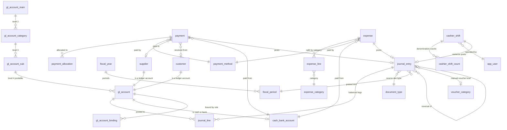
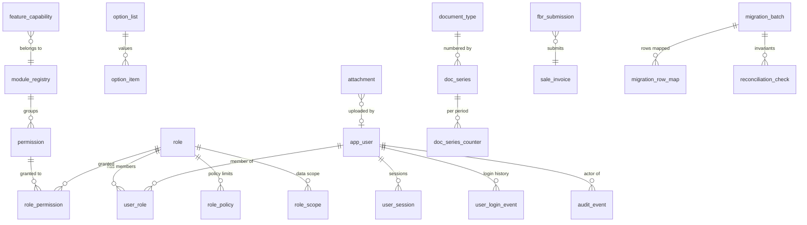

# 19 — MySQL 8 Schema Blueprint (Pharmacy Scope)

> **Document purpose.** Define the target database schema for the rebuilt pharmacy system: every table, every column with its exact MySQL 8 type, keys, indexes, constraints, defaults, audit fields and soft-delete strategy — covering (a) everything the Fazal Din PP19 pharmacy actually uses today, and (b) the four approved new capability sets **R1** (configurable catalogue visibility), **R2** (expenses, cash/bank book, supplier payments, plain-language profit), **R3** (opening balances from zero, stock carried over) and **R4** (real batch + expiry tracking), under design principle **P1** (options are data, never hardcoded assumptions).
>
> **Analysis stage.** Stage 3 — Target Design. Inputs: `00b-owner-decisions-and-requirements.md` (binding), `06-database-analysis.md`, `06a-data-profile-reconciliation-baseline.md`, `07-accounting-logic.md`, `08-inventory-logic.md`, `09-roles-permissions.md`, `10-reports-catalog.md`, `11-integrations-dependencies.md`.
>
> **⚠ This is a blueprint pending business-rule validation — it is NOT a production DDL drop.** No `CREATE TABLE` script here is authorised for execution. Twenty-three items are listed in §14 as requiring owner or accountant sign-off before DDL is generated; several of them can change column-level decisions. Types, keys and constraints are specified precisely so that the DDL generated from this document is mechanical, reviewable and diff-able — not so that it can be run today.
>
> **⚠ The existing system was NOT modified.** Every statement about WASEELA ABUZAR V3 in this document is drawn from the read-only analysis already completed (owner-authorized `SELECT`/metadata access only, decision **D2**). No schema, data, procedure, index or configuration in `FazalDinPP19DataBaseV2` was created, altered or dropped at any point.

## Evidence-label legend

| Label | Meaning in this document |
|---|---|
| `Verified` | Read directly from the legacy schema, live data, or stored-procedure source, with the citation given. |
| `Strongly Inferred` | Multiple converging pieces of legacy evidence point to one conclusion, but it is not directly stated anywhere. |
| `Unclear` | The legacy evidence is ambiguous or contradictory. Carried forward as an open question — never guessed. |
| `Missing` | The capability does not exist in the legacy system and no evidence of it exists. |
| `Deprecated` | Exists in the legacy system, is superseded, and is deliberately **not** carried forward. |
| `Broken/Incomplete` | Exists in the legacy system and is defective. Named so the new design is explicit about what it fixes. |
| `Recommended` | **A proposal for the NEW system.** Not an existing feature. Every table, column, constraint and index specified in §5–§9 of this document is `Recommended` unless it explicitly quotes legacy behaviour. |

**Anti-hallucination rule applied throughout:** the entire target schema is `Recommended`. Where a target table exists to preserve legacy behaviour, the legacy behaviour is cited and labelled separately from the target design.

---

## 1. What this schema must carry

### 1.1 The size of the problem (Verified)

| Fact | Value | Evidence |
|---|---|---|
| Legacy tables | **762**, of which **507 hold zero rows (66.5 %)** | `06` §3.0, §3.6 |
| Legacy columns | 11,414 | `06` §5.1 |
| Legacy business logic | ~643 stored procedures, 74 functions, 34 views, 10 triggers — **no application source code exists** | `06` §8.6; `02` |
| GL rows | 1,021,852; `SUM(Debit) = SUM(Credit) = 455,292,133.00`, difference **0.00** | `06a` §1 |
| Sale invoices / lines | 291,361 / 620,525 | `06a` §2, R4–R5 |
| Sale returns | 30,704 | `06a` §2 |
| Purchase invoices / lines | 6,419 / 113,082 | `06a` §2 |
| Purchase returns | 634 | `06a` §2 |
| Purchase orders / lines | 2,810 / 108,423 | `06a` §2 |
| Stock adjustments | 1,542 headers / 11,181 lines | `06a` §2 |
| Live stock rows (`GodownDetail`) | 6,164, single godown, 214,737 units on hand | `08` §3.3 |
| Daily stock snapshots (`StockReport`) | 3,215,967 rows over 545 distinct dates | `06a` §5 |
| Item master | 30,052 items; **8,042 ever stocked**; 20,861 active-but-never-stocked | `00b` R1 |
| Suppliers / customers | 235 / 2 (walk-in cash model, **D5**) | `06a` R14–R15 |
| Users / roles | 9 users / 4 groups; 486 rights; 726 grants | `09` C.1, D.1 |
| Chart of accounts | 5 → 13 → 29 → 264–267 (row-count drift between snapshots: `06` §3.2 records 264, `00b` F1 records 267) | `07` §2 |
| Data window | 2025-01-01 → 2026-07-31 only (19 months). **No pre-2025 data exists (D3).** | `06a` §2 |

### 1.2 The four legacy realities the target schema is designed around

1. **Only four document types ever post to the GL** — `SV`, `SR`, `PV`, `PR` (`06a` §4). `Verified`. Receipts, journal vouchers, payroll, cashier-shift, patient, guest and service posting paths exist in code and have produced **zero** rows. The accounting critical path is four posting routines, not dozens.
2. **The ledger records money in but never money out (finding F1).** Suppliers credited 186,197,682 / debited 3,526,552 (all purchase returns); cash debited 234,003,081 / credited 19,691,239 (all sale returns); marketing, admin, payroll, cost-of-sales, bank and inventory accounts have **zero** entries in 19 months. `Verified` (`00b` F1). Therefore cash-in-hand and supplier-payable balances are fiction → **D10/R3: all financial opening balances start at zero.**
3. **Batch and expiry tracking is degenerate (finding F2).** 95.2 % of stock rows carry batch `'.'` and expiry `2030-12-12`; `ItemBatches`, `ItemBatchPricing` and `ExpiryIntimation` are all empty; only 62 distinct batch values exist warehouse-wide. `Verified` (`06` §6.7, `08` §10). The composite key `(GCode, ICode, Batch, Expiry)` collapses to `(GCode, ICode)` in practice → **D12/R4: batch and expiry become first-class, and placeholders are mapped to explicit "unknown", never enshrined.**
4. **Physical stock is trustworthy and carries over (D11/R3.3).** The system's own balance identity, replayed against production on 2026-08-01, returns **0 mismatched items**; moving-weighted-average costing reproduces at 100 % on the 10,173 lines where the cost-basis flag is unambiguous. `Verified` (`08` §4.3, §8.3).

### 1.3 Scope boundary (D1)

**In scope:** inventory, purchasing, sales/POS, customers/suppliers, receipts and payments, accounting/GL, tax and FBR fiscalization, reporting, plus R1/R2/R3/R4.

**Catalogued but deferred — never silently dropped:** hospital/clinic/EMR (~85 legacy tables), services/lab invoicing (~40), HR/payroll `EMP_*` (29), school (~14), hotel/guest (9), production/manufacturing (8), multi-branch replication `CRS_*` (71), drop-box exchange `DB_*` (14), import staging `IMP_*` (11), loyalty/installments (~15), quotations/sale orders (~12). `Verified` inventory in `06` §3.6. These are recorded as rows in **`feature_capability`** (T07) with status `deferred`, so the decision is queryable, auditable and reversible rather than lost in a document.

---

## 2. Design principles for the target schema

All `Recommended`.

| # | Principle | Consequence in the schema |
|---|---|---|
| **S1** | **Options are data, not code (P1.4).** | Anything an administrator might legitimately want to add, rename, reorder, disable or re-point is a **row in a lookup table**, not an `ENUM` and not a constant. `ENUM` is reserved for *structural* domains the application branches on and which cannot be extended without new code (e.g. `journal_entry.status`). Every options table carries `is_enabled`, `is_default`, `is_system`, `sort_order` — disabling hides, never deletes (P1.3). |
| **S2** | **Never mutate financial or stock history in place.** | Documents are `cancelled` or `reversed`, never deleted or silently edited. `stock_movement` and `journal_line` are append-only. This directly replaces the legacy correction mechanism, which **hard-deletes GL rows and re-derives them** with no reversing entry and no trace (`07` §9.3, `Verified`, `Broken/Incomplete`). |
| **S3** | **One balance, derived — never a second source of truth.** | `stock_balance` is a materialised projection of `stock_movement` and is rebuildable from it by definition. The legacy design maintains `GodownDetail` by destructive in-place update, which is precisely why five stock-repair procedures exist (`08` §25.1, `Verified`). |
| **S4** | **Every amount is exact decimal. No `FLOAT`, no `DOUBLE`, anywhere, ever.** | Enforced by the domain table in §3.2 and by a DDL lint rule. The legacy database already achieves this (**zero** `float`/`real` columns across all 11,414 columns — `06` §5.2, `Verified`); the risk in the new stack is the Node layer, not the database (§3.3). |
| **S5** | **Referential integrity is declared, not assumed.** | The legacy GL has **no FK to the chart of accounts and no FK to its source documents** (`06` §4.4 R1–R2, `Verified`, Critical). In the target, `journal_line.gl_account_id` and `journal_entry.source_document_id` are real foreign keys. |
| **S6** | **Every table has a real primary key.** | 117 of 762 legacy tables have none, including `VirtualGl` (1.02 M rows) and `StockReport` (3.22 M rows) (`06` §6.1, `Verified`). InnoDB's hidden `GEN_CLUST_INDEX` is not an acceptable substitute for replication, ORMs or duplicate detection. |
| **S7** | **Surrogate keys internally, document numbers externally.** | `BIGINT UNSIGNED AUTO_INCREMENT` for internal identity (gaps irrelevant); a race-safe, gapless, per-series counter for anything a human or the tax authority reads (§8.1). This replaces the `_TABMAXKEY` pattern, whose `UPDLOCK HOLDLOCK` semantics do not exist in MySQL — migration risk **MR-1**, rated Critical (`06` §8.5). |
| **S8** | **Narrow core tables, extensions to the side.** | `SaleLedger` has **148 columns**, ~55 of which reference empty hospital/hotel/school/vehicle tables (`06` §6.8 L2, `Verified`). The target `sale_invoice` is ~40 columns; FBR fiscalization lives in a 1:1 extension table; long-tail item attributes live in a validated JSON column. |
| **S9** | **Accountability is a schema feature, not a logging afterthought.** | Login, permission change, password change, master-data change, posted-document amendment and report export are all un-audited today (`09` G.2, `Verified`, "the critical gap list"). `audit_event` (T19) covers who/when/what/before/after for every one of them. |
| **S10** | **Design for the reports that must reconcile.** | The 16 migration invariants in `06a` §6 are the acceptance gate for cutover. Every one of them must be answerable by a single indexed query against the target schema, and each is stored as a row in `reconciliation_check` (T103). |

### 2.1 Naming conventions

| Object | Convention | Example |
|---|---|---|
| Table | `snake_case`, **singular** noun | `sale_invoice`, `stock_movement` |
| Primary key | `<table>_id` | `sale_invoice_id` |
| Foreign key column | `<referenced_table>_id` | `supplier_id` |
| Boolean | `is_` / `has_` prefix, `TINYINT(1) NOT NULL` | `is_enabled`, `has_expiry` |
| Timestamp | `_at` suffix, `DATETIME(3)` | `created_at`, `posted_at` |
| Business date | `_date` suffix, `DATE` | `invoice_date`, `expiry_date` |
| Money amount | `_amount` suffix | `net_amount`, `debit_amount` |
| Unit rate | `_rate` / `_price` / `_cost` suffix | `unit_cost`, `sale_price` |
| Quantity | `qty_` prefix | `qty_base`, `qty_delta` |
| Index | `ix_<table>_<cols>` | `ix_sale_invoice_date_status` |
| Unique | `uk_<table>_<cols>` | `uk_item_barcode_value` |
| Foreign key | `fk_<table>_<referenced>` | `fk_sale_line_item` |
| Check | `ck_<table>_<rule>` | `ck_journal_line_one_side` |

**Reserved-word compliance (`Verified`, `06` §6.6):** `Groups` and `Rank` are genuine MySQL 8 reserved words (window-function keywords). `Groups` holds the legacy role definitions. They are **renamed**, not back-ticked: `Groups → role`, `Rank → staff_rank` (deferred, HR vertical). No target table or column uses `date`, `status`, `limit`, `maxvalue`, `password`, `value` or `type` as a bare identifier — the legacy schema uses `date` on 208 tables and `LIMIT`/`MAXVALUE` on three (`06` §6.6, `Verified`).

### 2.2 Storage, character set and collation

| Setting | Value | Rationale |
|---|---|---|
| Engine | `InnoDB` (all tables, no exceptions) | Transactions, FKs, row locks, crash recovery |
| Row format | `DYNAMIC` | Required for 3072-byte index prefixes under `utf8mb4` |
| Character set | `utf8mb4` | Urdu/Arabic script, full Unicode. `Item.LocalItemName nvarchar(255)` is populated for **18,127 of 30,052 items (60.3 %)** (`06` §8.3, `Verified`) — in `utf8mb4` the legacy two-column `varchar` + `nvarchar` split becomes unnecessary, but **both columns are still migrated separately** because printed invoices distinguish them. |
| Default collation | `utf8mb4_0900_ai_ci` | UCA 9.0.0, accent- and case-insensitive; closest behavioural match to the legacy `SQL_Latin1_General_CP1_CI_AS`, and correct for Arabic-script sorting. |
| Identity/uniqueness columns | `utf8mb4_0900_as_cs` | Applied to `item.name`, `item.custom_code`, `item.registration_no` and every lookup `code` column, to preserve the legacy accent-**sensitive** uniqueness semantics exactly (`06` §8.3, `Verified` caution). |
| Machine-exact columns | `utf8mb4_bin` | `item_barcode.barcode_value`, `stock_lot.batch_no`, `app_user.password_hash`, `audit_event.request_id`, integration payload keys. |
| `sql_mode` | `STRICT_TRANS_TABLES,NO_ZERO_DATE,NO_ZERO_IN_DATE,ERROR_FOR_DIVISION_BY_ZERO,NO_ENGINE_SUBSTITUTION,ONLY_FULL_GROUP_BY` | Strict mode is **mandatory**: without it MySQL silently truncates over-scale decimals and inserts `''` for out-of-range `ENUM` values. |
| `lower_case_table_names` | `1`, decided **before** the data directory is initialised (it cannot be changed afterwards) | Parity with SQL Server's case-insensitive identifiers. Legacy uses `SaleInvcode`/`SaleInvCode`, `Gcode`/`GCode`, `Icode`/`ICode` inconsistently (`06` §6.6, `Verified`). |
| `time_zone` | `+05:00` (Asia/Karachi) set explicitly at server and session level | Legacy `GETDATE()` is server-local Pakistan time. Storing UTC and converting at the edge is the alternative; **whichever is chosen must be chosen once and enforced** — see §14 V-7. |
| Minimum server version | **MySQL 8.0.16** (first version to enforce `CHECK` constraints), target **8.0.36+ or 8.4 LTS** | Several integrity rules in this blueprint are `CHECK` constraints. On < 8.0.16 they parse and are silently ignored — which would be worse than not declaring them. |

---

## 3. Data-type domains — the four archetypes

### 3.1 The domain table (all `Recommended`)

| Domain | MySQL 8 type | Bytes | Applies to |
|---|---|---:|---|
| **Money amount** | `DECIMAL(18,4)` | 9 | Every settled/posted amount: `debit_amount`, `credit_amount`, `line_net_amount`, `invoice_total`, `paid_amount`, `allocated_amount`, `variance_amount`, balances, tax amounts, discount amounts |
| **Quantity** | `DECIMAL(18,3)` | 9 | Every quantity: `qty_base`, `qty_delta`, `qty_on_hand`, `qty_pack`, `qty_loose`, `qty_bonus`, `qty_counted` |
| **Unit rate** | `DECIMAL(18,6)` | 10 | Money **per unit**: `unit_cost`, `avg_unit_cost`, `sale_price`, `purchase_price`, `net_rate`, `unit_sales_tax` — see §3.4 for the justification and the sign-off requirement |
| **Percentage** | `DECIMAL(9,4)` | 6 | `discount_percent`, `tax_percent`, `margin_percent` — range ±99,999.9999, four decimals |
| **FX rate** | `DECIMAL(18,8)` | 11 | `exchange_rate`. Single-currency today (`Currency` has 1 row, `ConversionRate` constant 1 — `06` §3.4, `Verified`); the column exists so multi-currency is a configuration change, not a schema migration |

**Absolute prohibition:** `FLOAT`, `DOUBLE`, `REAL` are banned from this schema in all roles, including "harmless" ones such as percentages, weights and dimensions. A CI lint step must fail the build if any DDL or migration introduces one.

### 3.2 Why `DECIMAL(18,4)` for money

1. **Range.** `DECIMAL(18,4)` holds up to **99,999,999,999,999.9999** — about 100 trillion PKR. Against a 19-month turnover of **234,003,081 PKR** and an all-time GL debit total of **455,292,133.00** (`06a` §1, `Verified`), that is roughly **200,000× headroom**. The legacy schema mixes precision 12 and 15 for the same concept (`06` §5.4 M2, `Verified`); one width removes the whole class of "which table caps at what" questions.
2. **Scale 4 is a superset of every money scale the legacy system settles at.** GL debits/credits, invoice totals, balances and outstanding amounts are all `numeric(15,2)`; line-level prices reach `(15,4)` in `PurOrderDetail` (`06` §5.3–§5.4, `Verified`). Migrating (15,2) and (15,4) into (18,4) is **widening only** — no value can round. This satisfies migration risk **MR-7**, whose mitigation is explicitly "widen, never narrow".
3. **It fixes defect M1.** `SalePrice` is declared at three different scales across the legacy transaction chain — `(12,2)`, `(15,2)` and `(15,4)` — so writing a `PurOrderDetail.SalePrice` of `123.4567` into `Item.SalePrice numeric(12,2)` silently rounds to `123.46` (`06` §5.4 M1, `Verified`, `Broken`). One declared scale per domain makes that failure mode unrepresentable.
4. **Four decimals are needed even though PKR settles at two.** Invoice-level discounts are allocated proportionally across lines, and per-unit sales tax is multiplied by quantities up to 18,816 units. Truncating intermediate line amounts to two decimals before the final `ROUND(...,2)` produces per-invoice drift of one to several paisa — and the FBR-reported `TotalTaxCharged` must reproduce exactly (`11` §2.3, `Verified`).
5. **Storage is not a consideration at this scale.** `DECIMAL(18,4)` costs 9 bytes against 8 for a `DOUBLE`. On the largest projected table (`journal_line`, ~1.1 M rows/19 months) the difference is under 5 MB.

**Rounding parity (`Verified`, `06` §8.6):** MySQL `ROUND()` on `DECIMAL` rounds half **away from zero**, identical to SQL Server `ROUND()` on `numeric`. Money rounding therefore ports without behavioural change — but it must still be regression-tested paisa-by-paisa against a sample of historical invoices, because the legacy rounding *depth* is preference-driven at three levels (`roundsaleinvon`, `roundsalereturninvon`, and per-line `ROUND(...,2)` inside `fn_getTaxOnSaleInv` — `11` §2.4, `Verified`).

### 3.3 Why `DECIMAL(18,3)` for quantities, and the one migration gate it creates

The brief mandates `DECIMAL(18,3)`; the evidence supports it and adds a hard pre-migration check.

- Legacy quantities are `numeric(15,4)` in the transaction tables but **`int` in `Saledetail.PackQty`, `SRdetail.PackQty`, `Item.BonusQty` and `ItemLog.Stock`** — an inconsistency that means fractional pack quantities can be *purchased* but not *sold* (`06` §5.5, `Verified`, `Broken`). One quantity domain ends that asymmetry.
- Effective precision in production is **integer**: `GodownDetail` has **0 rows with a fractional `CurrQty`** across all 6,164 rows (`08` §3.3, `Verified`), and `08` §22.2 records that quantities are forced to whole numbers throughout.
- Three decimals comfortably cover the realistic pharmacy cases that whole numbers do not: half a bottle, 0.5 ml dispensing, and `Item.AllowSaleInDecimalQty` (`Verified` to exist, default `'N'`).

> **Migration gate MG-1 (`Recommended`, mandatory).** Before any load: `SELECT COUNT(*) FROM <table> WHERE <qty_col> <> ROUND(<qty_col>, 3)` must return **0** for every quantity column in `Saledetail`, `Purdetail`, `SRdetail`, `PRdetail`, `AdjDetail`, `GodownDetail`, `StockReport` and `PurOrderDetail`. A non-zero result is a **stop-the-migration** condition requiring an owner decision, not a silent `ROUND()`.

### 3.4 The one deliberate deviation: unit rates at `DECIMAL(18,6)`

**This is a documented deviation from the "all money is `DECIMAL(18,4)`" rule and requires explicit sign-off (§14 V-1).**

The rule is applied in full to **money amounts** — anything that settles, posts to the ledger, or prints on a document. It is *not* applied to **unit rates**, which are money *per unit* and are a different quantity dimension. The legacy schema itself makes this distinction and is right to:

| Legacy concept | Legacy type | Evidence |
|---|---|---|
| GL debit / credit, invoice totals, balances | `numeric(15,2)` | `07` §14.1, `Verified` |
| Weighted-average cost `AvgPrice` / `NewAvgPrice` / `NetRate` | **`numeric(15,5)` — consistent in all nine tables that carry it** | `06` §5.4 M3, `Verified` ✅ |

Two hard reasons for six decimals rather than four:

1. **Rounding cost to four decimals would break the costing replay.** The moving-weighted-average formula is `ROUND(((stock × avg) + (qty × unit_cost)) / (qty + stock), 5)` and reproduces the stored `NewAvgPrice` at **100.00 % on 10,173 live purchase lines** where the cost basis is unambiguous (`08` §8.2–§8.3, `Verified`). Truncating the carrier to four decimals discards the fifth decimal that validation depends on, and would restate historical COGS on 620,525 sale lines.
2. **Unit cost is derived by division.** `unit_cost = ROUND(net_rate / pack_units, 5)` with `pack_units` ∈ {10, 14, 20, 30, 100, …} (`08` §5.2, `Verified`). Dividing a two-decimal pack price by 14 produces a genuinely repeating value; four decimals is not enough to reconstruct the pack price without drift.

Six decimals (rather than the legacy five) gives one digit of headroom for the new-system requirement that cost be stored, never cast down — replacing the legacy `Cast(@hold_avgprice As Numeric(8,2))` truncation in the adjustment path, which loses three decimal places and **overflows for any average ≥ 1,000,000** (`08` §8.4, `Verified`, `Broken`, Medium risk).

**Every `DECIMAL(18,6)` column in this schema is a rate. Every amount is `DECIMAL(18,4)`. A DDL lint rule enforces the split by column-name suffix.**

### 3.5 The Node/TypeScript boundary

`Recommended`, and non-negotiable. JavaScript's `Number` is IEEE-754 double — **it is exactly the floating-point risk the legacy database successfully avoided** (`06` §5.2). Therefore:

- `mysql2` must be configured with `decimalNumbers: false` (the default) so `DECIMAL` arrives as a **string**.
- All arithmetic on money, quantity or rate happens in a fixed-point library (`decimal.js` / `big.js`) or in SQL — never in bare `Number`.
- The API layer serialises money as a **string**, never a JSON number, and the TypeScript type for money is a branded string type, not `number`.
- A repository-level ESLint rule bans arithmetic operators on values typed as money.

### 3.6 Dates, times and the sentinel problem

| Target usage | Type | Notes |
|---|---|---|
| Business date (invoice, posting, expiry, period) | `DATE` | **`expiry_date` is `DATE`, not `DATETIME`.** In the legacy schema `Expiry` is a `datetime` used as part of four primary keys — a time-component landmine (`06` §5.6 D2, `Verified`, High risk). |
| Event timestamp | `DATETIME(3)` | Faithful to SQL Server `datetime`'s 3.33 ms granularity. |
| Row audit timestamps | `DATETIME(3) NOT NULL DEFAULT CURRENT_TIMESTAMP(3)` (+ `ON UPDATE` for `updated_at`) | |

**Sentinel dates are not migrated.** The legacy system uses `2030-12-12` as "no expiry" on **5,867 of 6,165 stock rows**, plus `1900-01-01` and `2012-12-12` elsewhere (`06` §5.6 D3, D5, `Verified`). In the target these become `NULL` plus an explicit `stock_lot.expiry_status = 'unknown'` state, per `08` §28.3. Migration gate **MG-2**: `COUNT(*) WHERE CAST(Expiry AS TIME) <> '00:00:00'` must be 0 in every source table before `datetime → DATE` conversion (migration risk **MR-14**).

---

## 4. Cross-cutting column packs

Rather than repeating the same columns 90 times, four **packs** are defined once and referenced by name in every table specification in §6.

### 4.1 Pack `AP` — audit pack (on every table unless stated otherwise)

| Column | Type | Null | Default | Notes |
|---|---|---|---|---|
| `created_at` | `DATETIME(3)` | NO | `CURRENT_TIMESTAMP(3)` | |
| `created_by` | `BIGINT UNSIGNED` | YES | `NULL` | FK → `app_user.user_id`. Nullable only for rows created by the migration itself and by system jobs; both cases are identified by `created_source`. |
| `created_source` | `ENUM('ui','api','migration','system_job','import')` | NO | `'ui'` | Structural, not user-extensible → `ENUM` is correct here (S1). |
| `updated_at` | `DATETIME(3)` | NO | `CURRENT_TIMESTAMP(3)` `ON UPDATE CURRENT_TIMESTAMP(3)` | |
| `updated_by` | `BIGINT UNSIGNED` | YES | `NULL` | FK → `app_user.user_id` |
| `row_version` | `INT UNSIGNED` | NO | `1` | Optimistic concurrency. Incremented by the application on every update; a mismatch rejects the write. Prevents the lost-update class the legacy system has no defence against. |

### 4.2 Pack `SD` — soft-delete pack (**master and reference data only**)

| Column | Type | Null | Default | Notes |
|---|---|---|---|---|
| `deleted_at` | `DATETIME(3)` | YES | `NULL` | `NULL` = live |
| `deleted_by` | `BIGINT UNSIGNED` | YES | `NULL` | FK → `app_user.user_id` |
| `delete_reason` | `VARCHAR(255)` | YES | `NULL` | Required by the application when `deleted_at` is set |

**Soft-delete policy — stated once, applied everywhere:**

| Data class | Policy | Why |
|---|---|---|
| Master data (item, supplier, customer, manufacturer, user, role, lookups) | **Soft delete (`SD`) + visibility flags.** Never hard-deleted. | **R1.1:** "Never delete an item… visibility is presentation only; all history remains intact and reportable." Legacy already models this with `Item.Active`, `Accounts.Active`, `SalesMan.ACTIVE`, `Users.Active` (`00b` R1, `Verified`). |
| Options / lookups | Soft delete **plus** `is_enabled = 0`. `is_system = 1` rows can be disabled but never deleted. | **P1.3:** disabling hides an option but never deletes data, and history that used it still displays correctly. |
| Transactional documents (invoices, returns, adjustments, payments, expenses, journals) | **NO soft delete, NO hard delete.** A `status` column with `cancelled`, plus a reversing document. | S2. The legacy correction path deletes GL rows and re-derives them silently (`07` §9.3, `Verified`, `Broken/Incomplete`) — an auditor cannot tell an invoice was amended after posting. |
| Ledger and movement rows (`journal_line`, `stock_movement`, `item_cost_snapshot`, `audit_event`) | **Append-only.** No `UPDATE`, no `DELETE` — enforced by MySQL grants (the application role holds `INSERT, SELECT` only) **and** by `BEFORE UPDATE`/`BEFORE DELETE` triggers that `SIGNAL SQLSTATE '45000'`. | S2, S3. Corrections are compensating rows. |

**Uniqueness under soft delete:** unique keys are **absolute** — a soft-deleted item's `custom_code` stays reserved forever. MySQL treats multiple `NULL`s as distinct, so the common `UNIQUE (code, deleted_at)` trick silently permits duplicates among live rows; it is deliberately **not** used. Code reuse, if ever wanted, is an explicit administrative action with an audit trail, not a side effect of deletion.

### 4.3 Pack `LK` — lookup / options-as-data pack (P1)

Applied to all 24 options tables. Reference by name; per-table specifications list only the *additional* columns.

| Column | Type | Null | Default | Notes |
|---|---|---|---|---|
| `<x>_id` | `SMALLINT UNSIGNED AUTO_INCREMENT` | NO | | PK |
| `code` | `VARCHAR(32)` `COLLATE utf8mb4_0900_as_cs` | NO | | `UNIQUE`. Stable, machine-readable, never renamed (the display name may change freely) |
| `name` | `VARCHAR(120)` | NO | | Display label, English |
| `name_ur` | `VARCHAR(120)` | YES | `NULL` | Urdu/local label. Legacy precedent: `Accounts.LocalAccountName`, `Godown.LocalGodownName`, `DosageUnit.LocalDosageUnit` (`06` §5.7, `Verified`) |
| `description` | `VARCHAR(255)` | YES | `NULL` | The one-line plain-English explanation R1.10 requires next to every admin control |
| `is_enabled` | `TINYINT(1)` | NO | `1` | **P1.3** — hides from pickers; historical rows keep resolving |
| `is_default` | `TINYINT(1)` | NO | `0` | **P1.2** — exactly one enabled default per table |
| `is_system` | `TINYINT(1)` | NO | `0` | Seeded rows the application depends on; may be disabled or renamed, never deleted |
| `sort_order` | `SMALLINT UNSIGNED` | NO | `100` | **P1.6** — grouped, ordered, searchable pickers |
| `legacy_id` | `INT UNSIGNED` | YES | `NULL` | `UNIQUE`. The source `*Code` this row was migrated from |
| + `AP` + `SD` | | | | |

Constraints on every `LK` table:

```
PRIMARY KEY (<x>_id)
UNIQUE KEY uk_<x>_code    (code)
UNIQUE KEY uk_<x>_legacy  (legacy_id)
UNIQUE KEY uk_<x>_default ((IF(is_default = 1, 1, NULL)))   -- functional index, MySQL 8.0.13+
INDEX      ix_<x>_enabled (is_enabled, sort_order)
```

The functional unique index is the concrete mechanism that guarantees **P1.2** ("every option list has one pre-selected default") at the database level: a second `is_default = 1` row is rejected by the engine, not by a hopeful application check.

### 4.4 Pack `DOC` — transactional document header pack

Applied to `sale_invoice`, `sale_return`, `purchase_invoice`, `purchase_return`, `purchase_order`, `stock_adjustment`, `stock_take`, `payment`, `expense`, `journal_entry`.

| Column | Type | Null | Default | Notes |
|---|---|---|---|---|
| `<doc>_id` | `BIGINT UNSIGNED AUTO_INCREMENT` | NO | | PK (S7 — internal identity, gaps irrelevant) |
| `doc_number` | `VARCHAR(32)` `COLLATE utf8mb4_0900_as_cs` | NO | | The human/tax-visible number. `UNIQUE` per series. Allocated by §8.1 |
| `doc_series_id` | `SMALLINT UNSIGNED` | NO | | FK → `doc_series` |
| `document_type_id` | `SMALLINT UNSIGNED` | NO | | FK → `document_type` |
| `document_date` | `DATE` | NO | | The business date the user chose |
| `posting_date` | `DATE` | NO | | The date the document hits the ledger; equals `document_date` unless the period is closed and a supervisor re-dates it (audited) |
| `fiscal_period_id` | `INT UNSIGNED` | NO | | FK → `fiscal_period`. Resolved from `posting_date` at save; makes period locking a join, not a date computation |
| `warehouse_id` | `SMALLINT UNSIGNED` | NO | | FK → `warehouse` |
| `status` | `ENUM('draft','confirmed','posted','cancelled','reversed')` | NO | `'draft'` | Structural. `posted` = materialised to the GL |
| `posted_at` | `DATETIME(3)` | YES | `NULL` | |
| `posted_by` | `BIGINT UNSIGNED` | YES | `NULL` | FK → `app_user`. **Legacy `SaleLedger.PostedBy` and `.ModifiedBy` are NULL on all 291,361 rows** (`09` G.2, `Verified`) — in the target these are mandatory whenever `status = 'posted'`, enforced by `CHECK`. |
| `cancelled_at` / `cancelled_by` / `cancel_reason_id` | `DATETIME(3)` / `BIGINT UNSIGNED` / `SMALLINT UNSIGNED` | YES | `NULL` | `cancel_reason_id` FK → `cancel_reason` (options-as-data) |
| `reversal_of_id` | `BIGINT UNSIGNED` | YES | `NULL` | Self-FK. Set on the reversing document |
| `notes` | `VARCHAR(1000)` | YES | `NULL` | |
| `machine_name` | `VARCHAR(64)` | YES | `NULL` | Legacy precedent `SaleLedger.MachineName`; retained for till-level attribution |
| `legacy_id` | `BIGINT UNSIGNED` | YES | `NULL` | `UNIQUE`. The source PK (e.g. `SaleInvCode`), required by the `06a` §6 reconciliation invariants |
| + `AP` | | | | No `SD` — documents are never deleted (§4.2) |

Standard constraints on every `DOC` table:

```
UNIQUE KEY uk_<doc>_number  (doc_series_id, doc_number)
UNIQUE KEY uk_<doc>_legacy  (legacy_id)
INDEX      ix_<doc>_date    (posting_date, status)
INDEX      ix_<doc>_period  (fiscal_period_id, status)
CHECK      ck_<doc>_posted  (status <> 'posted' OR (posted_at IS NOT NULL AND posted_by IS NOT NULL))
CHECK      ck_<doc>_cancel  (status <> 'cancelled' OR (cancelled_at IS NOT NULL AND cancelled_by IS NOT NULL))
```

---

## 5. ER overview

Three diagrams, because one diagram covering 106 tables is unreadable. All `Recommended`.

### 5.1 The trading spine — item, stock, sale, purchase

```mermaid
erDiagram
    item ||--o{ stock_lot : "batches of"
    item ||--o{ item_barcode : "scannable as"
    item ||--o{ item_price : "priced by list"
    item ||--o{ item_supplier : "sourced from"
    item ||--o{ item_visibility : "shown per scope"
    item }o--|| item_category : "category"
    item }o--|| item_class : "class"
    item }o--o| generic_item : "molecule"
    item }o--o| manufacturer : "made by"
    item }o--o| tax_schedule : "tax rate"
    item }o--o| hs_code : "HS or PCT"

    stock_lot ||--o{ stock_movement : "moved by"
    stock_lot ||--o{ stock_balance : "held as"
    stock_lot }o--o| supplier : "received from"
    warehouse ||--o{ stock_balance : "location of"
    warehouse ||--o{ stock_movement : "location of"
    stock_movement }o--|| document_type : "caused by"
    item ||--o{ item_cost_snapshot : "avg cost history"

    sale_invoice ||--o{ sale_invoice_line : "lines"
    sale_invoice ||--o{ sale_invoice_payment : "tendered by"
    sale_invoice ||--o| sale_invoice_fbr : "fiscalized as"
    sale_invoice ||--o{ sale_line_removed : "removed lines"
    sale_invoice }o--|| customer : "sold to"
    sale_invoice }o--|| sale_category : "category"
    sale_invoice ||--o{ sale_return : "returned by"
    sale_return ||--o{ sale_return_line : "lines"
    sale_invoice_line }o--|| item : "item"
    sale_invoice_line }o--o| stock_lot : "from lot"

    purchase_invoice ||--o{ purchase_invoice_line : "lines"
    purchase_invoice ||--o{ purchase_charge : "charges"
    purchase_invoice }o--|| supplier : "bought from"
    purchase_invoice }o--|| purchase_category : "category"
    purchase_invoice ||--o{ purchase_return : "returned by"
    purchase_return ||--o{ purchase_return_line : "lines"
    purchase_invoice_line }o--|| item : "item"
    purchase_invoice_line }o--|| stock_lot : "creates lot"
    purchase_order ||--o{ purchase_order_line : "lines"
    purchase_order }o--|| supplier : "ordered from"

    stock_adjustment ||--o{ stock_adjustment_line : "lines"
    stock_adjustment }o--|| adjustment_reason : "because"
    stock_take ||--o{ stock_take_line : "counted lines"
```



### 5.2 The accounting core — double entry, money movement, periods



### 5.3 Access, configuration and accountability



---

## 6. Table catalogue

**106 tables in 11 modules** — against **762** in the legacy database, of which 507 are empty. Every table below is `Recommended`. Cited legacy behaviour carries its own label.

| Module | Tables | Count |
|---|---|---:|
| A — Platform and configuration | T01–T10 | 10 |
| B — Identity, access and audit | T11–T20 | 10 |
| C — Organisation, calendar, currency | T21–T25 | 5 |
| D — Parties | T26–T30 | 5 |
| E — Item catalogue and pricing | T31–T47 | 17 |
| F — Tax and FBR | T48–T55 | 8 |
| G — Inventory | T56–T66 | 11 |
| H — Sales | T67–T76 | 10 |
| I — Purchase | T77–T84 | 8 |
| J — Accounting and money movement | T85–T102 | 18 |
| K — Reporting, migration and control | T103–T106 | 4 |
| **Total** | | **106** |

---

### Module A — Platform and configuration (T01–T10)

#### T01 `app_setting`

**Purpose.** Typed, audited, admin-editable application settings. Replaces the legacy quartet `SoftwarePreferences` (1,352 name/value rows read through `Fn_GetPreference`), `Preferences` (a **443-column single-row table**), `ConfigSetting` (9 rows) and `Global` (79 rows) — `06` §3.3, `Verified`, where the 443-column table is labelled architecturally obsolete.

| Column | Type | Null | Default | Notes |
|---|---|---|---|---|
| `setting_id` | `INT UNSIGNED AUTO_INCREMENT` | NO | | PK |
| `setting_key` | `VARCHAR(80)` as_cs | NO | | UNIQUE. Dotted namespace, e.g. `inventory.expiry.expired_sale_action` |
| `setting_group` | `VARCHAR(40)` | NO | | Admin-panel section (R1.10 plain-language grouping) |
| `value_type` | `ENUM('string','int','decimal','bool','date','json','account_ref','enum')` | NO | | Drives validation and the admin control |
| `value_text` | `VARCHAR(2000)` | YES | NULL | Canonical storage; typed accessors cast |
| `value_json` | `JSON` | YES | NULL | For `value_type = 'json'` |
| `allowed_values` | `JSON` | YES | NULL | For `value_type = 'enum'` — renders the picker |
| `default_value` | `VARCHAR(2000)` | YES | NULL | Powers "reset to default" |
| `label` | `VARCHAR(160)` | NO | | Plain-English label |
| `help_text` | `VARCHAR(500)` | YES | NULL | The one-line explanation R1.10 requires on every control |
| `min_permission_id` | `INT UNSIGNED` | YES | NULL | FK → `permission`. Who may change it (P1.5) |
| `requires_restart` | `TINYINT(1)` | NO | 0 | |
| `is_system` | `TINYINT(1)` | NO | 0 | |
| `legacy_source` | `VARCHAR(64)` | YES | NULL | e.g. `SoftwarePreferences.inventorymovementmethod` |
| + `AP` | | | | No `SD` — settings are disabled, never deleted |

`PRIMARY KEY (setting_id)` · `UNIQUE uk_app_setting_key (setting_key)` · `INDEX ix_app_setting_group (setting_group, setting_key)`

> **Why not a bare name/value store.** The legacy store has no type, no validation, no permission binding and no audit. `SoftwarePreferences.AutoPurgeVirtualGL = 'Y'` **truncates the entire general ledger on the next balance enquiry, with no confirmation and no backup** (`07` §3.5, `Verified` — the highest-severity latent defect found in the accounting domain). In the target no setting can destroy data: that capability is removed, not re-permissioned.

#### T02 `option_list` and #### T03 `option_item`

**Purpose.** The generic options-as-data store for flat pick-lists (P1.4). Options with behaviour of their own — payment methods, expense categories, adjustment reasons — get dedicated tables so they can carry GL bindings and rules.

`option_list`: `option_list_id SMALLINT UNSIGNED PK`, `list_code VARCHAR(48) as_cs UNIQUE`, `name VARCHAR(120) NOT NULL`, `description VARCHAR(255) NULL`, `is_admin_extensible TINYINT(1) NOT NULL DEFAULT 1`, `allows_disable TINYINT(1) NOT NULL DEFAULT 1`, + `AP`.

`option_item`: `option_item_id INT UNSIGNED PK`, `option_list_id SMALLINT UNSIGNED NOT NULL` FK, then pack `LK` minus its own surrogate. `UNIQUE uk_option_item_code (option_list_id, code)`; the default-uniqueness index becomes `UNIQUE ((IF(is_default = 1, option_list_id, NULL)))` so **each list** has exactly one default.

Seeded lists: `doc_print_format` (A4 · A5 · thermal receipt · PDF · email — from the P1 options table), `cancel_reason`, `stock_hold_reason` (legacy `LockReason` has exactly **one row, `GENERAL`** — `08` §29 item 12, `Verified`), `sale_channel`, `supplier_category`, `customer_category`, `visibility_scope`, `allocation_mode` (specific invoices · oldest-first FIFO · on-account only — R2.1).

#### T04 `document_type`

**Purpose.** The registry of every document class that can exist, own a numbering series, move stock or post to the ledger. Replaces the legacy convention in which `VirtualGl.DocumentType varchar(20)` is a bare string with **no foreign key to anything** (`06` §4.2, `Verified`, Critical).

| Column | Type | Null | Default | Notes |
|---|---|---|---|---|
| `document_type_id` | `SMALLINT UNSIGNED AUTO_INCREMENT` | NO | | PK |
| `code` | `VARCHAR(16)` as_cs | NO | | UNIQUE. Legacy-compatible where one exists: `SV`, `SR`, `PV`, `PR`, `AI`, `AD`; new: `SPAY`, `EXP`, `CBT`, `CSHIFT`, `OPEN`, `JV` |
| `name`, `name_ur`, `description` | as `LK` | | | |
| `module_id` | `SMALLINT UNSIGNED` | NO | | FK → `module_registry` |
| `affects_stock` | `TINYINT(1)` | NO | 0 | |
| `stock_direction` | `ENUM('in','out','both','none')` | NO | `'none'` | |
| `affects_gl` | `TINYINT(1)` | NO | 0 | |
| `is_reversible` | `TINYINT(1)` | NO | 1 | |
| `approval_threshold_amount` | `DECIMAL(18,4)` | YES | NULL | Value above which approval is required. Closes the gap where `sp_PostStockAdjustment` writes `Posted='Y'` with **no approval step at all** (`08` §28.5, `Verified`) |
| `is_enabled`, `is_system`, `sort_order`, `legacy_id` | as `LK` | | | |
| + `AP` + `SD` | | | | |

`UNIQUE uk_document_type_code (code)` · `INDEX ix_document_type_module (module_id, is_enabled)`

#### T05 `doc_series` and #### T06 `doc_series_counter`

**Purpose.** Race-safe, gapless, per-series document numbering — mechanism in §8.1. Replaces `_TABMAXKEY` (265 rows; `TABMAXKEY numeric(7,0)`, ceiling 9,999,999, already at 880,233) and `_HeaderTabMaxKey`, whose `UPDLOCK HOLDLOCK` allocation semantics **do not exist in MySQL** (`06` §8.5, `Verified`; migration risk **MR-1**, Critical).

`doc_series`: `doc_series_id SMALLINT UNSIGNED PK`, `series_code VARCHAR(48) as_cs UNIQUE`, `document_type_id` FK NOT NULL, `warehouse_id` FK NULL, `prefix VARCHAR(12) NOT NULL DEFAULT ''`, `suffix VARCHAR(12) NOT NULL DEFAULT ''`, `number_length TINYINT UNSIGNED NOT NULL DEFAULT 6`, `period_reset ENUM('never','yearly','monthly','daily') NOT NULL DEFAULT 'never'`, `is_gapless TINYINT(1) NOT NULL DEFAULT 1`, `allocate_on ENUM('save','post') NOT NULL DEFAULT 'save'`, `is_enabled`, `is_system`, `legacy_counter_name VARCHAR(48) NULL` (the `RTRIM`-ed `_TABMAXKEY.TABName` it was seeded from, per `06` §8.5.5 step 1), + `AP`.

`doc_series_counter`: `doc_series_id SMALLINT UNSIGNED NOT NULL`, `period_key VARCHAR(12) NOT NULL DEFAULT ''` (values `''`, `2026`, `2026-07`, `2026-07-31`), `next_value BIGINT UNSIGNED NOT NULL DEFAULT 1`, `last_allocated_at DATETIME(3) NULL`, `updated_at DATETIME(3)`.
`PRIMARY KEY (doc_series_id, period_key)` · FK → `doc_series`.
**`BIGINT UNSIGNED`, not `numeric(7,0)`** — the legacy counter-ceiling risk (**MR-19**) is removed by construction.

#### T07 `feature_capability`

**Purpose.** The auditable register of every capability the legacy product ships, with its status in the rebuild. **This is the table that makes D1 enforceable** — "non-pharmacy verticals are catalogued but deferred, never silently dropped."

`feature_capability_id SMALLINT UNSIGNED PK`, `code VARCHAR(48) as_cs UNIQUE`, `name VARCHAR(160) NOT NULL`, `module_id SMALLINT UNSIGNED NULL` FK, `status ENUM('in_scope','deferred','excluded','replaced') NOT NULL`, `legacy_table_count SMALLINT UNSIGNED NULL`, `legacy_evidence VARCHAR(500) NULL`, `decision_ref VARCHAR(32) NULL` (e.g. `D1`), `decided_on DATE NULL`, `rationale VARCHAR(1000) NULL`, + `AP`.

Seeded from `06` §3.6 and `07` §4.7: hospital/EMR (~85 legacy tables, 0 rows), services/lab invoicing (~40), HR/payroll `EMP_*` (29), school (~14), hotel/guest (9), production (8), CRS multi-branch replication (71), drop-box `DB_*` (14), import staging `IMP_*` (11), loyalty/installments (~15), quotations/sale orders (~12), garments/textile item attributes, workshop/work orders (~14).

#### T08 `system_job`

**Purpose.** Durable record of every background or integration job: FBR submission and retry, daily snapshot generation, balance rebuild, migration steps, scheduled report exports.

`system_job_id BIGINT UNSIGNED PK`, `job_type VARCHAR(48) NOT NULL`, `status ENUM('queued','running','succeeded','failed','cancelled') NOT NULL DEFAULT 'queued'`, `scheduled_at DATETIME(3) NOT NULL`, `started_at DATETIME(3) NULL`, `finished_at DATETIME(3) NULL`, `attempt_count SMALLINT UNSIGNED NOT NULL DEFAULT 0`, `max_attempts SMALLINT UNSIGNED NOT NULL DEFAULT 5`, `payload_json JSON NULL`, `result_json JSON NULL`, `error_text TEXT NULL`, `correlation_id CHAR(36) NULL`, + `AP`.
`INDEX ix_system_job_status (status, scheduled_at)` · `INDEX ix_system_job_type (job_type, created_at)`

#### T09 `attachment`

**Purpose.** Receipt photos (R2.1, R2.2), signed count sheets, item images, scanned supplier invoices. **Files live in object storage; only metadata lives in MySQL.** The legacy `image` columns (17 columns, 6 populated, including `ItemNotes.Notes` across 30,046 rows) may hold PowerBuilder-serialised OLE blobs meaningless outside the compiled client (`06` §8.1, **MR-17**, `Verified` existence / `Unclear` content).

`attachment_id BIGINT UNSIGNED PK`, `entity_type VARCHAR(48) NOT NULL`, `entity_id BIGINT UNSIGNED NOT NULL`, `file_name VARCHAR(255) NOT NULL`, `mime_type VARCHAR(120) NOT NULL`, `byte_size BIGINT UNSIGNED NOT NULL`, `storage_key VARCHAR(512) as_cs NOT NULL`, `sha256 CHAR(64) utf8mb4_bin NOT NULL`, `caption VARCHAR(255) NULL`, + `AP` + `SD`.
`INDEX ix_attachment_entity (entity_type, entity_id)` · `INDEX ix_attachment_sha (sha256)`.
The `(entity_type, entity_id)` pair is deliberately polymorphic and therefore carries **no FK**; integrity is enforced by the application plus a nightly orphan report. This is a conscious, documented exception to S5.

#### T10 `module_registry`

**Purpose.** The functional module list that permissions, document series, settings and capabilities hang off. Legacy `Module` holds 57 rows and drives `_HeaderTabMaxKey.Module` and the whole `GroupAllowed*` scoping family (`06` §3.3, `Verified`).

Pack `LK`, plus `parent_module_id SMALLINT UNSIGNED NULL` (self-FK, one level of nesting only), `icon VARCHAR(48) NULL`, `route_path VARCHAR(120) NULL`.

---

### Module B — Identity, access and audit (T11–T20)

#### T11 `app_user`

**Purpose.** People who use the system. Legacy `Users` has 9 rows and stores **`Password varchar(60)` in plaintext** (`06` §6.8 L1, `Verified`, Critical; migration risk **MR-3**).

| Column | Type | Null | Default | Notes |
|---|---|---|---|---|
| `user_id` | `BIGINT UNSIGNED AUTO_INCREMENT` | NO | | PK |
| `username` | `VARCHAR(64)` as_cs | NO | | UNIQUE |
| `display_name` | `VARCHAR(120)` | NO | | |
| `display_name_ur` | `VARCHAR(120)` | YES | NULL | |
| `password_hash` | `VARCHAR(255)` utf8mb4_bin | NO | | **Argon2id** (bcrypt acceptable fallback). The legacy plaintext column is **never migrated** — every user is force-reset at first login (MR-3 mitigation) |
| `password_changed_at` | `DATETIME(3)` | NO | `CURRENT_TIMESTAMP(3)` | |
| `must_change_password` | `TINYINT(1)` | NO | 1 | Set to 1 for every migrated user |
| `failed_login_count` | `SMALLINT UNSIGNED` | NO | 0 | |
| `locked_until` | `DATETIME(3)` | YES | NULL | Lockout after N failures (setting-driven) |
| `mfa_secret` | `VARBINARY(255)` | YES | NULL | Encrypted at rest; optional |
| `email` | `VARCHAR(190)` | YES | NULL | UNIQUE where not null — 190 chars keeps the index inside 768 bytes under utf8mb4 |
| `phone` | `VARCHAR(32)` | YES | NULL | |
| `father_name`, `address` | `VARCHAR(120)`, `VARCHAR(255)` | YES | NULL | Legacy `Users.FatherName`, `.Address` retained |
| `is_active` | `TINYINT(1)` | NO | 1 | Legacy `Users.Active` (`Verified`) |
| `default_warehouse_id` | `SMALLINT UNSIGNED` | YES | NULL | FK → `warehouse` |
| `locale` | `VARCHAR(12)` | NO | `'en-PK'` | |
| `legacy_id` | `INT UNSIGNED` | YES | NULL | UNIQUE — legacy `UserCode` |
| + `AP` + `SD` | | | | |

`UNIQUE uk_app_user_username (username)` · `UNIQUE uk_app_user_legacy (legacy_id)` · `INDEX ix_app_user_active (is_active, display_name)`

#### T12 `user_session`

**Purpose.** Server-side session register enabling revocation and "who is logged in right now". **No legacy equivalent exists** — `Missing`: legacy authentication is entirely client-side and there is no server-side authentication at all (`09` F.1, `Verified`).

`session_id CHAR(36) PK`, `user_id` FK NOT NULL, `issued_at DATETIME(3) NOT NULL`, `expires_at DATETIME(3) NOT NULL`, `last_seen_at DATETIME(3) NOT NULL`, `revoked_at DATETIME(3) NULL`, `revoked_by BIGINT UNSIGNED NULL`, `ip_address VARBINARY(16) NULL`, `user_agent VARCHAR(255) NULL`, `machine_name VARCHAR(64) NULL`, `warehouse_id SMALLINT UNSIGNED NULL`.
`INDEX ix_user_session_user (user_id, issued_at)` · `INDEX ix_user_session_live (expires_at, revoked_at)`

#### T13 `user_login_event`

**Purpose.** Append-only login/logout/failure log. Closes the first line of the legacy critical audit-gap list: **"Login / logout / failed login — no table, no procedure, no column"** (`09` G.2, `Verified`).

`login_event_id BIGINT UNSIGNED PK`, `user_id BIGINT UNSIGNED NULL` (null when the username did not resolve), `username_attempted VARCHAR(64) NOT NULL`, `event_type ENUM('login_success','login_failure','logout','lockout','password_reset','mfa_challenge') NOT NULL`, `occurred_at DATETIME(3) NOT NULL DEFAULT CURRENT_TIMESTAMP(3)`, `ip_address VARBINARY(16) NULL`, `machine_name VARCHAR(64) NULL`, `user_agent VARCHAR(255) NULL`, `failure_reason VARCHAR(120) NULL`, `session_id CHAR(36) NULL`.
Append-only (§4.2). `INDEX ix_login_event_user (user_id, occurred_at)` · `INDEX ix_login_event_time (occurred_at)` · `INDEX ix_login_event_type (event_type, occurred_at)`

#### T14 `role`

**Purpose.** Named role. **Renamed from the legacy `Groups`, which is a reserved word in MySQL 8** (window-function keyword) and holds the role definitions plus 29 embedded business-policy columns (`06` §6.6 and §3.3, `Verified`; migration risk **MR-10**).

Pack `LK` semantics on `code`/`name`, plus: `role_id SMALLINT UNSIGNED PK`, `is_system TINYINT(1)`, `is_admin TINYINT(1) NOT NULL DEFAULT 0`, `description VARCHAR(255)`, `legacy_id INT UNSIGNED UNIQUE`, + `AP` + `SD`.

The 29 policy columns are **not** columns here — they become rows in `role_policy` (T17). Rationale: they are business policy, they differ per deployment, and P1.4 requires that adding a policy be an admin action rather than a schema migration.

#### T15 `permission`

**Purpose.** The permission atom. Legacy `Rights` holds **486 rows** whose `LevelIndex`/`IndicesString` encode a **compiled PowerBuilder menu-tree path** (`06` §3.3, `09` C.1, `Verified`). That coupling is dropped: permissions in the target name *capabilities*, not menu coordinates.

| Column | Type | Null | Default | Notes |
|---|---|---|---|---|
| `permission_id` | `INT UNSIGNED AUTO_INCREMENT` | NO | | PK |
| `code` | `VARCHAR(80)` as_cs | NO | | UNIQUE. `sale.invoice.create`, `stock.adjustment.approve`, `admin.item.visibility.bulk` |
| `name` | `VARCHAR(160)` | NO | | |
| `description` | `VARCHAR(255)` | YES | NULL | |
| `module_id` | `SMALLINT UNSIGNED` | NO | | FK → `module_registry` |
| `permission_kind` | `ENUM('action','view','field','report','admin')` | NO | `'action'` | Generalises the legacy `Rights.Object` split (`'A'` action = 322 rows, `'W'` window = 164 rows, `Verified`) |
| `is_sensitive` | `TINYINT(1)` | NO | 0 | Marks the financial-control set — grant/revoke always raises an `audit_event` and an owner notification |
| `legacy_right_code` | `INT UNSIGNED` | YES | NULL | UNIQUE. Preserves traceability to the 486 legacy rights |
| + `AP` + `SD` | | | | |

#### T16 `role_permission`

`role_id SMALLINT UNSIGNED NOT NULL`, `permission_id INT UNSIGNED NOT NULL`, `granted_at DATETIME(3) NOT NULL DEFAULT CURRENT_TIMESTAMP(3)`, `granted_by BIGINT UNSIGNED NULL`.
`PRIMARY KEY (role_id, permission_id)` · `INDEX ix_role_permission_perm (permission_id)`.

**Positive-grant only, matching the verified legacy semantics** — legacy `GroupRights.Status` is `1` in every one of its 726 rows; there is no deny rule, no precedence and no inheritance (`09` C.1, `Verified`). Keeping that model avoids inventing a precedence system nobody asked for. Every INSERT and DELETE writes an `audit_event`, closing the gap "**Right granted or revoked — permission changes are completely invisible**" (`09` G.2, `Verified`).

#### T17 `role_policy`

**Purpose.** The 29 legacy behaviour columns on `Groups` (`saleinvflatdisc`, `saleItemdiscperc`, `SaleGodownStrategy`, `PurchaseGodownStrategy`, `FinancialLimitPerTransaction`, …) expressed as data (P1.4).

`role_policy_id INT UNSIGNED PK`, `role_id SMALLINT UNSIGNED NOT NULL` FK, `policy_key VARCHAR(64) as_cs NOT NULL`, `value_type ENUM('bool','int','decimal','string','enum') NOT NULL`, `value_text VARCHAR(255) NULL`, `value_amount DECIMAL(18,4) NULL`, `effective_from DATE NULL`, `effective_to DATE NULL`, + `AP`.
`UNIQUE uk_role_policy (role_id, policy_key, effective_from)` · `INDEX ix_role_policy_key (policy_key)`

> `Broken/Incomplete` in the legacy system: these group-level policy fields are **never enforced by SQL** — enforcement lives entirely in the compiled client (`09` C.2.3, `Verified`, Critical). In the target every policy is evaluated **server-side** in the API layer; the client only decides what to show.

#### T18 `role_scope`

**Purpose.** Row-level data scoping — one table replacing the legacy family `GroupAllowedGodown` (33 rows), `GroupAllowedHeader` (35), `GroupAllowedPrice` (54), `GroupCashAccount` (43), `GroupVoucherCategory` (25), `GroupAllowedRecipient` (8) (`06` §3.3, `09` C.3, `Verified`).

`role_scope_id INT UNSIGNED PK`, `role_id SMALLINT UNSIGNED NOT NULL` FK, `scope_type ENUM('warehouse','price_type','cash_account','voucher_category','print_header','sms_recipient','expense_category') NOT NULL`, `scope_ref_id BIGINT UNSIGNED NOT NULL`, `module_id SMALLINT UNSIGNED NULL` FK, `priority SMALLINT UNSIGNED NOT NULL DEFAULT 10`, `is_default TINYINT(1) NOT NULL DEFAULT 0`, + `AP`.
`UNIQUE uk_role_scope (role_id, scope_type, scope_ref_id, module_id)` · `INDEX ix_role_scope_lookup (role_id, scope_type, module_id, priority)`

**P1.5 lives here**: "the respective user" sees the options relevant to them — a cashier sees counter payment methods, the owner sees bank transfer, cheque and adjustments.

#### T19 `user_role`

`user_id BIGINT UNSIGNED NOT NULL`, `role_id SMALLINT UNSIGNED NOT NULL`, `assigned_at DATETIME(3) NOT NULL`, `assigned_by BIGINT UNSIGNED NULL`, `valid_from DATE NULL`, `valid_to DATE NULL`.
`PRIMARY KEY (user_id, role_id)` · `INDEX ix_user_role_role (role_id)`.

**Multiple roles are permitted and are resolved as the union of grants.** The legacy `fn_GetGroupCode` collapses membership with `SELECT MIN(GroupCode)`, which silently discards multi-group membership — and because `ADMINISTRATOR` is `GroupCode 2`, the lowest in use, adding a user to ADMINISTRATOR **plus** a restricted group would silently grant full admin server-side (`09` C.1, `Verified`, `Broken/Incomplete`). Union-of-grants makes that failure mode impossible.

#### T20 `audit_event`

**Purpose.** The universal who/when/what/before/after trail. Directly closes eleven of the twelve un-audited events listed in `09` G.2 (`Verified`, "the critical gap list").

| Column | Type | Null | Default | Notes |
|---|---|---|---|---|
| `audit_event_id` | `BIGINT UNSIGNED AUTO_INCREMENT` | NO | | PK |
| `occurred_at` | `DATETIME(3)` | NO | `CURRENT_TIMESTAMP(3)` | Part of the partition key |
| `actor_user_id` | `BIGINT UNSIGNED` | YES | NULL | **No FK** — partitioned InnoDB tables cannot carry foreign keys in MySQL 8 (§7.3) |
| `actor_username` | `VARCHAR(64)` | NO | | Denormalised on purpose: the trail must stay readable even if the user row is later renamed |
| `session_id` | `CHAR(36)` | YES | NULL | |
| `action` | `VARCHAR(48)` as_cs | NO | | `create`, `update`, `cancel`, `post`, `reverse`, `grant`, `revoke`, `login`, `export`, `visibility_change`, `setting_change`, `price_change` |
| `entity_type` | `VARCHAR(48)` as_cs | NO | | Target table name |
| `entity_id` | `BIGINT UNSIGNED` | YES | NULL | |
| `entity_label` | `VARCHAR(160)` | YES | NULL | Human-readable identity at the time, e.g. the invoice number |
| `before_json` | `JSON` | YES | NULL | Full or field-scoped before-image |
| `after_json` | `JSON` | YES | NULL | |
| `changed_fields` | `JSON` | YES | NULL | Array of column names — makes "who changed the price?" an indexable question |
| `amount_impact` | `DECIMAL(18,4)` | YES | NULL | Financial magnitude, for risk-ranked review |
| `reason` | `VARCHAR(500)` | YES | NULL | Mandatory for cancel, reverse, visibility bulk change, permission change |
| `ip_address` | `VARBINARY(16)` | YES | NULL | |
| `machine_name` | `VARCHAR(64)` | YES | NULL | |
| `request_id` | `CHAR(36)` utf8mb4_bin | YES | NULL | Correlates one user action across multiple rows |

`PRIMARY KEY (audit_event_id, occurred_at)` — the partition column must be part of every unique key.
`PARTITION BY RANGE (TO_DAYS(occurred_at))`, one partition per month, created a year ahead by a maintenance job.
`INDEX ix_audit_entity (entity_type, entity_id, occurred_at)` · `INDEX ix_audit_actor (actor_user_id, occurred_at)` · `INDEX ix_audit_action (action, occurred_at)` · `INDEX ix_audit_request (request_id)`.
Append-only (§4.2), enforced by grant and by `BEFORE UPDATE`/`BEFORE DELETE` triggers that `SIGNAL SQLSTATE '45000'`.

> **Retention.** Audit rows are never deleted inside the retention window agreed with the owner; expiry is by dropping whole partitions after export to cold storage, and the drop itself is recorded in `system_job`.

---

### Module C — Organisation, calendar and currency (T21–T25)

#### T21 `warehouse`

**Purpose.** Stock location. Legacy `Godown` has exactly **one row**, `GCode = 1`, `Name = ' GODOWN1'` **with a leading space** (`08` §6.1, `06` §6.8 L8, `Verified` — a data-hygiene defect that must be trimmed at migration, **MR-22**). Multi-warehouse machinery exists in the legacy product and is inert (`Multigodown = 'N'`).

Pack `LK` plus: `warehouse_id SMALLINT UNSIGNED PK`, `location VARCHAR(255) NULL`, `is_default TINYINT(1)`, `consider_stock_in_po TINYINT(1) NOT NULL DEFAULT 1` (legacy `Godown.ConsiderStockINPO`), `allow_negative_stock TINYINT(1) NOT NULL DEFAULT 0`, + `AP` + `SD`.

Every stock table is keyed by `warehouse_id` from day one even though only one row exists, so enabling a second location is data entry, not a migration.

#### T22 `currency`

Pack `LK` plus `symbol VARCHAR(8) NOT NULL`, `iso_code CHAR(3) as_cs NOT NULL UNIQUE`, `minor_unit TINYINT UNSIGNED NOT NULL DEFAULT 2`, `is_base TINYINT(1) NOT NULL DEFAULT 0`.
Seeded with **PKR only** (`D4`). Legacy `Currency` holds one row, `PAKISTANI RUPEE`, `ConversionFactor 1.00000`, and every `ConversionRate` column in the database is effectively constant 1 (`07` §2.7, `06` §3.4, `Verified`). Multi-currency is `deferred` in `feature_capability`; the `exchange_rate DECIMAL(18,8)` columns exist on `journal_line` and the document headers so that enabling it does not require an ALTER on the largest tables.

#### T23 `fiscal_year` and #### T24 `fiscal_period`

**Purpose.** Accounting calendar and period locking. **`Missing` in the legacy system — this is a new capability, not a port.** An exhaustive search of all 762 legacy objects found **zero** occurrences of `YearEnd`, `PeriodLock`, `ClosePeriod`, `FinancialYear` or `FiscalYear`: there is no period-close procedure, no period-lock table or flag, no retained-earnings roll-forward, no year-end zeroing and no posted-period guard on any INSERT or UPDATE. Consequently **any date can be posted or edited at any time, forever** (`07` §9.1, `Verified`).

`fiscal_year`: `fiscal_year_id SMALLINT UNSIGNED PK`, `year_code VARCHAR(16) as_cs UNIQUE` (e.g. `FY2026`), `start_date DATE NOT NULL`, `end_date DATE NOT NULL`, `status ENUM('open','closed','locked') NOT NULL DEFAULT 'open'`, `closed_at DATETIME(3) NULL`, `closed_by BIGINT UNSIGNED NULL`, + `AP`.
`CHECK ck_fiscal_year_range (end_date > start_date)`.

`fiscal_period`: `fiscal_period_id INT UNSIGNED PK`, `fiscal_year_id` FK NOT NULL, `period_no TINYINT UNSIGNED NOT NULL`, `start_date DATE NOT NULL`, `end_date DATE NOT NULL`, `status ENUM('open','soft_closed','locked') NOT NULL DEFAULT 'open'`, `closed_at`, `closed_by`, `reopened_at`, `reopened_by`, `reopen_reason VARCHAR(500) NULL`, + `AP`.
`UNIQUE uk_fiscal_period (fiscal_year_id, period_no)` · `INDEX ix_fiscal_period_range (start_date, end_date)` · `CHECK ck_fiscal_period_range (end_date >= start_date)`.

Semantics: `open` = post freely · `soft_closed` = posting requires the `accounting.period.post_closed` permission and writes an `audit_event` · `locked` = no posting under any permission; only a reversal in a later open period. Every reopen is an audited event with a mandatory reason.

#### T25 `exchange_rate`

`exchange_rate_id INT UNSIGNED PK`, `currency_id SMALLINT UNSIGNED NOT NULL` FK, `rate_date DATE NOT NULL`, `rate DECIMAL(18,8) NOT NULL`, `source VARCHAR(64) NULL`, + `AP`.
`UNIQUE uk_exchange_rate (currency_id, rate_date)`. Empty at go-live (PKR is base). Present so that the deferred multi-currency capability has a home and no future ALTER is needed on transactional tables.

---

### Module D — Parties (T26–T30)

**Design decision carried from the legacy model.** In WASEELA, `Customer.CustCode` and `Supplier.SuppCode` are simultaneously the primary keys of their own tables **and** foreign keys into `Accounts.AccCode` — a supplier *is* a ledger account (`06` §3.4, §4.4 R6, `Verified`). That identity is correct and is preserved, but made explicit and safe: each party row carries a **mandatory `gl_account_id` FK** to its own control account instead of sharing an identifier space across three tables with no cross-table uniqueness enforcement.

#### T26 `supplier`

| Column | Type | Null | Default | Notes |
|---|---|---|---|---|
| `supplier_id` | `INT UNSIGNED AUTO_INCREMENT` | NO | | PK |
| `code` | `VARCHAR(32)` as_cs | NO | | UNIQUE, user-facing supplier code |
| `name` | `VARCHAR(160)` as_cs | NO | | UNIQUE |
| `name_ur` | `VARCHAR(160)` | YES | NULL | |
| `gl_account_id` | `INT UNSIGNED` | NO | | UNIQUE, FK → `gl_account`. The supplier's control account under SUPPLIERS/CREDITORS. Legacy holds **235 such accounts, 112 with activity** (`00b` F1, `Verified`) |
| `supplier_category_id` | `INT UNSIGNED` | YES | NULL | FK → `option_item` (list `supplier_category`) |
| `ntn_no` | `VARCHAR(24)` as_cs | YES | NULL | Pakistan tax registration |
| `strn_no` | `VARCHAR(24)` as_cs | YES | NULL | Sales-tax registration |
| `cnic_no` | `VARCHAR(20)` as_cs | YES | NULL | |
| `tax_category_id` | `SMALLINT UNSIGNED` | YES | NULL | FK → `tax_category` (filer / non-filer withholding band) |
| `phone`, `mobile`, `email` | `VARCHAR(32)`, `VARCHAR(32)`, `VARCHAR(190)` | YES | NULL | |
| `address_line1`, `address_line2`, `city` | `VARCHAR(255)`, `VARCHAR(255)`, `VARCHAR(80)` | YES | NULL | |
| `default_payment_method_id` | `SMALLINT UNSIGNED` | YES | NULL | FK → `payment_method` (P1.2 sensible default) |
| `credit_days` | `SMALLINT UNSIGNED` | YES | NULL | Legacy `ItemSuppliers.days` is lead time, not credit — kept distinct |
| `lead_time_days` | `SMALLINT UNSIGNED` | YES | NULL | |
| `special_instructions` | `VARCHAR(4000)` | YES | NULL | Legacy `Supplier.SpecialInstructions varchar(4000)` retained |
| `is_active` | `TINYINT(1)` | NO | 1 | R1.9 — one visibility model across all master data |
| `legacy_id` | `INT UNSIGNED` | YES | NULL | UNIQUE — legacy `SuppCode` |
| + `AP` + `SD` | | | | |

`UNIQUE uk_supplier_code (code)` · `UNIQUE uk_supplier_name (name)` · `UNIQUE uk_supplier_account (gl_account_id)` · `UNIQUE uk_supplier_legacy (legacy_id)` · `INDEX ix_supplier_active (is_active, name)`

#### T27 `supplier_bank_account`

**Purpose.** Needed by R2.1: bank transfer, IBFT, cheque and pay-order payment methods all require destination details. **`Missing` in the legacy system** — no supplier payment has ever been recorded (`00b` F1.1, `Verified`).

`supplier_bank_account_id INT UNSIGNED PK`, `supplier_id` FK NOT NULL, `account_title VARCHAR(160) NOT NULL`, `bank_name VARCHAR(120) NOT NULL`, `branch_name VARCHAR(120) NULL`, `account_no VARCHAR(34) as_cs NULL`, `iban VARCHAR(34) as_cs NULL`, `is_default TINYINT(1) NOT NULL DEFAULT 0`, `is_active TINYINT(1) NOT NULL DEFAULT 1`, + `AP` + `SD`.
`INDEX ix_supplier_bank (supplier_id, is_active)` · `UNIQUE uk_supplier_bank_default ((IF(is_default = 1, supplier_id, NULL)))`

#### T28 `customer`

Legacy `Customer` holds **2 rows** in 82 columns — `19 = RETAIL SALE CUSTOMER`, `22 = WHOLE SALE CUSTOMER` — against 291,361 invoices, confirming the walk-in cash model (**D5**, `06` §3.4, `06a` §7 Q5, `Verified`).

Same shape as `supplier` minus supplier-specific fields, plus: `customer_id INT UNSIGNED PK`, `gl_account_id INT UNSIGNED NOT NULL UNIQUE` FK, `customer_category_id` FK NULL, `is_walk_in TINYINT(1) NOT NULL DEFAULT 0`, `credit_limit_amount DECIMAL(18,4) NULL`, `credit_days SMALLINT UNSIGNED NULL`, `ntn_no`, `cnic_no`, `phone` (all nullable — the FBR JSON currently sends **empty `BuyerNTN`, `BuyerCNIC` and `BuyerPhoneNumber` for every invoice** because both customer rows have them null, `11` §1.3, `Verified`), `is_active`, `legacy_id UNIQUE`, + `AP` + `SD`.

> **No accounts-receivable subledger is built** (D5). The schema nevertheless supports credit sales through `sale_invoice.due_date`, `payment` with `direction = 'in'` and `payment_allocation` — because that machinery already exists for supplier payments and costs nothing extra. Whether to *expose* credit sales in the UI is an admin switch (P1), defaulted **off**.

#### T29 `manufacturer`

Pack `LK` scaled up: `manufacturer_id INT UNSIGNED PK`, `code VARCHAR(32) as_cs UNIQUE`, `name VARCHAR(160) as_cs UNIQUE`, `name_ur`, `manufacturer_category_id` FK NULL, `country VARCHAR(80) NULL`, `is_active`, `legacy_id UNIQUE`, + `AP` + `SD`.
Legacy `Manufacturer` holds **838 rows**, referenced from `Item.ManfCode` and `Purdetail.ManfCodeForItem` (`06` §3.4, `Verified`).

#### T30 `salesman`

Pack `LK` plus `salesman_id SMALLINT UNSIGNED PK`, `user_id BIGINT UNSIGNED NULL` FK → `app_user`, `commission_percent DECIMAL(9,4) NULL`, `is_active`, `legacy_id UNIQUE`.

> **Resolves a real legacy defect.** `SaleLedger` carries **two different salesman notions on the same table**: `SManCode` and `deliveredby` point at `SalesMan.SalesManCode`, while `SalesmanCode` points at `Users.UserCode` (`06` §4.2, `Verified`). In the target there is exactly one seller dimension (`sale_invoice.salesman_id`) plus the operator (`created_by`), and `salesman.user_id` links the two when a staff member sells under their own login.

---

### Module E — Item catalogue and pricing (T31–T47)

#### T31 `item`

**Purpose.** The pharmacy item master. Legacy `Item` has **135 columns** for 30,052 rows, including garment/textile residue (`ISizeCode`, `IYarnCode`, `IFabricCode`, `ISleeveCode`, `IThicknessCode`, `IColourCode`, `IStyleCode`, `IBrandCode`, `IDesignCode`) that exist only to satisfy `NOT NULL DEFAULT 1` foreign keys pointing at **one-row lookup tables** (`06` §3.4, `Verified`, `Strongly Inferred` as textile-vertical residue). Those column groups are dropped outright per `08` §28.1; the long tail moves to a validated JSON column.

| Column | Type | Null | Default | Notes |
|---|---|---|---|---|
| `item_id` | `INT UNSIGNED AUTO_INCREMENT` | NO | | PK |
| `custom_code` | `VARCHAR(75)` as_cs | NO | | UNIQUE. Legacy `Item.CustomICode`, already uniquely indexed (`Verified`) |
| `name` | `VARCHAR(160)` as_cs | NO | | UNIQUE. Legacy `Item.Name varchar(60)` widened; `as_cs` preserves the legacy accent-sensitive uniqueness exactly |
| `name_local` | `VARCHAR(255)` | YES | NULL | Legacy `Item.LocalItemName nvarchar(255)` — **populated for 18,127 of 30,052 items (60.3 %)** (`06` §8.3, `Verified`). Migrated as a distinct column because printed invoices distinguish the two |
| `registration_no` | `VARCHAR(64)` as_cs | YES | NULL | UNIQUE where not null. Legacy `Item.RegdNo` (drug registration) |
| `item_category_id` | `SMALLINT UNSIGNED` | NO | | FK → `item_category` |
| `item_class_id` | `SMALLINT UNSIGNED` | YES | NULL | FK → `item_class` |
| `generic_item_id` | `INT UNSIGNED` | YES | NULL | FK → `generic_item` (active molecule) |
| `manufacturer_id` | `INT UNSIGNED` | YES | NULL | FK → `manufacturer` |
| `dosage_form_id` | `SMALLINT UNSIGNED` | YES | NULL | FK → `dosage_form` |
| `uom_id` | `SMALLINT UNSIGNED` | NO | | FK → `uom` |
| `pack_units` | `SMALLINT UNSIGNED` | NO | 1 | Loose units per pack. `CHECK ck_item_pack_units (pack_units >= 1)` — removes the legacy defensive idiom `CASE WHEN PackUnits <= 0 THEN 1 ELSE PackUnits END`, which appears throughout the procedure corpus (`08` §5.1, `Verified`) |
| `allow_decimal_qty` | `TINYINT(1)` | NO | 0 | Legacy `Item.AllowSaleInDecimalQty` default `'N'` |
| `sale_price` | `DECIMAL(18,6)` | NO | 0 | **Per pack** — legacy basis, `Verified` (`08` §5.2). The basis is named in the column comment and in the metric layer, never inferred |
| `purchase_price` | `DECIMAL(18,6)` | NO | 0 | Per pack |
| `recent_purchase_price` | `DECIMAL(18,6)` | NO | 0 | Per pack |
| `avg_unit_cost` | `DECIMAL(18,6)` | NO | 0 | **Per loose unit** — the moving weighted average (`08` §8.1, `Verified`). Maintained only by the costing service; never edited directly |
| `min_qty`, `max_qty`, `reorder_qty` | `DECIMAL(18,3)` | YES | NULL | Legacy `ReorderQty` is **0 for all 30,050 items** (`08` §18.1, `Verified`) — reorder management is built new (`08` §28.7) |
| `is_taxable` | `TINYINT(1)` | NO | 0 | |
| `tax_schedule_id` | `SMALLINT UNSIGNED` | YES | NULL | FK → `tax_schedule` |
| `unit_sales_tax` | `DECIMAL(18,6)` | NO | 0 | **The live tax mechanism**: this pharmacy charges sales tax as a per-unit amount, not a percentage (`11` §2.2, `Strongly Inferred` from 2,861 of 41,201 recent lines carrying it while `GSTPerc` is 0 on all) |
| `hs_code_id` | `SMALLINT UNSIGNED` | YES | NULL | FK → `hs_code`. **99.4 % of legacy items map to PCT description `'.'`, a placeholder** (`11` §2.1, `Verified`, High risk) — migrated as `NULL`, not as `'.'` |
| `has_expiry` | `TINYINT(1)` | NO | 1 | Drives R4.1 strictness per item |
| `expiry_capture_mode` | `ENUM('required','prompt','off')` | NO | `'required'` | R4.1 admin-configurable strictness. Default `required` for medicines; `item_category` supplies the fallback |
| `shelf_life_days` | `SMALLINT UNSIGNED` | YES | NULL | Validation bound for R4.1 (`expiry > received_on` and `< received_on + shelf_life`) |
| `storage_location` | `VARCHAR(100)` | YES | NULL | Legacy has **both** `Location` and `Location1 NOT NULL DEFAULT 'No'` — a botched rename that left both generations in place (`06` §6.8 L7, `Verified`, `Broken`). Only one survives |
| `is_active` | `TINYINT(1)` | NO | 1 | R1.2/R1.3 — the master visibility switch. Migrated **preserving the legacy values exactly**: 28,893 on / 1,159 off |
| `is_controlled_drug` | `TINYINT(1)` | NO | 0 | New; drives stricter audit on dispensing |
| `attributes_json` | `JSON` | YES | NULL | The validated long tail (JSON Schema enforced in the service layer). Where the dropped legacy column groups go |
| `notes` | `VARCHAR(1000)` | YES | NULL | |
| `legacy_id` | `INT UNSIGNED` | YES | NULL | UNIQUE — legacy `ICode` |
| + `AP` + `SD` | | | | |

`UNIQUE uk_item_custom_code (custom_code)` · `UNIQUE uk_item_name (name)` · `UNIQUE uk_item_regd ((IF(registration_no IS NULL, NULL, registration_no)))` · `UNIQUE uk_item_legacy (legacy_id)`
`INDEX ix_item_active_name (is_active, name)` · `INDEX ix_item_category (item_category_id, is_active)` · `INDEX ix_item_manufacturer (manufacturer_id, is_active)` · `INDEX ix_item_generic (generic_item_id)`
`FULLTEXT KEY ft_item_search (name, name_local)` — with `ngram` parser configured, this is what makes the counter search fast across 30,052 items. Justified: the counter list is currently ~3.6× larger than the range actually traded (`00b` R1, `Verified`).

#### T32 `item_category`

Pack `LK` plus `sale_expiry_days SMALLINT UNSIGNED NULL` (legacy `ItemCategory.SaleExpiryDays`), `default_expiry_capture_mode ENUM('required','prompt','off') NOT NULL DEFAULT 'required'` (R4.1 per-category strictness), `requires_prescription TINYINT(1) NOT NULL DEFAULT 0`. Legacy has 7 rows (`Verified`).

#### T33 `item_class`

Pack `LK` plus `numerical_factor DECIMAL(18,6) NOT NULL DEFAULT 1` (legacy `ItemClass.NumericalFactor`, used in stock maths). Legacy has 12 rows.

#### T34 `generic_item`

Pack `LK` plus `strength VARCHAR(64) NULL`, `atc_code VARCHAR(16) as_cs NULL`. Legacy `GenericItem` has **one placeholder row** (`06` §3.4, `Verified`) — this is effectively a new pharmacy capability: generic substitution and duplicate-therapy checks are impossible without it.

#### T35 `dosage_form` · #### T36 `uom`

Both pack `LK`. `uom` adds `uom_kind ENUM('count','volume','weight','length') NOT NULL DEFAULT 'count'` and `fbr_uom_code VARCHAR(16) NULL` (mapping into the 43-row legacy `FBR_DI_UOM` lookup). `dosage_form` adds `name_ur` usage from legacy `DosageUnit.LocalDosageUnit` (16 rows populated, `Verified`).

#### T37 `item_barcode`

**Purpose.** Multiple scannable codes per item, including GS1 DataMatrix. **This table is what makes R4.1 achievable** — "scan the barcode/QR to auto-fill batch and expiry so it costs the cashier no time". The legacy schema has no such table; barcode handling is a single item field plus client-side hardware (`11` §7.1).

`item_barcode_id BIGINT UNSIGNED PK`, `item_id INT UNSIGNED NOT NULL` FK, `barcode_value VARCHAR(64) utf8mb4_bin NOT NULL`, `barcode_kind ENUM('ean13','ean8','upc','code128','gs1_128','datamatrix','qr','internal') NOT NULL DEFAULT 'internal'`, `pack_level ENUM('loose','pack','case') NOT NULL DEFAULT 'pack'`, `qty_per_scan DECIMAL(18,3) NOT NULL DEFAULT 1`, `carries_batch TINYINT(1) NOT NULL DEFAULT 0`, `carries_expiry TINYINT(1) NOT NULL DEFAULT 0`, `is_primary TINYINT(1) NOT NULL DEFAULT 0`, `is_active TINYINT(1) NOT NULL DEFAULT 1`, + `AP` + `SD`.
`UNIQUE uk_item_barcode_value (barcode_value)` · `INDEX ix_item_barcode_item (item_id, is_active)` · `UNIQUE uk_item_barcode_primary ((IF(is_primary = 1, item_id, NULL)))`

#### T38 `item_supplier`

Legacy `ItemSuppliers` holds 22,246 rows with `Priority`, `Rate`, `DiscPerc`, `SaleQty`, `BonusQty`, `days` (`06` §3.1, `Verified`) and is described as a good foundation for supplier selection and lead time (`08` §28.7).

`item_supplier_id BIGINT UNSIGNED PK`, `item_id` FK, `supplier_id` FK, `priority SMALLINT UNSIGNED NOT NULL DEFAULT 10`, `last_rate DECIMAL(18,6) NULL`, `discount_percent DECIMAL(9,4) NULL`, `bonus_scheme_qty DECIMAL(18,3) NULL`, `bonus_scheme_free DECIMAL(18,3) NULL`, `lead_time_days SMALLINT UNSIGNED NULL`, `supplier_item_code VARCHAR(64) as_cs NULL`, `is_active`, + `AP` + `SD`.
`UNIQUE uk_item_supplier (item_id, supplier_id)` · `INDEX ix_item_supplier_supplier (supplier_id, priority)`

#### T39 `item_note`

`item_id INT UNSIGNED PK` (1:1), `note_text MEDIUMTEXT NULL`, `note_format ENUM('plain','markdown','legacy_blob_unresolved') NOT NULL DEFAULT 'plain'`, + `AP`.
Legacy `ItemNotes.Notes` is the deprecated `image` type over 30,046 rows and **may be a PowerBuilder-proprietary blob** (`06` §8.1, **MR-17**, `Unclear`). Rows whose payload cannot be decoded to text are loaded with `note_format = 'legacy_blob_unresolved'` and the raw bytes preserved as an `attachment`, rather than being discarded or fabricated.

#### T40 `item_image`

`item_image_id BIGINT UNSIGNED PK`, `item_id` FK, `attachment_id` FK, `is_primary TINYINT(1) NOT NULL DEFAULT 0`, `sort_order`, + `AP` + `SD`. Legacy `ItemImage` has 361 live rows.

#### T41 `price_type` · #### T42 `item_price`

**Purpose.** Replaces the legacy `Item.SalePrice2..SalePrice5`, `RecentPurPrice2..5` and `SaleDiscPerc2..5` column groups (`06` §6.8 L5, `Verified`, usage `Unclear`) with a proper price-list model. Legacy `PriceType` has 8 rows and `GroupAllowedPrice` 54 (`Verified`).

`price_type`: pack `LK` plus `basis ENUM('per_pack','per_loose') NOT NULL DEFAULT 'per_pack'`, `is_cost_basis TINYINT(1) NOT NULL DEFAULT 0`.

> **This kills a real class of valuation error.** Legacy stock valuation is selected by a magic integer whose mapping between `SP_GodownWiseStockInHand`'s local 1/2/3 and the `PriceType` table's 1..8 is **`Unclear`** — a mis-mapped call would value stock at purchase price while labelling it "sale price" (`08` §29 item 10). Here the basis is a named, stored attribute of the price list.

`item_price`: `item_price_id BIGINT UNSIGNED PK`, `item_id` FK, `price_type_id` FK, `unit_price DECIMAL(18,6) NOT NULL`, `discount_percent DECIMAL(9,4) NOT NULL DEFAULT 0`, `effective_from DATE NOT NULL`, `effective_to DATE NULL`, `is_locked TINYINT(1) NOT NULL DEFAULT 0` (legacy `Item.LockSalePrice`), + `AP`.
`UNIQUE uk_item_price (item_id, price_type_id, effective_from)` · `INDEX ix_item_price_lookup (item_id, price_type_id, effective_from, effective_to)`.
**Effective-dated by design** — the legacy system has no price effective-dating anywhere, so a rate change silently rewrites what historical documents report (`11` §2.4, `Verified`, High).

#### T43 `item_alert_type` · #### T44 `item_alert`

`item_alert_type`: pack `LK` plus `background_colour CHAR(7) NULL` (legacy `ItemAlertType.BGColor`), `severity ENUM('info','warning','block') NOT NULL DEFAULT 'info'`.
`item_alert`: `item_alert_id INT UNSIGNED PK`, `item_id` FK, `item_alert_type_id` FK, `message VARCHAR(255) NOT NULL`, `message_ur VARCHAR(255) NULL`, `is_active`, `valid_from DATE NULL`, `valid_to DATE NULL`, + `AP` + `SD`.
Legacy `ItemAlert` (5 rows) is described as **the only active "attention" mechanism** in the inventory domain (`08` §18.3, `Verified`).

#### T45 `item_visibility` — R1.6

**Purpose.** Per-context visibility. R1.6 requires independent control for **Sales/POS**, **Purchase entry**, **Reports** and **Stock lists**, because a pharmacist may want a narrow list at the counter but the full catalogue when ordering.

| Column | Type | Null | Default | Notes |
|---|---|---|---|---|
| `item_id` | `INT UNSIGNED` | NO | | PK part 1, FK → `item` |
| `scope` | `ENUM('pos','purchase','reports','stock_list')` | NO | | PK part 2. Structural — each maps to a code path |
| `is_visible` | `TINYINT(1)` | NO | 1 | **R1.2: everything ships visible** |
| `source` | `ENUM('default','manual','bulk','preset')` | NO | `'default'` | R1.8 — how this state came about |
| `changed_at` | `DATETIME(3)` | NO | `CURRENT_TIMESTAMP(3)` | |
| `changed_by` | `BIGINT UNSIGNED` | YES | NULL | FK → `app_user` |
| `bulk_operation_id` | `BIGINT UNSIGNED` | YES | NULL | Groups one bulk action so R1.4's **single-click undo** is a single reversal, not 20,000 individual ones |

`PRIMARY KEY (item_id, scope)` · `INDEX ix_item_visibility_scope (scope, is_visible)` · `INDEX ix_item_visibility_bulk (bulk_operation_id)`.
Absence of a row means "visible" — so the table stays small until an administrator actually curates. Every change writes an `audit_event` (R1.8), consistent with the legacy `ItemLog` pattern.

#### T46 `item_visibility_preset` — R1.5

**Purpose.** Saved, **non-destructive** rules ("hide items never stocked", "hide items with no sales in the last N months", "hide zero-stock items with no pending purchase order", "hide discontinued manufacturers"). R1.5 is explicit: a preset **never edits data — it only changes what the search list shows**, and shows a live count before it is applied.

`preset_id SMALLINT UNSIGNED PK`, `code VARCHAR(48) as_cs UNIQUE`, `name VARCHAR(120) NOT NULL`, `description VARCHAR(500) NULL`, `scope ENUM('pos','purchase','reports','stock_list') NOT NULL`, `rule_kind ENUM('never_stocked','no_sales_since','zero_stock_no_po','manufacturer_discontinued','category','custom') NOT NULL`, `rule_params JSON NULL`, `is_enabled TINYINT(1) NOT NULL DEFAULT 0`, `last_preview_count INT UNSIGNED NULL`, `last_previewed_at DATETIME(3) NULL`, `is_system`, `sort_order`, + `AP` + `SD`.

**Presets are evaluated at query time and never write to `item` or `item_visibility`.** Acceptance criterion R1 #4 — "enabling any visibility preset never modifies item data, proven by a before/after row-hash comparison of the `items` table" — is satisfied structurally: the preset engine has no write path to `item`.

#### T47 `item_change_log`

**Purpose.** Narrow, field-level item change history. Replaces `ItemLog`, which duplicates **every one of `Item`'s 135 columns** plus `LogDate`, `NewSalePrice` and `Stock` across ~110,000 rows and 195 MB (`06` §6.4, `08` §23.4, `Verified`). `ItemLog` is nonetheless the **single genuinely useful audit trail** in the legacy system (`09` G.1) — so the data is kept, in a shape that can actually be queried.

`item_change_log_id BIGINT UNSIGNED PK`, `item_id INT UNSIGNED NOT NULL` FK, `changed_at DATETIME(3) NOT NULL`, `changed_by BIGINT UNSIGNED NULL` FK, `source_module VARCHAR(48) NULL` (legacy values: `Purchase Posting` 105,847 · `Item Form` 4,020 — `Verified`), `field_name VARCHAR(64) as_cs NOT NULL`, `old_value VARCHAR(255) NULL`, `new_value VARCHAR(255) NULL`, `source_document_type_id SMALLINT UNSIGNED NULL`, `source_document_id BIGINT UNSIGNED NULL`, `legacy_row_id BIGINT UNSIGNED NULL UNIQUE`.
Append-only. `INDEX ix_item_change_item (item_id, changed_at)` · `INDEX ix_item_change_field (field_name, changed_at)` · `INDEX ix_item_change_user (changed_by, changed_at)`.

> **Migration note.** The legacy `ChangeReason` degenerates to the literal string `'Multiple Changes'` on 106,216 of 110,329 rows (`09` G.1, `Verified`), so field-level detail must be **derived by diffing consecutive `ItemLog` snapshots per item** during migration. Rows where the diff is ambiguous are loaded with `field_name = '(unresolved)'` and both snapshots retained — never fabricated.

---

### Module F — Tax and FBR (T48–T55)

#### T48 `tax_schedule` · #### T49 `tax_schedule_rate`

**Purpose.** Sales-tax rate schedules, **effective-dated** — which is the single most important fix in this module.

Legacy `SalesTaxSchedule` holds 7 rows and its `TaxPerc` is **mutable in place with no effective dating anywhere**, so a rate change silently rewrites the rate reported on **historical** invoices, because the FBR JSON reads live master data (`STS.TaxPerc`) rather than a snapshot (`11` §2.4, `Verified`, High risk).

`tax_schedule`: pack `LK` plus `tax_kind ENUM('sales_tax','further_tax','extra_tax','withholding') NOT NULL DEFAULT 'sales_tax'`, `legacy_tax_type CHAR(1) NULL` (the legacy `S`/`E` values, whose meaning is **`Unclear`** — no procedure reads the column; preserved verbatim rather than reinterpreted).

`tax_schedule_rate`: `tax_schedule_rate_id INT UNSIGNED PK`, `tax_schedule_id` FK NOT NULL, `rate_percent DECIMAL(9,4) NOT NULL`, `effective_from DATE NOT NULL`, `effective_to DATE NULL`, `statutory_ref VARCHAR(120) NULL` (SRO number), + `AP`.
`UNIQUE uk_tax_rate (tax_schedule_id, effective_from)` · `INDEX ix_tax_rate_lookup (tax_schedule_id, effective_from, effective_to)`.
**Documents store the resolved rate on the line** (§6 T68) so a later rate change can never restate a historical invoice.

Seed from live data (`Verified`, `11` §2.1): NO SALES TAX 0.00 (28,967 items) · 20 % (76) · 15 % (8) · **18 % (951)** · 25 % (18) · 22 % (32) · 28 % (0).

#### T50 `tax_category`

Pack `LK` plus `withholding_percent DECIMAL(9,4) NOT NULL DEFAULT 0`. Seeded `Verified` from legacy: `DEFAULT 0.00`, `FILER 0.50`, `NON-FILER 1.00`; live default is `DEFAULT` (0 %).

#### T51 `tax_qty_rule`

Pack `LK`. Seeded with the legacy 4-row enumeration that is repeated identically across **six** legacy tables (`GSTRules`, `UnitSalesTaxRules`, `AdditionalTaxRule`, `ExtraTaxRule`, `IncomeTaxRule`, `CustomDutyRule` — `11` §2.1, `Verified`): tax on actual **and** bonus qty · actual only · bonus only · no tax. **Six identical legacy tables collapse to one** with a `rule_domain` column.

#### T52 `gst_basis`

Pack `LK`. Legacy `GSTType`, 3 rows: GST on normal price · on retail price · on purchase price (`Verified`).

#### T53 `hs_code`

`hs_code_id SMALLINT UNSIGNED PK`, `code VARCHAR(16) as_cs NOT NULL UNIQUE`, `description VARCHAR(255) NOT NULL`, `is_active`, `legacy_id UNIQUE`, + `AP` + `SD`.
Legacy `PCT` has 3 rows and **29,883 of 30,052 items map to the placeholder description `'.'`** (`11` §2.1, `Verified`, High). Migration maps `'.'` to `NULL` and raises a work item: under FBR Digital Invoicing a valid 8-digit HS code is expected, so a full item→HS remapping exercise is required before DI go-live (§14 V-12).

#### T54 `fbr_code`

**Purpose.** One table replacing four seeded legacy FBR Digital Invoicing lookups — `FBR_DI_UOM` (43 rows), `FBR_DI_Scenario` (28), `FBR_DI_TransactionType` (26), `FBR_DI_DocType` (2) (`06` §3.4, `Verified`).

`fbr_code_id SMALLINT UNSIGNED PK`, `code_type ENUM('uom','scenario','transaction_type','doc_type','sro_schedule','sro_item_serial') NOT NULL`, `code VARCHAR(32) as_cs NOT NULL`, `description VARCHAR(255) NOT NULL`, `is_enabled`, `sort_order`, `legacy_id`, + `AP` + `SD`.
`UNIQUE uk_fbr_code (code_type, code)`

#### T55 `fbr_submission`

**Purpose.** Append-only log of every fiscalization attempt and its response. **`Missing` in the legacy system**: the auto-fiscalise call inside `sp_PostSaleLedger` and `sp_PostSRLedger` is **commented out in both cases**, so `AutoFiscalizeOnPosting = 'Y'` is read and then never used; fiscalization actually happens through a separate socket application on port 9111 that writes results straight back onto `SaleLedger` with no attempt history (`11` §1.2, `Verified`, `Broken/Incomplete` for the dead SQL path, `Strongly Inferred` for the live path).

| Column | Type | Null | Default | Notes |
|---|---|---|---|---|
| `fbr_submission_id` | `BIGINT UNSIGNED AUTO_INCREMENT` | NO | | PK |
| `document_type_id` | `SMALLINT UNSIGNED` | NO | | FK — `SV` or `SR` |
| `source_document_id` | `BIGINT UNSIGNED` | NO | | The invoice or return |
| `attempt_no` | `SMALLINT UNSIGNED` | NO | 1 | |
| `submitted_at` | `DATETIME(3)` | NO | `CURRENT_TIMESTAMP(3)` | |
| `endpoint_url` | `VARCHAR(255)` | NO | | |
| `is_test_service` | `TINYINT(1)` | NO | 0 | Legacy preference `UseFBRTestService` |
| `request_json` | `JSON` | NO | | The exact payload sent — the contract is reproduced verbatim in `11` §1.3 |
| `response_json` | `JSON` | YES | NULL | |
| `response_code` | `VARCHAR(16)` as_cs | YES | NULL | `100` is the legacy success marker (`Verified`) |
| `fiscal_invoice_no` | `VARCHAR(100)` as_cs | YES | NULL | 20–21 chars, format `POSID + YYMMDD + …` (`11` §1.1, `Verified` for the first 12 digits, `Unclear` for the tail) |
| `outcome` | `ENUM('success','failed','timeout','rejected','pending')` | NO | `'pending'` | |
| `error_text` | `VARCHAR(1000)` | YES | NULL | |
| `latency_ms` | `INT UNSIGNED` | YES | NULL | |

Append-only. `INDEX ix_fbr_submission_doc (document_type_id, source_document_id, attempt_no)` · `INDEX ix_fbr_submission_outcome (outcome, submitted_at)`.

> **Business value of this one table.** In the legacy system, 439 sale invoices are un-fiscalised and 19,655 sale returns are un-fiscalised, with **no record anywhere of why** (`11` §1.1, `Verified`). Here, every failure is a queryable row with its request, response and error.

---

### Module G — Inventory (T56–T66)

This module implements **R4** (batch and expiry as a Tier-1 feature), **R3.3** (stock carries over unchanged) and the append-only traceability model.

#### T56 `stock_lot` — batch as a first-class entity (R4)

**Purpose.** A physically distinguishable receipt of an item: a batch number, an expiry date, and where it came from. In the legacy schema "batch" is a `varchar(100)` component of a composite primary key holding `'.'` on 95.2 % of rows, with `ItemBatches`, `ItemBatchPricing` and `ExpiryIntimation` all empty and only **62 distinct batch values warehouse-wide** (`06` §6.7, `08` §10, `Verified`, Critical business finding F2).

| Column | Type | Null | Default | Notes |
|---|---|---|---|---|
| `stock_lot_id` | `BIGINT UNSIGNED AUTO_INCREMENT` | NO | | PK |
| `item_id` | `INT UNSIGNED` | NO | | FK → `item` |
| `batch_no` | `VARCHAR(64)` utf8mb4_bin | YES | NULL | **`NULL`, never `'.'`.** Binary collation because batch codes are machine-exact |
| `expiry_date` | `DATE` | YES | NULL | **`NULL`, never `2030-12-12`.** `DATE`, not `DATETIME` — removes the composite-key time-component landmine (`06` §5.6 D2) |
| `expiry_status` | `ENUM('known','unknown','not_applicable')` | NO | `'known'` | Migrated legacy placeholder rows land as `'unknown'`, per `08` §28.3, and drive a resolve-by-stock-take work queue |
| `manufactured_on` | `DATE` | YES | NULL | Legacy `GodownDetail.ManfDate` |
| `supplier_id` | `INT UNSIGNED` | YES | NULL | FK. **Recall traceability: which supplier delivered this lot** |
| `received_on` | `DATE` | YES | NULL | |
| `source_document_type_id` | `SMALLINT UNSIGNED` | YES | NULL | FK — the document that created the lot |
| `source_document_id` | `BIGINT UNSIGNED` | YES | NULL | |
| `receipt_unit_cost` | `DECIMAL(18,6)` | YES | NULL | Cost at receipt. **Informational**: costing stays at item level (R4.5) |
| `lot_status` | `ENUM('available','quarantined','expired','recalled','consumed')` | NO | `'available'` | Replaces `GodownDetail.Locked char(1)` |
| `hold_reason_id` | `INT UNSIGNED` | YES | NULL | FK → `option_item` (list `stock_hold_reason`) |
| `priority` | `SMALLINT UNSIGNED` | NO | 10 | Consumption rank, lower first. Legacy default 10 on **all 6,164 rows** (`08` §3.3, `Verified`) |
| `batch_key` | `VARCHAR(64)` utf8mb4_bin **GENERATED ALWAYS AS (`IFNULL(batch_no,'~none~')`) STORED** | NO | | Uniqueness helper — MySQL treats multiple `NULL`s as distinct, so a naive `UNIQUE(item_id, batch_no, expiry_date)` would permit unlimited duplicate "unknown" lots |
| `expiry_key` | `DATE` **GENERATED ALWAYS AS (`IFNULL(expiry_date,'9999-12-31')`) STORED** | NO | | Same reason |
| `legacy_key` | `VARCHAR(160)` | YES | NULL | UNIQUE — the source `GCode|ICode|Batch|Expiry` tuple, for reconciliation |
| + `AP` | | | | No `SD` — lots are consumed or written off, never deleted |

`UNIQUE uk_stock_lot_identity (item_id, batch_key, expiry_key)`
`INDEX ix_stock_lot_expiry (expiry_date, lot_status)` — **the index that powers the R4.2 "expiring in 30/60/90 days" dashboard**
`INDEX ix_stock_lot_item_fefo (item_id, lot_status, priority, expiry_date)` — **the FEFO allocation index (R4.3)**
`INDEX ix_stock_lot_batch (batch_no)` — **the recall-traceability entry point (R4.5, acceptance criterion 5)**
`INDEX ix_stock_lot_supplier (supplier_id, received_on)`
`CHECK ck_stock_lot_expiry (expiry_status <> 'known' OR expiry_date IS NOT NULL)`

> **Every stock-bearing row has a lot, always.** When batch and expiry are genuinely unknown, a lot is still created with `batch_no = NULL`, `expiry_date = NULL`, `expiry_status = 'unknown'`. This keeps `stock_balance` and `stock_movement` uniformly keyed and removes the "nullable dimension" branching that plagues the legacy code — while making the unknowns **countable and reportable** rather than hidden behind a placeholder. `08` §28.3 estimates **6,106 of 6,164 migrated rows** will land in this state.

#### T57 `stock_movement` — the append-only inventory ledger

**Purpose.** Every physical stock change, ever, as an immutable row. This replaces the legacy design in which `GodownDetail.CurrQty` is **destructively updated in place** — which is exactly why five stock-repair procedures exist (`08` §25.1, `Verified`) and why a batch row drawn to zero is **deleted rather than left at zero** (`08` §7.1, `Verified`).

| Column | Type | Null | Default | Notes |
|---|---|---|---|---|
| `stock_movement_id` | `BIGINT UNSIGNED AUTO_INCREMENT` | NO | | PK |
| `occurred_at` | `DATETIME(3)` | NO | | When it physically happened |
| `posting_date` | `DATE` | NO | | The date it counts for |
| `fiscal_period_id` | `INT UNSIGNED` | NO | | FK — makes period locking a join |
| `document_type_id` | `SMALLINT UNSIGNED` | NO | | FK → `document_type` |
| `source_document_id` | `BIGINT UNSIGNED` | NO | | |
| `source_line_id` | `BIGINT UNSIGNED` | YES | NULL | |
| `warehouse_id` | `SMALLINT UNSIGNED` | NO | | FK |
| `item_id` | `INT UNSIGNED` | NO | | FK |
| `stock_lot_id` | `BIGINT UNSIGNED` | NO | | FK — **NOT NULL**, see the note above |
| `qty_delta` | `DECIMAL(18,3)` | NO | | **Signed.** Positive = in, negative = out |
| `direction` | `ENUM('in','out')` **GENERATED ALWAYS AS (`IF(qty_delta >= 0,'in','out')`) STORED** | NO | | Indexable without a function |
| `unit_cost` | `DECIMAL(18,6)` | NO | 0 | The item's moving average **at the moment of the movement** — the frozen COGS record. Legacy precedent: `SaleDetail.AvgPrice` (`08` §8.1, `Verified`) |
| `cost_amount` | `DECIMAL(18,4)` | NO | 0 | `ROUND(ABS(qty_delta) * unit_cost, 4)`, signed with the movement. Stored, not generated — it is the audited value |
| `qty_before` | `DECIMAL(18,3)` | YES | NULL | **Informational snapshot only, never authoritative.** Legacy precedent `Purdetail.CurrStock`, `Saledetail.balancestock`, which `06` §6.4 explicitly says to **keep** because they are the audit trail of the costing chain |
| `qty_after` | `DECIMAL(18,3)` | YES | NULL | Same |
| `reversal_of_id` | `BIGINT UNSIGNED` | YES | NULL | Self-FK. A correction is a compensating row, never an edit |
| `reason_id` | `SMALLINT UNSIGNED` | YES | NULL | FK → `adjustment_reason` where applicable |
| `notes` | `VARCHAR(255)` | YES | NULL | |
| `created_at`, `created_by`, `created_source` | from `AP` | | | **No `updated_*`, no `row_version`, no `deleted_*`** — append-only |

`CHECK ck_stock_movement_qty (qty_delta <> 0)` · `CHECK ck_stock_movement_cost (unit_cost >= 0)`
`INDEX ix_movement_item_time (item_id, posting_date, stock_movement_id)` — item stock card
`INDEX ix_movement_lot (stock_lot_id, posting_date)` — **lot trace: every movement of batch X**
`INDEX ix_movement_doc (document_type_id, source_document_id)` — document to movements
`INDEX ix_movement_balance (warehouse_id, item_id, stock_lot_id, posting_date)` — balance rebuild
`INDEX ix_movement_period (fiscal_period_id, document_type_id)` — period reporting
Append-only enforced by grant (`INSERT, SELECT` only for the application role) **and** `BEFORE UPDATE` / `BEFORE DELETE` triggers that `SIGNAL SQLSTATE '45000'`.

> **Not partitioned.** Projected volume is ~700 K movement rows per 19 months (620,525 sale lines + 113,082 purchase lines + 44,563 sale-return + 11,181 adjustment + 2,481 purchase-return lines). At that size partitioning buys nothing and would cost the foreign keys — **MySQL 8 does not support foreign keys on partitioned InnoDB tables** (§7.3). Referential integrity on the stock ledger is worth more than a partition prune.

#### T58 `stock_balance` — the materialised projection

**Purpose.** Current quantity per warehouse × item × lot. Rebuildable from `stock_movement` **by definition**: `qty_on_hand = SUM(qty_delta)`. This is principle S3.

| Column | Type | Null | Default | Notes |
|---|---|---|---|---|
| `warehouse_id` | `SMALLINT UNSIGNED` | NO | | PK part 1, FK |
| `item_id` | `INT UNSIGNED` | NO | | PK part 2, FK |
| `stock_lot_id` | `BIGINT UNSIGNED` | NO | | PK part 3, FK |
| `qty_on_hand` | `DECIMAL(18,3)` | NO | 0 | |
| `qty_reserved` | `DECIMAL(18,3)` | NO | 0 | For the deferred order/reservation capability |
| `qty_available` | `DECIMAL(18,3)` **GENERATED ALWAYS AS (`qty_on_hand - qty_reserved`) STORED** | NO | | |
| `last_movement_id` | `BIGINT UNSIGNED` | YES | NULL | FK → `stock_movement`. Makes "is this projection stale?" answerable |
| `last_movement_at` | `DATETIME(3)` | YES | NULL | Legacy precedent `GodownDetail.LastUpdated` |
| `updated_at` | `DATETIME(3)` | NO | `CURRENT_TIMESTAMP(3)` `ON UPDATE …` | |

`PRIMARY KEY (warehouse_id, item_id, stock_lot_id)`
`INDEX ix_balance_item (item_id, warehouse_id)` — total stock for an item
`INDEX ix_balance_nonzero (item_id, qty_on_hand)`
`CHECK ck_stock_balance_nonneg (qty_on_hand >= 0)` — **the legacy schema has ZERO check constraints on `GodownDetail`, `Item`, `PurDetail`, `SaleDetail`, `AdjDetail`, `SRDetail`, `PRDetail`, `StockReport` or `ItemBatches`**; negative stock is prevented only by procedural code (`08` §3.2, `Verified`). This one constraint closes that hole. Where a warehouse legitimately allows negative stock (`warehouse.allow_negative_stock = 1`), the constraint is relaxed to `>= -999999` and the guard moves to the service layer, with the decision recorded per warehouse rather than assumed globally.

**Zero-quantity rows are retained**, not deleted. The legacy allocation loop deletes a batch row drawn to exactly zero (`08` §7.1, `Verified`, confirmed empirically by 0 rows with `CurrQty = 0`), which destroys the fact that the lot was ever held there.

**Concurrency:** all decrements happen inside one transaction with `SELECT … FOR UPDATE` on the affected `stock_balance` rows, ordered by primary key to avoid deadlocks — replacing the legacy TOCTOU pre-check plus optimistic-compare pattern (`08` §28.4).

#### T59 `item_cost_snapshot` — append-only costing history

**Purpose.** Every change to an item's moving weighted-average cost, immutably. Makes historical COGS a **lookup, never a recomputation**.

`item_cost_snapshot_id BIGINT UNSIGNED PK`, `item_id INT UNSIGNED NOT NULL` FK, `effective_at DATETIME(3) NOT NULL`, `posting_date DATE NOT NULL`, `avg_unit_cost DECIMAL(18,6) NOT NULL`, `previous_avg_unit_cost DECIMAL(18,6) NOT NULL`, `qty_on_hand_before DECIMAL(18,3) NOT NULL`, `qty_in DECIMAL(18,3) NOT NULL`, `unit_cost_in DECIMAL(18,6) NOT NULL`, `cost_basis ENUM('net_rate','gross_price','manual','migration') NOT NULL`, `source_movement_id BIGINT UNSIGNED NULL` FK, `document_type_id`, `source_document_id`, `created_at`, `created_by`.
`UNIQUE uk_cost_snapshot_movement (source_movement_id)` · `INDEX ix_cost_snapshot_item (item_id, effective_at)`. Append-only.

This table exists to retire two verified legacy defects:

1. **`Fn_GetItemCostHistory` is a look-ahead, not a point-in-time lookup** — it takes the *later* of (last cost on/before the date) and (first cost after the date), so a future cost wins (`08` §8.5, `Verified`).
2. **`SP_Update_ItemHistoricalCost_In_Sale_And_Return` retro-writes that value over `SaleDetail.AvgPrice` and `SRDetail.AvgPrice` for the entire history** in one statement, with no transaction, no backup and no audit — it would restate every historical gross-margin figure (`08` §8.5, `Verified`, Critical if ever run). With an append-only snapshot table and append-only movements, that procedure is **structurally impossible to write**.

The `cost_basis` column also fixes a `High`-rated legacy risk: the cost basis silently changed mid-history because `PurLedger.UpdateAvgPriceWithNetRate` is a per-invoice column that overrides the global preference, making period-over-period margin comparisons non-comparable (`08` §8.3, `Verified`). Here the basis is recorded on **every** snapshot, and the setting is versioned and period-scoped rather than per-invoice.

**Costing rule preserved verbatim (R4.5, `08` §28.2 "do not silently switch to FIFO"):**

```
unit_cost_in = ROUND( (basis_rate) / pack_units , 6 )
avg_unit_cost = ROUND( (qty_on_hand_before * previous_avg + qty_in * unit_cost_in)
                       / (qty_on_hand_before + qty_in) , 6 )
```

which is the legacy formula (`08` §8.2, `Verified`, reproducing the stored `NewAvgPrice` at **100.00 % on 10,173 live lines**) with the rounding depth widened from 5 to 6 decimals and the `Numeric(8,2)` truncation in the adjustment path removed.

**Cost guard (`Recommended`, new).** A receipt whose computed `unit_cost_in` differs from the item's current average by more than a configurable factor (default 10×) is held for supervisor approval. `08` §25.3 records **PKR 1.79 M of phantom inventory value** from exactly this failure — including an average cost of PKR 25,122 on an item that should be PKR 26. This one control would have prevented all three corruptions.

#### T60 `stock_snapshot_daily`

**Purpose.** Preserve the legacy daily stock/valuation series — **3,215,967 rows across 545 dates** — which `08` §28.6 says to keep because it is the only historical inventory-value series and **cannot be reconstructed**.

`snapshot_date DATE NOT NULL`, `warehouse_id SMALLINT UNSIGNED NOT NULL`, `item_id INT UNSIGNED NOT NULL`, `qty_on_hand DECIMAL(18,3) NOT NULL`, `avg_unit_cost DECIMAL(18,6) NOT NULL`, `sale_price DECIMAL(18,6) NULL`, `purchase_price DECIMAL(18,6) NULL`, `recent_purchase_price DECIMAL(18,6) NULL`, `pack_units SMALLINT UNSIGNED NULL`, `stock_value_at_cost DECIMAL(18,4) NOT NULL`, `data_quality_note VARCHAR(64) NULL`, `created_at DATETIME(3) NOT NULL`.

`PRIMARY KEY (snapshot_date, warehouse_id, item_id)`
`PARTITION BY RANGE (TO_DAYS(snapshot_date))`, one partition per quarter.
**No foreign keys** — a deliberate, documented consequence of partitioning (§7.3). `item_id` and `warehouse_id` integrity is enforced at load time and re-verified by a nightly orphan report.

> **Migration gate MG-3.** The legacy `StockReport` has **no PK, no FK and no unique index**, so duplicate `(Date, GCode, ICode)` triples may already exist and would break the declared primary key (**MR-4**, High). `SELECT Date, GCode, ICode, COUNT(*) … HAVING COUNT(*) > 1` must be run **before** the load and the dedup policy agreed with the owner — never resolved silently.
>
> The known **32-day snapshot gap (2025-12-08 → 2026-01-08)** (`08` §29 item 7, `Verified`, root cause unrecorded) is loaded as explicit missing dates with `data_quality_note = 'legacy_gap_2025_12'`, so reports state "no data" rather than interpolating.

Going forward, daily balances are **derived from `stock_movement`**; this table becomes a performance projection with a documented retention policy — not a table that grows by 2.2 M rows a year with its purge commented out (`08` §20.4, `Verified`).

#### T61 `stock_adjustment` · #### T62 `stock_adjustment_line`

**Purpose.** Stock increase and decrease documents. Legacy `AdjHeader`/`AdjDetail` hold 1,542 / 11,181 rows and are **the most heavily used inventory function after sale and purchase** (`08` §13).

`stock_adjustment`: pack `DOC` plus `adjustment_reason_id SMALLINT UNSIGNED NOT NULL` FK, `direction ENUM('increase','decrease') NOT NULL`, `total_qty DECIMAL(18,3) NOT NULL DEFAULT 0`, `total_cost_amount DECIMAL(18,4) NOT NULL DEFAULT 0`, `update_avg_cost TINYINT(1) NOT NULL DEFAULT 0` (legacy `AdjDetail.UpdateAvgPrice`), `requires_approval TINYINT(1) NOT NULL DEFAULT 0`, `approved_by BIGINT UNSIGNED NULL`, `approved_at DATETIME(3) NULL`, `stock_take_id BIGINT UNSIGNED NULL` FK (when generated by a count).
`CHECK ck_adjustment_approval (requires_approval = 0 OR status <> 'posted' OR approved_by IS NOT NULL)`

`stock_adjustment_line`: `line_id BIGINT UNSIGNED PK`, `stock_adjustment_id` FK, `line_no SMALLINT UNSIGNED NOT NULL`, `item_id` FK, `stock_lot_id` FK **NOT NULL**, `warehouse_id` FK, `qty DECIMAL(18,3) NOT NULL`, `unit_cost DECIMAL(18,6) NOT NULL`, `cost_amount DECIMAL(18,4) NOT NULL`, `qty_before DECIMAL(18,3) NULL`, `notes VARCHAR(255) NULL`, `legacy_key VARCHAR(160) NULL`.
`UNIQUE uk_adj_line (stock_adjustment_id, line_no)` · `INDEX ix_adj_line_item (item_id)` · `CHECK ck_adj_line_qty (qty > 0)`

> **Three verified legacy defects this fixes.**
> 1. **100 % of stock adjustments are silently excluded from the GL.** `SP_VirtualGL_Adjustment` requires `AdjHeader.AccCode IS NOT NULL`, and **all 1,542 adjustments have `AccCode IS NULL`** — so every write-off, expiry, breakage, theft and count correction over the entire history adjusted physical stock with no financial entry whatsoever (`07` §13.3, `Verified`, `Broken/Incomplete`, high severity). Here `adjustment_reason.gl_account_id` is **`NOT NULL`**, so an adjustment that cannot post cannot be saved.
> 2. **There is no reason dimension at all** — legacy `AdjCategory` has exactly two rows, INCREASE and DECREASE, plus a free-text `Remarks` (`08` §4.2, `Verified`). T63 replaces this with a real taxonomy.
> 3. **There is no approval step** — `sp_PostStockAdjustment` writes `Posted='Y'` immediately (`08` §28.5, `Verified`). Approval above a value threshold is now a schema-level requirement.
>
> Legacy adjustments also lose batch identity: everything lands in the `'.'` default batch. Here `stock_lot_id` is `NOT NULL` on every line.

#### T63 `adjustment_reason` — options-as-data (P1)

Pack `LK` plus:

| Column | Type | Null | Default | Notes |
|---|---|---|---|---|
| `direction` | `ENUM('increase','decrease','both')` | NO | `'both'` | |
| `gl_account_id` | `INT UNSIGNED` | **NO** | | FK → `gl_account`. The expense or income account this reason posts to. Mandatory — this is the fix for defect 1 above |
| `requires_approval` | `TINYINT(1)` | NO | 0 | |
| `approval_threshold_amount` | `DECIMAL(18,4)` | YES | NULL | |
| `requires_note` | `TINYINT(1)` | NO | 0 | |
| `affects_shrinkage_kpi` | `TINYINT(1)` | NO | 1 | Shrinkage is currently **PKR 290,494 net over 19 months and completely invisible** (`08` §28.5, `Verified`) |

Seeded from the P1 options table in `00b`: Damage · Expiry · Theft/shrinkage · Count correction · Sample/donation · Breakage · Internal use · Data-entry error · Other. Sensible default: **Count correction** (P1.2).

#### T64 `stock_take` · #### T65 `stock_take_line`

**Purpose.** Physical counting. Legacy `AdjBufferHeader`/`AdjBufferDetail` (1,061 / 12,270 rows) are genuine stock-take staging that generates `AdjIncCode`/`AdjDecCode` adjustment documents (`06` §3.1, `08` §13.1, `Verified`).

`stock_take`: pack `DOC` plus `count_scope ENUM('full','category','manufacturer','location','cycle') NOT NULL DEFAULT 'cycle'`, `scope_filter_json JSON NULL`, `capture_expiry TINYINT(1) NOT NULL DEFAULT 1` (**the optional one-time "stock-take with expiry capture" of R4.6**), `counted_by BIGINT UNSIGNED NULL`, `verified_by BIGINT UNSIGNED NULL`, `increase_adjustment_id BIGINT UNSIGNED NULL` FK, `decrease_adjustment_id BIGINT UNSIGNED NULL` FK, `variance_qty DECIMAL(18,3) NOT NULL DEFAULT 0`, `variance_cost_amount DECIMAL(18,4) NOT NULL DEFAULT 0`.

`stock_take_line`: `line_id BIGINT UNSIGNED PK`, `stock_take_id` FK, `line_no`, `item_id` FK, `stock_lot_id BIGINT UNSIGNED NULL` FK, `warehouse_id` FK, `qty_system DECIMAL(18,3) NOT NULL` (legacy `StockInHand`), `qty_counted DECIMAL(18,3) NOT NULL` (legacy `StockOnShelf`), `qty_variance DECIMAL(18,3) GENERATED ALWAYS AS (qty_counted - qty_system) STORED`, `captured_batch_no VARCHAR(64) utf8mb4_bin NULL`, `captured_expiry_date DATE NULL`, `unit_cost DECIMAL(18,6) NOT NULL`, `notes VARCHAR(255) NULL`.
`UNIQUE uk_take_line (stock_take_id, line_no)` · `INDEX ix_take_line_variance (stock_take_id, qty_variance)`

#### T66 `expiry_alert_rule`

**Purpose.** R4.2 configurable alert thresholds, as data rather than code (P1).

`expiry_alert_rule_id SMALLINT UNSIGNED PK`, `code VARCHAR(32) as_cs UNIQUE`, `name VARCHAR(120)`, `days_before_expiry SMALLINT UNSIGNED NOT NULL`, `applies_to_category_id SMALLINT UNSIGNED NULL` FK → `item_category`, `severity ENUM('info','warning','critical') NOT NULL DEFAULT 'warning'`, `notify_roles JSON NULL`, `notify_by_sms TINYINT(1) NOT NULL DEFAULT 0`, `is_enabled`, `sort_order`, + `AP` + `SD`.
Seeded 30 / 60 / 90 / 180 days per R4.2 and `08` §28.3.

The **expired-stock guardrail (R4.4)** is a setting, not a rule row: `app_setting['inventory.expiry.expired_sale_action'] ∈ {warn, block, allow}`, default `block` for already-expired and `warn` for near-expiry, with the supervisor override permission `sale.expired_stock.override` and an `audit_event` on every use.

---

### Module H — Sales (T67–T76)

#### T67 `sale_invoice`

**Purpose.** The POS sale header. Legacy `SaleLedger` has **148 columns** for 291,361 rows, of which roughly 55 belong to the hospital, hotel, school, vehicle and utility-meter verticals and reference **empty tables** (`06` §6.8 L2, `Verified`, `Deprecated at this deployment`). The target header is ~40 columns; fiscalization moves to a 1:1 extension (T69) and tendering to a child table (T70).

| Column | Type | Null | Default | Notes |
|---|---|---|---|---|
| pack `DOC` | | | | `sale_invoice_id`, `doc_number`, `document_date`, `posting_date`, `fiscal_period_id`, `warehouse_id`, `status`, `posted_at/by`, `cancelled_*`, `reversal_of_id`, `machine_name`, `legacy_id`, `AP` |
| `customer_id` | `INT UNSIGNED` | NO | | FK → `customer` |
| `sale_category_id` | `SMALLINT UNSIGNED` | NO | | FK → `sale_category`. Legacy `SaleCatCode` drives whether the counterparty is cash or the customer account (`07` §4.1, `Verified`) |
| `salesman_id` | `SMALLINT UNSIGNED` | YES | NULL | FK → `salesman` |
| `cashier_shift_id` | `BIGINT UNSIGNED` | YES | NULL | FK → `cashier_shift` (R2.4) |
| `currency_id` | `SMALLINT UNSIGNED` | NO | | FK, defaulted to PKR |
| `exchange_rate` | `DECIMAL(18,8)` | NO | 1 | |
| `gross_amount` | `DECIMAL(18,4)` | NO | 0 | Σ line gross before any discount |
| `line_discount_amount` | `DECIMAL(18,4)` | NO | 0 | Σ line-level discount |
| `invoice_discount_percent` | `DECIMAL(9,4)` | NO | 0 | Legacy `SaleLedger.DiscPerc` |
| `invoice_discount_amount` | `DECIMAL(18,4)` | NO | 0 | Legacy `SaleLedger.FlatDisc` |
| `net_amount` | `DECIMAL(18,4)` | NO | 0 | After all discounts, before tax |
| `sales_tax_amount` | `DECIMAL(18,4)` | NO | 0 | Σ line tax; the reference formula is `fn_getTaxOnSaleInv` (`11` §2.3, quoted verbatim, `Verified`) |
| `advance_income_tax_amount` | `DECIMAL(18,4)` | NO | 0 | Live value is 0 on sales — `ApplyAdvanceIncomeTaxInSale = 'N'` and `SaleLedger.AdvanceTax = 'Y'` on **0 rows** (`11` §2.1, `Verified`) |
| `fbr_pos_fee_amount` | `DECIMAL(18,4)` | NO | 0 | **PKR 1.00 per invoice × 291,361 invoices, exactly** (`00b` F1, `07` §12.1, `Verified`). The amount is an `app_setting`, never a constant |
| `other_charges_amount` | `DECIMAL(18,4)` | NO | 0 | Replaces the five unlabelled `MiscCharges1..5` slots, whose purpose is **`Unclear`** (`06` §6.8 L4). Itemised in `purchase_charge`-style detail where needed |
| `rounding_amount` | `DECIMAL(18,4)` | NO | 0 | Explicit rounding leg — legacy rounding depth is preference-driven at three levels (`11` §2.4) |
| `invoice_total` | `DECIMAL(18,4)` | NO | 0 | The number the customer pays |
| `paid_amount` | `DECIMAL(18,4)` | NO | 0 | Σ `sale_invoice_payment` |
| `change_amount` | `DECIMAL(18,4)` | NO | 0 | |
| `balance_amount` | `DECIMAL(18,4)` **GENERATED ALWAYS AS (`invoice_total - paid_amount`) STORED** | NO | | 0 for cash sales (D5) |
| `due_date` | `DATE` | YES | NULL | **Nullable.** Legacy `SaleLedger.DueDate datetime NOT NULL DEFAULT (getdate())` — a due date defaulting to *now* is meaningless for a cash business (`06` §5.6 D4, `Verified`, `Deprecated`) |
| `total_qty` | `DECIMAL(18,3)` | NO | 0 | Includes bonus qty, matching the FBR `TotalQuantity` definition (`11` §1.3, `Verified`) |
| `line_count` | `SMALLINT UNSIGNED` | NO | 0 | |
| `cogs_amount` | `DECIMAL(18,4)` | NO | 0 | Σ `(qty × unit_cost)` at sale time. **In the legacy system this is computed and then discarded** because the fan-out is gated on periodic inventory mode (`07` §10.4, `Verified`) — here it is stored and posted |
| `journal_entry_id` | `BIGINT UNSIGNED` | YES | NULL | FK. `UNIQUE` — one posting per document |
| `notes` | `VARCHAR(1000)` | YES | NULL | |

`UNIQUE uk_sale_invoice_number (doc_series_id, doc_number)` · `UNIQUE uk_sale_invoice_journal (journal_entry_id)` · `UNIQUE uk_sale_invoice_legacy (legacy_id)`
`INDEX ix_sale_invoice_date (posting_date, status)` · `INDEX ix_sale_invoice_customer (customer_id, posting_date)` · `INDEX ix_sale_invoice_shift (cashier_shift_id)` · `INDEX ix_sale_invoice_salesman (salesman_id, posting_date)` · `INDEX ix_sale_invoice_created (created_by, created_at)`
`CHECK ck_sale_invoice_totals (invoice_total >= 0 AND paid_amount >= 0)`

> **Volume sanity.** ~540 invoices per trading day, 291,361 over 19 months, average value ≈ 803 PKR, ≈ 2.1 lines per invoice (`06a` §2, `Verified`). This is modest for MySQL 8 — **no sharding or distributed architecture is warranted** — but it does mandate correct indexing and pre-aggregation for reports.

#### T68 `sale_invoice_line`

| Column | Type | Null | Default | Notes |
|---|---|---|---|---|
| `sale_invoice_line_id` | `BIGINT UNSIGNED AUTO_INCREMENT` | NO | | PK. **The legacy `Saledetail` has no primary key at all** — only a non-unique clustered index on `SaleInvcode`, so duplicate lines are structurally possible (`06` §6.1, §4.4 R5, `Verified`, High) |
| `sale_invoice_id` | `BIGINT UNSIGNED` | NO | | FK, `ON DELETE RESTRICT` |
| `line_no` | `SMALLINT UNSIGNED` | NO | | |
| `item_id` | `INT UNSIGNED` | NO | | FK |
| `stock_lot_id` | `BIGINT UNSIGNED` | NO | | FK. **The recall link** (R4.5): given a batch, list every sale that dispensed it |
| `warehouse_id` | `SMALLINT UNSIGNED` | NO | | FK |
| `qty_pack` | `DECIMAL(18,3)` | NO | 0 | As entered |
| `qty_loose` | `DECIMAL(18,3)` | NO | 0 | As entered |
| `qty_bonus` | `DECIMAL(18,3)` | NO | 0 | As entered |
| `pack_units_at_txn` | `SMALLINT UNSIGNED` | NO | 1 | **Snapshot of `item.pack_units` at the moment of sale** — without it, a later change to `pack_units` silently restates history |
| `qty_base` | `DECIMAL(18,3)` | NO | | **The single authoritative quantity in loose units**, computed once by the service as `qty_loose + qty_pack × pack_units_at_txn + qty_bonus`. Every downstream calculation uses only this column |
| `unit_sale_price` | `DECIMAL(18,6)` | NO | | **Per loose unit** (`08` §5.2, `Verified`) |
| `pack_sale_price` | `DECIMAL(18,6)` | NO | 0 | Per pack, for printing |
| `item_flat_discount` | `DECIMAL(18,6)` | NO | 0 | Per unit |
| `discount_percent` | `DECIMAL(9,4)` | NO | 0 | |
| `line_gross_amount` | `DECIMAL(18,4)` | NO | | |
| `line_discount_amount` | `DECIMAL(18,4)` | NO | 0 | |
| `invoice_discount_allocated` | `DECIMAL(18,4)` | NO | 0 | The header discount pushed down proportionally, so line-level margin is correct |
| `line_net_amount` | `DECIMAL(18,4)` | NO | | |
| `unit_sales_tax` | `DECIMAL(18,6)` | NO | 0 | The live tax mechanism (`11` §2.2, `Strongly Inferred`) |
| `tax_percent` | `DECIMAL(9,4)` | NO | 0 | Resolved from `tax_schedule_rate` **at sale time and stored** — a later rate change can never restate this invoice |
| `tax_schedule_id` | `SMALLINT UNSIGNED` | YES | NULL | FK — which schedule was applied |
| `line_tax_amount` | `DECIMAL(18,4)` | NO | 0 | |
| `unit_cost` | `DECIMAL(18,6)` | NO | 0 | Moving average at sale time — the frozen COGS. Legacy `Saledetail.AvgPrice` (`Verified`) |
| `line_cost_amount` | `DECIMAL(18,4)` | NO | 0 | |
| `line_margin_amount` | `DECIMAL(18,4)` **GENERATED ALWAYS AS (`line_net_amount - line_cost_amount`) STORED** | NO | | |
| `expiry_at_sale` | `DATE` | YES | NULL | Denormalised from the lot for dispensing audit |
| `fefo_overridden` | `TINYINT(1)` | NO | 0 | **R4.3: cashier overrides are audited** |
| `legacy_row_id` | `BIGINT UNSIGNED` | YES | NULL | UNIQUE |

`UNIQUE uk_sale_line (sale_invoice_id, line_no)` · `UNIQUE uk_sale_line_legacy (legacy_row_id)`
`INDEX ix_sale_line_item (item_id, sale_invoice_id)` · `INDEX ix_sale_line_lot (stock_lot_id)` · `INDEX ix_sale_line_item_date (item_id)` (covering, paired with the header date via the join)
`CHECK ck_sale_line_qty (qty_base > 0)` · `CHECK ck_sale_line_pack (pack_units_at_txn >= 1)`

> **This column set removes a whole defect class.** The legacy stock formulas multiply bonus quantity by `PackUnits` on purchases but **not** on purchase returns, so a bonus received as packs and returned as packs is **under-reversed by a factor of `PackUnits`** (`08` §4.1, `Verified`, High risk). By computing `qty_base` once, in one place, at write time, no downstream formula can disagree with another.

#### T69 `sale_invoice_fbr`

1:1 extension holding the fiscalization state. `sale_invoice_id BIGINT UNSIGNED PK` FK, `is_fiscalized TINYINT(1) NOT NULL DEFAULT 0`, `fiscalized_at DATETIME(3) NULL`, `fiscal_invoice_no VARCHAR(100) as_cs NULL`, `pos_id VARCHAR(24) as_cs NULL`, `usin VARCHAR(32) as_cs NULL`, `invoice_type_code VARCHAR(8) NULL`, `scenario_id VARCHAR(16) NULL`, `buyer_ntn VARCHAR(24) NULL`, `buyer_cnic VARCHAR(20) NULL`, `buyer_reg_status VARCHAR(16) NULL`, `qr_payload VARCHAR(512) NULL`, `last_submission_id BIGINT UNSIGNED NULL` FK → `fbr_submission`, `retry_count SMALLINT UNSIGNED NOT NULL DEFAULT 0`, + `AP`.
`UNIQUE uk_sale_fbr_number ((IF(fiscal_invoice_no IS NULL, NULL, fiscal_invoice_no)))` · `INDEX ix_sale_fbr_pending (is_fiscalized, fiscalized_at)`

Legacy state, `Verified` (`11` §1.1): 290,922 of 291,361 sale invoices fiscalised (99.85 %); sale-return fiscalisation was effectively switched on during 2025 (5.9 % in 2025 → 99.87 % in 2026) — a discontinuity a tax adviser must review.

#### T70 `sale_invoice_payment` — split tender (P1)

**Purpose.** How the customer actually paid. **`Missing` in the legacy system**: `PaymentMode` is hardcoded to `"1"` (always reported as cash) in the FBR JSON (`11` §1.3, `Verified`).

`sale_invoice_payment_id BIGINT UNSIGNED PK`, `sale_invoice_id` FK NOT NULL, `payment_method_id SMALLINT UNSIGNED NOT NULL` FK, `cash_bank_account_id INT UNSIGNED NOT NULL` FK, `amount DECIMAL(18,4) NOT NULL`, `reference_no VARCHAR(64) as_cs NULL`, `card_last4 CHAR(4) NULL`, `wallet_txn_id VARCHAR(64) as_cs NULL`, `sequence_no SMALLINT UNSIGNED NOT NULL DEFAULT 1`, + `AP`.
`UNIQUE uk_sale_payment (sale_invoice_id, sequence_no)` · `INDEX ix_sale_payment_method (payment_method_id, created_at)` · `CHECK ck_sale_payment_amount (amount > 0)`

Supports the P1 option list for sale payment: Cash · Card · Mobile wallet · Mixed/split · Credit (admin-disableable; currently walk-in cash only per D5). Default **Cash**.

#### T71 `sale_line_removed`

**Purpose.** Audit of lines removed from an invoice before or after posting. Legacy `DeletedSaleItem` holds **235,887 rows against 291,361 invoices** — a very high rate — in a heap with **no index of any kind**, so every lookup is a full scan (`06` §3.1, §6.2, `Verified`). `06` §10 V8 flags whether this is normal POS correction behaviour or evidence of a workflow problem as an **open question**.

Same line shape as `sale_invoice_line` (item, lot, quantities, prices) plus `removed_at DATETIME(3) NOT NULL`, `removed_by BIGINT UNSIGNED NULL` FK, `removal_stage ENUM('before_save','after_save','after_post') NOT NULL`, `removal_reason_id INT UNSIGNED NULL` FK → `option_item`, `machine_name VARCHAR(64) NULL`.
Append-only. `INDEX ix_sale_removed_invoice (sale_invoice_id)` · `INDEX ix_sale_removed_user (removed_by, removed_at)` · `INDEX ix_sale_removed_item (item_id, removed_at)`.
**Indexed this time** — the legacy table's 236 K rows are effectively unqueryable, which is why the question in V8 has never been answered.

#### T72 `sale_return` · #### T73 `sale_return_line`

`sale_return`: pack `DOC` plus `sale_invoice_id BIGINT UNSIGNED NULL` FK (**nullable — free-standing returns exist and are valued differently, see the note**), `customer_id` FK, `sale_category_id` FK, `refund_method_id SMALLINT UNSIGNED NULL` FK → `payment_method`, `cash_bank_account_id` FK NULL, and the same amount block as `sale_invoice` (`gross_amount`, `net_amount`, `sales_tax_amount`, `fbr_pos_fee_amount`, `return_total`, `cogs_amount`, `journal_entry_id UNIQUE`).

`sale_return_line`: same shape as `sale_invoice_line` plus `sale_invoice_line_id BIGINT UNSIGNED NULL` FK (the original line, when linked), `cost_basis ENUM('original_cost','current_avg','sale_price_estimate') NOT NULL DEFAULT 'original_cost'`.

> **A verified accounting defect made explicit rather than inherited.** A sale return **not linked** to an original invoice is valued at its discounted **selling** price rather than at cost, i.e. it books cost equal to net revenue — zero margin on the return (`07` §13.1, `08` §5.3, `Verified`, "economically wrong", flagged for accountant validation). The `cost_basis` column makes the choice explicit and reportable on every line instead of hiding it in a `CASE` expression. **The correct default requires accountant sign-off (§14 V-5).**

Live legacy shape: 30,704 sale returns, all `SRCatCode = 8` (Retail S/R) (`07` §13.1, `Verified`).

#### T74 `sale_category`

Pack `LK` plus `counterparty ENUM('cash','customer_account') NOT NULL DEFAULT 'cash'`, `default_cash_account_id INT UNSIGNED NULL` FK, `is_return TINYINT(1) NOT NULL DEFAULT 0`, `affects_stock TINYINT(1) NOT NULL DEFAULT 1`.
The `counterparty` column encodes, **as data**, the legacy rule "`SaleCatCode` 1 or 3 → debit `CashAccCode`; else debit `CustCode`" (`07` §4.1, `Verified`) — a rule currently expressed as literal integers inside a stored procedure. Legacy `SaleCategory` has 15 rows.

#### T75 `sale_template` · #### T76 `sale_template_line`

Saved repeat-prescription-style templates. Legacy `SaleTemplateHeader`/`SaleTemplateDetail` hold 93 / 320 rows (`06` §3.1, `Verified`).
`sale_template`: `sale_template_id INT UNSIGNED PK`, pack `LK`-style `code`/`name`, `customer_id` FK NULL, `is_active`, + `AP` + `SD`.
`sale_template_line`: `line_id BIGINT UNSIGNED PK`, `sale_template_id` FK, `line_no`, `item_id` FK, `qty_pack`, `qty_loose`, `discount_percent DECIMAL(9,4)`, `notes`.
`UNIQUE uk_sale_template_line (sale_template_id, line_no)`

---

### Module I — Purchase (T77–T84)

#### T77 `purchase_invoice`

**Purpose.** Supplier invoice and goods receipt. Legacy `Purledger` has **100 columns** for 6,417 rows, including **20 columns named `QE1_AccCode … WE5_AccCode` and `QExp1_CrAccCode … WExp5_CrAccCode`** — an undocumented 10-slot purchase-expense allocation matrix whose purpose is **`Unclear`** and which requires vendor or accountant clarification (`06` §6.8 L3, `07` §4.2, `Verified` existence). Those 20 columns become rows in `purchase_charge` (T79) rather than being replicated as columns.

| Column | Type | Null | Default | Notes |
|---|---|---|---|---|
| pack `DOC` | | | | |
| `supplier_id` | `INT UNSIGNED` | NO | | FK |
| `purchase_category_id` | `SMALLINT UNSIGNED` | NO | | FK. **99.6 % of legacy invoices are category 2, "Normal Purchase Credit"** (`08` §4.2, `Verified`) |
| `supplier_invoice_no` | `VARCHAR(64)` as_cs | YES | NULL | |
| `supplier_invoice_date` | `DATE` | YES | NULL | |
| `due_date` | `DATE` | YES | NULL | |
| `currency_id` / `exchange_rate` | | NO | | |
| `gross_amount`, `line_discount_amount`, `invoice_discount_percent`, `invoice_discount_amount`, `net_amount` | `DECIMAL(18,4)` / `DECIMAL(9,4)` | NO | 0 | |
| `sales_tax_amount` | `DECIMAL(18,4)` | NO | 0 | **Input tax — debited to account 3** (`07` §12.1, `Verified`) |
| `advance_income_tax_amount` | `DECIMAL(18,4)` | NO | 0 | `ApplyAdvanceIncomeTaxInPur = 'Y'`; live total Dr **696,928.69** over 3,808 rows (`Verified`) |
| `other_charges_amount` | `DECIMAL(18,4)` | NO | 0 | Σ `purchase_charge` |
| `invoice_total` | `DECIMAL(18,4)` | NO | 0 | |
| `paid_amount` | `DECIMAL(18,4)` | NO | 0 | Σ allocations from `payment` (R2.1). **Legacy value is always 0 — no supplier payment has ever been recorded** (`00b` F1.1, `Verified`) |
| `balance_amount` | `DECIMAL(18,4)` GENERATED STORED | NO | | `invoice_total - paid_amount`. **This is the column that makes R2.6 "who do I owe and how much" possible** |
| `cost_basis` | `ENUM('net_rate','gross_price')` | NO | `'net_rate'` | Replaces `PurLedger.UpdateAvgPriceWithNetRate`, the per-invoice column that silently varied the costing basis mid-history (`08` §8.3, `Verified`, High). Retained for **historical fidelity on migrated rows only**; new documents take the value from the versioned period setting |
| `total_qty` | `DECIMAL(18,3)` | NO | 0 | |
| `journal_entry_id` | `BIGINT UNSIGNED` | YES | NULL | FK, UNIQUE |
| `purchase_order_id` | `BIGINT UNSIGNED` | YES | NULL | FK |

`INDEX ix_purchase_supplier (supplier_id, posting_date)` · `INDEX ix_purchase_open (supplier_id, balance_amount)` — the aged-payables index · `INDEX ix_purchase_supp_inv (supplier_id, supplier_invoice_no)` (duplicate-invoice detection)

#### T78 `purchase_invoice_line`

Same shape as `sale_invoice_line`, with purchase specifics:

| Column | Type | Null | Notes |
|---|---|---|---|
| `purchase_invoice_line_id` | `BIGINT UNSIGNED` | NO | PK. Legacy `Purdetail` **does** have a PK — the 5-part `(PurInvCode, Gcode, ICode, Batch, Expiry)` (`06` §3.1, `Verified`) — which is exactly the key that collapses when batch is `'.'` |
| `stock_lot_id` | `BIGINT UNSIGNED` | NO | FK. **The line that creates the lot.** Batch and expiry are captured here (R4.1) |
| `qty_pack`, `qty_loose`, `qty_bonus`, `pack_units_at_txn`, `qty_base` | as T68 | NO | Same single-authoritative-quantity rule |
| `unit_purchase_price` | `DECIMAL(18,6)` | NO | **Per pack** (`08` §5.2, `Verified`) |
| `net_rate` | `DECIMAL(18,6)` | NO | Per pack, after line discounts and allocated charges. The costing basis |
| `unit_cost_in` | `DECIMAL(18,6)` | NO | `ROUND(basis_rate / pack_units_at_txn, 6)` — per loose unit |
| `unit_sale_price` | `DECIMAL(18,6)` | NO | The sale price captured at purchase (drives the `item_change_log` price trail) |
| `unit_sales_tax` | `DECIMAL(18,6)` | NO | Captured at purchase and carried onto sale (`11` §2.2, `Strongly Inferred`) |
| `discount_percent`, `line_gross_amount`, `line_discount_amount`, `line_net_amount`, `line_tax_amount` | | NO | |
| `avg_cost_before`, `avg_cost_after` | `DECIMAL(18,6)` | NO | Informational snapshots of the costing chain, matching legacy `AvgPrice`/`NewAvgPrice` (`06` §6.4 says **keep** these) |
| `expiry_date_captured`, `batch_no_captured` | `DATE`, `VARCHAR(64)` utf8mb4_bin | YES | What the user or scanner actually entered, before lot resolution |
| `capture_method` | `ENUM('scan_gs1','manual','copied_previous','defaulted_unknown')` | NO | **R4.1 measurement**: proves whether the scan path is really removing the data-entry burden that killed batch tracking in the legacy system |
| `legacy_row_id` | `BIGINT UNSIGNED` | YES | UNIQUE. Note the legacy identity is at **237,424 for 113,082 surviving rows — a ~52 % line-deletion rate** whose normality is an open question (`06` §10 V7, `Verified`) |

`UNIQUE uk_purchase_line (purchase_invoice_id, line_no)` · `INDEX ix_purchase_line_item (item_id, purchase_invoice_id)` · `INDEX ix_purchase_line_lot (stock_lot_id)`

#### T79 `purchase_charge`

**Purpose.** Freight, handling, quantity- and weight-based expenses on a purchase — as itemised rows with explicit debit and credit accounts. Replaces the 20 unlabelled `QE*`/`WE*` account columns on `Purledger`, the 10 `QE1..QE5, WE1..WE5 numeric(12,2)` amount columns on `Purdetail`, and the 5 unlabelled `MiscCharges1..5` slots (`06` §6.8 L3–L4, `07` §4.2, `Verified` existence, purpose `Unclear`).

`purchase_charge_id BIGINT UNSIGNED PK`, `purchase_invoice_id` FK NOT NULL, `charge_type_id INT UNSIGNED NOT NULL` FK → `option_item` (list `purchase_charge_type`), `amount DECIMAL(18,4) NOT NULL`, `debit_account_id INT UNSIGNED NOT NULL` FK → `gl_account`, `credit_account_id INT UNSIGNED NOT NULL` FK → `gl_account`, `allocation_basis ENUM('none','by_value','by_qty','by_weight') NOT NULL DEFAULT 'none'`, `include_in_cost TINYINT(1) NOT NULL DEFAULT 0`, `notes VARCHAR(255) NULL`, + `AP`.
`INDEX ix_purchase_charge_invoice (purchase_invoice_id)`

`include_in_cost` is the switch that decides whether a charge lands in inventory cost or straight to expense — **a decision the legacy schema never records** and which materially changes gross profit. It requires accountant sign-off (§14 V-6).

#### T80 `purchase_return` · #### T81 `purchase_return_line`

Mirror of T72/T73 against the supplier. `purchase_return`: pack `DOC` plus `purchase_invoice_id` FK NULL, `supplier_id` FK, `purchase_category_id` FK, `reason_id` FK NULL, amount block, `journal_entry_id UNIQUE`, `credit_note_no VARCHAR(64) as_cs NULL`.
`purchase_return_line` mirrors T78 plus `purchase_invoice_line_id` FK NULL and `stock_lot_id` **NOT NULL** — returning to the supplier must name the lot, which is what makes the near-expiry supplier-return workflow of R4.2 possible.

Live legacy: 634 returns / 2,481 lines; the counter is at 2,122, meaning **1,488 purchase-return numbers were consumed for documents that no longer exist** — an open question about possible deleted financial documents (`06` §10 V6, `Verified`).

#### T82 `purchase_order` · #### T83 `purchase_order_line`

`purchase_order`: pack `DOC` plus `supplier_id` FK, `expected_date DATE NULL`, `order_status ENUM('open','partial','received','closed','cancelled') NOT NULL DEFAULT 'open'`, `total_amount DECIMAL(18,4)`, `notes`.
`purchase_order_line`: `line_id BIGINT UNSIGNED PK`, `purchase_order_id` FK, `line_no`, `item_id` FK, `qty_ordered DECIMAL(18,3) NOT NULL`, `qty_received DECIMAL(18,3) NOT NULL DEFAULT 0`, `qty_outstanding DECIMAL(18,3) GENERATED ALWAYS AS (qty_ordered - qty_received) STORED`, `unit_price DECIMAL(18,6)`, `expected_date DATE NULL`, plus the reorder analytics the legacy `PurOrderDetail` already carries — `reorder_qty`, `optimum_qty`, `sold_qty`, `return_qty`, `transit_stock` (`06` §3.1, `Verified`).
`UNIQUE uk_po_line (purchase_order_id, line_no)` · `INDEX ix_po_line_item_open (item_id, qty_outstanding)` — powers "hide zero-stock items with **no pending purchase order**" (R1.5) and the transit-stock view.

Legacy volume: 2,810 orders / 108,423 lines (`06a` §2, `Verified`).

#### T84 `purchase_category`

Pack `LK` plus `qty_basis ENUM('pack','loose') NOT NULL DEFAULT 'pack'`, `counterparty ENUM('supplier','equity','customer') NOT NULL DEFAULT 'supplier'`, `is_return TINYINT(1) NOT NULL DEFAULT 0`, `is_opening TINYINT(1) NOT NULL DEFAULT 0`.

The `qty_basis` column encodes as data the legacy rule that categories 1 and 2 are pack-based (`PackQty × PackUnits`) while 3, 7 and 8 are loose-based (`08` §4.1–§4.2, `Verified`) — a rule currently hardcoded as literal integers inside `SP_STOCKLEDGER`. `counterparty = 'equity'` encodes the legacy "opening purchase credits equity" branch (`07` §4.2, `Verified`).

Seed, `Verified` from live `PurCategory`: Normal Purchase Cash · **Normal Purchase Credit (6,396 invoices, 99.6 %)** · Opening Purchase (1) · Normal Purchase Return Cash · Normal Purchase Return Credit · Opening Purchase Return · Loose Purchase Cash · Loose Purchase Credit (22).

---

### Module J — Accounting and money movement (T85–T97)

#### T85–T88 The four-level chart of accounts

The legacy hierarchy is **sound and is preserved intact** (`00b` F1, `07` §2, `Verified`): `MainAccounts` (5) → `CategoryAccounts` (13) → `SubAccounts` (29) → `Accounts` (264–267). One earlier working assumption that these levels were mis-mapped was **wrong and has been corrected** — `SubAccounts.CatAccCode` references `CategoryAccounts`, and the chain is intact.

**T85 `gl_account_main`** — pack `LK` plus `account_nature ENUM('asset','liability','equity','revenue','expense') NOT NULL`, `normal_balance ENUM('debit','credit') NOT NULL`.
Seed: ASSETS · LIABILITIES · EQUITY/CAPITAL · REVENUES · EXPENSES.

**T86 `gl_account_category`** — pack `LK` plus `gl_account_main_id SMALLINT UNSIGNED NOT NULL` FK, `statement_section ENUM('balance_sheet','income_statement') NOT NULL`, `presentation_order SMALLINT UNSIGNED NOT NULL`.
Seed the 13 live rows, **excluding the two data-quality artefacts `FIXED ASSETS1` and `TEST`** (`00b` F1, `Verified` as noise) — excluded explicitly and recorded in `migration_row_map`, not dropped silently.

**T87 `gl_account_sub`** — pack `LK` plus `gl_account_category_id SMALLINT UNSIGNED NOT NULL` FK, `is_control_account TINYINT(1) NOT NULL DEFAULT 0`, `subledger_kind ENUM('none','supplier','customer','cash_bank','tax','inventory','expense') NOT NULL DEFAULT 'none'`.
Seed the 29 live rows. **Note `Verified`:** codes 17, 26 and 29 do not exist (gaps in the seed data), and **9 of 29 sub-accounts have zero leaf accounts** — CASH AT BANK, MARKETING EXPENSES, all three PAYROLL sub-accounts, both STOCK ADJUSTMENT sub-accounts, ADVANCES TO EMPLOYEES, PAYROLL DEDUCTIONS (`07` §2.4). **R2 requires that CASH AT BANK, the expense sub-accounts and both stock-adjustment sub-accounts be populated with real leaf accounts at seeding** — otherwise the new expense, bank and adjustment postings have nowhere to go, which is precisely why the legacy adjustments could never post (`07` §13.3).

**T88 `gl_account`** — the postable leaf.

| Column | Type | Null | Default | Notes |
|---|---|---|---|---|
| `gl_account_id` | `INT UNSIGNED AUTO_INCREMENT` | NO | | PK. **`INT`, not `smallint`** — the legacy `Accounts.AccCode smallint` caps the chart of accounts at 32,767 (`06` §8.1, `Verified`); widening costs 2 bytes per row and removes a whole class of future ceiling |
| `code` | `VARCHAR(24)` as_cs | NO | | UNIQUE, user-facing account code |
| `name` | `VARCHAR(160)` as_cs | NO | | UNIQUE |
| `name_ur` | `VARCHAR(160)` | YES | NULL | Legacy `Accounts.LocalAccountName nvarchar(255)`, populated for all 264 (`Verified`) |
| `gl_account_sub_id` | `SMALLINT UNSIGNED` | NO | | FK → `gl_account_sub` |
| `account_nature` | `ENUM('asset','liability','equity','revenue','expense')` | NO | | Denormalised from level 1 for fast reporting; kept consistent by a trigger |
| `normal_balance` | `ENUM('debit','credit')` | NO | | |
| `is_contra` | `TINYINT(1)` | NO | 0 | **Explicitly flags the two accounts whose natural balance is inverted relative to their parent category**: SALES RETURN sits under REVENUE FROM SALES with a debit balance, and PURCHASES RETURNS sits under DIRECT EXPENSES with a credit balance (`07` §2.5, `Verified`, flagged to an accountant). A report that sums a category naively gets this right **only if** it uses `SUM(debit - credit)` consistently — the flag makes the intent explicit rather than implicit |
| `is_postable` | `TINYINT(1)` | NO | 1 | Summary-only accounts cannot be posted to directly |
| `is_system` | `TINYINT(1)` | NO | 0 | The 42 reserved control accounts |
| `is_active` | `TINYINT(1)` | NO | 1 | Legacy `Accounts.Active` (all 267 are `'Y'`) |
| `is_restricted` | `TINYINT(1)` | NO | 0 | Legacy `Accounts.Restricted` |
| `balance_limit_amount` | `DECIMAL(18,4)` | YES | NULL | Legacy `Accounts.BalanceLimit` |
| `opened_on` | `DATE` | YES | NULL | Legacy `Accounts.OpeningDate` |
| `alias_name` | `VARCHAR(24)` | YES | NULL | Legacy `Accounts.AliasName varchar(12)` |
| `remarks` | `VARCHAR(1000)` | YES | NULL | |
| `legacy_id` | `INT UNSIGNED` | YES | NULL | UNIQUE — legacy `AccCode` |
| + `AP` + `SD` | | | | |

`INDEX ix_gl_account_sub (gl_account_sub_id, is_active)` · `INDEX ix_gl_account_nature (account_nature, is_active)`

#### T89 `gl_account_binding`

**Purpose.** The symbolic account bindings that keep posting rules out of code. Legacy `Global` holds **81 `GT_*` bindings**, e.g. `SET @ln_salesacc = (SELECT code FROM global WHERE name = 'GT_SalesACC')`, and **no account code is hard-coded in any posting procedure** (`07` §2.6, `Verified`). That design is genuinely good and is kept — with the three things it lacks added: a constraint, an audit trail and validation.

| Column | Type | Null | Default | Notes |
|---|---|---|---|---|
| `binding_key` | `VARCHAR(64)` as_cs | NO | | PK. e.g. `sales_account`, `cash_default`, `fbr_pos_fee_payable`, `cogs_account`, `supplier_control`, `stock_adjustment_increase` |
| `binding_level` | `ENUM('account','sub_account','category','main')` | NO | `'account'` | The legacy `Global` table mixes all four levels in one namespace |
| `gl_account_id` | `INT UNSIGNED` | YES | NULL | FK — **a real foreign key, which `Global` does not have** |
| `gl_account_sub_id` / `gl_account_category_id` / `gl_account_main_id` | | YES | NULL | FKs for the other levels |
| `name` | `VARCHAR(160)` | NO | | Plain-English description of what posts here |
| `is_required` | `TINYINT(1)` | NO | 1 | A required binding with no target blocks posting at startup, loudly |
| `legacy_global_name` | `VARCHAR(64)` | YES | NULL | e.g. `GT_SalesACC` |
| + `AP` | | | | |

`CHECK ck_binding_target (exactly one of the four target columns is non-null, matching `binding_level`)`.
**Every change writes an `audit_event` with `is_sensitive`.** Re-pointing one row silently re-routes every future posting for that concept — the legacy design has **no constraint, audit trail or validation** on this table (`07` §2.6, `Verified`, named as both the most important extension point and a risk).

#### T90 `cash_bank_account`

**Purpose.** 1:1 extension of `gl_account` for accounts that hold money — enabling R2.3 (cash and bank book) and R2.4 (daily reconciliation). Legacy sub-account **CASH AT BANK has zero leaf accounts and zero GL entries in 19 months** (`00b` F1, `07` §2.4, `Verified`).

`gl_account_id INT UNSIGNED PK` FK, `account_kind ENUM('cash_drawer','petty_cash','bank','mobile_wallet','card_settlement') NOT NULL`, `bank_name VARCHAR(120) NULL`, `branch_name VARCHAR(120) NULL`, `account_no VARCHAR(34) as_cs NULL`, `iban VARCHAR(34) as_cs NULL`, `warehouse_id SMALLINT UNSIGNED NULL` FK, `opening_balance_amount DECIMAL(18,4) NOT NULL DEFAULT 0`, `opening_balance_date DATE NULL`, `allow_negative TINYINT(1) NOT NULL DEFAULT 0`, `is_default_for_sales TINYINT(1) NOT NULL DEFAULT 0`, `is_active TINYINT(1) NOT NULL DEFAULT 1`, + `AP`.
`INDEX ix_cash_bank_kind (account_kind, is_active)` · `UNIQUE uk_cash_bank_default ((IF(is_default_for_sales = 1, 1, NULL)))`

> **`opening_balance_amount` defaults to 0.00 for every account, per D10/R3.1.** The migration tool offers the three P1 methods per balance type — **start at zero (default)** · enter manually · import from a reconciled statement — and records which was chosen in `opening_balance_decision` (T97).

#### T91 `journal_entry` — the balanced document

**Purpose.** One posting event. Replaces `VirtualGl`, which has **1,021,852 rows, no primary key, no FK to the chart of accounts and no FK to any source document** (`06` §4.4 R1–R2, §6.1, `Verified`, Critical). Its only two declared foreign keys point at `Guest` and `Student`, both empty.

| Column | Type | Null | Default | Notes |
|---|---|---|---|---|
| `journal_entry_id` | `BIGINT UNSIGNED AUTO_INCREMENT` | NO | | PK |
| `entry_no` | `VARCHAR(32)` as_cs | NO | | UNIQUE per series, from `doc_series` |
| `doc_series_id` | `SMALLINT UNSIGNED` | NO | | FK |
| `entry_date` | `DATE` | NO | | |
| `fiscal_period_id` | `INT UNSIGNED` | NO | | FK — **period locking is a join, not a date computation** |
| `document_type_id` | `SMALLINT UNSIGNED` | NO | | FK. `SV`, `SR`, `PV`, `PR`, `SPAY`, `EXP`, `CBT`, `ADJ`, `CSHIFT`, `JV`, `OPEN` |
| `source_document_id` | `BIGINT UNSIGNED` | YES | NULL | The invoice, payment, expense or adjustment that caused it. `NULL` only for manual journal vouchers |
| `reversal_seq` | `SMALLINT UNSIGNED` | NO | 0 | 0 = original; ≥1 = the nth reversal or re-post of the same source document |
| `voucher_category_id` | `SMALLINT UNSIGNED` | YES | NULL | FK → `voucher_category`, for manual vouchers |
| `description` | `VARCHAR(500)` | NO | | |
| `total_debit` | `DECIMAL(18,4)` | NO | 0 | |
| `total_credit` | `DECIMAL(18,4)` | NO | 0 | |
| `line_count` | `SMALLINT UNSIGNED` | NO | 0 | |
| `status` | `ENUM('draft','posted','reversed')` | NO | `'draft'` | |
| `posted_at` / `posted_by` | `DATETIME(3)` / `BIGINT UNSIGNED` | YES | NULL | |
| `reversal_of_journal_id` | `BIGINT UNSIGNED` | YES | NULL | Self-FK |
| `reversal_reason` | `VARCHAR(500)` | YES | NULL | Mandatory when reversing |
| `currency_id` / `exchange_rate` | | NO | | |
| `legacy_key` | `VARCHAR(64)` | YES | NULL | UNIQUE — the source `DocumentType|DocumentCode` pair |
| + `AP` | | | | Append-only after posting; `status` transitions only |

`UNIQUE uk_journal_source (document_type_id, source_document_id, reversal_seq)` — **one posting per document, enforced by the engine.** This makes double-posting structurally impossible and directly satisfies R2.3's hard requirement that cash sales appear in the cash book **exactly once**.
`UNIQUE uk_journal_no (doc_series_id, entry_no)` · `UNIQUE uk_journal_legacy (legacy_key)`
`INDEX ix_journal_date (entry_date, status)` · `INDEX ix_journal_period (fiscal_period_id, document_type_id)` · `INDEX ix_journal_type (document_type_id, entry_date)`
**`CHECK ck_journal_balanced (total_debit = total_credit)`** — the single most important constraint in this schema.
`CHECK ck_journal_posted (status <> 'posted' OR (posted_at IS NOT NULL AND posted_by IS NOT NULL AND line_count >= 2))`

#### T92 `journal_line` — the balanced leg

| Column | Type | Null | Default | Notes |
|---|---|---|---|---|
| `journal_line_id` | `BIGINT UNSIGNED AUTO_INCREMENT` | NO | | PK |
| `journal_entry_id` | `BIGINT UNSIGNED` | NO | | FK, `ON DELETE RESTRICT` |
| `line_no` | `SMALLINT UNSIGNED` | NO | | |
| `gl_account_id` | `INT UNSIGNED` | NO | | **FK → `gl_account`. The single most important missing constraint in the legacy system** (`06` §4.4 R1) |
| `debit_amount` | `DECIMAL(18,4)` | NO | 0 | |
| `credit_amount` | `DECIMAL(18,4)` | NO | 0 | |
| `signed_amount` | `DECIMAL(18,4)` **GENERATED ALWAYS AS (`debit_amount - credit_amount`) STORED** | NO | | Indexed. Makes `SUM(debit - credit)` — the correct way to net contra accounts (`07` §2.5) — a single indexed aggregate |
| `analysis_account_id` | `INT UNSIGNED` | YES | NULL | FK → `gl_account`. Preserves the legacy `AlternateAccCode` **statistical customer dimension**: on a cash sale the customer is not the debit account, cash is, and the customer code rides in a shadow column (`07` §3.4, `Verified`) |
| `supplier_id` / `customer_id` | `INT UNSIGNED` | YES | NULL | FKs — the subledger dimensions, made explicit |
| `item_id` / `warehouse_id` | | YES | NULL | FKs — optional analysis dimensions |
| `leg_role` | `ENUM('primary_debit','primary_credit','sales_tax','income_tax','fbr_fee','payment','cogs','rounding','charge','other')` | NO | `'other'` | Preserves the legacy `VRow` fan-out taxonomy (`07` §3.2, `Verified`, up to 8 legs per document) so every historical entry keeps its meaning |
| `memo` | `VARCHAR(500)` | YES | NULL | |
| `currency_id` / `exchange_rate` / `base_amount` | | NO | | |
| `legacy_row_key` | `VARCHAR(80)` | YES | NULL | |
| `created_at` / `created_by` | | | | **Append-only — no `updated_*`, no `deleted_*`** |

`UNIQUE uk_journal_line (journal_entry_id, line_no)`
`INDEX ix_jl_account_date (gl_account_id, journal_entry_id)` — account ledger
`INDEX ix_jl_supplier (supplier_id, journal_entry_id)` — supplier statement / aged payables
`INDEX ix_jl_customer (customer_id, journal_entry_id)`
`INDEX ix_jl_signed (gl_account_id, signed_amount)` — trial balance
`INDEX ix_jl_role (leg_role)`
**`CHECK ck_journal_line_one_side (debit_amount = 0 OR credit_amount = 0)`**
**`CHECK ck_journal_line_nonneg (debit_amount >= 0 AND credit_amount >= 0)`**
**`CHECK ck_journal_line_nonzero (debit_amount + credit_amount > 0)`**

Together these three checks make it impossible to store a leg that is negative, double-sided or empty — three states the legacy `VirtualGl` permits and has no way to detect.

#### T93 `voucher_category`

Pack `LK` plus `header_side ENUM('debit','credit','none') NOT NULL DEFAULT 'none'`, `detail_side ENUM('debit','credit','none') NOT NULL DEFAULT 'none'`, `is_journal_voucher TINYINT(1) NOT NULL DEFAULT 0`, `is_invoice_based TINYINT(1) NOT NULL DEFAULT 0`, `invoice_kind ENUM('none','sale','purchase') NOT NULL DEFAULT 'none'`, `auto_post TINYINT(1) NOT NULL DEFAULT 0`, `allowed_sub_account_ids JSON NULL`.
Seeds the 22 legacy categories verbatim (`07` §5.1, `Verified`): CP, CR, BP, BR, JV, OPC, OPB, OPR, OPP, OPOR, OPOP, CRS, BRS, JVS, CPP, BPP, JVP, JVD, DNV, CNV, DNS, CNS — with their `HeaderTreatment`/`DetailTreatment` values, which are currently enforced only inside the compiled UI (`Unclear` enforcement, now made server-side).
`allowed_sub_account_ids` replaces `VocherCategoryHeader`/`VocherCategoryDetail` (20 / 114 rows), which restrict which sub-accounts a category may debit or credit.

#### T94 `payment_method` — options-as-data (P1, D9)

**This table is the direct implementation of decision D9**, "add all options for the respective user to select from".

Pack `LK` plus:

| Column | Type | Null | Default | Notes |
|---|---|---|---|---|
| `direction_allowed` | `ENUM('in','out','both')` | NO | `'both'` | |
| `default_cash_bank_account_id` | `INT UNSIGNED` | YES | NULL | FK |
| `requires_reference` | `TINYINT(1)` | NO | 0 | Cheque number, IBFT reference, wallet transaction id |
| `requires_bank_account` | `TINYINT(1)` | NO | 0 | |
| `requires_cheque_details` | `TINYINT(1)` | NO | 0 | |
| `settlement_lag_days` | `SMALLINT UNSIGNED` | NO | 0 | Card and cheque clearing |
| `is_counter_method` | `TINYINT(1)` | NO | 0 | **P1.5** — cashiers see counter methods, the owner sees bank transfer, cheque and adjustments |
| `min_permission_id` | `INT UNSIGNED` | YES | NULL | FK → `permission` |

Seeded exactly from the P1 options table in `00b`: **Cash (default)** · Bank transfer · Cheque · Bank draft / pay order · Online transfer IBFT · Mobile wallet Easypaisa · Mobile wallet JazzCash · Credit-note adjustment · Other (free text). Admin may disable any of them; disabling hides but never deletes, and historical payments that used a disabled method still display correctly (P1.3).

#### T95 `payment` — R2.1

**Purpose.** Money actually leaving or entering the business. **This table does not exist in any form in the legacy system**: only `PV` and `PR` document types ever touch a supplier account, suppliers have been credited 186,197,682 and debited only 3,526,552 — **and every one of those debits is a purchase return, not a payment** (`00b` F1.1, `Verified`, Critical).

| Column | Type | Null | Default | Notes |
|---|---|---|---|---|
| pack `DOC` | | | | |
| `direction` | `ENUM('out','in')` | NO | | `out` = we paid; `in` = we received |
| `party_kind` | `ENUM('supplier','customer','employee','other')` | NO | `'supplier'` | |
| `supplier_id` / `customer_id` | `INT UNSIGNED` | YES | NULL | FKs |
| `other_party_name` | `VARCHAR(160)` | YES | NULL | For `party_kind = 'other'` |
| `payment_method_id` | `SMALLINT UNSIGNED` | NO | | FK |
| `cash_bank_account_id` | `INT UNSIGNED` | NO | | FK — paid from / received into |
| `supplier_bank_account_id` | `INT UNSIGNED` | YES | NULL | FK — paid to |
| `amount` | `DECIMAL(18,4)` | NO | | |
| `allocated_amount` | `DECIMAL(18,4)` | NO | 0 | Σ `payment_allocation` |
| `unallocated_amount` | `DECIMAL(18,4)` **GENERATED STORED** | NO | | `amount - allocated_amount` — the on-account balance |
| `allocation_mode` | `ENUM('specific','oldest_first','on_account')` | NO | `'oldest_first'` | **P1 option**, default oldest-first exactly as specified in R2.1 |
| `reference_no` | `VARCHAR(64)` as_cs | YES | NULL | |
| `cheque_no` / `cheque_date` / `cheque_status` | `VARCHAR(32)` / `DATE` / `ENUM('issued','presented','cleared','bounced','cancelled')` | YES | NULL | |
| `attachment_id` | `BIGINT UNSIGNED` | YES | NULL | FK — **the optional photo of the receipt** required by R2.1 |
| `journal_entry_id` | `BIGINT UNSIGNED` | YES | NULL | FK, UNIQUE |

`INDEX ix_payment_supplier (supplier_id, posting_date)` · `INDEX ix_payment_account (cash_bank_account_id, posting_date)` · `INDEX ix_payment_open (party_kind, unallocated_amount)` · `INDEX ix_payment_cheque (cheque_status, cheque_date)`
`CHECK ck_payment_amount (amount > 0)` · `CHECK ck_payment_alloc (allocated_amount >= 0 AND allocated_amount <= amount)` · `CHECK ck_payment_party (…exactly one party reference consistent with party_kind…)`

Posts `Dr Supplier / Cr Cash-or-Bank` exactly as specified in R2.1 — **but the debit and credit rules for every new R2 posting require accountant sign-off before implementation (R2.8, §14 V-2).**

#### T96 `payment_allocation`

`payment_allocation_id BIGINT UNSIGNED PK`, `payment_id` FK NOT NULL, `target_document_type_id SMALLINT UNSIGNED NOT NULL` FK, `target_document_id BIGINT UNSIGNED NOT NULL`, `allocated_amount DECIMAL(18,4) NOT NULL`, `allocated_at DATETIME(3) NOT NULL`, `allocated_by BIGINT UNSIGNED NULL` FK, `is_auto TINYINT(1) NOT NULL DEFAULT 0`, `reversed_at DATETIME(3) NULL`, `reversal_of_id BIGINT UNSIGNED NULL`.
`UNIQUE uk_payment_alloc (payment_id, target_document_type_id, target_document_id)` · `INDEX ix_alloc_target (target_document_type_id, target_document_id)` · `CHECK ck_alloc_amount (allocated_amount > 0)`

**Partial allocations are first-class**: one payment can settle many invoices, one invoice can be settled by many payments, and the remainder sits as `unallocated_amount` on the payment. Reallocation is a reversal plus a new row — never an in-place edit.

#### T97 `expense_category` · T98 `expense` · T99 `expense_line` · T100 `cashier_shift` · T101 `cashier_shift_count` · T102 `opening_balance_decision`

> Six separate tables, specified together because they form one capability set (R2.2, R2.4, R3.4).

**T97 `expense_category`** — pack `LK` plus `gl_account_id INT UNSIGNED NOT NULL` FK (mandatory — the same fix as `adjustment_reason`), `is_recurring_template TINYINT(1) NOT NULL DEFAULT 0`, `default_recurrence ENUM('none','monthly','quarterly','yearly') NOT NULL DEFAULT 'none'`, `requires_attachment TINYINT(1) NOT NULL DEFAULT 0`.
Seeded from the legacy `SubAccounts` expense groups — Marketing, Administrative, Payroll-Salaries, Payroll-Wages — **plus the practical additions R2.2 names**: rent, utilities, freight, repairs, bank charges. Note `Verified`: all four legacy expense sub-accounts have **zero GL entries across 19 months**, and MARKETING EXPENSES has **zero leaf accounts** (`00b` F1.3, `07` §2.4).

**T98 `expense`** — pack `DOC` plus `payee_name VARCHAR(160) NULL`, `supplier_id INT UNSIGNED NULL` FK, `payment_method_id` FK NOT NULL, `cash_bank_account_id` FK NOT NULL, `total_amount DECIMAL(18,4) NOT NULL`, `tax_amount DECIMAL(18,4) NOT NULL DEFAULT 0`, `withholding_amount DECIMAL(18,4) NOT NULL DEFAULT 0`, `attachment_id BIGINT UNSIGNED NULL` FK (**receipt photo, R2.2**), `recurring_template_id INT UNSIGNED NULL` (self-reference — "one click each month"), `journal_entry_id UNIQUE`.

**T99 `expense_line`** — `expense_line_id BIGINT UNSIGNED PK`, `expense_id` FK, `line_no`, `expense_category_id` FK NOT NULL, `amount DECIMAL(18,4) NOT NULL`, `description VARCHAR(255) NULL`, `warehouse_id` FK NULL.
`UNIQUE uk_expense_line (expense_id, line_no)` · `CHECK ck_expense_line_amount (amount > 0)`.
A header-level `CHECK` cannot span rows, so the invariant `total_amount = Σ line amounts` is enforced by the posting service **and** re-verified nightly by a `reconciliation_check` row.

**T100 `cashier_shift`** — R2.4. `cashier_shift_id BIGINT UNSIGNED PK`, `shift_no VARCHAR(32) as_cs`, `user_id` FK NOT NULL, `warehouse_id` FK, `cash_bank_account_id` FK, `opened_at DATETIME(3) NOT NULL`, `closed_at DATETIME(3) NULL`, `opening_float_amount DECIMAL(18,4) NOT NULL DEFAULT 0`, `expected_cash_amount DECIMAL(18,4) NULL`, `counted_cash_amount DECIMAL(18,4) NULL`, `variance_amount DECIMAL(18,4) GENERATED ALWAYS AS (counted_cash_amount - expected_cash_amount) STORED`, `variance_reason VARCHAR(500) NULL`, `variance_account_id INT UNSIGNED NULL` FK, `status ENUM('open','closed','approved') NOT NULL DEFAULT 'open'`, `approved_by`, `approved_at`, `journal_entry_id UNIQUE`, + `AP`.
`INDEX ix_shift_user (user_id, opened_at)` · `INDEX ix_shift_open (status, opened_at)`.
The legacy `CashierShift`/`CashierShiftCashCount`/`CashierWindow` tables already model this and are **dormant with zero rows** (`06` §3.6, `00b` R2.4, `Verified`) — R2.4 says *activate rather than reinvent*, which is what this is. The variance posts to a suspense account; legacy account 42 CASHIER CASH DIFFERENCE exists for exactly this purpose but `DiffTransferedTo` is **not forced** to it (`07` §4.6, `Verified`, `Unclear`) — here `variance_account_id` defaults from `gl_account_binding['cashier_variance']` and is not free-form.

**T101 `cashier_shift_count`** — `count_id BIGINT UNSIGNED PK`, `cashier_shift_id` FK, `denomination_amount DECIMAL(18,4) NOT NULL`, `denomination_count INT UNSIGNED NOT NULL`, `line_total DECIMAL(18,4) GENERATED ALWAYS AS (denomination_amount * denomination_count) STORED`, `counted_at DATETIME(3)`, `counted_by` FK.
`UNIQUE uk_shift_count (cashier_shift_id, denomination_amount)`

**T102 `opening_balance_decision`** — R3.4 item 3: *"the zero/manual/imported choice per balance type is recorded in the migration log with who chose it and when."*
`opening_balance_decision_id INT UNSIGNED PK`, `balance_kind ENUM('cash','bank','supplier','customer','equity','stock') NOT NULL`, `party_id BIGINT UNSIGNED NULL`, `gl_account_id INT UNSIGNED NULL` FK, `method ENUM('start_at_zero','entered_manually','imported_from_statement') NOT NULL DEFAULT 'start_at_zero'`, `opening_amount DECIMAL(18,4) NOT NULL DEFAULT 0`, `legacy_amount DECIMAL(18,4) NULL` (**the archived fiction — recorded for explanation, never imported**, R3.4 item 4), `as_of_date DATE NOT NULL`, `decided_by BIGINT UNSIGNED NOT NULL` FK, `decided_at DATETIME(3) NOT NULL`, `evidence_attachment_id BIGINT UNSIGNED NULL` FK, `notes VARCHAR(1000) NULL`.
`UNIQUE uk_opening_balance (balance_kind, party_id, gl_account_id, as_of_date)`

Seeded per R3.1 with `method = 'start_at_zero'`, `opening_amount = 0.0000`, and `legacy_amount` carrying the archived legacy figures: cash **214,311,842 Dr**, suppliers **182,671,130 Cr**, equity **11,873,579 Cr** — all `Verified` fiction, retained so the old numbers can still be explained but never posted.

---

### Module K — Reporting, migration and control (T103–T106)

#### T103 `reconciliation_check`

**Purpose.** The 16 migration invariants of `06a` §6 as queryable rows, plus ongoing nightly integrity checks. This is the cutover acceptance gate made into data.

`reconciliation_check_id INT UNSIGNED PK`, `check_code VARCHAR(32) as_cs NOT NULL` (`R1`…`R16`, `NIGHTLY_GL_BALANCE`, `NIGHTLY_STOCK_PROJECTION`), `check_name VARCHAR(160) NOT NULL`, `migration_batch_id INT UNSIGNED NULL` FK, `run_at DATETIME(3) NOT NULL`, `legacy_value VARCHAR(64) NULL`, `target_value VARCHAR(64) NULL`, `difference VARCHAR(64) NULL`, `outcome ENUM('pass','fail','warning','not_run') NOT NULL DEFAULT 'not_run'`, `sql_used TEXT NULL`, `signed_off_by BIGINT UNSIGNED NULL` FK, `signed_off_at DATETIME(3) NULL`, `notes VARCHAR(1000) NULL`.
`INDEX ix_recon_code (check_code, run_at)` · `INDEX ix_recon_outcome (outcome, run_at)`

Seeded with the baseline captured 2026-08-01 (`06a` §6, `Verified`): R1 `SUM(Debit)=SUM(Credit)=455,292,133.00, diff 0.00` · R2 `1,021,852` GL entries · R3 per-document-type Dr/Cr · R4 `291,361` sale invoices · R5 `620,525` sale lines · R6 `234,003,081` total sales value · R7 `30,704` / `19,691,239` returns · R8 `6,419` / `198,071,261` purchases · R9 `634` / `3,526,552` purchase returns · R10 `291,361` posted / `0` unposted · R11 `30,050` items · R12 `8,042` items with stock history · R13 closing stock qty and value per item · R14 `235` suppliers · R15 `2` customers · R16 user and group counts.

> **The baseline must be re-captured immediately before cutover** — these values will have moved on — and every check must match **byte-for-byte**, signed off by the owner and the accountant, before go-live (`06a` §6, `Recommended` process).

#### T104 `migration_batch` · #### T105 `migration_row_map`

`migration_batch`: `migration_batch_id INT UNSIGNED PK`, `batch_code VARCHAR(48) as_cs UNIQUE`, `source_database VARCHAR(120) NOT NULL`, `source_snapshot_at DATETIME(3) NOT NULL`, `target_table VARCHAR(64) NOT NULL`, `rows_read BIGINT UNSIGNED`, `rows_written BIGINT UNSIGNED`, `rows_rejected BIGINT UNSIGNED`, `started_at`, `finished_at`, `status ENUM('pending','running','succeeded','failed','rolled_back')`, `notes VARCHAR(1000)`, + `AP`.

`migration_row_map`: `map_id BIGINT UNSIGNED PK`, `migration_batch_id` FK, `source_table VARCHAR(64) as_cs NOT NULL`, `source_key VARCHAR(160) as_cs NOT NULL`, `target_table VARCHAR(64) as_cs NOT NULL`, `target_id BIGINT UNSIGNED NULL`, `disposition ENUM('migrated','excluded','merged','rejected','deferred') NOT NULL`, `reason VARCHAR(500) NULL`.
`UNIQUE uk_migration_map (source_table, source_key)` · `INDEX ix_migration_target (target_table, target_id)`

> **Why this table matters more than it looks.** The exclusion of **507 empty tables plus ~160 populated-but-dormant, staging and clone tables** is a decision that must be *auditable*, not folklore (`06` §9 MR-24). Every excluded row and table lands here with its reason, so "where did `Rightsclone` go?" has an answer in the database three years from now.

#### T106 `sales_daily_item_summary`

**Purpose.** Pre-aggregated per-item, per-date sales rollup for reporting. Replaces the legacy `PreviousSaleHistory` (94,317 rows, heap, **no index at all**) (`06` §3.1, §6.2, `Verified`).

`snapshot_date DATE NOT NULL`, `item_id INT UNSIGNED NOT NULL`, `warehouse_id SMALLINT UNSIGNED NOT NULL`, `sale_qty DECIMAL(18,3) NOT NULL DEFAULT 0`, `return_qty DECIMAL(18,3) NOT NULL DEFAULT 0`, `sale_amount DECIMAL(18,4) NOT NULL DEFAULT 0`, `return_amount DECIMAL(18,4) NOT NULL DEFAULT 0`, `cogs_amount DECIMAL(18,4) NOT NULL DEFAULT 0`, `gross_profit_amount DECIMAL(18,4) GENERATED ALWAYS AS (sale_amount - return_amount - cogs_amount) STORED`, `invoice_count INT UNSIGNED NOT NULL DEFAULT 0`, `refreshed_at DATETIME(3) NOT NULL`.
`PRIMARY KEY (snapshot_date, item_id, warehouse_id)` · `INDEX ix_sds_item (item_id, snapshot_date)`.
Refreshed incrementally by a job; **fully rebuildable from `sale_invoice_line`**, and a nightly `reconciliation_check` proves it still ties.

> **Every figure in this table uses the canonical metric definitions** agreed in `10` §10.2 — `sale_line_value`, `sale_line_qty`, `cogs`, `gross_profit` — because today `net sales` has **at least four incompatible implementations** across the legacy report suite (`10` §10.2, `Verified`). One definition, one place.

---

## 7. Structural integrity mechanisms

### 7.1 Double-entry integrity — four layers, not one

All `Recommended`. The legacy ledger is **arithmetically perfect but structurally undefended**: `SUM(Debit) = SUM(Credit)` exactly across 1,021,852 rows (`06a` §1, `Verified`) purely because every posting procedure happens to emit balanced pairs — there is no primary key, no foreign key, no check constraint and no unique constraint anywhere on `VirtualGl` to make it stay that way.

| Layer | Mechanism | What it prevents |
|---|---|---|
| **1. Column** | `CHECK ck_journal_line_one_side (debit_amount = 0 OR credit_amount = 0)`, `ck_journal_line_nonneg`, `ck_journal_line_nonzero` | A leg that is negative, double-sided or empty |
| **2. Document** | `CHECK ck_journal_balanced (total_debit = total_credit)` on `journal_entry`, plus `line_count >= 2` when posted | An unbalanced document reaching `posted` |
| **3. Transaction** | The posting service computes lines, sums them, writes `journal_entry` **and** its `journal_line` rows in one transaction, and re-reads the sum before commit. `journal_line` has no `UPDATE`/`DELETE` grant | A partially-written entry; a later silent edit |
| **4. Uniqueness** | `UNIQUE uk_journal_source (document_type_id, source_document_id, reversal_seq)` | **Double-posting the same document** |

**A nightly `reconciliation_check` runs three assertions** and fails loudly:

```
A) SELECT SUM(debit_amount) - SUM(credit_amount) FROM journal_line            -- must be 0.0000
B) SELECT COUNT(*) FROM journal_entry WHERE status='posted'
     AND (total_debit <> total_credit OR total_debit <> (
       SELECT COALESCE(SUM(debit_amount),0) FROM journal_line
        WHERE journal_line.journal_entry_id = journal_entry.journal_entry_id))  -- must be 0
C) SELECT COUNT(*) FROM journal_line jl
     LEFT JOIN gl_account a ON a.gl_account_id = jl.gl_account_id
    WHERE a.gl_account_id IS NULL                                              -- must be 0, and is
                                                                               -- structurally impossible
```

Assertion C is impossible to fail in the target because the foreign key exists — but it is run anyway, because migration risk **MR-5** (High) warns that orphan GL rows may already exist in the legacy data and cannot be detected structurally there. Every legacy `VirtualGl` row must resolve to a live account **and** to an existing source document before it is loaded; the residue is reported and quarantined, never silently dropped.

**Corrections are reversals, never deletions.** The legacy correction path is `DELETE VirtualGl WHERE DocumentType='SV' AND DocumentCode=@DocCode` followed by silent re-derivation, with no reversing entry, no audit trail and no "amended" marker — **an auditor cannot tell that an invoice was changed after posting** (`07` §9.3, `Verified`, `Broken/Incomplete`). In the target:

1. The original `journal_entry` moves to `status = 'reversed'`.
2. A new entry with `reversal_seq = n+1`, `reversal_of_journal_id` and a **mandatory** `reversal_reason` posts the mirror legs.
3. The corrected document posts a fresh entry.
4. All three steps write `audit_event` rows sharing one `request_id`.

The trial balance is therefore `SELECT gl_account_id, SUM(signed_amount) FROM journal_line JOIN journal_entry USING(journal_entry_id) WHERE status='posted' AND entry_date <= :as_of GROUP BY gl_account_id` — one indexed aggregate over a generated stored column. Note what it is *not*: the legacy equivalent **executes `SP_VirtualGL 'A'` first**, which takes `TABLOCKX` on a 1.02 M-row table and materialises rows — i.e. **reading a balance mutates the database** and serialises every concurrent enquiry (`07` §3.1, `Verified`).

### 7.2 Inventory traceability — append-only, with the balance derived

| Question | How the schema answers it |
|---|---|
| What is on hand right now? | `stock_balance` — one indexed lookup |
| Is that number trustworthy? | It is `SUM(qty_delta)` over `stock_movement` by definition; a nightly check re-derives every row and compares |
| How did it get to that number? | `stock_movement` ordered by `(item_id, posting_date, stock_movement_id)` — the item stock card |
| Which batch did this customer receive? | `sale_invoice_line.stock_lot_id` → `stock_lot.batch_no` |
| **Given a recalled batch, who received it?** | `ix_stock_lot_batch` → `ix_movement_lot` → `sale_invoice_line` → `sale_invoice.customer_id`. **R4.5 acceptance criterion 5, currently impossible** |
| What is expiring in 30 / 60 / 90 days, and what is it worth? | `ix_stock_lot_expiry` joined to `stock_balance` × `item.avg_unit_cost`. **R4.2** |
| What was the cost when we sold it? | `sale_invoice_line.unit_cost` — frozen at sale, never recomputed |
| What was stock worth on 14 March 2025? | `stock_snapshot_daily`, or replay `stock_movement` to that date |
| Who moved it and why? | `stock_movement.created_by`, `document_type_id`, `reason_id`, plus `audit_event` |

**The balance-rebuild test is the acceptance gate for the whole module:**

```
SELECT COUNT(*) FROM (
  SELECT b.warehouse_id, b.item_id, b.stock_lot_id, b.qty_on_hand,
         COALESCE(SUM(m.qty_delta), 0) AS derived
    FROM stock_balance b
    LEFT JOIN stock_movement m
      ON  m.warehouse_id = b.warehouse_id
      AND m.item_id      = b.item_id
      AND m.stock_lot_id = b.stock_lot_id
   GROUP BY 1,2,3,4
  HAVING b.qty_on_hand <> derived) x;      -- must be 0
```

This makes the legacy `sp_AutoStockVerification` procedure — and the five stock-repair procedures around it — unnecessary rather than merely improved. It is worth noting that the legacy identity **currently returns 0 mismatched items** (`08` §4.3, `Verified`): the data is sound; the *structure* is what leaves it undefended.

One legacy defect is deliberately **not** reproduced: the verification identity applies `Posted='Y'` filters asymmetrically — purchases, receipts and adjustments count only when posted, but sales, sale-returns and purchase-returns count regardless of posting status (`08` §4.3, `Verified`, `Broken/Incomplete`). In the target, **a movement row exists if and only if the document is `posted`**, so the question does not arise.

### 7.3 Partitioning and the foreign-key trade-off

**MySQL 8 does not support foreign keys on partitioned InnoDB tables.** This is a hard engine limitation and it drives an explicit, documented decision per table:

| Table | Projected rows / 19 months | Partitioned? | FKs? | Decision |
|---|---:|---|---|---|
| `journal_line` | ~1.1 M | **No** | **Yes** | Referential integrity to `gl_account` is the single most important fix in this schema (`06` §4.4 R1). 1.1 M rows is small; partitioning buys nothing |
| `stock_movement` | ~790 K | **No** | **Yes** | Same reasoning |
| `sale_invoice_line` | ~620 K | **No** | **Yes** | Same |
| `stock_snapshot_daily` | **3.2 M** and growing 2.2 M/year | **Yes**, quarterly | **No** | Pure derived history, no writes after the day closes. Integrity verified at load and by nightly orphan checks |
| `audit_event` | grows indefinitely | **Yes**, monthly | **No** | Retention is by partition drop after cold-storage export |
| `user_login_event` | ~50 K/year | No | Yes | |

Where partitioning removes foreign keys, the compensating controls are stated in the table specification itself — never left implicit.

---

## 8. Operational mechanisms

### 8.1 Document numbering — race-safe and gapless

The legacy pattern (`06` §8.5, `Verified`) is `sp_GetTabMaxKey`, which does `SELECT … FROM _TABMAXKEY WITH (UPDLOCK HOLDLOCK)` then `+1` then `UPDATE`, across **136 call sites**. Ported naively this produces **duplicate invoice numbers under concurrency**, because under MySQL's default `REPEATABLE READ` a plain `SELECT` is a snapshot read that takes **no lock at all** — two sessions read the same value and both increment to the same number. This is migration risk **MR-1**, rated Critical.

**Target allocation (`Recommended`):**

```sql
START TRANSACTION;
  -- ... all validation and line writes happen first ...
  SELECT next_value INTO @n
    FROM doc_series_counter
   WHERE doc_series_id = :series AND period_key = :period
     FOR UPDATE;                                   -- the UPDLOCK/HOLDLOCK equivalent
  UPDATE doc_series_counter
     SET next_value = next_value + 1, last_allocated_at = NOW(3)
   WHERE doc_series_id = :series AND period_key = :period;
  INSERT INTO sale_invoice (doc_number, ...) VALUES (:formatted, ...);
COMMIT;
```

**Rules, all mandatory:**

1. **`FOR UPDATE` is not optional.** Without it the counter is silently unsafe.
2. **Allocate as late as possible** in the transaction, to minimise lock hold time. Never hold the counter row across a user interaction.
3. **Gapless means cancelled, not deleted.** A voided document keeps its number with `status = 'cancelled'`. This is what Pakistani tax and audit practice requires, and it is why the legacy key-wastage pattern is unacceptable: **880,233 keys were burned to create 291,361 invoices — roughly 3 keys per surviving invoice** (`06` §6.8 L10, `Verified`).
4. **Counter width is `BIGINT UNSIGNED`,** removing the `numeric(7,0)` ceiling of 9,999,999 (**MR-19**).
5. **Internal surrogate keys never come from this mechanism** — they are `AUTO_INCREMENT` and gaps are irrelevant (S7).

**Seeding at migration (`Recommended`, mandatory — migration risk MR-2, Critical):**

```
next_value = GREATEST( _TABMAXKEY.TABMAXKEY,
                       _HeaderTabMaxKey.TabMaxKey for the matching module,
                       MAX(actual document number in the source data) ) + 1
```

`_HeaderTabMaxKey` Module 1 is **880,542**, which is *higher* than `_TABMAXKEY.SaleLedger` at **880,233** (`Verified`). Seeding from the wrong one re-issues **309 already-printed header numbers**. All 265 `_TABMAXKEY.TABName` values must be `RTRIM`-ed first, because the column is `char(32)` and space-padded.

Two counters carry unresolved meanings and are recorded but **not** used for seeding until explained: `SaleLedgerCashDummy = 222`, whose backing table does not exist, and `_HeaderTabMaxKey` Module 3 = **18,694**, which matches no `_TABMAXKEY` counter and no table row count (`06` §10 V1–V2, `Unclear`).

### 8.2 Fiscal periods and locking

**This is a new capability — `Missing` in the legacy system**, where any date can be posted or edited at any time, forever (`07` §9.1, `Verified`).

| State | Posting | Who |
|---|---|---|
| `open` | Allowed | Anyone with the document permission |
| `soft_closed` | Allowed, but every posting writes an `audit_event` flagged `is_sensitive` | Requires `accounting.period.post_closed` |
| `locked` | **Refused.** The only correction is a reversal in a later open period | Nobody |

Enforcement is at **three** levels:

1. **Data model** — `journal_entry.fiscal_period_id` and `stock_movement.fiscal_period_id` are `NOT NULL` foreign keys resolved from `posting_date` at write time, so the period is a join and not a date computation.
2. **Service layer** — the posting service reads `fiscal_period.status` inside the same transaction, `FOR SHARE`, so a concurrent close cannot slip through.
3. **Database trigger** — `BEFORE INSERT ON journal_entry` raises `SIGNAL SQLSTATE '45000'` when the target period is `locked`. Defence in depth: the legacy lesson is that **enforcement living only in the client is enforcement that does not exist** (`09` C.2.3, `Verified`, Critical).

Reopening a period requires a permission, a mandatory reason, and writes `reopened_at`, `reopened_by`, `reopen_reason` plus an `audit_event`.

> **Note on legacy `ServerDateMonth`.** It looks like a period lock and is not: all 12 of its references sit inside monthly **invoice-number reset** logic (`07` §9.2, `Verified`). It is not migrated as a period control.

### 8.3 Options-as-data — how P1 is actually enforced

| P1 rule | Schema mechanism |
|---|---|
| **P1.1** Never hardcode a business assumption | 24 lookup tables + `option_list`/`option_item`. Business rules that were literal integers inside procedures — "`SaleCatCode` 1 or 3 means cash" (`07` §4.1), "`PurCatCode` 1 or 2 means pack-based" (`08` §4.1) — become **columns**: `sale_category.counterparty`, `purchase_category.qty_basis` |
| **P1.2** Sensible default, always changeable | `UNIQUE ((IF(is_default = 1, 1, NULL)))` on every `LK` table — exactly one default, enforced by the engine |
| **P1.3** Admin can disable what is unused | `is_enabled`. Foreign keys from historical documents remain valid, so disabled options still render correctly on old records |
| **P1.4** Options are data, not code | Adding a payment method, expense category or adjustment reason is an `INSERT`. No deployment, no ALTER, no `ENUM` change |
| **P1.5** Role-appropriate | `payment_method.is_counter_method`, `payment_method.min_permission_id`, `role_scope` |
| **P1.6** Clean UI despite many options | `sort_order`, `is_enabled`, `description`, and grouping via `option_list` / `setting_group` |
| **P1.7** Every option is audited | The chosen option is a stored FK on the transaction; every change to the option itself writes an `audit_event` |

**Where `ENUM` is still used, and why that is not a violation.** `ENUM` appears only where the value selects a **code path** that cannot exist without new code: `journal_entry.status`, `stock_movement.direction`, `payment.direction`, `item_visibility.scope`, `fiscal_period.status`. Adding a value to any of these requires application logic to handle it, so making it admin-editable would create the illusion of configurability. Everything a shopkeeper might reasonably want to add is a table row.

### 8.4 Catalogue visibility resolution (R1)

An item appears in a given context if and only if:

```
item.deleted_at IS NULL
AND item.is_active = 1                                        -- R1.3 master switch
AND COALESCE(item_visibility.is_visible, 1) = 1               -- R1.6 per-scope override
AND NOT matched_by_any_enabled_preset(item, scope)            -- R1.5 non-destructive rules
```

with a **"Show all items" override that bypasses all four clauses** (R1.7 — *hidden must never mean unreachable*, an error-prevention and accessibility requirement, not a nicety).

| Requirement | Mechanism | Acceptance criterion satisfied |
|---|---|---|
| R1.1 non-destructive forever | Soft delete + visibility flags; no `DELETE` path on `item` exists in the application | 6 — a hidden item stays fully reportable and transactable |
| R1.2 default visible | `item_visibility` rows are absent by default and `COALESCE(..., 1)` resolves to visible; migration preserves `Item.Active` exactly (28,893 on / 1,159 off) | 1 |
| R1.4 bulk operations with undo | `item_visibility.bulk_operation_id` groups one action; undo is one reversal | 3 |
| R1.5 presets never edit data | The preset engine has **no write path to `item`** — presets are evaluated in the read query | 4 (before/after row-hash comparison passes trivially) |
| R1.8 audited | Every write to `item_visibility` emits an `audit_event` with before/after and `bulk_operation_id` | 2 |
| R1.9 consistent across master data | The same `is_active` + soft-delete pattern on `item`, `supplier`, `customer`, `manufacturer`, `salesman`, `app_user`, `gl_account` | — |

### 8.5 Concurrency and lock ordering

`Recommended`, and worth stating explicitly because the legacy system's stock decrements use a TOCTOU pre-check plus optimistic compare (`08` §28.4).

1. **Fixed lock order** for every transaction that touches stock and money: `doc_series_counter` → `stock_balance` (ordered by primary key) → `item` (cost row) → `journal_entry` → `journal_line`. A single global ordering is what prevents deadlocks between the POS and the purchase-posting path.
2. **Row locks, never table locks.** Nothing in the target takes the equivalent of the legacy `TABLOCKX` on the ledger (`07` §3.1, `Verified`).
3. **Optimistic concurrency on master data** via `row_version` — an item edited by two users in two windows fails the second write instead of silently overwriting.
4. **Isolation level `READ COMMITTED`** for application transactions (fewer gap locks, better POS throughput), with `FOR UPDATE` used explicitly wherever serialisation is required. The counter allocation in §8.1 is correct under both `READ COMMITTED` and `REPEATABLE READ`.
5. **Concurrency test before go-live**: ≥20 simultaneous POS sessions issuing invoices for the same items, asserting zero duplicate document numbers, zero negative balances and a balanced ledger — the explicit mitigation for **MR-1**.

---

## 9. Index and performance plan

### 9.1 Projected volumes at go-live (from the `Verified` legacy baseline)

| Target table | Rows migrated | Annual growth | Notes |
|---|---:|---:|---|
| `stock_snapshot_daily` | 3,215,967 | ~2.2 M | Partitioned quarterly |
| `journal_line` | ~1.1 M | ~700 K | Legacy GL is 1,021,852 rows; the target adds COGS, expense and payment legs |
| `journal_entry` | ~330 K | ~210 K | One per posted document |
| `stock_movement` | ~790 K | ~500 K | Sale + purchase + return + adjustment lines |
| `sale_invoice_line` | 620,525 | ~390 K | |
| `sale_invoice` | 291,361 | ~185 K | ~540/day |
| `sale_line_removed` | 235,887 | ~150 K | |
| `item_change_log` | ~110 K (expanded by field-level diffing) | ~70 K | |
| `purchase_invoice_line` | 113,082 | ~71 K | |
| `purchase_order_line` | 108,423 | ~68 K | |
| `sales_daily_item_summary` | ~94 K | ~60 K | |
| `stock_lot` | ~6,200 | grows with real batch capture (R4) | Will grow **much faster** once batches are genuinely tracked — the design assumption is 10–30× |
| `item` | 30,052 | low | |
| `stock_balance` | ~6,200 | tracks `stock_lot` | |

**Total at go-live: roughly 7 million rows.** That is modest for MySQL 8 on modern hardware — **no sharding, no read replicas and no distributed architecture are warranted** (`06a` §2, `Recommended`). What it *does* mandate is correct indexing and pre-aggregation for reports, which is what §9.2 specifies.

### 9.2 The indexes that matter, and the query each one serves

| # | Index | Query it serves | Why it is not optional |
|---|---|---|---|
| 1 | `item.ft_item_search (name, name_local)` FULLTEXT + `ix_item_active_name` | Counter item search across 30,052 items | The current search list is ~3.6× the range actually traded (`00b` R1) — search latency **is** the POS experience |
| 2 | `stock_lot.ix_stock_lot_item_fefo (item_id, lot_status, priority, expiry_date)` | FEFO allocation at the till (R4.3) | Every single sale line runs this query |
| 3 | `stock_lot.ix_stock_lot_expiry (expiry_date, lot_status)` | "Expiring in 30/60/90 days" dashboard (R4.2) | The core business win of R4 |
| 4 | `stock_lot.ix_stock_lot_batch (batch_no)` | Recall trace entry point (R4.5) | Regulatory |
| 5 | `stock_movement.ix_movement_item_time` | Item stock card | Legacy equivalent is a **full 264 MB scan** of a heap (`06` §6.2) |
| 6 | `stock_movement.ix_movement_lot` | Lot movement history | Recall trace step 2 |
| 7 | `journal_line.ix_jl_account_date` | Account ledger, trial balance | Legacy `VirtualGl` is a heap with three of its five indexes pointing at **empty** tables (`06` §6.2) |
| 8 | `journal_line.ix_jl_supplier` | Supplier statement, aged payables (R2.6) | The whole point of R2.6 |
| 9 | `purchase_invoice.ix_purchase_open (supplier_id, balance_amount)` | "Who do I owe, and how much?" | R2.6 |
| 10 | `payment.ix_payment_open (party_kind, unallocated_amount)` | Unapplied payments | R2.1 |
| 11 | `sale_invoice.ix_sale_invoice_date (posting_date, status)` | Daily sales, every report | Highest-frequency report filter |
| 12 | `sale_invoice_line.ix_sale_line_item` | Item sales history, velocity, reorder | Feeds R1.5 "no sales in the last N months" |
| 13 | `sale_line_removed.ix_sale_removed_user` | Who is deleting lines, and how often | **The legacy table has no index of any kind**, which is why open question V8 has never been answered (`06` §6.2, §10) |
| 14 | `audit_event.ix_audit_entity` | "Show me everything that happened to this invoice" | The core accountability query |
| 15 | `stock_balance.ix_balance_item` | Stock on hand for an item across warehouses | Called on every sale line |

### 9.3 Indexes deliberately **not** created

`Recommended`, and as important as the ones that are.

- **Not all 1,730 legacy foreign keys are recreated.** InnoDB requires an index on every referencing column and auto-creates one if absent; migrating the legacy FK set verbatim would generate **~1,700 indexes, most of them on empty or one-row lookup targets** — large, pointless write amplification (`06` §6.3, **MR-13**, `Verified`). Only foreign keys within the 106 in-scope tables are declared.
- **No index on `smallint` lookup columns with fewer than ~20 distinct values** unless a real query filters on them. The legacy `SaleLedger` alone carries **34 unindexed FK columns**, most pointing at empty vertical tables (`06` §6.3).
- **No `PatientCode` / `StudentCode` / `GuestCode` indexes.** Three of the five legacy `VirtualGl` indexes are **100 % useless at this deployment** because their target tables are empty, yet they cost write throughput on every GL insert (`06` §6.2, `Verified`).

### 9.4 Reporting strategy

1. **A canonical metric layer, defined once.** Today `net sales` has **at least four incompatible implementations** and the analysis catalogues 30+ formula defects that all disappear the moment there is one definition (`10` §10.2, `Verified`). The definitions to standardise on — `sale_line_value`, `sale_line_qty`, `cogs`, `gross_profit`, `gp_rate`, `stock_on_hand`, `stock_value`, `sales_tax` — are implemented once, as SQL views over the schema above, and every report consumes them.
2. **No shared scratch tables, ever.** The legacy `ReportData` is a single 7-row, 51-column **global** table that 60 procedures `DELETE` then `INSERT` into, so **two users running two reports simultaneously corrupt each other's output** (`06` §7.1, `Verified`, `Broken by design`). It is not migrated. Reports return result sets.
3. **Pre-aggregate only what measurement proves slow**, starting with `sales_daily_item_summary` (T101), and always with a nightly reconciliation proving the aggregate still ties to the source.
4. **Stock valuation names its basis.** `stock_value` always carries an explicit named basis (cost / sale price / recent purchase price) — never a magic integer whose mapping is `Unclear` (`08` §29 item 10).

---

## 10. Legacy → new table mapping summary

**Disposition key:** `PORT` = migrated with a technical rewrite · `SPLIT` = one legacy table becomes several · `MERGE` = several become one · `REPLACE` = the concept survives, the structure does not · `NEW` = no legacy equivalent · `EXCLUDE` = deliberately not carried forward (recorded in `migration_row_map`).

| Legacy table(s) | Rows | Target table(s) | Disp. | Key transformation |
|---|---:|---|---|---|
| `Item` (135 cols) | 30,052 | `item` + `item_price` + `item_barcode` + `item_visibility` + `attributes_json` | **SPLIT** | Drop garment/auto-parts/person column groups; `SalePrice2..5` → `item_price`; visibility per scope |
| `ItemLog` (139 cols) | ~110 K | `item_change_log` | **REPLACE** | 134-column snapshots → field-level rows derived by diffing consecutive snapshots |
| `ItemNotes` | 30,046 | `item_note` (+ `attachment` for undecodable blobs) | PORT | `image` → `MEDIUMTEXT`; unresolved payloads flagged, never discarded |
| `ItemImage` | 361 | `item_image` + `attachment` | PORT | Bytes move to object storage |
| `ItemSuppliers` | 22,246 | `item_supplier` | PORT | |
| `ItemCategory`, `ItemClass`, `Manufacturer`, `GenericItem`, `MeasuringUnit`, `DosageUnit` | 7 / 12 / 838 / 1 / 1 / 16 | `item_category`, `item_class`, `manufacturer`, `generic_item`, `uom`, `dosage_form` | PORT | Pack `LK` applied |
| `ItemAlert`, `ItemAlertType` | 5 / 4 | `item_alert`, `item_alert_type` | PORT | |
| `PricePolicy`, `PricePolicyDetail` | 30,052 / 30,052 | — | **EXCLUDE** | 1:1 with items, one tier each ⇒ degenerate and inert (`06` §3.1, `08` §24.1). Superseded by `item_price` |
| `ItemColour/Fabric/Sleeve/Yarn/Size/Style/Brand/Design/Thickness/Part` | 1 each | — | **EXCLUDE** | Garment/textile residue existing only to satisfy `NOT NULL DEFAULT 1` FKs (`06` §3.4) |
| `PriceType`, `GroupAllowedPrice` | 8 / 54 | `price_type`, `role_scope` | MERGE | Basis becomes a named column, not a magic integer |
| `GodownDetail` | 6,164 | `stock_lot` + `stock_balance` + opening `stock_movement` rows | **SPLIT** | Batch `'.'` → `NULL`; expiry `2030-12-12` → `NULL` + `expiry_status='unknown'`; destructive updates → append-only ledger |
| `Godown` | 1 | `warehouse` | PORT | `TRIM` the leading space in `' GODOWN1'` |
| `StockReport` | 3,215,967 | `stock_snapshot_daily` | PORT | Add PK `(date, warehouse, item)`, partition quarterly, annotate the 32-day gap |
| `StockLedger` | 0 | `stock_movement` | REPLACE | Legacy is an empty rebuild scratchpad; the target is the permanent ledger |
| `AdjHeader`, `AdjDetail` | 1,539 / 11,181 | `stock_adjustment`, `stock_adjustment_line` | PORT | + mandatory `adjustment_reason.gl_account_id`, + approval, + `stock_lot_id NOT NULL` |
| `AdjCategory` | 2 | `adjustment_reason` | REPLACE | 2 rows → a real reason taxonomy (`08` §28.5) |
| `AdjBufferHeader`, `AdjBufferDetail` | 1,061 / 12,270 | `stock_take`, `stock_take_line` | PORT | + optional expiry capture (R4.6) |
| `ItemBatches`, `ItemBatchPricing`, `ExpiryIntimation` | 0 / 0 / 0 | `stock_lot`, `expiry_alert_rule` | REPLACE | Empty in legacy; the **design** is carried forward as R4 |
| `ItemCostHistory` | 0 | `item_cost_snapshot` | REPLACE | Append-only; retires the `Fn_GetItemCostHistory` look-ahead defect |
| `LockReason` | 1 | `option_item` (list `stock_hold_reason`) | MERGE | |
| `SaleLedger` (148 cols) | 291,361 | `sale_invoice` + `sale_invoice_fbr` + `sale_invoice_payment` | **SPLIT** | ~55 dead vertical columns dropped; fiscalization and tender externalised |
| `Saledetail` (72 cols) | 620,525 | `sale_invoice_line` | PORT | Gains a real PK; `qty_base` computed once |
| `DeletedSaleItem` | 235,887 | `sale_line_removed` | PORT | **Gains indexes** — the legacy heap has none |
| `SRLedger`, `SRdetail` | 30,695 / 44,563 | `sale_return`, `sale_return_line` | PORT | + explicit `cost_basis` on every line |
| `SaleCategory`, `SaleType` | 15 / — | `sale_category` | MERGE | `counterparty` encodes the cash-vs-customer rule as data |
| `SaleTemplateHeader/Detail` | 93 / 320 | `sale_template`, `sale_template_line` | PORT | |
| `PreviousSaleHistory` | 94,317 | `sales_daily_item_summary` | REPLACE | Rebuildable, indexed, reconciled nightly |
| `Purledger` (100 cols) | 6,417 | `purchase_invoice` + `purchase_charge` | **SPLIT** | 20 `QE*`/`WE*` account columns + 5 `MiscCharges` → charge rows |
| `Purdetail` (60 cols) | 113,082 | `purchase_invoice_line` | PORT | + `capture_method` for R4.1 measurement |
| `PRLedger`, `PRdetail` | 634 / 2,481 | `purchase_return`, `purchase_return_line` | PORT | |
| `PurOrderHeader`, `PurOrderDetail` | 2,810 / 108,423 | `purchase_order`, `purchase_order_line` | PORT | |
| `PurCategory` | 8 | `purchase_category` | PORT | `qty_basis` and `counterparty` become columns |
| `LastPurchaseHistory` | 9,746 | — | **EXCLUDE** | Denormalised cache holding the **supplier name as free text**; replaced by a query (`06` §6.4) |
| `Supplier`, `Customer`, `SalesMan` | 235 / 2 / 1 | `supplier`, `customer`, `salesman` | PORT | Party ↔ account identity becomes an explicit FK |
| `MainAccounts`, `CategoryAccounts`, `SubAccounts`, `Accounts` | 5 / 13 / 29 / 264 | `gl_account_main`, `gl_account_category`, `gl_account_sub`, `gl_account` | PORT | Hierarchy preserved intact; `AccCode smallint` widened to `INT`; the 2 noise categories excluded explicitly |
| `Global` (81 `GT_*` bindings) | 79 | `gl_account_binding` | PORT | Gains FKs, validation and an audit trail |
| **`VirtualGl`** | **1,021,852** | **`journal_entry` + `journal_line`** | **SPLIT** | Gains a PK, FKs to accounts and source documents, balance `CHECK`s, and append-only enforcement |
| `VocherCategory`, `VocherCategoryHeader/Detail` | 22 / 20 / 114 | `voucher_category` | MERGE | Allowed sub-accounts become a JSON restriction list |
| `GLHeader`, `GLDetail` | 0 / 0 | `journal_entry`, `journal_line` (`document_type = 'JV'`) | REPLACE | Empty in legacy — manual JVs have never been used |
| `CustBalances` | 34 | — | **EXCLUDE pending V-3** | Nothing in the SQL modules writes it; live-vs-stale is **`Unclear`** (`06` §10 V3) |
| `AgingInterval`, `AgingIntervalDetail` | 1 / 8 | `option_item` (list `aging_bucket`) | MERGE | |
| `Currency`, `CurrencyDenomination` | 1 / 1 | `currency`, `cashier_shift_count` | PORT | Denominations become the cash-count grid |
| `Users` | 9 | `app_user` | PORT | **Plaintext `Password` is NOT migrated**; every user force-resets (MR-3) |
| `Groups` (29 policy cols) | 4 | `role` + `role_policy` | **SPLIT** | Reserved-word rename; policy columns → rows (MR-10) |
| `Rights`, `GroupRights`, `RightsCategory` | 486 / 726 / 19 | `permission`, `role_permission`, `module_registry` | PORT | Menu-path coupling dropped; permissions name capabilities |
| `UserGroups`, `UserGroupsLog` | 9 / 9 | `user_role`, `audit_event` | PORT | Union-of-grants replaces `MIN(GroupCode)` |
| `GroupAllowedGodown/Header/Price/Recipient`, `GroupCashAccount`, `GroupVoucherCategory` | 33/35/54/8/43/25 | `role_scope` | **MERGE** | Six tables → one |
| `UserRights`, `Rightsclone`, `temp_GroupRights` | 0 / 2,094 / 6,265 | — | **EXCLUDE** | Unused and vendor staging (`09` C.1) |
| `SoftwarePreferences`, `Preferences`, `ConfigSetting`, `Global` (non-account keys) | 1,352 / 1 / 9 / 79 | `app_setting` | **MERGE** | Typed, permissioned, audited |
| `InterfaceSetting`, `ColumnPreferences`, `ColumnEditStyle`, `ReportTitles`, `WindowType` | 725 / 1 / 5 / 6 / 5 | — | **EXCLUDE** | PowerBuilder DataWindow grid metadata; the React UI owns presentation |
| `SalesTaxSchedule`, `TaxCategory`, `PCT`, `GSTType` | 7 / 3 / 3 / 3 | `tax_schedule` + `tax_schedule_rate`, `tax_category`, `hs_code`, `gst_basis` | SPLIT | **Rates become effective-dated** |
| `GSTRules`, `UnitSalesTaxRules`, `AdditionalTaxRule`, `ExtraTaxRule`, `IncomeTaxRule`, `CustomDutyRule` | 4 each | `tax_qty_rule` | **MERGE** | Six identical 4-row tables → one with a `rule_domain` |
| `FBR_DI_UOM/Scenario/TransactionType/DocType` | 43/28/26/2 | `fbr_code` | **MERGE** | |
| `SaleLedger.Fiscalized/FiscalInvoiceNo/…` | — | `sale_invoice_fbr`, `fbr_submission` | SPLIT | **Attempt history is new** |
| `_TABMAXKEY`, `_HeaderTabMaxKey` | 265 / 11 | `doc_series`, `doc_series_counter` | **REPLACE** | `FOR UPDATE`; `BIGINT`; `GREATEST()` seeding (MR-1, MR-2) |
| `Module` | 57 | `module_registry` | PORT | |
| `EventLog`, `PostedInvoiceEditingLog`, `CustLog`, `SaleLedgerLog`, `SaledetailLog`, `AccountBalanceLog` | 1 / 0 / 0 / 0 / 0 / 0 | `audit_event` | **MERGE** | Six log tables (five of them **never written**) → one real audit trail |
| `CashierShift`, `CashierShiftCashCount`, `CashierWindow` | 0 / 0 / 0 | `cashier_shift`, `cashier_shift_count` | REPLACE | Dormant design **activated** for R2.4 |
| `PurPayment`, `TransactionHeader/Detail`, `ReceiptHeader/Detail`, `IssueHeader/Detail` | 0 | `payment`, `payment_allocation` | REPLACE | Dormant concepts reused for R2.1 |
| — | — | `expense`, `expense_line`, `expense_category` | **NEW** | R2.2 — **no expense has ever been recorded** (`00b` F1.3) |
| — | — | `cash_bank_account` | **NEW** | R2.3 — CASH AT BANK has zero leaf accounts and zero entries |
| — | — | `fiscal_year`, `fiscal_period` | **NEW** | `Missing` in legacy (`07` §9.1) |
| — | — | `opening_balance_decision` | **NEW** | R3.4 item 3 |
| — | — | `user_login_event`, `user_session` | **NEW** | `Missing` — there is no server-side authentication at all (`09` F.1) |
| — | — | `item_visibility`, `item_visibility_preset` | **NEW** | R1.5, R1.6 |
| — | — | `item_barcode`, `expiry_alert_rule` | **NEW** | R4.1, R4.2 |
| — | — | `reconciliation_check`, `migration_batch`, `migration_row_map`, `feature_capability` | **NEW** | Governance |
| `cmh_*` (14 tables) | 13,952 | — | **EXCLUDE (archive to file)** | Prior DOS/FoxPro-era landing zone; **zero foreign keys in either direction** (`06` §3.5) |
| `CRS_*` (71), `DB_*` (14), `IMP_*`/`Imp*` (11) | ~0 | — | **EXCLUDE → `feature_capability` `deferred`** | Multi-branch, drop-box and import staging, all dormant |
| Hospital/EMR (~85), Services (~40), `EMP_*` (29), School (~14), Hotel (9), Production (8), Loyalty/Installments (~15), Quotation/Sale-order (~12) | 0 | — | **EXCLUDE → `feature_capability` `deferred`** | D1 — catalogued, never silently dropped |
| `ReportData`, `CrossTab_ReportData`, `temp_*`, `*Dump`, `*Mod`, `*clone`, `A`, `wrongitemtable`, `pbcat*` | mixed | — | **EXCLUDE** | Runtime scratch, corrupted clones and debris (`06` §7) |
| `items_corrupted` (3), `DBCC_History` (767), `DropData` (36), `PriceChanges` (8) | | — | **EXCLUDE, preserve as incident/evidence records** | Read as the vendor's own defect list; archived to file, referenced from `migration_row_map` |

**Totals:** **106 target tables** carry forward the content of roughly 120 legacy tables. **507 empty tables and ~160 populated-but-dormant, staging or clone tables are excluded** — every one of them recorded, with its reason, in `migration_row_map` and `feature_capability`.

---

## 11. What is deliberately excluded, and how that stays honest

`Recommended`. Exclusion is a decision, and a decision needs an owner, a date and a reason.

| Exclusion class | Count | Where the decision is recorded |
|---|---:|---|
| Empty legacy tables (dormant verticals) | 507 | `feature_capability` with `status='deferred'`, `legacy_table_count`, `legacy_evidence`, `decision_ref='D1'` |
| Populated but dormant / staging / clone | ~160 | `migration_row_map` with `disposition='excluded'` and a reason string |
| Degenerate structures (`PricePolicy`, textile lookups) | ~20 | `migration_row_map`, reason cites the analysis section |
| Runtime scratch (`ReportData`, `temp_*`, `_Utn`) | ~15 | `migration_row_map`; replacement mechanism named |
| Defect artefacts (`SaleLedgerDump` with its `MiscCHARges` / `RePrINTingCounter` mangled column names, `items_corrupted`, `wrongitemtable`) | ~10 | Archived to file **and** recorded; `06` §6.4 identifies these as artefacts of a careless global find-replace, not designed structures |
| Plaintext passwords | 9 rows | Never migrated (MR-3); `opening_balance_decision`-style record in `migration_row_map` |
| Legacy fiction balances (cash 214.3 M, suppliers 182.7 M, equity 11.9 M) | — | `opening_balance_decision.legacy_amount` — **archived for reference, never imported** (R3.4 item 4) |

---

## 12. How this schema preserves double-entry accounting, inventory traceability, transaction history, user accountability and reporting accuracy

This is the section the design exists to satisfy. Everything below is `Recommended`; the legacy contrasts are `Verified` with citations.

### 12.1 Double-entry accounting

| Property | Legacy reality | How the target preserves it |
|---|---|---|
| **Every document produces balanced debits and credits** | True in practice — Dr = Cr = 455,292,133.00 across 1,021,852 rows, difference 0.00 (`06a` §1, `Verified`) — but guaranteed by nothing | `journal_entry` + `journal_line` with `CHECK ck_journal_balanced`, `ck_journal_line_one_side`, `ck_journal_line_nonneg`, `ck_journal_line_nonzero`, single-transaction write, and no `UPDATE`/`DELETE` grant (§7.1) |
| **Every leg names a real account** | **No FK from `VirtualGl.AccCode` to `Accounts`** (`06` §4.4 R1, Critical) | `journal_line.gl_account_id` is a declared foreign key |
| **Every entry names its source document** | **No FK to any source document**; linkage is by string convention (`06` §4.4 R2, Critical) | `journal_entry.document_type_id` + `source_document_id`, with `UNIQUE (document_type_id, source_document_id, reversal_seq)` — one posting per document, double-posting impossible |
| **The four-level chart of accounts** | Sound: 5 → 13 → 29 → 264–267, hierarchy intact (`07` §2, `Verified`) | Preserved exactly across `gl_account_main` → `_category` → `_sub` → `gl_account`, with `is_contra` making the two inverted-nature accounts explicit rather than implicit |
| **Posting rules are configuration, not code** | Excellent: 81 `GT_*` bindings in `Global`, no account code hardcoded in any procedure (`07` §2.6, `Verified`) | `gl_account_binding` keeps the idea and adds the FK, the `is_required` guard and the audit trail the legacy table lacks |
| **Historical trading postings reproduce byte-for-byte** | SV / SR / PV / PR are the only types that have ever posted (`06a` §4) | `leg_role` preserves the legacy `VRow` fan-out taxonomy; the gross-vs-net allocation rule (`07` §3.3) is implemented in the posting service and regression-tested against the live figures quoted there (invoice 880233: Dr cash 420.00 / Cr sales 419.00 / Cr FBR fee 1.00) |
| **New money-out postings are additive, never disruptive** | R2.7: existing SV/SR/PV/PR behaviour must be preserved byte-for-byte | `payment`, `expense`, `cashier_shift` and cash/bank transfers use **new** `document_type` codes (`SPAY`, `EXP`, `CSHIFT`, `CBT`) and new journals. No legacy posting path is altered |
| **Corrections are visible** | Corrections **hard-delete GL rows and re-derive silently** — an auditor cannot tell (`07` §9.3, `Verified`) | Reversal documents with `reversal_of_journal_id`, mandatory `reversal_reason`, and `status='reversed'` on the original |
| **The ledger cannot be destroyed** | `AutoPurgeVirtualGL='Y'` **truncates the entire GL on the next balance enquiry** (`07` §3.5, `Verified`) | No such capability exists. There is no setting, no procedure and no application code path that deletes ledger rows |
| **Periods can be closed** | `Missing` — no period lock of any kind (`07` §9.1) | `fiscal_period.status` enforced at three levels (§8.2) |
| **Cash sales enter the cash book exactly once** | R2.3's hard requirement | The cash book is a **query over `journal_line` filtered to `cash_bank_account`** — not a second table. Cash sale postings are read, never re-entered. The `UNIQUE` posting key makes duplication structurally impossible |

### 12.2 Inventory traceability

| Property | Legacy reality | How the target preserves it |
|---|---|---|
| **Nothing overwrites a running balance** | `GodownDetail.CurrQty` is destructively updated in place, and a batch drawn to zero is **deleted** (`08` §7.1, §25.1, `Verified`) — hence five repair procedures | `stock_movement` is append-only; `stock_balance` is a rebuildable projection (S3, §7.2) |
| **Every movement is attributable** | Partly — detail rows carry stamps, but there is no unified movement table | `stock_movement` carries document, line, user, timestamp, period, reason and reversal link |
| **Corrections are compensating entries** | Corrections are in-place edits or deletes | `stock_movement.reversal_of_id`; no `UPDATE`/`DELETE` path exists |
| **Item-level moving-average costing is preserved exactly** | `Verified` at 100 % on 10,173 lines (`08` §8.3) | Same formula, rounding widened 5 → 6 decimals, `Numeric(8,2)` truncation removed. **R4.5: costing stays at item level; batch is a dimension, not a costing method** |
| **Historical COGS never changes retroactively** | `SP_Update_ItemHistoricalCost_In_Sale_And_Return` can rewrite 620,525 COGS values in one unaudited statement using a **look-ahead** cost rule (`08` §8.5, Critical if run) | `sale_invoice_line.unit_cost` is frozen at sale; `item_cost_snapshot` is append-only. The rewrite is structurally impossible |
| **Batch and expiry are real** | 95.2 % placeholders; `ItemBatches` empty; 62 distinct batch values (`06` §6.7, F2) | `stock_lot` is first-class and `NOT NULL` on every movement, line and balance row. Placeholders become `NULL` + `expiry_status='unknown'`, so unknowns are **countable**, not hidden |
| **Recall is answerable** | Impossible today | `batch_no` → lot → movements → sale lines → customer (§7.2). R4.5 acceptance criterion 5 |
| **Expiry is answerable** | Impossible today; the system **cannot answer "what is about to expire?"** (F2) | `ix_stock_lot_expiry` + `expiry_alert_rule` + value-at-risk via `avg_unit_cost`. R4.2 |
| **FEFO is enforced server-side** | Ordering is `priority, expiry, CurrQty` in every allocation cursor (`08` §7.1, `Verified`) — but `Locked` is **honoured by no SQL allocation at all** (`08` §7.2, `Verified`, `Broken`) | The FEFO index includes `lot_status`, and the allocation query filters `lot_status='available'` in the **service and database layers**, not the UI. Overrides set `fefo_overridden` and are audited (R4.3) |
| **Negative stock is prevented** | **Zero check constraints exist** on any stock table (`08` §3.2, `Verified`) | `CHECK ck_stock_balance_nonneg`, per-warehouse opt-out recorded as data |
| **Shrinkage is visible** | PKR 290,494 net over 19 months, invisible; **100 % of adjustments never reached the GL** (`07` §13.3) | `adjustment_reason.gl_account_id` is `NOT NULL`; `affects_shrinkage_kpi` makes it a first-class metric |
| **The historical valuation series survives** | 3.2 M `StockReport` rows are the only such series and **cannot be reconstructed** (`08` §28.6) | Migrated in full to `stock_snapshot_daily`, with the 32-day gap annotated rather than interpolated |

### 12.3 Transaction history

1. **All 19 months migrate in full** (D3, R3.2) — sales, purchases, returns, adjustments, stock movements and GL. "Start from zero" applies to *opening balances only*, never to history.
2. **Physical stock carries over unchanged** (D11/R3.3) — quantities and moving-average costs, exactly as they stand, because they are `Verified` trustworthy. Migration creates one opening `stock_movement` per lot so that even the carried-over balance has a ledger row behind it, rather than a balance appearing from nowhere.
3. **Historical stamped costs are preserved verbatim, never recomputed** (`08` §28.8 step 4).
4. **`legacy_id` / `legacy_key` on every migrated table**, uniquely indexed, so any target row can be traced to its source row forever — and the `06a` §6 invariants are one join away.
5. **Documents are never deleted.** Cancellation is a status; correction is a reversal.
6. **What history the legacy system already lost is stated, not hidden.** `SaleInvCode` starts at 588,873 and no pre-2025 data exists in this database (`06` §6.8 L11, `Missing`; **MR-16**). D3 confirms there is no archive: this is data loss that already happened, and the new system records the fact rather than implying completeness.

### 12.4 User accountability

| Event | Legacy | Target |
|---|---|---|
| Login / logout / failed login | **No table, no procedure, no column** (`09` G.2) | `user_login_event`, `user_session` |
| Password change | No log; the right is granted to all groups | `audit_event` + `password_changed_at` |
| User created / deactivated | No trigger on `Users` | `audit_event` + soft delete |
| **Permission granted or revoked** | **No trigger — completely invisible** | `audit_event` on every `role_permission` change, `is_sensitive` |
| Role policy limit changed | No trace; raising `FinancialLimitPerTransaction` leaves nothing behind | `role_policy` is effective-dated **and** audited |
| Invoice modified after save | `SaleLedgerLog` / `SaledetailLog` exist with the right shape and are **never written**; `PostedBy` and `ModifiedBy` are **NULL on all 291,361 rows** | `audit_event` before/after; `posted_by` mandatory when posted (`CHECK`) |
| Purchase / voucher modification | **No log tables at all** | Same universal mechanism |
| Report viewed / exported | No log; the Save-As-Excel right permits silent bulk extraction | `audit_event` with `action='export'`, row count and filter recorded |
| Customer / supplier master change | `CustLog` never written; no `SupplierLog` exists | `audit_event` |
| Item change | ✅ `ItemLog` — the one genuinely useful legacy trail | `item_change_log`, narrow and queryable, plus `audit_event` |
| Sale-line deletion | `DeletedSaleItem` exists but has **no index of any kind** | `sale_line_removed`, indexed by user, item and date |
| Stock adjustment approval | No approval step exists | `approved_by` / `approved_at`, threshold-driven |
| Visibility change | n/a | `item_visibility.changed_by` + `bulk_operation_id` + `audit_event` (R1.8) |

Two structural supports make the above meaningful rather than decorative: **`created_by` / `updated_by` on every table** via pack `AP`, and **`audit_event.request_id`**, which stitches one user action into one story across many tables.

### 12.5 Reporting accuracy

1. **One definition per metric.** `net sales` has at least four incompatible legacy implementations, and 30+ catalogued formula defects vanish the moment there is one definition (`10` §10.2, `Verified`). The canonical layer sits on this schema, and `sales_daily_item_summary` is built from it.
2. **Quantities cannot disagree.** `qty_base` is computed once at write time from `qty_loose + qty_pack × pack_units_at_txn + qty_bonus`. The legacy bonus-times-`PackUnits` asymmetry between purchase and purchase return (`08` §4.1, High risk) cannot recur.
3. **Price and cost bases are named, not guessed.** `price_type.basis` and explicit per-pack / per-loose column semantics remove the `PackUnits×` valuation error class (`08` §5.2, Critical for migration).
4. **Rates are snapshotted onto documents.** `sale_invoice_line.tax_percent`, `pack_units_at_txn`, `unit_cost` — so no master-data edit can restate a historical report. The legacy FBR JSON reads **live** `SalesTaxSchedule.TaxPerc`, meaning a rate change silently rewrites what historical invoices report (`11` §2.4, High).
5. **Gross profit is trustworthy and now provable.** `cogs_amount` is stored on the invoice and posted to the GL, instead of being computed into `VirtualGLTemp.CGS` and then **discarded** because the fan-out is gated on periodic-inventory mode (`07` §10.4, `Verified`). R2 acceptance criterion 4 — the new profit statement's gross-profit line must **exactly match** the legacy gross-profit report for any historical period — is testable against `sale_invoice_line.unit_cost`, which is migrated verbatim.
6. **Sign conventions are explicit.** `is_contra` on `gl_account` and the `signed_amount` generated column mean `SUM(debit - credit)` is the one aggregation, applied consistently. The legacy `sp_IncomeStatement` is credit-negative and never normalised, so a PKR 229 M revenue appears as **−229,385,121** and a profit appears as a negative number, with the presentation-layer sign flip **`Unclear`** (`07` §10.3, `Verified`).
7. **Concurrent reports cannot corrupt each other.** No shared scratch table exists (§9.4).
8. **Aggregates must prove themselves.** Every materialised aggregate has a nightly `reconciliation_check` row proving it still ties to source. A projection that cannot prove itself is a second source of truth, which is what S3 exists to prevent.
9. **The 16 migration invariants are permanent fixtures**, not a one-off script — they live in `reconciliation_check` and can be re-run at any time.

---

## 13. Migration sequencing and gates

`Recommended`. Order matters; each step has a gate that must pass before the next begins.

| # | Step | Gate |
|---|---|---|
| 0 | Fresh `DBCC CHECKDB WITH DATA_PURITY` on the source; archive the output | Clean result. The last run (2026-05-11) reported **0 allocation and 0 consistency errors**, though against a database named `…V3` while the live one is `…V2` — that discrepancy must be resolved first (`06` §9 MR-20, V10, `Unclear`) |
| 1 | Re-capture the `06a` §6 baseline into `reconciliation_check` | 16 rows, `outcome='not_run'`, values recorded |
| 2 | Run the balance identity of `08` §4.3 | **0 mismatched items** (it currently returns 0) |
| 3 | Quarantine the 16 cost-corrupt items (PKR 1.79 M exposure) with the accountant | Resolved or explicitly carried with a flag |
| 4 | Pre-flight type checks MG-1 (quantity ≤ 3 dp), MG-2 (no time component on `Expiry`), MG-3 (`StockReport` duplicate triples), plus `tinyint` range checks | All pass or have an owner decision |
| 5 | Load reference and options data; seed `gl_account_binding`, `document_type`, `doc_series` | Every `is_required` binding resolves; every `LK` table has exactly one default |
| 6 | Seed `doc_series_counter` using `GREATEST()` of both legacy counters and the data | No allocated number ≤ any existing document number |
| 7 | Load master data: `item`, `supplier`, `customer`, `manufacturer`, `app_user` (**no passwords**) | R11 = 30,050 items; R14 = 235 suppliers; R15 = 2 customers; item visibility exactly 28,893 on / 1,159 off |
| 8 | Load `stock_lot` + `stock_balance` + opening `stock_movement` (D11/R3.3) | R13 closing stock qty and value per item reproduce exactly; balance-rebuild test returns 0 |
| 9 | Load transactional history: purchases, sales, returns, adjustments, with **stamped historical costs preserved verbatim** | R4–R9 all match |
| 10 | Load `journal_entry` / `journal_line` from `VirtualGl`, quarantining any row that fails to resolve to an account or a source document | R1–R3 match; quarantine list reviewed and signed |
| 11 | Load archives: `stock_snapshot_daily`, `item_change_log`, `sale_line_removed` | Row counts match; 32-day gap annotated |
| 12 | Set all financial opening balances to zero and record the decisions (D10/R3.1) | One `opening_balance_decision` row per balance type, with `decided_by` and `decided_at` |
| 13 | Re-run all 16 invariants plus the nightly integrity assertions | **Byte-for-byte match, signed off by owner and accountant** — the go-live gate |
| 14 | Concurrency test: ≥20 simultaneous POS sessions | Zero duplicate document numbers, zero negative balances, balanced ledger |

---

## 14. Requires owner or accountant validation before DDL is generated

**None of these is guessed. Each one can change a column-level decision, which is why this document is a blueprint and not a DDL drop.**

| # | Question | Affects | Source |
|---|---|---|---|
| **V-1** | Approve the `DECIMAL(18,6)` unit-rate domain as a documented deviation from the "all money `DECIMAL(18,4)`" rule (§3.4) | Every price and cost column | This document |
| **V-2** | **Accountant sign-off on the debit/credit rules for every new R2 posting** — supplier payment, expense, cash/bank transfer, shift variance, opening balance | `payment`, `expense`, `cashier_shift`, `journal_*` | R2.8 (binding) |
| **V-3** | Is `CustBalances` (34 rows) live or a stale balance-rebuild artefact? Nothing in the SQL modules writes it | Whether 34 account balances must be reconciled | `06` §10 V3, `Unclear` |
| **V-4** | What are `Purledger.QE1_AccCode … WE5_AccCode` / `QExp1_CrAccCode …` and `Purdetail.QE1..QE5, WE1..WE5`? 30 columns of purchase-expense allocation with GL account codes | `purchase_charge` design and whether it is a real posting path | `06` §10 V4, `Unclear` |
| **V-5** | Correct cost basis for a **free-standing** sale return. Today an unlinked return is valued at discounted **selling** price, i.e. zero margin | `sale_return_line.cost_basis` default | `07` §13.1, `08` §5.3 |
| **V-6** | Which purchase charges belong in inventory cost and which go straight to expense? | `purchase_charge.include_in_cost`; gross profit | This document + V-4 |
| **V-7** | Store timestamps in Pakistan local time or UTC? | Every `DATETIME(3)`; all date-boundary reporting | `06` §8.6 |
| **V-8** | Is output GST correctly credited to account 3 **SALES TAX RECEIVABLES, a current asset**, netting input and output tax inside one asset account? Live net credit 204,612 sits inside an asset | `gl_account_binding`, tax reporting | `07` §12.1, `Verified` anomaly, `Unclear` intent |
| **V-9** | Confirm the two contra-account classifications (SALES RETURN under revenue, PURCHASES RETURNS under direct expenses) | `gl_account.is_contra`, statement layout | `07` §2.5 |
| **V-10** | What is `_HeaderTabMaxKey` Module 3 = **18,694**, and `_TABMAXKEY` `SaleLedgerCashDummy` = **222**? | Counter seeding — wrong seeding re-issues printed numbers | `06` §10 V1–V2, `Unclear` |
| **V-11** | `PRLedger` counter is 2,122 with 634 surviving rows; `Purdetail` identity is 237,424 with 113,082 surviving rows (~52 % line deletion); `DeletedSaleItem` holds 235,887 deleted lines against 291,361 invoices. Expected, or evidence of a workflow or data-loss problem? | Whether extra controls are needed | `06` §10 V6–V8, `Unclear` |
| **V-12** | HS/PCT remapping: **99.4 % of items carry the placeholder `'.'`**; FBR Digital Invoicing expects a valid 8-digit code | `hs_code`, FBR DI readiness | `11` §2.1, High |
| **V-13** | Should FBR Digital Invoicing (Regime B, installed 2026-05-11, never switched on) be activated in the rebuild? | `fbr_code`, `fbr_submission`, `sale_invoice_fbr` scope | `06` §10 V13, `11` §1.7 |
| **V-14** | Obtain from the production machine: the vendor behind `api/IMSFiscal`, its licence, and `HKCU\Software\Waseela\FiscalizationApp`. **Without these, no replacement system can issue real fiscal invoice numbers** | Whether FBR POS fiscalization can go live at all | `11` §1.2, migration blocker |
| **V-15** | Why did sale-return fiscalisation jump from 5.9 % (2025) to 99.87 % (2026)? | Tax exposure on 19,655 un-fiscalised returns | `11` §1.1 |
| **V-16** | Confirm the exact rounding depth per document type (`roundsaleinvon`, `roundsalereturninvon`) so tax totals reproduce to the paisa | Money rounding rules | `11` §2.4 |
| **V-17** | Should credit customers ever be supported, or is walk-in cash permanent? | Whether the AR subledger UI is exposed | `06` §10 V12, D5 |
| **V-18** | Fiscal-year start date and period length (calendar month vs Pakistani tax year 1 July – 30 June) | `fiscal_year`, `fiscal_period` seeding | New capability |
| **V-19** | Approval thresholds per document type, and who approves | `document_type.approval_threshold_amount`, `adjustment_reason` | `08` §28.5 |
| **V-20** | Expired-stock policy: warn, block, or allow — and the near-expiry threshold | `app_setting`, `expiry_alert_rule` | R4.4 |
| **V-21** | Which payment methods to enable at go-live, and which to hide | `payment_method` seeding | P1.3, D9 |
| **V-22** | Confirm the expense category list and its GL account mapping | `expense_category.gl_account_id` | R2.2 |
| **V-23** | Retention period for `audit_event` and `stock_snapshot_daily` partitions | Partition drop policy | This document |

---

## 15. Residual risks carried into implementation

| # | Risk | Severity | Mitigation in this design |
|---|---|---|---|
| RS-1 | Document-number allocation under concurrency | **Critical** | §8.1 `FOR UPDATE` + late allocation + the 20-session test (step 14) |
| RS-2 | Counter seeding collision re-issuing printed numbers | **Critical** | `GREATEST()` of both legacy counters and the data; V-10 unresolved counters excluded from seeding |
| RS-3 | Accountant has not yet approved the R2 posting rules | **Critical** | V-2. **No R2 code is written until this is signed** |
| RS-4 | FBR fiscalization middleware is opaque and not on this machine | **Critical** | V-14. `fbr_submission` is designed to work with any transport, but the vendor contract must be obtained |
| RS-5 | Quantity domain narrowing 4 dp → 3 dp | High | Migration gate MG-1; a non-zero result stops the migration |
| RS-6 | Orphan GL rows in the legacy data that cannot be detected structurally there | High | Step 10 quarantines rather than drops; the residue is reviewed and signed |
| RS-7 | `StockReport` duplicate `(date, warehouse, item)` triples breaking the declared PK | High | MG-3 before load; dedup policy agreed with the owner |
| RS-8 | 30,046 `ItemNotes` blobs may be PowerBuilder-proprietary | Medium | `note_format='legacy_blob_unresolved'` + raw bytes preserved as attachments |
| RS-9 | Urdu `nvarchar` → `utf8mb4` conversion | Medium | Byte-level round-trip test on a 1,000-row sample before bulk load (**MR-18**) |
| RS-10 | `stock_lot` cardinality grows 10–30× once batches are genuinely captured | Medium | Indexes designed for it; volume re-measured after one stock-turn cycle |
| RS-11 | `CHECK` constraints are silently ignored below MySQL 8.0.16 | Medium | Minimum version pinned and asserted by a startup check |
| RS-12 | Strict `sql_mode` will surface violations SQL Server tolerated (**only 23 CHECK constraints exist in the entire legacy database**) | Low-Medium | Load into a staging schema with constraints deferred, produce a violation report, decide per violation (**MR-25**) |

---

## 16. Status of this document

**This is a blueprint pending business-rule validation. It is not a production DDL drop.**

- The **106 target tables** are specified to the level of column, type, nullability, default, key, index, constraint and audit behaviour, so that DDL generated from it is mechanical and reviewable.
- **23 items in §14 require owner or accountant sign-off before DDL is generated.** Several — V-1, V-2, V-4, V-5, V-6, V-18 — can change column-level decisions.
- Nothing here describes an existing feature. **Every table, column, constraint and index in this document is `Recommended`.** Legacy behaviour is cited separately and labelled `Verified`, `Strongly Inferred`, `Unclear`, `Missing`, `Deprecated` or `Broken/Incomplete`.
- **The existing WASEELA ABUZAR V3 system and its database were not modified in any way** during the analysis that produced this document. Access was read-only throughout, under decision D2.

**Next artefacts:** a generated DDL script per module with a migration runbook; the canonical metric layer as SQL views; and the seed-data set for the 24 options tables, which must be reviewed by the owner before it is loaded, because those seeds *are* the business rules under P1.
