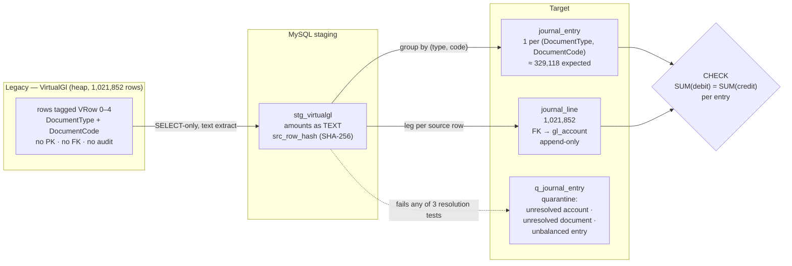
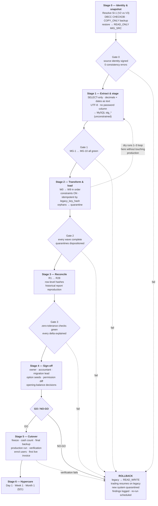
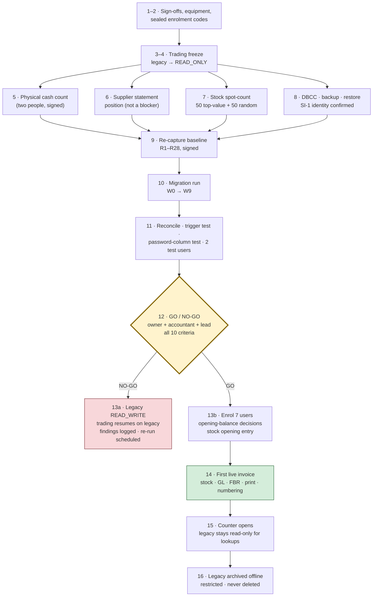

# 19b — SQL Server → MySQL 8 Data Migration Plan

> **Document purpose.** Define, to an executable level of detail, how the 19 months of live data in `FazalDinPP19DataBaseV2` (Microsoft SQL Server, WASEELA ABUZAR V3) are moved into the MySQL 8 target schema specified in `19-mysql-schema-blueprint.md` — what is extracted, how every type is converted, how keys and legacy identities are preserved, what is deliberately **not** carried across, how the result is *proved* correct against numeric control totals, and how the whole thing is rolled back at every stage if it is not.
>
> **Analysis stage.** Stage 3 — Target Design / Migration Engineering. Binding inputs: `00b-owner-decisions-and-requirements.md` (**D3**, **D10/R3**, **D11/R3.3**, **D12/R4.6**, **P1**), `19-mysql-schema-blueprint.md` (the target), `06-database-analysis.md` (source schema + migration risk register MR-1…MR-25), `06a-data-profile-reconciliation-baseline.md` (the control totals), `07-accounting-logic.md`, `08-inventory-logic.md`, `10-reports-catalog.md`, `11-integrations-dependencies.md`.
>
> **⚠ This is a plan, not a run script.** Every procedure here is `Recommended`. No extraction, load or cutover step described below has been executed. The DDL it loads into does not exist yet — `19` §16 records **23 sign-off items (V-1…V-23)** that must be closed before DDL is generated, and this plan adds its own gates on top.
>
> **⚠ The existing system was NOT modified.** Every statement about WASEELA ABUZAR V3 in this document comes from the read-only analysis already completed (owner-authorised `SELECT`/metadata access only, decision **D2**). No schema, data, stored procedure, index, trigger or configuration in `FazalDinPP19DataBaseV2` was created, altered or dropped at any point, and **nothing in this migration plan writes to the source database** — extraction is `SELECT`-only against a *restored backup copy*, never against production (§3.2).

## Evidence-label legend

| Label | Meaning in this document |
|---|---|
| `Verified` | Read directly from the legacy schema, live data or stored-procedure source, with the citation given. |
| `Strongly Inferred` | Multiple converging pieces of legacy evidence point to one conclusion, but it is not directly stated anywhere. |
| `Unclear` | The legacy evidence is ambiguous or contradictory. Carried forward as an open question — never guessed. |
| `Missing` | The capability or data does not exist in the legacy system. |
| `Deprecated` | Exists in the legacy system, is superseded, and is deliberately not carried forward. |
| `Broken/Incomplete` | Exists in the legacy system and is defective. Named so the migration is explicit about what it refuses to propagate. |
| `Recommended` | **A proposal for the NEW system or for the migration process.** Not an existing feature and not an existing procedure. |

**Anti-hallucination rule applied throughout:** every migration step, mapping decision, gate and rollback procedure in this document is `Recommended`. Legacy facts are cited and labelled separately.

---

## 1. The five binding constraints this plan is built around

These are not engineering preferences. They are owner decisions, and every section below is subordinate to them.

| # | Constraint | Source | What it forces in this plan |
|---|---|---|---|
| **C1** | **Only 2025-01-01 → 2026-07-31 migrates.** No pre-2025 data exists anywhere. | **D3**, `06a` §2, `Verified` | No archive discovery phase, no multi-era schema reconciliation. A date-window filter is applied as a *safety assertion*, not as a selection rule — because every transactional table already starts on/about 2025-01-01, any row outside the window is an **anomaly to investigate**, not data to silently drop (§9.4). |
| **C2** | **All financial opening balances start at ZERO.** Legacy cash (214,311,842 Dr) and supplier (182,671,130 Cr) balances are fiction (**F1**). | **D10/R3.1**, `00b` F1, `Verified` | No opening-balance journal is generated for cash, bank, suppliers, customers or equity. The legacy figures are written to `opening_balance_decision.legacy_amount` as **archived reference only** and are never posted to `journal_line` (§16). |
| **C3** | **Physical stock carries over unchanged** — quantities, average costs, and whatever batch/expiry values exist. | **D11/R3.3**, `08` §3.3, §4.3, §8.3, `Verified` | 6,164 `GodownDetail` rows become `stock_lot` + `stock_balance` + one opening `stock_movement` each, at the **exact** quantities and costs held on the snapshot. Reconciliation R13 is a stop-the-migration gate (§18). |
| **C4** | **Batch/expiry is NOT back-filled with invented dates.** | **D12/R4.6**, `00b` F2, `Verified` | Batch `'.'` → `NULL`; expiry `2030-12-12` / `2022-12-12` / `2012-12-12` → `NULL` + `expiry_status='unknown'`. No date is guessed, inferred from shelf life, or copied from a similar item. Real data accrues from go-live forward (§13). |
| **C5** | **Legacy plaintext passwords are never migrated in any form.** | `06` §6.8 L1, MR-3, `Verified`, Critical | `Users.Password varchar(60)` is excluded at the **extraction query level** — it is not selected, not staged, not logged, not written to any intermediate file. Every one of the 9 users force-resets at first login (§15). This is a hard security requirement, not a recommendation. |

---

## 2. Migration strategy in one page

`Recommended`.

**Shape: a staged, restartable, SQL-native ETL through a MySQL staging schema.**

```
SQL Server (restored backup copy)
   → typed extraction (SELECT-only, decimals as strings)
   → MySQL staging schema  stg_*   (verbatim, loosely typed, no constraints)
   → transform + load in SQL       (deterministic, idempotent, re-runnable)
   → MySQL target schema           (fully constrained, FKs on, CHECKs on)
   → reconciliation_check          (16 invariants + 12 additions)
   → sign-off → cutover
```

**Five decisions that define the approach, and why:**

| # | Decision | Why this and not the alternative |
|---|---|---|
| **S-1** | **Extract from a restored backup, never from live production.** | The source is a running retail pharmacy doing ~540 invoices/day (`06a` §2, `Verified`). A long-running extraction against production takes read locks on `SaleLedger` and `VirtualGl` and would slow the counter. It also guarantees a *frozen, reproducible* snapshot — dry run 3 must read exactly what dry run 1 read, or the reconciliation numbers move under the plan's feet (§18.1 documents the drift already observed between two analysis snapshots). |
| **S-2** | **Land verbatim in a MySQL `stg_` schema first, transform in MySQL.** | Transformation logic written as MySQL `INSERT … SELECT` is (a) testable without SQL Server present, (b) re-runnable in seconds against staged data, (c) diff-able in Git, and (d) executed by the same engine that will enforce the constraints. Transforming *during* transfer couples network, driver and business logic into one un-debuggable step. Staging also makes MG-1/MG-2/MG-3 pre-flight checks (§9.5) runnable against the actual bytes that will be loaded, not against the source. |
| **S-3** | **Every load step is idempotent and keyed on `legacy_id`.** | Each transform is `INSERT … ON DUPLICATE KEY UPDATE` or is preceded by a scoped `DELETE` of its own `migration_batch_id`. A failed step is re-run, not surgically repaired. This is what makes three dry runs affordable. |
| **S-4** | **Constraints ON during the target load, not deferred and re-enabled.** | `19` §2.2 mandates strict `sql_mode`; `06` MR-25 warns the new schema is stricter than the old data (**only 23 CHECK constraints exist in the entire legacy database**, `Verified`). Loading with FKs off and switching them on afterwards hides violations until the worst possible moment. Instead the *staging* schema is unconstrained, violations are found there by explicit report queries, and the target load only ever receives rows already proven to fit. |
| **S-5** | **Nothing is dropped silently. Ever.** | Every source row lands in `migration_row_map` (T105) with a `disposition` of `migrated`, `excluded`, `merged`, `rejected` or `deferred` and a `reason`. 507 empty tables and ~160 dormant/staging/clone tables are excluded **by recorded decision** (`19` §11, `06` MR-24). "Where did `Rightsclone` go?" must have an answer in the database in three years' time. |

**Explicitly rejected approaches (and why they are wrong here):**

| Rejected | Why |
|---|---|
| One-shot "big bang" export/import over a weekend, no dry run | Forbidden by the brief and by `06a` §6, which requires the baseline to be re-captured, the migration run, all checks re-run, and a match report **signed off** before go-live. A single uncontrolled run has no rollback other than "restore and try again next month". |
| Dual-run / parallel operation of both systems for a period | The legacy stock engine decrements `GodownDetail` at *save* time from the compiled PowerBuilder client (`08` §4.3, `Verified`) and the GL is materialised lazily on balance enquiry (`07` §3.1, `Verified`). There is no clean, observable transaction boundary to replicate from. Dual-run would require reverse-engineering the client's write ordering — the single largest unknown in the whole analysis (`08` §1, "roughly half of the inventory rules are only observable indirectly"). |
| Trickle/CDC migration with a sync window | Same reason, plus SQL Server Express has no CDC. |
| Migrating the schema mechanically (all 762 tables) and cleaning up later | 66.5 % of tables are empty (`06` §3.0, `Verified`). Importing them imports the confusion. `19` §10 already decides the disposition of every one. |
| Carrying legacy balances forward "for continuity" | Violates **C2/D10**. Would import a 183 M phantom payable and a 214 M phantom till into a brand-new system (`00b` F1, R3.1). |

---

## 3. Source identification

### 3.1 What, precisely, is the source

| Attribute | Value | Label / evidence |
|---|---|---|
| DBMS | Microsoft SQL Server, **compatibility level 100** (SQL Server 2008 semantics) | `Verified` — `06` §5.6 D1 |
| Edition / instance | SQL Server **Express**, instance `localhost\SQLEXPRESS` | `Verified` — `06` §2, `06a` header |
| Database name in use | **`FazalDinPP19DataBaseV2`** | `Verified` — `06a` header |
| Database collation | `SQL_Latin1_General_CP1_CI_AS` — **non-Unicode, code page 1252**, case-insensitive, accent-**sensitive** | `Verified` — `06` §5.7 |
| Tables / columns | **762** tables (507 empty), **11,414** columns | `Verified` — `06` §3.0, §5.1 |
| Programmable objects | ~643 stored procedures, 74 functions, 34 views, 10 triggers | `Verified` — `06` §8.6 |
| Application source code | **None exists.** 122 compiled `.pbd` binaries only | `Verified` — `02` |
| Data window | 2025-01-01 → 2026-07-31 (19 months) | `Verified` — `06a` §2 |
| Largest objects | `StockReport` 3,215,967 rows · `VirtualGl` 1,021,852 rows (320 MB) · `Saledetail` ~620 K · `DeletedSaleItem` 235,887 | `Verified` — `06` §3.0, §3.1 |
| Currency | PKR, single currency (`Currency` 1 row, `ConversionRate` constant) | `Verified` — **D4**, `06` §3.4, `07` §11 |
| Server time semantics | `GETDATE()` = server-local **Pakistan time**; 179 columns default to it; **zero** `datetimeoffset` columns | `Verified` — `06` §5.6 |

### 3.2 The source-identity problem that must be closed before anything else

> **⛔ Blocking item SI-1 (`Unclear`, from `06` §9 MR-20 / §10 V10).**
> The archived `DBCC CHECKDB` run of **2026-05-11** — which reported **0 allocation errors and 0 consistency errors** — was executed against a database named **`FazalDinPP19DataBaseV3`**, while the database in live use is **`FazalDinPP19DataBaseV2`**. `Verified` discrepancy; the cause is `Unclear`.
>
> **Nothing may be extracted until this is resolved.** Migrating the wrong physical file is not a recoverable error — it is a silent one, because both databases would produce plausible-looking numbers.
>
> **Resolution procedure (`Recommended`):**
> 1. On the production machine, enumerate every attached database and every `.mdf`/`.ldf` path:
>    `SELECT d.name, d.state_desc, d.create_date, d.compatibility_level, f.physical_name, f.size*8/1024 AS mb FROM sys.databases d JOIN sys.master_files f ON f.database_id = d.database_id ORDER BY d.name;`
> 2. For each candidate, confirm identity against three `Verified` fingerprints that only the live database can satisfy simultaneously: `SELECT MAX(SaleInvCode) FROM SaleLedger` → **880,233**; `SELECT COUNT(*) FROM VirtualGl` → **1,021,852**; `SELECT MAX([date]) FROM SaleLedger` → **2026-07-31**.
> 3. Record the winner, its physical path, its file size and its `create_date` in `migration_batch.source_database` and in the runbook. **Signed by the owner.**
> 4. If two databases both match, **stop** and escalate — that is a data-integrity question, not a migration question.

### 3.3 Snapshot procedure (`Recommended`)

1. `DBCC CHECKDB WITH DATA_PURITY, NO_INFOMSGS` on the confirmed source. Archive the full output as a migration artefact. Any error is a **stop** (`19` §13 step 0).
2. `BACKUP DATABASE … WITH CHECKSUM, COPY_ONLY` → verify with `RESTORE VERIFYONLY … WITH CHECKSUM`. Record the backup SHA-256.
3. Restore that backup onto a **separate migration server** as `MIG_SRC_<yyyymmdd_hhmm>` and immediately `ALTER DATABASE … SET READ_ONLY`.
4. All extraction runs against that read-only restore. The production instance is never touched again by the migration.
5. Record in `migration_batch`: `source_database`, `source_snapshot_at` (the backup timestamp, **not** the restore timestamp), backup checksum, and the SI-1 identity evidence.

> **Why the snapshot timestamp matters more than it looks.** Every control total in §18 is "as at" a specific instant. The 2026-08-01 baseline in `06a` §6 and the 2026-08-01 stock profile in `08` §3.3 were captured at *different* moments and already disagree by a handful of rows (§18.1). The reconciliation compares *the restored snapshot* against *the loaded target* — both derived from the same instant — never against a number written in a document weeks earlier.

---

## 4. Source table inventory — the pharmacy-relevant subset

`Verified` row counts from `06` §3.1, §3.3–§3.6 and `06a` §2, captured 2026-08-01. **Subject to re-capture at cutover** (§18.1).

### 4.1 Tier 1 — transactional core (must reconcile to the paisa)

| # | Source table | Rows | Cols | Source PK | Target | Wave |
|---|---|---:|---:|---|---|---|
| 1 | `SaleLedger` | 291,361 | 148 | `SaleInvCode` | `sale_invoice` + `sale_invoice_fbr` + `sale_invoice_payment` | W5 |
| 2 | `Saledetail` | 620,525 / 620,619 ⚠ | 72 | **none** (non-unique clustered on `SaleInvcode`) | `sale_invoice_line` | W5 |
| 3 | `SRLedger` | 30,695 / 30,704 ⚠ | 79 | `SRInvCode` | `sale_return` | W5 |
| 4 | `SRdetail` | 44,563 | 37 | **none** (`RowId` identity, not PK) | `sale_return_line` | W5 |
| 5 | `Purledger` | 6,417 / 6,419 ⚠ | 100 | `PurInvCode` | `purchase_invoice` + `purchase_charge` | W4 |
| 6 | `Purdetail` | 113,082 | 60 | `(PurInvCode, Gcode, ICode, Batch, Expiry)` | `purchase_invoice_line` | W4 |
| 7 | `PRLedger` | 634 | 50 | `PRInvCode` | `purchase_return` | W4 |
| 8 | `PRdetail` | 2,481 | 23 | `(PRInvCode, ICode, Gcode, Batch, Expiry)` | `purchase_return_line` | W4 |
| 9 | `PurOrderHeader` | 2,810 | 53 | `POCode` | `purchase_order` | W4 |
| 10 | `PurOrderDetail` | 108,423 | 37 | `(POCode, ICode)` | `purchase_order_line` | W4 |
| 11 | `AdjHeader` | 1,539 / 1,542 ⚠ | 18 | `AdjCode` | `stock_adjustment` | W4 |
| 12 | `AdjDetail` | 11,181 | 18 | `(AdjCode, GCode, ICode, Batch, Expiry)` | `stock_adjustment_line` | W4 |
| 13 | `AdjBufferHeader` | 1,061 | 15 | `AdjBufferCode` | `stock_take` | W4 |
| 14 | `AdjBufferDetail` | 12,270 | 6 | `(AdjBufferCode, ICode)` | `stock_take_line` | W4 |
| 15 | **`VirtualGl`** | **1,021,852** | 26 | **none (heap)** | `journal_entry` + `journal_line` | W6 |
| 16 | `GodownDetail` | 6,164 / 6,165 ⚠ | 10 | `(GCode, ICode, Batch, Expiry)` | `stock_lot` + `stock_balance` + opening `stock_movement` | W3 |
| 17 | `SaleTemplateHeader` / `SaleTemplateDetail` | 93 / 320 | 5 / 18 | `SaleTemplateCode` / none | `sale_template` / `sale_template_line` | W5 |

⚠ = row count differs between the two analysis snapshots. See §18.1 — this is **expected** (the shop kept trading) and is precisely why the baseline is re-captured at cutover rather than taken from this document.

### 4.2 Tier 2 — master and reference data

| Source table(s) | Rows | Target | Wave |
|---|---:|---|---|
| `Item` | 30,052 / 30,050 ⚠ | `item` (+ `item_price`, `item_barcode`, `item_visibility`, `attributes_json`) | W2 |
| `ItemCategory` / `ItemClass` / `Manufacturer` / `GenericItem` / `MeasuringUnit` / `DosageUnit` | 7 / 12 / 838 / 1 / 1 / 16 | `item_category`, `item_class`, `manufacturer`, `generic_item`, `uom`, `dosage_form` | W1 |
| `ItemSuppliers` | 22,246 | `item_supplier` | W2 |
| `ItemNotes` | 30,046 | `item_note` (+ `attachment`) | W7 |
| `ItemImage` | 361 | `item_image` + `attachment` | W7 |
| `ItemAlert` / `ItemAlertType` | 5 / 4 | `item_alert`, `item_alert_type` | W1 |
| `Supplier` / `Customer` / `SalesMan` | 235 / 2 / 1 | `supplier`, `customer`, `salesman` | W2 |
| `MainAccounts` / `CategoryAccounts` / `SubAccounts` / `Accounts` | 5 / 13 / 29 / 264–267 ⚠ | `gl_account_main` / `_category` / `_sub` / `gl_account` | W1 |
| `Global` (81 `GT_*` bindings) | 79 | `gl_account_binding` (+ `app_setting` for non-account keys) | W1 |
| `Godown` | 1 | `warehouse` | W1 |
| `Currency` / `CurrencyDenomination` | 1 / 1 | `currency`, `cashier_shift_count` grid | W1 |
| `SalesTaxSchedule` / `TaxCategory` / `PCT` / `GSTType` | 7 / 3 / 3 / 3 | `tax_schedule` + `tax_schedule_rate`, `tax_category`, `hs_code`, `gst_basis` | W1 |
| `GSTRules`, `UnitSalesTaxRules`, `AdditionalTaxRule`, `ExtraTaxRule`, `IncomeTaxRule`, `CustomDutyRule` | 4 each | `tax_qty_rule` (one table, `rule_domain` column) | W1 |
| `FBR_DI_UOM` / `Scenario` / `TransactionType` / `DocType` | 43 / 28 / 26 / 2 | `fbr_code` | W1 |
| `SaleCategory` / `PurCategory` / `AdjCategory` / `VocherCategory` | 15 / 8 / 2 / 22 | `sale_category`, `purchase_category`, `adjustment_reason`, `voucher_category` | W1 |
| `Users` | 9 | `app_user` — **`Password` column NOT extracted** (§15) | W2 |
| `Groups` / `Rights` / `GroupRights` / `RightsCategory` / `UserGroups` | 4 / 486 / 726 / 19 / 9 | `role` + `role_policy`, `permission`, `role_permission`, `module_registry`, `user_role` | W2 |
| `GroupAllowedGodown/Header/Price/Recipient`, `GroupCashAccount`, `GroupVoucherCategory` | 33/35/54/8/43/25 | `role_scope` (six tables → one) | W2 |
| `SoftwarePreferences` / `Preferences` / `ConfigSetting` / `Global` | 1,352 / 1 / 9 / 79 | `app_setting` | W1 |
| `Module` | 57 | `module_registry` | W1 |
| `PriceType` / `GroupAllowedPrice` | 8 / 54 | `price_type`, `role_scope` | W1 |
| `_TABMAXKEY` / `_HeaderTabMaxKey` | 265 / 11 | `doc_series` + `doc_series_counter` (**seed only**, §11.4) | W1 |
| `AgingInterval` / `AgingIntervalDetail` | 1 / 8 | `option_item` (list `aging_bucket`) | W1 |
| `LockReason` | 1 | `option_item` (list `stock_hold_reason`) | W1 |

### 4.3 Tier 3 — historical / archival volume (loaded last, never on the critical path)

| Source table | Rows | Target | Note |
|---|---:|---|---|
| `StockReport` | 3,215,967 | `stock_snapshot_daily` | Largest object. Gains PK `(snapshot_date, warehouse_id, item_id)`; MG-3 must pass first (§10.2) |
| `ItemLog` | 109,473 | `item_change_log` | 139-column snapshots → field-level diff rows (§14.2) |
| `DeletedSaleItem` | 235,887 | `sale_line_removed` | Heap with **no index of any kind** (`06` §6.2, `Verified`) |
| `PreviousSaleHistory` | 94,317 | `sales_daily_item_summary` | **Rebuilt from `sale_invoice_line`, not copied** (§14.4) |
| `EventLog` | 1 | `audit_event` | Five sibling log tables are empty (§14.1) |
| `DBCC_History` / `items_corrupted` / `DropData` / `PriceChanges` | 767 / 3 / 36 / 8 | file archive + `migration_row_map` | Vendor's own defect record; preserved as evidence, not as operational data |

### 4.4 Excluded — recorded, never silently dropped

Per `19` §10–§11, all `Recommended`, all logged in `migration_row_map` / `feature_capability`:

| Class | Count | Disposition | Reason |
|---|---:|---|---|
| Empty legacy tables (dormant verticals: hospital/EMR ~85, services ~40, `EMP_*` 29, school ~14, hotel 9, production 8, loyalty/instalments ~15, quotation/sale-order ~12, `CRS_*` 71, `DB_*` 14, `IMP_*` 11) | 507 | `feature_capability` `status='deferred'`, `decision_ref='D1'` | **D1** — catalogued, deferred, never dropped |
| `PricePolicy` / `PricePolicyDetail` | 30,052 / 30,052 | `excluded` | 1:1 with items, exactly one tier each ⇒ degenerate and inert (`06` §3.1, `08` §24.1, `Verified`) |
| `ItemColour/Fabric/Sleeve/Yarn/Size/Style/Brand/Design/Thickness/Part` | 1 row each | `excluded` | Garment/textile residue existing only to satisfy `NOT NULL DEFAULT 1` FKs (`06` §3.4, `Verified`) |
| `LastPurchaseHistory` | 9,746 | `excluded` | Denormalised cache holding **supplier name as free text**, not a FK; replaced by a query (`06` §6.4) |
| `CustBalances` | 34 | **`excluded` pending V-3** | Nothing in the SQL modules writes it; live-vs-stale is `Unclear` (`06` §10 V3) |
| `ReportData`, `CrossTab_ReportData`, `VirtualGlTemp`, `StockLedger`, `temp_*`, `*Dump`, `*Mod`, `*clone`, `A`, `wrongitemtable`, `pbcat*` | mixed | `excluded` | Runtime scratch, corrupted clones, debris (`06` §7). `ReportData` in particular is a **shared 7-row global table 60 procedures DELETE-then-INSERT into** — `Broken by design`, not migrated (MR-15) |
| `InterfaceSetting`, `ColumnPreferences`, `ColumnEditStyle`, `ReportTitles`, `WindowType` | 725 / 1 / 5 / 6 / 5 | `excluded` | PowerBuilder DataWindow grid metadata; the React UI owns presentation |
| `UserRights`, `Rightsclone`, `temp_GroupRights` | 0 / 2,094 / 6,265 | `excluded` | Unused and vendor staging (`09` C.1) |
| `cmh_*` (14 tables) | 13,952 | `excluded` → **file archive** | Prior DOS/FoxPro-era landing zone with **zero foreign keys in either direction** (`06` §3.5). Also `decimal(3,0)` quantities that would truncate (M5) |
| **`Users.Password`** | 9 values | **never extracted** | **C5 / MR-3.** Not a table exclusion — a *column-level extraction ban* (§15) |

---

## 5. Target design — what the data is landing in

The target is fully specified in `19-mysql-schema-blueprint.md`: **106 tables in 11 modules**, InnoDB/`DYNAMIC`, `utf8mb4` / `utf8mb4_0900_ai_ci`, strict `sql_mode`, MySQL **8.0.16 minimum** (first version to *enforce* `CHECK`), target 8.0.36+ or 8.4 LTS. This plan does not restate it. What matters for migration is the six structural shifts the data must survive:

| # | Structural shift | Migration consequence |
|---|---|---|
| **G1** | Every table gets a **real primary key**. 117 of 762 legacy tables have none, including the four largest (`06` §6.1, `Verified`). | Surrogate `BIGINT UNSIGNED AUTO_INCREMENT` allocated at load; the legacy key is preserved separately (§8). Duplicate detection must happen **before** the PK is declared (§10). |
| **G2** | **Referential integrity is declared.** `VirtualGl` has no FK to the chart of accounts and none to any source document (`06` §4.4 R1–R2, `Verified`, Critical). | Every GL row must *resolve* to an account and to a source document during load, or be **quarantined** (§12.3). Orphans are reported and signed off — never dropped, never force-inserted. |
| **G3** | **Append-only ledgers.** `journal_line`, `stock_movement`, `item_cost_snapshot`, `audit_event` accept `INSERT` only, enforced by grant **and** by `BEFORE UPDATE`/`BEFORE DELETE` triggers that `SIGNAL SQLSTATE '45000'` (`19` §4.2). | The migration writes these under a dedicated `migration_loader` MySQL role that holds `INSERT`; the triggers must be created **after** the historical load or the loader must be exempted explicitly and the exemption revoked at cutover (§17.6). |
| **G4** | **Balance is a projection, not a source of truth.** `stock_balance` = `SUM(stock_movement.qty_delta)` by definition (`19` S3). | Carried-over stock cannot simply be inserted into `stock_balance`. Each of the 6,164 lots gets an **opening `stock_movement` row** so the balance has a ledger behind it (§13.2). The projection is then *rebuilt from* the movements and compared — a self-checking load. |
| **G5** | **Sentinels become `NULL` + explicit status.** Batch `'.'`, expiry `2030-12-12`/`2022-12-12`/`2012-12-12`, PCT `'.'`, `DueDate = getdate()` (`06` §5.6 D3–D5, `11` §2.1, `Verified`). | Decoded at transform time by an explicit, tested mapping table (§11.2). Unknowns become **countable**, which is the whole point (`19` §12.2). |
| **G6** | **Options are data (P1).** 24 `LK` lookup tables with `is_enabled`, `is_default`, `is_system`, `sort_order`, `legacy_id`. | Seeding is a *business* act, not a technical one: `19` §16 states the seeds **are** the business rules and must be owner-reviewed before load. Wave W1 is therefore gated on owner sign-off, not just on a clean run (§17.2). |

---

## 6. Table → table mapping, organised by load wave

`Recommended`. Disposition key follows `19` §10: `PORT` (technical rewrite) · `SPLIT` (one → many) · `MERGE` (many → one) · `REPLACE` (concept survives, structure does not) · `NEW` (no legacy source) · `EXCLUDE`.

Waves exist because **order is a correctness requirement, not a convenience**: a foreign key cannot resolve to a row that has not been loaded, and `stock_movement.fiscal_period_id` cannot resolve before `fiscal_period` exists.

```mermaid
flowchart LR
    W0["W0 — Governance<br/>migration_batch, migration_row_map,<br/>reconciliation_check baseline"] --> W1
    W1["W1 — Reference & options<br/>24 LK tables, chart of accounts,<br/>warehouse, tax, fiscal calendar,<br/>doc_series, gl_account_binding"] --> W2
    W2["W2 — Master data<br/>item, supplier, customer, salesman,<br/>manufacturer, app_user (NO passwords),<br/>role, permission, role_scope"] --> W3
    W3["W3 — Stock carry-over (C3)<br/>stock_lot, opening stock_movement,<br/>stock_balance, item_cost_snapshot"] --> W4
    W4["W4 — Purchase-side history<br/>purchase_invoice/_line/_charge,<br/>purchase_return, purchase_order,<br/>stock_adjustment, stock_take"] --> W5
    W5["W5 — Sales-side history<br/>sale_invoice/_line/_fbr/_payment,<br/>sale_return, sale_template"] --> W6
    W6["W6 — General ledger<br/>journal_entry, journal_line<br/>(with orphan quarantine)"] --> W7
    W7["W7 — Archives & audit<br/>stock_snapshot_daily, item_change_log,<br/>sale_line_removed, attachments"] --> W8
    W8["W8 — Opening balances at ZERO (C2)<br/>opening_balance_decision only.<br/>NO journal entries generated."] --> W9
    W9["W9 — Derived rebuilds<br/>sales_daily_item_summary,<br/>stock_balance re-projection"]
```



### 6.1 W1 — reference and options

| Source | Rows | Target | Disp. | Key transformation |
|---|---:|---|---|---|
| `MainAccounts`, `CategoryAccounts`, `SubAccounts`, `Accounts` | 5 / 13 / 29 / 264–267 | `gl_account_main` → `_category` → `_sub` → `gl_account` | PORT | Hierarchy preserved intact (`07` §2, `Verified` — `SubAccounts.CatAccCode` references `CategoryAccounts`, **not** `MainAccounts`; an earlier "mis-mapped" hypothesis was **wrong and corrected**, `00b` F1). `AccCode smallint` → `INT UNSIGNED`. The 2 noise categories (`FIXED ASSETS1`, `TEST`) are excluded **explicitly**, with reason. `is_contra` set on the 2 inverted-nature accounts pending **V-9** |
| `Global` (81 `GT_*` keys) | 79 | `gl_account_binding` + `app_setting` | SPLIT | Account-valued keys become bindings with a real FK and `is_required`; non-account keys become settings. Every `is_required` binding must resolve or W1 fails |
| `Godown` | 1 | `warehouse` | PORT | **`TRIM()` the leading space in `' GODOWN1'`** (MR-22, `Verified`) |
| `SaleCategory`, `PurCategory` | 15 / 8 | `sale_category`, `purchase_category` | PORT | `counterparty` and `qty_basis` become explicit columns instead of code branches (`07` §4.1, `08` §4.1) |
| `AdjCategory` | 2 | `adjustment_reason` | REPLACE | 2 rows → a real reason taxonomy with **mandatory `gl_account_id`** (`08` §28.5). This is the fix for "**100 % of 1,542 adjustments never reached the GL**" (`07` §13.3, `Verified`) |
| `VocherCategory` (+`Header`/`Detail`) | 22 / 20 / 114 | `voucher_category` | MERGE | 22 categories seeded verbatim; allowed sub-accounts → `allowed_sub_account_ids JSON` |
| `SalesTaxSchedule`, `TaxCategory`, `PCT`, `GSTType` | 7 / 3 / 3 / 3 | `tax_schedule` + `tax_schedule_rate`, `tax_category`, `hs_code`, `gst_basis` | SPLIT | **Rates become effective-dated.** Legacy FBR JSON reads `SalesTaxSchedule.TaxPerc` **live**, so a rate change silently rewrites historical invoices (`11` §2.4, `Verified`, High) |
| 6 × 4-row rule tables | 24 | `tax_qty_rule` | MERGE | One table + `rule_domain` |
| `FBR_DI_*` (4 tables) | 99 | `fbr_code` | MERGE | |
| `SoftwarePreferences`, `Preferences`, `ConfigSetting`, `Global` | 1,352 / 1 / 9 / 79 | `app_setting` | MERGE | The **443-column single-row `Preferences` table** is transposed to key/value rows (`06` §3.3, `Verified`, architecturally obsolete). `PrefImage` blobs → `attachment` (§16.2) |
| `Module`, `RightsCategory` | 57 / 19 | `module_registry` | PORT/MERGE | |
| `PriceType` | 8 | `price_type` | PORT | Valuation basis becomes a **named column**, not a magic integer (`08` §29 item 10, `Unclear` in legacy) |
| `Currency`, `CurrencyDenomination` | 1 / 1 | `currency`, denomination grid | PORT | |
| `AgingInterval(+Detail)`, `LockReason` | 1/8, 1 | `option_item` lists | MERGE | |
| `_TABMAXKEY`, `_HeaderTabMaxKey` | 265 / 11 | `doc_series`, `doc_series_counter` | **REPLACE** | Seeding only, by `GREATEST()` — see §11.4. **MR-1/MR-2, both Critical** |
| — | — | `fiscal_year`, `fiscal_period` | **NEW** | `Missing` in legacy — there is no period lock of any kind (`07` §9.1). Seeding depends on **V-18** (calendar vs 1 Jul–30 Jun tax year) |
| — | — | `payment_method`, `expense_category`, `cancel_reason`, `adjustment_reason`, `stock_hold_reason`, … (24 `LK` tables) | **NEW** | **P1/D9.** Seeds are business rules — owner review gate (§17.2), items **V-21**, **V-22** |

### 6.2 W2 — master data

| Source | Rows | Target | Disp. | Key transformation |
|---|---:|---|---|---|
| `Item` (135 cols) | 30,052 | `item` + `item_price` + `item_barcode` + `item_visibility` + `attributes_json` | **SPLIT** | Drop garment/auto-parts column groups; `SalePrice2..5` → `item_price` rows; `Active` preserved **exactly** (28,893 on / 1,159 off, R1.2); `Location`/`Location1` botched-rename pair collapses to one (`06` §6.8 L7, `Broken`); PCT `'.'` → `NULL` (99.4 %, `11` §2.1) |
| `ItemSuppliers` | 22,246 | `item_supplier` | PORT | |
| `Supplier`, `Customer`, `SalesMan` | 235 / 2 / 1 | `supplier`, `customer`, `salesman` | PORT | **Party ↔ GL account identity becomes an explicit FK** — in legacy it is a naming convention |
| `Manufacturer`, `GenericItem`, `ItemCategory`, `ItemClass`, `MeasuringUnit`, `DosageUnit` | 838 / 1 / 7 / 12 / 1 / 16 | corresponding `LK` tables | PORT | `GenericItem` has **one placeholder row** — effectively a new capability (`06` §3.4) |
| `Users` | 9 | `app_user` | PORT | **`Password` never extracted** (§15). `must_change_password = 1` on all 9 |
| `Groups` (29 policy cols) | 4 | `role` + `role_policy` | **SPLIT** | Reserved-word rename `Groups → role` (MR-10). 29 policy columns → rows (P1.4) |
| `Rights`, `GroupRights` | 486 / 726 | `permission`, `role_permission` | PORT | Menu-path coupling (`LevelIndex`/`IndicesString`) **dropped**; permissions name capabilities. Positive-grant-only preserved (`GroupRights.Status = 1` on all 726 rows, `Verified`) |
| `UserGroups` | 9 | `user_role` | PORT | **Union-of-grants replaces `MIN(GroupCode)`** — the legacy `fn_GetGroupCode` silently grants full admin to any user who is in ADMINISTRATOR *plus* a restricted group (`09` C.1, `Verified`, `Broken/Incomplete`) |
| 6 × `Group*` scope tables | 198 | `role_scope` | **MERGE** | Six tables → one |

### 6.3 W3–W7 — stock, transactions, ledger, archives

| Source | Rows | Target | Disp. | Key transformation |
|---|---:|---|---|---|
| `GodownDetail` | 6,164 | `stock_lot` + opening `stock_movement` + `stock_balance` | **SPLIT** | §13. Batch `'.'` → `NULL`; expiry sentinels → `NULL` + `expiry_status='unknown'`; `Locked` → `lot_status`; destructive-update model → append-only ledger |
| `Purledger` (100 cols) | 6,417 | `purchase_invoice` + `purchase_charge` | **SPLIT** | 20 `QE*`/`WE*` account columns + `MiscCharges1..5` → charge rows. Purpose `Unclear` — **V-4/V-6 gate** |
| `Purdetail` (60 cols) | 113,082 | `purchase_invoice_line` | PORT | `qty_base` computed once; `avg_cost_before/after` preserved verbatim |
| `PRLedger`/`PRdetail`, `PurOrderHeader`/`Detail`, `AdjHeader`/`Detail`, `AdjBufferHeader`/`Detail` | as §4.1 | corresponding target pairs | PORT | Adjustments gain a mandatory GL-mapped reason |
| `SaleLedger` (148 cols) | 291,361 | `sale_invoice` + `sale_invoice_fbr` + `sale_invoice_payment` | **SPLIT** | ~55 dead vertical columns dropped (recorded, not silently); fiscalization and tender externalised |
| `Saledetail` (72 cols) | 620,525 | `sale_invoice_line` | PORT | Gains a real PK; `qty_base` computed once at write time |
| `SRLedger`/`SRdetail` | 30,695 / 44,563 | `sale_return`/`_line` | PORT | + explicit `cost_basis` per line (**V-5** gate) |
| **`VirtualGl`** | **1,021,852** | **`journal_entry` + `journal_line`** | **SPLIT** | §12. Gains PK, FKs, balance `CHECK`s, append-only enforcement |
| `StockReport` | 3,215,967 | `stock_snapshot_daily` | PORT | PK `(date, warehouse, item)` — **MG-3 first**; quarterly partitions; 32-day gap annotated, never interpolated |
| `ItemLog` (139 cols) | 109,473 | `item_change_log` | **REPLACE** | Full-row snapshots → field-level diff rows (§14.2) |
| `DeletedSaleItem` | 235,887 | `sale_line_removed` | PORT | **Gains indexes** |
| `ItemNotes`, `ItemImage`, `HeaderLogo`, `SoftwarePreferences.PrefImage` | 30,046 / 361 / — / 1,352 | `item_note`, `item_image`, `attachment` | PORT | §16 |
| `EventLog` (+5 empty log tables) | 1 (+0) | `audit_event` | **MERGE** | §14.1 |
| `PreviousSaleHistory` | 94,317 | `sales_daily_item_summary` | **REPLACE** | **Rebuilt, not copied** (§14.4) |

---

## 6.4 §7–§22 at a glance

The remainder of this document is the executable half of the plan. Cross-references used earlier in §1–§6 resolve here.

| Section | Question it answers | Binding constraint served |
|---|---|---|
| §7 | How does every SQL Server type become a MySQL 8 type without losing a digit? | — |
| §8 | What are the keys, and how does every migrated row keep its legacy identity? | S-5 |
| §9 | Encoding, collation, time zone, date window | **C1** |
| §10 | Keyless tables, duplicates, NULLs, orphans | S-5 |
| §11 | Sentinel decoding, derived values, document-number seeding | **C4** |
| §12 | The 1,021,852-row general ledger | — |
| §13 | Stock carry-over and batch/expiry | **C3**, **C4** |
| §14 | Archives, logs, derived rebuilds | S-5 |
| §15 | Users and passwords | **C5** |
| §16 | Attachments, binaries, and the archived legacy balances | **C2** |
| §17 | Stages, gates, rollback — never a one-shot migration | — |
| §18 | Reconciliation: the numbers that must match, and the ones that must **not** | **C2** |
| §19 | Opening balances at cutover | **C2**, **C3** |
| §20 | The cutover-day runbook and the go/no-go gate | all |
| §21 | Day 1 / Week 1 / Month 1 verification | all |
| §22 | Open gates carried into execution; why no dates are given | — |

---

## 7. Column-level and data-type conversion

`Recommended` throughout. Legacy type facts are `Verified` and cited.

### 7.1 The four conversion principles

| # | Principle | Consequence |
|---|---|---|
| **T-1** | **Widening only.** Target precision ≥ source precision **and** target scale ≥ source scale, for every single column. | A fixed-point decimal widened to a larger fixed-point decimal is lossless *by definition* — no representation change occurs, only more room. Any mapping that would narrow a scale is a **stop**, not a rounding decision (§7.4). |
| **T-2** | **No binary floating point anywhere in the path.** Not in the extract, not in staging, not in the target, not in JSON. | `FLOAT`/`DOUBLE`/`REAL` cannot hold 0.01 exactly. A single implicit cast through a double would silently corrupt money. This includes **JSON**: numbers inside `attributes_json` are stored as **strings**, because MySQL's JSON numeric type is IEEE-754 double. |
| **T-3** | **Decimals and dates cross the wire as text, in an invariant format.** `CAST(col AS varchar(40))` for `numeric`; `CONVERT(varchar(23), col, 121)` for `datetime`. | Removes every driver, locale and regional-settings variable. A Windows locale using `,` as the decimal separator cannot corrupt an export that never asks the locale. |
| **T-4** | **The migration performs no rounding at all.** | Rounding is a *presentation* rule of the new system, not a migration act (§7.4). |

### 7.2 Master type map

`Verified` source types are those observed in the analysed subset (`06` §5, `07` §14, `08` §3.2). **MG-8** (§9.5) runs a census over all **11,414** columns before extraction; any source type not in this table is a **stop**, not a guess.

| SQL Server source | Observed at | MySQL 8 target | Rule and rationale |
|---|---|---|---|
| `numeric(15,2)` — money amounts | `VirtualGl.Debit/Credit/OutstandingAmt/Balance` (`07` §14, `Verified`) | **`DECIMAL(18,4)`** | Widening on both axes (15→18, 2→4). Range grows from 9,999,999,999,999.99 to 99,999,999,999,999.9999. |
| `numeric(12,2)`, `numeric(5,2)` | `AdvIncomeTax`, `FBRPosFee` (`07` §14, `Verified`) | **`DECIMAL(18,4)`** | Also removes the **precision cliff**: `VirtualGlTemp.FBRPosFee numeric(5,2)` caps the FBR fee at 999.99 per document and overflows `SP_VirtualGL` above it (`07` §14, `Verified`, latent defect). The target has no such cap. |
| `money` / `smallmoney` | **Not observed** in the analysed subset; existence across all 762 tables is `Unclear` | **`DECIMAL(18,4)`** | `money` is scale-4 fixed point, so the mapping is exact. MG-8 confirms whether any exist. |
| `numeric(15,4)` — quantities | `GodownDetail.CurrQty` (`08` §3.2, `Verified`) | **`DECIMAL(18,3)`** per the target standard | ⚠ **This is the one narrowing in the whole map.** It is safe **only** because `GodownDetail` has **0 rows with a fractional `CurrQty`** (`08` §3.3, `Verified`). Gate **MG-8b**: assert `COUNT(*) WHERE qty * 1000 <> ROUND(qty*1000,0)` = 0 on *every* quantity column. If any row uses the 4th decimal, the target column is widened to `DECIMAL(18,4)` — the data is never rounded to fit the schema. |
| `numeric(15,5)` — unit costs | `Item.AvgPrice` and cost columns (`08` §3.1, `Verified`) | **`DECIMAL(18,5)`** | ⚠ **Do not map unit costs to `DECIMAL(18,4)`** — that would round the 5th decimal on 30,052 items and shift the PKR 12,011,533 stock valuation. Unit rates keep scale 5; *extended amounts* use scale 4. |
| `numeric(11,5)` | `VirtualGl.ConversionRate`, `GLHeader.ConversionRate` (`07` §11, `Verified`) | **`DECIMAL(18,6)`** | Single-currency deployment (`COUNT(DISTINCT ConversionRate) = 1`, `Verified`), but the column is carried, not dropped. |
| `decimal(3,0)` | `cmh_*` legacy landing zone (`06` §3.5, M5, `Verified`) | — | **Excluded** (§4.4). Would truncate; the tables have zero FKs in either direction and are archived to file. |
| `int` | codes, quantities-as-counts | `INT` / `INT UNSIGNED` | Unsigned only where a `CHECK (x >= 0)` is also declared. |
| `smallint` | `AccCode`, `GCode` (`07` §2, `08` §3.2, `Verified`) | **`INT UNSIGNED`** | Deliberate widening: 267 accounts today, but a smallint ceiling on a chart of accounts is a future migration. |
| `tinyint` | `GodownDetail.Priority` (`08` §3.2, `Verified`) | **`TINYINT UNSIGNED`** | ⚠ Trap: SQL Server `tinyint` is **0–255 unsigned**; MySQL `TINYINT` is **−128…127 signed**. A plain `TINYINT` silently overflows above 127. `UNSIGNED` is mandatory. |
| `bigint` | rare | `BIGINT` | |
| `bit` | flags | **`TINYINT(1)`** + `CHECK (col IN (0,1))` | MySQL has no native boolean. `bit NULL` maps to `TINYINT(1) NULL` — three-state is preserved, not flattened to 0. |
| `char(1)` `'Y'`/`'N'` | `SaleLedger.Posted`, `GodownDetail.Locked`, ~180 preference flags (`06` §5, `Verified`) | **`TINYINT(1)`** boolean | Mapping `'Y'→1`, `'N'→0`. Any other value (`''`, `' '`, `NULL`, lowercase) is **quarantined**, never coerced. The distinct-value census is part of MG-1. |
| `char(n)` fixed | codes | **`VARCHAR(n)`** + `RTRIM` at load | SQL Server ANSI-pads `char`; MySQL `CHAR` strips trailing spaces on retrieval but stores them. `VARCHAR` + explicit trim makes the behaviour visible instead of engine-dependent. **Leading** spaces are *not* blanket-trimmed — `' GODOWN1'` is trimmed by an explicit, recorded rule (MR-22, §11.2), so the change is auditable. |
| `varchar(n)`, n ≤ 1000 | names, remarks, batch | **`VARCHAR(n)`** `utf8mb4` | §9.3 for collation and index-length arithmetic. |
| `varchar(n)`, n > 1000 / `varchar(max)` / `text` | `ItemNotes`, remarks | **`TEXT` / `MEDIUMTEXT`** `utf8mb4` | Indexed by prefix only (§9.3). `text` is deprecated in SQL Server; no `text` column is carried as-is without a length census. |
| `nchar` / `nvarchar` | **Not observed**; existence is `Unclear` until MG-1 | **`VARCHAR`** `utf8mb4` | If any exist they are the *only* columns that could hold Urdu today (§9.1). |
| `datetime` | 179 columns default `GETDATE()` (`06` §5.6, `Verified`) | **`DATETIME(3)`** | §7.5 proves this is lossless. |
| `smalldatetime` | scattered | **`DATETIME(3)`** | Source resolution is 1 minute; seconds/ms load as `.000`. No fabricated precision. |
| business date fields | `SaleLedger.date`, `VirtualGl.Date` | **`DATE`** (`business_date`) **in addition to** the `DATETIME(3)` instant | §9.4 — the reason is a real reporting hazard, not tidiness. |
| `image` / `varbinary(max)` | `ItemImage`, `HeaderLogo`, `SoftwarePreferences.PrefImage` | **externalised** to the attachment store; `LONGBLOB` only as fallback | §16.1 |
| `uniqueidentifier` | not observed | `CHAR(36)` `ascii_general_ci` | MG-8 confirms. |
| `timestamp` / `rowversion` | if present | **not migrated** | Engine-internal; replaced by `row_version BIGINT` + `updated_at` in the target (`19` §2). |
| `IDENTITY` property | `SRdetail.RowId` and others | **`AUTO_INCREMENT`** on the new surrogate PK only | Legacy identity **values** are preserved as `legacy_id` (§8.2); they are never reused as the new PK. |
| computed / persisted columns | scattered | **`GENERATED … STORED`** or computed once at load | Any legacy computed column whose formula cannot be read (compiled client) is materialised as data and flagged `Unclear`. |
| `sql_variant`, `xml`, spatial | not observed | — | **Stop** if MG-8 finds any. No default mapping is pre-authorised. |

### 7.3 Column-level audit artefact

`Recommended`. Every one of the **11,414** source columns gets exactly one row in **`migration_column_map`**:

| Column | Meaning |
|---|---|
| `source_table`, `source_column`, `source_type` | verbatim from `INFORMATION_SCHEMA.COLUMNS` |
| `disposition` | `mapped` · `split` · `merged` · `derived` · `dropped` · `excluded_table` |
| `target_table`, `target_column`, `target_type` | populated for the first four |
| `transform_rule_id` | FK to `transform_rule` (§11.1) where a value changes |
| `reason` | mandatory when `dropped` — e.g. "garment vertical residue, D1 deferred" |
| `evidence_ref` | doc + section, or procedure + line |

This is what makes S-5 real at column granularity: **~55 dead columns dropped from `SaleLedger` and the garment/auto-parts groups dropped from `Item` are dropped on the record, with a reason, not silently.**

### 7.4 The rounding rule

> **R-ROUND-1 (`Recommended`, non-negotiable): the migration never rounds a stored value.**
> If a mapping cannot carry a value at full precision, the mapping is wrong and the load stops. Rounding is never used to make data fit.

| Where rounding *does* live | Rule |
|---|---|
| Presentation of PKR amounts in the UI and on printed documents | **Round half up, away from zero, to 2 decimals.** PKR is a 2-decimal currency; the paisa is the smallest unit. |
| Computation of new documents in the new system (line extension, tax, discount) | Computed in `DECIMAL`, rounded **once**, at the line-total boundary, half up; never in a loop, never on intermediates. |
| Reproduction of legacy reports (§18.3 R28) | Where the legacy report itself rounded — e.g. `Round(I.AvgPrice, 2)` in the stock valuation report (`08` §1278, `Verified`) — the **report** applies the same rounding. The **stored** value stays unrounded, so the rounding is reproducible and reversible. |
| Migration of historical values | **None.** Values land exactly as extracted. |

Derived values the migration computes once (e.g. `qty_base = LooseQty + PackQty × PackUnits`) are exact integer/decimal arithmetic with no rounding step (§11.3).

### 7.5 Proof that no precision is lost on the 1,021,852 GL rows

`Recommended` procedure; the source facts are `Verified`.

**The structural argument.** `VirtualGl.Debit` and `VirtualGl.Credit` are `numeric(15,2)` (`07` §14, `Verified`). The target is `DECIMAL(18,4)`. Both are **exact fixed-point decimal** types. 18 ≥ 15 and 4 ≥ 2, so the target's representable set is a strict superset of the source's. There is no encoding change, no radix change, and — because of **T-2** and **T-3** — no floating-point type and no locale-dependent parser anywhere between them. Loss is therefore not merely unlikely; it is **not representable**.

**Four executable proofs** (all must return zero / an exact match; each writes a row to `reconciliation_check`):

| Proof | Runs against | Query | Expected |
|---|---|---|---|
| **P1 — scale census** | SQL Server restore | `SELECT COUNT(*) FROM VirtualGl WHERE Debit*100 <> ROUND(Debit*100,0) OR Credit*100 <> ROUND(Credit*100,0);` | `0` — confirms nothing beyond 2 dp exists at source |
| **P2 — magnitude census** | SQL Server restore | `SELECT MAX(ABS(Debit)), MAX(ABS(Credit)), MAX(ABS(OutstandingAmt)), MAX(ABS(BALANCE)) FROM VirtualGl;` | each `< 10^14`, i.e. inside `DECIMAL(18,4)` |
| **P3 — text round-trip** | MySQL staging (`stg_virtualgl`, amounts held as `VARCHAR`) | `SELECT COUNT(*) FROM stg_virtualgl WHERE CAST(debit_txt AS DECIMAL(18,4)) <> CAST(debit_txt AS DECIMAL(38,10)) OR CAST(credit_txt AS DECIMAL(18,4)) <> CAST(credit_txt AS DECIMAL(38,10));` | `0` — if any digit existed beyond scale 4, the two casts would differ |
| **P4 — aggregate identity** | MySQL target vs the re-captured baseline | `SELECT COUNT(*), SUM(debit), SUM(credit), SUM(debit)-SUM(credit) FROM journal_line;` | `1,021,852` · `455,292,133.0000` · `455,292,133.0000` · `0.0000` (`06a` §1, `Verified`) |

**P5 — the row-level proof, because aggregates can hide compensating errors.** Two equal-and-opposite corruptions net to zero in P4. They cannot survive a per-row hash:

```sql
-- in staging, over the extracted TEXT (nothing has been typed yet)
UPDATE stg_virtualgl SET src_row_hash = SHA2(CONCAT_WS('|',
    doctype_txt, doccode_txt, vrow_txt, acccode_txt, altacc_txt,
    date_txt, debit_txt, credit_txt), 256);

-- after the target load, recompute from the TYPED columns, formatted back to text
SELECT COUNT(*) AS row_hash_mismatches
FROM   journal_line jl
JOIN   stg_virtualgl s ON s.stg_row_id = jl.stg_row_id
WHERE  s.src_row_hash <> SHA2(CONCAT_WS('|',
         je.doc_type, je.doc_no, jl.leg_seq, jl.gl_account_legacy_id,
         jl.statistical_party_legacy_id,
         DATE_FORMAT(je.business_date,'%Y-%m-%d %H:%i:%s.%f'),
         FORMAT(jl.debit, 4), FORMAT(jl.credit, 4)), 256);
```

Expected: **0 mismatches across all 1,021,852 rows**. This is check **R26** (§18.3) and it runs at 100 % coverage on `VirtualGl` — the table is 320 MB and a full hash pass is cheap relative to the cost of being wrong about the general ledger.

**Two additional guards:**

- **Aggregate-type safety.** MySQL `SUM()` over `DECIMAL(18,4)` returns `DECIMAL` with extended precision and is exact. `SUM()` over `DOUBLE` is not. The staging and target columns are asserted to be `DECIMAL` by an `INFORMATION_SCHEMA` test that runs before P4, so P4 cannot pass against a mistyped column.
- **`OutstandingAmt` and `BALANCE` are not migrated as ledger facts** — they are running projections materialised by the lazy `SP_VirtualGL` engine (`07` §3.1, `Verified`). They are carried into the archive export only (§12.4). Migrating a stale projection as if it were a posting is how a "reconciled" migration produces wrong balances.

---

## 8. Key strategy

`Recommended`.

### 8.1 Primary keys

Every target table gets a surrogate **`BIGINT UNSIGNED AUTO_INCREMENT`** primary key (`19` §2, G1). This is not a stylistic preference — three legacy facts make natural keys impossible:

| Legacy fact | Why a natural PK cannot survive |
|---|---|
| `PK_GodownDetail (GCode, ICode, Batch, Expiry)` with `Batch = '.'` on 96.1 % of rows and `Expiry = 2030-12-12` on 99.1 % (`08` §3.2, §14, `Verified`) | Under **C4** both sentinels become `NULL`. **`NULL` cannot participate in a primary key.** The natural key literally ceases to exist the moment the sentinel policy is applied. |
| 117 of 762 tables have no PK at all, including the four largest (`06` §6.1, `Verified`) | There is no natural key to preserve for `VirtualGl`, `Saledetail`, `StockReport` or `DeletedSaleItem` (§10.1). |
| Document numbers are allocated by `_TABMAXKEY`, a read-increment-write max-key table with no concurrency protection (MR-1/MR-2, **Critical**, `Verified`) | A key allocation mechanism with a known race is not a trustworthy identity source. It is preserved as a *human-facing document number*, not as a database identity (§8.4). |

### 8.2 Legacy-identity preservation — every migrated row keeps its legacy key

> **K-1 (`Recommended`, applies to every table in waves W1–W7 without exception).**
> No row is migrated without carrying the identity it had in the legacy system.

Every migrated table carries this block:

| Column | Type | Purpose |
|---|---|---|
| `legacy_source_table` | `VARCHAR(64) NOT NULL` | e.g. `SaleLedger`. Present even where a target table has one source, because MERGEs (`role_scope` ← six tables) have several. |
| `legacy_id` | `BIGINT NULL` | The single-column legacy key where one exists (`SaleInvCode`, `PurInvCode`, `ICode`, `AccCode`, …). |
| `legacy_key_json` | `JSON NULL` | The full composite key where the legacy key is composite (`GodownDetail`: `{"GCode":1,"ICode":4231,"Batch":".","Expiry":"2030-12-12"}`) — recorded **pre-transformation**, i.e. with the sentinels still visible, so the original row can always be found again in the archived source. |
| `legacy_key_hash` | `CHAR(64) GENERATED ALWAYS AS (SHA2(CONCAT_WS('|',legacy_source_table,COALESCE(legacy_id,''),COALESCE(legacy_key_json,'')),256)) STORED` | **`UNIQUE`.** This is what makes every load step idempotent (S-3): the transform is an `INSERT … ON DUPLICATE KEY UPDATE` against this unique key, so re-running a failed wave converges instead of duplicating. |
| `migration_batch_id` | `BIGINT UNSIGNED NULL` | `NULL` for rows created after go-live. Instantly separates migrated history from live trading — needed by every verification query in §21. |

Plus the central register **`migration_row_map`** (T105, `19` §11), one row per **source** row: `source_table`, `source_key_json`, `target_table`, `target_id`, `disposition` (`migrated`/`excluded`/`merged`/`rejected`/`deferred`), `reason`, `migration_batch_id`. Check **R27** (§18.3) proves the register accounts for every source row in every migrated table — the formal "nothing vanished" proof.

### 8.3 Foreign keys

| Rule | Detail |
|---|---|
| **K-2 — FKs are declared and enforced from the first load** | MySQL has **no `DEFERRABLE` constraints**. There is no "load now, check later" option, which is precisely why waves exist (§6). Wave order *is* the dependency order. |
| **K-3 — FKs resolve through `legacy_key_hash`, not through business text** | The load joins staging to the already-loaded parent on the legacy key and takes the parent's surrogate PK. It never matches on a name. `LastPurchaseHistory` is excluded specifically because it holds **supplier name as free text rather than a key** (`06` §6.4, `Verified`) — that is the failure mode being avoided. |
| **K-4 — an unresolved FK is quarantined, never nulled and never invented** | Three forbidden repairs: forcing `NULL` on a `NOT NULL` relationship, creating a placeholder parent ("UNKNOWN SUPPLIER"), and dropping the child row. All three destroy evidence. §10.5. |
| **K-5 — `ON DELETE RESTRICT` / `ON UPDATE RESTRICT` everywhere in the migration path** | Cascades during a migration turn one bad row into many. |
| **K-6 — the GL gets the FKs it never had** | `VirtualGl` has no FK to the chart of accounts and none to any source document (`06` §4.4 R1–R2, `Verified`, Critical). Both are declared in the target, which is why §12.3 exists. |

### 8.4 Document-number continuity

The shop's invoice numbering is customer-visible and referenced on paper: `MAX(SaleInvCode) = 880,233` (`Verified`, §3.2). Continuity is preserved **without** making the legacy number the database identity:

- `sale_invoice.doc_no` = the legacy `SaleInvCode`, `UNIQUE` per series, human-facing.
- `sale_invoice.id` = surrogate PK, never shown.
- `doc_series_counter` seeded strictly above the legacy maximum (§11.4), so the next invoice printed after cutover continues the sequence the shop already knows.

### 8.5 Duplicate handling — policy

Detection and dispositions are in §10.2–§10.3. The **policy** is:

| Class | Policy | Why |
|---|---|---|
| Exact duplicate rows in a **ledger** (`VirtualGl`, `Saledetail`, `DeletedSaleItem`) | **Preserved as distinct rows.** | A duplicated GL row is a duplicated *posting*; it moved the balance. Deduplicating it would break `SUM(Debit) = SUM(Credit) = 455,292,133` — the single most important invariant in the migration. History is reproduced, not corrected. |
| Duplicates in **master/reference** data (items, suppliers, accounts, lookup lists) | **Merged**, with the surviving row recorded and both legacy keys mapped in `migration_row_map` (`disposition='merged'`). | Two rows for one real-world supplier are a data-quality defect, and the FK targets must be unambiguous. |
| Duplicates that would violate a **newly declared PK** (`stock_snapshot_daily`) | **Stop-gate.** Owner decision between quarantine-all, keep-last, or widen the key. Default: quarantine and stop. | §10.2. |
| Duplicate **document numbers** | **Stop-gate** (MG-4). | Would indicate the `_TABMAXKEY` race actually fired (MR-1). Needs to be known before, not after. |

### 8.6 NULL handling — policy

| Rule | Detail |
|---|---|
| **N-1** | A legacy sentinel becomes `NULL` **plus** an explicit status column — never a bare `NULL`. Unknowns must stay *countable* (`19` §12.2). §11.2 is the complete decode table. |
| **N-2** | For optional free text: `TRIM()`, then `'' → NULL`. Empty string and NULL must not both mean "not entered" in the same column. |
| **N-3** | For codes and FK columns: `'' → NULL`, and `NULL` on a required relationship is a quarantine, not a load. |
| **N-4** | `NOT NULL DEFAULT` values that exist only to satisfy a legacy constraint (`LockReasonCode DEFAULT 1`, garment FKs `DEFAULT 1`) are **not** carried as data. They become `NULL` or the column is dropped with a recorded reason (`06` §3.4, `Verified`). |
| **N-5** | Three-state `bit`/`char(1)` columns keep three states. `NULL` is never flattened to `0`/`'N'`. |

### 8.7 Orphan handling — policy

Zero tolerance for silent repair. Every orphan is **quarantined, reported, and dispositioned by a named owner** before its wave can be signed off (§10.5). The permitted dispositions are exactly four: `resolved` (the parent was found — usually a load-order error), `excluded` (owner decision, reason recorded), `deferred` (loaded into a holding table for later correction), `rejected` (proven to be corrupt legacy data; the row is archived, never loaded). "Deleted" is not among them.

---

## 9. Encoding, dates and locale

### 9.1 The collation reality — and the Urdu question

**`Verified`:** the source database collation is `SQL_Latin1_General_CP1_CI_AS` (`06` §5.7) — a **non-Unicode, code page 1252, case-insensitive, accent-sensitive** collation.

The consequence is uncomfortable and must be stated plainly:

> **Urdu script cannot be stored in a `varchar` column under code page 1252.** Any Urdu text ever typed into a `varchar` column in this system was converted to `?` on the way in and is **already lost** — not lost by this migration. `Strongly Inferred`, and confirmed or refuted per column by **MG-1**.

Therefore:

| Question | Answer |
|---|---|
| Do legacy item and supplier names contain Urdu today? | **`Unclear` until MG-1.** They can only do so in `nchar`/`nvarchar` columns, and none have been observed in the analysed subset. The working expectation is Latin-script transliteration throughout. |
| Does the migration invent, transliterate or back-fill Urdu names? | **No.** `item.name_ur` and `supplier.name_ur` are created **empty** (`NULL`) and populated by users after go-live. Inventing a name is inventing data. |
| Does the target support Urdu? | **Yes** — `utf8mb4` end to end (`19` §2.2), which is *why* the capability becomes real going forward (`Recommended`). |
| Does `utf8mb4` matter even if today's data is pure ASCII? | **Yes.** CP1252 positions 0x80–0x9F hold curly quotes, en/em dashes and the euro sign, which appear routinely in pasted supplier names and item descriptions. Handling them wrongly is §9.2. |

### 9.2 Extraction encoding — the CP1252 trap, stated concretely

> **The single most common encoding bug in a SQL Server → MySQL migration:** treating a CP1252 column as ISO-8859-1 (`latin1`). They agree on 0x00–0x7F and 0xA0–0xFF but **differ on 0x80–0x9F**. Reading a CP1252 `’` (0x92) as latin1 yields U+0092, an invisible control character. The name looks *almost* right, sorts wrongly, and breaks search.

**E-1 (`Recommended`):** never hand-decode bytes. Let SQL Server perform the code-page mapping it owns:

```sql
SELECT CAST(ItemName AS nvarchar(400)) AS ItemName_u   -- CP1252 → UTF-16, correctly
FROM   Item;
```

then write the result as **UTF-8 without BOM**. The extraction client reads Unicode from the driver; no byte-level guessing occurs at any point.

**E-2:** the file format is delimiter-safe by construction. `ItemNotes` (30,046 rows) is free text and *will* contain commas, quotes and newlines. Use `FIELDS TERMINATED BY 0x1F ... LINES TERMINATED BY 0x1E` (ASCII unit/record separators) with `LOAD DATA LOCAL INFILE`, rather than CSV quoting rules that differ between exporter and importer.

**E-3:** control characters. Strip `0x00` (MySQL text handling and downstream tooling both dislike embedded NULs), and **log every stripped character** to `data_quality_exception` with the row key. Preserve `\t`, `\r`, `\n` inside free text. MG-1 counts them first so the volume is known before, not discovered after.

### 9.3 Target collation — and the accent-insensitivity collision

Target default: `utf8mb4` / `utf8mb4_0900_ai_ci` (`19` §2.2). But the source is **accent-SENSITIVE** (`_AS`) and the target default is **accent-INSENSITIVE** (`_ai_`). That is a semantic change, and it bites in exactly one place:

> **MG-2 (`Recommended`, blocking):** for every column that gains a `UNIQUE` index in the target (item barcode, item code, supplier code, account code, user login, document number), test whether two values that were **distinct** under `SQL_Latin1_General_CP1_CI_AS` become **equal** under `utf8mb4_0900_ai_ci`. Any collision is a **stop**: it means the `UNIQUE` index cannot be created without losing a row.

| Column class | Target collation | Why |
|---|---|---|
| Names, descriptions, notes, addresses (searched by humans) | `utf8mb4_0900_ai_ci` | Accent- and case-insensitive search is what users expect. |
| **Codes, barcodes, batch numbers, document numbers, login names** | **`utf8mb4_0900_as_cs`** (accent- and case-**sensitive**) | A barcode is an identifier, not a word. Two barcodes differing only by case are two barcodes. This also preserves the source's `_AS` semantics exactly where it matters. |
| Hashes, base64, tokens | `ascii_general_ci` or `binary` | Never `utf8mb4` — wastes index bytes for no benefit. |

**Index-length arithmetic** (a real constraint, not a footnote): `utf8mb4` reserves **4 bytes per character** for index key computation, and InnoDB's `DYNAMIC` row format allows a **3072-byte** index key. So `VARCHAR(768)` is the largest fully indexable single column, and a composite index over two `VARCHAR(400)` columns **will fail to create**. Two consequences for this migration: `Batch varchar(100)` (400 bytes) indexes fine; long text columns get **prefix indexes** (`KEY (note(191))`) declared explicitly in the DDL, never left to chance.

### 9.4 Dates, time zone and the date window (**C1**)

**`Verified` source semantics:** `GETDATE()` is server-local Pakistan time, 179 columns default to it, and there are **zero `datetimeoffset` columns** in the entire database (`06` §5.6). Every timestamp in the source is a naive local instant.

| Rule | Detail |
|---|---|
| **T-Z1** | **Asia/Karachi is UTC+05:00 with no DST anywhere in the migrated window.** Pakistan last observed DST in 2009 (IANA tzdata, `Verified`). Across 2025-01-01 → 2026-07-31 the local↔UTC mapping is therefore a **constant +05:00** — there are no ambiguous or non-existent local times to resolve, and no row needs a policy decision. This is a genuine simplification, and it is worth stating so nobody builds machinery for a case that cannot occur. |
| **T-Z2** | Instants are stored as **`DATETIME(3)` in UTC**. **`TIMESTAMP` is forbidden** in the target: it silently converts on read/write according to the session time zone, and it dies in 2038. |
| **T-Z3** | Every connection — loader, application, reporting, backup verification — sets `time_zone = '+00:00'`. `DATETIME` is time-zone-naive so it does not shift, but `NOW()`, `CURDATE()` and any `DEFAULT CURRENT_TIMESTAMP` do. Determinism is not optional during a migration. |
| **T-Z4** | **`business_date DATE` is stored explicitly, derived from the legacy *local* date — never computed from the UTC instant.** This is the trap: a sale saved at 02:00 PKT on 2026-03-01 is 21:00 UTC on 2026-02-28. Deriving the day from UTC would move roughly every late-night invoice into the previous day and quietly break every daily report — including reconciliation check **R19**, which compares 545 daily totals. The shop trades past midnight; this is not hypothetical. |
| **T-Z5** | `sql_mode` includes `STRICT_ALL_TABLES`, `NO_ZERO_DATE`, `NO_ZERO_IN_DATE`, `ERROR_FOR_DIVISION_BY_ZERO` (`19` §2.2). `'0000-00-00'` cannot be inserted; a legacy zero/blank date becomes `NULL` + status, by rule N-1. |
| **T-Z6** | Range: SQL Server `datetime` starts at 1753-01-01, MySQL `DATETIME` at 1000-01-01. No source value can fall outside the target range. `smalldatetime` (1900-01-01…2079-06-06) likewise. |
| **T-Z7** | The `DueDate = getdate()` sentinel (`06` §5.6 D5, `Verified`) and the `2030-12-12` / `2022-12-12` / `2012-12-12` expiry sentinels become `NULL` + status (§11.2). A sentinel that survives into the target as a *date* will be treated by the new system as a real date — a stock item "expiring in 2030" is worse than one marked unknown. |

**Date-window enforcement (C1 / D3).** The window is **2025-01-01 → 2026-07-31**, and every transactional table already starts on/about 2025-01-01 (`06a` §2, `Verified`). The filter is therefore an **assertion**, not a selection:

```sql
-- run per transactional table during MG-9, against the frozen restore
SELECT 'SaleLedger' AS src, MIN([date]) AS min_dt, MAX([date]) AS max_dt, COUNT(*) AS rows,
       SUM(CASE WHEN [date] < '2025-01-01' OR [date] >= '2026-08-01' THEN 1 ELSE 0 END) AS out_of_window
FROM   SaleLedger
UNION ALL SELECT 'VirtualGl', MIN([Date]), MAX([Date]), COUNT(*),
       SUM(CASE WHEN [Date] < '2025-01-01' OR [Date] >= '2026-08-01' THEN 1 ELSE 0 END) FROM VirtualGl
UNION ALL SELECT 'StockReport', MIN([Date]), MAX([Date]), COUNT(*),
       SUM(CASE WHEN [Date] < '2025-01-01' OR [Date] >= '2026-08-01' THEN 1 ELSE 0 END) FROM StockReport
-- … Purledger, PRLedger, SRLedger, AdjHeader, PurOrderHeader, GodownDetail.LastUpdated
;
```

**Expected `out_of_window` = 0 everywhere.** A non-zero result is **not** a filter doing its job — it is a discovery that contradicts D3 and `06a` §2, and it is escalated to the owner before the load continues. Rows outside the window are written to `q_out_of_window` with their full source key. Nothing is dropped by a `WHERE` clause (**S-5**).

The 32-day `StockReport` gap (2025-12-08 → 2026-01-08, cause unrecorded, `08` §1663, `Verified`) is recorded as a row in **`data_gap`** and rendered as a visible break in any daily chart. **It is never interpolated.**

### 9.5 Pre-flight gates MG-1 … MG-10

`Recommended`. All run against the **staged bytes** (S-2) or the frozen restore — never against production. All must be green before the target load of the affected wave.

| Gate | What it proves | Failure action |
|---|---|---|
| **MG-1** | Character census: every `char`/`varchar`/`text` column scanned for bytes ≥ 0x80, control characters, NULs, embedded delimiters; presence/absence of any `nchar`/`nvarchar` column confirmed (§9.1). | Report; strip-with-log only for `0x00`; escalate anything else. |
| **MG-2** | No accent/case collision on any column gaining a `UNIQUE` index under `utf8mb4_0900_ai_ci` (§9.3). | **Stop.** Collation choice or uniqueness scope is revisited. |
| **MG-3** | Candidate-PK uniqueness on the keyless heaps — critically `StockReport (Date, GCode, ICode)` over 3,215,967 rows (§10.2). | **Stop.** Owner decision required. |
| **MG-4** | Document-number uniqueness per series, and the true maximum per series (§11.4). Detects whether the `_TABMAXKEY` race (MR-1/MR-2, Critical) ever fired. | **Stop** on duplicates. |
| **MG-5** | GL grouping: `COUNT(DISTINCT DocumentType, DocumentCode)` reconciles to the source document counts, and every prospective entry balances (§12.2). | **Stop** on unbalanced entries. |
| **MG-6** | `ItemLog` diff sizing on a 5,000-row sample before the full 109,473-row transform (§14.2). | Switch to the raw-JSON fallback if the diff explodes. |
| **MG-7** | Secret scan of `SoftwarePreferences` (1,352), `Preferences`, `ConfigSetting`, `Global` for credentials, tokens and connection strings **before** they become `app_setting` rows (§15.5). | Quarantine to the manual re-entry checklist. Never loaded. |
| **MG-8** | Type census over all 11,414 columns: every source type appears in the §7.2 map. **MG-8b:** every quantity column asserts zero use of the 4th decimal; every cost column asserts scale ≤ 5. | **Stop.** No unmapped type is loaded on a default assumption. |
| **MG-9** | Date-window and invalid-date census (§9.4). | Escalate; quarantine, never filter. |
| **MG-10** | Referential dry-resolution: for every FK the target will declare, count the child rows whose parent cannot be resolved (§10.5, §12.3). | Report + disposition before the wave loads. |

---

## 10. Keyless tables, duplicates, NULLs and orphans

### 10.1 Deriving identity for tables that have none

**`Verified`:** 117 of 762 legacy tables have no primary key, including the four largest (`06` §6.1).

| Table | Rows | Legacy access path | Derived identity (`Recommended`) |
|---|---:|---|---|
| `VirtualGl` | 1,021,852 | **heap, no index** | Entry = `(DocumentType, DocumentCode)`; leg ordinal derived within the entry (§12.2) |
| `Saledetail` | 620,525 | non-unique clustered on `SaleInvcode` | `(SaleInvcode, line_seq)` where `line_seq` is derived (below) |
| `StockReport` | 3,215,967 | — | `(Date, GCode, ICode)` — **MG-3**, §10.2 |
| `DeletedSaleItem` | 235,887 | **no index of any kind** (`06` §6.2, `Verified`) | `(SaleInvcode, line_seq)`, same method |
| `SRdetail` | 44,563 | `RowId` identity, not declared PK | `RowId` used directly as `legacy_id` |

**Deterministic ordinal derivation.** `ROW_NUMBER() OVER (PARTITION BY … ORDER BY (SELECT NULL))` is **not** deterministic and must never be used — a re-run would renumber the rows and break restartability (S-3) and the row hashes (P5). The ordering must be a **total order over the row's own columns**:

```sql
SELECT ROW_NUMBER() OVER (PARTITION BY SaleInvcode
         ORDER BY ICode, Batch, Expiry, PackQty, LooseQty, Rate, DiscPerc, AvgPrice /* … all remaining columns … */
       ) AS line_seq,
       *
FROM   Saledetail;
```

> **Honesty requirement.** `line_seq` is a **migration-assigned ordinal, not the original data-entry order** — the legacy heap does not record entry order, and no index preserves it. It is stored as `legacy_line_seq` with a companion `line_seq_source = 'derived'`, and the UI must never present it as "the order the cashier typed them". `Unclear` and permanently so; labelling it is the only correct treatment.

### 10.2 MG-3 — the `StockReport` primary key

`StockReport` is described as one row per item per trading day: 545 distinct dates × 8,042 distinct items = 4,382,890 possible against 3,215,967 actual (`06a` §5, `Verified`, `Strongly Inferred` granularity). The target declares `PRIMARY KEY (snapshot_date, warehouse_id, item_id)` — which is an **assertion that has never been enforced in 19 months**.

```sql
-- MG-3, against the frozen restore
SELECT COUNT(*) AS duplicate_key_groups, SUM(n) - COUNT(*) AS surplus_rows
FROM ( SELECT [Date], GCode, ICode, COUNT(*) AS n
       FROM StockReport GROUP BY [Date], GCode, ICode HAVING COUNT(*) > 1 ) d;
```

**Expected: 0 / 0.** If non-zero:

| Option | Action | When it is right |
|---|---|---|
| **A (default)** | **Stop.** Quarantine every duplicate group to `q_stock_snapshot_daily` and escalate. | Always, on the first run. `StockReport` is the **only** historical inventory-valuation series in existence and is explicitly "the single most valuable derived asset to preserve" (`08` §9.3, `Verified`). Guessing which duplicate is right destroys the asset. |
| **B** | Keep one row per key by a rule the owner approves (e.g. highest `Stock`, or the last row in physical order). | Only after the duplicates are shown to be identical or trivially explainable. |
| **C** | Widen the PK with a sequence column and keep every row. | If duplicates turn out to be legitimate intra-day snapshots — which would change the `Strongly Inferred` granularity finding and must be recorded as such. |

The 32-day gap is a *missing-row* condition, not a duplicate one; it is handled by `data_gap` (§9.4) and never by generated rows.

### 10.3 Duplicate detection matrix

| Detection | Scope | Gate | Disposition |
|---|---|---|---|
| Exact full-row duplicates | `VirtualGl`, `Saledetail`, `DeletedSaleItem`, `StockReport` | MG-3 | Ledgers: **kept** (§8.5). `StockReport`: stop. |
| Duplicate document numbers | `SaleLedger.SaleInvCode`, `Purledger.PurInvCode`, `SRLedger.SRInvCode`, `PRLedger.PRInvCode`, `AdjHeader.AdjCode`, `PurOrderHeader.POCode` | MG-4 | **Stop** — would prove the `_TABMAXKEY` race fired. |
| Duplicate master identity | `Item` (name + pack + manufacturer), `Supplier` (name), `Accounts` (code) | pre-W2 report | Owner-approved merge, `disposition='merged'`, both legacy keys retained. |
| Case/accent duplicates | any column gaining `UNIQUE` | MG-2 | Stop; see §9.3. |
| Duplicate option/lookup values across the 24 `LK` seeds | W1 | owner review gate G-W1 (§17.2) | Merge before load; the owner decides the surviving label. |

### 10.4 NULL, empty and sentinel census

Run per column during staging; results drive §11.2 and are attached to the wave sign-off.

```sql
SELECT 'Item.PCT' AS col, COUNT(*) AS total,
       SUM(CASE WHEN PCT IS NULL THEN 1 ELSE 0 END)          AS is_null,
       SUM(CASE WHEN LTRIM(RTRIM(PCT)) = '' THEN 1 ELSE 0 END) AS is_blank,
       SUM(CASE WHEN PCT = '.' THEN 1 ELSE 0 END)             AS is_sentinel
FROM Item;
```

Known headline results (`Verified`): `Item.PCT = '.'` on **99.4 %** of rows (`11` §2.1); `GodownDetail.Batch = '.'` on **96.1 %**; `GodownDetail.Expiry = 2030-12-12` on **99.1 %** (`08` §14). These percentages are re-measured at cutover and **reported to the owner as a headline** (§13.5) so that "the new system shows 99 % unknown expiry" is an expected, explained outcome rather than a day-1 panic.

### 10.5 Orphan detection and quarantine

Every relationship the target will declare gets a dry-resolution query in **MG-10**:

```sql
-- pattern, run in MySQL staging after both parent and child are staged
SELECT COUNT(*) AS orphans
FROM   stg_saledetail d
LEFT   JOIN stg_saleledger h ON h.SaleInvCode = d.SaleInvcode
WHERE  h.SaleInvCode IS NULL;
```

| Orphan class | Known/likely instances | Treatment |
|---|---|---|
| **Child without parent** | detail rows whose header was deleted; GL rows whose `DocumentCode` no longer exists (amendments delete and re-derive GL rows, `07` §9.3, `Verified`) | `q_<target>` quarantine table, full source row preserved, reason `parent_not_found`, owner disposition required before wave sign-off. |
| **Unresolvable code reference** | `VirtualGl.AccCode` values not present in `Accounts` — possible because no FK has ever existed (`06` §4.4 R1, `Verified`, Critical) | §12.3. **Never** posted to a suspense account by the migration. |
| **Ambiguous reference** | party ↔ GL account identity, which is a *naming convention* in legacy, not a key (§6.2) | Resolved by an explicit, reviewed mapping table produced in W2; unmatched entries quarantined. |
| **Self-referential / hierarchy break** | `SubAccounts.CatAccCode → CategoryAccounts` chain (`07` §2, `Verified`) | Hierarchy integrity asserted before W1 sign-off; a break stops the chart of accounts load. |

**Quarantine tables are permanent, not temporary.** They ship with the system, are visible to the owner, and are reviewed again at Month 1 (§21). A quarantined row that is never dispositioned is a finding, not a silent success.

---

## 11. Value-level transformation rules

### 11.1 Transformations are data, not code (P1/D9 applied to the migration itself)

`Recommended`. Every value change is a row in **`transform_rule`**: `id`, `source_table`, `source_column`, `target_column`, `rule_expression`, `rationale`, `evidence_ref`, `requires_owner_approval`, `approved_by`, `approved_at`. The loader reads this table. Three benefits that matter here: the owner can review the *list of changes to their data* in plain language before it happens; a rule change is a data change, not a code deploy, so dry run 3 can differ from dry run 2 without recompiling anything; and every transformed value in the target can be traced back to the rule that produced it.

### 11.2 Sentinel and normalisation decode table

The complete list of legacy "magic values" and their target treatment. All source facts `Verified` with citations; all treatments `Recommended`.

| # | Legacy value | Where | Prevalence | Target treatment | Evidence |
|---|---|---|---:|---|---|
| **S1** | `Batch = '.'` | `GodownDetail`, `Purdetail`, `Saledetail`, `SRdetail`, `PRdetail`, `AdjDetail` | **96.1 %** of 6,164 stock rows | `batch_no = NULL`, `batch_status = 'unknown'` | `08` §14, §3.2 |
| **S2** | `Expiry = 2030-12-12` | same tables | **99.1 %** of stock rows | `expiry_date = NULL`, `expiry_status = 'unknown'` | `08` §14 |
| **S3** | `Expiry = 2022-12-12` / `2012-12-12` | scattered historical rows | small | `expiry_date = NULL`, `expiry_status = 'unknown'` — **not** loaded as a past expiry, which would mark live stock as expired | `06` §5.6 D3 |
| **S4** | `PCT = '.'` | `Item.PCT` | **99.4 %** of 30,052 items | `hs_code_id = NULL`, `pct_status = 'not_classified'` | `11` §2.1 |
| **S5** | `DueDate = getdate()` (i.e. "due today" written on every row) | sale/purchase headers | widespread | `due_date = NULL` + `payment_terms = NULL`; **D5** makes terms irrelevant (walk-in cash) but the column is not silently zeroed | `06` §5.6 D5 |
| **S6** | `' GODOWN1'` — leading space in the only warehouse name | `Godown` | 1 of 1 row | `TRIM()` → `'GODOWN1'`, recorded as an explicit rule (not a blanket trim) | MR-22 |
| **S7** | `Location` / `Location1` — botched rename pair | `Item` | 30,052 | Collapse to one `location` column after a value census; the losing column is recorded in `migration_column_map` with reason | `06` §6.8 L7, `Broken` |
| **S8** | `'Y'` / `'N'` flags | ~180 columns | — | `TINYINT(1)` 1/0. Any other value quarantined (§7.2) | `06` §5 |
| **S9** | `LockReasonCode = 1` (GENERAL — the only row that exists) | `GodownDetail` | 6,164 | Carried only where `Locked = 'Y'` (104 rows); otherwise `NULL`. A default that means nothing is not data (rule N-4) | `08` §7.2 |
| **S10** | `Priority = 10` on **all** 6,164 rows, zero variance | `GodownDetail` | 100 % | Not migrated as a per-lot value. The *behaviour* it encodes — mode 1, "equal priority / shortest expiry first" = **FEFO** — becomes a configured allocation policy (P1 option), default FEFO | `08` §7.3, `SoftwarePreferences.inventorymovementmethod = '1'` |
| **S11** | `GenericItem` single placeholder row | `GenericItem` | 1 | Loaded as a lookup with `is_system = 1`, `is_enabled = 0`; the generic-name capability is effectively **new** | `06` §3.4 |
| **S12** | `AutoPurgeVirtualGL` | `SoftwarePreferences` | 1 (`'N'`) | **`Deprecated` — deliberately NOT migrated in any form.** Setting it to `'Y'` truncates the entire general ledger on the next balance enquiry with no confirmation and no backup (`07` §3.5, `Verified`, highest-severity latent defect). The new system has no equivalent switch, and the append-only triggers (G3) make one impossible | `07` §3.5 |
| **S13** | Garment/textile FK defaults (`ItemColour`… `= 1`) | `Item` | 30,052 | Columns dropped with reason; the 1-row parent tables excluded (§4.4) | `06` §3.4 |
| **S14** | `Item.TotalPieces`, `Item.TransitStock` — zero for all 30,050 items | `Item` | 100 % | **Not migrated.** Unmaintained denormalised caches; carrying them would import a false stock figure | `08` §3.1, `Verified` |

### 11.3 Derived values computed once at load

| Derived value | Formula | Note |
|---|---|---|
| `qty_base` (loose units) | Sale / sale return / purchase return: `LooseQty + PackQty × PackUnits`. Purchase where `PurCatCode IN (1,2)`: `PackQty × PackUnits`, else `LooseQty` | `08` §4.1, `Verified`. Computed **once**, stored, indexed — instead of being recomputed by every report as legacy does. |
| bonus quantity | Purchase `PurCatCode IN (1,2)`: `BonusQty × PackUnits`, else `BonusQty`. **Purchase return: `BonusQty`, never × `PackUnits`** | `08` §4.1, `Verified`, `Broken/Incomplete` — the purchase-return bonus asymmetry is a legacy defect. |
| line value | `qty × rate × (1 − DiscPerc)` per the legacy expression used in the 2026 margin analysis | `08` §9.2, `Verified` |

> **The migration reproduces legacy quantities exactly as the legacy engine computed them, including the purchase-return bonus asymmetry (S-bonus).** It does **not** "fix history". If the bonus rule were corrected during migration, the carried stock (**C3**) would no longer tie to `GodownDetail`, and reconciliation **R21** would fail — correctly, because the books would have been rewritten. The defect is instead: (a) recorded in `data_quality_exception`, (b) fixed **forward** in the new system's posting rules, (c) shown to the owner as a named finding at cutover. `Recommended`.

### 11.4 Document-series seeding — MR-1 / MR-2 (both **Critical**)

**`Verified`:** `_TABMAXKEY` (265 rows) and `_HeaderTabMaxKey` (11 rows) are max-key tables read, incremented and written by the application with no concurrency protection — the classic lost-update race (MR-1/MR-2). The new system replaces the mechanism entirely (`doc_series` + `doc_series_counter`, allocation under a row lock inside the document's own transaction). **The legacy tables are seed input only and are never written again.**

Seeding is deliberately paranoid, because a counter seeded too low reissues an invoice number that is already on a customer's paper receipt:

```sql
-- per series, in MySQL after W1 staging; run for every document family
INSERT INTO doc_series_counter (doc_series_id, next_value, seeded_from, seeded_at)
SELECT  s.id,
        GREATEST(
          COALESCE((SELECT MAX(CAST(doc_no AS UNSIGNED)) FROM stg_saleledger), 0),   -- actual documents
          COALESCE((SELECT MAX(CAST(maxkey  AS UNSIGNED)) FROM stg_tabmaxkey
                     WHERE tabname = 'SaleLedger'), 0)                                -- legacy counter
        ) + 1,
        'GREATEST(max_document, _TABMAXKEY) + 1', NOW()
FROM    doc_series s WHERE s.code = 'SALE_INVOICE';
```

| Series | Known legacy maximum | Source of truth |
|---|---:|---|
| Sale invoice | **880,233** (`Verified`, §3.2 fingerprint) | `MAX(SaleLedger.SaleInvCode)` |
| Purchase invoice | `MAX(Purledger.PurInvCode)` — 6,419 documents exist | re-captured at cutover |
| Sale return / purchase return / adjustment / purchase order | re-captured at cutover | respective header tables |

Two mandatory gates: **MG-4** proves no duplicate document number exists in any series (a duplicate would prove the race actually fired and is a **stop**); and a post-seed assertion proves `next_value > MAX(doc_no)` for every series, run again in the cutover runbook (§20, step 10) because the shop keeps trading right up to the freeze.

### 11.5 Preferences → `app_setting`

The **443-column single-row `Preferences` table** (`06` §3.3, `Verified`) plus `SoftwarePreferences` (1,352 rows), `ConfigSetting` (9) and the non-account `Global` keys are transposed into key/value rows with a declared `value_type`, `default_value`, `is_owner_reviewed` and `evidence_ref`. Three rules: **MG-7** removes anything credential-shaped before load (§15.5); `AutoPurgeVirtualGL` is not carried (S12); and each setting that encodes a *business rule* is routed into the P1 option model (a row in an `LK` table with `is_enabled`/`is_default`) rather than remaining a hidden switch — which is the whole point of D9/P1.

---

## 12. The general ledger — `VirtualGl` → `journal_entry` + `journal_line`

The largest and most consequential single transform in the plan. Source facts `Verified` from `07`; the transform is `Recommended`.

### 12.1 What the source actually is

| Property | Value |
|---|---|
| Rows / size | **1,021,852** / 320 MB, **heap, no PK, no index** (`06` §3.1, §6.1) |
| Columns | 26, incl. `DocumentType`, `DocumentCode`, `VRow`, `AccCode`, `AlternateAccCode`, `Date`, `Debit`, `Credit`, `OutstandingAmt`, `BALANCE`, `CurrencyCode`, `ConversionRate` |
| Integrity | `SUM(Debit) = SUM(Credit) = 455,292,133.00`, difference **0.00** (`06a` §1) |
| Document types that ever post | **only four**: `SV` 908,617 · `SR` 93,050 · `PV` 18,790 · `PR` 1,395 rows (`06a` §4) |
| How it is produced | Lazily, on balance enquiry: `SP_VirtualGL` takes `TABLOCKX`, fans each staging row into up to 8 legs tagged `VRow` 0–4 (`07` §3.1–§3.2) |
| Foreign keys | **none** — not to `Accounts`, not to any source document (`06` §4.4 R1–R2, Critical) |
| Audit columns | **none** — no `CreatedOn`, `ModifiedOn` or `DeletedFlag` (`07` §9.3) |



### 12.2 Entry grouping — and the evidence for it

An entry is **one `(DocumentType, DocumentCode)` pair**. This is not an assumption; it is how the legacy engine itself addresses a document's ledger footprint:

```sql
-- SP_VirtualGL amendment path, db_modules_full.sql:807 (07 §9.3, Verified)
DELETE VirtualGl WHERE DocumentType = 'SV' AND DocumentCode = @DocCode
```

The engine deletes and re-derives a document's GL rows by exactly that pair, and `SP_VirtualGL` fans out **one** staging row per document into its legs (`07` §3.2). `(DocumentType, DocumentCode)` is therefore the document's atomic GL unit, `Verified` by two independent pieces of procedure evidence.

**Expected entry count**, checked by **MG-5** against the source document counts:

| Type | Legacy documents | GL rows | Expected entries | Mean legs |
|---|---:|---:|---:|---:|
| `SV` sale | 291,361 | 908,617 | 291,361 | 3.1 |
| `SR` sale return | 30,704 | 93,050 | 30,704 | 3.0 |
| `PV` purchase | 6,419 | 18,790 | 6,419 | 2.9 |
| `PR` purchase return | 634 | 1,395 | 634 | 2.2 |
| **Total** | **329,118** | **1,021,852** | **329,118** | **3.1** |

Any deviation between `COUNT(DISTINCT DocumentType, DocumentCode)` and the document counts is an orphan condition, resolved in §12.3 — not absorbed.

`VRow` is preserved as `journal_line.leg_seq` (`legacy_leg_seq`, values 0–4 with `VRow = 2` carrying the three tax legs). Where two legs share a `VRow`, the deterministic ordinal rule of §10.1 breaks the tie.

### 12.3 The three resolution tests and the quarantine

Because the target declares the FKs the legacy never had (G2), **every** GL row must pass three tests before it is loaded:

| Test | Query shape | Failure → |
|---|---|---|
| **Account resolution** | `LEFT JOIN stg_accounts a ON a.AccCode = g.AccCode WHERE a.AccCode IS NULL` | `q_journal_line`, reason `account_not_found`. **Never posted to a suspense account.** A suspense plug invented by a migration is indistinguishable from a real posting six months later. |
| **Document resolution** | per type, `LEFT JOIN` to `stg_saleledger` / `stg_srledger` / `stg_purledger` / `stg_prledger` on the document code | `q_journal_entry`, reason `source_document_not_found`. Expected to catch GL rows left behind by the delete-and-re-derive amendment path. |
| **Entry balance** | `HAVING SUM(debit) <> SUM(credit)` grouped by `(DocumentType, DocumentCode)` | `q_journal_entry`, reason `entry_unbalanced`. **An unbalanced entry is never force-balanced with a plug.** |

Each quarantined entry carries every source row verbatim plus its `src_row_hash`. The wave-6 sign-off requires a disposition for each (§8.7). Note the arithmetic constraint this creates: if any GL row is quarantined, `SUM(debit) = SUM(credit) = 455,292,133` will **not** reproduce, and check **R1** fails — deliberately. Either everything resolves and the ledger reproduces exactly, or the owner and accountant consciously accept a documented, quantified difference. There is no third path.

### 12.4 Columns carried, columns not carried

| Source column | Treatment | Reason |
|---|---|---|
| `DocumentType`, `DocumentCode` | → `journal_entry.doc_type`, `.doc_no` + FK to the real source document | The FK that never existed (`06` §4.4 R2) |
| `AccCode` | → `journal_line.gl_account_id` (FK) + `gl_account_legacy_id` | |
| `AlternateAccCode` | → `journal_line.statistical_party_id` | The cash-sale customer dimension. It is why account 19 (CASH SALES CUSTOMER) has **zero** GL rows despite 291,361 cash-sale invoices (`07` §3.4, `Verified`) — a reporting dimension, never a posted balance. Dropping it would lose customer-level sales analysis; posting it would invent 291,361 balances. |
| `Debit`, `Credit` | → `DECIMAL(18,4)` (§7.5) | |
| `Date` | → `journal_entry.business_date DATE` + `posted_at DATETIME(3)` UTC | T-Z4 |
| `CurrencyCode`, `ConversionRate` | carried verbatim | Single currency (`Verified`), but no data is discarded because a capability is currently unused (D1 discipline) |
| **`OutstandingAmt`, `BALANCE`** | **not migrated to `journal_line`**; exported to the archive only | Running projections materialised on read by the lazy engine (`07` §3.1). In the target, balance is derived from the ledger — migrating a stale projection as a fact is precisely how a "successful" migration produces wrong balances. |
| — | `journal_entry.created_by`, `created_at`, `reversed_by_entry_id` | **`Missing`** in legacy (`07` §9.3, E6). For migrated history these are `NULL` with `source = 'migration'` — the new system does **not** fabricate an author for a 2025 posting. |

### 12.5 What the migration does **not** carry forward from the accounting engine

| Legacy behaviour | Status | Target |
|---|---|---|
| Lazy materialisation on balance enquiry (`TABLOCKX` on 1 M rows on every read) | `Broken/Incomplete` (`07` §3.1) | Transactional posting inside the document's own transaction (`17` §D-?) |
| `AutoPurgeVirtualGL` truncate switch | `Deprecated`, highest-severity latent defect (`07` §3.5) | Does not exist; append-only triggers make it impossible |
| Amendment by delete-and-re-derive, no reversing entry, no audit trail (`07` §9.3) | `Broken/Incomplete` | Reversing entries only; `journal_line` is `INSERT`-only, enforced by trigger (G3) |
| Credit-negative unnormalised sign convention producing a negative number for a profit (`07` §10.3, `Unclear` whether the DataWindow flips it) | `Broken/Incomplete` | Explicit `normal_balance` per account; sign handled once, in one place |
| 100 % of 1,542 stock adjustments never reaching the GL (`07` §13.3, `Verified`) | `Broken/Incomplete` | `adjustment_reason.gl_account_id` is **mandatory** (§6.1). Historical adjustments migrate **without** GL rows — because they never had any; back-posting 19 months of adjustments would invent 1,542 journal entries that never existed and would break R1. The gap is reported to the owner as a named finding. |

### 12.6 Load mechanics

Batches of 50,000 rows by `(DocumentType, DocumentCode)` boundaries — never split an entry across batches, or the per-entry balance `CHECK` fires on a partially loaded entry. `journal_entry` loads before `journal_line`. The loader runs under the `migration_loader` role with `INSERT` only, and the append-only triggers are handled per §17.6. Complexity: **Large** (volume × the three resolution tests × the row-hash verification), and it is the longest single step in the run; its measured duration from dry run 2 is what sizes the cutover freeze window (§20).

---

## 13. Stock carry-over (**C3**) and batch/expiry (**C4**)

> **This is the one place where value crosses the cutover boundary.** Every financial balance starts at zero (**C2**/D10); physical stock does not (**D11/R3.3**). Getting this wrong is not recoverable by a journal entry — it is recoverable only by a full physical stock count of 6,012 items.

### 13.1 `GodownDetail` → `stock_lot`

Source shape at 2026-08-01 (`08` §3.3, `Verified`; re-captured at cutover):

| Measure | Value |
|---|---|
| Rows (lots) | **6,164** |
| Distinct items with stock | 6,012 of 30,050 masters (20 %) |
| Distinct godowns | **1** |
| Total units on hand | **214,737** |
| Rows with `CurrQty` < 0 / = 0 / fractional | **0 / 0 / 0** |
| `Locked = 'Y'` | 104 rows · 1,556 units · PKR 83,661 at cost |
| Batch `'.'` / Expiry `2030-12-12` | 5,924 (96.1 %) / 6,106 (99.1 %) |
| Value at average cost | **PKR 12,011,533** |

| Source column | Target | Rule |
|---|---|---|
| `GCode` | `warehouse_id` | Single warehouse; `' GODOWN1'` trimmed (S6) |
| `ICode` | `item_id` | FK resolved via W2 |
| `CurrQty numeric(15,4)` | `qty_on_hand DECIMAL(18,3)` | Safe only because 0 rows are fractional; asserted by MG-8b (§7.2) |
| `Batch varchar(100)` | `batch_no VARCHAR(100) NULL` + `batch_status` | S1 |
| `Expiry datetime` | `expiry_date DATE NULL` + `expiry_status` | S2/S3 |
| `Priority tinyint = 10` | not carried per lot | S10 — becomes the FEFO allocation policy |
| `Locked char(1)` + `LockReasonCode` | `lot_status = 'held'` + `hold_reason_id` | 104 rows. **And it starts being enforced**: in legacy, `Locked` is set by `SP_LockBatch` and copied by CRS replication but **never read by any allocation filter** (`08` §7.2, `Verified`, `Broken/Incomplete`) — held stock was silently sellable. The new system excludes held lots from allocation, which is a **behaviour change the owner must be told about at cutover**, not a silent improvement. |
| `ManfDate datetime` | `manufactured_on DATE NULL` | Sentinel/implausible values → `NULL` |
| `LastUpdated` | `legacy_last_updated DATETIME(3)` | Reference only |

### 13.2 The opening `stock_movement` — why the balance cannot simply be inserted

In the target, `stock_balance` is **defined** as `SUM(stock_movement.qty_delta)` (G4, `19` S3). Inserting a balance without a movement behind it creates a number with no ledger — exactly the class of unexplainable figure this whole project exists to eliminate.

So each of the 6,164 lots produces **one** opening movement:

| Field | Value |
|---|---|
| `movement_type` | `opening_carry_over` (a system option, `is_system = 1`, not deletable) |
| `qty_delta` | `+ GodownDetail.CurrQty` exactly |
| `unit_cost` | `Item.AvgPrice` at the snapshot instant — **`numeric(15,5)` → `DECIMAL(18,5)`**, unrounded (§7.2). Note cost is held **per item, not per lot** in legacy (`08`, `Verified`), so all lots of an item inherit the same cost; this is recorded, not disguised |
| `business_date` | the cutover business date |
| `reference` | `migration_batch_id` + `legacy_key_json` of the source lot |
| `created_by` | the migration principal, `source = 'migration'` |

Then the **self-check**: `stock_balance` is *rebuilt by projection* from `stock_movement` and compared row by row against the staged `GodownDetail.CurrQty`. Expected: 6,164 matches, zero differences, total 214,737 units. That is check **R23** (§18.3) and it validates the target's own definition of balance on day zero, before any live trading depends on it.

`item_cost_snapshot` receives one row per item with stock (6,012 rows) carrying the carried-over average cost, so the first post-cutover sale has a defensible COGS.

### 13.3 Quantity assertions at load

Three assertions, each a hard stop, run against staging **and** re-run against the target:

```sql
SELECT SUM(qty_on_hand < 0)                                  AS negative_lots,   -- expect 0
       SUM(qty_on_hand = 0)                                  AS zero_lots,       -- expect 0 (see below)
       SUM(qty_on_hand * 1000 <> ROUND(qty_on_hand * 1000))  AS fractional_lots, -- expect 0
       COUNT(*)                                              AS lots,            -- expect 6,164
       SUM(qty_on_hand)                                      AS units            -- expect 214,737
FROM   stock_lot WHERE migration_batch_id = @batch;
```

`Verified` legacy behaviour: a batch row drawn to exactly zero is **deleted**, not left at zero — confirmed empirically by `GodownDetail` having 0 rows at `CurrQty = 0` (`08` §5). The new system keeps depleted lots as rows with `qty_on_hand = 0` and `lot_status = 'depleted'`, because an append-only ledger cannot delete history. **This means the zero-lot assertion applies only to the migrated batch**, never to the running system, and the difference is documented so nobody later "fixes" it.

### 13.4 Valuation carried across

| Basis | Value at 2026-08-01 (`08` §9.2, `Verified`) | Treatment |
|---|---:|---|
| At average cost (`Item.AvgPrice`) | **PKR 12,011,533** | The figure carried, and the target of check **R22** |
| Excluding 3 provably corrupt items (ICode 23363, 27867, 7769) | PKR 10,222,268 | Reported **alongside** R22 for the owner and accountant |
| Provably corrupt component | **PKR 1,798,138 — 15.0 % of the cost figure**, 16 items where cost > retail | Carried as-is, listed in `data_quality_exception` |

> **Why the corrupt costs are carried and not corrected.** Correcting them during migration would (a) change the carried stock value so that no legacy figure reconciles, and (b) silently overwrite the shop's records with the migration engineer's opinion. They are carried, flagged, listed by item, and corrected **after** go-live through a normal, attributable cost-adjustment document that the owner approves. `Recommended`. Root cause is a mixed unit basis producing errors of exactly `PackUnits ×` (`08` §25.2, `Verified`, Critical-for-migration) — the correction is a business decision per item, not an arithmetic one.

### 13.5 Batch and expiry — no invented dates (**C4/D12**)

`GodownDetail` sentinels are decoded to `NULL` + status (S1/S2/S3). **No expiry date is guessed, inferred from a typical shelf life, copied from another lot of the same item, or derived from a purchase date.** D12/R4.6 is explicit and `00b` F2 is the evidence.

The predictable consequence, which is briefed to the owner **before** cutover, not discovered after:

| At go-live, expect | Approximately |
|---|---|
| Lots with no batch number | **96 %** |
| Lots with `expiry_status = 'unknown'` | **99 %** |
| Lots with a real, usable expiry date | ~1 % |

The expiry dashboard will therefore be almost empty on day 1. That is correct behaviour: it is showing that the legacy system never captured expiry, which is "the single most serious functional gap in the system" for a pharmacy (`08` §2, `Verified`). Real batch and expiry data accrues **forward** from the first goods receipt after cutover, where capture becomes mandatory (D12/R4, Tier-1 feature, `Recommended`).

### 13.6 Reconciliation gate

Stock reconciliation (**R21** quantities, **R22** value, **R23** projection) is a **stop-the-migration gate** (C3). There is no tolerance band and no "close enough": a variance of one unit on one item means the carry-over logic is wrong somewhere, and the only way to find out where is before go-live, not after the first sale has moved the balance.

---

## 14. Archives, logs and derived rebuilds

### 14.1 `EventLog` → `audit_event` — and the honesty requirement

`EventLog` holds **1 row**; five sibling log tables hold **0** (`06` §3.1, `Verified`). The legacy system has, in practice, **no audit trail** (`Missing`).

The migration therefore loads 1 row plus one `audit_event` row recording the migration itself. It does **not** synthesise audit history from `LastUpdated` columns or from `ItemLog`, because a fabricated audit trail is worse than an absent one — it would be trusted. The absence is stated on the day-1 briefing: *audit history begins at go-live.*

### 14.2 `ItemLog` → `item_change_log` (REPLACE, not PORT)

**Source:** 109,473 rows × **139 columns** — a full-row snapshot per change (`06` §3.1, `Verified`).
**Target:** field-level diff rows: `item_id`, `changed_at`, `field_name`, `old_value`, `new_value`, `changed_by`, `legacy_log_id`.

Algorithm (`Recommended`): order snapshots by `(ICode, log timestamp)`; compare each snapshot to its predecessor; emit one row per column whose value changed; values stored as text (no typing — a change log records what was written, not what it means); the first snapshot per item emits a single `created` row rather than 139 "changes from nothing".

**MG-6 sizes it before it runs.** Worst case is 109,473 × 139 ≈ 15.2 M rows, which is absurd; realistic output is far smaller because most changes touch 1–3 columns, but *how much* smaller is `Unclear` until measured. Run on a 5,000-row sample, extrapolate, and if the projection exceeds an agreed ceiling, fall back to `item_change_log_raw` storing the snapshot as JSON with the diff computed on demand. The decision is recorded, not improvised mid-load.

### 14.3 `DeletedSaleItem` → `sale_line_removed`

235,887 rows in a heap with **no index of any kind** (`06` §6.2, `Verified`) — extraction is a single full scan, which is fine once. The target gains indexes on invoice, item and date. This table is operationally interesting: it records lines removed from sale invoices, i.e. the closest thing the legacy system has to a till-void trail, and at 235,887 rows against 620,525 sale lines it is not a rounding error. It is loaded in full, in W7, and surfaced in the new system as a reviewable report rather than an invisible table.

### 14.4 `PreviousSaleHistory` → `sales_daily_item_summary` — **rebuilt, not copied**

94,317 rows of denormalised daily per-item sales cache whose maintenance path is not observable in SQL (the writes are in the compiled client). Copying a cache whose correctness cannot be verified would import an unverifiable number into a system whose entire purpose is verifiable numbers.

Instead: **rebuild** by aggregation from the migrated `sale_invoice_line` — which is itself reconciled to the paisa by R4/R5/R6 — then **compare** the rebuild against the legacy cache and publish the delta as a **finding**:

```sql
-- rebuild
INSERT INTO sales_daily_item_summary (business_date, item_id, qty_base, net_amount, …)
SELECT il.business_date, il.item_id, SUM(il.qty_base), SUM(il.net_amount), …
FROM   sale_invoice_line il GROUP BY il.business_date, il.item_id;

-- compare (a report, NOT a gate)
SELECT COUNT(*) AS differing_rows, SUM(ABS(r.qty_base - l.qty)) AS qty_delta
FROM   sales_daily_item_summary r
LEFT   JOIN stg_previoussalehistory l ON l.icode = r.legacy_item_code AND l.dt = r.business_date;
```

A non-zero delta does **not** fail the migration — it quantifies how stale the legacy cache was, which is useful information the owner has never had. `Recommended`.

### 14.5 `StockReport` → `stock_snapshot_daily`

The single largest object (3,215,967 rows) and, per `08` §9.3, **irreplaceable**: it is the only historical inventory-valuation series in existence, because `Item.AvgPrice` and `SalePrice` are overwritten in place with no history and `ItemCostHistory` is empty.

| Aspect | Treatment |
|---|---|
| Key | `PRIMARY KEY (snapshot_date, warehouse_id, item_id)` — **after MG-3 passes** (§10.2) |
| Partitioning | `RANGE` by quarter — 8 partitions cover the 19-month window; makes date-ranged reporting and future archival cheap |
| Columns preserved | `Stock` **and** `AvgPrice` — both, because the valuation series is `Stock × AvgPrice` and is only restatable if the day's cost is kept |
| Load | in date batches (545 dates), restartable per date, `legacy_key_json` per row |
| Verification | **R24**: 3,215,967 rows · 545 distinct dates · 8,042 distinct items, plus a spot re-computation of the daily valuation on five known dates — 2026-07-31 = **11,970,476**, 2026-07-22 = 12,184,415, 2026-07-11 = 12,187,674, 2026-07-03 = 12,391,143, 2026-07-01 = 12,245,941 (`08` §9.3, `Verified`) |
| Gap | 2025-12-08 → 2026-01-08, 32 days, cause unrecorded — one row in `data_gap`, rendered as a visible break. **Never interpolated** |

### 14.6 Vendor defect artefacts

`DBCC_History` (767), `items_corrupted` (3), `DropData` (36), `PriceChanges` (8) are the vendor's own record of things that went wrong. They are exported to the **file archive** and registered in `migration_row_map` as `excluded` with reason `vendor_defect_evidence`. They are evidence, not operational data — and evidence is not deleted.

---

## 15. User and security migration

> ### 15.1 The rule
>
> **`dbo.Users.Password` holds plaintext passwords for all 9 users (`09` Part F, `06` §6.8 L1, MR-3, `Verified`, Critical).**
>
> **They are NEVER migrated. Not hashed at migration time, not stored temporarily, not written to a staging table, not written to an export file, not written to a log, not shown on a screen, not emailed, not printed.**
>
> **Every user is created with an unusable credential and a forced password reset at first login.**
>
> This is a **hard requirement**, not a recommendation, not a default, and not subject to a convenience exception at cutover. It is constraint **C5**.

### 15.2 How the rule is enforced structurally, not by discipline

A rule that depends on nobody making a mistake is not a control. Four structural enforcements:

| # | Enforcement | Mechanism |
|---|---|---|
| **U-1** | **Column-level extraction ban.** | The extraction query names its columns explicitly. `SELECT *` is forbidden on `Users` (and, by lint rule, everywhere). The password column is never in a result set, so it is never in the driver, the file, the network capture or the staging table. |
| **U-2** | **The staging table has no such column.** | `stg_users` is defined without any password column. Even a mistaken extract could not land it — the `LOAD DATA` would fail on column count, loudly. |
| **U-3** | **A schema test, run in CI and again at cutover.** | `SELECT COUNT(*) FROM information_schema.columns WHERE table_schema IN ('stg','app') AND column_name LIKE '%passw%' AND column_name NOT IN ('password_hash','password_changed_at','must_change_password','password_reset_token_hash');` → **must be 0**. Mirrors the test already specified in `17` §9.1: *"a migration test asserting the legacy password column is not present anywhere in the target schema"*. |
| **U-4** | **A value test.** | `17` §9.1 also specifies a test asserting `app_user.password_hash` never matches any known plaintext from the legacy export. Retained, and extended: after cutover, a scripted scan of migration artefacts, log files and the staging schema for any of the 9 legacy plaintext values, run by the owner's representative, before the artefacts are archived (§15.7). |

The extraction query, in full:

```sql
-- the ONLY query ever run against dbo.Users. Note what is absent.
SELECT UserCode, UserName, FullName, Active, EmailAddress, ContactNo, LastLogin
FROM   dbo.Users;
```

### 15.3 What is migrated for each of the 9 users

| Target column | Value | Note |
|---|---|---|
| `legacy_id` | `Users.UserCode` | K-1 |
| `login_name`, `full_name`, `is_active`, contact fields | ported | `utf8mb4`, §9 |
| `password_hash` | **`NULL`** (or an unusable sentinel that no hash function can produce) | The account cannot authenticate until enrolment |
| `must_change_password` | **`1` for all 9, no exception** | Including the owner |
| `account_status` | `pending_enrolment` | Blocks login until enrolment completes |
| `password_algo` | `argon2id` | `17` §9.1: memory 64 MiB, iterations 3, parallelism 4, tuned to ~250 ms on the target box; bcrypt cost ≥ 12 only as a deployment fallback |
| `mfa_enrolled` | `0`; required for privileged roles per `17` §9.1 | |

### 15.4 Enrolment at cutover

`Recommended`, and shaped by the site reality (a retail counter, users with limited computer experience, possibly no per-user email):

1. The owner receives 9 single-use enrolment codes, printed, in a sealed envelope. They are **not** emailed and **not** transmitted over chat.
2. Each user enrols in person at the counter: enters the code, sets a password (≥ 12 characters, breach-list check via k-anonymity with a graceful offline fallback — the shop may have no internet, `17` §9.1), and the code is burned.
3. Codes expire at the end of the cutover window. An unclaimed code is regenerated, never re-sent.
4. Two accounts are enrolled **before** the go/no-go gate as a functional test (§20 step 11); the other seven at go-live.
5. Password policy: no forced rotation for counter roles — forced rotation on a shared terminal produces sticky notes, and `17` §9.1 deliberately excludes it.

### 15.5 Other credential material that must not cross

The password column is the headline, not the whole problem. `09` Part F records that the application connects to SQL Server as **`sa` with credentials embedded in the binary**, and that `UserAuthenticationInfo` and `SpecialRight` contain further hardcoded credentials (`Verified`, Critical).

| Artefact | Treatment |
|---|---|
| `sa` credentials / embedded connection string | **Not migrated in any form.** The new system uses a least-privilege MySQL account per component (`17` §9.10); the legacy credential dies with the legacy system. |
| `UserAuthenticationInfo`, `SpecialRight` | **Excluded**, registered in `migration_row_map` with reason `credential_material`. |
| FBR fiscalization credentials / POS tokens held in `SoftwarePreferences` | **MG-7 quarantines them before `app_setting` is loaded.** They are re-entered by the owner directly into the new system's secret store. A credential copied from a legacy preferences table into a new settings table in plaintext has not been migrated — it has been re-published. |
| Anything MG-7 flags as credential-shaped (keys named `*pass*`, `*pwd*`, `*token*`, `*secret*`, `*key*`, connection-string-shaped values) | Quarantined to a manual re-entry checklist; each item is either re-entered by the owner or explicitly declared obsolete. |

### 15.6 Rights migration changes what people can do — so it needs approval, not just a load

The legacy `fn_GetGroupCode` resolves a multi-group user by `MIN(GroupCode)`, which **silently grants full administrator rights to any user who belongs to ADMINISTRATOR plus a restricted group** (`09` C.1, `Verified`, `Broken/Incomplete`). The target replaces this with union-of-grants (§6.2).

That is a correct fix, and it is also a **change in who can do what** — in both directions. Therefore:

> **A per-user effective-permission diff report is produced during dry run 2 and signed by the owner before cutover.** For each of the 9 users: the capabilities they effectively had under the legacy rule, the capabilities they will have under the new rule, and every difference, in plain language ("Aslam will no longer be able to change item prices"). No permission change reaches production unreviewed. `Recommended`.

Also carried: positive-grant-only semantics (`GroupRights.Status = 1` on all 726 rows, `Verified`); menu-path coupling (`LevelIndex`/`IndicesString`) is **dropped** because permissions in the target name capabilities, not menu positions.

### 15.7 After cutover — proving the plaintext is gone

| Step | Evidence produced |
|---|---|
| Drop the `stg` schema in full | DDL log |
| Securely delete extract files and their backups; verify no copy remains on the migration server, laptops or removable media | signed checklist |
| Scan migration logs for any of the 9 legacy plaintext values (U-4) | scan output, zero hits |
| Re-run the schema test U-3 against production | zero rows |
| Legacy database remains **READ_ONLY** and archived; access restricted to the owner and one named administrator | access-control record |

The legacy plaintext passwords still exist inside the archived legacy database — that is unavoidable, since the archive is preserved as evidence. It is therefore explicitly listed as a **residual risk** with a named control (restricted, read-only, offline archive), rather than being quietly forgotten.

---

## 16. Attachments, binaries and archived legacy artefacts

### 16.1 Attachment model

| Source | Rows | Target |
|---|---:|---|
| `ItemImage` | 361 | `attachment` + `item_image` |
| `ItemNotes` | 30,046 | `item_note` (text) + `attachment` where a note carries a payload |
| `HeaderLogo` | — | `attachment` (branding) |
| `SoftwarePreferences.PrefImage` | within 1,352 preference rows | `attachment` (§16.2) |

Rules (`Recommended`): binaries are stored **outside** the database (filesystem or object store) with a metadata row in `attachment` carrying `sha256`, `mime_type`, `byte_size`, `source_table`, `source_column`, `legacy_key_json`; deduplication is by `sha256`; the declared MIME type is validated against the file's magic bytes and a mismatch is quarantined, never trusted; `LONGBLOB` in MySQL is used only as a fallback for payloads under 64 KB where an external store is not available at the site. Any binary that fails to decode is quarantined with its source key — an unreadable image is a finding, not a reason to skip a row silently.

### 16.2 `PrefImage` blobs

Extracted as base64 text (T-3: no binary flows through the CSV path), decoded to files at load, and registered in `attachment`. Watch `max_allowed_packet` on the MySQL connection if any blob is loaded inline; the batch size for this step is one row.

### 16.3 `legacy_balance_archive` — where the F1 fiction goes to be remembered, not used

**C2 requires that the legacy financial balances are archived, never imported.** They land in a table built to make misuse difficult:

| Property | Definition |
|---|---|
| Table | `legacy_balance_archive` |
| Columns | `legacy_acc_code`, `account_name`, `sub_account`, `legacy_debit_total`, `legacy_credit_total`, `legacy_net_balance`, `captured_at` (the snapshot instant), `migration_batch_id`, `commentary` |
| Grants | **`SELECT` only**, to every role including the loader after the initial insert |
| Relationships | **No FK into any operational table.** It is deliberately not joinable into the posting model. |
| Table comment | *"Legacy balances as at cutover. Finding F1: the legacy GL records money in but never out — no supplier payment or expense was ever recorded in 19 months. These figures are archived for reference and MUST NOT be posted, imported or used as opening balances. See 00b F1 and 19b §19."* |
| Contents include | CASH FROM SALE **214,311,842 Dr** · SUPPLIERS/CREDITORS **182,671,130 Cr** · SALES 229,385,121 Cr · PURCHASE 193,566,768 Dr · SALES RETURN 19,301,800 Dr · PURCHASES RETURNS 3,480,475 Cr — plus every one of the 267 accounts (`00b` F1, `Verified`) |

This table is the **only** source for `opening_balance_decision.legacy_amount` (§19.3). The owner can always see what the old books claimed, next to what the new books start with, and why they differ.

---

## 17. Staged execution: stages, gates and rollback

> **There is no one-shot migration in this plan.** Six stages, each with an entry gate, an exit gate, a named decision owner and a rehearsed rollback. A stage that cannot be rolled back is not allowed to start.

### 17.1 The pipeline



### 17.2 Gate G-W1 — the owner reviews the option seeds before wave 1 loads

`19` §16 states plainly that the seed values of the 24 `LK` option tables **are** the business rules. Under **P1/D9** they are data, chosen by the owner, not constants chosen by an engineer. Therefore:

- Before W1 runs, the proposed seeds for every option list — payment methods, expense categories, adjustment reasons, cancel reasons, stock-hold reasons, price types, voucher categories, aging buckets, and the rest — are printed as a **plain-language review sheet**: one line per option, what it means, whether it is enabled, whether it is the default.
- The owner ticks enable/disable and marks the default for each list. Items **V-21** and **V-22** are closed here.
- No seed is inferred from legacy data alone where legacy data is degenerate (`AdjCategory` has 2 rows; `GenericItem` has 1 placeholder).
- **G-W1 is a business gate, not a technical one.** A clean technical run does not open it. Decision owner: **the shop owner**.

### 17.3 Three dry runs, each proving something different

| Run | Input | What it proves | Exit criterion |
|---|---|---|---|
| **DR1** | first frozen restore | The pipeline completes mechanically end to end; every wave runs; every gate query executes | All waves reach completion; MG-1…MG-10 results known (they may fail — DR1 is where they are *found*) |
| **DR2** | same restore | The numbers match, and the run is fast enough. Produces: the full reconciliation pack, the per-user permission diff (§15.6), the `ItemLog` sizing (MG-6), the `PreviousSaleHistory` delta (§14.4), and **the measured duration of each wave** — which is what sizes the cutover freeze window | R1…R28 green or every exception explained; measured runtime accepted by the owner as a tolerable freeze |
| **DR3** | a fresh restore taken as if it were cutover | The **runbook** works — including the parts that are not SQL: the cash count sheet, the go/no-go meeting, user enrolment for 2 accounts, and **an actual rehearsed rollback**. DR3 is not finished until the rollback has been performed and trading has "resumed" on the legacy copy | The rollback rehearsal succeeded and its duration is known |

Complexity: DR1 **Large**, DR2 **Large**, DR3 **Medium** (mostly rehearsal). No calendar dates or person-days are given — see §22.

### 17.4 Rollback plan by stage

| Stage | Worst case | Rollback action | What is lost | Decision owner |
|---|---|---|---|---|
| **0** Identity/snapshot | SI-1 unresolvable, or DBCC reports errors | Stop. Nothing has changed anywhere. Escalate to a data-integrity investigation | Nothing | Migration lead → owner |
| **1** Extract/stage | Extraction incomplete or a gate fails | Drop the `stg` schema, delete extract files, re-extract. **Production was never written to** | Elapsed time only | Migration lead |
| **2** Transform/load | A wave fails or a quarantine is unacceptable | Scoped `DELETE … WHERE migration_batch_id = @batch` for that wave and all later waves, then re-run from the failed wave (S-3 idempotence) | Elapsed time only | Migration lead |
| **3** Reconcile | A control total does not match | **Do not adjust the data to make the number match.** Diagnose, fix the transform rule, re-run from the affected wave | Elapsed time; possibly a rule change requiring owner review | Migration lead + accountant |
| **4** Sign-off | Owner/accountant declines | Migration does not proceed. Legacy continues untouched | Nothing operational | **Owner** (business), **accountant** (financial) |
| **5** Cutover, before the first live invoice | Verification fails at the go/no-go gate | Legacy `ALTER DATABASE … SET READ_WRITE`; trading resumes on legacy; new system quarantined; findings logged | The freeze window | **Owner**, on the migration lead's recommendation |
| **5** Cutover, **after** the first live invoices | A serious defect emerges during the first trading hours | Harder: live invoices now exist only in the new system. Procedure: stop trading in the new system, export the live documents created since go-live (small, hours of trading), re-enter them into legacy manually from printed receipts, resume on legacy. **This is why the go/no-go gate is thorough and why DR3 rehearses rollback** | Manual re-entry of a few hours of trading | **Owner** |
| **6** Hypercare | Cumulative problems | No rollback — forward fix only. By this point re-entry into legacy is impractical | — | Owner + migration lead |

> The window between "first live invoice" and "rollback becomes impractical" is measured in hours, and it is the single most important reason the go/no-go gate (§20 step 11) is not a formality.

### 17.5 Idempotence and restartability

| Mechanism | Detail |
|---|---|
| `migration_batch` | one row per run: source database, snapshot instant, backup checksum, SI-1 evidence, operator, start/end, outcome |
| `migration_step_run` | one row per wave-step: step id, status (`pending`/`running`/`succeeded`/`failed`), rows in/out, duration, error text |
| Scoped deletes | every step can undo exactly its own output via `migration_batch_id` — never a `TRUNCATE`, never a manual `DELETE` typed at a prompt |
| Upsert by `legacy_key_hash` | re-running a partially completed step converges instead of duplicating (§8.2) |
| Checkpointing | `StockReport` by date (545 checkpoints), `VirtualGl` by entry batch, `Saledetail` by invoice range — a failure mid-table costs one batch, not one table |

### 17.6 Append-only enforcement during the historical load (G3)

`journal_line`, `stock_movement`, `item_cost_snapshot` and `audit_event` are append-only in the target, enforced **both** by grant and by `BEFORE UPDATE` / `BEFORE DELETE` triggers that `SIGNAL SQLSTATE '45000'` (`19` §4.2). The migration needs `INSERT` — which the triggers permit — but the *scoped rollback* of §17.5 needs `DELETE`, which they forbid. Resolution:

1. During waves W0–W9 the append-only **`DELETE`/`UPDATE` triggers are not yet created**; the loader runs under the `migration_loader` role holding `INSERT` and `DELETE` on those four tables only, and only within its own `migration_batch_id`.
2. Foreign keys and `CHECK` constraints stay **ON** throughout (S-4). Only the append-only triggers are deferred — nothing else.
3. **At the end of Stage 3, before sign-off**, the triggers are created and the `migration_loader` role is dropped.
4. A verification test then proves the enforcement is live: an attempted `UPDATE journal_line SET debit = debit` and an attempted `DELETE FROM stock_movement LIMIT 1` must both raise `SQLSTATE 45000`. This test is a **line item on the go/no-go checklist** (§20 step 11) — not because it is likely to fail, but because "we forgot to switch the protection back on" is exactly the class of error that only surfaces months later.

### 17.7 Decision owners

Roles, not names (no team information exists — §22).

| Role | Owns |
|---|---|
| **Shop owner** | G-W1 option seeds · opening-balance method per balance type (§19) · permission diff (§15.6) · go/no-go (business) · legacy retention period |
| **Accountant** | Reconciliation sign-off (R1–R28) · the opening-equity contra for carried stock (§19.4) · the F1 non-reconcilable list (§18.4) · sale-return cost basis (V-5) |
| **Migration lead** | Every gate MG-1…MG-10 · wave execution · quarantine dispositions (technical class) · rollback execution · go/no-go (technical) |
| **Named administrator** | Legacy archive custody and access control (§15.7) |

---

## 18. Reconciliation — proving the migration is correct

### 18.1 First: the numbers in this document are not the gate

Every figure quoted below was captured on **2026-08-01** and is `Verified` **as at that instant**. The shop has kept trading since. Several tables already show a small difference between two analysis snapshots taken days apart (marked ⚠ in §4.1: `Saledetail` 620,525 / 620,619; `SRLedger` 30,695 / 30,704; `Purledger` 6,417 / 6,419; `AdjHeader` 1,539 / 1,542; `GodownDetail` 6,164 / 6,165; `Item` 30,052 / 30,050).

> **That drift is expected and is precisely why the baseline is re-captured at cutover.** The reconciliation compares **the frozen restore** against **the loaded target** — both derived from the same instant (§3.3). The figures in this document are used for one purpose only: to prove *in advance* that each check is well-formed, computable, and that its expected order of magnitude is known. A check that produces a number nobody can sanity-check is not a control.

The re-captured baseline is written to `reconciliation_check` as `baseline_value` with `captured_at`, exported to a signed CSV pack, and is the **only** authority for pass/fail.

### 18.2 The 16 legacy invariants (R1–R16, from `06a` §6)

Each must produce an identical result in the frozen SQL Server restore and in MySQL after load.

| # | Invariant | Baseline (2026-08-01, `Verified`) | Target-side query |
|---|---|---|---|
| **R1** | GL debits = credits | `455,292,133.00` = `455,292,133.00`, diff `0.00` | `SELECT SUM(debit), SUM(credit), SUM(debit)-SUM(credit) FROM journal_line;` |
| **R2** | GL row count | **`1,021,852`** | `SELECT COUNT(*) FROM journal_line;` |
| **R3** | GL Dr/Cr per document type | `SV` 908,617 / 234,003,081 · `SR` 93,050 / 19,691,239 · `PV` 18,790 / 198,071,261 · `PR` 1,395 / 3,526,552 | group by `journal_entry.doc_type` |
| **R4** | Sale invoice count | **`291,361`** | `SELECT COUNT(*) FROM sale_invoice;` |
| **R5** | Sale line count | **`620,525`** | `SELECT COUNT(*) FROM sale_invoice_line;` |
| **R6** | Total sales value (`SUM(InvTotal)`) | `234,003,081` | `SELECT SUM(invoice_total) FROM sale_invoice;` |
| **R7** | Sale returns count / value | `30,704` / `19,691,239` | |
| **R8** | Purchase invoice count / GL value | `6,419` / `198,071,261` | |
| **R9** | Purchase return count / value | `634` / `3,526,552` | |
| **R10** | Posted vs unposted sale invoices | `291,361` / **`0`** — no unposted backlog (`06a` §3) | `GROUP BY is_posted` |
| **R11** | Item master count | **`30,052`** ⚠ (`30,050` in the second snapshot — re-capture decides) | `SELECT COUNT(*) FROM item;` |
| **R12** | Distinct items with stock history | `8,042` | `SELECT COUNT(DISTINCT item_id) FROM stock_snapshot_daily;` |
| **R13** | **Closing stock qty & value per item per godown** | see R21/R22 below — **stop-the-migration gate** (C3) | |
| **R14** | Supplier count | `235` | |
| **R15** | Customer count | `2` | |
| **R16** | User / group counts | `9` / `9` | |

### 18.3 The 12 additional checks (R17–R28)

`Recommended`. These exist because R1–R16 are aggregates, and aggregates can hide compensating errors.

| # | Check | Expected | Why it is needed |
|---|---|---|---|
| **R17** | Tax and fee decomposition of sales | `229,385,121` (sales) **+** `4,326,599` (sales tax) **+** `291,361` (FBR POS fee, exactly PKR 1 × 291,361 invoices) **=** `234,003,081` (`05a` §1080, `Verified`) | Proves tax is preserved, not absorbed into the net. The FBR fee identity also proves the invoice count independently. |
| **R18** | Per-account Dr/Cr fingerprint | 267 rows: `acc_code, SUM(debit), SUM(credit)` identical on both sides — including SALES `229,385,121` Cr, PURCHASE `193,566,768` Dr, SALES RETURN `19,301,800` Dr, PURCHASES RETURNS `3,480,475` Cr, CASH FROM SALE `234,003,081` Dr / `19,691,239` Cr, SUPPLIERS `3,526,552` Dr / `186,197,682` Cr | 267 simultaneous equalities. Effectively impossible to satisfy by accident. |
| **R19** | Per-business-day sales totals | 545 rows (`business_date`, count, value) identical | Catches the T-Z4 time-zone/date-boundary error, which aggregates cannot see. |
| **R20** | Per-month and per-year totals | 2025: `197,625` invoices / `159,623,943`; 2026 Jan–Jul: `93,736` / `74,379,138`; 19 monthly rows identical | Owner-legible; the first thing a shop owner checks. |
| **R21** | **Stock quantity carry-over** | `6,164` lots · `214,737` units · `6,012` items · **0** negative · **0** fractional; per `(item, batch, expiry)` identical | **C3 gate.** Zero tolerance (§13.6). |
| **R22** | **Stock value carry-over** | **`12,011,533`** at average cost; reported alongside `10,222,268` excluding the 3 corrupt items and `1,798,138` flagged corrupt | **C3 gate.** The only value crossing cutover. |
| **R23** | Balance-is-a-projection self-check | `SUM(stock_movement.qty_delta)` per lot = `stock_balance.qty_on_hand` for all 6,164 lots, difference 0 | Validates G4 on day zero, before live trading depends on it (§13.2). |
| **R24** | Daily stock snapshot series | `3,215,967` rows · `545` distinct dates · `8,042` distinct items; daily valuation reproduced on 5 sampled dates (2026-07-31 = `11,970,476`, 2026-07-22 = `12,184,415`, 2026-07-11 = `12,187,674`, 2026-07-03 = `12,391,143`, 2026-07-01 = `12,245,941`); the 32-day gap present as a `data_gap` row and **not** filled | Preserves the only historical valuation series in existence (`08` §9.3). |
| **R25** | Document-line counts per type | Sale `620,525` · sale return `44,563` · purchase `113,082` · purchase return `2,481` · adjustment `11,181` · purchase order `108,423` · stock take `12,270` | Catches a header that migrated while its lines did not. |
| **R26** | **Row-level hash equality** | `0` mismatches. 100 % coverage on `VirtualGl` (1,021,852), `Saledetail` (620,525) and `Purdetail` (113,082); `StockReport` (3,215,967) at 100 % if DR2 timing allows, otherwise a stratified 10 % sample by date plus 100 % of the 5 valuation-sampled dates | The only check that cannot be satisfied by compensating errors (§7.5 P5). |
| **R27** | Nothing vanished | For every migrated source table: `COUNT(source rows) = COUNT(migration_row_map rows)` and `SUM(migrated + excluded + merged + rejected + deferred) = COUNT(source rows)` | The formal proof of **S-5**. |
| **R28** | **Historical reports reproduce** | For 12 sampled business days plus 3 sampled months, the new system reproduces the legacy figures for: daily sales summary, item-wise sales, stock-in-hand valuation, GL trial balance, and the account ledger for the 10 largest accounts — cell by cell | The owner's real acceptance test. A migration that satisfies 27 SQL checks but cannot reproduce last March's sales report has not migrated the business. |

### 18.4 What must **NOT** be reconciled — the F1 fiction

> **This is the most easily misunderstood part of the plan, so it is stated as directly as possible.**
>
> The migration reconciles the ledger's **contents**. It does **not** adopt the ledger's **conclusions**.

Finding **F1** (`00b`, `Verified`): the legacy GL records money **in** but never **out**. Suppliers were credited `186,197,682` and debited only `3,526,552` — every one of those debits a purchase return, **never a payment**. Cash was debited `234,003,081` and credited only `19,691,239` — cash never left the account for a supplier, a wage, a rent payment or a bank deposit. **MARKETING/ADMIN EXPENSES, PAYROLL, CASH AT BANK and COST OF SALES have zero entries across 19 months.**

| Legacy figure | Value | Status | Reconciliation treatment |
|---|---:|---|---|
| Cash in hand | **214,311,842 Dr** | **Fiction** | **NOT a reconciliation check.** Archived to `legacy_balance_archive` (§16.3). New cash balance starts at **0** (§19). Comparing the two is meaningless. |
| Supplier payable | **182,671,130 Cr** | **Fiction** | **NOT a check.** Archived. New supplier balances start at **0**. |
| "Accounts payable ageing" / overdue lists | — | **Fiction** — it is a purchases-to-date register, not a payables ledger (`05b` §46, `Verified`) | Not reproduced. R28 deliberately excludes these reports. |
| Income statement from `sp_IncomeStatement` | — | **`Broken/Incomplete`** (`07` §10.3): periodic-system COGS never posted, and the sign convention yields a negative number for a profit, with the presentation-layer sign flip `Unclear` | Not reproduced, not reconciled. |
| Expense, payroll, bank, COGS account balances | **0 rows each** | **`Missing`** | Nothing exists to reconcile. Their emptiness *is* the finding. |
| Legacy trial balance read as a statement of financial position | — | **Fiction** | Not a gate. |

**What *is* reconciled, and why that is not a contradiction:** the GL's *row-level content* — 1,021,852 rows, `SUM(Debit) = SUM(Credit) = 455,292,133`, per-account fingerprints (R18), per-type totals (R3) — because those rows faithfully record the transactions that *were* entered, and they migrate faithfully. **Gross profit is trustworthy** (`00b` F1): sales, purchases, returns and stock valuation are all properly recorded, which is why R6, R17, R18, R21 and R22 are hard gates. It is only the *derived financial position* — cash on hand and payables — that is fiction, and that fiction is exactly what **D10/R3** refuses to import.

### 18.5 Tolerance policy

| Class | Tolerance |
|---|---|
| Row counts, document counts, quantities | **Zero.** |
| Money totals | **Zero to the paisa.** Not "within 0.01 %". |
| Stock quantity and value (R21/R22) | **Zero** — C3 stop-gate. |
| Row hashes (R26) | **Zero mismatches.** |
| Documented, individually signed exceptions | The **only** permitted non-zero deltas: the `PreviousSaleHistory` rebuild delta (§14.4, a *finding*, not a failure), quarantined rows with an approved disposition (§10.5, §12.3), and the recorded `data_quality_exception` items (§13.4). Each is named, quantified, and signed **individually** by the accountant — never waved through as a category. |

### 18.6 Artefacts produced

`reconciliation_check` rows (check id, baseline value, target value, delta, status, run at, batch); the signed CSV/PDF reconciliation pack; the quarantine register with dispositions; the `data_quality_exception` list; the DR2 timing report. All archived with the migration batch.

---

## 19. Opening balances at cutover (**D10/R3**)

### 19.1 The rule

> **Every financial opening balance starts at ZERO.**
> **No opening journal entry is generated for cash, bank, suppliers, customers, or retained earnings.**
> Historical transactions still migrate in full (§12) — it is the *balances* that do not carry.
> Legacy balances are archived to `legacy_balance_archive` (§16.3), read-only, never imported.
> **Stock is the sole exception** (§19.4).

| Balance type | Legacy figure (archived) | Opening value in the new system |
|---|---:|---|
| Cash in hand | 214,311,842 Dr | **0** |
| Cash at bank | **no entries ever** (`Missing`) | **0** |
| Suppliers / creditors (235 accounts, 112 active) | 182,671,130 Cr | **0** |
| Customers / debtors (2 accounts; D5 — walk-in cash, no receivables) | ~0 | **0** |
| Expense, payroll accounts | **no entries ever** (`Missing`) | **0** |
| Capital / retained earnings | not maintained | **0** |
| **Stock on hand** | 6,164 lots · 214,737 units · PKR 12,011,533 | **carried in full — D11/R3.3** |

### 19.2 Why (one paragraph, because the owner will be asked this by someone)

The legacy books say PKR 214.3 million is in the till and PKR 182.7 million is owed to suppliers. Neither is true. The money was really spent — on stock, wages, rent and paying distributors — but the system was never told, because **no supplier payment or expense has ever been recorded in 19 months** (`00b` F1, `05b` §46, `Verified`). Importing those two numbers would move a known-false position into a brand-new system on its first day and would poison every report built on it. Starting at zero is not data loss; it is refusing to inherit an error. The transactions that produced real, trustworthy figures — sales, purchases, returns, stock — all migrate intact.

### 19.3 P1 applied: three methods per balance type, owner-selected

**D9/P1 forbids hardcoding a business assumption.** "Start at zero" is the owner's decision (D10) and the pre-selected default — but the mechanism offers every realistic option, per balance type, chosen in the admin UI at cutover, with the option set enabled/disabled from the admin panel.

| Method | What happens | Evidence required | Journal effect |
|---|---|---|---|
| **A — Start at zero** ✅ *default, pre-selected for every financial balance type* | `amount = 0`. The decision is still recorded, with the legacy figure beside it | none | **No journal entry.** |
| **B — Enter manually** | The owner types a figure they have physically established (a counted till, an agreed supplier figure) | mandatory: description + attachment (count sheet, signed statement) | A dated, attributable opening journal entry against `OPENING BALANCE EQUITY`, reversible like any other entry |
| **C — Import from a reconciled statement** | CSV upload, per party, with a per-row match to a supplier/customer account | mandatory: the source statement as an attachment, plus a reconciliation note per party | One opening entry per party, each traceable to its statement row |

**`opening_balance_decision`** (one row per balance type, or per party where the type is party-scoped):

| Column | Note |
|---|---|
| `balance_type` | `cash_in_hand` · `cash_at_bank` · `supplier` · `customer` · `equity` · `stock` |
| `party_id` / `gl_account_id` | for party-scoped types |
| `method` | `A_zero` (default) · `B_manual` · `C_import` |
| `amount` | `0` under method A |
| **`legacy_amount`** | **always populated** from `legacy_balance_archive` — reference only, never the value unless the owner explicitly chooses C and attaches the statement |
| `evidence_ref` | attachment id; **mandatory** for B and C |
| `decided_by`, `decided_at` | the owner, at cutover |
| `journal_entry_id` | `NULL` under method A |

**Rules:** the default is pre-selected but the choice is always visible, never silent; `legacy_amount` is displayed next to the chosen value so the difference is explicit; methods B and C require evidence before they can be saved; and no method may be chosen by the migration script on the owner's behalf.

### 19.4 Stock is the exception — and it forces one opening entry (**accountant validation required**)

**D11/R3.3:** physical stock carries over unchanged — quantity, batch, expiry and average cost (§13). At cutover the new system therefore holds a real asset of **PKR 12,011,533** while every other financial balance is zero.

Double entry does not permit a debit with no credit. So:

| | Account | Amount |
|---|---|---:|
| **Dr** | INVENTORY / STOCK ON HAND | 12,011,533 (the re-captured R22 figure) |
| **Cr** | OPENING BALANCE EQUITY | 12,011,533 |

This is **one** journal entry, dated at cutover, flagged `source = 'migration_opening'`, fully visible, fully reversible, and recorded as `opening_balance_decision` row `balance_type = 'stock'`, `method = 'carried_forward'`.

> **⚠ Requires accountant validation before cutover.** The account to credit (opening balance equity vs proprietor's capital vs a suspense account cleared later), and the treatment of the PKR 1,798,138 of provably corrupt cost within that figure (§13.4), are accounting judgements. This plan does not decide them and does not guess. Item **A-OB1** on the accountant checklist (§22).

### 19.5 What the owner is told on day one — in plain language

> *"Your stock came across exactly as it was: 6,164 lots, 214,737 units, worth about PKR 12.0 million at cost. Your cash and supplier balances start at zero. They start at zero because the old system recorded every rupee coming in and never recorded a single rupee going out — it never knew about supplier payments, wages or rent, so the PKR 214 million it showed in the till and the PKR 183 million it showed owing to suppliers were never real. From today, every rupee in and every rupee out is recorded. When you have counted your till and agreed statements with your suppliers, enter those figures and the books will be true from that point forward."*

Accessibility note: this text is part of the cutover UI, not a PDF — plain language, no accounting jargon, no codes (`17` E-3).

### 19.6 Making the balances real — a business act, after cutover, not a migration step

| Step | Method | Timing |
|---|---|---|
| Count the till (two people, by denomination, signed sheet) | **B** — enter as the cash-in-hand opening balance, attaching the count sheet | Cutover day (counted at step 3 of §20; entered after go-live) |
| Agree balances with the 112 active suppliers | **C** — import per-supplier reconciled figures as statements arrive | Week 1 → Month 1; each supplier independently, as agreed |
| Open a bank account balance if the owner banks takings | **B** | When the owner chooses |
| Disputed supplier balances | remain at zero until agreed | Never guessed to close a gap |

Supplier payments and expenses — the capability the legacy system never had (D8/R2, Option B approved) — are recorded from go-live forward, so the payable that builds up in the new system is real from its first entry.

---

## 20. Cutover-day runbook

`Recommended`. Ordered steps, not clock times: **no calendar dates or durations are invented** (§22). Each step names who performs it, what must be true before it starts, what evidence it produces, and whether rollback is still cheap.

| # | Step | Who | Precondition | Evidence produced | Rollback still cheap? |
|---|---|---|---|---|---|
| **1** | Confirm all pre-cutover sign-offs are in hand: DR3 complete **including its rehearsed rollback**, reconciliation pack (DR2) signed, G-W1 option seeds signed, per-user permission diff signed (§15.6), opening-balance methods chosen (§19.3), accountant's A-OB1 decision recorded (§19.4) | Migration lead | Stage 4 complete | Signed sign-off sheet | ✅ nothing has happened |
| **2** | Enrolment codes printed and sealed; new-system hardware, network, printer and FBR connectivity verified; backup of the new (empty) target taken | Migration lead + owner | step 1 | Sealed envelope; equipment checklist | ✅ |
| **3** | **Trading freeze.** Last legacy invoice completed and its number recorded. No further entry in the legacy system by anyone | **Owner** declares; all staff | step 2 | Last invoice number, witnessed | ✅ |
| **4** | Legacy database set **READ_ONLY**. *(This is the first and only modification ever made to the legacy system, made at cutover with the owner's explicit authorisation — the entire analysis phase modified nothing, per D2.)* | Migration lead | step 3 | DDL log | ✅ reversible in one statement |
| **5** | **Physical cash count.** Two people, counted by denomination against the `CurrencyDenomination` grid, sheet signed by both, photographed | Owner + one staff member | step 3 | Signed count sheet (becomes the method-B evidence, §19.6) | ✅ |
| **6** | **Supplier statement position.** Collate whatever statements exist for the 112 active suppliers; record agreed vs disputed. **Not a blocker** — the default is zero (§19.1) | Owner | — | Supplier position sheet | ✅ |
| **7** | **Physical stock spot-count**: the 50 highest-value items plus 50 random items, counted and compared to `GodownDetail`. Variance beyond the owner's agreed threshold escalates before go-live | Warehouse staff + owner | step 3 | Spot-count sheet with variances | ✅ |
| **8** | Final `DBCC CHECKDB WITH DATA_PURITY` → `BACKUP … WITH CHECKSUM, COPY_ONLY` → `RESTORE VERIFYONLY` → restore to the migration server as `MIG_SRC_<stamp>` → `SET READ_ONLY`. Confirm SI-1 identity fingerprints (§3.2) | Migration lead | step 4 | DBCC output, backup SHA-256, identity evidence | ✅ |
| **9** | **Re-capture the baseline** (§18.1) against the frozen restore: R1–R28 baseline values, exported and signed | Migration lead + accountant | step 8 | Signed baseline CSV pack | ✅ |
| **10** | **Run the migration**: waves W0 → W9, per-wave green/red, `migration_step_run` populated. Re-assert document-series seeding above the final maxima (§11.4) | Migration lead | step 9 | Wave log, timings vs DR2 | ✅ scoped rollback per wave |
| **11** | **Run reconciliation** R1–R28 against the step-9 baseline; produce the variance report; verify append-only triggers are live (§17.6); verify no password-shaped column exists (U-3); enrol **2 test users** and log in | Migration lead; accountant reviews | step 10 | Reconciliation pack, variance report, trigger test output, schema test output | ✅ |
| **12** | **GO / NO-GO GATE** — criteria below | **Owner** + **accountant** + **migration lead**, all three | step 11 | Signed go/no-go record | ⚠ last cheap point |
| **13a** | **NO-GO →** legacy `SET READ_WRITE`; trading resumes on legacy; new system quarantined; every finding logged; re-run scheduled. No blame, no shortcuts, no "we'll fix it live" | Owner decides; migration lead executes | step 12 | Rollback record, findings log | — |
| **13b** | **GO →** enrol the remaining 7 users; owner records the opening-balance decisions (§19.3), attaching the step-5 count sheet if method B is chosen for cash; the single stock opening entry (§19.4) is posted | Owner + migration lead | step 12 | `opening_balance_decision` rows with evidence | ⚠ |
| **14** | **First live invoice test**: sell one real item to a real customer and verify end to end — stock decrements on the correct lot, a balanced journal entry appears, FBR fiscalization returns success and the PKR 1 fee accrues, the receipt prints correctly, and the invoice number continues from the legacy sequence | Cashier + migration lead | step 13b | Test invoice, screenshots, GL row | ❌ from here, rollback means manual re-entry |
| **15** | **Open the counter.** Migration lead on site for the first trading session; the legacy system stays visible **read-only** for lookups | All | step 14 | — | ❌ |
| **16** | Legacy database archived: backup copy stored offline, `READ_ONLY` retained, access restricted to the owner and one named administrator. **Never deleted.** Retention period is the owner's decision; ≥ 24 months `Recommended` given the plaintext-password residual risk (§15.7) | Named administrator | step 15 | Archive record, access list | — |

### Go/no-go criteria (step 12) — all must be true

| # | Criterion | Signed by |
|---|---|---|
| 1 | Every zero-tolerance check in §18.5 is green: R1–R12, R14–R17, R21, R22, R23, R25, R26, R27 | Migration lead + accountant |
| 2 | **R21/R22 stock carry-over exact** — no variance whatsoever (C3) | Accountant |
| 3 | R28 historical report reproduction accepted on all sampled days and months | **Owner** |
| 4 | Every non-zero delta is individually named, quantified and signed (§18.5) — none accepted as a category | Accountant |
| 5 | Every quarantined row has a recorded disposition (§10.5, §12.3) | Migration lead |
| 6 | Append-only triggers live and proven (`UPDATE`/`DELETE` both raise `SQLSTATE 45000`); `migration_loader` role dropped | Migration lead |
| 7 | No password-shaped column anywhere in staging or target (U-3); the 2 test users enrolled and logged in successfully | Migration lead + owner |
| 8 | Opening-balance methods chosen and recorded; A-OB1 (stock opening equity) decided | **Owner** + **accountant** |
| 9 | Stock spot-count variance (step 7) within the owner's agreed threshold | **Owner** |
| 10 | Rollback path confirmed available and understood by everyone present | All three |

**Any single "no" is a NO-GO.** There is no majority vote and no partial go-live.



---

## 21. Post-migration verification

`Recommended`. Verification does not end at the go/no-go gate; that gate only proves the *data* arrived. These checks prove the *business* works.

### 21.1 Day 1 — the first trading day

| # | Check | Pass condition | Who |
|---|---|---|---|
| 1 | First 10 invoices end to end | Stock decremented on the right lot; journal entry balanced; FBR accepted; receipt printed; numbering continues from 880,233+ | Migration lead |
| 2 | Hourly counter tally | System sales total = the cashier's manual tally, every hour, to the rupee | Cashier + owner |
| 3 | FBR fiscalization | Every invoice fiscalized; PKR 1 fee accrued per invoice; zero rejects — and any reject is visible and actionable, not silent | Migration lead |
| 4 | Stock spot-check on 10 fast-moving items | System quantity = shelf count after the day's trading | Warehouse staff |
| 5 | End-of-day till reconciliation | Counted cash = system cash movements for the day (now a **real** figure, §19) | Owner |
| 6 | User access | All 9 users enrolled, logged in, and able to do their job; no one blocked by the permission-model change (§15.6) | Owner |
| 7 | Error and exception log review | No unexplained errors; every warning triaged | Migration lead |
| 8 | Nightly job dry-run: `SUM(debit) = SUM(credit)`, `stock_balance` vs `stock_movement` projection | Both zero-difference | Automated |
| 9 | New-system backup taken and **restore-verified** | Restore succeeds; row counts match | Migration lead |

### 21.2 Week 1

| # | Check | Pass condition |
|---|---|---|
| 1 | Daily sales vs the manual day-book, every day | Exact match, 7 for 7 |
| 2 | Daily stock spot-check, 20 rotating items | Zero unexplained variance |
| 3 | Each document type exercised at least once end to end: purchase receipt, purchase return, sale return, stock adjustment (**now with a mandatory GL-mapped reason** — the fix for 100 % of 1,542 legacy adjustments never reaching the GL, `07` §13.3), stock take | Each produces correct stock **and** correct GL |
| 4 | **The new capabilities are exercised** (D8/R2): a supplier payment, an expense, a cash-book entry, and the plain-language profit statement — none of which the legacy system could do | Each posts correctly and appears in the cash book |
| 5 | **Batch/expiry capture on new receipts** (D12/R4) | Every goods receipt in week 1 carries a real batch and expiry; the expiry dashboard starts filling from ~1 % |
| 6 | Performance | Invoice save p95 within the agreed target at ~540 invoices/day; report queries over 1.02 M GL rows and 3.2 M snapshot rows acceptable |
| 7 | Accessibility smoke test (WCAG 2.2 AA — the client's stated #1 product feature): keyboard-only invoice entry, visible focus, text scaling to 200 %, screen-reader labels on the POS screen | Passes on the actual counter hardware, with the actual users |
| 8 | Backup and restore drill of the new system | Full restore into a scratch instance; reconciliation checks re-run against it |
| 9 | User feedback session with all 9 users | Issues logged and triaged, not deferred |

### 21.3 Month 1

| # | Check | Pass condition |
|---|---|---|
| 1 | **Historical report reproduction, at scale**: reproduce a full migrated month (e.g. a 2025 month) from the new system and compare to the legacy report for the same month | Cell-by-cell match; a broader repeat of R28 |
| 2 | Month-end physical stock count of a meaningful sample vs system | Variance explained and adjusted through a proper, attributable adjustment document |
| 3 | Cash book reconciles to the counted till | Now genuinely reconcilable — **for the first time in the shop's history with this software** |
| 4 | Supplier balances vs statements | Real payables, built from real payments recorded since go-live |
| 5 | **Period close exercised**: close month 1 and confirm postings into a closed period are blocked | Blocked, with the break-glass path (`17` §9.1) working and audited. `fiscal_period` is a **new** capability — the legacy system had **no period lock of any kind** (`07` §9.1, `Missing`) |
| 6 | Quarantine register review | Every quarantined row from §10.5 / §12.3 dispositioned; anything still open is escalated |
| 7 | `data_quality_exception` review | The 3 corrupt-cost items and the 16 cost-above-retail items corrected via approved cost-adjustment documents (§13.4) |
| 8 | Integrity jobs proven over a month of live data | Nightly Dr = Cr; nightly stock projection vs balance; weekly orphan scan — all green, all alerting on failure |
| 9 | Migration artefacts archived and staging destroyed (§15.7); U-3 and U-4 re-run | Zero hits |
| 10 | Hypercare exit review | Owner formally declares the migration closed, or extends hypercare with named open items |

### 21.4 Standing controls thereafter

Nightly: debits = credits over `journal_line`; `stock_balance` = `SUM(stock_movement)`; backup + restore verification. Weekly: orphan scan across all declared FKs; quarantine register age report. Monthly: stock valuation vs physical sample; period close. These are the controls the legacy system never had — it had no period lock, no audit trail, no FK enforcement on the GL, and a preference switch that could truncate the entire ledger (`07` §3.5). Their absence is why F1 went unnoticed for 19 months.

---

## 22. Open gates carried into execution, and why no dates are given

### 22.1 Why there are no dates or person-day estimates

**There is not enough team information to produce a credible schedule.** No team size, composition, skill mix, availability or working calendar has been established anywhere in this analysis, and the shop's own cutover timing is a business decision that has not been made. A date produced without those inputs would be a fabrication that people would then plan around. Complexity sizes are given instead; they are comparative and do not pretend to be durations.

| Work item | Complexity |
|---|---|
| Stage 0 identity + snapshot (§3) | **Small** |
| Extraction + staging, all tables (§4, §7, §9) | **Medium** |
| W1 reference/options + owner seed review (§6.1, §17.2) | **Medium** (the review is the long pole, and it is the owner's time) |
| W2 master data incl. `Item` 135→split and the rights model (§6.2, §15.6) | **Large** |
| W3 stock carry-over (§13) | **Medium**, but **highest consequence** |
| W4/W5 purchase + sales history (§6.3) | **Large** |
| W6 general ledger, 1,021,852 rows with three resolution tests (§12) | **Very Large** — the longest single step |
| W7 archives incl. `StockReport` 3.2 M and `ItemLog` diffs (§14) | **Large** |
| Reconciliation R1–R28 incl. row hashes (§18) | **Large** |
| Three dry runs (§17.3) | **Large** overall |
| Cutover day + hypercare (§20, §21) | **Medium** |
| **Whole migration** | **Very Large** |

### 22.2 Open gates that must be closed during execution

| Item | Type | Blocks | Owner |
|---|---|---|---|
| **SI-1** — `FazalDinPP19DataBaseV2` vs `V3` identity (`06` MR-20 / V10) | `Unclear`, **blocking** | Everything (§3.2) | Migration lead → owner |
| **MG-1 … MG-10** | pre-flight gates | The affected waves (§9.5) | Migration lead |
| **V-3** `CustBalances` live or stale | `Unclear` | Its exclusion decision (§4.4) | Owner |
| **V-4 / V-6** `Purledger` `QE*`/`WE*` charge columns purpose | `Unclear` | W4 (§6.3) | Owner + accountant |
| **V-5** sale-return cost basis | `Unclear` | W5 line-level `cost_basis` | **Accountant** |
| **V-9** the 2 inverted-nature (contra) accounts | `Unclear` | W1 chart of accounts | Accountant |
| **V-18** fiscal calendar: calendar year vs 1 Jul–30 Jun tax year | `Unclear` | `fiscal_year` / `fiscal_period` seeding (§6.1) | Owner + accountant |
| **V-21 / V-22** option-list seeds | business decision | G-W1, hence W1 (§17.2) | **Owner** |
| **A-OB1** which account carries the stock opening credit, and the treatment of the PKR 1,798,138 corrupt cost component | accounting judgement | §19.4, hence cutover | **Accountant** |
| **MG-3 outcome** if `StockReport` duplicates exist | data decision | W7 (§10.2) | Owner + migration lead |
| Permission diff acceptance (§15.6) | business decision | Cutover | **Owner** |
| Legacy archive retention period (§15.7, §20 step 16) | business decision | Post-cutover | **Owner** |
| The remaining `19` §16 sign-off items **V-1 … V-23** | design gates | DDL generation, hence everything | Per `19` §16 |

### 22.3 Document status

| | |
|---|---|
| Status | **Complete.** Sections 1–6 (strategy, sources, target, mapping) and 7–22 (conversion, keys, encoding, transforms, GL, stock, users, balances, reconciliation, staging, cutover, verification). |
| Nature | A plan. **Nothing in it has been executed.** Every procedure is `Recommended`. |
| Legacy system | **Not modified during analysis.** The single modification this document authorises — `SET READ_ONLY` at §20 step 4 — occurs at cutover, with the owner's explicit consent, after trading has stopped. |
| Depends on | `19` §16 items V-1…V-23 closed before DDL is generated; SI-1 closed before extraction begins. |
| Feeds | `20-testing-plan.md` (migration test cases), `21-traceability-matrix.md`. |
