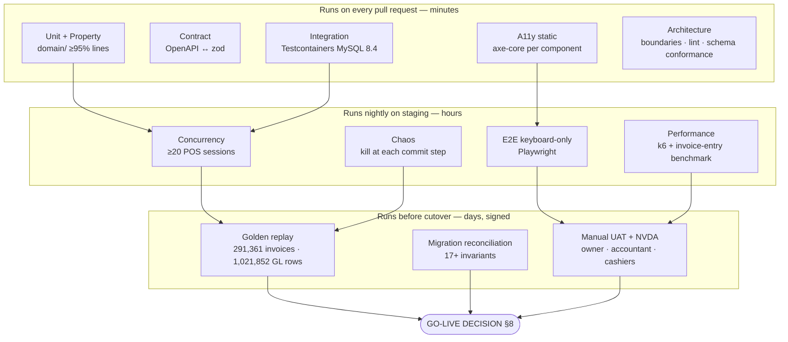
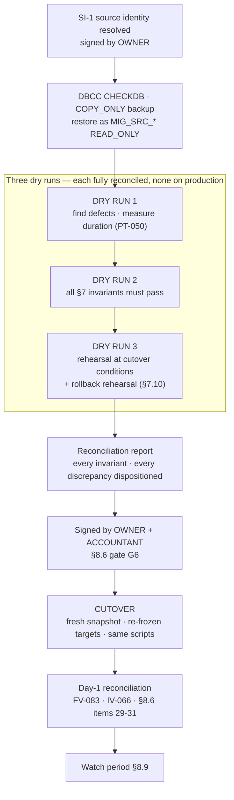
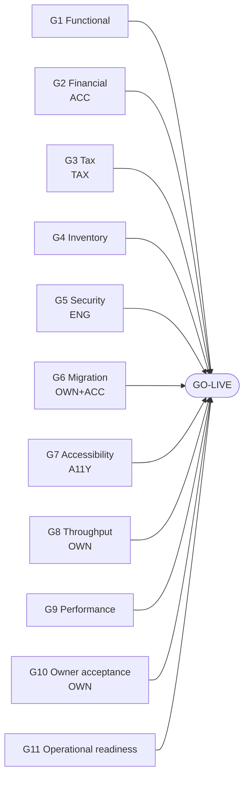

# 20 — Testing & Acceptance Plan

**System replaced:** WASEELA ABUZAR V3 (compiled Sybase PowerBuilder 12.5 + Microsoft SQL Server) as deployed at **Fazal Din PP19**, Gujranwala, Pakistan.
**System under test:** the rebuild — Node.js + TypeScript modular monolith · React + TypeScript · MySQL 8 · REST — specified in `17-technical-blueprint.md`, `18-api-plan.md` and `19-mysql-schema-blueprint.md`.

**Purpose.** This document is the **verification contract** for the rebuild. It states, test by test, what must be proven before the new system is allowed to carry real trade, who signs each proof, and what the exact numeric target is. It converts the analysis corpus (`00b`, `05a`, `05b`, `06`, `06a`, `07`, `08`, `09`, `10`, `11`, `12`, `17`, `19`) into executable, pass/fail assertions. It is simultaneously:

- the **QA plan** for the engineering team (test IDs, layers, tooling, gates);
- the **acceptance document** for the owner, the accountant and the tax adviser (plain-language criteria and a sign-off register);
- the **go-live gate** (§8), which is the only authority that may declare the system fit to trade.

**Analysis stage.** Stage 5 — Rebuild planning and verification design. All domain analysis (`02`–`12`) and all design blueprints (`17`, `19`) are complete; this document is the acceptance layer sitting on top of them. Nothing here is new primary research against the legacy system.

---

## ⚠️ The existing system was NOT modified

Every legacy fact, control total and defect cited in this plan was obtained **read-only**: `SELECT`-and-metadata queries against the live database (authorized under owner decision **D2**), reading extracted SQL module text, string extraction from the compiled `.pbd` binaries, and file-system inspection. **No schema was altered, no row was written, no stored procedure was created, dropped or executed for effect, no preference was changed, and no binary was patched.** The legacy system remains exactly as found and continues to trade.

Two consequences bind this plan:

1. **Every test that touches SQL Server runs against a *restored copy*, never the production instance.** This includes the Extended Events / Profiler trace required to specify the POS commit (`12` R-009), the pre-migration profiling queries, and every extraction rehearsal.
2. **The legacy system is the regression *oracle*, not the regression *target*.** `10` catalogues 30+ formula defects across the legacy report layer (`12` R-067) — so "the new report matches the old report" is sometimes the wrong outcome. Every comparison in §2 and §7 therefore carries an explicit **reproduce-or-correct decision** with a named signatory.

---

## Evidence-label legend

Every material claim carries exactly one label. Labels describe **strength of evidence**, not importance.

| Label | Meaning |
|---|---|
| **`Verified`** | Read directly from live legacy data, live schema/metadata, stored-procedure source, or a file on disk. Reproducible by re-running the cited query or opening the cited object. |
| **`Strongly Inferred`** | Not directly readable, but multiple independent pieces of evidence converge with no competing explanation. |
| **`Unclear`** | Evidence is ambiguous or contradictory; two or more readings remain possible. Must be resolved before the affected test's target value is frozen. |
| **`Missing`** | The capability, record or artefact does not exist. Absence itself is the finding. |
| **`Deprecated`** | Present but superseded, dead, or explicitly disabled. |
| **`Broken/Incomplete`** | Present and reachable, but demonstrably does not do what it claims. |
| **`Recommended`** | A proposal for the **NEW** system. **Never a description of an existing feature.** |

> **Anti-hallucination rule, applied throughout.** Every test in this document tests the **new** system and is therefore `Recommended` by construction. Where a *target value* is quoted, that value is `Verified` from the legacy data and is cited. Where a test asserts the *absence* of a legacy behaviour, the legacy behaviour is cited as `Verified` so the reader can see what is being removed. **No test in this document describes a capability that exists today.**

---

## The governing principle of this plan

> ### "Code exists" is never evidence of correctness.
>
> The legacy system is the proof. It **ships** a complete batch-and-expiry subsystem — and 96% of stock rows carry the placeholder batch `'.'` and `ItemBatches` has 0 rows (`Verified`: `00b` F2, `08` §10). It **ships** `SaleLedgerLog` (150 columns) and `SaledetailLog` (73 columns) with exactly the right shape — and both have **no writer and 0 rows** (`Verified`: `09` §G.2). It **ships** 27 group policy columns including `FinancialLimitPerTransaction` — referenced by **zero** of 762 programmable objects (`Verified`: `09` §C.2.3). It **ships** `SP_CheckDBIntegrity` — which takes the SQL Server 2000 branch on SQL Server 2019 and mis-maps its DBCC columns (`Verified`, `Broken/Incomplete`: `11` §9.5). It **ships** a supplier-payment path with a left-over `select * from PurPayment` debug statement in production code, proving it was never once exercised (`Verified`: `05b` §9.3).
>
> **Therefore, in this project:**
> - A feature is *not* delivered when it is merged. It is delivered when a **named test asserting its behaviour passes in CI**.
> - A configuration option is *not* working because it exists in a table. It is working when the **disable-safety test** (§1.9) proves the system behaves correctly with it switched off.
> - A number is *not* correct because the code that produces it looks right. It is correct when it **reconciles to a `Verified` legacy control total, to the paisa** (§2), or when a named signatory has recorded why it deliberately differs.
> - An accessibility feature is *not* present because a component library claims WCAG support. It is present when **axe reports zero violations and a screen-reader user completes the task** (§5).
>
> Anything not covered by a passing test is treated as **not built**, regardless of what the repository contains.

---

## How to read a test

```
ID · Layer · Priority · Evidence source · Signatory
Assertion.   What must be true, stated so that it can only pass or fail.
Method.      How it is executed and in which environment.
Target.      The exact numeric or behavioural target, with its `Verified` citation.
Fails when.  The specific observable that constitutes failure.
```

**Layers** map to the test pyramid fixed in `17` §9.11: `Unit` · `Property` · `Integration` (Testcontainers, real MySQL 8.4 — no mocked database) · `Concurrency` · `GoldenReplay` · `MigrationRecon` · `Contract` · `E2E` (Playwright) · `A11y` · `Perf` · `Chaos` · `Manual`.

**Priority.** `P0` = release blocker, go-live cannot proceed. `P1` = must pass before the module is accepted. `P2` = must pass before the first quarter-end after go-live.

**Signatory** is the person who must sign that the test's *criterion* is the right criterion — not who runs it. Engineering runs everything.

| Code | Signatory | Signs for |
|---|---|---|
| **OWN** | Business owner | Business behaviour, thresholds, opening-balance choices, throughput acceptance |
| **ACC** | Qualified accountant | Every debit/credit rule, rounding policy, period close, valuation basis, gross-profit definition |
| **TAX** | Tax adviser | FBR POS regime, Digital Invoicing position, historical filing exposure, HS/PCT classification |
| **ENG** | Engineering lead | Technical correctness, concurrency, performance, migration mechanics |
| **A11Y** | Accessibility lead + a real assistive-technology user | WCAG 2.2 AA conformance and task completion |

---

## Test-suite map



---
---

# 1. FUNCTIONAL TESTING

Scope: every business capability the pharmacy uses, plus the four new capabilities approved by the owner (**R1** item visibility, **R2** money-out, **R4** batch & expiry). Non-pharmacy verticals are **catalogued but deferred** under **D1** and are tested only by §1.11 (the deferred-register test) — they are never silently dropped, and they are never silently half-built either.

## 1.0 Functional coverage matrix

| Area | Legacy volume (`Verified`) | Test block | Blocker tests |
|---|---:|---|---|
| Product / item master + visibility (R1) | 30,052 items; 28,893 visible / 1,159 hidden; 8,042 ever stocked | §1.1 | FT-011, FT-018 |
| Purchases + goods receipt | 6,419 invoices / 113,082 lines; 2,810 POs / 108,423 PO lines | §1.2 | FT-030, FT-036 |
| Sales / POS | 291,361 invoices / 620,525 lines | §1.3 | FT-050, FT-052, FT-059 |
| Inventory movement & valuation | 3,215,967 snapshot rows; 214,737 units on hand | §1.4 | FT-070, FT-075 |
| Batch & expiry (R4 — NEW) | 0 real batches today (`ItemBatches` = 0 rows) | §1.5 | FT-090, FT-094 |
| Payments & expenses (R2 — NEW) | 0 supplier payments, 0 expenses ever recorded | §1.6 | FT-110, FT-113, FT-118 |
| Returns (both directions) | 30,704 sale returns / 634 purchase returns | §1.7 | FT-130, FT-134 |
| Accounting / GL | 1,021,852 GL rows; 4 live document types | §1.8 | FT-150, FT-153, FT-157 |
| P1 options engine | 1,352 untyped legacy preference rows | §1.9 | FT-170, FT-172 |
| Reports | 197 deployed leaf reports; ~160 true analytics | §1.10 | FT-190, FT-193 |
| Permissions / roles | 486 rights, 4 groups, 9 users | §1.11 | FT-210, FT-213 |

---

## 1.1 Products / item master and visibility (R1)

**Context.** `Item.Active` already exists and is the direct ancestor of the new `is_visible` (`Verified`: `00b` R1). The owner's binding requirement (**D7/R1**) is that nothing is ever deleted, everything is visible by default, and visibility is 100% admin-configurable from the UI. `17` §10.8 implements it as a **query-time filter**, never a data mutation.

| ID | Layer | Pri | Assertion | Target / method | Sign |
|---|---|---|---|---|---|
| **FT-001** | Integration | P1 | An item can be created with all pharmacy-relevant attributes (name, generic, manufacturer, category, class, pack units, prices, tax classification, HS code, storage condition, narcotic flag) and retrieved unchanged. | Round-trip equality on every field; `pack_units` defaults to 1 and rejects 0 (the legacy defensive divisor `CASE WHEN PackUnits <= 0 THEN 1` — `Verified`: `08` §5.1 — becomes a validation error instead of a silent substitution). | ENG |
| **FT-002** | Integration | P1 | Item codes are never reused and item records are never hard-deleted. | Attempt `DELETE /items/{id}` → `405`/`403`; the API exposes deactivate only. Schema test: no `DELETE` grant on `item` for the application user. | OWN |
| **FT-003** | Unit | P1 | Price bases are unambiguous: `sale_price` and `purchase_price` are **per pack**, `avg_cost` is **per loose unit**. | Property test over 10⁴ random `(pack_units, prices)` tuples asserting the documented basis. This is the exact class that produced PKR 1,798,138 of phantom inventory value in the legacy (`Verified`: `08` §5.2, §9.2). | ACC |
| **FT-004** | Integration | P1 | Item search returns results ranked and filtered correctly over the full 30,052-row catalogue, with a `VisibilityContext` required on every query. | A repository test asserting the search method cannot be called without a context argument (compile-time), plus relevance assertions on brand, generic and barcode search. | ENG |
| **FT-005** | Integration | P1 | Barcode / GS1 scan resolves to exactly one item, or reports an unambiguous "not found" that offers to create. | Includes GS1 AI parsing for `(01)` GTIN, `(10)` batch, `(17)` expiry (feeds FT-090). | ENG |
| **FT-010** | Integration | P0 | Per-item visibility toggle works from the UI, is audited, and changes nothing but visibility. | Toggle → `item.is_visible` flips; `audit_event` row written with who/when/old→new; every other column byte-identical. R1.3, R1.8. | OWN |
| **FT-011** | Integration | **P0** | **Enabling or disabling any visibility preset never modifies item data.** | **Row-hash the entire `item` table (SHA-256 over an ordered, canonicalised dump). Enable every preset in turn, disable every preset in turn, re-hash. The two hashes must be identical.** This is `00b` R1 acceptance criterion 4, verbatim. | OWN |
| **FT-012** | Integration | P1 | Bulk visibility toggle over a filtered set shows the exact affected count **before** confirmation and supports one-click undo. | Filter yielding N items → dialog states N → confirm → exactly N audit rows → undo → state and hash restored. R1.4. | OWN |
| **FT-013** | Integration | P1 | Each of the four seeded presets returns the correct live count. | "Never stocked" must return **20,861** against the migrated dataset (`Verified`: `00b` R1 — 28,893 active minus 8,042 ever-stocked). Other presets asserted against fixture-derived counts. R1.5. | OWN |
| **FT-014** | Integration | P1 | Visibility scope is honoured independently per context: Sales/POS · Purchase · Reports · Stock lists. | Hide an item in POS scope only; assert it is absent from POS search, present in purchase search, present in reports. R1.6. | OWN |
| **FT-015** | E2E | **P0** | **Every screen that searches items exposes a working "Show all items" override.** | Playwright sweep over every route containing an item-search surface; asserts the override control exists, is keyboard-reachable, has an accessible name, and when activated reveals a deliberately hidden item. R1.7 — *hidden must never mean unreachable*. | A11Y |
| **FT-016** | Integration | P1 | A hidden item remains fully transactable and fully reportable. | Sell a hidden item selected explicitly → sale posts, stock moves, GL posts, item appears in all reports. R1.6. | OWN |
| **FT-017** | Integration | P1 | The same visibility model applies to accounts, suppliers, customers, salesmen and users. | Parameterised test running the FT-010/FT-011 pair over each master entity. R1.9. | OWN |
| **FT-018** | MigrationRecon | **P0** | **All 30,052 items migrate with visibility state preserved exactly.** | **`COUNT(*) = 30,052`; `is_visible = 1` on exactly 28,893; `is_visible = 0` on exactly 1,159.** Migration must not re-derive visibility from stock history. `00b` R1 AC-1. *(Note the `Unclear` count discrepancy 30,052 vs 30,050 — see §7.2 DR-1; the target is frozen at extraction time.)* | OWN |

## 1.2 Purchases, purchase orders and goods receipt

**Context.** The purchase posting path has **no readable implementation** — no `sp_PostPurLedger` exists (`Verified`: `05b` U1, `12` R-009). Purchase categories in live use are `2` Normal Purchase Credit (6,396 invoices, 99.6%), `8` Loose Purchase Credit (22) and `3` Opening Purchase (1) (`Verified`: `08` §4.2).

| ID | Layer | Pri | Assertion | Target / method | Sign |
|---|---|---|---|---|---|
| **FT-030** | Integration | **P0** | A purchase invoice posts as **one atomic transaction**: header, lines, stock movements, lot creation, moving-average cost update, GL journal, audit. | Kill-test in FT-031 proves atomicity; here assert all seven artefacts exist after commit and the journal balances. Removes `12` R-010 (no `BEGIN TRANSACTION` anywhere in the legacy purchase path). | ENG |
| **FT-031** | Chaos | **P0** | Killing the process at any step of the purchase commit leaves **zero** partial state. | Fault injection at each of the commit steps; after restart assert: no orphan header, no orphan lines, no stock movement without a document, no GL journal without a document, counter not advanced. | ENG |
| **FT-032** | Unit | P1 | The quantity model is one canonical formula used identically by purchase, sale, both returns and adjustments: `qty_base = qty_loose + qty_pack × pack_units_at_txn + qty_bonus`. | Property test. Directly removes the legacy asymmetry where purchase multiplies bonus by `PackUnits` but purchase **return** does not (`Verified`, `Broken/Incomplete`: `08` §4.1) — see FT-134. | ACC |
| **FT-033** | Integration | P1 | Pack-based (`PurCatCode` 1,2 successor) and loose-based (3,7,8 successor) purchase categories both compute the correct base quantity. | Fixtures for each category; assert `qty_base` against the `Verified` legacy rules in `08` §4.1. | ACC |
| **FT-034** | Unit | **P0** | The moving weighted-average cost formula is ported exactly: `new_avg = ROUND((stock_before × avg_before + qty_in × unit_cost_in) / (stock_before + qty_in), 5)` where `unit_cost_in = ROUND(basis / pack_units, 5)`. | See **IV-020** for the golden replay target (100% on the 10,173 `UpdateAvgPriceWithNetRate='Y'` lines). Here: unit + property tests including `stock_before = 0`, `qty_in = 0` guard, and negative-stock inputs. `Verified`: `08` §8.2–8.3. | ACC |
| **FT-035** | Integration | P1 | The **cost basis** (net rate vs gross purchase price) is an explicit, per-invoice, **user-selected, audited option** — not a hidden global preference. | P1 option `purchase.cost_basis` ∈ {claim input tax / capitalise into cost}; the chosen value is stored on the invoice and shown on the document. Removes `12` R-056 (701 of 6,419 invoices silently used a different basis with no documented rule). | ACC |
| **FT-036** | Integration | **P0** | Purchase **create/edit** and purchase **post** are separable permissions, and the `purchase_officer` role cannot post. | Permission-matrix assertion from `09` §I.4: `purchase post` = `○` for `purchase_officer`. Removes `12` R-032 (one group creates, edits **and** posts unaided). | OWN |
| **FT-037** | Integration | P1 | Purchase-order lifecycle is explicit: open → partially received → fully received → short-closed / cancelled, each with a reason. | Legacy: **0 of 2,810 POs were ever closed** (`Marked='Y'` on none) and 19.8% of PO lines were never satisfied (`Verified`: `05b` §6.3). Assert closure transitions and that an open-PO report excludes closed POs. | OWN |
| **FT-038** | Integration | P1 | PO header totals are **derived**, never stored-and-drifted. | Assert `total_of_purchases` is computed on read; a regression fixture reproducing the legacy double-count (PKR 14,744,948 / 10% overstatement across 78 POs, `Verified`: `05b` §6.3) must yield the correct figure. | ACC |
| **FT-039** | Integration | P1 | Landed-cost / purchase-charge allocation is explicit and each charge is flagged include-in-cost or expense. | Blocked on **V-4** and **V-6** (`19` §14): the 30 legacy `QE*`/`WE*` columns are `Unclear`. Test is written now, target frozen when the accountant rules. | ACC |
| **FT-040** | Integration | P1 | Supplier credit terms are captured on the supplier master and overridable per invoice. | Legacy `Purledger.CreditDays = 0` on all 6,419 invoices (`Verified`: `10` §5.5.2). Assert default-from-supplier, per-invoice override, and that due date drives ageing (FT-158). | ACC |

## 1.3 Sales / POS

**Context.** This is the highest-risk area in the project: **the POS commit has no readable implementation** and the 291,361 live invoices were written by DataWindow update logic inside a compiled binary (`Verified`: `12` R-009, `17` T1). The canonical replacement is specified in `17` §7.2.

| ID | Layer | Pri | Assertion | Target / method | Sign |
|---|---|---|---|---|---|
| **FT-050** | Integration | **P0** | The sale commit executes as **one MySQL transaction** covering: option resolution → price resolution → tax computation → FEFO lot allocation under `FOR UPDATE` → stock movements + `stock_on_hand` update → document number allocation (**last**) → totals via the rounding ladder → header + lines insert → balanced GL journal → audit rows → fiscalization outbox row. | All eleven artefacts present and mutually consistent after commit; `17` §7.2. | ENG |
| **FT-051** | Chaos | **P0** | Killing the process at **each** of the commit steps leaves the database in a consistent pre-state — never a partial invoice, never a partial stock decrement, never an orphan GL journal, never a consumed document number. | 11 fault-injection points × 3 repetitions; assert invariants after each. Directly targets `12` R-010. | ENG |
| **FT-052** | Integration | **P0** | **Idempotency:** 50 concurrent identical `POST /sales` requests carrying one `Idempotency-Key` produce **exactly one** invoice, **one** stock decrement, **one** GL journal, and 49 replayed responses. | `17` §7.5. A defect class the legacy cannot even detect. | ENG |
| **FT-053** | Integration | P1 | A missing `Idempotency-Key` on any financial POST is rejected with `400`. | Route-enumeration test: every mutating financial endpoint is covered, so a new endpoint cannot be added without the guard. | ENG |
| **FT-054** | Integration | P1 | Price resolution is explainable: every line carries a `price_resolution_trace` naming the rule that set the price. | Assert the trace is present, references a real rule, and is shown in the UI on demand. | OWN |
| **FT-055** | Unit | **P0** | The **rounding ladder** reproduces the legacy exactly: per-line `ROUND(…,2)` → invoice GST `ROUND(…,2)` → whole expression `ROUND(…, round_pref)` with `round_pref = 0` (whole rupees). | `Verified`: `07` §14.2. Encoded once in `domain/pricing/roundingLadder.ts`, each step named and separately unit-tested. Compounding differences of up to Re. 1 per invoice across 291,361 invoices are the single largest reconciliation risk (`Strongly Inferred`: `07` §14.2). **Accountant must sign that the ladder is reproduced, not "cleaned up"** — `17` §6.5. | ACC |
| **FT-056** | Property | P1 | Rounding of negative amounts (returns, credits) is half-away-from-zero on the magnitude — the classic silent divergence. | `fast-check` over 10⁵ signed amounts; compare against the T-SQL `ROUND()` semantics documented in `06` §8.6. | ACC |
| **FT-057** | Integration | P1 | Tender type is captured per invoice, from the P1 option set (Cash · Card · Mobile wallet · Mixed/split · Credit, admin-disableable). | Legacy captures **no tender type anywhere** (`Verified`: `12` R-051). Default Cash (D5). Assert mixed/split sums exactly to the invoice total. | OWN |
| **FT-058** | Integration | P1 | Discounts above a configurable threshold require a reason; above a second threshold require supervisor approval; every discount is audited. | Legacy: discount authority is unmodelled and enforced nowhere in SQL (`Verified`: `12` R-052). Assert `403` with **no database side effect** when a `sales_officer` submits 40% against a 2% cap (`09` §I.4). | OWN |
| **FT-059** | Integration | **P0** | **A sale cannot be completed when the FBR gateway is unavailable — it must still complete.** | Fiscal middleware stubbed to time out at 1.5 s → sale commits, provisional receipt prints, `fiscal_status='pending'`, outbox row queued, invoice appears on the operator-visible unfiscalized report. Removes `12` R-017 (a gateway outage halts billing today). | TAX |
| **FT-060** | Integration | P1 | The fiscal payload is built by a **JSON library over a typed object** and schema-validated before submission — never string concatenation. | Static check: no string concatenation in the fiscal serializer. Removes `12` R-015. | TAX |
| **FT-061** | Integration | **P0** | An item with missing or mis-configured tax classification **fails loudly** and is never silently dropped from the fiscal declaration. | Fixture with a null PCT / tax-schedule link → payload build raises a validation error naming the item. Legacy uses `INNER JOIN`s, so such an item silently vanishes from the tax declaration (`Verified`, Critical: `12` R-015). | TAX |
| **FT-062** | Integration | P1 | The fiscal payload has **no length limit** and survives a 200-line invoice and item names containing `"`, `\` and Urdu characters. | Legacy builds into `VARCHAR(8000)` with no guard (`Verified`: `05a` S-05). | TAX |
| **FT-063** | Integration | P1 | Tax rate, PCT/HS code and unit tax are **snapshotted onto the invoice line at posting**, so a re-sent historical invoice reports what it originally reported. | Change the master rate after posting → re-render the stored payload → identical bytes. Removes `12` R-064 (legacy reads live master data). | TAX |
| **FT-064** | Integration | P1 | Reprint renders from the **stored** request/response pair, never a recomputation. | Byte-identical reprint after a master-data change. `17` §7.7. | TAX |
| **FT-065** | Integration | P1 | Sale-line removal before save is logged with reason, user, workstation, and whether the invoice was ultimately saved. | Enriches the one genuinely useful legacy control (`DeletedSaleItem`, 235,887 rows, `Verified`: `12` R-053) with the fields it lacks. Feeds the daily voids-by-cashier exception report (FT-196). | OWN |
| **FT-066** | E2E | P1 | A complete cash sale can be entered **keyboard-only**, end to end, including item search, quantity, discount, tender and print. | No mouse events permitted in the test (`17` §8.12). Also measured for speed in **UX-030**. | A11Y |

## 1.4 Inventory operations

Detailed numeric validation is §3; this block covers behaviour.

| ID | Layer | Pri | Assertion | Target / method | Sign |
|---|---|---|---|---|---|
| **FT-070** | Integration | **P0** | `stock_movement` is **append-only**; `stock_on_hand` is a projection updated in the **same transaction**. | Schema test: application user holds no `UPDATE`/`DELETE` grant on `stock_movement`. Behavioural test: after any document, projection = `SUM(movements)`. Removes `12` R-041/R-042 (repair procedures that delete and rewrite balances). | ENG |
| **FT-071** | Integration | P1 | Stock adjustments require a **reason code** from the P1 set (Damage · Expiry · Theft/shrinkage · Count correction · Sample/donation · Breakage · Other). | Legacy `AdjCategory` has exactly two rows (increase/decrease) and remarks propagate empty (`Verified`: `12` R-043). Posting without a reason → `422`. | OWN |
| **FT-072** | Integration | P1 | Adjustments above a configurable value threshold require supervisor approval before posting. | Threshold from **V-19**; assert unapproved adjustment stays in `pending_approval` and moves no stock. | OWN |
| **FT-073** | Integration | **P0** | **Every stock adjustment posts to the GL**, with the account driven by the reason code. | Legacy excludes **100% of 1,542 adjustments** from the GL because `SP_VirtualGL_Adjustment` filters `WHERE AccCode IS NOT NULL` and every row has `AccCode IS NULL` (`Verified`, `Broken/Incomplete`: `07` §13.3). Assert a balanced journal per adjustment and that PKR 5.37 M of gross adjustment movement would now reach profit. **Accountant must sign the Dr/Cr treatment per reason** (`07` §17 A4). | ACC |
| **FT-074** | Integration | P1 | Inter-godown transfer moves stock out of the source and into the destination atomically, with no cost effect. | Dormant in the legacy (0 rows, `Verified`: `08` §12) but shipped in the new build for future branches; assert conservation of total quantity. | OWN |
| **FT-075** | Integration | **P0** | Stock can never go negative. | `CHECK ck_stock_balance_nonneg` at the database level **and** a service-level check inside the transaction using `SELECT … FOR UPDATE`. Attempt to oversell → `422` `INVENTORY.INSUFFICIENT_STOCK` with **no side effect**. Negative stock is an explicit, admin-configurable policy (block / warn-and-allow with supervisor override), never an accident. Removes `12` R-040. | OWN |
| **FT-076** | Integration | P1 | Physical stock-count sheets include **every item that holds stock, regardless of visibility**. | Removes `12` R-069 (legacy count sheets exclude `Active = 0` items, which can hold stock). R1.7 applied to inventory. | OWN |
| **FT-077** | Integration | P1 | Lot status (available / quarantined / expired / reserved / recalled) is enforced in the **allocation service and the database**, not the UI. | Legacy `GodownDetail.Locked` is set on 104 rows and honoured by **no** SQL allocation path (`Verified`, `Broken`: `08` §7.2). Quarantined lot must be unsellable without an audited supervisor override. | OWN |
| **FT-078** | Integration | P1 | The reorder suggestion is **explainable**: the buyer can see lead time, demand window, safety stock and supplier MOQ that produced the number. | Legacy suggestion logic lives in the compiled client and is unreadable despite producing 113,995 PO lines (`Unclear`: `12` R-079). New logic is documented, parameterised per P1, and unit-tested. | OWN |

## 1.5 Batch & expiry (R4 — NEW capability, D12)

**Every test in this block covers a capability that does not exist in operation today.** `Verified` (`00b` F2): `ItemBatches` = 0 rows, `ItemBatchPricing` = 0 rows, `ExpiryIntimation` = 0 rows, ~96% of stock rows carry batch `'.'`, 95.2% carry `'.'` with sentinel expiry `2030-12-12`, only **62** distinct batch strings exist warehouse-wide (several junk: `\`, `asd`), and the preference `salecheckexpiry = 'N'`.

| ID | Layer | Pri | Assertion | Target / method | Sign |
|---|---|---|---|---|---|
| **FT-090** | Integration | **P0** | A purchase line captures **batch number and expiry date**, by GS1 barcode/QR/DataMatrix scan **or** manually, and strictness follows the admin setting per item category (require · prompt-but-skip · off). | `00b` R4 AC-1. Scan fixture must auto-fill both fields with zero extra keystrokes; "same as previous line" shortcut asserted. | OWN |
| **FT-091** | Integration | P1 | `expiry_date` is a real `DATE`; sentinels are banned. | Schema test: no row in `stock_lot` carries `2030-12-12`, `2022-12-12` or `1900-01-01` as a *real* expiry. Unknown expiry is `NULL` + `expiry_status='unknown'` so unknowns are **countable, not hidden** (`19` §12.2). | OWN |
| **FT-092** | Integration | **P0** | The "expiring soon" screen returns correct items, quantities and **value at risk** for 30 / 60 / 90-day buckets against live data. | `00b` R4 AC-2. Fixture with lots at day 29/31/59/61/89/91 and one already expired; assert exact bucket membership and that value at risk = `Σ(qty × avg_unit_cost)`. Boundary conditions asserted as half-open intervals. | OWN |
| **FT-093** | Unit + Integration | **P0** | **FEFO selects the earliest-expiry available lot by default**; overrides are permitted and audited. | `00b` R4 AC-3. Pure-function unit tests over lot sets including ties, unknown expiry (sorted last), quarantined lots (excluded) and partial allocation across lots. Legacy de-facto ordering is `priority, expiry, CurrQty` (`Verified`: `08` §7.1), so FEFO-by-default matches existing behaviour. | OWN |
| **FT-094** | Integration | **P0** | Attempting to sell expired stock produces the **admin-configured** warn / block / allow behaviour. | `00b` R4 AC-4. All three settings tested; default **warn** for near-expiry, **block** for already-expired. Block requires an audited supervisor override with a typed reason. Legacy has **57 expired batches still holding positive stock** and no guardrail (`Verified`: `17` T7). | OWN |
| **FT-095** | Integration | **P0** | Given a batch number, the system lists **every purchase and every sale** of that batch. | `00b` R4 AC-5 — recall traceability. Fixture: one batch purchased twice, sold on 40 invoices, partially returned; assert complete, correct, and reachable in one query. | OWN |
| **FT-096** | GoldenReplay | **P0** | **Item-level gross profit is unchanged by the introduction of batch tracking.** | `00b` R4 AC-6 — proves R4.5 additivity. Run the gross-profit replay (§2.5) with batch tracking on and off; per-item GP must be identical to the paisa. | ACC |
| **FT-097** | Integration | P1 | Near-expiry pick-list drives a return-to-supplier or markdown workflow. | Assert the list is filterable by supplier and exports to a purchase-return draft. R4.2. | OWN |
| **FT-098** | Integration | P1 | Expiry alert thresholds are admin-configurable and fire a notification when value at risk crosses the threshold. | Synthetic clock advance; assert exactly one alert per crossing (no repeat storm). `17` §9.13. | OWN |

## 1.6 Payments, expenses and cash book (R2 — NEW capability, D8)

**Every test in this block covers a capability that has never existed.** `Verified` (`00b` F1): no supplier payment has **ever** been recorded (suppliers credited 186,197,682, debited only 3,526,552 — all purchase returns); no expense has **ever** been recorded (`MARKETING EXPENSES`, `ADMINSTRATIVE EXPENSES`, `EXPENSES PAYABLE`, `PAYROLL-SALARIES`, `COST OF SALES`, `CASH AT BANK` all have **zero** GL entries across 19 months).

> **Hard precondition (RS-3, `19` §15):** **no R2 code is written until the accountant has signed the debit/credit rules for every new posting** (R2.8 / V-2). Tests below are authored against the signed rules; if the signature is absent, the tests have no valid target and the module is blocked.

| ID | Layer | Pri | Assertion | Target / method | Sign |
|---|---|---|---|---|---|
| **FT-110** | Integration | **P0** | Recording a supplier payment **reduces that supplier's balance and the cash/bank balance by the same amount**, and the GL still satisfies `Σ Debit = Σ Credit`. | `00b` R2 AC-1, verbatim. Assert both balances and journal balance in one transaction. | ACC |
| **FT-111** | Integration | P1 | Every payment method in the P1 set is selectable and postable: Cash · Bank transfer · Cheque · Bank draft/pay order · Online IBFT · Mobile wallet (Easypaisa/JazzCash) · Credit-note adjustment · Other (free text). Default **Cash**. | Parameterised over all eight; assert the chosen method is stored on the transaction, appears in the audit trail and on reports (P1.7). | OWN |
| **FT-112** | Integration | P1 | Every allocation mode works: against specific invoices · oldest-first (FIFO) · reduce running balance only. Default **oldest-first**. | Unit tests per mode plus an integration test asserting allocation sums exactly to the payment amount and no invoice is over-allocated. | ACC |
| **FT-113** | Integration | **P0** | **Cash sales appear in the cash book exactly once.** | `00b` R2 AC-2, verbatim: reconcile cash-book inflows against `Σ(SV debits to cash)` for the same period. Structurally guaranteed because the cash book is a **query over `journal_line`**, not a second table (`19` §12.1) — the test proves the guarantee holds. | ACC |
| **FT-114** | Integration | P1 | Recording an expense reduces cash/bank and appears in the profit statement in the correct **category and period**. | `00b` R2 AC-3. Categories seeded from the legacy `SubAccounts` expense groups plus rent, utilities, freight, repairs, bank charges (**V-22**). | ACC |
| **FT-115** | Integration | P1 | Recurring expenses (rent, salaries) can be templated and posted in one click, with the period correctly stamped. | Assert the template does not post automatically and cannot double-post for the same period. | OWN |
| **FT-116** | Integration | P1 | Cash ↔ bank transfers and cash drawings post correctly and appear in both books once. | New document type `CBT` (`19` §12.1). | ACC |
| **FT-117** | Integration | P1 | **Daily cash reconciliation** produces an auditable count-vs-expected record with the variance explained and approved. | `00b` R2 AC-5. Denomination count entry; variance = counted − expected; over/short requires a typed explanation; approval is a separate permission. Activates the dormant `CashierShift` concept (0 rows today, `Verified`: `12` R-051) with a **fresh implementation** (R-049 forbids porting the vendor code). | OWN |
| **FT-118** | GoldenReplay | **P0** | **The profit statement's gross-profit line exactly matches the legacy gross-profit figure for any historical period.** | `00b` R2 AC-4 — this is the proof of **R2.7** ("never break the trading ledger"). Target and method in **FV-050**. | ACC |
| **FT-119** | Integration | P1 | The plain-language profit statement renders without debit/credit jargon, with drill-down to underlying transactions and a day/month/year selector. | Assert the exact five-line shape from `00b` R2.5 and that each line drills to a transaction list whose sum equals the line. | OWN |
| **FT-120** | Integration | P1 | Supplier balances are aged **by due date**, with document-age available as a selectable alternative. | Removes `12` R-072 (legacy ages on document date with no terms and never deployed a supplier-ageing report at all). Requires **E7** accountant confirmation on bucket definition. | ACC |
| **FT-121** | Integration | **P0** | **Every R2 transaction is fully audited (who / when / what / before → after) and is reversible only by an audited reversal, never a silent edit.** | `00b` R2 AC-6. Attempt to `UPDATE` a posted payment → `405`; the only correction path creates a reversal document referencing the original. | ACC |
| **FT-122** | Integration | P1 | Optional receipt photo can be attached to a payment or expense and is retrievable, virus-scanned and access-controlled. | See **ST-060** for upload security. | OWN |

## 1.7 Returns — both directions

| ID | Layer | Pri | Assertion | Target / method | Sign |
|---|---|---|---|---|---|
| **FT-130** | Unit + GoldenReplay | **P0** | **The sale-return total formula mirrors the sale formula exactly, including `item_flat_discount`.** | Legacy `Fn_getSRInvTotal` **omits `itemflatdisc`** while `fn_getSaleInvTotal` includes it, so a flat-discounted sale **cannot be returned at matching value** (`Verified`, `Broken/Incomplete`: `12` R-048). Golden-master regression over every historical sale/return pair. | ACC |
| **FT-131** | Unit | P1 | Refunded tax matches tax charged. | Legacy `fn_getTaxOnSRInv` omits `ItemFlatDisc` from the line base while `fn_getTaxOnSaleInv` includes it (`Verified`: `11` §12 item 10). Property test over discounted lines. | TAX |
| **FT-132** | Integration | **P0** | A return is valued at **original cost**, never at selling price. | Legacy values *unreferenced* returns at net selling price, booking zero margin (`Verified`: `07` §13.1, `08` §5.3). Free-standing-return cost basis is **V-5** — accountant must rule before the target is frozen. | ACC |
| **FT-133** | Integration | P1 | Return quantity cannot exceed the original sale quantity net of prior returns. | Domain invariant (`17` §9.3 layer 2); assert `422` with no side effect. | OWN |
| **FT-134** | Unit + GoldenReplay | **P0** | **A purchase and its purchase return reverse each other exactly, including pack quantity and bonus.** | Two `Verified` legacy defects removed: (a) `PRdetail.PackQty` is never read by the purchase-return GL generator, so a pack-based return is **silently omitted from the ledger** (`12` R-046); (b) bonus is multiplied by `PackUnits` on purchase but not on purchase return (`08` §4.1). Golden-master proving full reversal to zero. | ACC |
| **FT-135** | Integration | P1 | A purchase return references the original purchase **line** by foreign key and carries a mandatory reason code (expiry · damage · over-supply · wrong item · price dispute · recall · other). | Legacy link is free text on 95.6% of the 634 returns, with no reason code at all (`Verified`: `12` R-082). | OWN |
| **FT-136** | Integration | P1 | Sale-return → sale linkage is a real foreign key and the list of credit notes for an invoice is **derived on read**. | Legacy `SaleLedger.ListOfSrInvoices` is NULL on **100% of 28,933 returned invoices** because the trigger NULL-propagates (`Verified`, `Broken/Incomplete`: `12` R-047). | ENG |
| **FT-137** | Integration | P1 | Returned stock re-enters inventory into the **correct lot**, preserving batch identity. | Legacy adjustment/return increase legs dump quantity into the default batch `('.', 2030-12-12)`, destroying batch identity (`Verified`: `12` R-043). | OWN |
| **FT-138** | Integration | P1 | A sale return is fiscalized as `InvoiceType='3'` with `RefUSIN` = the original invoice, through the same durable pipeline. | `Verified`: `11` §1.3. Note the `Verified` discontinuity — 2025 return fiscalization was 5.9%, 2026 is 99.87% (**V-15**, tax adviser). | TAX |

## 1.8 Accounting / general ledger

| ID | Layer | Pri | Assertion | Target / method | Sign |
|---|---|---|---|---|---|
| **FT-150** | Integration | **P0** | `ledger.post(journal)` **rejects any journal where `Σ debit ≠ Σ credit`**, before insert. | The legacy balances *by construction*; the new system balances *by assertion*, so a future posting-rule bug fails at write time rather than at audit time (`17` §7.2 decision 6). Fixture with a deliberately unbalanced journal → whole transaction rolled back. | ACC |
| **FT-151** | Integration | **P0** | The ledger is **append-only**. There is no code path, no procedure and no setting that deletes or updates a ledger row. | Schema test: application user has **no** `UPDATE`/`DELETE` grant on `journal_line`/`journal_entry`. Static test: no `TRUNCATE`, no `DELETE FROM journal_*` anywhere in the repository. Removes `12` R-011 — the legacy `AutoPurgeVirtualGL='Y'` **truncates the entire 1,021,852-row general ledger on the next balance enquiry**, with no confirmation, no backup, no audit. | ACC |
| **FT-152** | Integration | P1 | Reading a balance **never writes**. | Assert `SELECT`-only during a balance enquiry (query log inspection). Removes the legacy pattern where `SP_OpeningBalance` → `SP_VirtualGL` materialises the ledger under `TABLOCKX` on every read (`Verified`: `07` §3.1). | ENG |
| **FT-153** | Integration | **P0** | **Corrections are audited reversals.** A posted document cannot be silently edited; the only correction path creates a contra journal referencing the original and marks the original `reversed`. | Removes `12` R-012 and R-054 (legacy `SP_Supervise_CashierActivity` deletes GL rows of already-posted invoices and lets the next derivation silently re-create them). Requires **E1** accountant sign-off. | ACC |
| **FT-154** | Integration | P1 | One posting per document is structurally impossible to duplicate. | `UNIQUE (document_type_id, source_document_id, reversal_seq)` on `journal_entry` (`19` §12.1); attempt double-post → constraint violation, transaction rolled back. | ENG |
| **FT-155** | Integration | P1 | Every ledger leg names a **real account** and a **real source document**. | Foreign keys on `journal_line.gl_account_id` and `journal_entry.source_document_id`. Legacy has **neither** FK (`Verified`, Critical: `06` §4.4 R1, R2). | ACC |
| **FT-156** | Integration | **P0** | **Soft and hard period locks work**, with an audited break-glass override. | Legacy has **no period close and no period lock at all** — exhaustive search of 762 objects found zero occurrences of `YearEnd`, `PeriodLock`, `ClosePeriod`, `FinancialYear`, `FiscalYear` (`Missing`: `12` R-013). Assert: soft-closed → warning + proceed with audit; closed → `403` unless break-glass; break-glass writes `security_audit` and alerts the owner. Requires **E2** accountant sign-off on the close procedure and **V-18** on the fiscal-year definition. | ACC |
| **FT-157** | Integration | **P0** | **Historical cost snapshots are immutable.** | Attempt to update `sale_invoice_line.unit_cost` → denied at schema level. Removes `12` R-021 — legacy `SP_Update_ItemHistoricalCost_In_Sale_And_Return` can retroactively rewrite the cost snapshot on **620,619 sale lines and 44,563 return lines** in one un-transacted statement using a **look-ahead** cost rule. | ACC |
| **FT-158** | Integration | P1 | Account bindings (the successor to the 81 `GT_*` keys in `Global`) are typed, FK-constrained, audited, and every required binding resolves at startup. | Preserves genuinely good legacy design (`Verified`: `07` §2.6) and adds the FK and audit it lacks. Startup check fails loudly if a required binding is unresolved. | ACC |
| **FT-159** | Integration | P1 | The four-level chart of accounts is preserved exactly, with contra accounts explicit. | 5 MainAccounts → 13 CategoryAccounts → 29 SubAccounts → 267 Accounts (`Verified`: `00b` F1, `07` §2). `is_contra` set on SALES RETURN and PURCHASES RETURNS (**V-9**). | ACC |
| **FT-160** | Integration | P1 | A manual journal capability exists but ships **disabled by default**, enabled only by an accountant-gated switch. | D6: the operated business is a trading ledger, not double-entry bookkeeping. `17` §0.2. | ACC |
| **FT-161** | Integration | P1 | Trial balance and balance sheet are produced server-side from a **specification written with the accountant**, not reverse-engineered. | `Missing` in the legacy: no trial-balance or balance-sheet definition exists anywhere in the database (`07` §16 item 1). Blocked on **A5/E2**. | ACC |

## 1.9 The P1 options engine

**Context.** P1 is approved (D9) and correct — but the legacy already implements "options as data" as **1,352 untyped, unvalidated, unversioned, unaudited free-text preference rows**, at least 40 of which materially alter accounting behaviour, and that store is the direct cause of `12` R-011, R-017, R-050, R-056 and R-065 (`Verified`: `12` R-068). These tests exist to ensure P1 does not recreate the defect it was meant to prevent.

| ID | Layer | Pri | Assertion | Target / method | Sign |
|---|---|---|---|---|---|
| **FT-170** | Integration | **P0** | **Registry completeness**: every option set referenced in code exists in seed data, and every seeded set is referenced or explicitly marked reserved. | `17` §10.7. Build fails on drift — this prevents a "ghost setting" that looks live to an administrator (the legacy `POPolicy` failure mode, `12` R-092). | ENG |
| **FT-171** | Integration | P1 | **Default integrity**: every option set has exactly **one** enabled default. | `17` §10.7 / P1.2. | OWN |
| **FT-172** | Integration | **P0** | **Disable safety**: for each option set, disabling every value in turn must make the module's core transaction either succeed with another value or **fail with a clear plain-language error** — never crash, never null, never silently fall back to a hardcoded value. | `17` §10.7. This is the direct antidote to `12` R-065 (a preference set to `'Y'` while the code path is commented out — *the configuration lies about the behaviour*). | OWN |
| **FT-173** | Integration | P1 | **History fidelity (P1.3)**: a transaction created with option X still displays, prints and reports X correctly after X is disabled, marked "(no longer offered)". | `17` §10.7. Disabling hides; it never deletes history. | OWN |
| **FT-174** | Integration | P1 | **Permission filtering (P1.5)**: a cashier's options endpoint returns only counter methods; POSTing a bank-transfer method as a cashier returns `403` with **no side effect**. | `17` §10.7. | OWN |
| **FT-175** | Integration | **P0** | **Money/tax options are a higher-privilege class**: changing one requires step-up authentication and an approval, is effective-dated, and writes a before→after audit row. | `12` R-068 response. Assert a historical document re-derives under the settings that applied **when it was posted**, not today's. | ACC |
| **FT-176** | Integration | P1 | **Guard rails**: options that would destroy data do not exist. | Static test: no option key matches the `AutoPurgeVirtualGL` class (truncate/purge/reset-counter semantics). `17` §10.6. | ACC |
| **FT-177** | Integration | P1 | There is exactly **one** configuration plane. | Schema test: no second settings table. Removes the legacy contradiction `ConfigSetting.allow_multiple_session='N'` vs `SoftwarePreferences.AllowLoginAUserMultipleTimes='Y'`, neither enforced server-side (`Verified`: `12` R-068). | ENG |
| **FT-178** | Integration | P1 | **Matrix smoke**: pairwise combination of posting-relevant options — rounding × allocation strategy × expired-stock policy × tender method — runs the sale and purchase transaction scripts successfully. | `17` §10.7. Pairwise (not exhaustive) keeps it to a few dozen cases. | ENG |

## 1.10 Reports

**Context.** 197 leaf reports are deployed here, ~160 are true pharmacy analytics, and **~75% of the report SQL exists only inside compiled `.pbd` binaries** (`Verified`: `10` §1.1, `12` R-024). The legacy report layer contains 30+ catalogued formula defects, so it cannot be used uncritically as an oracle (`12` R-067).

| ID | Layer | Pri | Assertion | Target / method | Sign |
|---|---|---|---|---|---|
| **FT-190** | Integration | **P0** | **There is one canonical definition per metric**, used by every screen, report and export. | Static test: `net_sales`, `cost_of_sales`, `gross_profit`, `stock_value`, `purchases_net` each have exactly one implementation in `domain/metrics/` and no ad-hoc SQL reproduces them. Removes `12` R-019/R-067 — the legacy has **three disagreeing P&L engines** and at least four incompatible net-sales implementations. | ACC |
| **FT-191** | Integration | **P0** | **No report writes shared server-side state.** | Schema test: no `ReportData`-equivalent table exists. Concurrency test in **PT-040**. Removes `12` R-018, the clearest single reason the reporting layer is a rebuild rather than a port. | ENG |
| **FT-192** | Integration | P1 | Every report is parameterised, and no user-supplied value is ever concatenated into SQL. | Static analysis in CI plus an injection fixture: a lookup value containing `'` and `;` must round-trip harmlessly. Removes `12` R-006/R-086. | ENG |
| **FT-193** | Manual + Integration | **P0** | **Each of the 197 deployed legacy report leaves has an explicit, recorded reproduce-or-correct decision.** | A checked-in `report-disposition.csv`: `legacy_report → new_report | corrected | descoped`, with the signatory and the reason. `Descoped` requires an owner signature (D1: catalogued, never silently dropped). A CI test fails if any of the 197 rows is unresolved. | OWN |
| **FT-194** | GoldenReplay | P1 | For every report marked **reproduce**, the new output matches the captured legacy output for the same parameters. | Golden masters captured **from the running legacy system before cutover** (`12` R-024 response) — the database alone does not contain the specification. | ACC |
| **FT-195** | Manual | P1 | For every report marked **corrected**, the difference from legacy output is quantified, explained in one paragraph, and signed. | E.g. `sp_PurAndReturnCategoryWise` omits `× packunits`; `sp_SaleAndReturnCategoryWise` ignores `SaleLedger.DiscPerc`; three procedures omit the `Posted='Y'` filter (`Verified`: `12` R-067). | ACC |
| **FT-196** | Integration | **P0** | The **day-one exception reports** exist and are correct: voids-by-cashier, discounts-by-cashier, unfiscalized invoices, negative-stock detections, expiring stock, unposted documents > 24 h, shrinkage-by-reason-by-user. | Each asserted against a seeded fixture. These are the controls the legacy has **none** of (`12` R-053, R-052, R-065, R-097). | OWN |
| **FT-197** | Integration | P1 | The 11 partner data-export formats reproduce their captured sample files byte-for-byte (or field-for-field where a timestamp varies). | Requires a sample file **and, where possible, the written spec** from each partner before build (`12` R-024). Blocked until obtained; blockage is tracked, not assumed away. | OWN |
| **FT-198** | Integration | P1 | Every export writes an audit row recording who, what, filter parameters and row count; export is role-gated and rate-limited. | Removes `12` R-086 — today `Save As Excel` permits silent bulk extraction of the complete cost and margin dataset with no trace. | OWN |
| **FT-199** | Integration | P1 | Reports read from the read-only pool and can neither block nor be blocked by trading. | `17` §7.3. Asserted by running a heavy report concurrently with 20 POS sessions (**PT-040**). | ENG |

## 1.11 Permissions and roles

| ID | Layer | Pri | Assertion | Target / method | Sign |
|---|---|---|---|---|---|
| **FT-210** | Integration | **P0** | **The permission matrix test**: for each of the 8 seeded roles, every mutating endpoint is called with a fixture actor and the exact allow/deny outcome from `09` §I.4 is asserted. | This is a machine-checkable version of the owner-signed matrix. Any endpoint not covered fails the build (route-enumeration test). | OWN |
| **FT-211** | Integration | **P0** | **Deny by default**: an endpoint with no permission declaration cannot be reached, and the build fails if any mutating route lacks a `@RequirePermission` declaration. | `17` §9.2. | ENG |
| **FT-212** | Integration | **P0** | **Every numeric limit is enforced server-side, inside the transaction that writes the document.** | `max_txn_value`, `max_qty`, `max_line_disc_pct`, `max_inv_flat_disc`, `max_price_delta_pct`. Removes `12` R-007 — today `Groups` carries 27 policy columns including `FinancialLimitPerTransaction` (PKR 100,000) and `MaxQtyLimit` (10,000), referenced by **zero** of 762 programmable objects. Test asserts `403` **and no database side effect**. | OWN |
| **FT-213** | Integration | **P0** | **Multi-role membership resolves as the union of explicit grants minus explicit denies** — never by picking a single row. | Removes `12` R-033: legacy `fn_GetGroupCode` uses `MIN(GroupCode)`, so adding a user to ADMINISTRATOR (code 2) plus any restricted group grants **full** privilege. Test: user in two roles gets the union; a deny in either wins. | OWN |
| **FT-214** | Integration | P1 | **Separation of duties**: the user who creates a financial document above a configurable threshold cannot be the user who approves or posts it. | `09` §I.3. Threshold from **V-19**. | OWN |
| **FT-215** | Integration | P1 | **Row-level scope** is applied as a mandatory `WHERE` clause injected by the repository layer, not a client filter. | A role scoped to one cash account cannot read another's ledger — asserted at the repository level, so bypassing the UI does not bypass the scope. | ENG |
| **FT-216** | Integration | P1 | Cost and margin columns are **omitted server-side** for roles without `item:view_cost`. | Assert the JSON response contains no cost field at all for `sales_officer` — not merely hidden in the UI. `09` §I.4. | OWN |
| **FT-217** | Integration | P1 | "What can this user actually do?" is inspectable in the admin UI and matches the enforced outcome exactly. | Cross-check: the effective-permission view is generated from the same evaluator the guard uses. | OWN |
| **FT-218** | Integration | P1 | The **deferred-vertical register** is honest: every deferred module in `deferred-modules.yaml` has zero routes, zero tables and zero UI in the build, and is listed in the admin UI as "catalogued, not built". | D1 compliance made mechanical. A deferred module with live code fails the test; a dropped module missing from the register also fails. | OWN |
| **FT-219** | Integration | P1 | All 486 legacy rights are traceable: every `permission` row keeps its `legacy_right_code`, and the owner-signed old→new mapping report reproduces without gaps. | `09` §I.6 step 2. Anomalies A1–A6 must each carry an explicit resolution rather than being copied forward (`12` R-032). | OWN |

---
---

# 2. FINANCIAL VALIDATION

## 2.0 What this section proves — and the one thing it must never try to prove

Section 2 answers a single question: **do the new system's numbers agree with reality?** Reality has two different sources here, and confusing them would be the most expensive mistake in the project.

| Source of truth | What it can prove | Label |
|---|---|---|
| **The legacy trading ledger** — sales, purchases, both returns, tax, stock valuation | These are *properly recorded*. `SUM(Debit) = SUM(Credit) = 455,292,133.00` exactly across 1,021,852 rows, and the `SV` debit total 234,003,081 ties precisely to `SUM(SaleLedger.InvTotal)` (`Verified`: `06a` §1, §4). Gross profit derived from these inputs is **trustworthy**. | `Verified` |
| **The legacy balance-sheet positions** — cash in hand, supplier payables, expenses, payroll, bank, cost of sales | **Fiction.** The ledger records money **in** and never **out**: `CASH FROM SALE` debited 234,003,081 and credited only 19,691,239 (every credit a sale return) ⇒ the books claim **214,311,842 PKR sitting in the till**; suppliers credited 186,197,682 and debited only 3,526,552 (every debit a purchase return) ⇒ the books claim **182,671,130 PKR owed**. `MARKETING EXPENSES`, `ADMINSTRATIVE EXPENSES`, `EXPENSES PAYABLE`, `PAYROLL-SALARIES`, `COST OF SALES`, `CASH AT BANK` and `INVENTORY` have **zero** GL entries across 19 months (`Verified`: `00b` F1, `12` R-001/R-002, `07` §15.3). | `Verified` that the figures exist; `Broken/Incomplete` as balances |

> ### ⛔ The F1 caveat — binding on every test in this section
>
> **No test in this plan reconciles the new system's cash balance or supplier payable balance against the legacy figure.** Doing so would import a 214 M phantom till and a 183 M phantom payable into a brand-new system and then *certify* them.
>
> **D10/R3.1 is the response:** all financial opening balances (cash, bank, suppliers, customers, equity) start at **ZERO** at cutover. The legacy figures migrate to `opening_balance_decision.legacy_amount` as **archived reference only** and are never posted to `journal_line` (`19b` §1 C2). The tests that touch them — **FV-070**, **FV-071** — therefore assert the *opposite* of a match: they assert the legacy balance was **not** imported.
>
> Everything else — gross sales, sales returns, net sales, purchases, purchase returns, sales tax, the FBR fee, stock quantity, stock valuation and **gross profit** — is reconciled to the rupee, because those inputs are genuinely recorded.

**Two environments, never confused:**

| Environment | Contents | Used by |
|---|---|---|
| **REPLAY** | The full migrated 19-month dataset, loaded from the restored SQL Server backup (`19b` §3.3). Read-only. | Every `GoldenReplay` and `MigrationRecon` test |
| **FIXTURE** | Small, hand-built, accountant-signed scenarios. Deterministic. | Every `Unit` / `Property` / `Integration` test |

---

## 2.1 The control-total register — the frozen targets

`Verified` throughout. Captured 2026-08-01 from `FazalDinPP19DataBaseV2`. **Every value below is re-captured from the restored cutover snapshot immediately before migration and re-frozen** — the numbers here are the *known-good shape*, and the snapshot supplies the *authoritative instant* (`19b` §3.3, which records that two analysis snapshots already disagree by a handful of rows). A target that moved between snapshot and replay is a **stop**, not a rounding difference.

### 2.1.1 Ledger level

| # | Control total | Target | Evidence |
|---|---|---:|---|
| **CT-01** | GL rows | **1,021,852** | `06a` §1; `dbo.VirtualGl` |
| **CT-02** | Σ Debit | **455,292,133.00** | `06a` §1 |
| **CT-03** | Σ Credit | **455,292,133.00** | `06a` §1 |
| **CT-04** | Σ Debit − Σ Credit | **0.00** | `06a` §1 — *the single most important invariant in the project* |
| **CT-05** | Document types that ever posted | **4** (`SV`, `SR`, `PV`, `PR`) | `06a` §4 |

### 2.1.2 Document-type level

| # | Type | Rows | Debit = Credit (PKR) | Evidence |
|---|---|---:|---:|---|
| **CT-06** | `SV` sale voucher | 908,617 | **234,003,081.00** | `06a` §4 |
| **CT-07** | `SR` sale return | 93,050 | **19,691,239.00** | `06a` §4 |
| **CT-08** | `PV` purchase voucher | 18,790 | **198,071,261.00** | `06a` §4 |
| **CT-09** | `PR` purchase return | 1,395 | **3,526,552.00** | `06a` §4 |
| | *Row check* | 908,617 + 93,050 + 18,790 + 1,395 = **1,021,852** ✔ | Σ = **455,292,133.00** ✔ | |

### 2.1.3 Account-leg level — the numbers the acceptance brief names

Each of these is a *leg of a known journal*, not a derived aggregate. That is what makes it a safe target.

| # | Account | Docs | Dr (PKR) | Cr (PKR) | Evidence |
|---|---|---:|---:|---:|---|
| **CT-10** | 6 — **SALES ACCOUNT** | 291,361 | 0 | **229,385,121** | `00b` F1; `05a` §6.4 |
| **CT-11** | 3 — SALES TAX (sale leg) | — | 0 | **4,326,599** | `05a` §6.4 |
| **CT-12** | 37 — FBR POS FEE (sale leg) | 291,361 | 0 | **291,361** | `05a` §6.4 — exactly PKR 1 × invoice count |
| **CT-13** | 2 — CASH FROM SALE (sale leg) | 291,361 | **234,003,081** | 0 | `05a` §6.4 |
| | *Sale identity* | **229,385,121 + 4,326,599 + 291,361 = 234,003,081 = `SUM(SaleLedger.InvTotal)`** ✔ | | | `05a` §6.4 |
| **CT-14** | 8 — **SALES RETURN ACCOUNT** | 30,704 | **19,301,800** | 0 | `00b` F1; `05a` §8 |
| **CT-15** | Sale-return tax + FBR-fee legs | — | **360,500 + 28,939** | 0 | `05a` §8 |
| | *Return identity* | **19,301,800 + 360,500 + 28,939 = 19,691,239** ✔ | | | `05a` §8 |
| **CT-16** | 1 — **PURCHASE ACCOUNT** | 6,416 | **193,566,768.31** | 0 | `00b` F1; `05b` §5.5 |
| **CT-17** | 3 — SALES TAX RECEIVABLES (input tax) | 2,150 rows | **3,807,564.00** | 0 | `05b` §5.5 |
| **CT-18** | 35 — ADVANCE INCOME TAX ON PURCHASE | 3,808 rows | **696,928.69** | 0 | `05b` §5.5 |
| **CT-19** | Supplier accounts (purchase leg) | 6,415 | 0 | **186,197,682** | `05b` §5.5 |
| **CT-20** | 5 — CAPITAL (opening purchases, `PurCatCode=3`) | — | 0 | **11,873,579** | `05b` §5.5 |
| | *Purchase identity* | Dr **198,071,261** = Cr **198,071,261** ✔ | | | `05b` §5.5 |
| **CT-21** | 12 — **PURCHASES RETURNS ACCOUNT** | 634 | 0 | **3,480,475** | `00b` F1; `05b` §7 |
| **CT-22** | 3 — input tax reversed (PR leg) | 127 rows | 0 | **46,077** | `05b` §7 |
| **CT-23** | Supplier accounts (PR leg) | 634 | **3,526,552** | 0 | `05b` §7 |
| | *Purchase-return identity* | Dr **3,526,552** = Cr **3,526,552** ✔ | | | `05b` §7 |

### 2.1.4 Document-count level

| # | Control total | Target | Evidence |
|---|---|---:|---|
| **CT-24** | Sale invoices | **291,361** | `06a` §2 |
| **CT-25** | Sale lines | **620,525** | `06a` §2 |
| **CT-26** | Sale invoices posted / not posted | **291,361 / 0** | `06a` §3 — no half-posted state to handle |
| **CT-27** | Sale returns / lines | **30,704 / 44,563** | `06a` §2 |
| **CT-28** | Purchase invoices / lines | **6,419 / 113,082** | `06a` §2 |
| **CT-29** | Purchase returns / lines | **634 / 2,481** | `06a` §2 |
| **CT-30** | Stock adjustments (headers / lines) | **1,542 / 11,181** | `06a` §2 |
| **CT-31** | Chart-of-accounts depth | **5 Main → 13 Category → 29 Sub → 267 Accounts** | `00b` F1; `07` §2 |

### 2.1.5 Stock-valuation level (bridges to §3)

| # | Control total | Target | Evidence |
|---|---|---:|---|
| **CT-32** | Stock lots (`GodownDetail` rows) | **6,164** across **6,012** items | `08` §3.3 |
| **CT-33** | Units on hand | **214,737** | `08` §3.3, §9.2 |
| **CT-34** | Stock value at average cost | **12,011,533** | `08` §9.2 |
| **CT-35** | …of which provably corrupt (3 items, pack-unit basis error) | **1,798,138 (15.0 %)** | `08` §9.2 — **reported, never silently corrected**; see DR-3 |
| **CT-36** | Stock value at retail | **12,352,339** | `08` §9.2 |

### 2.1.6 Gross-profit level

| # | Control total | Target | Evidence |
|---|---|---:|---|
| **CT-37** | 2026 revenue (196,298 sale lines, `Due IS NULL`) | **74,328,611** | `08` §9.2 |
| **CT-38** | 2026 COGS at stamped `SaleDetail.AvgPrice` | **61,938,286** | `08` §9.2 |
| **CT-39** | **2026 gross profit** | **12,390,325 (16.7 %)** | `08` §9.2 — *the anchor for FV-050* |
| **CT-40** | Full-window net sales (`CT-10 − CT-14`) | **210,083,321** | `07` §14.4 |
| **CT-41** | Full-window COGS (before return-cost adjustment) | ≈ **193,957,857** | `07` §14.4 — `Strongly Inferred`, gated on **V-5** |

> **CT-41 is deliberately not a pass/fail target.** It is `Strongly Inferred` and depends on an unresolved accounting question (**V-5**, the free-standing-return cost basis). FV-050 anchors instead on **CT-37/38/39**, which are `Verified` at line level. Freezing CT-41 as a target before the accountant rules would be guessing accounting logic.

---

## 2.2 Double-entry integrity

| ID | Layer | Pri | Assertion | Target / method | Sign |
|---|---|---|---|---|---|
| **FV-001** | Property | **P0** | **Every journal the system can construct balances.** | `fast-check` over 10⁵ randomly generated document scenarios (sale, sale return, purchase, purchase return, adjustment, payment, expense, transfer) × random P1 option combinations; assert `Σ debit − Σ credit = 0` in minor units for every generated journal. 0 counterexamples. | ACC |
| **FV-002** | Integration | **P0** | **An unbalanced journal cannot be persisted.** | Bypass the domain layer and call `ledger.post()` with a hand-built unbalanced journal → rejected *before* insert, whole transaction rolled back, nothing written. Paired with FT-150. | ACC |
| **FV-003** | Integration | **P0** | **The balance invariant is enforced at the database, not only in application code.** | Entry-level guard on `journal_entry` totals, plus a nightly invariant query `SELECT SUM(debit)-SUM(credit) FROM journal_line` → exactly `0`. | ENG |
| **FV-004** | GoldenReplay | **P0** | **After replaying all 19 months, the migrated ledger balances exactly.** | `COUNT(*) = 1,021,852` (**CT-01**); `SUM(debit) = SUM(credit) = 455,292,133.00` (**CT-02/03**); difference `0.00` (**CT-04**). A non-zero difference is a **stop-the-migration** event, never a variance to explain away. | ACC |
| **FV-005** | Integration | P1 | Balance is asserted **per entry**, not merely in aggregate — so two offsetting errors cannot hide inside a correct total. | `SELECT journal_entry_id FROM journal_line GROUP BY journal_entry_id HAVING SUM(debit) <> SUM(credit)` → **0 rows**. | ACC |
| **FV-006** | Property | **P0** | **Money never loses a paisa in transit.** | Round-trip property `fromDb(toDb(m)) = m` for every legal `DECIMAL(15,2)`; `allocate(total, weights)` sums back to `total` for 10⁵ random weight vectors (`17` §6.6). This is the bug class that produces a one-paisa daily imbalance nobody can locate. | ACC |
| **FV-007** | Integration | P1 | Every journal line is attributable: real account FK, real source-document FK, real posting user, real posting timestamp. | Paired with FT-155. The legacy has **neither** FK (`Verified`, Critical: `06` §4.4 R1, R2). | ACC |

---

## 2.3 Trial balance and account-level agreement

> **Note on the oracle.** The legacy has **no trial-balance definition anywhere** — no procedure, no view, no report specification (`Missing`: `07` §16 item 1). There is therefore **nothing to reproduce**; the trial balance is *specified with the accountant* and then tested against the ledger it derives from. It is a **corrected** artefact, not a **reproduced** one (§2.10 RC-4).

| ID | Layer | Pri | Assertion | Target / method | Sign |
|---|---|---|---|---|---|
| **FV-010** | Integration | **P0** | **The trial balance sums to zero at every level of the four-level chart of accounts.** | Σ Dr = Σ Cr at Account (267), SubAccount (29), CategoryAccount (13) and MainAccount (5) level; each level's total equals the level above it. **CT-31**. Requires **E2/A5** accountant sign-off on the specification before the target is frozen. | ACC |
| **FV-011** | GoldenReplay | **P0** | **All 267 accounts reproduce their legacy net movement for the 19-month window.** | Per-account `SUM(Dr)`, `SUM(Cr)` and row count, legacy → new. The output is a full 267-row difference report; **every non-zero row carries a signed reproduce-or-correct decision** (§2.10). No blanket tolerance is permitted. | ACC |
| **FV-012** | GoldenReplay | **P0** | The six named control accounts match **to the rupee**. | `6 SALES = 229,385,121 Cr` (**CT-10**) · `8 SALES RETURN = 19,301,800 Dr` (**CT-14**) · `1 PURCHASE = 193,566,768.31 Dr` (**CT-16**) · `12 PURCHASES RETURNS = 3,480,475 Cr` (**CT-21**) · `3 SALES TAX` legs (**CT-11/17/22**) · `37 FBR POS FEE = 291,361 Cr` (**CT-12**). | ACC |
| **FV-013** | Integration | P1 | Contra accounts are explicit, so net sales and net purchases cannot be computed with the wrong sign. | `is_contra = 1` on SALES RETURN and PURCHASES RETURNS (**V-9**). Assert `net_sales = 229,385,121 − 19,301,800 = 210,083,321` (**CT-40**) from the canonical metric, never from ad-hoc SQL (FT-190). | ACC |
| **FV-014** | Integration | P1 | The presentation sign convention is fixed, stated once, and tested. | Legacy `sp_IncomeStatement` stores revenue as `SUM(Debit − Credit)`, so PKR 229 M of revenue appears as **−229,385,121** and a *profit* prints as a *negative number*; whether the compiled DataWindow flips it is **`Unclear`** (`07` §14.1 item 2). The new system defines the convention once in `domain/metrics/` and asserts it. **The accountant signs the convention.** | ACC |
| **FV-015** | Integration | P1 | Account bindings resolve at startup, or the application refuses to serve financial routes. | Successor to the 81 `GT_*` keys in `Global` (`07` §2.6). Delete a required binding in a fixture → startup fails loudly, naming the binding. Paired with FT-158. | ACC |
| **FV-016** | Integration | P1 | A balance enquiry is **read-only**. | Query-log assertion: zero writes during a trial-balance run. Removes the legacy pattern where `SP_OpeningBalance` → `SP_VirtualGL` **materialises the ledger under `TABLOCKX` on every read** (`Verified`: `07` §3.1). Paired with FT-152. | ENG |

---

## 2.4 Document-type agreement — the four live journals

Each test replays the historical documents through the **new** posting engine and compares the journal produced against the legacy `VirtualGl` rows for the same document.

| ID | Layer | Pri | Assertion | Target / method | Sign |
|---|---|---|---|---|---|
| **FV-020** | GoldenReplay | **P0** | **Replaying all 291,361 sale invoices produces the `SV` control totals exactly.** | 908,617 journal lines; Dr = Cr = **234,003,081.00** (**CT-06**); leg split **CT-10/11/12/13**; the identity `229,385,121 + 4,326,599 + 291,361 = 234,003,081` holds. Per-invoice difference report; **no invoice may differ without a signed decision**. | ACC |
| **FV-021** | GoldenReplay | **P0** | **Replaying all 30,704 sale returns produces the `SR` control totals exactly.** | 93,050 lines; Dr = Cr = **19,691,239.00** (**CT-07**); leg split **CT-14/15**. This replay is *expected* to surface the `Fn_getSRInvTotal` flat-discount defect (FT-130). Each surfaced difference becomes a **`correct` decision, individually signed** — never a failure to be suppressed. | ACC |
| **FV-022** | GoldenReplay | **P0** | **Replaying all 6,419 purchase invoices produces the `PV` control totals exactly.** | 18,790 lines; Dr = Cr = **198,071,261** (**CT-08**); leg split **CT-16/17/18/19/20**. The highest-uncertainty replay in the set: **no `sp_PostPurLedger` exists** — legacy posting was orchestrated by the compiled client (`Verified`: `05b` U1, `12` R-009) — so the new engine is validated against *outcomes* only, and the accountant must accept that basis explicitly. | ACC |
| **FV-023** | GoldenReplay | **P0** | **Replaying all 634 purchase returns produces the `PR` control totals exactly.** | 1,395 lines; Dr = Cr = **3,526,552** (**CT-09**); leg split **CT-21/22/23**. Expected to surface `PRdetail.PackQty` being ignored by the legacy GL generator (`12` R-046) — again a signed `correct` decision per affected document (FT-134). | ACC |
| **FV-024** | Integration | **P0** | **The rounding ladder is reproduced, not "cleaned up".** | Per-line `ROUND(…,2)` → invoice GST `ROUND(…,2)` → whole expression `ROUND(…, 0)` (`Verified`: `07` §14.2). Replay 291,361 invoice totals; **exact match on 100 %**. A Re. 1 per-invoice drift compounds to a ~291,361 PKR reconciliation gap — the largest arithmetic risk in the migration (`Strongly Inferred`: `07` §14.2). Paired with FT-055. | ACC |
| **FV-025** | Integration | P1 | Document-type counts are preserved and no fifth legacy type appears in migrated data. | **CT-05**: exactly 4 types in the replayed ledger. A migrated `RV`/`JV`/`PY` row is a defect — those paths produced **zero** rows in 19 months (`Verified`: `06a` §4). New types (`SP` supplier payment, `EX` expense, `CBT` cash-bank transfer) may exist **only** with a post-cutover timestamp. | ACC |
| **FV-026** | Integration | P1 | Adjustments now post — and the fact that they previously did not is quantified in PKR. | The legacy excludes **100 % of 1,542 adjustments** from the GL, because `SP_VirtualGL_Adjustment` filters `WHERE AccCode IS NOT NULL` and no adjustment row satisfies it (`Verified`, `Broken/Incomplete`: `07` §13.3). The replay report states the exact value of adjustment movement missing from the legacy ledger; the accountant signs the Dr/Cr treatment per reason code (**A4**). Paired with FT-073. | ACC |

---

## 2.5 Gross profit — the one bottom-line figure that is trustworthy

> **Why this test carries so much weight.** F1 destroys the balance-sheet numbers but **not** the trading numbers: sales, purchases, returns and stock valuation are all properly recorded (`Verified`: `06a` §8). Gross profit is therefore the only bottom-line figure the legacy can legitimately produce — and `00b` R2 acceptance criterion 4 makes reproducing it **the proof that R2 is additive** and has not broken the trading ledger (R2.7).

| ID | Layer | Pri | Assertion | Target / method | Sign |
|---|---|---|---|---|---|
| **FV-050** | GoldenReplay | **P0** | **The new profit statement's gross-profit line matches the legacy gross profit for the same period, to the rupee.** | Anchor period **2026-01-01 → 2026-07-31**, where the figures are `Verified` at line level across 196,298 sale lines: revenue **74,328,611** (**CT-37**), COGS at stamped `SaleDetail.AvgPrice` **61,938,286** (**CT-38**), **gross profit 12,390,325 = 16.7 %** (**CT-39**). Method: run `domain/metrics/gross_profit` over the migrated data; compare with the legacy figure re-derived by the identical `Verified` SQL on the restored snapshot. Repeated for each of the 19 calendar months, each of the 2 years, and the full window. **This single test discharges `00b` R2 AC-4 and the financial half of R4 AC-6.** | ACC |
| **FV-051** | GoldenReplay | **P0** | **Gross profit is identical with batch tracking ON and OFF.** | `00b` R4 AC-6 — proves R4.5 additivity (batch is a *dimension*, not a costing method). Per-item GP over the full window in both configurations, identical to the paisa. Paired with FT-096. | ACC |
| **FV-052** | Integration | **P0** | **Gross profit uses the cost stamped on the sale line at the time of sale** — never a recomputed or look-ahead cost. | Change an item's average cost after a sale → re-run GP for the historical period → figure unchanged. Removes `12` R-021: legacy `SP_Update_ItemHistoricalCost_In_Sale_And_Return` can retroactively rewrite the cost snapshot on **620,619 sale lines and 44,563 return lines** in one un-transacted statement, using a **look-ahead** rule. Paired with FT-157. | ACC |
| **FV-053** | Integration | P1 | Per-item and per-category gross profit sum exactly to the total. | `Σ(item GP) = total GP` and `Σ(category GP) = total GP` for every period tested in FV-050. Catches the drill-down-does-not-add-up defect class. | ACC |
| **FV-054** | Integration | P1 | The below-cost sale count is reproduced exactly. | `Verified`: only **10 of 196,298** 2026 sale lines sold below stamped cost (`08` §9.2). The replay must find the same 10. In the new system this becomes a configurable warn/block policy (successor to `saleavgpricecheck='N'` and `allowsalepricegreaterthanavgprice='Y'`), never a silent allowance. | ACC |
| **FV-055** | Manual + Integration | **P0** | **The profit statement is in plain language and uses only inputs the system actually holds.** | `00b` R2.5 five-line shape; each line drills to a transaction list whose sum equals the line (FT-119). **A line whose data does not exist reads "not recorded", never "0"** — UX8 (`16` §A.2). Expense and payroll lines therefore read "not recorded" for every pre-cutover period, because they genuinely are (`Verified`: `00b` F1). | OWN |
| **FV-056** | Integration | P1 | Net profit is offered only once its inputs exist. | Before the first R2 expense is recorded, the statement shows gross profit and states plainly that operating expenses are not yet captured. Never present a computed figure whose inputs the system does not hold. | OWN |

---

## 2.6 Tax validation

| ID | Layer | Pri | Assertion | Target / method | Sign |
|---|---|---|---|---|---|
| **FV-060** | GoldenReplay | **P0** | **Output sales tax reproduces exactly.** | Sale leg **CT-11 = 4,326,599 Cr**; sale-return reversal **CT-15 = 360,500 Dr**. Compared per invoice, not only in total. | TAX |
| **FV-061** | GoldenReplay | **P0** | **Input sales tax reproduces exactly.** | Purchase leg **CT-17 = 3,807,564.00 Dr** over 2,150 rows; purchase-return reversal **CT-22 = 46,077 Cr** over 127 rows. | TAX |
| **FV-062** | GoldenReplay | **P0** | **The FBR POS fee reproduces exactly, and equals the invoice count.** | **CT-12 = 291,361 Cr on account 37 = PKR 1 × 291,361 invoices** (**CT-24**) — an exact identity and the cleanest single cross-check in the dataset (`Verified`: `05a` §6.4). Any drift means invoices were created or lost by the migration. | TAX |
| **FV-063** | GoldenReplay | P1 | Advance income tax on purchase reproduces. | **CT-18 = 696,928.69 Dr** over 3,808 rows. | TAX |
| **FV-064** | Integration | **P0** | **Tax is computed from the rate snapshotted on the line at posting time**, not from live master data. | Change the master rate → re-derive a historical invoice → identical output. Removes `12` R-064. Paired with FT-063. | TAX |
| **FV-065** | Integration | **P0** | **An item with a missing or mis-configured tax classification fails loudly and is never silently dropped from the declaration.** | The legacy uses `INNER JOIN`s, so such an item vanishes from the tax declaration (`Verified`, Critical: `12` R-015) — while **99.4 % of items carry PCT `'.'`** (`11` §2.1). Assert a named validation error, and assert the exception report lists every affected item. Paired with FT-061. | TAX |
| **FV-066** | Integration | P1 | Fiscalized invoice count and value reconcile to the ledger for any period. | `accepted + pending + failed = invoice count` for the period; Σ fiscalized value = Σ invoice value. Ends the situation where nobody can state how many invoices actually reached FBR. | TAX |
| **FV-067** | Manual | **P0** | **The 2025 sale-return fiscalization discontinuity is explained and its exposure quantified before go-live.** | `Verified` (`11` §1.3): return fiscalization ran at **5.9 % in 2025** and **99.87 % in 2026**. This is a historical filing-exposure question (**V-15**), not a software defect. The tax adviser records a written position; the new system fiscalizes 100 % of returns from cutover forward. | TAX |
| **FV-068** | Integration | P1 | Tax figures on a reprint are the figures originally declared. | Byte-identical replay of the stored FBR request/response pair after a master-data change. Paired with FT-064. | TAX |

---

## 2.7 Supplier balances — reconciled by construction, never against legacy fiction

| ID | Layer | Pri | Assertion | Target / method | Sign |
|---|---|---|---|---|---|
| **FV-070** | MigrationRecon | **P0** | **No legacy supplier balance is imported.** | After migration: `SELECT SUM(balance) FROM supplier_balance` → **0.00** across all 235 suppliers; `journal_line` holds **zero** opening-balance entries for any supplier account; `opening_balance_decision` holds 235 rows carrying `legacy_amount` as archived reference with `posted = 0`. The legacy **182,671,130 Cr** must appear **nowhere** in the live ledger. **This test passes by proving a deliberate mismatch.** D10/R3.1; `19b` §1 C2. | OWN + ACC |
| **FV-071** | MigrationRecon | **P0** | **No legacy cash or bank balance is imported.** | Cash opening balance = **0.00**, or the owner's counted figure entered through the opening-balance wizard and recorded on a signed certificate. The legacy **214,311,842 Dr** appears nowhere in the live ledger. | OWN + ACC |
| **FV-072** | Integration | **P0** | **Supplier balance is derived from events, never stored and drifted.** | `balance = Σ(purchase invoices) − Σ(purchase returns) − Σ(payments) − Σ(credit adjustments)`, computed from `journal_line`. Property test over 10⁴ random transaction sequences per supplier: the derived balance always equals the event sum. | ACC |
| **FV-073** | Integration | **P0** | **A supplier payment moves both sides by the same amount and leaves the ledger balanced.** | `00b` R2 AC-1 verbatim: supplier balance −X, cash/bank balance −X, `Σ Dr = Σ Cr` still holds. Parameterised across all eight P1 payment methods. Paired with FT-110. | ACC |
| **FV-074** | Integration | P1 | Ageing buckets sum exactly to the supplier balance, and supplier balances sum exactly to the payables total. | `Σ(buckets) = balance` per supplier; `Σ(balances) = payables control`. Aged **by due date** (FT-120); bucket definitions require **E7**. The legacy never deployed a supplier-ageing report at all (`Missing`: `12` R-072). | ACC |
| **FV-075** | Integration | P1 | Historical purchase documents still appear in a supplier's *transaction history* even though the opening balance is zero. | The D3 + D10 interaction: all 6,419 purchase invoices migrate and are visible per supplier; they simply do not seed a balance. One test asserts both facts — history present, balance zero. | OWN |
| **FV-076** | Integration | P1 | The archived legacy balance is retrievable and **labelled unreliable wherever shown**. | It renders with the plain-language note that no payment was ever recorded in the legacy system, so the figure is not a real debt (`00b` F1). Prevents the archive being mistaken for an opening balance a year from now. | OWN |

---

## 2.8 Opening and closing balances at cutover

| ID | Layer | Pri | Assertion | Target / method | Sign |
|---|---|---|---|---|---|
| **FV-080** | Integration | **P0** | **The opening-balance wizard produces a signed, printable certificate** recording every balance, the method chosen, who chose it and when. | `16` R.3 item 13. Immutable, stored as an attachment, re-printable. Without it there is no auditable statement of where the new books began. | OWN + ACC |
| **FV-081** | Integration | **P0** | **Every financial opening balance is zero unless the owner explicitly entered a counted figure.** | Enumerate every cash / bank / supplier / customer / equity account → each is either `0.00` or has a wizard entry with a recorded method and signatory. No third state exists. D10/R3.1. | OWN |
| **FV-082** | Integration | **P0** | **Stock is the sole exception and carries over unchanged.** | D11/R3.3: **6,164 lots**, **214,737 units** (**CT-32/33**), average costs unchanged, batch/expiry carried as-is with sentinels mapped to `NULL` + `expiry_status='unknown'` and **never invented** (`19b` §1 C4). Full detail in **IV-060**. | OWN |
| **FV-083** | Integration | P1 | Day-1 closing balances are derivable and reconcile to day-1 movements. | On the first trading day after cutover: `closing = opening + Σ(movements)` for every cash, bank and supplier account, and for stock. A day-1 mismatch is a **rollback trigger** (§8.9). | ACC |
| **FV-084** | Integration | P1 | Period close produces an immutable snapshot of closing balances, and the next period opens from exactly that snapshot. | The legacy has **no period close and no period lock at all** — zero occurrences of `YearEnd`, `PeriodLock`, `ClosePeriod`, `FinancialYear`, `FiscalYear` across 762 objects (`Missing`: `12` R-013). Requires **E2** (close procedure) and **V-18** (fiscal-year definition). Paired with FT-156. | ACC |
| **FV-085** | Integration | P1 | Re-opening a closed period is possible only by an audited break-glass action that alerts the owner. | Assert `403` without break-glass; assert a `security_audit` row and an owner notification with it. | OWN |

---

## 2.9 Stock value agreement (the money view)

Quantity-level testing is §3; this is the same data seen as money.

| ID | Layer | Pri | Assertion | Target / method | Sign |
|---|---|---|---|---|---|
| **FV-090** | MigrationRecon | **P0** | **Total stock value at average cost reproduces exactly.** | **CT-34 = 12,011,533 PKR** over **CT-33 = 214,737 units** in **CT-32 = 6,164 lots** — reconciled per lot, per item and in total. | ACC |
| **FV-091** | MigrationRecon | **P0** | **The PKR 1,798,138 of provably corrupt valuation carries across unchanged and is reported, not silently repaired.** | **CT-35**. 16 items show cost > retail; 3 of them account for the 1,798,138 (15.0 % of stock value) (`Verified`: `08` §9.2). D11 requires stock to carry over unchanged, so the migration must **not** "fix" it — it lands in a `data_quality_exception` list the owner resolves as a business decision after go-live. See **DR-3**. | OWN + ACC |
| **FV-092** | Integration | P1 | The valuation basis is one canonical definition used by every screen and report. | `stock_value` has exactly one implementation in `domain/metrics/` (FT-190). The legacy offers three mutually inconsistent valuations — average cost 12,011,533 / retail 12,352,339 / recent purchase 11,693,438 (`08` §9.2) — with no statement of which any given report uses. | ACC |
| **FV-093** | Integration | P1 | The daily historical valuation series is reproducible from migrated snapshot data. | `stock_snapshot_daily` reproduces `SUM(Stock × AvgPrice)` per date across all **545** snapshot dates (`08` §9.3, `06a` §5). The **32-day gap** in the legacy series is annotated as a gap and **never interpolated** (`19b` §6.3). | ACC |
| **FV-094** | Integration | P1 | Stock value and gross profit use the **same** cost figure. | Cross-check: the average cost behind FV-090 is the same field stamped on sale lines for FV-050. Divergence here is exactly how stock and P&L stop agreeing. | ACC |

---

## 2.10 The reproduce-or-correct register

`10` catalogues **30+ formula defects** in the legacy report layer (`Verified`: `12` R-067). "The new number matches the old number" is therefore sometimes the **wrong** outcome. Every financial difference surfaced by §2 resolves into exactly one of three dispositions, recorded in a checked-in `financial-disposition.csv`, and signed.

| Disposition | Meaning | Who signs |
|---|---|---|
| **`reproduce`** | The legacy figure is correct; the new system must match it exactly. | ACC |
| **`correct`** | The legacy figure is wrong; the new system deliberately differs. The difference is quantified in PKR and explained in one paragraph. | ACC (+ TAX where it touches a declaration) |
| **`descope`** | The figure is not carried into the new system at all. | OWN |

**Known entries that must be resolved before FV-011 and FV-020…FV-023 can be signed** — each already `Verified` and cited in §1:

| # | Legacy behaviour | Effect on the numbers | Default disposition |
|---|---|---|---|
| **RC-1** | `Fn_getSRInvTotal` omits `itemflatdisc` while `fn_getSaleInvTotal` includes it (`12` R-048) | A flat-discounted sale cannot be returned at matching value | `correct` |
| **RC-2** | `fn_getTaxOnSRInv` omits `ItemFlatDisc` from the line tax base (`11` §12 item 10) | Refunded tax ≠ tax charged | `correct` (TAX co-signs) |
| **RC-3** | `PRdetail.PackQty` never read by the purchase-return GL generator (`12` R-046) | Pack-based purchase returns silently omitted from the ledger | `correct` |
| **RC-4** | No trial-balance or balance-sheet specification exists (`07` §16 item 1) | Nothing to reproduce | `correct` — specified fresh with the accountant |
| **RC-5** | 100 % of 1,542 stock adjustments excluded from the GL (`07` §13.3) | ~PKR 5.37 M of movement never reached profit | `correct` |
| **RC-6** | `sp_PurAndReturnCategoryWise` omits `× packunits`; `sp_SaleAndReturnCategoryWise` ignores `SaleLedger.DiscPerc`; three procedures omit the `Posted='Y'` filter (`12` R-067) | Category analytics wrong by unquantified amounts | `correct` |
| **RC-7** | Periodic inventory mode (`InventorySystemUsed='P'`): COGS and INVENTORY accounts hold 0 GL rows (`12` R-081) | No cost of sales in the ledger; purchases expensed on receipt | **`Unclear` — the accountant must rule.** Blocks the FV-010 target freeze |
| **RC-8** | Unreferenced sale returns valued at net selling price, booking zero margin (`07` §13.1, `08` §5.3) | Return-side cost basis wrong | `correct`, gated on **V-5** |

> **CI enforcement.** The build fails if any row of `financial-disposition.csv` is unresolved, or if a difference appears in FV-011 / FV-020…023 with no matching row. **A number is never allowed to differ quietly.**

---
---

# 3. INVENTORY VALIDATION

## 3.0 Why inventory needs its own validation section

Stock is the only balance that **carries over** at cutover (**D11/R3.3**) — everything financial starts at zero, stock does not. It is therefore the one number where a migration error is *permanent and invisible*: a wrong opening quantity never self-corrects, and it silently poisons every gross-profit figure downstream through the average cost.

The legacy inventory engine also has the weakest observability in the system. `08` §1 states plainly that **roughly half of the inventory rules are only observable indirectly**: `GodownDetail` is decremented at *save* time by the compiled PowerBuilder client (`Verified`: `08` §4.3), so there is no readable transaction boundary at all. Every test below therefore validates **outcomes against `Verified` live data**, never against readable legacy logic.

**Three structural changes the tests must prove, not assume** (`Recommended`, `19` §12.3):

| Legacy | New | Why the change |
|---|---|---|
| `GodownDetail` is a **destructively updated balance** — the sole source of truth, rewritten in place | `stock_movement` is **append-only**; `stock_balance` is a projection rebuilt from it in the same transaction | Removes `12` R-041/R-042 (repair procedures that delete and rewrite balances) and makes every quantity explainable |
| Adjustments never reach the GL | Every movement carries a GL consequence driven by its reason code | `07` §13.3, 100 % of 1,542 adjustments excluded |
| Batch `'.'` on 96.1 % of rows, sentinel expiry `2030-12-12` on 99.1 % | Real `DATE` expiry or `NULL` + `expiry_status='unknown'`; FEFO allocation | D12/R4 |

**Baseline quantities used as targets throughout** (`Verified`, `08` §3.3, §9.2 — re-frozen at cutover snapshot):

| Quantity | Value |
|---|---:|
| Stock lots (`GodownDetail` rows) | **6,164** |
| Distinct items holding stock | **6,012** |
| Total units on hand | **214,737** |
| Stock value at average cost | **12,011,533 PKR** |
| Godowns in use | **1** (`GT_Store` → godown 1) |
| `Priority` values present | **`10` on all 6,164 rows** (zero variance) |
| Rows with batch `'.'` | **5,924 / 6,164 = 96.1 %** |
| Rows with expiry `2030-12-12` | **6,106 / 6,164 = 99.1 %** |
| Expired batches still holding positive stock | **57** |
| Lots with `Locked = 1` honoured by no SQL allocation path | **104** |

---

## 3.1 No duplicate, no lost stock movement

| ID | Layer | Pri | Assertion | Target / method | Sign |
|---|---|---|---|---|---|
| **IV-001** | Integration | **P0** | **One document produces exactly one set of stock movements.** | `UNIQUE (document_type_id, source_document_id, source_line_id, movement_seq)` on `stock_movement`. Post a purchase, a sale, both returns and an adjustment; assert exactly one movement row per line, per document. Attempt a second post → constraint violation, whole transaction rolled back. | ENG |
| **IV-002** | Integration | **P0** | **Idempotent retry of a sale creates one stock decrement, not two.** | 50 concurrent `POST /sales` with one `Idempotency-Key` → **one** invoice, **one** movement set, 49 replays (paired with FT-052). Assert `SUM(qty)` moved equals the single-invoice quantity exactly. This defect class is undetectable in the legacy, which has no idempotency concept at all. | ENG |
| **IV-003** | Integration | **P0** | **`stock_movement` is append-only.** | Schema test: the application database user holds **no** `UPDATE` or `DELETE` grant on `stock_movement`. Static test: no `UPDATE stock_movement` / `DELETE FROM stock_movement` anywhere in the repository. Removes `12` R-041/R-042. Paired with FT-070. | ENG |
| **IV-004** | Integration | **P0** | **The balance projection always equals the sum of movements.** | After every document in a randomised 10,000-document sequence: `stock_balance.qty = (SELECT SUM(signed_qty) FROM stock_movement WHERE …)` for every (item, lot, warehouse) triple. Zero divergence. Run as a nightly invariant sweep as well as inside tests. | ENG |
| **IV-005** | Chaos | **P0** | **Killing the process mid-commit never leaves a half-moved quantity.** | Fault injection at each commit step of sale, purchase, return and adjustment. After restart: no movement without a document, no document without its movements, projection still equals the movement sum, no consumed document number. Paired with FT-031/FT-051. | ENG |
| **IV-006** | Concurrency | **P0** | **Two cashiers selling the last unit cannot both succeed.** | 20 concurrent sessions racing for a lot with `qty = 1`, 100 repetitions: exactly one succeeds, one receives `422 INVENTORY.INSUFFICIENT_STOCK`, and the loser leaves **no** side effect (no movement, no journal, no consumed invoice number). Lot rows are taken with `SELECT … FOR UPDATE` inside the sale transaction (`17` §7.2). | ENG |
| **IV-007** | Property | P1 | **Quantity is conserved across every operation sequence.** | `fast-check` over random sequences of purchase / sale / sale-return / purchase-return / adjustment / transfer: `Σ(in) − Σ(out) = closing balance` for every item, always, with no operation able to make the total drift. | ENG |
| **IV-008** | Integration | P1 | No orphan movement can exist. | FK from `stock_movement` to both the document header and the lot. The legacy has no FK on this path at all (`Verified`: `06` §4.4). | ENG |

---

## 3.2 Correct quantities — the one canonical formula

**Context.** The legacy has an `Verified` asymmetry that silently corrupts returns: purchase multiplies bonus quantity by `PackUnits`, but purchase **return** does not (`08` §4.1, `Broken/Incomplete`). It also carries a defensive divisor `CASE WHEN PackUnits <= 0 THEN 1` that hides bad master data rather than rejecting it (`08` §5.1).

| ID | Layer | Pri | Assertion | Target / method | Sign |
|---|---|---|---|---|---|
| **IV-010** | Unit + Property | **P0** | **One formula, used identically by all six document types:** `qty_base = qty_loose + qty_pack × pack_units_at_txn + qty_bonus`. | Property test over 10⁵ random `(loose, pack, bonus, pack_units)` tuples; the *same* pure function is asserted to be the one called by purchase, purchase return, sale, sale return, adjustment and transfer (call-site static check). Directly removes the bonus asymmetry. Paired with FT-032/FT-134. | ACC |
| **IV-011** | Unit | **P0** | **`pack_units` is snapshotted onto the transaction line**, so a later master-data change cannot retroactively alter a historical quantity. | Post a purchase at `pack_units = 10`; change the master to 20; re-derive the historical line → still 10. This is the quantity-side twin of FV-052. | ACC |
| **IV-012** | Integration | P1 | `pack_units = 0` is a **validation error**, not a silent substitution of 1. | Attempt to save an item with `pack_units = 0` → `422` naming the field. The legacy's silent `CASE WHEN PackUnits <= 0 THEN 1` is exactly the class of hidden fix that produced PKR 1,798,138 of phantom valuation (`08` §5.1, §9.2). Paired with FT-001. | ACC |
| **IV-013** | Unit | P1 | Pack-based and loose-based purchase categories both compute the correct base quantity. | Fixtures for the successors of `PurCatCode` 1, 2 (pack) and 3, 7, 8 (loose), asserted against the `Verified` rules in `08` §4.1. Live categories are `2` Normal Purchase Credit (6,396 = 99.6 %), `8` Loose Purchase Credit (22) and `3` Opening Purchase (1) (`Verified`: `08` §4.2). | ACC |
| **IV-014** | Integration | P1 | Unit of measure and pack description are displayed with every quantity, everywhere. | A quantity is never rendered as a bare number. Prevents the operator-side version of the same confusion. | OWN |
| **IV-015** | Property | P1 | Quantities never lose precision through the pack/loose conversion. | `toBase(toPack(q)) = q` for every legal quantity; no float arithmetic anywhere on the path (integer minor units only, `17` §6.6). | ENG |

---

## 3.3 Average-cost valuation — the highest-value replay in the project

**Context.** This is the single best-evidenced piece of legacy logic in the entire analysis. `08` §8.2–8.3 recovers the formula, and it was validated against live data: for the **10,173** purchase lines posted in 2026 with `UpdateAvgPriceWithNetRate = 'Y'`, the stored `PurDetail.NewAvgPrice` matches the recovered formula **100.0 % of the time, exact to 5 decimal places** (`Verified`: `08` §2.4, §8.3). That gives a golden-master target that is not an inference.

```
new_avg = ROUND( (stock_before × avg_before + qty_in × unit_cost_in)
                 / (stock_before + qty_in), 5 )
where     unit_cost_in = ROUND(basis / pack_units, 5)
```

| ID | Layer | Pri | Assertion | Target / method | Sign |
|---|---|---|---|---|---|
| **IV-020** | GoldenReplay | **P0** | **The moving weighted-average cost formula reproduces the legacy result on 100 % of the 10,173 verified lines, to 5 decimal places.** | Replay every 2026 purchase line with `UpdateAvgPriceWithNetRate = 'Y'`; compare the computed `new_avg` against the stored `PurDetail.NewAvgPrice`. **Target: 10,173 / 10,173 = 100.00 %, exact at 5 dp** (`Verified`: `08` §2.4). One mismatch blocks the release. *(This is the golden-replay target referenced by FT-034.)* | ACC |
| **IV-021** | Unit + Property | **P0** | The formula's edge cases are defined and tested, not left to chance. | `stock_before = 0` (first receipt) · `qty_in = 0` (guard against divide-by-zero) · negative `stock_before` (legacy permits it, `12` R-040) · `pack_units = 1` · very large `stock_before` with tiny `qty_in`. Each case has a signed expected result. | ACC |
| **IV-022** | Property | P1 | Rounding residue at 5 dp never accumulates into a material error. | `08` §11 measures the worst case: an item with `pack_units = 30` and pack cost PKR 1,000 accumulates ≤ 0.000005 per unit; over 214,737 units the aggregate is **< PKR 2** (`Verified`). Property test asserts the aggregate residue over 10⁶ simulated movements stays under PKR 2, and reports the actual figure. | ACC |
| **IV-023** | Integration | **P0** | **The `Numeric(8,2)` truncation in the legacy adjustment path is not carried forward.** | Legacy casts a 5-dp average to `Numeric(8,2)` on the adjustment path — a hard truncation of three decimal places on a value otherwise carried at 5 (`Verified`: `08` §11). The new system carries one precision end to end; the test asserts an adjustment does not change an item's average-cost precision. **Accountant signs that this is a `correct`, not a `reproduce`.** | ACC |
| **IV-024** | Integration | **P0** | **The cost basis (net rate vs gross purchase price) is an explicit, per-invoice, audited choice.** | Legacy: **701 of 6,419 invoices** silently used a different basis with no documented rule (`Verified`: `12` R-056). The replay must reproduce each invoice's historical basis from its stored flag, and new invoices must carry an explicit user-selected P1 value. Paired with FT-035. | ACC |
| **IV-025** | Integration | P1 | Average cost changes only on inbound movements, never on a sale. | Post 1,000 sales against a fixture item → `avg_cost` byte-identical throughout. Catches the classic "sale recalculates cost" defect. | ACC |
| **IV-026** | Integration | P1 | Every average-cost change writes an audit row with before → after, the triggering document, and the inputs used. | Makes any future valuation dispute answerable from data rather than from re-derivation. The legacy stores `avg_cost_before/after` on purchase lines only (`19b` §6.3) and nowhere else. | ACC |
| **IV-027** | MigrationRecon | **P0** | **Migrated average costs are byte-identical to the legacy values.** | Per item: `new.avg_cost = legacy.Item.AvgPrice` at 5 dp for all 6,012 stock-holding items, and the aggregate reconciles to **CT-34 = 12,011,533 PKR**. D11: stock carries over *unchanged*, which includes its cost. | OWN + ACC |

---

## 3.4 Correct godown / warehouse quantities

**Context.** This deployment uses **one** godown (`GT_Store` → godown 1, `Verified`: `03` §2.6), and inter-godown transfer is **dormant — 0 rows** (`Verified`: `08` §12). The capability is built for future branches, so it must be tested even though it currently carries no data. D1 requires it to be catalogued, not silently dropped.

| ID | Layer | Pri | Assertion | Target / method | Sign |
|---|---|---|---|---|---|
| **IV-030** | Integration | **P0** | **Every quantity query is godown-scoped and returns the correct per-godown figure.** | Fixture with two godowns holding the same item: per-godown balance, total balance, and a godown-filtered stock report each return the correct distinct number. Replaces the legacy's six near-duplicate stock-read procedures (`SP_GetItemStockAll`, `SP_GetItemStockTotal`, `SP_GetItemStockBatch`, `SP_GetItemStockInAllowedGodown`, `SP_GetItemStock_For_ConsideredGodowns`, `Fn_GetItemStockInGodowns` — `Verified`: `08` §3.2) with one scoped query, asserted to be the only implementation. | ENG |
| **IV-031** | MigrationRecon | **P0** | **All 6,164 legacy lots land in godown 1 and nowhere else.** | `SELECT warehouse_id, COUNT(*) FROM stock_lot GROUP BY 1` → exactly one row, `count = 6,164`. A second warehouse appearing in migrated data is a defect. | ENG |
| **IV-032** | Integration | **P0** | **Inter-godown transfer conserves total quantity exactly.** | Transfer N units A→B: source −N, destination +N, **total unchanged**, and **no cost effect** (average cost identical before and after on both sides). Atomic: a chaos kill mid-transfer leaves either both legs or neither. Paired with FT-074. | OWN |
| **IV-033** | Integration | P1 | A transfer cannot be received twice, and cannot be received for more than was sent. | Attempt both → `422` with no side effect. | OWN |
| **IV-034** | Integration | P1 | Godown-scoped permissions are enforced at the repository layer. | A role scoped to godown 1 cannot read or move godown 2 stock — asserted below the API, so bypassing the UI does not bypass the scope. Paired with FT-215. | ENG |
| **IV-035** | Integration | P1 | The deferred multi-branch CRS sync has **zero** live code paths. | D1 compliance: `deferred-modules.yaml` lists branch sync; the test asserts no route, no table and no scheduled job exists for it, and that the admin UI shows it as "catalogued, not built". Paired with FT-218. | OWN |

---

## 3.5 Returns, adjustments and transfers

| ID | Layer | Pri | Assertion | Target / method | Sign |
|---|---|---|---|---|---|
| **IV-040** | Integration | **P0** | **A sale return puts stock back into the lot it came from**, preserving batch identity. | Sell 10 units from lot L, return 3 → lot L holds +3, no new lot is created, batch and expiry unchanged. Removes `12` R-043: legacy return and adjustment *increase* legs dump quantity into the default batch `('.', 2030-12-12)`, **destroying batch identity**. Paired with FT-137. | OWN |
| **IV-041** | Integration | **P0** | **A sale return is valued at the original cost, never at selling price.** | Return an item whose average cost has since changed → the return uses the cost stamped on the original sale line. Legacy values *unreferenced* returns at net selling price, booking zero margin (`Verified`: `07` §13.1, `08` §5.3). Free-standing-return basis is **V-5** — accountant rules before the target is frozen. Paired with FT-132. | ACC |
| **IV-042** | Integration | **P0** | **A purchase and its purchase return reverse each other exactly — quantity, pack quantity, bonus and cost.** | Purchase 10 packs × 12 + 2 bonus, return the whole line → net quantity **0**, net value **0**, average cost restored to its pre-purchase value. Removes both `Verified` legacy defects: `PRdetail.PackQty` ignored by the GL generator (`12` R-046) and bonus not multiplied by `PackUnits` on return (`08` §4.1). Paired with FT-134. | ACC |
| **IV-043** | Integration | P1 | Return quantity can never exceed the original net of prior returns. | Sell 10, return 6, attempt to return 5 → `422` with **no side effect**, message naming the 4 remaining. Paired with FT-133. | OWN |
| **IV-044** | Integration | **P0** | **Every stock adjustment moves stock and posts a balanced GL journal driven by its reason code.** | Seven P1 reasons (Damage · Expiry · Theft/shrinkage · Count correction · Sample/donation · Breakage · Other), each with an accountant-signed Dr/Cr mapping (**A4**). Assert: movement written, journal balanced, reason stored, audit row written. This is the fix for 100 % of 1,542 legacy adjustments being excluded from the ledger (`07` §13.3). Paired with FT-073/FV-026. | ACC |
| **IV-045** | Integration | P1 | An adjustment without a reason cannot be posted. | `422`. Legacy `AdjCategory` has exactly **two** rows (increase / decrease) and remarks propagate empty (`Verified`: `12` R-043) — direction was the only "reason" available. | OWN |
| **IV-046** | Integration | P1 | Adjustment direction is an explicit field, not implied by which screen was opened. | The legacy encodes direction in *which window you opened* (`w_adjwindow` vs `w_adjincrease`, `Strongly Inferred`: `04` §6.9 A17). Assert the stored direction and the UI radio group agree, and that both are announced (§5). | OWN |
| **IV-047** | Integration | P1 | Adjustments above a configurable value threshold cannot move stock until approved. | Unapproved adjustment sits in `pending_approval`; `stock_movement` has **zero** rows for it; approval creates the movement. Threshold from **V-19**. Paired with FT-072. | OWN |
| **IV-048** | Integration | P1 | The value impact of an adjustment is shown before it is committed, and matches what is posted. | Preview value = posted value, to the paisa, for 100 randomised adjustments. | ACC |

---

## 3.6 FEFO batch selection (R4 — new capability)

**Context.** `Verified` (`00b` F2, `08` §7.1, §10): there are **62** distinct batch strings warehouse-wide (several junk — `\`, `asd`), `ItemBatches` = 0 rows, `salecheckexpiry = 'N'`, and the de-facto legacy allocation ordering is `priority, expiry, CurrQty`. Since `Priority = 10` on **all** 6,164 rows with zero variance, that ordering already degenerates to *expiry first* — so **FEFO-by-default matches the behaviour the shop already gets**, and is a low-surprise change.

| ID | Layer | Pri | Assertion | Target / method | Sign |
|---|---|---|---|---|---|
| **IV-050** | Unit | **P0** | **FEFO selects the earliest-expiry available lot**, deterministically. | Pure-function tests over lot sets covering: single lot · multiple lots · **exact expiry ties** (tie-break stated and asserted — earliest received wins) · lots with `NULL` expiry (**sorted last**, never first) · quarantined/expired lots (**excluded from the candidate set**) · partial allocation spanning three lots · a request larger than total stock (→ `INSUFFICIENT_STOCK`, allocating nothing). `00b` R4 AC-3. Paired with FT-093. | OWN |
| **IV-051** | Integration | **P0** | **Allocation is atomic and race-free.** | The allocation service takes `SELECT … FOR UPDATE` on candidate lots inside the sale transaction (`17` §7.2). 20 concurrent sales against overlapping lots × 100 repetitions: total allocated never exceeds total available, and no lot goes negative. | ENG |
| **IV-052** | Integration | **P0** | **A cashier override of FEFO is permitted and audited.** | Override to a later-expiry lot → sale succeeds, `audit_event` records the suggested lot, the chosen lot, the user and the reason. R4.3. | OWN |
| **IV-053** | Integration | **P0** | **Expired stock triggers the admin-configured warn / block / allow behaviour.** | All three settings tested. Defaults: **warn** for near-expiry, **block** for already-expired; block requires an audited supervisor override with a typed reason. Legacy has **57 expired batches still holding positive stock** and no guardrail whatsoever (`Verified`: `17` T7). `00b` R4 AC-4. Paired with FT-094. | OWN |
| **IV-054** | Integration | **P0** | **Lot status is enforced in the allocation service *and* in the database — never only in the UI.** | Quarantined, recalled, reserved and expired lots are unsellable without an audited override. Legacy `GodownDetail.Locked` is set on **104 rows** and honoured by **no** SQL allocation path (`Verified`, `Broken`: `08` §7.2). Bypass the UI and call the API directly → still refused. Paired with FT-077. | OWN |
| **IV-055** | Integration | **P0** | **Given a batch number, every purchase and every sale of that batch is listed — completely.** | Fixture: one batch purchased twice, sold on 40 invoices, partially returned. Assert the trace is complete, correct, and answerable in one query. `00b` R4 AC-5 — recall traceability. Paired with FT-095. | OWN |
| **IV-056** | Integration | **P0** | **The expiring-soon board returns correct items, quantities and value at risk.** | Lots seeded at day 29 / 31 / 59 / 61 / 89 / 91 and one already expired; assert exact membership of the 30 / 60 / 90-day buckets as **half-open intervals**, and `value at risk = Σ(qty × avg_unit_cost)`. `00b` R4 AC-2. Paired with FT-092. | OWN |
| **IV-057** | Integration | P1 | Unknown expiry is **countable, not hidden**. | Items with `expiry_status='unknown'` appear in a dedicated bucket with their quantity and value, and are excluded from the day-count buckets rather than silently sorted into `>180 days`. This is what makes the 6,106 migrated unknown-expiry lots visible instead of invisible. | OWN |
| **IV-058** | Integration | P1 | Batch identity survives every movement type. | Purchase → transfer → sale → sale return → adjustment, all on the same batch: the batch reference is present and correct on every resulting movement row. | OWN |
| **IV-059** | Integration | P1 | Sentinel dates cannot be created. | Schema/service test: `2030-12-12`, `2022-12-12`, `2012-12-12` and `1900-01-01` are rejected as *real* expiry values; unknown is expressed as `NULL` + `expiry_status`. Paired with FT-091. | OWN |

---

## 3.7 Stock carry-over at cutover (D11/R3.3) — the sole exception to zero

> **This is the most consequential inventory test in the plan.** Every financial balance starts at zero; **physical stock does not**. If IV-060 passes and the money tests pass, the new system opens with a correct shelf and clean books. If IV-060 fails and is not caught, the error is permanent.

| ID | Layer | Pri | Assertion | Target / method | Sign |
|---|---|---|---|---|---|
| **IV-060** | MigrationRecon | **P0** | **Stock carries over exactly: quantity, lot structure, average cost, batch and expiry — unchanged.** | Four simultaneous equalities against the cutover snapshot: **(a)** lot count = **6,164**; **(b)** distinct items holding stock = **6,012**; **(c)** total units = **214,737**; **(d)** value at average cost = **12,011,533 PKR**. Plus a **per-lot** comparison — every one of the 6,164 lots matches on `(item, warehouse, batch, expiry, qty, avg_cost)`. A single mismatched lot is a **stop**. D11/R3.3; `19b` §1 C3. | OWN + ACC |
| **IV-061** | MigrationRecon | **P0** | **Every migrated lot has exactly one opening `stock_movement`, and the projection agrees.** | 6,164 opening movements, one per lot, each of type `OPENING`, dated at the cutover instant; `SUM(movements) = stock_balance` for every lot; the opening movements are the **only** pre-cutover-dated movements in the table. | ENG |
| **IV-062** | MigrationRecon | **P0** | **No expiry date is invented.** | Batch `'.'` → `NULL`; expiry sentinels → `NULL` + `expiry_status='unknown'`. Assert: **0** lots carry a fabricated date, and the count of `expiry_status='unknown'` lots equals the legacy sentinel count (**6,106** at the analysis snapshot, re-frozen at cutover). No date may be inferred from shelf life or copied from a similar item (`19b` §1 C4, D12/R4.6). | OWN |
| **IV-063** | MigrationRecon | P1 | Junk batch strings are carried across as data-quality exceptions, not silently cleaned. | The 62 distinct legacy batch strings include `\` and `asd` (`Verified`: `00b` F2). Each non-conforming value lands in `data_quality_exception` with its lot, and the owner resolves it after go-live. D11 forbids "improving" it during migration. | OWN |
| **IV-064** | MigrationRecon | **P0** | **The 104 `Locked` lots migrate to a real, enforced status.** | `GodownDetail.Locked = 1` → `lot_status = 'quarantined'`; assert 104 lots (re-frozen at cutover) and assert they are unsellable per IV-054. In the legacy the flag exists and is honoured by nothing. | OWN |
| **IV-065** | MigrationRecon | P1 | The 57 expired-but-positive-stock lots are migrated **and flagged**, not deleted or written down. | They appear on the expiry board's "already expired, still in stock" list on day 1, with quantity and value, for the pharmacist to action. Writing them off during migration would change stock value and violate D11. | OWN + ACC |
| **IV-066** | Integration | **P0** | **Day-1 stock reconciles after the first trading day.** | `closing = opening + Σ(day-1 movements)` for every item and lot. A day-1 mismatch is a **rollback trigger** (§8.9). | OWN |
| **IV-067** | Manual | P1 | A physical spot count of a sampled 100 items agrees with the migrated quantity. | Owner-selected sample including the 10 highest-value and 10 fastest-moving items. Discrepancies are recorded as **legacy** data-quality findings, not migration defects — but they must be recorded, because they change what "correct" means on day 1. | OWN |

---

## 3.8 Standing inventory invariants

These run as a nightly sweep against staging *and* as a scheduled production check, because an inventory invariant that is only checked in CI is only true in CI.

| ID | Layer | Pri | Invariant | Fails when |
|---|---|---|---|---|
| **IV-070** | Integration | **P0** | **Stock can never be negative.** `CHECK ck_stock_balance_nonneg` at the database level **and** a service-level check inside the transaction under `FOR UPDATE`. Negative stock is an explicit admin policy (block / warn-and-allow with supervisor override), never an accident. Removes `12` R-040. Paired with FT-075. | Any `stock_balance.qty < 0`, or an oversell that produces a side effect |
| **IV-071** | Integration | **P0** | Projection equals movement sum, for every (item, lot, warehouse). | Any divergence, any row |
| **IV-072** | Integration | P1 | Every lot belongs to a real item and a real warehouse; every movement belongs to a real lot and a real document. | Any orphan |
| **IV-073** | Integration | P1 | No item has stock in a warehouse that does not exist, and no warehouse holds a lot for a deleted item (items are never deleted — FT-002). | Any violation |
| **IV-074** | Integration | P1 | Physical count sheets include **every item holding stock, regardless of visibility**. | A stock-holding item missing from the sheet. Removes `12` R-069 — legacy count sheets exclude `Active = 0` items, which can and do hold stock. Paired with FT-076 (R1.7 applied to inventory) |
| **IV-075** | Integration | P1 | The daily stock snapshot job is idempotent: re-running it for a date produces identical rows. | Any duplicate or changed snapshot row. Protects the 3,215,967-row series that FV-093 depends on |

---
---

# 4. SECURITY TESTING

## 4.0 The starting position

The legacy system's security posture is not "weak in places". It is, as measured, **absent**:

| Legacy fact | Label | Evidence |
|---|---|---|
| **There is no server-side authentication at all.** No login procedure exists; `dbo.Users.Password` is never read by any procedure, function, view or trigger — the compiled client runs `SELECT … FROM Users WHERE UserName = ?` and compares the plaintext **in the client process**. | `Missing` | `12` R-034; `09` §F.1 |
| Passwords are **plaintext** in `dbo.Users.Password varchar(60)`. Seven of nine are 1–2 characters (`1`, `0`, `3`, `25`, `55`, `60`, `z0`); two users share `60`. No hash column exists anywhere in the schema. | `Verified`, Critical | `12` R-003; `09` §D.2 |
| The SQL Server **`sa` password is hardcoded inside `abuzar.exe`** and transmitted by every workstation at every launch, so **every application session runs as `sysadmin`**. There is no least-privilege application principal — `sys.database_principals` contains only `dbo`, `guest`, `INFORMATION_SCHEMA`, `sys`. | `Verified`, Critical | `12` R-004 |
| **`xp_cmdshell` is ENABLED and must stay enabled**, because the licensing check `SP_WayToMoon` calls it at every startup, building its OS command line from unsanitised parameters: `SET @cmdline = 'dir %systemroot%\syswow64\' + LTRIM(RTRIM(@fl))` then `EXEC master..xp_cmdshell @cmdline, NO_OUTPUT`. | `Verified`, Critical | `12` R-005; `11` §9.2 |
| Dynamic SQL concatenates **a lookup value's own name** in the cross-tab report procedures, and lookup values are user-editable master data ⇒ stored injection. | `Verified`, Critical | `12` R-006; `10` risk 16 |
| **27 group policy columns** including `FinancialLimitPerTransaction` (PKR 100,000) and `MaxQtyLimit` (10,000) are referenced by **zero** of 762 programmable objects — every limit the owner believes is enforced is not. | `Verified`, Critical | `12` R-007; `09` §C.2.3 |
| `dbo.SpecialRight` holds the break-glass password for editing already-posted documents. All four rows share the **same vendor-wide plaintext constant `spcadminsecrets`**, in a readable table, checked entirely client-side. | `Verified` | `12` R-055 |
| Licensing depends on two **marker DLLs** (`systemab.dll`, `tapi161.dll`) existing in `%systemroot%\SysWOW64`; a Windows update or antivirus quarantine silently kills the application. | `Verified` | `12` R-059 |
| `AllowLoginAUserMultipleTimes = 'Y'` permits unlimited concurrent sessions per account; there is no session token, no timeout, no idle logout, no MFA, no failed-attempt lockout, no login/logout audit. | `Missing` | `12` R-034 |
| No report-access or export logging exists, while right 638 `Save As Excel` permits **silent bulk extraction of the complete cost and margin dataset**. | `Verified` | `12` R-086 |

> **Consequence for this plan.** Security here is not a hardening pass on an existing baseline — it is a first implementation. Section 4 therefore has two halves: **§4.1–§4.6** test that the new controls work, and **§4.7** is a dedicated **legacy-weakness regression suite** whose entire purpose is to prove, mechanically and forever, that each named legacy weakness **cannot come back**. Every test in §4.7 asserts an *absence*, and is written so that a future well-meaning change re-introducing the pattern fails the build.

---

## 4.1 Authentication

| ID | Layer | Pri | Assertion | Target / method | Sign |
|---|---|---|---|---|---|
| **ST-001** | Integration | **P0** | **Authentication happens server-side. There is no client-side comparison anywhere.** | Static test: no password value is ever returned by any endpoint or serialised into any response DTO. Behavioural test: a crafted client that skips the login call cannot reach any authenticated route. Removes `12` R-034. | ENG |
| **ST-002** | Integration | **P0** | **No password is stored in a recoverable form.** | Schema test: `app_user` has **no** plaintext password column; the hash column stores `argon2id` (memory 64 MiB, iterations 3, parallelism 4; bcrypt cost ≥ 12 as fallback — `17` §9.6). Assert the stored value is a valid argon2id encoding and that two users with the same password produce different hashes (unique salt). | ENG |
| **ST-003** | MigrationRecon | **P0** | **No legacy plaintext password exists anywhere in the new system — not in the database, not in staging, not in a log, not in an export file.** | `19b` §1 C5: `Users.Password` is excluded **at the extraction query level** — never selected, never staged, never logged. Test: grep the entire staging schema, every migration artefact and every log for each of the nine known legacy password values → **zero hits**. Then assert `must_change_password = 1` on all 9 migrated users. | ENG + OWN |
| **ST-004** | E2E | **P0** | **Every migrated user is forced to set a new password at first login and cannot bypass it.** | Attempt to call any authenticated route while `must_change_password = 1` → `403 AUTH.PASSWORD_RESET_REQUIRED`, including by direct API call. `19b` §15. | OWN |
| **ST-005** | Integration | **P0** | **Failed-attempt lockout with backoff works, and cannot be bypassed by changing the source IP or the casing of the username.** | N failed attempts → account locked with exponential backoff; assert the counter keys on the *account*, not the connection. Legacy has **no** failed-attempt counting at all (`Missing`: `12` R-034). | ENG |
| **ST-006** | Integration | P1 | Password policy is enforced server-side: minimum length, complexity, and rejection of the known-weak legacy values. | Attempt to set `1`, `55`, `z0`, `25`, `pakistan9080` → rejected. This is a deliberate, named blocklist of the actual legacy passwords. | OWN |
| **ST-007** | Integration | P1 | Login, logout, failed login, lockout, password change and password reset each write an audit row. | Legacy audits **none** of these (`Missing`: `12` R-034). Assert the exact event row for each. | OWN |
| **ST-008** | Integration | **P0** | **Step-up authentication is required for privileged actions and cannot be satisfied by a shared secret.** | The successor to `spcadminsecrets` is a **per-user** step-up, time-boxed and audited. Test: a step-up token issued to user A does not authorise user B; a constant/shared value is rejected. Removes `12` R-055. | OWN |
| **ST-009** | Integration | P1 | Authentication timing does not leak whether a username exists. | Constant-time comparison and a uniform response for unknown-user vs wrong-password; measured over 10³ attempts with the difference within noise. | ENG |
| **ST-010** | E2E | P1 | **Signing in is accessible**: no cognitive-function test, paste and password managers permitted, username selectable from a list. | WCAG 3.3.8 (`16` §P.3 W18). Also removes the legacy's per-transaction password modal — 291,361 modal password entries over 19 months (`Verified`: `04` §9.2 A8) — asserted by UX-012. | A11Y |

---

## 4.2 Authorization

| ID | Layer | Pri | Assertion | Target / method | Sign |
|---|---|---|---|---|---|
| **ST-020** | Integration | **P0** | **Deny by default.** A route with no permission declaration is unreachable, and the build fails if any mutating route lacks `@RequirePermission`. | Route-enumeration test over the whole router (`17` §9.2). Paired with FT-211. | ENG |
| **ST-021** | Integration | **P0** | **Every one of the 8 seeded roles produces exactly the allow/deny outcome recorded in `09` §I.4**, for every mutating endpoint. | The machine-checkable form of the owner-signed permission matrix. Paired with FT-210. | OWN |
| **ST-022** | Integration | **P0** | **Every numeric limit is enforced server-side, inside the writing transaction — and a refusal leaves no side effect.** | `max_txn_value`, `max_qty`, `max_line_disc_pct`, `max_inv_flat_disc`, `max_price_delta_pct`. Removes `12` R-007. Assert `403` **and** zero rows written in every table touched by the attempted document. Paired with FT-212. | OWN |
| **ST-023** | Integration | **P0** | **Multi-role membership resolves as union-of-grants minus explicit denies.** | Removes `12` R-033: legacy `fn_GetGroupCode` uses `MIN(GroupCode)`, so adding a user to ADMINISTRATOR (code 2) *plus* any restricted group grants **full** privilege. Test: user in two roles gets the union; a deny in either role wins. Paired with FT-213. | OWN |
| **ST-024** | Integration | **P0** | **Privilege escalation through the API is impossible.** | A `sales_officer` token cannot: change its own role, mint a token for another user, call an admin route, alter a permission row, or read another user's session. Each attempt → `403`, audited, no side effect. | ENG |
| **ST-025** | Integration | **P0** | **IDOR is impossible: every record fetch is scoped by the actor's permissions, not by the id supplied.** | Fuzz every `GET /{resource}/{id}` with ids belonging to out-of-scope records → `404`/`403`, never the record. Enumerating sequential ids reveals nothing. | ENG |
| **ST-026** | Integration | **P0** | **Cost and margin fields are omitted server-side** for roles without `item:view_cost`. | The JSON response contains no cost key at all — not a null, not a hidden field. Paired with FT-216. Directly relevant because the legacy grants `SALES OFFICER` the rights to change item prices, update item basic data, back up the database and check database integrity (`Verified`: `09` finding S21). | OWN |
| **ST-027** | Integration | P1 | Separation of duties holds: the creator of a financial document above the threshold cannot approve or post it. | `09` §I.3; threshold from **V-19**. Paired with FT-214. | OWN |
| **ST-028** | Integration | P1 | Row-level scope is injected by the repository layer, so bypassing the UI does not bypass the scope. | Paired with FT-215 and IV-034. | ENG |
| **ST-029** | Integration | P1 | Break-glass actions require per-user step-up, are time-boxed, write `security_audit`, and notify the owner. | Never a shared password (contrast `spcadminsecrets`). Paired with FV-085. | OWN |

---

## 4.3 API protection

| ID | Layer | Pri | Assertion | Target / method | Sign |
|---|---|---|---|---|---|
| **ST-030** | Contract | **P0** | **Every endpoint validates its request against the shared Zod schema before any handler code runs**, and rejects unknown fields. | `packages/contracts` is the single validation source (`17` §8.6). Test: send an extra field, a wrong type, a missing required field → `400` with a field-level error, handler never entered. | ENG |
| **ST-031** | Integration | **P0** | **Mass assignment is impossible.** | POST/PATCH bodies carrying `id`, `created_by`, `posted`, `is_admin`, `role_id`, `avg_cost` or `journal_entry_id` are rejected or ignored — never applied. Asserted per resource by a shared test helper so a new resource cannot forget it. | ENG |
| **ST-032** | Integration | **P0** | **Every mutating financial endpoint requires an `Idempotency-Key`.** | Route-enumeration test; missing key → `400`. Prevents duplicate financial documents from a retried request. Paired with FT-053. | ENG |
| **ST-033** | Integration | P1 | CORS, security headers and cookie flags are correct and asserted. | `Content-Security-Policy`, `X-Content-Type-Options`, `Referrer-Policy`, `Strict-Transport-Security`; session cookie `HttpOnly`, `Secure`, `SameSite=Lax`. Asserted on a real response, not from configuration. | ENG |
| **ST-034** | Integration | **P0** | **CSRF cannot succeed** on any state-changing route. | Cross-origin POST without the anti-CSRF token → rejected. Applies to every mutating route by enumeration. | ENG |
| **ST-035** | Integration | P1 | Error responses never leak internals. | No stack trace, no SQL text, no table or column name, no file path, no library version in any 4xx/5xx body. Asserted by pattern-matching every error response produced across the whole integration suite. | ENG |
| **ST-036** | Integration | P1 | The API surface is exactly the documented OpenAPI surface. | An undocumented route fails the contract test; a documented route that does not exist fails it too. Prevents a debug endpoint shipping — the legacy shipped a left-over `select * from PurPayment` debug statement in production code (`Verified`: `05b` §9.3). | ENG |
| **ST-037** | Integration | P1 | The database application user holds least privilege. | Grants limited to `SELECT`/`INSERT` on transactional tables, `UPDATE` only where required, **no** `DELETE` on ledger, movement or audit tables, **no** DDL, **no** `FILE`, **no** `SUPER`. Directly replaces "every session runs as `sa`" (`12` R-004). | ENG |

---

## 4.4 Input validation and injection

| ID | Layer | Pri | Assertion | Target / method | Sign |
|---|---|---|---|---|---|
| **ST-040** | Static + Integration | **P0** | **No SQL is built by string concatenation anywhere in the repository.** | CI lint rule over the whole codebase: every query is parameterised or a named, versioned report module (`17` SQL-3). A violation fails the build. Removes `12` R-006/R-086. | ENG |
| **ST-041** | Integration | **P0** | **Stored injection through master data is impossible.** | Create a manufacturer, category, supplier and item whose *name* contains `'; DROP TABLE item;--`, `" OR 1=1`, backslashes and Unicode direction marks. Run every report that groups by that dimension. Assert: correct rendering, no error, no execution. This is the exact legacy vector — cross-tab procedures concatenate a **dimension member's own name** (`Verified`: `12` R-006). Paired with FT-192. | ENG |
| **ST-042** | Integration | **P0** | **No operating-system command is ever constructed or executed from a request path.** | Static test: no `child_process` usage in request handling; no shell invocation anywhere outside the build tooling. The legacy's `xp_cmdshell` command-line concatenation (`12` R-005) has no analogue in the new system by construction — this test keeps it that way. | ENG |
| **ST-043** | Integration | P1 | Output is contextually encoded; stored XSS is impossible. | Item names, notes, supplier names and free-text reasons containing `<script>`, `` and `javascript:` render as text on every surface: web UI, printed document, CSV/Excel export and PDF. **CSV formula injection** (`=`, `+`, `-`, `@` prefixes) is neutralised in exports. | ENG |
| **ST-044** | Integration | P1 | Unicode and RTL input is handled safely. | `Item.LocalItemName` is populated for **18,127 of 30,052 items (60 %)** in Urdu (`Verified`: `06` §5.7). Assert correct storage, correct search, and that bidirectional control characters cannot be used to spoof a displayed amount or item name. | ENG |
| **ST-045** | Property | P1 | Numeric inputs cannot overflow, underflow or be coerced. | `fast-check` over quantity and money fields: extreme values, scientific notation, `Infinity`, `NaN`, `-0`, 40-digit integers → all rejected with a field error, never coerced. | ENG |
| **ST-046** | Integration | P1 | Report filter parameters are validated against the report's declared filter schema before the query is built. | An out-of-enum sort column, a negative page size or an oversized date range is rejected. Replaces 1,080 hand-built legacy parameter windows with one declarative schema per report (`10` §10.1). | ENG |
| **ST-047** | Integration | P1 | Path traversal is impossible on any file-serving route. | `../`, encoded traversal, absolute paths and UNC paths all rejected. | ENG |

---

## 4.5 File upload

**Context.** R2 introduces optional receipt photos on payments and expenses (FT-122), and the item master carries images (`ItemImage`, 361 rows) and notes (`ItemNotes`, 30,046 rows) (`Verified`: `19b` §6.3). Upload is a **new** attack surface — the legacy has no user-facing upload path at all.

| ID | Layer | Pri | Assertion | Target / method | Sign |
|---|---|---|---|---|---|
| **ST-060** | Integration | **P0** | **Uploads are constrained, scanned, stored outside the web root, and served only through an authorised, permission-checked route.** | Enforced: allow-list of MIME types **verified by content sniffing, not by extension or client-supplied `Content-Type`**; maximum size; maximum count per document; filename regenerated server-side (original kept as metadata only); virus scan before the file becomes retrievable; storage path outside any statically served directory; retrieval requires the same permission as the parent document. *(This is the upload-security test referenced by FT-122.)* | ENG |
| **ST-061** | Integration | **P0** | A polyglot or renamed file cannot execute. | Upload a `.jpg` whose bytes are a PHP/HTML/SVG-with-script payload → rejected by content sniffing. Upload a valid image with an embedded script comment → stored, but served with `Content-Disposition: attachment` and `X-Content-Type-Options: nosniff`, and never rendered inline as HTML/SVG. | ENG |
| **ST-062** | Integration | P1 | Upload cannot be used as unbounded storage. | Per-user and per-document quotas enforced; exceeding either → `413`, no partial file retained. | ENG |
| **ST-063** | Integration | P1 | A failed scan quarantines rather than deletes, and alerts. | The file is retained in quarantine, the uploader sees a plain-language message, and an admin alert is written. | OWN |
| **ST-064** | Integration | P1 | Every upload and every retrieval writes an audit row. | Who, what, which document, when, and the result. | OWN |

---

## 4.6 Rate limiting and session security

| ID | Layer | Pri | Assertion | Target / method | Sign |
|---|---|---|---|---|---|
| **ST-070** | Integration | **P0** | **Authentication endpoints are rate-limited per account and per source**, and the limit cannot be evaded by header spoofing. | Assert `429` with `Retry-After`; assert the counter is not keyed on a client-controlled header alone. | ENG |
| **ST-071** | Integration | **P0** | **Bulk export is rate-limited, role-gated and audited.** | Removes `12` R-086 — today right 638 `Save As Excel` permits silent bulk extraction of the complete cost and margin dataset with **no trace**. Assert: per-role export permission, a rate limit, and an audit row recording who, what, the filter parameters and the row count. Paired with FT-198. | OWN |
| **ST-072** | Integration | P1 | Rate limiting never blocks the counter. | The POS commit path is exempt from generic limiting and is protected by idempotency instead. Verified under the PT-030 load profile: **zero** `429` responses on the sale path at peak. | ENG |
| **ST-073** | Integration | **P0** | **Sessions expire, can be revoked, and cannot be fixated.** | Idle timeout (20 minutes at the counter, `16` §P.3 W18); absolute lifetime; session id **rotated on login and on privilege change**; server-side revocation takes effect on the next request. | ENG |
| **ST-074** | Integration | P1 | Concurrent-session policy is an explicit, enforced setting. | Legacy contradiction: `ConfigSetting.allow_multiple_session = 'N'` vs `SoftwarePreferences.AllowLoginAUserMultipleTimes = 'Y'`, **neither enforced server-side** (`Verified`: `12` R-068). New system: one setting, one plane (FT-177), enforced and tested in both positions. | OWN |
| **ST-075** | Integration | P1 | "Lock till" and fast user-switch do not leak the previous user's state. | After a switch, no cached item list, draft invoice, cost column or report result from the previous user is reachable. | OWN |
| **ST-076** | Integration | P1 | Logout invalidates server-side; a captured token stops working immediately. | Replay a token after logout → `401`. | ENG |
| **ST-077** | Integration | P1 | Secrets never reach a log, a response, an error or the client bundle. | Static scan of build output and a runtime log scan for the FBR bearer tokens, database credentials and any API key. The legacy stores `CustomerPaymentAPIKey`, `…Password`, `DigitalInvoicingProductionToken` and `…SandBoxToken` as **plaintext preference rows** (`Verified`: `12` R-093). | ENG |
| **ST-078** | Integration | P1 | Transport is encrypted and the FBR middleware call is the only permitted plaintext local hop, explicitly recorded. | The middleware on `localhost:8524` is a `Verified` external constraint (`11` §1.2 Path 3). Assert no other outbound plaintext HTTP call exists — the dormant SMS subsystem's 4 `http://` endpoints with credentials in query strings (`12` R-093) must have **no** live code path. | ENG |

---

## 4.7 Legacy-weakness regression suite

**Every test here asserts an absence.** They exist so that no future change — however well-intentioned, however urgent — can re-introduce a defect that has already been diagnosed. Each one fails the build, not a report.

| ID | Layer | Pri | Legacy weakness (all `Verified`) | The regression test | Sign |
|---|---|---|---|---|---|
| **ST-090** | MigrationRecon + Static | **P0** | **Plaintext passwords** — `dbo.Users.Password varchar(60)`, seven of nine 1–2 characters, no hash column anywhere (`12` R-003) | (a) **Schema assertion:** no column in the target database is named `password`/`passwd`/`pwd` with a non-hash type; (b) **Data assertion:** none of the nine known legacy password strings appears anywhere in the database, staging schema, migration artefacts or logs; (c) **Force-reset assertion:** `must_change_password = 1` on all 9 migrated users (ST-003/ST-004); (d) **Lint:** any new column matching the password-name pattern fails CI unless annotated as a hash | ENG + OWN |
| **ST-091** | Static | **P0** | **`xp_cmdshell` dependency** — enabled and *required*, because `SP_WayToMoon` calls it at startup with an unsanitised concatenated command line (`12` R-005) | (a) No shell/OS-command execution exists on any request path (ST-042); (b) no database-side procedure in the new schema executes an external command — asserted by enumerating all routines and matching against a forbidden-call list; (c) the deployment checklist asserts the MySQL server runs with `local_infile = OFF` and no `FILE` privilege for the application user | ENG |
| **ST-092** | Static + Integration | **P0** | **Hardcoded credentials** — the `sa` password embedded in `abuzar.exe`, transmitted by every workstation, making every session `sysadmin` (`12` R-004) | (a) **Secret scanning in CI** over source, configuration and build artefacts (including the compiled frontend bundle) — any credential-shaped literal fails the build; (b) **all** configuration comes from environment/secret store, asserted by a startup test that the application refuses to boot with a default or empty credential; (c) the application database user is provably least-privilege (ST-037); (d) no connection string appears in any log line | ENG |
| **ST-093** | Static | **P0** | **Marker-DLL licensing check** — startup gate requiring `systemab.dll` and `tapi161.dll` in `%systemroot%\SysWOW64`; a Windows update or AV quarantine silently kills the application (`12` R-059) | **The concept must not exist.** Test: no filesystem probe, no dongle check, no marker-file check, no licence gate of any kind runs at startup or on any request path. The application starts with **no** external artefact beyond its configuration and its database. If licensing is ever required, it is a signed JWT licence validated in application code — never an OS-level file probe (`12` R-005 response) | ENG + OWN |
| **ST-094** | Static | **P0** | **Vendor-wide shared break-glass password** `spcadminsecrets` in a readable table, checked client-side (`12` R-055) | No shared-secret table exists; no constant string is compared against user input anywhere; break-glass is per-user step-up (ST-008/ST-029) | ENG |
| **ST-095** | Integration | **P0** | **`AutoPurgeVirtualGL='Y'` truncates the entire 1,021,852-row general ledger on the next balance enquiry** — no confirmation, no backup, no audit (`12` R-011) | No option key with truncate/purge/reset semantics may exist (FT-176); the application user holds no `DELETE`/`TRUNCATE` on ledger tables (FT-151); a static scan finds no `DELETE FROM journal_*` in the repository | ACC + ENG |
| **ST-096** | Integration | **P0** | **`SP_Supervise_CashierActivity` deletes GL rows of already-posted invoices**, and the next derivation silently re-creates them (`12` R-054) | Ledger rows are immutable; the only correction path is an audited reversal (FT-153). Any attempt to modify a posted document → `405`, audited | ACC |
| **ST-097** | Integration | **P0** | **Report scratch tables `ReportData` / `CrossTab_ReportData` are global and session-less, `DELETE`d at the start of every run** — two concurrent users corrupt each other's output, and ~18 non-report procedures use the same buffer as an RPC channel (`12` R-018, R-086) | No shared server-side report state exists (FT-191); proven under concurrency by PT-040 | ENG |
| **ST-098** | Static | P1 | **Unlimited concurrent sessions**, contradictory settings, neither enforced (`12` R-034, R-068) | One setting, one plane, enforced in both positions (ST-074, FT-177) |  OWN |
| **ST-099** | Integration | P1 | **No export or report-access logging** while `Save As Excel` allows silent bulk extraction (`12` R-086) | Every export is permissioned, rate-limited and audited (ST-071, FT-198) | OWN |
| **ST-100** | Static | P1 | **Credentials in URL query strings over plain HTTP** in the dormant SMS subsystem; plaintext API tokens in preference rows (`12` R-093) | No secret is ever placed in a URL, a query string or a preference row; secrets live in the secret store only (ST-077). The SMS subsystem is in `deferred-modules.yaml` with **zero** live code (FT-218) | ENG |
| **ST-101** | Integration | P1 | **`SP_CheckDBIntegrity` takes the SQL Server 2000 branch on SQL Server 2019 and mis-maps its DBCC columns** — an integrity check that reports success incorrectly (`12` R-078, `Broken/Incomplete`) | The new system has no self-written integrity checker. Backup verification is a **restore rehearsal** with an asserted row-count and control-total match (§8.7 item 9), not a procedure that grades itself | ENG |

---

## 4.8 Independent verification

| ID | Layer | Pri | Assertion | Target / method | Sign |
|---|---|---|---|---|---|
| **ST-110** | Manual | **P0** | **An independent penetration test is performed against a staging instance loaded with realistic (anonymised) data, and every Critical and High finding is closed or has a signed, time-boxed exception before go-live.** | Scope must explicitly include: authentication and session handling, the permission matrix (`09` §I.4), the report and export surface, the upload surface, and the FBR middleware hop. A retest confirms closure. | OWN + ENG |
| **ST-111** | Integration | P1 | Dependency and container images are scanned on every build; no Critical vulnerability ships. | Fails the build; an exception requires a named approver and an expiry. | ENG |
| **ST-112** | Manual | **P0** | **Backup and restore are proven by rehearsal, not by configuration.** | A restore into a clean instance reproduces the control totals of §2.1 exactly. Legacy context: the in-app backup is **permanently broken on SQL Server 2019** (hardcoded `MEDIAPASSWORD`, a feature removed in SQL Server 2012) and was silently replaced by an external scheduled task (`Verified`: `12` R-059). RPO ≤ 15 min, RTO ≤ 2 h (`17` §0.4). | OWN + ENG |
| **ST-113** | Manual | P1 | An off-site copy exists and is restorable. | Removes the single-box exposure where data, application and backups share one machine (`12` R-058). Rehearsed at least once before go-live. | OWN |

---
---

# 5. UX & ACCESSIBILITY TESTING

## 5.1 Automated conformance gates (every pull request)

Implements the conformance programme in `16` §O.4. Each row **fails the build**; none is advisory.

| ID | Layer | Pri | Assertion | Target / method | Sign |
|---|---|---|---|---|---|
| **UX-001** | A11y | **P0** | **Zero axe-core violations at WCAG 2.2 AA, on every component in every state.** | Every story × states: default · hover · focus · error · disabled · loading · empty. Any AA violation fails the build. | A11Y |
| **UX-002** | A11y | **P0** | **Zero axe violations on every route of the running application.** | Playwright + axe over the full route map, authenticated as each of the 8 roles (a role change alters what renders). Component-level passes do not imply page-level passes. | A11Y |
| **UX-003** | A11y | **P0** | **Every interactive element has an accessible name** — enforced structurally, not by review. | Component tests may query **only** by role + accessible name. An unnamed control is untestable, so the suite cannot be written against it. This directly answers the `0 / 5,283,020` legacy baseline. | A11Y |
| **UX-004** | A11y | **P0** | **Every semantic colour pair meets contrast, in all three themes.** | Token contrast test computed with the WCAG relative-luminance formula: **≥ 4.5:1** for body text, **≥ 3:1** for large text and for non-text UI/graphical objects, across Light, Dark and High-contrast (`16` §M.2, §M.3). Raw hex in component code is banned by lint. Build fails on any failing pair. | A11Y |
| **UX-005** | A11y | **P0** | **Focus is always visible and never obscured.** | Focus ring `3px` with a `1px` inner halo and `outline-offset: 2px`; ring contrast **≥ 3:1 against both the focused control and the adjacent background**; asserted computed, not declared. Sticky headers/footers must not cover the focused element (WCAG 2.4.11, 2.4.12, and 2.4.13 adopted deliberately though it is AAA — `16` §K.3, §M.3 C4). | A11Y |
| **UX-006** | A11y | **P0** | **Target size ≥ 24×24 CSS px everywhere; ≥ 44×44 on touch surfaces**, with ≥ 8px separation. | Computed-size audit of every interactive element. `16` §J T1 exceeds the AA minimum deliberately. | A11Y |
| **UX-007** | A11y | P1 | No status is conveyed by colour alone — **icon + word + colour, always three channels**. | Automated: every status component asserts a text node and an icon. Manual: greyscale review of every grid, chart and status component per release (`16` §I, UX2). | A11Y |
| **UX-008** | A11y | P1 | Charts are never the only representation of the numbers. | Every chart has a **"Show as table"** toggle rendering a real `<table>` with `<caption>` and `<th scope>`; series are distinguishable without colour (decal patterns); tooltips are keyboard-reachable and `Esc`-dismissible without moving focus (`16` §C.5). | A11Y |
| **UX-009** | A11y | P1 | Virtualised grids do not lie to assistive technology. | `aria-rowcount` / `aria-rowindex` reflect the **full** result set, so a screen reader announces "row 412 of 30,052", and every virtualised grid offers a non-virtualised "show all / printable" escape (`16` §G G3, §H.4). | A11Y |
| **UX-010** | A11y | P1 | Motion respects user preference. | `prefers-reduced-motion: reduce` sets every duration to `1ms` and disables transform/parallax/auto-scroll; nothing auto-animates beyond 5 s; nothing flashes more than 3×/s (`16` §M.6). | A11Y |
| **UX-011** | A11y | P1 | Language of parts is declared. | `lang="ur"` on Urdu item-name elements inside an English page — relevant on **18,127 of 30,052 items (60 %)** (`Verified`: `06` §5.7). axe `valid-lang` plus a manual screen-reader check. | A11Y |
| **UX-012** | E2E | **P0** | **No routine task requires a modal password entry.** | Route sweep: completing a sale, a return, an adjustment and an item edit produces **zero** password prompts. Removes the legacy pattern of 291,361 in-transaction password modals (`Verified`: `04` §9.2 A8) — the single worst accessibility pattern in the legacy. | A11Y + OWN |

---

## 5.2 Keyboard-only operation

| ID | Layer | Pri | Assertion | Target / method | Sign |
|---|---|---|---|---|---|
| **UX-020** | E2E | **P0** | **Seven complete journeys are performed with no mouse events at all.** | Playwright configured to reject pointer events. Journeys: **(1)** cash sale, **(2)** sale return, **(3)** purchase invoice, **(4)** stock adjustment, **(5)** run and export a report, **(6)** change a setting, **(7)** the opening-balance wizard (`16` §O.4). Each must complete successfully end to end. Paired with FT-066. | A11Y |
| **UX-021** | E2E | **P0** | **No keyboard trap exists anywhere.** | Automated sweep: tab forward through every route to the end and back; every modal, drawer, date picker, combobox, grid and chart is escapable with `Esc` or `Tab` without losing entered data. | A11Y |
| **UX-022** | E2E | **P0** | **Focus is managed on every navigation, step change, dialog open/close and error.** | Route change moves focus to the page `<h1>`; wizard step change moves focus to the new step heading; dialog close returns focus to the invoking control; a validation error moves focus to the first invalid field (`16` §F.6, §E.1 F8). Assert `document.activeElement` at each point. | A11Y |
| **UX-023** | E2E | P1 | Tab order follows visual and logical order on every screen. | Asserted per route against a recorded expected order; a change to the order is a reviewable diff. | A11Y |
| **UX-024** | E2E | P1 | Every action is reachable by keyboard **and** discoverable. | The `Ctrl+K` command palette lists every counter action with its key; a `?` shortcut sheet is reachable from anywhere. Contrast with the legacy, where the commit gesture was advertised in the **window title bar** (`Verified`: `04` §6.15 A22). | A11Y |
| **UX-025** | E2E | P1 | Skip links and landmarks work. | One `<main>`, correct landmark roles, a working skip-to-content link, `aria-current="page"` on the active nav item, and a `<title>` that changes per route (`16` §B N6). | A11Y |
| **UX-026** | E2E | P1 | Modifier semantics are consistent and non-destructive keys are unassigned. | `Ctrl` = document action, `Alt` = navigation, F-keys = counter tools, `Shift` = extend (`16` §K.3 K10). `Ctrl+D` remains **deliberately unassigned** because its legacy semantics are `Unclear` (`04` §15.2 U8) — a test asserts nothing is bound to it. | A11Y + OWN |

---

## 5.3 Counter-speed testing — the throughput gate

> **A cashier must complete a typical sale at least as fast as on the legacy app.** This is a **P0 release gate** (`16` §Q.4, marked BINDING). Accessibility and throughput are both non-negotiable here; the design that satisfies both is the four-interaction fast path in `16` §Q.1 — scan, scan, `F10`, `Enter`.

**Measurement rules (`Recommended`):**

1. Measured on the **shop's own hardware and network**, not on a developer machine.
2. Measured with a **trained operator** after the same amount of practice on both systems, and reported at **p95** for latency budgets and **median** for the end-to-end sale.
3. The legacy baseline comes from **UX-102 (O4)** — a stopwatch observation of 20 real sales. Until that baseline exists, the target below is **provisional and cannot be signed**.
4. Keystroke counts are compared as well as time, because keystrokes are what tire an operator over 540 invoices a day.

| ID | Layer | Pri | Assertion | Target (`16` §Q.4, BINDING) | Sign |
|---|---|---|---|---|---|
| **UX-030** | Perf + Manual | **P0** | **Median complete cash sale, 2 lines, trained operator, is ≤ 12 s and no slower than the measured legacy baseline.** | **≤ 12 s median**, and **≤ legacy median from UX-102**. Whichever is smaller governs. `16` R.3 item 7. A miss does not ship. | OWN |
| **UX-031** | Perf | **P0** | Keystroke → character rendered in the scan field | **< 50 ms** | ENG |
| **UX-032** | Perf | **P0** | Scan → line rendered **and announced** | **< 150 ms (p95)** — the scanner is faster than the eye; slower and staff scan twice | ENG |
| **UX-033** | Perf | **P0** | Item typeahead → results, over the full **30,052**-item catalogue | **< 200 ms (p95)** — the most-used interaction in the product | ENG |
| **UX-034** | Perf | **P0** | `F10` → tender panel focused | **< 100 ms** | ENG |
| **UX-035** | Perf | **P0** | `Enter` on tender → invoice committed, printed, focus back in the scan field | **< 800 ms (p95)**, **excluding** FBR fiscalization, which is queued and never blocks (`17` §7.7) | ENG |
| **UX-036** | Perf | **P0** | Counter screen cold load on the shop PC | **< 2 s** | ENG |
| **UX-037** | E2E | **P0** | **A complete cash sale requires zero modal dialogs and zero password entries.** | `16` R.3 item 8. Asserted mechanically, not observed. | OWN |
| **UX-038** | E2E | **P0** | **The four-interaction fast path holds**: scan · scan · `F10` · `Enter`. | Assert exactly four operator interactions for the representative case (2 items, qty 1, cash). Each documented interruption (hidden item, near-expiry batch, non-default payment method) costs **≤ 2 additional keystrokes** and has a stated escape (`16` §Q.2). | OWN |
| **UX-039** | Manual | P1 | Step counts for the 18 catalogued workflows match the before → after targets. | `16` Part P: e.g. cash sale **10 → 4**, item search **6 → 2**, purchase invoice **12 → 4**, sale return **9 → 5**, reprint **5 → 2**, settings change **6 → 2**. Bulk price change is deliberately **4 → 5** — a preview and an approval are *added*. Counted as operator-visible interactions, with the stated basis, so the number can be checked. | OWN |
| **UX-040** | Perf | P1 | Accessibility features carry no throughput cost. | Run UX-030 with high-contrast theme, 200 % text and screen reader active: the median sale time must remain within budget. If accessibility slows the till, the design — not the accessibility — is wrong. | A11Y + OWN |
## 5.4 Screen readers

| ID | Layer | Pri | Assertion | Target / method | Sign |
|---|---|---|---|---|---|
| **UX-050** | Manual | **P0** | **A blind operator using NVDA completes, unassisted: sign in → find an item → add it to a sale → tender cash → reprint the invoice.** | `16` R.3 item 2, verbatim. Run on the shop's own Windows PCs. Pass = completion without sighted assistance; the session is recorded and every point of hesitation is logged as a finding with an owner. | A11Y |
| **UX-051** | Manual | **P0** | The same five journeys pass with **Windows Narrator** (the reader actually present on the shop machines). | Narrator behaves differently from NVDA; passing one does not imply the other (`16` §O.4). | A11Y |
| **UX-052** | Manual | P1 | VoiceOver on iOS passes for the Insights (mobile reporting) surface. | The owner's phone surface is read-only reporting; it must still be operable (`16` §O.4). | A11Y |
| **UX-053** | Manual | **P0** | **All 20 named screens pass the per-release manual audit.** | The list is fixed in `16` §O.4: Counter sale · Counter return · Held sales · Day-end count · Purchase invoice · Purchase order · Purchase return · Item record · Item list + visibility bulk action · Stock on hand · Expiry board · Stock adjustment wizard · Supplier payment · Expense entry · Cash book · Profit statement · one Report page from each of the 7 groups · Settings · Users & roles · Login. Each audited keyboard-only, at 200 % text, at 400 % zoom, in greyscale, and with a screen reader. | A11Y |
| **UX-054** | Manual | P1 | Dynamic content is announced without flooding. | A scanned line announces once via `role="status"`; a running total does not re-announce on every keystroke; errors use `role="alert"`; a long report run announces `aria-busy` and offers cancel. | A11Y |
| **UX-055** | Manual | P1 | Batch and expiry are **announced**, not merely displayed. | R4 makes them visible at the counter for the first time — the legacy sale grid shows neither (`Verified`: `04` §6.1.9). A screen-reader user must hear the batch and the days-to-expiry on the line. | A11Y + OWN |
| **UX-056** | Manual | P1 | A published accessibility statement exists in-app. | Conformance level, known issues, feedback route and last-audit date (`16` §O.4). Its absence blocks the release. | A11Y |

---

## 5.5 Zoom, reflow and text scaling

| ID | Layer | Pri | Assertion | Target / method | Sign |
|---|---|---|---|---|---|
| **UX-060** | A11y | **P0** | **At 400 % zoom (≈ 320 CSS px wide) every route reflows to one column with no horizontal page scroll.** | Playwright at **320 × 256 CSS px**: assert `document.body.scrollWidth <= clientWidth` on every route (`16` §O.3, 1.4.10). | A11Y |
| **UX-061** | A11y | **P0** | **The two-dimensional-data exception is *earned*, not assumed.** | Transaction line grids and statutory registers may scroll inside their own container — but only if all four conditions in `16` §G.5 hold. The test asserts each condition explicitly for every exempted grid; an unjustified exemption fails. | A11Y |
| **UX-062** | A11y | **P0** | **At 200 % text-only scaling nothing clips, overlaps or becomes unreachable.** | Root `rem` increase plus a user stylesheet; assert no clipped text node and no overlapping interactive elements on the 20 audit screens (1.4.4). | A11Y |
| **UX-063** | A11y | P1 | The WCAG text-spacing overrides do not break layout. | Inject line-height ≥ 1.5×, letter-spacing ≥ 0.12em, word-spacing ≥ 0.16em, paragraph-spacing ≥ 2em; assert no clipping or overlap (1.4.12). No fixed heights on text containers. | A11Y |
| **UX-064** | A11y | P1 | Sticky regions collapse rather than consume the viewport. | Combined sticky height never exceeds **30 % of viewport height at 200 % zoom**; beyond that they un-stick (`16` §M.8). | A11Y |
| **UX-065** | A11y | P1 | High-contrast theme is fully functional, not merely present. | Every screen operable with `--c-text: #000000`, `--c-surface: #FFFFFF`, 2px borders, no tinted surfaces; elevation reads as border, not shadow (`16` §M.5). | A11Y |

---

## 5.6 Mobile and tablet

**Scope is deliberate, not universal.** `04` §10 proves the counter sale cannot work on a phone; forcing it would be worse accessibility, not better. The tested matrix is:

| Surface | Phone | Tablet | Desktop |
|---|---|---|---|
| Counter sale / return | **Not offered** (asserted) | Touch POS variant | Primary |
| Purchase receiving | Not offered | Supported (check against PO) | Primary |
| Expiry pick-list, stock take, adjustment at the shelf | Not offered | **Primary** | Supported |
| Expense entry with receipt photo | **Primary** | Supported | Supported |
| Insights / reporting | **Primary (read-only)** | Supported | Supported |
| Settings, users & roles | Read-only | Read-only | Primary |

| ID | Layer | Pri | Assertion | Target / method | Sign |
|---|---|---|---|---|---|
| **UX-070** | E2E | **P0** | Every surface marked *supported* above works on its target device size; every surface marked *not offered* says so in plain language rather than rendering broken. | Playwright at 375×812 (phone), 768×1024 (tablet), 1366×768 (the shop's assumed desktop — **O2** must confirm). | OWN |
| **UX-071** | E2E | **P0** | **Touch targets are ≥ 44×44 px with ≥ 8px separation on touch surfaces.** | Computed audit at tablet and phone widths (`16` §J T1). | A11Y |
| **UX-072** | E2E | P1 | No gesture is the only way to do anything, and no path-based gesture exists. | Swipe-to-delete always has a visible menu equivalent; reordering has move-up/move-down buttons (WCAG 2.5.1, 2.5.7). | A11Y |
| **UX-073** | E2E | P1 | Actions complete on pointer-up, are abortable by dragging off the target, and are undoable. | WCAG 2.5.2 (`16` §J T5). | A11Y |
| **UX-074** | E2E | P1 | Both orientations work; nothing is locked to landscape. | WCAG 1.3.4. | A11Y |
| **UX-075** | E2E | P1 | No information exists only in a hover state. | Everything in a tooltip is reachable by tap and by keyboard focus (WCAG 1.4.13). | A11Y |
| **UX-076** | Manual | P1 | Scanner input works on the tablet POS variant exactly as on desktop. | The `useScannerInput` fast-keystroke detection (`16` §N.2) is the mechanism that makes R4 free at the counter — it must not be desktop-only. | OWN |

---

## 5.7 Error comprehension — measured, not asserted

**This is a usability test with a numeric pass mark, not a copy review.** The legacy baseline is 2,880 modal messages, none inline, none focus-returning, several with missing values (`Verified`: `04` §9.2 A9).

| ID | Layer | Pri | Assertion | Target / method | Sign |
|---|---|---|---|---|---|
| **UX-080** | Manual | **P0** | **A user who has never seen the message can state what went wrong and what to do next.** | Protocol: present **20 real error states** (insufficient stock, expired batch, discount above cap, duplicate supplier bill, missing PCT code, period locked, over-return, unapproved adjustment, offline fiscalization, …) to **6 participants** drawn from the actual user population (§5.9). For each, the participant says aloud (a) what happened and (b) what they would do. **Pass mark: ≥ 5 of 6 participants correct on both parts, for every one of the 20 messages.** Any message failing is rewritten and re-tested — not explained in training. | OWN |
| **UX-081** | E2E | **P0** | **Every validation error is inline, adjacent to its field, and moves focus there.** | Zero modal validation dialogs in the whole application; assert per form. The legacy's `Please Enter Valid Sale Qty in Row ` (row number missing) is the anti-pattern being removed. | A11Y |
| **UX-082** | E2E | P1 | Errors are announced and are never toasts. | `role="alert"`; success and undo may be toasts, errors never (`16` §I). | A11Y |
| **UX-083** | E2E | P1 | Validation fires on blur, not on every keystroke, and clears as soon as the value is valid. | `16` §E.1 F8. Reduces mid-typing noise, which is a cognitive-accessibility requirement as much as a preference. | A11Y |
| **UX-084** | Manual | P1 | Every error offers a next action, not just a diagnosis. | E.g. zero stock renders as an actionable panel with alternatives, not a dead-end message. Reviewed against the 20 messages of UX-080. | OWN |
| **UX-085** | Manual | P1 | Copy is reviewed in **English and Urdu** by a native speaker and a pharmacist. | The recovered legacy corpus (4,385 captions, 2,880 messages) is the *input*, not the answer — it contains ~15 shipped spelling errors (`Verified`: `04` §16). Per release. | OWN |

---

## 5.8 Wizard and task completion

| ID | Layer | Pri | Assertion | Target / method | Sign |
|---|---|---|---|---|---|
| **UX-090** | Manual | **P0** | **Every wizard is completed unassisted by a first-time user.** | Wizards under test: item creation (4 steps) · purchase invoice (4 steps) · stock adjustment (4 steps) · opening balance · supplier payment · expense. **Pass mark: ≥ 5 of 6 participants complete each wizard with no help and no wrong-path recovery needed.** Time to completion recorded, not gated. | OWN |
| **UX-091** | E2E | **P0** | A wizard never times out, never loses data on `Esc`, and always allows going back. | WCAG 2.2.1 and 3.3.4: cancel prompts "Discard this <thing>? Your draft will be kept for 7 days" and the draft genuinely survives (`16` §F.6). | A11Y |
| **UX-092** | E2E | **P0** | The purchase-invoice **reconciliation gate** cannot be skipped. | The computed total must equal the typed paper total, or the user must explicitly record the difference. This is the defence against the legacy's absent three-way match — `Purledger.GRN` is free text on **30 of 6,419 invoices (0.5 %)** (`Verified`: `05b` §5.1). | OWN |
| **UX-093** | Manual | P1 | Each wizard step is one question, and the review step states consequences in plain language. | Reviewed against `16` §F. The item wizard must show **18 fields across 4 steps**, not the legacy's ~60 fields on one form containing garment-industry columns (`Verified`: `04` §6.7 A15). | OWN |
| **UX-094** | Manual | P1 | Bulk actions preview before they apply. | Bulk price change and bulk visibility toggle both show the exact affected count and the old → new values **before** confirmation, with one-click undo (R1.4, `16` §P.2 W8). Paired with FT-012. | OWN |
| **UX-095** | Manual | P1 | Settings are findable. | A participant locates 5 named settings by search in under 30 seconds each. Legacy baseline: **1,277 visible settings, 37 categories, 155 sub-categories, no search** (`Verified`: `04` §6.14 A18). | OWN |

---

## 5.9 Testing with genuinely low-technical-skill users

> **This is a stated requirement to the owner, not an internal QA activity** (`16` §O.4). A test run only by the build team measures the build team.

**Participant panel — minimum composition (`Recommended`):**

| # | Participant | Why they are on the panel |
|---|---|---|
| 1–2 | **Two counter cashiers who currently use the legacy system daily** | They carry 291,361 invoices of muscle memory. They are the throughput oracle |
| 3 | **One warehouse/stock staff member** | Tablet shelf tasks, expiry pick-list, adjustments |
| 4 | **One low-vision or older participant** | The stated a11y population; may use magnification or high contrast |
| 5 | **One participant with no prior use of this system and limited computer experience** | Tests learnability rather than recall |
| 6 | **One assistive-technology user (screen reader)** | Co-signs UX-050/UX-051 as the **A11Y** signatory |

**Protocol (`Recommended`):**

| Rule | Detail |
|---|---|
| Tasks, not tours | Participants are given goals ("sell two boxes of Panadol to a customer paying 600 rupees"), never click-by-click instructions |
| No coaching | The facilitator may not help. Requests for help are recorded as failures with a reason |
| Think-aloud + timing | Both are recorded; timings feed §5.9 |
| Environment | The **shop's own hardware**, the shop's screen resolution and the shop's lighting — not a developer laptop |
| Blame-free | O6 (`16` R.2) notes staff may currently share a password. The session must never expose an individual |
| Output | Every failure becomes a defect with an owner. "Train the user" is **not** an accepted resolution for a task-completion failure |

| ID | Layer | Pri | Assertion | Target / method | Sign |
|---|---|---|---|---|---|
| **UX-100** | Manual | **P0** | **At least two counter staff and one low-vision or older participant complete the sale, return and item-search flows before go-live.** | `16` §O.4, verbatim, as the minimum. The panel above is the recommended full composition. | OWN + A11Y |
| **UX-101** | Manual | **P0** | **Task success rate ≥ 5 of 6 participants, unassisted, for each of the 8 core tasks.** | Core tasks: cash sale · sale return · find an item · receive a purchase · adjust stock · check what is expiring · record an expense · read today's numbers. A task below the mark is redesigned and re-tested, not documented around. | OWN |
| **UX-102** | Manual | P1 | Baseline observations of the **legacy** system are captured first, so "no slower" has a real referent. | **O1**: screen-record two cashiers entering five invoices each. **O4**: time 20 sales with a stopwatch. **O2/O3**: record the shop PCs' resolution and current counter font size. `16` R.2 calls these the cheapest, highest-value artefacts in the project. **Read-only observation of the running legacy system — nothing is modified.** | OWN |
| **UX-103** | Manual | P1 | Findings are triaged with the owner and each has a disposition before go-live. | Fix now / fix after go-live with a date owner / accept with reason. No finding is closed silently. | OWN |

---


---
---

# 6. PERFORMANCE TESTING

## 6.0 The sizing conclusion this section is built on

> **This system's difficulty is entirely in correctness, breadth and accessibility — not in scale** (`17` §0.4, `Recommended`, derived from `Verified` volumes).

The measured facts make that concrete:

| Dimension | Measured value | Label | Evidence |
|---|---|---|---|
| Sale invoices, 19 months | **291,361** | `Verified` | `06a` §2 |
| Sale lines | **620,525** (≈ 2.1 lines/invoice) | `Verified` | `06a` §2 |
| Sale invoices per trading day | ≈ **540** (197,625 ÷ ~366 in 2025) | `Verified` | `06a` §2 |
| Sale returns | 30,704 headers / 44,563 lines (≈ 54/day) | `Verified` | `06a` §2 |
| Purchase invoices | 6,419 / 113,082 lines (≈ 11 bills/day, 17.7 lines each) | `Verified` | `06a` §2 |
| GL rows | **1,021,852** (320 MB) | `Verified` | `06a` §1; `06` §3.0 |
| Daily stock-snapshot rows | **3,215,967** over 545 dates × 8,042 items | `Verified` | `06a` §5 |
| Item catalogue | **30,052** items; 8,042 ever stocked | `Verified` | `06a` §5; `00b` R1 |
| Stock lots | 6,164 | `Verified` | `08` §3.3 |
| Concurrent users | **9 user accounts, 4 groups**; realistic concurrency ≈ 8 | `Verified` | `06a` §6; `09` §C.1 |
| Average sustained write rate | ≈ **0.015 tx/s**; ≈ **0.2 tx/s** at a 10× lunchtime peak | `Verified`-derived | `17` §0.4 |
| Data volume at 5 years (linear extrapolation) | ~1.2 M invoices · ~2.6 M lines · ~5 M GL rows · ~10 M stock movements | `Recommended` | `17` §0.4 |

**Two consequences, and both are testable claims rather than opinions:**

1. **Throughput is trivially achievable; latency is not automatically so.** 0.2 transactions per second does not stress MySQL 8 on commodity hardware. What *can* fail is a single-request latency budget — a sale commit that touches lots under `FOR UPDATE`, allocates a document number and writes a balanced journal has eleven steps (`17` §7.2), and any one of them can be slow. **§6.2 therefore tests latency at realistic concurrency, not throughput at fictional concurrency.**
2. **The report layer is the real risk, not the till.** Reports run over 1,021,852 GL rows and 3,215,967 snapshot rows, and the legacy renders them as page images from a **global, session-less scratch table that is `DELETE`d at the start of every run** (`Verified`: `12` R-018). §6.4 tests both the query cost and the concurrency-safety that the legacy lacks entirely.

**What this section deliberately does *not* test, and why** — stating this is part of the plan, because unjustified load testing consumes real budget:

| Not tested | Why |
|---|---|
| Horizontal scaling, sharding, read replicas beyond the single read-only pool | 0.2 tx/s and 8 users. `17` §0.4 explicitly forbids spending architecture on scalability here |
| 1,000-concurrent-user load | There are **9 accounts**. A test at 1,000 users would measure a fiction and hide the real risks |
| Multi-branch / multi-site load | **One godown**, one site (`Verified`: `03` §2.6). Multi-branch is deferred under D1 |
| Sub-100 ms API "web-scale" targets | The budget that matters is the one the cashier feels; it is set in `16` §Q.4 and tested in §5.3 |

---

## 6.1 The test dataset and the environment

**Rule: performance is measured on production-shaped data, or it is not measured.** A benchmark against 1,000 rows proves nothing about a 620,525-row table with a partly-cold buffer pool.

| ID | Layer | Pri | Assertion | Target / method | Sign |
|---|---|---|---|---|---|
| **PT-001** | Perf | **P0** | **The performance dataset matches the production profile exactly in volume and shape.** | Loaded from the migrated 19-month dataset: 291,361 invoices · 620,525 lines · 30,704 returns · 6,419 purchases · 113,082 purchase lines · 1,021,852 journal lines · 3,215,967 snapshot rows · 30,052 items · 6,164 lots · 235 suppliers. **Shape matters as much as volume**: the same skew (8,042 of 30,052 items ever stocked; 2.1 lines per invoice; 99.6 % of purchases in one category). A synthetic uniform dataset is rejected. | ENG |
| **PT-002** | Perf | **P0** | **Benchmarks run on hardware representative of the shop's own machine**, and the headline sale-path numbers are re-measured on the actual machine before go-live. | The legacy runs data, application and backups on **one box** (`Verified`: `12` R-058). The new deployment topology is constrained by the FBR middleware being local (`11` §1.2 Path 3). A number measured on a developer laptop is not evidence. | ENG + OWN |
| **PT-003** | Perf | P1 | Measurements are reported as **p50 / p95 / p99 plus the maximum**, over ≥ 500 iterations, after a warm-up that is discarded. | A mean hides exactly the stall that makes a cashier scan twice. | ENG |
| **PT-004** | Perf | P1 | Every benchmark is re-run on every release and its result is stored, so regressions are visible as a trend, not discovered by a user. | A regression beyond budget fails the nightly pipeline. | ENG |
| **PT-005** | Perf | P1 | Cold-cache and warm-cache figures are both reported for report queries. | The first report of the morning is a real user experience, and it is the slowest one. | ENG |

---

## 6.2 The sale path — latency budgets and their justification

Budgets are taken from `17` §0.4 and `16` §Q.4 (both marked BINDING). **Each is justified below rather than asserted**, because an unjustified budget is negotiated away under schedule pressure.

| ID | Layer | Pri | Measurement | Budget | Why this number | Sign |
|---|---|---|---|---|---|---|
| **PT-010** | Perf | **P0** | **Sale commit, server-side, excluding the FBR call** | **p95 ≤ 400 ms** | The cashier is serving a queue and the legacy binary sets the perceived bar. Excludes FBR because it is an external dependency budgeted separately (`17` §7.7) and must never block a sale (FT-059) | ENG |
| **PT-011** | Perf | **P0** | **`Enter` on tender → invoice committed, printed, focus returned** (the user-visible figure) | **p95 ≤ 800 ms** | The end-to-end number the operator actually experiences; the server budget plus print and render (`16` §Q.4). Pairs with UX-030 | OWN |
| **PT-012** | Perf | **P0** | **Item typeahead over the full 30,052-item catalogue** | **p95 ≤ 200 ms** | The most-used interaction in the product. Legacy uses 17 search popups over a 28,893-row visible list of which 20,861 have never held stock (`Verified`: `00b` R1) — so the new search must be fast **and** better-filtered | ENG |
| **PT-013** | Perf | **P0** | **Barcode scan → line rendered and announced** | **p95 ≤ 150 ms** | The scanner is faster than the eye; above this, staff scan twice and create duplicate lines (`16` §Q.4) | ENG |
| **PT-014** | Perf | P1 | Sale return commit | **p95 ≤ 400 ms** | Same counter, same queue; 54 returns/day, 83 % of them same-day counter corrections (`Verified`: `05a` §8) | ENG |
| **PT-015** | Perf | P1 | Purchase invoice post, 30-line bill | **p95 ≤ 3 s** | Back-office task, not queue-facing. 17.7 lines is the measured average; 30 lines is a realistic large bill. Includes lot creation and average-cost updates on every line | ENG |
| **PT-016** | Perf | P1 | Stock adjustment post, 20 lines | **p95 ≤ 2 s** | Includes the new GL posting that the legacy omits entirely (`07` §13.3) | ENG |
| **PT-017** | Perf | **P0** | **FEFO lot allocation adds no measurable cost at the till.** | Sale commit p95 with FEFO **within 10 % of** the same commit with a single-lot item | R4 must be invisible at the counter — that is the entire reason batch capture died in the legacy (`Strongly Inferred`: `00b` F2). Measured over items holding 1, 5 and 20 lots | OWN |
| **PT-018** | Perf | **P0** | **The FBR call never appears in the sale-path latency.** | Fiscal middleware stubbed to 3 s and to hard timeout: sale commit p95 **unchanged**; no lock held during the call (`17` TX-3) | The legacy halts billing during a gateway outage (`Verified`: `12` R-017). Pairs with FT-059 | TAX + ENG |
| **PT-019** | Perf | P1 | Document-number allocation is not a serialisation point. | Under 20 concurrent sales, number allocation contributes **< 20 ms p95** and produces **no gaps and no duplicates** | Numbers are reserved on commit, last, precisely so they neither gap nor block (`17` §7.6) | ENG |

---

## 6.3 Concurrency

**Realistic concurrency is 8–9 users** (9 accounts exist). The tests below run at **20 concurrent POS sessions** — a deliberate ~2.5× over-provision, chosen so that a contention bug surfaces in testing rather than at a lunchtime peak, without inventing a scale the business does not have.

| ID | Layer | Pri | Assertion | Target / method | Sign |
|---|---|---|---|---|---|
| **PT-030** | Concurrency + Perf | **P0** | **20 concurrent POS sessions sustain the peak trading profile with all budgets met.** | Profile: **≈ 500–540 invoices/day compressed into a 10× peak** — i.e. ~0.2 tx/s sustained with bursts, run for 30 minutes. Assert: PT-010 and PT-011 budgets hold at p95; **zero** deadlocks; **zero** `429` on the sale path (ST-072); **zero** lost or duplicated invoices; the ledger still balances at the end (FV-005). | ENG |
| **PT-031** | Concurrency | **P0** | **Contention on a hot item does not serialise the counter.** | 20 sessions all selling the *same* fast-moving item from the *same* lot: throughput degrades gracefully, no deadlock, no lost update, `stock_balance` equals the movement sum at the end (IV-004). Lot rows are taken with `FOR UPDATE` in a fixed order to make deadlock structurally impossible; the test proves the ordering holds. | ENG |
| **PT-032** | Concurrency | P1 | Optimistic-lock conflicts on long-lived edits produce a clear, recoverable error — never a silent overwrite. | Two users open the same purchase invoice; the second save reports the conflict and offers a diff (`17` §7.4). | OWN |
| **PT-033** | Concurrency | P1 | Background jobs (fiscalization outbox, snapshot build, alerts) never contend with the till. | Run all background workers under the PT-030 load; sale-path p95 unchanged; outbox drain rate keeps pace with invoice creation. | ENG |
| **PT-034** | Chaos + Perf | P1 | Performance under partial failure is bounded. | Print service down, FBR middleware down, disk latency injected: the sale path degrades to its documented fallback within budget, and never hangs. | ENG |

> Report **isolation** under concurrency is tested in **PT-040**, because it is as much a correctness property of the reporting layer as a performance property.

---

## 6.4 Reports and analytics over the full data volume

| ID | Layer | Pri | Assertion | Target / method | Sign |
|---|---|---|---|---|---|
| **PT-040** | Concurrency + Perf | **P0** | **Reports are isolated: concurrent report runs are correct, and reports neither block nor are blocked by trading.** | Two assertions in one gate. **(a) Isolation:** 10 concurrent runs of the same report with **different** parameters — every result set is correct for its own parameters. The legacy's `ReportData` / `CrossTab_ReportData` are **global, session-less and `DELETE`d at the start of every run, so two concurrent users corrupt each other's output** (`Verified`: `12` R-018, `10` §1.2 finding 1), and ~18 non-report procedures use the same buffer as an RPC channel. **(b) Non-interference:** run the heaviest report concurrently with **20 POS sessions** at the PT-030 load — sale-path p95 unchanged, report result still correct; reports execute against the read-only pool (`17` §7.3). *(This is the test referenced by FT-191 and FT-199.)* | ENG |
| **PT-041** | Perf | **P0** | **Operational reports complete within p95 ≤ 2 s over the full dataset.** | Measured over **1,021,852 journal lines** and **620,525 sale lines**. Justification: legacy DataWindow reports render as page images and set the user's expectation — anything slower than the old system will be rejected (`17` §0.4). Reports in scope: day summary, sales by item/category/salesman, stock on hand, expiry board, supplier balances, cash book, profit statement. | ENG |
| **PT-042** | Perf | **P0** | **Full-catalogue analytics complete within p95 ≤ 15 s, with a visible progress indicator and a cancel.** | Reports spanning all **30,052 items** or all **3,215,967 snapshot rows** — e.g. 19-month item movement, historical valuation series, never-sold analysis. Nothing expensive runs on page load; an explicit **Run report** button gives the user control (WCAG 3.2.2, `16` §D P5). | ENG |
| **PT-043** | Perf | **P0** | **Every report query has a reviewed execution plan with no full scan of `journal_line`, `sale_invoice_line` or `stock_snapshot_daily`.** | `EXPLAIN` asserted in CI for each of the ~95 report modules (`17` SQL-3). A new report without an acceptable plan fails the build. This is the mechanism that keeps PT-041 true as reports are added. | ENG |
| **PT-044** | Perf | P1 | The daily stock snapshot job completes within its window and is idempotent. | 8,042 active items/day at present; assert completion well inside the overnight window and that a re-run produces identical rows (IV-075). | ENG |
| **PT-045** | Perf | P1 | Pre-aggregation, where used, is proven correct as well as fast. | Any materialised summary (e.g. the rebuilt `sales_daily_item_summary`, replacing the legacy `PreviousSaleHistory` — `19b` §6.3) must reconcile exactly to the detail it summarises, for every period. **Fast and wrong is the worst outcome available.** | ACC + ENG |
| **PT-046** | Perf | P1 | Export of a large result set streams rather than buffering. | 100,000-row export completes without a memory spike and without blocking other requests; it is rate-limited and audited (ST-071). | ENG |
| **PT-047** | Perf | P1 | The item list and stock grid remain responsive at full catalogue size. | 30,052-row virtualised grid: scroll, sort and filter each render within 200 ms p95, with `aria-rowcount` truthful (UX-009). | ENG |

---

## 6.5 Migration and bulk-load performance

| ID | Layer | Pri | Assertion | Target / method | Sign |
|---|---|---|---|---|---|
| **PT-050** | Perf | **P0** | **The full migration completes inside the agreed cutover window, with the window's length established by measurement in dry run 1 — not estimated.** | The plan gives **no calendar duration** here because it cannot be honestly derived: the target hardware is not yet fixed. Dry run 1 measures it; dry runs 2 and 3 must reproduce it within 20 %. The measured figure, not a guess, sets the cutover window (§7.1, `19b` §2). | ENG + OWN |
| **PT-051** | Perf | **P0** | The largest tables load and index within the measured window. | `StockReport` **3,215,967** rows (with quarterly partitions), `VirtualGl` **1,021,852**, `Saledetail` **620,525**, `DeletedSaleItem` **235,887**. Loaded last and off the critical path where possible (`19b` §4.3). | ENG |
| **PT-052** | Perf | P1 | Reconciliation queries themselves complete quickly enough to be run three times. | The full §7 invariant suite must be re-runnable within the cutover window; a reconciliation that takes longer than the load is a design fault. | ENG |
| **PT-053** | Perf | P1 | Rollback is measured, not assumed. | The rehearsed rollback (§7.10) is timed; its duration is part of the go/no-go arithmetic. | ENG + OWN |

---

## 6.6 Growth and endurance

| ID | Layer | Pri | Assertion | Target / method | Sign |
|---|---|---|---|---|---|
| **PT-060** | Perf | **P0** | **All budgets still hold at the projected 5-year volume.** | Synthetic growth to ~1.2 M invoices, ~2.6 M lines, ~5 M journal lines, ~10 M stock movements (`17` §0.4 linear extrapolation from `Verified` rates). Assert PT-010, PT-012, PT-041 unchanged. Prevents the classic outcome where the system is fast at go-live and unusable in year three. | ENG |
| **PT-061** | Perf | P1 | A 12-hour soak at trading load shows no resource leak. | Connection pool, memory and file handles flat; p95 at hour 12 within 10 % of hour 1. | ENG |
| **PT-062** | Perf | P1 | Index and storage growth are projected and monitored. | Report actual sizes at 19 months and at the 5-year synthetic volume; assert the single-instance conclusion still holds, or escalate early with data. | ENG |
| **PT-063** | Perf | P1 | Backup and restore complete inside the RPO/RTO targets at 5-year volume. | **RPO ≤ 15 min, RTO ≤ 2 h** (`17` §0.4). Measured by rehearsal, not configuration (ST-112). | OWN + ENG |
| **PT-064** | Perf | P1 | Retention and archival policy is exercised. | Audit streams retained 7 years (`17` §14); assert that archival does not degrade any budget and that archived data remains queryable for a historical report (MT-080). | OWN |

---

## 6.7 Why no calendar dates or person-day estimates appear in this section

`Recommended`, and stated explicitly because its absence would otherwise look like an omission:

**No test in this document carries a date, a duration in person-days, or a delivery estimate.** Three facts make any such number a fabrication rather than an estimate:

1. **Team composition is unknown.** Neither the number of engineers, their availability, nor their familiarity with the domain has been established anywhere in the analysis corpus.
2. **Target hardware is unfixed.** `17` §0.4 sizes the workload but not the machine; PT-002 exists precisely because the shop's own hardware is the reference and has not yet been measured.
3. **Several targets are gated on decisions that have not been made.** 23 sign-off items (`19` §16 V-1…V-23), the accountant gates (E1, E2, E7, A4, A5), the tax gates (V-15, V-18) and the FBR middleware unknowns (`11` §1.2) each block a target from being frozen. A schedule built over an unfrozen target is a schedule built over a guess.

**What is used instead** — complexity sizes, which are derivable from the evidence:

| Test block | Size | Why |
|---|---|---|
| §6.1 dataset construction | **Medium** | The data exists and is bounded (19 months); the work is shaping and loading it |
| §6.2 sale-path budgets | **Medium** | Few endpoints, precise budgets, but the eleven-step commit needs careful instrumentation |
| §6.3 concurrency | **Large** | Deadlock ordering, hot-lot contention and report isolation each need bespoke harnesses |
| §6.4 reports at volume | **Very Large** | ~95 report modules, each needing a plan review and a golden-output test (`17` SQL-3) |
| §6.5 migration performance | **Medium** | Measured inside the three dry runs that §7 requires anyway |
| §6.6 growth and endurance | **Medium** | Synthetic generation plus long-running unattended runs |

Sizes describe *relative effort and risk*, not elapsed time. They can be converted to a schedule once team and hardware are known — by the people who know them.

---
---

# 7. MIGRATION TESTING

## 7.0 What this section is, and how it relates to `19b`

`19b-data-migration-plan.md` specifies **how** the data moves: the source snapshot procedure (§3.3), the staging strategy (§2 S-1…S-5), the table-by-table mapping in load waves W1–W7 (§4–§6), the five binding constraints C1–C5 (§1), and the dispositions of every excluded table (§4.4). **This section specifies how that migration is *proved correct*, and what happens when it is not.** The two documents are read together: `19b` is the procedure, §7 is the verification contract over it, and §8 is the gate that consumes both.

> **`19b` is itself PARTIAL at the time of writing** — it is complete through §6.3 (the W3–W7 mapping) and its later sections, including its own reconciliation and cutover chapters, are outstanding. **Where §7 states an invariant that `19b` has not yet written up, §7 is the authoritative statement of that invariant** and `19b` must be completed to match it. Nothing here contradicts `19b` §1–§6; everything here extends it.

**The five binding constraints, restated because every test below serves one of them** (`19b` §1):

| # | Constraint | The tests that prove it |
|---|---|---|
| **C1** | Only 2025-01-01 → 2026-07-31 migrates; no pre-2025 data exists (**D3**) | MT-103, MT-010 |
| **C2** | All financial opening balances start at **zero** (**D10/R3.1**) | FV-070, FV-071, MT-062 |
| **C3** | Physical stock carries over **unchanged** (**D11/R3.3**) | IV-060…IV-065, MT-050 |
| **C4** | Batch/expiry is **not** back-filled with invented dates (**D12/R4.6**) | IV-062, MT-052 |
| **C5** | Legacy plaintext passwords are **never** migrated in any form | ST-003, ST-090 |

---

## 7.1 The gate model — three dry runs, then cutover

`Recommended`, extending `19b` §2 (S-3 idempotency makes three runs affordable).



| ID | Layer | Pri | Assertion | Target / method | Sign |
|---|---|---|---|---|---|
| **MT-001** | Manual | **P0** | **SI-1 is closed before anything is extracted.** | The archived `DBCC CHECKDB` of 2026-05-11 (0 allocation errors, 0 consistency errors) ran against **`FazalDinPP19DataBaseV3`**, while the database in live use is **`FazalDinPP19DataBaseV2`** — a `Verified` discrepancy whose cause is `Unclear` (`19b` §3.2, `06` MR-20/V10). Resolution: enumerate every attached database and file path, then confirm identity against three fingerprints that only the live database satisfies **simultaneously** — `MAX(SaleInvCode) = 880,233`, `COUNT(*) FROM VirtualGl = 1,021,852`, `MAX([date]) FROM SaleLedger = 2026-07-31`. Record the winner in `migration_batch.source_database`. **If two databases match, stop and escalate.** Migrating the wrong file is not a recoverable error — it is a silent one. | OWN |
| **MT-002** | Manual | **P0** | **Extraction runs only against a read-only restored copy — never production.** | `19b` §2 S-1, §3.3: `DBCC CHECKDB WITH DATA_PURITY` (any error is a stop) → `BACKUP … WITH CHECKSUM, COPY_ONLY` → `RESTORE VERIFYONLY WITH CHECKSUM` → restore as `MIG_SRC_<timestamp>` → `SET READ_ONLY`. Record the backup SHA-256. Test: the production instance shows **zero** connections from any migration tool, verified from its own connection log. | OWN + ENG |
| **MT-003** | MigrationRecon | **P0** | **Every load step is idempotent: re-running it produces an identical target.** | `19b` §2 S-3. Run wave W*n* twice; row-hash the affected tables after each run → identical. This is what makes three dry runs affordable and makes a failed step re-runnable rather than surgically repairable. | ENG |
| **MT-004** | MigrationRecon | **P0** | **Constraints are ON during the target load.** | `19b` §2 S-4: staging is unconstrained, the **target** load runs with FKs and CHECKs enforced and strict `sql_mode`. Test: attempt to load a deliberately violating staging row → it is rejected at the target boundary and reported, never silently coerced. Loading with constraints off and enabling them afterwards is explicitly forbidden — `06` MR-25 warns the new schema is stricter than the old data, since **only 23 CHECK constraints exist in the entire legacy database**. | ENG |
| **MT-005** | MigrationRecon | **P0** | **Nothing is dropped silently, ever.** | `19b` §2 S-5: every source row lands in `migration_row_map` with a disposition of `migrated` / `excluded` / `merged` / `rejected` / `deferred` **and a reason**. Test: `Σ(dispositions) = Σ(source rows)` for every source table in scope, with **zero** unclassified rows. "Where did `Rightsclone` go?" must have an answer in the database in three years' time. | OWN |
| **MT-006** | MigrationRecon | **P0** | Targets are re-frozen from the cutover snapshot, not read from this document. | Every control total in §2.1 and §3.0 is re-captured from `MIG_SRC_*` at cutover and written to `migration_batch`. A target that moved between the analysis snapshot and cutover is investigated before the run, never absorbed. | ACC + ENG |
| **MT-007** | MigrationRecon | P1 | Dry run 2 and dry run 3 reproduce dry run 1's numbers exactly. | Same frozen snapshot ⇒ identical results. Any variation means the process is non-deterministic, which is itself a defect. | ENG |

---

## 7.2 The discrepancy register

Known, `Verified` inconsistencies in the source data. **Each must have a signed disposition before the cutover gate**, because each one changes what "correct" means for a test target.

| # | Discrepancy | Evidence | Why it matters | Disposition owner |
|---|---|---|---|---|
| **DR-1** | **Item master count is quoted as 30,052 in one snapshot and 30,050 in another.** | `Verified` both: `00b` R1 / `19b` §6.2 give 30,052; `06a` §5–§6 (R11) gives 30,050 | The R1 acceptance criterion asserts an exact count (FT-018). A two-row difference is almost certainly two items created between the two analysis snapshots — but "almost certainly" is not a test target. **The count is frozen from the cutover snapshot** and the reconciliation asserts *that* number, with the visible/hidden split re-derived at the same instant | OWN |
| **DR-2** | Purchase invoice count is 6,419 in `06a` §2 but 6,417 rows in the `19b` §6.3 mapping and 6,416 documents in the GL purchase leg (**CT-16**). | `Verified` all three | Three different but explainable figures: total headers, headers in the mapping snapshot, and headers that produced a GL debit. The reconciliation must assert **each** figure against its own definition, never conflate them | ACC |
| **DR-3** | **PKR 1,798,138 (15.0 %) of stock value is provably corrupt** — 3 items whose `AvgPrice` is inconsistent with `SalePrice` by orders of magnitude; 16 items in total show cost > retail. | `Verified`: `08` §9.2 | D11 requires stock to carry over **unchanged**, so the migration must not repair it. It lands in `data_quality_exception` and the owner resolves it after go-live (FV-091). Silently correcting it would change stock value and break IV-060 | OWN + ACC |
| **DR-4** | **32-day gap in the daily stock-snapshot series.** | `Verified`: `08` §9.3; `19b` §6.3 | Annotated as a gap in `stock_snapshot_daily`; **never interpolated**. Any report spanning it must state that it does (MT-081) | ACC |
| **DR-5** | **57 expired batches still hold positive stock**; 104 lots carry `Locked = 1` honoured by no allocation path. | `Verified`: `17` T7; `08` §7.2 | Both migrate with real status and appear on day-1 exception lists (IV-064, IV-065). Neither is written off during migration | OWN |
| **DR-6** | **62 distinct batch strings warehouse-wide, several junk** (`\`, `asd`); batch `'.'` on 96.1 % of rows; sentinel expiry on 99.1 %. | `Verified`: `00b` F2; `08` §10 | Junk values are carried as data-quality exceptions, not cleaned (IV-063). Sentinels become `NULL` + `expiry_status='unknown'` — **never** an invented date (C4) | OWN |
| **DR-7** | `Location` / `Location1` is a botched-rename column pair on `Item`. | `Verified`, `Broken`: `06` §6.8 L7 | Collapses to one column; the rule for choosing which value wins is recorded and signed, not inferred at load time | OWN |
| **DR-8** | 20 `QE*`/`WE*` account columns and `MiscCharges1..5` on `Purledger` have **`Unclear`** purpose. | `Unclear`: `19b` §6.3; `19` §14 V-4/V-6 | Blocks the charge-allocation mapping. Until **V-4/V-6** are ruled, those columns migrate to `purchase_charge` rows **with the classification left explicitly unknown**, never guessed into "cost" or "expense" | ACC |
| **DR-9** | `GenericItem` has **one placeholder row**; PCT is `'.'` on 99.4 % of items. | `Verified`: `06` §3.4; `11` §2.1 | Generic-name and tax-classification coverage is effectively absent. Migrated as-is and surfaced as a day-1 data-quality worklist — it is a business gap, not a migration defect (FV-065) | OWN + TAX |
| **DR-10** | `Rightsclone` (2,122 rows) and `temp_GroupRights` (6,265 rows) are staging tables of **unexplained provenance**. | `Verified`, `Unclear`: `09` §C.1; `04` §15.2 U11 | Excluded by recorded decision in `migration_row_map`, with the reason "unexplained staging data, superseded by the seeded role model". Excluding them silently would be indistinguishable from losing them | OWN |

> **Register discipline.** A discrepancy with no signed disposition **blocks the cutover gate (G6)**. Discovering a *new* discrepancy during a dry run adds a row here; it does not get absorbed into a tolerance.

---

## 7.3 Record counts

| ID | Layer | Pri | Assertion | Target (re-frozen at cutover) | Sign |
|---|---|---|---|---|---|
| **MT-010** | MigrationRecon | **P0** | Every Tier-1 transactional table reproduces its source row count exactly. | Sale invoices **291,361** · sale lines **620,525** · sale returns **30,704 / 44,563** · purchases **6,419 / 113,082** · purchase returns **634 / 2,481** · POs **2,810 / 108,423** · adjustments **1,542 / 11,181** · **journal lines 1,021,852** · stock snapshots **3,215,967** (**CT-01, CT-24…CT-30**; `06a` §2) | ACC |
| **MT-011** | MigrationRecon | **P0** | Master-data counts reproduce exactly. | Items **30,052** *(subject to DR-1)* with **28,893 visible / 1,159 hidden** · item-supplier links 22,246 · suppliers **235** · customers **2** · salesmen 1 · manufacturers 838 · users **9** · roles 4 · rights **486** · role-rights 726 · chart of accounts **267** accounts across 29/13/5 levels (`19b` §6.2; `06a` §6; **CT-31**) | OWN |
| **MT-012** | MigrationRecon | **P0** | Archive and log tables reproduce exactly. | `ItemLog` 109,473 (transformed to field-level diffs, §7.6) · `DeletedSaleItem` **235,887** · `ItemNotes` 30,046 · `ItemImage` 361 · `PreviousSaleHistory` 94,317 (**rebuilt, not copied** — `19b` §6.3) | ENG |
| **MT-013** | MigrationRecon | **P0** | **Every excluded table is excluded by recorded decision.** | 507 empty tables and ~160 dormant/staging/clone tables carry an explicit disposition (`19` §10–§11, `06` MR-24). Test: the count of source tables = migrated + excluded + deferred, with **zero** unaccounted. D1 compliance: catalogued, never silently dropped | OWN |
| **MT-014** | MigrationRecon | P1 | Row counts are asserted **per load wave**, so a failure localises immediately. | W1 reference/options → W2 master → W3–W7 stock, transactions, ledger, archives (`19b` §6). A wave that fails its count stops the run before the next wave compounds it | ENG |
| **MT-015** | MigrationRecon | P1 | The posted/unposted split is preserved. | **291,361 posted / 0 unposted** (**CT-26**). A non-zero unposted count in the target means state was invented | ACC |

---

## 7.4 Financial totals

These re-use §2's control totals; the point here is that they are asserted **as a migration gate**, on the migrated data, before anyone is allowed to trade on it.

| ID | Layer | Pri | Assertion | Target | Sign |
|---|---|---|---|---|---|
| **MT-020** | MigrationRecon | **P0** | **The ledger balances after migration.** | **CT-01…CT-04**: 1,021,852 rows, Σ Dr = Σ Cr = 455,292,133.00, difference 0.00. Also asserted **per journal entry** (FV-005). *Any* difference is a stop | ACC |
| **MT-021** | MigrationRecon | **P0** | **Per-document-type totals reproduce exactly.** | **CT-06…CT-09**: SV 908,617 / 234,003,081 · SR 93,050 / 19,691,239 · PV 18,790 / 198,071,261 · PR 1,395 / 3,526,552 | ACC |
| **MT-022** | MigrationRecon | **P0** | **Per-account totals reproduce exactly for the named control accounts.** | **CT-10…CT-23**, including SALES **229,385,121**, PURCHASE **193,566,768.31**, SALES RETURN **19,301,800**, PURCHASES RETURNS **3,480,475**, FBR fee **291,361** | ACC |
| **MT-023** | MigrationRecon | **P0** | **The three cross-table identities hold in the migrated data.** | Sale: `229,385,121 + 4,326,599 + 291,361 = 234,003,081 = Σ invoice totals`. Return: `19,301,800 + 360,500 + 28,939 = 19,691,239`. Purchase: `Dr 198,071,261 = Cr 198,071,261`. These identities span header, line and ledger tables, so they catch a class of error that per-table counts cannot | ACC |
| **MT-024** | MigrationRecon | **P0** | **Gross profit reproduces for every historical period.** | FV-050 run as a migration gate: 2026 GP **12,390,325 (16.7 %)** from revenue **74,328,611** and COGS **61,938,286**, plus every calendar month | ACC |
| **MT-025** | MigrationRecon | **P0** | **Tax totals reproduce exactly.** | **CT-11, CT-12, CT-17, CT-18, CT-22** — output tax, input tax, FBR fee, advance income tax, and both reversals | TAX |
| **MT-026** | MigrationRecon | **P0** | **No legacy balance is imported.** | FV-070 / FV-071 as a gate: supplier balances **0.00**, cash **0.00**; the 182,671,130 and 214,311,842 figures exist only in `opening_balance_decision` with `posted = 0`. **C2/D10** | OWN + ACC |
| **MT-027** | MigrationRecon | P1 | Every migrated monetary value round-trips exactly. | Decimals are extracted **as strings** (`19b` §2) precisely to avoid a float round-trip. Test: string equality on every `DECIMAL` column between staging and target, sampled at 100 % for ledger and 1 % for archives | ENG |

---

## 7.5 Stock totals

| ID | Layer | Pri | Assertion | Target | Sign |
|---|---|---|---|---|---|
| **MT-050** | MigrationRecon | **P0** | **Stock carries over exactly.** | IV-060 as a migration gate: **6,164 lots · 6,012 items · 214,737 units · 12,011,533 PKR**, plus a **per-lot** match on `(item, warehouse, batch, expiry, qty, avg_cost)`. **C3/D11.** A single mismatched lot is a stop | OWN + ACC |
| **MT-051** | MigrationRecon | **P0** | Average costs are byte-identical at 5 dp for all 6,012 stock-holding items. | IV-027 | ACC |
| **MT-052** | MigrationRecon | **P0** | **No expiry date is invented.** | IV-062: sentinels → `NULL` + `expiry_status='unknown'`; the unknown count equals the legacy sentinel count (**6,106** at the analysis snapshot); **zero** fabricated dates. **C4/D12** | OWN |
| **MT-053** | MigrationRecon | **P0** | Each lot has exactly one opening movement, dated at cutover, and the projection agrees. | IV-061: 6,164 opening movements; `SUM(movements) = stock_balance` for every lot; no other pre-cutover-dated movement exists | ENG |
| **MT-054** | MigrationRecon | P1 | Historical stock valuation reproduces across all 545 snapshot dates. | FV-093, with the 32-day gap annotated (**DR-4**) and never interpolated | ACC |
| **MT-055** | MigrationRecon | P1 | Lot status migrates faithfully. | 104 `Locked` lots → `quarantined` and unsellable (IV-064); 57 expired-with-stock lots flagged and listed (IV-065) | OWN |

---

## 7.6 Missing and duplicate data

| ID | Layer | Pri | Assertion | Target / method | Sign |
|---|---|---|---|---|---|
| **MT-060** | MigrationRecon | **P0** | **No source row is lost.** | For every in-scope source table: `migrated + excluded + merged + rejected + deferred = source count`, with **zero** rows unaccounted (MT-005). A `rejected` row is a **stop** unless it has a signed disposition | OWN |
| **MT-061** | MigrationRecon | **P0** | **No row is duplicated.** | Uniqueness asserted on every natural key: sale invoice number, purchase (supplier + supplier bill number), journal entry `(document_type, source_document, reversal_seq)` (FT-154), item code, barcode, lot `(item, warehouse, batch, expiry)`. **Zero** duplicates | ENG |
| **MT-062** | MigrationRecon | **P0** | **Nothing is invented.** | Negative test suite: no journal entry exists that has no source document; no stock movement exists that has no document; no opening balance exists that has no wizard decision; no expiry date exists that has no source value; no user exists that has no legacy id. Every one of these is a way a migration can *add* data, which is harder to notice than losing it | ACC + ENG |
| **MT-063** | MigrationRecon | P1 | Mandatory fields that are empty in the source are surfaced, not defaulted. | E.g. `Purledger.CreditDays = 0` on **all** 6,419 invoices (`Verified`: `10` §5.5.2); GRN free-text on 30 of 6,419 (0.5 %). These migrate as-is and appear on a data-quality worklist — a default silently invented at load time is indistinguishable from real data a year later | OWN |
| **MT-064** | MigrationRecon | P1 | Deduplication decisions are explicit. | Where the target merges six legacy scope tables into one `role_scope` (198 rows) or five log tables into one `audit_event` (`19b` §6.2), the merge rule is recorded and the pre/post counts reconcile | ENG |
| **MT-065** | MigrationRecon | P1 | The `ItemLog` transformation is lossless in content, even though it changes shape. | 109,473 full-row snapshots become field-level diff rows (`19b` §6.3 REPLACE). Test: replaying the diffs reconstructs each historical snapshot exactly. A shape change must not become a content change | ENG |
| **MT-066** | MigrationRecon | P1 | Character data survives the collation change. | Source is `SQL_Latin1_General_CP1_CI_AS` — **non-Unicode, code page 1252** — while `LocalItemName` is `nvarchar` and populated on 18,127 items (`Verified`: `06` §5.7). Test: byte-level comparison of all Urdu names, plus a spot check of every non-ASCII character class present in the source | ENG |
| **MT-067** | MigrationRecon | P1 | Date and time semantics are preserved. | Source `GETDATE()` is server-local **Pakistan time** with **zero** `datetimeoffset` columns (`Verified`: `06` §5.6). The target's timezone handling is stated once, applied uniformly, and asserted on boundary rows (first and last row of each table, and any row at midnight) | ENG |

---

## 7.7 Broken relationships and referential integrity

**Context.** The legacy has **no foreign key** on the ledger's account or source-document columns (`Verified`, Critical: `06` §4.4 R1, R2), and only **23 CHECK constraints in the entire database** (`Verified`: `06` MR-25). The new schema is strictly constrained — which means the migration is the moment every latent orphan surfaces.

| ID | Layer | Pri | Assertion | Target / method | Sign |
|---|---|---|---|---|---|
| **MT-070** | MigrationRecon | **P0** | **Every orphan in the source is found in staging and dispositioned before the target load.** | Pre-flight report over `stg_*`: journal lines with no matching account or document; lines with no header; stock rows with no item; item-supplier links with no supplier; returns with no source document. Each orphan is `rejected` with a reason or repaired by a **recorded, signed rule** — never auto-created | ACC + ENG |
| **MT-071** | MigrationRecon | **P0** | **The target loads with every FK enforced and zero violations.** | MT-004. A violation at the target boundary means staging pre-flight missed it — which is itself a defect in the pre-flight | ENG |
| **MT-072** | MigrationRecon | **P0** | **Party ↔ GL account identity becomes a real FK.** | In the legacy it is a **naming convention** (`19b` §6.2). Test: all 235 suppliers, 2 customers and every cash/bank account resolve to a real `gl_account` row, and the mapping is unique in both directions | ACC |
| **MT-073** | MigrationRecon | **P0** | **Sale-return → sale linkage is a real FK.** | Legacy `SaleLedger.ListOfSrInvoices` is NULL on **100 % of 28,933 returned invoices** because the trigger NULL-propagates (`Verified`, `Broken/Incomplete`: `12` R-047). The migration must rebuild the linkage from the return documents themselves and prove completeness: every one of the 30,704 returns either links to a sale or is explicitly classified as free-standing (**V-5**) | ACC |
| **MT-074** | MigrationRecon | P1 | Purchase-return → purchase-line linkage is rebuilt where possible and flagged where not. | The legacy link is **free text on 95.6 % of the 634 returns** (`Verified`: `12` R-082). Unresolvable links are recorded as such, not guessed | ACC |
| **MT-075** | MigrationRecon | P1 | Permission mapping is complete and traceable. | All **486** rights keep their `legacy_right_code`; the old→new mapping report reproduces with no gaps; anomalies A1–A6 each carry an explicit resolution (`09` §I.6; FT-219). `MIN(GroupCode)` semantics are **not** carried forward — union-of-grants replaces it (ST-023) | OWN |
| **MT-076** | MigrationRecon | P1 | PO → purchase linkage reproduces the measured reality, including its gaps. | Only 42 % of purchases reference a PO, **0 of 2,810 POs were ever closed**, and 19.8 % of PO lines were never satisfied (`Verified`: `05b` §6.3). The migration reproduces these facts rather than tidying them, and the open-PO backlog is surfaced on day 1 | OWN |

---

## 7.8 Historical report reproducibility

> **This is the test the owner will actually apply on day 1**: "show me last March, and show me the same March in the old system." It must be answerable, and where the answer differs, the difference must already be documented and signed.

| ID | Layer | Pri | Assertion | Target / method | Sign |
|---|---|---|---|---|---|
| **MT-080** | GoldenReplay | **P0** | **Golden masters are captured from the running legacy system before cutover, and the new system reproduces every report marked `reproduce`.** | `12` R-024: **~75 % of the report SQL exists only inside compiled `.pbd` binaries**, so the database alone does not contain the specification — the output must be captured from the live application while it still runs. Capture set: for each of the 19 months plus both years, run the day summary, monthly sales, sales by item/category, purchase summary, returns summary, stock valuation and gross-profit reports, and archive the output. Reproduction is field-for-field. Paired with FT-194 | ACC |
| **MT-081** | GoldenReplay | **P0** | **Every one of the 197 deployed legacy report leaves has a recorded reproduce / correct / descope decision, and the decision is honoured.** | `report-disposition.csv` (FT-193). A `descope` needs an owner signature (D1: catalogued, never silently dropped). CI fails if any of the 197 rows is unresolved. For `correct` rows, the quantified difference is stated and signed (FT-195) | OWN + ACC |
| **MT-082** | GoldenReplay | **P0** | **A historical document re-renders exactly as it was originally issued.** | Pick 200 random invoices across the 19 months plus every edge case (largest, smallest, most lines, discounted, returned, and one from each fiscalization status). Reprint from stored data → matches the legacy reprint field-for-field, and the fiscal reprint replays the **stored** FBR payload byte-for-byte (FT-064, FV-068) | TAX + OWN |
| **MT-083** | Integration | P1 | Historical documents re-derive under the settings that applied **when they were posted**, not today's. | FT-175. Change a rounding or tax option after migration → every historical figure is unchanged | ACC |
| **MT-084** | Integration | P1 | Reports spanning a known data gap say so. | Any period covering the 32-day snapshot gap (**DR-4**) carries a visible note. Silence over a gap is a wrong answer delivered confidently | ACC |
| **MT-085** | Manual | P1 | The owner personally validates a period of their own choosing. | Unscripted: the owner picks a month, a supplier, an item and a day, and compares old vs new side by side. Every difference is traced to a signed disposition or becomes a defect. This is the test that builds trust, and it cannot be delegated | OWN |

---

## 7.9 What must **not** migrate — negative tests

Absence is as testable as presence, and here it is the more important half.

| ID | Layer | Pri | Must **not** exist in the new system | Evidence for the exclusion | Sign |
|---|---|---|---|---|---|
| **MT-100** | MigrationRecon | **P0** | **Any plaintext password, anywhere** — database, staging, log, export or artefact. | C5; `12` R-003. Excluded at the extraction query level (ST-003, ST-090) | ENG + OWN |
| **MT-101** | MigrationRecon | **P0** | **Any legacy cash, bank, supplier, customer or equity balance as a posted opening balance.** | C2/D10; `00b` F1 (MT-026) | OWN + ACC |
| **MT-102** | MigrationRecon | **P0** | **Any invented batch number or expiry date.** | C4/D12/R4.6 (MT-052) | OWN |
| **MT-103** | MigrationRecon | **P0** | **Any pre-2025 or post-snapshot transaction row.** | C1/D3. Every transactional table starts on/about 2025-01-01, so a row outside the window is an **anomaly to investigate, not data to drop silently** (`19b` §1 C1) | OWN |
| **MT-104** | MigrationRecon | **P0** | **Any GL row of a document type other than SV / SR / PV / PR.** | **CT-05**; `06a` §4. Receipts, vouchers, payroll, patient, guest, cashier-shift and service posting paths produced **zero** rows in 19 months. New types may exist only with post-cutover timestamps (FV-025) | ACC |
| **MT-105** | MigrationRecon | P1 | The 1,352 untyped preference rows carried across as untyped free text. | `12` R-068. Each becomes a typed, validated, versioned, audited option in the P1 registry, or is explicitly retired with a reason — never copied verbatim (FT-170) | OWN |
| **MT-106** | MigrationRecon | P1 | The `Rightsclone` / `temp_GroupRights` staging rows. | **DR-10**. Excluded by recorded decision, with the reason stored | OWN |
| **MT-107** | MigrationRecon | P1 | Menu-path coupling in the permission model (`LevelIndex` / `IndicesString`). | `19b` §6.2 — permissions name capabilities, not menu positions | OWN |
| **MT-108** | MigrationRecon | P1 | The ~55 dead vertical columns on `SaleLedger` and the garment/auto-parts column groups on `Item`. | `19b` §6.2/§6.3 — dropped **by recorded decision**, listed in `migration_row_map`, not silently omitted (D1) | OWN |
| **MT-109** | MigrationRecon | P1 | `PreviousSaleHistory` copied rather than rebuilt. | `19b` §6.3 REPLACE: the summary is **recomputed from the migrated detail** and must reconcile to it (PT-044). Copying a derived table imports its errors | ACC |

---

## 7.10 Rollback rehearsal

`Recommended`. A migration whose rollback has never been executed does not have a rollback.

| ID | Layer | Pri | Assertion | Target / method | Sign |
|---|---|---|---|---|---|
| **MT-120** | Manual | **P0** | **Rollback is rehearsed end to end during dry run 3, under cutover conditions, and timed.** | Simulate a failed cutover after the target load: restore the legacy to service, confirm it trades normally, and confirm the new system is fully stood down. The measured duration feeds the go/no-go arithmetic (PT-053) | OWN + ENG |
| **MT-121** | Manual | **P0** | **The legacy system can be returned to service** — including the parts of it that are fragile. | Before cutover the runbook must already record: the exact **marker DLL filenames** (`systemab.dll`, `tapi161.dll`) and their `%systemroot%\SysWOW64` location, the **client-side alias configuration** for the hardcoded server name `FAZALDINPP19` via `PROVIDER='SQLOLEDB'`, and the external backup task that replaced the permanently broken in-app backup (`Verified`: `12` R-059). Without these three facts a rollback can fail for reasons that have nothing to do with the data | OWN + ENG |
| **MT-122** | Manual | **P0** | **The rollback decision has a named owner, a stated trigger list and a deadline.** | Triggers are the day-1 reconciliation failures in §8.9. The deadline is stated in the runbook as a point in the cutover sequence — deliberately **not** a calendar time, because the sequence is measured in dry run 1, not estimated here | OWN |
| **MT-123** | MigrationRecon | P1 | Any trading done on the new system before a rollback is recoverable. | If the new system took real invoices before the decision, the rollback plan states exactly how those documents are re-entered or reconciled. A rollback that discards a day's trade is not a rollback | OWN + ACC |
| **MT-124** | Manual | P1 | The legacy database is preserved read-only after a successful cutover, indefinitely. | It is the only oracle for every `reproduce` decision and the only archive of the legacy balances. Preserved with its checksum recorded (`19b` §3.3) | OWN |

---

## 7.11 The reconciliation report

`Recommended`. The single artefact the cutover gate consumes.

| Section | Contents | Pass condition |
|---|---|---|
| **A. Source identity** | Database name, physical path, file size, `create_date`, backup SHA-256, the three MT-001 fingerprints | Exactly one candidate matched; signed by the owner |
| **B. Record counts** | Every table: source, migrated, excluded, merged, rejected, deferred | `Σ = source`, zero unaccounted (MT-005, MT-060) |
| **C. Financial totals** | Every control total CT-01…CT-41, source vs target, difference | All differences `0.00`, or a signed `correct` disposition |
| **D. Stock totals** | CT-32…CT-36 plus the per-lot comparison | Zero mismatched lots (MT-050) |
| **E. Referential integrity** | Orphan report per relationship, pre- and post-load | Zero unresolved orphans (MT-070) |
| **F. Negative tests** | Every MT-1xx assertion | All pass |
| **G. Discrepancy register** | DR-1…DR-10 plus anything found in the dry runs | Every row dispositioned and signed |
| **H. Data-quality worklist** | Corrupt valuations, junk batches, missing PCT codes, unknown expiries, open POs, expired stock | Handed to the owner as day-1 work, not as a blocker |
| **I. Report dispositions** | All 197 legacy report leaves | Zero unresolved (MT-081) |
| **J. Timings** | Load duration, reconciliation duration, rollback duration | Within the window measured in dry run 1 |

> **The report is signed by the owner and the accountant before cutover proceeds (gate G6, §8.6). An unsigned report is a stop, regardless of how many individual tests passed.**

---
---

# 8. ACCEPTANCE CRITERIA AND GO-LIVE CHECKLIST

## 8.0 How acceptance works here

This section is the **only** authority that may declare the system fit to trade. It converts everything above into a small number of gates, each with a binary outcome and exactly one accountable signatory.

**Four rules govern it:**

1. **A gate is pass/fail. There is no "pass with reservations".** A reservation is either a signed exception with a named owner and an expiry, or it is a failure.
2. **"Code exists" is never evidence.** Every criterion below names the test that proves it. A criterion with no passing test is **not met**, regardless of what the repository contains.
3. **A signatory signs that the *criterion* is right, and that the evidence shown satisfies it.** Engineering runs every test; engineering cannot sign a business or accounting criterion.
4. **Blocked is a legitimate state, and it is visible.** Where a target cannot yet be frozen — 23 schema sign-offs `V-1…V-23` (`19` §16), accountant gates E1/E2/E7/A4/A5, tax gates V-15/V-18, the FBR middleware unknowns (`11` §1.2), the missing partner export specs (FT-197) — the affected gate is **`BLOCKED`**, not "assumed pass". §8.8 lists them.

**Signatory map** (as defined in the header, restated because this is the section people will print):

| Code | Signatory | Signs |
|---|---|---|
| **OWN** | Business owner | Business behaviour, thresholds, opening-balance choices, throughput acceptance, deferral decisions |
| **ACC** | Qualified accountant | Every debit/credit rule, rounding policy, period close, valuation basis, gross-profit definition, reconciliation report |
| **TAX** | Tax adviser | FBR POS regime, Digital Invoicing position, historical filing exposure, PCT/HS classification |
| **ENG** | Engineering lead | Technical correctness, concurrency, performance, migration mechanics, security |
| **A11Y** | Accessibility lead **+ a real assistive-technology user** | WCAG 2.2 AA conformance and task completion |

---

## 8.1 Acceptance criterion R1 — item visibility (D7/R1), expanded into runnable tests

`00b` R1 states seven acceptance criteria in prose. Each is expanded below into the exact test that discharges it. **Nothing is accepted on the strength of the prose alone.**

| `00b` R1 AC | The criterion, as written | Runnable test | Pass condition | Sign |
|---|---|---|---|---|
| **AC-1** | "All 30,052 items migrate with visibility state preserved exactly (28,893 visible / 1,159 hidden); reconciliation report proves it." | **FT-018**, **MT-011** | `COUNT(*)` equals the count frozen from the cutover snapshot *(see **DR-1** — 30,052 vs 30,050 across two analysis snapshots)*; `is_visible = 1` on exactly 28,893 and `= 0` on exactly 1,159, re-derived at the same instant. **Visibility must not be re-derived from stock history.** The reconciliation report §7.11 B/G carries the evidence | OWN |
| **AC-2** | "An administrator can toggle any single item's visibility from the UI, and the change is audited." | **FT-010** | Toggle → `item.is_visible` flips · `audit_event` row with who / when / old → new · **every other column byte-identical** | OWN |
| **AC-3** | "An administrator can bulk-toggle a filtered set, see the affected count before confirming, and undo it." | **FT-012**, **UX-094** | Filter yields N → dialog states exactly N → confirm → exactly N audit rows → one-click undo restores both state **and** row-hash | OWN |
| **AC-4** | "Enabling any visibility preset never modifies item data — proven by a before/after row-hash comparison of the `items` table." | **FT-011** | SHA-256 over an ordered, canonicalised dump of the entire `item` table. Enable **every** preset in turn, disable **every** preset in turn, re-hash. **The two hashes are identical.** This is the criterion verbatim, and it is a `P0` release blocker | OWN |
| **AC-5** | "Every item-search screen exposes a working 'Show all items' override." | **FT-015** | Playwright sweep over **every** route containing an item-search surface: the override exists, is keyboard-reachable, has an accessible name, and reveals a deliberately hidden item. *Hidden must never mean unreachable* | A11Y + OWN |
| **AC-6** | "A hidden item remains fully reportable and can still be transacted when explicitly selected." | **FT-016**, **IV-074** | Sell a hidden item → sale posts, stock moves, GL posts, item appears in all reports. Physical count sheets include **every** stock-holding item regardless of visibility (removes `12` R-069) | OWN |
| **AC-7** | "Visibility settings are per-context (sales / purchase / reports / stock) and persist per deployment." | **FT-014** | Hide in POS scope only → absent from POS search, **present** in purchase search and in reports. Settings survive restart | OWN |
| *(extension)* | R1.5 preset counts are real, not decorative | **FT-013** | "Never stocked" returns **20,861** against the migrated dataset (28,893 active − 8,042 ever stocked) | OWN |
| *(extension)* | R1.9 one model across master data | **FT-017** | The FT-010/FT-011 pair runs green over accounts, suppliers, customers, salesmen and users | OWN |

---

## 8.2 Acceptance criterion R2 — money-out (D8/R2), expanded into runnable tests

> **Hard precondition (RS-3, `19` §15).** **No R2 code is written until the accountant has signed the debit/credit rules for every new posting** (R2.8 / **V-2**). Without that signature the tests below have no valid target and the module is `BLOCKED` — not "in progress".

| `00b` R2 AC | The criterion, as written | Runnable test | Pass condition | Sign |
|---|---|---|---|---|
| **AC-1** | "Recording a supplier payment reduces that supplier's balance and the cash/bank balance by the same amount, and the GL still satisfies `SUM(Debit) = SUM(Credit)`." | **FT-110**, **FV-073** | Supplier balance −X **and** cash/bank −X in one transaction; `Σ Dr = Σ Cr` still holds; parameterised across all eight P1 payment methods | ACC |
| **AC-2** | "Cash sales appear in the cash book **exactly once** — proven by reconciling cash-book inflows against `SUM(SV debits to cash)` for the same period." | **FT-113**, **FV-013** | Cash-book inflow for a period = **CT-13** SV debits to cash for that period, exactly. Structurally guaranteed because the cash book is a **query over `journal_line`**, not a second table (`19` §12.1) — the test proves the guarantee holds rather than assuming it | ACC |
| **AC-3** | "Recording an expense reduces cash/bank and appears in the profit statement in the correct category and period." | **FT-114** | Cash/bank −X; the expense appears in the stated category and stated period, and in no other. Categories seeded from the legacy `SubAccounts` expense groups plus rent, utilities, freight, repairs, bank charges (**V-22**) | ACC |
| **AC-4** | "The profit statement's gross-profit line **exactly matches** the legacy gross-profit report for any historical period (proves R2.7)." | **FT-118**, **FV-050**, **MT-024** | 2026 anchor: revenue **74,328,611**, COGS **61,938,286**, **gross profit 12,390,325 (16.7 %)** — matched to the rupee, and repeated for all 19 months and both years. **This is the proof that R2 is additive and has not broken the trading ledger** | ACC |
| **AC-5** | "Daily cash reconciliation produces an auditable count-vs-expected record with the variance explained." | **FT-117** | Denomination count entry; `variance = counted − expected`; an over/short **cannot be dismissed, only explained and approved**; approval is a separate permission. Activates the dormant `CashierShift` concept (0 rows today) with a **fresh implementation** — R-049 forbids porting the vendor code | OWN + ACC |
| **AC-6** | "Every R2 transaction is fully audited (who, when, what, before → after) and reversible only by an audited reversal, never a silent edit." | **FT-121**, **FT-153** | `UPDATE` on a posted payment → `405`; the only correction path creates a reversal document referencing the original and marks the original `reversed` | ACC |
| *(extension)* | R2.6 true supplier balances | **FV-072**, **FV-074** | Balance derived from events, never stored; ageing buckets sum exactly to the balance; aged **by due date** (**E7**) | ACC |
| *(extension)* | R2.5 plain-language profit statement | **FT-119**, **FV-055**, **FV-056** | The exact five-line shape; every line drills to a transaction list whose sum equals the line; **a line with no data reads "not recorded", never "0"** | OWN |
| *(extension)* | D10 interaction | **FV-070**, **FV-071**, **MT-026** | Supplier and cash balances open at **zero**; the 182,671,130 and 214,311,842 legacy figures are archived, never posted | OWN + ACC |

---

## 8.3 Acceptance criterion R4 — batch and expiry (D12/R4), expanded into runnable tests

Every criterion here covers a capability that **does not exist in operation today**: `ItemBatches` = 0 rows, `ItemBatchPricing` = 0, `ExpiryIntimation` = 0, batch `'.'` on 96.1 % of lots, sentinel expiry on 99.1 %, `salecheckexpiry = 'N'` (`Verified`: `00b` F2, `08` §10).

| `00b` R4 AC | The criterion, as written | Runnable test | Pass condition | Sign |
|---|---|---|---|---|
| **AC-1** | "A purchase line can capture batch + expiry by scan or manually; strictness follows the admin setting per item category." | **FT-090**, **UX-056** | A GS1 scan auto-fills **both** fields with **zero extra keystrokes** (`(01)` GTIN, `(10)` batch, `(17)` expiry); "same as previous line" shortcut works; all three strictness settings (require · prompt-but-skip · off) behave correctly per category. **PT-017** proves it costs nothing at the till — which is the entire reason the legacy feature died | OWN |
| **AC-2** | "The 'expiring soon' screen lists correct items/quantities/value for 30/60/90-day buckets against live data." | **FT-092**, **IV-056** | Lots seeded at day 29/31/59/61/89/91 plus one already expired; exact bucket membership as **half-open intervals**; `value at risk = Σ(qty × avg_unit_cost)`. Unknown expiry is its own visible bucket (**IV-057**), so the 6,106 migrated unknowns are countable rather than hidden | OWN |
| **AC-3** | "At sale, FEFO selects the earliest-expiry available batch by default; overrides are audited." | **FT-093**, **IV-050**, **IV-052** | Pure-function tests over ties, `NULL` expiry (sorted **last**), quarantined lots (excluded), and partial allocation across three lots; override records suggested lot, chosen lot, user and reason. FEFO-by-default matches existing behaviour, since legacy ordering `priority, expiry, CurrQty` degenerates to expiry-first (`Priority = 10` on all 6,164 rows) | OWN |
| **AC-4** | "Attempting to sell expired stock produces the admin-configured warn/block/allow behaviour." | **FT-094**, **IV-053** | All three settings tested; defaults **warn** near-expiry, **block** expired; block requires an audited supervisor override with a typed reason. Baseline: **57 expired batches hold positive stock today with no guardrail** | OWN |
| **AC-5** | "Given a batch number, the system lists every purchase and sale of that batch (recall traceability)." | **FT-095**, **IV-055** | One batch purchased twice, sold on 40 invoices, partially returned → the trace is complete, correct, and answerable in one query | OWN |
| **AC-6** | "Item-level gross profit is unchanged by the introduction of batch tracking (proves R4.5 additivity)." | **FT-096**, **FV-051** | Per-item GP over the full window, batch tracking ON and OFF, **identical to the paisa** | ACC |
| *(extension)* | R4.6 migration stance | **IV-062**, **MT-052** | **Zero** invented dates; sentinels → `NULL` + `expiry_status='unknown'`; real data accrues from go-live forward | OWN |
| *(extension)* | Lot status is enforced, not decorative | **IV-054**, **IV-064** | The 104 `Locked` lots become genuinely unsellable — in the legacy the flag is honoured by no allocation path at all | OWN |

---

## 8.4 Acceptance criteria for P1, R3 and D1

| Requirement | Criterion | Runnable test | Pass condition | Sign |
|---|---|---|---|---|
| **P1** (D9) | Every option list is admin-editable **data** with a pre-selected default, role scoping, and a disable-does-not-delete guarantee | **FT-170**–**FT-178** | Registry completeness (build fails on drift) · exactly one default per set · **disable safety**: disabling every value in turn either succeeds with another value or fails with a clear plain-language error — **never crash, never null, never a silent hardcoded fallback** · history fidelity: a document created with a now-disabled option still displays, prints and reports correctly, marked "(no longer offered)" · permission filtering · money/tax options require step-up and are effective-dated | OWN + ACC |
| **P1** (guard rail) | P1 must not recreate the defect it exists to prevent | **FT-176**, **FT-177**, **ST-095** | No option key with truncate/purge/reset semantics may exist (the `AutoPurgeVirtualGL` class); exactly **one** configuration plane. The legacy's 1,352 untyped, unvalidated, unversioned, unaudited preference rows are the direct cause of R-011, R-017, R-050, R-056 and R-065 | ACC |
| **R3** (D10) | All financial opening balances start at zero; the choice is certified | **FV-070**, **FV-071**, **FV-080**, **FV-081** | Zero balances or an owner-entered counted figure; a **signed, printable opening-balance certificate** recording every balance, the method, who chose it and when | OWN + ACC |
| **R3.3** (D11) | Physical stock carries over unchanged | **IV-060**, **MT-050** | 6,164 lots · 6,012 items · 214,737 units · 12,011,533 PKR, **plus a per-lot match**. A single mismatched lot is a stop | OWN + ACC |
| **D1** | Non-pharmacy verticals are **catalogued but deferred** — never silently dropped, never silently half-built | **FT-218**, **IV-035**, **MT-013** | Every deferred module in `deferred-modules.yaml` has **zero** routes, **zero** tables and **zero** UI, and is listed in the admin UI as "catalogued, not built". A deferred module with live code fails; a dropped module missing from the register **also** fails | OWN |
| **D6** | The operated business is a trading ledger, not double-entry bookkeeping | **FT-160** | Manual journals ship **disabled by default**, enabled only by an accountant-gated switch | ACC |
| **F1 honesty** | No fictional figure is ever presented as fact | **FV-055**, **FV-056**, **FV-076** | "Not recorded" instead of "0"; the archived legacy balance always renders with the note that no payment was ever recorded | OWN |

---

## 8.5 The eleven go/no-go gates

Every gate is `P0`. **All eleven must be `PASS` for go-live.** A `BLOCKED` gate is not a `PASS`.

| Gate | Name | What must be true | Evidence | Signs |
|---|---|---|---|---|
| **G1** | **Functional completeness** | Every `P0` test in §1 passes; every `P1` test in each accepted module passes; no module is accepted with a failing `P0` | §1 FT-0xx…FT-2xx | ENG + OWN |
| **G2** | **Financial correctness** | Every `P0` in §2 passes. Ledger balances (**CT-01…CT-04**); all four document types reproduce; the six control accounts match to the rupee; gross profit matches for **every** historical period; the rounding ladder reproduces on 100 % of 291,361 invoices | §2 FV-0xx | **ACC** |
| **G3** | **Tax position** | Output tax, input tax, FBR fee and advance income tax all reproduce; missing tax classification fails loudly; a sale completes when the FBR gateway is down; the 2025 return-fiscalization discontinuity (5.9 % → 99.87 %) has a **written position** | FV-060…FV-068, FT-059, FT-061 | **TAX** |
| **G4** | **Inventory correctness** | Every `P0` in §3 passes. Average cost reproduces **100 % on 10,173 lines at 5 dp**; stock never negative; FEFO correct; no duplicate movement; stock carries over per-lot | §3 IV-0xx | ACC + OWN |
| **G5** | **Security** | Every `P0` in §4 passes, **including the full legacy-weakness regression suite ST-090…ST-101**; the independent penetration test has no open Critical or High finding; backup **restore rehearsal** reproduces the §2.1 control totals | §4 ST-0xx | **ENG** + OWN |
| **G6** | **Migration** | The reconciliation report (§7.11) is complete and **signed**; three dry runs passed; every DR-1…DR-10 discrepancy is dispositioned; rollback has been rehearsed and timed | §7 MT-0xx | **OWN + ACC** |
| **G7** | **Accessibility** | Zero axe violations on every route for every role; all seven keyboard-only journeys complete; **a blind operator completes sign-in → find item → add to sale → tender → reprint, unassisted**; all 20 named screens pass the manual audit; the accessibility statement is published | §5 UX-0xx | **A11Y** |
| **G8** | **Throughput** | **The median 2-line cash sale is ≤ 12 s and no slower than the measured legacy baseline**; every §5.3 budget met at p95 **on the shop's own hardware**; zero modal dialogs and zero password entries on the sale path | UX-030…UX-040, PT-010…PT-019 | **OWN** |
| **G9** | **Performance at volume** | Sale-path budgets hold at 20 concurrent sessions; operational reports ≤ 2 s p95 over 1,021,852 GL rows; analytics ≤ 15 s p95 over 3,215,967 snapshot rows; concurrent report isolation proven; budgets still hold at the 5-year synthetic volume | §6 PT-0xx | ENG |
| **G10** | **Owner acceptance** | The owner has personally validated a period, a supplier, an item and a day of their own choosing against the legacy; the R1/R2/R4 criteria in §8.1–§8.3 are signed; the deferred register is reviewed and accepted | MT-085, §8.1–§8.4 | **OWN** |
| **G11** | **Operational readiness** | Runbook complete (including MT-121's three legacy-restore facts); monitoring and alerting live; staff trained; day-1 exception reports working; support path named; rollback owner named | §8.6 | OWN + ENG |



---

## 8.6 The go-live checklist

Ordered by dependency, **not** by date. Each item is checked off by a named person with the evidence attached.

### Before the cutover sequence begins

| # | Item | Evidence | Owner |
|---|---|---|---|
| 1 | **SI-1 source identity resolved** — one database, one physical path, three matching fingerprints | MT-001 | OWN |
| 2 | All 23 schema sign-offs **V-1…V-23** closed (`19` §16) | Signed register | ACC + OWN |
| 3 | Accountant gates closed: **E1** reversal policy · **E2** period close · **E7** ageing buckets · **A4** adjustment Dr/Cr per reason · **A5** trial-balance spec · **V-5** return cost basis · **V-9** contra accounts | Signed register | **ACC** |
| 4 | Tax gates closed: **V-15** 2025 return-fiscalization position · **V-18** fiscal-year definition · PCT/HS classification approach for the 99.4 % of items carrying `'.'` | Written position | **TAX** |
| 5 | **R2 debit/credit rules signed** (RS-3 / **V-2**) — precondition for any R2 code existing at all | Signed rules | **ACC** |
| 6 | FBR middleware facts obtained from the production machine: vendor, licence, registry configuration for `localhost:8524` | Runbook entry | OWN + ENG |
| 7 | Partner export specs and sample files obtained, or the 11 formats explicitly descoped by the owner | FT-197 / signed descope | OWN |
| 8 | Legacy baseline observations captured: **O1** screen recordings · **O4** stopwatch timings of 20 sales · **O2/O3** resolution and font size | UX-102 | OWN |
| 9 | Golden-master report outputs captured **from the running legacy system** for all 19 months | MT-080 | ACC |
| 10 | All 197 report leaves dispositioned reproduce / correct / descope | MT-081 | OWN + ACC |
| 11 | `financial-disposition.csv` complete — every RC-1…RC-8 resolved | §2.10 | **ACC** |
| 12 | Independent penetration test complete, Critical/High closed or exception-signed | ST-110 | ENG + OWN |
| 13 | Backup **restore rehearsal** reproduces the §2.1 control totals; off-site copy proven | ST-112, ST-113 | OWN + ENG |
| 14 | Three dry runs complete; reconciliation report signed | G6 | **OWN + ACC** |
| 15 | Rollback rehearsed and timed; the three legacy-restore facts recorded in the runbook | MT-120, MT-121 | OWN + ENG |
| 16 | Staff trained; the six-participant panel has completed §5.9 with all findings dispositioned | UX-100…UX-103 | OWN |

### The cutover sequence

| # | Item | Evidence | Owner |
|---|---|---|---|
| 17 | Legacy trading stops at an agreed point; the exact stopping instant is recorded | Runbook | OWN |
| 18 | Final `DBCC CHECKDB` clean; `COPY_ONLY` backup taken, verified, SHA-256 recorded | MT-002 | ENG |
| 19 | **Control totals re-captured and re-frozen** from the cutover snapshot; any movement from §2.1 investigated **before** the run | MT-006 | ACC |
| 20 | Migration executed with the **same scripts** used in dry run 3 — no ad-hoc changes | MT-003 | ENG |
| 21 | Full §7 reconciliation re-run; report §7.11 regenerated and **signed** | G6 | **OWN + ACC** |
| 22 | Opening-balance wizard completed; **certificate printed and signed** | FV-080 | OWN + ACC |
| 23 | Physical spot count of 100 sampled items agrees with migrated quantities | IV-067 | OWN |
| 24 | All 9 users force-reset their passwords; no plaintext exists anywhere | ST-003, ST-004 | ENG |
| 25 | FBR fiscalization proven end to end against the real middleware with a test invoice | FT-059, FV-066 | **TAX** |
| 26 | Day-1 exception reports verified working: voids-by-cashier · discounts-by-cashier · unfiscalized invoices · negative-stock detections · expiring stock · unposted > 24 h · shrinkage by reason by user | FT-196 | OWN |
| 27 | Monitoring, alerting and tracing live; the sale commit's steps are individually traced | `17` §15 | ENG |
| 28 | **Go/no-go meeting: all eleven gates confirmed `PASS`, every signature present** | §8.5, §8.7 | **ALL** |

### Immediately after go-live

| # | Item | Evidence | Owner |
|---|---|---|---|
| 29 | Day-1 reconciliation: `closing = opening + Σ(movements)` for every cash, bank, supplier account **and** every stock lot | FV-083, IV-066 | ACC + OWN |
| 30 | First real invoice verified end to end: journal balanced, stock moved, FBR accepted, document printed correctly | FV-020-shape check | ACC + TAX |
| 31 | First supplier payment and first expense recorded and verified — **the first time either has ever happened in this business's software** | FT-110, FT-114 | ACC |
| 32 | Legacy database preserved read-only with its checksum recorded; legacy restore path still viable | MT-124, MT-121 | OWN |
| 33 | Data-quality worklist handed to the owner: corrupt valuations (**DR-3**), junk batches (**DR-6**), missing PCT codes (**DR-9**), unknown expiries, expired stock (**DR-5**), open POs (**MT-076**) | §7.11 H | OWN |

---

## 8.7 The sign-off register

`Recommended`. One page, printed, signed by hand or by a recorded electronic signature. **Signature and date are entered at the moment of signing — this plan does not pre-assign dates to anyone.**

| Gate | Statement being signed | Signatory | Signature | Date |
|---|---|---|---|---|
| **G1** | "Every functional `P0` test passes and the accepted modules are complete." | Engineering lead | ____________ | ______ |
| **G1** | "The system does what this business needs it to do." | Owner | ____________ | ______ |
| **G2** | "The financial logic is correct, the control totals reconcile, and every deliberate difference from the legacy is one I have reviewed and approved." | **Accountant** | ____________ | ______ |
| **G3** | "The tax treatment is correct and the historical filing position is documented." | **Tax adviser** | ____________ | ______ |
| **G4** | "The inventory logic and the stock valuation basis are correct." | Accountant | ____________ | ______ |
| **G4** | "The physical stock in the new system matches my shop." | Owner | ____________ | ______ |
| **G5** | "The security controls are implemented and independently tested; no legacy weakness has been carried forward." | Engineering lead | ____________ | ______ |
| **G6** | "The migration reconciliation report is complete, every discrepancy is dispositioned, and I accept the migrated data." | **Owner + Accountant** | ____________ | ______ |
| **G7** | "The system conforms to WCAG 2.2 AA and a real assistive-technology user completed the core journeys unassisted." | **Accessibility lead + AT user** | ____________ | ______ |
| **G8** | "My cashiers are not slower on the new system than on the old one." | **Owner** | ____________ | ______ |
| **G9** | "Performance meets budget at realistic volume and concurrency." | Engineering lead | ____________ | ______ |
| **G10** | "I have checked the numbers myself against the old system and I accept them." | **Owner** | ____________ | ______ |
| **G11** | "We can operate, monitor, support and roll back this system." | Owner + Engineering lead | ____________ | ______ |

---

## 8.8 Currently blocked — what cannot yet be signed

`Recommended`. Listed explicitly so that "blocked" never quietly becomes "assumed".

| Blocked item | What it blocks | What unblocks it | Owner |
|---|---|---|---|
| **V-1…V-23** (`19` §16) | DDL generation, therefore every `Integration` and `MigrationRecon` test | The 23 schema sign-offs | ACC + OWN |
| **V-2 / RS-3** — R2 debit/credit rules unsigned | All of §8.2; no R2 code may be written | Accountant signature | **ACC** |
| **V-5** — free-standing-return cost basis `Unclear` | FT-132, IV-041, CT-41, RC-8, MT-073 | Accountant ruling | **ACC** |
| **V-4 / V-6** — 30 `QE*`/`WE*` purchase-charge columns `Unclear` | FT-039, DR-8 | Accountant ruling | **ACC** |
| **RC-7** — periodic-inventory / COGS treatment `Unclear` | FV-010 target freeze, trial balance | Accountant ruling | **ACC** |
| **E2 / A5** — no legacy trial-balance or balance-sheet spec exists (`Missing`) | FV-010, FT-161, FV-014 | Specification written with the accountant | **ACC** |
| **V-15** — 2025 return fiscalization at 5.9 % vs 99.87 % in 2026 | FV-067, G3 | Written tax position | **TAX** |
| **V-18** — fiscal-year definition | FV-084, period close | Tax adviser + owner | TAX + OWN |
| **FBR middleware unknowns** — vendor, licence, registry config for `localhost:8524`; sealed 68 MB `141973.ims` | Deployment topology, FT-059 end-to-end proof | Obtained from the production machine | OWN + ENG |
| **Partner export specs** (11 formats) | FT-197 | Sample file + written spec from each partner, or an owner descope | OWN |
| **O1–O4 legacy baselines** not yet captured | **G8 cannot be signed** — "no slower than legacy" has no referent | Screen recordings + stopwatch timings (UX-102) | OWN |
| **DR-1…DR-10** dispositions | G6 | Signed dispositions | OWN + ACC |
| **`19b` §7 onward incomplete** | The migration procedure is not yet fully written up | Complete `19b` to match §7 of this document | ENG |
| **Target hardware unfixed** | PT-002, PT-050, and therefore the cutover window length | Hardware decision, then measurement in dry run 1 | OWN + ENG |

---

## 8.9 The watch period and the rollback triggers

`Recommended`. Go-live is not the end of testing; it is the start of the most important test.

**Rollback triggers — any one of these is an immediate rollback decision, taken by the named owner in MT-122:**

| # | Trigger | Why it is absolute |
|---|---|---|
| 1 | The ledger does not balance at the end of day 1 (`Σ Dr ≠ Σ Cr`) | The one invariant the legacy never broke across 1,021,852 rows. Breaking it on day 1 means the posting engine is wrong |
| 2 | Day-1 stock does not reconcile: `closing ≠ opening + Σ(movements)` for any item | Stock is the only carried-over balance; an unexplained divergence is unrecoverable later |
| 3 | Any invoice is lost, duplicated, or has a duplicated document number | Direct tax and revenue exposure |
| 4 | FBR fiscalization fails and the queue does not drain | Legal obligation; also the exact failure the new design exists to survive |
| 5 | A sale cannot be completed within the throughput budget under real queue conditions | The business stops. This is a rollback trigger, not a performance ticket |
| 6 | Any security control fails in production (authentication bypass, unenforced limit, data exposure) | Everything in §4.7 exists to make this impossible |

**Watch-period activities (duration set by the owner at go-live; deliberately not fixed here):**

| Activity | Frequency | Owner |
|---|---|---|
| Daily ledger balance check (`Σ Dr − Σ Cr = 0`) | Every day | ACC |
| Daily stock reconciliation per item | Every day | OWN |
| Daily cash count vs expected (FT-117) | Every day | OWN |
| Review of all seven day-1 exception reports | Every day | OWN |
| Unfiscalized-invoice queue depth | Every day | TAX |
| Sale-path p95 latency trend vs budget | Every day | ENG |
| Error-rate and audit-anomaly review | Every day | ENG |
| Month-1 close rehearsal with the accountant | Once, at first month end | ACC |
| Gross profit for the first full month compared with the same month in the legacy | Once | **ACC + OWN** |

> **The last row is the real acceptance test.** When the owner can look at a full month in the new system, compare it with the same month in the old system, understand every difference, and see — for the first time in this business's software — where the money actually went, the rebuild has done what it was commissioned to do.

---
---

## Document control

| Field | Value |
|---|---|
| Document | `20-testing-acceptance-plan.md` — Testing & Acceptance Plan |
| Status | **Complete.** Sections 1–8 written; §1 functional, §2 financial, §3 inventory, §4 security, §5 UX/accessibility, §6 performance, §7 migration, §8 acceptance |
| Binding inputs | `00b` (owner decisions D1–D12, R1–R4, P1) · `06a` (control totals) · `07` (accounting) · `08` (inventory) · `09` (roles) · `10` (reports) · `11` (integrations) · `12` (risk register) · `16` (UX/a11y contract) · `17` (technical blueprint) · `19` (schema) · `19b` (migration plan, PARTIAL) |
| Test-ID prefixes | `FT-` functional · `FV-` financial validation · `IV-` inventory validation · `ST-` security · `UX-` UX & accessibility · `PT-` performance · `MT-` migration · `CT-` control total · `DR-` discrepancy · `RC-` reproduce-or-correct · `G` gate |
| Estimation stance | **No calendar dates and no person-day estimates appear anywhere in this document.** Team composition, hardware and 20+ open sign-offs are all unresolved; a schedule built over them would be fabrication. Complexity sizes (Small / Medium / Large / Very Large) are used instead — see §6.7 |
| Legacy system | **Not modified at any point.** All analysis was read-only: `SELECT` and metadata queries, extracted SQL text, string extraction from compiled `.pbd` binaries, and file-system inspection. Every test in this plan runs against a **restored copy** or the new system — never against production |
