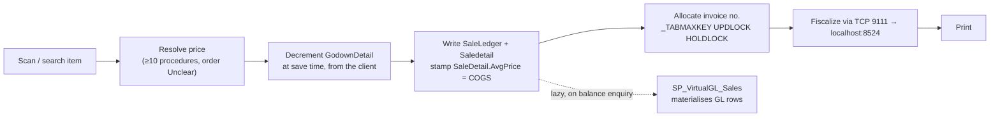
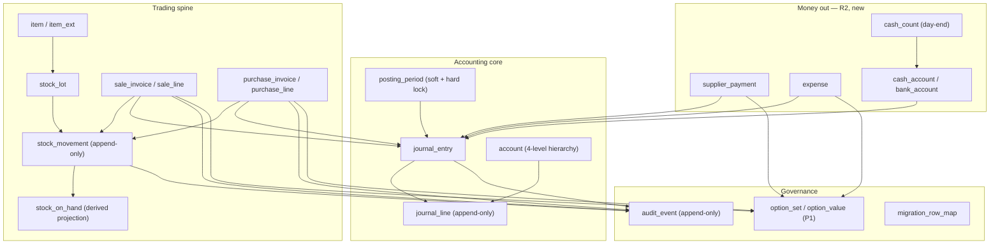

# 22 — Final Master Revamp Plan (Capstone)

## Header block

| | |
|---|---|
| **Purpose** | The single consolidated plan for replacing **WASEELA ABUZAR V3** with a Node.js + TypeScript / React + TypeScript / MySQL 8 system. It gathers the conclusions of the whole 24-document analysis into one governing deliverable: what exists, what is wrong, what is sound, what will be built, in what order, how it is proved correct, and what must still be decided. It supersedes nothing — every other document remains the detailed authority for its subject and is cited here rather than reproduced. |
| **Audience** | **Part A** — the engineering team, migration lead, accountant and tax adviser. Self-sufficient enough to brief a build team without opening another file, though every claim carries a citation so the underlying evidence can be checked. **Part B** — the pharmacy owner and any non-technical stakeholder; plain language, no jargon, cross-referenced to `15-layman-friendly-revamp-plan.md` for the extended version. |
| **Analysis stage** | Analysis and planning **complete** for the pharmacy scope. Stages 1–6 of the analysis are closed; documents `19b` and `20` remain partial in their deepest appendices but are complete in every part this plan depends on. **No code has been written for the new system.** |
| **Subject** | WASEELA ABUZAR V3 running "Fazal Din PP19", a single retail pharmacy in Gujranwala, Pakistan. Data window examined: **2025-01-01 → 2026-07-31** (19 months). Currency **PKR**. Figures captured 2026-08-01. |
| **⚠️ The existing system was NOT modified** | Every finding in this plan comes from **read-only** inspection: `SELECT`-only database queries (authorised by owner decision **D2**), file and directory listings, and text extracted from compiled program files. Nothing was installed, altered, deleted, re-configured or re-started. No stored procedure was executed that writes. The pharmacy traded normally throughout the analysis. |

### Evidence-label legend

Every significant statement carries one of these labels. They are load-bearing, not decoration — they say how much weight a sentence can take.

| Label | Meaning |
|---|---|
| `Verified` | Read directly from the live database, the shipped files, or the compiled binaries. Fact. |
| `Strongly Inferred` | Not stated anywhere directly, but several independent pieces of evidence agree. |
| `Unclear` | The evidence is genuinely ambiguous. Needs an answer before it can be relied on. |
| `Missing` | Something expected is absent — and the absence is itself the finding. |
| `Deprecated` | Present but superseded, dead, or left over from an earlier system. |
| `Broken/Incomplete` | Present and reachable, but it does not work correctly. |
| `Recommended` | A proposal for the **new** system. **Never an existing feature.** Nothing labelled `Recommended` exists today. |

### Binding constraints this plan may never contradict

Owner decisions **D1–D12** and the derived requirements **P1, R1, R2, R3, R4** in `00b-owner-decisions-and-requirements.md` are binding. Where this plan appears to conflict with `00b`, `00b` wins and this document is in error.

### Document map — where each subject is proved

| Subject | Authority |
|---|---|
| Owner decisions and derived requirements | `00b-owner-decisions-and-requirements.md` |
| Plain-language overview for the owner | `01-executive-overview.md`, `15-layman-friendly-revamp-plan.md` |
| Files, binaries, startup gates | `02-repository-map.md` |
| Modules (57 registry rows, 3 tiers) | `03-module-catalog.md` |
| Screens, forms, accessibility of the legacy UI | `04-screen-form-inventory.md` |
| Sales workflows | `05a-workflows-sales.md` |
| Purchase workflows | `05b-workflows-purchase.md` |
| Database structure and MySQL mapping | `06-database-analysis.md` |
| Live data profile, control totals | `06a-data-profile-reconciliation-baseline.md` |
| GL posting engine, chart of accounts | `07-accounting-logic.md` |
| Stock, costing, batch/expiry | `08-inventory-logic.md` |
| Roles, permissions, security | `09-roles-permissions.md` |
| Reports (197 deployed) | `10-reports-catalog.md` |
| Integrations, FBR, hardware | `11-integrations-dependencies.md` |
| 102 risks and gaps | `12-risks-gaps.md` |
| Evidence audit trail | `13-evidence-matrix.md` |
| 27 P0 blockers, ~123 open questions | `14-unknowns-and-questions.md` |
| UX blueprint for the new system | `16-modern-ux-blueprint.md` |
| Technical blueprint for the new system | `17-technical-blueprint.md` |
| REST API plan | `18-api-plan.md` |
| MySQL 8 schema blueprint | `19-mysql-schema-blueprint.md` |
| Data migration plan | `19b-data-migration-plan.md` |
| Testing and acceptance plan | `20-testing-acceptance-plan.md` |
| Old feature → new feature, row by row | `21-feature-traceability-matrix.md` |

---
---

# PART A — TECHNICAL PLAN (for the build team)

---

## 1. Executive summary

**The project is a full replacement, not a modernisation of existing code, because there is no existing code to modernise.** `Verified` — the pharmacy owns `abuzar.exe` plus **122 compiled `.pbd` libraries** built with Sybase PowerBuilder 12.5 (a 2011, 32-bit, out-of-support tool). No source exists; roughly half the transactional logic lives inside those binaries and the other half in **~643 stored procedures** (`02` §4, `03` §2.8, `05a` §4.5).

**What is worth carrying forward is the data and the trading behaviour, not the software.** `Verified` — over 19 months the system recorded 291,361 sale invoices / 620,525 lines, 6,419 purchases / 113,082 lines, 30,704 sale returns, 634 purchase returns, and 1,021,852 GL rows in which debits and credits both total **455,292,133.00** with a difference of exactly **0.00** (`06a` §1–2). Moving-average costing was reconstructed from the procedures and matched the stored result on **113,561 live purchase lines** (`08` §8.3). Sales tie to the ledger to the rupee. This is a trustworthy trading record.

**Three findings shape the entire plan.**

| Finding | Statement | Consequence |
|---|---|---|
| **F1 — the money-out gap** | `Verified`. The ledger records money **in** and never **out**. Suppliers credited 186,197,682 and debited only 3,526,552 (every debit a purchase return, never a payment). Cash debited 234,003,081 and credited only 19,691,239 (returns only). `MARKETING EXPENSES`, `ADMINSTRATIVE EXPENSES`, `PAYROLL-SALARIES`, `COST OF SALES`, `CASH AT BANK`, `INVENTORY` have **zero** entries across 19 months. | "Cash in hand 214.3M" and "payables 182.7M" are **fiction**. **Gross profit is trustworthy** because sales, returns, purchases and stock costing are all correctly recorded. Financial opening balances therefore start at **zero** (**D10/R3**), and the money-out half is built new (**D8/R2**). |
| **F2 — batch/expiry is switched off** | `Verified`. 95.2% of `GodownDetail` rows carry batch `'.'` with sentinel expiry `2030-12-12`; only **62 distinct batch values** exist warehouse-wide; `ItemBatches`, `ItemBatchPricing`, `ExpiryIntimation` all hold **0 rows** (`06` §1, `08` §10). | The system cannot answer *"what expires in 30 days?"* — the most serious functional gap in a pharmacy. Real batch & expiry tracking is approved as **Tier-1 new** (**D12/R4**), accruing forward from go-live. |
| **F3 — the security model is not one** | `Verified`. Passwords are plaintext in `dbo.Users.Password` (seven of nine are one or two characters); the `sa` password is embedded in the binary so every session runs with full DBA rights; `xp_cmdshell` and OLE Automation are enabled; there is no login, permission-change, price-change or document-edit audit trail (`09` Parts F–H, `11` §22). | Credentials are **never migrated** — all nine users are force-reset at cutover. Server-side authorization and an append-only audit trail are Phase 1 work, not Phase 9 work. |

**The target.** A **modular monolith**: one Node.js + TypeScript process (NestJS), one MySQL 8 database, a React + TypeScript front end over a versioned REST API, 17 hard-bounded internal modules (`17` §2.3). Measured workload is **≈0.2 transactions/second at peak with ≤8 concurrent users** (`17` §0.4), so no engineering effort goes into scale the business will never need; all of it goes into **financial exactness, auditability, testability and accessibility**. **WCAG 2.2 AA is an acceptance gate, not a checklist** — the client's stated #1 product feature, against a legacy that scores literally zero (`04` §9.1: the string `accessiblename` appears **0 times** across 5,283,020 extracted UI strings).

**The governing build rule.** Port the trading ledger *exactly*, then add. Historical sales, purchase, stock and gross-profit figures must reproduce the legacy numbers to the rupee **before** any new financial capability is allowed to merge (`00b` R2.7, `20` §2). The four approved additions — **R1** catalogue visibility, **R2** supplier payments / expenses / cash book / plain-language profit, **R4** batch & expiry, **P1** options-as-data — are strictly additive and use new document types.

**Scope disposition.** Of **278** catalogued existing features, **164 are kept** (74 recognisably the same, 90 rebuilt differently), **28 shelved with design preserved**, **28 deferred verticals** (hospital, school, HR, hotel, manufacturing, multi-branch — catalogued under **D1**, never dropped), **47 proposed for removal pending written owner approval**, and **11 blocked on an answer**. **26 new capabilities** are added: **304 items tracked in total** (`21` §14.1–14.2).

**No calendar dates or person-day estimates appear anywhere in this plan.** Team size, seniority, availability and testing support are unknown. Work is sized **Small / Medium / Large / Very Large** with the factors driving each size stated, so a schedule can be produced the moment a team is defined (§24).

---

## 2. Verified existing-system scope

### 2.1 The business

`Verified` from live data (`06a` §2, `01`):

| Dimension | Value |
|---|---|
| Sites | 1 pharmacy ("Fazal Din PP19"), Gujranwala, Pakistan |
| Godowns / warehouses | **1** (`Godown` = 1 row) |
| Data window | 2025-01-01 → 2026-07-31 (19 months). **No pre-2025 data exists** (**D3**) |
| Currency | **PKR** (**D4**) |
| Trading model | Walk-in **cash**; effectively no credit customers (`Customer` = 2 rows) (**D5**) |
| Throughput | ~511–540 invoices per trading day; average sale PKR 803 across ~2.1 lines |
| Turnover | ~PKR 160 M/year; 234,003,081 total sale value in window |
| Users | 9 accounts in 4 groups: 1 ADMIN, 3 shift in-charge, 5 sales officers; group `REMOTE` defined, 0 assigned |

### 2.2 Transaction volumes — the migration payload

`Verified` (`06a` §2; frozen as control totals CT-24…CT-31 in `20` §2.1):

| Object | Count |
|---|---:|
| Sale invoices / lines | **291,361 / 620,525** |
| Sale returns / lines | **30,704 / 44,563** |
| Purchase invoices / lines | **6,419 / 113,082** |
| Purchase returns / lines | **634 / 2,481** |
| Stock adjustments (headers / lines) | **1,542 / 11,181** |
| GL rows (`VirtualGl`) | **1,021,852** |
| Daily stock snapshots (`StockReport`) | **3,215,967** |
| Items in catalogue | **30,052** (8,042 ever stocked; 28,893 `Active=1`) |
| Manufacturers | **838** |
| Suppliers | **235** (112 with activity) |
| Stock lots (`GodownDetail`) | **6,164** rows across 6,012 items; **214,737** units on hand |
| Purchase orders | **2,810** |
| Deleted sale lines logged | **235,887** |

### 2.3 Functional scope actually operated

`Verified` (`03` Tier 1, `21` §§1–10). **In scope for rebuild — 44 modules**, grouped:

- Item catalogue & pricing (30,052 items, 5 price tiers, price-change history)
- Stock & moving-average costing, single godown, daily snapshots
- Expiry & batches — **present but effectively off** (F2)
- Purchasing, purchase orders, purchase returns
- Sales / POS, sale returns
- Tax and **FBR POS fiscalization** (live, legally required)
- FBR Digital Invoicing (installed 2026-05-11, never switched on)
- General ledger — **four document types only**: `SV`, `SR`, `PV`, `PR`
- Reporting — **197 deployed report leaves** (`10` §1.1)
- Users, permissions, 1,352 settings
- Barcodes, labels, printing, backup

**Catalogued and DEFERRED under D1 — never silently dropped:** hospital/patient, e-prescription, laboratory/services, school, HR & payroll, hotel/guest, manufacturing, packing, loyalty, installments, garments, vehicles, contact/CRM, item conversion, SMS, multi-branch CRS sync, DropBox, DataCarry, Waseela Mini. `Verified`: **507 of 762 tables (66.5%) hold zero rows** (`06` §1); ~1,150 of 2,066 windows back features with no data here (`04` §11.2). These are recorded with their evidence in `docs/deferred-modules.yaml` and surfaced in the new system's **Settings → Feature catalogue** (`16` §B.6) so deferral is a visible, versioned artefact.

### 2.4 What is genuinely good and must survive

`Verified` (`01`, `06a`, `08`):

1. The ledger balances exactly: Dr = Cr = 455,292,133.00, difference 0.00 across 1,021,852 rows.
2. Sales tie out to the rupee: GL sale total = `SUM(SaleLedger.InvTotal)` = 234,003,081.
3. No posting backlog: all 291,361 invoices posted, zero unposted.
4. Costing is correct: moving weighted average validated 100% against 113,561 live purchase lines.
5. Chart of accounts is properly designed: 5 Main → 13 Category → 29 Sub → 267 postable accounts.
6. **Zero floating-point money**: 0 of 11,414 columns are `float`/`real`; 2,094 numeric columns are exact `numeric`/`decimal`.
7. FBR fiscalization runs at **99.85%** coverage (290,922 of 291,361).
8. Deep pharmacy domain knowledge: pack/loose selling, distributor bonus schemes, price policies, supplier item mapping.
9. Keyboard-first counter entry that holds a queue at ~540 invoices/day.

---

## 3. Current technology summary

`Verified` throughout (`02`, `11`, `06`).

| Layer | What it is | Consequence |
|---|---|---|
| Client | `abuzar.exe` + **122 compiled `.pbd` libraries**, Sybase PowerBuilder 12.5, **32-bit only**, out of support | No source code. Nothing can be changed — not a screen, not a tax rule, not a bug |
| Deployment | Single Windows machine, **hardcoded server name** | Cannot be moved or rebuilt from bare metal without one recovery journal |
| Database | Microsoft SQL Server (Express), **762 tables, 11,414 columns, ~2.9 GB**, approaching the Express 10 GB ceiling | 255 tables (33.5%) hold data; 507 are empty |
| Credentials | **`sa` password embedded in the binary** | Every session runs as database administrator |
| Server config | `xp_cmdshell = 1`, `Ole Automation Procedures = 1`, `SP_MyExecuteLocal` executes arbitrary SQL | OS-shell path from the database; injection surface |
| Licensing | `SP_WayToMoon` inspects two files in a Windows system folder via `xp_cmdshell`; `Script.mdb` is a 28 MB password-protected obfuscated Jet 4.0 Access file | A Windows update or antivirus sweep can silently stop the software starting. Pins the whole stack to 32-bit |
| Schema upgrades | Delivered only as that encrypted Access file | Only the vendor can upgrade the database |
| Backup | The built-in backup uses a SQL Server feature Microsoft removed in 2012 — **broken since the upgrade**; an external scheduled task replaced it | Whether it runs, and whether a restore has ever been tested, is `Unclear`. **Live data-loss risk today** |
| Crypto libraries | Bundled OpenSSL **0.9.8l** (EOL 2015) | Modern TLS either fails or is unsafe |
| FBR link | `FiscalizationMethod=2` → a separate PowerBuilder EXE on TCP port 9111, then third-party middleware at `http://localhost:8524/api/IMSFiscal/...` | The legally mandatory integration depends on components absent from the analysed machine and inspectable by nobody here |
| Key generation | Hand-rolled counter tables `_TABMAXKEY` / `_HeaderTabMaxKey` read `WITH (UPDLOCK HOLDLOCK)` — **no IDENTITY on any business document**; **136 call sites** | These lock semantics **have no MySQL equivalent**. The single highest-risk mechanical item in the migration |
| Reporting engine | Every server-side report writes into two global, un-keyed scratch tables (`ReportData`, `CrossTab_ReportData`) that each producer `DELETE`s first | Two concurrent report users corrupt each other's output, by construction |

**Build-provenance caveat (`Verified`, risk M4 / U-077):** the binaries analysed are dated Nov 2024 while the live database was schema-changed May 2026, and the live FBR middleware is absent from the analysed machine. Compiled-side findings therefore describe an **older build** and must be re-confirmed against the production machine.

---

## 4. Complete module summary

`Verified` structure from `dbo.Module` (57 registry rows) plus the reconstructed menu tree from `dbo.Rights` (486 rows deployed) / `dbo.Rightsclone` (2,122 rows in the vendor master). Full detail: `03-module-catalog.md`.

### 4.1 Tier 1 — pharmacy core (rebuild scope)

| Legacy T-code family | Module | Live evidence | Modern decision |
|---|---|---|---|
| T1-01, T1-18, T1-37, T1-39 | Item master & basic data | 30,052 items; `Item` has **148 columns** | Retain, split core + extensions |
| T1-02 | Pricing, price policy, price change | 5 price tiers; resolution order spread over ≥10 procedures, order `Unclear` | **Redesign** as one resolver emitting a price-resolution trace |
| T1-03 | Inventory / stock / batch | `GodownDetail` authoritative; 6 availability procs + 3 repair procs | **Redesign**: append-only movements + derived balance |
| T1-04 | Expiry management | Report exists; data degenerate (F2) | **Build properly** (D12/R4) |
| T1-05, T1-06, T1-07, T1-17 | Purchasing, POs, purchase returns, suppliers | 6,419 / 2,810 / 634 / 235 | Retain, simplify (20 expense-account *columns* collapse to rows) |
| T1-08…T1-16 | Sales, POS, returns, templates, deletion log | 291,361 / 30,704 | Redesign the screen, preserve the behaviour |
| T1-20, T1-22 | GL & accounting | 1,021,852 rows, 4 doc types | Redesign as an immutable journal + **add money-out** |
| T1-23 | Tax rules engine | 6 independent tax-rule lookups per purchase line | Retain, version by effective date |
| T1-24, T1-25 | FBR POS fiscalization / Digital Invoicing | Live 99.85% / dormant | Rebuild as a fault-tolerant outbox service |
| T1-26, T1-27, T1-42 | Reporting & dashboards | 197 leaves, 3,015 DataWindows, 1,080 parameter windows | Redesign around one metric layer |
| T1-28, T1-29 | Users, permissions, preferences | 9 users, 4 groups, 486 rights, 1,352 settings | Redesign — security is not salvageable |
| T1-30, T1-41 | Printing, labels, barcodes | 5 alphabetically-partitioned print libraries; client-branded layouts | One renderer + data-driven templates |
| T1-36 | Backup / platform | Built-in backup broken | Rebuild |

### 4.2 Tier 2 — dormant here, catalogued and deferred (D1)

33 modules with **zero rows** at this deployment: hospital/patient, e-prescription, laboratory & services, school, HR/payroll/attendance/biometrics, hotel/guest, manufacturing & production notes, packing, garments, vehicles, item conversion, installments, loyalty, contact/CRM, SMS & bulk messaging, CRS multi-branch consolidation (60+ `CRS_*` tables, all empty), DropBox site-to-site exchange, DataCarry migration packets, Waseela Mini export, customer payment API, weighing scale, TWAIN scanning.

### 4.3 Tier 3 — legacy / deprecated artefacts

`*Mod` / `*Dump` / `*Log` clone table families, `LastPurchaseHistory` (a stale migration snapshot), `Rightsclone`, the Google Charts QR path (Google retired the API), Excel import via Jet OLEDB (`Ad Hoc Distributed Queries = 0`, and Jet is 32-bit only — **Broken/Incomplete**). All are in the 47 "remove after approval" rows of `21` §14.1 — **nothing is deleted without a written owner signature, and anything holding data is archived first.**

---

## 5. Core workflows

Full step-by-step detail: `05a-workflows-sales.md`, `05b-workflows-purchase.md`.

### 5.1 Cash sale — the only live sales workflow

`Verified` (`05a` §4). 291,361 executions. 12 documented steps in the legacy, including a **credential modal on every single invoice** (`Ask User/Password in Cash Sale = Yes`), item selection through one of 17 search popups whose commit gesture (`F12`/double-click) is advertised **in the window title bar**, a ~70-column line grid and a ~90-column header. Batch and expiry are **not shown at all**. `MiscCharges = 1.00` on **100%** of invoices — the FBR POS fee. Rounding: `roundsaleinvon = 0` (whole rupees).

**The critical unknown (`Verified`, risk M1 / R-009):** **no stored procedure wrote those 291,361 invoices.** The sale-commit lives inside the compiled binary and is not readable. It must be re-specified from data plus an Extended Events trace on a **restored copy**. `05a` §4.6 further shows the legacy commit has **no `BEGIN TRANSACTION`** around header+lines+stock: on mid-loop failure the header and lines remain and stock stays decremented.



**GL derivation, `Verified` (`05a` §6.4, `07` §4.1):** Dr `CashAccCode` 234,003,081 = Cr `SALES ACCOUNT` 229,385,121 + Cr `SALES TAX` 4,326,599 + Cr `FBR POS FEE` 291,361 (exactly PKR 1 × invoice count).

### 5.2 Sale return

`Verified` (`05a` §8). 30,704 documents / 44,563 lines. Dr `SALES RETURN ACCOUNT` 19,301,800 + tax 360,500 + FBR fee 28,939 = Cr cash 19,691,239. **19,642 of the 2025 returns are unfiscalised** — a live statutory exposure (`11`, R-064, U-065), not one the rebuild creates.

### 5.3 Purchase / goods receipt

`Verified` (`05b` §5). **There is no separate goods-receipt document** — the purchase invoice *is* the receipt. `Purledger.GRN` is free text populated on **30 of 6,419** invoices (0.5%), so **there is no three-way match** and ordered-vs-billed discrepancies are invisible. 42% of purchases reference a PO. Four live purchase categories: Credit, Cash, Loose, Opening. Batch is `'.'` on **97.7%** of lines; expiry is the sentinel `2030-12-12`.

**Moving-average cost, `Verified` verbatim in five procedures** (`08` §8.2):

```sql
SET @NewAvgPrice = ISNULL((SELECT
      ROUND( ((@TotStock * @hold_avgprice) + (@givenqty * @price))
             / (@givenqty + @TotStock), 5) ), 0)
```
with `@hold_avgprice` = `Item.AvgPrice`, `@TotStock` = `SUM(GodownDetail.CurrQty)` across all godowns, `@givenqty` in **loose units**, `@price` the incoming **unit** cost. Validated against 113,561 live lines.

**GL, `Verified` (`05b` §5.5):** Dr `PURCHASE ACCOUNT` 193,566,768.31 + input tax 3,807,564 + advance income tax 696,928.69 = Cr supplier accounts 186,197,682 + Cr `EQUITY/CAPITAL` 11,873,579 (opening purchases, `PurCatCode=3`). Total 198,071,261 both sides.

### 5.4 Purchase return

`Verified` (`05b` §7). 634 documents / 2,481 lines. Dr supplier 3,526,552 = Cr `PURCHASES RETURNS` 3,480,475 + Cr input tax reversed 46,077. Empirically confirmed on document 2122.

### 5.5 The workflow that does not exist

**Supplier payment.** `Verified` (`05b` §9). The product ships `PurPayment`, `TransactionHeader`/`Detail` and `SP_CreateVoucher_From_PurPayment` — and **none of it has ever been used here**. `05b` §9.3 additionally documents a shipped bug in the payment-voucher procedure. Together with zero expense entries, this is finding **F1**.

### 5.6 Stock adjustment

`Verified` (`04` §6.9). 1,542 headers / 11,181 lines. **Increase and decrease are two different windows with near-identical grids — the direction is encoded in which window you opened, not in any visible field — and there is no reason field at all**, so adjustment reporting can count but never explain.

---

## 6. Business-rule summary

`Verified` unless labelled otherwise. Rules that must be reproduced exactly, and the ones that must be re-specified.

| # | Rule | Status |
|---|---|---|
| BR-1 | Pack/loose model: items sell by pack or by loose unit; `Item.AllowSaleInDecimalQty` gates fractional quantities; all stock maths is in **loose units** | `Verified` (`08` §5.1) |
| BR-2 | Price basis differs between purchase (pack basis) and sale (unit basis) — the classic source of the pack-unit cost error | `Verified` (`08` §5.2); causes the corruption in BR-13 |
| BR-3 | Costing = **perpetual moving weighted average at item level**, recomputed on every inbound movement. Not FIFO, not LIFO, not batch-specific | `Verified` (`08` §8.1) |
| BR-4 | Every outbound line stamps the then-current `Item.AvgPrice` onto itself (`SaleDetail.AvgPrice` etc.) — that stamp **is** the historical COGS record. Only 2 of 620,619 rows have a null/zero stamp | `Verified` (`08` §8.1, `10` §1.2) |
| BR-5 | Batch allocation order is FEFO (earliest expiry first) in SQL; `GodownDetail.Locked` is **not honoured by any SQL allocation path** | `Verified` (`08` §7.1–7.2) — a defect |
| BR-6 | `InventorySystemUsed = 'P'` (periodic) ⇒ the COGS/inventory GL pair **never fires**. Account 9 `COST OF GOODS SOLD` has zero entries | `Verified` (`07` §4.3) |
| BR-7 | GL posting is **lazy**: rows are materialised into `VirtualGl` by `SP_VirtualGL*` on balance enquiry, not at document save | `Verified` (`07` §3.1) — the ledger is a rebuildable cache, not a journal |
| BR-8 | Only four document types have ever posted: `SV`, `SR`, `PV`, `PR` | `Verified` (`06a` §4) |
| BR-9 | FBR POS fee: exactly PKR 1.00 per sale invoice, as `MiscCharges`, on 100% of invoices; reversed at PKR 1 per return | `Verified` (`05a` §4.2, `20` CT-12) |
| BR-10 | Sale invoice rounding to whole rupees (`roundsaleinvon = 0`) | `Verified` (`04` §6.1.9) |
| BR-11 | Sale price **may** fall below recent purchase price (preference `Allow Sale Price Below Recent Pur. Price = Yes`) | `Verified` — so the new system **warns, never blocks** |
| BR-12 | Purchase expenses do **not** affect item cost — landed cost is not implemented | `Verified` (`05b` §10.2) |
| BR-13 | **Live data defect:** 16 items carry an average cost above retail — PKR 1,775,942 (~15%) of stock value is phantom; 3 items cause 99.6% of it | `Verified` (`08` §9.2). Carried into D11 stock carry-over as blocker **U-046** |
| BR-14 | Item pricing resolution order across ≥10 procedures | `Unclear` — must be settled before the pricing resolver is written |
| BR-15 | Whether `SP_Update_ItemHistoricalCost` has ever run (it retro-rewrites historical cost) | `Unclear` — **U-045**. If yes, "gross profit is trustworthy" needs qualifying |
| BR-16 | Sale-return cost basis for free-standing returns | `Unclear` — **V-5**, accountant question; blocks control total CT-41 |
| BR-17 | **P1 (D9): no business assumption is ever hardcoded.** Every realistic option ships, the user picks per transaction, the admin enables/disables, options are **data not code**, one sensible default pre-selected, every choice audited | `Recommended` — binding project-wide |

---

## 7. Accounting summary

Authority: `07-accounting-logic.md`. All `Verified` unless stated.

### 7.1 Chart of accounts — sound

`MainAccounts` (5) → `CategoryAccounts` (13) → `SubAccounts` (29) → `Accounts` (267 postable, all `Active='Y'`, including ~235 supplier accounts). `SubAccounts.CatAccCode` correctly references `CategoryAccounts`. Noise: two junk category rows (`FIXED ASSETS1`, `TEST`).

### 7.2 Posting engine — the structural problem

The GL is **derived, not journaled** (`07` §3.1). `SP_VirtualGL*` procedures rebuild `VirtualGl` from source documents on demand. Consequences, all `Verified`:

- A single preference (`AutoPurgeVirtualGL = 'Y'`) **empties the entire ledger** with no confirmation, no backup and no log. Currently `'N'` (R-011).
- Corrections are deletions. A posted invoice can be edited by deleting its GL rows; invoice numbers can be reused after a range delete (R-012).
- **No period close, no year-end lock** exists anywhere (R-013).
- Three profit calculations exist and disagree; the GL-based income statement is **Broken/Incomplete** here because `StockLedger` holds 0 rows and account 9 has no entries, so its "gross profit" reduces to *Sales − Purchases* (`10` §1.2 finding 2).

### 7.3 Posting rules that must be reproduced exactly

`Verified` from the `dr_acccode`/`cr_acccode` assignments (`07` §4):

| Doc | Debit | Credit |
|---|---|---|
| **SV** sale | `SaleLedger.CashAccCode` (cash categories 1/3) else `CustCode` | `@GT_SalesACC` (6), plus tax and FBR-fee legs |
| **SR** sale return | `@GT_SalesReturnACC` (8) | `CashAccCode` (categories 6/8) else `CustCode` |
| **PV** purchase | `@GT_PurchaseAccount` (1) when `@InvSys='P'` else `@GT_InventoryAcc` (7) | `PurCatCode=3` → `@GT_EquityACC` (5); else supplier |
| **PR** purchase return | supplier | `@GT_PurchaseReturnsAccount` (12) when `@InvSys='P'` |

22 manual voucher categories (`CP/CR/BP/BR/JV/...`), notes receivable/payable, payroll (5 legs) and the transaction window are all **implemented in procedures but never used here** — `Verified`, zero rows.

### 7.4 What the new system does about it

`Recommended` (`17` §7.8, `19` §7.1, §12.1):

1. **`journal_entry` / `journal_line` are append-only and synchronous** — written inside the same transaction as the document, never derived, never rebuilt. Enforced by **MySQL grants** (no UPDATE/DELETE for the app user) **and** `BEFORE UPDATE`/`BEFORE DELETE` triggers raising `SQLSTATE 45000`.
2. **Only the `ledger` module may write journal rows**, through one `PostingService.post(journal)` that validates Dr = Cr before insert. Four integrity layers, not one (`19` §7.1).
3. **Corrections are reversing entries** referencing the original document. There is no edit path and no delete path.
4. **Fiscal periods** with soft and hard locks, and an audited break-glass override (`19` §8.2).
5. **R2 is strictly additive** (`00b` R2.7): new posting types for supplier payment, expense, transfer and cash count; the SV/SR/PV/PR behaviour is preserved byte-for-byte so historical reports stay reproducible.
6. **Accountant sign-off is a gate** (R2.8). This analysis never guesses accounting policy — every new Dr/Cr rule is reviewed before implementation. Open items: **U-017** (no trial balance / balance sheet specification exists — these must be *written*, not ported), **U-018** (periodic vs perpetual COGS), **U-019** (which of three GP engines is authoritative), **U-020** (immutable journal policy), **U-021** (output GST credited to an *asset* account), **U-022** (reconciliation rounding tolerance).

---

## 8. Inventory summary

Authority: `08-inventory-logic.md`.

| Aspect | Legacy (`Verified`) | New system (`Recommended`) |
|---|---|---|
| Truth table | `GodownDetail` is authoritative (`Item.Stock` is a cache; `StockReport` is a daily photograph; `StockLedger` holds 0 rows) | `stock_movement` append-only; `stock_on_hand` a derived projection that can be rebuilt and proved |
| Where logic lives | Split: ~half in stored procedures, ~half in the compiled client which decrements stock **at save time** | 100% server-side, inside one ACID transaction per document |
| Costing | Moving weighted average at item level, five identical formula sites | Same formula, one implementation, in the pure domain layer, replay-tested against 113,561 lines |
| Batch/expiry | Machinery complete, **data degenerate** (F2): 95.2% placeholder batch, sentinel expiry, `ItemBatches` = 0 rows | **R4 Tier-1**: GS1 scan-to-fill at intake, admin-configurable strictness per item category, 30/60/90-day dashboard with value at risk, FEFO default with audited override, warn/block/allow guardrail on expired stock, batch traceability for recall |
| Allocation | FEFO in SQL; `Locked` ignored | FEFO by default (R4.3), override audited, `Locked` honoured |
| Godowns | 1 live; multi-godown machinery inert | Single godown; the dimension is retained in schema so multi-site is not a rewrite (gated on **U-016**) |
| Adjustments | Direction implicit in window identity; **no reason field** | Explicit direction choice + **required reason** from a P1 option list + value impact shown before commit |
| Reservations ("Due") | Mechanism exists, unused | Not built in v1; catalogued |
| Valuation | 214,737 units; **12,011,533** at average cost; 12,352,339 at retail; **1,798,138 (15.0%) provably corrupt** across 3 items | Corruption is **reported, never silently corrected** (`20` DR-3); the owner and accountant rule on it (**U-046**) before D11 carry-over |
| Carry-over at cutover | — | **D11/R3.3**: quantities and moving-average costs migrate **unchanged** — the sole exception to "start from zero". No stock freeze or stock-take is required at cutover; placeholder batch/expiry map to `NULL` and are **not back-filled** (R4.6) |

---

## 9. Database summary

Authority: `06-database-analysis.md`, `19-mysql-schema-blueprint.md`.

### 9.1 Legacy — what we are leaving

`Verified`: 762 tables, 11,414 columns, ~2.9 GB. 507 tables (66.5%) empty. **117 tables have no primary key** — including the four largest: `StockReport` (3.22 M), `VirtualGl` (1.02 M), `Saledetail` (620 K), `DeletedSaleItem` (236 K). **243 foreign-key columns on populated tables have no supporting index** (34 on `SaleLedger` alone). Only **23 CHECK constraints exist in the entire database**. `Item` has 148 columns, `SaleLedger` 143, `Purledger` 105 with **20 purchase-expense-account columns**. Parallel `*Mod`/`*Dump`/`*Log` clone table families. The one genuine structural strength: **no `float`/`real` column exists anywhere**.

### 9.2 Target — MySQL 8

`Recommended` (`19`). Roughly **95–110 tables**, organised as modules **A–K** (platform & configuration, identity/access/audit, organisation/calendar/currency, parties, catalogue & pricing, tax & FBR, inventory, sales, purchase, accounting & money movement, reporting/migration/control). Design commitments:

| Commitment | Specification |
|---|---|
| Storage | InnoDB, `utf8mb4` / `utf8mb4_0900_ai_ci`, strict `sql_mode`, explicit `my.cnf` decided **before first initialisation** |
| Money | `DECIMAL(18,4)` everywhere; quantities `DECIMAL(18,3)`; unit rates `DECIMAL(18,6)` as the single deliberate deviation. **No float, ever** — lint-enforced, plus a Decimal boundary at the Node/TS layer |
| Column packs | `AP` audit pack on every table; `SD` soft-delete on master/reference data only; `LK` options-as-data pack (P1); `DOC` transactional document header pack |
| Immutability | `journal_line`, `stock_movement`, `item_cost_snapshot`, `audit_event` are append-only — grants **and** triggers |
| Document numbering | Race-safe and gapless sequences replacing `_TABMAXKEY`; seeded from `GREATEST(_TABMAXKEY, _HeaderTabMaxKey, MAX(data))`; widened to `BIGINT`; **numbers reserved at commit, not at form-open** |
| Dates | The `2030-12-12` / `2022-12-12` sentinels map to `NULL`; no sentinel dates in the target |
| Options as data | 24 `LK` option tables; adding a payment method or expense category is an **admin action**, never a deployment |
| Visibility (R1) | Per-context resolution — Sales / Purchase / Reports / Stock lists — as a view over `item`, never a mutation of it |
| Reporting | Read-only credentials on a **second connection pool**; no scratch tables; a published, versioned metric layer |
| Exclusions | Every excluded legacy table is listed with its reason in `19` §11, and every source row lands in `migration_row_map` with a disposition — "where did `Rightsclone` go?" has an answer in the database in three years' time |

### 9.3 Projected go-live volumes

`Verified` baseline → target: ~620 K sale lines, ~1.02 M journal lines, ~113 K purchase lines, 30 K items, 6 K stock lots, 3.2 M historical stock snapshots (loaded as history, not as the live balance mechanism). This is a **small database**. Index strategy in `19` §9 names the query each index serves and explicitly lists the indexes deliberately **not** created.

---

## 10. Security summary

Authority: `09-roles-permissions.md` Parts F–H.

### 10.1 The legacy position — `Verified`

| Finding | Detail |
|---|---|
| **There is no server-side authentication** | The client compares a plaintext password from `dbo.Users.Password`. Seven of nine passwords are one or two characters (`1`, `0`, `z0`, `55`) |
| **The `sa` password is inside the binary** | Every session holds full DBA rights; permission limits are enforced only in the UI and evaporate if the UI is bypassed |
| **No audit trail** | Logins, password changes, permission grants, price changes and posted-document edits are all unrecorded (`Missing`). `ItemLog` (109,473 rows) and `DeletedSaleItem` (235,887 rows) are the only change records, and they cover data, not identity |
| **OS shell from the database** | `xp_cmdshell = 1`, `Ole Automation Procedures = 1`, `SP_MyExecuteLocal` executes arbitrary SQL |
| **Credential fatigue** | The application re-asks for the password on every sale, every return, every adjustment and every item edit — ~291,361 modal password entries in 19 months, with one-character passwords |
| **Group policy fields exist but are never enforced server-side** | `09` §C.2.3 |
| **Export is the only well-designed control** | `Save As` / `Save As Excel` are granted to ADMIN only |

### 10.2 The target — `Recommended`

**Eight seeded roles** (`09` §I.3, `18` §0.13.1): `owner`, `sys_admin`, `pharmacy_manager`, `shift_incharge`, `sales_officer`, `purchase_officer`, `accountant`, `auditor`. Two deliberate separations of duty that do not exist today: **create/edit split from post** on purchases, and **system administration split from business administration**.

Non-negotiable controls: **argon2id** password hashing (bcrypt cost ≥12 acceptable); 12-character minimum with breach-list check; lockout with exponential backoff; **MFA for `sys_admin`, `owner`, `accountant`, `pharmacy_manager`**; 15-minute access tokens with rotating refresh and server-side revocation; 20-minute counter idle timeout; a **non-sysadmin MySQL account** with no `DROP`, no `FILE`, no `SUPER`, credentials from a secrets store and never in a binary; **every role limit evaluated inside the transaction that writes the document**, not in the browser; break-glass as a per-user MFA challenge that is time-boxed, reason-mandatory and fully imaged into the audit log; append-only `security_audit` and `data_change_audit` retained ≥7 years; TLS on both the database connection and the web app; and **no OS-shell path from the database at all** — `SP_WayToMoon` is re-implemented in the application tier or removed.

**Migration stance:** **no plaintext password is ever extracted, transported or loaded.** The password column is excluded from extraction at source (`19b` §15). All nine users are force-reset at first login. Proven by schema inspection at the go-live gate.

---

## 11. UX problems (legacy)

Authority: `04-screen-form-inventory.md`, `16-modern-ux-blueprint.md`.

| # | Problem | Evidence | Label |
|---|---|---|---|
| UX-1 | **2,066 windows**, ~56% backing features with zero data here | `04` §1, §11.2 | `Verified` |
| UX-2 | Reports menu is **5 levels deep** (`Reports → CRS Reports → CRS Accounting Reports → CRS Ledger Reports → CRS Customer Ledger`) | `04` §4.5 | `Verified` |
| UX-3 | **1,080 parameter windows** and **357 layout-picker windows** for 197 reports | `10` §1.1 | `Verified` |
| UX-4 | **17 search popups** whose only commit gesture is `F12` or double-click — advertised **in the title bar** | `04` §6.15 | `Verified` |
| UX-5 | **130 response-window objects**; a single sale can chain item search → batch → godown → calculator → password → print copies | `04` §9.2 A7 | `Verified` |
| UX-6 | A **credential modal on every transaction** | `04` §9.2 A8 | `Verified` |
| UX-7 | All errors are modal `MessageBox` — **2,880 distinct messages**, none inline, none returning focus to the offending field ("Please Enter Valid Sale Qty in Row " requires manual row-hunting) | `04` §9.2 A9 | `Verified` |
| UX-8 | ~70 keyboard shortcuts product-wide; **69 menu entries smuggle the shortcut into the menu *name*** because there is nowhere to document it | `04` §9.2 A6 | `Verified` |
| UX-9 | Hover help in only **4 of 120** libraries | `04` §9.2 A10 | `Verified` |
| UX-10 | The item form shows **garment fields (Fabric, Sleeve, Style, Yarn, Colour, Size) beside pharmacy fields**; a pharmacist reads ~30% dead fields, and flags are unlabelled single-character Y/N cells with no stated consequence | `04` §6.7 A15/A16 | `Verified` / `Strongly Inferred` |
| UX-11 | Stock adjustment direction is encoded in **which window you opened** | `04` §6.9 A17 | `Strongly Inferred` |
| UX-12 | Arbitrary hard caps surface only as errors ("You can not select more than 16 Zones.") | `04` §9.2 A25 | `Verified` |
| UX-13 | Shipped spelling errors in user-facing text degrade comprehension and machine translation: `Dsicount`, `Recivable`, `Refrigrated`, `godwon`, `Exipry`, `Visibilty`, `Transation` | `04` §9.2 A27 | `Verified` |
| UX-14 | **No back concept at all** — MDI, fixed-coordinate windows, no URL, no history | `04` §5 | `Missing` |

**What is fair to the legacy and must be preserved:** keyboard-first entry is *correct* for a queue-driven counter; the header/detail/footer/list metaphor is consistent across every transaction; right-gated column visibility (`Show Purchase Price`, `Show Avg. Price`) is a genuinely good idea; several DataWindows do provide textual posted/un-posted indicators.

---

## 12. Accessibility problems (legacy)

Authority: `04` §9. Scope note: WCAG is a web standard; the desktop equivalents are Section 508 / EN 301 549 and the Windows UI Automation contract. Findings are mapped to the nearest criterion for the rebuild team.

### 12.1 The decisive finding

**No control in the entire application exposes an accessible name or description.** `Verified` — the properties `accessiblename` and `accessibledescription` appear **0 times** across all 120 extracted PBD string corpora (**5,283,020** UTF-16 strings). The only related token, `accessiblerole`, appears solely in PowerScript type-name reference tables beside `windowtype` and `borderstyle` — it is the enumerated datatype name, not a set property.

**Consequence:** with NVDA, JAWS or Narrator, every field on every one of the 2,066 screens is announced with no name. The application is, in practice, **unusable by a blind or severely low-vision operator.** This is not a gap to improve; it is a total absence — and it means there is **nothing to port**, so accessibility is a greenfield build.

### 12.2 The rest

| ID | Problem | Label |
|---|---|---|
| A2 | Labels are free-floating text objects (`remarks_t`, `batch_t`, `expiry_t`, …) with no programmatic association to their input | `Verified` |
| A3 | The primary input surface is a dense spreadsheet grid — ~70 bound columns on the sale line, more on purchase | `Verified` |
| A11 | **No responsive or reflow behaviour** — fixed-coordinate PowerBuilder classic windows | `Strongly Inferred` |
| A12 | **No RTL screen support despite an Urdu-speaking user base.** `RightToLeft` in 2 libraries; `Jameel Noori Nastaleeq` and "Urdu Name" columns appear **only in print layouts** | `Verified` |
| A-colour | **Colour-only status encoding** with no textual equivalent: white vs pale pink for approved/not approved, khaki for returned-via-bill-summary, green/red for approved/rejected — recovered as literal `RGB()` expressions. Some DataWindows *do* provide text (`if(posted='Y','Posted','Un-Posted')`), which proves the pattern was known and simply applied inconsistently | `Verified` |
| A-type | Typeface census across 120 libraries: Arial 16,762 · Times New Roman 9,735 · **Arial Narrow 7,302** · Tahoma 3,470. A condensed face at 7,302 occurrences is diagnostic of more columns than pixels and materially reduces legibility for low-vision and dyslexic users. Point sizes are `Missing` (compiled), but PowerBuilder classic windows **do not honour Windows DPI/text scaling**, so the user cannot change them | `Verified` |

### 12.3 The target contract — `Recommended`

WCAG **2.2 AA** is an **acceptance gate**: a failure blocks a release (`16` §A.4, `17` §8.12). Concretely: React Aria Components + Tailwind for correct semantics by construction; axe-core per component on every pull request; keyboard-only Playwright E2E covering a full sale; an NVDA walkthrough of the dispensing and POS flows performed by a real screen-reader user before go-live; 200% zoom and reflow verified; no colour-only status anywhere; error summaries plus inline errors with managed focus (the `errors[]` array in `18` §0.8.1 is explicitly *the accessibility contract* of the API); WCAG 3.3.8 on sign-in (no cognitive-function test, password managers and paste permitted); no step ever times out; and — the constraint that makes it real — **measured invoice-entry time at or below the legacy baseline**. Accessibility must not cost counter throughput.

---

## 13. Modernization objectives

`Recommended`. Each objective names the evidence that motivates it and the gate that proves it met.

| # | Objective | Motivated by | Proof of achievement |
|---|---|---|---|
| O1 | **Own the source.** Every line of business logic readable, versioned, testable | No source code; ~half the logic inside binaries | The repository builds from scratch on a clean machine |
| O2 | **Reproduce the trading record exactly** before adding anything | F1 says gross profit is trustworthy; nothing else can be | Control totals CT-01…CT-41 (`20` §2.1) match; golden replay of 291,361 invoices and 1,021,852 GL rows |
| O3 | **Close the money-out gap** (R2) | F1 | Cash-book inflow reconciles exactly to `SUM(SV debits to cash)`; supplier payment reduces supplier and cash by the same amount with Dr = Cr preserved |
| O4 | **Make expiry answerable** (R4) | F2; 57 already-expired batches show positive stock | 30/60/90 dashboard correct against live data; FEFO default; guardrail behaves per admin setting; batch → sales traceability for recall |
| O5 | **Make the ledger a journal, not a cache** | BR-7, R-011/012/013 | No code path deletes a journal row (proven by test); every correction is a reversal; period lock working with audited override |
| O6 | **Enforce authorization server-side and audit everything** | §10.1 | Automated test proving every limit and permission is refused when the UI is bypassed; audit rows exist from the first migrated transaction |
| O7 | **Accessibility as a release gate** | §12 — the legacy scores zero | WCAG 2.2 AA conformance report + NVDA walkthrough + keyboard-only sale |
| O8 | **Never hardcode a business assumption** (P1/D9) | D9 | Adding a payment method or expense category requires no deployment; every option choice is stored on the transaction and appears in the audit trail |
| O9 | **Nothing deleted, nothing dropped silently** (D1, R1.1) | D1, D7 | `deferred-modules.yaml` versioned; Feature catalogue screen live; `migration_row_map` accounts for every source row |
| O10 | **Make the counter faster, not slower** | ~540 invoices/day; staff know the current system | Measured invoice-entry benchmark at or below baseline; sale reduced from ~10 steps to 4 |
| O11 | **Survive an FBR outage without stopping trade** | 439 unfiscalised invoices show the legacy already tolerates this, badly | Sale completes and prints with the gateway down; durable queue with retry, dead-letter and an operator-visible unfiscalized report |
| O12 | **Restorable, tested backups** | The built-in backup has been broken since the SQL Server upgrade | A restore rehearsal is a line item on the go-live checklist |

---

## 14. Recommended Node.js architecture

`Recommended` throughout. Authority: `17-technical-blueprint.md`, `18-api-plan.md`.

### 14.1 Style — modular monolith [BINDING, decision D-01]

One deployable Node process, one MySQL database, hard internal module boundaries. The five forces that would justify microservices were tested against this system's evidence and four are absent (peak 0.2 tx/s, ≤8 users, one team, one site, fixed stack). The fifth — fault isolation for FBR — is met by a **transactional outbox inside the monolith**. Decisively, the opposite force is present: a single sale must atomically allocate FEFO batches, decrement stock, write movements, write header + lines, allocate an invoice number, write journal rows, write the audit record and enqueue fiscalization — in a domain where **the legacy's worst latent defect is already a missing `BEGIN TRANSACTION`**.

**Written-down revisit trigger:** decompose only if (a) a second branch needs independent uptime, (b) sustained writes exceed 50 tx/s, or (c) a second team owns a distinct bounded context end-to-end.

**The failure mode being guarded against is not "monolith" — it is "big ball of mud"**, which is exactly what the legacy is. Modularity is therefore the specific defect being corrected, and §14.4 makes it mechanical rather than aspirational.

### 14.2 Layers — four, one direction

`HTTP controller (thin)` → `Application service (owns the transaction boundary, permissions, idempotency)` → `Domain (pure TypeScript: Money, Quantity, BatchRef, the pricing resolver, the FEFO allocator, the moving-average calculator, the posting rules — no framework, no database imports, 100% unit-testable)` → `Infrastructure (Drizzle repositories, raw-SQL report modules, FBR client, file store, mailer, clock)`.

The pure domain layer is what makes the largest porting risk **testable**: the moving-average formula, the tax cascade, the discount precedence and the FEFO order become functions that can be driven with 113,561 historical purchase lines and 620,619 sale lines and compared to the legacy result. A two-layer "service + repository" shape is explicitly rejected — it makes rounding rules untestable without a database.

### 14.3 The 17 modules

`identity` · `access` · `catalog` · `pricing` · `inventory` · `purchasing` · `sales` · `tax` · `fiscal` · `ledger` · **`payments` (NEW, R2)** · `reporting` · `settings` · `audit` · `documents` · `notifications` · `platform`. Plus a shared kernel (`packages/shared`) holding `Money`, `Quantity`, `Percent`, decimal configuration, the `Result`/error taxonomy, `Clock`, id types, pagination primitives and the Zod contract schemas shared with the front end.

**Boundary rules [BINDING]:**

| Rule | Statement |
|---|---|
| B1 | `ledger` depends on nothing but `settings` and `audit`. Others call *into* it; it never calls back |
| B2 | Only `ledger` writes journal rows; only `inventory` writes stock movements; only `audit` writes audit tables |
| B3 | `reporting` holds **read-only database credentials** and imports no other module's services |
| B4 | No module reads another module's tables directly — only its public service interface, or a published versioned SQL view for reporting |
| B5 | Effects that must not be lost use the transactional outbox (fiscalization, notifications, partner exports); effects that may be lost use the in-process event bus |
| B6 | `settings` may not depend on any business module — options are data |

### 14.4 Enforcing boundaries mechanically

NestJS module graph (only exported services are reachable) + `eslint-plugin-boundaries` with an explicit allow-list + `dependency-cruiser` rendering a graph artefact per pull request + **MySQL grants** (reporting on a separate read-only pool; no UPDATE/DELETE grant on journal/audit tables for the app user). CI job `arch:check` fails the build on a violation, and an integration test asserts the reporting pool receives `ER_TABLEACCESS_DENIED_ERROR` on an attempted insert.

### 14.5 Money, transactions and numbering

| Concern | Decision |
|---|---|
| Money | Decimal end-to-end; `DECIMAL(18,4)`; `packages/money` value objects; rounding policy stated once and tested by golden replay; **float constructs banned by lint** |
| Transactions | Transaction-script pattern; the application service owns the boundary; the canonical sale commit is **one readable file** |
| Idempotency | `Idempotency-Key` required on every financial POST |
| Concurrency | Optimistic concurrency for edits; declared lock ordering to avoid deadlock |
| **Numbering** | Race-safe gapless sequences replacing `_TABMAXKEY`'s `UPDLOCK HOLDLOCK` (136 call sites, no MySQL equivalent). Reserved **at commit**, not at form-open. 20-session concurrency test with zero duplicates is a go-live gate |
| Fiscalization | Transactional outbox + retry worker; never blocks the till |
| Ledger | Immutable, synchronous, period-locked |

### 14.6 REST API

`18-api-plan.md`. Versioned (`/api/v1`), resource-named, cursor-paginated, with standard response and **error envelopes** (`errors[]` is the accessibility contract), decimals transported as strings, `Idempotency-Key` and optimistic-concurrency headers, RBAC expressed as a permission grammar with scopes and limits, and an **OpenAPI 3.1 spec that is generated from the code and never hand-written**. Modules are grouped Platform/Identity → Catalogue & Inventory → Sales & POS → Purchasing → **Money-out, cash, bank, accounting** → Reporting/Settings/Admin/Audit/Documents. `18` Part 8 separates **replacements** (legacy behaviour, rebuilt) from **additive-new** (R1, R2, R4, P1) so nothing new can be mistaken for a port.

### 14.7 Cross-cutting

Authentication (short-lived tokens, revocation list) · RBAC guard · Zod validation at the edge · a single error taxonomy · **append-only audit logging** · a read-only reporting metric layer · a background job/scheduler for expiry alerts, digests and backups · file storage for receipt photos · notifications with pluggable channels · security hardening · the testing strategy of §21 · backup/restore/DR with a rehearsed restore · monitoring and observability · coding standards (`17` §9.1–9.14).

---

## 15. Recommended React architecture

`Recommended`. Authority: `17` Part 8, `16`.

| Concern | Decision | Reason from evidence |
|---|---|---|
| Build | **Vite** | Fast rebuild; no framework-level SSR requirement for an in-shop application |
| Routing | **React Router (data router)** | Every drawer, tab, filter and grid position lives in the URL — the legacy MDI has **no back concept at all** |
| Server state | **TanStack Query** | Report and list screens dominate; caching and invalidation must be explicit |
| Client state | **Zustand, minimally** | Counter session state only; no global store cult |
| Forms | **React Hook Form + Zod** | The same Zod schemas are shared with the backend via `packages/shared`, so validation cannot drift |
| Components | **React Aria Components + Tailwind** | Correct ARIA semantics and focus management by construction. This is the single highest-leverage decision for WCAG 2.2 AA, given the legacy exposes **zero** accessible names |
| Data grid | **TanStack Table + TanStack Virtual** | 30,052-item search lists and 620 K-row report results must virtualise while keeping truthful `aria-rowcount` |
| Charts | **Apache ECharts** | Dashboard tiles and the expiry buckets; accessible fallbacks required (never colour-only) |
| i18n / RTL | Built in from day one, **not retrofitted** | Urdu is a live question (**U-115**) and the legacy has RTL only in print layouts |
| Hardware | Barcode/QR scanners as keyboard-wedge input; A4 / A5 / thermal print paths; explicit offline behaviour | Counter hardware already present; `AcceptFutureExpiryDays = 90` and GS1 AI 01/10/17 parsing feed R4.1 |
| Testing | Vitest + Testing Library + **axe-core per component** + Playwright keyboard-only E2E | The a11y gate of §12.3 |

**Three surfaces, three route trees** (`17` §8.9, `16` §B.2) — because `04` §10 proves a single responsive layout cannot serve a 90-field counter screen and a phone:

| Surface | Root | Shell |
|---|---|---|
| **Counter** | `/counter` | **No sidebar.** One fixed top bar (till, user, connection state, shift totals) plus the work area. Everything else via `Ctrl+K` or a shortcut. The counter's navigation *is* the keyboard |
| **Back office** | `/office` | Persistent left nav, 8 sections, contextual tabs inside the page; collapse state persists per user |
| **Insights** | `/insights` | Bottom tab bar on phone / left rail on desktop, 5 read-only destinations |

---

## 16. Recommended MySQL architecture

`Recommended`. Authority: `19-mysql-schema-blueprint.md`. Summarised in §9.2; the operational mechanisms that matter to the build team:



| Mechanism | Specification |
|---|---|
| Double-entry integrity | **Four layers**: application validation before insert; a `CHECK` that exactly one of debit/credit is non-zero; a per-entry balance assertion; and a scheduled trial-balance invariant job |
| Inventory traceability | Append-only `stock_movement`; `stock_on_hand` derivable and rebuildable; a rebuild must reproduce the balance exactly or the discrepancy is an alert |
| Numbering | Sequence tables with row-level locking semantics that **are** available in MySQL, seeded from the legacy maxima and widened to `BIGINT` |
| Period locking | Soft lock (warn + role gate) and hard lock (refuse), with an audited break-glass |
| P1 enforcement | Options resolved through `settings`; no business module defines its own enum; every option value carries enabled/default/sort/scope and an audit trail |
| R1 resolution | Visibility computed per context at query time; **enabling a preset never modifies item data** — proven by before/after row-hash comparison of the `item` table |
| Partitioning | Considered explicitly against the foreign-key trade-off; the decision and its reasoning are recorded rather than assumed |
| Excluded tables | Enumerated with reasons; **~95–110 tables carried, not 762** |

**Six items require owner or accountant validation before DDL is generated** (`19` §14) — chiefly the COGS basis, the reversal policy, period-close cadence, rounding tolerance, the option seeds, and the treatment of the 16 cost-corrupt items.

---

## 17. Proposed module structure

`Recommended`. The backend module list (§14.3) maps **1:1** onto the eight back-office navigation sections (§18), so a permission failure can never produce a section a user can see but cannot use.

```
apps/
  api/          NestJS — controllers, application services, module wiring
  web/          React — three route trees: counter / office / insights
packages/
  shared/       Money, Quantity, Percent, Result, Clock, ids, Zod contracts
  money/        decimal value objects + rounding policy
  config/       typed environment and my.cnf-adjacent runtime settings
  test-fixtures/ golden-replay datasets and control totals
docs/
  deferred-modules.yaml     D1 register — evidence-backed, versioned
  openapi/                  generated, never hand-written
deploy/
  mysql/my.cnf              decided before first initialisation
  migrations/               forward-only DDL
  etl/                      staged, idempotent SQL transforms (19b)
```

| Domain group | Modules | Notes |
|---|---|---|
| Cross-cutting | `identity`, `access`, `settings`, `audit`, `platform` | Used by everything; `settings` depends on nothing |
| Master data | `catalog`, `pricing`, `tax` | 148-column `Item` splits into core + typed extensions |
| Transactional core | `sales`, `purchasing`, `inventory`, `payments` | `payments` is entirely new (R2) |
| Financial core | `ledger`, `fiscal` | `ledger` is the correctness core; `fiscal` is its own failure domain via the outbox |
| Read side | `reporting`, `documents`, `notifications` | `reporting` has no write access, by grant |

---

## 18. Proposed navigation

`Recommended`. Authority: `16` Part B. Derived from the legacy menu tree (`Rightsclone` 2,122 rows / `Rights` 486 rows), then cut of what has no data here, merged where duplicated, and extended with what is missing.

### 18.1 Back office — eight sections

| # | Section | Contains | Legacy origin | Module |
|---|---|---|---|---|
| 1 | **Sell** | Sale invoices, sale returns, held sales, day book, re-print | Sales menu (31 items; retail sale + return live) | `sales` |
| 2 | **Buy** | Purchase invoices, purchase returns, purchase orders, bills to pay, goods expected | Purchase menu (22 items) | `purchasing` |
| 3 | **Stock** | Stock on hand, **expiry & batches (R4)**, adjustments, stock take, reorder board, item movement | Maintenance → Adjustment; Reports → Stock Report | `inventory` |
| 4 | **Catalogue** | Items, manufacturers, categories/classes, packing, **visibility & curation (R1)**, price changes | Basic Data → Item | `catalog`, `pricing` |
| 5 | **Money** | **Supplier payments, expenses, cash book, bank book, day-end count, profit statement (R2)**, accounts & ledger | Transactions (unused here) + **entirely new** | `payments`, `ledger` |
| 6 | **People** | Suppliers, customers, users, roles & permissions, activity log | Basic Data → Customer/Supplier; Manage → Users | `access`, `identity` |
| 7 | **Reports** | ~95 report screens in 7 groups, saved views, scheduled exports | Reports menu (197 deployed leaves) | `reporting` |
| 8 | **Settings** | Business, counter, printing, tax & FBR, **options & lists (P1)**, **Feature catalogue (D1)**, backups | Maintenance → Preference (1,352 settings) | `settings`, `platform` |

### 18.2 Navigation rules [BINDING]

| # | Rule | Reason |
|---|---|---|
| N1 | **Maximum depth 3** — Section → Page → Detail/Tab | The legacy Reports menu is 5 levels deep |
| N2 | **Nothing is reachable only by a keyboard shortcut** — every shortcut action also has a visible named control or a palette entry | 69 menu entries currently hide the shortcut in the menu name |
| N3 | **Nothing is reachable only by a mouse gesture** — no double-click-only commit | `F12`/double-click are today the *only* commit gestures on search popups |
| N4 | **No modal opens another modal** — depth-1 dialogs only | 130 response-window objects; a sale can chain six modals |
| N5 | **A missing permission hides the nav item and returns 403 on the route** — no dead links | Legacy enforcement is largely client-side |
| N6 | Current location announced three ways: `aria-current="page"`, page `<h1>`, document `<title>` | WCAG 2.4.2 / 2.4.8 |
| N7 | Breadcrumbs only at depth 3; never a one-item decorative breadcrumb | Noise reduction |
| N8 | **Back always works** — every drawer, tab, filter and grid position is in the URL | The legacy has no back concept |

### 18.3 The command palette

`Ctrl+K` (and a visible **Search & commands** button — never shortcut-only). Searches screens, actions, items, suppliers, invoice numbers, settings and reports in one ranked grouped list; each row shows its shortcut, so the palette is also the shortcut teacher. Proper combobox/listbox semantics with a polite live region announcing the result count. Never the only path to an action; never returns a result the user lacks permission to run (filtered server-side).

### 18.4 The Feature catalogue — how D1 is visible

**Settings → Feature catalogue** lists every deferred vertical with a plain-language name, an **evidence line** (*"Shipped in the old software. Never used here: `Patient` held 0 rows across 19 months."*), a state (`Not built yet` / `Available — switch on` / `On`) and a **Request** button that files it to the backlog. Read-only for every role except `sys_admin`. This is the visible proof that deferred ≠ dropped.

---

## 19. Proposed wizard workflows

`Recommended`. Authority: `16` Part F. **A wizard trades steps for decisions per step. It is right when a task is infrequent, multi-domain and error-costly; it is wrong when a task is high-frequency and single-domain.**

| Task | Frequency here (`Verified`) | Wizard? |
|---|---|---|
| Add a product | 30,052 items but new ones are occasional; the form mixes garment and pharmacy fields | **Yes — 4 steps** |
| Purchase / goods receipt | ~11 bills/day, 17.7 lines each, densest grid in the product | **Yes — 4 steps, step 2 is the fast grid** |
| **Sale invoice** | **~500–540/day** | **NO for the routine sale.** Opt-in 3-step *Guided sale* for new staff only |
| Stock adjustment | ~4.5/day; direction currently implicit | **Yes — 4 steps** |
| Opening balances | **Once, at cutover** — the highest-consequence task in the project | **Yes — 5 steps** |

> **The single most important UX decision: there is no wizard on the cash-sale path.** Adding one would add ~1,000 extra confirmations per day to a queue-driven counter.

**One wizard shell, five instances [BINDING]:** ordered step list with state in **text** (not colour) and `aria-current="step"`; a new heading per step with focus moved to it; "Step 2 of 4" in text and in the document title; Back / Continue / **Save draft & close** on every step; per-step validation on Continue with inline errors plus a top-of-step error summary; **Continue is never disabled** — pressing it and being told why is more discoverable than a dead button; a **mandatory Review step** with per-group Edit links that return and come back, financial totals restated; a confirmation **panel** (not a toast) with the record number, a `role="status"` announcement and 2–4 named next actions; `Esc` prompts "Discard? Your draft will be kept for 7 days" (WCAG 3.3.4); **no step ever times out** (WCAG 2.2.1).

### The five wizards

1. **Add a product (4 steps).** *What is it?* (duplicate check **as you type** — the legacy's only defence fires at *sale* time) → *How is it packed and sold?* → *Money and tax* (live margin; missing PCT code raises a hard warning: *"Without a PCT code this item is silently dropped from the FBR fiscal invoice"* — `Verified` critical defect F3) → *Pharmacy controls & visibility* (prescription-only, narcotic + max qty, refrigerated, **batch/expiry strictness R4.1**, reorder levels, **visible in Sales / Purchase / Reports / Stock lists — R1.6**). Garment and vehicle fields are **deferred and catalogued, not deleted**. Field count falls from ~60 on one form to 18 across four steps.

2. **Purchase / goods receipt (4 steps).** *Whose bill is this?* (duplicate supplier-bill detection) → *What arrived?* — the fast grid, where **a GS1 scan auto-fills item, batch and expiry (R4.1)**, expiry beyond `AcceptFutureExpiryDays` (90) requires confirmation, past expiry is blocked, sale price ≤ purchase price warns with the computed margin → *(2a, only if a PO was linked)* ordered-vs-received variance, fixing a verified blind spot → *Bill-level amounts*, containing **the reconciliation gate**: the user types the total the supplier's paper says, and the wizard refuses to continue unless it matches or the user explicitly records the difference — **the single highest-value error-prevention control in the purchase flow, and it does not exist today** → *Review & post* showing old average cost → new average cost per item. **Draft is the default**; `purchase_officer` finishes at "submitted for posting" and a manager posts (separation of duties).

3. **Sale invoice — fast path by default.** One screen, one focus: scan → line appears with FEFO batch and expiry badge → scan next → `F10` tender → type cash → `Enter`. **Steps fall from ~10 to 4** for a two-line cash sale. The optional **Guided sale** (Items → Check → Payment, change due in 2rem type) commits through the **same server transaction** — a different front end onto one operation, never a second code path. Both modes share FEFO with audited override (R4.3), the expired-stock guardrail (R4.4), the automatic PKR 1.00 FBR fee, whole-rupee rounding, and asynchronous fiscalization that **never blocks the till**. **The per-invoice password modal is gone.**

4. **Stock adjustment (4 steps).** *What are you doing?* — three large choice cards (Increase / Decrease / Correct a count) so direction becomes an explicit, announced, auditable choice → *Why?* — **reason is required**, from a P1 option list (Damage · Expiry · Theft/shrinkage · Count correction · Sample/donation · Breakage · Other) → *Which stock?* — batch picker with live resulting balance; negative results blocked with the reason on the row → *Review* with value impact; adjustments above an admin-set amount require approval.

5. **Opening balances at cutover (5 steps).** Per balance type, the P1 method choice — **Start at zero (default)** · Enter manually · Import from reconciled statement — with each choice, its chooser and its timestamp written to the migration log (R3.4).

---

## 20. Migration plan

`Recommended`. Authority: `19b-data-migration-plan.md`. Summarised faithfully; `19b` remains the operational authority.

### 20.1 Shape

```
SQL Server (restored backup copy)
   → typed extraction (SELECT-only, decimals and dates as strings, password column excluded)
   → MySQL staging schema stg_*   (verbatim, loosely typed, no constraints)
   → transform + load in SQL      (deterministic, idempotent, re-runnable, waves W0…W9)
   → MySQL target schema          (FKs ON, CHECKs ON throughout)
   → reconciliation_check         (28 invariants R1…R28)
   → sign-off → cutover
```

### 20.2 The five defining decisions

| # | Decision | Why |
|---|---|---|
| **S-1** | **Extract from a restored backup, never from live production** | A long extraction takes read locks on `SaleLedger` and `VirtualGl` and would slow a counter doing ~540 invoices/day. It also guarantees a frozen, reproducible snapshot — dry run 3 must read exactly what dry run 1 read |
| **S-2** | **Land verbatim in `stg_*`, transform in MySQL** | Transforms are testable without SQL Server present, re-runnable in seconds, diff-able in Git, and executed by the engine that will enforce the constraints |
| **S-3** | **Every load step is idempotent, keyed on `legacy_key_hash`** | A failed step is re-run, not surgically repaired. This is what makes three dry runs affordable |
| **S-4** | **Constraints stay ON during the target load** | The new schema is far stricter than the old data (only 23 CHECK constraints exist in the entire legacy DB). Loading with FKs off hides violations until the worst possible moment. Violations are found in staging instead |
| **S-5** | **Nothing is dropped silently, ever** | Every source row lands in `migration_row_map` with a disposition (`migrated` / `excluded` / `merged` / `rejected` / `deferred`) and a reason |

**Explicitly rejected:** big-bang weekend cutover with no dry run (forbidden by the reconciliation requirement); **dual-run / parallel operation** (impossible here — the legacy decrements stock from inside the sealed client at save time and materialises the GL lazily on enquiry, so there is no clean observable transaction boundary to replicate; the two systems would silently drift); trickle/CDC (same reason, plus SQL Server Express has no CDC); mechanical migration of all 762 tables (imports the confusion); carrying legacy balances forward (violates D10 — would import a 183 M phantom payable and a 214 M phantom till).

### 20.3 Six stages with gates

| Stage | Content | Exit gate |
|---|---|---|
| **0 — Identity & snapshot** | Resolve **U-102** (`...V2` vs `...V3`), `DBCC CHECKDB`, `COPY_ONLY` backup, restore to a READ_ONLY copy | Source identity signed; zero consistency errors |
| **1 — Extract & stage** | SELECT-only; decimals and dates as text; UTF-8; **no password column** | Pre-flight gates MG-1…MG-10 all green |
| **2 — Transform & load** | Waves W0→W9 in order; constraints ON; idempotent; orphans quarantined | Every wave complete; every quarantine dispositioned |
| **3 — Reconcile** | R1…R28, row-level hashes, historical report reproduction | Zero-tolerance checks green; every delta explained |
| **4 — Sign-off** | Owner, accountant, migration lead: option seeds, permission diff, opening-balance decisions | **GO / NO-GO** |
| **5 — Cutover** | Freeze, cash count, final backup, production run, verification, user enrolment, first live invoice | Verification passes |
| **6 — Hypercare** | Day 1 / Week 1 / Month 1 | — |

**Gate G-W1 is a business gate, not a technical one.** The seed values of the 24 option tables **are** the business rules; under P1/D9 they are chosen by the owner, not by an engineer. Before wave 1 runs, every option list is printed as a plain-language review sheet — one line per option, what it means, enabled or not, default or not — and the owner ticks it. A clean technical run does not open this gate.

### 20.4 Three dry runs, each proving something different

| Run | Proves | Complexity |
|---|---|---|
| **DR1** | The pipeline completes mechanically end to end; the pre-flight gates' results become *known* (they may fail — DR1 is where they are found) | Large |
| **DR2** | The numbers match **and the run is fast enough**. Produces the full reconciliation pack, the per-user permission diff, `ItemLog` sizing, and **the measured duration of each wave — which is what sizes the cutover freeze window** | Large |
| **DR3** | The **runbook** works, including the non-SQL parts: the cash-count sheet, the go/no-go meeting, user enrolment, and **an actually rehearsed rollback**. DR3 is not finished until trading has "resumed" on the legacy copy | Medium |

### 20.5 What migrates, what does not

| Category | Decision | Authority |
|---|---|---|
| Transactions 2025-01-01 → 2026-07-31 | **Migrate in full** | D3, R3.2 |
| Pre-2025 history | **None exists** | D3 |
| Item master, all 30,052 | **Migrate**, visibility state preserved exactly (28,893 visible / 1,159 hidden) — migration must not silently change any item's visibility | D7, R1.2 |
| **Physical stock quantities + moving-average costs** | **Carry over unchanged — the sole exception to "start from zero"** | **D11, R3.3** |
| Batch / expiry placeholders (`'.'`, `2030-12-12`) | Map to **`NULL`**; **not back-filled** — the real dates are unknowable retrospectively. Real data accrues from go-live forward | R4.6 |
| Cash in hand, cash at bank, supplier balances, customer balances, equity | **ZERO** (or manually entered / imported from a reconciled statement — the owner's P1 choice per balance type, recorded with who chose it and when) | **D10, R3.1, R3.4** |
| Legacy "fiction" balances | **Archived for reference, never imported**; remain visible in read-only historical reports so the old numbers can still be explained | R3.4 |
| Passwords | **Never extracted.** Force-reset for all nine users at first login | `19b` §15 |
| 507 empty tables, ~160 dormant/staging/clone tables | **Excluded by recorded decision**, each with a reason | S-5 |

### 20.6 Rollback

Every stage has a rehearsed rollback and a named decision owner. Stages 0–4 lose nothing but elapsed time — production is never written to. Stage 5 **before the first live invoice**: set the legacy database READ_WRITE, trading resumes on legacy, the new system is quarantined. Stage 5 **after** live invoices exist is harder: stop trading, export the few hours of documents, re-enter them into legacy from printed receipts, resume. **The window between "first live invoice" and "rollback becomes impractical" is measured in hours — which is exactly why the go/no-go gate is not a formality and why DR3 rehearses the rollback.**

### 20.7 Reconciliation is not a document figure

Every number quoted in this plan is `Verified` **as at 2026-08-01**, and the shop has kept trading since. Two analysis snapshots taken days apart already differ (`Saledetail` 620,525 / 620,619; `SRLedger` 30,695 / 30,704; `Purledger` 6,417 / 6,419; `Item` 30,052 / 30,050). **The baseline is therefore re-captured from the cutover snapshot and re-frozen immediately before migration.** A target that moved between snapshot and replay is a **stop**, not a rounding difference.

---

## 21. Testing plan

`Recommended`. Authority: `20-testing-acceptance-plan.md`.

**Governing principle:** the new system must **reproduce or explain** every legacy number. Where it cannot reproduce one, the deviation is entered in the *reproduce-or-correct register* with a stated reason and an owner/accountant decision — never silently absorbed.

### 21.1 Suite map

| Tier | Runs | Contents |
|---|---|---|
| **On every pull request** (minutes) | CI | Unit + property tests (**domain ≥95% line coverage**); contract tests (OpenAPI ↔ Zod); integration tests on Testcontainers MySQL 8.4; **axe-core per component**; architecture tests (boundaries, lint, schema conformance) |
| **Nightly on staging** (hours) | scheduled | Concurrency (**≥20 simultaneous POS sessions**); keyboard-only Playwright E2E; performance (k6 + the invoice-entry benchmark); **chaos — kill the process at each commit step** and assert no partial document survives |
| **Before cutover** (days, signed) | gate | **Golden replay** of 291,361 invoices and 1,021,852 GL rows; migration reconciliation (28 invariants); manual UAT with **NVDA**, by the owner, the accountant and cashiers |

### 21.2 Functional coverage

Item master & **R1 visibility** · purchases, POs, goods receipt · sales/POS · inventory operations · **R4 batch & expiry (new)** · **R2 payments, expenses, cash book (new)** · returns both directions · GL · **the P1 options engine** · reports · permissions and roles. Non-pharmacy verticals are tested only by the **deferred-register test** — they are never silently dropped and never silently half-built.

### 21.3 Financial validation — the frozen targets

**41 control totals (CT-01…CT-41)**, re-captured from the cutover snapshot. The headline ones:

| Level | Targets |
|---|---|
| Ledger | 1,021,852 rows; Dr = Cr = 455,292,133.00; **difference 0.00 — the single most important invariant in the project**; exactly 4 document types ever posted |
| Document type | SV 908,617 rows / 234,003,081 · SR 93,050 / 19,691,239 · PV 18,790 / 198,071,261 · PR 1,395 / 3,526,552 |
| Account leg | Sales 229,385,121 Cr · sale tax 4,326,599 · **FBR fee 291,361 = exactly PKR 1 × invoice count** · cash 234,003,081 Dr · sale returns 19,301,800 Dr · purchases 193,566,768.31 Dr · suppliers 186,197,682 Cr · capital 11,873,579 Cr · purchase returns 3,480,475 Cr |
| Identity checks | 229,385,121 + 4,326,599 + 291,361 = 234,003,081 = `SUM(SaleLedger.InvTotal)` ✔ ; purchase Dr 198,071,261 = Cr 198,071,261 ✔ |
| Documents | 291,361 invoices / 620,525 lines / **0 unposted**; 30,704 returns; 6,419 purchases; 634 purchase returns; 1,542 adjustments; CoA 5→13→29→267 |
| Stock | 6,164 lots / 6,012 items / 214,737 units / 12,011,533 at cost / 12,352,339 at retail / **1,798,138 (15.0%) provably corrupt — reported, never silently corrected** |
| Gross profit | 2026: revenue 74,328,611 − COGS 61,938,286 = **12,390,325 (16.7%)** — the anchor |

**CT-41 (full-window COGS ≈193,957,857) is deliberately NOT a pass/fail target** — it is `Strongly Inferred` and depends on unresolved accounting question **V-5**. Freezing it before the accountant rules would be guessing accounting logic.

### 21.4 The one thing this plan must never try to prove

It must never attempt to reconcile the new system's cash or supplier balances against the legacy figures. Those are **fiction** (F1). Supplier balances in the new system are **reconciled by construction** from zero forward (R3.1), and the F1 non-reconcilable list is signed off by the accountant as *known and deliberately not matched*.

### 21.5 Acceptance beyond numbers

Signed UAT per role; the **measured invoice-entry benchmark at or below the legacy baseline**; a keyboard-only completion of a full sale; the NVDA walkthrough by a real screen-reader user; a report-by-report side-by-side against outputs captured from the live system (**time-sensitive — ~75% of the legacy report SQL is unreadable, so outputs must be captured while the old system still runs**); and a proven append-only enforcement test (`UPDATE journal_line` and `DELETE FROM stock_movement` must both raise `SQLSTATE 45000`).

---

## 22. Deployment plan

`Recommended`. Authority: `17` §9.10, §9.12, §9.13; `19b` §20.

**Topology is gated on an unanswered question.** **U-080** (on-premise vs cloud) and **U-079** (must the till work offline?) are P0 blockers because both are architecture-shaping and expensive to add late. The plan below assumes the current shape — a single on-premise server — and states what changes if the answer differs.

| Concern | Specification |
|---|---|
| Runtime | One Node process (clustered by CPU count if needed) behind a local reverse proxy with TLS; MySQL 8 on the same or an adjacent host |
| Environments | **dev** (local, Docker Compose) → **staging** (a full copy loaded with real 19-month data — this doubles as the training sandbox) → **production** |
| Configuration | Typed environment configuration; secrets in a secrets store, **never in a binary and never in a repository**; `my.cnf` fixed **before first initialisation** and version-controlled |
| Database migrations | Forward-only DDL, applied by the deploy pipeline, reversible by a documented compensating migration; the one-shot ETL is separate from ongoing migrations |
| Release process | Trunk-based with CI gates: `arch:check`, unit/integration/contract, **axe**, and a schema-conformance test. A red accessibility gate blocks the release |
| Backup / DR | Automated nightly logical + physical backups, **encrypted with a key from the secrets store — never a name-derived formula**, stored **off-site**, with a **restore rehearsal on the go-live checklist**. This directly answers the live risk that the legacy's built-in backup has been broken since the SQL Server upgrade |
| Monitoring | Health endpoints; structured logs; error tracking; alerting on: unfiscalized-invoice backlog, journal imbalance, failed job queue, backup failure, disk headroom, and login-failure spikes |
| Hardware | Barcode/QR scanners, receipt and A4/A5 printers, label printer; a **site survey (U-116)** is required before go-live |
| Network | Local-first: the counter must not depend on internet reachability for a sale to complete; FBR submission is asynchronous through the outbox |
| Rollback | Blue/green or versioned-artefact rollback for the application; database rollback governed by §20.6 |

**If the answer to U-079 is "yes, the till must work offline",** the counter surface needs a local write-ahead store and a reconciliation protocol — a **Large** addition that must be designed in Phase 1, not bolted on. **If the answer to U-080 is "cloud",** connectivity becomes a trading dependency and the offline question becomes mandatory rather than optional.

---

## 23. Training plan

`Recommended`. Nine staff accounts exist. Training is scoped to roles, not to the system.

| Role | Must learn | Depth | Format |
|---|---|---|---|
| **Cashier** | Sell, return, tender, print, close the day, count the drawer | Small — the sale is 4 steps | One-page printed keyboard card + supervised live shifts |
| **Store / warehouse** | Receive goods, **capture batch and expiry by scanning**, adjust stock with a reason, stock-take on tablet | Small–Medium | Hands-on at the shelves with a tablet |
| **Purchasing** | POs, goods receipt, purchase returns, supplier records | Medium | Practice on the sandbox copy |
| **Owner / admin** | Product visibility (R1), options and permissions (P1), **expense and payment entry (R2)**, reports, audit and exception reports | Medium | Walkthrough, then run a real month personally in the sandbox |
| **Accountant** | New posting rules, period close, reversals, profit statement, reconciliation | Medium | **Review-and-sign-off sessions during the build, not after** |

**Five mechanisms:** (1) a **sandbox** loaded with the real 19 months of data, where mistakes cost nothing — staff practise **before** cutover; (2) **a printed one-page card per role** covering the eight keystrokes that person actually uses, laminated and taped by the till; (3) **Guided mode**, switchable per user, breaking the sale into three labelled steps for whoever is still learning, and turned off when no longer needed; (4) **help inside the screen, not in a manual** — every setting carries a one-line plain-English explanation, and `?` lists every shortcut on the current screen; (5) **one trained champion** per area (one cashier, one back-office person) who goes deeper and becomes the first person others ask.

**Training is a Phase-9 acceptance item, not an afterthought:** UAT signatures per role are a go-live gate (§29).

---

## 24. Phased implementation roadmap

`Recommended`.

> ### ⚠️ Why there are no dates and no person-day estimates
> A schedule requires knowing the team: how many developers, at what experience level, working what hours, with what testing and accountancy support. **None of that information exists.** Publishing invented dates or day-counts would be worse than publishing none, because the project would then be planned against a fiction. Every phase below therefore carries a **complexity size (Small / Medium / Large / Very Large)** with the factors driving it stated explicitly. The moment a team is defined, these sizes convert directly into a schedule. This constraint is stated in `01`, `15` §19 and `19b` §22 and is repeated here deliberately.

```mermaid
flowchart TD
  P0["PHASE 0 — Discovery & Validation<br/>27 P0 blockers · trace the sealed commit<br/>capture report outputs · Size: Medium"]
  P1["PHASE 1 — Foundations<br/>identity · RBAC · audit · P1 options · money<br/>numbering · ledger primitives · a11y kit<br/>Size: LARGE"]
  P2["PHASE 2 — Master Data<br/>30,052 items · pricing · suppliers · tax<br/>+ R1 visibility (NEW)<br/>Size: LARGE"]
  P3["PHASE 3 — Inventory<br/>movements · moving-average costing · adjustments<br/>+ R4 batch & expiry model (NEW)<br/>Size: LARGE"]
  P4["PHASE 4 — Purchases<br/>PO · goods receipt · returns<br/>+ R4 capture at intake (NEW)<br/>Size: LARGE"]
  P5["PHASE 5 — Sales<br/>counter · returns · FBR outbox · printing<br/>+ R4 FEFO & guardrail (NEW)<br/>Size: VERY LARGE"]
  P6["PHASE 6 — Accounting<br/>immutable journal · SV/SR/PV/PR exact · periods<br/>+ R2 money-out (NEW)<br/>Size: LARGE"]
  P7["PHASE 7 — Reports & Dashboards<br/>metric layer · ~95 screens · expiry dashboard<br/>Size: MEDIUM"]
  P8["PHASE 8 — Migration<br/>DR1 · DR2 · DR3 + rehearsed rollback<br/>reconciliation R1…R28<br/>Size: LARGE"]
  P9["PHASE 9 — Launch<br/>training · UAT · cutover · hypercare<br/>Size: MEDIUM"]
  P0 --> P1 --> P2 --> P3 --> P4 --> P5 --> P6 --> P7 --> P8 --> P9
  P3 -.->|"batch model must exist<br/>before intake captures it"| P4
  P6 -.->|"ledger must reproduce history<br/>before money-out is added"| P7
  classDef new fill:#E6F4F1,stroke:#0B6E63,color:#0F172A
  class P2,P3,P4,P5,P6 new
```



**The order is not negotiable.** Security, audit and exact money handling come first because retro-fitting them leaves gaps exactly where risk is highest. Master data precedes inventory because nothing moves without items. **Inventory precedes purchases** because the batch model must exist before intake can capture into it. **Purchases precede sales** because that is where batch and expiry enter the system. Sales is the largest single phase. The ledger is built only after the documents that feed it, and **must reproduce history exactly before the new money-out half is added on top**.

---

### PHASE 0 — Discovery & Validation

| | |
|---|---|
| **Goals** | Close every question that invalidates the evidence base or shapes the architecture irreversibly, before a line of production code is written |
| **Scope** | The **27 P0 blockers** (`14`): U-102 (which database is authoritative), U-077 (the analysed binaries are not the production binaries), U-078 + U-081 (agree the tracing method and capture screenshots/recordings), U-079 (offline till), U-080 (on-prem vs cloud), U-115 (English / Urdu / bilingual), U-016 (multi-branch → `branch_id` now or never), U-017…U-022 (accounting specifications and policy), U-042 (supplier statements — **weeks of lead time**), U-045/U-046 (historical-cost rewrite; the 16 cost-corrupt items), U-049 (do the packs and scanners support GS1 2D scan-to-fill — **R4 may be undeliverable as designed**), U-060/U-065/U-074 (FBR regime; 19,642 unfiscalised returns; zero invoice-level sales tax), U-062 (DRAP / controlled-drug obligations — **never analysed**), U-076/U-118 (vendor contract, IP, cooperation), U-099 (is backup actually running), U-114 (who holds `ADMIN`/`sa`; are logins shared). **Plus two time-critical captures:** an Extended Events / Profiler trace of one real sale and one real purchase commit on a **restored copy**, and the **outputs of every report the owner cares about, captured while the legacy still runs** |
| **Dependencies** | Owner availability; accountant engagement; tax adviser; pharmacist; vendor reachability; owner consent for the trace |
| **Deliverables** | Signed answers to all 27 blockers; the **target transaction specification** for the sale and purchase commits, written from the trace; a captured report-output library; a confirmed production-machine inventory; the option-seed review sheet drafted; team definition (which converts every size below into a schedule) |
| **Risks** | The trace is the only way to recover the largest unknown and needs a restored copy plus consent. U-049 may invalidate R4's scan-driven design. U-042 has multi-week lead time. Vendor may be unreachable, which changes the resolution strategy for ~26 other questions |
| **Acceptance criteria** | All 27 P0 rows marked resolved with a named answerer and a date; the transaction specification reviewed by the build team as sufficient to implement against; report outputs archived and checksummed |
| **Data-migration considerations** | U-102 must close before **any** extraction. `DBCC CHECKDB` on the source. The cutover snapshot policy (§20.7) agreed in writing |
| **Training considerations** | None yet — but the sandbox strategy and the champion selection are agreed here |
| **Complexity: MEDIUM** | Driven by: coordination across five external parties (owner, accountant, tax adviser, pharmacist, vendor) rather than engineering volume; one genuinely technical task (the trace); and long lead times that make it calendar-bound rather than effort-bound |

---

### PHASE 1 — Foundations

| | |
|---|---|
| **Goals** | Build the substrate on which nothing can later be retro-fitted: identity, authorization, audit, exact money, safe numbering, the options engine and the accessibility component kit |
| **Scope** | Repository and module skeleton with **mechanically enforced boundaries** (`arch:check` green); `packages/shared` and `packages/money` with the decimal policy and banned-construct lint; MySQL 8 instance with the fixed `my.cnf`, strict `sql_mode`, `utf8mb4`; the `AP`/`SD`/`LK`/`DOC` column packs; **`identity` + `access`** with argon2id, MFA for privileged roles, the eight seeded roles and server-side limit evaluation; **`audit`** append-only with grants and triggers; **`settings`** — the P1 options engine, options-as-data, admin-editable, cached, audited; **race-safe gapless document numbering** replacing `_TABMAXKEY`; `platform` (jobs, scheduler, health, backup orchestration); the React shell for all three surfaces with React Aria + Tailwind, the wizard shell, the error/`errors[]` contract, focus management, and axe in CI |
| **Dependencies** | Phase 0 answers on U-079/U-080 (topology), U-115 (language/RTL), U-016 (`branch_id`), U-114 (credential custody) |
| **Deliverables** | A deployable skeleton that authenticates, authorizes, audits and numbers documents; the option registry with its first seeds; the accessible component library; CI with five gates; the generated OpenAPI skeleton |
| **Risks** | Numbering is the highest-risk mechanical item in the project (136 legacy call sites, no MySQL equivalent for `UPDLOCK HOLDLOCK`). P1 implemented naively recreates the exact class of defect behind five existing critical risks — the option model must be typed and audited, not a free-text bag. Accessibility built late is an order of magnitude more expensive |
| **Acceptance criteria** | 20-session concurrency test issues **zero duplicate document numbers**; an automated test proves every permission and every role limit is refused server-side **when the UI is bypassed**; `UPDATE`/`DELETE` on audit tables raises `SQLSTATE 45000`; **no float construct passes lint**; axe passes on every shipped component; a keyboard-only user can navigate the shell end to end |
| **Data-migration considerations** | Sequence-seeding strategy defined and tested (`GREATEST(_TABMAXKEY, _HeaderTabMaxKey, MAX(data))`, widened to `BIGINT`); `migration_batch` / `migration_step_run` / `migration_row_map` tables created; **the password column is excluded from extraction by design, here, not later** |
| **Training considerations** | None user-facing. The accountant is briefed on the audit and period model that Phase 6 will rely on |
| **Complexity: LARGE** | Driven by: breadth (every cross-cutting concern at once); the numbering re-engineering; making the P1 option model generic yet typed; and the accessibility component kit, which is greenfield because the legacy offers **zero** to port |

---

### PHASE 2 — Master Data

| | |
|---|---|
| **Goals** | A trustworthy catalogue, pricing that can explain itself, suppliers, and tax master data — plus the first approved new capability |
| **Scope** | `catalog`: the 148-column `Item` split into a core table plus typed extensions; manufacturers (838), categories (7 live), classes (12 live), generics, packing; the **Add a product** wizard with duplicate detection while typing. `pricing`: price lists, price rules, discount rules, and **one price resolver** that emits a `price_resolution_trace` so any invoice line can explain its price. `purchasing` (party half): 235 suppliers. `tax`: schedules, PCT codes, categories, versioned by effective date. **`R1` — configurable item visibility (`Recommended`, NEW):** per-item toggle, bulk toggle with an affected count before confirming and one-click undo, rule-based presets with a live preview count, **per-context scopes (Sales / Purchase / Reports / Stock lists)**, a mandatory **"Show all items"** override on every search screen, and full auditing |
| **Dependencies** | Phase 1 (options, audit, RBAC). Phase 0 answer on **BR-14** (pricing resolution order, currently `Unclear`) |
| **Deliverables** | Item, pricing, supplier and tax modules with APIs, the product wizard, the **Settings → Catalogue & Visibility** admin screen, and the price-resolution trace |
| **Risks** | The legacy pricing precedence chain is spread across ≥10 procedures with `Unclear` resolution order — this must be settled, not guessed. Splitting a 148-column table risks losing a column nobody knew was load-bearing; `21` traceability is the control. Missing PCT codes silently drop items from FBR declarations, so the warning must be hard |
| **Acceptance criteria** | All 30,052 items load with visibility preserved **exactly** (28,893 visible / 1,159 hidden), proven by a reconciliation report; enabling any visibility preset **never modifies item data**, proven by a before/after row-hash comparison of the `item` table; every item-search screen exposes a working "Show all items" override; a hidden item remains fully reportable and can still be transacted when explicitly selected; every price a resolver returns can be explained |
| **Data-migration considerations** | This is migration wave W1–W3 territory. Visibility must not be silently re-derived. Manufacturer, category and class dimensions are live and must survive; the dead dimensions (Area=1, Zone=0, SalesMan=1, Region="Testing") are excluded **by recorded decision** |
| **Training considerations** | The owner is walked through **Catalogue & Visibility** in the sandbox — this is the first screen where an owner decision (D7) becomes a control they operate personally |
| **Complexity: LARGE** | Driven by: 30,052 rows across a 148-column source table; the pricing resolver being a decision engine rather than CRUD with an unresolved precedence chain; and R1's per-context resolution plus bulk/undo/preview semantics |

---

### PHASE 3 — Inventory

| | |
|---|---|
| **Goals** | One answer to "how does stock change?" — replacing six availability procedures and three repair procedures — and the data model that makes R4 possible |
| **Scope** | `stock_lot`, **append-only `stock_movement`**, the derived `stock_on_hand` projection with a provable rebuild; the **moving weighted-average cost engine** in the pure domain layer, implementing the verbatim legacy formula; the FEFO allocator honouring `Locked` (which the legacy ignores); the **stock adjustment wizard** with explicit direction and a **required reason** from a P1 list; stock takes; valuation. **`R4` model half (`Recommended`, NEW):** batch and expiry as first-class dimensions on lots and movements, per-item-category strictness settings, the expiry bucket queries, and batch → document traceability for recall |
| **Dependencies** | Phase 2 (items). Phase 0 answers on **U-018** (periodic vs perpetual COGS), **U-046** (the 16 cost-corrupt items), **U-049** (GS1 feasibility), and the owner's per-category strictness decision |
| **Deliverables** | Inventory module + APIs; adjustment wizard; valuation reports; the batch/expiry data model; a cost-engine replay harness |
| **Risks** | The legacy decrements stock **from inside the compiled client at save time**, so the write ordering is partially unobservable — the Phase 0 trace is the input. Item-level costing must stay the financial basis (R4.5) or gross profit changes, which would break the one number that is trustworthy. Carrying PKR 1,798,138 of known-bad cost under D11 needs an explicit recorded decision |
| **Acceptance criteria** | The cost engine reproduces `PurDetail.NewAvgPrice` on **113,561 historical purchase lines**; `stock_on_hand` rebuilt from movements reproduces the balance **exactly**, and any discrepancy raises an alert; **item-level gross profit is unchanged by the introduction of batch tracking** (proves R4.5 additivity); negative resulting stock is blocked with the reason shown on the row; adjustments record a reason 100% of the time |
| **Data-migration considerations** | **D11/R3.3**: quantities and moving-average costs carry over unchanged; the `2030-12-12` / `2022-12-12` sentinels map to **`NULL`**; placeholder batches are **not** back-filled; the corrupt-cost exception report covers all 8,042 ever-stocked items and each is ruled on |
| **Training considerations** | Warehouse staff meet the adjustment wizard and the tablet stock-take in the sandbox |
| **Complexity: LARGE** | Driven by: replacing a partially unobservable client-side engine; append-only + projection with a rebuild proof; a costing formula that must match to five decimal places on 113,561 rows; and adding a batch dimension without disturbing item-level costing |

---

### PHASE 4 — Purchases

| | |
|---|---|
| **Goals** | The inbound document lifecycle, and the point at which real batch and expiry data starts entering the system |
| **Scope** | Purchase orders (2,810 historical); **purchase invoice = goods receipt** (the legacy has no separate GRN and no three-way match); the 4-step purchase wizard with **duplicate supplier-bill detection**, the optional **PO comparison step**, and **the total reconciliation gate** (computed total vs the supplier's paper total); purchase returns; the six tax-rule lookups reduced to one versioned tax calculator; supplier item mapping and bonus schemes; the split of **create/edit from post** (separation of duties). **`R4` capture half (`Recommended`, NEW):** GS1 AI 01/10/17 **scan-to-fill of item, batch and expiry**, "same as previous line" fallback, past-expiry blocked, expiry beyond `AcceptFutureExpiryDays` (90) confirmed, strictness per item category |
| **Dependencies** | Phases 2 and 3. Phase 0 U-049 (scan feasibility) — **if the packs do not carry scannable 2D codes, the capture design must change here, not later** |
| **Deliverables** | Purchasing module + APIs; the purchase wizard; PO reconciliation; the tax calculator; supplier records |
| **Risks** | 97.7% of legacy lines have no real batch, so there is no historical training data for the capture UX. The reconciliation gate is new behaviour and may slow entry — it must be measured. `05b` §9.3 documents a shipped bug in the legacy payment-voucher procedure, a reminder that dormant legacy code is not a specification |
| **Acceptance criteria** | A purchase line captures batch and expiry by scan **or** manually, with strictness following the admin setting per item category; posting reproduces the historical GL legs exactly (Dr purchases + input tax + advance income tax = Cr supplier or capital); the wizard **refuses to continue** when the computed total differs from the typed paper total unless the difference is explicitly recorded; ordered-vs-received variance is visible whenever a PO is linked |
| **Data-migration considerations** | Wave for `Purledger` / `PurDetail` (6,419 / 113,082); the 20 purchase-expense-account **columns** normalise into rows; `LastPurchaseHistory` is excluded as a stale migration snapshot, by recorded decision |
| **Training considerations** | Purchasing practises full bills in the sandbox, including the reconciliation gate — the behaviour change most likely to generate early friction |
| **Complexity: LARGE** | Driven by: the densest grid in the product (six tax-rule dimensions plus batch, expiry, bonus, pack/loose, three prices); introducing scan-driven capture that has no legacy precedent; the reconciliation gate; and the create/post separation |

---

### PHASE 5 — Sales

| | |
|---|---|
| **Goals** | The counter — highest volume, highest risk, most demanding on speed and accessibility — plus the statutory FBR link |
| **Scope** | The **fast-path counter screen** (scan → scan → `F10` → tender → `Enter`) and the opt-in 3-step **Guided sale** sharing one server transaction; sale returns; the **canonical sale commit as one readable ACID transaction** covering FEFO allocation, stock decrement, movement rows, header + lines, number allocation at commit, journal rows, audit and fiscalization enqueue; the `fiscal` module as a **transactional outbox** with retry, dead-letter and an operator-visible unfiscalized report; receipt / A4 / A5 / thermal printing and QR generation; the removed-line log. **`R4` sale half (`Recommended`, NEW):** FEFO default with audited override, and the **warn / block / allow** expired-stock guardrail per the admin setting |
| **Dependencies** | Phases 1–4. The Phase 0 transaction trace. Phase 0 answers on U-060 (FBR regime), U-074 (zero invoice-level sales tax), U-065 (unfiscalised returns), U-079 (offline) |
| **Deliverables** | Counter surface; sales module + APIs; the FBR outbox and adapters; the print pipeline; the invoice-entry benchmark harness |
| **Risks** | **The single largest specification risk in the project: no stored procedure wrote the 291,361 invoices** — the commit lives in the binary. The legacy commit has no transaction boundary, so the new one is a *correction*, not a port, and must be proved by chaos testing. FBR middleware is third-party, undocumented and absent from the analysed machine. A per-line INNER JOIN in the fiscal payload silently drops mis-configured items from declarations — a statutory exposure that must be made to **fail loudly** |
| **Acceptance criteria** | Golden replay of **291,361 invoices** reproduces every value; **the sale completes and prints when the FBR gateway is down**; a mis-configured item **fails loudly** rather than disappearing from the payload; the PKR 1.00 fee appears on 100% of invoices; whole-rupee rounding matches; chaos kill at each commit step leaves **no partial document and no orphaned stock movement**; FEFO selects the earliest-expiry batch by default and every override is audited; **measured invoice-entry time is at or below the legacy baseline**; a full sale is completable **keyboard-only**, and NVDA announces every step |
| **Data-migration considerations** | The largest waves: `SaleLedger` / `Saledetail` (291,361 / 620,525) and `SRLedger` / `SRDetail` (30,704 / 44,563), checkpointed by invoice range. `DeletedSaleItem` (235,887) migrates as history. Fiscal request/response payloads are stored **verbatim** so reprints remain faithful |
| **Training considerations** | The one-page cashier card is written and tested here; Guided mode is validated with the least-confident staff member, not the most confident |
| **Complexity: VERY LARGE** | Driven by: the largest transaction volume in the system; the commit logic being **unreadable and therefore re-specified rather than ported**; a legally mandatory external integration through opaque third-party middleware; a hard throughput budget (~540 invoices/day, queue-driven); and the accessibility gate applying to the most performance-sensitive screen in the product |

---

### PHASE 6 — Accounting

| | |
|---|---|
| **Goals** | Reproduce 19 months of ledger history exactly on an immutable journal — and only then add the money-out half the business has never had |
| **Scope** | `ledger`: the 4-level chart of accounts (5 → 13 → 29 → 267); **append-only `journal_entry` / `journal_line`** written **synchronously inside the document transaction**, replacing the lazy `SP_VirtualGL*` materialisation; the single `PostingService.post(journal)` entry point validating Dr = Cr; **SV / SR / PV / PR posting rules reproduced byte-for-byte**; reversing entries as the only correction mechanism; fiscal periods with soft and hard locks and an audited break-glass. **`R2` (`Recommended`, NEW):** **R2.1 supplier payments** (full P1 method list — cash, bank transfer, cheque, pay order, IBFT, Easypaisa/JazzCash, credit-note adjustment, other; allocation by specific invoice / oldest-first / running balance; optional receipt photo), **R2.2 expenses** (categories seeded from existing `SubAccounts` groups plus practical additions; recurring templates), **R2.3 cash & bank book** — where cash sales flow in **automatically from the existing SV postings and are never re-entered**, **R2.4 daily cash reconciliation** (expected vs counted vs explained variance), **R2.5 the plain-language profit statement**, **R2.6 true aged supplier balances** |
| **Dependencies** | Phases 1, 4, 5. **Accountant sign-off (R2.8) is a hard gate** — no new Dr/Cr rule is implemented before it. Phase 0 answers on U-017…U-022 |
| **Deliverables** | Ledger module + posting engine; the periods model; the `payments` module + APIs; the Money section of the back office; the profit statement |
| **Risks** | Guessing accounting policy is forbidden and would be expensive to unwind. R2 must be **strictly additive** — any drift in SV/SR/PV/PR breaks the reproduction guarantee. Double-counting cash sales into the cash book is the specific, foreseeable failure mode of R2.3 and must be tested directly |
| **Acceptance criteria** | Golden replay of **1,021,852 GL rows** with Dr = Cr = 455,292,133.00 and **difference 0.00**; every account-leg control total CT-10…CT-23 matches; **no code path deletes a journal row** (proven by test); every correction is a reversing document referencing the original; the period lock refuses a posting into a closed period and the override is audited; recording a supplier payment reduces the supplier and the cash/bank balance **by the same amount** with Dr = Cr preserved; **cash sales appear in the cash book exactly once**, proven by reconciling cash-book inflows against `SUM(SV debits to cash)` for the same period; **the profit statement's gross-profit line exactly matches the legacy gross-profit report for any historical period** (proves R2.7) |
| **Data-migration considerations** | `VirtualGl` → `journal_entry` + `journal_line`, batched. **Opening balances are ZERO** per D10/R3.1 — cash, bank, suppliers, customers, equity — with the owner's per-type P1 method choice recorded. **Legacy fiction balances are archived for reference and never imported.** The carried-stock contra to opening equity is an accountant decision. The F1 non-reconcilable list is signed off as *known and deliberately not matched* |
| **Training considerations** | The accountant reviews and signs during the build, not after. The owner runs a **real month** of expenses and payments personally in the sandbox — this is the phase that delivers the headline benefit, so their fluency matters more than anyone's |
| **Complexity: LARGE** | Driven by: exact reproduction of 1.02 M historical rows as a pass/fail gate; converting a derived cache into an immutable journal; six unresolved accounting questions that must close first; and R2 being a **genuinely new module** (11 of 17) rather than a port |

---

### PHASE 7 — Reports & Dashboards

| | |
|---|---|
| **Goals** | One consistent set of figures, replacing 197 report leaves, 1,080 parameter windows and two shared scratch tables |
| **Scope** | A published, versioned **metric layer** (SQL views/functions) so every screen answers a question the same way; ~95 report screens in 7 groups collapsed from 197 leaves; **one composable filter component** replacing 1,080 parameter dialogs; saved views and scheduled exports; export with logging; three dashboards — **Counter home** ("Today at this till"), **Back-office home** ("Run the shop"), **Insights** (the owner's phone); the **R4 expiry dashboard** (30/60/90-day buckets with quantity and **value at risk**) and the near-expiry pick-list; exception reports (voids by cashier, discounts by cashier, adjustment-reason Pareto, unfiscalized invoices) |
| **Dependencies** | Phases 2–6 (all underlying data). Phase 0's captured report outputs — **~75% of the legacy report SQL is unreadable, so those captures are the specification** |
| **Deliverables** | Metric layer; report registry and runner; ~95 screens; three dashboards; the export pipeline |
| **Risks** | Reports are half the system and three quarters of their definitions are unrecoverable; if the outputs were not captured in Phase 0 while the legacy ran, they cannot be recovered later. **11 partner data-export formats are contractual and undocumented** — if a distributor requires one, go-live is blocked until it is reproduced. Most legacy reporting dimensions are dead here (Area=1, Zone=0, SalesMan=1, Customer=2), so faithfully porting them would ship single-column reports |
| **Acceptance criteria** | Every report the owner named reproduces the captured legacy output for the same period, or its deviation is entered in the **reproduce-or-correct register** with a reason and a decision; the **`reporting` module provably cannot write** — an integration test asserts `ER_TABLEACCESS_DENIED_ERROR` on an attempted insert; two users running two reports concurrently get correct, independent results (the defect that defines the legacy reporting layer); the expiry dashboard is correct against live data; every chart has a non-colour-only, screen-reader-accessible equivalent |
| **Data-migration considerations** | Historical `StockReport` (3.2 M rows) loads as history, not as the live balance mechanism. `ReportData` / `CrossTab_ReportData` are **excluded by recorded decision** — they are scratch, not data |
| **Training considerations** | The owner's Insights dashboard is the screen they will use daily; it is designed with them, not for them |
| **Complexity: MEDIUM** | Driven by: breadth of screens but low logical depth once the metric layer exists; the real difficulty was front-loaded into Phase 0 (capturing outputs) and into Phases 2–6 (getting the numbers right). Would rise to **Large** if the 11 contractual partner exports prove to be in scope |

---

### PHASE 8 — Migration

| | |
|---|---|
| **Goals** | Prove, three times, that the data lands correctly and that the runbook — including rollback — actually works |
| **Scope** | Stages 0–3 of `19b` §17: source identity and snapshot; extract to `stg_*`; transform and load waves W0→W9 with constraints **ON**; reconciliation R1…R28 with row-level hashes and historical report reproduction. **DR1** (mechanical completeness), **DR2** (numbers match, and the measured wave durations that **size the cutover freeze window**), **DR3** (a fresh restore run as if it were cutover, ending in a **rehearsed rollback**). Gate **G-W1**: the owner reviews and ticks every option seed as a plain-language sheet — a **business** gate that a clean technical run does not open |
| **Dependencies** | Phases 1–7 (the target must exist). Phase 0's U-102 answer. Owner and accountant availability for gates |
| **Deliverables** | The staged ETL; `migration_batch` / `migration_step_run` / `migration_row_map` fully populated; the reconciliation pack; the per-user permission diff; the signed option seeds; the cutover runbook; a proven rollback |
| **Risks** | The source keeps moving — the baseline must be re-captured and re-frozen from the cutover snapshot (§20.7). Quarantined orphans need dispositions, some of which are business decisions. The append-only triggers are deliberately deferred during the load and **must be switched back on before sign-off** — "we forgot to re-enable the protection" is exactly the class of error that surfaces months later, which is why the enforcement test is a line item on the go/no-go checklist |
| **Acceptance criteria** | Every wave completes; every quarantine is dispositioned; **all zero-tolerance reconciliation checks are green and every remaining delta is explained**; the permission diff is reviewed per user; the option seeds are signed by the owner; **the rollback rehearsal succeeded and its duration is known**; `UPDATE journal_line` and `DELETE FROM stock_movement` both raise `SQLSTATE 45000` |
| **Data-migration considerations** | This phase *is* the data-migration consideration. Key rules: extract from a restored backup only; the password column is never extracted; sentinel dates map to `NULL`; stock carries over per D11; **all financial opening balances are zero per D10** with the owner's per-type choice logged; nothing is dropped without a `migration_row_map` disposition |
| **Training considerations** | DR3 doubles as the operational rehearsal for the people who will run cutover day. The sandbox used for staff training is refreshed from DR2 output so staff practise on real, current data |
| **Complexity: LARGE** | Driven by: three full rehearsals; 28 reconciliation invariants across ~1.0 M journal rows, 620 K sale lines and 3.2 M snapshot rows; a business gate (option seeds) inside a technical pipeline; and the requirement that rollback be **rehearsed**, not merely documented |

---

### PHASE 9 — Launch

| | |
|---|---|
| **Goals** | Move the shop onto the new system without losing a day's trade or a rupee of record |
| **Scope** | Role-based training against the sandbox; signed UAT per role including the accountant and a real screen-reader user; the go/no-go meeting; **cutover** (freeze, physical cash count signed, final backup, production migration run, verification, user enrolment with forced password set, first live invoice); **hypercare** across Day 1 / Week 1 / Month 1; the post-launch support model of §30 |
| **Dependencies** | All prior phases. Owner, accountant and staff availability. The R3.4 cutover requirements: a physical cash count on the day, and supplier statements reconciled *or* balances deliberately left at zero with that choice recorded |
| **Deliverables** | Signed UAT; signed reconciliation match report; signed cash count; the enrolled user set with no plaintext password anywhere; the go-live decision record; the hypercare log |
| **Risks** | **The window between the first live invoice and the point where rollback becomes impractical is measured in hours.** After that, recovery means re-entering live documents into the legacy from printed receipts. Staff confidence on day one drives everything else; a cashier who cannot complete a sale in front of a queue will not try twice |
| **Acceptance criteria** | The full go-live checklist of §29 is complete and signed; the first live invoice is created, fiscalized and printed; day-one totals reconcile; no Critical defect is open |
| **Data-migration considerations** | The production run uses the **cutover snapshot**, and control totals are compared against that snapshot's own re-frozen baseline — never against numbers printed in a document weeks earlier |
| **Training considerations** | This is where the training plan of §23 is executed and *evidenced*: cards printed and taped, champions identified, Guided mode enabled per user, and the sandbox left running after go-live so staff can still practise without touching real data |
| **Complexity: MEDIUM** | Driven by: coordination and human factors rather than engineering volume — most technical risk was retired in Phase 8. It is **Medium and not Small** because it is irreversible in practice after a few hours of trading, and because a signed financial and accessibility acceptance is a genuine piece of work |

---

### 24.1 Where the approved new capabilities land

**None of these is a port. All are `Recommended`/new.**

| Capability | Phase(s) | Placement rationale |
|---|---|---|
| **P1 — options as data (D9)** | **1** (engine), then used everywhere | It is a substrate. Every later phase reads from it; no module may define its own enum |
| **R1 — configurable item visibility (D7)** | **2** | Belongs with the item master it curates; the owner needs it operational before the counter search list matters |
| **R4 — batch & expiry (D12)** | **3** (model) → **4** (capture at intake) → **5** (FEFO + guardrail at sale) → **7** (expiry dashboard) | Deliberately split. The model must exist before intake can capture into it; capture must exist before FEFO has anything to choose between; the dashboard is meaningful only once data flows. Data accrues **from go-live forward** (R4.6) |
| **R2 — supplier payments, expenses, cash book, plain-language profit (D8)** | **6** | Cannot precede a ledger that provably reproduces history — otherwise a discrepancy cannot be attributed to the port or to the new feature |
| **D1 Feature catalogue** | **1** (register) → **8** (visible screen) | The `deferred-modules.yaml` register exists from the start so nothing is dropped while building; the screen ships with Settings |

---

## 25. Risks

Full register: `12-risks-gaps.md` — **102 findings: 28 Critical, 38 High, 24 Medium, 8 Low, 4 Informational**, clustering onto **four root causes**: no source code · everything runs as `sa` with no audit · the money-out half was never entered · the GL is a rebuildable cache rather than a journal. **88 of the 102 will be inherited or recreated by the new build unless deliberately designed against.**

### 25.1 The top ten to resolve before go-live

Ranked by exposure × irreversibility × downstream dependency.

| # | Risk | Owner of the decision | Gate that proves resolution |
|---|---|---|---|
| 1 | **Invisible, non-transactional write path** (R-009/010/036/040) | Engineering, with owner consent for the trace | A trace of one real sale and one real purchase on a restored copy, written up as the target transaction specification; the new commit implemented as one ACID transaction; ≥20-session concurrency test with zero duplicate numbers and zero negative stock |
| 2 | **Reconciliation gate incomplete; stock carry-over collides with verified cost corruption** (R-027/030/020/078) | **Owner + accountant** | All invariants automated into one report; invariant R13 (per-item stock quantity **and value**) defined and captured; a pack/unit exception report across all 8,042 stocked items, each ruled on; a signed match report |
| 3 | **The money-out half does not exist** (R-001/002/050/051/072) | **Owner + accountant** | R2.1–R2.6 built and tested; cash count signed on cutover day; supplier statements reconciled **or** balances deliberately left at zero with that choice recorded; cash-book inflow reconciles exactly to `SUM(SV debits to cash)` |
| 4 | **Credentials and authorization** (R-003/004/007/032/033/035) | Engineering; role matrix by the **owner** | No plaintext password in the target — proven by schema inspection; all nine users reset at first login; least-privilege service account; an automated test proving every limit and permission is refused **server-side when the UI is bypassed** |
| 5 | **Document numbering under concurrency** (R-022/023/083/091) | Engineering; counter provenance by the **owner** | Sequences seeded from the legacy maxima, widened to `BIGINT`, reserved **at commit**; 20-session test with zero duplicates; counters proven never to reset |
| 6 | **FBR: silent under-declaration, and an outage that stops trading** (R-015/017/064/065) | **Tax adviser** + engineering | Payload built by library and schema-validated; **LEFT JOINs proven by a test in which a mis-configured item fails loudly rather than disappearing**; durable queue with retry, dead-letter and an operator-visible unfiscalized report; the sale completes and prints with the gateway down |
| 7 | **Batch and expiry (D12/R4)** (R-014/062/076) | **Owner** (strictness per category) | Placeholders mapped to `NULL`; only reviewed real batches migrated; scan capture demonstrated at goods receipt; the 30/60/90 dashboard correct against live data; FEFO default with audited override; the guardrail behaving per the admin setting |
| 8 | **An immutable journal with audited reversals and a period lock** (R-011/012/013/054/021) | **Accountant** | Journal append-only; **no code path deletes a ledger row**, proven by test; every correction a reversing document; soft and hard period lock with audited override; historical cost snapshots provably immutable |
| 9 | **Audit trail from the first transaction** (R-008/031/034/052/053/097) | **Owner** (retention period) | Append-only audit covering authentication, authorization change, master-data change and every document mutation with before → after; voids-by-cashier and discounts-by-cashier exception reports live on day one |
| 10 | **Accessibility as an acceptance gate** (R-028/095/102) | **Owner** (throughput target) | WCAG 2.2 AA conformance report; an NVDA walkthrough of dispensing and POS by a real user; 200% zoom and reflow verified; keyboard-only completion of a full sale; **measured invoice-entry time at or below the legacy baseline** |

### 25.2 Immediately behind

| # | Risk | Reason |
|---|---|---|
| 11 | FBR Digital Invoicing legal position (R-016) | A tax-adviser question; the answer changes scope, so ask early even though the work lands late |
| 12 | Report and partner-export recovery (R-024/067) | ~75% of report SQL and 11 contractual export layouts are unreadable — **capture outputs while the legacy still runs** |
| 13 | Target-schema scope discipline (R-087/088/061/063) | ~95 tables not 762, with a published exclusion list satisfying D1, plus four silent MySQL data-corruption hazards |
| 14 | **Off-site, restore-tested backup of the legacy** (R-084/085/059) | **Urgent today, independent of the rebuild**: one box holds data, application and backups, and it is nearing the Express 10 GB ceiling |
| 15 | Typed, audited option model (R-068/090) | P1 is approved and correct; implemented naively it recreates the exact class of defect behind R-011, R-017, R-050, R-056 and R-065 |

### 25.3 Modernization-specific risks

| # | Risk | Size |
|---|---|---|
| M1 | The sale-commit logic cannot be read at all — it must be re-specified from data and observation | Very Large |
| M2 | 75% of report definitions are locked inside binaries (197 deployed, ~40 recoverable) | Very Large |
| M3 | 11 partner export formats are contractual and undocumented | Medium |
| M4 | The analysed binaries are **not** the production build, and the live FBR middleware is absent from the analysed machine | Medium |
| M5 | Invoice numbering relies on a locking trick with **no MySQL equivalent**; 136 call sites | Large |
| M6 | Which database is authoritative (V2 vs V3) | Small — and trivially closable |
| M7 | 27 questions must close before sign-off, several with multi-week lead times | — |
| M8 | New money-out posting rules need a qualified accountant's sign-off | Medium |

---

## 26. Unknowns

Full register: `14-unknowns-and-questions.md` — ~123 entries, of which **27 are P0 blockers** that must close before Phase 0 sign-off because each either invalidates the evidence base, shapes the architecture irreversibly, is a live legal or safety exposure, or has a lead time longer than the phase it feeds.

| Cluster | Entries | Why they block |
|---|---|---|
| **Evidence integrity** | U-077 (analysed binaries ≠ production binaries), U-081 (no screenshots/recordings of the running app — *the cheapest high-value unknown in the register; it closes four entries at once*), U-102 (V2 vs V3), U-118 (is the vendor reachable — governs the resolution strategy for ~26 other entries) | Without these, findings drawn from the compiled side and the migration source cannot be trusted |
| **Architecture-shaping** | U-016 (`branch_id` now or never), U-079 (must the till work offline), U-080 (on-prem vs cloud), U-115 (English / Urdu / bilingual — **the largest single accessibility decision**), U-078 (agree the tracing method and budget for ~half the logic being unreadable) | Each is prohibitively expensive to add after the build starts |
| **Accounting policy** | U-017 (**no trial balance or balance sheet specification exists — these must be written, not ported**), U-018 (periodic vs perpetual COGS), U-019 (which of three GP engines is authoritative), U-020 (immutable journal policy), U-021 (output GST credited to an *asset* account), U-022 (reconciliation rounding tolerance) | This analysis never guesses accounting logic. Building the wrong posting rules is expensive to unwind |
| **Data truth** | U-045 (has `SP_Update_ItemHistoricalCost` ever run — if yes, "gross profit is trustworthy" needs qualifying), U-046 (the 16 cost-corrupt items, PKR 1.79 M, inside D11's carry-over), U-042 (supplier statements — **weeks of lead time**) | They change what may be migrated and what may be claimed |
| **Compliance & safety** | U-060 (POS vs Digital Invoicing regime), U-065 (19,642 unfiscalised 2025 returns — a **live** exposure), U-074 (zero invoice-level sales tax on all 291,361 invoices), U-061 (is `055-3252501` a tax number or a phone number), **U-062 (DRAP / controlled-drug obligations — never analysed)**, U-049 (do the packs and scanners support GS1 2D scan-to-fill — **R4 may be undeliverable as designed**) | Statutory and patient-safety scope |
| **Live operational risk** | U-099 (is automatic backup actually running today), U-114 (who holds `ADMIN`/`sa`; are logins shared), U-076 (vendor contract, IP, data-ownership) | Exposures that exist **today**, independent of any rebuild |

**Also tabled at P0 despite not blocking sign-off**, because late discovery is expensive: U-063 (item → HS-code mapping may be a multi-week data project on the critical path), U-075 (licence permission for a parallel run), U-103 (whether any pre-2025 records survive anywhere, for audit defence), U-116 (hardware and network site survey).

**Everything else is resolvable while building**, routed to the phase that needs it — foundation (16 entries), sales/FBR (20), purchase/inventory/R4 (15), accounting/R2 (12), reports (3), migration/cutover (25), parallel run (2), and non-gating configuration choices (6).

---

## 27. Required business decisions

`Recommended` framing; the decisions themselves belong to the owner and their advisers. Reproduced from `15` §21 and `14`, grouped by who must answer.

### 27.1 Only the owner can decide

| # | Decision | Notes |
|---|---|---|
| 1 | Approve this plan as the basis for the rebuild | — |
| 2 | **Opening cash on cutover day** — zero, or the physically counted amount | A physical count on the day is recommended either way (R3.4) |
| 3 | **Opening supplier balances** — all 235 at zero, or request statements and enter reconciled figures | A hybrid is allowed (zero for most, reconciled for the largest few). **Weeks of lead time** |
| 4 | **Opening bank balance and capital** — zero, or actual figures | — |
| 5 | **Product visibility at launch** — all 30,052, or start with the ~8,042 ever stocked | Reversible any time from the owner's own screen; "Show all" always available |
| 6 | **Batch/expiry strictness per product category** — required / prompted / off | Recommended: required for medicines, off for general goods. **Must be decided before data is loaded** |
| 7 | **Selling expired stock** — warn / block with supervisor override / allow and log | Recommended: warn for near-expiry, block for already expired |
| 8 | A one-time **stock-take with expiry capture** at go-live? | Optional; would make the expiry dashboard fully meaningful immediately rather than within one stock cycle |
| 9 | **Which supplier payment methods are actually used** | All are offered; switch off the unused ones (P1) |
| 10 | **Expense categories** beyond rent, salaries, utilities, freight, repairs, bank charges | Seeded from existing `SubAccounts` groups |
| 11 | **Who may do what** — the role/permission matrix for all nine users | Especially: change a price, give a discount, void an invoice, record a payment, close a period |
| 12 | **Audit retention period** | Recommended ≥7 years for FBR/tax defensibility |
| 13 | **Counter speed target** | The current time is measured first and proposed as the baseline |
| 14 | **Consent to trace one real sale and one real purchase** on a restored copy | Settles the largest remaining unknown. Nothing live is touched |
| 15 | **Off-site backup — approve now, separately from this project** | The one recommendation that should not wait |
| 16 | Multi-branch intent (U-016) | Determines whether a `branch_id` dimension exists from day one |
| 17 | Must the till work offline (U-079); on-premise or cloud (U-080) | Both architecture-shaping |
| 18 | UI language — English, Urdu, or bilingual (U-115) | The largest single accessibility decision. **Ask the counter staff** |
| 19 | The 47 features **proposed for removal** | **Nothing is deleted without a written signature; anything holding data is archived first** |

### 27.2 Needs the accountant

| # | Decision |
|---|---|
| 20 | Sign-off on the Dr/Cr rules for **every** new transaction type — supplier payment, expense, cash transfer, cash reconciliation (R2.8) |
| 21 | Correction policy: reversing entries only, never edits — and who may reverse |
| 22 | Period-close policy: monthly or yearly, and who may override a lock |
| 23 | Confirmation that gross profit is defined identically in the new system, so historical reports stay comparable (U-019) |
| 24 | Rounding policy for rupee amounts, written down in one place (U-022) |
| 25 | Periodic vs perpetual COGS (U-018) |
| 26 | The **trial balance and balance sheet specifications**, which must be *written* — no specification exists today (U-017) |
| 27 | The ruling on the 16 cost-corrupt items inside D11's carry-over (U-046) |
| 28 | The sale-return cost basis (V-5), which currently blocks control total CT-41 |

### 27.3 Needs a tax adviser

| # | Decision |
|---|---|
| 29 | Which FBR regime applies going forward — POS fiscalization or Digital Invoicing (U-060) |
| 30 | How to treat the **19,642 unfiscalised sale returns and 439 unfiscalised invoices** already in the system (U-065) — an existing exposure, not one the rebuild creates |
| 31 | Whether zero invoice-level sales tax on all 291,361 invoices is correct (U-074) |
| 32 | Output GST credited to an asset account (U-021) |

### 27.4 Needs a pharmacist

| # | Decision |
|---|---|
| 33 | Expiry policy, and confirmation that medicine packs carry scannable GS1 2D codes (U-049) — **if not, R4's capture design must change before it is built** |
| 34 | **DRAP / controlled-drug obligations (U-062) — never analysed.** An unexamined regulatory dimension in a pharmacy rebuild |

---

## 28. Definition of done

`Recommended`. Three levels. Nothing is "done" at one level by satisfying a lower one.

### 28.1 Done for a story

- [ ] Domain logic lives in the pure domain layer with **≥95% line coverage**; property tests cover money and quantity arithmetic
- [ ] Integration tests run against Testcontainers MySQL 8.4 with the production `sql_mode`
- [ ] The OpenAPI spec regenerates cleanly and the contract test (OpenAPI ↔ Zod) passes
- [ ] `arch:check` passes — module boundaries, dependency-cruiser, no `infrastructure/*` import from `domain/*`
- [ ] **axe-core passes on every new or changed component**; keyboard operation verified; focus management verified; no colour-only status
- [ ] Every user-facing string is translatable; no hardcoded business option — new options are **data** (P1)
- [ ] Every state-changing endpoint writes an audit row with before → after
- [ ] Financial POSTs accept an `Idempotency-Key` and are proven idempotent by test
- [ ] No `float`; no raw SQL outside the declared raw-SQL policy; no banned construct passes lint
- [ ] Evidence labels used correctly in any documentation touched — **a recommendation is never described as an existing feature**

### 28.2 Done for a phase

- [ ] Every acceptance criterion listed for that phase in §24 is met and demonstrated
- [ ] The nightly suite is green: concurrency (≥20 POS sessions), keyboard-only E2E, performance, chaos
- [ ] The relevant slice of `21-feature-traceability-matrix.md` is updated — every legacy feature the phase touches has a disposition and no row is silently orphaned
- [ ] Any unknown routed to this phase is closed, or explicitly re-routed with a reason
- [ ] Any new posting rule carries the **accountant's signature**
- [ ] Deferred items are recorded in `deferred-modules.yaml`, not dropped

### 28.3 Done for the project (release-worthy)

- [ ] **Golden replay**: 291,361 invoices and 1,021,852 GL rows reproduce; Dr = Cr = 455,292,133.00 with difference **0.00**; all applicable control totals CT-01…CT-40 match the re-frozen cutover baseline
- [ ] Gross profit for 2026 reproduces **12,390,325 (16.7%)** from revenue 74,328,611 − COGS 61,938,286
- [ ] Every legacy report the owner named reproduces its captured output, or appears in the **reproduce-or-correct register** with a reason and a decision
- [ ] **WCAG 2.2 AA conformance report** issued; NVDA walkthrough of dispensing and POS completed **by a real screen-reader user**; 200% zoom and reflow verified; a full sale completed keyboard-only
- [ ] **Measured invoice-entry time at or below the legacy baseline**
- [ ] Migration reconciliation R1…R28 green, every delta explained, **signed by owner, accountant and migration lead**
- [ ] Rollback **rehearsed** (DR3) and its duration known
- [ ] Append-only enforcement proven live: `UPDATE journal_line` and `DELETE FROM stock_movement` both raise `SQLSTATE 45000`
- [ ] **No plaintext password anywhere in the target**, proven by schema inspection; all nine users force-reset
- [ ] Least-privilege database account in use; `reporting` provably cannot write
- [ ] The sale completes and prints with the FBR gateway down; the unfiscalized report is visible to an operator
- [ ] Off-site encrypted backup running, **with a restore actually rehearsed**
- [ ] UAT signed per role, including the accountant
- [ ] Zero open Critical defects; every open High has a named owner and a decision

---

## 29. Go-live checklist

`Recommended`. Executed in order on cutover day; every line is signed. Derived from `19b` §20 and `20` §8.

**Pre-cutover (completed before the day)**

1. [ ] All 27 P0 blockers closed and signed
2. [ ] DR1, DR2 and DR3 complete; **DR3's rollback rehearsal performed** and its duration recorded
3. [ ] Option seeds reviewed and ticked by the owner (gate G-W1)
4. [ ] Per-user permission diff reviewed and approved by the owner
5. [ ] Opening-balance method chosen **per balance type** (zero / manual / reconciled import), each choice logged with who chose it and when
6. [ ] Accountant sign-off on every new Dr/Cr rule
7. [ ] UAT signed per role; NVDA walkthrough completed; invoice-entry benchmark met
8. [ ] The 47 removal candidates approved or declined **in writing**; anything holding data archived first
9. [ ] Report outputs captured from the legacy and archived
10. [ ] Hardware and network site survey complete; printers, scanners and label printer tested
11. [ ] Off-site encrypted backup of the **new** system configured and a restore rehearsed
12. [ ] Support model, contacts and escalation path agreed (§30)

**Cutover day**

13. [ ] Announce the freeze; stop trading on the legacy system at the agreed moment
14. [ ] **Physical cash count performed, recorded and signed**
15. [ ] Final legacy backup taken and verified; `DBCC CHECKDB` clean
16. [ ] Legacy database set **READ_ONLY** (this is what makes rollback fast)
17. [ ] Production migration run executed from the cutover snapshot
18. [ ] Control totals re-captured from that snapshot, re-frozen, and compared — **not compared against numbers printed in any document**
19. [ ] Reconciliation R1…R28 executed; every delta explained
20. [ ] **Append-only triggers created; the `migration_loader` role dropped; the enforcement test run** (`UPDATE journal_line` / `DELETE FROM stock_movement` must both fail)
21. [ ] Stock carry-over verified: 6,164 lots, 214,737 units, value agreeing to the re-frozen baseline; the cost-corruption exception report attached and acknowledged
22. [ ] Opening balances applied per the recorded choices; **legacy fiction balances archived, never imported**
23. [ ] Users enrolled; **every password force-set at first login**; MFA enrolled for privileged roles
24. [ ] Document sequences seeded from the legacy maxima and verified against `MAX(data)`
25. [ ] FBR connectivity verified end to end; the outbox drains; the unfiscalized report shows the expected state
26. [ ] Printers verified: receipt, A4/A5, labels; QR renders and scans
27. [ ] **GO / NO-GO meeting** — owner (business) and migration lead (technical) both required
28. [ ] **First live invoice** created, fiscalized, printed and verified end to end
29. [ ] First supplier payment and first expense recorded (proves R2 live)
30. [ ] Day-one closing totals reconciled; day-end cash count performed through the new system
31. [ ] Legacy left **READ_ONLY and retained** for the agreed retention period, with a named custodian

**Stop conditions — any one of these is a NO-GO:** a zero-tolerance reconciliation check fails; the append-only enforcement test does not fail as required; a duplicate document number appears in the concurrency check; FBR connectivity cannot be established; the cash count is not signed; or a Critical defect is open.

---

## 30. Post-launch support plan

`Recommended`.

### 30.1 Hypercare

| Window | Focus | Exit criterion |
|---|---|---|
| **Day 1** | On-site presence at the counter through the busiest hours; every defect triaged within the hour; day-end reconciliation performed together | The day closes with matching totals and a signed cash count |
| **Week 1** | Daily 15-minute stand-up with the owner; daily review of exception reports (voids, discounts, adjustments, unfiscalized); the first weekly close | Seven consecutive days with no Critical defect and a clean unfiscalized queue |
| **Month 1** | The first **month-end close** performed with the accountant; the first full expiry-bucket review; the first supplier-balance review built from zero forward | Month-end closes; the accountant signs the first period |

**There is no rollback during hypercare — forward fix only.** By this point re-entry into the legacy is impractical, which is precisely why the go/no-go gate of §29 is thorough.

### 30.2 Steady state

| Area | Commitment |
|---|---|
| **Severity model** | S1 *cannot trade* (counter down, FBR blocking, ledger imbalance) — immediate · S2 *material function broken* — same day · S3 *workaround exists* — next release · S4 cosmetic/enhancement — backlog |
| **Monitoring & alerting** | Unfiscalized backlog, journal imbalance, failed job queue, backup failure, disk headroom, login-failure spikes. **An alert with no owner is not an alert** |
| **Backups** | Nightly, encrypted, off-site, with a **quarterly restore rehearsal** — the practice whose absence is a live risk in the legacy today |
| **Release cadence** | Small, frequent releases through the same CI gates as the build, including the accessibility gate. **Accessibility never becomes optional after launch** |
| **Audit review** | Monthly review of the exception reports with the owner; annual review of audit retention against the agreed period |
| **Period discipline** | Monthly soft close, then hard lock per the accountant's policy; every override audited and reviewed |
| **Options curation (P1)** | The owner enables/disables options from the admin panel; adding a payment method or expense category is **never a deployment** |
| **Deferred backlog (D1)** | The Feature catalogue's **Request** button feeds a visible backlog. Nothing deferred is forgotten; each item retains its analysis so it can be built later without repeating this work |
| **Documentation** | This document set is versioned alongside the code. When a `Recommended` item ships, its label changes to `Verified` **with the date and the evidence** — the labels stay honest after launch, not just during analysis |
| **Knowledge transfer** | The two trained champions (one counter, one back-office) are the first line; a written runbook covers cutover-equivalent operations (restore, sequence reseed, period reopen, FBR re-submission) |

---
---

# PART B — THE PLAN IN PLAIN ENGLISH (for the business owner)

> This part says the same things as Part A without technical vocabulary. It is deliberately shorter. The longer plain-English version, with worked examples, is **`15-layman-friendly-revamp-plan.md`** — read that if you want more detail on any point below.

## B1. What you have today

You have a Windows program that runs your pharmacy well and **cannot be changed by anyone, ever**. There is no source code — only 122 sealed program files built with a 2011 tool that is no longer supported. No developer in the world can fix a bug, adjust a screen or meet a new tax rule. If Windows updates, or your antivirus quarantines the wrong file, or the hard disk dies, the shop can stop trading with no repair path. **That single fact is the reason for this project.**

Everything else in this plan follows from three facts we proved from your own live data:

1. **Your trading records are genuinely good.** 291,361 sales, 6,419 purchases, 19 months, and the books balance to the rupee — debits and credits both PKR 455,292,133.00, difference exactly zero. Your stock costs were tested against 113,561 real purchase lines and matched 100%. This is worth carrying forward.

2. **The books record money coming in but never money going out.** They say PKR 214.3 million is in your till and PKR 182.7 million is owed to your suppliers. Both are fiction — not a single supplier payment, salary, rent bill or bank deposit has ever been entered in 19 months. **This is not anyone's fault.** The software was bought to run the trading side, and the money-out side was simply never entered into it. Importantly, **your gross profit is still trustworthy**, because what you sold for and what the goods cost you are both properly recorded.

3. **Medicine expiry is not being tracked.** Over 96% of your stock records carry a full-stop instead of a batch number and a fake expiry date of 2030-12-12. The system today **cannot tell you what expires next month**, and cannot stop expired medicine being sold. For a pharmacy, this is the most serious gap we found.

There is also a security problem you should know about today, independent of this project: staff passwords are stored as readable text (most are one or two characters), the master database password is inside the program file, and there is no record of who logged in, changed a price or deleted an invoice.

## B2. What we will build

A new system on modern, widely-supported technology: **Node.js** for the engine, **React** for the screens, **MySQL** for the data. One well-organised application, not a scattered collection of parts — because your shop does about **one sale every five seconds at its busiest, with at most eight people using the system at once**. That is small. So none of the engineering effort goes into handling scale you will never need, and all of it goes into **getting the money exactly right, recording who did what, proving it works, and making it usable by everyone**.

**Ease of use for people with disabilities is the number one product feature**, as you asked. Today your software scores zero on this — not a single control on any of its 2,066 screens can be read aloud by a screen reader. In the new system, an accessibility failure **blocks a release**.

**The guarantee that protects you:** we reproduce your existing numbers exactly *before* adding anything new. Historical sales, purchase, stock and gross-profit reports must give the same answers to the rupee. Only then are the new features switched on.

## B3. The four things you approved that the old system cannot do

| Your decision | What you get |
|---|---|
| **D7 — control which products staff see** | All 30,052 products kept forever, nothing ever deleted. You decide from a settings screen which ones appear when staff search — with a count shown before you apply it, one-click undo, and a permanent "show all" escape. Today staff scan a list of 28,893 products when only 8,042 have ever been stocked |
| **D8 — record the money going out** | Supplier payments, expenses, a cash and bank book, a daily till count, and a profit statement written in words rather than accountant jargon: *money from sales − cost of goods − expenses = what you actually made*. Your cash sales flow into the cash book automatically from the sales already recorded — **never typed twice** |
| **D12 — real batch and expiry tracking** | "What expires in 30, 60 and 90 days, and what is it worth?" Oldest-expiry-first at the till. A warning or a block when someone tries to sell expired stock — your choice. Batch tracing if a manufacturer recalls a product. **Scanning the pack fills in the batch and expiry automatically**, so it costs your cashier no time — which is exactly why it failed last time |
| **D9 — never guess how you work** | Where we could not tell how your shop does something, the system offers every realistic choice with a sensible one already selected, and **you switch off the ones you never use — from your own screen, without calling a developer** |

## B4. What happens to your data

| Your data | What happens |
|---|---|
| 19 months of sales, purchases, returns and stock movements | **All of it moves across.** Your history stays reportable |
| Your 30,052 products | **All of them move**, with today's show/hide settings preserved exactly |
| **The medicine on your shelves** | **Carries over unchanged** — quantities and costs. This is the one deliberate exception to starting from zero, because the stock is real, countable and correctly recorded. **No stock freeze and no stock-take is needed on cutover day** |
| Cash in hand, bank, supplier and customer balances | **Start at zero** (your decision D10) — because the old figures are fiction. You may instead enter your counted cash or reconciled supplier figures; the choice is yours, per balance type, and it is recorded |
| The old fictional balances | **Archived so old reports still explain themselves — never imported** |
| Staff passwords | **Never copied across.** Everyone sets a new password on first login |
| Fake batch numbers and the 2030 expiry dates | **Not carried across as if they were real.** Real expiry data starts accumulating from day one and becomes fully useful within one stock cycle |

## B5. How we prove it is right before you rely on it

1. **The numbers must match exactly.** The old and new systems are asked the same questions — total debits and credits, invoice counts, sales values, stock quantities — and must give identical answers. This is one automated report you can read.
2. **We replay your history.** All 291,361 invoices and 1,021,852 ledger entries are re-run through the new rules and compared line by line. If one rupee differs, we find out why before go-live.
3. **Reports side by side.** Your sales, gross-profit and stock reports are printed from both systems for the same period and compared by you and your accountant. **Please capture the reports you care about from the old system now** — about three quarters of the old report logic is locked inside the sealed files and cannot be read.
4. **Real people doing real work.** You, your accountant and your cashiers run genuine daily work in a practice copy loaded with your real data — a full day of sales, a real goods receipt, a real return, a month-end — and sign it off. Plus a timing test: **the new counter must be at least as fast as the old one.**

**Why we will not run both systems at the same time:** it sounds safer, but here it is not possible. The old system reduces stock from inside its sealed program at the moment of saving, and assembles the ledger only when someone asks for a balance. There is no clean moment to copy across, so the two would silently drift apart. A rehearsed migration with full reconciliation — **three practice runs, including a practised undo** — is the safe route.

## B6. The order of work

Nine stages, and the order cannot be changed because each needs the one before it.

| Stage | What it delivers | Size |
|---|---|---|
| **0 — Questions first** | Settle the 27 things that must be answered before building, including which database is the real one and watching one real sale being saved | Medium |
| **1 — Foundations** | Real passwords, permissions that are enforced behind the screen, a permanent record of who did what, exact money handling, invoice numbers that cannot duplicate | Large |
| **2 — Products** | All 30,052 products, prices, suppliers — **and your product visibility screen** | Large |
| **3 — Stock** | Stock balances, average costing exactly as today, adjustments with a reason — **and the batch/expiry foundation** | Large |
| **4 — Buying** | Purchase orders, goods receipt, returns — **and scanning batch and expiry at intake**, plus a check that the total matches the supplier's paper bill | Large |
| **5 — Selling** | The counter, returns, FBR filing that never stops the till, printing — **and oldest-expiry-first with the expired-stock guard** | **Very Large** |
| **6 — The books** | Your four existing posting types reproduced exactly, corrections as reversals, period locking — **and then the whole money-out half** | Large |
| **7 — Reports** | Sales, gross profit, stock valuation, **the expiry dashboard**, exception reports, your phone dashboard | Medium |
| **8 — Moving the data** | Three rehearsals, the reconciliation report, a practised undo | Large |
| **9 — Going live** | Training, sign-off, cutover, and close support for the first month | Medium |

> **Why there are no dates or costs.** We have not been told how many people will work on this, at what level, or for how many hours a week. Inventing a delivery date from nothing would be worse than useless — you would plan against a fiction. Each stage carries an honest size instead. **The moment you tell us the team, these sizes convert directly into a schedule.**

## B7. What we need from you

**Urgent today, whatever you decide about this project:**

1. **Confirm your database is backed up nightly and that a restore has actually been tested.** The software's own backup has been broken since your SQL Server was upgraded. Whether the replacement works is unknown. This is a live data-loss risk.
2. **Permission to deal with the password situation.** Passwords are single characters stored in readable text, and the master database password sits inside the program file.
3. **Tell us which database is the real one** — the name ending "V2" or the one ending "V3". One minute to answer; catastrophic to get wrong.

**Needed before building starts:**

4. Access to the machine that actually runs the shop (the files we examined are from an older copy).
5. Photographs of your screens and a short video of a cashier ringing up five sales — fifteen minutes of your time replaces weeks of guessing.
6. Your licence or agreement with the vendor, and whether anyone there will still answer questions.
7. Three decisions that are expensive to change later: **must the till keep working if the internet or server fails? Should the system run in your shop or on the internet? Should the screens be English, Urdu, or both?** Please ask your counter staff about the language one.
8. **Supplier statements, or a clean start?** Either is fine, but collecting statements from ~112 active suppliers takes weeks, so the request must go out early.
9. **An accountant, for a short engagement** — to sign off the rules for supplier payments, expenses and the profit statement, and to settle how cost of sales should be calculated. This analysis never guesses accounting policy. Three profit calculations already exist in your current system and they disagree.
10. **A pharmacist's input on expiry policy**, and confirmation that your medicine packs carry scannable 2D barcodes. If they do not, the design must change before it is built, not after. Your pharmacist should also confirm your **DRAP and controlled-drug obligations** — an area we have not examined at all.
11. **A tax adviser on two points:** which FBR regime applies going forward, and how to treat the **19,642 credit notes and 439 invoices that are already unfiscalised** in your current system. That second point is an existing exposure you should know about regardless of this project.

## B8. Promises this plan makes to you

- **No report simply vanishes.** Every one is either rebuilt or listed with a reason and a decision from you.
- **No module is silently dropped.** The hospital, school, HR, hotel, manufacturing and multi-branch parts you never used are catalogued in writing, with the evidence, and appear in a Feature catalogue screen so you can see exactly what exists and ask for it later.
- **Nothing is deleted without your signature.** 47 items are *proposed* for removal — mostly dead code, duplicated tables and another customer's data. Anything holding data is archived first.
- **Nothing is ever destroyed to tidy the catalogue.** Hiding a product is a view, not a deletion. Its history stays intact and it can always be found and sold.
- **Your existing numbers are reproduced before anything new is added.** That is the guarantee that nothing already working gets broken.
- **You will never be asked to take our word for it.** Every claim in these documents carries a label saying whether it was proved from your data or is a proposal, and every proposal has a test that proves it works.

---
---

# IF YOU READ NOTHING ELSE — ONE PAGE

**The system.** WASEELA ABUZAR V3, a compiled PowerBuilder 12.5 desktop application plus SQL Server, running one retail pharmacy in Gujranwala. **`Verified`: there is no source code** — 122 sealed binaries and ~643 stored procedures. Nobody can change a screen, fix a bug or meet a new tax rule. **This alone justifies the project.**

**The data is worth keeping.** `Verified`: 19 months (2025-01-01 → 2026-07-31), 291,361 sale invoices / 620,525 lines, 6,419 purchases / 113,082 lines, 1,021,852 ledger rows with **debits = credits = 455,292,133.00, difference 0.00**. Moving-average costing matched **113,561 live purchase lines at 100%**. Sales tie to the ledger to the rupee. **Gross profit is trustworthy.**

**Three findings shape everything.**
- **F1 — money out was never recorded.** `Verified`: "PKR 214.3 M in the till" and "PKR 182.7 M owed to suppliers" are **fiction**; zero expenses, zero supplier payments in 19 months. ⇒ **All financial opening balances start at ZERO (D10)**, and the money-out half is **built new (D8/R2)**.
- **F2 — expiry and batches are not tracked.** `Verified`: 95%+ placeholder batches, sentinel expiry `2030-12-12`, `ItemBatches` empty. ⇒ **Real batch & expiry becomes a Tier-1 new feature (D12/R4)**.
- **F3 — there is no security model.** `Verified`: plaintext one-character passwords, `sa` embedded in the binary, no audit trail. ⇒ **No password is ever migrated**; server-side authorization and an append-only audit trail are **Phase 1**, not Phase 9.

**The one exception to "start from zero": physical stock carries over unchanged** — quantities and average costs (**D11**). The medicine on the shelves is real, countable and correctly recorded. No stock freeze at cutover.

**The target.** Node.js + TypeScript, React + TypeScript, MySQL 8, REST — a **modular monolith** of 17 bounded modules. Measured load is **0.2 tx/s and ≤8 users**, so every ounce of effort goes into **exactness, auditability, testability and accessibility**. **WCAG 2.2 AA is a release gate** — the legacy scores literally zero (`accessiblename` appears 0 times in 5,283,020 UI strings).

**The governing rule.** **Reproduce the legacy numbers exactly, then add.** The four approved additions — **R1** catalogue visibility, **R2** money-out, **R4** batch & expiry, **P1** options-as-data — are strictly additive, on new document types, labelled `Recommended`, and never presented as existing features.

**The order (fixed).** 0 Discovery → 1 Foundations (**Large**) → 2 Master Data (**Large**) → 3 Inventory (**Large**) → 4 Purchases (**Large**) → 5 Sales (**Very Large**) → 6 Accounting (**Large**) → 7 Reports (**Medium**) → 8 Migration (**Large**) → 9 Launch (**Medium**). **No dates or person-days are given anywhere, because team size and availability are unknown; publishing invented dates would be worse than publishing none.**

**The five things needed from the owner, in order of urgency.** (1) Confirm the backup runs and a restore has been tested — the built-in one has been broken for years. (2) Permission to deal with the plaintext passwords. (3) Confirm which database is authoritative (V2 vs V3). (4) An accountant, to sign off every new debit/credit rule — **this analysis never guesses accounting policy**. (5) A pharmacist, to confirm expiry policy and whether packs carry scannable GS1 codes — **if they do not, R4's design must change before it is built.**

**The single biggest technical risk.** `Verified`: **no stored procedure wrote those 291,361 invoices.** The sale-commit lives inside a binary nobody can read, and it has **no transaction boundary**. It must be re-specified from a trace on a restored copy — and the new one is a **correction**, not a port.

**What this plan promises.** Nothing is deleted without a signature. No report vanishes. No module is silently dropped — the deferred verticals are catalogued with their evidence and visible in the product. Every claim carries an evidence label. **And the existing system was never modified: every finding here came from read-only inspection while the pharmacy traded normally.**

---

**Document control** — `22-final-master-revamp-plan.md`. Capstone deliverable of the WASEELA ABUZAR V3 analysis. Supersedes nothing; consolidates everything. Figures `Verified` as at 2026-08-01 and re-frozen from the cutover snapshot before migration (§20.7). Governed by `00b-owner-decisions-and-requirements.md`, which prevails in any conflict.
